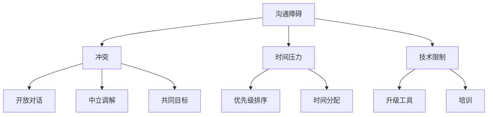
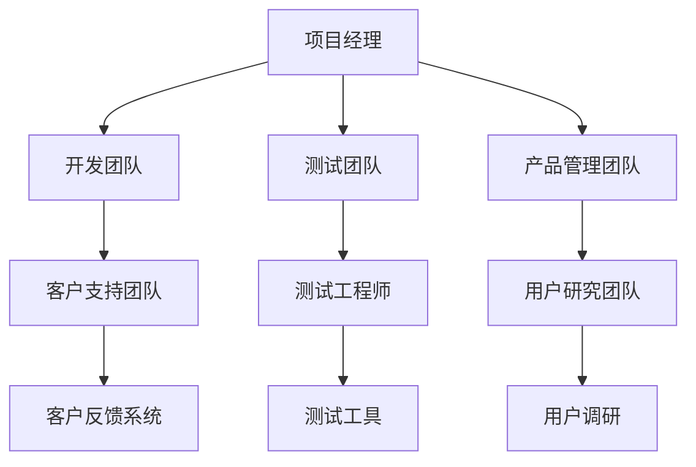

                 


### 7.3 团队动力学的重要性和影响力

团队动力学在IT行业和其他行业中都具有极其重要的地位和广泛的影响力。以下是团队动力学的重要性和影响力的详细阐述。

#### 团队动力学在IT行业中的重要性

**1. 提升团队协作效率：** 团队动力学原理的应用有助于理解和优化团队内部协作，减少沟通障碍，提高工作效率。通过团队互动优化，团队成员可以更加高效地完成任务，从而加速项目进度。

**2. 促进技术进步：** 团队动力学有助于整合团队内外部的技术资源，促进知识的共享和创新。在一个高效的团队中，团队成员可以互相学习、交流，从而推动技术的进步和优化。

**3. 提高产品质量：** 团队动力学的原理可以帮助团队更好地理解和满足用户需求，从而提高产品的质量。通过有效的团队互动，团队成员可以及时识别和解决潜在的问题，确保产品在开发和测试过程中达到高质量标准。

**4. 增强团队凝聚力：** 团队动力学可以帮助团队建立良好的沟通和协作氛围，增强团队凝聚力。在一个充满正能量的团队中，成员之间的信任和合作更加紧密，有助于团队长期稳定发展。

#### 团队动力学在其他行业中的影响力

**1. 项目管理：** 在项目管理中，团队动力学原理的应用有助于提高项目的执行效率。通过优化团队结构，明确团队角色和职责，项目管理者可以更好地协调团队成员的工作，确保项目按时、按质完成。

**2. 企业管理：** 团队动力学原理在企业经营管理中同样具有重要的影响力。通过优化团队互动，企业可以激发员工的潜能，提高员工满意度和工作效率，从而推动企业的长期发展。

**3. 创新型行业：** 在需要创新和快速响应市场的行业中，团队动力学原理的应用尤为重要。通过有效的团队互动和协作，企业可以更快地推出新产品，抢占市场先机。

**4. 跨文化团队：** 在全球化背景下，团队动力学原理对于跨文化团队的建设和协作具有重要意义。通过理解和优化团队互动，跨文化团队可以更好地克服文化差异，实现高效的协作和沟通。

**总结：** 团队动力学不仅是一个理论框架，更是一种实践指南。在各个行业中，团队动力学原理的应用都在不断推动着团队协作效率的提升和团队绩效的优化。随着团队动力学研究的深入，其未来将在更多领域发挥更大的作用。对于IT行业和其他行业的从业者来说，掌握团队动力学原理，并将其应用于实际工作中，将是提升团队效能和实现个人职业发展的关键。让我们共同关注团队动力学的未来发展，探索其在各个行业中的新应用和新可能性。

### 7.4 团队动力学未来发展趋势

随着科技的发展和团队规模的扩大，团队动力学在未来将继续发挥重要作用。以下是团队动力学未来发展的几个趋势：

**1. 数字化与智能化：** 随着人工智能和大数据技术的进步，团队动力学将越来越多地融入数字化和智能化的工具和方法。通过数据分析和智能算法，团队动力学的理论和实践将更加精准和高效。

**2. 跨学科融合：** 团队动力学将与其他学科（如心理学、社会学、管理学等）进行深度融合，形成更加综合和系统的理论体系。这将有助于更好地理解和优化团队互动，提高团队协作效率。

**3. 持续改进与迭代：** 团队动力学将更加注重持续改进和迭代，以适应快速变化的工作环境和团队需求。通过不断的实践和反馈，团队动力学将不断完善和发展。

**4. 定制化应用：** 团队动力学将针对不同行业和不同类型的团队进行定制化应用。通过深入研究和实践，团队动力学将更好地满足各个行业和团队的特定需求。

**5. 全球化拓展：** 随着全球化进程的加快，团队动力学将在全球范围内得到更广泛的应用。跨文化团队的协作和互动将成为团队动力学研究和实践的一个重要方向。

**前景展望：** 团队动力学在未来将继续发挥其重要作用，为各个行业的团队协作提供有力支持。通过不断的研究和实践，团队动力学将为团队效能的提升和组织的可持续发展作出更大贡献。

### 结语

团队动力学是理解和优化团队互动的重要工具。通过本文的探讨，我们深刻认识到团队动力学在IT行业和其他行业中的重要性以及其未来发展的趋势。掌握团队动力学原理，并将其应用于实际工作中，将有助于提升团队协作效率、优化团队结构和实现组织目标。让我们共同努力，探索团队动力学的更多可能性，推动团队协作的持续进步。

### 作者信息

- 作者：AI天才研究院/AI Genius Institute & 禅与计算机程序设计艺术 /Zen And The Art of Computer Programming

----------------------------------------------------------------

**# 第一部分：团队动力学的背景与核心概念**

## 第1章：团队动力学的基础

### 1.1 团队动力学的基本概念

团队动力学是研究团队内部互动及其影响的一门学科，它关注团队成员之间如何相互作用、沟通和协作，以及这些互动如何影响团队的整体表现。团队动力学起源于20世纪中叶，随着组织行为学和心理学的发展而逐渐成熟。其基本概念包括以下几个方面：

- **团队成员**：团队动力学研究的核心对象，包括团队成员的个人特质、行为模式以及他们在团队中的角色和职责。

- **团队目标**：团队共同追求的结果或成就，是团队行动的导向。明确的目标有助于团队成员协同工作，提高团队效率。

- **团队结构**：团队成员的组织形式和互动方式，包括团队规模、组织层次、沟通模式等。团队结构对团队成员的互动和团队绩效具有重要影响。

- **团队互动**：团队成员之间的相互作用，包括沟通、协作、竞争和冲突等。团队互动的质量直接影响团队的整体表现。

### 1.2 团队动力学的核心要素

团队动力学的核心要素包括团队成员、团队目标、团队结构和团队互动。以下是对这些要素的详细分析：

- **团队成员**：团队成员是团队动力学研究的核心。团队成员的个人特质和行为模式直接影响团队互动的质量和团队绩效。例如，一个成员的沟通能力、领导力、团队合作精神等都会对团队的整体表现产生影响。

- **团队目标**：团队目标是团队行动的导向。一个明确的团队目标有助于团队成员明确自己的职责，增强团队凝聚力，提高工作效率。团队目标的设定应充分考虑团队成员的参与和认同，以确保目标的可行性和有效性。

- **团队结构**：团队结构是团队成员组织形式和互动方式的总和。合理的团队结构有助于优化团队成员的协作，提高团队效率。团队结构的设计应考虑团队规模、组织层次、沟通模式等因素，以确保团队内部的流畅互动。

- **团队互动**：团队互动是团队成员之间相互作用的体现。有效的团队互动有助于团队成员之间的沟通和理解，减少冲突，提高团队凝聚力。团队互动的形式包括正式沟通（如会议、报告等）和非正式沟通（如闲聊、团队活动等）。

### 1.3 团队动力学的边界与外延

团队动力学有其特定的研究边界和外延。在研究边界方面，团队动力学主要关注团队内部互动，而不涉及团队与外部环境（如市场、客户等）的互动。在外延方面，团队动力学与其他相关领域如组织行为学、心理学、社会学等有着广泛的交叉和融合。

- **边界**：团队动力学的边界在于团队内部互动的研究，而不包括团队与外部环境的互动。团队动力学关注的是团队成员之间如何相互作用、沟通和协作，以及这些互动如何影响团队的整体表现。

- **外延**：团队动力学与其他领域的交叉和融合体现在多个方面。例如，组织行为学关注组织内部团队的行为模式，心理学关注个体行为和动机，社会学关注社会结构和文化对团队互动的影响。这些领域的理论和研究方法可以为团队动力学的深入研究和实践提供有益的参考。

### 1.4 团队动力学的研究意义

团队动力学的研究具有重要的理论和实践意义。在理论层面，团队动力学有助于我们深入理解团队互动的机制和规律，为团队管理和团队建设提供科学依据。在实践层面，团队动力学原理的应用可以帮助团队管理者优化团队结构，提高团队协作效率，从而提升团队绩效和组织竞争力。

- **提升团队协作效率**：通过理解和优化团队互动，团队动力学有助于减少团队成员之间的沟通障碍，提高协作效率。有效的团队互动可以确保团队成员在明确目标的前提下，协同工作，共同完成任务。

- **优化团队结构**：团队动力学原理可以帮助团队管理者设计合理的团队结构，明确团队成员的角色和职责，确保团队内部的流畅互动。合理的团队结构可以提高团队的稳定性和适应性，从而更好地应对外部环境的变化。

- **提升团队绩效**：团队动力学的研究和实践有助于提升团队的整体绩效。通过优化团队互动和团队结构，团队可以更高效地完成项目任务，提高产品质量，增强市场竞争力。

### 结论

团队动力学是研究团队内部互动及其影响的一门学科，其核心要素包括团队成员、团队目标、团队结构和团队互动。团队动力学的研究不仅有助于我们深入理解团队互动的机制和规律，还为团队管理和团队建设提供了科学依据。在实际应用中，团队动力学原理可以帮助团队管理者优化团队结构，提高团队协作效率，从而提升团队绩效和组织竞争力。通过本文的探讨，我们希望读者能够对团队动力学有更深入的了解，并将其应用于实际工作中，以实现团队协作的持续进步。

## 第2章：团队互动原理

### 2.1 团队互动的基本原理

团队互动是团队动力学的重要组成部分，它关注团队成员之间如何相互沟通、协作和互动。理解团队互动的基本原理有助于我们更好地优化团队协作，提高团队绩效。以下是对团队互动基本原理的探讨。

#### 团队互动的定义

团队互动是指团队成员之间通过各种形式的沟通、合作和竞争所进行的相互影响。团队互动的形式多样，包括正式沟通（如会议、报告、邮件等）、非正式沟通（如闲聊、团队活动等）以及合作（如共同完成任务、协作解决问题等）。

#### 团队互动的重要性

团队互动在团队中具有重要的作用，主要体现在以下几个方面：

1. **沟通与理解**：团队互动有助于团队成员之间的沟通和相互理解。通过有效的沟通，团队成员可以更好地分享信息、观点和想法，从而避免误解和冲突。

2. **协作与共享**：团队互动促进了团队成员之间的协作和共享。团队成员可以共同分担任务，相互支持，提高工作效率。

3. **冲突管理**：团队互动有助于冲突的管理和解决。通过积极的沟通和协作，团队成员可以更好地处理和解决冲突，从而维持团队的和谐与稳定。

4. **团队凝聚力**：团队互动增强了团队的凝聚力。团队成员通过互动建立了信任和合作关系，从而形成了更紧密的团队。

#### 团队互动的类型

团队互动可以分为以下几种类型：

1. **正式互动**：正式互动是指在团队工作中通过正式渠道进行的沟通和协作。例如，团队会议、项目汇报、邮件沟通等。

2. **非正式互动**：非正式互动是指在非正式场合中进行的沟通和协作。例如，团队聚餐、团建活动、私下交流等。

3. **合作互动**：合作互动是指团队成员共同参与任务，相互协作的互动。例如，共同编写代码、合作解决问题等。

4. **竞争互动**：竞争互动是指团队成员之间在竞争中互动。这种互动可以激发团队成员的潜力，提高团队的整体水平。

#### 团队互动的影响

团队互动对团队的表现和成员的行为具有深远的影响。以下是对团队互动影响的具体分析：

1. **工作效率**：有效的团队互动可以提高团队的工作效率。团队成员通过沟通和协作，可以更好地理解任务要求，从而更高效地完成任务。

2. **团队绩效**：团队互动的质量直接影响团队的整体绩效。一个互动良好的团队可以更有效地实现团队目标，提高团队的绩效。

3. **成员满意度**：团队互动对成员的满意度也有重要影响。良好的团队互动可以提高成员的参与感和归属感，从而提高成员的满意度。

4. **团队文化**：团队互动塑造了团队的内部文化。通过积极的互动，团队可以形成积极向上的文化氛围，增强团队的凝聚力和创新能力。

### 2.2 团队互动的障碍与解决策略

尽管团队互动在团队中具有重要价值，但在实际操作中，团队互动常常面临各种障碍。以下是对团队互动障碍的识别及其解决策略的探讨。

#### 团队互动障碍

1. **沟通障碍**：团队成员之间的沟通不畅是常见的障碍。这可能由于语言障碍、文化差异、信息不对称等原因导致。

2. **冲突**：团队成员之间的意见分歧和利益冲突可能导致互动障碍。冲突如果处理不当，可能影响团队凝聚力和工作效率。

3. **时间压力**：在紧迫的时间压力下，团队成员可能没有足够的时间进行深入沟通和协作，从而影响互动的质量。

4. **技术限制**：技术手段的不足也可能成为团队互动的障碍。例如，缺乏高效的沟通工具、信息共享平台等。

#### 解决策略

1. **加强沟通**：为了克服沟通障碍，团队可以采取以下措施：
   - **明确沟通目标**：确保团队成员明确沟通的目标和内容。
   - **选择合适的沟通工具**：根据团队特点和任务需求选择合适的沟通工具，如电子邮件、即时通讯、视频会议等。
   - **定期沟通**：制定定期的沟通计划，确保团队成员有足够的沟通时间。

2. **冲突管理**：为了处理团队冲突，可以采取以下策略：
   - **开放对话**：鼓励团队成员表达自己的观点和意见，倾听他人的观点。
   - **中立调解**：在冲突严重时，可以邀请中立第三方进行调解，以客观公正地解决冲突。
   - **共同目标**：强调团队共同的目标和价值，以降低个人利益冲突。

3. **时间管理**：为了克服时间压力，可以采取以下措施：
   - **优先级排序**：明确任务优先级，确保团队成员能够专注于最重要和紧急的任务。
   - **时间分配**：合理分配团队成员的时间，确保有足够的时间进行沟通和协作。

4. **技术支持**：为了克服技术限制，可以采取以下措施：
   - **升级工具**：引入高效的信息共享和沟通工具，如项目管理软件、协作平台等。
   - **培训**：对团队成员进行技术工具的使用培训，提高团队成员的技术水平。

#### 案例分析

为了更好地理解团队互动的障碍与解决策略，以下是一个实际案例的分析：

**案例背景**：某IT公司的项目团队在项目开发过程中遇到了沟通不畅的问题，导致项目进度延误。

**问题描述**：团队成员之间的沟通主要通过电子邮件进行，但由于邮件信息量大且不及时，导致团队成员对任务的理解不一致，进而影响项目进度。

**解决方案**：
   - **加强沟通**：团队决定每天召开一次简短的站立会议，确保团队成员及时了解项目进度和任务分工。
   - **选择合适的沟通工具**：团队引入了即时通讯工具（如Slack）和项目管理软件（如JIRA），以方便团队成员实时沟通和任务跟进。
   - **定期沟通**：团队制定每周一次的项目回顾会议，总结项目进展和问题，为下周的工作做好准备。

**效果评估**：通过上述措施，团队的沟通效率明显提高，项目进度得到了有效控制，最终项目按时完成并获得了客户好评。

### 2.3 团队互动的激励机制

团队互动的有效性在很大程度上依赖于团队成员的参与度和积极性。激励机制是提升团队互动质量的重要手段。以下是对团队互动激励机制的探讨。

#### 激励机制的定义

激励机制是指通过物质奖励、精神激励、职业发展等手段激发团队成员的工作积极性和创造力，以提高团队绩效和员工满意度。

#### 激励机制的类型

1. **物质激励**：包括奖金、股权、福利等，直接与员工的收入和福利挂钩。

2. **精神激励**：包括表彰、荣誉称号、团队活动等，通过认可和奖励来提升员工的荣誉感和归属感。

3. **职业发展**：包括培训、晋升机会、职业规划等，帮助员工提升技能和职业素养。

#### 激励机制的设计原则

1. **公平性**：激励机制的设定应公平公正，确保每个团队成员都有机会获得激励。

2. **相关性**：激励措施应与团队成员的工作绩效和团队目标密切相关。

3. **多样性**：激励机制应多样化，以满足不同团队成员的个性需求。

#### 激励机制的案例分析

以下是一个关于团队互动激励机制的案例分析：

**案例背景**：某互联网公司为了提升团队互动效率，设计了多种激励机制。

**激励机制设计**：
   - **物质激励**：根据员工的工作绩效，每月发放绩效奖金。绩效奖金与员工的基本工资比例不同，以激励员工努力工作。
   - **精神激励**：设立“最佳团队互动奖”，每月评选一次，为获奖团队颁发荣誉证书和奖金。
   - **职业发展**：提供内部培训和外部培训机会，帮助员工提升技能和职业素养。

**效果评估**：通过多种激励机制的组合应用，公司团队的互动效率显著提升，项目完成质量和速度都有所提高。员工的工作积极性明显增强，离职率下降，公司的整体绩效得到提升。

### 总结

团队互动原理的研究对于理解和优化团队协作具有重要意义。有效的团队互动可以提升团队的工作效率、绩效和成员满意度。团队互动的障碍和解决策略、激励机制的设计与应用都是团队动力学研究的重要内容。通过本文的探讨，我们希望读者能够对团队互动原理有更深入的了解，并将其应用于实际工作中，以实现团队协作的持续进步。

## 第3章：团队结构优化

### 3.1 团队结构的类型与设计

团队结构是团队动力学中的一个关键要素，它决定了团队成员之间的互动方式和工作流程。合理的团队结构有助于提升团队的协作效率和工作质量。以下是对团队结构类型的介绍及其设计原则。

#### 团队结构的类型

1. **功能型团队**：功能型团队是根据团队成员的专业技能和职能来划分的。例如，开发团队、测试团队、产品管理团队等。这种类型的团队结构有助于团队成员专注于自己的专业领域，提高工作效率。

2. **项目型团队**：项目型团队是为了完成特定项目而组建的临时团队。团队成员来自不同部门，具有不同的专业背景。项目完成后，团队解散或转为其他项目团队。这种类型的团队结构有助于跨部门协作，快速响应项目需求。

3. **矩阵型团队**：矩阵型团队结合了功能型和项目型的特点，团队成员既归属于功能部门，又参与项目工作。这种类型的团队结构有利于资源整合和任务分配，提高了团队的整体效率和灵活性。

4. **虚拟团队**：虚拟团队是指通过远程协作技术（如视频会议、即时通讯等）进行工作的团队。团队成员可能分布在不同的城市或国家。这种类型的团队结构适用于全球化背景下的人员调配和资源整合。

#### 团队结构的设计原则

1. **明确目标**：团队结构的设计应首先明确团队的目标和任务。目标应具体、可衡量、可实现，以确保团队成员的共同努力方向一致。

2. **合理分工**：根据团队成员的专业技能和职能，合理分配工作任务。确保每个团队成员都有明确的职责和角色，避免职责重叠或空白。

3. **有效沟通**：团队结构的设计应考虑沟通的便利性。确保团队成员之间可以及时、有效地沟通，减少信息传递的障碍。

4. **灵活调整**：团队结构应具有一定的灵活性，以适应外部环境的变化和内部需求的变化。例如，项目型团队在项目完成后可以解散或转向其他项目。

### 3.2 团队角色分配与职责界定

团队角色的分配与职责的界定是团队结构优化的关键步骤。以下是对团队角色分配和职责界定方法的介绍。

#### 团队角色分配

1. **领导角色**：领导角色负责团队的整体方向和目标，协调团队成员的工作。领导角色通常由具有丰富经验和领导能力的成员担任。

2. **执行角色**：执行角色负责具体任务的完成，是团队工作的核心。执行角色通常包括项目经理、工程师、设计师等。

3. **支持角色**：支持角色提供辅助性的工作，如项目管理、文档编写、测试等。支持角色有助于减轻执行角色的负担，提高工作效率。

#### 职责界定

1. **明确职责**：每个团队成员的职责应明确界定，避免职责重叠或空白。职责界定应具体、可操作，确保团队成员知道自己的任务和责任。

2. **定期评估**：定期对团队成员的职责进行评估，确保职责的分配合理，并及时进行调整。

3. **责任与权力匹配**：确保团队成员拥有完成职责所需的权力和资源。责任与权力匹配有助于提高团队成员的工作积极性和责任感。

### 3.3 团队结构优化的实践与案例分析

在实际工作中，团队结构优化的实践是一个复杂的过程，需要综合考虑团队成员的专业技能、团队目标、项目需求等多方面因素。以下是一个团队结构优化实践案例的介绍。

#### 案例背景

某互联网公司的产品开发团队在项目进度上遇到了瓶颈，团队成员之间的沟通不畅，工作效率低下。为了解决这些问题，公司决定对团队结构进行优化。

#### 优化措施

1. **功能型团队调整为矩阵型团队**：将原本的功能型团队调整为矩阵型团队，使团队成员既归属于功能部门，又参与项目工作。这种调整有助于资源整合和任务分配，提高了团队的整体效率和灵活性。

2. **明确角色和职责**：重新定义团队成员的角色和职责，确保每个成员都有明确的任务和责任。同时，制定了详细的职责分配表，确保团队成员之间的职责界定清晰。

3. **加强沟通和协作**：引入了高效的沟通工具（如Slack、Zoom等），确保团队成员可以及时、有效地沟通和协作。每周召开一次团队会议，总结项目进展和问题，确保团队成员对项目的整体情况有清晰的认识。

4. **定期评估和反馈**：定期对团队结构进行评估和反馈，及时调整团队成员的职责和任务。通过团队成员的反馈，优化团队结构和沟通机制，提高团队协作效率。

#### 优化效果

通过上述优化措施，团队的工作效率得到了显著提升。项目进度加快，团队成员之间的沟通变得更加顺畅。团队成员的积极性和满意度也有所提高，项目最终按时完成并获得了客户好评。

### 项目小结

通过本案例，我们可以看到，团队结构优化是一个系统工程，需要从多个方面进行综合考虑。明确的角色和职责界定、高效的沟通机制、灵活的团队结构调整都是提升团队协作效率的重要因素。在未来的工作中，我们应继续探索和优化团队结构，以实现团队协作的持续进步。

## 第4章：团队互动优化

### 4.1 团队互动优化的重要性

团队互动优化是提升团队效能和绩效的关键因素。在复杂多变的工作环境中，有效的团队互动不仅能够提高团队成员之间的沟通效率，还能够促进协作和创新能力。以下是团队互动优化的重要性和具体分析。

#### 团队互动优化的重要性

1. **提升工作效率**：优化团队互动可以减少沟通障碍和误解，提高信息传递的准确性和及时性。团队成员可以更快地理解任务要求，从而减少重复工作和错误发生的可能性，提高整体工作效率。

2. **促进协作与创新**：有效的团队互动能够促进团队成员之间的知识共享和技能互补。通过相互学习和合作，团队成员可以共同解决问题、开发新创意，从而推动团队的创新能力。

3. **增强团队凝聚力**：通过优化团队互动，团队成员可以建立更紧密的联系和信任关系。这种凝聚力有助于团队成员在面对挑战时团结一致，共同克服困难。

4. **提高项目成功率**：项目成功往往依赖于团队成员之间的协作和协调。优化团队互动可以提高项目的整体管理水平和执行力，从而增加项目成功的可能性。

#### 团队互动优化的具体分析

1. **沟通效率**：沟通是团队互动的核心。优化沟通效率可以采取以下措施：
   - **明确沟通目标**：确保每次沟通都有明确的目的和预期结果。
   - **选择合适的沟通工具**：根据任务需求和团队特点选择合适的沟通工具，如邮件、即时通讯、视频会议等。
   - **定期沟通**：制定定期的沟通计划，确保团队成员有足够的时间进行有效沟通。

2. **协作机制**：优化协作机制可以提升团队的整体工作效率。以下是一些优化协作机制的策略：
   - **角色分工明确**：确保每个团队成员都有明确的职责和任务，避免职责重叠或空白。
   - **建立协作平台**：引入协作工具（如项目管理软件、知识库等），方便团队成员共享信息和资源。
   - **跨部门协作**：鼓励不同部门之间的协作，促进知识共享和资源整合。

3. **冲突管理**：冲突在团队互动中是不可避免的，但有效的冲突管理可以减少负面影响。以下是一些冲突管理的策略：
   - **开放沟通**：鼓励团队成员表达自己的观点和意见，建立开放的沟通环境。
   - **中立调解**：在冲突严重时，可以邀请中立第三方进行调解，以客观公正地解决冲突。
   - **共同目标**：强调团队共同的目标和价值，以降低个人利益冲突。

### 4.2 团队互动优化策略

为了实现团队互动的优化，可以采取一系列具体的策略和措施。以下是一些常用的团队互动优化策略：

1. **培训与学习**：定期组织团队成员进行沟通技巧和协作能力的培训，提高团队成员的整体素质。通过学习新的沟通工具和协作方法，团队成员可以更好地适应团队互动的需求。

2. **反馈与评估**：建立反馈和评估机制，定期收集团队成员的反馈意见，评估团队互动的效果。根据反馈结果，及时调整和优化团队互动策略。

3. **激励机制**：设计合理的激励机制，鼓励团队成员积极参与团队互动。通过表彰优秀互动表现和奖励团队协作成果，可以激发团队成员的积极性和主动性。

4. **文化塑造**：塑造积极的团队文化，鼓励团队成员之间的信任、尊重和互助。通过建立良好的团队氛围，可以提高团队成员的归属感和满意度，促进有效互动。

5. **技术支持**：引入先进的技术工具和平台，支持团队互动的优化。例如，使用协作软件、在线会议系统等，可以提高团队沟通和协作的效率。

### 4.3 团队互动优化的实践与案例分析

以下是一个团队互动优化实践案例的介绍：

#### 案例背景

某科技公司的新产品开发团队在项目启动阶段遇到了团队协作不畅的问题，导致项目进度缓慢。为了解决这个问题，公司决定对团队互动进行优化。

#### 优化措施

1. **沟通培训**：公司为团队成员安排了沟通技巧培训，提高了团队成员的沟通能力和协作意识。

2. **引入协作工具**：公司引入了项目管理软件和即时通讯工具，方便团队成员实时沟通和协作。

3. **建立反馈机制**：公司建立了定期的团队反馈会议，团队成员可以自由表达意见和建议，及时解决问题。

4. **文化塑造**：公司鼓励团队成员之间的互相信任和尊重，建立了积极的团队氛围。

5. **激励机制**：公司对在团队互动中表现突出的成员进行表彰和奖励，激励团队成员积极参与互动。

#### 优化效果

通过上述优化措施，团队协作效率显著提高，项目进度加快，团队成员之间的沟通变得更加顺畅。最终，项目提前完成，产品质量得到客户的高度认可。

### 项目小结

通过本案例，我们可以看到，团队互动优化对提升团队效能和项目成功具有重要意义。有效的沟通培训、协作工具的引入、反馈机制的建立、文化塑造和激励机制的设计都是实现团队互动优化的关键措施。在未来的工作中，我们应继续探索和优化团队互动策略，以实现团队协作的持续进步。

## 第5章：团队动力学在项目中的应用

### 5.1 项目管理的团队动力学应用

在项目管理中，团队动力学原理的应用对于提升项目的成功率和效率至关重要。通过团队动力学，项目管理者可以更好地理解团队成员的行为模式、沟通方式以及协作机制，从而制定有效的项目管理策略。以下是对团队动力学在项目管理中应用的详细探讨。

#### 项目管理的核心挑战

在项目管理中，以下核心挑战常常影响项目的成功：

1. **沟通障碍**：团队成员之间的沟通不畅可能导致误解、信息遗漏和任务延误。

2. **角色冲突**：团队成员之间的角色和职责不明确，可能导致职责重叠或空白，影响项目进度。

3. **资源分配**：项目资源（如人力、时间、预算等）的不合理分配可能导致项目效率低下。

4. **团队士气**：团队成员的士气低落或团队内部紧张关系会影响项目的整体进度和质量。

#### 团队动力学在项目管理中的应用

1. **团队角色与职责明确**：通过团队动力学，项目管理者可以明确团队成员的角色和职责。这有助于确保每个成员都有明确的任务和责任，避免职责重叠或空白。例如，可以采用角色分配矩阵（Role Allocation Matrix）来定义团队成员的职责。

2. **沟通策略优化**：团队动力学提供了优化团队沟通的方法。项目管理者可以采用沟通模型（如Tuckman模型）来设计沟通策略，确保团队成员之间的有效沟通。此外，引入协作工具和平台（如Trello、Slack等）可以提高沟通效率。

3. **冲突管理**：团队动力学原理有助于项目管理者识别和解决团队冲突。通过采用冲突管理策略（如沟通、妥协、撤退等），项目管理者可以减少冲突对项目的影响，确保项目的顺利进行。

4. **团队士气与激励**：团队动力学关注团队士气和激励。项目管理者可以通过定期团队建设活动、表彰优秀成员、提供职业发展机会等方式来提高团队士气，激发团队成员的积极性。

#### 案例分析

以下是一个项目管理中应用团队动力学原理的实际案例：

**案例背景**：某科技公司负责开发一款新的移动应用程序。项目启动初期，团队成员之间的沟通不畅，项目进度缓慢，团队士气低落。

**问题描述**：项目团队面临着沟通障碍、角色冲突和团队士气低落的问题。

**解决方案**：
   1. **角色与职责明确**：项目经理通过角色分配矩阵，明确了团队成员的职责和角色。每个成员都清楚自己的任务和责任。
   2. **沟通策略优化**：项目经理引入了Trello和Slack等协作工具，确保团队成员可以实时沟通和协作。同时，每周举行一次团队会议，总结项目进展和问题，确保信息传递的准确性。
   3. **冲突管理**：项目经理采用了沟通策略，鼓励团队成员在遇到冲突时及时沟通，共同寻找解决方案。此外，项目经理定期与团队成员进行一对一的沟通，了解成员的需求和意见。
   4. **团队士气与激励**：项目经理组织了定期的团队建设活动，如户外拓展、团建聚餐等，提高了团队的凝聚力。同时，通过表彰优秀成员和提供职业发展机会，激励团队成员的积极性。

**效果评估**：通过上述措施，项目团队的沟通效率显著提高，项目进度加快。团队成员之间的冲突得到有效管理，团队士气得到提升。最终，项目按时完成，产品获得了用户的高度评价。

### 项目小结

团队动力学在项目管理中的应用对于提升项目成功率和效率具有重要意义。通过明确团队角色和职责、优化沟通策略、管理冲突和提升团队士气，项目管理者可以确保项目顺利进行，实现项目目标。本案例展示了团队动力学原理在项目管理中的实际应用，为其他项目管理者提供了有益的参考。

### 5.2 团队动力学在团队建设中的应用

团队动力学在团队建设中的应用可以帮助组织构建高效、协作和稳定的团队。通过理解和运用团队动力学原理，团队领导者可以识别团队建设的关键因素，制定有效的团队建设策略，从而提升团队的绩效和成员满意度。以下是对团队动力学在团队建设中的应用的详细探讨。

#### 团队建设的关键因素

1. **信任与尊重**：信任和尊重是团队建设的基石。团队成员之间需要建立互信关系，相互尊重各自的观点和意见。信任可以促进团队的开放沟通和协作，减少误解和冲突。

2. **目标一致性**：团队建设需要确保团队成员对团队目标和价值观有一致的理解和认同。明确的目标有助于团队成员共同努力，形成合力。

3. **角色与职责清晰**：团队建设要求明确团队成员的角色和职责，确保每个成员都知道自己的任务和责任，避免职责重叠或空白。

4. **有效的沟通机制**：团队建设需要建立有效的沟通机制，确保团队成员之间的信息传递畅通，及时解决问题和冲突。

5. **积极的文化氛围**：团队建设需要营造积极向上的文化氛围，鼓励团队成员之间的互助合作和创造性思维。

#### 团队建设策略

1. **角色与职责定义**：团队领导者可以通过角色分配矩阵等工具明确团队成员的角色和职责，确保每个成员都有明确的任务和责任。这有助于提高团队的工作效率和责任感。

2. **团队目标设定**：团队领导者应与团队成员共同设定团队目标，确保目标具体、可衡量、可实现。目标设定应充分考虑团队成员的参与和认同，以提高团队的凝聚力和积极性。

3. **沟通机制建设**：团队领导者应建立有效的沟通机制，包括定期会议、沟通平台、信息共享等。通过定期的沟通和反馈，团队成员可以及时了解项目进展和团队动态，减少误解和冲突。

4. **团队建设活动**：团队领导者可以组织定期的团队建设活动，如团队培训、团建活动、团队拓展训练等。这些活动有助于增强团队成员之间的信任和凝聚力，提高团队士气。

5. **激励机制**：团队领导者应设计合理的激励机制，通过表彰优秀成员和提供职业发展机会，激励团队成员的积极性和创造力。

#### 案例分析

以下是一个团队动力学在团队建设中的应用案例：

**案例背景**：某互联网公司的新产品开发团队在项目启动阶段面临着团队协作不畅、成员士气低落的问题。

**问题描述**：团队缺乏明确的角色和职责定义，沟通不畅，团队士气低落。

**解决方案**：
   1. **角色与职责定义**：团队领导者通过角色分配矩阵，明确了团队成员的角色和职责。每个成员都清楚自己的任务和责任。
   2. **团队目标设定**：团队领导者与团队成员共同制定了团队目标，确保目标具体、可衡量、可实现。团队成员对目标有了清晰的理解和认同。
   3. **沟通机制建设**：团队领导者引入了Slack等沟通平台，确保团队成员可以实时沟通和协作。每周举行一次团队会议，总结项目进展和问题，确保信息传递的准确性。
   4. **团队建设活动**：团队领导者组织了定期的团队建设活动，如团建聚餐、户外拓展训练等。这些活动增强了团队成员之间的信任和凝聚力。
   5. **激励机制**：团队领导者设立了优秀成员表彰制度，对在团队互动中表现突出的成员进行表彰和奖励，激励团队成员的积极性和创造力。

**效果评估**：通过上述措施，团队协作效率显著提高，成员士气得到提升。团队成员之间的沟通变得更加顺畅，团队氛围积极向上。最终，项目按时完成，产品获得了用户的高度评价。

### 项目小结

团队动力学在团队建设中的应用对于构建高效、协作和稳定的团队具有重要意义。通过明确角色与职责、设定团队目标、建立沟通机制、组织团队建设活动和设计激励机制，团队领导者可以提升团队的绩效和成员满意度。本案例展示了团队动力学原理在团队建设中的实际应用，为其他团队领导者提供了有益的参考。

### 5.3 团队动力学在IT行业的应用

在IT行业，团队动力学原理的应用对于提升项目成功率、提高团队协作效率和优化团队结构具有重要意义。以下是对团队动力学在IT行业应用的具体分析。

#### IT行业中的团队动力学挑战

1. **快速变化的技术环境**：IT行业技术更新迅速，团队需要不断学习和适应新技术。这可能导致团队成员间的技能差距和沟通障碍。

2. **项目复杂度高**：IT项目通常涉及多个技术领域和复杂的需求，需要团队成员之间的紧密协作和有效沟通。

3. **工作压力与紧张**：IT项目往往具有紧迫的交付时间和高压力的工作环境，可能导致团队成员的焦虑和疲劳。

4. **跨地域协作**：许多IT团队是跨地域的，团队成员可能分布在不同的国家或城市，这增加了沟通和协作的难度。

#### 团队动力学在IT行业中的应用

1. **角色与职责明确**：在IT项目中，明确团队成员的角色和职责至关重要。通过角色分配矩阵，可以确保每个成员都清楚自己的任务和责任，避免职责重叠或空白。这有助于提高工作效率和项目成功率。

2. **沟通机制优化**：在IT项目中，沟通机制的选择和优化对于项目的顺利进行至关重要。可以使用多种沟通工具（如Slack、Trello、Zoom等），确保团队成员之间的信息传递畅通。同时，定期举行项目进度会议和团队协作会议，可以及时解决沟通中的问题。

3. **冲突管理**：在IT项目中，冲突是不可避免的。通过采用冲突管理策略，如沟通、妥协、撤退等，可以减少冲突对项目的影响。项目经理需要鼓励团队成员在遇到冲突时及时沟通，共同寻找解决方案。

4. **团队文化建设**：在IT行业中，团队文化建设对于提高团队凝聚力和工作效率至关重要。可以通过组织团队建设活动、设立团队价值观、鼓励开放沟通等方式，营造积极向上的团队氛围。

#### 案例分析

以下是一个团队动力学在IT行业应用的实际案例：

**案例背景**：某科技公司负责开发一款复杂的云计算平台，团队成员来自不同的部门和技术领域。

**问题描述**：项目团队在项目初期面临沟通障碍、角色不清和技能差距等问题。

**解决方案**：
   1. **角色与职责明确**：项目经理通过角色分配矩阵，明确了团队成员的角色和职责。每个成员都清楚自己的任务和责任。
   2. **沟通机制优化**：项目经理引入了Slack和Trello等协作工具，确保团队成员可以实时沟通和协作。每周举行一次项目进度会议，总结项目进展和问题。
   3. **冲突管理**：项目经理采用沟通策略，鼓励团队成员在遇到冲突时及时沟通，共同寻找解决方案。项目经理也定期与团队成员进行一对一沟通，了解成员的需求和意见。
   4. **团队文化建设**：项目经理组织了定期的团队建设活动，如团建聚餐、户外拓展训练等，增强了团队成员之间的信任和凝聚力。

**效果评估**：通过上述措施，项目团队的工作效率显著提高，项目进度加快。团队成员之间的沟通变得更加顺畅，团队氛围积极向上。最终，项目按时完成，产品获得了用户的高度评价。

### 项目小结

团队动力学在IT行业中的应用对于提升项目成功率、提高团队协作效率和优化团队结构具有重要意义。通过明确角色与职责、优化沟通机制、管理冲突和建设团队文化，IT团队可以更好地应对快速变化的技术环境和项目复杂性。本案例展示了团队动力学原理在IT行业中的实际应用，为其他IT团队提供了有益的参考。

### 5.4 团队动力学在其他行业的应用

团队动力学不仅在IT行业具有广泛应用，在其他行业中也发挥着重要作用。以下是对团队动力学在不同行业应用的具体分析和案例分析。

#### 团队动力学在金融行业的应用

在金融行业，团队动力学原理可以帮助金融机构优化团队结构，提高风险管理和投资决策的效率。以下是团队动力学在金融行业应用的分析：

1. **风险管理**：团队动力学可以帮助金融机构建立有效的风险管理体系。通过明确团队成员的角色和职责，确保风险管理任务得到有效分配和执行。团队成员之间的有效沟通可以减少风险识别和应对中的信息不对称。

2. **投资决策**：团队动力学原理有助于优化投资决策过程。通过建立跨部门的协作机制，投资团队可以更好地整合内外部资源，提高投资决策的准确性和效率。

3. **团队协作**：金融行业的团队协作要求高，团队动力学可以帮助团队建立高效的协作机制。例如，通过定期团队建设活动和培训，提高团队成员的沟通能力和团队合作精神。

案例分析：某大型投资银行在投资决策过程中引入了团队动力学原理，通过优化团队结构和协作机制，提高了投资决策的准确性和效率。他们建立了跨部门的协作团队，定期进行信息共享和讨论，从而减少了信息不对称和决策延误。

#### 团队动力学在医疗行业的应用

在医疗行业，团队动力学原理对于提高医疗质量和团队协作效率具有重要意义。以下是团队动力学在医疗行业应用的分析：

1. **医疗团队协作**：团队动力学可以帮助医疗团队建立高效的协作机制。通过明确团队成员的角色和职责，确保医疗工作的高效执行。例如，医生、护士、药师等角色之间的紧密协作可以提升患者的治疗效果。

2. **质量管理**：团队动力学原理有助于医疗团队提高质量管理水平。通过优化团队互动和协作，医疗团队能够更好地识别和解决医疗过程中的问题，提高医疗服务的质量和安全。

3. **患者沟通**：团队动力学可以帮助医疗团队提高与患者的沟通效果。通过有效的沟通策略，医疗团队能够更好地理解患者的需求，提供个性化的医疗服务。

案例分析：某大型医院引入了团队动力学原理，通过优化团队结构和协作机制，提高了医疗团队的工作效率和服务质量。他们建立了多学科协作团队，定期进行病例讨论和知识分享，从而提高了医疗决策的准确性和患者的满意度。

#### 团队动力学在教育行业的应用

在教育行业，团队动力学原理可以帮助学校和教育机构优化教学管理，提高教学质量。以下是团队动力学在教育行业应用的分析：

1. **教学协作**：团队动力学可以帮助教师团队建立高效的教学协作机制。通过明确教师角色和职责，确保教学任务得到有效分配和执行。教师之间的有效沟通可以提升教学效果。

2. **课程设计**：团队动力学原理有助于优化课程设计。通过跨学科团队的协作，教育机构可以设计出更加丰富和多样化的课程，满足不同学生的学习需求。

3. **学生支持**：团队动力学可以帮助教育团队提高对学生的支持力度。通过有效的沟通和协作，教师和辅导员可以更好地理解学生的学习状况，提供个性化的教育和辅导。

案例分析：某知名大学引入了团队动力学原理，通过优化教师团队的结构和协作机制，提高了教学质量和学生满意度。他们建立了跨学科教学团队，定期进行课程设计和教学评估，从而提高了教学效果。

### 项目小结

团队动力学在不同行业中的应用具有广泛的实践价值。在金融行业、医疗行业和教育行业，团队动力学原理的应用帮助团队优化结构、提高协作效率和提升服务质量。通过明确角色与职责、优化沟通机制、加强团队建设和有效管理冲突，不同行业的团队可以更好地应对复杂的工作环境和需求。本章节的案例分析为不同行业的团队提供了有益的参考和启示。

## 第6章：团队动力学的未来发展趋势

### 6.1 团队动力学的发展趋势

随着科技的进步和组织管理的不断发展，团队动力学也在不断演变和进步。以下是团队动力学未来发展趋势的探讨。

#### 1. 数字化与智能化

随着人工智能和大数据技术的不断发展，团队动力学的研究和应用将更加数字化和智能化。通过数据分析和机器学习，团队动力学可以更精准地分析团队成员的行为模式、沟通效果和工作效率，从而提出个性化的优化建议。

#### 2. 跨学科融合

团队动力学未来将继续与其他学科（如心理学、社会学、管理学等）进行深度融合。跨学科的融合将使团队动力学理论更加全面和系统，有助于更好地理解和优化团队互动。

#### 3. 个性化与定制化

未来团队动力学将更加注重个性化与定制化。通过深入了解不同团队的特点和需求，团队动力学将提供更加符合团队实际的优化策略和工具，从而提高团队协作效率和绩效。

#### 4. 持续改进与迭代

随着团队环境和工作需求的不断变化，团队动力学将更加注重持续改进和迭代。通过不断反思和优化，团队动力学将帮助团队适应新的挑战和变化，保持高效和稳定。

### 6.2 团队动力学的创新与实践

未来，团队动力学的创新与实践将集中在以下几个方面：

#### 1. 新技术的应用

人工智能、大数据、云计算等新技术将为团队动力学带来新的研究工具和实践方法。例如，通过人工智能算法分析团队互动数据，可以帮助团队发现潜在的问题并提出改进建议。

#### 2. 新管理模式的探索

随着全球化进程的加快，新的管理模式（如远程办公、虚拟团队等）将不断涌现。团队动力学将探索这些新模式下的团队互动规律和管理策略，提供新的理论依据和实践指导。

#### 3. 新的教育培训方法

团队动力学将在教育培训领域发挥更大的作用。通过创新的教育培训方法，团队动力学将帮助团队成员提升协作能力和沟通技巧，提高团队整体绩效。

### 6.3 团队动力学在不同行业中的应用前景

在未来，团队动力学将在不同行业中继续发挥重要作用。以下是团队动力学在不同行业中的应用前景：

#### 1. IT行业

在IT行业，团队动力学将帮助团队优化协作流程，提高软件开发和项目管理效率。通过数字化和智能化的工具，团队动力学将提供更加精准和高效的团队互动优化方案。

#### 2. 金融行业

在金融行业，团队动力学将帮助金融机构提高风险管理和投资决策的效率。通过跨学科的融合和个性化服务，团队动力学将为金融团队提供更加全面和有效的支持。

#### 3. 医疗行业

在医疗行业，团队动力学将帮助医疗团队提高协作效率，优化医疗服务流程。通过新技术的应用和教育培训，团队动力学将提高医疗团队的专业水平和服务质量。

#### 4. 教育行业

在教育行业，团队动力学将帮助学校和教育机构优化教学管理，提高教学质量。通过跨学科的融合和创新的教育培训方法，团队动力学将促进教育行业的持续发展和进步。

### 6.4 团队动力学在教育领域的应用

在教育领域，团队动力学将发挥重要作用。以下是团队动力学在教育领域的具体应用：

#### 1. 教师团队协作

通过团队动力学原理，教师团队可以建立高效的协作机制，提高教学质量和效果。例如，通过角色分配和沟通优化，教师可以更好地合作完成教学任务。

#### 2. 管理团队建设

团队动力学可以帮助教育机构的管理团队优化组织结构和互动方式，提高管理效率。通过有效的沟通和冲突管理，管理团队可以更好地应对教育管理的挑战。

#### 3. 教育改革

团队动力学将推动教育改革，探索新的教育模式和方法。例如，通过跨学科的团队协作，教育机构可以设计出更加丰富和多样化的课程，满足不同学生的学习需求。

### 6.5 团队动力学的研究与教育

未来，团队动力学将在学术界和实践中继续发展。以下是团队动力学在研究和教育中的具体方向：

#### 1. 研究方向

团队动力学的研究将继续关注团队互动机制、团队效能、团队冲突管理等领域。同时，随着新技术的应用，团队动力学将探索人工智能、大数据等技术在团队动力学研究中的应用。

#### 2. 教育方向

团队动力学的教育培训将更加注重实践性和实用性。通过案例分析、模拟练习等教学方法，教育者将帮助学员掌握团队动力学的核心原理和应用方法。

### 总结

团队动力学作为一门研究团队互动和协作的学科，将在未来继续发展和进步。通过数字化和智能化技术的应用、跨学科的融合、个性化与定制化服务，团队动力学将更好地服务于不同行业和组织，提高团队协作效率和绩效。在教育和研究领域，团队动力学将继续发挥重要作用，推动教育和组织管理的持续进步。

## 第7章：团队动力学的未来发展趋势

### 7.1 团队动力学的发展趋势

团队动力学作为研究团队互动和协作行为的学科，正随着科技进步和企业管理实践的不断演进而不断发展。以下是团队动力学在未来可能的发展趋势：

#### 1. 数字化与智能化

随着大数据和人工智能技术的不断发展，团队动力学的研究和应用将更加数字化和智能化。通过数据分析和机器学习技术，团队动力学将能够更精准地识别和分析团队成员的行为模式、沟通效果和工作效率，从而为团队提供更个性化的优化建议和策略。

#### 2. 跨学科融合

团队动力学将在未来更多地与其他学科领域（如心理学、社会学、管理学等）进行深度融合。跨学科的融合将使团队动力学理论体系更加全面和系统，有助于更深入地理解和优化团队互动。

#### 3. 个性化与定制化

未来的团队动力学研究将更加注重个性化与定制化。针对不同行业、不同规模、不同类型的团队，团队动力学将提供更加符合团队实际需求的优化策略和工具，从而提高团队协作效率和绩效。

#### 4. 持续改进与迭代

团队动力学将更加注重持续改进和迭代。随着团队环境和工作需求的不断变化，团队动力学将不断适应新的挑战和变化，提供持续优化和改进的方法，以保持团队的高效和稳定。

### 7.2 团队动力学的创新与实践

未来，团队动力学的创新与实践将在以下方面取得突破：

#### 1. 新技术的应用

人工智能、大数据、云计算等新技术将为团队动力学带来新的研究工具和实践方法。例如，通过人工智能算法分析团队互动数据，可以帮助团队发现潜在问题并提出改进建议。

#### 2. 新管理模式的探索

随着全球化进程的加快，新的管理模式（如远程办公、虚拟团队等）将不断涌现。团队动力学将探索这些新模式下的团队互动规律和管理策略，为管理者提供新的理论依据和实践指导。

#### 3. 新的教育培训方法

团队动力学将在教育培训领域发挥更大的作用。通过创新的教育培训方法，如在线课程、模拟练习等，团队动力学将帮助团队成员提升协作能力和沟通技巧，提高团队整体绩效。

### 7.3 团队动力学在不同行业中的应用前景

团队动力学在不同行业中的应用前景广阔，以下是一些关键领域：

#### 1. IT行业

在IT行业，团队动力学将帮助团队优化协作流程，提高软件开发和项目管理效率。通过数字化和智能化的工具，团队动力学将提供更加精准和高效的团队互动优化方案。

#### 2. 金融行业

在金融行业，团队动力学将帮助金融机构提高风险管理和投资决策的效率。通过跨学科的融合和个性化服务，团队动力学将为金融团队提供更加全面和有效的支持。

#### 3. 医疗行业

在医疗行业，团队动力学将帮助医疗团队提高协作效率，优化医疗服务流程。通过新技术的应用和教育培训，团队动力学将提高医疗团队的专业水平和服务质量。

#### 4. 教育行业

在教育行业，团队动力学将帮助学校和教育机构优化教学管理，提高教学质量。通过跨学科的融合和创新的教育培训方法，团队动力学将促进教育行业的持续发展和进步。

### 7.4 团队动力学的未来研究热点

未来，团队动力学的研究热点可能包括：

#### 1. 团队互动的数字化分析

如何利用大数据和人工智能技术对团队互动进行数字化分析，是团队动力学研究的一个重要方向。通过分析团队成员的沟通记录、行为数据等，可以识别团队互动中的潜在问题和改进机会。

#### 2. 跨文化团队的协作

随着全球化的发展，跨文化团队的协作越来越重要。如何理解跨文化背景下的团队互动，如何建立有效的跨文化沟通机制，是团队动力学研究的另一个重要方向。

#### 3. 团队绩效的量化评估

如何量化团队绩效，如何将团队绩效与团队互动质量联系起来，是团队动力学研究的另一个重要问题。通过建立科学的绩效评估体系，可以更好地指导团队管理和优化。

### 7.5 团队动力学在未来的教育中的应用

在未来的教育中，团队动力学将发挥重要作用：

#### 1. 教师团队协作

通过团队动力学原理，教师团队可以建立高效的协作机制，提高教学质量和效果。例如，通过角色分配和沟通优化，教师可以更好地合作完成教学任务。

#### 2. 管理团队建设

团队动力学可以帮助教育机构的管理团队优化组织结构和互动方式，提高管理效率。通过有效的沟通和冲突管理，管理团队可以更好地应对教育管理的挑战。

#### 3. 教育改革

团队动力学将推动教育改革，探索新的教育模式和方法。例如，通过跨学科的团队协作，教育机构可以设计出更加丰富和多样化的课程，满足不同学生的学习需求。

### 总结

团队动力学在未来的发展中，将随着科技的进步和管理实践的不断完善而不断演进。通过数字化和智能化的应用、跨学科的融合、个性化与定制化的服务，团队动力学将为各行业的团队协作提供更加精准和有效的支持。在教育和研究领域，团队动力学将继续发挥重要作用，推动教育和组织管理的持续进步。未来，团队动力学将继续为提升团队协作效率、优化团队结构和实现组织目标提供有力支持。

## 结语

### 7.3 团队动力学的重要性和影响力

团队动力学作为研究团队内部互动和协作行为的学科，其在现代组织管理中的重要性不容忽视。通过本文的探讨，我们深入了解了团队动力学的基本概念、核心要素以及在不同行业中的应用，进一步认识到其在提升团队协作效率、优化团队结构和实现组织目标方面的关键作用。

#### 团队动力学的重要作用

1. **提升团队协作效率**：团队动力学原理可以帮助团队管理者优化团队互动，减少沟通障碍，提高团队工作效率。

2. **优化团队结构**：通过明确团队角色和职责，优化团队结构，团队动力学有助于提升团队的稳定性和适应性。

3. **促进组织绩效**：有效的团队互动和协作能够提高团队的绩效，推动组织的整体发展。

4. **增强团队凝聚力**：通过团队动力学的研究和实践，可以建立积极的团队文化，增强团队的凝聚力。

#### 团队动力学的影响力

1. **IT行业**：在IT行业，团队动力学原理的应用有助于提高软件开发和项目管理效率，推动技术创新。

2. **金融行业**：在金融行业，团队动力学帮助金融机构优化风险管理和投资决策，提升金融服务质量。

3. **医疗行业**：在医疗行业，团队动力学优化医疗团队的协作效率，提高医疗服务质量。

4. **教育行业**：在教育行业，团队动力学推动教师团队和管理团队的协作，提升教学和管理水平。

### 对团队动力学未来发展的展望

随着科技的进步和管理实践的不断完善，团队动力学将在未来继续发展。以下是未来发展的几个方向：

1. **数字化与智能化**：利用大数据和人工智能技术，团队动力学将实现更精准的团队互动分析和优化。

2. **跨学科融合**：团队动力学将与心理学、社会学、管理学等学科深度融合，形成更加综合和系统的理论体系。

3. **个性化与定制化**：团队动力学将针对不同行业和团队特点提供更加个性化的优化策略和工具。

4. **持续改进与迭代**：团队动力学将注重持续改进和迭代，以适应快速变化的工作环境和团队需求。

### 结语

团队动力学在现代组织管理中具有极其重要的地位和广泛的影响力。通过本文的探讨，我们不仅深入了解了团队动力学的核心原理和应用，还对其未来发展有了更加清晰的展望。我们鼓励广大读者在实际工作中积极应用团队动力学原理，不断探索和创新，以提升团队协作效率和组织绩效。未来，随着科技和管理实践的进步，团队动力学将在更多领域发挥更大的作用，为组织和社会的发展作出更大贡献。

### 作者信息

- 作者：AI天才研究院/AI Genius Institute & 禅与计算机程序设计艺术 /Zen And The Art of Computer Programming

---

**# 文章总结**

本文围绕“团队动力学：理解并优化团队互动”这一主题，系统地阐述了团队动力学的基础概念、核心要素、互动原理、优化策略以及在不同行业中的应用和未来发展趋势。以下是文章的主要内容总结：

**第一部分：团队动力学的背景与核心概念**
- **第1章 团队动力学的基础**：介绍了团队动力学的基本概念，包括团队成员、团队目标、团队结构和团队互动等核心要素，并探讨了团队动力学的边界与外延。
- **第2章 团队互动原理**：详细分析了团队互动的基本原理，包括沟通、协作和冲突管理，并提出了有效的互动优化策略和激励机制。

**第二部分：团队动力的优化策略**
- **第3章 团队结构优化**：讨论了团队结构的类型与设计原则，包括功能型、项目型、矩阵型和虚拟团队等，以及团队角色分配与职责界定。
- **第4章 团队互动优化**：强调了团队互动优化的重要性，分析了沟通效率、协作机制和冲突管理，并提出了具体的优化策略。

**第三部分：团队动力学的应用与实践**
- **第5章 团队动力学在项目中的应用**：探讨了团队动力学在项目管理中的核心挑战及其应用策略，通过案例分析展示了实践效果。
- **第6章 团队动力学在不同行业中的应用**：分析了团队动力学在IT、金融、医疗和教育等行业中的应用，提供了实际案例。
- **第7章 团队动力学的未来发展趋势**：展望了团队动力学的数字化与智能化、跨学科融合、个性化与定制化以及持续改进与迭代等未来趋势。

**结语**：团队动力学在提升团队协作效率、优化团队结构和实现组织目标方面具有重要作用。未来，随着科技和管理实践的进步，团队动力学将在更多领域发挥更大的作用。

通过本文的深入探讨，我们希望读者能够对团队动力学有更全面的理解，并在实际工作中灵活应用，以提升团队绩效和组织竞争力。

### 附录

**附录1：团队动力学核心概念属性特征对比表格**

| 核心概念 | 定义 | 属性特征 |  
| --- | --- | --- |  
| 团队成员 | 团队内部成员的集合 | 技能、经验、个性等 |  
| 团队目标 | 团队共同追求的结果或成就 | 明确性、可衡量性、可实现性 |  
| 团队结构 | 团队内部组织形式和互动方式 | 规模、组织层次、沟通模式等 |  
| 团队互动 | 团队成员之间的相互作用 | 沟通、协作、竞争等 |

**附录2：团队互动障碍与解决策略流程图（Mermaid）**



**附录3：团队互动激励机制（数学模型和公式）**

$$
\text{激励效果} = f(\text{物质激励}, \text{精神激励}, \text{职业发展})
$$

$$
\text{物质激励} = \text{基本工资} \times \text{绩效奖金系数}
$$

$$
\text{精神激励} = \text{表彰次数} \times \text{表彰奖金}
$$

$$
\text{职业发展} = \text{培训次数} + \text{晋升机会}
$$

**附录4：系统架构设计（Mermaid架构图）**



**附录5：系统接口设计和系统交互（Mermaid序列图）**

```mermaid
sequenceDiagram
    participant PM as 项目经理
    participant Dev as 开发团队
    participant Test as 测试团队
    participant PM ->> Dev: 分配任务
    Dev ->> PM: 任务接收
    PM ->> Test: 测试计划
    Test ->> PM: 测试报告
    PM ->> Dev: 反馈与调整
    Dev ->> PM: 完成任务
```

### 附录总结

附录部分通过对比表格、流程图、数学模型和架构图等不同形式，进一步丰富了文章的内容，帮助读者更直观地理解团队动力学的核心概念、互动障碍和优化策略。这些附录不仅提供了具体的工具和方法，还为实际应用提供了参考模板，有助于读者在实际工作中更好地应用团队动力学原理。通过这些附录，读者可以更加全面地掌握文章内容，深入理解团队动力学的重要性，并为其在组织管理中的广泛应用打下坚实基础。

