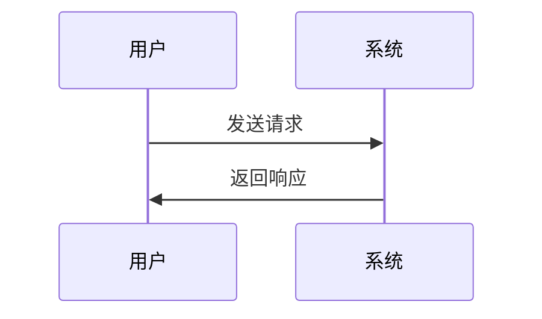

                 

# 团队动力学：解析高效团队机制

## 关键词

- 团队动力学
- 高效团队
- 团队建设
- 团队沟通
- 团队冲突

## 摘要

本文旨在探讨团队动力学在构建高效团队中的应用。通过对团队动力、团队行为、团队沟通和团队冲突等核心概念的分析，我们提出了团队动力学原理及其在团队建设中的应用策略。文章结构如下：

1. **背景介绍**：介绍团队动力学的研究背景、问题描述、问题解决方法以及概念结构与核心要素组成。
2. **核心概念与联系**：详细解释团队、团队动力、团队行为、团队沟通和团队冲突等核心概念，并分析它们之间的联系。
3. **团队动力学原理**：探讨团队动力机制的原理及其在团队运作中的作用。
4. **团队动力学应用**：介绍团队动力学在团队建设中的应用策略，如团队评估、团队建设活动和团队发展模型。
5. **项目实战**：通过一个实际项目，展示团队动力学在团队建设中的具体应用。
6. **最佳实践 tips**：提供团队动力管理的最佳实践建议。
7. **小结**：总结文章的核心观点，强调团队动力学在高效团队建设中的重要性。

---

## 第1章：背景介绍

### 1.1 问题背景

在现代社会，团队已经成为企业运营和发展的核心单位。然而，如何组建一个高效的团队、如何激发团队成员的潜力、如何处理团队内部的冲突等问题，始终是困扰管理者的一大难题。团队动力学作为研究团队行为和团队关系的学科，旨在解决这些问题。

### 1.2 问题描述

团队动力学关注的核心问题包括：团队成员的行为模式、团队动力机制、团队沟通、团队冲突解决等。这些问题直接影响团队的工作效率和团队的整体绩效。

### 1.3 问题解决

通过对团队动力学的研究，管理者可以更好地理解团队的行为模式，从而制定出更有效的团队管理策略。同时，团队动力学也为团队冲突的解决提供了理论依据。

### 1.4 边界与外延

团队动力学的研究范围涵盖了组织行为学、心理学、社会学等多个学科领域。它不仅关注团队内部成员之间的关系，还关注团队与外部环境之间的关系。

### 1.5 概念结构与核心要素组成

团队动力学的主要概念包括：团队、团队动力、团队行为、团队沟通、团队冲突等。这些概念相互关联，构成了团队动力学的核心结构。

## 第2章：核心概念与联系

### 2.1 团队动力学的基本概念

#### 2.1.1 团队的定义

团队是一组相互协作、共同追求特定目标的个体。这些个体通常具有互补的技能和知识，能够在工作中相互依赖、相互支持。

#### 2.1.2 团队动力的定义

团队动力是指团队内部的驱动力，包括成员之间的相互作用、团队的凝聚力、团队成员的动机等。

#### 2.1.3 团队行为的定义

团队行为是指团队成员在团队活动中表现出的行为，包括沟通、合作、冲突解决等。

#### 2.1.4 团队沟通的定义

团队沟通是指团队成员之间交换信息、观点和感受的过程。有效的团队沟通是团队高效运作的关键。

#### 2.1.5 团队冲突的定义

团队冲突是指团队成员在观点、利益等方面的不一致，可能导致团队效率降低甚至团队解散。

### 2.2 核心概念之间的联系

团队动力、团队行为、团队沟通、团队冲突等核心概念之间存在着密切的联系。团队动力是团队行为的驱动力，团队行为是通过团队沟通实现的，而团队冲突则是团队沟通的障碍。

#### 2.2.1 团队动力与团队行为

团队动力直接影响团队行为。一个高动力的团队通常表现出更高的合作意愿和更好的团队执行力。

#### 2.2.2 团队行为与团队沟通

团队行为是通过团队沟通实现的。有效的团队沟通可以促进团队成员之间的合作，提高团队的工作效率。

#### 2.2.3 团队沟通与团队冲突

团队沟通的障碍可能导致团队冲突。有效的团队沟通有助于解决团队冲突，维护团队的稳定。

## 第3章：团队动力学原理

### 3.1 团队动力机制的原理

团队动力机制是指团队内部产生、维持和发展的动力过程。它包括以下核心要素：

#### 3.1.1 成员互动

团队成员之间的互动是团队动力机制的基础。通过互动，团队成员能够建立信任、共享信息和共同解决问题。

#### 3.1.2 激励因素

激励因素包括内在激励（如自我实现、成就感）和外在激励（如奖励、晋升机会）。这些激励因素能够激发团队成员的积极性和创造力。

#### 3.1.3 团队凝聚力

团队凝聚力是指团队成员对团队的认同感和归属感。高凝聚力的团队通常表现出更高的合作意愿和更好的团队绩效。

### 3.2 团队动力机制的作用

团队动力机制在团队运作中起着至关重要的作用：

#### 3.2.1 促进团队合作

团队动力机制能够促进团队成员之间的合作，提高团队的整体效率。

#### 3.2.2 提高团队适应性

团队动力机制有助于团队在面对外部变化时迅速适应，保持团队的活力和竞争力。

#### 3.2.3 解决团队冲突

团队动力机制为团队冲突的解决提供了理论基础和实践指导。

## 第4章：团队动力学应用

### 4.1 团队动力学在团队建设中的应用

团队建设是团队动力学的重要应用领域。以下是一些常见的团队建设策略：

#### 4.1.1 团队评估

通过团队评估，可以了解团队的现状，识别团队的优势和不足，为团队建设提供依据。

#### 4.1.2 团队建设活动

通过组织各种团队建设活动，如团队拓展训练、团队建设游戏等，可以增强团队成员之间的互动和沟通，提高团队的凝聚力。

#### 4.1.3 团队发展模型

采用团队发展模型，如贝尔宾团队角色模型、阿普顿团队发展模型等，可以帮助团队识别成员的角色和职责，促进团队成员之间的协作。

### 4.2 团队动力学在项目管理中的应用

#### 4.2.1 团队沟通

有效的团队沟通是项目成功的关键。通过建立良好的沟通渠道和沟通机制，可以确保团队成员之间的信息传递准确、及时。

#### 4.2.2 团队冲突管理

在项目管理中，团队冲突是不可避免的。通过了解团队冲突的类型和原因，可以采取相应的措施进行管理和解决。

#### 4.2.3 团队激励

项目经理需要了解团队成员的激励需求，并采取适当的激励措施，以激发团队成员的工作热情和创造力。

## 第5章：项目实战

### 5.1 项目介绍

在本章中，我们将通过一个实际项目来展示团队动力学在团队建设中的应用。该项目是一个软件开发生命周期管理工具，旨在帮助团队高效地完成项目任务。

### 5.2 系统功能设计

该系统的主要功能包括：任务管理、进度跟踪、资源分配、团队沟通和团队协作等。

### 5.3 系统架构设计

系统的整体架构采用分层架构设计，包括表现层、业务逻辑层和数据访问层。

### 5.4 系统接口设计

系统提供了一系列API接口，供其他系统或应用调用，如任务创建、任务更新、任务查询等。

### 5.5 系统交互

系统的交互流程通过Mermaid序列图进行描述，如下所示：

## 第6章：最佳实践 tips

### 6.1 团队动力管理策略

- 建立明确的团队目标
- 提供充分的资源支持
- 鼓励开放沟通
- 处理团队冲突

### 6.2 团队建设活动

- 定期组织团队建设活动
- 采用多元化的团队建设方法
- 关注团队成员的个性化需求

### 6.3 项目管理技巧

- 建立有效的沟通渠道
- 及时识别和解决团队冲突
- 合理分配任务和资源

## 第7章：小结

本文通过对团队动力学的研究，探讨了团队动力学在构建高效团队中的应用。团队动力学为团队建设提供了理论依据和实践指导，通过有效的团队动力管理、团队建设和项目管理，可以显著提高团队的工作效率和整体绩效。

## 参考文献

- 贝尔宾，R. M. (1981). **Team roles: theory and practice**. Hutchinson.
- 阿普顿，J. L. (2003). **Team development: a social systems approach**. Sage Publications.
- 汤普森，J. L. (2004). **Understanding group behavior**. McGraw-Hill.
- 帕金森，C. N. (1957). **The economics of applause**. London: Chatto & Windus.

## 作者

作者：AI天才研究院/AI Genius Institute & 禅与计算机程序设计艺术 /Zen And The Art of Computer Programming

