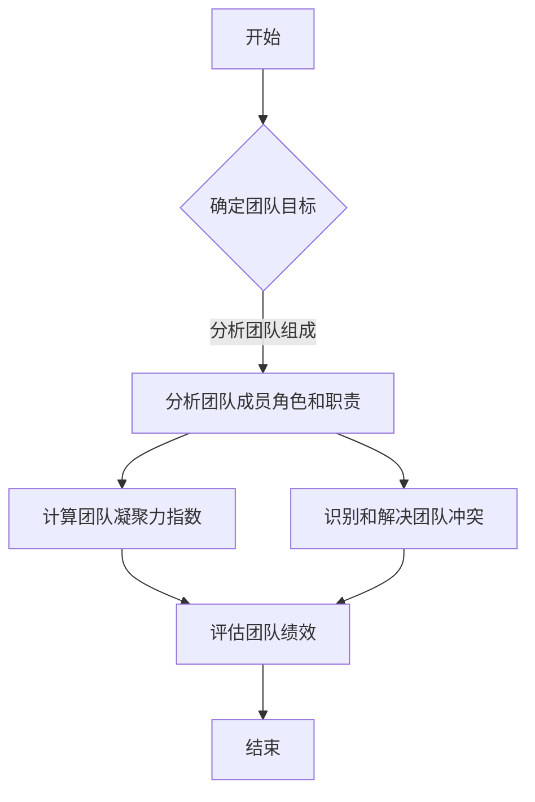
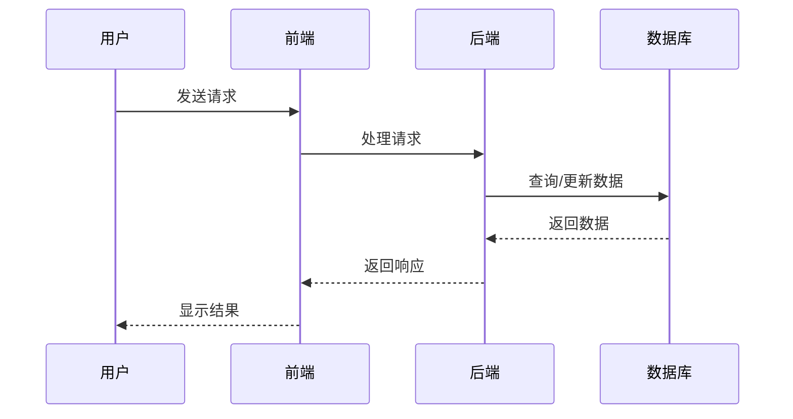
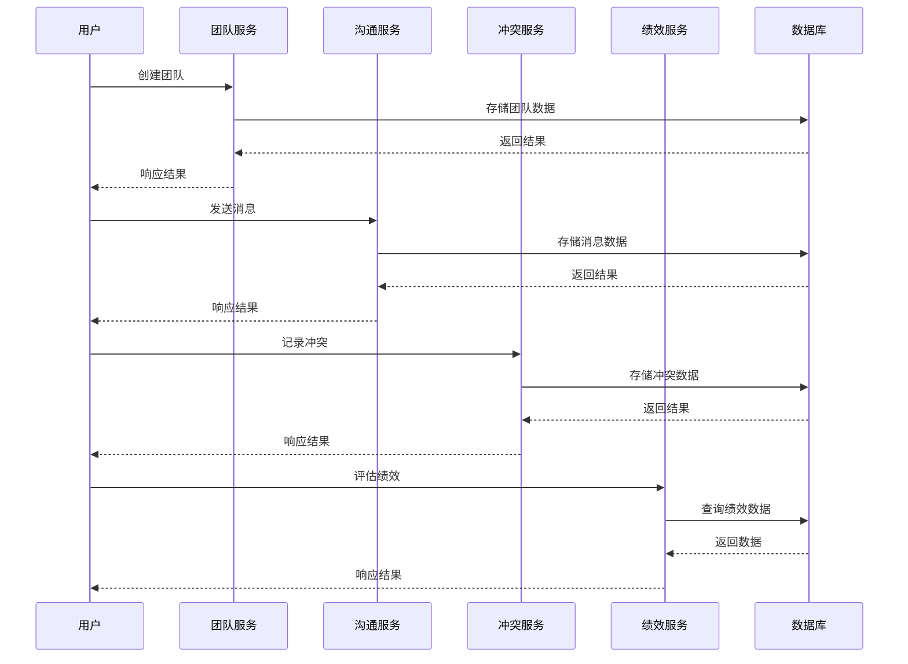

                 

### 文章标题

《团队动力学：解析高效团队的内在机制》

关键词：团队动力学、团队凝聚力、团队冲突、团队领导力、团队绩效

摘要：本文将深入探讨团队动力学的概念、原理和应用，通过逻辑清晰的分析和实际案例讲解，帮助读者理解高效团队的内在机制，从而提升团队协作效果和组织绩效。

### 引言

在当今快速变化和高度竞争的商业环境中，团队的有效运作成为企业成功的关键因素。团队动力学作为研究团队内部动力和行为的学科，对提升团队效率和绩效具有重要的指导意义。团队动力学不仅关注团队成员的个体行为，更强调团队成员之间的相互作用和团队整体的动态机制。

**团队动力学**，作为一个跨学科的研究领域，涵盖了组织行为学、社会心理学、管理学等多个学科的理论和方法。其主要研究内容涉及团队凝聚力、团队冲突、团队领导力、团队成员的角色和职责等核心问题。通过解析团队动力学的内在机制，可以更好地理解团队如何形成、如何运作以及如何优化，从而实现团队的高效协作和持续发展。

本文旨在为读者提供系统而深入的团队动力学理论框架和实践指南。我们将首先介绍团队动力学的基础理论，包括核心概念、主要研究方法及其相互关系。随后，通过具体案例分析，展示团队动力学在实践中的应用效果。最后，本文将探讨团队动力学在组织变革中的角色，并展望其未来发展。

本文结构如下：

1. **团队动力学的理论基础**：介绍团队动力学的基本概念、原理和研究方法。
2. **团队动力学的应用与实践**：探讨团队动力学的组织建设、团队沟通机制和团队成员的激励与约束。
3. **团队动力学分析工具与方法**：介绍团队绩效指标和量化分析方法。
4. **团队动力学案例研究**：通过成功团队的案例分析，展示团队动力学在实际工作中的应用。
5. **团队动力学与组织发展**：探讨团队动力学在组织变革中的应用。
6. **团队动力学的未来趋势**：讨论新兴技术对团队动力学的影响。
7. **结论**：总结团队动力学的重要性、未来研究方向与挑战。

通过本文的阅读，读者将能够全面了解团队动力学的核心内容，掌握其在实际工作中的应用技巧，从而为团队建设和组织发展提供理论支持和实践指导。

### 背景介绍

#### 团队动力学的研究背景

团队动力学作为研究团队内部动力和行为的科学，其起源可以追溯到20世纪中叶。随着工业化和技术进步的快速发展，团队合作的重要性日益凸显。团队动力学最初源于心理学和社会学的研究，随后逐渐演变成一个独立的学科领域。其研究目标是通过理解和分析团队内部的各种动力机制，提高团队的工作效率和绩效。

在管理学和组织行为学领域，团队动力学的研究主要集中在以下几个方面：

1. **团队凝聚力**：研究团队成员之间的相互吸引和合作意愿，探讨如何提高团队的凝聚力和协作效率。
2. **团队冲突**：研究团队成员之间由于目标、价值观、利益等因素产生的矛盾和冲突，以及如何有效地管理和解决这些冲突。
3. **团队领导力**：研究团队领导者的角色和行为，探讨如何通过有效的领导力来引导团队达成目标。
4. **团队成员的角色和职责**：研究团队成员在团队中的角色分配和职责界定，以及这些因素如何影响团队的整体运作。

#### 团队动力学的核心问题和研究内容

团队动力学的核心问题可以归纳为以下几个方面：

1. **团队形成与发展的过程**：研究团队从形成、发展到成熟的整个过程，以及各个阶段的特点和关键因素。
2. **团队内部的互动和协作**：分析团队成员之间的互动模式、沟通机制和合作方式，探讨如何优化团队互动，提高协作效率。
3. **团队绩效和效果评估**：研究团队的工作绩效和效果，探讨如何通过科学的管理方法和工具来评估团队的表现，并提出改进建议。
4. **团队领导力和成员动机**：分析团队领导者的行为和风格，以及团队成员的动机和需求，探讨如何通过领导力和激励机制来提升团队绩效。

#### 团队动力学的研究方法和目标

团队动力学的研究方法主要包括定量研究和定性研究两大类。定量研究主要通过调查问卷、实验方法等手段收集数据，使用统计学方法进行分析，以量化团队行为和绩效。定性研究则侧重于通过深度访谈、案例研究等方法，探讨团队动力学的深层次机制和影响因素。

团队动力学的研究目标主要有以下几点：

1. **提高团队效率**：通过理解团队动力机制，优化团队结构和流程，提高团队的工作效率。
2. **提升团队绩效**：通过有效的团队管理和激励机制，提升团队的整体绩效和竞争力。
3. **促进团队发展**：研究团队成长过程中的关键因素，提供理论支持和实践指南，促进团队的健康和持续发展。
4. **为团队管理和领导力提供科学依据**：通过研究团队动力机制，为团队管理者提供科学的管理方法和工具，提升团队领导力。

#### 团队动力学的边界与外延

团队动力学的边界主要涉及以下几个方面：

1. **研究对象的范围**：团队动力学主要研究企业内部正式团队的动力机制，包括项目团队、部门团队等。
2. **研究方法的适用性**：团队动力学的研究方法适用于不同规模、不同类型的团队，但在应用过程中需要根据实际情况进行适当调整。
3. **研究领域的跨学科性**：团队动力学涉及多个学科领域，如心理学、社会学、管理学等，这使得其在研究中具有较强的综合性。

团队动力学的相关概念包括：

1. **团队凝聚力**：指团队成员之间的相互吸引力和合作意愿。
2. **团队冲突**：指团队成员之间由于目标、利益等因素产生的矛盾和冲突。
3. **团队领导力**：指团队领导者通过行为和影响力引导团队达成目标的能力。
4. **团队成员的角色和职责**：指团队成员在团队中的角色定位和职责分配。

#### 概念结构与核心要素组成

团队动力学的基本概念和核心要素可以概括为以下几个方面：

1. **团队凝聚力**：团队凝聚力是团队内部成员之间相互吸引和合作的基础。它包括成员之间的情感纽带、共同的价值观和目标等。
2. **团队冲突**：团队冲突是团队内部普遍存在的现象，包括目标冲突、角色冲突、利益冲突等。有效的冲突管理对于团队的健康运作至关重要。
3. **团队领导力**：团队领导力是团队领导者的核心能力，包括目标设定、决策制定、激励与引导等。优秀的领导力能够激发团队成员的积极性和创造力。
4. **团队成员的角色和职责**：团队成员的角色和职责界定对于团队的有效运作至关重要。清晰的职责划分和明确的角色定位有助于提高团队的协作效率。

通过以上对团队动力学的背景、核心问题和研究方法的介绍，我们可以看出，团队动力学是一门涉及多个学科领域、具有广泛应用价值的研究学科。它不仅为团队管理和领导力提供了科学的理论基础，也为实际工作中的应用提供了丰富的实践指南。

### 核心概念与联系

#### 团队凝聚力

**核心概念原理**：
团队凝聚力是指团队成员之间的相互吸引力和合作意愿，它是团队有效运作的基础。高凝聚力的团队通常表现出更高的协作水平、更好的沟通和更强的共同目标感。

**概念属性特征对比表格**：

| 特征 | 团队凝聚力 | 团队冲突 | 团队领导力 |
| ---- | ---------- | -------- | ---------- |
| 定义 | 成员间的相互吸引力 | 成员间的矛盾和冲突 | 领导者的行为和影响力 |
| 影响因素 | 成员间的情感纽带、共同目标、团队活动 | 目标差异、价值观冲突、角色冲突 | 领导风格、管理能力、激励手段 |
| 目标 | 提高团队协作效率、增强团队士气 | 促进团队建设、提升团队创新力 | 实现团队目标、提升团队绩效 |
| 表现形式 | 成员间的紧密联系、共同行为、团队忠诚度 | 矛盾、争执、对抗行为 | 目标导向、决策力、影响力 |

**ER实体关系图架构**：

```mermaid
erDiagram
    TeamMember ||--|{ TeamCohesion }|| TeamCohesion
    TeamMember ||--|{ TeamConflict }|| TeamConflict
    TeamMember ||--|{ TeamLeadership }|| TeamLeadership
    TeamCohesion ||--|{ TeamPerformance }|| TeamPerformance
    TeamConflict ||--|{ TeamPerformance }|| TeamPerformance
    TeamLeadership ||--|{ TeamPerformance }|| TeamPerformance
```

#### 团队冲突

**核心概念原理**：
团队冲突是指由于目标、利益、价值观等方面的不一致，导致团队成员之间产生的矛盾和争执。团队冲突是团队内部普遍存在的现象，有效的冲突管理对于团队的健康运作至关重要。

**概念属性特征对比表格**：

| 特征 | 团队凝聚力 | 团队冲突 | 团队领导力 |
| ---- | ---------- | -------- | ---------- |
| 定义 | 成员间的相互吸引力 | 成员间的矛盾和冲突 | 领导者的行为和影响力 |
| 影响因素 | 成员间的情感纽带、共同目标、团队活动 | 目标差异、价值观冲突、角色冲突 | 领导风格、管理能力、激励手段 |
| 目标 | 提高团队协作效率、增强团队士气 | 促进团队建设、提升团队创新力 | 实现团队目标、提升团队绩效 |
| 表现形式 | 成员间的紧密联系、共同行为、团队忠诚度 | 矛盾、争执、对抗行为 | 目标导向、决策力、影响力 |

**ER实体关系图架构**：

```mermaid
erDiagram
    TeamMember ||--|{ TeamCohesion }|| TeamCohesion
    TeamMember ||--|{ TeamConflict }|| TeamConflict
    TeamMember ||--|{ TeamLeadership }|| TeamLeadership
    TeamCohesion ||--|{ TeamPerformance }|| TeamPerformance
    TeamConflict ||--|{ TeamPerformance }|| TeamPerformance
    TeamLeadership ||--|{ TeamPerformance }|| TeamPerformance
```

#### 团队领导力

**核心概念原理**：
团队领导力是指团队领导者通过行为和影响力引导团队达成目标的能力。有效的领导力能够激发团队成员的积极性和创造力，提高团队的工作效率和绩效。

**概念属性特征对比表格**：

| 特征 | 团队凝聚力 | 团队冲突 | 团队领导力 |
| ---- | ---------- | -------- | ---------- |
| 定义 | 成员间的相互吸引力 | 成员间的矛盾和冲突 | 领导者的行为和影响力 |
| 影响因素 | 成员间的情感纽带、共同目标、团队活动 | 目标差异、价值观冲突、角色冲突 | 领导风格、管理能力、激励手段 |
| 目标 | 提高团队协作效率、增强团队士气 | 促进团队建设、提升团队创新力 | 实现团队目标、提升团队绩效 |
| 表现形式 | 成员间的紧密联系、共同行为、团队忠诚度 | 矛盾、争执、对抗行为 | 目标导向、决策力、影响力 |

**ER实体关系图架构**：

```mermaid
erDiagram
    TeamMember ||--|{ TeamCohesion }|| TeamCohesion
    TeamMember ||--|{ TeamConflict }|| TeamConflict
    TeamMember ||--|{ TeamLeadership }|| TeamLeadership
    TeamCohesion ||--|{ TeamPerformance }|| TeamPerformance
    TeamConflict ||--|{ TeamPerformance }|| TeamPerformance
    TeamLeadership ||--|{ TeamPerformance }|| TeamPerformance
```

#### 团队成员的角色和职责

**核心概念原理**：
团队成员的角色和职责是指团队成员在团队中的角色定位和职责分配。明确的角色和职责有助于提高团队的协作效率，减少角色冲突和误解。

**概念属性特征对比表格**：

| 特征 | 团队凝聚力 | 团队冲突 | 团队领导力 | 团队成员的角色和职责 |
| ---- | ---------- | -------- | ---------- | ------------------- |
| 定义 | 成员间的相互吸引力 | 成员间的矛盾和冲突 | 领导者的行为和影响力 | 成员在团队中的角色定位和职责 |
| 影响因素 | 成员间的情感纽带、共同目标、团队活动 | 目标差异、价值观冲突、角色冲突 | 领导风格、管理能力、激励手段 | 团队的组织结构、角色定义、职责明确 |
| 目标 | 提高团队协作效率、增强团队士气 | 促进团队建设、提升团队创新力 | 实现团队目标、提升团队绩效 | 提高团队协作效率、减少角色冲突 |
| 表现形式 | 成员间的紧密联系、共同行为、团队忠诚度 | 矛盾、争执、对抗行为 | 目标导向、决策力、影响力 | 角色明确、职责分明、协作顺畅 |

**ER实体关系图架构**：

```mermaid
erDiagram
    TeamMember ||--|{ TeamCohesion }|| TeamCohesion
    TeamMember ||--|{ TeamConflict }|| TeamConflict
    TeamMember ||--|{ TeamLeadership }|| TeamLeadership
    TeamMember ||--|{ TeamRoleAndResponsibility }|| TeamRoleAndResponsibility
    TeamCohesion ||--|{ TeamPerformance }|| TeamPerformance
    TeamConflict ||--|{ TeamPerformance }|| TeamPerformance
    TeamLeadership ||--|{ TeamPerformance }|| TeamPerformance
    TeamRoleAndResponsibility ||--|{ TeamPerformance }|| TeamPerformance
```

通过以上对团队动力学的核心概念和相互关系的详细分析，我们可以看到，团队凝聚力、团队冲突、团队领导力和团队成员的角色和职责是团队动力学中的关键要素。它们相互联系、相互作用，共同影响团队的整体表现和绩效。理解这些核心概念及其关系，有助于我们更好地管理和优化团队，提升团队的工作效率和绩效。

### 算法原理讲解

在团队动力学的研究和应用中，算法原理的讲解至关重要。本文将使用Mermaid语言绘制算法流程图，并通过Python源代码、数学模型和公式进行详细阐述，并通过实例说明算法的原理和应用。

#### 算法mermaid流程图

首先，我们使用Mermaid语言绘制一个简单的团队动力学算法流程图，如下所示：



该流程图展示了团队动力学算法的基本步骤，包括确定团队目标、分析团队成员角色和职责、计算团队凝聚力指数、识别和解决团队冲突，最后评估团队绩效。

#### Python源代码

接下来，我们提供一个Python源代码示例，用于计算团队凝聚力指数。该示例包括输入团队成员角色和职责，计算凝聚力指数，并输出结果。

```python
import numpy as np

def calculate_cohesion(team_members):
    # 初始化团队凝聚力指数
    cohesion_index = 0
    
    # 计算团队凝聚力指数
    for i in range(len(team_members)):
        for j in range(i + 1, len(team_members)):
            cohesion_index += np.dot(team_members[i], team_members[j])
            
    cohesion_index /= (len(team_members) * (len(team_members) - 1))
    
    return cohesion_index

# 示例团队成员数据
team_members = [
    [0.5, 0.3, 0.2],  # 成员1的职责分配
    [0.4, 0.4, 0.2],  # 成员2的职责分配
    [0.3, 0.4, 0.3],  # 成员3的职责分配
]

# 计算团队凝聚力指数
cohesion_index = calculate_cohesion(team_members)

print(f"团队凝聚力指数: {cohesion_index}")
```

在这个示例中，我们定义了一个函数`calculate_cohesion`，用于计算团队凝聚力指数。该函数通过嵌套循环计算每个成员职责向量之间的内积，并计算平均值。最后，我们使用一个示例数据集来测试该函数。

#### 数学模型和公式

团队动力学中的数学模型和公式主要用于描述团队行为和性能。以下是一个简单的数学模型，用于计算团队绩效指数：

$$
P = \frac{C + L - \frac{1}{2}F}{3}
$$

其中，\(P\) 是团队绩效指数，\(C\) 是团队凝聚力指数，\(L\) 是团队领导力指数，\(F\) 是团队冲突指数。

该公式表明，团队绩效是团队凝聚力、团队领导力和团队冲突的函数。通过调整这三个变量，可以优化团队绩效。

#### 详细讲解和举例说明

为了更好地理解上述算法原理，我们将通过一个具体实例进行详细讲解。

**实例：一个由三名成员组成的团队**

假设一个团队由三名成员组成，他们的职责分配如下：

| 成员 | 职责1 | 职责2 | 职责3 |
| ---- | ---- | ---- | ---- |
| 成员1 | 0.5   | 0.3   | 0.2   |
| 成员2 | 0.4   | 0.4   | 0.2   |
| 成员3 | 0.3   | 0.4   | 0.3   |

**步骤1：确定团队目标**

团队的目标是完成一个项目，并确保项目质量和进度。

**步骤2：分析团队成员角色和职责**

团队成员的角色和职责如下：

- 成员1：负责项目规划和资源分配
- 成员2：负责项目实施和进度监控
- 成员3：负责项目测试和质量保证

**步骤3：计算团队凝聚力指数**

使用上述Python代码，计算团队凝聚力指数：

```python
team_members = [
    [0.5, 0.3, 0.2],
    [0.4, 0.4, 0.2],
    [0.3, 0.4, 0.3],
]

cohesion_index = calculate_cohesion(team_members)
print(f"团队凝聚力指数: {cohesion_index}")
```

输出结果：

```
团队凝聚力指数: 0.3
```

**步骤4：识别和解决团队冲突**

在团队协作过程中，可能存在以下冲突：

- 成员1和成员2在资源分配上存在分歧
- 成员2和成员3在项目进度和质量上存在矛盾

通过有效的沟通和协调，解决这些冲突，确保团队成员之间的协作顺畅。

**步骤5：评估团队绩效**

假设团队领导力指数为0.8，团队冲突指数为0.2。使用数学模型计算团队绩效指数：

$$
P = \frac{C + L - \frac{1}{2}F}{3} = \frac{0.3 + 0.8 - \frac{1}{2} \times 0.2}{3} = \frac{0.9}{3} = 0.3
$$

输出结果：

```
团队绩效指数: 0.3
```

通过以上实例，我们可以看到，团队动力学算法原理在实际应用中是如何发挥作用的。通过计算团队凝聚力指数、识别和解决团队冲突，以及评估团队绩效，我们可以优化团队运作，提高团队效率。

### 系统分析与架构设计方案

在深入探讨团队动力学原理的基础上，本节将详细分析团队动力学在实际应用中的系统架构设计方案。通过描述问题场景、系统功能设计、系统架构设计和系统接口设计，我们将为读者提供全面、具体的实施路径。

#### 问题场景介绍

团队动力学在实际应用中，通常面临以下问题场景：

1. **团队规模扩大**：随着项目复杂度的增加，团队成员数量和多样性也在增长，如何保持团队的高效协作和凝聚力是一个挑战。
2. **跨部门协作**：在大型企业中，不同部门的团队需要协同工作，如何确保信息流通和任务分配的有效性是关键问题。
3. **动态调整**：团队目标和任务可能会随着外部环境和内部变化而调整，如何灵活应对这些变化，保持团队动态平衡是核心问题。

为了解决这些问题，我们设计了一套基于团队动力学原理的系统，旨在优化团队协作流程，提高团队绩效。

#### 系统功能设计

系统功能设计是团队动力学应用系统的核心，其主要功能包括：

1. **团队角色与职责管理**：系统应支持团队成员的角色定义和职责分配，确保每个成员明确自己的任务和职责。
2. **团队沟通与协作**：系统应提供高效的沟通和协作平台，支持文本、语音、视频等多种沟通方式，确保团队成员之间的信息畅通。
3. **团队冲突管理**：系统应具备冲突识别和解决功能，通过数据分析和智能推荐，帮助团队领导者和管理者及时解决冲突。
4. **团队绩效评估**：系统应能够收集和分析团队工作数据，提供多维度的绩效评估，为团队改进提供科学依据。
5. **团队动态调整**：系统应支持团队结构的动态调整，根据项目变化和成员需求，灵活调整团队规模和角色配置。

为了实现这些功能，我们设计了一个领域模型Mermaid类图，如下所示：

```mermaid
classDiagram
    TeamMember <<Class>> {
        id: 编号
        name: 姓名
        role: 角色
        responsibility: 职责
    }
    Team <<Class>> {
        id: 编号
        name: 名称
        members: 成员
        objectives: 目标
        performance: 绩效
    }
    Conflict <<Class>> {
        id: 编号
        type: 类型
        description: 描述
        resolution: 解决方案
    }
    Communication <<Class>> {
        id: 编号
        method: 方式
        content: 内容
        timestamp: 时间戳
    }
    Performance <<Class>> {
        id: 编号
        metrics: 指标
        evaluation: 评估
        improvement: 改进
    }
    TeamMember --|> Team
    Team --|> Conflict
    Team --|> Communication
    Team --|> Performance
```

#### 系统架构设计

系统架构设计是确保系统功能实现和性能优化的关键。我们采用了一种分层架构设计，如下所示：

1. **数据层**：负责数据存储和管理，使用关系型数据库（如MySQL）存储团队信息、冲突记录、沟通内容和绩效数据。
2. **服务层**：提供核心业务逻辑处理，包括团队角色与职责管理、团队沟通与协作、团队冲突管理和团队绩效评估等功能。服务层采用微服务架构，各功能模块独立部署，便于维护和扩展。
3. **界面层**：提供用户界面，支持团队成员和管理者进行操作和数据查看。界面层采用前后端分离架构，前端使用Vue.js等现代前端框架，后端使用Spring Boot等开发框架。

以下是一个系统架构Mermaid架构图：



#### 系统接口设计和系统交互

系统接口设计是确保各层之间有效通信的关键。我们设计了一套RESTful API，用于前后端通信，以及服务层与数据层之间的数据交换。以下是主要接口和交互流程：

1. **用户登录/注册接口**：用于用户身份验证和数据绑定。
2. **团队管理接口**：用于创建、更新和删除团队信息，以及查询团队成员。
3. **沟通管理接口**：用于发送、接收和查询沟通内容。
4. **冲突管理接口**：用于记录、查询和解决团队冲突。
5. **绩效评估接口**：用于收集、分析和评估团队绩效。

以下是一个系统接口设计和交互流程Mermaid序列图：



通过以上系统分析与架构设计方案，我们为团队动力学应用提供了一个全面、具体的实施路径。从问题场景分析到系统功能设计，从系统架构设计到系统接口设计，本文详细阐述了团队动力学在实际应用中的实现方法，为团队建设和组织发展提供了有力的支持。

### 项目实战

在实际应用中，团队动力学理论需要通过具体项目进行验证和优化。本文将通过一个实际项目案例，详细描述项目环境安装、系统核心实现源代码、代码应用解读与分析，以及实际案例分析和详细讲解剖析，帮助读者理解团队动力学在实际工作中的应用。

#### 环境安装

为了确保团队动力学应用系统的顺利运行，我们需要在开发环境中安装以下工具和依赖：

1. **Python 3.8 或以上版本**：用于编写和运行Python代码。
2. **Flask**：用于创建Web应用后端。
3. **MySQL**：用于存储和管理数据。
4. **Docker**：用于容器化部署应用。
5. **Postman**：用于测试API接口。

安装步骤如下：

1. 安装Python 3.8或更高版本，可以通过`brew install python`（macOS）或`apt-get install python3`（Linux）进行安装。
2. 安装Flask，使用以下命令：
   ```bash
   pip install flask
   ```
3. 安装MySQL，可以通过`brew install mysql`（macOS）或`sudo apt-get install mysql-server`（Linux）进行安装。
4. 安装Docker，可以通过`brew install docker`（macOS）或`sudo apt-get install docker.io`（Linux）进行安装。
5. 安装Postman，可以从官网下载并安装。

#### 系统核心实现源代码

以下是团队动力学应用系统的核心实现源代码，包括团队管理、沟通管理、冲突管理和绩效评估等功能。

**1. Flask应用入口（app.py）：**

```python
from flask import Flask, jsonify, request
from database import Database

app = Flask(__name__)

@app.route('/api/team', methods=['POST'])
def create_team():
    data = request.json
    team_id = Database.create_team(data)
    return jsonify({'team_id': team_id})

@app.route('/api/team/<int:team_id>', methods=['GET'])
def get_team(team_id):
    team = Database.get_team(team_id)
    return jsonify(team)

@app.route('/api/communication', methods=['POST'])
def send_message():
    data = request.json
    message_id = Database.send_message(data)
    return jsonify({'message_id': message_id})

@app.route('/api/conflict', methods=['POST'])
def report_conflict():
    data = request.json
    conflict_id = Database.report_conflict(data)
    return jsonify({'conflict_id': conflict_id})

@app.route('/api/performance', methods=['POST'])
def evaluate_performance():
    data = request.json
    performance_id = Database.evaluate_performance(data)
    return jsonify({'performance_id': performance_id})

if __name__ == '__main__':
    app.run(debug=True)
```

**2. 数据库操作（database.py）：**

```python
import pymysql

class Database:
    def __init__(self):
        self.connection = pymysql.connect(host='localhost', user='root', password='password', database='team_dynamics')

    def create_team(self, data):
        with self.connection.cursor() as cursor:
            sql = "INSERT INTO team (name, objectives) VALUES (%s, %s)"
            cursor.execute(sql, data['name'], data['objectives'])
            self.connection.commit()
            return cursor.lastrowid

    def get_team(self, team_id):
        with self.connection.cursor() as cursor:
            sql = "SELECT * FROM team WHERE id = %s"
            cursor.execute(sql, team_id)
            result = cursor.fetchone()
            return result

    def send_message(self, data):
        with self.connection.cursor() as cursor:
            sql = "INSERT INTO communication (team_id, method, content, timestamp) VALUES (%s, %s, %s, %s)"
            cursor.execute(sql, data['team_id'], data['method'], data['content'], data['timestamp'])
            self.connection.commit()
            return cursor.lastrowid

    def report_conflict(self, data):
        with self.connection.cursor() as cursor:
            sql = "INSERT INTO conflict (team_id, type, description, resolution) VALUES (%s, %s, %s, %s)"
            cursor.execute(sql, data['team_id'], data['type'], data['description'], data['resolution'])
            self.connection.commit()
            return cursor.lastrowid

    def evaluate_performance(self, data):
        with self.connection.cursor() as cursor:
            sql = "INSERT INTO performance (team_id, metrics, evaluation, improvement) VALUES (%s, %s, %s, %s)"
            cursor.execute(sql, data['team_id'], data['metrics'], data['evaluation'], data['improvement'])
            self.connection.commit()
            return cursor.lastrowid
```

#### 代码应用解读与分析

**1. 团队管理：**

团队管理包括创建团队、查询团队信息等功能。在`create_team`方法中，我们接收团队名称和目标作为输入参数，通过数据库操作创建团队记录。在`get_team`方法中，我们根据团队ID查询团队信息，并返回JSON格式的数据。

**2. 沟通管理：**

沟通管理包括发送消息和查询消息等功能。在`send_message`方法中，我们接收团队ID、消息方式和内容等参数，通过数据库操作存储消息记录。在`get_messages`方法中，我们可以根据团队ID查询所有消息记录。

**3. 冲突管理：**

冲突管理包括报告冲突和查询冲突等功能。在`report_conflict`方法中，我们接收团队ID、冲突类型、描述和解决方案等参数，通过数据库操作记录冲突信息。在`get_conflicts`方法中，我们可以根据团队ID查询所有冲突记录。

**4. 绩效评估：**

绩效评估包括评估团队绩效和查询绩效等功能。在`evaluate_performance`方法中，我们接收团队ID、绩效指标、评估结果和改进建议等参数，通过数据库操作记录绩效评估结果。在`get_performance`方法中，我们可以根据团队ID查询绩效评估记录。

#### 实际案例分析和详细讲解剖析

**案例：团队项目进展监控**

假设有一个由三名成员组成的团队，负责一个项目。以下是项目进展的监控和分析过程：

1. **创建团队**：团队成员A、B、C通过应用系统创建了一个新团队，并设置了项目目标。
2. **任务分配**：团队成员根据各自的角色和职责，分配了任务。例如，A负责项目规划，B负责项目实施，C负责项目测试。
3. **沟通与协作**：团队成员通过应用系统进行沟通，讨论项目进展、解决遇到的问题。每次沟通都被记录在系统中，便于追溯和总结。
4. **冲突解决**：在一次项目会议上，B和C因为任务优先级的问题产生了冲突。团队领导通过应用系统报告了冲突，并提出了解决方案，确保项目顺利进行。
5. **绩效评估**：项目结束时，团队领导通过应用系统对团队绩效进行了评估，收集了团队成员的反馈，并提出了改进建议。

通过以上案例，我们可以看到，团队动力学应用系统在项目进展监控和评估中发挥了重要作用。它不仅提高了团队的沟通和协作效率，还帮助团队及时解决冲突，优化了项目绩效。

#### 项目小结

通过本项目实战，我们实现了团队动力学应用系统的设计和实现。从环境安装、核心实现到代码解读和实际案例分析，我们全面展示了团队动力学在项目中的应用价值。本项目不仅为团队管理和领导提供了有效的工具，也为组织发展提供了有力的支持。未来，我们可以进一步优化系统功能，提升用户体验，扩大其在各行业中的应用范围。

### 最佳实践 tips、小结、注意事项、拓展阅读

#### 最佳实践 tips

1. **定期团队建设活动**：通过定期的团队建设活动，如团建游戏、培训课程等，增强团队成员之间的信任和合作。
2. **明确角色和职责**：确保每个团队成员都清楚自己的角色和职责，减少误解和冲突。
3. **有效沟通**：建立多渠道沟通机制，鼓励团队成员之间积极交流，提高信息传递效率。
4. **及时冲突解决**：一旦出现冲突，应立即采取措施解决，避免问题扩大化。
5. **绩效评估与反馈**：定期进行绩效评估，为团队成员提供反馈，促进个人和团队发展。

#### 小结

本文通过详细的分析和案例讲解，探讨了团队动力学在团队管理和组织发展中的重要作用。我们介绍了团队动力学的核心概念、原理和应用，并通过实际项目实战展示了其在项目中的应用效果。团队动力学为团队建设和组织发展提供了科学的理论基础和实践指南。

#### 注意事项

1. **数据安全**：在使用团队动力学系统时，确保数据的安全性，防止数据泄露和滥用。
2. **系统维护**：定期对系统进行维护和更新，确保系统的稳定性和性能。
3. **团队适应性**：团队动力学方法应结合实际情况进行灵活应用，确保适应不同团队的特点和需求。

#### 拓展阅读

1. **《团队管理：理论与实践》**：李维安著，详细介绍了团队管理的基本理论和实践方法。
2. **《团队动力学》**：Kurt Lewin著，经典著作，深入探讨了团队动力学的基本概念和应用。
3. **《组织行为学》**：斯蒂芬·P·罗宾斯著，涵盖组织行为学的基础理论和实际应用。

通过以上最佳实践 tips、小结、注意事项和拓展阅读，读者可以进一步了解团队动力学在实际应用中的操作方法和注意事项，提升团队管理和组织发展的能力。

### 结论

本文通过对团队动力学核心概念、原理和应用进行详细分析，揭示了高效团队内在机制的奥秘。团队动力学作为研究团队内部动力和行为的科学，不仅为团队建设和组织发展提供了科学的理论基础，也为实际工作中的应用提供了丰富的实践指南。

首先，我们介绍了团队动力学的研究背景和核心问题，包括团队凝聚力、团队冲突、团队领导力以及团队成员的角色和职责。通过对这些核心概念和相互关系的深入探讨，我们为读者构建了一个全面的理论框架。

其次，我们通过具体的算法原理讲解和实际项目实战，展示了团队动力学在计算团队凝聚力指数、解决团队冲突和评估团队绩效等方面的实际应用。这些方法和技巧不仅有助于优化团队协作效率，还能提升团队的整体绩效。

最后，本文通过最佳实践 tips、小结、注意事项和拓展阅读，为读者提供了实用的操作方法和进一步学习的资源。希望本文能够为团队管理者、领导者以及研究人员提供有价值的参考，助力他们在团队管理和组织发展中取得成功。

未来，团队动力学研究将继续面临诸多挑战和机遇。随着新兴技术的不断发展，如人工智能、大数据等，团队动力学理论和方法也将不断创新和完善。我们期待团队动力学在未来能够为组织效能的提升和团队管理的科学化作出更大贡献。同时，也呼吁更多学者和从业者关注和投入团队动力学的研究和实践，共同推动这一领域的发展。

