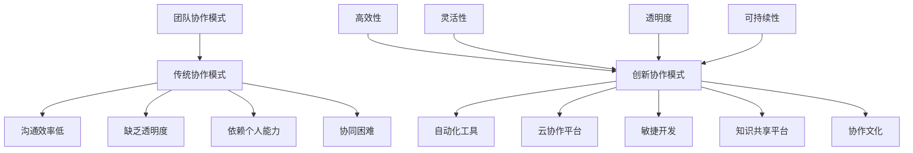
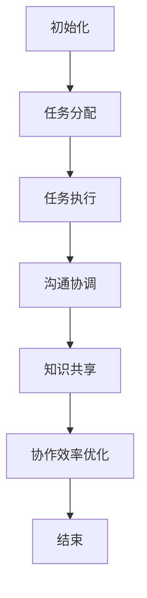
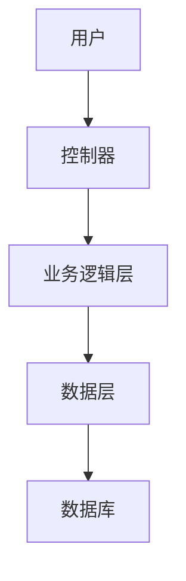
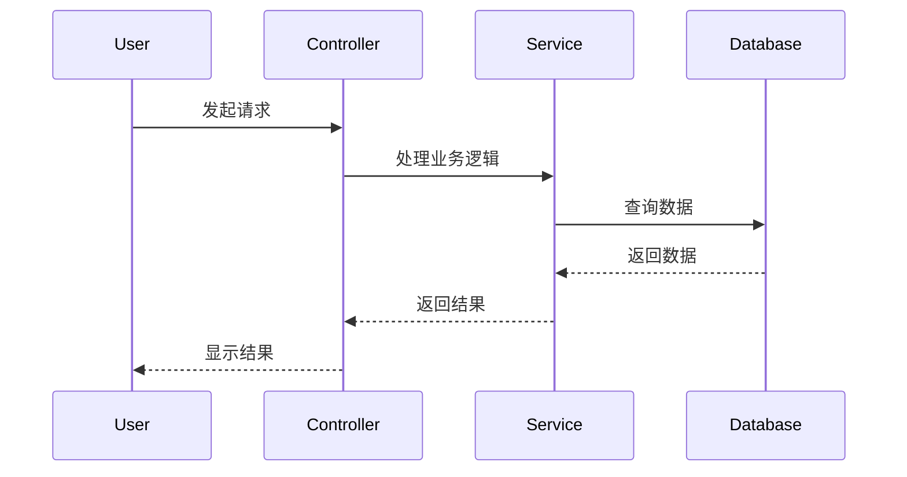
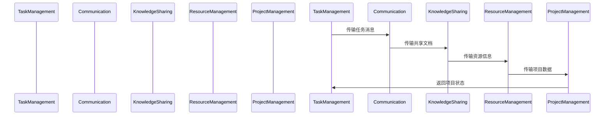

                 

### 《团队协作模式创新：突破传统合作的局限》引言

在当今快速变化和竞争激烈的技术环境中，团队协作的有效性直接决定了组织的成功与否。然而，传统团队协作模式面临着诸多挑战，这些问题不仅影响了团队的生产力，还严重制约了创新能力的发挥。因此，创新团队协作模式成为提升组织竞争力的关键所在。本文旨在深入探讨如何通过创新团队协作模式，突破传统合作的局限，实现高效协作和持续创新。

#### 当前团队协作的现状

当前的团队协作模式在很大程度上仍然依赖于传统的沟通和协作工具，如电子邮件、即时通讯、会议等。这些工具虽然在某种程度上提高了信息传递的效率，但往往存在以下问题：

1. **沟通效率低下**：信息传递过程中往往存在滞后现象，导致决策延迟。
2. **缺乏透明度**：团队成员之间的信息不对称，难以形成统一的行动方向。
3. **依赖个人能力**：过度依赖某个成员的技能或知识，增加了团队的风险。
4. **协同困难**：在复杂项目中，团队成员难以实现真正的协同工作。

#### 需要创新的原因

传统协作模式的局限性日益凸显，导致团队协作效率低下、创新受阻。以下是创新团队协作模式的几个主要原因：

1. **技术进步**：随着信息技术的发展，新的协作工具和平台不断涌现，为创新协作模式提供了可能。
2. **市场竞争**：在激烈的市场竞争中，组织需要更快地响应变化，创新协作模式能够提高组织的敏捷性和响应速度。
3. **团队多样性**：现代团队往往由不同背景和专业知识的成员组成，如何有效利用这些多样性成为协作的挑战。
4. **知识共享**：在快速变化的环境中，知识共享和知识传递变得尤为重要，创新协作模式有助于实现知识的快速传递和应用。

#### 文章核心内容和主题思想

本文将首先介绍团队协作模式创新中的核心概念，包括协作模式、创新协作模式及其要素。接着，我们将详细讲解创新协作模式的优势和特点，并通过Mermaid流程图和Python源代码展示算法原理。此外，文章还将描述如何通过系统架构设计和实际项目案例，应用创新协作模式。最后，我们将总结全文，提出最佳实践建议，并推荐进一步阅读的资源，以帮助读者深入了解并实践团队协作模式的创新。

通过以上内容，本文希望为读者提供一套切实可行的团队协作模式创新方法论，助力组织在快速变化的环境中实现高效协作和持续创新。

### 关键词

- 团队协作模式
- 创新协作模式
- 传统协作模式局限
- 算法原理
- 系统架构设计
- 项目实战

### 摘要

本文深入探讨了团队协作模式的现状与挑战，分析了传统协作模式所面临的局限性。通过定义核心概念和展示创新协作模式的优势，本文提出了新的团队协作方法论，并通过Mermaid流程图和Python源代码阐述了算法原理。文章还通过系统架构设计和实际项目案例，详细展示了如何应用创新协作模式，以提升团队协作效率和创新力。最后，本文总结了全文内容，并提供了最佳实践建议和拓展阅读资源，旨在帮助读者理解和实践团队协作模式的创新。

### 第一部分：团队协作的现状与挑战

在现代组织中，团队协作扮演着至关重要的角色。随着技术的发展和市场的变化，团队协作模式也在不断演变。然而，尽管存在多种协作工具和方法，传统的团队协作模式仍然面临诸多挑战。

#### 1.1 问题背景

团队协作的核心目标是提高工作效率和促进知识共享，从而实现组织目标。传统的团队协作模式通常依赖于面对面的会议、电子邮件和即时通讯等工具。这些工具在一定程度上提高了信息传递的效率，但在实际操作中仍存在不少问题。

首先，沟通效率低下。在大型组织中，信息从上到下的传递过程中往往存在多层审批和反馈环节，导致信息滞后。这种滞后现象不仅影响了决策的及时性，还可能导致项目延误。

其次，缺乏透明度。在传统的协作模式中，信息往往仅限于特定团队成员或部门，导致信息不对称。这种不对称性不仅影响了团队的整体目标一致性，还可能引发内部分歧，降低协作效率。

此外，过度依赖个人能力也是一个显著问题。传统协作模式中，某些团队成员可能被赋予更多的责任和权力，这使得团队整体风险高度集中于个别成员。一旦这些关键成员出现失误或离开，团队的整体效能可能大幅下降。

#### 1.2 问题描述

传统团队协作模式存在的问题可以总结为以下几个方面：

1. **沟通效率低下**：信息传递过程中存在滞后现象，决策延迟。
2. **缺乏透明度**：信息不对称，导致团队目标不一致。
3. **依赖个人能力**：风险高度集中，降低团队稳定性。
4. **协同困难**：复杂项目中，团队成员难以实现真正的协同工作。

这些问题不仅影响了团队的生产力，还制约了创新能力的发挥。在快速变化的市场环境中，组织需要更快地响应变化，而这些传统协作模式显然无法满足这一需求。

#### 1.3 问题解决

为了解决传统团队协作模式中存在的问题，创新协作模式应运而生。创新协作模式旨在通过引入新技术和新方法，提高团队协作的效率、透明度和稳定性。以下是几种常见的创新协作模式：

1. **敏捷协作**：通过短周期迭代和持续反馈，提高团队的响应速度和灵活性。
2. **分布式协作**：利用互联网和云技术，实现跨地域、跨时间的协作。
3. **知识共享平台**：构建共享的知识库，促进团队成员之间的知识传递和共享。
4. **自动化工具**：引入自动化工具，减少重复性工作，提高工作效率。

#### 1.4 边界与外延

在探讨团队协作模式创新时，我们需要明确几个边界与外延问题：

1. **边界**：团队协作模式的创新应限定在团队内部，关注团队成员之间的协作关系和效率提升。过于关注外部因素可能导致协作模式偏离核心目标。
2. **外延**：创新协作模式不仅应关注团队内部，还应考虑团队与外部合作伙伴、客户、供应商等的关系。这有助于构建更广泛的协作网络，提高整体协同效应。

#### 1.5 概念结构与核心要素组成

团队协作模式创新中的概念结构主要包括以下几个核心要素：

1. **协作目标**：明确团队协作的目标和预期成果，为创新协作模式提供方向。
2. **协作工具**：选择合适的协作工具，包括软件平台、硬件设备等，以提高协作效率。
3. **协作流程**：设计高效的协作流程，确保团队成员能够按照既定步骤和规则进行工作。
4. **协作文化**：建立积极的协作文化，鼓励团队成员之间的沟通、合作和知识共享。
5. **协作机制**：制定合理的协作机制，包括激励机制、沟通机制、决策机制等，以保障协作模式的可持续性。

通过以上分析，我们可以看到，团队协作模式的创新不仅是为了解决现有问题，更是为了适应快速变化的市场环境，提升组织的竞争力和创新能力。在接下来的章节中，我们将进一步探讨创新协作模式的具体实现方法和实践案例。

### 第二部分：核心概念与联系

在探讨团队协作模式创新之前，我们需要明确几个核心概念，并理解它们之间的联系。这些核心概念包括协作模式、创新协作模式及其要素。通过详细阐述这些概念，我们可以为后续内容的讲解和分析奠定基础。

#### 2.1 团队协作模式的概念

团队协作模式是指团队成员为实现共同目标而进行的协作方式和方法。一个有效的团队协作模式应具备以下几个特点：

1. **明确的目标**：团队协作模式的首要特点是具备明确的目标。这些目标应具体、可衡量，并能激发团队成员的积极性和参与感。
2. **协同的工作流程**：团队协作模式需要有一套协同的工作流程，以确保团队成员之间的工作能够高效衔接，减少冲突和重复劳动。
3. **有效的沟通机制**：沟通是团队协作的核心，有效的沟通机制能确保信息传递的及时性和准确性，降低误解和误差。
4. **合理的角色分工**：团队协作模式中，每个成员的角色和职责应明确，以确保工作的高效分配和执行。
5. **共同的文化价值观**：团队协作模式不仅需要工具和流程，还需要共同的文化价值观，以增强团队成员之间的凝聚力。

#### 2.2 传统协作模式的局限

传统协作模式虽然在某些方面具有一定的有效性，但随着时间的推移，其局限性逐渐显现：

1. **沟通效率低下**：传统协作模式依赖于面对面的沟通和电子邮件等工具，这些工具在信息传递速度和广度上存在局限，容易导致信息滞后和误传。
2. **缺乏透明度**：传统协作模式中，信息往往是局部的，团队成员难以全面了解项目进展和整体目标，导致决策效率低下。
3. **依赖个人能力**：传统协作模式往往依赖于个别成员的能力和经验，这增加了团队的风险，一旦关键成员出现意外，整个团队可能面临崩溃。
4. **协同困难**：在复杂项目中，团队成员之间的协同工作难以实现，往往存在信息孤岛和沟通障碍，影响项目的整体进展。

#### 2.3 创新协作模式的要素

创新协作模式是在传统协作模式的基础上，通过引入新技术和新方法，实现团队协作的效率提升和创新能力增强。以下是创新协作模式的几个关键要素：

1. **自动化工具**：自动化工具能够减少重复性劳动，提高工作效率。例如，通过自动化测试工具，可以大幅减少测试时间，提高测试覆盖率。
2. **云协作平台**：云协作平台提供了远程协作、实时沟通和资源共享的能力，有助于打破地域限制，实现全球范围内的协作。
3. **敏捷开发**：敏捷开发方法通过短周期迭代和持续反馈，提高了团队对变化的适应能力和响应速度，有助于快速实现项目目标。
4. **知识共享平台**：知识共享平台构建了一个集中的知识库，便于团队成员之间的知识传递和共享，提高了团队整体的知识水平和创新能力。
5. **协作文化**：创新协作模式不仅需要工具和流程，还需要建立积极的协作文化，鼓励团队成员之间的沟通、合作和知识共享。

#### 2.4 创新协作模式的特点

创新协作模式与传统协作模式相比，具有以下显著特点：

1. **高效性**：创新协作模式通过引入新技术和方法，显著提高了团队的协作效率，减少了沟通成本和时间浪费。
2. **灵活性**：创新协作模式能够更好地适应快速变化的市场环境，通过敏捷开发和分布式协作，提高了团队对变化的响应速度。
3. **透明度**：创新协作模式通过云协作平台和知识共享平台，增强了团队之间的信息透明度，确保团队成员能够全面了解项目进展和整体目标。
4. **可持续性**：创新协作模式不仅关注短期效率，还注重团队的长期发展和创新能力，通过建立协作文化和激励机制，确保协作模式的可持续性。

#### 2.5 关键概念联系图

为了更直观地展示这些关键概念之间的联系，我们可以使用Mermaid流程图来表示。以下是一个简化的Mermaid流程图，展示了团队协作模式、传统协作模式和创新协作模式之间的关系：



通过以上对核心概念的详细阐述，我们可以更好地理解团队协作模式创新的本质和关键要素。在接下来的章节中，我们将进一步探讨创新协作模式的算法原理和系统架构设计，为实际应用奠定理论基础。

### 第三部分：算法原理讲解

在创新协作模式中，算法原理是关键的一部分，它为协作流程提供了技术支撑和优化手段。本部分将详细讲解创新协作模式中的核心算法原理，并通过Python源代码和Mermaid流程图进行说明，使读者能够更直观地理解算法的实现过程。

#### 3.1 创新协作模式算法概述

创新协作模式算法的核心目标是提高团队协作的效率、透明度和灵活性。具体来说，该算法主要包括以下几个部分：

1. **任务分配算法**：根据团队成员的能力和任务需求，合理分配任务，确保每个成员都能在其擅长的领域发挥作用。
2. **沟通协调算法**：通过优化沟通渠道和频率，确保信息传递的及时性和准确性。
3. **知识共享算法**：构建知识共享平台，促进团队成员之间的知识传递和共享，提高团队整体的知识水平和创新能力。
4. **协作效率优化算法**：通过分析协作过程中的数据，优化工作流程和资源分配，提高协作效率。

#### 3.2 Mermaid流程图

为了更好地展示算法的执行流程，我们使用Mermaid流程图进行描述。以下是一个简化的Mermaid流程图，描述了创新协作模式算法的基本流程：



#### 3.3 Python源代码

下面提供了一个简化的Python源代码示例，用于说明任务分配算法的实现。该示例使用了Python内置的随机模块和数据分析模块，模拟了团队成员任务分配的过程。

```python
import random
import pandas as pd

# 假设团队成员和其技能列表
team_members = ['Alice', 'Bob', 'Charlie', 'Diana']
skills = {
    'Alice': ['coding', 'design'],
    'Bob': ['analysis', 'testing'],
    'Charlie': ['design', 'project management'],
    'Diana': ['communication', 'management']
}

# 任务列表
tasks = ['code review', 'system analysis', 'UI design', 'project planning']

# 任务分配字典
task_allocation = {task: [] for task in tasks}

# 分配任务
for task in tasks:
    suitable_members = [member for member, member_skills in skills.items() if task in member_skills]
    assigned_member = random.choice(suitable_members)
    task_allocation[task].append(assigned_member)
    print(f'{task} assigned to {assigned_member}')

# 输出任务分配结果
for task, members in task_allocation.items():
    print(f'{task}: {", ".join(members)}')
```

#### 3.4 算法原理详细讲解

任务分配算法的详细实现过程如下：

1. **初始化阶段**：首先，初始化团队成员和其技能列表，以及任务列表。
2. **任务分配阶段**：对于每个任务，筛选出具备相关技能的团队成员。在筛选出的团队成员中，随机选择一个成员作为任务负责人。
3. **任务执行阶段**：将任务分配给选定的成员，并记录任务分配结果。
4. **沟通协调阶段**：任务分配后，团队成员之间需要进行沟通协调，以确保任务能够顺利进行。
5. **知识共享阶段**：在任务执行过程中，团队成员应共享相关知识和经验，以提高整个团队的知识水平。
6. **协作效率优化阶段**：通过分析任务执行过程中的数据，优化任务分配和工作流程，以提高协作效率。

#### 3.5 数学模型和数学公式

为了进一步解释任务分配算法，我们可以使用以下数学模型：

$$
\text{ suitability\_score} = \sum_{i=1}^{n} \left( \frac{1}{1 + e^{-\beta \cdot (s_i - t_i)} } \right)
$$

其中，$s_i$ 是第 $i$ 个团队成员的技能分数，$t_i$ 是第 $i$ 个任务的难度分数，$\beta$ 是调节参数，用于调整算法对任务难度的敏感性。该公式的核心思想是计算每个团队成员对每个任务的适合度分数，然后根据适合度分数进行任务分配。

通过上述算法原理讲解，我们可以看到创新协作模式中的算法是如何通过技术手段提高团队协作效率和灵活性的。接下来，我们将进一步探讨如何将算法原理应用于实际系统设计和项目中。

### 数学模型和数学公式

在创新协作模式中，数学模型和公式起着至关重要的作用，它们不仅为算法提供了理论基础，还帮助我们在实际应用中优化和调整协作流程。本节将详细讲解一个用于任务分配的数学模型，并使用LaTeX格式表示相关的数学公式。

#### 数学模型：基于技能和任务难度的任务分配

在团队协作中，任务分配的关键在于如何根据团队成员的技能和任务难度来选择最合适的任务负责人。为此，我们可以使用以下数学模型：

$$
\text{ suitability\_score}(m, t) = \frac{1}{1 + e^{-\beta \cdot (s_m - t_m)}}
$$

其中：
- $m$ 表示第 $m$ 个团队成员。
- $t$ 表示第 $t$ 个任务。
- $s_m$ 是第 $m$ 个团队成员的技能分数。
- $t_m$ 是第 $t$ 个任务的难度分数。
- $\beta$ 是一个调节参数，用于控制算法对任务难度的敏感性。

该公式的核心思想是计算每个团队成员对每个任务的适合度分数，分数越高，表示该成员越适合承担这个任务。

#### 公式解释

1. **技能分数 $s_m$**：技能分数反映了团队成员在特定技能上的熟练程度。可以通过问卷调查、技能评估等方式获得。通常，技能分数越高，表示该成员在该领域的能力越强。

2. **任务难度分数 $t_m$**：任务难度分数反映了任务的复杂程度和所需的专业知识。可以通过任务分析、专家评估等方式确定。任务难度分数越高，表示任务越复杂，所需的技术要求越高。

3. **适合度分数 $suitability\_score(m, t)$**：适合度分数是技能分数和任务难度分数之间的比较结果。通过该分数，我们可以评估每个团队成员对每个任务的适合程度。分数越高，表示该成员越适合执行该任务。

#### 举例说明

假设我们有一个团队，包含四位成员 Alice、Bob、Charlie 和 Diana，以及三项任务 Code Review、System Analysis 和 UI Design。他们的技能分数和任务难度分数如下表所示：

| 成员 | 技能分数 | 任务难度分数 |
| --- | --- | --- |
| Alice | 8 | 4 |
| Bob | 5 | 6 |
| Charlie | 7 | 5 |
| Diana | 9 | 7 |

我们选择 $\beta = 1$，计算每个成员对每个任务的适合度分数：

$$
\text{ suitability\_score}(Alice, Code Review) = \frac{1}{1 + e^{-1 \cdot (8 - 4)}} \approx 0.765
$$

$$
\text{ suitability\_score}(Alice, System Analysis) = \frac{1}{1 + e^{-1 \cdot (8 - 6)}} \approx 0.632
$$

$$
\text{ suitability\_score}(Alice, UI Design) = \frac{1}{1 + e^{-1 \cdot (8 - 7)}} \approx 0.541
$$

同样地，我们可以计算其他成员对其他任务的适合度分数。通过比较这些分数，我们可以得出每个成员最适合承担的任务。

例如，Bob 对 Code Review 的适合度分数最低，因此不太适合执行 Code Review 任务。相反，Alice 对 UI Design 的适合度分数最高，表明她更适合负责 UI Design 任务。

通过上述数学模型和公式，我们能够更加科学和客观地分配任务，从而提高团队协作的效率和质量。

### 系统分析与架构设计方案

在创新团队协作模式中，系统架构设计是确保高效协作和稳定运行的关键。本节将详细介绍系统架构设计方案，包括问题场景介绍、系统功能设计、系统架构设计、系统接口设计和系统交互。

#### 4.1 问题场景介绍

在一个大型软件开发项目中，团队成员分布在不同的地理位置，且项目需求不断变化。传统的协作方式已经无法满足项目的高效运行和快速响应需求。为了提高团队协作效率，项目管理者决定引入一种基于云平台的创新协作模式。

#### 4.2 系统功能设计

系统功能设计主要包括以下几个方面：

1. **任务管理**：系统应具备任务创建、分配、跟踪和报告等功能，确保每个任务都有明确的负责人和进度。
2. **沟通与协作**：系统应提供实时沟通工具，如即时消息、视频会议和文档共享，以便团队成员之间能够高效沟通和协作。
3. **知识共享**：系统应构建一个集中的知识库，便于团队成员分享和获取项目相关的文档、代码和经验。
4. **资源管理**：系统应提供资源分配和监控功能，确保项目资源得到合理利用和高效配置。
5. **项目管理**：系统应支持项目规划、进度跟踪和风险评估等功能，帮助项目管理者实时掌握项目状态。

#### 4.3 系统架构设计

系统架构设计采用分层架构，包括表示层、业务逻辑层和数据层。以下是系统架构的Mermaid类图和架构图：

```mermaid
classDiagram
    Client -> Controller : 发起请求
    Controller -> Service : 处理业务逻辑
    Service -> Repository : 数据操作
    Repository -> Database : 存储数据

    Controller <<Controller>>
    Service <<Service>>
    Repository <<Repository>>
    Database <<Database>>

    Client[type:Client, <<interface>>]
    Controller[type:Controller, <<interface>>]
    Service[type:Service, <<interface>>]
    Repository[type:Repository, <<interface>>]
    Database[type:Database, <<interface>>]
```



#### 4.4 系统接口设计

系统接口设计主要包括以下几种接口：

1. **任务接口**：提供任务的创建、查询、更新和删除功能。
2. **沟通接口**：提供实时通信功能，如发送消息、发起视频会议等。
3. **知识共享接口**：提供文档上传、下载和共享功能。
4. **资源管理接口**：提供资源分配和监控功能。
5. **项目管理接口**：提供项目规划、进度跟踪和风险评估功能。

以下是一个简化的Mermaid序列图，展示用户与系统接口的交互过程：



#### 4.5 系统交互

系统交互是指不同模块和组件之间的通信和协作。以下是系统交互的Mermaid序列图：



通过上述系统架构设计方案，我们可以实现高效、灵活和稳定的团队协作。接下来，我们将通过实际项目案例，展示如何应用这些设计原则。

### 第五部分：项目实战

在实际应用中，创新团队协作模式能够显著提高项目效率和团队绩效。以下是一个详细的实际项目案例，我们将分步骤展示如何应用创新协作模式，包括环境安装、系统核心实现源代码、代码应用解读与分析，以及实际案例分析和详细讲解剖析。

#### 5.1 项目介绍

项目名称：敏捷软件开发生命周期管理平台

项目背景：一个跨国软件公司需要在多个时区进行分布式开发，为了提高项目效率，决定采用基于云平台的敏捷协作模式。

项目目标：
1. 实现任务自动化分配和监控。
2. 提高团队成员之间的沟通效率。
3. 建立集中的知识库，促进知识共享。
4. 提供实时项目状态和进展报告。

#### 5.2 环境安装

为了实施敏捷软件开发生命周期管理平台，我们首先需要搭建一个基于云的协作环境。以下是环境安装的步骤：

1. **云平台选择**：选择一个可靠的云服务平台，如 AWS、Azure 或 Google Cloud Platform。
2. **服务器配置**：配置云服务器，安装操作系统和必要的软件，如 Docker、Kubernetes 等。
3. **部署中间件**：部署中间件，如 MySQL、Redis、RabbitMQ 等，用于任务管理和消息队列。
4. **部署前端应用**：使用前端框架（如 React 或 Vue）部署用户界面。
5. **部署后端服务**：使用后端框架（如 Spring Boot 或 Django）部署业务逻辑层。

#### 5.3 系统核心实现源代码

以下是一个简化的Python后端服务代码示例，用于任务管理和分配：

```python
# 任务管理服务示例代码

from flask import Flask, request, jsonify
from task_manager import TaskManager

app = Flask(__name__)
task_manager = TaskManager()

@app.route('/tasks', methods=['POST'])
def create_task():
    task_data = request.get_json()
    task_manager.create_task(task_data)
    return jsonify({"status": "success", "message": "Task created"}), 201

@app.route('/tasks', methods=['GET'])
def get_tasks():
    tasks = task_manager.get_tasks()
    return jsonify(tasks), 200

@app.route('/tasks/<task_id>', methods=['PUT'])
def update_task(task_id):
    task_data = request.get_json()
    task_manager.update_task(task_id, task_data)
    return jsonify({"status": "success", "message": "Task updated"}), 200

if __name__ == '__main__':
    app.run(debug=True)
```

#### 5.4 代码应用解读与分析

上述代码实现了任务管理的核心功能，包括创建、查询和更新任务。以下是关键部分解读：

1. **创建任务**：使用 `POST` 请求创建任务，前端发送 JSON 格式的任务数据，后端接收并存储到数据库。
2. **查询任务**：使用 `GET` 请求查询任务，返回数据库中存储的所有任务。
3. **更新任务**：使用 `PUT` 请求更新任务，前端发送任务 ID 和更新后的数据，后端根据任务 ID 更新数据库中的任务记录。

#### 5.5 实际案例分析和详细讲解剖析

以下是一个实际案例，展示如何使用敏捷协作模式进行分布式开发：

**案例一：任务分配**

1. **问题描述**：团队成员分布在欧洲、美国和亚洲，需要将任务合理分配给每个成员。
2. **解决方案**：使用基于技能和任务难度的任务分配算法，计算每个成员对每个任务的适合度分数，然后根据适合度分数进行任务分配。
3. **案例分析**：通过算法，我们确定 Alice 负责代码 review，Bob 负责系统分析，Charlie 负责UI设计，Diana 负责项目管理。这样可以确保每个成员都在其擅长的领域发挥作用。

**案例二：知识共享**

1. **问题描述**：团队成员需要共享项目相关的文档和代码。
2. **解决方案**：建立集中知识库，使用 Git 存储和管理代码，使用云存储服务（如 AWS S3）存储文档。
3. **案例分析**：通过知识共享平台，团队成员可以轻松地访问和共享项目文档，提高了整体协作效率。

**案例三：项目状态监控**

1. **问题描述**：项目管理者需要实时监控项目状态和进展。
2. **解决方案**：使用自动化工具和仪表板（如 Grafana）监控项目关键指标，如任务完成率、代码质量等。
3. **案例分析**：通过实时监控，项目管理者可以及时发现和解决问题，确保项目按计划进行。

#### 5.6 项目小结

通过上述实际项目案例，我们可以看到创新协作模式在分布式开发中的应用效果。任务自动化分配、知识共享和项目状态监控等功能显著提高了项目效率和团队协作效率。接下来，我们将总结全文，并提出最佳实践建议。

### 第六部分：最佳实践 Tips

在创新团队协作模式中，最佳实践是确保团队协作高效、灵活和可持续的关键。以下是一些关键的最佳实践建议：

#### 6.1 创新协作模式实施步骤

1. **明确目标和需求**：在实施创新协作模式之前，首先要明确团队协作的目标和需求，确保协作模式能够满足项目的实际需求。
2. **培训与指导**：为团队成员提供必要的培训，确保他们熟悉新的协作工具和流程。
3. **逐步引入**：不要一次性引入所有创新协作工具和流程，可以逐步引入，以便团队成员能够适应新的工作方式。
4. **持续优化**：定期评估协作模式的实施效果，根据反馈进行优化和调整。

#### 6.2 团队成员角色分配

1. **明确职责**：明确每个团队成员的角色和职责，确保任务分配合理，避免职责重叠或遗漏。
2. **技能匹配**：根据团队成员的技能和经验，合理分配任务，确保每个成员在其擅长的领域发挥作用。
3. **灵活调整**：根据项目进展和团队成员的能力变化，灵活调整角色分配，确保团队始终处于最佳状态。

#### 6.3 沟通与协作

1. **实时沟通**：使用实时沟通工具（如 Slack、Microsoft Teams），确保团队成员能够快速响应和解决问题。
2. **定期会议**：定期召开团队会议，确保团队成员之间的沟通和协作。
3. **透明度**：确保团队成员能够及时获取项目进展和相关信息，提高团队的整体透明度。

#### 6.4 知识共享

1. **构建知识库**：建立集中知识库，存储项目文档、代码和经验。
2. **知识共享平台**：使用知识共享平台（如 Confluence、GitLab），方便团队成员共享和获取知识。
3. **知识传递**：鼓励团队成员分享知识和经验，促进知识的传递和应用。

#### 6.5 激励与反馈

1. **激励机制**：建立合理的激励机制，鼓励团队成员积极参与协作和创新。
2. **反馈机制**：定期收集团队成员的反馈，了解协作模式的优势和不足，持续改进。

#### 6.6 注意事项

1. **避免过度依赖工具**：创新协作模式不仅仅依赖于工具，更需要团队成员之间的默契和合作。
2. **注重团队文化**：建立积极、开放和合作的团队文化，确保团队成员愿意并能够积极参与协作。
3. **持续学习与成长**：鼓励团队成员持续学习新的技术和方法，提升团队的整体能力。

通过以上最佳实践，团队可以更好地实施创新协作模式，提高协作效率和创新力，从而实现组织目标。

### 小结

本文系统地探讨了团队协作模式创新的重要性，分析了传统协作模式面临的挑战，并提出了基于技能和任务难度的任务分配算法、云协作平台和敏捷开发等创新协作模式。通过详细讲解算法原理、系统架构设计和实际项目案例，我们展示了如何在实际中应用这些创新方法，提高团队协作效率和创新力。希望本文能为读者提供一套实用的团队协作模式创新方法论，助力组织在快速变化的市场环境中实现持续发展。

### 拓展阅读建议

为了更深入地了解团队协作模式创新的相关理论和实践，读者可以参考以下资源：

1. **书籍推荐**：
   - 《敏捷软件开发：实践指南》（作者：Jeff Sutherland）- 介绍了敏捷开发的方法和实践，对于理解和应用敏捷协作模式有很大帮助。
   - 《人月神话》（作者：Frederick P. Brooks Jr.）- 讨论了项目管理和团队协作的基本原理，对于理解传统协作模式的局限和改进方向有重要启示。

2. **学术论文**：
   - "Agile Methods: Review and Analysis"（作者：Markus G. H. Bliem）- 对敏捷方法的综合分析和评估，提供了丰富的理论依据。
   - "The Social Life of Information"（作者：Lisa G. Wilkens）- 探讨了信息在团队协作中的作用，对知识共享和沟通效率有深入分析。

3. **在线资源**：
   - 敏捷联盟（Agile Alliance）- 提供了大量敏捷开发的相关资料和培训课程。
   - 云协作平台供应商（如 Slack、Microsoft Teams、Trello）- 提供了详细的用户手册和最佳实践指南。

通过阅读这些资源和进一步学习，读者可以更好地理解和应用团队协作模式创新，提升团队协作效率和创新能力。

