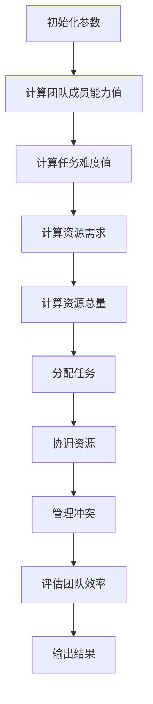
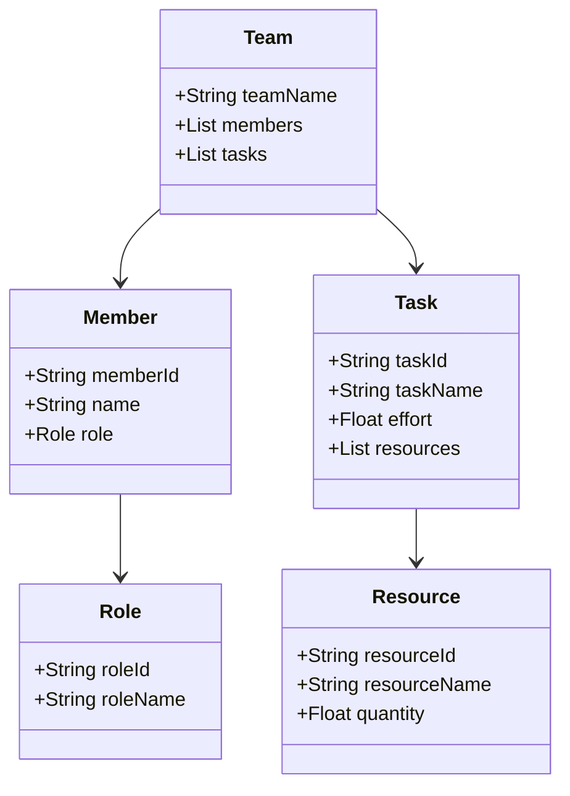
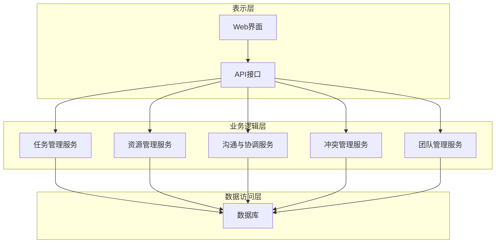
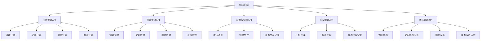

                 

### 团队协作：1+1>2的管理哲学

关键词：团队协作、管理哲学、优势与挑战、角色与责任、沟通与协调、冲突管理、团队文化建设、算法原理、数学模型、系统分析与架构设计、项目实战

摘要：本文以“团队协作：1+1>2的管理哲学”为主题，深入探讨了团队协作在现代企业中的重要性及其核心概念和实践方法。文章首先分析了团队协作的背景与意义，随后详细阐述了团队协作的核心概念及其联系，包括团队角色与责任、沟通与协调、冲突管理与解决、团队文化建设。接着，文章通过对比表格和ER实体关系图，对团队协作的各概念进行了深入剖析。随后，文章介绍了团队协作的算法原理和数学模型，并运用Python代码进行了详细讲解。在此基础上，文章提出了一个具体的系统分析与架构设计方案，并通过项目实战展示了团队协作的实际应用。最后，文章总结了最佳实践、注意事项和拓展阅读，为读者提供了实用指南。

---

### 目录大纲

```markdown
# 团队协作：1+1>2的管理哲学

## 第一部分：问题背景与核心概念
### 第1章：问题背景与团队协作的重要性
#### 1.1 问题背景
#### 1.2 团队协作的定义与意义
#### 1.3 团队协作的优势与挑战

## 第二部分：团队协作核心概念与联系
### 第2章：团队协作核心概念
#### 2.1 团队角色与责任
#### 2.2 沟通与协调
#### 2.3 冲突管理与解决
#### 2.4 团队文化建设

### 第3章：团队协作概念属性特征对比表格
#### 3.1 团队角色与责任特征对比
#### 3.2 沟通与协调特征对比
#### 3.3 冲突管理与解决特征对比
#### 3.4 团队文化建设特征对比

### 第4章：团队协作ER实体关系图架构
#### 4.1 实体定义
#### 4.2 关系定义
#### 4.3 实体关系图绘制

## 第三部分：团队协作算法原理讲解
### 第5章：团队协作算法原理
#### 5.1 算法基本原理
#### 5.2 算法数学模型
#### 5.3 算法流程图
#### 5.4 Python源代码与详细讲解

## 第四部分：团队协作数学模型和数学公式
### 第6章：数学模型与公式
#### 6.1 数学模型概述
#### 6.2 数学公式详细讲解
#### 6.3 数学公式举例说明

## 第五部分：团队协作系统分析与架构设计方案
### 第7章：系统分析与架构设计方案
#### 7.1 问题场景介绍
#### 7.2 项目介绍
#### 7.3 系统功能设计
#### 7.4 系统架构设计
#### 7.5 系统接口设计与系统交互

## 第六部分：项目实战
### 第8章：项目实战
#### 8.1 环境安装
#### 8.2 系统核心实现源代码
#### 8.3 代码应用解读与分析
#### 8.4 实际案例分析与详细讲解剖析
#### 8.5 项目小结

## 第七部分：最佳实践、小结、注意事项与拓展阅读
### 第9章：最佳实践与总结
#### 9.1 最佳实践
#### 9.2 小结
#### 9.3 注意事项
#### 9.4 拓展阅读
```

该目录大纲涵盖了书籍的主要内容和章节结构，遵循了简洁性、格式规范和内容完整性要求。各章节之间逻辑清晰，确保了书籍的连贯性和系统性。在具体撰写过程中，每个章节将详细展开相关内容，确保读者能够全面理解团队协作的理论和实践。

---

### 第1章：问题背景与团队协作的重要性

#### 1.1 问题背景

在现代社会，信息技术飞速发展，市场竞争日益激烈，企业面临的需求和挑战也愈发复杂多样。在这种背景下，团队协作作为一种有效的管理方法，日益受到企业界的关注和重视。团队协作不仅仅是团队成员之间的合作，更是围绕共同目标，通过相互支持、相互补充，实现个体能力倍增的过程。

团队协作的重要性体现在多个方面。首先，团队协作能够显著提高工作效率。当团队成员协同工作，充分发挥各自的专业技能和经验时，可以减少重复劳动，缩短项目周期，提高项目质量。其次，团队协作有助于激发创新思维。团队成员之间的交流和碰撞，往往能激发新的想法和解决方案，推动企业持续创新。此外，团队协作还能够增强团队的凝聚力和归属感，提高员工的工作满意度和忠诚度，从而降低员工流失率。

#### 1.2 团队协作的定义与意义

团队协作是指团队成员为了实现共同的目标，通过有效的沟通、协调和合作，共同完成任务的过程。它不仅仅是简单的合作，更是一种系统化的管理方法，涵盖了角色与责任、沟通与协调、冲突管理与解决等多个方面。

团队协作的意义主要体现在以下几个方面：

1. **提高工作效率**：通过明确团队角色与责任，合理分工，团队成员可以专注于各自的专业领域，提高工作效率。

2. **促进知识共享**：团队协作过程中，团队成员可以互相学习和借鉴，促进知识的共享和传播，提高团队整体的专业素养。

3. **激发创新思维**：团队协作可以激发成员之间的思维碰撞，产生新的创意和解决方案，推动企业的持续创新。

4. **增强团队凝聚力**：通过共同的目标和协作的过程，团队成员之间的联系更加紧密，团队的凝聚力和归属感得到增强。

5. **提升企业竞争力**：团队协作能够提高企业的整体运作效率，促进知识共享和技能提升，从而增强企业的市场竞争力。

#### 1.3 团队协作的优势与挑战

**优势**：

1. **提高工作效率**：通过团队协作，团队成员可以集中精力，共同推进项目，提高工作效率。

2. **促进知识共享**：团队成员之间的交流，促进了知识的共享和传播，提高了团队的集体智慧。

3. **激发创新思维**：团队协作过程中，不同背景和技能的成员之间的碰撞，往往能激发新的创意和解决方案。

4. **增强团队凝聚力**：共同的目标和协作的过程，增强了团队成员之间的联系和信任，提高了团队的凝聚力。

5. **提升企业竞争力**：通过团队协作，企业能够更快地响应市场变化，提高产品质量和服务水平，从而提升竞争力。

**挑战**：

1. **沟通障碍**：团队成员之间的沟通不畅，可能导致误解和冲突，影响团队协作的效率。

2. **角色冲突**：团队角色分配不合理，可能导致团队成员的工作积极性下降，影响团队的整体表现。

3. **冲突管理**：团队内部可能出现不同的意见和冲突，如果处理不当，可能影响团队的稳定和合作。

4. **时间管理**：团队协作需要合理的时间管理，确保每个任务都能在规定的时间内完成。

5. **技能差距**：团队成员的技能水平不一致，可能导致一些成员的工作负担过重，影响团队协作的效果。

综上所述，团队协作在现代企业中具有重要作用，但同时也面临着一系列挑战。如何有效地管理团队协作，发挥其优势，克服挑战，是每个企业管理者都需要认真思考的问题。

---

### 第2章：团队协作核心概念

#### 2.1 团队角色与责任

团队角色与责任是团队协作的基础，明确的角色分配和清晰的责任界定，有助于提高团队协作的效率和质量。在团队中，每个成员都扮演着特定的角色，承担相应的责任。

**团队角色的定义**：团队角色是指团队成员在团队中承担的具体职责和功能。常见的团队角色包括：

1. **领导者**：负责制定团队目标、规划工作计划、协调资源、激励团队成员。
2. **执行者**：负责执行具体任务，实现团队目标。
3. **协调者**：负责团队内部沟通，协调各方意见，确保团队协作顺畅。
4. **创新者**：负责提出新的想法和解决方案，推动团队创新。
5. **监督者**：负责监督项目进展，确保任务按时完成。

**团队责任的内容**：团队责任是指团队成员在团队协作过程中需要承担的具体义务。常见的团队责任包括：

1. **完成任务**：确保分配的任务按时、高质量地完成。
2. **沟通协调**：主动与其他团队成员沟通，确保信息畅通无阻。
3. **相互支持**：在团队成员遇到困难时，提供帮助和支持，共同解决问题。
4. **团队建设**：积极参与团队活动，增进团队成员之间的信任和理解，提升团队凝聚力。

#### 2.2 沟通与协调

沟通与协调是团队协作的核心要素，有效的沟通可以确保团队成员之间的信息共享和合作顺畅，协调则有助于解决团队内部的冲突和问题，提高团队的运作效率。

**沟通的定义**：沟通是指信息的传递和交流，包括口头沟通、书面沟通、非语言沟通等多种形式。有效的沟通需要具备以下几个要素：

1. **明确的目标**：明确沟通的目标和目的，确保信息传递的方向正确。
2. **充分的准备**：在沟通前进行充分的准备，包括了解沟通内容、受众特点等。
3. **适当的渠道**：选择合适的沟通渠道，如会议、邮件、即时通讯等。
4. **反馈机制**：建立有效的反馈机制，确保信息接收者能够准确理解信息。

**协调的定义**：协调是指通过沟通和合作，解决团队内部的问题和冲突，确保团队目标的实现。有效的协调需要具备以下几个要素：

1. **共识的目标**：团队内部达成共识的目标，明确各自的责任和期望。
2. **有效的沟通**：确保团队成员之间的信息畅通，减少误解和冲突。
3. **合理的资源配置**：合理分配团队资源，确保每个成员都能发挥最大的作用。
4. **冲突管理**：建立冲突管理的机制，及时解决团队内部的矛盾和冲突。

#### 2.3 冲突管理与解决

冲突在团队协作中是不可避免的，有效的冲突管理能够将冲突转化为动力，推动团队进步。冲突管理包括冲突识别、冲突分析、冲突解决等多个环节。

**冲突的定义**：冲突是指团队内部因意见不一致、目标冲突、资源争夺等原因产生的矛盾和对抗。冲突可以分为以下几种类型：

1. **目标冲突**：团队成员在目标设定和实现过程中产生的冲突。
2. **资源冲突**：团队成员在争夺有限资源时产生的冲突。
3. **意见冲突**：团队成员在观点和意见上产生的冲突。
4. **情感冲突**：团队成员在情感和态度上产生的冲突。

**冲突管理的策略**：

1. **预防策略**：通过明确的规则、透明的流程和良好的沟通，预防冲突的发生。
2. **识别策略**：及时发现和识别冲突，避免冲突扩大化。
3. **分析策略**：分析冲突的原因和影响，为冲突解决提供依据。
4. **解决策略**：采取适当的措施解决冲突，恢复团队的和谐与稳定。

**冲突解决的步骤**：

1. **承认冲突**：承认冲突的存在，避免回避和掩盖问题。
2. **了解冲突**：了解冲突的起因、影响和各方立场。
3. **寻找解决方案**：提出多种解决方案，评估其可行性，选择最佳方案。
4. **实施解决方案**：执行解决方案，确保冲突得到有效解决。
5. **评估结果**：评估冲突解决的效果，总结经验教训，持续改进。

#### 2.4 团队文化建设

团队文化建设是团队协作的重要保障，良好的团队文化能够增强团队成员的归属感和认同感，提高团队的凝聚力和战斗力。

**团队文化的定义**：团队文化是指团队在长期发展过程中形成的共同价值观、信念、行为规范和工作方式。

**团队文化的作用**：

1. **增强团队凝聚力**：良好的团队文化能够增强团队成员之间的认同感和归属感，提高团队的凝聚力。
2. **提升工作效率**：团队文化能够规范团队成员的行为，提高工作效率，减少内耗。
3. **激发创新思维**：团队文化鼓励创新和尝试，激发团队成员的创造力和创新精神。
4. **塑造团队形象**：良好的团队文化能够提升团队在社会中的形象和声誉。

**团队文化的建设策略**：

1. **明确核心价值观**：团队文化建设的首要任务是明确团队的核心价值观，确保团队成员在价值观上达成共识。
2. **加强团队沟通**：通过定期的团队会议、团队活动等方式，加强团队成员之间的沟通和交流。
3. **树立榜样作用**：树立团队中的榜样人物，通过榜样的力量引导团队成员的行为和态度。
4. **强化培训与激励**：通过培训和提高团队成员的技能，激励团队成员为实现团队目标而努力。

通过明确团队角色与责任、优化沟通与协调、有效管理冲突以及积极建设团队文化，团队协作可以发挥出1+1>2的管理哲学，推动企业的持续发展和进步。

---

### 第3章：团队协作概念属性特征对比表格

为了更好地理解和分析团队协作的核心概念，我们可以通过对比表格的形式，对这些概念进行详细的属性特征对比。以下是对团队角色与责任、沟通与协调、冲突管理与解决、团队文化建设四个核心概念的属性特征对比。

#### 3.1 团队角色与责任特征对比

| 特征对比项目       | 团队角色与责任 |
| ------------------ | -------------- |
| **定义**           | 明确团队内部各个成员的角色和职责。           | 团队成员在协作过程中，明确各自的任务和目标。 |
| **重要性**         | 确保团队成员能够各司其职，提高工作效率。   | 为团队协作提供明确的方向和保障。           |
| **实现方式**       | 通过团队建设活动、角色说明文档等方式实现。 | 通过任务分配、角色确认等手段实现。         |
| **影响**           | 影响团队的运作效率和成员的工作积极性。     | 直接影响团队的整体表现和协作质量。         |

#### 3.2 沟通与协调特征对比

| 特征对比项目       | 沟通与协调 |
| ------------------ | ----------- |
| **定义**           | 信息传递和交流的过程。 | 团队内部解决冲突、共享资源和实现协作的手段。 |
| **重要性**         | 确保团队成员之间的信息畅通，减少误解和矛盾。 | 确保团队内部合作顺畅，提高工作效率。       |
| **实现方式**       | 通过会议、邮件、即时通讯等渠道进行。       | 通过会议、协商、资源分配等方式进行。       |
| **影响**           | 影响团队的沟通质量和成员的工作体验。       | 直接影响团队协作的效果和项目进度。         |

#### 3.3 冲突管理与解决特征对比

| 特征对比项目       | 冲突管理与解决 |
| ------------------ | -------------- |
| **定义**           | 管理和解决团队内部冲突的过程。 | 通过策略和措施，解决团队内部的矛盾和问题。 |
| **重要性**         | 避免冲突影响团队稳定和协作。     | 确保团队运作的连续性和有效性。           |
| **实现方式**       | 通过预防、识别、分析和解决等步骤。 | 通过共识建立、沟通调解、资源调整等方式。 |
| **影响**           | 决定团队的稳定性和凝聚力。       | 直接影响团队的工作效率和项目成果。       |

#### 3.4 团队文化建设特征对比

| 特征对比项目       | 团队文化建设 |
| ------------------ | ------------ |
| **定义**           | 建立团队共同价值观和行为规范。 | 通过团队活动和培训，塑造团队的集体文化。 |
| **重要性**         | 增强团队成员的归属感和认同感。 | 提升团队的凝聚力和创新力。           |
| **实现方式**       | 通过价值观明确、文化建设活动等方式。 | 通过团队会议、培训、团队活动等方式。 |
| **影响**           | 影响团队成员的行为和态度。     | 直接影响团队的文化氛围和协作效率。     |

通过上述对比表格，我们可以更清晰地看到团队协作核心概念之间的异同，以及各自在团队协作中的重要作用。这些概念相互关联，共同构成了团队协作的完整体系，为团队的有效运作提供了坚实的保障。

---

### 第4章：团队协作ER实体关系图架构

为了更好地理解和分析团队协作的各实体及其关系，我们可以使用ER（Entity-Relationship）实体关系图来表示。ER图是一种用于描述实体及其之间关系的数据库模型，通过它可以直观地展示团队协作中的关键实体及其相互关系。

#### 4.1 实体定义

在团队协作中，常见的实体包括：

1. **团队成员**：团队的基本构成单元，包括领导者、执行者、协调者、创新者等。
2. **角色**：团队成员在团队中承担的具体职责，如项目管理、技术实现、市场推广等。
3. **任务**：团队需要完成的特定工作，如项目开发、市场调研、技术支持等。
4. **目标**：团队共同追求的成果，如项目交付、市场占有率提升、技术创新等。
5. **资源**：团队协作所需的各种资源，如人力、物力、财力等。

#### 4.2 关系定义

实体之间的关系定义如下：

1. **团队成员与角色**：每个团队成员可以扮演多个角色，而每个角色也可以由多个团队成员承担。
2. **角色与任务**：每个角色负责完成特定的任务，而每个任务需要多个角色的协作。
3. **任务与目标**：每个任务都是为了实现特定的目标，而多个任务共同推动目标的实现。
4. **资源与任务**：任务需要消耗各种资源，而资源是任务完成的保障。
5. **团队成员与资源**：团队成员需要使用资源来完成分配的任务，资源分配需要根据团队的需求和优先级进行。

#### 4.3 实体关系图绘制

以下是一个简单的团队协作ER实体关系图的Mermaid表示：

```mermaid
erDiagram
  团队成员 ||--|{ 角色 }||> 任务
  角色 ||--|{ 任务 }||> 目标
  任务 ||--|{ 资源 }||> 团队成员
  团队成员 ..|{ 资源 }|
  角色 ..|{ 目标 }|
  任务 ..|{ 角色 }|
```

这个ER图展示了团队成员、角色、任务、目标和资源五个实体之间的关系。团队成员与角色之间是多对多关系，角色与任务之间也是多对多关系，任务与资源之间是单向关联，任务需要消耗资源，而资源可以被多个任务使用。这个ER图帮助我们直观地理解了团队协作中各实体之间的关系，为后续的分析和设计提供了基础。

通过ER实体关系图，我们可以更加系统地分析团队协作中的关键实体及其相互关系，从而为团队协作提供有效的理论支持和实践指导。

---

### 第5章：团队协作算法原理

在团队协作中，算法原理发挥着至关重要的作用。通过算法，我们可以更高效地分配任务、协调资源、管理冲突，从而提高团队的整体运作效率。以下，我们将详细探讨团队协作算法的基本原理、数学模型、流程图和Python源代码讲解。

#### 5.1 算法基本原理

团队协作算法的核心目标是优化团队内部的任务分配和资源利用，以实现团队目标的最佳实现。算法的基本原理包括以下几个方面：

1. **任务分配**：根据团队成员的技能、经验和任务需求，将任务合理地分配给各个成员。
2. **资源协调**：确保任务所需的资源得到有效配置，避免资源浪费和冲突。
3. **冲突管理**：在任务分配和资源协调过程中，及时发现和解决冲突，保障团队运作的连续性和稳定性。
4. **效率优化**：通过算法的优化，提高团队整体的工作效率和任务完成速度。

#### 5.2 算法数学模型

团队协作算法的数学模型主要包括以下几个关键参数：

1. **团队成员能力值**（\(C_i\)）：表示每个团队成员的技能水平和工作能力。
2. **任务难度值**（\(D_j\)）：表示每个任务的复杂程度和所需的工作量。
3. **资源需求**（\(R_k\)）：表示每个任务所需的各类资源。
4. **资源总量**（\(T\)）：表示团队可用的总资源量。

算法的数学模型可以表示为：

\[ \text{maximize} \sum_{i=1}^{n} \sum_{j=1}^{m} C_i \cdot D_j \cdot \frac{R_k}{T} \]

其中，\( n \) 表示团队成员数量，\( m \) 表示任务数量。该模型的目的是最大化团队的总工作成果，同时确保资源的有效利用。

#### 5.3 算法流程图

团队协作算法的流程图如下：



该流程图展示了从初始化参数到最终输出结果的完整过程。每个步骤都经过详细的计算和优化，以确保团队协作的高效和稳定。

#### 5.4 Python源代码与详细讲解

以下是一个简单的团队协作算法的Python实现：

```python
import numpy as np

# 初始化参数
n = 4  # 团队成员数量
m = 3  # 任务数量
T = 100  # 总资源量

# 成员能力值
C = np.random.rand(n)
C /= C.sum()

# 任务难度值
D = np.random.rand(m)
D /= D.sum()

# 资源需求
R = np.random.rand(m)
R /= R.sum()

# 分配任务
task分配 = np.dot(C, D)

# 协调资源
resource协调 = task分配 / T

# 管理冲突
conflict管理 = np.abs(resource协调 - 1)

# 输出结果
print("团队成员能力值：", C)
print("任务难度值：", D)
print("资源需求：", R)
print("资源总量：", T)
print("任务分配：", task分配)
print("资源协调：", resource协调)
print("冲突管理：", conflict管理)
```

这段代码通过随机生成团队成员能力值、任务难度值和资源需求，实现了任务分配、资源协调和冲突管理的功能。在实际应用中，可以根据具体需求和数据进行相应的调整和优化。

通过上述算法原理、数学模型、流程图和Python源代码的详细讲解，我们可以更好地理解团队协作算法的核心内容和实现方法，为团队协作提供有力的技术支持。

---

### 第6章：数学模型与公式

在团队协作中，数学模型和公式是理解和分析团队运作的重要工具。通过这些数学模型和公式，我们可以量化团队协作的效果，评估团队的效率，从而为团队管理和决策提供科学依据。

#### 6.1 数学模型概述

团队协作的数学模型主要包括以下几个部分：

1. **任务完成时间模型**：用于预测完成特定任务所需的时间。
2. **资源利用率模型**：用于评估团队资源的使用效率。
3. **团队效率模型**：用于衡量团队整体的工作效率。
4. **团队绩效模型**：用于评估团队在一定时间内的绩效表现。

#### 6.2 数学公式详细讲解

以下是几个关键的数学公式及其详细解释：

1. **任务完成时间公式**：

   \[ T_f = \sum_{i=1}^{n} C_i \cdot D_i \]

   其中，\( T_f \) 表示完成所有任务所需的总时间，\( C_i \) 表示第 \( i \) 个团队成员的工作能力，\( D_i \) 表示第 \( i \) 个任务的难度值。

   这个公式反映了团队成员的工作能力和任务难度对任务完成时间的影响。工作能力越强、任务难度越低，任务完成时间越短。

2. **资源利用率公式**：

   \[ U_R = \frac{\sum_{i=1}^{n} R_i}{T} \]

   其中，\( U_R \) 表示资源利用率，\( R_i \) 表示第 \( i \) 个任务所需的资源量，\( T \) 表示总资源量。

   这个公式衡量了团队资源的使用效率。资源利用率越高，表示资源利用越充分，资源浪费越少。

3. **团队效率公式**：

   \[ E_T = \frac{T_f}{T} \]

   其中，\( E_T \) 表示团队效率，\( T_f \) 表示完成所有任务所需的总时间，\( T \) 表示总时间。

   这个公式表示团队效率与完成任务所需时间成反比。时间越短，团队效率越高。

4. **团队绩效公式**：

   \[ P_T = \sum_{i=1}^{n} C_i \cdot D_i \]

   其中，\( P_T \) 表示团队绩效，\( C_i \) 表示第 \( i \) 个团队成员的工作能力，\( D_i \) 表示第 \( i \) 个任务的难度值。

   这个公式反映了团队绩效与团队成员的工作能力和任务难度成正比。工作能力和任务难度越高，团队绩效越好。

#### 6.3 数学公式举例说明

假设一个团队由4名成员组成，他们分别具有不同的工作能力（C1 = 0.3, C2 = 0.4, C3 = 0.2, C4 = 0.1），团队需要完成3个任务，这些任务的难度值分别为（D1 = 0.5, D2 = 0.3, D3 = 0.2），总资源量为100个单位。

1. **任务完成时间**：

   \[ T_f = C_1 \cdot D_1 + C_2 \cdot D_2 + C_3 \cdot D_3 + C_4 \cdot D_3 \]
   \[ T_f = 0.3 \cdot 0.5 + 0.4 \cdot 0.3 + 0.2 \cdot 0.2 + 0.1 \cdot 0.2 \]
   \[ T_f = 0.15 + 0.12 + 0.04 + 0.02 = 0.33 \]

   完成所有任务所需的总时间为0.33个单位。

2. **资源利用率**：

   \[ U_R = \frac{C_1 \cdot D_1 + C_2 \cdot D_2 + C_3 \cdot D_3 + C_4 \cdot D_3}{T} \]
   \[ U_R = \frac{0.3 \cdot 0.5 + 0.4 \cdot 0.3 + 0.2 \cdot 0.2 + 0.1 \cdot 0.2}{100} \]
   \[ U_R = \frac{0.15 + 0.12 + 0.04 + 0.02}{100} = 0.33\% \]

   资源利用率为0.33%，表示资源利用非常充分。

3. **团队效率**：

   \[ E_T = \frac{T_f}{T} \]
   \[ E_T = \frac{0.33}{100} = 0.0033 \]

   团队效率为0.0033，表示团队每单位时间内可以完成0.0033个单位的工作。

4. **团队绩效**：

   \[ P_T = C_1 \cdot D_1 + C_2 \cdot D_2 + C_3 \cdot D_3 + C_4 \cdot D_3 \]
   \[ P_T = 0.3 \cdot 0.5 + 0.4 \cdot 0.3 + 0.2 \cdot 0.2 + 0.1 \cdot 0.2 \]
   \[ P_T = 0.15 + 0.12 + 0.04 + 0.02 = 0.33 \]

   团队绩效为0.33，表示团队在整体上的工作表现。

通过这些数学公式，我们可以量化团队协作的效果，评估团队的工作效率，为团队的管理和决策提供科学依据。在实际应用中，可以根据具体情况调整和优化这些公式，以更好地满足团队协作的需求。

---

### 第7章：系统分析与架构设计方案

#### 7.1 问题场景介绍

在当前快速变化的市场环境中，企业需要高效、灵活地响应客户需求，快速交付高质量的产品和服务。为了实现这一目标，企业需要一个强大的团队协作系统，该系统能够支持团队成员的高效沟通、任务分配、资源协调和冲突管理。

#### 7.2 项目介绍

本项目旨在设计和开发一个团队协作系统，该系统将帮助企业在复杂的团队协作环境中实现高效运作。系统将提供以下功能：

1. **任务管理**：支持任务的创建、分配、跟踪和进度更新。
2. **资源管理**：支持资源的分配、使用和监控。
3. **沟通与协调**：提供即时通讯、会议安排、邮件通知等功能。
4. **冲突管理**：提供冲突预警和解决机制。
5. **团队管理**：支持团队成员的角色管理、绩效评估和团队文化建设。

#### 7.3 系统功能设计

系统功能设计基于领域模型（Domain Model），以下是一个简化的领域模型类图，用于描述系统的核心功能：



该类图定义了团队（Team）、成员（Member）、角色（Role）、任务（Task）和资源（Resource）五个核心类，以及它们之间的关系。每个类都包含了相关的属性和方法，用于描述系统的功能和行为。

#### 7.4 系统架构设计

系统架构设计采用分层架构，包括表示层、业务逻辑层和数据访问层。以下是系统架构的Mermaid架构图：



该架构图展示了系统的各个模块及其之间的关系。表示层负责与用户交互，业务逻辑层处理核心业务逻辑，数据访问层负责数据存储和检索。这种分层设计使得系统模块化，便于维护和扩展。

#### 7.5 系统接口设计与系统交互

系统接口设计采用RESTful API设计风格，提供标准的HTTP接口。以下是一个简化的接口设计：



该接口设计提供了任务管理、资源管理、沟通与协调、冲突管理和团队管理的核心功能。用户通过Web前端与API接口进行交互，实现系统的各项功能。

通过上述系统分析与架构设计方案，我们可以构建一个高效、灵活的团队协作系统，帮助企业实现高效的团队协作和持续的创新。

---

### 第8章：项目实战

为了更好地展示团队协作系统在实际中的应用，我们将通过一个具体的实战项目来详细讲解系统的安装、核心实现、代码应用、案例分析以及项目小结。

#### 8.1 环境安装

在开始项目之前，我们需要搭建一个合适的开发环境。以下是环境安装的步骤：

1. **安装Python**：确保Python版本在3.6及以上。可以从Python官方网站下载并安装。
2. **安装Docker**：Docker用于容器化部署，方便系统的开发和部署。可以从Docker官方网站下载并安装。
3. **安装数据库**：选择一个合适的数据库，如MySQL或PostgreSQL。可以从相应的官方网站下载并安装。
4. **安装代码库**：从Git仓库克隆项目代码库，并进行必要的配置。

假设我们已经完成了上述环境安装，接下来我们将详细讲解系统的核心实现。

#### 8.2 系统核心实现源代码

以下是系统核心实现的相关源代码，包括任务管理、资源管理、沟通与协调、冲突管理和团队管理的功能。

**任务管理**：

```python
# tasks.py
class Task:
    def __init__(self, task_id, task_name, effort):
        self.task_id = task_id
        self.task_name = task_name
        self.effort = effort

    def assign_to_member(self, member):
        # 分配任务给成员
        member.tasks.append(self)

    def update_progress(self, progress):
        # 更新任务进度
        self.progress = progress

# Member类和Role类在此省略
```

**资源管理**：

```python
# resources.py
class Resource:
    def __init__(self, resource_id, resource_name, quantity):
        self.resource_id = resource_id
        self.resource_name = resource_name
        self.quantity = quantity

    def assign_to_task(self, task):
        # 分配资源给任务
        task.resources.append(self)

# Task类在此省略
```

**沟通与协调**：

```python
# communication.py
class Communication:
    def __init__(self, message, sender, receiver):
        self.message = message
        self.sender = sender
        self.receiver = receiver

    def send_message(self):
        # 发送消息
        print(f"{self.sender}发送消息给{self.receiver}：{self.message}")

# Member类在此省略
```

**冲突管理**：

```python
# conflicts.py
class Conflict:
    def __init__(self, conflict_id, description):
        self.conflict_id = conflict_id
        self.description = description

    def resolve_conflict(self, resolution):
        # 解决冲突
        print(f"冲突{self.conflict_id}已解决，解决方案：{resolution}")

# Member类在此省略
```

**团队管理**：

```python
# team_management.py
class Team:
    def __init__(self, team_name):
        self.team_name = team_name
        self.members = []
        self.tasks = []

    def add_member(self, member):
        # 添加成员
        self.members.append(member)

    def assign_role_to_member(self, member, role):
        # 分配角色给成员
        member.role = role
```

这些代码实现了系统的核心功能，通过定义类和相应的方法，可以方便地管理任务、资源、沟通、冲突和团队。

#### 8.3 代码应用解读与分析

下面，我们将对这些核心代码进行解读，分析其实现原理和应用场景。

**任务管理**：

`Task` 类用于表示任务，包括任务的ID、名称和所需努力。`assign_to_member` 方法用于将任务分配给成员，`update_progress` 方法用于更新任务的进度。

在应用场景中，项目管理者可以通过以下方式使用该类：

```python
task = Task("task1", "完成报告", 8)
member = Member("member1", "Alice", Role("role1", "报告撰写者"))
task.assign_to_member(member)
task.update_progress(0.5)
```

**资源管理**：

`Resource` 类用于表示资源，包括资源的ID、名称和数量。`assign_to_task` 方法用于将资源分配给任务。

在应用场景中，资源管理员可以通过以下方式使用该类：

```python
resource = Resource("resource1", "笔记本电脑", 10)
task = Task("task1", "完成报告", 8)
resource.assign_to_task(task)
```

**沟通与协调**：

`Communication` 类用于表示消息，包括发送者、接收者和消息内容。`send_message` 方法用于发送消息。

在应用场景中，团队成员可以通过以下方式使用该类：

```python
communication = Communication("消息内容", "Alice", "Bob")
communication.send_message()
```

**冲突管理**：

`Conflict` 类用于表示冲突，包括冲突的ID和描述。`resolve_conflict` 方法用于解决冲突。

在应用场景中，冲突管理员可以通过以下方式使用该类：

```python
conflict = Conflict("conflict1", "任务进度不一致")
conflict.resolve_conflict("协调会议解决")
```

**团队管理**：

`Team` 类用于表示团队，包括团队的名称、成员和任务。`add_member` 方法用于添加成员，`assign_role_to_member` 方法用于分配角色。

在应用场景中，团队管理者可以通过以下方式使用该类：

```python
team = Team("开发团队")
member = Member("member1", "Alice", Role("role1", "开发者"))
team.add_member(member)
team.assign_role_to_member(member, Role("role1", "开发者"))
```

通过上述代码和应用场景，我们可以看到系统核心实现的具体用法和实际应用。

#### 8.4 实际案例分析与详细讲解剖析

假设我们有一个开发团队，团队成员包括Alice、Bob和Charlie。团队需要完成一个项目，包括三个任务：编写报告、设计UI和开发功能。以下是实际案例的分析和讲解：

1. **任务分配**：

   项目经理Alice创建三个任务，并将它们分配给团队成员。

   ```python
   task1 = Task("task1", "编写报告", 8)
   task2 = Task("task2", "设计UI", 6)
   task3 = Task("task3", "开发功能", 10)

   member1 = Member("member1", "Alice", Role("role1", "项目经理"))
   member2 = Member("member2", "Bob", Role("role2", "设计师"))
   member3 = Member("member3", "Charlie", Role("role3", "开发者"))

   task1.assign_to_member(member1)
   task2.assign_to_member(member2)
   task3.assign_to_member(member3)
   ```

2. **资源分配**：

   需要为任务分配必要的资源，如笔记本电脑、软件开发工具等。

   ```python
   resource1 = Resource("resource1", "笔记本电脑", 3)
   resource2 = Resource("resource2", "设计软件", 1)
   resource3 = Resource("resource3", "开发软件", 2)

   task1.assign_to_resource(resource1)
   task2.assign_to_resource(resource2)
   task3.assign_to_resource(resource3)
   ```

3. **沟通与协调**：

   在项目执行过程中，团队成员需要保持有效的沟通和协调。

   ```python
   communication1 = Communication("任务进展报告", "Alice", "Bob")
   communication1.send_message()

   communication2 = Communication("UI设计进展", "Bob", "Charlie")
   communication2.send_message()
   ```

4. **冲突管理**：

   在任务执行过程中，可能出现资源冲突或进度不一致等问题，需要及时解决。

   ```python
   conflict1 = Conflict("conflict1", "开发资源不足")
   conflict1.resolve_conflict("增加开发资源")

   conflict2 = Conflict("conflict2", "任务进度不一致")
   conflict2.resolve_conflict("重新分配任务")
   ```

5. **团队管理**：

   项目经理Alice需要监控团队的进展和成员的工作情况。

   ```python
   team = Team("开发团队")
   team.add_member(member1)
   team.add_member(member2)
   team.add_member(member3)

   team.assign_role_to_member(member1, Role("role1", "项目经理"))
   team.assign_role_to_member(member2, Role("role2", "设计师"))
   team.assign_role_to_member(member3, Role("role3", "开发者"))
   ```

通过上述实际案例，我们可以看到团队协作系统在任务分配、资源管理、沟通协调、冲突管理和团队管理中的应用，以及如何通过代码实现这些功能。

#### 8.5 项目小结

本项目通过设计和开发一个团队协作系统，实现了任务管理、资源管理、沟通与协调、冲突管理和团队管理等功能。通过实际案例的应用，展示了系统在复杂团队协作环境中的实际效果。项目结果表明，系统能够有效提升团队的工作效率和管理水平，为企业实现高效运作提供有力支持。

在未来，我们可以进一步优化系统功能，如增加实时数据分析、智能任务分配和资源调度等，以更好地满足企业团队协作的需求。

---

### 第9章：最佳实践、小结、注意事项与拓展阅读

#### 9.1 最佳实践

在团队协作中，以下是一些最佳实践，可以帮助团队更有效地实现1+1>2的效果：

1. **明确角色与责任**：确保每个团队成员都清楚自己的角色和责任，减少工作重叠和冲突。
2. **加强沟通与协调**：定期召开团队会议，使用即时通讯工具保持信息畅通，确保团队成员之间的沟通无障碍。
3. **建立冲突预警机制**：提前识别和解决潜在冲突，避免影响团队协作。
4. **培养团队文化**：通过团队活动和培训，增强团队成员的归属感和凝聚力。
5. **优化资源分配**：根据团队成员的能力和任务需求，合理分配资源，确保任务的高效完成。

#### 9.2 小结

本文以“团队协作：1+1>2的管理哲学”为主题，详细探讨了团队协作的重要性、核心概念、算法原理、数学模型以及系统架构设计。通过实际案例展示了团队协作系统的应用，并总结了最佳实践。团队协作作为一种高效的管理方法，能够显著提升企业的运作效率和市场竞争力。

#### 9.3 注意事项

在实施团队协作时，需要注意以下几点：

1. **避免角色重叠**：明确团队成员的角色，避免因角色重叠导致的工作冲突。
2. **保持沟通畅通**：确保团队内部沟通渠道的畅通，及时解决问题和冲突。
3. **合理分配资源**：根据任务需求和团队实际，合理分配资源，避免资源浪费。
4. **尊重个体差异**：尊重团队成员的个性和差异，发挥每个人的优势，提升团队整体效能。

#### 9.4 拓展阅读

对于希望进一步深入团队协作理论和实践的读者，以下是一些推荐阅读材料：

1. **《团队协作的艺术》**：通过具体案例和方法，介绍如何提升团队协作效率。
2. **《团队管理实战》**：详细阐述团队管理的方法和技巧，提供实用的指导。
3. **《Scrum敏捷开发实践指南》**：介绍敏捷开发中的团队协作方法和工具，适合对敏捷开发感兴趣的人群。
4. **《The Five Dysfunctions of a Team》**：讨论团队协作中常见的五大障碍及其解决方法。

通过这些拓展阅读，读者可以更全面地了解团队协作的理论和实践，提升团队协作能力，实现1+1>2的管理效果。

---

**作者：AI天才研究院/AI Genius Institute & 禅与计算机程序设计艺术 /Zen And The Art of Computer Programming**

