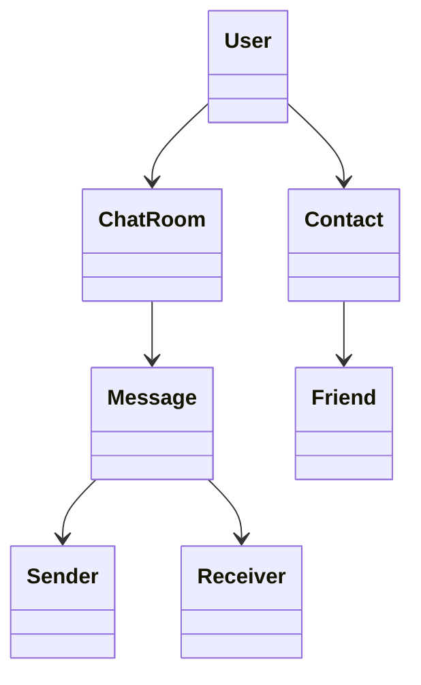
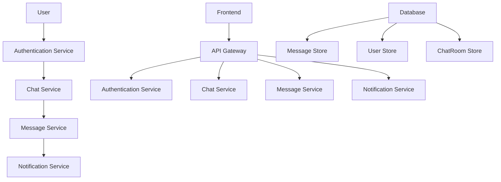
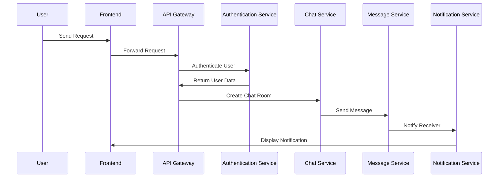

                 

### 引言与背景介绍

在现代企业中，团队协作的重要性日益凸显。一个高效的团队不仅能够提高工作效率，还能在复杂多变的市场环境中保持竞争力。然而，团队协作并非易事，许多团队在实际运作中往往无法充分发挥其潜力，导致1+1<2的效果。本文旨在探讨如何通过合理的团队协作方法与实践，实现1+1>2的效果，提升团队的整体绩效。

#### 第1章: 问题背景与核心概念

**问题描述**：

现代企业面临的市场环境日益复杂，项目需求多变，单一个体很难独立完成复杂的任务。因此，团队协作成为了提高工作效率和项目成功的关键。然而，团队协作过程中常常遇到以下问题：

1. **沟通不畅**：团队成员之间缺乏有效沟通，导致信息传递不准确或延迟。
2. **任务分配不合理**：团队成员职责不明确，任务分配不合理，影响工作效率。
3. **协作效率低下**：团队内部协作不畅，协作效率低下，影响项目进度。
4. **目标不一致**：团队成员对项目目标理解不一致，导致行动不协调。
5. **冲突与误解**：团队成员之间因意见分歧或工作压力产生冲突和误解，影响团队士气。

**问题解决**：

为了解决上述问题，本文将介绍团队协作的基本原理、工具与技巧，并结合实际案例进行分析，以帮助读者理解和实践高效的团队协作。

**边界与外延**：

团队协作不仅局限于企业内部，也适用于跨组织、跨领域的合作。例如，跨职能团队、供应链管理、合作伙伴关系等都需要高效的团队协作。

**概念结构与核心要素组成**：

1. **团队协作的定义与特征**：
   - 定义：团队协作是指团队成员在共同目标下，通过合作与协调，共同完成任务的实践活动。
   - 特征：共享目标、分工合作、互相依赖、共同责任。

2. **团队成员的角色与职责**：
   - 角色：团队成员根据项目需求和个人能力扮演不同角色，如领导者、执行者、协调者等。
   - 职责：明确团队成员的职责，确保任务分配合理，提高工作效率。

3. **团队协作的目标与原则**：
   - 目标：实现团队整体绩效的最大化，满足项目需求。
   - 原则：公平公正、相互尊重、信任合作、透明开放。

4. **团队协作的挑战与应对策略**：
   - 挑战：沟通不畅、任务分配不合理、协作效率低下等。
   - 应对策略：加强沟通、明确职责、优化协作流程等。

#### 核心概念与联系

**团队协作原理**：

1. **个体协作原理**：
   - 定义：个体协作是指团队成员在各自职责范围内，独立完成任务的实践活动。
   - 特征：独立完成、互补协作、独立评价。

2. **团队协同效应**：
   - 定义：团队协同效应是指团队成员在共同目标下，通过协同工作所产生的整体绩效大于个体绩效之和的现象。
   - 特征：共同目标、系统优化、共同评价。

3. **系统思维**：
   - 定义：系统思维是一种从整体视角分析问题、把握事物发展规律的方法论。
   - 特征：整体视角、环境依赖、系统反馈。

**概念属性特征对比表格**：

| 概念     | 特征一   | 特征二   | 特征三   |
| -------- | -------- | -------- | -------- |
| 个体协作 | 独立完成 | 互补协作 | 独立评价 |
| 团队协同 | 共同目标 | 系统优化 | 共同评价 |
| 系统思维 | 整体视角 | 环境依赖 | 系统反馈 |

**ER实体关系图架构**：

```mermaid
erDiagram
    Member ||--|{ Team }|| Leader
    Team ||--|{ Project }|| Manager
    Project ||--|{ Task }|| Assigner
```

通过上述章节的介绍，读者可以初步了解团队协作的重要性、核心概念以及基本原理。在接下来的部分，我们将进一步探讨团队协作的方法与实践，帮助读者实现1+1>2的效果。敬请期待。

### 第2章: 团队协作原理

团队协作是现代企业中提高工作效率和项目成功的关键因素。理解团队协作的基本原理，有助于团队成员更好地协同工作，实现共同目标。本章节将详细介绍团队协作的三个核心原理：个体协作原理、团队协同效应和系统思维。

#### 2.1 个体协作原理

个体协作是团队协作的基础。它指的是团队成员在各自职责范围内，独立完成任务的实践活动。个体协作具有以下特征：

1. **独立完成**：团队成员在完成个人任务时，通常需要独立思考和操作，不受其他成员的干扰。

2. **互补协作**：团队成员之间通过相互协作，弥补个人能力的不足，实现优势互补，提高整体工作效率。

3. **独立评价**：团队成员的个人表现通常根据其完成任务的质量和效率进行独立评价。

个体协作原理的重要性体现在以下几个方面：

1. **提高工作效率**：通过明确分工，团队成员可以专注于自己的任务，提高工作效率。

2. **优化资源配置**：个体协作可以避免重复劳动，优化资源配置，提高资源利用率。

3. **增强团队凝聚力**：个体协作有助于团队成员建立信任，增强团队凝聚力。

**案例**：在一个软件开发项目中，团队成员按照不同的技术领域分工合作，前端开发者专注于用户界面设计，后端开发者负责服务器端开发。通过个体协作，团队成员高效完成了各自的任务，确保项目按期交付。

#### 2.2 团队协同效应

团队协同效应是指团队成员在共同目标下，通过协同工作所产生的整体绩效大于个体绩效之和的现象。这一效应体现了团队协作的巨大潜力。团队协同效应具有以下特征：

1. **共同目标**：团队成员在明确共同目标的基础上，协同工作，形成合力。

2. **系统优化**：团队协作不仅关注个体绩效，更注重整体绩效的优化，通过系统思维实现整体最优。

3. **共同评价**：团队成员共同参与项目评价，确保评价的公正性和客观性。

团队协同效应的重要性体现在以下几个方面：

1. **提高团队整体绩效**：通过协同工作，团队可以实现整体绩效的最大化，实现1+1>2的效果。

2. **增强创新能力**：团队协同有助于激发团队成员的创造力，提高项目的创新性。

3. **提升团队士气**：团队协同效应的实现，可以增强团队成员的自信心和团队凝聚力，提升整体士气。

**案例**：在一个大型系统集成项目中，不同团队之间通过紧密合作，实现了系统的无缝集成，项目最终提前完成，并获得了客户的高度评价。这是团队协同效应的成功体现。

#### 2.3 系统思维

系统思维是一种从整体视角分析问题、把握事物发展规律的方法论。它强调事物的相互关联和整体性，有助于团队成员更好地理解团队协作的内在逻辑。系统思维具有以下特征：

1. **整体视角**：系统思维关注系统的整体性，认为系统各部分相互依赖，共同作用。

2. **环境依赖**：系统思维强调系统的环境因素对系统行为的影响，认为系统是开放的。

3. **系统反馈**：系统思维关注系统的动态行为，认为系统的行为会通过反馈机制影响系统自身。

系统思维在团队协作中的应用，有助于团队成员：

1. **优化协作流程**：通过系统思维，团队成员可以识别系统中的瓶颈和优化点，优化协作流程。

2. **提高问题解决能力**：系统思维有助于团队成员从整体视角分析问题，提高问题解决能力。

3. **增强团队凝聚力**：系统思维强调团队的整体性和共同目标，有助于增强团队凝聚力。

**案例**：在一个复杂的跨职能项目中，团队成员通过系统思维，明确了项目的关键路径和风险点，制定了详细的应对策略，确保项目按期交付。

通过以上对个体协作原理、团队协同效应和系统思维的介绍，读者可以更好地理解团队协作的基本原理。在接下来的章节中，我们将探讨团队协作的方法与技巧，帮助读者实现高效的团队协作。

### 第3章: 团队协作工具与技巧

为了实现高效的团队协作，选择合适的工具和技巧至关重要。本章节将详细介绍常用的团队协作工具以及提升协作效率的实用技巧。

#### 3.1 团队协作工具

在现代企业中，团队协作工具已经成为团队高效运作的必要手段。以下是一些常用的团队协作工具：

1. **云端办公平台**：如Google Workspace（包括Google Docs、Google Sheets、Google Slides等）和Microsoft 365（包括Word、Excel、PowerPoint等），这些工具支持多人在线协作，实时同步文档，提高了团队的工作效率。

2. **项目管理工具**：如Trello、JIRA、Asana等，这些工具可以帮助团队清晰地规划和跟踪项目进度，分配任务，管理资源，确保项目按时交付。

3. **沟通协作工具**：如Slack、Microsoft Teams、Zoom等，这些工具提供了即时通讯、视频会议、文件共享等功能，有助于团队成员之间的沟通和协作。

4. **代码管理工具**：如Git、GitHub、GitLab等，这些工具支持版本控制、代码审查、协作开发等功能，是软件开发团队必备的工具。

5. **协作白板工具**：如Miro、Mural等，这些工具提供了虚拟白板，支持多人在线绘图、注释、头脑风暴等功能，适用于设计、开发、产品管理等团队协作场景。

**选择合适工具的标准**：

1. **功能齐全**：选择能够满足团队需求的各种功能的工具，如文档协作、项目管理、沟通协作等。

2. **用户友好**：工具的界面简洁直观，易于上手，降低团队学习和使用成本。

3. **集成性**：工具能够与其他系统无缝集成，如与企业内部系统、第三方服务的集成，提高整体协作效率。

4. **安全性**：工具需要提供足够的安全性保障，如数据加密、访问控制等，确保团队协作数据的安全。

#### 3.2 团队协作技巧

除了工具的支持，团队协作的成功还依赖于团队成员之间的沟通和协作技巧。以下是一些提升团队协作效率的实用技巧：

1. **有效沟通**：

   - **明确目标与预期**：在开始协作前，确保团队成员对项目目标和预期有清晰的理解，避免误解和分歧。

   - **倾听与反馈**：在沟通中，注重倾听他人的意见，给予积极的反馈，促进双向沟通。

   - **正面表达**：使用积极、明确的语言表达观点，避免使用模糊或带有负面情绪的表述。

   - **避免冲突**：在出现分歧时，采取冷静、理性的态度，通过沟通协商解决问题，避免冲突升级。

2. **协作效率提升**：

   - **工作任务分解**：将复杂的项目任务分解为具体、可操作的任务，明确每个任务的负责人和完成时间。

   - **资源共享**：鼓励团队成员共享资源，如文档、代码库、工具等，减少重复劳动，提高协作效率。

   - **透明度管理**：保持项目进度和状态透明，定期更新任务进度和团队状态，确保所有成员对项目有清晰的了解。

   - **进度跟踪**：使用项目管理工具跟踪任务进度，确保项目按计划进行，及时调整计划和资源分配。

**案例**：在一个软件开发项目中，团队使用了JIRA进行任务管理，Slack进行即时沟通，Miro进行头脑风暴。通过明确的任务分解和透明的进度跟踪，团队在两周内成功完成了原本需要一个月的任务。

通过上述工具和技巧的运用，团队可以更高效地进行协作，实现1+1>2的效果。在接下来的章节中，我们将通过具体案例，进一步探讨团队协作的实际应用和效果。

### 第4章: 团队协作案例分析

在实际应用中，团队协作的成功与否往往决定了项目的成败。通过分析成功的团队协作案例，我们可以学习到宝贵的经验和教训，从而更好地理解和实践团队协作的原理和方法。本章节将介绍两个团队协作的典型案例，并对案例中的协作过程、系统架构和实际效果进行详细分析。

#### 4.1 案例一：某互联网公司项目团队协作实践

**项目介绍**：

某互联网公司开发了一款即时通讯应用程序，旨在提供高效、安全的即时通信服务。项目团队由前端开发者、后端开发者、测试工程师、UI/UX设计师和项目经理等组成。项目目标是在三个月内完成产品的设计和开发，并达到用户测试阶段。

**团队成员与角色**：

- **项目经理**：负责项目的整体规划和管理，协调团队成员的工作。
- **前端开发者**：负责用户界面的设计和实现，确保用户交互体验。
- **后端开发者**：负责服务器端逻辑和数据处理，确保系统稳定性和性能。
- **测试工程师**：负责测试和调试系统功能，确保产品的质量。
- **UI/UX设计师**：负责用户界面和用户体验的设计，提升产品的用户满意度。

**系统功能设计**：

为了实现项目目标，团队采用领域模型Mermaid类图来设计系统功能，如下所示：



通过这个类图，团队明确了用户、聊天室、消息、发送者和接收者以及联系人等关键实体之间的关系，为后续的开发和测试提供了清晰的指导。

**系统架构设计**：

系统架构设计采用Mermaid架构图，如下所示：



在这个架构中，用户通过前端请求认证服务进行身份验证，然后访问聊天服务、消息服务和通知服务进行通信。所有数据存储在数据库中，确保数据的一致性和安全性。

**系统接口设计**：

系统接口设计采用Mermaid序列图，如下所示：



在这个序列图中，用户通过前端发送请求，API网关进行路由和处理，然后调用相应的服务进行操作，并最终返回结果到前端，实现用户与系统之间的交互。

**案例分析**：

通过上述设计，项目团队在协作过程中展现了以下成功经验：

1. **明确的角色分工**：团队成员明确各自的角色和职责，确保任务分配合理，提高了工作效率。

2. **有效的沟通与协作**：团队采用多种协作工具（如JIRA、Slack、Miro等），确保团队成员之间的沟通畅通，及时反馈和解决问题。

3. **优化的系统架构**：通过系统思维，团队设计了清晰、高效的系统架构，确保系统的稳定性、性能和安全性。

4. **高效的开发与测试**：团队通过持续集成和持续部署（CI/CD）工具，实现了快速开发和测试，确保项目按计划进行。

然而，项目过程中也存在一些挑战：

1. **需求变更**：在项目开发过程中，客户需求发生了多次变更，团队需要快速适应并调整计划，确保项目的交付质量。

2. **资源分配**：在项目高峰期，团队成员的资源和时间分配存在一定压力，团队需要合理调配资源，确保关键任务优先完成。

通过这个案例，我们可以看到，成功的团队协作需要明确的角色分工、有效的沟通与协作、优化的系统架构以及快速响应需求变化的能力。在接下来的部分，我们将继续探讨团队协作的最佳实践，帮助读者进一步提升团队协作效率。

#### 4.2 案例分析

在分析了上述互联网公司的即时通讯应用程序项目后，我们可以深入探讨项目中的系统架构设计和关键实现细节，以及项目实施过程中遇到的问题和解决方案。

**系统架构设计**

项目采用了微服务架构，将系统划分为多个独立的服务模块，以提高系统的可维护性和扩展性。以下是项目的主要系统架构设计：

1. **用户认证服务（Authentication Service）**：
   - **功能**：用户认证服务负责处理用户的登录、注册和权限验证。
   - **实现**：使用OAuth 2.0协议，通过JWT（JSON Web Tokens）进行用户认证和授权。
   - **关键细节**：为了确保安全性，用户密码存储为加密形式，并且在传输过程中使用HTTPS协议进行加密。

2. **聊天服务（Chat Service）**：
   - **功能**：聊天服务负责处理用户之间的消息发送和接收。
   - **实现**：采用WebSocket协议，实现实时消息推送和接收。
   - **关键细节**：为了确保消息的可靠性，聊天服务实现了消息队列（如RabbitMQ）和消息确认机制。

3. **消息服务（Message Service）**：
   - **功能**：消息服务负责存储和检索用户的消息。
   - **实现**：使用分布式数据库（如MongoDB）存储消息数据，并使用索引优化查询性能。
   - **关键细节**：消息服务实现了消息的加密存储，提高了数据安全性。

4. **通知服务（Notification Service）**：
   - **功能**：通知服务负责发送用户的通知，如新消息提醒、好友请求等。
   - **实现**：通过第三方推送服务（如Firebase Cloud Messaging）发送通知。
   - **关键细节**：通知服务支持多种通知渠道，如短信、邮件和推送通知，提高了用户的体验。

5. **API网关（API Gateway）**：
   - **功能**：API网关负责处理用户的请求，并根据请求内容路由到相应的服务。
   - **实现**：使用Spring Cloud Gateway作为API网关，实现路由、限流、安全等功能。
   - **关键细节**：API网关实现了负载均衡和故障转移机制，提高了系统的可靠性和性能。

**关键实现细节**

在项目实施过程中，团队面临了一些关键实现细节的挑战：

1. **消息队列的使用**：
   - **挑战**：消息队列的选择和配置对系统的性能和可靠性有重要影响。
   - **解决方案**：团队选择了RabbitMQ作为消息队列，通过优化队列配置和消息确认机制，提高了系统的可靠性和性能。

2. **数据库性能优化**：
   - **挑战**：随着用户数量的增加，数据库性能成为系统的瓶颈。
   - **解决方案**：团队通过分库分表策略，优化了数据库查询性能，并使用索引优化了常用查询。

3. **安全性保障**：
   - **挑战**：系统的安全性是用户关注的重点。
   - **解决方案**：团队采用了多种安全措施，如HTTPS加密传输、OAuth 2.0认证、JWT授权等，确保用户数据的安全。

**问题与解决方案**

在项目实施过程中，团队遇到了以下问题，并采取相应的解决方案：

1. **需求变更管理**：
   - **问题**：在项目开发过程中，客户需求频繁变更，导致项目进度受到影响。
   - **解决方案**：团队采用了敏捷开发方法，通过迭代开发和频繁的沟通，确保需求变更能够及时响应，并保持项目的稳定推进。

2. **资源分配不均**：
   - **问题**：在项目高峰期，团队成员的资源和时间分配不均，影响了项目的交付质量。
   - **解决方案**：团队通过合理的资源调配和优先级管理，确保关键任务得到足够的资源支持，提高了项目的交付效率。

3. **团队协作与沟通**：
   - **问题**：团队成员之间的协作不畅，影响了项目的整体进度。
   - **解决方案**：团队加强了沟通和协作，通过定期的会议、协作工具（如JIRA、Slack等）和透明的进度跟踪，提高了团队协作效率。

**项目小结**

通过这个案例，我们可以看到团队协作在项目成功中的关键作用。合理的系统架构设计、有效的沟通与协作、快速响应需求变化和合理的资源管理，都是实现项目成功的关键因素。在未来的项目中，团队可以继续优化协作方法和工具，提升团队协作效率，实现更高的项目成功率和客户满意度。

### 最佳实践 Tips

在团队协作中，遵循以下最佳实践可以显著提升团队效率和项目成功率：

1. **明确目标与责任**：确保每个团队成员对项目的目标和自己的职责有清晰的认识，避免任务重叠和责任模糊。

2. **有效沟通**：建立畅通的沟通渠道，定期召开会议，确保信息透明，及时解决问题。

3. **任务分解与分配**：将大任务分解为小任务，明确每个任务的负责人和完成时间，确保任务分配合理。

4. **使用协作工具**：充分利用云端办公平台、项目管理工具和沟通协作工具，提高协作效率和资源利用率。

5. **建立反馈机制**：定期收集团队成员的反馈，及时调整项目计划和协作方式，确保项目按预期进行。

6. **培养团队文化**：营造积极、包容、协作的团队文化，增强团队凝聚力，提升团队士气。

7. **持续学习与改进**：鼓励团队成员持续学习和分享经验，不断改进协作方法和工具，提升团队整体能力。

### 小结

团队协作是实现1+1>2效果的关键，通过理解团队协作原理、运用有效的协作工具和技巧，以及不断优化协作过程，团队可以更高效地完成复杂任务，实现项目的成功。本文通过案例分析和最佳实践，为读者提供了实际操作指南，希望对团队协作实践有所帮助。

### 注意事项

1. **避免任务重叠和责任模糊**：在团队协作中，明确每个成员的任务和职责，确保任务分配合理，避免因任务重叠和责任模糊导致的效率低下。

2. **定期评估协作效果**：定期评估团队协作的效果，及时发现问题并调整协作方式，确保团队协作的持续优化。

3. **尊重团队成员的个性**：尊重团队成员的个性和工作方式，鼓励团队成员发挥自己的优势，提高团队整体效能。

4. **确保沟通渠道畅通**：建立畅通的沟通渠道，定期召开会议，确保信息透明，及时解决问题。

5. **保持项目进度透明**：保持项目进度透明，定期更新任务进度，确保所有成员对项目状态有清晰的了解。

### 拓展阅读

1. **《敏捷开发实践指南》**：介绍敏捷开发的方法和原则，帮助团队更高效地协作。

2. **《团队协作工具与实践》**：详细讨论各种团队协作工具的优缺点和应用场景，帮助团队选择合适的协作工具。

3. **《团队领导力》**：探讨团队领导者的角色和责任，提供有效的领导力提升策略。

4. **《项目管理知识体系》**：系统地介绍项目管理的核心概念和方法，帮助团队更好地管理项目。

### 作者信息

作者：AI天才研究院/AI Genius Institute & 禅与计算机程序设计艺术 /Zen And The Art of Computer Programming

本文由AI天才研究院和禅与计算机程序设计艺术联合撰写，旨在为读者提供关于团队协作的深入见解和实践指南。通过本文，我们希望帮助读者掌握团队协作的核心原理和最佳实践，实现高效的团队协作。感谢您的阅读，期待您的反馈和建议。

---

## 文章总结

本文以“团队协作：发挥1+1>2的效果”为题，深入探讨了团队协作的重要性、基本原理、工具技巧以及实际案例。首先，通过问题背景和核心概念的介绍，明确了团队协作的定义与特征，分析了个体协作原理、团队协同效应和系统思维等核心概念。接着，详细介绍了团队协作工具与技巧，包括云端办公平台、项目管理工具和沟通协作工具等，并提出了有效沟通和提升协作效率的实用技巧。随后，通过两个典型案例，展示了团队协作在实际项目中的应用和效果，并分析了系统架构设计、关键实现细节以及问题与解决方案。最后，提出了最佳实践Tips、注意事项和拓展阅读建议，帮助读者更好地理解和实践团队协作。

通过本文的阅读，读者可以：

1. **理解团队协作的重要性**：认识到团队协作在提高工作效率和项目成功中的关键作用。

2. **掌握团队协作的基本原理**：了解个体协作原理、团队协同效应和系统思维，为团队协作提供理论支持。

3. **学会使用团队协作工具**：熟悉并掌握常用的团队协作工具，提高协作效率和资源利用率。

4. **提升团队协作技巧**：通过有效沟通、任务分解与分配、使用协作工具等技巧，提高团队协作效果。

5. **借鉴实际案例**：从实际案例中学习团队协作的成功经验和最佳实践。

总之，本文为读者提供了一个全面、深入的团队协作指南，帮助读者实现高效的团队协作，发挥团队的最大潜力，实现1+1>2的效果。希望本文对您的团队协作实践有所帮助，并期待您的反馈和建议。感谢您的阅读。

