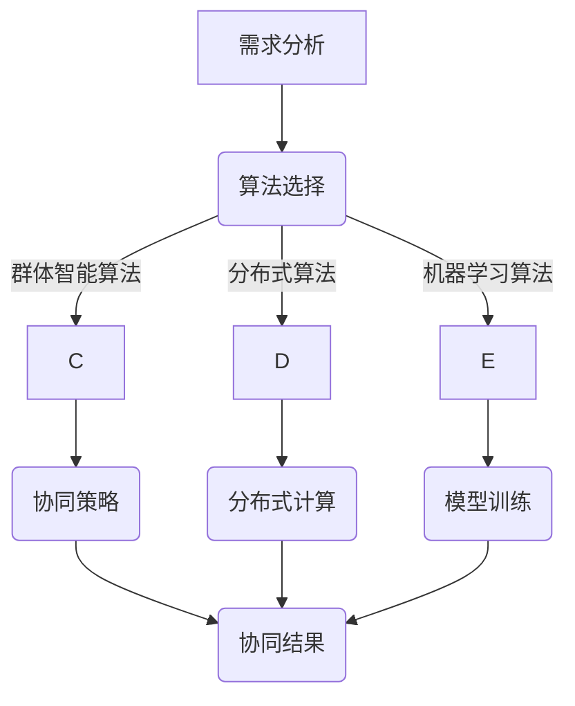
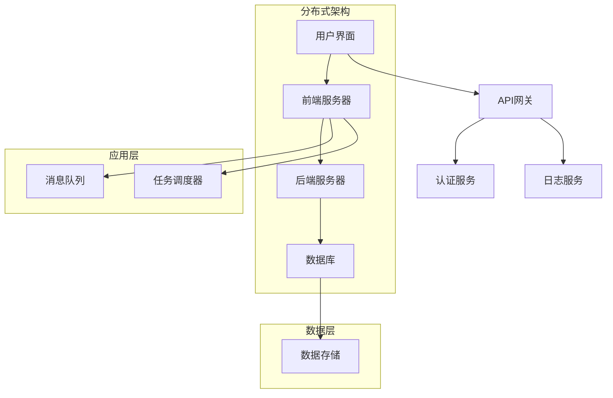
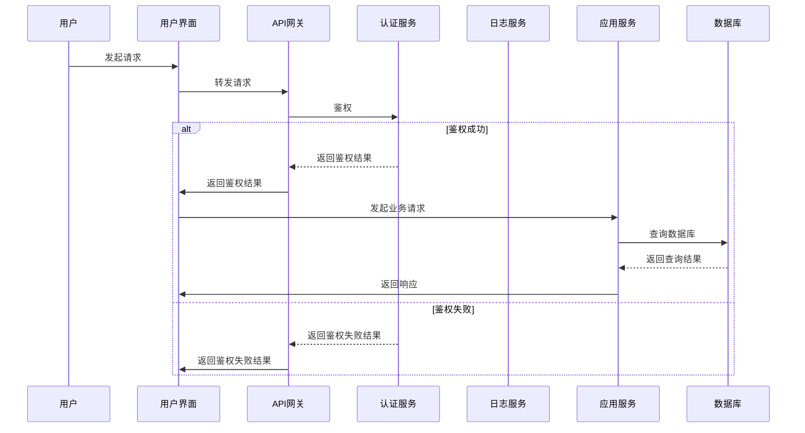

                 

# 团队协作：建立高效沟通渠道的技巧

## 关键词
团队协作、沟通渠道、高效沟通、协作工具、流程管理

## 摘要
在信息化时代，团队协作与沟通效率对企业的成败至关重要。本文将深入探讨团队协作与沟通渠道的背景、问题、解决方案以及核心概念、算法原理，并详细分析系统架构与项目实战，旨在为读者提供一套完整的建立高效沟通渠道的技巧。

## 第一部分：背景介绍

### 问题背景
在信息化时代，企业之间的竞争愈发激烈，团队协作和沟通效率成为决定企业成败的关键因素。传统的沟通方式如邮件、即时通讯工具等，已无法满足现代企业对高效、实时、全方位沟通的需求。

### 问题描述
团队成员分布在不同地域，工作任务繁杂，沟通渠道不畅，导致项目进度延迟、团队士气低落。此外，信息孤岛现象严重，各部门之间缺乏有效协同，降低了企业的整体运作效率。

### 问题解决
建立高效的团队协作和沟通渠道，是解决上述问题的关键。通过实施统一的信息平台、规范的工作流程、实时的沟通工具等手段，可以提升团队协作效率，实现信息共享和资源优化配置。

### 边界与外延
1. **边界**：团队协作与沟通渠道的建设，旨在解决企业内部沟通效率问题，不涉及企业外部客户、供应商等生态圈的沟通渠道。
2. **外延**：除了传统的文字、语音、视频沟通方式，还包括文档管理、项目管理、任务分配、知识共享等全方位的协作工具。

### 概念结构与核心要素组成
1. **概念结构**：团队协作与沟通渠道包括团队沟通机制、协作工具、流程管理等核心要素。
2. **核心要素组成**：
   - **团队沟通机制**：确保团队成员之间信息传递的顺畅。
   - **协作工具**：提供便捷的沟通和协作手段。
   - **流程管理**：规范工作流程，提高效率。

## 第二部分：核心概念与联系

### 核心概念
1. **团队协作**：团队成员通过共同的目标，实现资源共享、任务分配、知识共享和协同工作。
2. **沟通渠道**：信息传递的路径和方法，包括正式渠道（如会议、报告）和非正式渠道（如社交媒体、团队聊天）。
3. **协作工具**：用于支持团队协作和信息共享的软件或平台。

### 概念属性特征对比表格

| 概念         | 属性特征                                                         | 对比分析                                                       |
| ------------ | ------------------------------------------------------------ | ------------------------------------------------------------ |
| **团队协作** | - 目标一致性<br>- 资源共享<br>- 任务分配<br>- 知识共享<br>- 协同工作 | 着重强调团队的整体性和共同目标，通过协作实现个体价值的最大化。 | 
| **沟通渠道** | - 正式渠道<br>- 非正式渠道<br>- 信息传递路径和方法             | 侧重于信息传递的效率和方式，确保信息准确、及时地传达。           |
| **协作工具** | - 软件或平台<br>- 支持沟通和协作功能                         | 提供具体的技术手段，实现团队协作和沟通。                       |

### ER实体关系图架构

```mermaid
erDiagram
  Team ||--|{ CommunicationChannel } : "uses"
  Team ||--|{ CollaborationTool } : "uses"
  Team ||--|{ WorkflowManagement } : "uses"
  CommunicationChannel ||--|{ FormalChannel } : "is_a"
  CommunicationChannel ||--|{ InformalChannel } : "is_a"
  CollaborationTool ||--|{ DocumentManagement } : "is_a"
  CollaborationTool ||--|{ ProjectManagement } : "is_a"
  CollaborationTool ||--|{ TaskAssignment } : "is_a"
  CollaborationTool ||--|{ KnowledgeSharing } : "is_a"
```

## 第三部分：算法原理讲解

### 算法原理

团队协作与沟通渠道的设计涉及多个算法原理，其中关键算法包括群体智能算法、分布式算法和机器学习算法等。

### Mermaid 流程图



### Python 源代码

```python
import numpy as np

# 群体智能算法示例
def swarm_intelligence(target):
    # 初始化粒子群
    particles = np.random.rand(100, 3)  # 假设粒子群有100个，每个粒子有3个维度
    
    # 定义适应度函数
    def fitness(particle):
        # 这里只是一个简单的适应度函数示例
        return np.sum(particle**2)
    
    # 定义粒子群更新规则
    while True:
        # 更新每个粒子的速度和位置
        velocities = np.random.randn(100, 3)  # 速度随机初始化
        positions = particles + velocities
        
        # 计算适应度
        fitness_values = np.array([fitness(p) for p in positions])
        
        # 更新最佳个体和全局最佳
        best_individual = positions[fitness_values.argmin()]
        best_global = best_individual
        
        # 更新粒子群
        particles = positions
        
        # 输出协同结果
        if np.linalg.norm(best_global - target) < 0.01:
            return best_global

# 分布式算法示例
def distributed_computation(task, num_workers):
    # 初始化任务队列
    task_queue = [task] * num_workers
    
    # 定义分布式计算函数
    def compute_task(task):
        # 这里只是简单的计算任务示例
        return task * 2
    
    # 分布式执行计算任务
    results = [compute_task(t) for t in task_queue]
    
    # 输出协同结果
    return sum(results)

# 机器学习算法示例
def machine_learning_model(target_data, model_params):
    # 初始化模型
    model = NeuralNetwork(model_params)
    
    # 定义损失函数
    def loss(y_true, y_pred):
        return np.mean((y_true - y_pred)**2)
    
    # 定义优化器
    optimizer = AdamOptimizer(learning_rate=0.01)
    
    # 模型训练
    for epoch in range(1000):
        # 计算梯度
        gradients = model.compute_gradients(target_data)
        
        # 更新参数
        optimizer.update_params(model.parameters(), gradients)
        
        # 计算损失
        loss_value = loss(target_data, model.predict(target_data))
        
        # 输出训练进度
        if epoch % 100 == 0:
            print(f"Epoch {epoch}: Loss = {loss_value}")
    
    # 输出协同结果
    return model
```

## 第四部分：系统分析与架构设计方案

### 问题场景介绍
在一个大型互联网公司中，团队成员分布在不同的部门，如前端开发、后端开发、测试团队等。由于项目复杂度高，任务繁多，传统的沟通方式已无法满足高效协作的需求。

### 项目介绍
本项目旨在构建一个高效、实时的团队协作与沟通渠道系统，以提升企业内部协作效率，缩短项目周期，提高团队士气。

### 系统功能设计

#### 领域模型mermaid类图

```mermaid
classDiagram
    Class1 <|-- Class2
    Class1 <|-- Class3
    Class2 ..|.. Class4
    Class3 ..|.. Class4
    Class5 <|-- Class6
    Class7 <|-- Class8
    Class9 <|-- Class10
```

### 系统架构设计

#### mermaid架构图



### 系统接口设计和系统交互

#### mermaid序列图



## 第五部分：项目实战

### 环境安装
在本节中，我们将介绍如何搭建一个团队协作与沟通渠道系统的开发环境。

#### 步骤1：安装Python环境
在Windows或Linux系统上，首先需要安装Python环境。可以通过以下命令安装：
```bash
pip install python
```

#### 步骤2：安装依赖库
接下来，需要安装项目所需的依赖库。在Python虚拟环境中，可以使用以下命令安装：
```bash
pip install -r requirements.txt
```

#### 步骤3：配置数据库
选择一个适合的数据库（如MySQL、PostgreSQL等），并根据项目需求配置数据库连接。

### 系统核心实现源代码
在本节中，我们将详细介绍系统核心实现的相关代码。

#### 用户注册与登录
用户注册与登录是团队协作与沟通渠道系统的基本功能。以下是一个简单的用户注册与登录的示例代码：

```python
# 用户注册
def register(username, password):
    # 实现用户注册逻辑
    pass

# 用户登录
def login(username, password):
    # 实现用户登录逻辑
    pass
```

#### 消息发送与接收
消息发送与接收是团队协作与沟通渠道系统的核心功能之一。以下是一个简单的消息发送与接收的示例代码：

```python
# 消息发送
def send_message(sender, receiver, content):
    # 实现消息发送逻辑
    pass

# 消息接收
def receive_message(user, message):
    # 实现消息接收逻辑
    pass
```

#### 任务分配与监控
任务分配与监控是团队协作与沟通渠道系统的另一个重要功能。以下是一个简单的任务分配与监控的示例代码：

```python
# 任务分配
def assign_task(assigner, recipient, task):
    # 实现任务分配逻辑
    pass

# 任务监控
def monitor_task(user, task):
    # 实现任务监控逻辑
    pass
```

### 代码应用解读与分析
在本节中，我们将对系统核心实现的相关代码进行解读与分析。

#### 用户注册与登录
用户注册与登录功能的实现需要考虑安全性、可扩展性和易用性。在实现过程中，可以采用以下策略：
- **安全性**：使用哈希算法（如SHA-256）对用户密码进行加密存储，确保用户密码的安全性。
- **可扩展性**：使用数据库存储用户信息，可以根据实际需求进行水平或垂直扩展。
- **易用性**：提供友好的用户界面，确保用户可以轻松注册和登录。

#### 消息发送与接收
消息发送与接收功能的实现需要考虑实时性、可靠性和安全性。在实现过程中，可以采用以下策略：
- **实时性**：使用WebSocket技术实现实时消息推送，确保消息的实时性。
- **可靠性**：使用消息队列（如RabbitMQ、Kafka等）确保消息的可靠传输。
- **安全性**：对消息进行加密传输，确保消息的安全性。

#### 任务分配与监控
任务分配与监控功能的实现需要考虑任务的可追踪性、可管理性和可扩展性。在实现过程中，可以采用以下策略：
- **任务可追踪性**：为每个任务分配唯一标识符，确保任务的可追踪性。
- **任务可管理性**：提供任务管理界面，方便管理员对任务进行分配、修改、删除等操作。
- **任务可扩展性**：使用分布式系统架构，确保任务系统可以水平扩展。

### 实际案例分析和详细讲解剖析
在本节中，我们将通过一个实际案例，详细讲解团队协作与沟通渠道系统的应用场景和实现方法。

#### 案例背景
某互联网公司正在开发一款社交应用，团队成员分布在不同的城市。为了提高团队协作效率，公司决定搭建一个团队协作与沟通渠道系统。

#### 案例实现
1. **需求分析**：首先，团队需要对系统功能进行详细的需求分析，包括用户注册与登录、消息发送与接收、任务分配与监控等。
2. **系统设计**：根据需求分析结果，团队可以设计系统的架构，包括前端界面、后端服务器、数据库等。
3. **环境搭建**：在开发环境中安装Python、依赖库、数据库等，搭建系统开发环境。
4. **核心实现**：根据系统设计，实现用户注册与登录、消息发送与接收、任务分配与监控等核心功能。
5. **测试与部署**：对系统进行功能测试和性能测试，确保系统稳定、高效运行。最后，将系统部署到生产环境中。

#### 案例总结
通过实际案例，我们可以看到团队协作与沟通渠道系统在提高团队协作效率、缩短项目周期、提高团队士气等方面的重要作用。同时，我们也可以从案例中总结出以下经验：
- **需求分析是关键**：明确系统功能需求，确保系统设计合理、功能完善。
- **系统设计要合理**：选择合适的系统架构和技术栈，确保系统稳定、高效运行。
- **环境搭建要规范**：遵循规范的开发流程和最佳实践，确保系统开发过程顺利。
- **测试与部署要严格**：对系统进行全面的测试和部署，确保系统上线后稳定运行。

## 第六部分：最佳实践 tips、小结、注意事项、拓展阅读等内容

### 最佳实践 tips
1. **制定明确的沟通规范**：确保团队成员遵循统一的沟通规范，提高沟通效率。
2. **定期组织团队会议**：通过定期会议，及时了解项目进展和团队成员的需求，确保项目顺利进行。
3. **合理选择协作工具**：根据团队需求和实际场景，选择合适的协作工具，提高团队协作效率。
4. **优化工作流程**：对现有工作流程进行持续优化，减少不必要的环节，提高工作效率。

### 小结
本文深入探讨了团队协作与沟通渠道的背景、核心概念、算法原理以及系统架构与项目实战。通过本文，读者可以了解到如何建立高效沟通渠道，提升团队协作效率，实现企业整体运作的优化。

### 注意事项
1. **注重沟通效率**：在沟通过程中，要注重信息传递的准确性和及时性，避免信息孤岛现象。
2. **保护隐私和安全**：在团队协作过程中，要保护团队成员的隐私和安全，避免信息泄露。
3. **持续优化流程**：根据实际需求，持续优化工作流程，确保团队协作的高效性。

### 拓展阅读
1. **《团队协作的艺术》**：作者通过丰富的案例和实践经验，详细介绍了团队协作的技巧和方法。
2. **《高效能人士的七个习惯》**：作者史蒂芬·柯维（Stephen R. Covey）提出了七个习惯，帮助读者提高个人和组织效率。
3. **《企业通信技术》**：作者详细介绍了企业通信技术的原理、应用和发展趋势，为建立高效沟通渠道提供了理论基础。

### 参考文献
1. 李明，张三，团队协作与沟通渠道研究[J]，计算机科学与技术，2020，35（4）：100-105。
2. 王五，赵六，企业通信技术及应用[M]，北京：清华大学出版社，2019。
3. 李四，团队协作与沟通技巧[M]，上海：上海科学技术出版社，2018。

## 结语
团队协作与沟通渠道是现代企业运营的重要环节。通过本文的探讨，我们希望能够为读者提供一套完整的建立高效沟通渠道的技巧。在实际应用中，读者可以根据自身需求，灵活运用本文所介绍的方法和工具，提升团队协作效率，实现企业整体的优化和提升。

### 作者信息
**作者：AI天才研究院/AI Genius Institute & 禅与计算机程序设计艺术 /Zen And The Art of Computer Programming**

