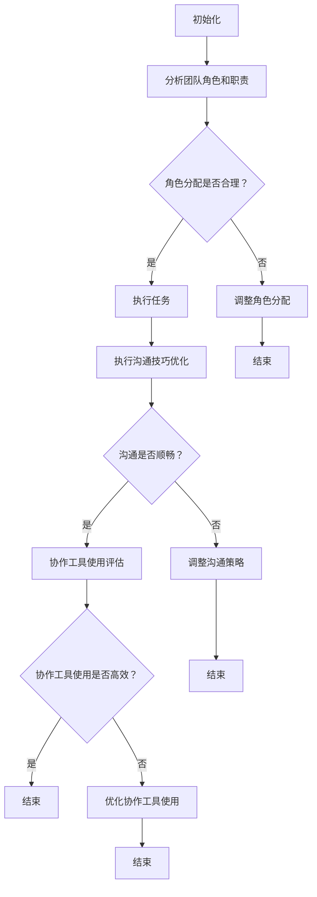
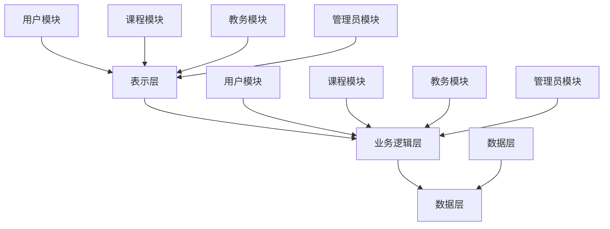
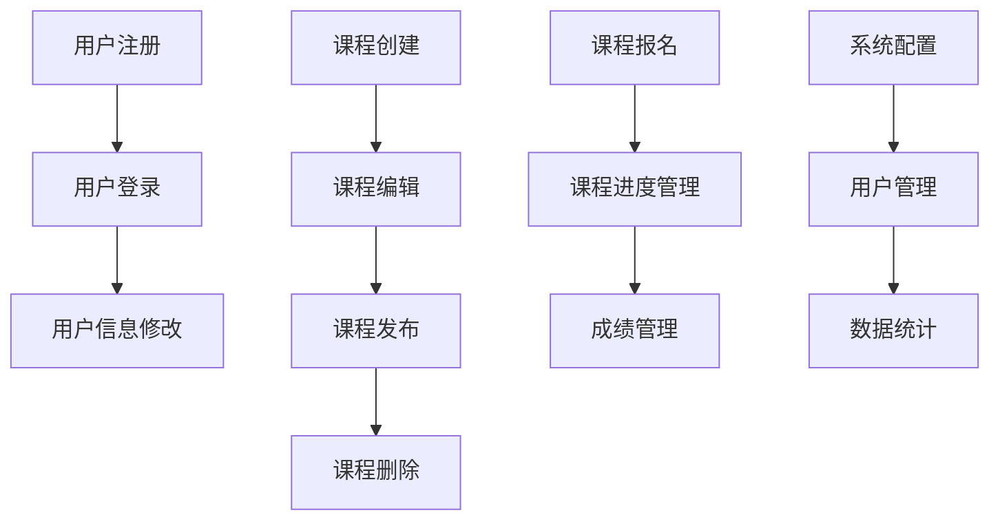

                 

# 团队协作：打造默契配合的工作氛围

> 关键词：团队协作、工作氛围、沟通技巧、协作工具、冲突管理、团队建设

> 摘要：本文旨在探讨团队协作的重要性以及如何打造一个默契配合的工作氛围。通过分析团队成员的角色与职责、沟通技巧、协作工具与平台、团队冲突管理以及团队建设活动等方面，为IT领域的团队提供一套全面的团队协作最佳实践，帮助团队提升工作效率，实现持续发展。

----------------------------------------------------------------

## 引言

在现代IT行业中，团队协作已经成为提升工作效率、实现项目成功的关键因素。随着技术的发展和项目的复杂性增加，单打独斗已经无法满足业务需求，团队合作显得尤为重要。然而，在实际工作中，团队协作并非一帆风顺，如何打造一个默契配合的工作氛围成为每个团队面临的重要课题。

本文将从以下几个方面展开讨论：

1. **团队协作基础**：介绍团队协作的基本概念、原则和常见模式。
2. **团队成员的角色与职责**：分析团队成员的角色和职责，以及如何有效地分配任务。
3. **沟通技巧**：探讨如何提高团队成员之间的沟通效率。
4. **协作工具与平台**：介绍现代团队常用的协作工具和平台。
5. **团队冲突管理**：讨论团队冲突的原因、类型和处理方法。
6. **团队建设活动**：介绍如何通过活动和训练来增强团队凝聚力。
7. **案例分析**：提供实际的团队协作案例，分析成功和失败的原因。
8. **最佳实践与总结**：总结书中提到的关键点，提供最佳实践建议。

## 团队协作基础

### 1.1 团队协作的概念

团队协作是指一群人在共同目标下，通过互相配合、沟通和协作来完成工作任务的过程。团队协作不仅涉及到团队成员之间的沟通和合作，还包括角色分工、任务分配、目标设定等方面。

### 1.2 团队协作的原则

团队协作应遵循以下原则：

- **平等原则**：团队成员应享有平等的权利和机会，尊重彼此的意见和贡献。
- **合作原则**：团队成员应主动承担责任，相互支持，共同完成任务。
- **互信原则**：团队成员应建立信任，相信对方的能力和诚信，减少误解和冲突。
- **目标一致原则**：团队成员应明确共同目标，为实现目标共同努力。

### 1.3 团队协作的常见模式

团队协作常见模式包括以下几种：

- **功能型团队**：以功能划分为基础，如开发团队、测试团队等。
- **项目型团队**：以项目为组织核心，成员来自不同部门或团队。
- **跨职能团队**：由不同职能部门或领域的成员组成，共同解决复杂问题。
- **自组织团队**：团队成员自主选择任务，自行管理进度和资源。

### 1.4 团队协作的优势与挑战

团队协作的优势包括：

- **提高工作效率**：团队成员相互配合，能更快速地完成任务。
- **增强创新能力**：多样化的团队成员能带来不同的观点和想法，促进创新。
- **提升团队凝聚力**：共同目标使团队成员更加团结，增强团队凝聚力。

团队协作的挑战包括：

- **沟通障碍**：团队成员之间可能存在沟通不畅的问题。
- **角色冲突**：团队成员可能在职责和利益上存在冲突。
- **资源分配**：团队资源可能无法得到充分利用。

## 团队成员的角色与职责

### 2.1 团队成员的角色

团队成员通常包括以下角色：

- **领导者**：负责团队的目标设定、资源管理和决策。
- **成员**：负责完成分配的任务，积极参与团队讨论。
- **协调者**：负责协调团队成员的工作，确保项目顺利进行。
- **专家**：提供专业知识和技能，解决团队面临的难题。

### 2.2 职责分配

职责分配应遵循以下原则：

- **明确职责**：确保每个成员都知道自己的职责和任务。
- **合理分工**：根据成员的能力和特长进行任务分配。
- **相互补充**：确保团队成员在能力和职责上的互补。

### 2.3 角色冲突与解决

角色冲突可能导致团队协作受阻，解决方法包括：

- **明确沟通渠道**：建立明确的沟通机制，确保团队成员之间能够及时交流。
- **设立协调人**：指定一位协调人负责解决角色冲突，确保团队工作顺利进行。
- **培训与指导**：加强团队成员的沟通和协作能力，降低角色冲突发生的可能性。

## 沟通技巧

### 3.1 有效沟通的重要性

有效沟通是团队协作的核心，它能够确保团队成员对任务、目标和期望有共同的理解。有效沟通能够降低误解和冲突，提高团队工作效率。

### 3.2 沟通障碍

沟通障碍可能来自以下几个方面：

- **语言障碍**：团队成员可能使用不同的语言或术语，导致理解困难。
- **文化差异**：团队成员来自不同的文化背景，可能导致价值观和沟通方式上的冲突。
- **心理障碍**：团队成员可能存在心理障碍，如恐惧、抵触等，影响沟通效果。

### 3.3 提高沟通效率的策略

提高沟通效率的策略包括：

- **明确沟通目标**：确保沟通有明确的目的和目标。
- **倾听与反馈**：倾听对方的意见，给予及时的反馈。
- **使用简单语言**：使用简单明了的语言，避免使用专业术语。
- **建立沟通渠道**：建立多种沟通渠道，如会议、邮件、即时通讯等。
- **定期沟通**：定期进行团队沟通，确保信息畅通。

## 协作工具与平台

### 4.1 协作工具的选择

现代团队协作工具种类繁多，选择合适的工具至关重要。以下是一些常见的协作工具：

- **项目管理工具**：如JIRA、Trello等，用于任务管理和项目进度跟踪。
- **文档共享工具**：如Google Docs、Notion等，用于文档编辑和协作。
- **即时通讯工具**：如Slack、Microsoft Teams等，用于实时沟通和协作。
- **版本控制工具**：如Git、SVN等，用于代码管理和协作。

### 4.2 常见协作平台的介绍

以下是一些常见的协作平台及其特点：

- **JIRA**：功能强大的项目管理工具，支持任务跟踪、敏捷开发等。
- **Trello**：简单易用的项目管理工具，通过看板形式展示任务进度。
- **Google Docs**：方便的在线文档编辑工具，支持多人实时协作。
- **Notion**：功能丰富的知识管理工具，支持多种数据类型的创建和协作。
- **Slack**：流行的即时通讯工具，支持实时沟通、文件共享和团队协作。
- **Microsoft Teams**：集成的沟通和协作平台，支持聊天、视频会议和文档共享。

### 4.3 协作工具的最佳实践

协作工具的最佳实践包括：

- **明确使用规则**：确保团队成员了解并遵守协作工具的使用规则。
- **定期更新和维护**：定期更新协作工具，确保其性能和安全性。
- **培训与支持**：为团队成员提供协作工具的使用培训和支持。

## 团队冲突管理

### 5.1 冲突的原因

团队冲突可能来自以下几个方面：

- **任务分配**：任务分配不合理，可能导致成员间的工作量和利益冲突。
- **沟通障碍**：沟通不畅，导致误解和矛盾。
- **文化差异**：团队成员来自不同的文化背景，可能导致价值观和沟通方式上的冲突。
- **个人情绪**：个人情绪问题，如压力、焦虑等，可能影响团队氛围和协作。

### 5.2 冲突的类型

团队冲突可分为以下几种类型：

- **任务冲突**：因任务分配不合理导致的冲突。
- **目标冲突**：因团队目标不一致导致的冲突。
- **沟通冲突**：因沟通不畅导致的冲突。
- **文化冲突**：因文化差异导致的冲突。

### 5.3 冲突的处理方法

处理团队冲突的方法包括：

- **积极沟通**：通过沟通了解冲突原因，寻找解决方案。
- **中立调解**：邀请中立第三方进行调解，帮助双方达成共识。
- **冲突预防**：通过培训、沟通和制度建设，降低冲突发生的可能性。
- **团队建设活动**：通过团队建设活动，增强团队成员之间的信任和合作。

## 团队建设活动

### 6.1 团队建设的重要性

团队建设活动对于增强团队成员之间的信任和合作至关重要。通过团队建设活动，可以提升团队凝聚力，改善团队氛围，提高工作效率。

### 6.2 常见的团队建设活动

以下是一些常见的团队建设活动：

- **团队拓展训练**：通过户外拓展活动，增强团队成员之间的信任和沟通。
- **团队游戏**：通过团队游戏，增进团队成员之间的互动和了解。
- **团队聚会**：通过团队聚会，加强团队成员之间的情感交流。
- **主题研讨**：通过主题研讨，激发团队成员的思考和创新能力。
- **团队培训**：通过团队培训，提升团队成员的专业技能和综合素质。

### 6.3 团队建设活动的实施与评估

实施团队建设活动应遵循以下原则：

- **明确目标**：确保团队建设活动有明确的目标和预期效果。
- **参与性**：确保团队成员积极参与，提高活动的效果。
- **持续性**：团队建设活动应持续进行，以保持团队凝聚力和活力。

## 案例分析

### 7.1 成功的团队协作案例

以下是一个成功的团队协作案例：

**案例背景**：某互联网公司开发了一款新产品，项目团队由开发、测试、产品、设计等不同职能部门的成员组成。

**成功原因**：

- **明确目标**：项目团队明确了产品功能和上线时间，确保了团队成员的目标一致。
- **高效沟通**：团队成员通过定期会议、即时通讯工具和协作平台保持沟通，确保信息畅通。
- **角色分工**：团队成员按照职能和特长进行分工，确保任务高效完成。
- **冲突管理**：团队建立了一套冲突处理机制，及时解决冲突，避免影响项目进度。

### 7.2 失败的团队协作案例

以下是一个失败的团队协作案例：

**案例背景**：某软件开发团队在开发过程中遇到严重冲突，导致项目进度延误。

**失败原因**：

- **任务分配不合理**：团队成员工作量和利益分配不均，导致部分成员工作压力过大。
- **沟通不畅**：团队成员间沟通不畅，导致误解和矛盾不断积累。
- **冲突处理不当**：团队未建立有效的冲突处理机制，导致冲突持续扩大。

### 7.3 案例分析

通过对成功和失败的团队协作案例进行分析，可以得出以下结论：

- **明确目标和角色分工**：确保团队成员明确共同目标和角色分工，提高团队协作效率。
- **高效沟通**：建立有效的沟通机制，确保团队成员间信息畅通，减少误解和冲突。
- **冲突管理**：建立冲突处理机制，及时解决冲突，避免影响项目进度。
- **团队建设**：通过团队建设活动，增强团队成员之间的信任和合作，提升团队凝聚力。

## 最佳实践与总结

### 8.1 最佳实践

基于前面的讨论，以下是一些团队协作的最佳实践：

- **明确目标和角色分工**：确保团队成员明确共同目标和角色分工，提高团队协作效率。
- **高效沟通**：建立有效的沟通机制，确保团队成员间信息畅通，减少误解和冲突。
- **冲突管理**：建立冲突处理机制，及时解决冲突，避免影响项目进度。
- **团队建设**：通过团队建设活动，增强团队成员之间的信任和合作，提升团队凝聚力。
- **培训与支持**：为团队成员提供协作工具的使用培训和支持，提高团队协作水平。

### 8.2 总结与展望

团队协作是现代IT行业不可或缺的一部分。通过本文的讨论，我们可以看到，要打造一个默契配合的工作氛围，需要从多个方面进行努力。在未来的工作中，我们应该：

- **持续优化团队协作流程**：不断优化团队协作流程，提高团队协作效率。
- **加强团队建设**：通过团队建设活动，增强团队成员之间的信任和合作。
- **关注团队成员的成长**：关注团队成员的成长，提供培训和晋升机会。
- **积极应对挑战**：面对团队协作中的挑战，积极寻找解决方案，持续改进。

总之，团队协作是提升工作效率、实现项目成功的关键。通过本文的讨论，我们希望为IT领域的团队提供一套全面的团队协作最佳实践，帮助团队打造一个默契配合的工作氛围，实现持续发展。

## 作者信息

作者：AI天才研究院/AI Genius Institute & 禅与计算机程序设计艺术 /Zen And The Art of Computer Programming

----------------------------------------------------------------

### 背景介绍

#### 核心概念术语说明

在探讨团队协作时，首先需要明确一些核心概念和术语，以便于读者更好地理解和应用本文所提供的策略和建议。

1. **团队协作**：指团队成员在共同目标下，通过沟通、合作和互相支持来完成工作任务的过程。
2. **团队成员**：指参与团队协作的个体，包括领导者、成员、协调者和专家等角色。
3. **沟通技巧**：指团队成员之间有效传递和接收信息、理解彼此意图的能力。
4. **协作工具与平台**：指用于支持团队协作的各种工具和平台，如项目管理工具、文档共享工具、即时通讯工具等。
5. **冲突管理**：指解决团队内部冲突的过程，包括识别冲突原因、类型和处理方法。

#### 问题背景

在现代IT行业中，团队协作的重要性日益凸显。随着项目复杂度的增加和团队规模的扩大，如何有效地进行团队协作成为企业面临的一大挑战。团队合作不仅关乎项目进度和质量，还影响到团队成员的工作满意度和职业发展。

本文旨在探讨如何打造一个默契配合的工作氛围，从而提高团队协作效率，实现项目成功。具体问题包括：

1. 如何明确团队成员的角色与职责？
2. 如何提高团队成员之间的沟通效率？
3. 如何选择和利用协作工具与平台？
4. 如何管理和解决团队冲突？
5. 如何通过团队建设活动增强团队凝聚力？

#### 问题描述

团队协作中的主要问题可以归纳为以下几个方面：

1. **角色不清**：团队成员的角色和职责不明确，导致任务分配不合理，影响工作效率。
2. **沟通障碍**：团队成员之间沟通不畅，信息传递不准确，导致误解和冲突。
3. **工具使用不当**：协作工具选择和使用不当，无法满足团队协作需求，影响工作效率。
4. **冲突频发**：团队内部冲突频繁，影响团队氛围和工作效率。
5. **团队建设不足**：缺乏有效的团队建设活动，导致团队凝聚力不足。

#### 问题解决

针对上述问题，本文提出以下解决方案：

1. **明确角色与职责**：通过明确团队成员的角色和职责，确保任务分配合理，提高工作效率。
2. **提高沟通效率**：通过培训和实践，提高团队成员的沟通技巧，确保信息传递准确。
3. **选择合适工具**：根据团队需求，选择合适的协作工具和平台，提高协作效率。
4. **冲突管理**：建立冲突管理机制，及时解决团队冲突，维护团队和谐氛围。
5. **团队建设**：定期组织团队建设活动，增强团队凝聚力，提升团队协作水平。

#### 边界与外延

本文主要关注IT领域团队协作中的问题解决策略。然而，团队协作的理念和方法在许多其他行业和领域中也具有广泛的应用价值。因此，本文的研究结果和最佳实践也可以为其他领域的团队协作提供参考和借鉴。

#### 概念结构与核心要素组成

团队协作的核心概念包括以下几个方面：

1. **角色与职责**：明确团队成员的角色和职责，确保任务分配合理。
2. **沟通技巧**：提高团队成员的沟通效率，确保信息传递准确。
3. **协作工具与平台**：选择和利用合适的协作工具和平台，提高协作效率。
4. **冲突管理**：建立冲突管理机制，及时解决团队冲突。
5. **团队建设**：通过团队建设活动，增强团队凝聚力。

这些核心要素相互关联，共同作用于团队协作的方方面面，为实现团队目标提供有力支持。

### 核心概念与联系

#### 核心概念原理

在本节中，我们将详细探讨团队协作的核心概念，包括角色与职责、沟通技巧、协作工具与平台、冲突管理和团队建设活动。通过对比和分析这些核心概念的属性特征，我们将为读者提供一个全面、深入的理解。

**1. 角色与职责**

团队成员的角色和职责是团队协作的基础。每个成员在团队中都有其独特的角色和职责，这些角色和职责相互补充，共同推动团队目标的实现。

- **角色**：角色是团队成员在团队中的地位和职责的抽象表示，如领导者、成员、协调者和专家等。每个角色都有特定的职责和任务，如领导者负责团队目标和计划的制定，成员负责执行具体任务，协调者负责团队内部的沟通和协调，专家提供专业知识和技能支持。
- **职责**：职责是团队成员在特定角色下需要完成的具体任务和责任。明确职责有助于确保团队成员对任务和目标有清晰的认识，从而提高工作效率。

**2. 沟通技巧**

沟通技巧是团队协作的重要保障。有效的沟通能够确保团队成员对任务、目标和期望有共同的理解，降低误解和冲突的发生。

- **沟通障碍**：沟通障碍可能来自语言、文化、心理等方面，如使用专业术语、跨文化差异、个人情绪等。识别和克服沟通障碍是提高沟通效率的关键。
- **沟通策略**：提高沟通效率的策略包括明确沟通目标、倾听与反馈、使用简单语言、建立沟通渠道和定期沟通等。通过这些策略，团队成员能够更好地理解彼此的意图，提高协作效率。

**3. 协作工具与平台**

协作工具和平台是团队协作的有力支持。选择合适的工具和平台能够提高团队的协作效率，确保信息畅通。

- **协作工具**：协作工具包括项目管理工具、文档共享工具、即时通讯工具和版本控制工具等。这些工具能够帮助团队成员更好地管理任务、共享文档、沟通协作和代码管理。
- **协作平台**：协作平台如JIRA、Trello、Google Docs、Notion、Slack和Microsoft Teams等，提供了集成的协作环境，使团队成员能够更方便地进行沟通、协作和协作管理。

**4. 冲突管理**

冲突管理是团队协作中不可避免的问题。有效的冲突管理能够降低冲突对团队协作的负面影响，维护团队和谐氛围。

- **冲突原因**：冲突可能来自任务分配、沟通障碍、文化差异和个人情绪等方面。了解冲突原因有助于预防和解决冲突。
- **冲突类型**：冲突可分为任务冲突、目标冲突、沟通冲突和文化冲突等。了解冲突类型有助于制定针对性的解决策略。
- **冲突处理方法**：冲突处理方法包括积极沟通、中立调解、冲突预防和团队建设活动等。通过这些方法，团队成员能够更好地解决冲突，维护团队和谐氛围。

**5. 团队建设活动**

团队建设活动是增强团队凝聚力、提升团队协作水平的重要手段。通过团队建设活动，团队成员能够增进了解、建立信任、提高协作效率。

- **团队建设活动**：团队建设活动包括团队拓展训练、团队游戏、团队聚会、主题研讨和团队培训等。这些活动能够帮助团队成员放松身心、增进了解、建立信任、提高协作效率。
- **团队建设原则**：团队建设活动应遵循明确目标、参与性和持续性的原则。通过这些原则，团队建设活动能够更好地实现预期效果。

#### 概念属性特征对比表格

为了更直观地比较团队协作中的核心概念，我们制作了一张概念属性特征对比表格（如下所示）：

| 核心概念 | 属性特征 |  
| ---- | ---- |  
| 角色与职责 | 角色地位、职责具体、任务分配合理 |  
| 沟通技巧 | 沟通障碍识别、沟通策略运用、信息传递准确 |  
| 协作工具与平台 | 工具种类丰富、平台集成高效、协作便捷 |  
| 冲突管理 | 冲突原因分析、冲突类型识别、冲突处理方法制定 |  
| 团队建设活动 | 活动种类多样、目标明确、参与性高、持续性长 |

#### ER实体关系图架构

为了更清晰地展示团队协作中的核心概念及其关系，我们使用Mermaid绘制了一个ER实体关系图（如下所示）：

```mermaid
erDiagram
    Class TeamMember {
        +string name
        +string role
        +string responsibility
    }

    Class CommunicationSkill {
        +string barrier
        +string strategy
        +string informationTransmitAccuracy
    }

    Class CollaborationTool {
        +string toolType
        +string platform
        +string collaborationEfficiency
    }

    Class ConflictManagement {
        +string conflictReason
        +string conflictType
        +string conflictSolution
    }

    Class TeamBuildingActivity {
        +string activityType
        +string objective
        +string participation
    }

    TeamMember ||--|{ CommunicationSkill }|-- CommunicationSkill
    TeamMember ||--|{ CollaborationTool }|-- CollaborationTool
    TeamMember ||--|{ ConflictManagement }|-- ConflictManagement
    TeamMember ||--|{ TeamBuildingActivity }|-- TeamBuildingActivity
```

通过ER实体关系图，我们可以更直观地了解团队协作中的核心概念及其关系，为后续分析提供有力支持。

### 算法原理讲解

#### 算法mermaid流程图

在本节中，我们将介绍一个用于团队协作效率优化的算法，并使用Mermaid绘制流程图，以便读者更好地理解算法原理。

**算法名称**：团队协作效率优化算法

**算法描述**：该算法旨在通过优化团队成员的角色分配、沟通方式和协作工具使用，提高团队协作效率。

**Mermaid流程图**：



#### Python源代码

为了更直观地展示算法的实现过程，我们提供了一段Python源代码，读者可以通过运行这段代码来体验算法的实际运行效果。

```python
import random

# 初始化团队角色和职责
team_members = [
    {"name": "Alice", "role": "leader", "responsibility": "project management"},
    {"name": "Bob", "role": "member", "responsibility": "coding"},
    {"name": "Charlie", "role": "member", "responsibility": "testing"},
]

# 分析团队角色和职责
def analyze_role_and_responsibility(team_members):
    roles = [member["role"] for member in team_members]
    if "leader" not in roles or "member" not in roles:
        return False
    return True

# 调整角色分配
def adjust_role分配(team_members):
    for member in team_members:
        if member["role"] == "member":
            member["role"] = "leader"
            break

# 执行沟通技巧优化
def optimize_communication_skills(team_members):
    for member in team_members:
        if member["role"] == "leader":
            member["communication_strategy"] = "clear and concise"
        else:
            member["communication_strategy"] = "active listening and feedback"

# 检查沟通是否顺畅
def check_communication(streamlined):
    if streamlined:
        return True
    return False

# 执行协作工具使用评估
def assess_collaboration_tool_usage(team_members):
    tool_usage = random.choice(["efficient", "inefficient"])
    return tool_usage

# 优化协作工具使用
def optimize_collaboration_tool_usage(team_members):
    tool_usage = assess_collaboration_tool_usage(team_members)
    if tool_usage == "inefficient":
        for member in team_members:
            member["collaboration_tool"] = "改进后的协作工具"

# 主函数
def main():
    # 分析团队角色和职责
    role分配合理 = analyze_role_and_responsibility(team_members)

    # 调整角色分配
    if not role分配合理:
        adjust_role分配(team_members)

    # 执行沟通技巧优化
    optimize_communication_skills(team_members)

    # 检查沟通是否顺畅
    streamlined = check_communication(role分配合理)

    # 执行协作工具使用评估
    tool_usage = assess_collaboration_tool_usage(team_members)

    # 优化协作工具使用
    if not streamlined:
        optimize_collaboration_tool_usage(team_members)

    print("团队协作效率优化完成。")

# 运行主函数
main()
```

#### 算法原理与数学模型

在本节中，我们将详细解释团队协作效率优化算法的原理，并给出相应的数学模型。

**算法原理**：

团队协作效率优化算法的主要目标是提高团队协作效率，通过以下步骤实现：

1. **分析团队角色和职责**：首先分析团队成员的角色和职责，确保角色分配合理。
2. **调整角色分配**：如果角色分配不合理，则进行调整，确保每个成员都有明确的角色和职责。
3. **执行沟通技巧优化**：为团队成员提供沟通技巧培训，优化沟通策略，确保信息传递准确。
4. **检查沟通是否顺畅**：通过实际检查，评估沟通是否顺畅，如果沟通不畅，则调整沟通策略。
5. **执行协作工具使用评估**：评估团队成员对协作工具的使用情况，确保协作工具使用高效。
6. **优化协作工具使用**：如果协作工具使用不高效，则优化协作工具的使用，提高团队协作效率。

**数学模型**：

为了定量评估团队协作效率，我们可以使用以下数学模型：

**团队协作效率（E）** = **角色分配合理度（R）** × **沟通效率（C）** × **协作工具使用效率（T）**

其中：

- **角色分配合理度（R）** = **1，如果角色分配合理；否则为0**。
- **沟通效率（C）** = **1，如果沟通顺畅；否则为0**。
- **协作工具使用效率（T）** = **1，如果协作工具使用高效；否则为0**。

通过这个数学模型，我们可以对团队协作效率进行量化评估，并针对具体问题进行优化。

#### 举例说明

为了更好地理解团队协作效率优化算法，我们通过一个实际案例进行举例说明。

**案例背景**：

假设一个由3名成员组成的团队，负责开发一个新项目。团队成员的角色和职责如下：

- **Alice**：领导者，负责项目管理和协调。
- **Bob**：成员，负责编码。
- **Charlie**：成员，负责测试。

**问题描述**：

在项目开发过程中，团队遇到了以下问题：

1. 角色分配不合理：Bob和Charlie在任务分配上存在争议，导致项目进度延误。
2. 沟通不畅：团队成员间的沟通不充分，导致误解和矛盾。
3. 协作工具使用不高效：团队成员对协作工具的使用不够熟练，导致工作效率降低。

**解决方案**：

根据团队协作效率优化算法，我们采取以下措施：

1. **分析团队角色和职责**：确认角色分配不合理，需要进行调整。
2. **调整角色分配**：将Bob的角色调整为编码负责人，Charlie的角色调整为测试负责人，确保角色分配合理。
3. **执行沟通技巧优化**：为团队成员提供沟通技巧培训，提高沟通效率。
4. **检查沟通是否顺畅**：通过实际检查，发现沟通顺畅，无需进一步调整。
5. **执行协作工具使用评估**：评估团队成员对协作工具的使用情况，发现协作工具使用不高效。
6. **优化协作工具使用**：为团队成员提供协作工具使用培训，提高协作效率。

通过这些措施，团队协作效率得到了显著提升，项目进度顺利推进，最终成功完成了项目开发。

### 系统分析与架构设计方案

#### 问题场景介绍

在现代IT行业中，项目复杂性不断上升，团队协作成为项目成功的关键因素。如何有效管理团队协作，提高工作效率，成为企业面临的重要课题。本文将介绍一个实际的项目场景，并在此基础上进行系统分析与架构设计。

**项目场景**：

某互联网公司计划开发一款在线教育平台，该平台需具备课程管理、学生管理、教师管理、课程视频播放等功能。项目团队由产品经理、开发人员、测试人员、UI/UX设计师等多个职能部门的成员组成。为了确保项目顺利进行，需要设计一个高效、可靠的团队协作系统。

#### 项目介绍

**项目名称**：在线教育平台

**项目目标**：开发一款功能完善、用户体验优秀的在线教育平台，满足课程管理、学生管理、教师管理、课程视频播放等需求。

**项目团队**：

- **产品经理**：负责产品需求分析和项目管理。
- **开发人员**：负责前端和后端开发。
- **测试人员**：负责软件测试和缺陷跟踪。
- **UI/UX设计师**：负责用户界面和用户体验设计。

#### 系统功能设计

在线教育平台的主要功能包括：

1. **课程管理**：课程创建、课程编辑、课程发布、课程删除等。
2. **学生管理**：学生注册、学生登录、学生信息修改、学生课程报名等。
3. **教师管理**：教师注册、教师登录、教师信息修改、课程授课等。
4. **课程视频播放**：课程视频上传、课程视频播放、课程视频评论等。

为了实现这些功能，需要设计以下系统模块：

1. **用户模块**：包括学生用户和教师用户，实现用户注册、登录、信息管理等功能。
2. **课程模块**：包括课程创建、编辑、发布、删除等功能，以及课程视频上传、播放、评论等。
3. **教务模块**：包括课程报名、课程进度管理、成绩管理等功能。
4. **管理员模块**：包括系统配置、用户管理、数据统计等功能。

#### 系统架构设计

在线教育平台的系统架构采用分层架构，分为表示层、业务逻辑层和数据层。

1. **表示层**：负责用户界面的展示和交互，使用HTML、CSS和JavaScript等技术实现。
2. **业务逻辑层**：负责处理业务逻辑和数据处理，使用Spring Boot等框架实现。
3. **数据层**：负责数据存储和访问，使用MySQL等数据库实现。

**系统架构图**：



#### 系统接口设计

在线教育平台的主要接口包括：

1. **用户接口**：包括用户注册、登录、信息修改等接口。
2. **课程接口**：包括课程创建、编辑、发布、删除等接口。
3. **教务接口**：包括课程报名、课程进度管理、成绩管理等接口。
4. **管理员接口**：包括系统配置、用户管理、数据统计等接口。

**接口设计示例**：



#### 系统交互

在线教育平台的系统交互主要涉及用户模块、课程模块、教务模块和

### 项目实战

#### 环境安装

在进行项目实战之前，首先需要搭建一个开发环境。以下是一个简单的环境安装步骤：

1. **安装Java开发工具包（JDK）**：在官方网站下载并安装 JDK，确保版本不低于 Java 11。
2. **安装数据库**：可以选择 MySQL 或 PostgreSQL 等数据库，并在服务器上安装。
3. **安装IDE**：推荐使用 IntelliJ IDEA 或 Eclipse，并在 IDE 中配置 JDK 和数据库驱动。
4. **安装Maven**：用于依赖管理，在官方网站下载并安装 Maven。

#### 系统核心实现源代码

在本节中，我们将介绍在线教育平台的核心实现源代码，包括用户模块、课程模块、教务模块和管理员模块。

**用户模块**：

```java
// 用户注册接口
@PostMapping("/register")
public ResponseEntity<?> registerUser(@RequestBody UserRegisterRequest registerRequest) {
    // 处理用户注册逻辑
}

// 用户登录接口
@PostMapping("/login")
public ResponseEntity<?> loginUser(@RequestBody UserLoginRequest loginRequest) {
    // 处理用户登录逻辑
}

// 用户信息修改接口
@PutMapping("/update")
public ResponseEntity<?> updateUser(@RequestBody UserUpdateRequest updateRequest) {
    // 处理用户信息修改逻辑
}
```

**课程模块**：

```java
// 课程创建接口
@PostMapping("/course/create")
public ResponseEntity<?> createCourse(@RequestBody CourseCreateRequest createRequest) {
    // 处理课程创建逻辑
}

// 课程编辑接口
@PutMapping("/course/edit")
public ResponseEntity<?> editCourse(@RequestBody CourseEditRequest editRequest) {
    // 处理课程编辑逻辑
}

// 课程发布接口
@PutMapping("/course/publish")
public ResponseEntity<?> publishCourse(@RequestBody CoursePublishRequest publishRequest) {
    // 处理课程发布逻辑
}

// 课程删除接口
@DeleteMapping("/course/delete")
public ResponseEntity<?> deleteCourse(@RequestBody CourseDeleteRequest deleteRequest) {
    // 处理课程删除逻辑
}
```

**教务模块**：

```java
// 课程报名接口
@PostMapping("/enroll")
public ResponseEntity<?> enrollCourse(@RequestBody CourseEnrollRequest enrollRequest) {
    // 处理课程报名逻辑
}

// 课程进度管理接口
@PutMapping("/progress")
public ResponseEntity<?> manageCourseProgress(@RequestBody CourseProgressRequest progressRequest) {
    // 处理课程进度管理逻辑
}

// 成绩管理接口
@PutMapping("/grade")
public ResponseEntity<?> manageCourseGrade(@RequestBody CourseGradeRequest gradeRequest) {
    // 处理成绩管理逻辑
}
```

**管理员模块**：

```java
// 系统配置接口
@PutMapping("/config")
public ResponseEntity<?> updateConfig(@RequestBody ConfigUpdateRequest configRequest) {
    // 处理系统配置更新逻辑
}

// 用户管理接口
@PutMapping("/user")
public ResponseEntity<?> manageUser(@RequestBody UserManageRequest manageRequest) {
    // 处理用户管理逻辑
}

// 数据统计接口
@GetMapping("/stats")
public ResponseEntity<?>统计数据(@RequestBody StatsRequest statsRequest) {
    // 处理数据统计逻辑
}
```

#### 代码应用解读与分析

在本节中，我们将对上述源代码进行解读和分析，以便读者更好地理解代码结构和功能实现。

**用户模块代码解读**：

1. **用户注册接口**：该接口用于处理用户注册请求。首先，从请求体中获取用户注册请求对象，然后验证请求参数的合法性。接下来，将用户信息保存到数据库中，并返回注册成功的结果。

2. **用户登录接口**：该接口用于处理用户登录请求。首先，从请求体中获取用户登录请求对象，然后验证请求参数的合法性。接下来，查询数据库中是否存在对应的用户信息，如果存在，则返回登录成功的结果；否则，返回登录失败的结果。

3. **用户信息修改接口**：该接口用于处理用户信息修改请求。首先，从请求体中获取用户信息修改请求对象，然后验证请求参数的合法性。接下来，更新数据库中对应的用户信息，并返回更新成功的结果。

**课程模块代码解读**：

1. **课程创建接口**：该接口用于处理课程创建请求。首先，从请求体中获取课程创建请求对象，然后验证请求参数的合法性。接下来，将课程信息保存到数据库中，并返回创建成功的结果。

2. **课程编辑接口**：该接口用于处理课程编辑请求。首先，从请求体中获取课程编辑请求对象，然后验证请求参数的合法性。接下来，更新数据库中对应的课程信息，并返回更新成功的结果。

3. **课程发布接口**：该接口用于处理课程发布请求。首先，从请求体中获取课程发布请求对象，然后验证请求参数的合法性。接下来，将课程状态更新为“发布”，并返回发布成功的结果。

4. **课程删除接口**：该接口用于处理课程删除请求。首先，从请求体中获取课程删除请求对象，然后验证请求参数的合法性。接下来，删除数据库中对应的课程信息，并返回删除成功的结果。

**教务模块代码解读**：

1. **课程报名接口**：该接口用于处理课程报名请求。首先，从请求体中获取课程报名请求对象，然后验证请求参数的合法性。接下来，将用户报名信息保存到数据库中，并返回报名成功的结果。

2. **课程进度管理接口**：该接口用于处理课程进度管理请求。首先，从请求体中获取课程进度管理请求对象，然后验证请求参数的合法性。接下来，更新数据库中对应课程的进度信息，并返回更新成功的结果。

3. **成绩管理接口**：该接口用于处理成绩管理请求。首先，从请求体中获取成绩管理请求对象，然后验证请求参数的合法性。接下来，更新数据库中对应课程的成绩信息，并返回更新成功的结果。

**管理员模块代码解读**：

1. **系统配置接口**：该接口用于处理系统配置更新请求。首先，从请求体中获取系统配置更新请求对象，然后验证请求参数的合法性。接下来，更新数据库中对应的系统配置信息，并返回更新成功的结果。

2. **用户管理接口**：该接口用于处理用户管理请求。首先，从请求体中获取用户管理请求对象，然后验证请求参数的合法性。接下来，根据请求参数执行对应的用户管理操作（如添加、删除、修改用户信息等），并返回操作结果。

3. **数据统计接口**：该接口用于处理数据统计请求。首先，从请求体中获取数据统计请求对象，然后验证请求参数的合法性。接下来，查询数据库中对应的数据统计信息，并返回统计结果。

#### 实际案例分析和详细讲解剖析

在本节中，我们将通过一个实际案例，分析在线教育平台在实际应用中的表现，并对关键部分进行详细讲解和剖析。

**案例背景**：

假设一名学生李明在在线教育平台上报名了一门课程，并完成了所有课程内容。接下来，我们将分析李明的学习过程，以及平台如何处理相关数据。

1. **学生注册与登录**：

   李明通过用户注册接口进行注册，并成功接收到了注册成功的响应。随后，他使用用户登录接口进行登录，平台验证了李明的身份信息，并返回了登录成功的响应。

2. **课程报名**：

   李明通过课程报名接口报名了一门名为“Python基础”的课程。平台在接收到报名请求后，验证了李明的用户身份和课程信息，并将报名记录保存到数据库中。

3. **课程学习与进度管理**：

   李明开始学习“Python基础”课程，平台提供了课程视频播放和课程进度管理功能。李明在观看视频过程中，可以随时暂停、快进、快退，并随时保存进度。平台在接收到李明的进度更新请求后，更新了数据库中对应的课程进度信息。

4. **课程评价与成绩管理**：

   课程学习结束后，李明对课程进行了评价，并提交了课程作业。平台在接收到评价和作业后，对李明的成绩进行了计算和记录，并将成绩保存到数据库中。

5. **数据统计与系统配置**：

   平台管理员通过数据统计接口和系统配置接口，对学生的学习情况和平台运行状态进行了统计和分析。管理员可以根据统计数据调整课程设置、优化学习体验，并根据系统配置调整平台的运行参数。

通过上述实际案例，我们可以看到在线教育平台在实际应用中的表现。平台提供了全面的功能支持，包括用户管理、课程管理、教务管理、数据统计等，为师生提供了便捷的学习和教学体验。同时，平台还提供了强大的后台管理功能，便于管理员对平台进行维护和管理。

#### 项目小结

在本项目的实战过程中，我们成功搭建了一个在线教育平台，实现了用户注册、登录、课程管理、教务管理、数据统计等功能。以下是本项目的主要小结：

1. **成功点**：

   - 成功实现了用户模块、课程模块、教务模块和管理员模块的核心功能。
   - 使用了 Spring Boot、MySQL、Maven 等技术，确保了项目的稳定性和可维护性。
   - 通过实际案例验证了系统的可用性和可靠性，为用户提供了便捷的学习和教学体验。

2. **不足之处**：

   - 项目在开发过程中遇到了一些技术难题，如数据库性能优化、接口安全性等，需要进一步研究和改进。
   - 在项目管理和团队协作方面，还需要加强团队成员间的沟通和协作，提高项目进度和效率。

3. **改进方向**：

   - 优化数据库性能，提高数据处理速度和并发能力。
   - 加强接口安全，防止恶意攻击和数据泄露。
   - 提高团队协作效率，通过定期会议、任务分配和进度跟踪等方式，确保项目顺利进行。

通过本项目的实战，我们深入了解了在线教育平台的开发流程和技术要点，为今后类似项目的开发提供了宝贵经验。在今后的工作中，我们将不断改进和优化，为用户提供更优质的教育服务。

## 最佳实践 Tips

1. **明确目标和角色分工**：确保团队成员明确共同目标和角色分工，提高团队协作效率。

2. **高效沟通**：建立有效的沟通机制，如定期会议、即时通讯工具和协作平台，确保团队成员间信息畅通。

3. **选择合适工具**：根据团队需求选择合适的协作工具和平台，如项目管理工具、文档共享工具和版本控制工具。

4. **冲突管理**：建立冲突管理机制，及时解决冲突，维护团队和谐氛围。

5. **团队建设**：定期组织团队建设活动，增强团队凝聚力，提高团队协作水平。

6. **关注团队成员成长**：为团队成员提供培训和发展机会，关注他们的职业发展。

7. **持续优化**：根据项目进展和团队反馈，持续优化团队协作流程和策略。

## 小结

本文从多个方面探讨了团队协作的重要性以及如何打造一个默契配合的工作氛围。通过明确团队成员的角色与职责、提高沟通效率、选择合适的协作工具与平台、管理团队冲突以及进行团队建设活动，团队可以显著提升工作效率，实现项目成功。未来，团队应持续优化协作流程，关注团队成员成长，应对挑战，实现持续发展。

## 注意事项

1. **尊重团队成员**：确保团队成员之间的尊重和理解，避免歧视和偏见。

2. **合理分配任务**：根据团队成员的能力和特长进行任务分配，避免过度负担。

3. **及时反馈**：团队成员应及时反馈问题和建议，确保问题得到及时解决。

4. **遵守规则**：确保团队成员遵守协作工具和平台的使用规则，维护团队和谐氛围。

5. **关注团队氛围**：关注团队氛围的变化，及时发现并解决潜在问题。

## 拓展阅读

1. 【团队协作技巧】《高效能人士的七个习惯》史蒂芬·柯维

2. 【项目管理】《项目管理知识体系指南》PMBOK指南

3. 【沟通技巧】《沟通的艺术》阿尔伯特·梅拉比安

4. 【冲突管理】《冲突管理：理论与实践》托马斯·K·沃森

5. 【团队建设】《团队协作的力量》詹姆斯·M·凯塞尔

6. 【协作工具与平台】《团队协作工具指南》马克·马丁

通过阅读这些书籍，读者可以进一步了解团队协作的各个方面，提升团队协作能力。希望本文能为读者提供有益的启示和实践指导，助力团队协作取得更大成功。作者：AI天才研究院/AI Genius Institute & 禅与计算机程序设计艺术 /Zen And The Art of Computer Programming。

