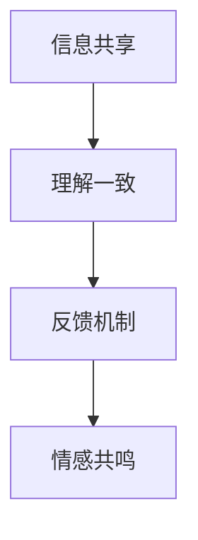
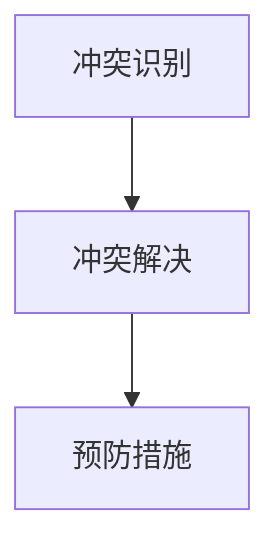

                 


### 《团队协作：提升整体工作效率》

#### 关键词
团队协作、工作效率、项目管理、跨部门沟通、数字化工具

#### 摘要
本文深入探讨了团队协作在提升整体工作效率中的关键作用。通过对团队协作的背景介绍、核心概念解析、方法与技术的详细讲解，以及实际案例的分析，本文旨在为IT领域从业者提供一套系统化的团队协作提升策略，以应对现代工作中的挑战，提高团队整体效能。

---

### 目录大纲设计思路

在设计《团队协作：提升整体工作效率》的目录大纲时，我们遵循以下思路：

1. **确定核心概念与章节划分**：明确团队协作的概念，包括其必要性、基础理论和实际应用。
2. **设计章节标题与内容框架**：确保每个章节标题简洁明了，内容框架完整。
3. **组织与排序**：根据逻辑关系，先介绍基础理论，再深入到应用方法，最后通过案例研究展示实际效果。
4. **确保内容的完整性和实用性**：每个章节包含理论、实用技巧和案例分析。
5. **保持简洁性**：避免冗余内容，确保读者易于理解。

### 目录大纲设计

以下是《团队协作：提升整体工作效率》的完整目录大纲：

```markdown
----------------------------------------------------------------
# 第一部分: 团队协作的背景与基础

## 第1章: 团队协作的重要性
### 1.1 问题背景
### 1.2 团队协作的概念与意义
### 1.3 团队协作的现状与挑战

## 第2章: 团队协作的基础理论
### 2.1 系统理论
### 2.2 领导力与团队管理
### 2.3 沟通理论
### 2.4 冲突管理

## 第3章: 团队协作的方法与技术
### 3.1 团队角色与分工
### 3.2 团队会议与决策
### 3.3 团队协作工具与平台

## 第4章: 团队协作的评估与优化
### 4.1 团队绩效评估
### 4.2 团队协作的反馈机制
### 4.3 团队协作的改进措施

----------------------------------------------------------------

# 第二部分: 团队协作的实践应用

## 第5章: 项目管理中的团队协作
### 5.1 项目团队的角色与职责
### 5.2 项目计划与执行
### 5.3 项目监控与调整

## 第6章: 跨部门协作与沟通
### 6.1 跨部门协作的挑战与策略
### 6.2 跨部门沟通的技巧
### 6.3 跨部门协作的工具与实践

## 第7章: 创新型团队协作
### 7.1 创新型团队的构成
### 7.2 创新型团队的激励与引导
### 7.3 创新型团队的成功案例

## 第8章: 案例研究
### 8.1 案例一：成功团队协作实践
### 8.2 案例二：团队协作的改进之路
### 8.3 案例三：团队协作中的问题与解决

----------------------------------------------------------------

# 第三部分: 团队协作的未来展望

## 第9章: 数字化时代下的团队协作
### 9.1 数字化技术对团队协作的影响
### 9.2 新兴技术在团队协作中的应用
### 9.3 数字化团队协作的趋势与挑战

## 第10章: 团队协作的发展趋势与未来
### 10.1 全球化背景下的团队协作
### 10.2 智能化与自动化对团队协作的变革
### 10.3 未来团队协作的新模式

## 第11章: 总结与展望
### 11.1 全书总结
### 11.2 团队协作的挑战与机遇
### 11.3 对团队协作的期望与建议
```

---

**完整文章内容**将在接下来的章节中逐步展开，以提供深入的分析和实用的指导。

---

**作者：** AI天才研究院/AI Genius Institute & 禅与计算机程序设计艺术 /Zen And The Art of Computer Programming

---

接下来，我们将逐一深入探讨每一部分的内容，以帮助读者全面理解团队协作的重要性及其提升方法。

---

## 第1章: 团队协作的重要性

### 1.1 问题背景

在现代IT行业中，团队协作已成为提升工作效率、确保项目成功的关键因素。随着全球化、数字化和信息化的快速发展，企业面临着前所未有的挑战与机遇。在这个快节奏、高度复杂的工作环境中，单个成员的能力已经无法满足项目的需求，团队协作变得尤为重要。

首先，从项目管理的角度来看，一个成功的项目往往依赖于团队的协作。项目管理不仅包括任务的分配与监控，还需要团队成员之间的高效沟通、相互支持和协同工作。如果团队成员缺乏有效的协作，项目进度将受到严重影响，甚至可能导致项目失败。

其次，跨部门协作也是现代企业中常见的现象。随着企业规模的扩大和组织结构的复杂化，不同部门之间的工作往往需要相互配合。如果各部门之间缺乏协作，信息孤岛和沟通障碍将不可避免，影响整体工作效率。

最后，随着远程工作的普及，团队成员之间的物理距离进一步增加，传统面对面的沟通方式受到限制，团队协作变得更加困难。在这个背景下，有效的团队协作工具和平台变得至关重要，它们能够帮助团队成员克服空间和时间的限制，实现高效协作。

### 1.2 团队协作的概念与意义

团队协作是指团队成员为了共同的目标而进行的协同工作。它不仅包括任务分配和资源协调，还涉及沟通、合作和协调。团队协作的目的是提高工作效率、提升项目质量和满足客户需求。

团队协作的意义主要体现在以下几个方面：

1. **提高工作效率**：通过团队成员的协作，可以充分发挥每个人的优势，实现资源的最佳配置。团队成员可以相互补充，共同解决复杂问题，从而提高整体工作效率。

2. **提升项目质量**：团队协作有助于团队成员之间的知识共享和经验交流，有助于发现和解决潜在问题，提高项目的质量和稳定性。

3. **增强团队凝聚力**：有效的团队协作能够增强团队成员之间的信任和沟通，提高团队凝聚力和合作精神，为企业的长期发展奠定基础。

4. **满足客户需求**：通过团队协作，企业可以更好地了解和满足客户需求，提供高质量的服务和产品，提高客户满意度和忠诚度。

### 1.3 团队协作的现状与挑战

当前，团队协作在IT行业中已得到广泛应用，但仍面临诸多挑战：

1. **沟通障碍**：团队成员之间的沟通不畅是一个普遍问题。由于团队成员的背景、文化和语言差异，以及远程工作的普及，沟通障碍成为团队协作的主要挑战之一。

2. **资源分配不均**：团队中不同成员的能力和资源分配可能存在不均衡，导致部分成员工作负荷过重，而另一些成员则处于闲置状态。

3. **协作工具选择困难**：市场上存在大量的团队协作工具，企业需要选择最适合自身需求的工具，但选择过程复杂且成本较高。

4. **文化冲突**：跨部门协作往往涉及不同文化和背景的员工，文化冲突和价值观差异可能影响团队协作的效率。

5. **领导力不足**：有效的团队协作需要强有力的领导，但许多团队领导缺乏必要的领导力和管理技能，难以激发团队成员的潜力。

### 1.4 本章小结

通过本章的介绍，我们可以看到团队协作在提升整体工作效率中的重要性。在现代IT行业中，团队协作不仅是一种工作方法，更是一种企业文化。有效的团队协作能够提高工作效率、提升项目质量和增强团队凝聚力，从而为企业的长期发展奠定基础。

然而，团队协作也面临着诸多挑战，如沟通障碍、资源分配不均、协作工具选择困难、文化冲突和领导力不足等。在接下来的章节中，我们将进一步探讨团队协作的基础理论、方法与技术，以及实践应用，以帮助读者应对这些挑战，实现团队协作的优化。

---

## 第2章: 团队协作的基础理论

在深入探讨团队协作的实际应用之前，我们需要了解一些基础理论，这些理论将为我们的协作实践提供指导。本章将介绍团队协作中几个核心的理论：系统理论、领导力与团队管理、沟通理论和冲突管理。

### 2.1 系统理论

系统理论是理解团队协作的基础。它强调团队作为一个整体，需要考虑各个部分之间的相互作用和相互依赖。以下是系统理论在团队协作中的几个关键概念：

1. **整体性**：团队的整体绩效不仅仅是各个成员绩效的简单叠加，而是受到团队内部协作、沟通和相互依赖的影响。因此，团队协作的目标是实现整体最优，而不是单纯追求个人最优。

2. **反馈机制**：团队需要建立有效的反馈机制，以不断调整和优化团队协作过程。通过定期回顾和评估团队的表现，可以及时发现并解决问题，确保团队协作的持续改进。

3. **适应性**：团队需要具备适应性和灵活性，以应对不断变化的外部环境和内部挑战。适应性的团队能够更好地调整策略和流程，以实现团队目标。

4. **协同作用**：团队中的成员需要相互协作，发挥协同效应。通过合作和共享知识，团队能够实现1+1>2的效果，提高整体工作效率。

#### 概念属性特征对比表格

| 特征          | 系统理论                 | 传统理论               |
| ------------- | ------------------------ | ---------------------- |
| 关注整体性    | 强调团队整体绩效         | 强调个人绩效           |
| 反馈机制      | 建立持续改进的机制       | 临时性问题解决         |
| 适应性        | 应对变化的能力           | 固定策略和流程         |
| 协同作用      | 成员相互协作实现共同目标 | 个人独立完成任务       |

### 2.2 领导力与团队管理

领导力和团队管理是团队协作的重要组成部分。一个成功的团队需要一个强有力的领导者，他们需要具备以下能力：

1. **愿景与目标设定**：领导者需要明确团队的愿景和目标，并将其传达给团队成员。这有助于统一团队成员的方向和努力，提高团队的凝聚力。

2. **沟通能力**：领导者需要具备良好的沟通能力，能够有效地与团队成员交流意见和反馈。通过清晰、简洁的沟通，领导者可以确保团队成员理解任务要求，减少误解和冲突。

3. **激励与引导**：领导者需要激励团队成员，激发他们的潜力和积极性。通过提供奖励和认可，领导者可以增强团队成员的工作动力和忠诚度。

4. **冲突管理**：领导者需要具备冲突管理的能力，能够及时发现和处理团队内部的冲突。通过建立良好的沟通渠道和解决问题的机制，领导者可以减少冲突对团队协作的负面影响。

#### ER实体关系图架构

```mermaid
erDiagram
    Leader ||--|{ TeamMember } Member
    Leader ||--|{ Project } Project
    TeamMember ||--|{ Role } Role
    TeamMember ||--|{ Skill } Skill
    Project ||--|{ Task } Task
    Role ||--|{ Responsibility } Responsibility
    Skill ||--|{ Knowledge } Knowledge
```

#### 概念属性特征对比表格

| 特征        | 领导力               | 团队管理               |
| ----------- | -------------------- | ---------------------- |
| 愿景与目标 | 设定清晰的目标和愿景 | 实现团队目标           |
| 沟通能力    | 有效的沟通           | 清晰的指令和反馈       |
| 激励与引导 | 激发团队潜力         | 管理团队士气           |
| 冲突管理    | 解决团队冲突         | 确保协作顺畅           |

### 2.3 沟通理论

沟通是团队协作的基石。一个有效的沟通机制可以确保团队成员之间的信息共享、理解一致和协同工作。以下是沟通理论在团队协作中的几个关键概念：

1. **信息共享**：团队成员需要共享关键信息，以确保每个人都能了解项目的进展、任务的要求和团队的目标。信息共享有助于减少误解和重复工作，提高工作效率。

2. **理解一致**：团队成员需要确保对信息的理解一致，避免因为误解而导致的错误和冲突。这需要清晰的沟通、明确的表达和积极的反馈。

3. **反馈机制**：团队成员需要建立有效的反馈机制，通过定期回顾和评估，及时调整和改进协作过程。反馈机制有助于提高团队协作的效率和效果。

4. **情感共鸣**：在团队协作中，情感共鸣也是非常重要的。团队成员需要建立信任和尊重，通过积极的情感交流，增强团队的凝聚力和合作精神。

#### Mermaid流程图



#### 概念属性特征对比表格

| 特征          | 沟通理论               | 传统沟通               |
| ------------- | ---------------------- | ---------------------- |
| 信息共享      | 高效的信息传递         | 单向的信息传递         |
| 理解一致      | 避免误解和冲突         | 依赖个人的理解能力     |
| 反馈机制      | 定期回顾和改进         | 临时性问题解决         |
| 情感共鸣      | 增强团队凝聚力         | 单纯的信息交流         |

### 2.4 冲突管理

冲突是团队协作中不可避免的现象。有效的冲突管理可以帮助团队识别和解决冲突，确保协作顺利进行。以下是冲突管理的一些关键概念：

1. **冲突识别**：团队成员需要具备识别冲突的能力，及时发现和面对潜在的冲突。这需要良好的沟通和观察力，以及开放的心态。

2. **冲突解决**：团队需要建立有效的冲突解决机制，通过对话、协商和妥协来解决问题。解决冲突的关键是找到双方都能接受的解决方案，以维护团队的和谐和稳定。

3. **预防措施**：通过预防措施，如明确沟通规则、建立信任和尊重，团队可以减少冲突的发生。预防措施是冲突管理的重要环节，有助于建立积极的团队氛围。

#### Mermaid流程图



#### 概念属性特征对比表格

| 特征          | 冲突管理               | 传统冲突处理           |
| ------------- | ---------------------- | ---------------------- |
| 冲突识别      | 及时发现和面对冲突     | 冲突发生后再处理       |
| 冲突解决      | 找到双方都能接受的方案 | 单方面解决冲突         |
| 预防措施      | 减少冲突发生           | 依赖冲突后的处理       |

### 2.5 本章小结

通过本章的讨论，我们可以看到团队协作的基础理论对于理解团队协作的核心要素至关重要。系统理论、领导力与团队管理、沟通理论和冲突管理都是团队协作不可或缺的部分。这些理论不仅提供了团队协作的指导原则，还为解决实际工作中的挑战提供了方法。

在接下来的章节中，我们将进一步探讨团队协作的方法与技术，以及如何将这些理论应用于实际工作中，以提升整体工作效率。

---

## 第3章: 团队协作的方法与技术

在了解了团队协作的基础理论之后，我们需要掌握一系列具体的方法和技术，以在实际工作中提升团队协作的效率。本章将详细介绍团队角色与分工、团队会议与决策以及团队协作工具与平台。

### 3.1 团队角色与分工

团队角色与分工是团队协作的基础，合理的角色分配和明确的职责分工有助于确保团队协作的顺畅和高效。

**1. 团队角色的定义**

在团队协作中，常见的角色包括：

- **领导者**：负责团队的总体方向和目标，协调团队成员的工作。
- **项目经理**：负责项目规划、进度控制和资源分配。
- **开发人员**：负责编写代码、设计和实现软件功能。
- **测试人员**：负责测试软件质量，确保项目符合预期标准。
- **产品经理**：负责产品规划和市场调研，确保产品满足用户需求。
- **设计师**：负责产品的界面设计，提升用户体验。

**2. 角色分配的原则**

- **能力匹配**：根据团队成员的能力和特长分配角色，确保每个人都能在适合自己的角色中发挥最大潜力。
- **职责明确**：每个团队成员都应明确自己的职责和任务，避免职责重叠和责任缺失。
- **动态调整**：根据项目进展和团队需求，及时调整角色分配，以应对变化和挑战。

**3. 分工协作的技巧**

- **任务分解**：将大型任务分解为小任务，明确每个小任务的责任人和时间节点。
- **沟通协作**：定期召开团队会议，讨论任务进展和遇到的问题，确保团队成员之间的信息同步。
- **任务跟进**：使用项目管理工具，如Trello或JIRA，跟踪任务进度，确保任务按时完成。

### 3.2 团队会议与决策

团队会议是团队协作的重要环节，通过会议，团队成员可以交流信息、讨论问题、做出决策。有效的团队会议可以提高团队协作效率，确保项目顺利进行。

**1. 会议类型**

- **启动会议**：项目开始时召开，明确项目目标、范围和时间表。
- **进展会议**：项目进行中定期召开，讨论项目进度、问题和解决方案。
- **评审会议**：项目关键里程碑时召开，评估项目质量、进展和风险。
- **决策会议**：讨论重大决策，如资源分配、项目变更等。

**2. 会议准备**

- **明确会议目标**：在会议前明确会议的目标和议程，确保会议聚焦于重要议题。
- **准备工作资料**：准备好相关的会议资料和数据，以便讨论时使用。
- **邀请相关人员**：邀请与会议议题相关的团队成员和利益相关者参加。

**3. 会议技巧**

- **保持会议简洁**：控制会议时间，避免冗长的讨论和无意义的闲聊。
- **积极倾听**：倾听团队成员的意见和反馈，鼓励表达和讨论。
- **有效决策**：在会议中通过讨论、协商和投票等方式做出决策，确保决策的公正性和合理性。
- **会议记录**：记录会议的重要内容和决策结果，确保团队成员都能了解会议内容。

### 3.3 团队协作工具与平台

在现代IT行业中，团队协作工具和平台的选择至关重要。合适的工具可以大大提高团队协作的效率，减少沟通障碍和重复工作。以下是一些常用的团队协作工具和平台：

**1. 项目管理工具**

- **Trello**：一个简单直观的看板式项目管理工具，适合小型团队和简单项目。
- **JIRA**：一个功能强大的项目管理工具，提供敏捷开发、任务跟踪和Bug管理等功能。
- **Asana**：一个全面的任务管理工具，支持项目规划、进度跟踪和团队协作。

**2. 沟通工具**

- **Slack**：一个实时沟通和协作平台，支持文本、语音和视频通讯。
- **Microsoft Teams**：一个集成化的通信和协作工具，支持聊天、会议、文档共享等功能。
- **Zoom**：一个专业的视频会议工具，适合远程团队和跨部门协作。

**3. 文档协作工具**

- **Google Docs**：一个在线文档编辑工具，支持多人实时协作和版本控制。
- **Notion**：一个功能丰富的笔记和组织工具，适合创建知识库和项目文档。
- **Confluence**：一个专业的团队协作工具，提供文档管理、知识共享和协作功能。

**4. 团队协作平台**

- **Confluence**：结合文档管理、知识共享和协作功能的团队协作平台。
- **SharePoint**：微软的企业内容管理平台，适合大中型企业内部协作。
- **GitLab**：一个开源的团队协作平台，提供代码托管、项目管理、持续集成等功能。

**5. 效率提升工具**

- **Automate.io**：自动化工具，用于自动化日常任务和流程。
- **Integromat**：集成工具，用于连接不同的应用程序和API，实现数据流转和自动化操作。
- **Zapier**：自动化工具，支持连接数百个应用程序，实现任务自动化。

### 3.4 本章小结

通过本章的介绍，我们可以看到团队协作的方法和技术在提升整体工作效率中的重要作用。合理的团队角色与分工、有效的团队会议与决策以及选择合适的团队协作工具和平台，都是实现高效团队协作的关键。

在实际应用中，团队需要根据项目特点和团队需求，灵活运用这些方法和工具，以最大化团队协作的效益。在下一章中，我们将进一步探讨团队协作的评估与优化，以帮助团队不断提升协作效率。

---

## 第4章: 团队协作的评估与优化

在团队协作的过程中，评估和优化是确保团队协作效果持续提升的关键环节。通过科学、系统的评估方法，团队可以及时发现协作中的问题，采取相应的优化措施，从而不断提高整体工作效率。本章将介绍团队绩效评估、团队协作的反馈机制以及团队协作的改进措施。

### 4.1 团队绩效评估

团队绩效评估是衡量团队工作成效的重要手段。一个有效的评估体系可以帮助团队了解协作效果，发现存在的问题，并为改进提供依据。

**1. 评估指标**

团队绩效评估的指标应全面覆盖团队的工作表现，包括以下方面：

- **任务完成情况**：评估团队在预定时间内完成任务的进度和数量。
- **项目质量**：评估项目的质量指标，如缺陷率、客户满意度等。
- **团队效率**：评估团队的整体工作效率，包括资源利用率和时间利用率。
- **协作效果**：评估团队协作的质量，如沟通效率、协作氛围等。

**2. 评估方法**

团队绩效评估的方法包括定量评估和定性评估：

- **定量评估**：通过数据统计和分析，对团队绩效进行量化评估。例如，使用关键绩效指标（KPI）对任务完成情况和项目质量进行评估。
- **定性评估**：通过主观判断和观察，对团队协作效果和团队成员的表现进行评估。例如，通过团队成员的反馈和上级领导的评价，对协作氛围和工作氛围进行评估。

**3. 评估工具**

为了提高评估的准确性和效率，可以使用一些评估工具，如：

- **绩效评估表**：用于记录和评估团队成员的工作表现。
- **360度评估**：通过团队成员、上级领导和客户的反馈，对团队成员进行全面的评估。
- **KPI分析工具**：用于对关键绩效指标进行数据分析和可视化展示。

### 4.2 团队协作的反馈机制

反馈机制是团队协作优化的重要环节。通过及时的反馈，团队可以了解协作过程中的问题，并采取相应的措施进行改进。

**1. 反馈类型**

团队协作的反馈类型包括以下几种：

- **正面反馈**：对团队成员的优秀表现和贡献给予肯定和赞扬，增强团队成员的自信心和积极性。
- **负面反馈**：指出团队成员存在的问题和不足，提出改进建议，帮助团队成员提高工作水平。
- **过程反馈**：对团队协作的过程进行评估和反馈，包括沟通效率、协作氛围、决策质量等。

**2. 反馈机制**

建立有效的反馈机制，需要遵循以下原则：

- **及时性**：及时给予反馈，确保问题能够在第一时间被发现和解决。
- **针对性**：针对具体问题进行反馈，避免泛泛而谈，有助于团队成员针对性地进行改进。
- **建设性**：反馈应具有建设性，不仅指出问题，还要提出具体的改进建议。

**3. 反馈方式**

团队协作的反馈方式包括以下几种：

- **面对面反馈**：直接与团队成员进行沟通，面对面反馈问题和建议，有助于建立信任和亲密关系。
- **书面反馈**：通过电子邮件、报告等方式进行书面反馈，确保反馈记录完整和有据可查。
- **匿名反馈**：提供匿名反馈渠道，鼓励团队成员敢于表达真实意见，有助于发现问题并改进。

### 4.3 团队协作的改进措施

在评估和反馈的基础上，团队需要采取具体的改进措施，以提高团队协作效率。以下是一些常见的改进措施：

**1. 培训与学习**

为团队成员提供培训和学习机会，提高他们的专业技能和协作能力。通过培训，团队成员可以学习新的协作工具和方法，提升工作效率。

**2. 优化流程**

对团队协作流程进行优化，减少不必要的环节和流程，提高工作效率。例如，简化任务分配和审批流程，使用自动化工具减少重复性工作。

**3. 沟通与协作**

加强团队内部沟通与协作，建立有效的沟通渠道和协作机制。例如，定期召开团队会议，使用协作工具和平台进行信息共享和任务跟踪。

**4. 文化建设**

培养积极向上的团队文化，增强团队成员的归属感和凝聚力。例如，开展团队建设活动，鼓励团队成员之间的互助和合作。

**5. 激励机制**

建立合理的激励机制，鼓励团队成员积极参与团队协作，提高工作积极性。例如，设立绩效奖励和团队荣誉，激发团队成员的潜力。

### 4.4 本章小结

通过本章的讨论，我们可以看到团队协作的评估与优化在提升整体工作效率中的重要作用。科学的评估方法、有效的反馈机制和具体的改进措施，都是实现高效团队协作的关键。

在实际工作中，团队需要不断进行评估和优化，以应对不断变化的工作环境和挑战。通过持续改进，团队可以不断提高协作效率，实现更高的工作成效。

在下一章中，我们将探讨项目管理中的团队协作，分析项目团队的角色与职责，以及项目计划与执行的方法。

---

## 第5章: 项目管理中的团队协作

在项目管理中，团队协作是确保项目成功的关键因素。有效的团队协作能够提高项目效率、确保项目质量和满足客户需求。本章将详细介绍项目团队的角色与职责、项目计划与执行以及项目监控与调整。

### 5.1 项目团队的角色与职责

项目团队由不同角色组成，每个角色在项目中承担特定的职责，共同推动项目向前发展。以下是一些关键角色及其职责：

**1. 项目经理**

- **职责**：负责项目的整体规划和执行，确保项目按时、按质、按预算完成。
- **任务**：制定项目计划、协调团队成员、管理项目风险、与客户沟通。

**2. 项目团队成员**

- **职责**：根据项目需求，负责具体任务和工作的执行。
- **任务**：开发代码、设计文档、测试软件、编写测试用例等。

**3. 测试人员**

- **职责**：确保软件质量和功能符合预期要求。
- **任务**：编写测试计划、执行测试、报告缺陷。

**4. 产品经理**

- **职责**：负责产品规划和管理，确保产品满足市场需求。
- **任务**：产品需求分析、市场调研、产品迭代。

**5. 设计师**

- **职责**：设计产品的界面和用户体验。
- **任务**：设计原型、编写设计文档、与开发人员协作。

**6. 支持团队**

- **职责**：为项目提供技术支持和资源保障。
- **任务**：提供IT支持、协调外部资源、处理突发事件。

### 5.2 项目计划与执行

项目计划是项目管理的核心环节，通过项目计划，团队可以明确项目的目标、任务、时间和资源。以下是一些项目计划与执行的关键步骤：

**1. 项目计划**

- **任务分解**：将项目任务分解为可管理的子任务，明确每个任务的负责人和截止日期。
- **资源分配**：根据任务需求，分配适当的资源，包括人力、技术和资金。
- **时间规划**：制定项目的时间表，明确每个任务的开始和结束时间。

**2. 项目执行**

- **任务执行**：团队成员按照项目计划，执行各自的任务。
- **监控进度**：定期检查项目进度，确保任务按时完成。
- **沟通协调**：团队成员之间保持良好的沟通，及时解决遇到的问题。

**3. 项目文档**

- **项目文档**：记录项目计划、任务分配、进度报告和决策记录等，确保项目信息的完整性和可追溯性。

### 5.3 项目监控与调整

项目监控是确保项目按照计划顺利进行的关键。通过项目监控，团队可以及时发现并解决问题，调整项目计划，确保项目目标的实现。以下是一些项目监控与调整的关键步骤：

**1. 项目监控**

- **进度跟踪**：使用项目管理工具，如Trello或JIRA，跟踪任务进度，确保每个任务按时完成。
- **质量监控**：测试人员负责监控软件质量，确保项目符合质量标准。
- **风险监控**：识别潜在风险，并制定相应的风险应对策略。

**2. 项目调整**

- **进度调整**：根据实际进度，调整项目计划和时间表，确保项目按时完成。
- **资源调整**：根据项目需求和实际情况，调整资源分配，确保项目资源充足。
- **决策调整**：根据项目进展和反馈，做出必要的决策和调整，确保项目目标的实现。

**3. 项目报告**

- **项目报告**：定期编写项目报告，总结项目进展、问题和改进措施，为项目的下一步工作提供依据。

### 5.4 本章小结

通过本章的介绍，我们可以看到在项目管理中，团队协作是确保项目成功的关键。项目团队的角色与职责明确、项目计划与执行有条不紊、项目监控与调整及时有效，这些都是实现项目目标的重要保障。

在实际项目管理中，团队需要根据项目特点和需求，灵活运用这些方法和工具，以应对各种挑战，确保项目顺利完成。在下一章中，我们将探讨跨部门协作与沟通，分析跨部门协作的挑战与策略，以及跨部门沟通的技巧。

---

## 第6章: 跨部门协作与沟通

在大型企业中，不同部门之间的协作与沟通是确保项目顺利进行的关键。跨部门协作不仅涉及到多个团队之间的合作，还包括不同职能、文化和背景的融合。本章将深入探讨跨部门协作的挑战与策略，以及跨部门沟通的技巧。

### 6.1 跨部门协作的挑战与策略

跨部门协作的挑战主要集中在以下几个方面：

**1. 信息孤岛**

由于不同部门使用不同的系统和工具，导致信息分散、沟通不畅，形成信息孤岛。这会导致部门间无法及时获取所需信息，影响协作效率。

**解决方案**：建立统一的沟通平台和文档管理系统，确保信息共享和透明度。例如，使用SharePoint或Confluence等工具，实现文档和信息的集中存储和访问。

**2. 目标不一致**

不同部门可能有各自的目标和优先级，导致在协作过程中出现目标不一致的问题。这会影响团队协作的效率和质量。

**解决方案**：明确项目目标，确保所有部门都朝着共同的目标努力。通过定期召开跨部门会议，讨论项目进展和问题，统一各部门的目标和行动。

**3. 文化差异**

不同部门的文化差异可能导致沟通障碍和协作不畅。例如，技术部门注重效率和创新，而市场部门则关注客户需求和品牌建设。

**解决方案**：培养跨部门的文化认同感，通过团队建设活动、培训和交流，增强团队之间的相互理解和信任。鼓励部门间建立友好的工作关系，促进协作。

**4. 职责不明确**

在跨部门协作中，职责分配不明确会导致责任推卸和工作延误。每个部门可能不清楚自己的职责和任务，导致协作效率低下。

**解决方案**：明确各部门的职责和任务，确保每个部门都清楚自己的工作内容和目标。通过制定详细的任务分配表和职责说明，确保责任到人。

### 6.2 跨部门沟通的技巧

有效的跨部门沟通是确保协作顺利进行的关键。以下是一些跨部门沟通的技巧：

**1. 明确沟通目标**

在跨部门沟通前，明确沟通的目标和议程，确保沟通有针对性。避免无目的的闲聊和冗长的讨论，提高沟通效率。

**2. 选择合适的沟通方式**

根据沟通内容的重要性和紧急程度，选择合适的沟通方式。例如，对于重要决策和紧急任务，可以通过面对面会议或视频会议进行沟通；对于日常交流和任务跟进，可以使用电子邮件、即时通讯工具或项目管理平台。

**3. 倾听与反馈**

在跨部门沟通中，不仅要表达自己的观点和意见，还要倾听对方的意见和反馈。通过积极的倾听和反馈，可以增进相互理解和信任，减少误解和冲突。

**4. 保持透明度**

确保沟通信息的透明度，避免信息孤岛和保密主义。通过共享信息，增强部门间的协同效应，提高协作效率。

**5. 定期回顾与总结**

定期召开跨部门沟通会议，回顾项目进展和沟通情况，总结经验和教训。通过反思和总结，不断提升跨部门沟通的效果和协作效率。

### 6.3 跨部门协作的工具与实践

为了提高跨部门协作的效率，可以使用以下工具和实践：

**1. 统一沟通平台**

使用统一沟通平台，如Microsoft Teams或Slack，实现实时沟通和信息共享。这些平台支持文本、语音和视频通讯，方便团队成员之间的交流。

**2. 项目管理工具**

使用项目管理工具，如Trello或JIRA，实现任务分配、进度跟踪和协作。这些工具可以帮助团队成员了解项目的整体进展和各自的职责，确保任务按时完成。

**3. 文档协作工具**

使用文档协作工具，如Google Docs或Confluence，实现文档共享和协作。这些工具支持多人实时编辑和版本控制，确保文档的准确性和一致性。

**4. 跨部门会议**

定期召开跨部门会议，讨论项目进展、问题和协作情况。通过会议，各部门可以共同制定行动计划，确保项目顺利进行。

**5. 互助与支持**

鼓励部门间的互助和支持，建立友好的工作关系。例如，技术部门可以协助市场部门进行技术支持，市场部门可以提供用户需求和反馈。

### 6.4 本章小结

通过本章的讨论，我们可以看到跨部门协作在项目成功中的重要性。跨部门协作的挑战和策略、跨部门沟通的技巧以及协作工具和实践，都是确保协作顺利进行的关键。

在实际工作中，团队需要根据项目特点和部门需求，灵活运用这些方法和工具，以应对跨部门协作的挑战，提高整体工作效率。在下一章中，我们将探讨创新型团队协作，分析创新型团队的构成、激励与引导以及成功案例。

---

## 第7章: 创新型团队协作

创新型团队协作在现代企业中越来越受到重视。创新不仅能够为企业带来竞争优势，还能够推动企业的持续发展。本章将探讨创新型团队的构成、激励与引导，以及成功案例。

### 7.1 创新型团队的构成

创新型团队由一系列特定的成员构成，这些成员在技能、经验和思维模式上具有互补性。以下是创新型团队常见的一些构成要素：

**1. 多元化的背景与技能**

创新型团队需要多元化的成员，包括不同专业背景、工作经验和文化背景的成员。这种多元化有助于团队从不同角度思考问题，激发创新思维。

**2. 创新领导者**

创新领导者是创新型团队的核心，他们具备创新思维、领导力和激励团队成员的能力。创新领导者不仅要推动团队的创新，还要为团队成员提供支持和资源。

**3. 开放的文化**

创新型团队需要一个开放的文化环境，鼓励成员自由表达意见和分享想法。这种开放的文化有助于激发团队成员的创新潜力，促进团队协作。

**4. 技术专家**

创新型团队需要具备技术专长的成员，他们能够运用最新的技术和工具，推动团队的创新项目。

**5. 沟通与协作能力**

创新团队成员需要具备良好的沟通与协作能力，能够有效地传达自己的想法，并与团队成员进行协作。

### 7.2 创新型团队的激励与引导

激励与引导是推动创新型团队协作的重要手段。以下是一些激励与引导的方法：

**1. 设定明确的创新目标**

为创新型团队设定明确的创新目标，确保团队成员了解团队的努力方向。目标应具有挑战性，但也要可实现，以激发团队成员的积极性。

**2. 提供资源支持**

为创新型团队提供充足的资源支持，包括人力、资金和设备。资源支持有助于团队克服创新过程中的障碍，推动项目的顺利进行。

**3. 激励机制**

建立合理的激励机制，鼓励团队成员积极参与创新项目。激励机制可以包括奖金、晋升机会和荣誉表彰等。

**4. 引导与支持**

为创新型团队提供引导与支持，帮助他们克服创新过程中的困难和挑战。引导与支持可以包括培训、指导和建议等。

### 7.3 创新型团队的成功案例

以下是一些创新型团队的成功案例，它们展示了如何通过协作和创新实现项目的成功：

**1. 特斯拉**

特斯拉是一个以创新为核心的企业，其成功得益于创新型团队的合作。特斯拉的团队在电动车技术、电池技术和自动驾驶等领域进行了多项创新，推动了电动汽车行业的发展。

**2. 苹果公司**

苹果公司以其创新的产品设计和用户体验著称。苹果的创新团队通过紧密的协作和持续的创新，推出了如iPhone、iPad和MacBook等一系列成功的产品。

**3. 亚马逊**

亚马逊通过其创新型团队，不断推出新的服务和功能，如云计算服务、智能语音助手Alexa和无人机配送等。这些创新不仅提升了用户体验，也为亚马逊带来了巨大的商业价值。

### 7.4 本章小结

通过本章的讨论，我们可以看到创新型团队协作在现代企业中的重要性。创新型团队由多元化的成员构成，具有开放的文化和强大的创新能力。通过有效的激励与引导，创新型团队能够实现持续的创新和突破。

在实际工作中，企业需要注重创新型团队的构建，提供充足的资源和支持，鼓励团队成员积极参与创新项目。通过成功案例的分析，我们可以学习到如何在创新型团队中实现协作和创新。在下一章中，我们将探讨案例研究，通过实际案例深入分析团队协作的实践。

---

## 第8章: 案例研究

为了更好地理解团队协作的实际效果和挑战，本章将通过三个具体案例，详细分析团队协作的成功实践、改进之路以及团队协作中遇到的问题和解决方法。

### 8.1 案例一：成功团队协作实践

**案例背景**：
某知名互联网公司正在开发一款新的人工智能助手，旨在通过语音识别和自然语言处理技术，为用户提供智能化的咨询服务。项目团队由人工智能专家、前端开发者、后端开发者、测试工程师和市场分析师等多个职能部门的成员组成。

**成功实践**：

1. **明确目标和任务分配**：在项目启动阶段，团队明确了项目的目标，并根据团队成员的技能和专长，将任务合理分配。每个成员都清楚自己的职责和任务，确保项目进度可控。

2. **定期会议和沟通**：团队建立了每周一次的会议制度，用于讨论项目进展、解决遇到的问题和协调各个部门之间的工作。这种定期的沟通机制有助于团队成员之间保持信息同步，提高了协作效率。

3. **协作工具的使用**：团队使用了Trello和Slack等协作工具，实现了任务管理和实时沟通。Trello用于任务分配和进度跟踪，Slack用于团队内部沟通和信息共享。这些工具的使用大大提高了团队的工作效率。

4. **敏捷开发**：团队采用了敏捷开发方法，通过迭代开发和频繁的反馈机制，确保项目的灵活性和质量。每个迭代结束后，团队都会进行回顾会议，总结经验教训，为下一个迭代做准备。

**案例总结**：
通过有效的团队协作，该互联网公司的AI助手项目在短时间内成功上线，并获得了良好的用户评价。团队协作的成功实践不仅提高了工作效率，还增强了团队成员之间的信任和凝聚力。

### 8.2 案例二：团队协作的改进之路

**案例背景**：
某传统制造企业在数字化转型的过程中，遇到了跨部门协作不畅的问题。不同部门之间的信息孤岛和沟通障碍严重影响了项目进度和质量。

**改进之路**：

1. **建立跨部门沟通平台**：公司引入了SharePoint作为跨部门沟通和协作平台，实现了文档和信息的集中存储和共享。通过SharePoint，各部门可以方便地获取和更新项目相关信息，减少了信息孤岛现象。

2. **明确职责和流程**：公司重新梳理了各部门的职责和流程，明确了项目中的关键节点和责任人。通过制定详细的任务分配表和流程图，确保每个部门都清楚自己的职责和任务，避免了责任推卸和重复工作。

3. **加强培训与文化建设**：公司组织了跨部门培训，提高员工对团队协作的理解和意识。同时，通过团队建设活动和文化活动，增强了员工的团队合作精神和归属感。

4. **引入项目管理工具**：公司引入了JIRA作为项目管理工具，用于任务分配、进度跟踪和问题报告。通过JIRA，项目经理可以实时监控项目进展，及时调整资源分配和任务优先级。

**案例总结**：
通过一系列的改进措施，该制造企业的跨部门协作效率显著提高，项目进度和质量也得到了改善。团队协作的改进之路不仅解决了原有问题，还为企业的数字化转型奠定了坚实基础。

### 8.3 案例三：团队协作中的问题与解决

**案例背景**：
某创业公司正在开发一款智能家居产品，但由于团队成员之间的沟通不畅和协作不力，项目进展缓慢，出现了严重的时间延误和资源浪费。

**问题与解决**：

**问题1**：沟通不畅
- **问题描述**：团队成员之间的沟通不畅，导致信息传递延迟和误解。成员无法及时了解项目的最新进展和需求变化，影响了工作进度。
- **解决方法**：公司引入了Slack作为即时通讯工具，建立专门的频道用于项目讨论和信息共享。同时，每周召开一次项目进度会议，确保团队成员之间的信息同步和协调。

**问题2**：任务分配不合理
- **问题描述**：任务分配不合理，导致部分成员工作负荷过重，而另一些成员则处于闲置状态。这种资源分配不均影响了团队的整体工作效率。
- **解决方法**：通过重新评估团队成员的技能和专长，对任务进行合理分配。同时，引入了Trello作为任务管理工具，实时跟踪任务进度，确保任务按时完成。

**问题3**：缺乏反馈机制
- **问题描述**：缺乏有效的反馈机制，团队成员无法及时了解自己的工作表现和改进方向，影响了工作效率和团队士气。
- **解决方法**：建立了定期的反馈机制，通过周度或月度回顾会议，团队成员可以分享工作心得和遇到的问题，获得反馈和建议。同时，引入了360度评估工具，对团队成员的工作进行全面的评估。

**案例总结**：
通过解决团队协作中的问题，该创业公司的项目进展得到了显著改善，团队成员的工作效率和团队士气也有所提升。这一案例表明，及时发现和解决团队协作中的问题是提高团队工作效率的关键。

### 8.4 本章小结

通过上述案例研究，我们可以看到团队协作在实际工作中的重要性。成功的团队协作不仅能够提高工作效率和项目质量，还能够增强团队凝聚力和成员的满意度。在团队协作过程中，遇到问题是正常的，关键在于如何及时识别和解决问题。

本章通过三个具体案例，展示了团队协作的成功实践、改进之路以及解决问题的方法。这些案例为我们提供了宝贵的经验和启示，有助于我们更好地理解和实践团队协作，提高整体工作效率。

在下一章中，我们将探讨数字化时代下的团队协作，分析数字化技术对团队协作的影响、新兴技术在团队协作中的应用，以及数字化团队协作的趋势与挑战。

---

## 第9章: 数字化时代下的团队协作

随着数字化技术的飞速发展，团队协作的方式和工具也在不断革新。数字化时代为团队协作带来了新的机遇和挑战。本章将分析数字化技术对团队协作的影响、新兴技术在团队协作中的应用，以及数字化团队协作的趋势与挑战。

### 9.1 数字化技术对团队协作的影响

数字化技术的广泛应用，极大地改变了团队协作的方式和效率。以下是一些关键影响：

**1. 沟通效率提升**

数字化技术使得团队之间的沟通变得更加便捷和高效。通过即时通讯工具（如Slack、WhatsApp）和视频会议平台（如Zoom、Microsoft Teams），团队成员可以随时随地交流，减少了沟通的时滞，提高了决策速度。

**2. 信息共享与透明度**

数字化平台（如SharePoint、Confluence）提供了集中化的信息存储和共享机制，使团队成员可以轻松访问和更新项目资料。这种透明度有助于团队成员了解项目的进展和任务分配，减少了信息孤岛和误解。

**3. 任务自动化**

数字化工具（如JIRA、Trello）实现了任务自动化和流程优化。这些工具可以跟踪任务进度、提醒截止日期、分配任务等，减少了手动操作的复杂性，提高了工作效率。

**4. 数据分析与优化**

数字化技术使得数据分析成为可能，团队可以通过收集和分析项目数据，优化工作流程和协作方式。数据分析可以帮助团队识别瓶颈、优化资源分配，提高协作效率。

### 9.2 新兴技术在团队协作中的应用

随着技术的不断进步，新兴技术也在团队协作中找到了广泛的应用。以下是一些关键技术：

**1. 云计算**

云计算提供了强大的计算能力和数据存储空间，使得团队可以随时随地访问所需资源。云计算平台（如AWS、Azure、Google Cloud）支持大规模数据处理和协作，为团队协作提供了灵活的解决方案。

**2. 区块链**

区块链技术为团队协作提供了透明、安全和不可篡改的数据管理机制。在跨部门协作中，区块链可以确保信息的真实性和安全性，减少欺诈和纠纷。

**3. 人工智能**

人工智能（AI）技术在团队协作中的应用越来越广泛。例如，AI助手可以帮助团队成员处理重复性任务、提供决策支持、优化工作流程。AI还可以用于数据分析，帮助团队更好地理解协作数据，优化协作方式。

**4. 虚拟现实（VR）和增强现实（AR）**

虚拟现实和增强现实技术为团队协作带来了新的维度。通过VR和AR，团队成员可以身临其境地参与协作，提高沟通效果和协作体验。

### 9.3 数字化团队协作的趋势与挑战

数字化团队协作正朝着以下几个趋势发展：

**1. 全远程协作**

随着远程工作的普及，全远程协作将成为主流。团队成员可以分布在不同的地理位置，通过数字化工具进行高效协作。这种协作模式要求团队具备高度的自主性和自我管理能力。

**2. 自动化与智能化**

自动化和智能化技术将在团队协作中扮演越来越重要的角色。通过自动化工具和智能系统，团队可以大幅减少重复性工作，提高工作效率。

**3. 实时协作与反馈**

实时协作和反馈机制将成为团队协作的标配。通过即时通讯工具和协作平台，团队成员可以实时交流、反馈和调整，确保项目进展的透明度和高效性。

然而，数字化团队协作也面临一些挑战：

**1. 技术选择与集成**

随着数字化工具的多样化，团队需要选择最适合自己需求的工具，并确保这些工具能够无缝集成，提高协作效率。

**2. 数字鸿沟**

数字化技术的普及可能导致数字鸿沟的扩大。一些团队成员可能缺乏必要的数字技能，影响团队协作的效率。

**3. 安全与隐私**

数字化协作过程中，数据安全和隐私保护成为重要问题。团队需要采取有效的措施，确保数据和协作过程的安全性。

### 9.4 本章小结

数字化时代下的团队协作带来了诸多机遇，同时也提出了新的挑战。通过数字化技术，团队可以实现更高效的协作、更透明的工作流程和更智能的工作方式。然而，团队也需要应对技术选择、数字鸿沟和安全隐私等挑战。

在下一章中，我们将探讨团队协作的发展趋势与未来，分析全球化背景下的团队协作、智能化与自动化对团队协作的变革，以及未来团队协作的新模式。

---

## 第10章: 团队协作的发展趋势与未来

随着技术的不断进步和社会环境的变迁，团队协作正经历着深刻的变革。本章将分析全球化背景下的团队协作、智能化与自动化对团队协作的变革，以及未来团队协作的新模式。

### 10.1 全球化背景下的团队协作

全球化使企业可以跨越地理界限，招募来自世界各地的优秀人才。全球化团队协作的特点包括：

**1. 跨文化沟通**

全球化团队由不同文化背景的成员组成，这要求团队成员具备跨文化沟通的能力。有效的跨文化沟通需要尊重不同文化的差异，理解和适应不同的沟通风格。

**2. 远程协作**

全球化团队往往分布在不同的国家和地区，远程协作成为常态。数字化工具（如Slack、Zoom）和协作平台（如Confluence、Trello）成为全球化团队协作的关键。

**3. 时区管理**

全球化团队的时区差异要求团队成员合理安排工作时间和任务分配，以确保项目进度不受影响。

**4. 多元化视角**

全球化团队带来了多元化的视角和知识，有助于团队从不同角度思考问题，提高创新能力和解决问题的能力。

### 10.2 智能化与自动化对团队协作的变革

智能化与自动化技术的应用正在深刻改变团队协作的方式和效率：

**1. AI与机器学习**

人工智能（AI）和机器学习（ML）技术可以用于自动化重复性任务，如数据整理、报告生成和预测分析。这使团队成员能够将精力集中在更高价值的工作上。

**2. 智能助手**

智能助手（如Google Assistant、Alexa）可以帮助团队成员处理日常任务，提供即时信息和建议，提高工作效率。

**3. 机器人流程自动化（RPA）**

机器人流程自动化（RPA）技术可以自动化复杂的业务流程，减少人工操作和错误，提高流程的效率和准确性。

**4. 数据分析与可视化**

数据分析与可视化技术可以帮助团队更好地理解协作数据，发现潜在问题，优化工作流程和协作方式。

### 10.3 未来团队协作的新模式

未来团队协作将呈现以下新模式：

**1. 自组织团队**

自组织团队（Self-Organizing Teams）是一种以自主、自我管理和自我激励为特点的团队模式。团队成员在共同目标下自主决定工作方式、任务分配和资源使用，提高团队协作的灵活性和效率。

**2. 平台化协作**

平台化协作（Platform Collaboration）是通过构建共享平台，实现团队间的高效协作和信息共享。这种模式强调资源共享、知识共享和协同创新，有助于提高团队的整体效能。

**3. 虚拟现实（VR）与增强现实（AR）**

虚拟现实（VR）和增强现实（AR）技术将为团队协作带来全新的体验。通过虚拟会议、虚拟培训和虚拟协作，团队成员可以身临其境地参与项目，提高协作的沉浸感和互动性。

**4. 智能协作**

智能协作（Smart Collaboration）是指利用人工智能和数据分析技术，实现团队协作的智能化和个性化。智能协作可以帮助团队更好地理解协作数据，预测协作趋势，优化协作方式。

### 10.4 本章小结

团队协作正面临着全球化、智能化和自动化等变革，这些变革不仅改变了团队协作的方式，也带来了新的机遇和挑战。全球化团队需要跨文化沟通和远程协作，智能化与自动化技术提高了团队协作的效率和效果，而未来团队协作的新模式将带来更灵活、更高效的协作方式。

在未来的工作中，团队需要不断适应和应对这些变革，利用新兴技术优化协作流程，提高团队的整体效能。通过不断探索和实践，团队将能够在全球化和智能化的大背景下，实现更高的协作水平和创新成果。

在下一章中，我们将总结全书的内容，探讨团队协作的挑战与机遇，并对团队协作的未来提出期望和建议。

---

## 第11章: 总结与展望

通过前十章的深入探讨，我们系统地介绍了团队协作在提升整体工作效率中的关键作用。本章将对全书的内容进行总结，探讨团队协作面临的挑战与机遇，并对团队协作的未来提出期望与建议。

### 11.1 全书总结

《团队协作：提升整体工作效率》从团队协作的背景与基础、实践应用和未来展望三个方面，全面阐述了团队协作的重要性、方法与技术，以及发展趋势与未来趋势。

- **背景与基础**：我们介绍了团队协作的必要性，分析了团队协作的核心概念，如系统理论、领导力与团队管理、沟通理论和冲突管理。
- **实践应用**：我们详细讲解了团队协作的方法与技术，包括团队角色与分工、团队会议与决策、团队协作工具与平台，以及项目管理中的团队协作和跨部门协作与沟通。
- **未来展望**：我们探讨了数字化时代下的团队协作、智能化与自动化对团队协作的变革，以及全球化背景下的团队协作新模式。

通过这些内容的介绍，读者可以全面了解团队协作的理论基础和实践方法，掌握如何在实际工作中提升团队协作效率。

### 11.2 团队协作的挑战与机遇

尽管团队协作在提升整体工作效率方面具有显著优势，但在实际应用中仍面临诸多挑战：

**挑战**：

1. **沟通障碍**：团队成员之间的沟通不畅，尤其是跨部门、跨文化和远程工作的情况下，容易导致误解和冲突。
2. **资源分配不均**：团队内部资源分配不均，部分成员可能工作量过大，而另一些成员则处于闲置状态。
3. **文化冲突**：不同背景和文化成员之间的差异可能导致协作不畅，影响团队的整体效能。
4. **技术选择困难**：市场上存在大量的团队协作工具，企业需要选择最适合自身需求的工具，但选择过程复杂且成本较高。

**机遇**：

1. **数字化技术**：数字化技术为团队协作提供了强大的支持，通过即时通讯、视频会议、项目管理工具等，可以实现远程高效协作。
2. **智能化与自动化**：智能化与自动化技术可以自动化重复性任务，提高团队协作效率，减少人为错误。
3. **跨文化协作**：全球化背景下，跨文化协作提供了更多机会，不同文化的融合和碰撞可以激发创新思维。
4. **新型协作模式**：自组织团队、平台化协作、虚拟现实与增强现实等新型协作模式，为团队协作带来了更多可能性和灵活性。

### 11.3 对团队协作的期望与建议

为了更好地应对挑战，把握机遇，以下是对团队协作的期望与建议：

**期望**：

1. **高效沟通**：团队应建立高效的沟通机制，确保信息透明、及时传达，减少误解和冲突。
2. **合理分工**：根据团队成员的能力和特长进行合理分工，确保资源充分利用，提高团队协作效率。
3. **文化融合**：尊重并融合不同文化背景的团队成员，建立开放、包容的团队文化。
4. **持续优化**：不断评估和优化团队协作流程，引入新的技术和管理方法，提高团队的整体效能。

**建议**：

1. **培训与教育**：为团队成员提供培训和教育，提高他们的协作能力和技能。
2. **激励机制**：建立合理的激励机制，鼓励团队成员积极参与团队协作，提高工作积极性。
3. **工具选择**：根据团队需求和项目特点，选择合适的团队协作工具，确保工具的易用性和高效性。
4. **反馈机制**：建立有效的反馈机制，及时收集团队成员的意见和建议，不断改进团队协作方式。

### 11.4 总结

通过《团队协作：提升整体工作效率》的探讨，我们可以看到团队协作在提升整体工作效率中的关键作用。团队协作不仅能够提高工作效率、提升项目质量和增强团队凝聚力，还能够应对全球化、数字化和智能化的挑战。

在未来的工作中，团队需要不断探索和创新，利用先进的技术和方法，优化团队协作流程，提高整体效能。通过有效的团队协作，企业将能够在激烈的市场竞争中脱颖而出，实现长期发展。

最后，让我们再次回顾本书的核心观点：团队协作是提升整体工作效率的关键，通过合理的分工、高效的沟通、合理的激励和持续优化，团队可以充分发挥其潜力，实现更高的目标。

---

**作者：** AI天才研究院/AI Genius Institute & 禅与计算机程序设计艺术 /Zen And The Art of Computer Programming

---

本文通过深入探讨团队协作的背景、理论基础、方法与实践，以及未来趋势，为IT领域从业者提供了一套系统化的团队协作提升策略。希望读者能够结合自身实际情况，灵活运用这些方法和工具，提升团队协作效率，实现更高的工作成效。在未来的工作中，不断探索和创新，为团队协作的发展贡献力量。

