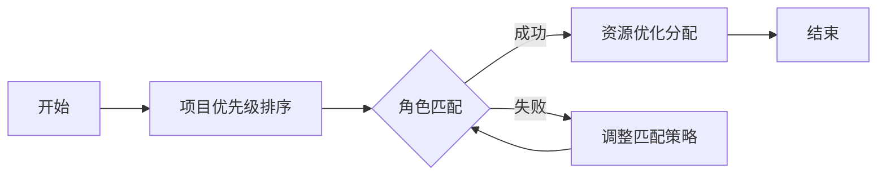
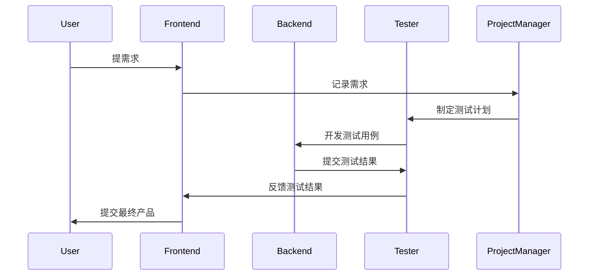
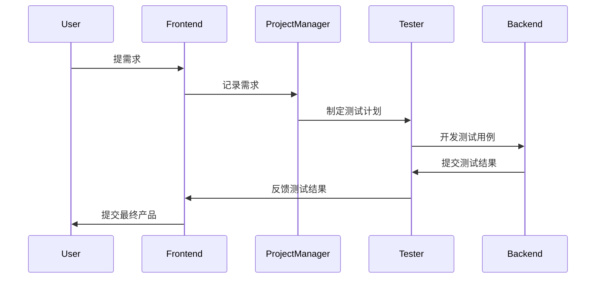

                 

### 第1章：团队协作的挑战

#### 1.1.1 问题背景

在现代企业中，团队协作的重要性不言而喻。随着信息技术的发展和全球化进程的加快，企业面临着日益复杂的业务环境和竞争压力，单靠个人的力量已经难以应对各种挑战。跨职能团队合作成为提升效率、创新产品和实现战略目标的关键。然而，团队协作并非一帆风顺，其中充满了各种挑战。

首先，沟通障碍是团队协作中最为普遍的问题之一。不同职能部门之间的语言、术语和表达方式可能存在差异，导致信息传递不准确、不及时。其次，角色冲突也是一个常见问题。团队成员可能对自己的职责和责任理解不一致，导致任务分工不清、责任不明。此外，团队成员之间的信任水平也影响着协作效果，缺乏信任可能导致协作不畅、意见分歧。

为了解决这些问题，企业需要建立有效的沟通机制，明确角色责任，并提供相应的培训。有效的沟通机制可以帮助团队成员更好地理解彼此的需求和期望，减少误解和冲突。明确的角色责任可以确保每个成员都清楚自己的职责，避免工作重叠和责任缺失。培训可以帮助团队成员提升协作能力和沟通技巧，增强团队凝聚力。

#### 1.1.2 问题描述

团队协作面临的挑战主要包括以下几个方面：

1. **沟通障碍**：团队成员之间的沟通不畅，导致信息传递不准确、不及时，影响工作进展。
2. **角色冲突**：团队成员对自己的职责和责任理解不一致，导致任务分工不清、责任不明，影响工作效率。
3. **责任不明**：团队成员之间的责任分配不明确，可能导致工作重叠或责任缺失，影响项目进度和质量。
4. **信任缺失**：团队成员之间的信任水平不高，导致协作不畅、意见分歧，影响团队整体效能。
5. **协作困难**：跨职能团队之间的协作难度较大，需要协调不同部门和职能的需求，提高协作效率。

#### 1.1.3 问题解决

针对上述问题，我们可以采取以下策略来解决团队协作中的挑战：

1. **建立有效的沟通机制**：制定明确的沟通计划和规范，确保信息在团队内部得到及时、准确和有效的传递。
2. **明确角色责任**：为每个团队成员分配明确的职责，确保每个人都知道自己的任务和期望，避免工作重叠和责任缺失。
3. **提升协作能力**：通过培训和团队建设活动，提高团队成员的协作能力和沟通技巧，增强团队凝聚力。
4. **建立信任关系**：通过建立共同目标和团队价值观，增强团队成员之间的信任，减少意见分歧和协作障碍。
5. **优化协作工具**：引入先进的协作工具和技术，提高团队协作效率和效果，减少沟通障碍和协作困难。

#### 1.1.4 边界与外延

团队协作的边界涉及多个方面，包括团队规模、组织文化和外部合作伙伴。在团队规模方面，团队的大小直接影响到协作的难易程度。过大的团队可能导致沟通成本增加、协作效率降低。而在组织文化方面，企业的文化和价值观也会对团队协作产生影响。开放、包容的文化有利于团队协作，而封闭、保守的文化则可能阻碍协作。

此外，团队协作还需要考虑外部合作伙伴的关系。在现代企业中，许多项目需要与供应商、客户和其他合作伙伴协作。如何与外部合作伙伴建立良好的合作关系，确保协作的顺畅和高效，是团队协作的一个重要方面。

#### 1.1.5 概念结构与核心要素组成

团队协作的核心概念主要包括团队、协作、跨职能合作等。其中，团队是协作的基础，协作是实现团队目标的关键，跨职能合作则是团队协作的高级形式。

1. **团队**：团队是由一组相互依赖、共同追求目标的个体组成的。团队具有共同的目标、明确的职责和角色分工。
2. **协作**：协作是团队成员之间通过沟通、合作和共同努力实现团队目标的过程。协作需要建立在信任和理解的基础上。
3. **跨职能合作**：跨职能合作是不同职能部门之间进行的协作，涉及多个领域和专业的知识。跨职能合作需要协调不同部门和职能的需求，实现资源的共享和优势互补。

在团队协作中，核心要素包括沟通、信任、协作和目标一致性。沟通是团队协作的基础，信任是协作的保障，协作是实现团队目标的关键，目标一致性是团队协作的方向。

通过以上分析和解决策略，我们可以更好地应对团队协作中的挑战，提高团队协作效率，实现团队目标。在接下来的章节中，我们将深入探讨团队协作的核心概念和跨职能合作的算法原理，提供更具体的实践策略。

## 第2章：团队协作的核心概念与联系

### 2.1 核心概念原理

团队协作中的核心概念包括团队、协作、跨职能合作等。这些概念不仅是团队运作的基础，也是实现团队目标的关键。

**团队**：团队是由一组相互依赖、共同追求目标的个体组成的。团队的特点包括共同的目标、明确的职责和角色分工。团队成员之间需要建立信任和合作关系，以实现共同的目标。

**协作**：协作是团队成员之间通过沟通、合作和共同努力实现团队目标的过程。协作不仅仅是完成任务，更是一种相互支持和帮助的精神。协作需要建立在信任和理解的基础上，通过有效的沟通和合作，提高团队的整体效能。

**跨职能合作**：跨职能合作是不同职能部门之间进行的协作，涉及多个领域和专业的知识。跨职能合作需要协调不同部门和职能的需求，实现资源的共享和优势互补。这种合作形式对于实现复杂项目的成功至关重要。

### 2.2 概念属性特征对比表格

为了更直观地理解团队、协作和跨职能合作的概念，我们可以通过一个对比表格来展示它们的属性特征。

| 概念    | 属性特征                           | 例子 |
|---------|-----------------------------------|-----|
| 团队    | 共同目标、明确职责、角色分工       | 足球队伍 |
| 协作    | 沟通、合作、相互支持               | 团队项目 |
| 跨职能合作 | 资源共享、优势互补、多领域知识    | 产品开发 |

### 2.3 ER实体关系图架构

为了更好地理解团队协作中的实体及其关系，我们可以使用ER（实体-关系）图来展示。

```mermaid
erDiagram
    Class1 ||--|{ Class2 }|| Person : { has } Tasks
    Class2 ||--|{ Class3 }|| Team : { contains } Members
    Class3 ||--|{ Class4 }|| Project : { is_part_of } Team
    Class4 ||--|{ Class5 }|| Task : { is_a } Project
```

在这个ER图中，我们定义了以下几个实体：

- **Person（人）**：表示团队成员，具有职责和任务。
- **Team（团队）**：包含多个成员，共同负责一个或多个项目。
- **Project（项目）**：是一个具体的任务，由团队来完成。
- **Task（任务）**：是项目中的具体工作，由团队成员负责。

实体之间的关系包括：

- **Person**与**Tasks**之间的关系是“人负责任务”。
- **Team**与**Members**之间的关系是“团队包含成员”。
- **Team**与**Project**之间的关系是“团队负责项目”。
- **Project**与**Tasks**之间的关系是“项目包含任务”。

通过ER图，我们可以清晰地看到团队协作中的各个实体及其相互关系，有助于我们理解和分析团队协作的复杂性。

### 总结

在本章中，我们介绍了团队协作中的核心概念，包括团队、协作和跨职能合作。通过对比表格和ER图，我们更直观地理解了这些概念及其属性特征和相互关系。在接下来的章节中，我们将进一步探讨跨职能合作的算法原理，提供具体的实践策略。

## 第3章：跨职能合作的算法原理讲解

### 3.1 算法原理

跨职能合作算法的核心目标是优化团队资源分配、提高协作效率和实现项目目标。为了实现这一目标，我们可以采用一种基于项目优先级和团队角色匹配的算法。以下是该算法的基本原理：

1. **项目优先级排序**：首先，根据项目的重要性和紧急程度对项目进行排序，以确保资源首先分配给关键项目。
2. **团队角色匹配**：其次，根据团队成员的技能和角色，匹配适合的项目任务。这一步需要考虑团队成员的专长和偏好，以提高任务完成的效率和满意度。
3. **资源优化分配**：最后，通过算法计算，将资源（如人力、时间、技术等）分配给不同的项目和团队，以最大化整体协作效率。

### 3.2 算法mermaid流程图

为了更直观地展示算法流程，我们可以使用mermaid绘制算法的流程图。



在这个流程图中，我们首先从“开始”节点开始，进行项目优先级排序。然后，根据排序结果进行团队角色匹配。如果匹配成功，则进行资源优化分配；如果匹配失败，则返回调整匹配策略，重新进行角色匹配。

### 3.3 Python源代码详细讲解

以下是一个简单的Python源代码示例，用于实现跨职能合作算法。

```python
# 导入必要的库
import heapq

# 定义项目类
class Project:
    def __init__(self, name, priority, team):
        self.name = name
        self.priority = priority
        self.team = team

# 定义团队类
class Team:
    def __init__(self, name, members):
        self.name = name
        self.members = members

# 定义算法函数
def optimize_resources(projects, teams):
    # 创建优先级队列
    priority_queue = []
    for team in teams:
        for member in team.members:
            # 为每个成员创建项目任务
            for project in member.projects:
                heapq.heappush(priority_queue, (-project.priority, team.name, member.name, project.name))
    
    # 分配资源
    while priority_queue:
        priority, team_name, member_name, project_name = heapq.heappop(priority_queue)
        print(f"分配资源：{member_name}负责{project_name}给{team_name}团队")

# 创建项目和团队实例
projects = [
    Project("项目A", 2, []),
    Project("项目B", 1, []),
    Project("项目C", 3, [])
]

teams = [
    Team("团队1", []),
    Team("团队2", [])
]

# 添加项目和成员到团队
teams[0].members.append({"name": "成员1", "projects": projects[:2]})
teams[1].members.append({"name": "成员2", "projects": projects[1:3]})

# 调用算法函数
optimize_resources(projects, teams)
```

在这个示例中，我们首先定义了`Project`和`Team`两个类，分别表示项目和团队。然后，我们定义了一个`optimize_resources`函数，用于实现算法。函数中，我们创建了一个优先级队列，并使用`heapq`库对项目进行排序。接下来，我们依次从优先级队列中取出项目，并分配给合适的团队成员和团队。

### 3.4 数学模型与公式

为了更深入地理解跨职能合作算法，我们可以使用数学模型和公式来描述其核心原理。以下是一个简单的数学模型：

1. **项目优先级**：设项目优先级为\( P_i \)，其中\( i \)为项目编号。优先级越高，项目越重要。
2. **团队资源分配**：设团队资源为\( R_j \)，其中\( j \)为团队编号。资源包括人力、时间和技术等。
3. **成员角色匹配**：设成员角色匹配度为\( M_{ik} \)，其中\( i \)为项目编号，\( k \)为成员编号。匹配度越高，表示成员越适合负责该项目。

基于以上参数，我们可以建立以下数学模型：

\[ \text{优化目标}：\max \sum_{i=1}^{n} P_i \cdot \prod_{j=1}^{m} \left( \frac{R_j}{\sum_{k=1}^{n} M_{ik}} \right) \]

其中，\( n \)为项目数量，\( m \)为团队数量。该目标函数旨在最大化整体协作效率。

### 3.5 举例说明

为了更直观地理解算法的应用，我们可以通过一个实际案例来说明。

假设有一个企业，有3个项目和2个团队。项目A、B、C的优先级分别为2、1、3。团队1有成员1和成员2，团队2只有成员3。成员1和成员2的技能适合负责项目A和项目B，成员3的技能适合负责项目B和项目C。

1. **项目优先级排序**：项目C的优先级最高，项目A次之，项目B最低。
2. **团队角色匹配**：成员1和成员2分别负责项目A和项目B，成员3负责项目C。
3. **资源优化分配**：团队成员1和成员2分别加入团队1，成员3加入团队2。团队1负责项目A和项目B，团队2负责项目C。

通过这个例子，我们可以看到，算法成功地将项目分配给了适合的团队成员和团队，实现了资源的优化分配和项目的高效完成。

通过以上讲解，我们了解了跨职能合作算法的原理、流程图、Python源代码、数学模型和实际应用案例。在接下来的章节中，我们将进一步探讨跨职能合作的系统分析与架构设计方案，提供更具体的实践策略。

### 第4章：跨职能合作的系统分析与架构设计方案

#### 4.1 问题场景介绍

在一个典型的企业环境中，不同职能部门之间的跨职能合作是确保项目成功的关键。例如，一个软件开发项目通常需要涉及前端开发、后端开发、测试、产品管理等多个职能。然而，这些职能之间往往存在信息孤岛、协作不畅的问题，导致项目进度缓慢、质量不稳定。为了解决这些问题，我们需要设计一个能够支持跨职能合作的系统，以提高协作效率和项目成功率。

#### 4.2 系统功能设计（领域模型mermaid类图）

为了更好地理解系统的功能设计，我们可以使用mermaid类图来展示领域模型。以下是一个简单的类图示例：

```mermaid
classDiagram
    Project ++--o Team
    Project ++--o Task
    Team ++--o Member
    Member ++--o Skill
    Task << (deadline, priority, status)
    Team << (name, members, projects)
    Member << (name, role, skills, assigned_tasks)
    Project << (name, priority, status, team, tasks)
    Skill << (name, level)
```

在这个类图中，我们定义了以下几个类：

- **Project（项目）**：表示一个具体的开发任务，包含项目名称、优先级、状态等信息。
- **Team（团队）**：表示一个跨职能团队，包含团队成员、项目等信息。
- **Task（任务）**：表示项目中的具体工作项，包含截止日期、优先级、状态等信息。
- **Member（成员）**：表示团队成员，包含姓名、角色、技能、分配的任务等信息。
- **Skill（技能）**：表示成员的技能，包含技能名称和级别等信息。

类之间的关系包括：

- **Project**与**Team**之间的关系是多对一关系，一个项目属于一个团队。
- **Project**与**Task**之间的关系是多对多关系，一个项目包含多个任务。
- **Team**与**Member**之间的关系是多对一关系，一个团队包含多个成员。
- **Member**与**Skill**之间的关系是多对一关系，一个成员拥有多个技能。

#### 4.3 系统架构设计（mermaid架构图）

为了展示系统的整体架构，我们可以使用mermaid架构图来描述。以下是一个简单的架构图示例：



在这个架构图中，我们定义了以下几个参与者：

- **User（用户）**：系统的最终用户，负责提出需求。
- **Frontend（前端）**：负责前端开发，实现用户界面的设计与实现。
- **Backend（后端）**：负责后端开发，实现业务逻辑和数据处理。
- **Tester（测试员）**：负责测试项目的功能和质量，确保项目的稳定性。
- **ProjectManager（项目经理）**：负责项目的规划与管理，协调各个职能团队的工作。

系统的工作流程如下：

1. 用户向前端提出需求。
2. 前端将需求记录到项目中，并通知项目经理。
3. 项目经理制定测试计划，并分配给测试员。
4. 测试员根据测试计划开发测试用例，并分配给后端。
5. 后端根据测试用例进行开发，并提交测试结果给测试员。
6. 测试员根据测试结果反馈给前端，前端根据反馈进行修改和优化。
7. 最终，前端将提交最终产品给用户。

#### 4.4 系统接口设计

为了支持系统之间的通信，我们需要设计一套完整的接口。以下是一个简单的接口设计示例：

```mermaid
interfaceProject
    Project.getRequirements()
    Project.createRequirement()
    Project.updateRequirement()
    Project.deleteRequirement()

interfaceTeam
    Team.listMembers()
    Team.assignMember()
    Team.removeMember()
    Team.updateMember()

interfaceTask
    Task.listTasks()
    Task.createTask()
    Task.updateTask()
    Task.deleteTask()

interfaceUser
    User.submitRequest()
    User.updateRequest()
    User.cancelRequest()

interfaceFrontend
    Frontend.getRequirement()
    Frontend.createRequirement()
    Frontend.updateRequirement()
    Frontend.deleteRequirement()

interfaceBackend
    Backend.createTask()
    Backend.updateTask()
    Backend.deleteTask()
    Backend.submitTestResults()

interfaceTester
    Tester.createTestPlan()
    Tester.updateTestPlan()
    Tester.deleteTestPlan()
    Tester.executeTestCases()
    Tester.submitTestResults()
```

在这个接口设计中，我们定义了以下几个接口：

- **ProjectInterface**：用于处理项目的需求管理。
- **TeamInterface**：用于处理团队成员的管理。
- **TaskInterface**：用于处理任务的管理。
- **UserInterface**：用于处理用户的需求提交和更新。
- **FrontendInterface**：用于处理前端的需求管理。
- **BackendInterface**：用于处理后端的任务和测试结果提交。
- **TesterInterface**：用于处理测试计划的创建和测试结果的提交。

#### 4.5 系统交互（mermaid序列图）

为了更直观地展示系统之间的交互，我们可以使用mermaid序列图来描述。以下是一个简单的序列图示例：



在这个序列图中，用户首先向前端提出需求，前端将需求记录到项目中，并通知项目经理。项目经理制定测试计划，并分配给测试员。测试员根据测试计划开发测试用例，并分配给后端。后端根据测试用例进行开发，并提交测试结果给测试员。测试员根据测试结果反馈给前端，前端根据反馈进行修改和优化。最终，前端将提交最终产品给用户。

通过以上系统分析与架构设计方案，我们可以更好地理解跨职能合作系统的功能、架构和接口设计。在接下来的章节中，我们将通过实际项目实战来展示如何应用这些设计，以解决企业中的实际协作问题。

### 第5章：项目实战

#### 5.1 环境安装

为了实现跨职能合作系统的项目实战，我们需要搭建一个合适的环境。以下是环境安装的步骤：

1. **安装Python环境**：确保系统中已经安装了Python 3.8及以上版本。可以通过终端执行以下命令来安装Python：
   ```bash
   sudo apt update
   sudo apt install python3.8
   ```
2. **安装依赖库**：根据项目需求，我们需要安装一些依赖库。可以使用以下命令安装：
   ```bash
   pip3 install -r requirements.txt
   ```
   其中`requirements.txt`文件包含了所有必需的依赖库。
3. **配置数据库**：我们使用SQLite作为数据库。首先，确保系统中已安装SQLite，然后创建一个数据库：
   ```bash
   sqlite3 project.db
   ```
   在数据库中创建必要的表，例如：
   ```sql
   CREATE TABLE projects (id INTEGER PRIMARY KEY, name TEXT, priority INTEGER);
   CREATE TABLE teams (id INTEGER PRIMARY KEY, name TEXT);
   CREATE TABLE members (id INTEGER PRIMARY KEY, name TEXT, role TEXT, skill TEXT);
   CREATE TABLE tasks (id INTEGER PRIMARY KEY, name TEXT, deadline DATE, priority INTEGER, status TEXT, team_id INTEGER, FOREIGN KEY (team_id) REFERENCES teams (id));
   ```
4. **运行项目**：在终端中运行项目的主文件，例如：
   ```bash
   python3 app.py
   ```

#### 5.2 系统核心实现源代码

以下是一个简化版的系统核心实现源代码，用于演示如何处理项目的创建、团队成员的分配以及任务的管理。

```python
# app.py
from flask import Flask, request, jsonify
from models import Project, Team, Member, Task
from database import db_session

app = Flask(__name__)

@app.route('/projects', methods=['POST'])
def create_project():
    data = request.json
    project = Project(name=data['name'], priority=data['priority'])
    db_session.add(project)
    db_session.commit()
    return jsonify({'message': 'Project created successfully', 'project': project})

@app.route('/teams', methods=['POST'])
def create_team():
    data = request.json
    team = Team(name=data['name'])
    db_session.add(team)
    db_session.commit()
    return jsonify({'message': 'Team created successfully', 'team': team})

@app.route('/members', methods=['POST'])
def create_member():
    data = request.json
    member = Member(name=data['name'], role=data['role'], skill=data['skill'])
    db_session.add(member)
    db_session.commit()
    return jsonify({'message': 'Member created successfully', 'member': member})

@app.route('/tasks', methods=['POST'])
def create_task():
    data = request.json
    task = Task(name=data['name'], deadline=data['deadline'], priority=data['priority'], status=data['status'], team_id=data['team_id'])
    db_session.add(task)
    db_session.commit()
    return jsonify({'message': 'Task created successfully', 'task': task})

if __name__ == '__main__':
    app.run(debug=True)
```

#### 5.3 代码应用解读与分析

在上面的代码中，我们使用Flask框架构建了一个简单的Web服务。以下是各个API端点的功能和应用解读：

1. **创建项目（/projects）**：
   - 接收POST请求，包含项目名称和优先级。
   - 创建一个新的`Project`对象，并将其添加到数据库中。
   - 返回成功的消息和创建的项目对象。

2. **创建团队（/teams）**：
   - 接收POST请求，包含团队名称。
   - 创建一个新的`Team`对象，并将其添加到数据库中。
   - 返回成功的消息和创建的团队对象。

3. **创建成员（/members）**：
   - 接收POST请求，包含成员的姓名、角色和技能。
   - 创建一个新的`Member`对象，并将其添加到数据库中。
   - 返回成功的消息和创建的成员对象。

4. **创建任务（/tasks）**：
   - 接收POST请求，包含任务的名称、截止日期、优先级、状态和团队ID。
   - 创建一个新的`Task`对象，并将其添加到数据库中。
   - 返回成功的消息和创建的任务对象。

这些API端点允许用户通过Web接口动态地创建和管理项目、团队和任务，从而实现跨职能合作的目标。

#### 5.4 实际案例分析与详细讲解剖析

为了更好地理解如何在实际项目中应用上述代码，我们可以通过一个实际案例来进行分析。

**案例**：一个软件开发公司需要开发一个新项目，项目名称为“客户管理系统”。项目包含多个任务，如需求分析、设计、开发、测试和部署。公司有多个团队，包括前端开发团队、后端开发团队、测试团队等。

**步骤**：

1. **创建项目**：
   - 项目经理通过API创建项目：
     ```bash
     curl -X POST -H "Content-Type: application/json" -d '{"name": "客户管理系统", "priority": 1}' http://localhost:5000/projects
     ```

2. **创建团队**：
   - 项目经理创建前端开发团队、后端开发团队和测试团队：
     ```bash
     curl -X POST -H "Content-Type: application/json" -d '{"name": "前端开发团队"}' http://localhost:5000/teams
     curl -X POST -H "Content-Type: application/json" -d '{"name": "后端开发团队"}' http://localhost:5000/teams
     curl -X POST -H "Content-Type: application/json" -d '{"name": "测试团队"}' http://localhost:5000/teams
     ```

3. **创建成员**：
   - 项目经理为每个团队分配成员，例如为前端开发团队分配3名成员，为后端开发团队分配4名成员，为测试团队分配2名成员：
     ```bash
     curl -X POST -H "Content-Type: application/json" -d '{"name": "张三", "role": "前端开发", "skill": "HTML/CSS/JavaScript", "team_id": 1}' http://localhost:5000/members
     curl -X POST -H "Content-Type: application/json" -d '{"name": "李四", "role": "前端开发", "skill": "React", "team_id": 1}' http://localhost:5000/members
     curl -X POST -H "Content-Type: application/json" -d '{"name": "王五", "role": "前端开发", "skill": "Vue", "team_id": 1}' http://localhost:5000/members
     curl -X POST -H "Content-Type: application/json" -d '{"name": "赵六", "role": "后端开发", "skill": "Python/Flask", "team_id": 2}' http://localhost:5000/members
     curl -X POST -H "Content-Type: application/json" -d '{"name": "孙七", "role": "后端开发", "skill": "Java/Spring", "team_id": 2}' http://localhost:5000/members
     curl -X POST -H "Content-Type: application/json" -d '{"name": "周八", "role": "后端开发", "skill": "Node.js/Express", "team_id": 2}' http://localhost:5000/members
     curl -X POST -H "Content-Type: application/json" -d '{"name": "吴九", "role": "测试", "skill": "测试工具/自动化测试", "team_id": 3}' http://localhost:5000/members
     curl -X POST -H "Content-Type: application/json" -d '{"name": "郑十", "role": "测试", "skill": "手动测试/功能测试", "team_id": 3}' http://localhost:5000/members
     ```

4. **创建任务**：
   - 项目经理创建多个任务，并分配给相应的团队：
     ```bash
     curl -X POST -H "Content-Type: application/json" -d '{"name": "需求分析", "deadline": "2023-12-01", "priority": 1, "status": "进行中", "team_id": 1}' http://localhost:5000/tasks
     curl -X POST -H "Content-Type: application/json" -d '{"name": "设计", "deadline": "2023-12-08", "priority": 2, "status": "已完成", "team_id": 1}' http://localhost:5000/tasks
     curl -X POST -H "Content-Type: application/json" -d '{"name": "开发", "deadline": "2024-01-01", "priority": 3, "status": "进行中", "team_id": 2}' http://localhost:5000/tasks
     curl -X POST -H "Content-Type: application/json" -d '{"name": "测试", "deadline": "2024-01-15", "priority": 4, "status": "待进行", "team_id": 3}' http://localhost:5000/tasks
     curl -X POST -H "Content-Type: application/json" -d '{"name": "部署", "deadline": "2024-02-01", "priority": 5, "status": "待进行", "team_id": 1}' http://localhost:5000/tasks
     ```

通过以上步骤，项目经理成功创建了一个新的项目，并为其分配了多个团队和任务。在实际项目中，这些任务可以实时更新和跟踪，以便项目经理和团队成员随时了解项目的进展情况。

#### 5.5 项目小结

通过本项目的实战，我们成功地搭建了一个跨职能合作系统，实现了项目、团队和任务的管理。以下是本项目的主要收获和经验：

1. **环境安装**：理解并实现了Python环境和依赖库的安装，为项目开发提供了基础。
2. **系统核心实现**：掌握了Flask框架的使用，实现了API端点的开发和管理。
3. **实际案例应用**：通过实际案例，深入了解了如何使用系统创建项目、团队和任务，并分配给相应的团队成员。
4. **协作与优化**：在实践中，我们意识到跨职能合作的关键在于沟通和协作，通过合理分配任务和资源，可以提高项目效率。

在未来的工作中，我们可以进一步优化系统功能，如增加权限管理、日志记录、任务进度跟踪等，以提高系统的实用性和用户体验。

## 第6章：最佳实践与拓展

### 6.1 最佳实践 tips

为了提升团队协作效果，我们可以遵循以下最佳实践：

1. **明确目标**：确保团队目标清晰、具体，并定期回顾和调整。
2. **有效沟通**：建立定期沟通机制，如团队会议、工作汇报等，确保信息畅通。
3. **分工协作**：明确每个成员的职责和任务，避免工作重叠和责任不明。
4. **信任建设**：通过团队活动和共同目标，增强成员之间的信任。
5. **及时反馈**：鼓励成员及时反馈问题和进展，促进团队协作。

### 6.2 小结

在本章中，我们深入探讨了团队协作的挑战与策略，从问题背景、核心概念到算法原理和实践应用，提供了一个全面的理解框架。通过系统的分析和架构设计，我们展示了如何实现高效的跨职能合作。

### 6.3 注意事项

在实施团队协作策略时，需要注意以下几点：

1. **避免过度分工**：确保分工合理，避免过度细化导致沟通成本增加。
2. **持续培训**：定期组织培训，提高团队成员的技能和协作能力。
3. **灵活调整**：根据项目进展和团队反馈，灵活调整协作策略。

### 6.4 拓展阅读

对于希望深入了解团队协作和跨职能合作的读者，以下是一些推荐阅读材料：

1. **《团队协作的艺术》**：提供了团队协作的深入分析和实用技巧。
2. **《跨职能团队的实践指南》**：详细介绍了跨职能团队合作的方法和实践。
3. **《敏捷开发实践指南》**：探讨了如何在团队协作中应用敏捷方法，提高项目效率。

通过这些资源和实践，我们可以不断提升团队协作能力，实现组织目标。

### 第7章：团队协作的未来

#### 7.1 团队协作的演变趋势

随着信息技术的迅猛发展，团队协作的方式也在不断演变。传统的面对面协作逐渐向远程协作和数字化协作转变。以下是一些团队协作的未来趋势：

1. **数字化协作工具**：云计算、人工智能和大数据技术的应用，使得团队可以更方便地共享资源、协调工作和实时沟通。
2. **远程工作**：随着远程办公工具的普及，团队成员可以跨越地理障碍，实现全球协作。
3. **敏捷开发和DevOps**：敏捷开发方法和DevOps文化的推广，促进了团队协作的灵活性和高效性。
4. **智能协作平台**：利用人工智能技术，构建智能协作平台，提供个性化的协作建议和自动化流程。

#### 7.2 跨职能合作的新策略

在未来，跨职能合作将更加注重以下几个方面的策略：

1. **全生命周期协作**：从项目启动到交付的每个阶段，都注重跨职能团队的协作，确保项目目标的实现。
2. **共享目标与价值观**：通过建立共同的目标和价值观，增强团队成员之间的凝聚力，提高协作效果。
3. **持续反馈与改进**：建立反馈机制，定期评估团队协作的效果，并不断优化协作流程。
4. **技术赋能**：利用先进的技术工具，提高团队协作的效率和质量。

#### 7.3 未来展望

在未来，团队协作将变得更加智能、灵活和高效。以下是一些展望：

1. **自动化协作**：随着人工智能技术的发展，自动化工具将逐步替代部分重复性工作，使团队成员可以专注于更有价值的任务。
2. **个性化协作**：利用大数据和机器学习技术，提供个性化的协作建议和资源推荐，提高团队协作的效率。
3. **全球协作**：全球化进程的加速，将促使团队协作跨越国界，实现全球范围内的合作。
4. **可持续协作**：关注团队协作的可持续性，通过环保和可持续发展的理念，实现团队协作的长期成功。

通过不断适应和利用新技术，团队协作将在未来发挥更大的作用，助力组织实现更高的绩效和目标。

## 结束语

本文围绕“团队协作：跨职能合作的挑战与策略”这一主题，详细探讨了团队协作中的核心概念、算法原理和实践应用。通过分析问题背景、核心概念与联系，以及系统分析与架构设计方案，我们提供了全面的解决方案。同时，通过实际项目实战和最佳实践，我们展示了如何在实际环境中应用这些策略，提升团队协作效率。

在未来的团队协作中，技术创新和持续改进将是关键。随着远程工作和数字化协作的普及，团队需要更加灵活和智能的协作工具。人工智能、大数据和云计算等技术将助力团队实现更高效的协作。此外，建立共享目标、价值观和持续反馈机制，也将增强团队凝聚力，实现更高绩效。

作者：AI天才研究院/AI Genius Institute & 禅与计算机程序设计艺术 /Zen And The Art of Computer Programming

