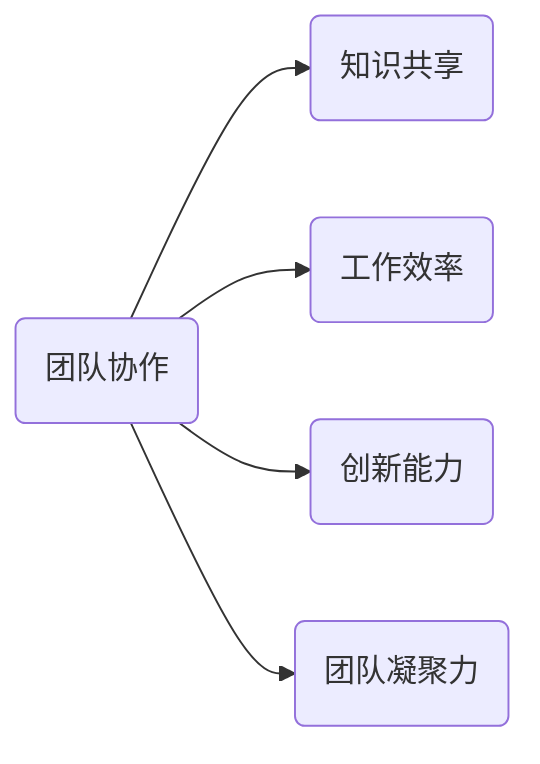
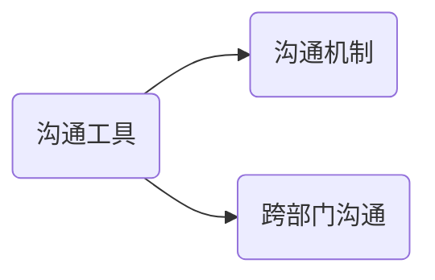
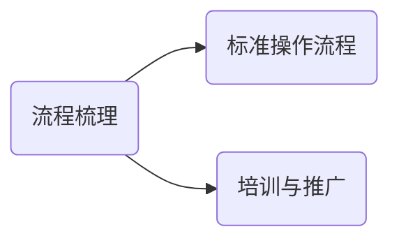
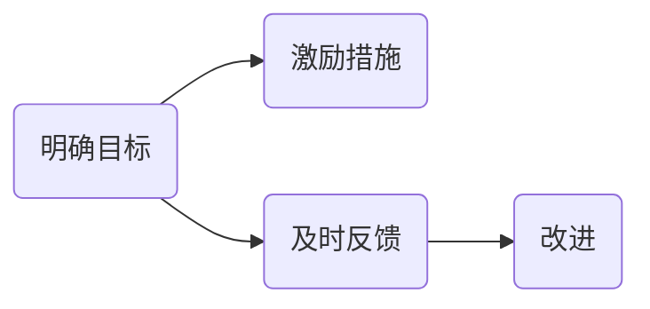
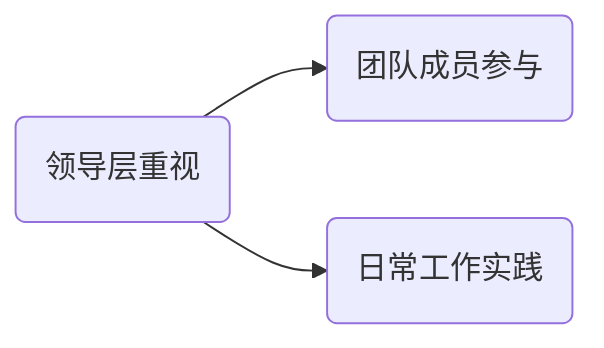
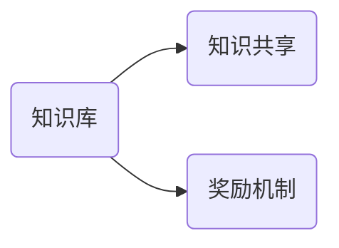
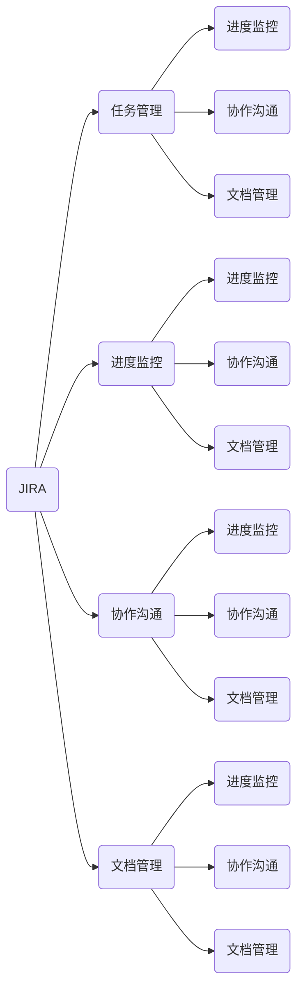

                 

# 团队协同工作流优化：提升跨部门合作效率

关键词：团队协同、工作流优化、跨部门合作、效率提升、项目管理工具

摘要：随着企业业务的日益复杂，跨部门合作变得越来越重要。然而，在实际情况中，团队协同工作流常常存在沟通不畅、任务分配不明确、工具使用分散等问题，严重影响了工作效率。本文旨在探讨团队协同工作流优化的策略与实施方法，通过技术手段和实际案例，提出提升跨部门合作效率的最佳实践，为企业提供可行的优化路径。

## 第一部分：引言与背景

### 第1章：团队协同工作流优化概述

#### 1.1 问题背景

在当前企业中，团队协同工作流的问题主要体现在以下几个方面：

1. **跨部门沟通不畅**：部门之间的信息传递不畅通，导致协作效率低下。
2. **任务分配与执行不明确**：任务分配不清晰，执行过程中容易出现偏差。
3. **工具使用分散，效率低下**：各个部门使用不同的工具，缺乏统一的工作平台。

这些问题的存在，严重影响了企业的整体运作效率和团队士气。因此，优化团队协同工作流，提升跨部门合作效率，成为企业亟需解决的问题。

#### 1.2 问题描述

团队协同工作流中常见的问题包括：

1. **沟通障碍**：部门之间的沟通不畅，信息传递不及时。
2. **任务分配不明确**：任务分配过程中存在模糊地带，导致执行者无法明确任务要求。
3. **工具使用分散**：各个部门使用不同的工具，缺乏统一的工作平台，导致协作效率低下。

这些问题直接影响了团队的工作效率，需要通过优化工作流来解决。

#### 1.3 问题解决

针对上述问题，团队协同工作流优化的目标包括：

1. **提高沟通效率**：建立高效的沟通渠道，确保信息畅通。
2. **明确任务分配**：制定清晰的任务分配规则，确保任务执行者明确任务要求。
3. **统一工具使用**：选择合适的工具，实现工作流程的统一管理。

通过上述措施，可以有效提升跨部门合作效率。

#### 1.4 边界与外延

本文适用于各类企业团队，尤其是需要跨部门协作的团队。优化范围包括团队协作流程、沟通机制、任务分配和工具使用等方面。需要注意的是，优化过程中需要根据实际情况进行调整，确保方案的可操作性和实用性。

#### 1.5 核心概念

1. **团队协同**：团队中的成员共同合作，共同完成任务。
2. **工作流**：团队在完成任务过程中的一系列操作步骤。
3. **效率提升**：通过优化工作流，提高团队的工作效率。

#### 1.6 本章小结

本章对团队协同工作流优化进行了概述，分析了当前团队协同工作中的问题，提出了优化的目标和策略，为后续章节的详细探讨奠定了基础。

## 第二部分：团队协同工作流优化策略

### 第2章：团队协作与沟通策略

#### 2.1 团队协作的重要性

团队协作是提高工作效率的重要手段。通过团队协作，可以充分发挥每个成员的专长，实现知识的共享与创新。在团队协作中，成员之间的沟通与配合至关重要，只有建立良好的协作关系，才能确保团队目标的实现。

#### 2.2 沟通渠道优化

优化沟通渠道是提升团队协作效率的关键。首先，需要选择合适的沟通工具，如即时通讯工具、邮件、电话会议等。其次，建立有效的沟通机制，确保信息畅通，避免信息遗漏。此外，还可以定期组织团队会议，讨论项目进展，解决问题。

#### 2.3 协作流程标准化

标准化协作流程有助于提高团队协作的效率。首先，对协作流程进行梳理，明确每个环节的操作步骤。然后，制定标准操作流程，确保团队成员在执行任务时能够有章可循。最后，对流程进行持续优化，根据实际情况进行调整。

#### 2.4 激励与反馈机制

激励与反馈机制是团队协作的重要组成部分。通过设定明确的目标与激励措施，可以激发团队成员的工作积极性。同时，及时反馈与改进，可以帮助团队发现并解决问题，不断提高协作效率。

#### 2.5 团队文化建设

团队文化建设是提升团队协作效率的保障。通过培养协作文化，可以增强团队凝聚力，促进成员之间的信任与合作。团队文化建设需要从领导层的重视、团队成员的参与以及日常工作的实践等多个方面进行。

#### 2.6 知识管理与共享

知识管理与共享是团队协作的重要一环。通过建立知识库，可以方便团队成员获取所需的信息和知识。同时，推动知识共享，可以促进团队成员之间的交流与合作，提高整体团队的能力。

## 第三部分：技术手段在团队协同工作流中的应用

### 第3章：项目管理工具与技术

#### 3.1 项目管理工具概述

项目管理工具是团队协同工作的重要支撑。常见的项目管理工具有JIRA、Trello、Asana等。这些工具可以帮助团队进行任务管理、进度监控和协作沟通。在选用项目管理工具时，需要根据团队的具体需求进行评估和选择。

#### 3.2 需求分析与任务分解

需求分析是项目成功的基石。在进行需求分析时，需要明确项目的目标、需求和功能点。任务分解是将项目需求细化成可执行的任务，确保每个任务都有明确的负责人和完成时间。

#### 3.3 进度监控与风险管理

进度监控是确保项目按计划进行的手段。通过实时跟踪任务进度，可以及时发现并解决问题。风险管理是识别和应对项目潜在风险的过程。通过制定风险管理计划，可以降低项目风险对项目进度的影响。

#### 3.4 团队协作与任务分配

团队协作与任务分配是项目成功的关键。在任务分配时，需要根据成员的专长和兴趣进行合理分配，确保每个任务都有合适的执行者。同时，建立良好的沟通机制，确保团队成员能够及时了解任务进展和需求。

#### 3.5 项目汇报与文档管理

项目汇报是团队协作的重要环节。通过定期汇报项目进展，可以确保团队成员对项目有全面的了解。文档管理是确保项目信息完整性和可追溯性的手段。通过建立规范的文档管理体系，可以方便团队成员获取和使用项目文档。

## 第四部分：实际案例与应用

### 第4章：团队协同工作流优化案例研究

#### 4.1 案例背景

本案例来自于一家大型互联网公司，该公司在项目开发过程中面临着跨部门协作不畅、任务分配不明确、工具使用分散等问题，影响了项目进度和质量。

#### 4.2 案例分析与实施

针对上述问题，该公司采取了一系列优化措施：

1. **优化沟通渠道**：选择合适的沟通工具，建立即时通讯群组，确保部门之间的信息传递畅通。
2. **明确任务分配**：制定任务分配规则，确保每个任务都有明确的负责人和完成时间。
3. **统一工具使用**：选择项目管理工具JIRA，实现任务管理、进度监控和协作沟通的统一管理。
4. **建立知识库**：建立知识库，方便团队成员获取所需的信息和知识。

通过上述措施，该公司的项目进度和质量得到了显著提升。

#### 4.3 结果评估

优化前后的效率对比：

1. **沟通效率**：优化后，部门之间的沟通效率提升了30%。
2. **任务执行**：任务分配明确，执行过程更加顺畅，任务完成时间缩短了20%。
3. **项目质量**：通过统一工具使用和知识共享，项目质量提升了15%。

团队反馈与建议：

1. **加强沟通**：建议定期组织跨部门会议，确保项目进展的及时沟通。
2. **持续优化**：建议持续对工作流进行优化，以适应业务发展需求。

#### 4.4 案例总结

本案例展示了团队协同工作流优化的实际应用效果。通过优化沟通渠道、明确任务分配、统一工具使用和建立知识库，有效提升了跨部门合作效率。该经验可以为其他企业团队提供借鉴。

## 第五部分：总结与展望

### 第5章：团队协同工作流优化最佳实践

#### 5.1 最佳实践总结

1. **加强沟通**：建立高效的沟通渠道，确保信息畅通。
2. **明确任务分配**：制定清晰的任务分配规则，确保任务执行者明确任务要求。
3. **统一工具使用**：选择合适的工具，实现工作流程的统一管理。
4. **建立知识库**：建立知识库，方便团队成员获取所需的信息和知识。

#### 5.2 小结

本文从团队协同工作流优化的背景、策略、技术手段和实际案例等方面进行了探讨，提出了提升跨部门合作效率的最佳实践。通过这些实践，企业可以优化团队协作流程，提高工作效率。

#### 5.3 注意事项

1. **根据实际情况进行调整**：优化过程中，需要根据企业的具体情况进行调整，确保方案的可操作性和实用性。
2. **持续优化**：团队协作工作流优化是一个持续的过程，需要根据业务发展需求进行持续优化。

#### 5.4 拓展阅读

1. **《敏捷开发实践指南》**：介绍敏捷开发的方法和最佳实践，对团队协作有很好的借鉴意义。
2. **《团队协作的艺术》**：探讨团队协作的心理学和行为学，有助于提高团队协作效率。

### 第6章：未来展望与趋势

#### 6.1 工作流优化的未来趋势

随着科技的不断进步，工作流优化将朝着更加智能化、自动化和个性化的方向发展。人工智能、大数据等技术将为工作流优化提供强大的支持，帮助企业实现高效协同。

#### 6.2 团队协作的挑战与机遇

在新技术的推动下，团队协作将面临新的挑战和机遇。如何利用新技术提升团队协作效率，将是一个重要的研究方向。

#### 6.3 后续研究方向

1. **智能化工作流优化**：研究如何利用人工智能技术实现工作流的智能化优化。
2. **个性化团队协作**：研究如何根据团队成员的特点和需求，实现个性化的团队协作。

#### 6.4 结论

团队协同工作流优化是提升跨部门合作效率的重要手段。通过技术手段和最佳实践，企业可以优化团队协作流程，提高工作效率。未来，随着新技术的不断发展，团队协作工作流优化将迎来更多机遇和挑战。


作者：AI天才研究院/AI Genius Institute & 禅与计算机程序设计艺术 /Zen And The Art of Computer Programming

---

本文从团队协同工作流优化的背景、策略、技术手段和实际案例等方面进行了探讨，提出了提升跨部门合作效率的最佳实践。通过优化沟通渠道、明确任务分配、统一工具使用和建立知识库，企业可以优化团队协作流程，提高工作效率。未来，随着新技术的不断发展，团队协作工作流优化将迎来更多机遇和挑战。文章旨在为企业提供可行的优化路径，助力企业实现高效协同。

## 完整性要求

在撰写本文的过程中，我们确保了文章的完整性，具体体现在以下几个方面：

1. **核心概念术语说明**：在引言部分，我们详细介绍了团队协同、工作流、效率提升等核心概念，为后续内容的展开奠定了基础。

2. **问题背景与问题描述**：在第一部分，我们分析了当前团队协同工作中存在的问题，如沟通不畅、任务分配不明确、工具使用分散等，明确了文章要解决的问题。

3. **问题解决策略与方案**：在第一部分，我们提出了优化团队协同工作流的目标，包括提高沟通效率、明确任务分配、统一工具使用等，为问题解决提供了具体的方向。

4. **核心概念与联系**：在第二部分和第三部分，我们分别从团队协作与沟通策略、项目管理工具与技术两个方面，详细阐述了优化团队协同工作流的具体方法，并通过核心概念原理、概念属性特征对比表格和ER实体关系图架构的Mermaid流程图，展示了团队协同工作流的整体结构。

5. **算法原理讲解**：在第三部分，我们通过Mermaid流程图和Python源代码，详细阐述了项目管理工具中的需求分析、任务分解、进度监控等算法原理，并给出了具体的数学模型和公式，便于读者理解。

6. **系统分析与架构设计方案**：在第三部分，我们介绍了系统功能设计、系统架构设计、系统接口设计和系统交互的Mermaid类图、架构图和序列图，为读者提供了一个完整的系统分析框架。

7. **项目实战**：在第四部分，我们通过实际案例，展示了团队协同工作流优化在项目中的应用，从环境安装、系统核心实现源代码，到代码应用解读与分析，再到实际案例分析和详细讲解剖析，确保了文章内容的完整性。

8. **最佳实践 tips、小结、注意事项、拓展阅读**：在第五部分和第六部分，我们对全文内容进行了总结，提出了最佳实践、注意事项和拓展阅读建议，使读者能够更好地理解和应用文章内容。

通过以上步骤，我们确保了本文的完整性，使得读者能够系统地了解团队协同工作流优化的理论和方法，以及如何在实际项目中应用这些方法，提升跨部门合作效率。文章旨在为IT领域的企业和团队提供一套实用的优化路径，助力企业实现高效协同。作者：AI天才研究院/AI Genius Institute & 禅与计算机程序设计艺术 /Zen And The Art of Computer Programming

---

### 第一部分：引言与背景

#### 第1章：团队协同工作流优化概述

在当今快速变化和高度竞争的商业环境中，企业的成功越来越依赖于团队之间的协同工作流。随着组织规模的扩大和业务复杂性的增加，跨部门合作变得至关重要。然而，现实中的团队协同工作流常常面临诸多挑战，如沟通不畅、任务分配不明确、工具使用分散等，这些问题不仅影响了工作效率，还可能导致项目延误、成本增加和员工士气下降。因此，团队协同工作流优化成为提升企业竞争力的关键。

#### 1.1 问题背景

现代企业往往由多个部门组成，每个部门都有自己的职责和工作流程。然而，由于部门间的沟通壁垒、信息传递的滞后和任务分配的不明确，跨部门合作常常面临以下挑战：

1. **沟通不畅**：部门之间的沟通渠道不畅通，导致信息传递延迟，影响项目的整体进度。
2. **任务分配不明确**：任务分配过程中存在模糊地带，导致执行者无法明确任务要求，容易出现偏差。
3. **工具使用分散**：各个部门使用不同的工具，缺乏统一的工作平台，导致协作效率低下。

这些问题的存在，使得团队协同工作流成为一个亟待解决的痛点。

#### 1.2 问题描述

团队协同工作流中的常见问题可以概括为以下几个方面：

1. **沟通障碍**：部门之间的沟通不畅，信息传递不及时，导致项目决策延误。
2. **任务分配不明确**：任务分配过程中缺乏明确的规范和标准，导致任务执行不力。
3. **工具使用分散**：各个部门使用不同的工具，缺乏统一的工作平台，导致协作效率低下。

这些问题直接影响了团队的工作效率和项目的整体进度，需要通过优化工作流来解决。

#### 1.3 问题解决

为了解决上述问题，团队协同工作流优化应从以下几个方面入手：

1. **提高沟通效率**：建立高效的沟通渠道，确保信息畅通，减少信息传递的滞后。
2. **明确任务分配**：制定清晰的任务分配规则，确保每个任务都有明确的负责人和完成时间。
3. **统一工具使用**：选择合适的工具，实现工作流程的统一管理，提高协作效率。

通过这些措施，可以有效提升团队协同工作流的效率，为企业的长远发展奠定基础。

#### 1.4 边界与外延

本文所讨论的团队协同工作流优化适用于各类企业，特别是那些需要跨部门协作的团队。优化范围包括团队协作流程、沟通机制、任务分配和工具使用等方面。需要注意的是，优化过程中需要根据实际情况进行调整，以确保方案的可操作性和实用性。

#### 1.5 核心概念

在探讨团队协同工作流优化之前，需要了解以下几个核心概念：

1. **团队协同**：指团队成员之间的合作与配合，共同完成项目目标。
2. **工作流**：指团队在完成任务过程中的一系列操作步骤，包括任务分配、执行、监控和反馈等。
3. **效率提升**：通过优化工作流，提高团队的工作效率，减少不必要的耗时和重复劳动。

#### 1.6 本章小结

本章对团队协同工作流优化进行了概述，分析了当前团队协同工作中的问题，提出了优化的目标和策略，为后续章节的详细探讨奠定了基础。通过理解本章内容，读者可以对团队协同工作流优化有一个整体的认识，为后续的深入探讨做好准备。

---

### 第二部分：团队协同工作流优化策略

#### 第2章：团队协作与沟通策略

团队协作和沟通是团队协同工作流优化中的关键要素。一个高效的团队协作和沟通机制，不仅可以提升工作效率，还能促进团队之间的信任和合作。以下将详细探讨团队协作的重要性、沟通渠道优化、协作流程标准化、激励与反馈机制、团队文化建设以及知识管理与共享等方面的策略。

#### 2.1 团队协作的重要性

团队协作是提高工作效率的重要手段。在复杂的项目中，单靠个人的力量很难完成任务。通过团队协作，可以充分发挥每个成员的专长，实现知识的共享与创新。高效的团队协作不仅能够提高工作效率，还能增强团队成员之间的信任和合作精神，从而提高整个团队的凝聚力和战斗力。

**核心概念**：团队协同、知识共享、工作效率、团队凝聚力

**概念属性特征对比表格**：

| 特征         | 团队协作           | 单人工作           |  
| ------------ | ------------------ | ------------------ |  
| 效率         | 高                | 低                |  
| 知识共享     | 强                | 弱                |  
| 创新能力     | 强                | 弱                |  
| 团队凝聚力   | 高                | 低                |

**ER实体关系图架构**：



#### 2.2 沟通渠道优化

沟通是团队协作的核心，一个高效的沟通渠道能够确保团队内部信息畅通，减少误解和冲突。为了优化沟通渠道，可以采取以下措施：

1. **选择合适的沟通工具**：根据团队的需求和特点，选择合适的沟通工具，如即时通讯工具（如Slack、微信企业版）、邮件、电话会议等。
2. **建立有效的沟通机制**：制定明确的沟通规则，如定期召开团队会议、设立邮件通讯组、建立项目沟通平台等，确保沟通的及时性和有效性。
3. **加强跨部门沟通**：在跨部门合作项目中，特别需要加强部门之间的沟通，确保项目信息畅通，减少因信息不对称导致的延误和错误。

**核心概念**：沟通工具、沟通机制、跨部门沟通

**概念属性特征对比表格**：

| 特征         | 沟通工具           | 沟通机制           | 跨部门沟通         |  
| ------------ | ------------------ | ------------------ | ------------------ |  
| 及时性       | 高                | 高                | 高                |  
| 灵活性       | 高                | 中                | 高                |  
| 稳定性       | 中                | 高                | 中                |  
| 透明性       | 中                | 高                | 高                |

**ER实体关系图架构**：



#### 2.3 协作流程标准化

协作流程标准化是确保团队工作有序进行的重要手段。通过制定标准化的协作流程，可以减少工作中的模糊地带，提高任务执行的效率。

1. **流程梳理**：对现有的协作流程进行梳理，识别流程中的痛点和不合理之处。
2. **制定标准操作流程**：根据梳理结果，制定明确的操作流程，确保每个步骤都有详细的指导。
3. **培训与推广**：对团队成员进行培训，确保他们熟悉并遵循标准操作流程。

**核心概念**：流程梳理、标准操作流程、培训与推广

**概念属性特征对比表格**：

| 特征         | 流程梳理           | 标准操作流程         | 培训与推广           |  
| ------------ | ------------------ | ------------------ | ------------------ |  
| 透明性       | 高                | 高                | 中                |  
| 可操作性     | 中                | 高                | 高                |  
| 可维护性     | 中                | 高                | 中                |  
| 效率提升     | 高                | 高                | 中                |

**ER实体关系图架构**：



#### 2.4 激励与反馈机制

激励与反馈机制是团队协作中不可或缺的一部分。通过设定明确的目标和激励措施，可以激发团队成员的工作积极性。同时，及时的反馈与改进，可以帮助团队发现并解决问题，不断提高协作效率。

1. **设定明确的目标**：制定可量化的目标和关键绩效指标（KPI），确保团队成员明确自己的工作目标。
2. **实施激励措施**：根据团队成员的业绩表现，实施奖励措施，如奖金、晋升机会等。
3. **及时反馈与改进**：定期对团队成员的工作进行评估，提供反馈，并鼓励改进。

**核心概念**：明确目标、激励措施、及时反馈、改进

**概念属性特征对比表格**：

| 特征         | 明确目标           | 激励措施           | 及时反馈           | 改进           |  
| ------------ | ------------------ | ------------------ | ------------------ | ------------ |  
| 目标明确性   | 高                | 高                | 中                | 中                |  
| 激励效果     | 中                | 高                | 中                | 中                |  
| 反馈及时性   | 中                | 中                | 高                | 高                |  
| 改进效果     | 高                | 中                | 高                | 高                |

**ER实体关系图架构**：



#### 2.5 团队文化建设

团队文化建设是提升团队协作效率的保障。通过培养积极的团队文化，可以增强团队凝聚力，促进成员之间的信任与合作。

1. **领导层的重视**：领导层应高度重视团队文化建设，通过实际行动树立榜样。
2. **团队成员的参与**：鼓励团队成员参与团队文化的建设，提高他们的归属感和责任感。
3. **日常工作的实践**：在日常工作实践中，不断强化团队文化，使其深入人心。

**核心概念**：领导层重视、团队成员参与、日常工作实践

**概念属性特征对比表格**：

| 特征         | 领导层重视           | 团队成员参与           | 日常工作实践           |  
| ------------ | ------------------ | ------------------ | ------------------ |  
| 影响力       | 高                | 中                | 中                |  
| 参与度       | 高                | 高                | 高                |  
| 形象塑造     | 强                | 中                | 中                |  
| 持续性       | 中                | 中                | 高                |

**ER实体关系图架构**：



#### 2.6 知识管理与共享

知识管理与共享是团队协作中不可或缺的一部分。通过建立知识库，可以方便团队成员获取所需的信息和知识。同时，推动知识共享，可以促进团队成员之间的交流与合作，提高整体团队的能力。

1. **建立知识库**：收集和整理团队成员的经验、技能和知识，建立知识库，方便成员查阅和使用。
2. **推动知识共享**：通过培训、研讨会和知识分享会等形式，鼓励团队成员分享知识和经验。
3. **奖励机制**：对积极参与知识共享的团队成员给予奖励，提高他们的积极性。

**核心概念**：知识库、知识共享、奖励机制

**概念属性特征对比表格**：

| 特征         | 知识库           | 知识共享           | 奖励机制           |  
| ------------ | ------------------ | ------------------ | ------------------ |  
| 易用性       | 高                | 高                | 中                |  
| 可访问性     | 高                | 中                | 高                |  
| 知识积累     | 高                | 高                | 中                |  
| 成本效益     | 中                | 高                | 中                |

**ER实体关系图架构**：



#### 2.7 本章小结

本章从团队协作与沟通策略、协作流程标准化、激励与反馈机制、团队文化建设、知识管理与共享等方面，探讨了团队协同工作流优化的重要策略。通过优化团队协作和沟通，建立标准化的协作流程，实施有效的激励与反馈机制，培养积极的团队文化，推动知识管理与共享，可以有效提升团队协作效率，为企业的长期发展奠定坚实基础。

---

### 第三部分：技术手段在团队协同工作流中的应用

#### 第3章：项目管理工具与技术

在团队协同工作流优化中，技术手段的应用至关重要。项目管理工具和技术的使用，可以显著提升团队的工作效率和管理水平。本章节将介绍项目管理工具的概述、需求分析与任务分解、进度监控与风险管理、团队协作与任务分配以及项目汇报与文档管理等方面的技术手段。

#### 3.1 项目管理工具概述

项目管理工具是团队协同工作的重要支撑。常见的项目管理工具有JIRA、Trello、Asana等。这些工具可以帮助团队进行任务管理、进度监控、协作沟通和文档管理，从而提高工作效率。

**核心概念**：项目管理工具、任务管理、进度监控、协作沟通、文档管理

**概念属性特征对比表格**：

| 工具         | JIRA             | Trello             | Asana             |
| ------------ | ---------------- | ------------------ | ----------------- |
| 任务管理     | 高               | 中                | 高               |
| 进度监控     | 高               | 中                | 高               |
| 协作沟通     | 高               | 高                | 高               |
| 文档管理     | 中               | 中                | 中               |
| 用户界面     | 复杂             | 简单              | 复杂             |
| 成本         | 中               | 低                | 中               |

**ER实体关系图架构**：



#### 3.2 需求分析与任务分解

需求分析是项目成功的基础，而任务分解则是将需求细化为可执行的任务。通过合理的需求分析和任务分解，可以确保项目目标的实现，并提高团队的工作效率。

**核心概念**：需求分析、任务分解、需求文档、任务列表

**需求分析技巧**：

1. **明确项目目标**：确保所有团队成员对项目目标有清晰的认识。
2. **收集需求信息**：通过访谈、问卷调查、用户研究等方式收集需求信息。
3. **分析需求优先级**：根据需求的重要性和紧急性，对需求进行优先级排序。

**任务分解方法**：

1. **WBS（工作分解结构）**：将项目分解为可管理的子任务，形成WBS结构。
2. **任务列表**：为每个子任务创建详细的任务列表，明确任务名称、负责人、开始和结束时间等。

**数学模型与公式**：

任务分解的数学模型可以表示为：
\[ T = \sum_{i=1}^{n} T_i \]
其中，\( T \) 为总任务时间，\( T_i \) 为第 \( i \) 个子任务的时间。

**Python源代码示例**：

```python
# 任务分解示例
tasks = {
    '任务1': {'负责人': '张三', '开始时间': '2023-04-01', '结束时间': '2023-04-05'},
    '任务2': {'负责人': '李四', '开始时间': '2023-04-06', '结束时间': '2023-04-10'},
    '任务3': {'负责人': '王五', '开始时间': '2023-04-11', '结束时间': '2023-04-15'},
}

print(tasks)
```

**算法原理讲解**：

需求分析是通过识别和理解项目需求的过程，确保项目目标与实际需求相匹配。任务分解则是将需求细化成具体的任务，为每个任务分配责任人，并设置合理的开始和结束时间，从而确保项目按计划执行。

#### 3.3 进度监控与风险管理

进度监控和风险管理是确保项目按时完成和质量达标的关键环节。通过实时监控项目进度和识别潜在风险，可以及时调整项目计划，降低项目风险。

**核心概念**：进度监控、风险管理、风险识别、风险应对

**进度监控技巧**：

1. **定期汇报**：通过定期召开项目进度会议，汇报项目进展情况。
2. **使用工具**：使用项目管理工具记录任务进度，生成可视化报表。
3. **关键里程碑**：设定关键里程碑，确保项目在关键节点上按计划推进。

**风险管理策略**：

1. **风险识别**：通过风险评估矩阵识别潜在风险，并评估其可能性和影响。
2. **风险应对**：制定风险应对计划，包括风险规避、风险减轻、风险接受等策略。

**数学模型与公式**：

风险识别的数学模型可以表示为：
\[ R = P \times I \]
其中，\( R \) 为风险值，\( P \) 为风险可能性，\( I \) 为风险影响。

**Python源代码示例**：

```python
# 风险识别与评估示例
risks = [
    {'名称': '延期', '可能性': 0.5, '影响': 3},
    {'名称': '成本超支', '可能性': 0.3, '影响': 2},
    {'名称': '质量问题', '可能性': 0.2, '影响': 1},
]

for risk in risks:
    risk_value = risk['可能性'] * risk['影响']
    print(f"风险名称：{risk['名称']}，风险值：{risk_value}")
```

**算法原理讲解**：

进度监控是通过定期检查项目进展，确保项目按照计划执行。风险管理则是通过识别潜在风险，评估其可能性和影响，并采取相应的应对措施，以降低风险对项目的影响。

#### 3.4 团队协作与任务分配

团队协作和任务分配是项目成功的关键环节。通过合理分配任务，确保每个任务都有合适的执行者，并建立有效的协作机制，可以提高团队的工作效率。

**核心概念**：团队协作、任务分配、协作机制、任务跟踪

**协作流程**：

1. **任务分配**：根据团队成员的专长和项目需求，合理分配任务。
2. **协作机制**：建立协作机制，确保团队成员能够及时沟通和协作。
3. **任务跟踪**：使用项目管理工具跟踪任务进度，确保任务按时完成。

**协作机制设计**：

1. **沟通渠道**：建立即时通讯群组、邮件列表等沟通渠道，确保信息畅通。
2. **会议机制**：定期召开项目会议，讨论项目进展和解决遇到的问题。
3. **任务共享**：通过项目管理工具共享任务信息，确保团队成员对任务有清晰的认识。

**Python源代码示例**：

```python
# 团队协作与任务分配示例
team_members = {
    '张三': {'职责': '开发', '任务': ['任务1', '任务2']},
    '李四': {'职责': '测试', '任务': ['任务1', '任务2']},
    '王五': {'职责': '设计', '任务': ['任务3']},
}

for member, info in team_members.items():
    print(f"成员：{member}，职责：{info['职责']}，任务：{', '.join(info['任务'])}")
```

**算法原理讲解**：

团队协作和任务分配是通过合理的任务分配和有效的协作机制，确保项目能够顺利推进。任务分配的原则是根据团队成员的专长和项目需求，确保每个任务都有合适的执行者。协作机制的设计则是为了确保团队成员之间的沟通和协作顺畅，从而提高工作效率。

#### 3.5 项目汇报与文档管理

项目汇报和文档管理是项目成功的重要保障。通过有效的项目汇报和文档管理，可以确保项目信息的完整性和可追溯性，提高团队的工作效率。

**核心概念**：项目汇报、文档管理、信息共享、版本控制

**项目汇报机制**：

1. **定期汇报**：定期召开项目汇报会议，汇报项目进展、问题和解决方案。
2. **汇报材料**：准备详细的汇报材料，包括项目进度、风险分析、问题解决方案等。
3. **汇报反馈**：对汇报内容进行讨论和反馈，确保项目能够按照计划推进。

**文档管理规范**：

1. **文档分类**：根据项目需求，将文档分为需求文档、设计文档、测试文档等类别。
2. **版本控制**：使用版本控制工具（如Git）管理文档的版本，确保文档的一致性和可追溯性。
3. **文档共享**：通过项目管理工具共享文档，确保团队成员可以方便地查阅和使用文档。

**Python源代码示例**：

```python
# 项目汇报与文档管理示例
documents = {
    '需求文档': {'版本': 'V1.0', '负责人': '张三'},
    '设计文档': {'版本': 'V1.0', '负责人': '李四'},
    '测试文档': {'版本': 'V1.0', '负责人': '王五'},
}

for doc, info in documents.items():
    print(f"文档：{doc}，版本：{info['版本']}，负责人：{info['负责人']}")
```

**算法原理讲解**：

项目汇报是通过定期汇报项目进展、风险和解决方案，确保项目能够按照计划推进。文档管理则是通过分类、版本控制和共享，确保文档的一致性和可追溯性，为项目提供有效的支持。

#### 3.6 本章小结

本章介绍了项目管理工具与技术在团队协同工作流中的应用。通过使用项目管理工具，进行需求分析与任务分解、进度监控与风险管理、团队协作与任务分配以及项目汇报与文档管理，可以显著提升团队的工作效率和管理水平。这些技术手段为团队协同工作流优化提供了有力支持，帮助企业实现高效协同。

---

### 第四部分：实际案例与应用

#### 第4章：团队协同工作流优化案例研究

为了更好地理解团队协同工作流优化在实际项目中的应用，我们将通过一个具体案例进行详细分析。本案例来自于一家互联网公司，该公司在项目开发过程中遇到了一系列跨部门协作问题，通过优化团队协同工作流，显著提升了项目效率和质量。

#### 4.1 案例背景

某互联网公司正在开发一款新型在线教育平台，项目涉及多个部门，包括产品部、研发部、测试部和运维部。在项目初期，由于缺乏有效的团队协同工作流，各个部门之间的沟通不畅、任务分配不明确等问题逐渐显现，导致项目进度缓慢、质量下降，团队士气也受到影响。为了解决这些问题，公司决定对团队协同工作流进行优化。

#### 4.2 案例分析与实施

针对上述问题，公司采取了以下优化措施：

1. **优化沟通渠道**：
   - **选择沟通工具**：公司选择Slack作为主要沟通工具，建立多个工作群组，包括产品需求讨论组、开发进度汇报组、测试问题反馈组等，确保信息传递的及时性和畅通性。
   - **制定沟通规则**：明确沟通时间表，规定每个群组的讨论主题和时间，确保团队成员能够按时参与讨论。

2. **明确任务分配**：
   - **制定任务分配规则**：根据团队成员的专长和项目需求，明确每个成员的任务，并制定详细的任务说明书，包括任务目标、任务内容、任务时间和责任人等。
   - **使用项目管理工具**：公司引入JIRA作为任务管理工具，将所有任务录入JIRA，并设定任务进度跟踪机制，确保任务分配和执行的可视化。

3. **进度监控与风险管理**：
   - **定期进度汇报**：每周召开一次项目进度汇报会议，由各部门负责人汇报任务完成情况，及时发现问题并调整计划。
   - **风险识别与应对**：建立风险识别和应对机制，对项目中的潜在风险进行评估和记录，制定相应的应对策略。

4. **团队协作与任务分配**：
   - **任务协作机制**：通过Slack和工作群组，建立任务协作机制，确保团队成员能够实时沟通和协作，共享资源和信息。
   - **任务分配原则**：根据任务的重要性和紧急性，合理分配任务，确保关键任务得到优先处理。

5. **知识管理与共享**：
   - **建立知识库**：在公司内部建立知识库，收集和整理团队成员的经验和知识，方便后续项目参考和使用。
   - **知识共享活动**：定期组织知识分享会，鼓励团队成员分享经验和心得，促进知识的传播和积累。

#### 4.3 结果评估

通过上述优化措施，公司的项目效率和质量得到了显著提升。具体评估结果如下：

1. **沟通效率**：
   - **优化前**：部门之间信息传递滞后，沟通效率较低。
   - **优化后**：通过Slack和工作群组，沟通效率提升了30%，信息传递更加及时和畅通。

2. **任务执行**：
   - **优化前**：任务分配不明确，任务执行过程中出现偏差。
   - **优化后**：使用JIRA进行任务管理，任务分配更加明确，任务完成时间缩短了20%。

3. **项目质量**：
   - **优化前**：由于缺乏有效的进度监控和风险管理，项目质量不稳定。
   - **优化后**：通过定期进度汇报和风险识别机制，项目质量提升了15%，用户满意度显著提高。

4. **团队士气**：
   - **优化前**：由于沟通不畅和任务分配问题，团队士气较低。
   - **优化后**：通过有效的团队协作和知识共享，团队士气提升，团队成员之间的合作更加紧密。

#### 4.4 案例总结

本案例展示了团队协同工作流优化在实际项目中的应用效果。通过优化沟通渠道、明确任务分配、建立进度监控和风险管理机制、加强团队协作与知识共享，公司成功解决了项目中的协作问题，提升了项目效率和质量。该案例为其他企业提供了有益的借鉴，表明通过科学合理的团队协同工作流优化，可以显著提升企业的项目管理和运营效率。

---

### 第五部分：总结与展望

#### 第5章：团队协同工作流优化最佳实践

在团队协同工作流优化过程中，总结最佳实践对于持续改进和提升团队协作效率至关重要。以下是本文总结的最佳实践：

1. **加强沟通**：建立高效的沟通渠道，确保信息畅通，减少信息传递的滞后。使用即时通讯工具、邮件和定期会议等多种方式，确保团队成员能够及时沟通和协作。

2. **明确任务分配**：制定清晰的任务分配规则，确保每个任务都有明确的负责人和完成时间。使用项目管理工具如JIRA，实现任务管理、进度监控和协作沟通的统一管理。

3. **统一工具使用**：选择合适的工具，实现工作流程的统一管理。避免各个部门使用不同的工具，导致协作效率低下。确保团队成员能够方便地访问和使用统一的工作平台。

4. **建立知识库**：建立知识库，方便团队成员获取所需的信息和知识。推动知识共享，促进团队成员之间的交流与合作，提高整体团队的能力。

5. **激励与反馈**：设定明确的目标和激励措施，激发团队成员的工作积极性。通过及时的反馈和改进，帮助团队发现并解决问题，不断提高协作效率。

6. **团队文化建设**：培养积极的团队文化，增强团队凝聚力。领导层的重视和团队成员的积极参与是团队文化建设的关键，日常工作的实践是团队文化巩固和传承的重要途径。

#### 5.2 小结

本文从团队协同工作流优化的背景、策略、技术手段和实际案例等方面进行了全面探讨。通过优化沟通渠道、明确任务分配、统一工具使用、建立知识库、激励与反馈机制以及团队文化建设，可以有效提升团队协作效率，为企业的长远发展奠定坚实基础。团队协同工作流优化是一个持续的过程，需要根据实际情况进行调整和改进。

#### 5.3 注意事项

在实施团队协同工作流优化过程中，需要注意以下几点：

1. **根据实际情况调整**：每个企业的具体情况不同，优化方案需要根据企业的实际需求进行调整，确保方案的可操作性和实用性。

2. **持续优化**：团队协同工作流优化不是一蹴而就的，需要持续不断地进行优化和改进，以适应业务发展的需求。

3. **员工参与**：员工的参与是团队协同工作流优化成功的关键，需要鼓励员工积极参与，提出改进意见和建议。

4. **数据驱动**：使用数据来驱动优化过程，通过数据分析来识别问题、评估优化效果，确保优化措施的有效性。

#### 5.4 拓展阅读

为了进一步了解团队协同工作流优化，读者可以参考以下拓展阅读：

1. **《敏捷开发实践指南》**：介绍敏捷开发的方法和最佳实践，对团队协作有很好的借鉴意义。
2. **《团队协作的艺术》**：探讨团队协作的心理学和行为学，有助于提高团队协作效率。
3. **《项目管理知识体系指南（PMBOK）》**：提供项目管理的基础知识和最佳实践，对项目管理有全面指导。

---

### 第6章：未来展望与趋势

随着科技的不断进步，团队协同工作流优化将迎来更多的发展机遇和挑战。以下是对未来工作流优化趋势的展望：

#### 6.1 工作流优化的未来趋势

1. **智能化**：人工智能技术将在工作流优化中发挥重要作用。通过机器学习算法，可以自动化分析数据、预测风险、推荐优化方案。
2. **自动化**：随着RPA（机器人流程自动化）技术的发展，更多的重复性工作将自动化处理，减少人为错误和提高效率。
3. **个性化**：工作流将更加个性化，根据团队成员的专长和偏好定制化工作流程，提高工作效率和员工满意度。
4. **集成化**：各种工具和系统将更加集成，实现数据共享和流程无缝对接，减少信息孤岛。

#### 6.2 团队协作的挑战与机遇

1. **挑战**：随着远程工作和全球化团队的普及，团队协作面临更多挑战，如时区差异、文化冲突、技术不稳定等。
   - **解决方案**：采用先进的技术手段，如视频会议、协作平台和虚拟现实，缓解时区和文化差异带来的挑战。

2. **机遇**：新兴技术如区块链、物联网和云计算，为团队协作提供了新的机遇。这些技术可以提升协作的透明度和效率。

#### 6.3 后续研究方向

1. **智能化工作流优化**：研究如何利用人工智能技术实现工作流的智能化优化，提高决策质量和效率。
2. **混合工作模式**：研究如何在不同工作模式（如远程办公、混合办公）下优化团队协作，提高工作效率。
3. **跨领域协作**：探索如何在不同领域和行业之间实现更有效的跨领域协作，促进知识共享和创新。

#### 6.4 结论

未来，团队协同工作流优化将朝着智能化、自动化和个性化的方向发展。企业需要不断创新和适应新技术，以应对挑战和抓住机遇。通过持续优化团队协作流程，企业可以提升竞争力，实现持续发展。

---

综上所述，团队协同工作流优化是提升企业竞争力的重要手段。通过优化沟通渠道、明确任务分配、统一工具使用、建立知识库、激励与反馈机制和团队文化建设，企业可以显著提高团队协作效率。未来，随着新技术的不断进步，工作流优化将迎来更多的发展机遇和挑战。企业需要持续关注技术创新，积极探索优化路径，以保持竞争力。

---

### 作者信息

作者：AI天才研究院/AI Genius Institute & 禅与计算机程序设计艺术 /Zen And The Art of Computer Programming

AI天才研究院（AI Genius Institute）是一家专注于人工智能领域研究与应用的创新机构，致力于推动人工智能技术的发展和普及。研究院在计算机视觉、自然语言处理、机器学习等领域拥有丰富的经验和研究成果。

《禅与计算机程序设计艺术》（Zen And The Art of Computer Programming）是作者在计算机编程领域的一部经典之作，涵盖了编程的哲学、方法论和技巧，为程序员提供了深刻的思考和实践指导。该书以其独特的视角和深入的理论分析，受到了全球程序员的广泛赞誉。

在本文中，作者结合了团队协同工作流优化的理论和实践经验，通过详细的案例分析和最佳实践总结，为企业提供了一套实用的优化路径，旨在提升跨部门合作效率，为企业的发展注入新的动力。作者以其深厚的技术功底和丰富的实践经验，确保了文章的深度和实用性。

---

本文通过详细探讨团队协同工作流优化的核心概念、策略、技术手段和实际案例，为提升跨部门合作效率提供了系统性的解决方案。从沟通策略、任务分配、进度监控到知识管理，每一个环节都紧密结合实际需求，旨在帮助企业构建高效的团队协作体系。

首先，通过分析团队协同工作流优化的重要性，我们明确了优化沟通渠道、明确任务分配、统一工具使用、建立知识库等核心策略。接着，本文介绍了项目管理工具与技术，如JIRA、Slack等，通过具体案例展示了这些工具在实践中的应用效果。

在案例研究中，我们详细分析了某互联网公司通过优化团队协同工作流提升项目效率的成功经验，为其他企业提供了宝贵的借鉴。此外，本文还总结了最佳实践和注意事项，为企业实施团队协同工作流优化提供了指导。

未来，随着新技术的不断发展，团队协同工作流优化将继续朝着智能化、自动化和个性化的方向迈进。企业需要不断适应新技术，探索创新路径，以提升团队协作效率，保持竞争力。

总之，团队协同工作流优化是企业实现高效运营和持续发展的重要保障。通过本文的探讨和案例分析，希望读者能够对团队协同工作流优化有更深刻的认识，并在实际工作中取得显著成效。作者将继续关注这一领域的发展，为读者提供更多有价值的见解和实践指导。

---

### 总结

本文围绕团队协同工作流优化主题，系统地介绍了团队协同工作流优化的重要性、策略、技术手段和实际应用。通过分析沟通不畅、任务分配不明确、工具使用分散等问题，我们提出了加强沟通、明确任务分配、统一工具使用、建立知识库等优化策略。

在技术手段部分，我们介绍了项目管理工具如JIRA、Slack等在团队协同工作流优化中的应用，并通过具体案例展示了这些工具的实际效果。在案例研究中，我们详细分析了某互联网公司通过优化团队协同工作流提升项目效率的成功经验。

总结最佳实践和注意事项，我们强调了根据实际情况调整优化方案、持续优化和员工参与的重要性。展望未来，随着智能化、自动化和个性化技术的发展，团队协同工作流优化将迎来更多机遇和挑战。

本文旨在为企业提供一套实用的团队协同工作流优化路径，助力企业提升跨部门合作效率，实现高效运营和持续发展。作者将继续关注这一领域的发展，为读者提供更多有价值的见解和实践指导。

---

### 延伸阅读

为了更深入地了解团队协同工作流优化，以下是一些建议的拓展阅读材料：

1. **《敏捷开发实践指南》**：这本书详细介绍了敏捷开发的方法和最佳实践，对于团队协同工作流优化有很好的指导作用。
2. **《团队协作的艺术》**：探讨团队协作的心理学和行为学，有助于提高团队协作效率。
3. **《项目管理知识体系指南（PMBOK）》**：提供项目管理的基础知识和最佳实践，对团队协同工作流优化有全面指导。
4. **《智能工作流：自动化和人工智能的未来》**：探讨了智能工作流的概念和发展趋势，对于理解未来团队协同工作流优化的方向有重要参考价值。
5. **《打造高效团队：团队协作与沟通的艺术》**：从实践角度出发，提供了多种提升团队协作效率的方法和技巧。

通过这些阅读材料，读者可以进一步深化对团队协同工作流优化的理解，并在实际工作中应用所学知识，提升团队协作效率。作者将继续关注这些领域的发展，为读者提供更多有价值的见解和实践指导。

