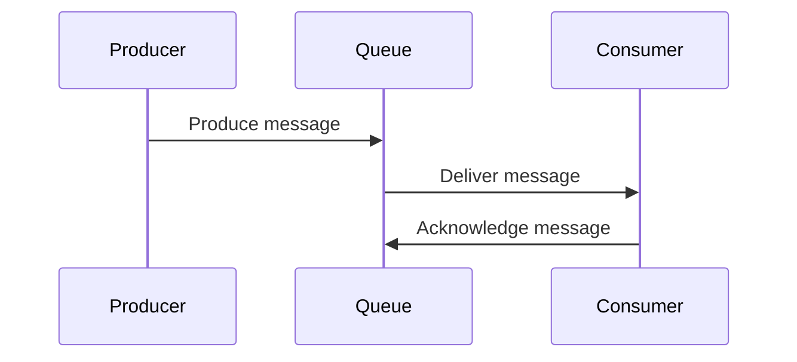
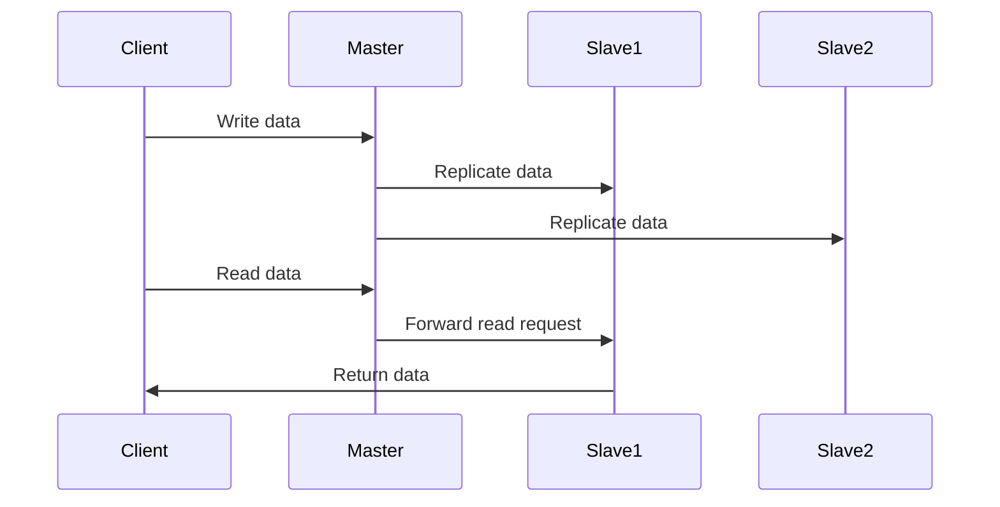
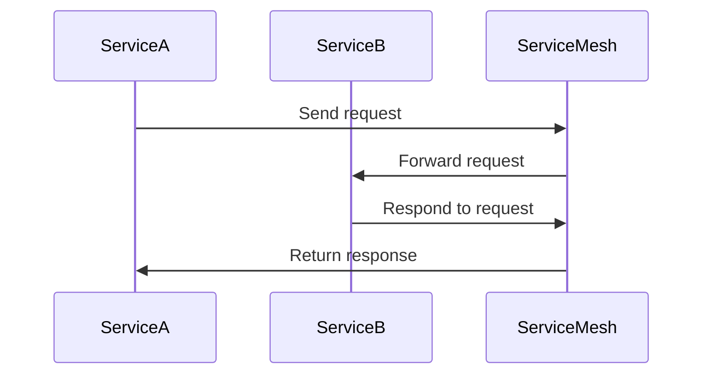
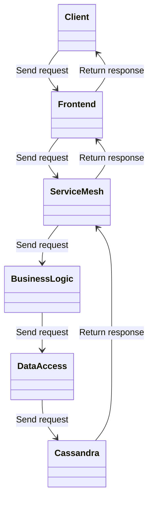

                 

## 团队协同工作：提高跨部门合作效率

关键词：团队协同、跨部门合作、效率提升、工具与技术

摘要：本文将深入探讨团队协同工作的原理和具体实践，通过分析跨部门合作中常见的问题和挑战，提出一系列实用的技巧和方法，帮助提高跨部门合作效率，实现团队协作的优化和协同效应的最大化。

## 目录大纲

### 第一部分：背景介绍

- **问题背景**
- **问题描述**
- **问题解决思路**

### 第二部分：核心概念与联系

#### 核心概念与联系

##### 2.1 核心概念原理

##### 2.2 概念属性特征对比表格

##### 2.3 ER实体关系图架构

### 第三部分：团队协同工作原理讲解

- **团队协同的基本原理**
- **团队协作的关键要素**

### 第四部分：团队协同工具与技术

#### 4.1 工具与技术概述

##### 4.1.1 消息队列

##### 4.1.2 分布式存储

##### 4.1.3 服务网格

#### 4.2 工具与技术详解

##### 4.2.1 消息队列原理

##### 4.2.2 分布式存储原理

##### 4.2.3 服务网格原理

### 第五部分：团队协同工作案例分析

#### 5.1 案例分析概述

##### 5.1.1 案例背景

##### 5.1.2 案例目标

##### 5.1.3 案例实施过程

#### 5.2 案例详解

##### 5.2.1 系统架构设计

##### 5.2.2 系统功能设计

##### 5.2.3 系统核心实现源代码

### 第六部分：提高跨部门合作效率的实践技巧

#### 6.1 实践技巧概述

##### 6.1.1 沟通技巧

##### 6.1.2 协同技巧

##### 6.1.3 问题解决技巧

#### 6.2 实践技巧详解

##### 6.2.1 沟通技巧详解

##### 6.2.2 协同技巧详解

##### 6.2.3 问题解决技巧详解

### 第七部分：小结与拓展阅读

#### 7.1 小结

##### 7.1.1 主要内容回顾

##### 7.1.2 学习与思考

#### 7.2 拓展阅读

##### 7.2.1 相关书籍推荐

##### 7.2.2 学术论文推荐

---

### 第一部分：背景介绍

#### 问题背景

在现代企业中，跨部门合作是确保项目成功和业务高效运转的关键。随着公司规模的扩大和业务复杂性的增加，各个部门之间的协调和协作变得愈发重要。然而，跨部门合作往往面临诸多挑战，如沟通不畅、目标不统一、资源分配不均等，这些问题严重影响了团队的效率和项目的进展。

#### 提出问题

为了解决这些问题，我们需要系统地探讨团队协同工作的原理和方法，以及如何通过有效的工具和技术来提高跨部门合作的效率。以下是本文将探讨的关键问题：

1. **团队协同工作的基本原理是什么？**
2. **有哪些核心概念和要素需要理解？**
3. **如何选择和使用合适的协同工具和技术？**
4. **在实际项目中如何应用这些原则和工具？**
5. **有哪些实践技巧可以帮助提高跨部门合作效率？**

#### 解决思路

本文将通过以下步骤来回答这些问题：

1. **背景介绍**：明确问题的背景和现状，阐述团队协同工作和跨部门合作的重要性。
2. **核心概念与联系**：介绍团队协同工作的核心概念，并通过对比表格和实体关系图来加深理解。
3. **原理讲解**：详细讲解团队协同工作的基本原理和关键要素。
4. **工具与技术**：介绍常见的团队协同工具和技术，并分析其原理和应用场景。
5. **案例分析**：通过具体案例来展示如何在实际项目中应用这些原理和工具。
6. **实践技巧**：提供实用的技巧和方法，帮助团队提高跨部门合作效率。
7. **小结与拓展阅读**：总结全文内容，提供进一步学习的资源和思路。

---

### 第二部分：核心概念与联系

#### 核心概念与联系

在团队协同工作中，理解核心概念和它们之间的联系是至关重要的。以下是团队协同工作的核心概念及其相互关系：

##### 2.1 核心概念原理

1. **沟通**：沟通是团队协作的基础，它包括信息的传递、理解和反馈。有效的沟通可以消除误解，确保团队成员对任务和目标有清晰的认识。
2. **协作**：协作是指团队成员共同完成任务的过程。协作需要分工明确、资源合理分配，以及共同的目标和价值观。
3. **工具**：工具是支持团队协作的技术手段，包括项目管理工具、沟通工具和协作平台等。合适的工具可以提高工作效率和团队协作的效率。
4. **流程**：流程是团队工作的一系列步骤和规则，它确保工作有序进行，减少冗余和重复工作。
5. **目标**：目标是团队努力的方向，它是团队协作的驱动力。明确的目标可以确保团队成员的精力集中在正确的方向上。

##### 2.2 概念属性特征对比表格

为了更清晰地理解这些概念，我们可以通过一个对比表格来展示它们的属性特征：

| 概念  | 属性特征                     | 作用和意义                          |
| ----- | -------------------------- | -------------------------------- |
| 沟通  | 信息传递、理解、反馈           | 确保团队成员信息一致，减少误解和冲突      |
| 协作  | 分工明确、资源分配、共同目标     | 提高工作效率，实现协同效应                |
| 工具  | 支持协作的技术手段              | 提高工作效率，简化工作流程                |
| 流程  | 步骤和规则                    | 确保工作有序进行，减少冗余和重复工作      |
| 目标  | 团队努力方向                  | 明确团队目标，驱动团队努力，提高协作效率   |

##### 2.3 ER实体关系图架构

为了更好地理解这些概念之间的关系，我们可以通过一个ER（实体关系）图来展示它们之间的联系：

```mermaid
erDiagram
    产品开发部门 ||--|{ 项目管理部 }
    产品开发部门 ||--|{ 市场营销部 }
    项目管理部 ||--|{ 产品开发部 }
    市场营销部 ||--|{ 产品开发部 }
    项目管理部 ||--|{ 市场营销部 }
    产品开发部 ||--|{ 研发支持部 }
    研发支持部 ||--|{ 产品开发部 }
    市场营销部 ||--|{ 客户服务部 }
    客户服务部 ||--|{ 市场营销部 }
```

在这个ER图中，各个部门作为实体，它们之间的连线表示了它们之间的协作关系。例如，产品开发部门与项目管理部和市场营销部门之间存在协作关系，这意味着这三个部门需要在产品开发过程中紧密合作。

通过上述对比表格和ER实体关系图，我们可以更全面地理解团队协同工作的核心概念和它们之间的联系，这为后续的详细讲解和分析打下了坚实的基础。

---

### 第三部分：团队协同工作原理讲解

#### 团队协同的基本原理

团队协同工作的核心在于通过有效的沟通和协作，将分散的个体力量整合为整体合力，从而实现比单个成员更高效的工作成果。以下是团队协同工作的基本原理：

1. **共同目标**：团队协同工作的起点是共同的目标。明确的、具有吸引力的目标可以激励团队成员共同努力，减少内部摩擦和资源浪费。

2. **信息共享**：信息是团队协作的血液。通过共享信息，团队成员可以及时了解项目进展、任务分配和工作要求，确保工作有序进行。

3. **责任分工**：责任分工是团队协同工作的重要基础。通过明确的分工，团队成员可以专注于自己的任务，提高工作效率。

4. **协同合作**：协同合作是团队协同工作的核心。通过分工合作，团队成员可以共同完成任务，实现协同效应。

5. **反馈与调整**：团队协同工作需要不断的反馈和调整。通过及时反馈，团队成员可以了解工作的不足和改进方向，及时调整工作策略。

#### 团队协作的关键要素

为了实现高效的团队协同工作，以下关键要素是必不可少的：

1. **有效的沟通**：沟通是团队协作的桥梁。通过多种沟通方式（如会议、邮件、即时通讯等），团队成员可以及时交流信息，消除误解。

2. **清晰的流程**：清晰的流程可以确保工作有序进行。通过制定明确的流程规范，团队成员可以按照标准化的操作步骤完成任务。

3. **合适的工具**：合适的工具可以提高团队协作的效率。例如，项目管理工具可以帮助团队跟踪项目进度，协作平台可以帮助团队成员共享文件和讨论。

4. **共享的价值观**：共享的价值观是团队协同工作的精神支柱。通过共同的价值观，团队成员可以建立信任和尊重，减少内部冲突。

5. **透明的决策**：透明的决策可以确保团队成员对项目的进展和方向有清晰的认识。通过开放透明的决策过程，团队成员可以参与决策，提高工作积极性。

#### 团队协同工作的实际应用

在实际工作中，团队协同工作可以通过以下步骤来实现：

1. **制定目标**：明确团队的目标，确保所有成员对目标有共同的认识。

2. **分配任务**：根据成员的特长和资源情况，合理分配任务。

3. **建立沟通机制**：确保团队成员可以通过多种渠道及时沟通和交流。

4. **制定流程规范**：制定明确的流程规范，确保工作有序进行。

5. **提供培训和支持**：为团队成员提供必要的培训和资源支持，帮助他们更好地完成任务。

6. **定期回顾和调整**：定期回顾团队的工作进展和协作效果，及时调整策略和流程。

通过上述步骤，团队可以更好地实现协同工作，提高工作效率和项目成功率。

---

### 第四部分：团队协同工具与技术

#### 4.1 工具与技术概述

在现代企业中，团队协同工作的效率和效果很大程度上依赖于合适的工具和技术。以下是几种常见的团队协同工具和技术：

##### 4.1.1 消息队列

消息队列是一种异步通信机制，用于在不同系统和服务之间传递消息。它可以帮助实现系统间的解耦，提高系统的可扩展性和可靠性。常用的消息队列技术包括RabbitMQ、Kafka和ActiveMQ。

##### 4.1.2 分布式存储

分布式存储是一种通过多个节点存储数据的技术，可以提供高可用性和高容量的存储解决方案。常用的分布式存储技术包括Hadoop HDFS、Cassandra和MongoDB。

##### 4.1.3 服务网格

服务网格是一种用于服务间通信和管理的轻量级基础设施层，可以提供服务发现、负载均衡、安全和服务监控等功能。常用的服务网格技术包括Istio和Linkerd。

#### 4.2 工具与技术详解

##### 4.2.1 消息队列原理

消息队列的基本原理是生产者-消费者模型。生产者负责生成消息并将其发送到消息队列，消费者则从队列中获取消息进行处理。

以下是消息队列的简单原理图：



在Python中，可以使用RabbitMQ作为消息队列的示例：

```python
import pika

# 创建连接
connection = pika.BlockingConnection(pika.ConnectionParameters('localhost'))
channel = connection.channel()

# 声明队列
channel.queue_declare(queue='task_queue', durable=True)

# 发送消息
channel.basic_publish(
    exchange='',
    routing_key='task_queue',
    body='Hello World!',
    properties=pika.BasicProperties(delivery_mode=2) # 持久化消息
)

# 关闭连接
connection.close()
```

##### 4.2.2 分布式存储原理

分布式存储的基本原理是将数据分散存储在多个节点上，通过数据复制和负载均衡机制来提供高可用性和高吞吐量。以下是一个简单的分布式存储架构图：



在Python中，可以使用Cassandra作为分布式存储的示例：

```python
from cassandra.cluster import Cluster
from cassandra.policies import DCAwareRoundRobinPolicy

# 创建连接
cluster = Cluster(['127.0.0.1'], port=9042, load_balancing_policy=DCAwareRoundRobinPolicy())
session = cluster.connect()

# 创建键空间和表
session.execute("""
    CREATE KEYSPACE IF NOT EXISTS mykeyspace
    WITH replication = {'class': 'SimpleStrategy', 'replication_factor': '3'}
""")

session.execute("""
    CREATE TABLE IF NOT EXISTS mykeyspace.mytable (
        id UUID PRIMARY KEY,
        name TEXT
    )
""")

# 插入数据
session.execute("""
    INSERT INTO mykeyspace.mytable (id, name)
    VALUES (uuid(), 'Alice')
""")

# 查询数据
rows = session.execute("SELECT * FROM mykeyspace.mytable")
for row in rows:
    print(row.id, row.name)

# 关闭连接
cluster.shutdown()
```

##### 4.2.3 服务网格原理

服务网格的基本原理是在服务之间提供可靠的通信和控制。它通过边车（Sidecar）代理来拦截和路由服务之间的请求，并提供负载均衡、服务发现和安全等功能。以下是一个简单的服务网格架构图：



在Python中，可以使用Istio作为服务网格的示例：

```python
from istio.client import NetworkPolicy

# 创建网络策略
policy = NetworkPolicy()
policy.add_to_allow_to_from('servicea', 'serviceb')

# 应用网络策略
policy.create()
```

通过上述工具和技术的详细讲解，我们可以更好地理解它们在团队协同工作中的应用和重要性。

---

### 第五部分：团队协同工作案例分析

#### 5.1 案例分析概述

为了更好地理解团队协同工作的实际应用，下面我们将通过一个具体的项目案例来进行详细分析。

##### 5.1.1 案例背景

某科技公司需要开发一个大型电子商务平台，该平台需要处理海量的商品信息、用户订单和支付交易。项目涉及多个部门，包括产品开发部、市场营销部、客户服务部和运维部等。

##### 5.1.2 案例目标

项目的目标是在有限的时间内，高质量地完成平台开发，并确保系统的稳定运行和良好的用户体验。

##### 5.1.3 案例实施过程

1. **项目规划**：项目开始前，各个部门进行了详细的沟通和规划，明确了各自的任务和职责。产品开发部负责平台的功能设计和技术实现，市场营销部负责市场推广和用户调研，客户服务部负责用户支持和反馈，运维部负责平台的部署和维护。

2. **团队协作**：为了实现高效协作，公司引入了消息队列（Kafka）用于不同系统之间的异步通信，分布式存储（Cassandra）用于大规模数据存储，服务网格（Istio）用于服务间的可靠通信和管理。

3. **实施步骤**：
    - **需求分析**：产品开发部与市场营销部和客户服务部紧密合作，进行了详细的需求分析，并制定了功能需求文档。
    - **功能设计**：根据需求文档，产品开发部设计了系统的功能模块和接口，并创建了领域模型（Mermaid类图）。
    - **技术实现**：开发团队使用了分布式架构，通过消息队列处理异步任务，通过分布式存储管理海量数据，通过服务网格实现服务间的高效通信。
    - **测试与部署**：测试团队进行了全面的测试，确保系统的稳定性和性能。运维部负责系统的部署和监控，确保平台的稳定运行。

4. **反馈与调整**：在项目实施过程中，各个部门定期进行反馈会议，讨论项目中遇到的问题和改进方案。根据反馈，团队及时调整了工作计划和策略。

#### 5.2 案例详解

##### 5.2.1 系统架构设计

该电子商务平台的系统架构设计采用分布式架构，主要包括以下几个层次：

1. **前端展示层**：负责用户界面的展示，使用React框架实现。
2. **业务逻辑层**：负责处理业务逻辑，包括商品管理、订单处理和支付管理等，使用Spring Boot框架实现。
3. **数据访问层**：负责与分布式存储进行数据交互，使用Cassandra作为分布式数据库。
4. **消息队列层**：使用Kafka作为消息队列，处理异步任务和系统间的通信。
5. **服务网格层**：使用Istio实现服务间的高效通信和安全控制。

以下是系统架构的Mermaid类图：



##### 5.2.2 系统功能设计

系统的主要功能包括商品管理、订单处理和支付管理。以下是领域模型的Mermaid类图：

```mermaid
classDiagram
    Customer <<entity>> Customer
    Product <<entity>> Product
    Order <<entity>> Order
    Payment <<entity>> Payment
    Customer .-- Product: Purchases
    Customer .-- Order: Places
    Customer .-- Payment: Makes
    Product .-- Order: Contains
    Order .-- Payment: Completes
```

##### 5.2.3 系统核心实现源代码

以下是系统核心实现的一部分源代码，展示了业务逻辑层的订单处理功能：

```python
from flask import Flask, request, jsonify
from cassandra.cluster import Cluster

app = Flask(__name__)

# 创建Cassandra连接
cluster = Cluster(['127.0.0.1'])
session = cluster.connect()

# 订单处理接口
@app.route('/order', methods=['POST'])
def process_order():
    data = request.get_json()
    customer_id = data['customer_id']
    product_id = data['product_id']
    quantity = data['quantity']

    # 插入订单到Cassandra
    session.execute("""
        INSERT INTO orders (customer_id, product_id, quantity, status)
        VALUES ({}, {}, {}, 'pending')
    """.format(customer_id, product_id, quantity))

    # 返回订单ID
    return jsonify(order_id=str(session.last_executed_statement.insert_id))

if __name__ == '__main__':
    app.run(debug=True)
```

通过上述案例分析，我们可以看到如何在实际项目中应用团队协同工作的原理和工具，实现高效的合作和项目成功。

---

### 第六部分：提高跨部门合作效率的实践技巧

#### 6.1 实践技巧概述

为了提高跨部门合作效率，以下技巧是至关重要的：

##### 6.1.1 沟通技巧

1. **明确沟通目标**：每次沟通前，明确沟通的目标和预期成果，确保沟通的有效性。
2. **选择合适的沟通方式**：根据沟通的内容和紧急程度，选择适当的沟通方式（如会议、邮件、即时通讯等）。
3. **主动沟通**：主动与团队成员沟通，及时了解项目进展和问题，避免信息滞后。

##### 6.1.2 协同技巧

1. **分工明确**：明确每个团队成员的职责和任务，确保工作不重叠和遗漏。
2. **协同决策**：在重要决策过程中，邀请相关成员参与，确保决策的全面性和公平性。
3. **资源共享**：鼓励团队成员共享资源和信息，提高工作效率。

##### 6.1.3 问题解决技巧

1. **快速识别问题**：及时发现问题，避免问题扩大和影响项目进度。
2. **有效沟通问题**：将问题清楚地传达给相关人员，确保问题得到及时解决。
3. **寻求解决方案**：鼓励团队成员共同寻找解决方案，避免单打独斗。

#### 6.2 实践技巧详解

##### 6.2.1 沟通技巧详解

1. **明确沟通目标**：每次沟通前，明确沟通的目标和预期成果，制定沟通计划和议程。例如，在项目启动会议中，明确会议的目标是讨论项目计划、任务分配和时间表。

2. **选择合适的沟通方式**：根据沟通的内容和紧急程度，选择适当的沟通方式。例如，对于紧急问题，可以通过即时通讯工具（如Slack或Telegram）进行快速沟通；对于长期项目规划，可以通过邮件或视频会议进行深入讨论。

3. **主动沟通**：主动与团队成员沟通，及时了解项目进展和问题。例如，定期进行项目进度汇报，及时分享重要信息和资源。

##### 6.2.2 协同技巧详解

1. **分工明确**：明确每个团队成员的职责和任务，确保工作不重叠和遗漏。例如，在软件开发项目中，明确开发人员、测试人员和质量保证人员的职责和任务，确保项目进展顺利。

2. **协同决策**：在重要决策过程中，邀请相关成员参与，确保决策的全面性和公平性。例如，在项目立项阶段，邀请产品经理、项目经理、开发人员和测试人员共同参与，讨论项目需求和可行性。

3. **资源共享**：鼓励团队成员共享资源和信息，提高工作效率。例如，建立共享文档库，团队成员可以随时访问和更新项目文档；使用代码管理工具（如Git），团队成员可以实时查看和合并代码更改。

##### 6.2.3 问题解决技巧详解

1. **快速识别问题**：及时发现问题，避免问题扩大和影响项目进度。例如，定期进行代码审查，及时发现代码中的错误和问题；定期进行项目评估，及时发现项目中的瓶颈和问题。

2. **有效沟通问题**：将问题清楚地传达给相关人员，确保问题得到及时解决。例如，使用问题跟踪工具（如JIRA），将问题详细记录并分配给相关团队成员；定期召开问题讨论会议，讨论和解决项目中的问题。

3. **寻求解决方案**：鼓励团队成员共同寻找解决方案，避免单打独斗。例如，组织团队头脑风暴会议，鼓励团队成员提出解决问题的方法和建议；利用团队成员的专业知识和经验，共同分析和解决复杂问题。

通过上述实践技巧的详细讲解，我们可以更好地理解和应用这些技巧，提高跨部门合作的效率和质量。

---

### 第七部分：小结与拓展阅读

#### 7.1 小结

本文系统地探讨了团队协同工作的原理和实际应用，分析了提高跨部门合作效率的关键要素和技巧。主要内容包括：

1. **团队协同工作的背景和问题**：介绍了跨部门合作的重要性和面临的挑战。
2. **核心概念与联系**：讲解了沟通、协作、工具、流程和目标等核心概念，并通过对比表格和实体关系图加深理解。
3. **团队协同工作原理**：详细讲解了团队协同的基本原理和关键要素。
4. **团队协同工具与技术**：介绍了消息队列、分布式存储和服务网格等常用工具和技术的原理和应用。
5. **案例分析**：通过具体项目案例，展示了团队协同工作的实际应用。
6. **实践技巧**：提供了提高跨部门合作效率的实用技巧和方法。

通过本文的学习，读者可以更好地理解团队协同工作的重要性，掌握提高跨部门合作效率的方法，从而在实际工作中取得更好的成果。

##### 7.1.2 学习与思考

1. **团队协同工作的重要性**：思考如何在您的团队中加强协同工作，提高团队效率和项目成功率。
2. **工具与技术应用**：分析您的团队在哪些方面可以引入新的工具和技术，以提高工作效率。
3. **实践技巧**：思考如何在实际工作中应用本文提供的实践技巧，解决跨部门合作中的问题。

#### 7.2 拓展阅读

1. **相关书籍推荐**：
    - 《敏捷开发：实践指南》
    - 《团队协作工具与实践》
    - 《团队沟通技巧》

2. **学术论文推荐**：
    - “Collaborative Software Tools: A Review”
    - “The Impact of Communication on Team Performance”
    - “Efficient Collaboration in Large-Scale Software Development”

通过拓展阅读，读者可以更深入地了解团队协同工作的理论和实践，进一步提升自身在团队协作方面的能力和水平。

---

作者：AI天才研究院/AI Genius Institute & 禅与计算机程序设计艺术 /Zen And The Art of Computer Programming

