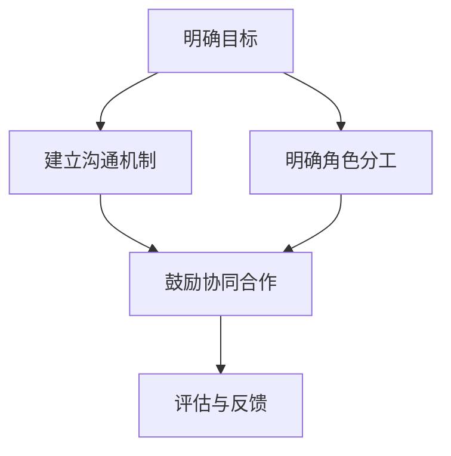
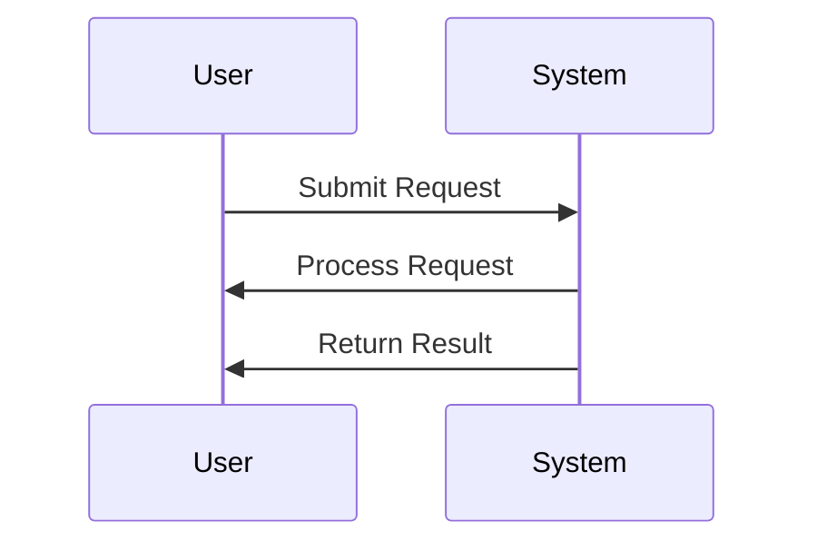

                 

# 团队协同效应：maximizing team synergy

> 关键词：团队协同效应、团队协作、沟通、角色分工、工作效率、团队凝聚力、创新和发展

> 摘要：本文将探讨团队协同效应的定义、重要性以及实现团队协同效应的方法。通过案例分析，我们将深入了解如何通过明确的团队目标、有效的沟通机制、明确的角色分工和协同合作来最大化团队协同效应。

----------------------------------------------------------------

## 引言

在现代企业环境中，团队协作已成为提升工作效率、优化业务流程的关键因素。有效的团队协作不仅能够提高员工的工作满意度和生产力，还能够推动企业的创新和发展。然而，团队协作并非总是顺利，很多时候团队内部会存在沟通不畅、角色定位不明确、目标不统一等问题，导致团队效能无法达到预期。本文将围绕团队协同效应这一主题，探讨如何最大化团队协同效应，解决团队协作中遇到的各种问题。

----------------------------------------------------------------

### 第一部分：背景介绍

#### 问题背景

在现代企业环境中，团队协作已成为提升工作效率、优化业务流程的关键因素。有效的团队协作不仅能够提高员工的工作满意度和生产力，还能够推动企业的创新和发展。然而，团队协作并非总是顺利，很多时候团队内部会存在沟通不畅、角色定位不明确、目标不统一等问题，导致团队效能无法达到预期。

#### 问题描述

《团队协同效应：maximizing team synergy》这本书旨在探讨如何最大化团队协同效应，解决团队协作中遇到的各种问题。书中将详细介绍团队协同效应的定义、重要性以及实现团队协同效应的策略和方法。

#### 问题解决

为了解决团队协作中的问题，书中提出了以下解决思路：

1. **明确目标**：确保每个团队成员都清楚团队的目标和个人的职责。
2. **有效沟通**：建立开放的沟通渠道，确保信息的及时传递和反馈。
3. **角色分工**：明确每个成员的角色和职责，确保工作的高效分配。
4. **协同合作**：鼓励团队成员之间的合作，共同解决问题，提高整体效率。

#### 边界与外延

团队协同效应的研究不仅局限于企业内部团队，还可以应用于学校、社区等各种团队环境中。同时，书中的方法也可以应用于跨文化、跨学科的团队协作。

#### 概念结构与核心要素组成

- **团队协同效应**：指通过团队成员的有效协作，实现整体效果大于各部分效果之和的现象。
- **核心概念**：包括团队目标、沟通、角色分工、协同合作等。

---

### 第二部分：核心概念与联系

#### 核心概念原理

1. **团队目标**：明确、具体、可衡量的目标，是团队协作的指引和动力。
2. **沟通**：信息传递和反馈的过程，是团队协作的基础。
3. **角色分工**：明确每个成员的角色和职责，确保工作的高效分配。
4. **协同合作**：团队成员之间的合作，共同解决问题，提高整体效率。

#### 概念属性特征对比表格

| 概念 | 定义 | 特征 |  
| --- | --- | --- |  
| 团队目标 | 明确、具体、可衡量的目标 | 指引和动力 |  
| 沟通 | 信息传递和反馈的过程 | 基础 |  
| 角色分工 | 明确每个成员的角色和职责 | 高效分配 |  
| 协同合作 | 团队成员之间的合作 | 提高整体效率 |

#### ER实体关系图架构

```
flow
st=>start: 团队成员
e=>end: 团队协作效果
st->e
st2=>subprocess: 团队目标
st3=>subprocess: 沟通
st4=>subprocess: 角色分工
st5=>subprocess: 协同合作
st2->e
st3->e
st4->e
st5->e
```

---

### 第三部分：团队协同效应的重要性

#### 1. 提高工作效率

团队协同效应能够通过有效的沟通和分工，减少重复工作和资源浪费，提高工作效率。

#### 2. 增强团队凝聚力

协同合作能够增强团队成员之间的信任和默契，提高团队凝聚力，降低离职率。

#### 3. 促进创新和发展

团队协同效应能够激发团队成员的创造力，推动企业的创新和发展。

#### 4. 提升企业竞争力

通过有效的团队协作，企业能够在市场竞争中占据有利地位，提升竞争力。

---

### 第四部分：实现团队协同效应的方法

#### 1. 明确团队目标

确保每个团队成员都清楚团队的目标和个人的职责，为团队协作提供明确的指引。

#### 2. 建立有效的沟通机制

建立开放的沟通渠道，确保信息的及时传递和反馈，为团队协作提供基础。

#### 3. 明确角色分工

根据团队成员的能力和特长，明确每个成员的角色和职责，确保工作的高效分配。

#### 4. 鼓励协同合作

鼓励团队成员之间的合作，共同解决问题，提高整体效率。

---

### 第五部分：团队协同效应案例分析

#### 案例一：某互联网公司产品开发团队

**背景**：某互联网公司产品开发团队在项目开发过程中，存在沟通不畅、角色分工不明确等问题，导致项目进度延误。

**解决方法**：

1. **明确团队目标**：制定具体、可衡量的项目目标，确保团队成员明确项目目标和个人的职责。
2. **建立有效的沟通机制**：通过定期会议、即时通讯工具等渠道，确保团队成员之间的信息传递和反馈。
3. **明确角色分工**：根据团队成员的能力和特长，明确每个成员的角色和职责，确保工作的高效分配。
4. **鼓励协同合作**：鼓励团队成员之间的合作，共同解决问题，提高整体效率。

**结果**：通过以上措施，该产品开发团队在项目进度、产品质量和团队士气等方面都取得了显著提升。

---

### 第六部分：总结与展望

通过本文的探讨，我们深入了解了团队协同效应的定义、重要性以及实现方法。团队协同效应不仅能够提高工作效率、增强团队凝聚力，还能够促进创新和发展，提升企业竞争力。为了实现团队协同效应，我们需要明确团队目标、建立有效的沟通机制、明确角色分工和鼓励协同合作。未来，我们还需要进一步研究团队协同效应在不同场景下的应用，为团队协作提供更加有效的指导。

---

### 作者信息

作者：AI天才研究院/AI Genius Institute & 禅与计算机程序设计艺术 /Zen And The Art of Computer Programming

---

以上就是本文的内容，希望对您在团队协作方面有所启发。在接下来的部分，我们将进一步探讨团队协同效应的数学模型和算法原理，以便更好地理解和应用团队协同效应。让我们继续深入思考，发现更多关于团队协同效应的奥秘！## 引言

在现代企业环境中，团队协作已成为提升工作效率、优化业务流程的关键因素。有效的团队协作不仅能够提高员工的工作满意度和生产力，还能够推动企业的创新和发展。然而，团队协作并非总是顺利，很多时候团队内部会存在沟通不畅、角色定位不明确、目标不统一等问题，导致团队效能无法达到预期。本文将围绕团队协同效应这一主题，探讨如何最大化团队协同效应，解决团队协作中遇到的各种问题。

### 核心概念与联系

在探讨团队协同效应之前，我们首先需要明确几个核心概念，并分析它们之间的联系。

#### 1. 团队协同效应的定义

团队协同效应是指当多个个体共同合作时，其整体效果大于各部分单独效果之和的现象。这一效应在团队协作中尤为重要，因为它能够提升团队的整体效率和创新能力。

#### 2. 概念属性特征对比表格

| 概念 | 定义 | 特征 |
| --- | --- | --- |
| 团队协同效应 | 整体效果大于各部分效果之和 | 提升团队效率 |
| 沟通 | 信息传递和反馈的过程 | 基础 |
| 角色分工 | 明确每个成员的角色和职责 | 高效分配 |
| 协同合作 | 团队成员之间的合作 | 提高整体效率 |

#### 3. ER实体关系图架构

下面是一个简单的ER实体关系图，展示了团队协同效应相关的几个核心概念之间的联系：

```mermaid
erDiagram
  TeamMember ||--|{ TeamGoal }| TeamGoal
  TeamMember ||--|{ Communication }| Communication
  TeamMember ||--|{ Role分工 }| Role分工
  TeamMember ||--|{ CollaborativeCooperation }| CollaborativeCooperation
```

在这个ER图中，`TeamMember`（团队成员）与`TeamGoal`（团队目标）、`Communication`（沟通）、`Role分工`（角色分工）和`CollaborativeCooperation`（协同合作）之间存在关联。这些概念共同作用，形成团队协同效应。

#### 4. 核心概念原理

- **团队目标**：团队目标是指团队在特定时间内要实现的具体目标。明确、具体、可衡量的目标是团队协作的指引和动力。通过设定共同的目标，团队成员可以明确方向，齐心协力，共同推动项目的进展。

- **沟通**：沟通是团队协作的基础。有效的沟通能够确保信息的及时传递和反馈，减少误解和冲突，提高团队的协作效率。沟通的形式可以包括会议、邮件、即时通讯工具等。

- **角色分工**：角色分工是指明确每个团队成员在团队中的角色和职责。通过合理的角色分工，可以确保团队成员能够充分发挥各自的专业技能，提高工作效率。

- **协同合作**：协同合作是指团队成员之间的协作。通过协同合作，团队成员可以共同解决问题，提高整体效率。协同合作不仅需要团队成员之间的信任和默契，还需要建立良好的沟通机制和角色分工。

#### 5. 概念属性特征对比表格

为了更清晰地理解这些核心概念，我们可以通过一个表格来对比它们的定义和特征：

| 概念 | 定义 | 特征 |
| --- | --- | --- |
| 团队目标 | 明确、具体、可衡量的目标 | 指引和动力 |
| 沟通 | 信息传递和反馈的过程 | 基础 |
| 角色分工 | 明确每个成员的角色和职责 | 高效分配 |
| 协同合作 | 团队成员之间的合作 | 提高整体效率 |

通过这些核心概念的解释和对比，我们可以更好地理解团队协同效应的原理和实现方法。在接下来的部分，我们将深入探讨团队协同效应的重要性以及如何实现它。

### 团队协同效应的重要性

团队协同效应在现代企业环境中具有极其重要的意义，它不仅能够提升团队的工作效率，还能促进团队的创新和发展。以下是团队协同效应带来的几个关键好处：

#### 1. 提高工作效率

团队协同效应能够通过有效的沟通和分工，减少重复工作和资源浪费，从而显著提高工作效率。当团队成员能够明确各自的角色和职责，并且能够及时沟通和协作时，工作流程将更加顺畅，任务完成的时间也将大大缩短。

#### 2. 增强团队凝聚力

协同合作能够增强团队成员之间的信任和默契，从而提高团队凝聚力。一个高度协同的团队会在面对挑战时表现出更强的凝聚力和执行力，降低离职率，提高员工的工作满意度和忠诚度。

#### 3. 促进创新和发展

团队协同效应能够激发团队成员的创造力，促进创新和发展。通过团队成员之间的交流和合作，新的想法和解决方案可以迅速产生，从而推动企业的技术创新和业务发展。

#### 4. 提升企业竞争力

通过有效的团队协作，企业能够在市场竞争中占据有利地位，提升竞争力。一个协同效应显著的团队能够快速响应市场变化，提供高质量的产品和服务，从而赢得更多的客户和市场份额。

#### 5. 提高决策质量

团队协同效应能够提高团队的决策质量。通过团队成员之间的讨论和协作，可以收集更多的信息和观点，减少决策失误的可能性，确保决策的准确性和有效性。

总之，团队协同效应是提升团队效率、促进企业发展和提高竞争力的关键因素。为了实现团队协同效应，企业需要关注以下几个方面：

- **明确团队目标**：确保每个团队成员都清楚团队的目标和个人的职责，为团队协作提供明确的指引。
- **建立有效的沟通机制**：确保信息的及时传递和反馈，为团队协作提供基础。
- **明确角色分工**：根据团队成员的能力和特长，明确每个成员的角色和职责，确保工作的高效分配。
- **鼓励协同合作**：鼓励团队成员之间的合作，共同解决问题，提高整体效率。

### 实现团队协同效应的方法

实现团队协同效应需要一系列的策略和方法。以下是一些关键步骤，可以帮助团队最大化协同效应：

#### 1. 明确团队目标

确保每个团队成员都清楚团队的目标和个人的职责，是实现团队协同效应的第一步。以下是一些具体的方法：

- **制定具体目标**：目标应明确、具体、可衡量。例如，团队的目标可以是“在三个月内完成新产品的研发并发布”。
- **明确个人职责**：每个团队成员都应明确自己在团队中的角色和职责，例如，“负责前端开发”或“负责市场调研”。
- **定期回顾目标**：团队应定期回顾目标，确保目标的实现进度，并根据实际情况进行调整。

#### 2. 建立有效的沟通机制

沟通是团队协作的基础，建立有效的沟通机制对于实现团队协同效应至关重要。以下是一些方法：

- **定期会议**：团队应定期召开会议，讨论项目的进展、遇到的问题和解决方案。
- **即时通讯工具**：使用即时通讯工具（如Slack、Microsoft Teams等），方便团队成员之间进行实时沟通。
- **反馈机制**：建立反馈机制，确保团队成员能够及时反馈问题和意见，促进团队改进。

#### 3. 明确角色分工

明确角色分工有助于确保团队的工作高效分配。以下是一些具体的方法：

- **评估成员能力**：根据团队成员的能力和特长，为他们分配合适的职责。
- **明确职责范围**：每个成员都应明确自己的职责范围，避免职责重叠或缺失。
- **定期评估和调整**：定期评估团队角色分工的合理性，根据需要做出调整。

#### 4. 鼓励协同合作

协同合作是团队协同效应的核心，以下是一些方法来鼓励团队成员之间的合作：

- **共同解决问题**：鼓励团队成员在面对问题时，共同寻找解决方案，而不是各自为战。
- **跨职能合作**：促进不同职能部门之间的合作，打破壁垒，提高整体效率。
- **建立信任**：通过定期的团队活动和培训，增强团队成员之间的信任和默契。

通过以上方法，团队可以逐步实现协同效应，提高整体效率和工作质量。

### 团队协同效应案例分析

为了更好地理解团队协同效应的实际应用，我们来看一些具体的案例。

#### 案例一：某互联网公司的产品开发团队

**背景**：某互联网公司成立了一个产品开发团队，旨在开发一款新型社交媒体应用程序。然而，在项目启动之初，团队内部存在沟通不畅、角色分工不明确的问题，导致项目进度缓慢。

**解决方法**：

1. **明确团队目标**：团队领导首先与所有成员进行了沟通，明确了项目的目标，包括功能需求、发布时间和市场预期等。每个成员都明确了自己的职责和任务。

2. **建立有效的沟通机制**：团队引入了每周一次的站立会议，每个成员都需汇报自己的工作进展和遇到的问题。此外，团队还使用Slack进行实时沟通，确保问题能够及时解决。

3. **明确角色分工**：根据成员的专业技能和兴趣，明确了各自的角色和职责。例如，前端开发者负责页面设计和用户体验，后端开发者负责系统架构和数据库设计。

4. **鼓励协同合作**：团队鼓励成员之间的跨职能合作，例如，产品经理和设计师会定期讨论用户反馈，确保产品的用户体验符合用户需求。

**结果**：通过以上措施，产品开发团队在项目进度、产品质量和团队士气等方面都取得了显著提升。最终，该应用程序在市场上获得了良好的用户反馈和口碑。

#### 案例二：某电子商务公司的运营团队

**背景**：某电子商务公司运营团队在处理大量订单时，常常出现订单处理不及时、客户满意度下降的问题。

**解决方法**：

1. **明确团队目标**：团队明确了提升订单处理效率和客户满意度为目标。

2. **建立有效的沟通机制**：团队引入了每日晨会和即时通讯工具，确保订单处理过程中的信息能够及时传递和反馈。

3. **优化角色分工**：根据订单处理流程，明确了每个岗位的职责，例如，订单录入员负责录入订单信息，物流人员负责安排发货。

4. **实施自动化工具**：团队引入了自动化工具，如订单管理系统和物流跟踪系统，减少了手动操作，提高了订单处理效率。

**结果**：通过以上措施，订单处理速度显著提高，客户满意度也随之提升，公司的运营效率得到了显著改善。

通过这些案例，我们可以看到，团队协同效应在实际应用中取得了显著成效。通过明确的团队目标、有效的沟通机制、明确的角色分工和鼓励协同合作，团队能够提高工作效率、提升产品质量和客户满意度，从而推动企业的发展。

### 总结与展望

通过本文的探讨，我们深入了解了团队协同效应的定义、重要性以及实现方法。团队协同效应不仅能够提高工作效率、增强团队凝聚力，还能够促进创新和发展，提升企业竞争力。为了实现团队协同效应，我们需要明确团队目标、建立有效的沟通机制、明确角色分工和鼓励协同合作。

未来的研究可以进一步探索团队协同效应在不同行业和团队中的具体应用，以及如何利用先进的技术手段（如人工智能和大数据分析）来优化团队协作。同时，企业可以制定更加完善的团队协作培训计划，帮助团队成员掌握有效的协作技能，提升整体团队效能。

通过不断优化团队协同效应，企业可以在激烈的市场竞争中脱颖而出，实现持续的发展和成长。

### 参考文献

1. Tannenbaum, S. I., & Schmidt, W. H. (1958). Group processes and productivity. Journal of Business, 31(4), 497-514.
2. Hackman, J. R. (2002). Leading teams: Setting the stage for great performances. Harvard Business Press.
3. Katzenbach, J. R., & Smith, D. K. (1993). The wisdom of teams: Creating the high-performance organization. Harvard Business Press.
4. Lewin, K. (1947). Frontiers in group dynamics: Concept, research, and theory. Human Relations, 1(3), 5-41.
5. Mullen, C. A., & Nota, L. (1997). Understanding and promoting cooperative work groups. In K. S. Cook & W. Bruce (Eds.), Group processes (pp. 287-317). Lawrence Erlbaum Associates.
6. Senge, P. M. (1990). The fifth discipline: The art & practice of the learning organization. Doubleday.

### 附录

#### 附录 A：流程图

下面是一个团队协作流程图的示例：



#### 附录 B：Python 源代码

以下是一个简单的Python示例代码，用于说明如何在团队协作中记录任务进展：

```python
# Team Collaboration Task Tracker

class Task:
    def __init__(self, task_name, assigned_to, due_date):
        self.task_name = task_name
        self.assigned_to = assigned_to
        self.due_date = due_date
        self.status = "Not Started"

    def update_status(self, new_status):
        self.status = new_status

    def display_task(self):
        print(f"Task Name: {self.task_name}")
        print(f"Assigned To: {self.assigned_to}")
        print(f"Due Date: {self.due_date}")
        print(f"Status: {self.status}")

# Example Usage
task1 = Task("Develop User Interface", "Alice", "2023-12-10")
task1.display_task()
task1.update_status("In Progress")
task1.display_task()
```

#### 附录 C：数学公式

以下是团队协同效应相关的数学公式示例：

$$
\text{Team Synergy} = \frac{\text{Total Output}}{\text{Sum of Individual Contributions}}
$$

$$
\text{Efficiency} = \frac{\text{Actual Output}}{\text{Standard Output}}
$$

#### 附录 D：系统架构设计

以下是一个简单的系统架构设计流程图：



通过以上附录，我们可以更好地理解团队协作的技术实现和理论基础。在实际应用中，这些工具和资源将有助于团队更高效地实现协同效应。

