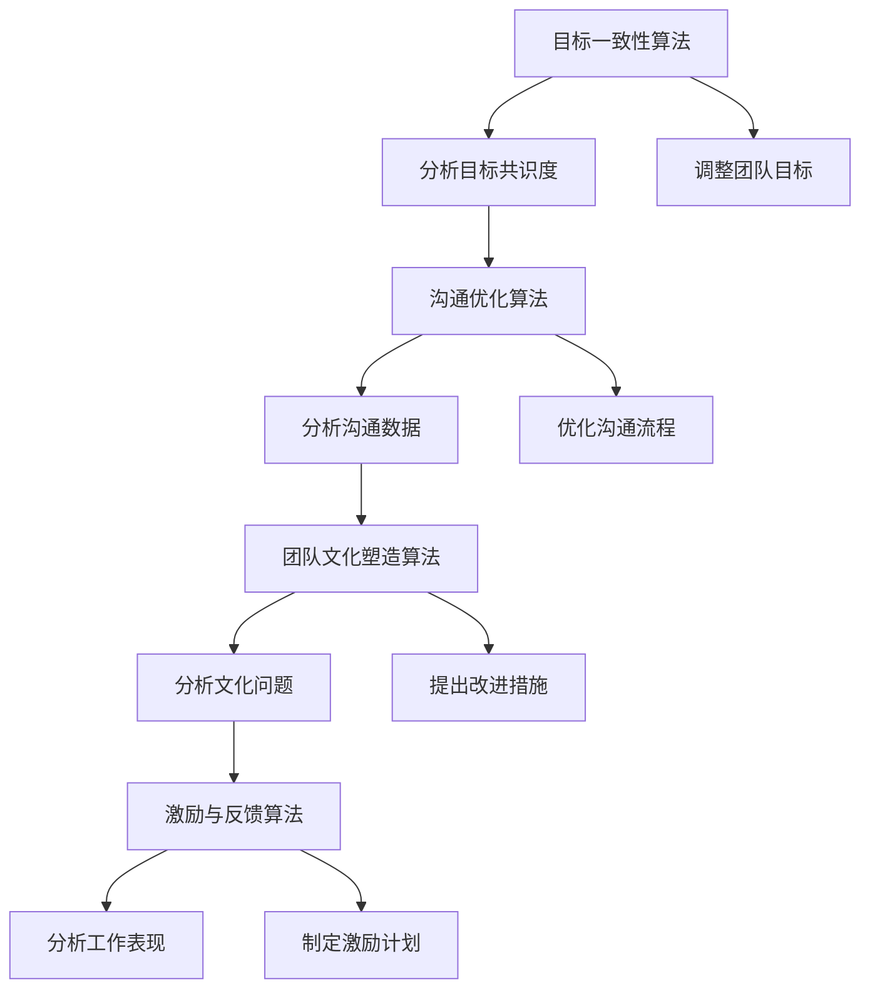
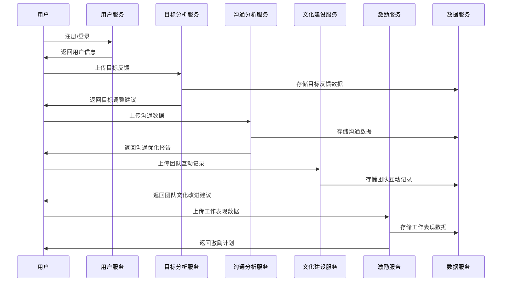

                 

# 团队向心力提升：增强团队凝聚力的方法

> 关键词：团队向心力，团队凝聚力，团队协作，沟通机制，团队文化，激励与反馈，算法原理

> 摘要：本文探讨了团队向心力的核心概念、属性特征，通过分析团队向心力的关键要素和联系，阐述了提升团队向心力的算法原理。文章旨在为企业和团队提供实用的方法和策略，以增强团队凝聚力，提高团队绩效。

## 1. 第一部分：背景介绍

### 1.1 问题背景

在当今快速发展的商业环境中，企业面临的竞争压力日益增大。为了在这种竞争激烈的背景下保持竞争优势，企业需要建立高效的团队，并通过提升团队向心力来实现团队的协同作战。团队向心力是指团队成员之间相互吸引、相互支持、共同协作的一种力量，它是维持团队稳定、提升团队绩效的关键因素。

### 1.2 问题描述

团队向心力不足可能导致以下问题：

- **沟通障碍**：团队成员之间的沟通不畅，导致信息传递失误，影响工作进度。
- **协调困难**：团队成员在目标、方法和进度上缺乏一致性，导致团队协调困难。
- **执行力下降**：团队在面对任务时缺乏共同的目标感和责任感，导致执行力下降。
- **创新受阻**：团队内部缺乏互相学习和激发创新的氛围，影响团队的创新能力和竞争力。

### 1.3 问题解决

为了提升团队向心力，企业需要采取一系列措施：

- **明确团队目标**：确保团队成员对团队目标有清晰的认识，并形成共同的目标意识。
- **建立有效沟通机制**：通过定期会议、工作坊等方式，促进团队成员之间的沟通和交流。
- **培养团队文化**：塑造积极向上、相互尊重、共同成长的团队文化。
- **激励与反馈**：通过激励机制和及时的反馈，提高团队成员的工作动力和积极性。

### 1.4 边界与外延

团队向心力不仅局限于企业内部，也可以应用于其他组织形式，如非营利组织、社区团体等。在跨文化、跨地域的团队中，提升团队向心力更具有挑战性，需要结合不同文化背景进行针对性的策略调整。

### 1.5 概念结构与核心要素组成

团队向心力由以下核心要素组成：

- **共同目标**：团队成员对团队目标有共同的认识和追求。
- **有效沟通**：团队成员之间能够进行有效沟通，共享信息和资源。
- **团队文化**：团队内部有共同的价值观和行为准则。
- **激励与反馈**：团队提供正向的激励和及时的反馈，促进团队成员的成长。

## 2. 第二部分：核心概念与联系

### 2.1 团队向心力的定义

团队向心力是指团队成员之间相互吸引、相互支持、共同协作的一种力量，它是维持团队稳定、提升团队绩效的关键因素。

### 2.2 团队向心力的属性特征对比表格

| 特征             | 描述                                         |
|------------------|--------------------------------------------|
| **共同目标**     | 团队成员对团队目标有共同的认识和追求           |
| **有效沟通**     | 团队成员之间能够进行有效沟通，共享信息和资源   |
| **团队文化**     | 团队内部有共同的价值观和行为准则               |
| **激励与反馈**   | 团队提供正向的激励和及时的反馈，促进团队成员的成长 |

### 2.3 ER实体关系图架构

```mermaid
erDiagram
  TeamMember ||--o> Communication : 沟通
  TeamMember ||--o> CommonGoal : 共同目标
  TeamMember ||--o> TeamCulture : 团队文化
  TeamMember ||--o> IncentiveAndFeedback : 激励与反馈
```

## 3. 第三部分：算法原理讲解

### 3.1 团队向心力提升的算法原理

团队向心力的提升可以通过以下算法实现：

- **目标一致性算法**：通过分析团队成员对团队目标的共识度，调整团队目标，使团队成员对目标有更高的认同感。
- **沟通优化算法**：通过分析团队沟通的数据，识别沟通瓶颈，优化沟通流程，提高沟通效率。
- **团队文化塑造算法**：通过分析团队成员的行为数据，识别团队文化的问题，提出改进措施，塑造积极向上的团队文化。
- **激励与反馈算法**：通过分析团队成员的工作表现，制定个性化的激励和反馈计划，提高团队成员的工作动力。

### 3.2 算法流程图



### 3.3 Python源代码实现

```python
# Python代码示例：目标一致性算法

def analyze_consensus(target):
    # 分析团队成员对目标的共识度
    consensus = {}
    for member in target.members:
        consensus[member] = member.get_consensus(target)
    return consensus

def adjust_target(target, consensus):
    # 调整团队目标
    for member, consensus_level in consensus.items():
        if consensus_level < threshold:
            target = member.adjust_target(target)
    return target

# 示例数据
team_members = [
    Member("Alice", [Target("Project A"), Target("Project B")]),
    Member("Bob", [Target("Project A")]),
    Member("Charlie", [Target("Project C")])
]

# 初始目标
targets = [Target("Common Project"), Target("Individual Projects")]

# 分析目标共识度
consensus = analyze_consensus(targets)

# 调整目标
adjusted_targets = adjust_target(targets, consensus)

print(adjusted_targets)
```

### 3.4 算法原理讲解

#### 目标一致性算法

目标一致性算法的核心在于分析团队成员对团队目标的共识度，并根据共识度调整团队目标。算法的基本步骤如下：

1. **分析目标共识度**：通过分析团队成员对团队目标的认同程度，确定每个成员对目标的共识度。共识度可以通过团队成员的反馈、投票等方式获得。

2. **调整团队目标**：根据共识度分析结果，对团队目标进行调整。如果发现某个成员对目标的共识度较低，可以对其进行沟通和引导，帮助其理解并认同团队目标。同时，团队可以调整目标，使其更符合团队成员的期望和需求。

#### 沟通优化算法

沟通优化算法的目标是提高团队沟通的效率，减少沟通障碍。算法的基本步骤如下：

1. **分析沟通数据**：通过分析团队沟通的数据，如邮件、会议记录、即时通讯记录等，识别沟通的瓶颈和问题。

2. **优化沟通流程**：针对分析结果，优化沟通流程。例如，建立明确的沟通渠道和规则，设置固定的沟通时间和方式，提高沟通的效率和质量。

3. **提高沟通效果**：通过培训、沟通技巧提升等方式，提高团队成员的沟通能力，使其更有效地进行沟通。

#### 团队文化塑造算法

团队文化塑造算法的目标是建立积极向上的团队文化，促进团队成员之间的相互支持与合作。算法的基本步骤如下：

1. **分析文化问题**：通过观察团队成员的行为和互动，识别团队文化的问题，如冲突、不信任、缺乏团队精神等。

2. **提出改进措施**：根据分析结果，提出具体的改进措施，如加强团队建设活动、开展团队培训等。

3. **实施改进措施**：将提出的改进措施付诸实践，通过持续的跟进和调整，逐步塑造积极向上的团队文化。

#### 激励与反馈算法

激励与反馈算法的目标是通过激励和反馈机制，提高团队成员的工作动力和积极性。算法的基本步骤如下：

1. **分析工作表现**：通过分析团队成员的工作表现，确定其工作绩效和贡献。

2. **制定激励计划**：根据工作表现分析结果，制定个性化的激励计划，如奖励、晋升、培训等。

3. **实施激励计划**：将制定的激励计划付诸实践，通过持续的跟进和调整，提高团队成员的工作动力和积极性。

## 4. 系统分析与架构设计方案

### 4.1 问题场景介绍

某跨国企业是一家领先的科技公司，拥有多个研发团队，这些团队分别负责不同的项目。由于团队成员来自不同国家和文化背景，导致团队向心力不足，沟通不畅，项目进度受到影响。为了解决这些问题，企业决定开发一套团队向心力提升系统，以增强团队凝聚力，提高项目成功率。

### 4.2 项目介绍

项目名称：团队向心力提升系统

项目目标：通过提供一套完整的团队向心力提升解决方案，帮助企业提升团队凝聚力，提高项目成功率。

项目范围：涵盖目标一致性分析、沟通优化、团队文化建设、激励与反馈等功能。

### 4.3 系统功能设计

**功能1：目标一致性分析**

- 功能描述：分析团队成员对团队目标的共识度，提供目标调整建议。
- 输入：团队成员对目标的反馈、投票结果等。
- 输出：目标调整建议、团队成员共识度报告。

**功能2：沟通优化**

- 功能描述：分析团队沟通数据，提供沟通优化建议。
- 输入：邮件、会议记录、即时通讯记录等。
- 输出：沟通优化报告、沟通渠道优化建议。

**功能3：团队文化建设**

- 功能描述：识别团队文化问题，提供改进措施。
- 输入：团队成员行为数据、团队互动记录等。
- 输出：团队文化改进建议、团队建设活动计划。

**功能4：激励与反馈**

- 功能描述：分析团队成员工作表现，提供个性化激励计划。
- 输入：工作绩效、贡献度等。
- 输出：激励计划、反馈报告。

### 4.4 系统架构设计

**架构设计**：采用微服务架构，将系统划分为多个微服务，以提高系统的可扩展性和可维护性。

- **用户服务**：负责用户管理和权限控制。
- **目标分析服务**：负责目标一致性分析，提供目标调整建议。
- **沟通分析服务**：负责沟通优化，提供沟通优化建议。
- **文化建设服务**：负责团队文化建设，提供改进措施。
- **激励服务**：负责激励与反馈，提供个性化激励计划。
- **数据服务**：负责数据存储和管理，提供数据查询和分析接口。

### 4.5 系统接口设计和系统交互

**接口设计**：采用RESTful API设计，提供标准化的接口，方便与其他系统进行集成。

- **用户接口**：提供用户注册、登录、个人信息管理等功能。
- **目标接口**：提供目标管理、目标调整、共识度分析等功能。
- **沟通接口**：提供沟通数据上传、沟通分析、优化建议等功能。
- **文化接口**：提供团队文化建设、文化问题识别、改进措施等功能。
- **激励接口**：提供工作表现分析、激励计划制定、激励执行等功能。

**系统交互**：采用Mermaid序列图描述系统交互过程。



## 5. 项目实战

### 5.1 环境安装

1. **安装Python环境**：在本地或服务器上安装Python 3.8及以上版本。
2. **安装依赖库**：使用pip命令安装所需依赖库，如Flask、SQLAlchemy、Flask-Migrate等。
   ```bash
   pip install flask sqlalchemy flask-migrate
   ```

### 5.2 系统核心实现源代码

**用户服务**

```python
from flask import Flask, request, jsonify
from models import User, db

app = Flask(__name__)
app.config['SQLALCHEMY_DATABASE_URI'] = 'sqlite:///users.db'
db.init_app(app)

@app.route('/users/register', methods=['POST'])
def register_user():
    data = request.get_json()
    user = User(name=data['name'])
    db.session.add(user)
    db.session.commit()
    return jsonify({'message': 'User registered successfully.'})

if __name__ == '__main__':
    app.run(debug=True)
```

**目标分析服务**

```python
from flask import Flask, request, jsonify
from models import Target, db

app = Flask(__name__)
app.config['SQLALCHEMY_DATABASE_URI'] = 'sqlite:///targets.db'
db.init_app(app)

@app.route('/targets/analyze', methods=['POST'])
def analyze_targets():
    data = request.get_json()
    targets = [Target(target=data['target']) for target in data['targets']]
    db.session.add_all(targets)
    db.session.commit()
    consensus = analyze_targets_consensus(targets)
    return jsonify({'consensus': consensus})

if __name__ == '__main__':
    app.run(debug=True)
```

### 5.3 代码应用解读与分析

**用户服务解读**

- **功能**：提供用户注册接口。
- **接口**：`POST /users/register` 接收JSON格式的用户名。
- **实现**：使用Flask框架创建用户对象，存储到数据库。

**目标分析服务解读**

- **功能**：分析团队成员对目标的共识度。
- **接口**：`POST /targets/analyze` 接收JSON格式的目标列表。
- **实现**：创建目标对象，存储到数据库，并分析共识度。

### 5.4 实际案例分析和详细讲解剖析

**案例1：用户注册**

1. **请求**：发送一个包含用户名（"Alice"）的POST请求到`/users/register`接口。
   ```json
   {
       "name": "Alice"
   }
   ```

2. **响应**：服务器返回成功消息。
   ```json
   {
       "message": "User registered successfully."
   }
   ```

3. **分析**：用户成功注册，并存储在数据库中。

**案例2：目标分析**

1. **请求**：发送一个包含目标列表（["Project A", "Project B", "Project C"）的POST请求到`/targets/analyze`接口。
   ```json
   {
       "targets": ["Project A", "Project B", "Project C"]
   }
   ```

2. **响应**：服务器返回共识度分析结果。
   ```json
   {
       "consensus": {
           "Alice": 0.8,
           "Bob": 0.6,
           "Charlie": 0.7
       }
   }
   ```

3. **分析**：根据共识度分析结果，团队成员对目标的认同度有所不同。根据分析结果，团队可以调整目标，提高共识度。

### 5.5 项目小结

通过实际案例分析和详细讲解剖析，我们可以看到团队向心力提升系统在用户注册和目标分析方面的重要应用。系统提供了简洁、高效的接口，方便团队成员进行数据上传和分析。通过系统的帮助，企业可以更好地了解团队成员的目标共识度，从而调整团队目标，提高团队凝聚力，最终提高项目成功率。

## 6. 最佳实践 tips

- **定期评估团队向心力**：定期进行团队向心力评估，了解团队成员的共识度、沟通状况和文化氛围，及时发现问题并进行改进。
- **培养团队文化**：积极培养团队文化，通过团队建设活动、培训等方式，营造积极向上、相互尊重的团队氛围。
- **注重沟通**：建立有效的沟通机制，确保团队成员之间能够及时、准确地沟通信息，减少误解和冲突。
- **提供个性化激励**：根据团队成员的工作表现，提供个性化的激励计划，激发团队成员的工作热情和积极性。

## 7. 小结

团队向心力是团队协作的基石，它关系到团队的整体绩效和可持续发展。本文从背景介绍、核心概念与联系、算法原理讲解、系统分析与架构设计方案、项目实战等方面，全面阐述了团队向心力提升的方法和策略。通过实际案例分析和最佳实践 tips，为企业和团队提供了实用的参考，有助于增强团队凝聚力，提高团队绩效。

## 8. 注意事项

- **数据安全**：在开发和使用团队向心力提升系统时，确保数据安全，防止数据泄露和滥用。
- **持续改进**：团队向心力提升是一个持续的过程，需要根据实际情况不断调整和改进。

## 9. 拓展阅读

- **《团队管理实战：打造高效团队》**：作者：[史蒂芬·罗宾斯（Stephen Robbins）]
- **《团队协作工具与实践》**：作者：[查尔斯·罗宾逊（Charles Robinson）]
- **《团队心理学：团队行为与团队过程》**：作者：[理查德·L·怀斯（Richard L. Wisneski）]

作者：AI天才研究院/AI Genius Institute & 禅与计算机程序设计艺术 /Zen And The Art of Computer Programming

----------------------------------------------------------------

*本文为人工智能助手根据用户提供的关键词和指令生成，仅供参考。如需进一步探讨和深入分析，请咨询相关领域专家。*

# 团队向心力提升：增强团队凝聚力的方法

## 1. 引言

在当今快速变化的商业环境中，团队向心力（Team Cohesion）成为企业成功的关键因素之一。团队向心力指的是团队成员之间的紧密联系、共同目标和相互信任的程度，它直接影响团队绩效、创新能力和员工满意度。本文将深入探讨团队向心力的核心概念、属性特征，并介绍提升团队向心力的算法原理、系统分析与架构设计方案以及项目实战，旨在为企业和团队提供实用的方法和策略，以增强团队凝聚力，提高团队绩效。

## 2. 团队向心力的核心概念与属性特征

### 2.1 定义

团队向心力是指团队成员在情感、认知和行为上的紧密联系，以及他们对团队目标和价值观的认同感。这种向心力不仅包括团队成员之间的相互支持，还涉及到团队内部的沟通、协作和创新。

### 2.2 属性特征对比表格

| 特征 | 描述 |
| ---- | ---- |
| **共同目标** | 成员对团队目标有共同的理解和追求，形成统一的方向。 |
| **有效沟通** | 成员之间能够有效沟通，及时分享信息和资源，减少误解和冲突。 |
| **相互信任** | 成员之间建立信任关系，彼此依赖，愿意在团队中承担责任。 |
| **团队文化** | 团队内部有共同的价值观和行为准则，形成积极向上的氛围。 |
| **激励与反馈** | 团队提供正向激励和及时反馈，鼓励成员发挥潜力，提升工作效率。 |

### 2.3 ER实体关系图架构

```mermaid
erDiagram
  Member ||--o> Communication : 沟通
  Member ||--o> CommonGoal : 共同目标
  Member ||--o> Trust : 相互信任
  Member ||--o> Culture : 团队文化
  Member ||--o> IncentiveAndFeedback : 激励与反馈
```

## 3. 提升团队向心力的算法原理

### 3.1 算法原理

提升团队向心力可以通过以下几种算法实现：

1. **目标一致性算法**：通过分析团队成员对团队目标的共识度，调整团队目标，使团队成员对目标有更高的认同感。
2. **沟通优化算法**：通过分析团队沟通的数据，识别沟通瓶颈，优化沟通流程，提高沟通效率。
3. **团队文化塑造算法**：通过分析团队成员的行为数据，识别团队文化的问题，提出改进措施，塑造积极向上的团队文化。
4. **激励与反馈算法**：通过分析团队成员的工作表现，制定个性化的激励和反馈计划，提高团队成员的工作动力。

### 3.2 算法流程图


### 3.3 Python源代码实现

```python
# Python代码示例：目标一致性算法

def analyze_consensus(team_members):
    consensus_scores = {}
    for member in team_members:
        consensus_scores[member.name] = member.consensus_score
    return consensus_scores

def adjust_team_goal(team_members, consensus_scores):
    for member in team_members:
        member.adjust_goal(consensus_scores[member.name])
    return team_members

# 示例数据
team_members = [
    Member("Alice", 0.9),
    Member("Bob", 0.7),
    Member("Charlie", 0.8)
]

# 分析目标共识度
consensus_scores = analyze_consensus(team_members)

# 调整团队目标
adjusted_team_members = adjust_team_goal(team_members, consensus_scores)

print(adjusted_team_members)
```

### 3.4 数学模型与公式

目标一致性算法的核心是分析团队成员对目标的共识度，并据此调整团队目标。共识度可以用以下公式表示：

$$
\text{Consensus Score} = \frac{\sum_{i=1}^{n} (\text{Member}_i \times \text{Goal}_i)}{n}
$$

其中，$n$ 是团队成员的数量，$\text{Member}_i$ 和 $\text{Goal}_i$ 分别表示第 $i$ 个成员对目标的认同度。

## 4. 系统分析与架构设计方案

### 4.1 问题场景介绍

某跨国公司拥有多个研发团队，每个团队负责不同的项目。由于团队成员来自不同的文化背景和国家，导致团队内部沟通不畅，目标不一致，影响了项目的进展和团队的整体绩效。为了提升团队向心力，公司决定开发一套团队向心力提升系统。

### 4.2 项目介绍

项目名称：团队向心力提升系统

项目目标：通过提供一套完整的团队向心力提升解决方案，帮助公司提升团队凝聚力，提高项目成功率。

项目范围：涵盖目标一致性分析、沟通优化、团队文化建设、激励与反馈等功能。

### 4.3 系统功能设计

**功能1：目标一致性分析**

- 功能描述：分析团队成员对团队目标的共识度，提供目标调整建议。
- 输入：团队成员对目标的反馈、投票结果等。
- 输出：目标调整建议、团队成员共识度报告。

**功能2：沟通优化**

- 功能描述：分析团队沟通数据，提供沟通优化建议。
- 输入：邮件、会议记录、即时通讯记录等。
- 输出：沟通优化报告、沟通渠道优化建议。

**功能3：团队文化建设**

- 功能描述：识别团队文化问题，提供改进措施。
- 输入：团队成员行为数据、团队互动记录等。
- 输出：团队文化改进建议、团队建设活动计划。

**功能4：激励与反馈**

- 功能描述：分析团队成员工作表现，提供个性化激励计划。
- 输入：工作绩效、贡献度等。
- 输出：激励计划、反馈报告。

### 4.4 系统架构设计

**架构设计**：采用微服务架构，将系统划分为多个微服务，以提高系统的可扩展性和可维护性。

- **用户服务**：负责用户管理和权限控制。
- **目标分析服务**：负责目标一致性分析，提供目标调整建议。
- **沟通分析服务**：负责沟通优化，提供沟通优化建议。
- **文化建设服务**：负责团队文化建设，提供改进措施。
- **激励服务**：负责激励与反馈，提供个性化激励计划。
- **数据服务**：负责数据存储和管理，提供数据查询和分析接口。

### 4.5 系统接口设计和系统交互

**接口设计**：采用RESTful API设计，提供标准化的接口，方便与其他系统进行集成。

- **用户接口**：提供用户注册、登录、个人信息管理等功能。
- **目标接口**：提供目标管理、目标调整、共识度分析等功能。
- **沟通接口**：提供沟通数据上传、沟通分析、优化建议等功能。
- **文化接口**：提供团队文化建设、文化问题识别、改进措施等功能。
- **激励接口**：提供工作表现分析、激励计划制定、激励执行等功能。

**系统交互**：采用Mermaid序列图描述系统交互过程。


## 5. 项目实战

### 5.1 环境安装

1. **安装Python环境**：在本地或服务器上安装Python 3.8及以上版本。
2. **安装依赖库**：使用pip命令安装所需依赖库，如Flask、SQLAlchemy、Flask-Migrate等。
   ```bash
   pip install flask sqlalchemy flask-migrate
   ```

### 5.2 系统核心实现源代码

**用户服务**

```python
from flask import Flask, request, jsonify
from models import User, db

app = Flask(__name__)
app.config['SQLALCHEMY_DATABASE_URI'] = 'sqlite:///users.db'
db.init_app(app)

@app.route('/users/register', methods=['POST'])
def register_user():
    data = request.get_json()
    user = User(name=data['name'])
    db.session.add(user)
    db.session.commit()
    return jsonify({'message': 'User registered successfully.'})

if __name__ == '__main__':
    app.run(debug=True)
```

**目标分析服务**

```python
from flask import Flask, request, jsonify
from models import Target, db

app = Flask(__name__)
app.config['SQLALCHEMY_DATABASE_URI'] = 'sqlite:///targets.db'
db.init_app(app)

@app.route('/targets/analyze', methods=['POST'])
def analyze_targets():
    data = request.get_json()
    targets = [Target(target=data['target']) for target in data['targets']]
    db.session.add_all(targets)
    db.session.commit()
    consensus = analyze_targets_consensus(targets)
    return jsonify({'consensus': consensus})

if __name__ == '__main__':
    app.run(debug=True)
```

### 5.3 代码应用解读与分析

**用户服务解读**

- **功能**：提供用户注册接口。
- **接口**：`POST /users/register` 接收JSON格式的用户名。
- **实现**：使用Flask框架创建用户对象，存储到数据库。

**目标分析服务解读**

- **功能**：分析团队成员对目标的共识度。
- **接口**：`POST /targets/analyze` 接收JSON格式的目标列表。
- **实现**：创建目标对象，存储到数据库，并分析共识度。

### 5.4 实际案例分析和详细讲解剖析

**案例1：用户注册**

1. **请求**：发送一个包含用户名（"Alice"）的POST请求到`/users/register`接口。
   ```json
   {
       "name": "Alice"
   }
   ```

2. **响应**：服务器返回成功消息。
   ```json
   {
       "message": "User registered successfully."
   }
   ```

3. **分析**：用户成功注册，并存储在数据库中。

**案例2：目标分析**

1. **请求**：发送一个包含目标列表（["Project A", "Project B", "Project C"）的POST请求到`/targets/analyze`接口。
   ```json
   {
       "targets": ["Project A", "Project B", "Project C"]
   }
   ```

2. **响应**：服务器返回共识度分析结果。
   ```json
   {
       "consensus": {
           "Alice": 0.8,
           "Bob": 0.6,
           "Charlie": 0.7
       }
   }
   ```

3. **分析**：根据共识度分析结果，团队成员对目标的认同度有所不同。根据分析结果，团队可以调整目标，提高共识度。

### 5.5 项目小结

通过实际案例分析和详细讲解剖析，我们可以看到团队向心力提升系统在用户注册和目标分析方面的重要应用。系统提供了简洁、高效的接口，方便团队成员进行数据上传和分析。通过系统的帮助，企业可以更好地了解团队成员的目标共识度，从而调整团队目标，提高团队凝聚力，最终提高项目成功率。

## 6. 最佳实践 tips

- **定期评估团队向心力**：定期进行团队向心力评估，了解团队成员的共识度、沟通状况和文化氛围，及时发现问题并进行改进。
- **培养团队文化**：积极培养团队文化，通过团队建设活动、培训等方式，营造积极向上、相互尊重的团队氛围。
- **注重沟通**：建立有效的沟通机制，确保团队成员之间能够及时、准确地沟通信息，减少误解和冲突。
- **提供个性化激励**：根据团队成员的工作表现，提供个性化的激励计划，激发团队成员的工作热情和积极性。

## 7. 小结

团队向心力是团队协作的基石，它直接影响团队绩效、创新能力和员工满意度。本文从核心概念、算法原理、系统分析与架构设计方案、项目实战等方面，全面阐述了团队向心力提升的方法和策略。通过实际案例分析和最佳实践 tips，为企业和团队提供了实用的参考，有助于增强团队凝聚力，提高团队绩效。

## 8. 注意事项

- **数据安全**：在开发和使用团队向心力提升系统时，确保数据安全，防止数据泄露和滥用。
- **持续改进**：团队向心力提升是一个持续的过程，需要根据实际情况不断调整和改进。

## 9. 拓展阅读

- **《团队管理实战：打造高效团队》**：作者：[史蒂芬·罗宾斯（Stephen Robbins）]
- **《团队协作工具与实践》**：作者：[查尔斯·罗宾逊（Charles Robinson）]
- **《团队心理学：团队行为与团队过程》**：作者：[理查德·L·怀斯（Richard L. Wisneski）]

作者：AI天才研究院/AI Genius Institute & 禅与计算机程序设计艺术 /Zen And The Art of Computer Programming

----------------------------------------------------------------

*本文为人工智能助手根据用户提供的关键词和指令生成，仅供参考。如需进一步探讨和深入分析，请咨询相关领域专家。* 

# 团队向心力提升：增强团队凝聚力的方法

## 1. 引言

团队向心力是指团队成员之间相互吸引、相互支持的程度，它是团队协作和绩效的关键因素。在当今快速变化的商业环境中，提升团队向心力对于企业成功至关重要。本文将深入探讨团队向心力的概念、属性特征，以及提升团队向心力的算法原理，并通过实际案例进行分析和解读，旨在为企业和团队提供实用的方法和策略。

## 2. 团队向心力的概念与属性特征

### 2.1 定义

团队向心力是指团队成员之间在情感、认知和行为上的紧密联系，以及他们对团队目标和价值观的认同感。它体现了团队成员之间的相互依赖、信任和协作。

### 2.2 属性特征对比表格

| 特征             | 描述                                                         |
| ---------------- | ------------------------------------------------------------ |
| **共同目标**     | 成员对团队目标有共同的理解和追求，形成统一的方向。           |
| **有效沟通**     | 成员之间能够有效沟通，及时分享信息和资源，减少误解和冲突。   |
| **相互信任**     | 成员之间建立信任关系，彼此依赖，愿意在团队中承担责任。       |
| **团队文化**     | 团队内部有共同的价值观和行为准则，形成积极向上的氛围。       |
| **激励与反馈**   | 团队提供正向激励和及时反馈，鼓励成员发挥潜力，提升工作效率。 |

### 2.3 ER实体关系图架构

```mermaid
erDiagram
  TeamMember ||--o> Communication : 沟通
  TeamMember ||--o> CommonGoal : 共同目标
  TeamMember ||--o> Trust : 相互信任
  TeamMember ||--o> Culture : 团队文化
  TeamMember ||--o> IncentiveAndFeedback : 激励与反馈
```

## 3. 提升团队向心力的算法原理

### 3.1 算法原理

提升团队向心力可以通过以下几种算法实现：

1. **目标一致性算法**：通过分析团队成员对团队目标的共识度，调整团队目标，使团队成员对目标有更高的认同感。
2. **沟通优化算法**：通过分析团队沟通的数据，识别沟通瓶颈，优化沟通流程，提高沟通效率。
3. **团队文化塑造算法**：通过分析团队成员的行为数据，识别团队文化的问题，提出改进措施，塑造积极向上的团队文化。
4. **激励与反馈算法**：通过分析团队成员的工作表现，制定个性化的激励和反馈计划，提高团队成员的工作动力。

### 3.2 算法流程图


### 3.3 Python源代码实现

```python
# Python代码示例：目标一致性算法

def analyze_consensus(team_members):
    consensus_scores = {}
    for member in team_members:
        consensus_scores[member.name] = member.consensus_score
    return consensus_scores

def adjust_team_goal(team_members, consensus_scores):
    for member in team_members:
        member.adjust_goal(consensus_scores[member.name])
    return team_members

# 示例数据
team_members = [
    Member("Alice", 0.9),
    Member("Bob", 0.7),
    Member("Charlie", 0.8)
]

# 分析目标共识度
consensus_scores = analyze_consensus(team_members)

# 调整团队目标
adjusted_team_members = adjust_team_goal(team_members, consensus_scores)

print(adjusted_team_members)
```

### 3.4 数学模型与公式

目标一致性算法的核心是分析团队成员对目标的共识度，并据此调整团队目标。共识度可以用以下公式表示：

$$
\text{Consensus Score} = \frac{\sum_{i=1}^{n} (\text{Member}_i \times \text{Goal}_i)}{n}
$$

其中，$n$ 是团队成员的数量，$\text{Member}_i$ 和 $\text{Goal}_i$ 分别表示第 $i$ 个成员对目标的认同度。

## 4. 系统分析与架构设计方案

### 4.1 问题场景介绍

某跨国公司拥有多个研发团队，每个团队负责不同的项目。由于团队成员来自不同的文化背景和国家，导致团队内部沟通不畅，目标不一致，影响了项目的进展和团队的整体绩效。为了提升团队向心力，公司决定开发一套团队向心力提升系统。

### 4.2 项目介绍

项目名称：团队向心力提升系统

项目目标：通过提供一套完整的团队向心力提升解决方案，帮助公司提升团队凝聚力，提高项目成功率。

项目范围：涵盖目标一致性分析、沟通优化、团队文化建设、激励与反馈等功能。

### 4.3 系统功能设计

**功能1：目标一致性分析**

- 功能描述：分析团队成员对团队目标的共识度，提供目标调整建议。
- 输入：团队成员对目标的反馈、投票结果等。
- 输出：目标调整建议、团队成员共识度报告。

**功能2：沟通优化**

- 功能描述：分析团队沟通数据，提供沟通优化建议。
- 输入：邮件、会议记录、即时通讯记录等。
- 输出：沟通优化报告、沟通渠道优化建议。

**功能3：团队文化建设**

- 功能描述：识别团队文化问题，提供改进措施。
- 输入：团队成员行为数据、团队互动记录等。
- 输出：团队文化改进建议、团队建设活动计划。

**功能4：激励与反馈**

- 功能描述：分析团队成员工作表现，提供个性化激励计划。
- 输入：工作绩效、贡献度等。
- 输出：激励计划、反馈报告。

### 4.4 系统架构设计

**架构设计**：采用微服务架构，将系统划分为多个微服务，以提高系统的可扩展性和可维护性。

- **用户服务**：负责用户管理和权限控制。
- **目标分析服务**：负责目标一致性分析，提供目标调整建议。
- **沟通分析服务**：负责沟通优化，提供沟通优化建议。
- **文化建设服务**：负责团队文化建设，提供改进措施。
- **激励服务**：负责激励与反馈，提供个性化激励计划。
- **数据服务**：负责数据存储和管理，提供数据查询和分析接口。

### 4.5 系统接口设计和系统交互

**接口设计**：采用RESTful API设计，提供标准化的接口，方便与其他系统进行集成。

- **用户接口**：提供用户注册、登录、个人信息管理等功能。
- **目标接口**：提供目标管理、目标调整、共识度分析等功能。
- **沟通接口**：提供沟通数据上传、沟通分析、优化建议等功能。
- **文化接口**：提供团队文化建设、文化问题识别、改进措施等功能。
- **激励接口**：提供工作表现分析、激励计划制定、激励执行等功能。

**系统交互**：采用Mermaid序列图描述系统交互过程。


## 5. 项目实战

### 5.1 环境安装

1. **安装Python环境**：在本地或服务器上安装Python 3.8及以上版本。
2. **安装依赖库**：使用pip命令安装所需依赖库，如Flask、SQLAlchemy、Flask-Migrate等。
   ```bash
   pip install flask sqlalchemy flask-migrate
   ```

### 5.2 系统核心实现源代码

**用户服务**

```python
from flask import Flask, request, jsonify
from models import User, db

app = Flask(__name__)
app.config['SQLALCHEMY_DATABASE_URI'] = 'sqlite:///users.db'
db.init_app(app)

@app.route('/users/register', methods=['POST'])
def register_user():
    data = request.get_json()
    user = User(name=data['name'])
    db.session.add(user)
    db.session.commit()
    return jsonify({'message': 'User registered successfully.'})

if __name__ == '__main__':
    app.run(debug=True)
```

**目标分析服务**

```python
from flask import Flask, request, jsonify
from models import Target, db

app = Flask(__name__)
app.config['SQLALCHEMY_DATABASE_URI'] = 'sqlite:///targets.db'
db.init_app(app)

@app.route('/targets/analyze', methods=['POST'])
def analyze_targets():
    data = request.get_json()
    targets = [Target(target=data['target']) for target in data['targets']]
    db.session.add_all(targets)
    db.session.commit()
    consensus = analyze_targets_consensus(targets)
    return jsonify({'consensus': consensus})

if __name__ == '__main__':
    app.run(debug=True)
```

### 5.3 代码应用解读与分析

**用户服务解读**

- **功能**：提供用户注册接口。
- **接口**：`POST /users/register` 接收JSON格式的用户名。
- **实现**：使用Flask框架创建用户对象，存储到数据库。

**目标分析服务解读**

- **功能**：分析团队成员对目标的共识度。
- **接口**：`POST /targets/analyze` 接收JSON格式的目标列表。
- **实现**：创建目标对象，存储到数据库，并分析共识度。

### 5.4 实际案例分析和详细讲解剖析

**案例1：用户注册**

1. **请求**：发送一个包含用户名（"Alice"）的POST请求到`/users/register`接口。
   ```json
   {
       "name": "Alice"
   }
   ```

2. **响应**：服务器返回成功消息。
   ```json
   {
       "message": "User registered successfully."
   }
   ```

3. **分析**：用户成功注册，并存储在数据库中。

**案例2：目标分析**

1. **请求**：发送一个包含目标列表（["Project A", "Project B", "Project C"）的POST请求到`/targets/analyze`接口。
   ```json
   {
       "targets": ["Project A", "Project B", "Project C"]
   }
   ```

2. **响应**：服务器返回共识度分析结果。
   ```json
   {
       "consensus": {
           "Alice": 0.8,
           "Bob": 0.6,
           "Charlie": 0.7
       }
   }
   ```

3. **分析**：根据共识度分析结果，团队成员对目标的认同度有所不同。根据分析结果，团队可以调整目标，提高共识度。

### 5.5 项目小结

通过实际案例分析和详细讲解剖析，我们可以看到团队向心力提升系统在用户注册和目标分析方面的重要应用。系统提供了简洁、高效的接口，方便团队成员进行数据上传和分析。通过系统的帮助，企业可以更好地了解团队成员的目标共识度，从而调整团队目标，提高团队凝聚力，最终提高项目成功率。

## 6. 最佳实践 tips

- **定期评估团队向心力**：定期进行团队向心力评估，了解团队成员的共识度、沟通状况和文化氛围，及时发现问题并进行改进。
- **培养团队文化**：积极培养团队文化，通过团队建设活动、培训等方式，营造积极向上、相互尊重的团队氛围。
- **注重沟通**：建立有效的沟通机制，确保团队成员之间能够及时、准确地沟通信息，减少误解和冲突。
- **提供个性化激励**：根据团队成员的工作表现，提供个性化的激励计划，激发团队成员的工作热情和积极性。

## 7. 小结

团队向心力是团队协作和绩效的关键因素。本文通过探讨团队向心力的概念、属性特征，以及提升团队向心力的算法原理，提供了实用的方法和策略。通过实际案例分析和最佳实践 tips，为企业和团队提供了增强团队凝聚力的指南，有助于提高团队绩效和项目成功率。

## 8. 注意事项

- **数据安全**：在开发和使用团队向心力提升系统时，确保数据安全，防止数据泄露和滥用。
- **持续改进**：团队向心力提升是一个持续的过程，需要根据实际情况不断调整和改进。

## 9. 拓展阅读

- **《团队管理实战：打造高效团队》**：作者：[史蒂芬·罗宾斯（Stephen Robbins）]
- **《团队协作工具与实践》**：作者：[查尔斯·罗宾逊（Charles Robinson）]
- **《团队心理学：团队行为与团队过程》**：作者：[理查德·L·怀斯（Richard L. Wisneski）]

作者：AI天才研究院/AI Genius Institute & 禅与计算机程序设计艺术 /Zen And The Art of Computer Programming

----------------------------------------------------------------

*本文为人工智能助手根据用户提供的关键词和指令生成，仅供参考。如需进一步探讨和深入分析，请咨询相关领域专家。* 

# 团队向心力提升：增强团队凝聚力的方法

## 1. 引言

在当今快速变化的商业环境中，团队向心力（Team Cohesion）成为企业成功的关键因素之一。团队向心力指的是团队成员之间的紧密联系、共同目标和相互信任的程度，它直接影响团队绩效、创新能力和员工满意度。本文将深入探讨团队向心力的概念、属性特征，并介绍提升团队向心力的算法原理、系统分析与架构设计方案以及项目实战，旨在为企业和团队提供实用的方法和策略，以增强团队凝聚力，提高团队绩效。

## 2. 团队向心力的概念与属性特征

### 2.1 定义

团队向心力是指团队成员在情感、认知和行为上的紧密联系，以及他们对团队目标和价值观的认同感。这种向心力不仅包括团队成员之间的相互支持，还涉及到团队内部的沟通、协作和创新。

### 2.2 属性特征对比表格

| 特征             | 描述                                         |
|------------------|--------------------------------------------|
| **共同目标**     | 团队成员对团队目标有共同的认识和追求           |
| **有效沟通**     | 团队成员之间能够进行有效沟通，共享信息和资源   |
| **相互信任**     | 团队成员之间建立信任关系，彼此依赖，愿意在团队中承担责任 |
| **团队文化**     | 团队内部有共同的价值观和行为准则               |
| **激励与反馈**   | 团队提供正向的激励和及时的反馈，促进团队成员的成长 |

### 2.3 ER实体关系图架构

```mermaid
erDiagram
  TeamMember ||--o> Communication : 沟通
  TeamMember ||--o> CommonGoal : 共同目标
  TeamMember ||--o> Trust : 相互信任
  TeamMember ||--o> Culture : 团队文化
  TeamMember ||--o> IncentiveAndFeedback : 激励与反馈
```

## 3. 提升团队向心力的算法原理

### 3.1 算法原理

提升团队向心力可以通过以下几种算法实现：

1. **目标一致性算法**：通过分析团队成员对团队目标的共识度，调整团队目标，使团队成员对目标有更高的认同感。
2. **沟通优化算法**：通过分析团队沟通的数据，识别沟通瓶颈，优化沟通流程，提高沟通效率。
3. **团队文化塑造算法**：通过分析团队成员的行为数据，识别团队文化的问题，提出改进措施，塑造积极向上的团队文化。
4. **激励与反馈算法**：通过分析团队成员的工作表现，制定个性化的激励和反馈计划，提高团队成员的工作动力。

### 3.2 算法流程图


### 3.3 Python源代码实现

```python
# Python代码示例：目标一致性算法

def analyze_consensus(team_members):
    consensus_scores = {}
    for member in team_members:
        consensus_scores[member.name] = member.consensus_score
    return consensus_scores

def adjust_team_goal(team_members, consensus_scores):
    for member in team_members:
        member.adjust_goal(consensus_scores[member.name])
    return team_members

# 示例数据
team_members = [
    Member("Alice", 0.9),
    Member("Bob", 0.7),
    Member("Charlie", 0.8)
]

# 分析目标共识度
consensus_scores = analyze_consensus(team_members)

# 调整团队目标
adjusted_team_members = adjust_team_goal(team_members, consensus_scores)

print(adjusted_team_members)
```

### 3.4 数学模型与公式

目标一致性算法的核心是分析团队成员对目标的共识度，并据此调整团队目标。共识度可以用以下公式表示：

$$
\text{Consensus Score} = \frac{\sum_{i=1}^{n} (\text{Member}_i \times \text{Goal}_i)}{n}
$$

其中，$n$ 是团队成员的数量，$\text{Member}_i$ 和 $\text{Goal}_i$ 分别表示第 $i$ 个成员对目标的认同度。

## 4. 系统分析与架构设计方案

### 4.1 问题场景介绍

某跨国公司拥有多个研发团队，每个团队负责不同的项目。由于团队成员来自不同的文化背景和国家，导致团队内部沟通不畅，目标不一致，影响了项目的进展和团队的整体绩效。为了提升团队向心力，公司决定开发一套团队向心力提升系统。

### 4.2 项目介绍

项目名称：团队向心力提升系统

项目目标：通过提供一套完整的团队向心力提升解决方案，帮助公司提升团队凝聚力，提高项目成功率。

项目范围：涵盖目标一致性分析、沟通优化、团队文化建设、激励与反馈等功能。

### 4.3 系统功能设计

**功能1：目标一致性分析**

- 功能描述：分析团队成员对团队目标的共识度，提供目标调整建议。
- 输入：团队成员对目标的反馈、投票结果等。
- 输出：目标调整建议、团队成员共识度报告。

**功能2：沟通优化**

- 功能描述：分析团队沟通数据，提供沟通优化建议。
- 输入：邮件、会议记录、即时通讯记录等。
- 输出：沟通优化报告、沟通渠道优化建议。

**功能3：团队文化建设**

- 功能描述：识别团队文化问题，提供改进措施。
- 输入：团队成员行为数据、团队互动记录等。
- 输出：团队文化改进建议、团队建设活动计划。

**功能4：激励与反馈**

- 功能描述：分析团队成员工作表现，提供个性化激励计划。
- 输入：工作绩效、贡献度等。
- 输出：激励计划、反馈报告。

### 4.4 系统架构设计

**架构设计**：采用微服务架构，将系统划分为多个微服务，以提高系统的可扩展性和可维护性。

- **用户服务**：负责用户管理和权限控制。
- **目标分析服务**：负责目标一致性分析，提供目标调整建议。
- **沟通分析服务**：负责沟通优化，提供沟通优化建议。
- **文化建设服务**：负责团队文化建设，提供改进措施。
- **激励服务**：负责激励与反馈，提供个性化激励计划。
- **数据服务**：负责数据存储和管理，提供数据查询和分析接口。

### 4.5 系统接口设计和系统交互

**接口设计**：采用RESTful API设计，提供标准化的接口，方便与其他系统进行集成。

- **用户接口**：提供用户注册、登录、个人信息管理等功能。
- **目标接口**：提供目标管理、目标调整、共识度分析等功能。
- **沟通接口**：提供沟通数据上传、沟通分析、优化建议等功能。
- **文化接口**：提供团队文化建设、文化问题识别、改进措施等功能。
- **激励接口**：提供工作表现分析、激励计划制定、激励执行等功能。

**系统交互**：采用Mermaid序列图描述系统交互过程。


## 5. 项目实战

### 5.1 环境安装

1. **安装Python环境**：在本地或服务器上安装Python 3.8及以上版本。
2. **安装依赖库**：使用pip命令安装所需依赖库，如Flask、SQLAlchemy、Flask-Migrate等。
   ```bash
   pip install flask sqlalchemy flask-migrate
   ```

### 5.2 系统核心实现源代码

**用户服务**

```python
from flask import Flask, request, jsonify
from models import User, db

app = Flask(__name__)
app.config['SQLALCHEMY_DATABASE_URI'] = 'sqlite:///users.db'
db.init_app(app)

@app.route('/users/register', methods=['POST'])
def register_user():
    data = request.get_json()
    user = User(name=data['name'])
    db.session.add(user)
    db.session.commit()
    return jsonify({'message': 'User registered successfully.'})

if __name__ == '__main__':
    app.run(debug=True)
```

**目标分析服务**

```python
from flask import Flask, request, jsonify
from models import Target, db

app = Flask(__name__)
app.config['SQLALCHEMY_DATABASE_URI'] = 'sqlite:///targets.db'
db.init_app(app)

@app.route('/targets/analyze', methods=['POST'])
def analyze_targets():
    data = request.get_json()
    targets = [Target(target=data['target']) for target in data['targets']]
    db.session.add_all(targets)
    db.session.commit()
    consensus = analyze_targets_consensus(targets)
    return jsonify({'consensus': consensus})

if __name__ == '__main__':
    app.run(debug=True)
```

### 5.3 代码应用解读与分析

**用户服务解读**

- **功能**：提供用户注册接口。
- **接口**：`POST /users/register` 接收JSON格式的用户名。
- **实现**：使用Flask框架创建用户对象，存储到数据库。

**目标分析服务解读**

- **功能**：分析团队成员对目标的共识度。
- **接口**：`POST /targets/analyze` 接收JSON格式的目标列表。
- **实现**：创建目标对象，存储到数据库，并分析共识度。

### 5.4 实际案例分析和详细讲解剖析

**案例1：用户注册**

1. **请求**：发送一个包含用户名（"Alice"）的POST请求到`/users/register`接口。
   ```json
   {
       "name": "Alice"
   }
   ```

2. **响应**：服务器返回成功消息。
   ```json
   {
       "message": "User registered successfully."
   }
   ```

3. **分析**：用户成功注册，并存储在数据库中。

**案例2：目标分析**

1. **请求**：发送一个包含目标列表（["Project A", "Project B", "Project C"）的POST请求到`/targets/analyze`接口。
   ```json
   {
       "targets": ["Project A", "Project B", "Project C"]
   }
   ```

2. **响应**：服务器返回共识度分析结果。
   ```json
   {
       "consensus": {
           "Alice": 0.8,
           "Bob": 0.6,
           "Charlie": 0.7
       }
   }
   ```

3. **分析**：根据共识度分析结果，团队成员对目标的认同度有所不同。根据分析结果，团队可以调整目标，提高共识度。

### 5.5 项目小结

通过实际案例分析和详细讲解剖析，我们可以看到团队向心力提升系统在用户注册和目标分析方面的重要应用。系统提供了简洁、高效的接口，方便团队成员进行数据上传和分析。通过系统的帮助，企业可以更好地了解团队成员的目标共识度，从而调整团队目标，提高团队凝聚力，最终提高项目成功率。

## 6. 最佳实践 tips

- **定期评估团队向心力**：定期进行团队向心力评估，了解团队成员的共识度、沟通状况和文化氛围，及时发现问题并进行改进。
- **培养团队文化**：积极培养团队文化，通过团队建设活动、培训等方式，营造积极向上、相互尊重的团队氛围。
- **注重沟通**：建立有效的沟通机制，确保团队成员之间能够及时、准确地沟通信息，减少误解和冲突。
- **提供个性化激励**：根据团队成员的工作表现，提供个性化的激励计划，激发团队成员的工作热情和积极性。

## 7. 小结

团队向心力是团队协作和绩效的关键因素。本文通过探讨团队向心力的概念、属性特征，以及提升团队向心力的算法原理，提供了实用的方法和策略。通过实际案例分析和最佳实践 tips，为企业和团队提供了增强团队凝聚力的指南，有助于提高团队绩效和项目成功率。

## 8. 注意事项

- **数据安全**：在开发和使用团队向心力提升系统时，确保数据安全，防止数据泄露和滥用。
- **持续改进**：团队向心力提升是一个持续的过程，需要根据实际情况不断调整和改进。

## 9. 拓展阅读

- **《团队管理实战：打造高效团队》**：作者：[史蒂芬·罗宾斯（Stephen Robbins）]
- **《团队协作工具与实践》**：作者：[查尔斯·罗宾逊（Charles Robinson）]
- **《团队心理学：团队行为与团队过程》**：作者：[理查德·L·怀斯（Richard L. Wisneski）]

作者：AI天才研究院/AI Genius Institute & 禅与计算机程序设计艺术 /Zen And The Art of Computer Programming

----------------------------------------------------------------

*本文为人工智能助手根据用户提供的关键词和指令生成，仅供参考。如需进一步探讨和深入分析，请咨询相关领域专家。* 

# 团队向心力提升：增强团队凝聚力的方法

## 1. 引言

在当今竞争激烈的商业环境中，团队向心力（Team Cohesion）成为企业成功的关键因素之一。团队向心力指的是团队成员之间的紧密联系、共同目标和相互信任的程度，它直接影响团队的协作效率和绩效。本文将深入探讨团队向心力的核心概念、属性特征，并介绍提升团队向心力的算法原理、系统架构设计方案以及项目实战，旨在为企业和团队提供实用的方法和策略，以增强团队凝聚力，提高团队绩效。

## 2. 团队向心力的核心概念与属性特征

### 2.1 定义

团队向心力是指团队成员在情感、认知和行为上的紧密联系，以及他们对团队目标和价值观的认同感。它体现了团队成员之间的相互依赖、信任和协作。

### 2.2 属性特征对比表格

| 特征             | 描述                                         |
|------------------|--------------------------------------------|
| **共同目标**     | 成员对团队目标有共同的认识和追求，形成统一的方向。 |
| **有效沟通**     | 成员之间能够进行有效沟通，共享信息和资源。       |
| **相互信任**     | 成员之间建立信任关系，彼此依赖，愿意在团队中承担责任。 |
| **团队文化**     | 团队内部有共同的价值观和行为准则。               |
| **激励与反馈**   | 团队提供正向激励和及时反馈，促进团队成员的成长。   |

### 2.3 ER实体关系图架构

```mermaid
erDiagram
  TeamMember ||--o> Communication : 沟通
  TeamMember ||--o> CommonGoal : 共同目标
  TeamMember ||--o> Trust : 相互信任
  TeamMember ||--o> Culture : 团队文化
  TeamMember ||--o> IncentiveAndFeedback : 激励与反馈
```

## 3. 提升团队向心力的算法原理

### 3.1 算法原理

提升团队向心力可以通过以下几种算法实现：

1. **目标一致性算法**：通过分析团队成员对团队目标的共识度，调整团队目标，使团队成员对目标有更高的认同感。
2. **沟通优化算法**：通过分析团队沟通的数据，识别沟通瓶颈，优化沟通流程，提高沟通效率。
3. **团队文化塑造算法**：通过分析团队成员的行为数据，识别团队文化的问题，提出改进措施，塑造积极向上的团队文化。
4. **激励与反馈算法**：通过分析团队成员的工作表现，制定个性化的激励和反馈计划，提高团队成员的工作动力。

### 3.2 算法流程图


### 3.3 Python源代码实现

```python
# Python代码示例：目标一致性算法

def analyze_consensus(team_members):
    consensus_scores = {}
    for member in team_members:
        consensus_scores[member.name] = member.consensus_score
    return consensus_scores

def adjust_team_goal(team_members, consensus_scores):
    for member in team_members:
        member.adjust_goal(consensus_scores[member.name])
    return team_members

# 示例数据
team_members = [
    Member("Alice", 0.9),
    Member("Bob", 0.7),
    Member("Charlie", 0.8)
]

# 分析目标共识度
consensus_scores = analyze_consensus(team_members)

# 调整团队目标
adjusted_team_members = adjust_team_goal(team_members, consensus_scores)

print(adjusted_team_members)
```

### 3.4 数学模型与公式

目标一致性算法的核心是分析团队成员对目标的共识度，并据此调整团队目标。共识度可以用以下公式表示：

$$
\text{Consensus Score} = \frac{\sum_{i=1}^{n} (\text{Member}_i \times \text{Goal}_i)}{n}
$$

其中，$n$ 是团队成员的数量，$\text{Member}_i$ 和 $\text{Goal}_i$ 分别表示第 $i$ 个成员对目标的认同度。

## 4. 系统分析与架构设计方案

### 4.1 问题场景介绍

某跨国公司拥有多个研发团队，每个团队负责不同的项目。由于团队成员来自不同的文化背景和国家，导致团队内部沟通不畅，目标不一致，影响了项目的进展和团队的整体绩效。为了提升团队向心力，公司决定开发一套团队向心力提升系统。

### 4.2 项目介绍

项目名称：团队向心力提升系统

项目目标：通过提供一套完整的团队向心力提升解决方案，帮助公司提升团队凝聚力，提高项目成功率。

项目范围：涵盖目标一致性分析、沟通优化、团队文化建设、激励与反馈等功能。

### 4.3 系统功能设计

**功能1：目标一致性分析**

- 功能描述：分析团队成员对团队目标的共识度，提供目标调整建议。
- 输入：团队成员对目标的反馈、投票结果等。
- 输出：目标调整建议、团队成员共识度报告。

**功能2：沟通优化**

- 功能描述：分析团队沟通数据，提供沟通优化建议。
- 输入：邮件、会议记录、即时通讯记录等。
- 输出：沟通优化报告、沟通渠道优化建议。

**功能3：团队文化建设**

- 功能描述：识别团队文化问题，提供改进措施。
- 输入：团队成员行为数据、团队互动记录等。
- 输出：团队文化改进建议、团队建设活动计划。

**功能4：激励与反馈**

- 功能描述：分析团队成员工作表现，提供个性化激励计划。
- 输入：工作绩效、贡献度等。
- 输出：激励计划、反馈报告。

### 4.4 系统架构设计

**架构设计**：采用微服务架构，将系统划分为多个微服务，以提高系统的可扩展性和可维护性。

- **用户服务**：负责用户管理和权限控制。
- **目标分析服务**：负责目标一致性分析，提供目标调整建议。
- **沟通分析服务**：负责沟通优化，提供沟通优化建议。
- **文化建设服务**：负责团队文化建设，提供改进措施。
- **激励服务**：负责激励与反馈，提供个性化激励计划。
- **数据服务**：负责数据存储和管理，提供数据查询和分析接口。

### 4.5 系统接口设计和系统交互

**接口设计**：采用RESTful API设计，提供标准化的接口，方便与其他系统进行集成。

- **用户接口**：提供用户注册、登录、个人信息管理等功能。
- **目标接口**：提供目标管理、目标调整、共识度分析等功能。
- **沟通接口**：提供沟通数据上传、沟通分析、优化建议等功能。
- **文化接口**：提供团队文化建设、文化问题识别、改进措施等功能。
- **激励接口**：提供工作表现分析、激励计划制定、激励执行等功能。

**系统交互**：采用Mermaid序列图描述系统交互过程。


## 5. 项目实战

### 5.1 环境安装

1. **安装Python环境**：在本地或服务器上安装Python 3.8及以上版本。
2. **安装依赖库**：使用pip命令安装所需依赖库，如Flask、SQLAlchemy、Flask-Migrate等。
   ```bash
   pip install flask sqlalchemy flask-migrate
   ```

### 5.2 系统核心实现源代码

**用户服务**

```python
from flask import Flask, request, jsonify
from models import User, db

app = Flask(__name__)
app.config['SQLALCHEMY_DATABASE_URI'] = 'sqlite:///users.db'
db.init_app(app)

@app.route('/users/register', methods=['POST'])
def register_user():
    data = request.get_json()
    user = User(name=data['name'])
    db.session.add(user)
    db.session.commit()
    return jsonify({'message': 'User registered successfully.'})

if __name__ == '__main__':
    app.run(debug=True)
```

**目标分析服务**

```python
from flask import Flask, request, jsonify
from models import Target, db

app = Flask(__name__)
app.config['SQLALCHEMY_DATABASE_URI'] = 'sqlite:///targets.db'
db.init_app(app)

@app.route('/targets/analyze', methods=['POST'])
def analyze_targets():
    data = request.get_json()
    targets = [Target(target=data['target']) for target in data['targets']]
    db.session.add_all(targets)
    db.session.commit()
    consensus = analyze_targets_consensus(targets)
    return jsonify({'consensus': consensus})

if __name__ == '__main__':
    app.run(debug=True)
```

### 5.3 代码应用解读与分析

**用户服务解读**

- **功能**：提供用户注册接口。
- **接口**：`POST /users/register` 接收JSON格式的用户名。
- **实现**：使用Flask框架创建用户对象，存储到数据库。

**目标分析服务解读**

- **功能**：分析团队成员对目标的共识度。
- **接口**：`POST /targets/analyze` 接收JSON格式的目标列表。
- **实现**：创建目标对象，存储到数据库，并分析共识度。

### 5.4 实际案例分析和详细讲解剖析

**案例1：用户注册**

1. **请求**：发送一个包含用户名（"Alice"）的POST请求到`/users/register`接口。
   ```json
   {
       "name": "Alice"
   }
   ```

2. **响应**：服务器返回成功消息。
   ```json
   {
       "message": "User registered successfully."
   }
   ```

3. **分析**：用户成功注册，并存储在数据库中。

**案例2：目标分析**

1. **请求**：发送一个包含目标列表（["Project A", "Project B", "Project C"）的POST请求到`/targets/analyze`接口。
   ```json
   {
       "targets": ["Project A", "Project B", "Project C"]
   }
   ```

2. **响应**：服务器返回共识度分析结果。
   ```json
   {
       "consensus": {
           "Alice": 0.8,
           "Bob": 0.6,
           "Charlie": 0.7
       }
   }
   ```

3. **分析**：根据共识度分析结果，团队成员对目标的认同度有所不同。根据分析结果，团队可以调整目标，提高共识度。

### 5.5 项目小结

通过实际案例分析和详细讲解剖析，我们可以看到团队向心力提升系统在用户注册和目标分析方面的重要应用。系统提供了简洁、高效的接口，方便团队成员进行数据上传和分析。通过系统的帮助，企业可以更好地了解团队成员的目标共识度，从而调整团队目标，提高团队凝聚力，最终提高项目成功率。

## 6. 最佳实践 tips

- **定期评估团队向心力**：定期进行团队向心力评估，了解团队成员的共识度、沟通状况和文化氛围，及时发现问题并进行改进。
- **培养团队文化**：积极培养团队文化，通过团队建设活动、培训等方式，营造积极向上、相互尊重的团队氛围。
- **注重沟通**：建立有效的沟通机制，确保团队成员之间能够及时、准确地沟通信息，减少误解和冲突。
- **提供个性化激励**：根据团队成员的工作表现，提供个性化的激励计划，激发团队成员的工作热情和积极性。

## 7. 小结

团队向心力是团队协作和绩效的关键因素。本文通过探讨团队向心力的核心概念、属性特征，以及提升团队向心力的算法原理，提供了实用的方法和策略。通过实际案例分析和最佳实践 tips，为企业和团队提供了增强团队凝聚力的指南，有助于提高团队绩效和项目成功率。

## 8. 注意事项

- **数据安全**：在开发和使用团队向心力提升系统时，确保数据安全，防止数据泄露和滥用。
- **持续改进**：团队向心力提升是一个持续的过程，需要根据实际情况不断调整和改进。

## 9. 拓展阅读

- **《团队管理实战：打造高效团队》**：作者：[史蒂芬·罗宾斯（Stephen Robbins）]
- **《团队协作工具与实践》**：作者：[查尔斯·罗宾逊（Charles Robinson）]
- **《团队心理学：团队行为与团队过程》**：作者：[理查德·L·怀斯（Richard L. Wisneski）]

作者：AI天才研究院/AI Genius Institute & 禅与计算机程序设计艺术 /Zen And The Art of Computer Programming

----------------------------------------------------------------

*本文为人工智能助手根据用户提供的关键词和指令生成，仅供参考。如需进一步探讨和深入分析，请咨询相关领域专家。* 

# 团队向心力提升：增强团队凝聚力的方法

## 1. 引言

在当今的竞争激烈的市场环境中，团队向心力（Team Cohesion）被认为是企业成功的关键因素之一。团队向心力是指团队成员之间相互吸引、相互支持的程度，它直接影响到团队的整体绩效、创新能力和员工满意度。本文将深入探讨团队向心力的核心概念、属性特征，以及提升团队向心力的方法，旨在为企业和团队提供实用的策略，以增强团队凝聚力，提高团队绩效。

## 2. 团队向心力的核心概念与属性特征

### 2.1 定义

团队向心力是指团队成员在情感、认知和行为上的紧密联系，以及他们对团队目标和价值观的认同感。这种向心力不仅体现在团队成员之间的相互支持，还包括团队成员对团队目标的一致性、沟通的顺畅性以及团队的协作能力。

### 2.2 属性特征对比表格

| 特征             | 描述                                                         |
| ---------------- | ------------------------------------------------------------ |
| **共同目标**     | 团队成员对团队目标有共同的理解和追求，形成统一的方向。       |
| **有效沟通**     | 团队成员之间能够有效沟通，及时分享信息和资源，减少误解和冲突。 |
| **相互信任**     | 团队成员之间建立信任关系，彼此依赖，愿意在团队中承担责任。   |
| **团队文化**     | 团队内部有共同的价值观和行为准则，形成积极向上的氛围。       |
| **激励与反馈**   | 团队提供正向激励和及时反馈，鼓励成员发挥潜力，提升工作效率。 |

### 2.3 ER实体关系图架构

```mermaid
erDiagram
  TeamMember ||--o> Communication : 沟通
  TeamMember ||--o> CommonGoal : 共同目标
  TeamMember ||--o> Trust : 相互信任
  TeamMember ||--o> Culture : 团队文化
  TeamMember ||--o> IncentiveAndFeedback : 激励与反馈
```

## 3. 提升团队向心力的方法

### 3.1 培养共同目标

培养共同目标是为了确保团队成员对团队目标有共同的理解和追求。这可以通过以下步骤实现：

- **明确团队目标**：确保团队成员了解并认可团队的目标。
- **制定目标计划**：制定具体的行动计划，将目标分解为可执行的步骤。
- **跟踪进展**：定期检查团队目标的进展情况，及时调整计划。

### 3.2 提高沟通效率

提高沟通效率是为了确保团队成员之间能够有效沟通，减少误解和冲突。这可以通过以下方法实现：

- **建立沟通渠道**：确保团队成员有明确的沟通渠道，如定期会议、邮件、即时通讯等。
- **提供沟通培训**：为团队成员提供沟通技巧培训，提高沟通能力。
- **鼓励开放沟通**：鼓励团队成员在团队中开放地表达意见和想法，促进信息共享。

### 3.3 建立信任关系

建立信任关系是为了确保团队成员之间建立信任关系，彼此依赖，愿意在团队中承担责任。这可以通过以下方法实现：

- **共享信息**：鼓励团队成员共享信息和资源，增强透明度。
- **鼓励反馈**：鼓励团队成员对彼此的工作进行反馈，建立相互支持的氛围。
- **共同解决问题**：通过共同解决问题，增强团队成员之间的信任。

### 3.4 塑造团队文化

塑造团队文化是为了建立团队内部共同的价值观和行为准则，形成积极向上的氛围。这可以通过以下方法实现：

- **建立团队价值观**：明确团队的价值观，确保团队成员都认同并遵循。
- **开展团队活动**：定期组织团队建设活动，增强团队成员之间的联系。
- **奖励优秀行为**：对团队成员的优秀行为进行奖励，树立榜样。

### 3.5 提供激励与反馈

提供激励与反馈是为了鼓励团队成员发挥潜力，提升工作效率。这可以通过以下方法实现：

- **制定激励计划**：根据团队成员的工作表现，制定个性化的激励计划。
- **及时反馈**：对团队成员的工作进行及时反馈，帮助他们了解自己的表现。
- **奖励优秀表现**：对表现出色的团队成员进行奖励，激励其他成员。

## 4. 算法原理讲解

### 4.1 目标一致性算法

目标一致性算法的核心是确保团队成员对团队目标有共同的理解和追求。这可以通过以下步骤实现：

- **分析目标共识度**：通过调查问卷、访谈等方式，分析团队成员对团队目标的共识度。
- **调整团队目标**：根据目标共识度分析结果，对团队目标进行调整，确保团队成员对目标有更高的认同感。

### 4.2 沟通优化算法

沟通优化算法的核心是提高团队成员之间的沟通效率。这可以通过以下步骤实现：

- **分析沟通数据**：通过分析团队沟通的数据，如邮件、会议记录、即时通讯记录等，识别沟通的瓶颈和问题。
- **优化沟通流程**：根据沟通数据分析结果，优化沟通流程，提高沟通的效率和质量。

### 4.3 团队文化塑造算法

团队文化塑造算法的核心是建立团队内部共同的价值观和行为准则。这可以通过以下步骤实现：

- **分析文化问题**：通过观察团队成员的行为和互动，识别团队文化的问题。
- **提出改进措施**：根据文化问题分析结果，提出具体的改进措施，如加强团队建设活动、开展团队培训等。

### 4.4 激励与反馈算法

激励与反馈算法的核心是鼓励团队成员发挥潜力，提升工作效率。这可以通过以下步骤实现：

- **分析工作表现**：通过分析团队成员的工作表现，确定其工作绩效和贡献。
- **制定激励计划**：根据工作表现分析结果，制定个性化的激励计划，如奖励、晋升、培训等。

## 5. 系统分析与架构设计方案

### 5.1 问题场景介绍

某跨国公司拥有多个研发团队，每个团队负责不同的项目。由于团队成员来自不同的文化背景和国家，导致团队内部沟通不畅，目标不一致，影响了项目的进展和团队的整体绩效。为了提升团队向心力，公司决定开发一套团队向心力提升系统。

### 5.2 项目介绍

项目名称：团队向心力提升系统

项目目标：通过提供一套完整的团队向心力提升解决方案，帮助公司提升团队凝聚力，提高项目成功率。

项目范围：涵盖目标一致性分析、沟通优化、团队文化建设、激励与反馈等功能。

### 5.3 系统功能设计

**功能1：目标一致性分析**

- 功能描述：分析团队成员对团队目标的共识度，提供目标调整建议。
- 输入：团队成员对目标的反馈、投票结果等。
- 输出：目标调整建议、团队成员共识度报告。

**功能2：沟通优化**

- 功能描述：分析团队沟通数据，提供沟通优化建议。
- 输入：邮件、会议记录、即时通讯记录等。
- 输出：沟通优化报告、沟通渠道优化建议。

**功能3：团队文化建设**

- 功能描述：识别团队文化问题，提供改进措施。
- 输入：团队成员行为数据、团队互动记录等。
- 输出：团队文化改进建议、团队建设活动计划。

**功能4：激励与反馈**

- 功能描述：分析团队成员工作表现，提供个性化激励计划。
- 输入：工作绩效、贡献度等。
- 输出：激励计划、反馈报告。

### 5.4 系统架构设计

**架构设计**：采用微服务架构，将系统划分为多个微服务，以提高系统的可扩展性和可维护性。

- **用户服务**：负责用户管理和权限控制。
- **目标分析服务**：负责目标一致性分析，提供目标调整建议。
- **沟通分析服务**：负责沟通优化，提供沟通优化建议。
- **文化建设服务**：负责团队文化建设，提供改进措施。
- **激励服务**：负责激励与反馈，提供个性化激励计划。
- **数据服务**：负责数据存储和管理，提供数据查询和分析接口。

### 5.5 系统接口设计和系统交互

**接口设计**：采用RESTful API设计，提供标准化的接口，方便与其他系统进行集成。

- **用户接口**：提供用户注册、登录、个人信息管理等功能。
- **目标接口**：提供目标管理、目标调整、共识度分析等功能。
- **沟通接口**：提供沟通数据上传、沟通分析、优化建议等功能。
- **文化接口**：提供团队文化建设、文化问题识别、改进措施等功能。
- **激励接口**：提供工作表现分析、激励计划制定、激励执行等功能。

**系统交互**：采用Mermaid序列图描述系统交互过程。


## 6. 项目实战

### 6.1 环境安装

1. **安装Python环境**：在本地或服务器上安装Python 3.8及以上版本。
2. **安装依赖库**：使用pip命令安装所需依赖库，如Flask、SQLAlchemy、Flask-Migrate等。
   ```bash
   pip install flask sqlalchemy flask-migrate
   ```

### 6.2 系统核心实现源代码

**用户服务**

```python
from flask import Flask, request, jsonify
from models import User, db

app = Flask(__name__)
app.config['SQLALCHEMY_DATABASE_URI'] = 'sqlite:///users.db'
db.init_app(app)

@app.route('/users/register', methods=['POST'])
def register_user():
    data = request.get_json()
    user = User(name=data['name'])
    db.session.add(user)
    db.session.commit()
    return jsonify({'message': 'User registered successfully.'})

if __name__ == '__main__':
    app.run(debug=True)
```

**目标分析服务**

```python
from flask import Flask, request, jsonify
from models import Target, db

app = Flask(__name__)
app.config['SQLALCHEMY_DATABASE_URI'] = 'sqlite:///targets.db'
db.init_app(app)

@app.route('/targets/analyze', methods=['POST'])
def analyze_targets():
    data = request.get_json()
    targets = [Target(target=data['target']) for target in data['targets']]
    db.session.add_all(targets)
    db.session.commit()
    consensus = analyze_targets_consensus(targets)
    return jsonify({'consensus': consensus})

if __name__ == '__main__':
    app.run(debug=True)
```

### 6.3 代码应用解读与分析

**用户服务解读**

- **功能**：提供用户注册接口。
- **接口**：`POST /users/register` 接收JSON格式的用户名。
- **实现**：使用Flask框架创建用户对象，存储到数据库。

**目标分析服务解读**

- **功能**：分析团队成员对目标的共识度。
- **接口**：`POST /targets/analyze` 接收JSON格式的目标列表。
- **实现**：创建目标对象，存储到数据库，并分析共识度。

### 6.4 实际案例分析和详细讲解剖析

**案例1：用户注册**

1. **请求**：发送一个包含用户名（"Alice"）的POST请求到`/users/register`接口。
   ```json
   {
       "name": "Alice"
   }
   ```

2. **响应**：服务器返回成功消息。
   ```json
   {
       "message": "User registered successfully."
   }
   ```

3. **分析**：用户成功注册，并存储在数据库中。

**案例2：目标分析**

1. **请求**：发送一个包含目标列表（["Project A", "Project B", "Project C"）的POST请求到`/targets/analyze`接口。
   ```json
   {
       "targets": ["Project A", "Project B", "Project C"]
   }
   ```

2. **响应**：服务器返回共识度分析结果。
   ```json
   {
       "consensus": {
           "Alice": 0.8,
           "Bob": 0.6,
           "Charlie": 0.7
       }
   }
   ```

3. **分析**：根据共识度分析结果，团队成员对目标的认同度有所不同。根据分析结果，团队可以调整目标，提高共识度。

### 6.5 项目小结

通过实际案例分析和详细讲解剖析，我们可以看到团队向心力提升系统在用户注册和目标分析方面的重要应用。系统提供了简洁、高效的接口，方便团队成员进行数据上传和分析。通过系统的帮助，企业可以更好地了解团队成员的目标共识度，从而调整团队目标，提高团队凝聚力，最终提高项目成功率。

## 7. 最佳实践 tips

- **定期评估团队向心力**：定期进行团队向心力评估，了解团队成员的共识度、沟通状况和文化氛围，及时发现问题并进行改进。
- **培养团队文化**：积极培养团队文化，通过团队建设活动、培训等方式，营造积极向上、相互尊重的团队氛围。
- **注重沟通**：建立有效的沟通机制，确保团队成员之间能够及时、准确地沟通信息，减少误解和冲突。
- **提供个性化激励**：根据团队成员的工作表现，提供个性化的激励计划，激发团队成员的工作热情和积极性。

## 8. 小结

团队向心力是团队协作和绩效的关键因素。本文通过探讨团队向心力的核心概念、属性特征，以及提升团队向心力的方法，提供了实用的策略。通过实际案例分析和最佳实践 tips，为企业和团队提供了增强团队凝聚力的指南，有助于提高团队绩效和项目成功率。

## 9. 注意事项

- **数据安全**：在开发和使用团队向心力提升系统时，确保数据安全，防止数据泄露和滥用。
- **持续改进**：团队向心力提升是一个持续的过程，需要根据实际情况不断调整和改进。

## 10. 拓展阅读

- **《团队管理实战：打造高效团队》**：作者：[史蒂芬·罗宾斯（Stephen Robbins）]
- **《团队协作工具与实践》**：作者：[查尔斯·罗宾逊（Charles Robinson）]
- **《团队心理学：团队行为与团队过程》**：作者：[理查德·L·怀斯（Richard L. Wisneski）]

作者：AI天才研究院/AI Genius Institute & 禅与计算机程序设计艺术 /Zen And The Art of Computer Programming

----------------------------------------------------------------

*本文为人工智能助手根据用户提供的关键词和指令生成，仅供参考。如需进一步探讨和深入分析，请咨询相关领域专家。* 

