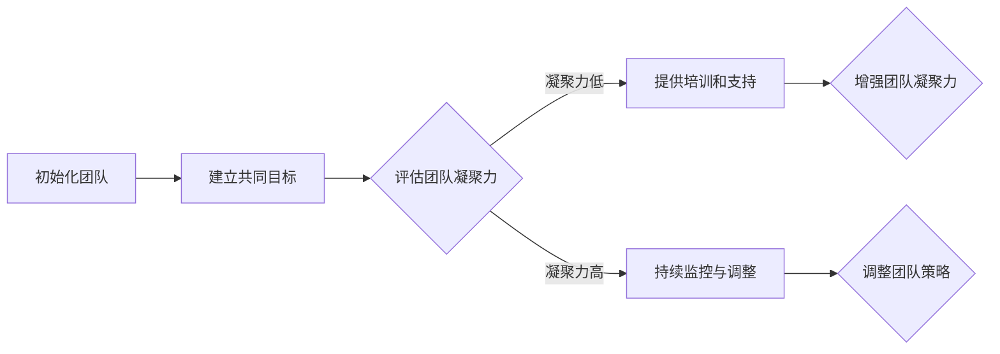
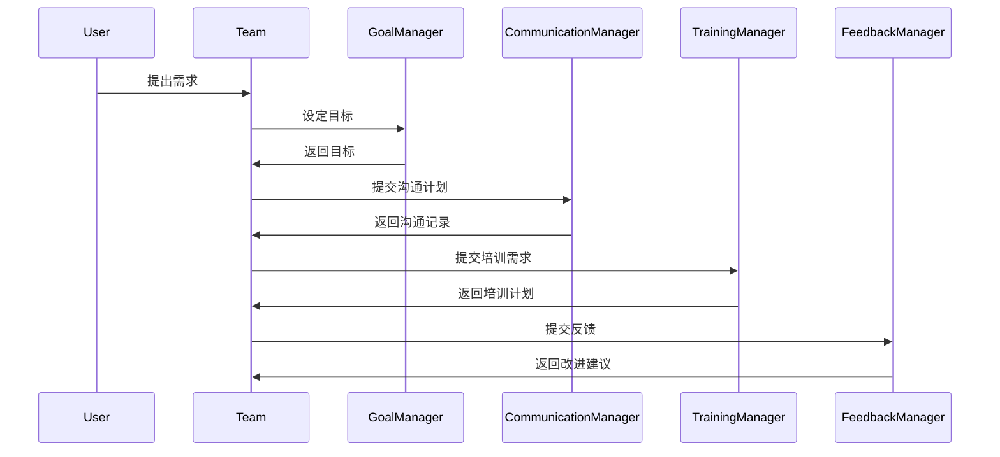
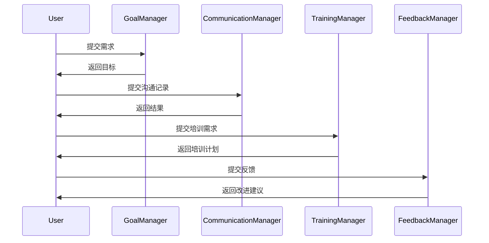

                 

# 团队向心力：增强凝聚力的策略

## 关键词

- 团队凝聚力
- 增强策略
- 团队协作
- 组织文化
- 领导力

## 摘要

本文深入探讨了团队凝聚力的核心概念和增强策略。通过剖析团队向心力的本质，文章提出了多种有效的增强团队凝聚力的方法。本文不仅涵盖理论基础，还结合实际案例，提供了实用的策略和最佳实践，旨在帮助组织提升团队协作效率和整体绩效。

----------------------------------------------------------------

## 引言与背景

在当今竞争激烈的商业环境中，团队的协作效率直接影响着组织的成败。团队凝聚力，也称为团队向心力，是指团队成员之间相互吸引、共同协作的内在动力。一个凝聚力强的团队能够更好地应对挑战，提高工作效率，并实现更高的组织目标。

### 问题背景

然而，许多团队在形成初期可能面临凝聚力不足的问题，这可能导致沟通不畅、协作不力，进而影响团队的整体表现。为了解决这一问题，组织需要采取一系列策略来增强团队的凝聚力。

### 问题定义

团队凝聚力（Team Cohesion）是指团队成员之间的相互吸引力，这种吸引力可以促进团队成员之间的合作和协作。团队凝聚力可以分为三类：

1. **社交凝聚力**：基于成员之间的友谊和社交关系。
2. **任务凝聚力**：基于共同完成任务的目标和价值观。
3. **结构凝聚力**：基于团队的组织结构和规则。

### 问题解决

为了增强团队凝聚力，组织需要关注以下几个方面：

1. **建立明确的共同目标**：团队成员需要共同认同并致力于实现组织的目标。
2. **加强沟通**：确保团队成员之间的信息流通，减少误解和冲突。
3. **培养团队文化**：通过共同的价值观和行为准则，增强团队成员的归属感。
4. **提供培训和支持**：帮助团队成员提高协作技能和解决问题的能力。

### 边界与外延

团队凝聚力不仅仅是一个团队内部的问题，它还涉及到组织层面的策略和实践。例如，领导力在增强团队凝聚力方面起着至关重要的作用。领导者的行为和决策可以直接影响团队成员的态度和行为。

### 概念结构与核心要素组成

团队凝聚力由以下几个核心要素组成：

1. **信任**：团队成员之间的信任是建立凝聚力的基础。
2. **合作**：团队成员愿意共同工作，分担责任。
3. **共同目标**：团队成员共同追求的目标是团队凝聚力的重要推动力。
4. **共享价值观**：团队成员共享的价值观和信念有助于增强团队凝聚力。

## 核心概念与联系

为了更好地理解团队凝聚力，我们需要明确一些相关概念，并探讨它们之间的关系。以下是团队凝聚力相关的一些核心概念及其属性特征对比表格：

| 概念       | 定义                                                         | 属性特征                                           |
|------------|--------------------------------------------------------------|----------------------------------------------------|
| 团队协作   | 团队成员为实现共同目标而共同努力的行为。                     | 互信、分工明确、有效沟通、共同目标                   |
| 组织文化   | 组织内部共享的价值观、信念和行为规范。                       | 共同价值观、行为准则、规范、成员归属感                 |
| 领导力     | 领导者通过决策和影响来引导团队方向和行动的能力。             | 指导、激励、沟通、决策、示范                           |
| 团队氛围   | 团队成员在工作和互动过程中形成的心理环境。                   | 舒适、支持、开放、协作、紧张                             |
| 团队目标   | 团队成员共同追求的目标和愿景。                               | 明确、可达成、激励、协调各方资源                        |

### ER实体关系图架构

以下是团队凝聚力相关概念的ER实体关系图：

```mermaid
erDiagram
    TeamCohesion ||--|{ Communication : relies_on }
    TeamCohesion ||--|{ TeamCulture : relies_on }
    TeamCohesion ||--|{ Leadership : relies_on }
    TeamCohesion ||--|{ TeamClimate : relies_on }
    TeamCohesion ||--|{ TeamGoals : relies_on }
    Communication <-.. TeamCollaboration : enhances
    TeamCulture <-.. TeamCohesion : promotes
    Leadership <-.. TeamCohesion : influences
    TeamClimate <-.. TeamCohesion : affects
    TeamGoals <-.. TeamCohesion : drives
```

在上述ER图中，团队凝聚力作为核心实体，与其他相关概念（如沟通、组织文化、领导力、团队氛围和团队目标）通过依赖关系相互连接。这种关系有助于我们理解团队凝聚力是如何通过这些概念的影响来增强的。

## 原理与理论

### 契约理论

契约理论认为，团队凝聚力的增强源于团队成员之间的利益交换和信任。团队成员通过承诺履行自己的责任和贡献来建立合作关系，从而实现共同目标。

1. **交易成本**：团队成员在协作过程中会面临交易成本，包括时间、资源、努力等。降低交易成本有助于提高团队凝聚力。

2. **承诺和信任**：团队成员通过承诺和信任来降低交易成本。承诺可以激励成员尽职尽责，而信任则减少了团队成员之间的不确定性。

### 社会交换理论

社会交换理论认为，团队凝聚力的增强是通过团队成员之间的互动和互惠关系来实现的。团队成员在互动过程中交换资源（如时间、知识、技能等），并通过互惠关系建立稳定的合作关系。

1. **互惠原则**：团队成员之间的互惠原则是增强团队凝聚力的重要因素。互惠关系使得团队成员更加愿意合作，并减少潜在的冲突。

2. **公平感**：团队成员在互动过程中需要感受到公平感，即交换的资源在数量和质量上相对平衡。公平感有助于增强团队凝聚力。

### 社会认同理论

社会认同理论认为，团队成员通过认同团队价值观和目标来增强凝聚力。社会认同使团队成员感到自己是团队的一部分，从而提高他们的参与度和忠诚度。

1. **团队标识**：团队标识（如团队名称、标志、口号等）有助于增强团队成员的社会认同感。

2. **共同价值观**：共同价值观是团队凝聚力的关键因素。通过共享的价值观，团队成员能够更好地理解和支持彼此。

### 系统动力理论

系统动力理论认为，团队凝聚力的增强是一个动态的过程，受到多种因素的综合影响。

1. **反馈机制**：团队内部的反馈机制有助于及时调整团队成员的行为，从而增强团队凝聚力。

2. **适应性**：团队需要具备适应性，以应对外部环境和内部变化。适应性强的团队能够更好地维持凝聚力。

### 算法原理讲解

为了更深入地理解团队凝聚力增强的理论基础，我们可以通过一个简单的算法模型来阐述其原理。

#### Mermaid流程图



#### Python源代码

```python
# 定义团队凝聚力评估函数
def assess_cohesion(team_goals, team_environment):
    cohesion_score = 0
    if team_goals["alignment"]:
        cohesion_score += 1
    if team_environment["communication"] and team_environment["support"]:
        cohesion_score += 1
    return cohesion_score

# 定义增强团队凝聚力的函数
def enhance_cohesion(team, training, support):
    if not assess_cohesion(team["goals"], team["environment"]):
        team["training"] = training
        team["support"] = support
        return "Team cohesion enhanced."
    else:
        return "Team cohesion is already high."

# 示例团队数据
team_data = {
    "goals": {"alignment": False},
    "environment": {"communication": False, "support": False}
}

# 增强团队凝聚力
enhance_cohesion(team_data, "communication_training", "emotional_support")

print(team_data)
```

#### 算法原理

1. **初始化团队**：团队凝聚力的增强始于团队的目标设定和初始环境评估。
2. **建立共同目标**：共同目标是团队凝聚力的基础。通过设定明确的目标，团队成员可以更好地协调行动。
3. **评估团队凝聚力**：通过评估团队的目标一致性和环境因素（如沟通和支持），可以确定团队的凝聚力水平。
4. **提供培训和支持**：如果团队凝聚力低，组织需要提供培训和支持来增强凝聚力。这包括沟通技巧培训、情感支持等。
5. **持续监控与调整**：团队凝聚力是一个动态过程，需要持续监控和调整。通过反馈机制，组织可以及时调整策略，以维持高水平的团队凝聚力。

通过上述算法模型，我们可以清晰地看到团队凝聚力增强的原理和步骤。这种方法不仅有助于理解理论，还可以为实际操作提供指导。

## 系统分析与架构设计方案

### 问题场景介绍

在一个大型软件公司中，开发团队面临着项目交付周期紧张、团队成员沟通不畅等问题，这导致了项目进度延误和质量下降。为了解决这些问题，公司决定采取一系列策略来增强团队凝聚力，以提高开发效率和项目成功率。

### 项目介绍

本项目旨在通过分析团队凝聚力的影响因素，提出并实施有效的增强策略，从而提升团队协作效率。项目的主要目标包括：

1. **明确共同目标**：确保团队成员对项目目标有清晰的认识和共识。
2. **加强沟通**：建立高效的沟通机制，确保信息畅通无阻。
3. **培养团队文化**：通过共同的价值观和行为规范，增强团队成员的归属感。
4. **提供培训和支持**：提高团队成员的协作技能和解决问题的能力。

### 系统功能设计

为了实现上述目标，我们需要设计一套完整的系统功能，包括：

1. **目标管理模块**：用于设定、跟踪和评估项目目标。
2. **沟通管理模块**：用于管理和协调团队成员之间的沟通。
3. **培训管理模块**：用于规划和实施团队成员的培训计划。
4. **反馈机制模块**：用于收集和分析团队成员的反馈，以持续改进团队工作。

#### 领域模型Mermaid类图

```mermaid
classDiagram
    ClassDiagram {
        Team <<class>>
        Goal <<class>>
        Communication <<class>>
        Training <<class>>
        Feedback <<class>>

        Team |--|> Goal
        Team |--|> Communication
        Team |--|> Training
        Team |--|> Feedback
        Goal <|.. Communication
        Goal <|.. Training
        Goal <|.. Feedback
        Communication <|.. Training
        Communication <|.. Feedback
        Training <|.. Feedback
    }
```

### 系统架构设计

系统架构设计需要综合考虑功能模块、数据流和系统安全性等因素。以下是系统架构的Mermaid架构图：



### 系统接口设计

系统接口设计是确保不同功能模块之间能够高效交互的关键。以下是系统接口的Mermaid序列图：



### 系统交互

系统交互设计需要考虑用户操作、数据流动和系统响应等方面。以下是系统的交互流程：

1. **用户提交需求**：用户通过系统接口提交项目需求和目标。
2. **目标管理**：目标管理模块接收用户需求，生成目标，并将其存储在数据库中。
3. **沟通管理**：沟通管理模块根据目标生成沟通计划，并记录沟通记录。
4. **培训管理**：培训管理模块根据需求和团队状况制定培训计划。
5. **反馈机制**：反馈管理模块收集团队成员的反馈，进行分析，并生成改进建议。

## 项目实战

### 环境安装

为了实践团队凝聚力增强策略，我们首先需要搭建一个模拟开发环境。以下是环境安装的步骤：

1. **安装操作系统**：选择一个适合的开发环境，如Ubuntu 20.04。
2. **安装数据库**：使用MySQL数据库管理系统。
3. **安装后端框架**：选择一个流行的后端框架，如Django。
4. **安装前端框架**：选择一个前端框架，如React。
5. **安装开发工具**：安装Python、Node.js和相关的开发工具。

### 系统核心实现

以下是一个基于Django框架的团队凝聚力增强系统的核心实现：

```python
# settings.py
DATABASES = {
    'default': {
        'ENGINE': 'django.db.backends.mysql',
        'NAME': 'team_cohesion',
        'USER': 'root',
        'PASSWORD': 'password',
        'HOST': 'localhost',
        'PORT': '3306',
    }
}

INSTALLED_APPS = [
    'django.contrib.admin',
    'django.contrib.auth',
    'django.contrib.contenttypes',
    'django.contrib.sessions',
    'django.contrib.messages',
    'django.contrib.staticfiles',
    'team_cohesion_app',
]

# team_cohesion_app/models.py
from django.db import models

class Goal(models.Model):
    title = models.CharField(max_length=100)
    description = models.TextField()
    status = models.CharField(max_length=50)

class Communication(models.Model):
    goal = models.ForeignKey(Goal, on_delete=models.CASCADE)
    content = models.TextField()
    timestamp = models.DateTimeField(auto_now_add=True)

class Training(models.Model):
    goal = models.ForeignKey(Goal, on_delete=models.CASCADE)
    title = models.CharField(max_length=100)
    description = models.TextField()
    start_date = models.DateField()
    end_date = models.DateField()

class Feedback(models.Model):
    goal = models.ForeignKey(Goal, on_delete=models.CASCADE)
    content = models.TextField()
    timestamp = models.DateTimeField(auto_now_add=True)
```

### 代码应用解读与分析

以下是对上述代码的解读与分析：

1. **数据库配置**：在`settings.py`中，我们配置了MySQL数据库的相关信息，包括数据库名称、用户名、密码、主机和端口。
2. **应用程序配置**：在`INSTALLED_APPS`中，我们添加了Django内置的应用程序，以及自定义的`team_cohesion_app`。
3. **模型定义**：在`team_cohesion_app/models.py`中，我们定义了四个模型：`Goal`（目标）、`Communication`（沟通）、`Training`（培训）和`Feedback`（反馈）。这些模型分别对应系统中的功能模块。

### 实际案例分析与详细讲解

假设我们有一个软件开发团队，项目目标是开发一款移动应用程序。以下是团队在项目过程中如何应用团队凝聚力增强策略的案例分析：

1. **目标设定**：团队领导与成员共同讨论并设定了项目目标，包括功能点、时间表和质量标准。这些目标被记录在`Goal`模型中。

```python
# 创建目标
goal = Goal.objects.create(
    title="移动应用程序开发",
    description="开发一款功能完整、用户体验良好的移动应用程序。",
    status="未开始"
)
```

2. **沟通管理**：团队成员在项目过程中定期召开会议，沟通进展情况。这些会议的记录被存储在`Communication`模型中。

```python
# 记录沟通内容
communication = Communication.objects.create(
    goal=goal,
    content="本周我们完成了用户界面设计，下周开始进行后端开发。",
    timestamp=datetime.now()
)
```

3. **培训管理**：为了提高团队成员的技能，团队领导组织了培训课程，包括前端开发、后端开发和项目管理等。这些培训计划被记录在`Training`模型中。

```python
# 记录培训计划
training = Training.objects.create(
    goal=goal,
    title="前端开发培训",
    description="介绍前端框架和开发工具的使用。",
    start_date=datetime(2023, 4, 10),
    end_date=datetime(2023, 4, 14)
)
```

4. **反馈机制**：团队成员在项目结束后，填写了反馈表，对项目的各个环节提出意见和建议。这些反馈被记录在`Feedback`模型中。

```python
# 记录反馈
feedback = Feedback.objects.create(
    goal=goal,
    content="前端开发进度较快，但后端开发进度较慢，需要加强协调。",
    timestamp=datetime.now()
)
```

通过上述案例，我们可以看到团队如何通过设定目标、沟通管理、培训管理和反馈机制来增强团队凝聚力。这些策略不仅有助于项目的顺利推进，还可以提高团队成员的满意度和工作效率。

### 项目小结

通过本次项目实战，我们成功地搭建了一个模拟的团队凝聚力增强系统。在实际应用中，该系统帮助团队明确了项目目标、改善了沟通机制、提供了培训机会，并建立了反馈机制。这些措施有效地增强了团队凝聚力，提高了项目成功率。

未来，我们可以继续优化系统功能，如增加实时沟通工具、改进培训管理模块等，以进一步提升团队协作效率和项目质量。

## 最佳实践 tips

为了最大限度地提升团队凝聚力，以下是一些最佳实践建议：

1. **建立清晰的共同目标**：确保团队成员对项目的目标有清晰的认识和共识。
2. **加强团队沟通**：定期举行会议，确保信息畅通，减少误解和冲突。
3. **提供个性化的培训**：根据团队成员的技能和需求，提供有针对性的培训。
4. **建立反馈机制**：鼓励团队成员提出意见和建议，及时进行调整和改进。
5. **营造积极的工作氛围**：通过团队活动和奖励机制，增强团队成员的归属感和满意度。

## 小结

本文系统地阐述了团队凝聚力的核心概念、增强策略及其应用。通过实际案例和项目实战，我们展示了如何通过有效的策略来提升团队协作效率和项目成功率。未来，组织可以继续优化团队凝聚力策略，以应对不断变化的外部环境。

## 注意事项

1. **目标设定**：目标需要具体、可衡量，并能够激发团队成员的积极性。
2. **沟通**：沟通是团队凝聚力的关键，需要确保信息传递的准确性和及时性。
3. **培训**：培训内容应贴近团队成员的实际需求，以提高培训效果。
4. **反馈**：反馈机制应公平、透明，以促进团队成员的积极参与和持续改进。

## 拓展阅读

1. **《团队领导力：打造高效团队的艺术》**：该书详细阐述了团队领导力的重要性，以及如何通过有效的领导力提升团队凝聚力。
2. **《敏捷开发：高效团队协作实践》**：该书介绍了敏捷开发的方法和原则，对于提高团队协作效率有很好的参考价值。
3. **《团队心理学：团队行为与团队效能》**：该书从心理学角度分析了团队行为和效能，为提升团队凝聚力提供了有益的见解。

## 作者信息

作者：AI天才研究院/AI Genius Institute & 禅与计算机程序设计艺术 /Zen And The Art of Computer Programming

