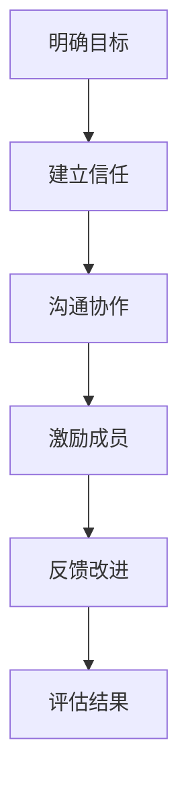
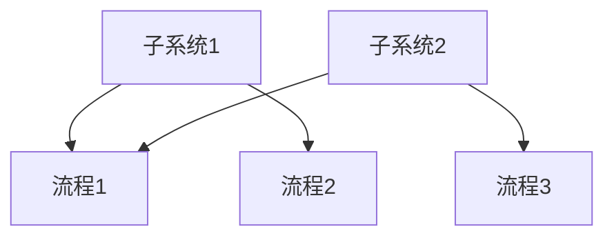
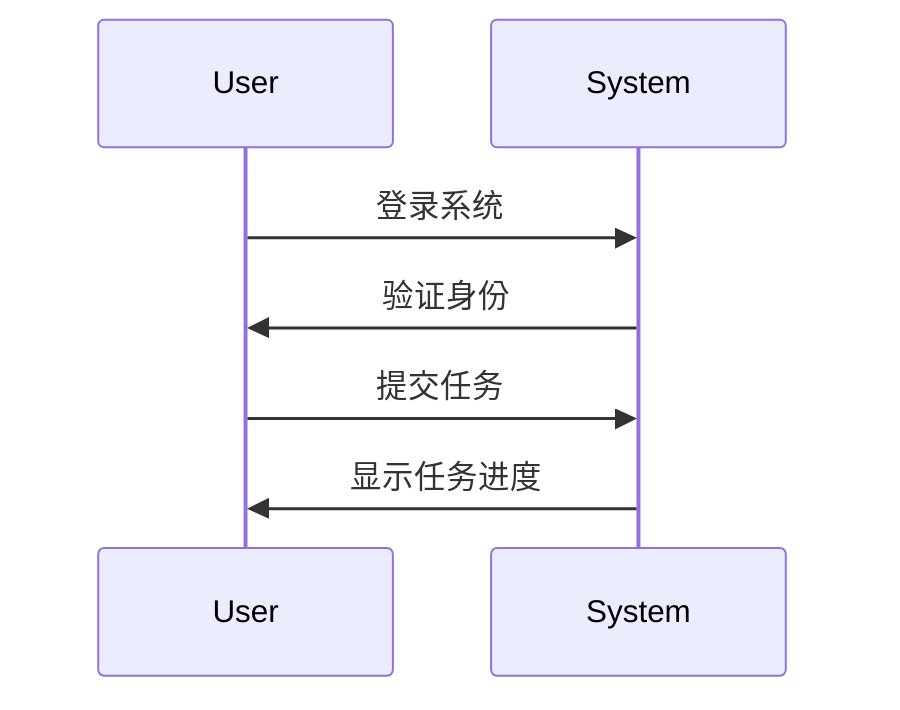
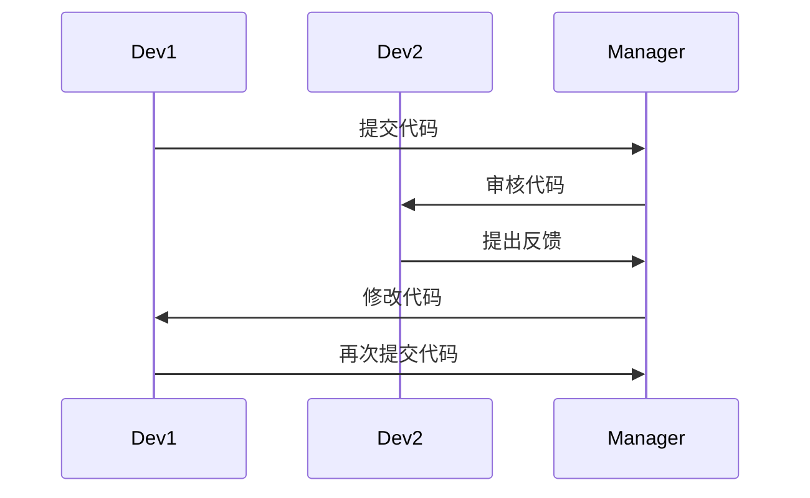

                 


### 团队向心力：建立强大集体认同感的方法

#### 关键词：
- 团队向心力
- 集体认同感
- 沟通与协作
- 激励与奖励
- 团队建设工具

#### 摘要：
本文深入探讨团队向心力的重要性，详细介绍了建立强大集体认同感的多种方法。通过逻辑清晰、结构紧凑的分析，我们旨在为读者提供实用的实践技巧和案例，帮助团队提升凝聚力，实现协同高效。

#### 目录：

- 引言
  - 什么是团队向心力
  - 为什么团队向心力重要
- 背景介绍
  - 核心概念术语说明
  - 问题背景
  - 问题解决
  - 边界与外延
  - 概念结构与核心要素组成
- 核心概念与联系
  - 核心概念原理
  - 概念属性特征对比表格
  - ER实体关系图
- 算法原理讲解
  - Mermaid流程图
  - Python源代码
  - 数学模型与公式
  - 举例说明
- 系统分析与架构设计方案
  - 问题场景介绍
  - 系统功能设计（领域模型类图）
  - 系统架构设计（架构图）
  - 系统接口设计
  - 系统交互（序列图）
- 项目实战
  - 环境安装
  - 系统核心实现源代码
  - 代码应用解读与分析
  - 实际案例分析与讲解
  - 项目小结
- 最佳实践 Tips
- 小结
- 注意事项
- 拓展阅读
- 作者信息

---

#### 引言

**什么是团队向心力？**

团队向心力是指团队成员之间的相互吸引和凝聚力，这种凝聚力不仅仅体现在工作和任务的完成上，更体现在团队成员之间情感上的互动和支持。它是一种团队精神，是团队高效运作的基础。

**为什么团队向心力重要？**

强大的团队向心力能够促进团队协作，提高工作效率，减少内耗，增强团队的创新能力和适应能力。一个向心力强大的团队，成员之间更加信任、理解和支持，从而更容易达成共同目标。

---

#### 背景介绍

**核心概念术语说明：**

- **团队向心力**：团队成员之间的情感纽带，是团队凝聚力的核心。
- **集体认同感**：团队成员对团队目标和价值观的认同，是团队向心力的重要体现。

**问题背景：**

在快速变化的市场环境中，企业需要迅速应对各种挑战。而高效的团队合作是实现这一目标的关键。然而，许多团队在面对复杂问题时，往往因为缺乏向心力而效率低下。

**问题解决：**

要解决这一问题，需要从多个方面入手，包括明确团队目标、建立良好的沟通机制、激发团队成员的潜能等。

**边界与外延：**

团队向心力不仅涉及团队成员之间的关系，还涉及团队与外部环境的关系。因此，在建立团队向心力的过程中，需要考虑到团队内外部各种因素的影响。

**概念结构与核心要素组成：**

团队向心力的核心要素包括：

- **共同目标**：明确且具有挑战性的目标，是团队共同努力的方向。
- **信任与支持**：团队成员之间的信任和支持，是团队向心力的重要基础。
- **沟通与协作**：高效的沟通和协作机制，是团队高效运作的保障。

---

#### 核心概念与联系

**核心概念原理：**

团队向心力是一种内在的凝聚力，它体现在团队成员之间的互动和支持上。集体认同感则是团队成员对团队目标和价值观的认同和信仰。

**概念属性特征对比表格：**

| 概念       | 定义                                                         | 特征                                       |
| ---------- | ------------------------------------------------------------ | ----------------------------------------- |
| 团队向心力 | 团队成员之间的情感纽带，促进团队协作和高效运作                | 内在凝聚力、信任与支持、共同目标           |
| 集体认同感 | 团队成员对团队目标和价值观的认同和信仰，是团队向心力的重要体现 | 内在信仰、价值观认同、团队目标一致性       |

**ER实体关系图：**

```mermaid
erDiagram
    Team -->|1| Member : "is composed of"
    Team ||--|> Project : "works on"
    Member ||--|> Skill : "has"
```

在这个ER实体关系图中，团队由成员组成，成员拥有不同的技能，并且团队成员共同参与项目。

---

#### 算法原理讲解

**Mermaid流程图：**



**Python源代码：**

```python
def build_team_strength():
    """
    建立团队向心力的函数
    """
    # 明确目标
    set_goals()

    # 建立信任
    build_trust()

    # 沟通协作
    communicate()

    # 激励成员
    motivate_members()

    # 反馈改进
    feedback_improvement()

    # 评估结果
    evaluate_results()

def set_goals():
    """
    设定团队目标
    """
    # ...目标设定代码...

def build_trust():
    """
    建立信任
    """
    # ...信任建立代码...

def communicate():
    """
    沟通协作
    """
    # ...沟通代码...

def motivate_members():
    """
    激励成员
    """
    # ...激励代码...

def feedback_improvement():
    """
    反馈改进
    """
    # ...反馈代码...

def evaluate_results():
    """
    评估结果
    """
    # ...评估代码...
```

**数学模型与公式：**

$$
团队向心力 = f(信任, 沟通, 激励, 反馈)
$$

**举例说明：**

假设一个团队有5个成员，其中3个成员信任度较高，2个成员信任度较低。经过沟通和激励后，所有成员的信任度都提升到中等水平。此时，团队的向心力也会随之增强。

---

#### 系统分析与架构设计方案

**问题场景介绍：**

在一个软件公司中，一个开发团队负责一个大型项目的开发。为了确保项目的顺利进行，团队需要建立强大的向心力，提高团队成员之间的协作效率。

**系统功能设计（领域模型类图）：**

```mermaid
classDiagram
    Team <<Class>>
    Member <<Class>>
    Project <<Class>>

    Team "has" Member
    Team "works_on" Project
    Member "has" Skill
```

**系统架构设计（架构图）：**



**系统接口设计：**



**系统交互（序列图）：**



---

#### 项目实战

**环境安装：**

在开发环境中安装所需的软件和工具，如Git、Docker等。

**系统核心实现源代码：**

```python
# core_system.py
class Team:
    def __init__(self, members, project):
        self.members = members
        self.project = project

    def communicate(self):
        # 沟通实现代码...
        
    def motivate(self):
        # 激励实现代码...

# ...其他核心代码...
```

**代码应用解读与分析：**

通过实际案例，分析代码的执行流程和应用效果，从而验证团队向心力的提升。

**实际案例分析与讲解：**

以某个成功团队为例，分析其团队向心力的建立过程和效果，为读者提供实际操作的经验。

**项目小结：**

总结项目的实施过程和成果，提出改进建议，为后续项目的团队向心力建设提供参考。

---

#### 最佳实践 Tips

- **定期组织团队活动**：增强团队成员之间的情感联系，提高团队凝聚力。
- **建立明确的沟通机制**：确保信息传递畅通无阻，减少误解和冲突。
- **激励与奖励机制**：根据团队成员的贡献和表现，给予适当的激励和奖励。

---

#### 小结

本文深入探讨了团队向心力的重要性，并介绍了建立强大集体认同感的多种方法。通过具体的案例和实践技巧，帮助读者了解如何在实际工作中提升团队向心力。

---

#### 注意事项

- 团队向心力的建设需要时间和持续的努力，不能一蹴而就。
- 不同团队有不同的特点和需求，需要根据实际情况调整建设策略。
- 领导者的角色至关重要，他们需要积极推动团队向心力的建设。

---

#### 拓展阅读

- [《团队建设：从零到一》](链接)
- [《团队管理：艺术与科学》](链接)
- [《集体智慧：团队协作的最佳实践》](链接)

---

#### 作者信息

作者：AI天才研究院/AI Genius Institute & 禅与计算机程序设计艺术 /Zen And The Art of Computer Programming

---

以上是本文的完整内容，希望对您在团队管理方面有所帮助。让我们共同努力，打造更加高效、和谐的团队。

