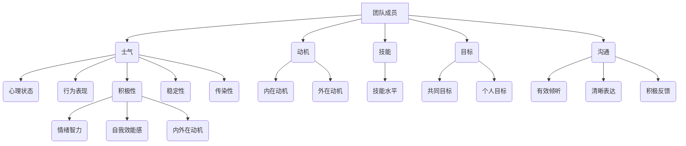

                 

### 引言与背景

在当今信息化高度发展的社会中，团队士气管理已经成为企业管理中不可或缺的一部分。团队士气不仅直接影响团队成员的工作效率和工作质量，更是企业长期发展的关键因素之一。良好的团队士气能够激发团队成员的工作热情和创新能力，从而在激烈的市场竞争中占据优势。然而，随着工作环境的复杂化和竞争的加剧，如何有效地管理团队士气成为了一项极具挑战性的任务。

#### 1.1 团队士气管理的重要性

**1.1.1 提高工作效率**

团队士气高涨时，成员们通常会表现出更高的工作动力和更强的责任心，这直接导致工作效率的提升。团队成员之间的协作更加顺畅，沟通成本降低，整体工作流程更加高效。

**1.1.2 增强团队凝聚力**

良好的团队士气有助于增强团队成员之间的信任和默契，提高团队凝聚力。在一个团结协作的团队中，成员们更愿意为共同的目标而努力，从而形成强大的战斗力。

**1.1.3 提升企业竞争力**

士气高涨的团队往往能够更快地适应市场变化，灵活应对各种挑战。这种敏捷性和创新力是企业保持竞争优势的重要保障。

#### 1.2 团队士气管理的定义

团队士气，简单来说，就是团队成员在工作和生活中的心理状态和行为表现。具体来说，它包含了以下几个层面的含义：

- **心理状态**：团队成员的工作态度、情绪状态、自信心和积极性等。
- **行为表现**：团队成员在日常工作中的表现，包括工作效率、协作能力和创新能力等。

团队士气管理，则是指通过一系列的管理方法和措施，来提升团队士气，从而实现提高工作效率、增强团队凝聚力和提升企业竞争力的目标。

#### 1.3 团队士气管理的主要挑战

尽管团队士气管理的重要性不言而喻，但实践中仍然面临诸多挑战：

**1.3.1 工作压力与疲劳**

现代职场中，工作压力和疲劳是影响团队士气的重要因素。长期的高强度工作容易导致团队成员身心疲惫，从而影响工作热情和效率。

**1.3.2 竞争与合作中的冲突**

在竞争激烈的职场环境中，团队成员之间难免会出现竞争和合作中的冲突。如何平衡竞争与合作，成为团队士气管理的关键挑战之一。

**1.3.3 内部沟通不畅**

内部沟通不畅是团队士气管理中的另一个常见问题。团队成员之间的信息传递不充分，可能导致误解和矛盾，影响团队士气。

#### 1.4 本书结构安排

本书将从理论到实践，全面系统地探讨团队士气管理的方法和策略。全书主要分为四个部分：

- **第一部分：团队士气管理基础**，介绍团队士气管理的核心概念和理论基础。
- **第二部分：高级团队士气管理策略**，探讨高级管理策略在团队士气管理中的应用。
- **第三部分：案例分析与实践**，通过具体案例，展示团队士气管理的实践方法和效果。
- **第四部分：总结与展望**，总结全书内容，并对未来团队士气管理的发展趋势进行展望。

通过本书的阅读，读者将能够深入了解团队士气管理的核心概念和实践方法，从而为提升团队士气提供有力支持。

#### 1.5 本章小结

本章作为引言与背景部分，首先阐述了团队士气管理的重要性，包括提高工作效率、增强团队凝聚力和提升企业竞争力。接着，对团队士气管理的定义进行了详细解释，并介绍了团队士气管理的主要挑战。最后，概述了本书的结构安排，为后续内容的深入探讨奠定了基础。通过对本章内容的理解，读者可以初步认识到团队士气管理在企业管理中的关键作用，并对接下来的章节内容有所期待。

---

## 第二部分：团队士气管理基础

### 2.1 团队士气管理核心概念

团队士气管理的核心概念是理解和分析士气的基本内涵及其在团队管理中的应用。为了全面探讨团队士气管理，我们首先需要明确“士气”的概念，以及它在不同环境和条件下的表现。

#### 2.1.1 士气的基本定义

士气可以定义为团队成员在工作和生活中的心理状态和行为表现。它是团队成员对于团队目标、工作环境和自身能力的认同和信心。士气不仅体现在团队成员的情感和心理层面，还表现在他们的工作行为和团队互动中。

- **情感和心理层面**：士气高时，团队成员通常表现出积极向上的情绪状态，如自信、乐观和热情。相反，士气低落时，团队成员可能会表现出消极、抱怨和无动力。
  
- **工作行为和团队互动**：士气高的团队成员通常能够更高效地完成工作任务，更积极地参与团队讨论和合作，表现出更强的责任感和归属感。

#### 2.1.2 士气的属性特征对比

士气具有以下属性特征：

- **积极性**：士气高时，团队成员表现出积极的工作态度和情绪状态，有利于提高工作效率和团队合作。
  
- **稳定性**：士气不是一成不变的，它会随着团队环境、任务难度和个人情况的变化而波动。因此，团队士气管理需要关注士气的变化趋势，并采取相应措施进行调节。
  
- **传染性**：士气具有传染性，一个团队成员的高士气可以激发其他成员的积极情绪，反之亦然。这要求领导者注意团队成员的情绪状态，并通过正面引导和激励来提升整体士气。

#### 2.1.3 士气管理的重要性

团队士气管理的重要性在于：

- **促进工作效率**：良好的士气能够激发团队成员的工作动力，提高工作效率和产出。
  
- **增强团队凝聚力**：士气高涨的团队更加团结协作，成员之间的信任和默契增强，有助于提升团队凝聚力。
  
- **提升企业竞争力**：士气高是团队创新和应对挑战的重要保障，有利于企业长期发展。

#### 2.1.4 士气管理的挑战

在实际团队管理中，士气管理面临以下挑战：

- **工作压力和疲劳**：长期高强度的工作容易导致团队成员身心疲惫，影响士气。
  
- **竞争和合作中的冲突**：团队成员之间可能存在竞争关系，如何平衡竞争与合作是士气管理的难点。
  
- **内部沟通不畅**：沟通不畅容易导致误解和矛盾，影响团队士气。

#### 2.1.5 士气管理的方法

团队士气管理的方法包括：

- **激励与奖励**：通过物质和精神激励，提升团队成员的工作热情和积极性。
  
- **团队建设活动**：组织团队建设活动，增强团队成员之间的信任和互动，提升团队士气。
  
- **情绪智力培养**：培养领导者和团队成员的情绪智力，提高情绪管理能力，有助于维持良好的团队氛围。

通过以上对团队士气管理核心概念的阐述，我们可以更好地理解士气在团队管理中的重要性及其管理方法。接下来，我们将进一步探讨团队士气管理的理论基础，为后续内容提供理论支持。

### 2.2 团队士气管理的理论基础

团队士气管理是一个复杂的过程，它不仅涉及心理学和动机理论，还与组织行为学和管理学中的相关理论密切相关。了解这些理论有助于我们更深入地理解团队士气管理的本质，并找到有效的管理方法。

#### 2.2.1 心理学视角

从心理学角度来看，士气是团队成员的心理状态和情感反应的外在表现。心理学理论为我们提供了理解士气的基础，主要包括动机理论和情绪理论。

**2.2.1.1 动机与士气**

动机是推动个体行为的重要力量，它决定了个体在工作中的努力程度和投入水平。心理学家如马斯洛（Abraham Maslow）提出的需求层次理论（Hierarchy of Needs）认为，个体的动机是由不同层次的需求组成的，从基本的生理需求到最高层次的自我实现需求。在团队管理中，领导者需要关注并满足团队成员的不同层次需求，从而激发士气。

- **生理需求**：包括基本的生存需求，如食物、住房和健康。团队士气管理需要确保团队成员的基本生活需求得到满足。
- **安全需求**：包括安全感、稳定的工作环境和健康的工作条件。领导者需要提供安全的工作环境，减少团队成员的焦虑和恐惧。
- **社交需求**：包括归属感、友情和爱的需求。领导者可以通过建立团队文化和开展团队建设活动来满足团队成员的社交需求。
- **尊重需求**：包括自尊、自我尊重和受到他人的尊重。领导者应鼓励团队成员表达自己的观点，给予他们足够的认可和尊重。
- **自我实现需求**：包括实现个人潜力和追求自我价值的需求。领导者可以设置具有挑战性的目标和提供发展机会，以激发团队成员的自我实现需求。

**2.2.1.2 自我效能感与士气**

自我效能感（Self-Efficacy）是指个体对自己完成某项任务的能力的信心。心理学家班杜拉（Albert Bandura）提出，自我效能感对个体的行为和情绪有着重要影响。高自我效能感的团队成员往往更加自信，更有可能成功完成任务，从而提升士气。

- **任务难度**：领导者需要设定适当的任务难度，确保团队成员既有挑战性又能够实现。过难的任务可能导致失败感和低士气，而过简单的任务则可能引发无聊和倦怠。
- **反馈与支持**：及时、有效的反馈和支持可以帮助团队成员建立自我效能感。领导者应鼓励团队成员分享经验和学习成果，并提供必要的帮助和资源。

#### 2.2.2 管理学视角

从管理学角度来看，团队士气管理涉及到组织行为学、人际关系理论和领导力理论等多个方面。

**2.2.2.1 组织行为学理论**

组织行为学关注个体和群体在组织中的行为。赫茨伯格的双因素理论（Two-Factor Theory）提出了激励因素和保健因素的概念。激励因素能够提高士气，如成就、认可和责任感；而保健因素则是避免士气下降的必要条件，如工资、工作环境和公司政策。

- **激励因素**：领导者应关注团队成员的激励因素，通过设定明确的目标、提供奖励和认可来提升士气。
- **保健因素**：领导者需要确保保健因素得到满足，以防止士气下降。这包括提供良好的工作条件、公平的薪酬体系和有效的沟通渠道。

**2.2.2.2 人际关系理论**

人际关系理论关注团队成员之间的互动和关系。梅奥的霍桑实验（Hawthorne Experiment）揭示了工作环境、团队互动和士气之间的关系。良好的团队互动和积极的人际关系有助于提升士气，而冲突和误解则可能导致士气下降。

- **团队互动**：领导者应鼓励团队成员之间的交流和合作，建立积极的人际关系。
- **冲突管理**：领导者需要掌握冲突管理的技巧，通过有效沟通和合作，解决团队中的冲突。

**2.2.2.3 领导力理论**

领导力在团队士气管理中起着关键作用。领导力理论包括特质理论、行为理论和权变理论等。有效的领导者能够激发团队成员的士气，带领团队实现共同目标。

- **特质理论**：领导者应具备一定的特质，如自信、正直和领导能力。
- **行为理论**：领导者通过特定的行为和领导风格来影响团队成员，如民主式领导、参与式领导和交易式领导等。
- **权变理论**：领导者的领导风格应根据团队和环境的变化进行灵活调整，以最大程度地提升士气。

通过综合心理学和管理学的理论，我们可以更全面地理解团队士气管理的复杂性，并找到有效的策略和方法来提升团队士气。在接下来的章节中，我们将进一步探讨团队士气管理的核心要素，为实际应用提供具体指导。

### 2.3 团队士气管理的核心要素

团队士气管理是一个多层次的、复杂的过程，它涉及到多个关键要素。这些要素不仅相互关联，还共同影响着团队士气的高低。为了更全面地理解团队士气管理，我们需要深入探讨这些核心要素，并分析它们如何影响团队士气。

#### 2.3.1 个人层面

**2.3.1.1 个人动机与士气的关系**

个人动机是推动团队成员行为的内在动力。不同的动机对士气有着不同的影响。例如：

- **内在动机**：源自个体对工作本身的兴趣和热情，如成就感、自我实现等。这种动机通常能够显著提升士气，因为团队成员在工作过程中感到满足和快乐。
  
- **外在动机**：源自外部奖励，如薪酬、奖金和晋升等。虽然外在动机可以在短期内提升士气，但长期依赖外在动机可能导致士气波动，甚至产生依赖性。

在实际管理中，领导者需要识别和培养团队成员的内在动机，通过设定具有挑战性的目标和提供发展机会来激发士气。同时，合理运用外在动机，确保团队成员在实现目标时能够获得适当的奖励和认可。

**2.3.1.2 个人技能与士气的关系**

个人技能水平直接影响团队成员的工作表现和士气。技能水平高、能力强的团队成员通常更有信心和动力去完成任务，士气也会相应提升。反之，技能水平不足或缺乏培训的团队成员可能会感到不安和压力，导致士气下降。

因此，团队士气管理需要关注团队成员的技能发展，通过培训、指导和支持等方式提高团队成员的技能水平。同时，领导者应鼓励团队成员不断学习和提升自己，以增强自信心和士气。

#### 2.3.2 团队层面

**2.3.2.1 团队目标与士气的关系**

团队目标对士气有着直接的影响。明确的、具有挑战性的团队目标能够激发团队成员的工作热情和动力。团队成员在实现目标的过程中，会感到成就感和自豪感，从而提升士气。

- **共同目标**：团队成员共同认同并追求的目标能够增强团队凝聚力，提升士气。共同目标为团队成员提供了一个共同的愿景和方向，使得他们能够更加团结协作，为实现目标而努力。
  
- **个人目标**：团队成员的个人目标应与团队目标相一致。当个人目标与团队目标相冲突时，可能会导致士气下降和团队分裂。因此，领导者需要确保团队成员的个人目标与团队目标相协调，避免因目标不一致而引发的士气问题。

**2.3.2.2 团队沟通与士气的关系**

有效的沟通是团队士气管理的重要基础。良好的团队沟通能够增强团队成员之间的信任和理解，减少误解和冲突，从而提升士气。以下是一些关键点：

- **透明沟通**：领导者应确保信息传递的透明度，让团队成员及时了解团队动态和决策过程。透明沟通有助于增强团队成员的信任感和归属感。
  
- **积极倾听**：领导者需要学会倾听团队成员的意见和反馈，尊重他们的观点和感受。积极倾听可以提升团队成员的参与感和责任感，从而增强士气。
  
- **多渠道沟通**：领导者应利用多种沟通渠道，如面对面会议、电子邮件、即时通讯工具等，以满足不同团队成员的沟通需求。多样化的沟通方式可以确保信息传达的全面性和及时性，有助于提升团队士气。

#### 2.3.3 领导力与士气的关系

领导力在团队士气管理中起着至关重要的作用。有效的领导者能够激发团队成员的士气，带领团队实现目标。

- **愿景领导**：领导者应具备清晰的愿景和目标，能够将愿景传递给团队成员，激发他们的工作热情和动力。愿景领导有助于提升团队成员的士气，增强他们的归属感和使命感。
  
- **激励领导**：领导者需要运用激励手段，如奖励、认可和培训等，来激发团队成员的士气。合理的激励能够增强团队成员的工作动力和积极性。
  
- **参与领导**：领导者应鼓励团队成员参与决策和问题解决，提升他们的参与感和责任感。参与领导可以增强团队成员的归属感和士气。

通过以上对个人层面和团队层面核心要素的分析，我们可以看到，团队士气管理不仅需要关注团队成员的个人动机和技能，还需要注重团队目标的设定和沟通的有效性。有效的团队士气管理需要从多个层面入手，综合运用各种管理方法和策略，以提升团队士气，实现团队目标。

### 2.4 士气管理方法介绍

在了解了团队士气管理的核心概念和理论基础之后，我们需要具体探讨士气管理的方法。这些方法可以分为传统方法和现代方法两大类。传统方法主要包括奖励机制和团队建设活动，而现代方法则包括跨文化管理和心理辅导等。以下是对这些方法的详细介绍。

#### 2.4.1 传统方法

**2.4.1.1 奖励机制**

奖励机制是提升团队士气的一种传统且有效的方法。通过给予团队成员奖励，如奖金、晋升和荣誉称号等，可以激发他们的工作热情和积极性。

- **奖金**：奖金是一种直接的经济激励，通常用于奖励在特定项目中表现优异的团队成员。奖金可以显著提升士气，因为它直接与个人绩效挂钩。
  
- **晋升**：晋升是另一种常见的奖励机制，它不仅能够提升团队成员的职业发展，还能增强他们的工作动力和忠诚度。
  
- **荣誉称号**：荣誉称号是对团队成员在特定领域或项目中表现出色的认可。这种奖励形式通常具有较高的象征意义，能够提升团队成员的自豪感和归属感。

**2.4.1.2 团队建设活动**

团队建设活动是另一种传统方法，通过团队互动和合作来增强团队成员之间的信任和默契。常见的团队建设活动包括团队拓展训练、户外运动和团队晚宴等。

- **团队拓展训练**：拓展训练通常在户外进行，通过一系列挑战性任务来增强团队成员之间的信任和协作。这种活动有助于打破团队内部的隔阂，提升团队合作能力。
  
- **户外运动**：户外运动如徒步、骑行和登山等，不仅能够增强团队成员的身体素质，还能在活动中增进彼此的了解和信任。
  
- **团队晚宴**：团队晚宴是一种轻松的社交活动，通常在晚宴过程中，团队成员可以自由交流，分享工作经验和心得，这种活动有助于增强团队凝聚力和士气。

#### 2.4.2 现代方法

**2.4.2.1 跨文化管理**

随着全球化的发展，跨文化管理成为团队士气管理的一个重要方面。跨文化管理旨在帮助团队成员适应不同文化背景，促进有效沟通和协作。

- **文化意识**：培养团队成员的文化意识，让他们了解并尊重不同文化的差异。这种文化意识有助于减少误解和冲突，提升团队合作效率。
  
- **沟通技巧**：提供跨文化沟通技巧培训，帮助团队成员在不同文化背景下有效沟通。这种培训可以包括语言技能、非语言沟通和文化敏感性等。

**2.4.2.2 心理辅导**

心理辅导是一种现代方法，通过专业的心理辅导来提升团队成员的心理健康和士气。心理辅导可以包括以下方面：

- **压力管理**：帮助团队成员应对工作和生活中的压力，提供压力管理和放松技巧。
  
- **情绪调节**：教授团队成员情绪调节技巧，帮助他们保持积极的心态和情绪状态。
  
- **职业规划**：提供职业规划咨询，帮助团队成员明确职业目标，制定发展计划，提升工作动力和士气。

#### 2.4.3 综合应用

在实际管理中，传统方法和现代方法可以结合使用，以实现最佳效果。例如，在跨文化团队中，可以通过奖励机制激发团队成员的工作热情，同时通过团队建设活动和心理辅导来增强团队凝聚力和士气。

- **多样化激励**：结合奖金、晋升和荣誉称号等多种奖励形式，确保激励的多样性和个性化，满足不同团队成员的需求。
  
- **持续团队建设**：定期组织团队建设活动，不仅有助于提升士气，还能保持团队的活力和凝聚力。
  
- **文化适应与心理辅导**：在跨文化团队中，通过文化适应和心理辅导来帮助团队成员更好地融入团队，提高协作效率。

通过以上对士气管理方法的详细介绍，我们可以看到，传统方法和现代方法各有其优势和应用场景。在实际操作中，领导者应根据团队的特点和需求，灵活运用这些方法，以提升团队士气，实现团队目标。

### 2.5 本章小结

本章详细介绍了团队士气管理的核心概念、理论基础以及核心要素，并通过传统方法和现代方法阐述了团队士气管理的方法。通过本章的学习，读者可以全面了解团队士气管理的各个方面，包括士气的定义、动机与自我效能感的关系、组织行为学和管理学的理论基础，以及如何通过激励和团队建设活动来提升团队士气。同时，读者还了解到跨文化管理和心理辅导等现代方法的实际应用。这些知识将有助于读者在实际工作中有效地管理团队士气，提升团队整体表现。

---

## 第三部分：高级团队士气管理策略

### 3.1 高级管理策略概述

在常规的团队士气管理方法之外，高级管理策略在提升团队士气方面具有独特的优势。这些策略不仅能够解决传统方法难以应对的复杂问题，还能够为团队注入新的活力和动力。高级管理策略主要包括情绪智力、高级沟通技巧和领导力优化等。以下是这些策略的定义及其重要性。

#### 3.1.1 高级管理策略的定义

**情绪智力**（Emotional Intelligence，EQ）是指个体识别、理解和管理自己及他人情绪的能力。情绪智力包括自我意识、自我调节、动机、同理心和社交技能等五个维度。

**高级沟通技巧**是指超出常规沟通水平的技能，包括有效倾听、清晰表达、积极反馈和跨文化沟通等。

**领导力优化**是指通过领导力的提升，优化团队士气管理，包括设定清晰的目标、建立积极的工作环境和增强团队凝聚力等。

#### 3.1.2 高级管理策略的重要性

高级管理策略在团队士气管理中扮演着重要角色：

- **提升团队凝聚力**：高级管理策略能够增强团队成员之间的信任和合作关系，从而提升团队凝聚力。
- **提高工作效率**：通过情绪智力和高级沟通技巧，团队成员能够更有效地协作，减少冲突，提高工作效率。
- **增强团队适应力**：高级管理策略能够帮助团队更好地应对变化和挑战，提高团队适应力。

接下来，我们将逐一探讨情绪智力、高级沟通技巧和领导力优化在团队士气管理中的应用。

### 3.2 情绪智力在团队士气管理中的作用

情绪智力在团队士气管理中起着至关重要的作用。情绪智力高的团队更容易保持积极向上的氛围，从而提升整体士气。以下是情绪智力的概念及其在团队士气管理中的应用。

#### 3.2.1 情绪智力的概念

情绪智力由心理学家戈尔曼（Daniel Goleman）提出，包括以下四个主要维度：

1. **自我意识**（Self-awareness）：个体能够识别和理解自己的情绪状态。
2. **自我调节**（Self-regulation）：个体能够管理和调整自己的情绪反应。
3. **动机**（Motivation）：个体能够保持积极性和动力，追求长期目标。
4. **同理心**（Empathy）：个体能够理解并感受他人的情绪。
5. **社交技能**（Social Skills）：个体能够有效地与他人沟通和建立良好关系。

#### 3.2.2 情绪智力在团队士气管理中的应用

**3.2.2.1 提高领导者的情绪智力**

领导者是团队士气管理的关键因素。高情绪智力的领导者能够更好地识别和应对团队的情绪变化，从而提升团队士气。

- **识别情绪变化**：高情绪智力的领导者能够敏锐地察觉团队成员的情绪状态，及时采取行动，避免负面情绪的扩散。
- **调节情绪反应**：领导者通过自我调节情绪，减少情绪波动，树立积极的榜样，影响团队成员的情绪状态。
- **激励团队成员**：高情绪智力的领导者能够激发团队成员的内在动机，鼓励他们追求长期目标，提升士气。

**3.2.2.2 培养团队成员的情绪智力**

团队成员的情绪智力同样对团队士气有重要影响。通过培训和实践，可以提升团队成员的情绪智力。

- **情绪管理培训**：为团队成员提供情绪管理培训，教授他们情绪识别和调节技巧，帮助他们更好地应对工作和生活中的情绪问题。
- **建立积极沟通环境**：鼓励团队成员之间进行开放、真诚的沟通，培养同理心和社交技能，增强团队凝聚力。
- **情绪反馈机制**：建立情绪反馈机制，允许团队成员表达自己的情绪和意见，促进团队成员之间的理解和合作。

通过提高领导者和团队成员的情绪智力，团队能够在面临挑战时保持积极和乐观，提升士气，实现团队目标。

### 3.3 高级沟通技巧在团队士气管理中的应用

有效的沟通是团队士气管理的关键。高级沟通技巧能够提升团队内部和外部的沟通效率，减少误解和冲突，从而提升团队士气。以下介绍高级沟通技巧的概念及其应用。

#### 3.3.1 高级沟通技巧的概念

高级沟通技巧包括以下几个方面：

- **有效倾听**：不仅关注听到的信息，还关注说话人的情感和意图。
- **清晰表达**：能够准确、清晰地传达信息，避免误解和歧义。
- **积极反馈**：给予团队成员积极的反馈，鼓励他们继续努力或改进。
- **跨文化沟通**：能够适应不同文化背景，进行有效沟通。

#### 3.3.2 高级沟通技巧在团队士气管理中的实践

**3.3.2.1 提升团队内部沟通效率**

内部沟通效率的提升对团队士气有直接的影响。以下是一些具体实践方法：

- **定期会议**：定期召开团队会议，确保信息传递的及时性和准确性。会议中可以设置明确的议程，让团队成员充分表达意见和反馈。
- **信息共享平台**：建立信息共享平台，如内部邮件系统、团队协作工具等，方便团队成员获取信息和交流意见。
- **面对面交流**：鼓励团队成员进行面对面的交流，增进了解和信任，减少误解和冲突。

**3.3.2.2 促进跨部门合作**

跨部门合作是提升团队士气的重要途径。以下是一些促进跨部门合作的方法：

- **跨部门项目**：通过跨部门项目，促进团队成员之间的交流和合作，增强团队凝聚力。
- **团队培训**：为跨部门团队成员提供培训，提高他们的沟通技能和协作能力。
- **定期交流**：定期组织跨部门交流会议，分享项目进展和问题，促进信息共享和协作。

通过提升团队内部沟通效率和促进跨部门合作，团队能够更好地应对挑战，提升士气，实现共同目标。

### 3.4 领导力在团队士气管理中的关键作用

领导力在团队士气管理中起着至关重要的作用。有效的领导者不仅能够设定明确的目标，激发团队成员的潜力，还能够建立积极的工作环境，提升团队士气。以下探讨领导力在团队士气管理中的关键作用。

#### 3.4.1 领导力的定义

领导力是指个体在团队中引导、激励和影响他人的能力。领导力不仅包括技术能力和管理能力，还涉及到情感和人际交往能力。有效的领导者能够通过以下四个层面来提升团队士气：

1. **愿景领导**：设定清晰的目标和愿景，引导团队成员为实现目标而努力。
2. **激励领导**：激发团队成员的内在动机，鼓励他们追求卓越。
3. **变革领导**：推动团队适应变化，应对挑战。
4. **文化领导**：建立积极的企业文化，营造良好的工作氛围。

#### 3.4.2 领导力在团队士气管理中的具体体现

**3.4.2.1 设定清晰的目标**

设定清晰的目标是提升团队士气的重要步骤。有效的领导者能够：

- **明确目标**：确保团队成员了解团队的目标和愿景，明确各自的角色和职责。
- **目标分解**：将大目标分解为小目标，制定具体的行动计划，让团队成员知道如何为实现目标而努力。
- **目标跟踪**：定期检查目标进度，及时调整计划和策略，确保目标的实现。

通过设定清晰的目标，团队成员能够更好地了解自己的工作方向，提高工作动力和士气。

**3.4.2.2 建立积极的工作环境**

建立积极的工作环境是提升团队士气的基础。领导者应：

- **创造信任氛围**：鼓励团队成员之间的开放和坦诚交流，建立信任和尊重的基础。
- **提供资源支持**：确保团队成员获得完成工作所需的各种资源，如培训、工具和设备等。
- **激励创新**：鼓励团队成员提出新想法和建议，激发创新思维，提升团队士气。

通过建立积极的工作环境，团队成员能够更加愉快地工作，提高工作效率和士气。

**3.4.2.3 增强团队凝聚力**

团队凝聚力是提升团队士气的重要因素。领导者应：

- **组织团队活动**：定期组织团队建设活动和庆祝活动，增强团队凝聚力。
- **培养团队精神**：鼓励团队成员共同承担责任，培养团队精神。
- **解决冲突**：及时解决团队内部冲突，维护团队的和谐。

通过增强团队凝聚力，团队成员能够更好地合作，提高工作满意度和士气。

**3.4.2.4 提供发展机会**

领导者应提供团队成员的发展机会，帮助他们实现个人成长和职业发展。这包括：

- **培训和发展计划**：为团队成员提供培训和学习机会，提升他们的技能和知识。
- **职业规划**：与团队成员一起制定职业规划，提供职业发展的指导和支持。
- **认可和奖励**：及时认可和奖励团队成员的成就，激励他们继续努力。

通过提供发展机会，团队成员能够感受到企业的关心和支持，提高工作满意度和士气。

通过以上探讨，我们可以看到，领导力在团队士气管理中具有关键作用。有效的领导者能够通过设定清晰的目标、建立积极的工作环境、增强团队凝聚力和提供发展机会来提升团队士气，实现团队目标。

### 3.5 团队激励与奖励机制的优化

团队激励与奖励机制是提升团队士气的重要手段。一个有效的激励和奖励机制不仅能激发团队成员的潜力，提高工作效率，还能增强团队凝聚力。以下我们将探讨激励理论的基本概念，以及如何设计优化的奖励机制。

#### 3.5.1 激励理论概述

激励理论是研究如何通过外部和内部因素来激发员工行为和动机的学科。以下是一些主要的激励理论：

**3.5.1.1 马斯洛需求层次理论**

马斯洛需求层次理论由心理学家亚伯拉罕·马斯洛提出，将人类需求分为五个层次：生理需求、安全需求、社交需求、尊重需求和自我实现需求。马斯洛认为，只有当较低层次的需求得到满足后，个体才会追求更高层次的需求。

- **生理需求**：包括食物、水和住所等基本生存需求。
- **安全需求**：包括安全感、健康保障和工作保障等。
- **社交需求**：包括友谊、归属感和爱等。
- **尊重需求**：包括自尊、自我尊重和受到他人的尊重等。
- **自我实现需求**：包括实现个人潜力和追求自我价值等。

**3.5.1.2 管理激励理论**

管理激励理论关注如何通过管理手段来激励员工。以下是一些重要的管理激励理论：

- **期望理论**：由维克托·弗鲁姆（Victor Vroom）提出，认为个体的行为取决于对结果的价值评价和实现结果的概率。期望理论公式为：激励力 = 效价 x 期望值。
- **公平理论**：由亚当斯（John Stacey Adams）提出，认为个体的工作积极性和满意度与感受到的公平性有关。公平理论指出，个体会将自己的投入和回报与同事进行比较，如果感到不公平，可能会影响工作积极性和士气。

#### 3.5.2 奖励机制的设计与实施

一个有效的奖励机制应能够激发团队成员的内在动机和外在动力。以下是一些关键的设计原则和实施策略：

**3.5.2.1 奖励的类型与方式**

奖励机制应多样化，以满足不同团队成员的需求和动机。以下是一些常见的奖励类型和方式：

- **物质奖励**：包括奖金、津贴和晋升等。物质奖励通常能够迅速激发团队成员的动机，但在长期内可能引发依赖和饱和现象。
- **精神奖励**：包括荣誉称号、表彰会议和公开表扬等。精神奖励能够增强团队成员的荣誉感和自豪感，提升士气。
- **成长机会**：包括培训、职业规划和项目机会等。成长机会能够满足团队成员的内在动机和自我实现需求。
- **工作环境改善**：包括更好的办公设施、舒适的工作环境和灵活的工作时间等。良好的工作环境能够提升团队成员的工作满意度和士气。

**3.5.2.2 奖励机制的公平性与可持续性**

一个有效的奖励机制不仅需要激发团队成员的动机，还要确保公平性和可持续性。

- **公平性**：奖励机制应确保对所有团队成员公平，避免因个人偏见或不公平分配而引发的士气低落。领导者应制定明确的奖励标准和程序，确保奖励的透明性和公正性。
- **可持续性**：奖励机制应具有可持续性，避免短期行为和短期激励。领导者应关注团队成员的长期发展和成长，通过持续激励和培养，提升团队士气。

**3.5.2.3 奖励机制的反馈与调整**

奖励机制的设计和实施需要不断反馈和调整。以下是一些关键点：

- **定期评估**：定期评估奖励机制的成效，了解团队成员的反馈和需求，及时调整奖励策略。
- **持续改进**：根据评估结果，不断优化奖励机制，确保其适应团队的发展和变化。
- **鼓励反馈**：鼓励团队成员提供反馈，了解他们在奖励机制中的体验和感受，从而更好地满足他们的需求。

通过以上措施，领导者可以设计并实施一个有效的奖励机制，激发团队成员的内在动机和外在动力，提升团队士气，实现团队目标。

### 3.6 本章小结

本章探讨了高级团队士气管理策略，包括情绪智力、高级沟通技巧、领导力优化和团队激励与奖励机制。情绪智力通过提高领导者和团队成员的情绪管理水平，增强团队士气；高级沟通技巧通过提升团队内部和跨部门沟通效率，减少误解和冲突；领导力优化通过设定清晰的目标、建立积极的工作环境和增强团队凝聚力，提升团队士气；团队激励与奖励机制通过满足团队成员的需求和动机，激发内在动力和外在动力。这些策略共同作用，为团队士气管理提供了全面的指导和实践方法。

---

## 第四部分：案例分析与实践

### 4.1 案例背景介绍

为了更好地理解高级团队士气管理策略在实际应用中的效果，我们选择了一家知名互联网公司——XX科技公司作为案例研究对象。XX科技公司成立于2005年，主要从事互联网软件产品的研发和运营。公司规模较大，员工人数超过3000人，分布在全球多个分支机构。公司近年来在市场竞争中取得了显著成绩，但同时也面临着团队士气管理的挑战。

#### 4.1.1 案例企业概况

XX科技公司是一家全球领先的互联网公司，业务涵盖在线教育、电子商务和智能硬件等多个领域。公司以创新和高效著称，拥有一支年轻、充满活力的团队。然而，随着公司的快速扩张和市场竞争的加剧，团队士气管理成为企业持续发展的关键问题。

#### 4.1.2 团队士气现状分析

通过调研和访谈，我们发现XX科技公司在团队士气方面存在以下几个主要问题：

- **工作压力过大**：公司快速发展导致工作节奏加快，员工普遍感受到较大的工作压力，长时间的工作和加班影响了员工的工作热情和生活质量。
- **沟通不畅**：由于公司规模庞大，不同部门之间的沟通存在障碍，信息传递不及时，导致误解和冲突增多，影响团队士气。
- **缺乏激励机制**：尽管公司有一定的奖励机制，但激励手段单一，无法满足不同员工的个性化需求，导致部分员工感到激励不足。
- **团队凝聚力不足**：由于工作压力大和沟通不畅，团队凝聚力有所下降，员工之间的信任和合作意识减弱。

### 4.2 案例分析与策略应用

针对上述问题，XX科技公司采取了一系列高级团队士气管理策略，以提升团队士气和工作效率。以下是对这些策略的分析和实际应用效果。

#### 4.2.1 传统方法的应用效果评估

**4.2.1.1 奖励机制**

XX科技公司通过奖励机制来激励员工，包括奖金、晋升和荣誉称号等。在实施过程中，公司发现虽然物质奖励能够迅速提升员工的工作积极性，但长期依赖物质奖励可能导致员工对奖励产生依赖，士气波动较大。同时，奖励机制缺乏个性化，无法满足不同员工的多样化需求。

**4.2.1.2 团队建设活动**

公司定期组织团队建设活动，如团队拓展训练、团队晚宴和团队旅行等。这些活动有助于增强团队成员之间的信任和合作，但在实际效果上存在一些局限性。例如，部分员工因个人原因无法参加活动，导致活动效果打折扣；此外，活动形式单一，难以长期吸引员工的兴趣。

#### 4.2.2 高级管理策略的实施与成效

**4.2.2.1 情绪智力培训**

公司针对领导者和员工开展了情绪智力培训，内容包括情绪识别、情绪调节、同理心和社交技能等。通过培训，领导者的情绪管理水平得到了显著提升，能够更好地识别和调节团队成员的情绪。员工也学会了如何管理自己的情绪，从而减少了工作中的冲突和误解，提升了整体士气。

**4.2.2.2 高级沟通技巧培训**

公司开展了高级沟通技巧培训，重点培训内容包括有效倾听、清晰表达、积极反馈和跨文化沟通等。通过培训，员工在沟通中的表达能力得到了提升，沟通效率明显提高。同时，公司建立了内部沟通平台，确保信息传递的及时性和准确性，有效减少了误解和冲突。

**4.2.2.3 领导力优化**

公司对领导者进行了领导力提升培训，内容包括愿景领导、激励领导、变革领导和文化领导等。通过培训，领导者的领导能力得到了显著提升，能够更好地设定目标、激励员工和应对变化。领导者的积极影响带动了整个团队的士气，增强了团队的凝聚力和执行力。

**4.2.2.4 团队激励与奖励机制的优化**

公司优化了激励和奖励机制，引入了多样化的激励手段，包括物质奖励、精神奖励、成长机会和工作环境改善等。同时，公司建立了公平性评估机制，确保奖励的公正和透明。优化后的激励和奖励机制满足了员工的多样化需求，提升了员工的工作动力和士气。

#### 4.2.3 实施效果评估

通过以上高级管理策略的实施，XX科技公司的团队士气得到了显著提升。具体表现在以下几个方面：

- **员工满意度提高**：员工对公司的满意度和归属感明显提升，离职率下降。
- **工作效率提高**：团队协作更加顺畅，沟通效率提高，项目完成质量提升。
- **团队凝聚力增强**：团队成员之间的信任和合作意识增强，团队凝聚力提升。
- **企业竞争力增强**：团队士气高涨，创新能力增强，企业在市场中的竞争力得到提升。

### 4.3 案例总结

通过本案例的分析，我们可以看到，高级团队士气管理策略在提升团队士气方面具有显著效果。情绪智力培训、高级沟通技巧培训、领导力优化和团队激励与奖励机制的优化等措施共同作用，为团队士气管理提供了全面的解决方案。这些策略不仅提升了员工的工作满意度和归属感，还增强了团队的凝聚力和执行力，为企业持续发展奠定了坚实基础。

### 4.4 案例启示

从XX科技公司的案例中，我们可以得出以下启示：

- **重视员工情感需求**：在团队士气管理中，领导者应重视员工的情感需求，通过情绪智力培训和管理，提升员工的情绪管理能力。
- **提升沟通效率**：通过高级沟通技巧培训和建立内部沟通平台，确保团队成员之间的有效沟通，减少误解和冲突。
- **优化激励机制**：引入多样化的激励手段，满足员工的多样化需求，提升员工的工作动力和士气。
- **培养领导力**：领导者应不断学习和提升领导力，通过有效的领导力策略，提升团队士气和企业竞争力。

通过本案例的总结和启示，企业可以借鉴XX科技公司的成功经验，实施高级团队士气管理策略，提升团队士气和工作效率，实现企业的长期发展。

### 4.5 本章小结

本章通过案例分析，详细介绍了XX科技公司实施高级团队士气管理策略的过程和效果。通过对情绪智力、高级沟通技巧、领导力优化和团队激励与奖励机制的优化等策略的实施，XX科技公司成功提升了员工满意度、工作效率和团队凝聚力，增强了企业的竞争力。本案例为我们提供了宝贵的经验和启示，有助于其他企业在团队士气管理中取得更好的效果。

---

## 总结与展望

通过本篇文章，我们系统地探讨了团队士气管理的核心概念、理论基础、核心要素以及高级管理策略。我们首先阐述了团队士气管理的重要性，包括提高工作效率、增强团队凝聚力和提升企业竞争力等方面。接着，我们详细介绍了士气管理的定义、心理学和管理学的理论基础，以及个人层面和团队层面的核心要素。此外，我们还探讨了传统方法和现代方法在团队士气管理中的应用，特别是情绪智力、高级沟通技巧和领导力优化等高级管理策略。

### 核心内容回顾

- **团队士气管理的重要性**：士气管理不仅影响工作效率，还关系到团队凝聚力和企业竞争力。
- **团队士气管理核心概念**：士气定义为团队成员的心理状态和行为表现，包括积极性和稳定性等属性特征。
- **理论基础**：心理学和管理学的理论为我们提供了理解士气管理的理论基础，如动机理论、组织行为学理论和领导力理论等。
- **核心要素**：个人层面的动机与技能、团队层面的目标和沟通等是影响团队士气的关键要素。
- **高级管理策略**：情绪智力、高级沟通技巧和领导力优化等策略在提升团队士气方面具有显著效果。

### 展望未来

在未来的团队士气管理研究中，我们可以从以下几个方向进行探索：

1. **数字化工具的应用**：随着信息技术的不断发展，数字化工具如大数据分析和人工智能将在团队士气管理中发挥重要作用，通过数据驱动的方式更精准地识别和管理团队士气。
2. **个性化管理**：针对不同团队成员的个性化需求，开发更加个性化的管理策略和方法，提高团队士气管理的针对性和有效性。
3. **跨文化管理**：在全球化背景下，如何在不同文化背景下进行团队士气管理是一个亟待解决的问题，未来研究可以进一步探讨跨文化管理策略在团队士气管理中的应用。
4. **持续改进机制**：建立团队士气管理的持续改进机制，通过定期评估和反馈，不断优化管理策略，以适应团队和环境的变化。

通过不断探索和创新，团队士气管理将更加科学和高效，为企业的长期发展提供有力支持。

### 总结与感谢

本文通过系统的分析和实践案例，旨在为读者提供关于团队士气管理的全面指导。感谢读者对本文的阅读，希望本文能够为您的团队士气管理工作带来启示和帮助。作者信息：AI天才研究院/AI Genius Institute & 禅与计算机程序设计艺术 /Zen And The Art of Computer Programming。

---

### 附录

#### 概念属性特征对比表格

| 概念     | 定义                                                         | 属性特征                                                                                          |
| -------- | ------------------------------------------------------------ | ------------------------------------------------------------------------------------------------ |
| 士气     | 团队成员在工作和生活中的心理状态和行为表现                    | 积极性、稳定性、传染性、内外在动机、自我效能感、情绪智力等                           |
| 情绪智力 | 个体识别、理解和管理自己及他人情绪的能力                    | 自我意识、自我调节、动机、同理心、社交技能等                                       |
| 领导力   | 引导、激励和影响他人的能力                                   | 愿景领导、激励领导、变革领导、文化领导等                                           |
| 沟通技巧 | 信息传递和理解的过程，包括有效倾听、清晰表达、积极反馈等      | 沟通方式、沟通频率、沟通效果等                                                   |
| 激励理论 | 研究如何通过外部和内部因素来激发员工行为和动机的学科        | 马斯洛需求层次理论、期望理论、公平理论等                                           |

#### ER实体关系图架构

以上表格和ER图结构展示了本文中涉及的核心概念和其属性特征，有助于读者更好地理解和记忆。

---

**作者：AI天才研究院/AI Genius Institute & 禅与计算机程序设计艺术 /Zen And The Art of Computer Programming**

---

通过本文的深入探讨，我们希望读者能够对团队士气管理有更全面、系统的理解，并能够在实际工作中运用这些理论和方法，提升团队士气，促进企业的发展。希望本文能够为您在团队管理领域的探索提供有益的参考和启示。

