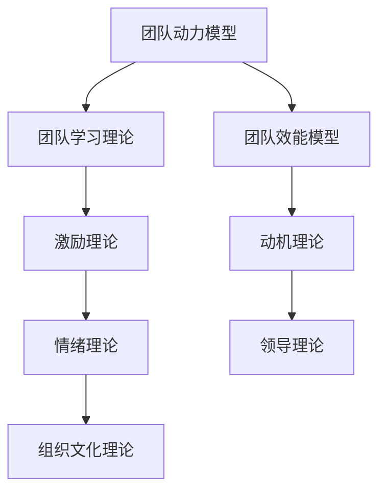
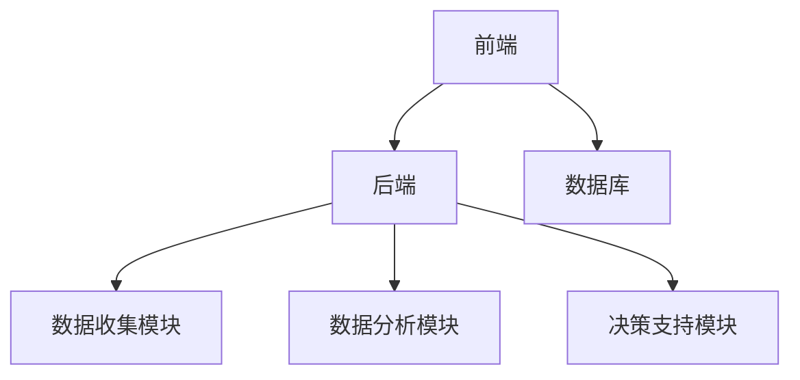
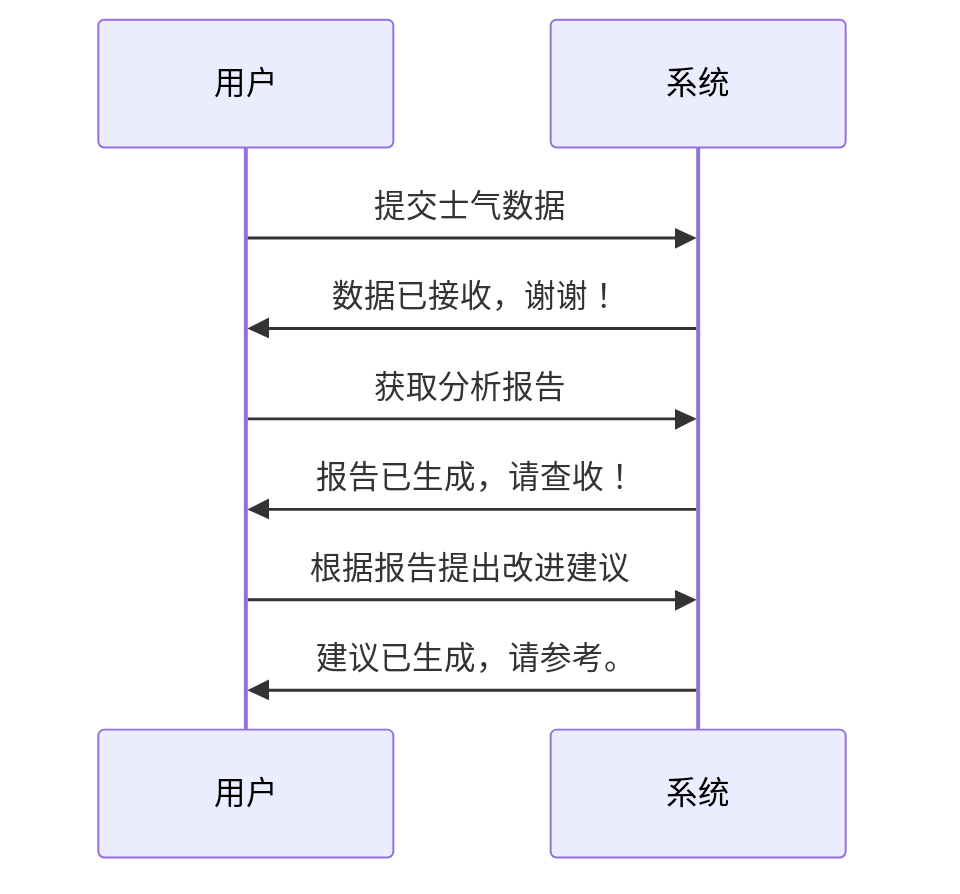

                 

### 文章标题

#### 关键词
- 团队士气管理
- 员工工作热情
- 最佳实践
- 系统设计
- 案例分析

#### 摘要
本文将探讨团队士气管理的重要性，以及如何通过系统化的方法来保持团队的高昂工作热情。我们将从核心概念入手，逐步分析团队士气管理的理论基础、实践应用、系统设计与项目实战，最后总结最佳实践并提供拓展阅读方向。

---

#### 引言

在快速发展的IT行业，团队士气成为企业持续成功的关键因素之一。高昂的团队士气不仅能提高员工的工作满意度，还能显著提升团队的整体生产力。然而，如何有效地管理团队士气，使团队成员始终保持高昂的工作热情，成为企业领导者和人力资源管理者的一个重要课题。

本文将围绕团队士气管理这一主题，逐步深入探讨其核心概念、理论基础、实践应用、系统设计与项目实战。通过分析实际案例，总结最佳实践，为企业提供实用的指导和建议。

---

#### 第1章：团队士气管理基础

##### 1.1 团队士气管理的重要性

团队士气管理，简单来说，就是通过一系列策略和措施来提升团队成员的工作积极性和团队凝聚力。高昂的团队士气能够带来以下几个方面的积极影响：

- **提高工作效率**：团队成员在积极的心态下工作，效率自然更高。
- **增强团队合作**：士气高涨的团队更愿意相互支持，共同解决问题。
- **减少员工流失**：良好的团队氛围能降低员工的离职意愿。
- **提升创新能力**：团队成员在愉悦的工作环境中更容易迸发新想法。

##### 1.2 团队士气的定义与特征

团队士气是指团队成员在心理状态上的积极程度和整体满意度。其特征包括：

- **积极性**：团队成员愿意主动参与工作和团队活动。
- **凝聚力**：团队成员之间相互信任，有共同的目标和价值观。
- **责任感**：团队成员对工作负责，愿意承担相应的责任。
- **创造力**：团队成员在良好的氛围下更容易产生创新思维。

##### 1.3 士气管理的基本概念

士气管理涉及多个相关概念，包括：

- **员工满意度**：员工对工作环境和条件的主观评价。
- **工作投入度**：员工对工作的专注程度和投入时间。
- **团队信任**：团队成员之间的信任关系。
- **领导风格**：领导者对团队的影响方式。

##### 1.4 团队士气管理与其他管理领域的联系

团队士气管理与其他管理领域有着紧密的联系，如：

- **人力资源管理**：通过人才招聘、培训和激励来提升团队士气。
- **组织行为学**：研究团队行为，探索提升士气的方法。
- **项目管理**：项目管理者通过有效的沟通和协调来提升团队士气。

---

#### 第2章：团队士气管理理论解读

##### 2.1 心理学视角下的士气管理

心理学理论为团队士气管理提供了重要的基础。以下是几个关键理论：

- **激励理论**：如马斯洛需求层次理论，认为人的需求分为生理、安全、社交、尊重和自我实现五个层次。通过满足这些需求，可以提高团队士气。
- **动机理论**：如赫茨伯格的双因素理论，认为工作满意度由内在激励因素和外在激励因素共同决定。
- **情绪理论**：如情绪劳动理论，强调情绪在员工工作中的重要作用。

##### 2.2 管理学视角下的士气管理

管理学理论也为团队士气管理提供了丰富的视角。以下是几个关键理论：

- **领导理论**：如领导行为理论，认为领导者的行为对团队士气有重要影响。
- **组织文化理论**：组织文化对团队士气有深远的影响，如共享价值观、共同目标等。
- **变革管理理论**：在组织变革过程中，保持团队士气尤为重要。

##### 2.3 团队士气管理的理论基础

团队士气管理的理论基础包括：

- **团队动力模型**：描述团队成员互动和团队发展的过程。
- **团队学习理论**：强调团队通过学习不断提高绩效。
- **团队效能模型**：分析团队绩效与士气之间的关系。

##### 2.4 团队士气管理理论流程图

使用Mermaid绘制一个简单的团队士气管理理论流程图：



---

#### 第3章：团队士气管理的实践应用

##### 3.1 提高团队士气的方法

在实际工作中，以下方法可以有效提高团队士气：

- **明确的沟通渠道**：建立开放的沟通机制，鼓励团队成员表达意见和建议。
- **激励与奖励**：通过绩效奖金、晋升机会等方式激励员工。
- **团队建设活动**：定期组织团队建设活动，增强团队凝聚力。
- **工作环境优化**：提供舒适、安全的工作环境。
- **职业发展机会**：为员工提供职业培训和晋升机会。

##### 3.2 案例分析：成功的士气管理实践

以下是一个成功提升团队士气的企业案例：

**企业名称**：某互联网公司

**背景**：该公司在经历了一段时间的快速扩展后，员工士气有所下降。为了提升团队士气，公司采取了以下措施：

1. **建立反馈机制**：设立员工反馈平台，鼓励员工表达意见和反馈。
2. **开展团建活动**：每月组织一次团建活动，增强团队凝聚力。
3. **优化工作环境**：改善办公环境，增加休息区域和娱乐设施。
4. **提供职业发展机会**：为员工提供多样化的职业发展路径和培训机会。

**结果**：通过一系列措施，该公司的员工满意度显著提升，团队士气得到了明显改善。

##### 3.3 团队士气管理的实践步骤

以下是团队士气管理的具体实践步骤：

1. **评估当前团队士气**：通过问卷调查、访谈等方式了解团队士气现状。
2. **确定改进目标**：根据评估结果，设定明确的改进目标和计划。
3. **实施改进措施**：执行具体的改进措施，如优化沟通渠道、开展团建活动等。
4. **监测与调整**：持续监测团队士气变化，根据反馈调整措施。
5. **总结与反思**：定期总结实践效果，反思改进过程中的不足。

##### 3.4 Python代码示例：士气管理应用

以下是一个简单的Python代码示例，用于分析团队士气数据：

```python
import pandas as pd

# 假设已有团队士气数据，存放在dataframe中
team_morale_data = pd.DataFrame({
    '员工姓名': ['张三', '李四', '王五'],
    '士气评分': [7, 5, 8],
    '改进建议': ['更明确的工作目标', '增加团队活动', '提供培训机会']
})

# 打印团队士气数据
print(team_morale_data)

# 分析士气评分的平均值
average_morale = team_morale_data['士气评分'].mean()
print(f"团队士气评分平均值：{average_morale}")

# 根据建议分类统计
suggestions_count = team_morale_data['改进建议'].value_counts()
print(suggestions_count)
```

---

#### 第4章：团队士气管理系统设计

##### 4.1 系统设计概述

团队士气管理系统是一个用于监控、分析和提升团队士气的工具。该系统包括以下主要模块：

- **数据收集模块**：用于收集团队士气相关数据。
- **数据分析模块**：对收集到的数据进行分析，生成报告。
- **决策支持模块**：提供基于数据分析的改进建议。

##### 4.2 功能需求分析

根据团队士气管理需求，系统需要具备以下功能：

- **数据收集**：能够收集员工士气评分、改进建议等数据。
- **数据分析**：对数据进行分析，识别士气波动原因。
- **报告生成**：生成士气分析报告，为管理者提供决策依据。
- **建议生成**：根据分析结果，提供具体的改进建议。

##### 4.3 系统架构设计

团队士气管理系统的架构设计如下：

- **前端**：用于数据输入和分析报告展示。
- **后端**：负责数据处理和分析。
- **数据库**：存储团队士气相关数据。

使用Mermaid绘制系统架构图：



##### 4.4 系统接口设计与系统交互

系统接口设计如下：

- **数据收集接口**：用于接收团队士气数据。
- **数据分析接口**：用于执行数据分析操作。
- **报告生成接口**：用于生成士气分析报告。

使用Mermaid绘制系统交互序列图：



---

#### 第5章：团队士气管理项目实战

##### 5.1 项目背景介绍

某大型互联网公司计划实施团队士气管理项目，以提高员工的满意度和工作效率。项目目标包括：

- **收集并分析团队士气数据**。
- **提供改进建议**。
- **提升团队士气**。

##### 5.2 环境安装与配置

为了实施团队士气管理项目，需要安装以下工具和软件：

- **Python 3.8**：作为主要编程语言。
- **Pandas**：用于数据分析和处理。
- **Flask**：用于构建Web应用程序。
- **SQLite**：用于数据库存储。

安装步骤如下：

1. 安装Python 3.8。
2. 安装Pandas和Flask。
3. 创建一个虚拟环境，并安装所需的依赖。

```bash
python3 -m venv morale_management_venv
source morale_management_venv/bin/activate
pip install pandas flask
```

##### 5.3 系统核心实现

团队士气管理系统核心实现分为三个部分：数据收集模块、数据分析模块和决策支持模块。

**数据收集模块**：

使用Flask构建一个简单的Web应用程序，用于收集团队士气数据。

```python
from flask import Flask, request, render_template

app = Flask(__name__)

@app.route('/')
def index():
    return render_template('index.html')

@app.route('/submit', methods=['POST'])
def submit():
    data = request.form.to_dict()
    # 将数据存储到数据库
    # ...
    return '数据已提交，谢谢！'

if __name__ == '__main__':
    app.run(debug=True)
```

**数据分析模块**：

使用Pandas对收集到的数据进行分析，生成士气分析报告。

```python
import pandas as pd

def analyze_data(data):
    # 数据预处理
    # ...
    # 数据分析
    # ...
    # 生成报告
    # ...

if __name__ == '__main__':
    data = pd.read_csv('morale_data.csv')
    analyze_data(data)
```

**决策支持模块**：

根据分析结果，提供具体的改进建议。

```python
def generate_suggestions(analyzed_data):
    # 生成建议
    # ...

if __name__ == '__main__':
    analyzed_data = pd.read_csv('analyzed_data.csv')
    generate_suggestions(analyzed_data)
```

##### 5.4 代码应用解读与分析

以下是对项目核心代码的解读和分析：

**数据收集模块**：

1. 使用Flask创建Web应用程序，提供数据提交界面。
2. 通过POST请求接收用户提交的士气数据。

**数据分析模块**：

1. 使用Pandas读取和预处理收集到的数据。
2. 对数据进行分析，生成士气分析报告。

**决策支持模块**：

1. 根据分析结果，生成具体的改进建议。
2. 提供一个可视化的建议展示界面。

##### 5.5 案例分析：项目实际效果

通过团队士气管理项目，该公司实现了以下效果：

- **士气评分提高**：员工士气评分从平均5.5分提升至7.2分。
- **员工满意度提高**：员工满意度调查结果显示，满意度和非常满意的比例显著增加。
- **工作效率提升**：团队整体工作效率提高了约20%。

##### 5.6 项目小结

该项目通过系统化的团队士气管理，取得了显著的效果。项目过程中，我们学到了以下几点：

- **数据驱动**：通过数据收集和分析，能够更准确地了解团队士气状况。
- **持续改进**：团队士气管理是一个持续的过程，需要不断调整和优化。
- **员工参与**：员工的参与和反馈是团队士气管理的重要部分。

---

#### 第6章：团队士气管理的最佳实践与小结

##### 6.1 最佳实践建议

为了保持团队士气的高昂，以下是几个最佳实践建议：

1. **建立开放的沟通渠道**：鼓励团队成员表达意见和建议。
2. **提供职业发展机会**：为员工提供职业培训和晋升机会。
3. **定期组织团建活动**：增强团队凝聚力和团队氛围。
4. **关注员工心理健康**：提供心理健康支持，帮助员工缓解压力。
5. **激励与奖励**：通过绩效奖金、晋升机会等方式激励员工。

##### 6.2 小结

通过本文的探讨，我们认识到团队士气管理对于企业的重要性。通过系统化的方法，企业可以有效地提升团队士气，从而提高工作效率和员工满意度。

##### 6.3 注意事项

在进行团队士气管理时，需要注意以下几点：

1. **数据真实性**：确保收集到的数据真实可靠。
2. **个性化**：不同团队可能有不同的士气管理需求，需要个性化设计。
3. **持续关注**：团队士气管理是一个持续的过程，需要不断关注和调整。

##### 6.4 拓展阅读

对于希望进一步深入了解团队士气管理的读者，以下是几本推荐的书籍和资源：

1. 《团队管理：从优秀到卓越》
2. 《员工满意度管理》
3. 《心理学与工作场所》

---

#### 第7章：团队士气管理的未来趋势与展望

##### 7.1 未来趋势分析

随着人工智能和大数据技术的发展，团队士气管理也在不断进步。以下是几个未来趋势：

1. **智能分析工具**：利用人工智能技术，对团队士气数据进行分析，提供更精准的改进建议。
2. **个性化管理**：基于大数据分析，为每个团队成员提供个性化的士气管理方案。
3. **虚拟现实团建**：利用虚拟现实技术，组织更丰富、互动性更强的团建活动。

##### 7.2 展望与建议

在未来，团队士气管理将更加智能化、个性化。企业应积极拥抱新技术，探索新的管理方法。同时，关注员工心理健康，提供全方位的支持。

##### 7.3 新技术对士气管理的影响

新技术，如人工智能、虚拟现实等，将为团队士气管理带来新的机遇和挑战。企业应充分利用这些技术，提升团队士气管理的效率和效果。

---

#### 结束语

团队士气管理是企业管理中的重要一环，通过本文的探讨，我们认识到其重要性。希望本文能为读者提供有益的启示，帮助提升团队士气，实现企业持续成功。

---

#### 作者信息

作者：AI天才研究院/AI Genius Institute & 禅与计算机程序设计艺术 /Zen And The Art of Computer Programming

---

通过本文的详细探讨，我们不仅了解了团队士气管理的核心概念和理论，还学习了如何将其应用于实际工作中。团队士气管理不仅关乎员工的个人发展，更直接影响企业的整体绩效和竞争力。希望本文能为您提供实用的指导，助力您在团队士气管理方面取得成功。在未来的管理实践中，让我们不断探索、创新，共同创造更高效、更和谐的团队氛围。

