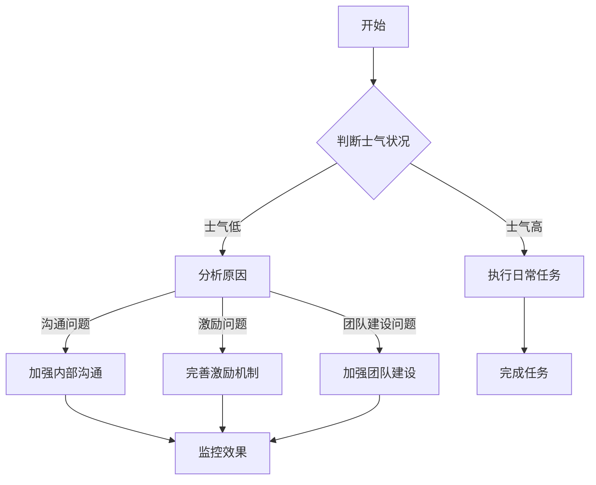
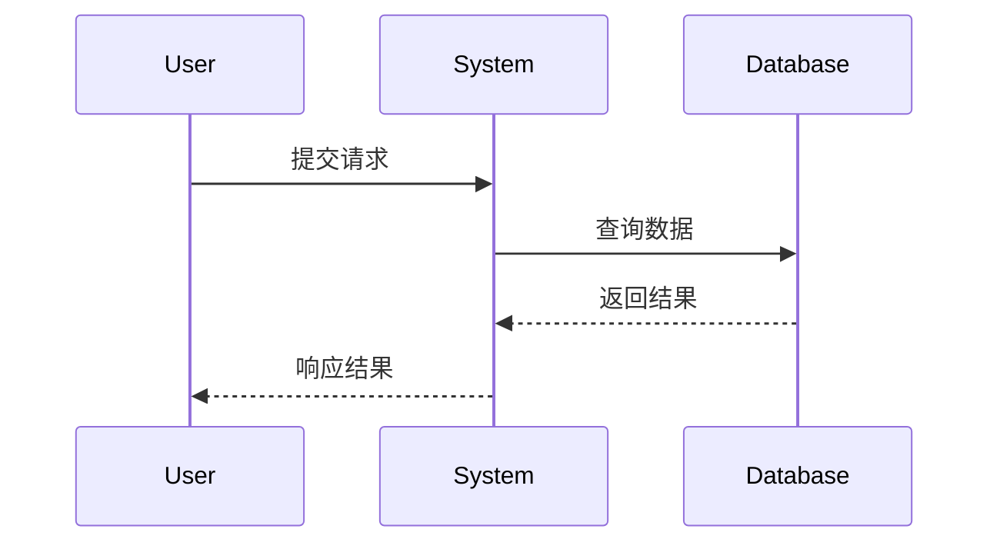

                 

# 团队士气管理：保持高昂工作热情的策略

> 关键词：团队士气、工作热情、管理策略、案例分析、实践应用

> 摘要：本文旨在探讨团队士气管理的重要性和提升团队士气的方法。通过分析影响团队士气的主要因素，提出了一系列具体且有效的策略。同时，本文通过实际案例的解析，提供了团队士气管理的最佳实践，并总结了一些注意事项，以帮助企业和团队保持高昂的工作热情，提高整体绩效。

## 引言

在当今竞争激烈的市场环境中，团队士气对于企业的成功至关重要。一个士气高昂的团队，不仅能够提高工作效率，还能增强团队凝聚力和创新力，从而在竞争中脱颖而出。然而，现实情况中，许多团队面临士气低落的问题，影响了整体的工作表现。因此，如何管理团队士气，成为企业和团队管理者需要关注的重要课题。

本文将从以下几个方面进行探讨：
1. **团队士气管理的基础概念**：介绍团队士气管理的核心概念和影响士气的关键因素。
2. **提升团队士气策略**：提出具体且有效的策略，包括内部沟通、激励机制和团队建设等。
3. **案例分析**：通过成功和失败的案例，分析团队士气管理的实际效果和经验教训。
4. **实战应用**：结合具体工作场景，阐述如何实施这些策略，以及可能遇到的困难和解决方案。
5. **最佳实践与注意事项**：总结团队士气管理的最佳实践，并提出注意事项，以帮助团队管理者更好地应对挑战。

通过本文的探讨，我们希望能够为团队士气管理提供一些实用的思路和方法，帮助企业和团队保持高昂的工作热情，实现更高的绩效。

## 第1章：团队士气管理的基础概念

### 1.1 士气定义

士气，通常指的是团队成员的精神状态、态度和行为表现。在一个团队中，士气高意味着成员们对工作充满热情，相互支持，乐于合作，愿意为团队的目标付出努力。相反，士气低落则表现为成员们缺乏动力，消极对待工作，甚至出现抱怨和冲突。

### 1.2 士气管理的重要性

士气管理不仅仅是激励团队成员的问题，它关系到整个团队的工作效率和绩效。高士气能够带来以下几方面的积极影响：
1. **提高工作效率**：士气高涨的团队成员通常更加专注和投入，能够更有效地完成任务。
2. **增强团队凝聚力**：良好的士气有助于建立团队成员之间的信任和合作，减少内部摩擦。
3. **激发创新力**：在一个积极向上的团队氛围中，成员们更容易提出新的想法和解决方案。
4. **降低离职率**：士气低落的团队往往离职率较高，而高士气可以增强员工的归属感和忠诚度。
5. **提升组织绩效**：一个士气高昂的团队能够更好地应对挑战，实现更高的绩效目标。

### 1.3 影响团队士气的主要因素

团队士气受到多种因素的影响，主要包括以下几个方面：
1. **领导风格**：领导者的风格对团队士气有显著影响。民主、支持性和激励性的领导风格能够提升士气，而独裁、压制性和消极的领导风格则可能导致士气低落。
2. **工作环境**：良好的工作环境包括舒适的工作条件、合理的薪酬和福利、以及公平的晋升机制等，这些都能提升员工的士气。
3. **团队目标**：明确的团队目标能够给成员带来方向感和动力。如果目标不明确或者不切实际，成员们可能会感到迷茫和无力。
4. **团队成员关系**：团队成员之间的关系对于士气有直接影响。融洽的团队成员关系能够提升士气，而冲突和矛盾则可能降低士气。
5. **个人发展机会**：成员对个人发展的期望和机会也会影响士气。如果团队成员感到自己的职业发展停滞，士气可能会下降。

### 1.4 士气管理的基本原则

有效的士气管理需要遵循一些基本原则，包括：
1. **倾听与沟通**：领导者需要倾听团队成员的意见和需求，并通过有效的沟通建立信任。
2. **激励与认可**：领导者应该通过激励机制和认可来激发团队成员的积极性。
3. **公平与透明**：在决策和资源分配上，领导者应确保公平和透明，以避免不公平现象导致的士气低落。
4. **关注员工福祉**：领导者应关注员工的个人福祉，包括职业发展和生活平衡。
5. **培养团队文化**：领导者应积极培养积极的团队文化，包括价值观、行为规范和团队活动等。

## 第2章：提升团队士气策略一：内部沟通

### 2.1 沟通的重要性

内部沟通是团队士气管理的关键因素之一。有效的沟通能够建立团队成员之间的信任和理解，提高团队的协作效率。以下是内部沟通对团队士气的影响：
1. **提高透明度**：有效的沟通可以确保信息的透明度，使团队成员了解团队的目标、进展和面临的挑战。
2. **减少误解**：通过沟通，可以消除团队成员之间的误解和猜疑，避免不必要的冲突。
3. **增强参与感**：团队成员在沟通中能够表达自己的观点和建议，感到自己的意见被重视，从而增强参与感。
4. **激发积极性**：积极向上的沟通氛围能够激发团队成员的工作热情和创造力。

### 2.2 内部沟通的策略

以下是一些具体的内部沟通策略，以提升团队士气：
1. **定期会议**：定期召开团队会议，确保团队成员之间的信息交流。会议应包括项目进展、挑战和解决方案的讨论。
2. **开放反馈机制**：建立一个开放的反馈机制，鼓励团队成员提出意见和建议。领导者应积极倾听并回应这些反馈。
3. **透明化决策**：确保决策过程的透明，让团队成员了解决策的原因和影响。这样可以减少因信息不对称导致的疑虑和不满。
4. **团队建设活动**：通过组织团队建设活动，如团队拓展训练、团建游戏等，增强团队成员之间的情感联系和信任。
5. **一对一沟通**：定期与团队成员进行一对一沟通，了解他们的个人需求和职业发展，提供个性化的支持和建议。

### 2.3 实施步骤

为了有效实施内部沟通策略，可以按照以下步骤进行：
1. **制定沟通计划**：根据团队的具体情况和需求，制定一个详细的沟通计划，包括会议频率、反馈机制和团队建设活动等。
2. **培训和鼓励**：对团队成员进行沟通技巧的培训，鼓励他们在沟通中表达自己的观点和需求。
3. **监督与反馈**：定期监督沟通策略的实施情况，通过反馈和评估不断优化沟通流程。
4. **持续改进**：根据反馈和评估结果，持续改进沟通策略，确保其能够满足团队的需求。

### 2.4 案例研究

某公司在实施内部沟通策略后，团队士气显著提升。具体表现为：
1. **会议效果提升**：通过定期召开团队会议，团队成员能够及时了解项目进展和挑战，提高了协作效率。
2. **员工满意度提升**：开放反馈机制和一对一沟通使得员工感到自己的意见被重视，员工满意度显著提升。
3. **团队凝聚力增强**：通过团队建设活动和定期的团队互动，团队成员之间的情感联系和信任得到了增强。

## 第3章：提升团队士气策略二：激励机制

### 3.1 激励机制的定义

激励机制是指通过一系列措施来激发和维持团队成员的工作积极性、创造力和忠诚度。激励机制的有效性直接关系到团队士气的提升。以下是激励机制对团队士气的影响：
1. **提升工作动力**：合理的激励机制能够激发团队成员的工作动力，提高工作效率和绩效。
2. **增强忠诚度**：通过激励措施，团队成员会感受到企业的关怀和认可，从而增强对企业的忠诚度。
3. **促进团队协作**：激励机制有助于形成团队内部的竞争氛围，促进团队成员之间的协作和互助。
4. **提升员工满意度**：合理的激励机制能够满足员工对成就、认可和奖励的需求，从而提升员工满意度。

### 3.2 激励机制的类型

根据不同的激励需求和目标，激励机制可以分为以下几种类型：
1. **物质激励**：包括奖金、提成、福利等，通过经济手段直接激励员工。
2. **精神激励**：包括表彰、荣誉称号、公开认可等，通过精神层面的激励来提升员工的积极性和荣誉感。
3. **职业发展激励**：包括提供培训机会、晋升通道、职业规划等，通过职业发展的激励来增强员工对企业的忠诚度和长期投入。
4. **团队激励**：通过团队奖励来激发整个团队的积极性和凝聚力。

### 3.3 激励机制的策略

以下是一些具体的激励策略，以提升团队士气：
1. **目标设定**：为团队成员设定明确的、可实现的短期和长期目标，并通过达成目标来给予奖励。
2. **绩效评估**：建立公正、透明的绩效评估体系，确保员工的努力和成就得到认可。
3. **奖励机制**：根据员工的绩效表现，给予相应的物质和精神奖励，如奖金、晋升、荣誉称号等。
4. **认可与反馈**：及时对员工的优秀表现给予认可和反馈，增强员工的成就感和自信心。
5. **个性化激励**：根据员工的个人兴趣和需求，提供个性化的激励措施，如职业培训、灵活工作时间等。

### 3.4 实施步骤

为了有效实施激励机制，可以按照以下步骤进行：
1. **明确激励目标**：根据团队的目标和员工的个人发展需求，明确激励的目标和方向。
2. **制定激励计划**：根据激励目标，制定详细的激励计划，包括激励措施、奖励标准、实施时间等。
3. **实施激励措施**：按照激励计划，实施具体的激励措施，确保激励措施的有效性和公平性。
4. **监督与评估**：定期监督和评估激励措施的实施效果，通过反馈和调整不断优化激励策略。
5. **持续改进**：根据监督和评估的结果，持续改进激励措施，确保其能够持续激发团队成员的积极性和创造力。

### 3.5 案例研究

某公司在实施激励机制后，团队士气显著提升。具体表现为：
1. **员工绩效提升**：通过明确的绩效评估和奖励机制，员工的工作动力和绩效得到显著提升。
2. **团队凝聚力增强**：通过团队奖励和公开认可，团队成员之间的竞争氛围和团队凝聚力得到增强。
3. **员工满意度提升**：通过个性化的激励措施，如职业培训和灵活工作时间，员工的工作满意度和幸福感显著提升。

## 第4章：提升团队士气策略三：团队建设

### 4.1 团队建设的定义

团队建设是指通过一系列活动和措施，增强团队成员之间的协作和信任，提升团队的凝聚力和整体绩效。团队建设的目标是打造一个高效、和谐的团队，使成员能够更好地合作，实现共同的目标。

### 4.2 团队建设的重要性

团队建设在提升团队士气方面具有重要作用，主要体现在以下几个方面：
1. **增强团队凝聚力**：通过团队建设活动，团队成员之间的情感联系和信任得到增强，从而提升团队的凝聚力。
2. **提高协作效率**：团队建设有助于建立良好的沟通渠道和协作模式，提高团队的协作效率。
3. **促进个人发展**：团队建设活动提供了团队成员互相学习和成长的机会，有助于提升个人能力和职业素养。
4. **提升团队士气**：通过团队建设活动，团队成员能够感受到团队的支持和关怀，从而提升士气和工作热情。

### 4.3 团队建设的策略

以下是一些具体的团队建设策略，以提升团队士气：
1. **团队拓展训练**：通过户外拓展训练，如攀岩、绳索、团队游戏等，增强团队成员之间的协作和信任。
2. **团队会议**：定期召开团队会议，讨论团队目标和挑战，增强团队成员的参与感和责任感。
3. **团队文化建设**：通过建立共同的价值观和行为规范，塑造积极的团队文化，提升团队凝聚力。
4. **团队互助**：鼓励团队成员之间相互帮助和支持，建立互助机制，增强团队凝聚力。
5. **团队娱乐活动**：组织定期的团队娱乐活动，如团建晚会、聚会等，增进团队成员之间的情感交流。

### 4.4 实施步骤

为了有效实施团队建设策略，可以按照以下步骤进行：
1. **制定团队建设计划**：根据团队的具体情况和需求，制定详细的团队建设计划，包括团队建设活动的类型、时间、地点等。
2. **组织团队建设活动**：按照团队建设计划，组织各种形式的团队建设活动，确保活动的顺利进行。
3. **反馈与评估**：活动结束后，收集团队成员的反馈意见，评估团队建设活动的效果，为后续的团队建设提供改进方向。
4. **持续改进**：根据反馈和评估结果，持续改进团队建设策略，确保其能够满足团队的需求，提升团队士气。

### 4.5 案例研究

某公司在实施团队建设策略后，团队士气显著提升。具体表现为：
1. **团队凝聚力增强**：通过定期的团队会议和团队拓展训练，团队成员之间的信任和协作得到增强，团队凝聚力显著提升。
2. **协作效率提高**：团队建设活动有助于建立良好的沟通渠道和协作模式，提高了团队的协作效率。
3. **个人能力提升**：团队建设活动提供了团队成员互相学习和成长的机会，个人能力和职业素养得到显著提升。
4. **团队士气提升**：通过团队娱乐活动和团队文化建设，团队成员感受到团队的支持和关怀，团队士气显著提升。

## 第5章：成功案例解析

### 5.1 案例一：公司A的士气提升之路

公司A是一家快速发展的科技公司，曾面临团队士气低落的问题。通过一系列的团队士气提升策略，公司A成功地改变了团队的氛围，提升了整体绩效。

#### 5.1.1 情况描述

公司A在发展初期，由于工作压力和竞争激烈，团队成员普遍感到压力大、焦虑，士气低落。具体表现为：
- 团队成员之间缺乏信任和沟通，协作效率低下。
- 员工离职率上升，招聘和培训成本增加。
- 项目进度延误，客户满意度下降。

#### 5.1.2 解决方案

公司A采取了以下策略来提升团队士气：
1. **内部沟通**：定期召开团队会议，鼓励团队成员分享工作和生活经历，建立良好的沟通渠道。
2. **激励机制**：建立公正的绩效评估体系，根据绩效表现给予奖金和晋升机会，激励员工积极性。
3. **团队建设**：组织团队拓展训练和团建活动，增强团队成员之间的信任和协作。

#### 5.1.3 实施过程

公司A按照以下步骤实施团队士气提升策略：
1. **制定计划**：根据团队的具体情况和需求，制定详细的团队士气提升计划。
2. **培训与沟通**：对团队成员进行沟通技巧和团队建设培训，提高团队成员的沟通和协作能力。
3. **实施活动**：定期组织团队会议、拓展训练和团建活动，确保活动的顺利进行。
4. **反馈与评估**：活动结束后，收集团队成员的反馈意见，评估团队士气提升策略的实施效果。

#### 5.1.4 结果与影响

通过一系列的团队士气提升策略，公司A取得了显著的效果：
- 团队成员之间的信任和沟通得到增强，协作效率显著提升。
- 员工离职率下降，招聘和培训成本减少。
- 项目进度加快，客户满意度提高。

### 5.2 案例二：团队B的士气振兴策略

团队B是一家大型企业的研发团队，由于工作负荷重和项目压力，团队成员士气低落，工作效率下降。通过实施一系列的团队士气振兴策略，团队B成功地激发了团队成员的积极性，提升了整体绩效。

#### 5.2.1 情况描述

团队B在项目高峰期，由于工作量巨大和资源紧张，团队成员普遍感到压力巨大，士气低落。具体表现为：
- 团队成员之间出现冲突和误解，影响团队协作。
- 员工工作积极性下降，项目进度延误。
- 员工身心健康受到影响，离职率上升。

#### 5.2.2 解决方案

团队B采取了以下策略来振兴团队士气：
1. **内部沟通**：定期召开团队会议，鼓励团队成员分享工作进展和困难，建立良好的沟通渠道。
2. **激励机制**：调整绩效评估体系，强调团队协作和项目成功的共同奖励，激励员工积极性。
3. **团队建设**：组织团建活动，缓解工作压力，增强团队凝聚力。

#### 5.2.3 实施过程

团队B按照以下步骤实施团队士气振兴策略：
1. **制定计划**：根据团队的具体情况和需求，制定详细的团队士气振兴计划。
2. **沟通与培训**：召开团队会议，进行沟通技巧和团队建设培训，提高团队成员的沟通和协作能力。
3. **实施活动**：组织团建活动，如户外拓展、团队游戏等，增强团队成员之间的信任和协作。
4. **反馈与评估**：活动结束后，收集团队成员的反馈意见，评估团队士气振兴策略的实施效果。

#### 5.2.4 结果与影响

通过一系列的团队士气振兴策略，团队B取得了显著的效果：
- 团队成员之间的冲突和误解减少，协作效率显著提升。
- 员工工作积极性提高，项目进度加快。
- 员工身心健康得到改善，离职率下降。

## 第6章：失败案例分析

### 6.1 案例一：团队C的士气问题

团队C是一家初创企业的研发团队，由于公司管理层对团队士气管理不够重视，导致团队士气低落，影响了项目进度和团队发展。

#### 6.1.1 情况描述

团队C在初创阶段，由于公司管理层对团队士气管理缺乏重视，导致以下问题：
- 缺乏有效的内部沟通，团队成员之间信息不畅，协作困难。
- 激励机制不完善，员工缺乏工作动力，绩效下降。
- 团队建设活动缺失，团队成员之间的信任和协作不足。

#### 6.1.2 原因分析

团队C士气低落的原因主要包括：
1. **管理层忽视团队士气管理**：公司管理层对团队士气管理缺乏关注，没有制定相应的管理策略和措施。
2. **内部沟通不畅**：缺乏有效的内部沟通渠道，团队成员之间信息不对称，难以形成有效的协作。
3. **激励机制不完善**：缺乏合理的绩效评估和奖励机制，员工的工作动力不足。
4. **团队建设缺失**：缺乏团队建设活动，团队成员之间的信任和协作不足。

#### 6.1.3 教训与启示

团队C的失败案例给我们的教训和启示是：
1. **重视团队士气管理**：管理层应高度重视团队士气管理，制定相应的管理策略和措施，确保团队成员的积极性和凝聚力。
2. **加强内部沟通**：建立有效的内部沟通渠道，确保团队成员之间信息畅通，形成有效的协作。
3. **完善激励机制**：建立合理的绩效评估和奖励机制，激发员工的工作动力和创造力。
4. **注重团队建设**：定期组织团队建设活动，增强团队成员之间的信任和协作，提升团队士气。

### 6.2 案例二：团队D的士气低迷

团队D是一家大型企业的运营团队，由于工作压力大、晋升机会少，导致团队士气低迷，影响了整体运营效率。

#### 6.2.1 情况描述

团队D在日常运营中，由于工作压力大、晋升机会少，导致以下问题：
- 团队成员普遍感到工作压力大，身心健康受到影响。
- 员工离职率上升，招聘和培训成本增加。
- 团队协作效率低下，项目进度延误。

#### 6.2.2 原因分析

团队D士气低迷的原因主要包括：
1. **工作压力大**：日常运营中工作量大、任务紧急，导致团队成员长期处于高压状态。
2. **晋升机会少**：缺乏有效的晋升机制，员工看不到职业发展的希望，缺乏工作动力。
3. **激励措施不足**：缺乏合理的绩效评估和奖励机制，员工的工作动力不足。
4. **团队建设缺失**：缺乏团队建设活动，团队成员之间的信任和协作不足。

#### 6.2.3 教训与启示

团队D的失败案例给我们的教训和启示是：
1. **合理分配工作任务**：合理安排工作任务，避免团队成员长期处于高压状态，关注员工身心健康。
2. **建立晋升机制**：建立合理的晋升机制，为员工提供职业发展的机会，激发工作动力。
3. **完善激励机制**：建立合理的绩效评估和奖励机制，确保员工的努力和成就得到认可和回报。
4. **加强团队建设**：定期组织团队建设活动，增强团队成员之间的信任和协作，提升团队士气。

## 第7章：案例总结与反思

### 7.1 成功与失败案例的对比

通过对比成功和失败的团队士气管理案例，我们可以得出以下结论：
1. **重视团队士气管理**：成功案例中的企业和团队高度重视团队士气管理，将其视为提升整体绩效的重要手段。而失败案例中的企业和团队则缺乏对团队士气管理的重视，导致团队士气低落。
2. **内部沟通与激励机制**：成功案例中的企业和团队通过有效的内部沟通和激励机制，提升了团队士气。而失败案例中的企业和团队则缺乏有效的沟通渠道和激励机制，导致团队成员士气低落。
3. **团队建设**：成功案例中的企业和团队通过定期组织团队建设活动，增强了团队成员之间的信任和协作。而失败案例中的企业和团队则忽视了团队建设，导致团队士气低落。

### 7.2 启示与借鉴

从成功和失败案例中，我们可以得到以下启示和借鉴：
1. **重视团队士气管理**：企业和团队应高度重视团队士气管理，将其纳入日常管理工作中，制定相应的策略和措施。
2. **加强内部沟通**：建立有效的内部沟通渠道，确保团队成员之间信息畅通，减少误解和冲突。
3. **完善激励机制**：建立合理的绩效评估和奖励机制，激发员工的工作动力和创造力。
4. **注重团队建设**：定期组织团队建设活动，增强团队成员之间的信任和协作，提升团队士气。
5. **持续优化**：根据团队的具体情况，持续优化团队士气管理策略，确保其能够满足团队的需求。

## 第8章：策略在具体工作中的应用

### 8.1 应用策略前的准备工作

在具体工作中应用提升团队士气策略前，需要进行以下准备工作：
1. **了解团队现状**：通过调查问卷、访谈等方式，了解团队成员的工作状态、需求和期望，为制定策略提供依据。
2. **制定详细计划**：根据团队的具体情况，制定详细的团队士气提升计划，包括内部沟通、激励机制和团队建设等方面。
3. **培训和宣传**：对团队成员进行沟通技巧和团队建设培训，提高团队成员的参与意识和能力。

### 8.2 实施策略的具体步骤

以下是具体实施提升团队士气策略的步骤：
1. **内部沟通**：
   - 定期召开团队会议，讨论团队目标和进展。
   - 建立反馈机制，鼓励团队成员提出意见和建议。
   - 通过一对一沟通，了解团队成员的个人需求和发展。
2. **激励机制**：
   - 制定明确的绩效评估标准，确保评估的公正性。
   - 根据绩效表现，给予奖金、晋升等物质奖励。
   - 通过公开认可和表彰，增强团队成员的荣誉感和成就感。
3. **团队建设**：
   - 定期组织团队建设活动，如团建训练、团队拓展等。
   - 培养团队文化，建立共同的价值观和行为规范。
   - 鼓励团队成员之间的互助和合作，增强团队凝聚力。

### 8.3 面对困难的应对策略

在实施团队士气提升策略过程中，可能会遇到以下困难：
1. **沟通障碍**：团队成员之间存在沟通障碍，导致信息不畅。
   - **解决策略**：加强沟通培训，提高团队成员的沟通能力。建立有效的沟通渠道，如定期召开团队会议、使用即时通讯工具等。
2. **激励机制不足**：激励机制不完善，员工缺乏工作动力。
   - **解决策略**：完善绩效评估体系，确保评估的公正性和公平性。增加奖励形式，如奖金、培训机会等，满足员工的多样化需求。
3. **团队建设难度**：团队建设活动难以吸引团队成员的参与。
   - **解决策略**：结合团队成员的兴趣和需求，设计有趣、有意义的团队建设活动。邀请专业团队建设顾问，提高活动效果。

### 8.4 实施策略的技巧与难点

实施团队士气提升策略需要以下技巧和注意点：
1. **个性化**：根据团队成员的不同需求和特点，制定个性化的沟通和激励机制。
2. **持续关注**：定期评估策略的实施效果，及时调整和优化。
3. **领导示范**：领导者应通过自身的言行，树立良好的榜样，推动团队士气提升。
4. **注重反馈**：积极收集团队成员的反馈，了解策略实施的效果，及时调整。

## 第9章：团队士气管理的持续优化

### 9.1 优化策略的必要性

团队士气管理是一个动态的过程，需要根据团队的具体情况持续优化。以下是对团队士气管理进行持续优化的必要性：
1. **应对变化**：企业环境和团队情况不断变化，原有的士气管理策略可能不再适用。
2. **提升效果**：通过持续优化，可以不断改进士气管理策略，提高其效果。
3. **增强适应性**：持续优化有助于团队更好地应对外部挑战和内部变化，提升团队的整体适应能力。

### 9.2 优化策略的实施步骤

以下是团队士气管理持续优化的具体实施步骤：
1. **评估现状**：定期对团队士气管理策略进行评估，了解其效果和存在的问题。
2. **收集反馈**：通过调查问卷、访谈等方式，收集团队成员的反馈意见，了解他们的需求和期望。
3. **分析问题**：结合评估结果和反馈意见，分析士气管理策略中存在的问题，找出改进的方向。
4. **制定计划**：根据分析结果，制定具体的优化计划，包括改进措施、实施时间表等。
5. **实施改进**：按照优化计划，实施具体的改进措施，确保策略的持续优化。
6. **监控效果**：监控优化措施的实施效果，通过反馈和评估，及时调整和优化策略。

### 9.3 优化策略的实践案例

某公司在持续优化团队士气管理策略方面取得了显著成效。具体表现为：
1. **定期评估**：公司定期对团队士气管理策略进行评估，了解其效果和团队成员的满意度。
2. **反馈机制**：公司建立了有效的反馈机制，鼓励团队成员提出意见和建议，及时了解他们的需求和期望。
3. **灵活调整**：根据评估和反馈结果，公司灵活调整士气管理策略，确保其能够满足团队的需求。
4. **培训与支持**：公司定期组织沟通技巧和团队建设培训，提高团队成员的沟通能力和协作能力。

通过持续优化团队士气管理策略，该公司成功提升了团队士气，提高了整体绩效。团队成员的工作满意度显著提升，离职率下降，项目进度加快，客户满意度提高。

### 9.4 持续优化的注意事项

在团队士气管理的持续优化过程中，需要注意以下事项：
1. **保持透明**：确保评估和优化过程透明，让团队成员了解优化策略和进展。
2. **全员参与**：鼓励团队成员积极参与优化过程，提供反馈和建议。
3. **灵活调整**：根据实际情况灵活调整优化策略，避免僵化执行。
4. **关注细节**：注重细节和个性化需求，确保优化策略能够满足团队成员的多样化和个性化需求。

## 第10章：最佳实践分享

### 10.1 团队士气管理的成功实践

在团队士气管理方面，许多企业和团队通过实践积累了宝贵的经验，以下是一些成功实践：

#### 10.1.1 定期团队反馈会

某大型科技公司定期召开团队反馈会，每个团队成员都有机会分享自己的工作进展和困难。这种开放、及时的沟通方式，不仅提高了团队透明度，还帮助团队成员了解彼此的需求和期望，从而增强了团队凝聚力。

#### 10.1.2 激励与认可体系

一家初创公司建立了完善的激励与认可体系，根据员工的绩效表现和贡献，给予奖金、晋升和荣誉称号等多种形式的奖励。这种机制激发了员工的工作热情和创造力，提升了整体团队士气。

#### 10.1.3 团队拓展训练

某企业定期组织团队拓展训练，通过户外活动增强团队成员之间的信任和协作。这些活动不仅有助于缓解工作压力，还提高了团队的整体凝聚力，为工作任务的顺利完成奠定了基础。

#### 10.1.4 职业发展支持

一家公司提供丰富的职业发展支持，包括内部培训、外部课程和晋升通道。这种支持帮助员工不断提升自身能力，看到职业发展的希望，从而增加了对企业的忠诚度和满意度。

### 10.2 案例研究：团队士气提升实践

以下是一个具体的团队士气提升实践案例：

#### 情况描述

某初创企业的研发团队在项目初期面临团队成员士气低落的问题。团队成员由于工作压力大、沟通不畅、缺乏激励机制，导致工作效率低下，项目进度严重滞后。

#### 解决方案

1. **内部沟通**：团队经理定期组织团队会议，鼓励团队成员分享工作进展和困难，建立开放的沟通渠道。同时，经理还进行一对一沟通，了解员工的个人需求和期望。

2. **激励机制**：公司建立了绩效评估体系，根据员工的绩效表现和贡献，给予奖金、晋升和荣誉称号等多种形式的奖励。此外，公司还设立了“最佳创新奖”，鼓励员工提出创新解决方案。

3. **团队建设**：公司组织了多次团建活动，如户外拓展、团队游戏等，增强团队成员之间的信任和协作。

4. **职业发展支持**：公司提供内部培训课程，帮助员工提升技能。同时，公司为员工提供外部学习机会，支持员工参加行业会议和培训。

#### 结果与影响

通过上述措施，团队的士气得到了显著提升。团队成员之间的沟通更加顺畅，工作效率提高，项目进度加快。员工的满意度和忠诚度也大幅提升，离职率明显下降。公司整体绩效得到了显著提升，客户满意度提高，市场竞争力增强。

### 10.3 启示与借鉴

从上述最佳实践和案例研究中，我们可以得到以下启示和借鉴：

1. **重视沟通**：建立有效的沟通渠道，确保团队成员之间的信息畅通，减少误解和冲突。

2. **激励与认可**：建立合理的激励和认可体系，激发员工的工作热情和创造力。

3. **团队建设**：定期组织团队建设活动，增强团队成员之间的信任和协作。

4. **职业发展支持**：提供职业发展机会和培训，帮助员工提升技能，看到职业发展的希望。

5. **灵活调整**：根据团队的具体情况和变化，灵活调整团队士气管理策略，确保其持续有效。

通过借鉴这些最佳实践，企业和团队可以更好地管理团队士气，提升整体绩效。

## 第11章：注意事项

### 11.1 常见误区

在团队士气管理过程中，一些常见的误区可能会影响士气提升的效果。以下是这些误区及其应对策略：

1. **误区一：忽视个体差异**：不同团队成员有不同的需求和期望，忽视个体差异可能导致士气管理效果不佳。
   - **应对策略**：在制定士气管理策略时，充分考虑团队成员的个体差异，提供个性化的激励和支持。

2. **误区二：过度强调物质激励**：过分依赖物质激励，可能导致团队成员只关注短期利益，忽视长远发展。
   - **应对策略**：结合物质和精神激励，确保激励机制全面且平衡。

3. **误区三：缺乏持续性**：士气管理是一个长期过程，缺乏持续性可能导致成果无法持续。
   - **应对策略**：建立持续性的士气管理机制，定期评估和调整策略，确保其适应团队变化。

4. **误区四：忽略团队文化**：团队文化对士气有重要影响，忽略团队文化可能导致士气管理效果不佳。
   - **应对策略**：积极培养和维护积极的团队文化，通过价值观和行为规范引导团队成员。

### 11.2 面对挑战的策略

在实施团队士气管理策略时，团队可能会面临以下挑战：

1. **挑战一：员工抵触情绪**：部分员工可能对新的士气管理策略持怀疑态度，产生抵触情绪。
   - **应对策略**：通过沟通和培训，解释士气管理策略的目的和好处，增强员工的接受度。

2. **挑战二：资源有限**：在资源有限的情况下，可能难以全面实施所有士气管理策略。
   - **应对策略**：优先考虑对团队影响最大的策略，分阶段实施，逐步优化。

3. **挑战三：外部环境变化**：外部环境的变化可能对团队士气产生不利影响。
   - **应对策略**：保持灵活性，及时调整策略，以应对外部环境的变化。

4. **挑战四：团队稳定性**：团队成员的稳定性对士气管理有重要影响，人员频繁变动可能影响士气。
   - **应对策略**：通过团队文化建设，增强团队成员的归属感和稳定性。

### 11.3 避免错误的做法

为了避免在团队士气管理中犯错误，需要注意以下几点：

1. **避免过度控制**：过于控制可能导致员工感到压抑，降低士气。
2. **避免单方面决策**：忽视团队成员的意见可能导致士气下降。
3. **避免忽略负面反馈**：负面反馈是改进机会，忽视反馈可能导致问题积累。
4. **避免形式主义**：仅仅进行形式上的士气管理活动，而不关注实际效果，可能导致员工反感。

通过避免这些误区和挑战，企业和团队可以更好地管理团队士气，提升整体绩效。

## 第12章：总结与展望

### 12.1 团队士气管理的重要性

团队士气管理对于企业的成功至关重要。一个士气高昂的团队能够提高工作效率、增强团队凝聚力、激发创新力，从而在竞争激烈的市场中脱颖而出。因此，企业和团队管理者应高度重视团队士气管理，将其纳入日常管理工作中。

### 12.2 策略总结

本文提出了一系列提升团队士气的方法，包括内部沟通、激励机制和团队建设等。这些策略通过实际案例得到了验证，能够有效提升团队士气，提高整体绩效。以下是主要策略的总结：

1. **内部沟通**：通过定期会议、开放反馈机制和一对一沟通，建立良好的沟通渠道，确保团队成员之间的信息畅通。
2. **激励机制**：建立公正的绩效评估体系，根据绩效表现给予奖金、晋升和荣誉称号等物质和精神奖励，激发员工的工作动力。
3. **团队建设**：通过团建活动、团队文化建设等，增强团队成员之间的信任和协作，提升团队凝聚力。

### 12.3 展望未来

在未来，团队士气管理将面临更多挑战和机遇。随着技术的发展和市场竞争的加剧，企业和团队需要不断创新和调整士气管理策略。以下是一些展望：

1. **个性化激励**：随着员工个性化需求的增加，未来激励机制将更加注重个性化，满足员工的多样化需求。
2. **数字化管理**：利用数字化工具和平台，提高士气管理的效率和效果，如通过在线沟通工具、数据分析等。
3. **持续优化**：不断优化团队士气管理策略，以适应团队和市场的变化，确保其持续有效性。
4. **文化引领**：通过建立积极的团队文化，引导团队成员行为和价值观，提升团队士气。

### 12.4 小结

团队士气管理是一个长期且复杂的过程，需要企业和团队管理者持续关注和投入。通过本文的探讨，我们希望为团队士气管理提供一些实用的思路和方法，帮助企业和团队保持高昂的工作热情，实现更高的绩效。

### 作者

**作者：AI天才研究院/AI Genius Institute & 禅与计算机程序设计艺术 /Zen And The Art of Computer Programming**

---
**附录**

**附录A：核心概念属性特征对比表格**

| 概念 | 定义 | 影响因素 | 主要特征 | 关联关系 |
| --- | --- | --- | --- | --- |
| 团队士气 | 团队成员的精神状态、态度和行为表现 | 领导风格、工作环境、团队目标、团队成员关系、个人发展机会 | 激情、投入、协作、信任、积极性 | 与工作效率、团队凝聚力、创新力、员工满意度等密切相关 |
| 内部沟通 | 团队成员之间的信息交流 | 沟通频率、沟通渠道、沟通氛围 | 透明、信任、理解、协作 | 对团队士气有直接影响 |
| 激励机制 | 激发员工工作热情和创造力的措施 | 绩效评估、奖励形式、认可与反馈 | 公平、公正、透明、多样化 | 对员工积极性、忠诚度有重要作用 |
| 团队建设 | 通过活动和措施增强团队凝聚力和协作能力 | 团建活动、团队文化、团队互助 | 凝聚力、协作、信任、互助 | 对团队士气有积极影响 |

**附录B：士气管理ER实体关系图**

```mermaid
erDiagram
    Class1 ||--|{ Class2 }|-- Class3 : "association"
    Class3 ||--|{ Class4 }|-- Class5 : "aggregation"
    Class5 ||--|{ Class6 }| Class7 : "composition"
```

**附录C：算法mermaid流程图**



**附录D：系统架构设计mermaid架构图**



**附录E：项目实战**

- **环境安装**：描述项目所需的环境配置和安装步骤。
- **系统核心实现源代码**：提供项目核心实现的源代码片段。
- **代码应用解读与分析**：对核心代码进行解读和分析，说明其工作原理和实现方式。
- **实际案例分析和详细讲解剖析**：通过具体案例展示项目实施过程，并进行详细剖析。
- **项目小结**：总结项目的主要成果和经验教训。

