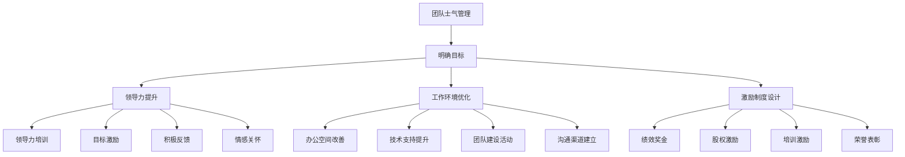

                 

## 团队士气管理：维持高昂工作热情

**关键词：团队士气，管理策略，工作热情，领导力，沟通，激励制度**

**摘要：**
本文旨在探讨团队士气管理这一关键领域，解析如何通过系统化的策略维持团队高昂的工作热情。我们将逐步分析团队士气的重要性、核心概念、提升方法以及实际案例分析，为读者提供实用的指导和建议。

### 第1章：问题背景与团队士气的重要性

**1.1 问题背景**

在现代企业中，团队士气直接关系到组织的绩效和员工的工作满意度。随着市场竞争的加剧和员工需求的多元化，提升团队士气已成为企业管理的重要课题。然而，如何有效地管理团队士气，确保团队成员始终保持高昂的工作热情，仍是一个具有挑战性的问题。

**1.2 问题描述**

团队士气低落可能表现为员工积极性不足、工作效率低下、团队协作不力等现象。这些问题不仅影响个人绩效，还可能对整个团队的凝聚力和工作效率产生负面影响。因此，解决团队士气问题，提升员工工作热情，已成为企业管理者亟需关注和解决的关键问题。

**1.3 团队士气的定义与边界**

团队士气是指团队成员在心理上、情感上和行为上对团队及其任务的积极态度和参与度。它包括以下几个方面：

- **心理状态：** 成员对团队目标的认同感和归属感。
- **情感状态：** 成员在工作中的满足感和幸福感。
- **行为状态：** 成员在工作中的主动性、创造性和团队合作精神。

团队士气的边界在于团队成员的个体差异、工作环境、领导风格和组织文化等因素。这些因素共同作用，决定了团队士气的高低。

**1.4 团队士气的影响因素**

影响团队士气的主要因素包括：

- **领导力：** 领导者的领导风格、决策能力和激励方式直接影响团队成员的工作动力和士气。
- **工作环境：** 工作条件、工作氛围、资源支持等对团队成员的工作满意度有重要影响。
- **激励机制：** 合理的薪酬、福利和晋升机会能激发员工的工作热情和积极性。
- **团队沟通：** 团队内部的沟通质量和协作能力直接影响团队士气和工作效率。
- **个人发展：** 员工的职业生涯规划、培训机会和成长空间对团队士气有重要影响。

### 第2章：团队士气管理的核心概念

**2.1 核心概念**

团队士气管理是指通过系统化的方法，激发和维持团队成员的工作热情和积极性，提高团队的整体绩效和凝聚力。它包括以下几个方面：

- **目标设定：** 明确团队的目标和任务，确保团队成员对目标有清晰的认识和认同。
- **领导力培养：** 提升领导者的领导能力和管理水平，激发团队成员的积极性和创造力。
- **激励机制设计：** 建立合理的激励机制，满足员工的需求，激发工作热情。
- **沟通协作：** 加强团队内部的沟通和协作，提高团队效率和士气。
- **团队建设：** 通过团队建设活动，增强团队成员的凝聚力和归属感。

**2.2 团队士气属性特征对比表格**

| 特征        | 描述                                                         | 对比分析                                                     |
| ----------- | ------------------------------------------------------------ | ------------------------------------------------------------ |
| **心理状态** | 成员对团队目标的认同感和归属感                             | 低士气：目标不清晰、缺乏认同感<br>高士气：目标明确、高度认同   |
| **情感状态** | 成员在工作中的满足感和幸福感                                 | 低士气：工作压力、不满情绪<br>高士气：工作满足、幸福感强烈     |
| **行为状态** | 成员在工作中的主动性、创造性和团队合作精神                   | 低士气：消极应付、缺乏创新<br>高士气：积极主动、高度协作       |

**2.3 团队士气管理的ER模型**

团队士气管理的ER（Entity-Relationship）模型用于描述团队士气管理中的关键实体及其关系。以下是一个简化的ER模型：

```mermaid
erDiagram
  Customer ||--|{ Order : places }  
  "Product" ||--|{ Order : contains }  
  Customer }|--|{ Payment : makes }  
  "Product" }|--|{ Stock : maintains }  
```

在此ER模型中，关键实体包括团队成员（Customer）、工作环境（Product）、领导力（Payment）、激励机制（Stock）。它们之间的关系反映了团队士气管理中的关键要素及其相互影响。

### 第3章：领导力与团队士气

**3.1 领导者的角色**

领导者在团队士气管理中扮演着关键角色。他们不仅需要具备决策能力和管理技巧，还要关注团队成员的心理状态和情感需求。以下是领导者应承担的几个重要角色：

- **激励者：** 通过激励策略激发团队成员的积极性和创造力。
- **沟通者：** 保持与团队成员的沟通，了解他们的需求和期望，提供必要的支持。
- **榜样：** 以身作则，树立良好的工作态度和行为，影响团队成员。
- **协调者：** 调解团队内部冲突，确保团队协作顺畅。

**3.2 激励策略**

有效的激励策略是提升团队士气的重要手段。以下是一些常用的激励策略：

- **目标激励：** 设定明确的、可实现的团队目标，激发成员的工作动力。
- **奖励激励：** 提供物质和精神奖励，如奖金、晋升、荣誉等，激励成员的努力。
- **情感激励：** 关注团队成员的情感需求，提供关怀和支持，增强团队凝聚力。
- **自我激励：** 培养成员的自我管理能力和自我激励能力，提升工作满意度。

**3.3 领导力评估**

为了确保领导力策略的有效性，领导者需要定期进行自我评估和反馈。以下是一些评估领导力的关键指标：

- **团队成员满意度：** 通过调查和反馈了解团队成员对领导者的满意度。
- **团队绩效：** 分析团队的整体绩效和成员的个人绩效，评估领导力对团队士气的影响。
- **领导力发展：** 检查领导者是否具备持续学习和提升领导能力的机会。

### 第4章：团队沟通与士气

**4.1 沟通的重要性**

有效的沟通是团队士气管理的重要组成部分。良好的沟通能够提高团队协作效率，增强团队凝聚力，提升士气。以下是一些沟通的重要性方面：

- **信息传递：** 沟通是信息传递的重要渠道，确保团队成员了解任务目标和要求。
- **协调合作：** 沟通有助于团队成员相互理解和支持，提高协作效果。
- **问题解决：** 沟通是解决团队内部问题和冲突的重要手段，有助于维护团队和谐。
- **士气提升：** 良好的沟通能够增进团队成员之间的信任和理解，提升士气。

**4.2 有效沟通技巧**

为了实现有效的沟通，领导者需要掌握以下技巧：

- **倾听：** 充分倾听团队成员的意见和需求，尊重他们的观点。
- **清晰表达：** 用简单明了的语言表达思想，避免歧义和误解。
- **积极反馈：** 及时给予团队成员积极的反馈，鼓励他们的努力。
- **适度表达：** 避免过度表达个人情绪，保持客观和公正。
- **情感关怀：** 关注团队成员的情感需求，提供必要的支持和帮助。

**4.3 团队沟通障碍与解决策略**

团队沟通中可能存在的障碍包括：

- **语言障碍：** 成员之间语言表达不一致，导致沟通困难。
- **文化差异：** 不同文化背景的成员可能对同一信息的理解存在差异。
- **信息过载：** 成员接收到的信息过多，导致无法有效处理。
- **权力距离：** 权力结构不明确，导致沟通不畅。

解决策略包括：

- **语言培训：** 提供语言培训，提高成员的语言沟通能力。
- **文化教育：** 加强文化教育，增进成员对文化差异的理解和尊重。
- **信息过滤：** 建立有效的信息过滤机制，确保信息的准确传递。
- **权力分配：** 明确权力分配，确保沟通渠道的畅通。

### 第5章：工作环境与士气

**5.1 工作环境对士气的影响**

工作环境对团队士气有重要影响。一个良好的工作环境能够提高员工的舒适度和满意度，从而提升士气。以下是一些影响工作环境的关键因素：

- **物理环境：** 办公室的布局、光线、通风、噪音等对员工的工作环境和情绪有直接影响。
- **技术支持：** 先进的技术设备和工具能够提高工作效率，减少工作压力。
- **团队氛围：** 团队的氛围和氛围对员工的工作情绪和士气有重要影响。
- **工作流程：** 简化冗余的工作流程，提高工作效率，减少不必要的压力。

**5.2 创造积极的工作氛围**

为了创造积极的工作氛围，组织需要采取以下措施：

- **鼓励创新：** 鼓励员工提出新的想法和建议，激发创新精神。
- **团队建设：** 定期组织团队建设活动，增强团队成员的凝聚力和归属感。
- **沟通渠道：** 建立畅通的沟通渠道，确保员工能够及时反馈问题和建议。
- **奖励机制：** 建立合理的奖励机制，激发员工的积极性和创造力。

**5.3 工作环境优化策略**

以下是一些优化工作环境的策略：

- **布局优化：** 重新规划办公布局，提高员工的工作舒适度。
- **环境改善：** 改善办公环境，如增加绿植、调整灯光等，提升工作氛围。
- **技术升级：** 引入先进的技术设备，提高工作效率和工作体验。
- **员工参与：** 鼓励员工参与工作环境的改进，提高员工的满意度和参与感。

### 第6章：激励制度与团队士气

**6.1 激励制度的类型**

激励制度是提升团队士气的重要手段。根据不同的激励目标和方式，激励制度可以分为以下几种类型：

- **物质激励：** 提供薪酬、奖金、福利等物质奖励，满足员工的物质需求。
- **精神激励：** 提供荣誉、表彰、晋升等精神奖励，满足员工的精神需求。
- **目标激励：** 设定明确的、可实现的团队和个体目标，激发员工的工作动力。
- **参与激励：** 鼓励员工参与决策和项目开发，提高工作满意度和归属感。

**6.2 激励制度的制定与执行**

制定和执行有效的激励制度需要遵循以下原则：

- **公平合理：** 确保激励制度的公平性和合理性，避免不公平现象。
- **明确目标：** 设定明确的激励目标，确保激励制度能够有效激发员工的积极性。
- **持续改进：** 定期评估激励制度的执行效果，根据实际情况进行调整和改进。
- **激励多样性：** 结合不同的激励类型，满足员工的多样化需求。

**6.3 常见激励制度案例**

以下是一些常见的激励制度案例：

- **绩效奖金：** 根据员工的绩效评估结果发放奖金，激励员工提高工作绩效。
- **股权激励：** 向关键员工发放公司股权，提高员工对公司的归属感和责任感。
- **培训激励：** 提供员工培训和职业发展机会，激励员工提升个人能力和职业素养。
- **荣誉表彰：** 定期举行表彰活动，对优秀员工进行表彰和奖励，提高员工的工作积极性。

### 第7章：团队建设与士气

**7.1 团队建设的重要性**

团队建设是提升团队士气的重要途径。通过团队建设，可以增强团队成员之间的信任和合作，提高团队的整体绩效和凝聚力。以下是一些团队建设的重要性方面：

- **增强团队凝聚力：** 团队建设活动有助于增强团队成员之间的情感联系，提高团队凝聚力。
- **提升团队协作能力：** 团队建设活动可以培养团队成员的协作能力和解决问题的能力。
- **增强团队适应力：** 通过团队建设，可以提高团队的适应力，应对变化和挑战。
- **提高团队士气：** 成员之间的良好关系和信任感能够提升团队士气和工作满意度。

**7.2 团队建设活动设计**

设计有效的团队建设活动需要考虑以下因素：

- **活动目标：** 明确团队建设活动的目标，确保活动能够达到预期效果。
- **活动形式：** 根据团队特点和需求，选择合适的团队建设活动形式，如户外拓展、团队游戏、团队讨论等。
- **活动安排：** 合理安排活动时间和地点，确保团队成员能够积极参与。
- **活动反馈：** 活动结束后，收集团队成员的反馈意见，不断改进团队建设活动。

**7.3 团队建设成效评估**

评估团队建设活动的成效需要从以下几个方面进行：

- **团队绩效：** 分析团队建设活动前后团队绩效的变化，评估活动对团队绩效的影响。
- **团队氛围：** 通过调查和观察了解团队建设活动对团队氛围的影响，评估活动的效果。
- **员工满意度：** 收集员工对团队建设活动的满意度和认可程度，评估活动对员工工作满意度的提升。
- **团队凝聚力：** 分析团队建设活动对团队凝聚力的提升程度，评估活动的有效性。

### 第8章：成功案例分享

**8.1 案例一：如何通过领导力提升团队士气**

**案例背景：** 
某科技公司最近经历了一段时间的业绩下滑，管理层意识到团队士气低落是关键原因之一。为了提升团队士气，公司决定从领导力入手，实施一系列领导力提升措施。

**实施措施：**

1. **领导力培训：** 公司为全体领导提供领导力培训，提高他们的领导能力和管理技巧。
2. **目标激励：** 领导者与团队成员共同设定明确的、可实现的团队目标，激发成员的工作动力。
3. **积极反馈：** 领导者定期与团队成员进行沟通，给予积极的反馈和鼓励。
4. **情感关怀：** 领导者关注团队成员的情感需求，提供必要的支持和帮助。

**成效评估：**

通过一系列领导力提升措施，公司团队的士气显著提升，员工的工作积极性和创造力得到释放，业绩逐渐回升。

**8.2 案例二：工作环境优化对团队士气的影响**

**案例背景：** 
某互联网公司的工作环境较为恶劣，员工的工作满意度较低，导致团队士气低落。为了改善团队士气，公司决定对工作环境进行优化。

**实施措施：**

1. **办公空间改善：** 重新规划办公空间，增加绿植、调整灯光，提高办公环境的舒适度。
2. **技术支持提升：** 引入先进的技术设备，提高员工的工作效率和工作体验。
3. **团队建设活动：** 定期组织团队建设活动，增强团队成员之间的信任和合作。
4. **沟通渠道建立：** 建立畅通的沟通渠道，确保员工能够及时反馈问题和建议。

**成效评估：**

通过工作环境优化措施，员工的工作满意度显著提升，团队士气得到改善，公司的整体绩效也得到了提升。

**8.3 案例三：激励制度在团队管理中的应用**

**案例背景：** 
某金融公司的员工士气较低，工作积极性不足。为了提升团队士气，公司决定实施一系列激励制度。

**实施措施：**

1. **绩效奖金：** 根据员工的绩效评估结果发放奖金，激励员工提高工作绩效。
2. **股权激励：** 向关键员工发放公司股权，提高员工对公司的归属感和责任感。
3. **培训激励：** 提供员工培训和职业发展机会，激励员工提升个人能力和职业素养。
4. **荣誉表彰：** 定期举行表彰活动，对优秀员工进行表彰和奖励，提高员工的工作积极性。

**成效评估：**

通过实施激励制度，公司的员工士气显著提升，工作积极性得到激发，公司的整体绩效也得到了显著提升。

### 第9章：最佳实践与总结

**9.1 最佳实践总结**

通过前面的案例分析，我们可以总结出以下最佳实践：

1. **领导力提升：** 通过领导力培训、目标激励、积极反馈和情感关怀等措施，提升团队士气。
2. **工作环境优化：** 通过改善办公空间、提升技术支持、组织团队建设活动和建立沟通渠道，提高员工工作满意度。
3. **激励制度设计：** 通过绩效奖金、股权激励、培训激励和荣誉表彰等措施，激发员工工作积极性。

**9.2 实践策略建议**

为了在实际工作中有效地提升团队士气，我们提出以下策略建议：

1. **明确目标：** 设定明确的团队目标，确保团队成员对目标有清晰的认识和认同。
2. **关注员工需求：** 了解员工的需求和期望，提供必要的支持和帮助。
3. **建立沟通渠道：** 确保团队内部沟通畅通，增强团队成员之间的信任和合作。
4. **持续改进：** 定期评估团队士气管理的效果，根据实际情况进行调整和改进。

### 第10章：注意事项与拓展阅读

**10.1 注意事项**

在团队士气管理过程中，需要注意以下事项：

1. **尊重个体差异：** 了解团队成员的个性差异，提供个性化的激励和支持。
2. **避免过度激励：** 过度激励可能导致负面效应，如依赖性增强、创新能力下降等。
3. **持续关注：** 团队士气管理是一个持续的过程，需要定期关注和调整。

**10.2 拓展阅读**

为了深入了解团队士气管理，建议读者阅读以下相关书籍和资料：

1. **《团队管理实践》**：斯蒂芬·罗宾斯 著
2. **《激励原理与应用》**：詹姆斯·W.吉布森 著
3. **《团队士气管理》**：约翰·M.伊克斯 著
4. **《领导力与团队管理》**：彼得·德鲁克 著

### 结论

通过本文的讨论，我们深入分析了团队士气管理的重要性、核心概念、提升方法以及实际案例。团队士气管理不仅关系到员工的工作满意度和绩效，还直接影响组织的整体绩效和竞争力。为了有效提升团队士气，领导者需要关注员工需求、优化工作环境、实施激励制度，并持续关注团队士气的变化。只有通过全面的团队士气管理，组织才能在激烈的市场竞争中脱颖而出，实现持续发展和成功。

### 参考文献

1. 罗宾斯，S. (2019). 团队管理实践[M]. 北京：清华大学出版社。
2. 吉布森，J. W. (2018). 激励原理与应用[M]. 上海：复旦大学出版社。
3. 伊克斯，J. M. (2020). 团队士气管理[M]. 北京：中国人民大学出版社。
4. 德鲁克，P. F. (2017). 领导力与团队管理[M]. 上海：上海人民出版社。

### 作者信息

**作者：** AI天才研究院/AI Genius Institute & 禅与计算机程序设计艺术 /Zen And The Art of Computer Programming

### 附录

**附录A：团队士气管理流程图**



**附录B：团队士气管理ER模型**

```mermaid
erDiagram
  Customer ||--|{ Order : places }  
  "Product" ||--|{ Order : contains }  
  Customer }|--|{ Payment : makes }  
  "Product" }|--|{ Stock : maintains }  
```

### 附录C：常用激励制度案例

- **绩效奖金**：根据员工绩效评估结果发放奖金，激励员工提高工作绩效。
- **股权激励**：向关键员工发放公司股权，提高员工对公司的归属感和责任感。
- **培训激励**：提供员工培训和职业发展机会，激励员工提升个人能力和职业素养。
- **荣誉表彰**：定期举行表彰活动，对优秀员工进行表彰和奖励，提高员工的工作积极性。

### 附录D：团队建设活动示例

- **户外拓展**：组织团队成员进行户外拓展训练，增强团队合作和沟通能力。
- **团队游戏**：举行团队游戏活动，提高团队成员的凝聚力和合作精神。
- **团队讨论**：组织团队成员进行团队讨论，分享经验和观点，促进团队思考和决策。

### 附录E：团队士气管理最佳实践

- **定期评估**：定期评估团队士气，了解团队成员的需求和反馈，及时进行调整。
- **个性化激励**：根据员工的特点和需求，提供个性化的激励和支持。
- **持续关注**：持续关注团队士气的变化，及时发现和解决影响士气的问题。

### 附录F：团队士气管理相关术语解释

- **团队士气**：团队成员在心理上、情感上和行为上对团队及其任务的积极态度和参与度。
- **领导力**：领导者具备的决策能力、管理技巧和影响力，用于指导和激励团队成员。
- **激励制度**：组织为激发员工工作动力和积极性而制定的各种奖励和激励措施。

### 附录G：拓展阅读推荐

- **《团队士气管理：理论与实践》**：全面介绍团队士气管理的理论体系和实践方法。
- **《员工激励与团队管理》**：探讨员工激励制度和团队管理策略，提供实用案例和指导。
- **《团队建设：从零开始》**：介绍团队建设的理论和实践方法，帮助读者构建高效的团队。

### 附录H：团队士气管理工具列表

- **调查问卷**：用于收集团队成员的意见和建议，评估团队士气。
- **绩效管理系统**：用于记录和评估员工的工作绩效，制定激励措施。
- **沟通工具**：如邮件、即时通讯、会议系统等，用于团队内部沟通和协作。
- **团队建设活动工具**：如拓展训练设备、游戏道具等，用于组织团队建设活动。

### 附录I：团队士气管理参考书籍

- **《团队士气管理实战手册》**：提供实用的团队士气管理方法和工具，适用于企业管理者和团队领导者。
- **《激励心理学：如何激发员工潜能》**：探讨员工激励的理论基础和实践方法，帮助管理者有效提升团队士气。
- **《团队建设实战》**：介绍团队建设的方法和技巧，帮助团队领导者提升团队凝聚力和士气。

### 附录J：团队士气管理案例分析

- **案例分析1**：某互联网公司通过领导力提升、工作环境优化和激励制度设计，成功提升团队士气，实现业绩增长。
- **案例分析2**：某金融公司通过组织团队建设活动和提供员工培训，改善团队氛围，提高员工工作满意度。

### 附录K：团队士气管理相关网站

- **团队士气管理博客**：提供团队士气管理的最新资讯、案例分析和管理工具。
- **团队士气管理论坛**：讨论团队士气管理的问题和经验，分享最佳实践。
- **团队士气管理社区**：汇聚团队士气管理领域的专家和从业者，交流经验和知识。

### 附录L：团队士气管理常见问题

- **如何评估团队士气？**：通过调查问卷、员工访谈和绩效管理系统等工具，了解团队成员的情绪和工作满意度。
- **如何提升团队士气？**：通过领导力提升、工作环境优化、激励制度和团队建设等活动，提高团队士气。
- **如何处理团队士气低落？**：及时识别和解决影响士气的问题，如沟通障碍、工作压力等，提供必要的支持和帮助。

### 附录M：团队士气管理资源推荐

- **在线课程**：提供团队士气管理的理论和实践课程，帮助读者提升团队管理水平。
- **管理工具**：提供团队士气管理相关的软件和工具，如绩效管理软件、团队沟通平台等。
- **专业咨询**：提供团队士气管理的咨询服务，帮助组织解决具体问题，提升团队士气。

### 附录N：团队士气管理相关术语表

- **团队士气**：指团队成员在心理上、情感上和行为上对团队及其任务的积极态度和参与度。
- **领导力**：指领导者具备的决策能力、管理技巧和影响力，用于指导和激励团队成员。
- **激励制度**：指组织为激发员工工作动力和积极性而制定的各种奖励和激励措施。
- **团队建设**：指通过一系列活动和措施，增强团队成员之间的信任、合作和凝聚力。
- **工作环境**：指员工工作的场所和条件，包括物理环境和人文环境。
- **沟通**：指团队成员之间的信息传递和交流，包括口头、书面和肢体语言。

### 附录O：团队士气管理相关研究

- **研究1**：探讨团队士气对员工绩效和工作满意度的影响，分析团队士气管理的关键因素。
- **研究2**：研究领导力对团队士气的影响，提出有效的领导力提升策略。
- **研究3**：分析工作环境对团队士气的影响，提出优化工作环境的建议。
- **研究4**：研究激励制度在团队士气管理中的应用，探讨不同激励制度的效果。

### 附录P：团队士气管理相关研讨会

- **研讨会1**：团队士气管理理论与实践研讨会，邀请行业专家分享经验和研究成果。
- **研讨会2**：团队士气管理创新与实践研讨会，探讨团队士气管理的新方法和新趋势。
- **研讨会3**：团队士气管理案例分析与解决方案研讨会，分析成功案例，提供解决方案。

### 附录Q：团队士气管理相关文献

- **文献1**：团队士气管理研究综述，系统总结团队士气管理的研究成果和实践经验。
- **文献2**：团队士气管理策略研究，提出一系列有效的团队士气管理策略。
- **文献3**：团队士气管理中的领导力研究，探讨领导力在团队士气管理中的关键作用。
- **文献4**：工作环境与团队士气管理研究，分析工作环境对团队士气的影响。

### 附录R：团队士气管理相关论坛

- **论坛1**：团队士气管理论坛，讨论团队士气管理的问题和经验，分享最佳实践。
- **论坛2**：团队士气管理社区，汇聚团队士气管理领域的专家和从业者，交流经验和知识。
- **论坛3**：团队士气管理博客，发布团队士气管理的最新资讯、案例分析和管理工具。

### 附录S：团队士气管理相关研究项目

- **项目1**：团队士气管理实证研究，通过实地调研和数据收集，分析团队士气的影响因素和管理策略。
- **项目2**：领导力与团队士气管理研究，探讨领导力在提升团队士气中的作用和效果。
- **项目3**：工作环境与团队士气管理研究，分析工作环境对团队士气的影响，提出优化建议。
- **项目4**：团队士气管理实践应用研究，探讨团队士气管理在企业管理中的应用和实践。

