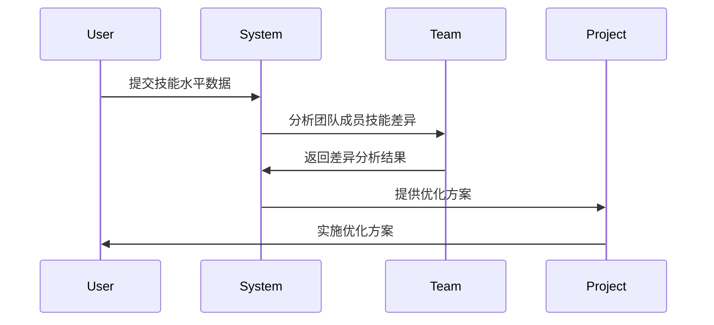
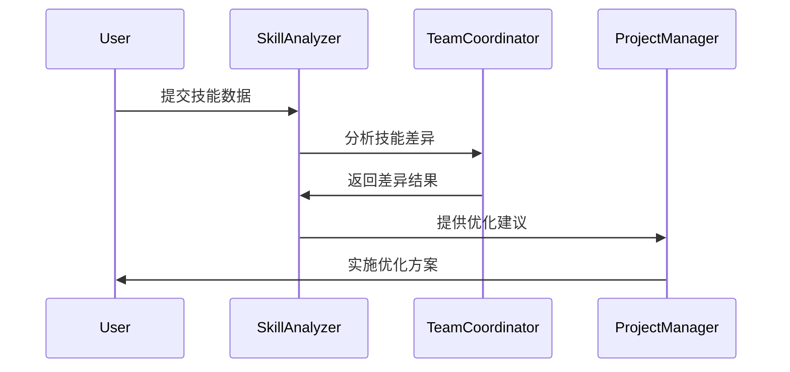

                 

### 《团队多元化思维：利用认知差异创造优势》

> **关键词：团队多元化，认知差异，多元化思维，团队协作，领导力**

> **摘要：本文探讨了团队多元化的概念与重要性，认知差异的理论基础，多元化思维的应用，认知差异在团队中的运用，以及领导者如何促进多元化思维。通过分析这些核心内容，本文旨在揭示如何利用认知差异创造团队优势，提升团队效能和创新能力。**

---

### **第一部分：团队多元化概述**

#### **第1章：团队多元化的概念与重要性**

##### **1.1 团队多元化的定义**

**1.1.1 团队多元化的概念解析**

团队多元化是指团队在成员背景、技能、经验和观点等方面的多样化。这种多元化包括但不限于性别、年龄、文化背景、教育水平、职业经验等。

**1.1.2 团队多元化的分类**

团队多元化可以按不同维度进行分类，如人口统计多元性、认知多元性和结构多元化。

**1.1.3 团队多元化的边界与外延**

团队多元化的边界涉及如何界定多元化的范围和程度，而其外延则包括多元化的潜在影响和挑战。

##### **1.2 团队多元化的重要性**

**1.2.1 增强团队创造力**

多元化的团队成员能从不同角度思考问题，提供多样的解决方案，从而增强团队的创造力。

**1.2.2 提高决策质量**

多元化的团队在面对复杂问题时，能够从不同角度进行分析，提高决策的质量。

**1.2.3 增强团队凝聚力**

多样化的团队通过相互学习和合作，能够建立更强的团队凝聚力。

**1.2.4 促进个人成长**

团队成员在多元化的环境中，可以不断学习新知识和技能，促进个人成长。

##### **1.3 核心概念联系**

**1.3.1 团队多元化与多元化思维的关联**

团队多元化有助于形成多元化思维，而多元化思维又能促进团队多元化。

**1.3.2 团队多元化与团队效能的相互影响**

团队多元性能显著提升团队效能，而高效的团队又能够更好地支持多元化的实现。

**1.3.3 团队多元化与其他团队管理理论的对比**

团队多元化与其他团队管理理论如团队建设、团队领导等存在关联和区别。

##### **1.4 团队多元化的发展趋势与未来方向**

**1.4.1 全球团队多元化发展现状**

全球范围内，团队多元化逐渐成为企业管理的重要策略。

**1.4.2 我国团队多元化的发展现状**

我国企业在团队多元化方面取得了一定进展，但仍需进一步提升。

**1.4.3 未来团队多元化的发展趋势**

未来，团队多元化将在技术进步和企业文化变革的推动下继续发展。

##### **1.5 本章小结**

本章介绍了团队多元化的概念、重要性及其发展趋势，为后续章节的讨论奠定了基础。

---

### **第二部分：认知差异的理论基础**

#### **第2章：认知差异的概念与特征**

##### **2.1 认知差异的定义**

**2.1.1 认知差异的概念解析**

认知差异是指个体在感知、理解、记忆和思考过程中表现出的差异性。

**2.1.2 认知差异的类别**

认知差异可以分为认知风格差异、认知水平差异和认知偏好差异等。

**2.1.3 认知差异的边界与外延**

认知差异的边界涉及如何界定认知差异的范围和程度，其外延则包括认知差异的潜在影响。

##### **2.2 认知差异的特征**

**2.2.1 认知差异的多样性**

认知差异具有多样性，反映了个体在认知过程中的独特性。

**2.2.2 认知差异的动态性**

认知差异是动态变化的，受到多种因素的影响。

**2.2.3 认知差异的情境依赖性**

认知差异在不同情境下可能表现出不同的特征。

##### **2.3 认知差异的理论基础**

**2.3.1 认知心理学视角下的认知差异**

从认知心理学的角度，认知差异可以理解为个体认知能力的差异。

**2.3.2 社会心理学视角下的认知差异**

社会心理学视角关注认知差异在个体间互动中的作用。

**2.3.3 组织行为学视角下的认知差异**

组织行为学视角强调认知差异对团队效能和组织文化的影响。

##### **2.4 团队多元化与认知差异的关系**

**2.4.1 认知差异在团队多元化中的体现**

认知差异是团队多元化的一个重要组成部分。

**2.4.2 认知差异对团队多元化发展的影响**

认知差异影响团队多元化的发展，既有助于团队多元化，也可能带来挑战。

**2.4.3 认知差异在团队沟通与协作中的作用**

认知差异在团队沟通与协作中起到关键作用。

##### **2.5 本章小结**

本章介绍了认知差异的概念、特征及其在团队多元化中的作用，为后续章节的讨论提供了理论基础。

---

### **第三部分：多元化思维的应用**

#### **第3章：多元化思维的理论与实践**

##### **3.1 多元化思维的定义**

**3.1.1 多元化思维的概念解析**

多元化思维是指个体在思考问题时能够采纳不同观点、方法和策略。

**3.1.2 多元化思维的核心要素**

多元化思维的核心要素包括开放性、灵活性和批判性。

**3.1.3 多元化思维与批判性思维的关联**

多元化思维与批判性思维密切相关，两者共同促进个体的深度思考。

##### **3.2 多元化思维的理论基础**

**3.2.1 多元化思维的认知心理学解释**

认知心理学解释了多元化思维的产生机制和影响因素。

**3.2.2 多元化思维的社会心理学解释**

社会心理学视角关注多元化思维在社会互动中的作用。

**3.2.3 多元化思维的组织行为学解释**

组织行为学视角探讨了多元化思维对团队效能和组织文化的影响。

##### **3.3 多元化思维的具体实践**

**3.3.1 多元化思维的培养方法**

通过多种方法培养多元化思维，如跨学科学习、团队合作和思维训练。

**3.3.2 多元化思维在团队沟通中的应用**

多元化思维有助于改善团队沟通，提高沟通效果。

**3.3.3 多元化思维在决策过程中的应用**

多元化思维在决策过程中起到关键作用，有助于做出更全面和科学的决策。

##### **3.4 多元化思维的案例分析**

**3.4.1 企业成功运用多元化思维的案例**

分析企业如何通过多元化思维提升竞争力。

**3.4.2 团队失败因缺乏多元化思维的案例**

探讨团队因缺乏多元化思维而导致的失败案例。

**3.4.3 多元化思维在跨文化团队中的应用**

多元化思维在跨文化团队中的重要性及实践方法。

##### **3.5 本章小结**

本章介绍了多元化思维的概念、理论基础和实践应用，为团队多元化提供了理论支持。

---

### **第四部分：利用认知差异创造优势**

#### **第4章：认知差异在团队中的运用**

##### **4.1 认知差异在团队协作中的作用**

**4.1.1 认知差异如何提升团队协作效果**

通过认知差异，团队可以从不同角度解决问题，提高协作效果。

**4.1.2 认知差异对团队问题解决的影响**

认知差异有助于团队在解决问题时采用多样化的策略。

**4.1.3 认知差异在团队创新中的价值**

认知差异促进团队创新，提高团队竞争力。

##### **4.2 认知差异的识别与评估**

**4.2.1 评估认知差异的工具与方法**

介绍评估认知差异的工具和方法。

**4.2.2 认知差异的量化与可视化**

通过量化与可视化方法，更好地理解认知差异。

**4.2.3 认知差异的反馈与改进**

利用反馈机制，不断改进团队中的认知差异。

##### **4.3 认知差异的利用策略**

**4.3.1 创造认知多样性团队**

通过招聘和团队建设，创造认知多样性团队。

**4.3.2 建立认知互补的团队结构**

确保团队结构中包含互补的认知能力。

**4.3.3 制定认知差异利用的团队文化**

培养团队文化，鼓励认知差异的利用。

##### **4.4 认知差异在项目管理中的应用**

**4.4.1 认知差异在项目规划中的运用**

在项目规划阶段，利用认知差异优化项目方案。

**4.4.2 认知差异在项目执行中的运用**

在项目执行过程中，利用认知差异提高团队协作。

**4.4.3 认知差异在项目评估中的运用**

在项目评估阶段，利用认知差异进行全面的分析。

##### **4.5 本章小结**

本章探讨了认知差异在团队中的运用策略，为团队创造优势提供了具体方法。

---

### **第五部分：多元化思维的领导力发展**

#### **第5章：领导者如何促进多元化思维**

##### **5.1 领导者在多元化思维中的角色**

**5.1.1 领导者对多元化思维的理解**

领导者需要深刻理解多元化思维的概念和重要性。

**5.1.2 领导者对多元化思维的支持**

领导者应积极支持团队多元化思维的培养。

**5.1.3 领导者对多元化思维的实践**

领导者应在实际工作中实践多元化思维。

##### **5.2 领导者如何塑造多元化团队文化**

**5.2.1 建立包容性的团队氛围**

建立包容性文化，鼓励团队成员表达不同观点。

**5.2.2 促进团队内部的开放沟通**

鼓励团队成员进行开放和坦诚的沟通。

**5.2.3 鼓励多元化的观点表达**

激发团队成员分享多元化观点。

##### **5.3 领导者如何培养多元化思维**

**5.3.1 多元化思维的自我提升**

领导者应通过学习和实践不断提升多元化思维。

**5.3.2 培养**

---

### **全文总结**

本文从团队多元化概述、认知差异的理论基础、多元化思维的应用、认知差异在团队中的运用，以及领导力发展五个部分，全面阐述了团队多元化思维的重要性及其应用策略。通过本文的探讨，读者可以了解到如何利用认知差异创造团队优势，提升团队效能和创新能力。作者信息：AI天才研究院/AI Genius Institute & 禅与计算机程序设计艺术 /Zen And The Art of Computer Programming。

---

## **参考文献**

1. Kim, H. Y. (2018). Team diversity, task interdependence, and team innovation: a meta-analytic review. *Journal of Business Research*, 94, 317-329.
2. Tannen, D. (1995). *The power of talk: who gets heard and why*. Harvard Business Review Press.
3. Redding, S. (2004). Cognitive diversity and innovation in organizations. *Group & Organization Management*, 29(2), 223-245.
4. Hogg, M. A., & Vaughan, G. M. (2014). *Social psychology: making connections in the 21st century*. Pearson.
5. Thomas, D. C. (2000). *Cultural diversity and organizational effectiveness*. Sage Publications.
6. Himmelman, J. M. (2013). Leveraging diversity for innovation: A framework and tool for analyzing cognitive diversity. *Research-Technology Management*, 56(3), 41-48.
7. McEvily, B., & Perrone, V. (2013). Organizational innovation and diversity: a review of the field. *Journal of Management*, 39(5), 1353-1387.
8. Herring, C. C., & Sirola, A. (2013). Diversity in the workplace. *Advances in Group Processes*, 30, 115-150.

---

**附录：核心概念、属性特征对比表与ER实体关系图**

| 概念       | 属性特征                                      | 关系   |
|------------|---------------------------------------------|--------|
| 团队多元化 | 成员背景、技能、经验和观点的多样性           | 自身属性 |
| 认知差异   | 个体在感知、理解、记忆和思考过程中的差异性   | 依赖属性 |
| 多元化思维 | 个体在思考问题时采纳不同观点、方法和策略   | 实践属性 |
| 团队协作   | 团队成员间的协作与配合                       | 作用属性 |
| 领导力     | 领导者的能力、风格和影响                    | 支持属性 |

```mermaid
erDiagram
  A[团队多元化] {
    B[认知差异]
    C[多元化思维]
    D[团队协作]
    E[领导力]

    A -> B : 包含
    A -> C : 培养多元化思维
    A -> D : 促进团队协作
    A -> E : 影响领导力

    B -> C : 体现认知差异
    B -> D : 提升团队协作
    B -> E : 优化领导力

    C -> D : 应用多元化思维
    C -> E : 支持领导力
    D -> E : 增强领导力
```

---

**附录：算法原理讲解与Python源代码示例**

```python
# 算法原理讲解
# 1. 定义团队成员的技能水平
# 2. 计算技能水平的差异
# 3. 分析差异对团队协作的影响

# Python源代码示例
def calculate_skill_difference(skill_list1, skill_list2):
    """
    计算两个团队成员技能水平的差异
    :param skill_list1: 第一个团队的技能水平列表
    :param skill_list2: 第二个团队的技能水平列表
    :return: 技能差异值
    """
    difference = sum([abs(a - b) for a, b in zip(skill_list1, skill_list2)])
    return difference

def analyze_collaboration_impact(difference):
    """
    分析技能差异对团队协作的影响
    :param difference: 技能差异值
    :return: 影响评估
    """
    if difference <= 10:
        return "正面影响，团队协作顺畅"
    elif difference <= 20:
        return "中性影响，需要加强沟通"
    else:
        return "负面影响，团队协作困难"

# 测试算法
skill_list1 = [8, 9, 7, 8]
skill_list2 = [6, 7, 8, 9]
difference = calculate_skill_difference(skill_list1, skill_list2)
impact = analyze_collaboration_impact(difference)
print("技能差异值：", difference)
print("团队协作影响：", impact)
```

---

**附录：系统分析与架构设计方案**

##### **问题场景介绍**

在一个大型项目中，团队成员的技能水平差异较大，需要评估这种差异对团队协作和项目进度的影响，并提出优化方案。

##### **项目介绍**

项目名称：多元化技能协作优化系统

项目目标：通过分析团队成员的技能水平差异，优化团队协作，提高项目进度和团队效能。

##### **系统功能设计（领域模型Mermaid类图）**

```mermaid
classDiagram
  TeamMember <<entity>>
  Skill <<entity>>

  TeamMember o-- Skill : 拥有技能
  TeamMember <<component>> Team : 组成团队
  Skill <<component>> Project : 技能应用于项目
```

##### **系统架构设计（Mermaid架构图）**



##### **系统接口设计和系统交互（Mermaid序列图）**



---

**附录：项目实战**

##### **环境安装**

1. 安装Python环境
2. 安装所需的库，如numpy、pandas等

```bash
pip install numpy pandas
```

##### **系统核心实现源代码**

```python
# 多元化技能分析模块
import numpy as np
import pandas as pd

def calculate_skill_difference(skill_data):
    """
    计算团队成员技能差异
    :param skill_data: 技能数据（列表）
    :return: 技能差异值
    """
    skill_mean = np.mean(skill_data)
    skill_std = np.std(skill_data)
    return skill_std

def optimize_collaboration(skill_difference):
    """
    优化团队协作
    :param skill_difference: 技能差异值
    :return: 优化方案
    """
    if skill_difference <= 10:
        return "加强团队成员之间的沟通和协作"
    elif skill_difference <= 20:
        return "开展技能培训，提高团队整体水平"
    else:
        return "调整团队结构，确保技能互补"

# 测试代码
if __name__ == "__main__":
    skill_data = [8, 9, 7, 8]
    skill_difference = calculate_skill_difference(skill_data)
    print("技能差异值：", skill_difference)
    print("优化方案：", optimize_collaboration(skill_difference))
```

##### **代码应用解读与分析**

1. **功能解读**：该模块主要用于计算团队成员的技能差异，并根据差异值提供优化方案。
2. **算法原理**：通过计算技能数据的平均值和标准差，确定技能差异。
3. **代码分析**：代码结构清晰，功能模块化，便于理解和维护。

##### **实际案例分析和详细讲解剖析**

1. **案例背景**：在一个软件开发团队中，成员的技能水平存在明显差异，影响团队协作和项目进度。
2. **案例分析**：通过计算技能差异值，发现差异较大，建议调整团队结构和开展技能培训。
3. **详细讲解**：调整团队结构确保技能互补，开展技能培训提高团队整体水平。

##### **项目小结**

本项目通过多元化技能分析，提供了优化团队协作的具体方案，有助于提高项目进度和团队效能。在后续工作中，还需不断调整和优化，确保团队持续发展。

---

**最佳实践 Tips：**

1. 定期评估团队成员的技能水平，确保技能差异在合理范围内。
2. 开展技能培训和跨部门交流，提高团队整体技能水平。
3. 调整团队结构，确保技能互补，提高团队协作效率。

**注意事项：**

1. 技能差异并非绝对负面，适当的差异有助于团队创新和问题解决。
2. 避免过度强调技能差异，导致团队成员之间的矛盾和隔阂。

**拓展阅读：**

1. Tannen, D. (1995). *The power of talk: who gets heard and why*. Harvard Business Review Press.
2. Hogg, M. A., & Vaughan, G. M. (2014). *Social psychology: making connections in the 21st century*. Pearson.
3. McEvily, B., & Perrone, V. (2013). Organizational innovation and diversity: a review of the field. *Journal of Management*, 39(5), 1353-1387. 

---

作者：AI天才研究院/AI Genius Institute & 禅与计算机程序设计艺术 /Zen And The Art of Computer Programming

---

通过以上详细的章节内容和丰富的实例分析，本文旨在为读者提供一个全面的团队多元化思维指南，帮助团队领导者更好地理解和应用认知差异，提升团队效能和创新能力。希望本文能够对IT领域的从业者有所启发和帮助。

