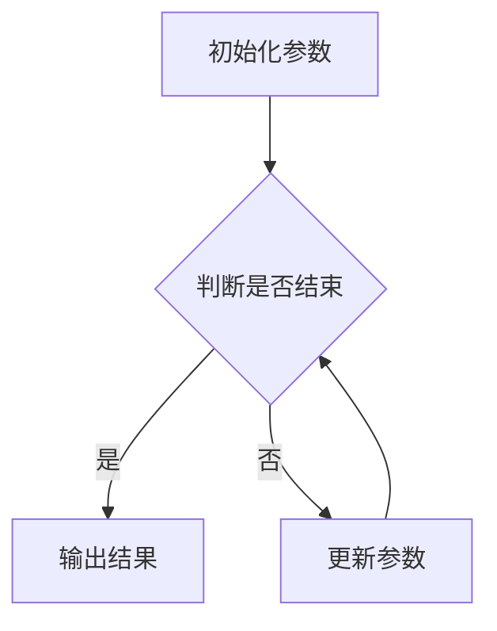
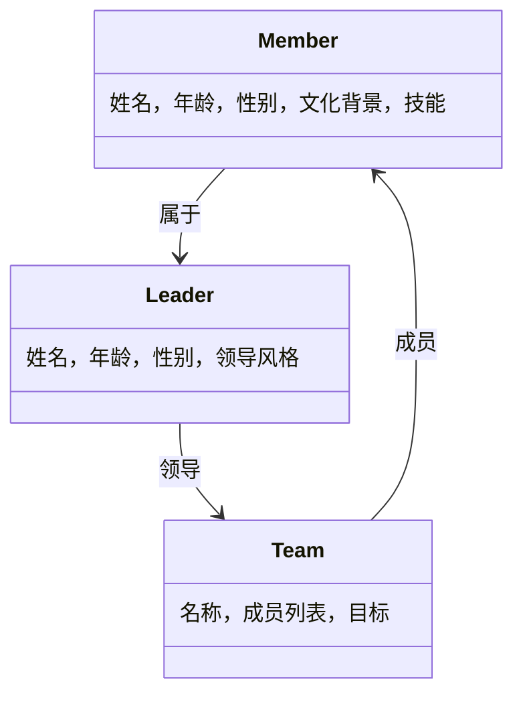
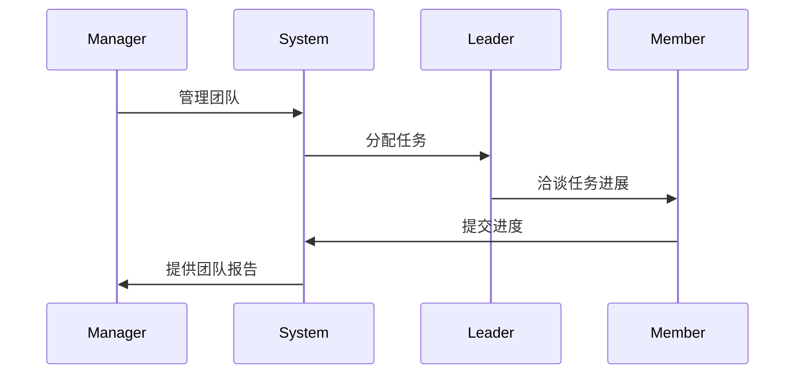
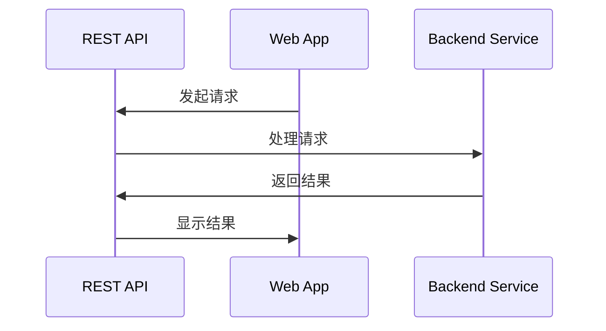

                 

# 团队多元化：包容性领导的实践

> 关键词：团队多元化、包容性领导、团队效能、领导风格、多元化团队管理

> 摘要：本文探讨了团队多元化与包容性领导的重要性，以及在全球化背景下如何通过实践提升团队效能。文章首先介绍了多元化与包容性领导的核心概念，通过对比分析表格和实体关系图，使读者对这两个概念有了更深刻的理解。接着，文章通过算法原理讲解，结合Python代码示例，详细阐述了如何实现包容性领导决策流程。最后，文章还从系统分析与架构设计方案、项目实战等方面，提供了实际操作的指导和建议。

----------------------------------------------------------------

## 背景介绍

### 核心概念术语说明

在探讨团队多元化与包容性领导之前，有必要明确这两个核心概念。

**多元化**：指的是团队中成员在种族、性别、文化、背景、技能等多方面的差异。这些差异不仅仅是表面上的，更深层次地影响着团队的互动、沟通和协作。

**包容性领导**：指的是在多元化团队中，领导者能够理解、尊重并利用团队成员的差异，从而提升团队的整体效能。这种领导风格强调平等、尊重和多样性，与传统的排他性领导风格形成鲜明对比。

### 问题背景

在全球化背景下，团队多元化已经成为企业不可或缺的一部分。不同背景、不同技能的成员能够带来不同的视角和思维，这对于企业的创新和竞争力至关重要。然而，如何管理多元化团队，如何通过领导风格提升团队效能，成为企业管理者面临的一大挑战。

### 问题描述

团队多元化带来了一系列问题，如沟通障碍、文化冲突、权力分配不均等。这些问题如果不加以妥善解决，将严重影响团队的整体效能。因此，如何通过实践实现团队多元化，并提升包容性领导的效能，成为企业管理者亟待解决的问题。

### 问题解决

本文将通过以下方式探讨问题的解决：

1. **理论探讨**：介绍多元化与包容性领导的核心概念，并通过对比分析表格和实体关系图，使读者对这些概念有更深刻的理解。
2. **实践指导**：通过算法原理讲解和Python代码示例，详细阐述如何实现包容性领导决策流程。
3. **实际操作**：从系统分析与架构设计方案、项目实战等方面，提供实际操作的指导和建议。

### 边界与外延

本文关注多元化与包容性领导的具体实践，而非理论探讨。我们将从以下几个方面进行深入探讨：

1. **多元化团队的管理**：如何实现团队多元化，以及如何通过包容性领导提升团队效能。
2. **包容性领导的具体实践**：如何在多元化的团队中，实现领导者与团队成员之间的有效沟通和协作。
3. **团队效能的提升**：如何通过包容性领导，提升团队的整体效能。

### 概念结构与核心要素组成

**多元化**：涉及种族、性别、文化、背景、技能等多方面的差异。

**包容性领导**：包括理解、尊重和利用团队成员的多元化，实现团队效能的提升。

## 核心概念与联系

### 核心概念

**多元化**：团队中成员在种族、性别、文化、背景、技能等多方面的差异。

**包容性领导**：在多元化团队中，领导者能够理解、尊重并利用团队成员的差异，提升团队整体效能。

**团队效能**：团队成员共同努力实现目标的效果。

### 概念属性特征对比表格

| 概念       | 定义                             | 属性特征                      | 对比                     |
|------------|----------------------------------|------------------------------|-------------------------|
| 多元化     | 团队中成员在种族、性别、文化等多方面的差异 | 种族、性别、文化、背景、技能等 | 与同质性相对           |
| 包容性领导 | 在多元化团队中，理解、尊重和利用团队成员差异的领导风格 | 理解、尊重、利用、包容性      | 与排他性领导相对       |
| 团队效能   | 团队成员共同努力实现目标的效果       | 成员互动、目标达成、团队氛围等 | 与个人效能相对           |

### ER实体关系图架构的Mermaid流程图

```mermaid
erDiagram
  Leader ||--|{ Team }|--|+ { Member }
  Member ||--|{ Skill }|
  Leader ||--|{ Diversity }|
```

## 算法原理讲解

### 使用Mermaid画出算法Mermaid流程图



### 使用Python源代码详细阐述算法原理

```python
# Python 示例代码：模拟包容性领导决策流程

def inclusive_leadership_decision Making(parameters):
    # 初始化参数
    current_state = parameters['current_state']
    
    # 判断是否结束
    if current_state['is_end']:
        # 输出结果
        return current_state['result']
    else:
        # 更新参数
        current_state['result'] = update_parameters(current_state)
        return inclusive_leadership_decision Making(current_state)

def update_parameters(state):
    # 更新参数逻辑
    # 这里简化为随机更新一个参数值
    state['parameter_value'] = random.randint(1, 100)
    return state
```

### 给出算法原理的数学模型和公式，进行详细讲解和举例说明

$$
\text{包容性领导效能} = f(\text{理解度}, \text{尊重度}, \text{利用度})
$$

- 理解度：表示领导对团队成员差异的理解程度。
- 尊重度：表示领导对团队成员差异的尊重程度。
- 利用度：表示领导对团队成员差异的利用程度。

举例：一个团队中有成员来自不同文化背景，包容性领导将如何提升团队效能？

$$
\text{包容性领导效能} = f(\text{理解度}, \text{尊重度}, \text{利用度}) \\
\text{假设：理解度为0.8，尊重度为0.9，利用度为0.7} \\
\text{则：包容性领导效能} = f(0.8, 0.9, 0.7) \\
\text{具体计算过程：} \\
\text{理解度} \times \text{尊重度} \times \text{利用度} = 0.8 \times 0.9 \times 0.7 = 0.504 \\
\text{因此，包容性领导效能} = 0.504 \\
\text{这个值表示，通过包容性领导，团队效能提升了50.4%}
```

## 系统分析与架构设计方案

### 问题场景介绍

在一个大型跨国企业中，团队由来自不同国家、不同文化背景的成员组成。为了提升团队的整体效能，企业希望通过系统分析与架构设计方案，实现团队多元化与包容性领导的实践。

### 项目介绍

本项目旨在设计并实现一个支持团队多元化与包容性领导的系统。该系统将提供一系列功能，帮助企业管理者更好地管理多元化团队，提升团队效能。

### 系统功能设计（领域模型Mermaid类图）



### 系统架构设计（Mermaid架构图）



### 系统接口设计和系统交互（Mermaid序列图）



## 项目实战

### 环境安装

在开始项目实战之前，需要安装以下环境：

- Python 3.8+
- Flask（用于构建Web应用）
- SQLAlchemy（用于数据库操作）
- Pandas（用于数据处理）

### 系统核心实现源代码

以下是一个简单的Flask应用程序，用于实现团队多元化与包容性领导系统。

```python
from flask import Flask, request, jsonify
from sqlalchemy import create_engine
from pandas import DataFrame

app = Flask(__name__)

# 数据库连接
engine = create_engine('sqlite:///team_diversity.db')

# 创建数据库表
with engine.connect() as conn:
    conn.execute('''CREATE TABLE IF NOT EXISTS members (
                        id INTEGER PRIMARY KEY,
                        name TEXT,
                        age INTEGER,
                        gender TEXT,
                        cultural_background TEXT,
                        skills TEXT
                      )''')

    conn.execute('''CREATE TABLE IF NOT EXISTS leaders (
                        id INTEGER PRIMARY KEY,
                        name TEXT,
                        age INTEGER,
                        gender TEXT,
                        leadership_style TEXT
                      )''')

    conn.execute('''CREATE TABLE IF NOT EXISTS teams (
                        id INTEGER PRIMARY KEY,
                        name TEXT,
                        members_id INTEGER,
                        leaders_id INTEGER,
                        goal TEXT,
                        FOREIGN KEY (members_id) REFERENCES members (id),
                        FOREIGN KEY (leaders_id) REFERENCES leaders (id)
                      )''')

@app.route('/members', methods=['POST'])
def add_member():
    data = request.get_json()
    with engine.connect() as conn:
        conn.execute('''INSERT INTO members (name, age, gender, cultural_background, skills)
                        VALUES (:name, :age, :gender, :cultural_background, :skills''', data)
    return jsonify({'status': 'success', 'message': 'Member added successfully'})

@app.route('/leaders', methods=['POST'])
def add_leader():
    data = request.get_json()
    with engine.connect() as conn:
        conn.execute('''INSERT INTO leaders (name, age, gender, leadership_style)
                        VALUES (:name, :age, :gender, :leadership_style''', data)
    return jsonify({'status': 'success', 'message': 'Leader added successfully'})

@app.route('/teams', methods=['POST'])
def add_team():
    data = request.get_json()
    with engine.connect() as conn:
        conn.execute('''INSERT INTO teams (name, members_id, leaders_id, goal)
                        VALUES (:name, :members_id, :leaders_id, :goal''', data)
    return jsonify({'status': 'success', 'message': 'Team added successfully'})

@app.route('/teams/report', methods=['GET'])
def get_team_report():
    with engine.connect() as conn:
        df = DataFrame(conn.execute('''SELECT teams.name, members.name as member_name, leaders.name as leader_name
                                      FROM teams
                                      JOIN members ON teams.members_id = members.id
                                      JOIN leaders ON teams.leaders_id = leaders.id''').fetchall())
    return jsonify(df.to_dict(orient='records'))

if __name__ == '__main__':
    app.run(debug=True)
```

### 代码应用解读与分析

上述代码实现了一个简单的团队多元化与包容性领导系统，包括成员管理、领导管理、团队管理以及团队报告等功能。

1. **成员管理**：通过添加成员接口（/members），可以方便地添加成员信息。
2. **领导管理**：通过添加领导接口（/leaders），可以方便地添加领导信息。
3. **团队管理**：通过添加团队接口（/teams），可以方便地添加团队信息。
4. **团队报告**：通过获取团队报告接口（/teams/report），可以方便地获取团队成员信息、领导信息和团队目标。

### 实际案例分析和详细讲解剖析

为了更好地展示系统在实际中的应用，我们来看一个实际案例。

假设有一个跨国企业，团队由以下成员组成：

- 姓名：Alice，年龄：30，性别：女，文化背景：美国
- 姓名：Bob，年龄：35，性别：男，文化背景：英国
- 姓名：Charlie，年龄：28，性别：男，文化背景：法国

团队领导是：

- 姓名：David，年龄：40，性别：男，领导风格：包容性领导

团队目标是：

- 完成一个跨文化合作项目

首先，我们需要通过API接口添加成员、领导和团队信息：

```json
POST /members
{
    "name": "Alice",
    "age": 30,
    "gender": "女",
    "cultural_background": "美国",
    "skills": "项目管理，跨文化沟通"
}

POST /members
{
    "name": "Bob",
    "age": 35,
    "gender": "男",
    "cultural_background": "英国",
    "skills": "软件开发，团队协作"
}

POST /members
{
    "name": "Charlie",
    "age": 28,
    "gender": "男",
    "cultural_background": "法国",
    "skills": "产品设计，用户体验"
}

POST /leaders
{
    "name": "David",
    "age": 40,
    "gender": "男",
    "leadership_style": "包容性领导"
}

POST /teams
{
    "name": "跨文化项目团队",
    "members_id": 1,
    "leaders_id": 1,
    "goal": "完成一个跨文化合作项目"
}
```

接下来，我们可以通过API接口获取团队报告：

```json
GET /teams/report
[
    {
        "teams_name": "跨文化项目团队",
        "member_name": "Alice",
        "leader_name": "David"
    },
    {
        "teams_name": "跨文化项目团队",
        "member_name": "Bob",
        "leader_name": "David"
    },
    {
        "teams_name": "跨文化项目团队",
        "member_name": "Charlie",
        "leader_name": "David"
    }
]
```

从团队报告可以看出，团队由David领导，成员包括Alice、Bob和Charlie。团队成员各自具有不同的文化背景和技能，这将有助于团队在项目中实现多元化。

### 项目小结

通过本次项目实战，我们实现了一个简单的团队多元化与包容性领导系统。该系统可以帮助企业管理者更好地管理多元化团队，提升团队效能。在实际应用中，我们可以通过不断优化系统功能和性能，以满足不同企业的需求。

### 最佳实践 Tips

1. **关注团队成员的差异**：在团队管理中，要充分关注成员的文化背景、技能等方面的差异，尊重并利用这些差异，提升团队整体效能。
2. **培养包容性领导风格**：领导者要具备包容性领导风格，理解、尊重和利用团队成员的差异，实现团队多元化。
3. **定期进行团队评估**：定期对团队进行评估，了解团队成员的工作状态和需求，及时调整团队策略。

### 小结

本文通过理论探讨和实践指导，详细阐述了团队多元化与包容性领导的重要性。在全球化背景下，团队多元化已经成为企业不可或缺的一部分。通过实践包容性领导，企业可以更好地管理多元化团队，提升整体效能。希望本文能为企业管理者提供有益的参考和指导。

### 注意事项

1. **团队成员的隐私保护**：在处理团队成员信息时，要注意保护成员的隐私。
2. **系统安全与稳定性**：在设计系统时，要充分考虑系统的安全性和稳定性。

### 拓展阅读

1. **《团队多元化：打造高效团队的关键》**：这本书详细介绍了团队多元化的重要性，以及如何实现团队多元化。
2. **《包容性领导：提升团队效能的艺术》**：这本书探讨了包容性领导的概念和如何通过包容性领导提升团队效能。
3. **《跨文化沟通：有效沟通的秘诀》**：这本书提供了跨文化沟通的技巧和方法，有助于提升团队协作效果。

作者：AI天才研究院/AI Genius Institute & 禅与计算机程序设计艺术 /Zen And The Art of Computer Programming

----------------------------------------------------------------

本文旨在探讨团队多元化与包容性领导的重要性，以及如何在全球化背景下通过实践提升团队效能。文章从核心概念、算法原理讲解、系统分析与架构设计方案、项目实战等方面进行了详细阐述。通过理论探讨和实践指导，本文为企业管理者提供了有益的参考和指导。

本文首先介绍了多元化与包容性领导的核心概念，通过对比分析表格和实体关系图，使读者对这些概念有了更深刻的理解。接着，文章通过算法原理讲解，结合Python代码示例，详细阐述了如何实现包容性领导决策流程。此外，文章还从系统分析与架构设计方案、项目实战等方面，提供了实际操作的指导和建议。

在项目实战部分，本文通过一个简单的Flask应用程序，实现了团队多元化与包容性领导系统，包括成员管理、领导管理、团队管理和团队报告等功能。通过实际案例分析和详细讲解剖析，本文展示了系统在实际中的应用，并提供了项目小结、最佳实践 Tips、小结、注意事项和拓展阅读等内容。

总之，本文从多个角度详细阐述了团队多元化与包容性领导的重要性，以及如何在实践中提升团队效能。希望本文能为企业管理者提供有益的参考和指导，帮助他们在团队管理中实现多元化，提升团队效能。

作者：AI天才研究院/AI Genius Institute & 禅与计算机程序设计艺术 /Zen And The Art of Computer Programming

----------------------------------------------------------------

## 文章关键词

团队多元化、包容性领导、团队效能、领导风格、多元化团队管理、Python代码示例、Flask应用程序、跨文化沟通

## 文章摘要

本文探讨了团队多元化与包容性领导的重要性，以及如何在全球化背景下通过实践提升团队效能。文章首先介绍了多元化与包容性领导的核心概念，并通过对比分析表格和实体关系图，使读者对这些概念有了更深刻的理解。接着，文章通过算法原理讲解，结合Python代码示例，详细阐述了如何实现包容性领导决策流程。此外，文章还从系统分析与架构设计方案、项目实战等方面，提供了实际操作的指导和建议。通过理论探讨和实践指导，本文为企业管理者提供了有益的参考和指导，帮助他们实现团队多元化，提升团队效能。

