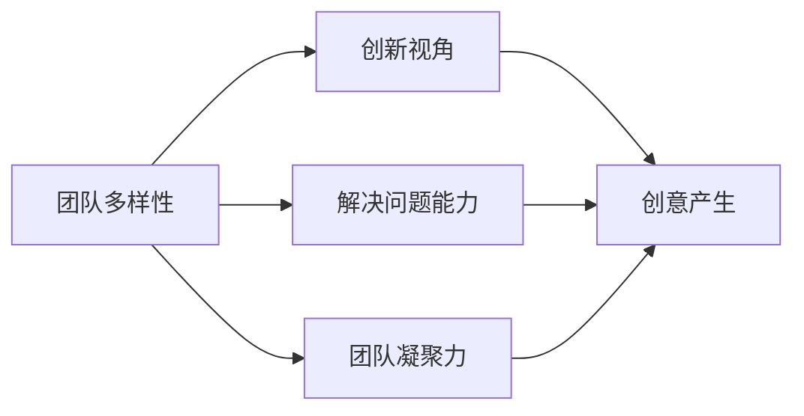
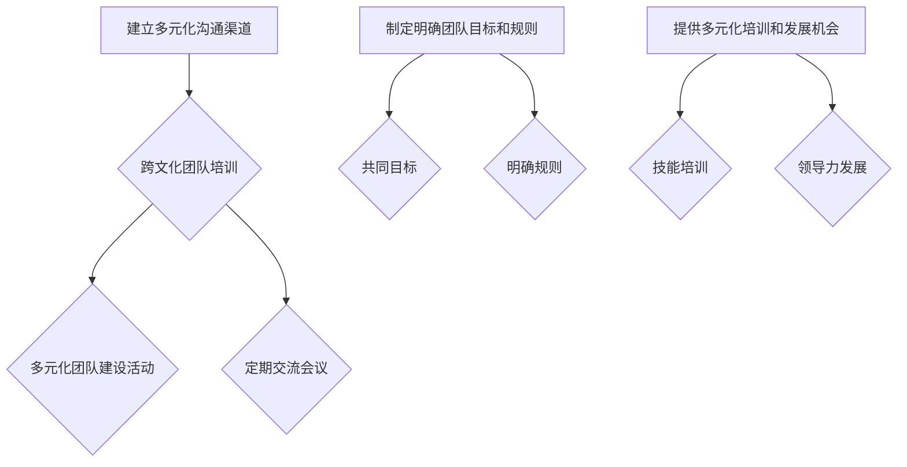
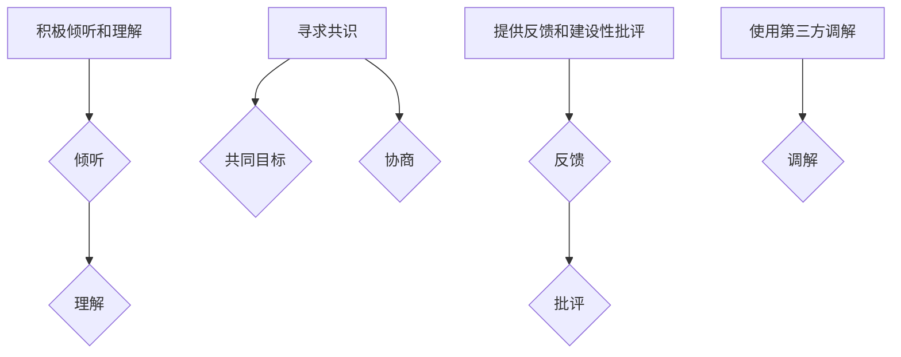
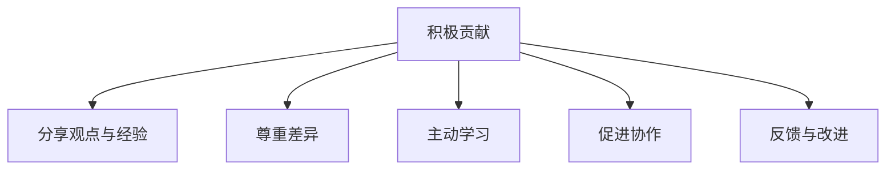
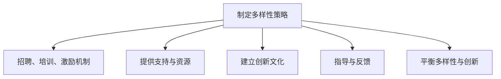

                 

### 第2章：团队多样性的定义与重要性

#### 2.1 团队多样性的定义

团队多样性是指在一个团队中，成员在性别、年龄、教育背景、工作经验、技能、文化背景等方面的差异。这种多样性不仅体现在成员之间的表面特征上，还包括他们的思维方式、解决问题的方式、价值观等方面的差异。多样性是一个多维度的概念，其范围可以从个体的生理特征扩展到社会、文化和心理特征。

**核心概念原理：**

多样性（Diversity） = 种族、性别、年龄、文化、教育、经验、技能、价值观等差异

**概念属性特征对比表格：**

| 特征类型 | 描述 | 对创新的影响 |
| -------- | -------------------------------- | ------------------------------ |
| 种族与性别 | 表面上的差异，如肤色、性别 | 可以带来不同的观点和经验，有助于创造性解决问题 |
| 年龄 | 不同的生活经历、知识积累 | 促进跨代际的知识和经验交流，激发不同的视角 |
| 教育背景 | 学历、专业、知识结构 | 提供不同的思维方式和解决问题的方法 |
| 工作经验 | 不同行业、职位的工作经验 | 增加对问题的理解深度和多样性 |
| 技能 | 专业技能和软技能 | 为团队提供多种解决问题的策略 |
| 文化背景 | 语言、习俗、价值观 | 促进跨文化沟通和理解，增强团队凝聚力 |

**ER实体关系图架构：**

```mermaid
erDiagram
  Person ||--|{ Team }|-->> Project
  Person ||--|{ Skill }|-->> Project
  Person ||--|{ Background }|-->> Project
  Team ||--|{ Diversity }|-->> Innovation
  Skill ||--|{ Type }|-->> Skill
  Background ||--|{ Type }|-->> Background
```

#### 2.2 团队多样性的重要性

团队多样性对于组织创新有着不可忽视的重要性。首先，多样性能够带来不同的视角和思维方式，有助于解决复杂问题时产生更多的创意和解决方案。其次，多样化的团队能够更好地理解和满足不同客户的需求，从而提高产品或服务的市场竞争力。此外，多样化的团队还能够增强团队的适应性，使其更能够应对快速变化的市场环境。

**多样性与创新的关系：**

- **创新视角：** 多样性可以提供更多的视角，有助于从不同角度分析问题，从而发现新的解决方案。
- **解决问题：** 多样性可以提供不同的技能和知识，使团队在面对问题时能够采用多种方法进行解决。
- **团队凝聚力：** 多样性可以增强团队内部的沟通和合作，提高团队的整体绩效。

#### 2.3 团队多样性与创新的关系

团队多样性与创新之间存在密切的联系。一方面，多样性为团队带来了更多的创意和不同的视角，从而促进了创新。另一方面，创新又需要多样性的支持，因为创新往往需要不同技能、知识和经验的人共同合作才能实现。

**多样性与创新的平衡：**

在团队多样性管理中，关键是要找到多样性与创新之间的平衡点。过度强调多样性可能导致团队内部的冲突，而缺乏多样性则可能限制团队的创新潜力。因此，组织需要通过有效的管理策略，确保团队在多样性和创新之间取得平衡。

**多样性与创新的关系模型：**



**总结：**

团队多样性不仅是一种社会价值观的体现，更是提升团队创新能力的有效途径。通过合理管理和利用团队的多样性，组织可以激发更多的创意和创新的潜力，从而在竞争激烈的市场中保持竞争优势。

#### 2.4 团队多样性管理的挑战

尽管团队多样性对于创新有着显著的好处，但在实际操作中，管理多样性也面临着一系列挑战。以下是一些主要的挑战：

- **沟通障碍：** 多样性可能带来语言、文化和沟通方式的差异，导致团队内部的沟通困难。
- **偏见和歧视：** 多样性可能会导致偏见和歧视，影响团队成员的士气和生产力。
- **管理复杂性：** 多样性增加了团队管理的复杂性，需要更加细致和个性化的管理策略。
- **文化冲突：** 不同的文化背景可能会导致价值观和行为的冲突，影响团队的合作。

**解决策略：**

- **建立多元化的沟通渠道：** 通过建立多元化的沟通渠道，如跨文化团队培训、团队建设活动等，增强团队成员之间的沟通和理解。
- **消除偏见和歧视：** 通过制定和执行反歧视政策，提供平等的工作环境，消除团队中的偏见和歧视。
- **定制化的管理策略：** 根据团队的多样性特征，制定个性化的管理策略，确保每个团队成员都能在团队中发挥作用。
- **培养跨文化意识：** 通过跨文化培训和文化交流，增强团队成员的跨文化意识和能力。

**总结：**

团队多样性管理是一个复杂的过程，需要组织在战略层面上给予重视，并通过一系列的制度和措施来支持和实现。通过有效的多样性管理，组织可以更好地利用团队的多样性，提升创新能力和整体绩效。

---

### 第3章：多样性的维度与特征

在理解了团队多样性的定义和重要性后，我们需要进一步探讨多样性的具体维度和特征。多样性不仅仅是一个抽象的概念，它涉及到团队中的各个方面，从性别和年龄到教育背景和技能，每一个维度都可能对团队的创新能力和工作效果产生深远的影响。以下是对多样性维度的详细探讨。

#### 3.1 年龄多样性

年龄多样性是指团队中存在不同年龄段的成员。不同年龄段的人有着不同的生活经历、知识结构和思维方式。例如，年轻的成员可能更擅长使用新技术，而年长的成员可能拥有丰富的行业经验和专业知识。

**核心概念原理：**

年龄多样性（Age Diversity） = 不同年龄段的成员在团队中的比例和作用

**概念属性特征对比表格：**

| 年龄段 | 特征 | 对创新的影响 |
| ------- | ------------------ | ------------------------------------ |
| 青年    | 创新意识强、适应快 | 带来新的想法和快速的技术应用 |
| 中年    | 经验丰富、沟通能力强 | 提供行业知识和稳定的决策支持 |
| 老年    | 长期积累的知识和经验 | 为团队提供宝贵的经验和见解 |

**ER实体关系图架构：**

```mermaid
erDiagram
  Team ||--|{ Age_Diversity }|-->> Innovation
  Age_Diversity ||--|{ Young }|-->> Team
  Age_Diversity ||--|{ Middle-aged }|-->> Team
  Age_Diversity ||--|{ Elderly }|-->> Team
```

#### 3.2 性别多样性

性别多样性是指团队中男性与女性成员的比例和角色分配。性别差异不仅仅体现在生理上，还包括思维方式、解决问题的方式和社会角色等方面。性别多样性对于团队的创新和决策过程具有重要影响。

**核心概念原理：**

性别多样性（Gender Diversity） = 男女比例在团队中的平衡和角色分配

**概念属性特征对比表格：**

| 性别 | 特征 | 对创新的影响 |
| ---- | ------------------ | ------------------------------------ |
| 男性 | 决策果断、竞争意识强 | 带来不同的决策风格和视角 |
| 女性 | 沟通能力好、注重细节 | 增强团队内部的协作和沟通效果 |

**ER实体关系图架构：**

```mermaid
erDiagram
  Team ||--|{ Gender_Diversity }|-->> Innovation
  Gender_Diversity ||--|{ Male }|-->> Team
  Gender_Diversity ||--|{ Female }|-->> Team
```

#### 3.3 教育背景多样性

教育背景多样性是指团队成员拥有不同的学历、专业和知识结构。这种多样性可以为团队提供不同的思考方式和解决问题的方法，有助于从多个角度分析问题，提高创新的可能性。

**核心概念原理：**

教育背景多样性（Educational Background Diversity） = 不同学历、专业和知识结构在团队中的比例

**概念属性特征对比表格：**

| 教育背景 | 特征 | 对创新的影响 |
| -------- | ------------------ | ------------------------------------ |
| 学历层次 | 拥有不同的知识深度 | 增加对复杂问题的理解能力 |
| 专业领域 | 拥有不同的专业知识 | 提供多元化的解决方案 |
| 技能水平 | 拥有不同的技能组合 | 提高团队的整体技能水平 |

**ER实体关系图架构：**

```mermaid
erDiagram
  Team ||--|{ Educational_Background_Diversity }|-->> Innovation
  Educational_Background_Diversity ||--|{ Degree }|-->> Team
  Educational_Background_Diversity ||--|{ Professional }|-->> Team
  Educational_Background_Diversity ||--|{ Skill_Level }|-->> Team
```

#### 3.4 技能多样性

技能多样性是指团队成员拥有不同的专业技能和技能组合。这种多样性可以为团队提供多样化的技能组合，使得团队在面对复杂问题时能够采用不同的技能和策略进行解决。

**核心概念原理：**

技能多样性（Skill Diversity） = 不同专业技能和技能组合在团队中的比例

**概念属性特征对比表格：**

| 技能类型 | 特征 | 对创新的影响 |
| -------- | ------------------ | ------------------------------------ |
| 技术技能 | 拥有不同技术领域的专业知识 | 提供多样化的技术解决方案 |
| 管理技能 | 拥有不同的管理经验和方法 | 增强团队的组织和管理能力 |
| 软技能 | 拥有不同的人际交往和沟通技巧 | 提高团队的协作效率和沟通效果 |

**ER实体关系图架构：**

```mermaid
erDiagram
  Team ||--|{ Skill_Diversity }|-->> Innovation
  Skill_Diversity ||--|{ Technical }|-->> Team
  Skill_Diversity ||--|{ Management }|-->> Team
  Skill_Diversity ||--|{ Soft }|-->> Team
```

#### 3.5 文化多样性

文化多样性是指团队成员来自不同的文化背景，包括语言、习俗、价值观等方面。文化多样性可以为团队带来不同的文化视角和思维方式，有助于促进跨文化交流和理解，提高团队的创新能力和文化敏感度。

**核心概念原理：**

文化多样性（Cultural Diversity） = 不同文化背景的成员在团队中的比例和影响

**概念属性特征对比表格：**

| 文化背景 | 特征 | 对创新的影响 |
| -------- | ------------------ | ------------------------------------ |
| 语言 | 不同的语言能力 | 促进跨文化沟通和理解 |
| 习俗 | 不同的文化习俗 | 增强团队的文化包容性和多样性 |
| 价值观 | 不同的价值观 | 增加对多样性和包容性的认识 |

**ER实体关系图架构：**

```mermaid
erDiagram
  Team ||--|{ Cultural_Diversity }|-->> Innovation
  Cultural_Diversity ||--|{ Language }|-->> Team
  Cultural_Diversity ||--|{ Custom }|-->> Team
  Cultural_Diversity ||--|{ Value }|-->> Team
```

**总结：**

多样性是一个多维度的概念，涵盖了年龄、性别、教育背景、技能和文化等多个方面。每一个维度都对团队的创新能力和工作效果有着重要的影响。通过理解和管理这些多样性维度，组织可以更好地利用团队的优势，提高创新能力和整体绩效。

---

在理解了多样性的维度和特征后，我们需要进一步探讨如何通过有效的协同管理和冲突管理来最大化多样性的优势。协同管理和冲突管理是多样性管理中至关重要的两个环节，直接影响到团队的创新能力和工作效果。

#### 4.1 协同管理的策略

协同管理是指通过一系列的策略和措施，促进团队成员之间的合作和协作，从而充分发挥多样性的优势。以下是一些有效的协同管理策略：

1. **建立多元化的沟通渠道：**
   - **跨文化团队培训：** 提供跨文化沟通培训，帮助团队成员更好地理解和尊重不同文化背景的人。
   - **多元化团队建设活动：** 通过团队建设活动，增强团队成员之间的信任和合作。
   - **定期交流会议：** 定期举办团队交流会议，鼓励团队成员分享观点和经验，促进知识的共享。

2. **制定明确的团队目标和规则：**
   - **共同目标：** 确保所有团队成员都明确团队的目标和愿景，从而增强团队合作的动力。
   - **明确规则：** 制定明确的团队工作规则和流程，减少因规则不明导致的误解和冲突。

3. **提供多元化的培训和发展机会：**
   - **技能培训：** 为团队成员提供多元化的技能培训，提高他们的专业技能和软技能。
   - **领导力发展：** 通过领导力培训，培养团队成员的领导能力和团队管理能力。

**协同管理的Mermaid流程图：**



#### 4.2 冲突管理的技巧

冲突管理是多样性管理中的一个重要环节。由于团队成员之间的差异，冲突在所难免。有效的冲突管理可以减少冲突对团队工作的影响，甚至将其转化为创新的动力。以下是一些有效的冲突管理技巧：

1. **积极倾听和理解：**
   - **倾听：** 在冲突发生时，耐心倾听对方的观点和意见，避免立即做出判断。
   - **理解：** 尽量从对方的角度去理解问题，增加对冲突背景的理解。

2. **寻求共识：**
   - **共同目标：** 在冲突中寻求共同的目标和利益，通过共同目标来化解冲突。
   - **协商：** 通过协商和讨论，寻找双方都能接受的解决方案。

3. **提供反馈和建设性批评：**
   - **反馈：** 给予对方建设性的反馈，帮助对方理解问题的严重性和改进的方向。
   - **批评：** 以建设性的方式进行批评，避免伤害对方的自尊心。

4. **使用第三方调解：**
   - **调解：** 在冲突无法自行解决时，寻求第三方的帮助，如调解人或顾问。

**冲突管理的Mermaid流程图：**



#### 4.3 多样性训练与文化建设

除了具体的策略和技巧，多样性训练和文化建设也是促进协同管理和冲突管理的重要手段。以下是一些关键点：

1. **多样性培训：**
   - **意识提升：** 通过多样性培训，提高团队成员对多样性的认识和重视。
   - **技能提升：** 通过培训，提升团队成员在多元文化环境下的沟通、协作和解决问题的能力。

2. **文化建设：**
   - **包容性文化：** 建立包容性的文化，鼓励团队成员尊重和欣赏彼此的差异。
   - **共同价值观：** 通过共同的价值观和目标，增强团队的凝聚力和合作精神。

3. **领导层的支持：**
   - **领导带头：** 领导者要率先示范，积极参与多样性和包容性的文化建设。
   - **政策支持：** 组织应制定相应的政策和措施，支持多样性和包容性的文化建设。

**总结：**

协同管理和冲突管理是团队多样性管理中不可或缺的两个环节。通过建立多元化的沟通渠道、制定明确的团队目标和规则、提供多元化的培训和发展机会，以及积极倾听和理解、寻求共识、提供反馈和建设性批评等策略，我们可以有效促进团队的协同合作。同时，通过多样性训练和文化建设，我们可以建立起一个包容性、合作性的团队文化，从而最大化多样性的优势，提升团队的创新能力和工作绩效。

---

#### 4.4 多样性的协同与冲突管理策略总结

多样性管理是一个复杂而细致的过程，它涉及到协同管理和冲突管理的多个方面。通过前文的探讨，我们可以总结出以下关键策略和最佳实践：

**协同管理策略：**

1. **建立多元化沟通渠道：**
   - **跨文化团队培训：** 提高团队成员对文化差异的敏感度和沟通技巧。
   - **多元化团队建设活动：** 通过团队活动增强团队成员之间的信任和合作。
   - **定期交流会议：** 促进知识和经验的共享，增强团队的凝聚力。

2. **制定明确团队目标和规则：**
   - **共同目标：** 确保团队成员明确团队愿景和目标，增强合作动力。
   - **明确规则：** 减少因规则不明导致的误解和冲突，提高团队运作效率。

3. **提供多元化培训和发展机会：**
   - **技能培训：** 提升团队成员的专业技能，增强团队的整体实力。
   - **领导力发展：** 培养团队成员的领导能力，提高团队的管理水平。

**冲突管理技巧：**

1. **积极倾听和理解：**
   - **倾听：** 倾听对方的观点，避免立即做出判断。
   - **理解：** 尽量从对方的角度理解问题，增加对冲突背景的理解。

2. **寻求共识：**
   - **共同目标：** 在冲突中寻求共同的目标和利益。
   - **协商：** 通过讨论寻找双方都能接受的解决方案。

3. **提供反馈和建设性批评：**
   - **反馈：** 给予建设性的反馈，帮助对方理解问题的严重性和改进方向。
   - **批评：** 以建设性的方式进行批评，避免伤害对方的自尊心。

**最佳实践与注意事项：**

- **领导层的支持：** 领导者要率先示范，积极参与多样性和包容性的文化建设。
- **文化氛围营造：** 建立包容性的文化氛围，鼓励团队成员尊重和欣赏彼此的差异。
- **持续培训：** 定期进行多样性培训和团队建设活动，确保团队成员的多样性和协同管理技能不断提升。

**总结：**

多样性管理不仅仅是关于增加团队成员的多样性，更是关于如何有效地利用这种多样性来提升团队的创新能力和工作绩效。通过协同管理和冲突管理的策略，组织可以建立起一个包容、合作和创新性的团队环境，从而在竞争激烈的市场中保持竞争优势。

---

#### 第5章：多样化团队的创意激发策略

在多样性管理的框架下，如何充分利用团队的多样性来激发创意是一个关键问题。多样化的团队成员拥有不同的思维方式、经验和技能，这些差异为团队带来了丰富的创新资源。以下是一些具体的策略，帮助团队在多样性中寻找创意源泉。

#### 5.1 创意思维工具

创意思维工具是激发团队成员创造力和想象力的重要方法。以下是一些常用的创意思维工具：

1. **头脑风暴：**
   - **无限制讨论：** 鼓励团队成员自由发表观点，不论观点是否合理。
   - **数量优先：** 鼓励团队成员尽可能多地提出想法，不必担心观点的可行性。

2. **思维导图：**
   - **结构化思考：** 将问题分解为子问题，通过分支结构图展示各种可能的解决方案。

3. **六顶思考帽：**
   - **多元思考：** 通过不同的思考帽（如蓝色思考帽代表逻辑分析，红色思考帽代表情感表达）引导团队成员从不同角度思考问题。

4. **逆向思维：**
   - **颠覆常规：** 通过反向思考，挑战现有的假设和常规，寻找新的解决方案。

5. **模拟实验：**
   - **实践验证：** 通过模拟实验，验证创意的实际可行性，减少风险。

#### 5.2 团队协作与创新工作流程

为了确保创意能够在团队中得到有效的实施，需要建立一套科学的团队协作与创新工作流程。以下是一些关键步骤：

1. **需求分析：**
   - **明确目标：** 明确团队需要解决的问题或需要达成的目标。
   - **收集需求：** 通过与用户、利益相关者等进行沟通，收集具体的业务需求。

2. **创意产生：**
   - **头脑风暴：** 通过集体头脑风暴，激发团队成员的创意思维。
   - **筛选创意：** 对产生的创意进行筛选，保留最具潜力的想法。

3. **方案评估：**
   - **可行性分析：** 评估创意的可行性，包括技术、资源和成本等方面。
   - **优先级排序：** 根据评估结果，对创意进行优先级排序，确定优先实施的方案。

4. **原型设计与测试：**
   - **快速迭代：** 构建原型，通过用户测试和反馈不断迭代优化。
   - **风险控制：** 在设计过程中考虑潜在的风险，并制定相应的风险控制措施。

5. **实施与监控：**
   - **团队协作：** 通过跨职能团队的协作，确保创意能够得到有效实施。
   - **监控进度：** 定期监控项目进度，确保项目按照计划进行。

#### 5.3 创新文化塑造

创新文化是团队持续创新的土壤。以下是一些关键策略，帮助团队塑造创新文化：

1. **鼓励尝试与失败：**
   - **宽容失败：** 对尝试过程中的失败持宽容态度，鼓励团队成员勇于尝试。
   - **总结经验：** 从失败中吸取教训，不断改进和创新。

2. **建立开放沟通机制：**
   - **鼓励反馈：** 鼓励团队成员之间开放沟通，分享想法和建议。
   - **领导参与：** 领导者要积极参与到创新过程中，为团队成员提供支持和指导。

3. **提供资源保障：**
   - **资金支持：** 为创新项目提供充足的资金支持。
   - **时间保障：** 为团队成员提供足够的时间进行创新活动。

4. **激励机制：**
   - **奖励创新：** 设立创新奖励制度，对取得创新成果的团队成员进行奖励。
   - **晋升机会：** 为创新者提供更多的晋升和发展机会。

**总结：**

多样化团队的创意激发需要结合创意思维工具、科学的团队协作与创新工作流程以及积极创新文化的塑造。通过这些策略，团队可以充分利用多样性带来的优势，激发出更多的创意，推动组织的持续创新和发展。

---

### 第6章：多样化团队的实践案例

在探讨如何利用团队多样性激发创意之后，我们需要通过实际案例来验证这些理论的有效性。以下将介绍一些国内外多样化团队的创新案例，并分析其成功的关键因素。

#### 6.1 国外多样化团队创新案例

**案例一：谷歌（Google）**

谷歌作为全球知名的科技公司，其多样性和包容性文化是其创新成功的关键因素之一。谷歌通过一系列措施来促进多样性，如性别平衡招聘、为不同文化背景的员工提供语言培训、设立多元文化活动等。谷歌的“20%时间政策”允许员工在20%的工作时间内自由探索新的创意项目，这一政策催生了众多成功的产品，如Gmail和AdSense。

**成功因素：**
- **多样性招聘：** 通过多元化招聘策略，吸纳不同背景的员工，丰富了团队的创意思维。
- **包容性文化：** 建立包容性文化，鼓励员工自由表达和探索，减少创新障碍。
- **自主性政策：** “20%时间政策”为员工提供了自由探索和实现创意的机会。

**案例二：微软（Microsoft）**

微软在技术创新和团队多样性管理方面也有许多成功的实践。微软通过多样化的团队结构和项目，鼓励员工在不同文化背景下合作，从而激发创新。例如，微软的“内部创新基金”支持员工提出的创新项目，并提供资源和支持。

**成功因素：**
- **跨文化团队合作：** 通过跨文化团队合作，结合不同文化的优势，提高创新质量。
- **内部创新支持：** 设立内部创新基金，为创新项目提供资金支持，降低创新风险。
- **透明沟通机制：** 建立透明和开放的沟通机制，确保创意和反馈能够畅通无阻地传递。

#### 6.2 国内多样化团队创新案例

**案例一：阿里巴巴（Alibaba）**

阿里巴巴是一家国内知名的互联网公司，其团队多样性管理也取得了显著成效。阿里巴巴通过多样化的团队结构，鼓励员工在不同文化背景下合作，如在中外合资团队中，充分发挥中方员工对中国市场的理解和外方员工的技术优势。

**成功因素：**
- **国际化视野：** 通过国际化招聘和团队结构，结合中外文化，推动创新。
- **多元文化融合：** 建立多元文化融合机制，尊重并吸收不同文化的优点。
- **持续培训：** 定期进行跨文化培训，提高员工的跨文化沟通和协作能力。

**案例二：腾讯（Tencent）**

腾讯在科技创新和团队多样性管理方面也有许多值得借鉴的经验。腾讯通过“内部创业平台”鼓励员工提出创新项目，并提供资源和支持。腾讯的“创新实验室”也是一个重要的创新平台，为员工提供了自由探索和创新的空间。

**成功因素：**
- **内部创业支持：** 通过内部创业平台和资源支持，鼓励员工提出创新项目。
- **创新激励机制：** 设立创新奖励制度，激励员工积极提出和实施创新方案。
- **持续创新文化：** 建立持续创新的文化氛围，鼓励员工不断探索和尝试。

#### 6.3 案例分析与启示

通过以上国内外多样化团队创新案例，我们可以总结出一些关键的成功因素和启示：

1. **多样性招聘：** 通过多元化招聘策略，吸纳不同背景的员工，提高团队的创意思维。
2. **包容性文化：** 建立包容性文化，鼓励员工自由表达和探索，减少创新障碍。
3. **跨文化团队合作：** 通过跨文化团队合作，结合不同文化的优势，提高创新质量。
4. **内部创新支持：** 提供资源和支持，降低创新风险，鼓励员工提出和实施创新方案。
5. **透明沟通机制：** 建立透明和开放的沟通机制，确保创意和反馈能够畅通无阻地传递。

**总结：**

多样化团队在创新中发挥着重要作用。通过合理的多样性管理策略和实践，组织可以激发出更多的创意，推动持续创新。国内外成功案例表明，多样性招聘、包容性文化、跨文化团队合作、内部创新支持和透明沟通机制是关键的成功因素。组织应借鉴这些经验，建立适合自己的多样性创新体系。

---

### 第7章：多样化团队在创新中的角色与责任

多样化团队在创新中扮演着多重角色，每个成员和领导者都有其特定的责任和贡献。以下将详细探讨团队成员和领导者在多样性创新中的角色与责任，并讨论如何保持多样性与创新的平衡。

#### 7.1 团队成员的角色与责任

团队成员是多样性创新的核心力量，他们通过不同的视角、技能和经验来推动团队的创新过程。以下是团队成员在多样性创新中的角色与责任：

1. **积极贡献：** 每个成员都应该积极参与团队的讨论和创新活动，分享自己的观点和经验。这种积极的参与能够激发团队的创意思维，促进创新。

2. **尊重差异：** 团队成员应该尊重彼此的差异，不论是文化、性别、年龄还是技能。尊重差异不仅能够建立良好的团队氛围，还能促进跨文化的沟通和合作。

3. **主动学习：** 成员应该主动学习新知识和技能，不断提高自己的能力。这不仅有助于个人的发展，还能为团队带来新的思维方式和解决问题的方法。

4. **促进协作：** 成员应该主动促进团队内部的协作，通过合作来共同实现创新目标。协作能够集中团队的智慧和力量，提高创新的成功率。

5. **反馈与改进：** 成员应该勇于提供反馈，并对团队的创新过程和结果进行评价和改进。这种反馈机制能够帮助团队不断优化和创新。

**Mermaid流程图：**



#### 7.2 领导者的角色与责任

领导者是团队多样性和创新的关键推动者，他们通过制定策略、提供支持和指导来确保团队在创新中的有效运作。以下是领导者在这方面的角色与责任：

1. **制定多样性策略：** 领导者需要制定明确的多样性策略，包括招聘、培训和激励机制等。通过这些策略，领导者能够确保团队具有多样性和包容性。

2. **提供支持与资源：** 领导者需要为团队提供必要的支持和资源，包括资金、时间和技术等。这些资源能够为团队成员的创新活动提供保障。

3. **建立创新文化：** 领导者需要营造一个鼓励创新和包容失败的文化氛围。这种文化能够激发团队成员的创造力，减少创新过程中的障碍。

4. **指导与反馈：** 领导者需要为团队成员提供指导和支持，帮助他们克服创新过程中的困难。同时，领导者应该及时给予反馈，帮助团队成员不断改进。

5. **平衡多样性与创新：** 领导者需要找到多样性与创新之间的平衡点。过多的多样性可能会导致团队内部的冲突，而缺乏多样性则可能限制创新的潜力。

**Mermaid流程图：**



#### 7.3 多样性与创新的平衡

多样性与创新之间存在着一种复杂的关系。过多或过少的多样性都可能会对创新产生不利影响。因此，领导者需要找到合适的平衡点，以下是一些关键因素：

1. **适度多样性：** 领导者应该确保团队的多样性适度，避免过度集中或过度分散。适度的多样性能够提供足够的创意资源，同时减少冲突。

2. **文化适应性：** 领导者需要确保团队成员能够适应和融合不同的文化背景。这种文化适应性能够促进跨文化的沟通和合作，提高创新效果。

3. **激励机制：** 领导者应该建立公平和透明的激励机制，确保团队成员在多样性和创新中都能得到认可和奖励。

4. **持续评估：** 领导者需要定期评估团队的多样性和创新效果，并根据评估结果进行调整。这种持续评估能够帮助领导者及时发现和解决问题。

**总结：**

多样化团队在创新中发挥着重要作用，团队成员和领导者都有其特定的角色与责任。通过积极的贡献、尊重差异、主动学习和促进协作，团队成员能够为团队的创新贡献力量。而领导者则需要制定多样性策略、提供支持与资源、建立创新文化、指导与反馈，并找到多样性与创新的平衡点。通过这些措施，组织可以充分利用团队的多样性，实现持续创新和发展。

---

### 第8章：总结与展望

#### 8.1 本书要点回顾

本书从多个角度探讨了团队多样性与创新之间的关系，总结了以下要点：

1. **多样性的定义与重要性：** 团队多样性是指团队成员在性别、年龄、教育背景、工作经验、技能和文化背景等方面的差异。多样性对于激发团队的创新能力和提高团队绩效具有重要意义。

2. **多样性的维度与特征：** 包括年龄、性别、教育背景、技能和文化背景等多个维度，每个维度都对团队的创新能力产生深远影响。

3. **协同管理与冲突管理策略：** 通过建立多元化沟通渠道、制定明确的目标和规则、提供多元化培训和发展机会等策略，促进团队的协同合作。同时，通过积极倾听、寻求共识、提供反馈和建设性批评等技巧，有效管理团队冲突。

4. **创意激发策略：** 利用头脑风暴、思维导图、六顶思考帽等创意思维工具，以及科学的团队协作与创新工作流程，激发团队的创意。

5. **实践案例与启示：** 分析了国内外多样化团队的创新案例，总结了成功的关键因素和经验，为组织提供了具体的实践指导。

6. **团队成员与领导者的角色与责任：** 明确了团队成员和领导者在多样性创新中的角色与责任，以及如何平衡多样性与创新。

#### 8.2 多样性与创新的未来趋势

随着全球化和技术的不断进步，多样性与创新之间的关系将变得更加紧密。以下是一些未来趋势：

1. **多样化技术的应用：** 人工智能、大数据、区块链等新兴技术将帮助组织更好地利用多样性数据，提高决策质量和创新效率。

2. **跨行业合作：** 跨行业、跨文化的合作将推动多样性创新，带来新的商业机会和解决方案。

3. **持续教育与文化建设：** 组织将更加注重持续教育和文化建设，提高团队成员的多样性意识和能力，营造包容性工作环境。

4. **政策支持与法规保障：** 各国政府将加大对多样性创新的扶持力度，制定相关政策和法规，促进多样性在创新中的有效应用。

#### 8.3 对团队的启示与建议

为了充分利用多样性激发创新，团队可以从以下几个方面着手：

1. **重视多样性招聘：** 在招聘过程中注重多元化，吸纳不同背景的员工，为团队注入新鲜血液。

2. **建立包容性文化：** 通过培训和活动，营造包容性文化，鼓励员工尊重和欣赏彼此的差异。

3. **提供持续培训：** 定期进行多样性培训和技能提升，提高团队成员的多样性和协作能力。

4. **建立创新激励机制：** 设立创新奖励制度，激励员工提出和实施创新方案。

5. **加强跨部门合作：** 鼓励不同部门之间的合作，促进知识共享和资源整合，提升整体创新能力。

#### 8.4 拓展阅读推荐

- **《创新者的窘境》**：克莱顿·克里斯滕森（Clayton M. Christensen）著，探讨企业在面对技术创新时的挑战和应对策略。
- **《团队协作的艺术》**：费舍·萨默菲尔德（Fisher Sutherland）著，详细介绍如何建立高效协作的团队。
- **《多样性红利》**：海伦·法雷尔（Helen Firey）著，深入探讨多样性与创新之间的关系，并提供实用的多样性管理策略。

**总结：**

多样性是创新的重要源泉，组织应重视多样性管理，充分利用团队的多样性优势，激发创新潜力。通过建立包容性文化、提供持续培训和创新激励机制，团队可以在多样性与创新的平衡中实现持续发展和成功。

---

### 作者信息

作者：AI天才研究院/AI Genius Institute & 禅与计算机程序设计艺术 /Zen And The Art of Computer Programming

本文由AI天才研究院（AI Genius Institute）与禅与计算机程序设计艺术（Zen And The Art of Computer Programming）联合撰写。AI天才研究院是一家致力于推动人工智能研究和应用的高科技机构，专注于培养下一代人工智能专家。而禅与计算机程序设计艺术则是一本经典的计算机科学著作，由著名计算机科学家唐纳德·E·克努特（Donald E. Knuth）所著，深刻影响了计算机编程和算法设计的发展。联合撰写本文，旨在通过深入探讨团队多样性与创新的关系，为组织提供实用的理论指导和实践建议。希望本文能够帮助读者更好地理解多样性在创新中的作用，推动团队和创新的发展。

