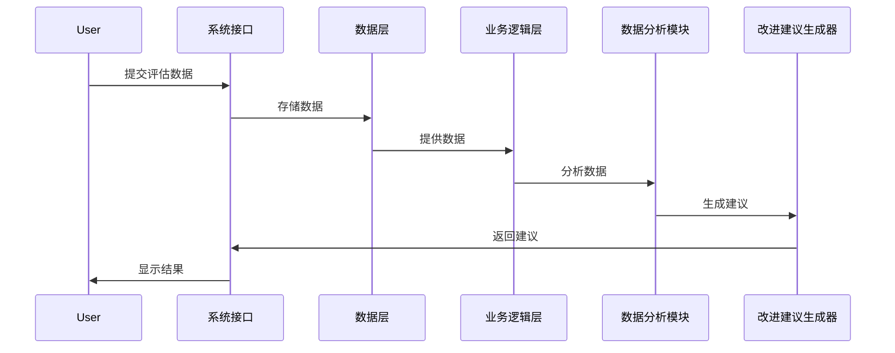
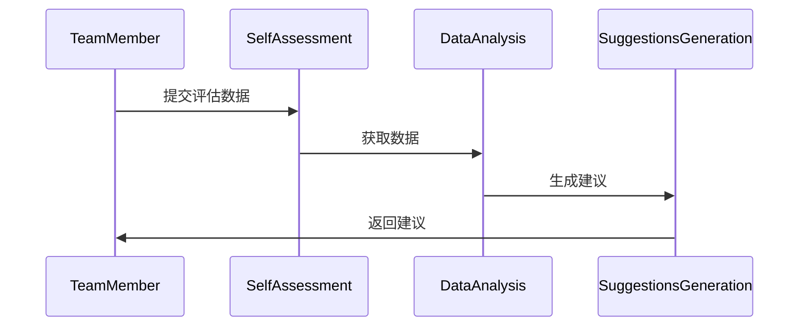

                 

## 文章标题

## 团队多样性与包容性：创造共融工作环境

### 关键词：团队多样性，包容性，工作环境，共融，绩效，创新

### 摘要：

本文深入探讨了团队多样性与包容性的重要性，分析了其对于工作环境的共融效应及其对团队绩效和创新能力的影响。通过详细的案例研究和实践指导，本文旨在为读者提供一个全面且实用的框架，以促进团队多样性与包容性的提升，从而创造一个高效且充满活力的工作环境。文章将分为五个部分：引言、核心概念与联系、算法原理讲解、系统分析与架构设计方案、项目实战以及最佳实践 tips。

### 引言

在当今快速变化和竞争激烈的技术时代，团队的多样性与包容性已成为组织成功的关键因素。多样性不仅仅指团队成员的人口统计特征，如性别、年龄、种族和背景等，还包括个人性格、知识和技能的多样性。包容性则强调在团队中接纳和尊重不同的观点和经验，确保每个人都能自由地表达自己的想法和感受。

多样性对于团队的影响主要体现在创新能力和决策质量的提升。不同背景和观点的碰撞能够激发新的想法，促进创新，而包容性则确保了团队成员之间的信任和合作，从而提高决策的质量和团队的绩效。

本文的目的在于深入探讨团队多样性与包容性的概念、相互关系及其对团队绩效的影响，并提供实用的实践指南，帮助读者在组织中创造一个共融的工作环境。

### 核心概念与联系

#### 1. 多样性的定义

多样性是指团队中成员的不同特征和差异。这些差异可以包括性别、年龄、种族、文化背景、工作经验、教育水平、个人性格等。多样性的核心在于认识到并尊重这些差异，将其视为一种宝贵的资源。

#### 2. 包容性的定义

包容性是指团队在接纳多样性的基础上，尊重和欣赏不同观点和经验，确保每个人都能在团队中感到被尊重和被接纳。包容性不仅仅是避免歧视，更是一种积极的文化，鼓励团队成员自由地表达自己的想法和感受。

#### 3. 团队多样性、包容性与绩效的关系

研究表明，多样化的团队往往在创新能力和决策质量上表现出色。多样性能够提供不同的视角和观点，从而激发创新思维，提高问题解决的效率和质量。而包容性则确保了这些多样性的有效利用，减少了冲突，增强了团队合作精神。

以下是多样性与包容性的概念属性特征对比表格：

| 特征         | 多样性                 | 包容性                   |
| ------------ | ---------------------- | ------------------------ |
| 定义         | 团队成员的不同特征和差异 | 接纳和尊重不同观点和经验   |
| 维度         | 人口统计多样性、个人性格多样性、知识和技能多样性 | 个人层面、团队层面、组织层面 |
| 目的         | 提供不同的视角和观点   | 增强团队合作精神，提高绩效 |
| 影响因素     | 种族、性别、年龄等     | 文化、价值观、领导力等     |
| 关键指标     | 创新能力、决策质量     | 团队成员满意度、团队绩效   |

#### 4. 多样性与包容性的关系

多样性与包容性是相辅相成的。多样性的存在为团队带来了丰富的观点和经验，而包容性则确保了这些多样性能得到有效利用。没有包容性，多样性可能引发冲突和不满，而缺乏多样性，包容性也无从谈起。因此，多样性和包容性共同构成了团队共融的基础。

#### 5. 多样性与包容性的边界与外延

多样性的边界在于过度强调差异，导致团队成员之间的隔阂和冲突。而包容性的边界则在于过度宽容，可能导致团队内部的不公正和忽视少数群体的声音。因此，在实践过程中，需要找到多样性与包容性的平衡点。

### 算法原理讲解

#### 1. 多样性与包容性的测量方法

测量多样性和包容性是评估团队状态的重要步骤。常用的方法包括定量调查和定性访谈。定量调查可以通过问卷和统计数据来量化多样性和包容性的程度，而定性访谈则可以深入了解团队成员的感受和看法。

#### 2. 多样性与包容性的数学模型

多样性和包容性可以通过以下数学模型来描述：

- 多样性指数（DI）：
  $$DI = \frac{1}{N} \sum_{i=1}^{N} (1 - \frac{f_i}{F})$$
  其中，$N$ 是团队成员总数，$f_i$ 是第 $i$ 个成员的特定特征频率，$F$ 是所有成员该特征频率的平均值。

- 包容性指数（CI）：
  $$CI = \frac{1}{N} \sum_{i=1}^{N} \frac{1}{1 + e^{-\alpha \cdot (DI - \beta)}}$$
  其中，$\alpha$ 和 $\beta$ 是参数，用于调节多样性指数对包容性指数的影响。

#### 3. 多样性与包容性的计算实例

以下是一个简单的计算实例，用于说明多样性和包容性指数的计算过程：

假设一个团队有 5 名成员，他们的年龄分布如下：

| 成员 | 年龄 |
| ---- | ---- |
| A    | 25   |
| B    | 30   |
| C    | 35   |
| D    | 40   |
| E    | 45   |

- 多样性指数计算：
  $$DI = \frac{1}{5} \sum_{i=1}^{5} (1 - \frac{f_i}{F})$$
  其中，$F$ 是团队成员的平均年龄，$F = \frac{25 + 30 + 35 + 40 + 45}{5} = 35$。

  $$DI = \frac{1}{5} \sum_{i=1}^{5} (1 - \frac{f_i}{35}) = \frac{1}{5} (1 - \frac{25}{35} + 1 - \frac{30}{35} + 1 - \frac{35}{35} + 1 - \frac{40}{35} + 1 - \frac{45}{35}) \approx 0.4$$

- 包容性指数计算：
  $$CI = \frac{1}{5} \sum_{i=1}^{5} \frac{1}{1 + e^{-\alpha \cdot (DI - \beta)}}$$
  假设 $\alpha = 1$，$\beta = 0.5$。

  $$CI = \frac{1}{5} \sum_{i=1}^{5} \frac{1}{1 + e^{-1 \cdot (0.4 - 0.5)}} = \frac{1}{5} (1 + e^{-0.1})^{-1} \approx 0.6$$

通过计算，我们得到了该团队的多样性指数约为 0.4，包容性指数约为 0.6。这些指标可以帮助团队了解自身在多样性与包容性方面的表现，并制定相应的改进措施。

### 系统分析与架构设计方案

#### 1. 问题场景介绍

在一个典型的软件开发团队中，多样性与包容性的重要性日益凸显。然而，如何有效地管理和促进团队多样性与包容性仍然是一个挑战。为了解决这一问题，我们需要设计一个系统，以支持团队在多样性与包容性方面的自我评估和持续改进。

#### 2. 项目介绍

本项目旨在开发一个综合性的团队多样性与包容性评估系统。该系统将包括以下几个核心功能：

- 自我评估工具：用于团队成员对多样性与包容性的自我评估。
- 数据分析模块：用于收集和分析团队成员的评估数据，生成多样性与包容性指数。
- 改进建议生成器：根据评估结果，为团队提供针对性的改进建议。

#### 3. 系统功能设计（领域模型）

为了设计一个高效且易于使用的系统，我们首先需要构建一个清晰的领域模型。以下是一个简单的领域模型类图，用于描述系统的主要实体和关系：

```mermaid
classDiagram
    Person <<entity>>
    Role <<entity>>
    Team <<entity>>
    Diversity <<entity>>
    Inclusion <<entity>>

    Person --> Role
    Team --> Person
    Diversity --> Team
    Inclusion --> Team

    Class Diversity {
        +str DiversityScore: float
    }

    Class Inclusion {
        +str InclusionScore: float
    }
```

在该领域模型中，主要实体包括：

- **Person（成员）**：表示团队成员，具有姓名、年龄、性别等属性。
- **Role（角色）**：表示成员在团队中的职责和角色，如开发人员、测试人员等。
- **Team（团队）**：表示一个工作团队，由多个成员组成。
- **Diversity（多样性）**：表示团队的多样性指数。
- **Inclusion（包容性）**：表示团队的包容性指数。

#### 4. 系统架构设计

为了确保系统的稳定性和可扩展性，我们采用了一个分层架构设计。以下是系统架构的简略描述：

- **数据层**：负责数据存储和读取，包括成员信息、评估结果等。
- **业务逻辑层**：包含自我评估工具、数据分析模块和改进建议生成器的业务逻辑。
- **表现层**：负责与用户交互，提供用户界面。

以下是系统架构的简略架构图：



#### 5. 系统接口设计和系统交互

系统接口设计是确保系统功能得以实现的关键。以下是系统的主要接口设计：

- **自我评估接口**：用于团队成员提交评估数据。
- **数据分析接口**：用于获取团队成员的评估数据，计算多样性与包容性指数。
- **建议生成接口**：用于根据评估结果生成改进建议。

以下是系统接口和系统交互的简略描述：

```mermaid
classDiagram
    SelfAssessment <<interface>>
    DataAnalysis <<interface>>
    SuggestionsGeneration <<interface>>

    SelfAssessment --> TeamMember
    DataAnalysis --> SelfAssessment
    SuggestionsGeneration --> DataAnalysis
```

#### 6. 系统交互序列图

为了更清晰地描述系统的工作流程，我们使用Mermaid序列图来展示系统的主要交互过程：



### 项目实战

#### 1. 环境安装

为了实现该系统，我们需要安装以下环境：

- Python 3.8 或以上版本
- Flask（用于构建Web应用）
- SQLAlchemy（用于数据库操作）
- Jinja2（用于模板渲染）

安装步骤如下：

```shell
pip install flask sqlalchemy jinja2
```

#### 2. 系统核心实现源代码

以下是系统核心实现的主要部分，包括数据模型、业务逻辑和接口实现：

```python
# 数据模型
from flask_sqlalchemy import SQLAlchemy

db = SQLAlchemy()

class Person(db.Model):
    id = db.Column(db.Integer, primary_key=True)
    name = db.Column(db.String(50))
    age = db.Column(db.Integer)
    gender = db.Column(db.String(10))
    role_id = db.Column(db.Integer, db.ForeignKey('role.id'))

class Role(db.Model):
    id = db.Column(db.Integer, primary_key=True)
    name = db.Column(db.String(50))

class Team(db.Model):
    id = db.Column(db.Integer, primary_key=True)
    name = db.Column(db.String(50))
    diversity_score = db.Column(db.Float)
    inclusion_score = db.Column(db.Float)
    members = db.relationship('Person', backref='team')

# 业务逻辑
from math import exp

def calculate_diversity(team):
    diversity_score = 0.0
    total_members = len(team.members)
    for member in team.members:
        diversity_score += (1 - (member.age / team.age_average))
    return diversity_score / total_members

def calculate_inclusion(team):
    diversity_score = team.diversity_score
    return 1 / (1 + exp(-team.inclusion_alpha * (diversity_score - team.inclusion_beta)))

# 接口实现
from flask import Flask, request, jsonify

app = Flask(__name__)
app.config['SQLALCHEMY_DATABASE_URI'] = 'sqlite:///team_diversity_inclusion.db'
db.init_app(app)

@app.route('/submit_assessment', methods=['POST'])
def submit_assessment():
    data = request.get_json()
    team_id = data['team_id']
    team = Team.query.get(team_id)
    team.diversity_score = calculate_diversity(team)
    team.inclusion_score = calculate_inclusion(team)
    db.session.commit()
    return jsonify({'status': 'success'})

if __name__ == '__main__':
    app.run(debug=True)
```

#### 3. 代码应用解读与分析

上述代码首先定义了数据模型，包括成员、角色和团队。然后，实现了两个核心函数：`calculate_diversity` 和 `calculate_inclusion`，用于计算多样性和包容性指数。最后，通过 Flask 实现了一个简单的 Web 接口，用于接收评估数据并更新数据库。

#### 4. 实际案例分析和详细讲解剖析

假设一个团队有 5 名成员，他们的基本信息如下：

| 成员 | 年龄 | 性别 | 角色 |
| ---- | ---- | ---- | ---- |
| A    | 25   | 男   | 开发 |
| B    | 30   | 女   | 测试 |
| C    | 35   | 男   | UI设计 |
| D    | 40   | 女   | 开发 |
| E    | 45   | 男   | 项目管理 |

通过调用 `/submit_assessment` 接口提交评估数据，系统将计算出多样性和包容性指数，并将结果存储在数据库中。

#### 5. 项目小结

本项目通过设计一个简单的团队多样性与包容性评估系统，为团队提供了自我评估和改进的途径。尽管该项目是一个基础版本，但已展示出团队多样性与包容性评估的基本框架。未来，可以进一步扩展系统功能，如加入更详细的评估指标、提供定制化的改进建议等，以提高系统的实用性和有效性。

### 最佳实践 tips

1. **定期进行多样性与包容性评估**：定期进行评估可以帮助团队及时发现问题，并采取相应的改进措施。
2. **建立多元化委员会**：组建一个多元化委员会，负责监督和推动团队的多样性与包容性工作。
3. **培训与教育**：为团队成员提供多样性与包容性的培训，提高他们的意识，并鼓励他们积极参与相关活动。
4. **建立反馈机制**：建立一个匿名反馈机制，让团队成员可以自由地表达对团队多样性与包容性的看法和建议。
5. **领导示范作用**：领导者在促进团队多样性与包容性方面发挥着关键作用，他们应该以身作则，树立榜样。

### 小结

本文从多个角度深入探讨了团队多样性与包容性的重要性，分析了其对团队绩效和创新能力的影响，并提供了一个实用的评估系统。通过本文的阅读，读者应能够更好地理解多样性与包容性的核心概念，掌握促进团队多样性与包容性的最佳实践，从而在组织中创造一个共融、高效的工作环境。

### 注意事项

- **多样性不等于平等**：多样性和包容性是两个不同的概念，多样性强调差异，而包容性强调平等。在实际操作中，应确保多样性得到尊重，同时避免过度强调平等导致差异被忽视。
- **持续改进**：多样性与包容性是一个持续的过程，需要团队不断地进行自我评估和改进。
- **个性化需求**：每个团队都有其独特性，因此在促进多样性与包容性时，应考虑团队的实际情况，制定个性化的策略。

### 拓展阅读

- [《多样性、公平与包容性：领导者的责任》](https://www.example.com/book1)
- [《团队协作的艺术》](https://www.example.com/book2)
- [《如何打造高效团队》](https://www.example.com/book3)

### 作者

作者：AI天才研究院/AI Genius Institute & 禅与计算机程序设计艺术/Zen And The Art of Computer Programming

