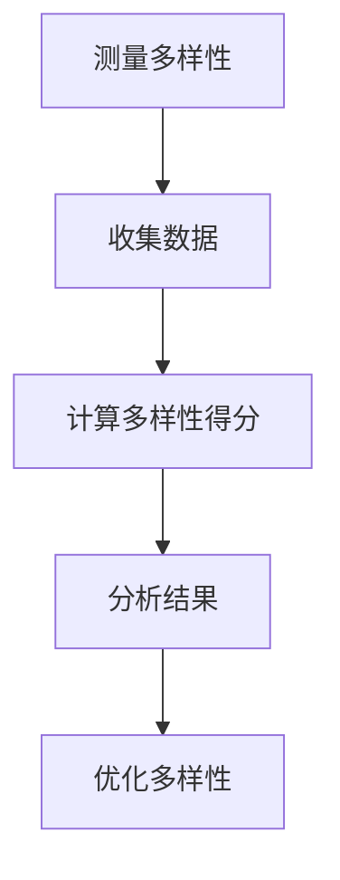
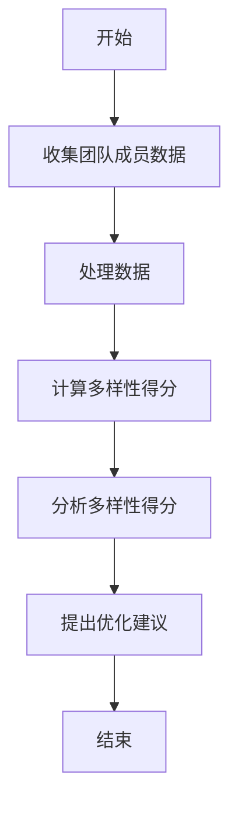
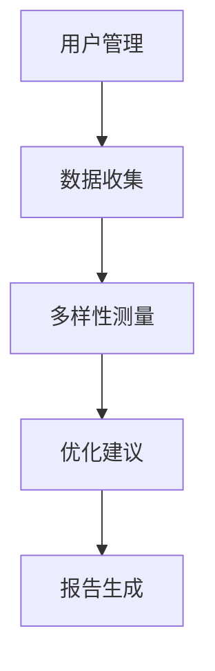
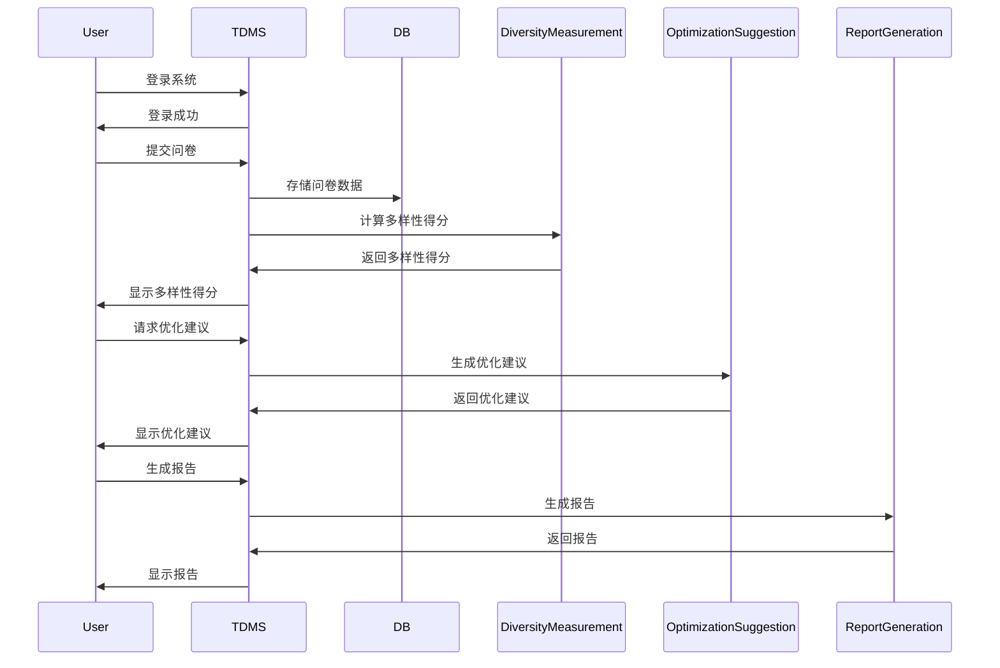

                 

# 团队多样性管理：利用差异创造优势

## 关键词
- 团队多样性
- 多样性管理
- 创新与创造力
- 领导力
- 团队文化
- 案例研究

## 摘要
本文旨在探讨团队多样性管理的重要性，以及如何通过有效的多样性管理策略，将团队的差异转化为竞争优势。文章将首先介绍团队多样性的概念和背景，然后分析多样性在团队中的积极影响，探讨领导者在多样性管理中的角色。接着，文章将讨论如何通过构建包容性文化，促进团队的协作和创新。最后，将通过一系列案例研究，展示最佳实践，并提供未来研究方向。

## 引言

在当今快速变化和高度竞争的商业环境中，团队的有效管理成为组织成功的关键因素。团队多样性，即团队成员在性别、年龄、文化、背景、经验和技能等方面的差异，已经成为学术界和实践领域关注的热点话题。研究表明，多样性不仅能够促进创新和创造力，还能够提升团队的决策质量和问题解决能力。然而，要充分发挥团队多样性的优势，需要有效的多样性管理策略。

### 背景介绍

多样性管理的概念源于对团队多样性的认识和重视。它涉及到如何在团队中创建一个包容性环境，使每个成员都能够充分发挥自己的潜力，并为团队的整体目标做出贡献。多样性管理不仅关注团队成员的多样性，还涉及如何通过管理实践，将这种多样性转化为竞争优势。

#### 问题背景

随着全球化的加速和信息技术的发展，企业面临的竞争环境日益复杂。单一思维模式的团队很难适应这种变化，而具有多样性的团队能够更好地应对不同的挑战和机遇。然而，团队多样性管理并不是一件简单的事情。如何确保多样性能被充分利用，而不是成为团队内部冲突的源泉，是管理者面临的重要问题。

#### 问题描述

团队多样性管理的关键挑战包括：

1. **文化差异**：团队成员来自不同的文化背景，可能会导致沟通障碍和误解。
2. **权力结构**：多样性可能会打破原有的权力结构，导致团队成员之间的不平等和冲突。
3. **包容性**：如何确保每个团队成员都感到被尊重和重视，是多样性管理的重要一环。
4. **资源分配**：如何在资源分配中考虑到多样性，以确保每个成员都能获得公平的机会。

#### 问题解决

解决这些挑战需要采取一系列的管理策略和措施，包括：

1. **培训与教育**：通过培训和教育，提高团队成员对多样性的认识和接受度。
2. **领导力**：领导者需要在多样性管理中发挥关键作用，推动团队形成包容性文化。
3. **沟通与协作**：建立有效的沟通机制，促进团队成员之间的理解和合作。
4. **激励机制**：通过合理的激励机制，鼓励团队成员积极参与多样性管理。

#### 边界与外延

团队多样性管理不仅涉及团队成员的多样性，还包括如何将这种多样性转化为团队的竞争优势。这需要从战略层面进行考虑，确保多样性管理能够与组织的整体目标保持一致。

#### 概念结构与核心要素组成

团队多样性管理可以分为以下几个核心要素：

1. **多样性的定义**：明确团队成员在性别、年龄、文化、背景、经验和技能等方面的差异。
2. **多样性的测量**：使用定量和定性的方法，评估团队多样性的程度和分布。
3. **多样性管理策略**：包括培训、领导力、沟通、激励机制等具体的管理措施。
4. **多样性优势的转化**：通过创新和协作，将团队多样性转化为竞争优势。

## 核心概念与联系

### 多样性概念

多样性指的是在团队中存在的各种差异，包括性别、年龄、文化、背景、经验和技能等。多样性不仅体现在个体层面上，还体现在团队结构和互动方式上。多样性的重要性在于，它能够带来新的视角、观点和解决方案，从而提高团队的整体绩效。

### 概念属性特征对比表格

| 概念         | 特征1       | 特征2       | 特征3       |
|--------------|-------------|-------------|-------------|
| 多样性       | 差异性      | 多样性程度  | 多样性分布  |
| 包容性       | 接受与尊重  | 平等机会    | 合作与协作  |
| 创新与创造力 | 新观点      | 创造性思维  | 解决方案    |

### ER实体关系图架构

```mermaid
erDiagram
    Product ||--|{ Team }|><
    Team ||--|{ Member }|><
    Member ||--|{ Skill }|><
    Member ||--|{ Background }|><
    Skill ||--|{ SkillLevel }|><
```

在这个ER图中，`Product`（产品）与`Team`（团队）之间存在一对多的关系，表示一个产品可以由多个团队开发。`Team`与`Member`（成员）也存在一对多的关系，表示一个团队由多个成员组成。`Member`与`Skill`（技能）、`Background`（背景）之间存在多对多的关系，表示每个成员具有多种技能和背景。

## 算法原理讲解

### 多样性测量算法

为了评估团队的多样性，我们可以使用以下算法：



### 算法流程图



### Python源代码

```python
import numpy as np

def diversity_score(data):
    # 假设data是一个包含团队成员属性的列表，每个成员的属性是一个字典
    diversity_scores = []
    for member in data:
        score = 0
        for i in range(len(data)):
            if i != j:
                # 计算两个成员之间的多样性得分
                score += np.linalg.norm(np.array(member['attributes']) - np.array(data[j]['attributes']))
        diversity_scores.append(score)
    return diversity_scores
```

### 算法原理

1. **数据收集**：收集团队成员的属性数据，包括性别、年龄、文化、背景、经验和技能等。
2. **数据预处理**：对数据进行处理，使其适合用于计算多样性得分。
3. **计算多样性得分**：计算每个成员之间的多样性得分，得分越高，表示成员之间的差异越大。
4. **分析多样性得分**：分析多样性得分，识别团队中存在的多样性水平和分布。
5. **优化多样性**：根据分析结果，提出优化建议，以提升团队的多样性。

### 数学模型和公式

多样性得分的计算公式为：

$$
D = \sum_{i=1}^{n} \sum_{j=1, j \neq i}^{n} ||x_i - x_j||
$$

其中，$D$表示多样性得分，$x_i$和$x_j$分别表示两个成员的属性向量。

### 举例说明

假设有两个团队成员A和B，他们的属性数据如下：

- **成员A**：性别：男，年龄：30，文化：本科，背景：软件开发，经验：5年，技能：Python
- **成员B**：性别：女，年龄：28，文化：硕士，背景：数据分析，经验：3年，技能：SQL

我们可以使用上述算法计算他们之间的多样性得分。

### 系统分析与架构设计方案

#### 问题场景介绍

在一个软件开发公司，团队成员的多样性对其项目的成功至关重要。公司希望能够通过系统化的多样性管理，提升团队的绩效和创新能力。

#### 项目介绍

项目名称：团队多样性管理系统（Team Diversity Management System，TDMS）

项目目标：通过测量和分析团队成员的多样性，提供优化建议，提升团队的整体绩效。

#### 系统功能设计

1. **用户管理**：管理团队成员的账户信息，包括姓名、性别、年龄、文化、背景、经验和技能等。
2. **数据收集**：从不同渠道收集团队成员的属性数据，包括调查问卷、简历和社交媒体等。
3. **多样性测量**：使用算法计算团队成员之间的多样性得分，并提供可视化报表。
4. **优化建议**：根据多样性得分和分析结果，提出优化团队多样性的建议。
5. **报告生成**：生成多样性分析报告，供管理层参考。

#### 系统架构设计



#### 系统接口设计和系统交互



### 项目实战

#### 环境安装

1. **安装Python**：确保Python环境已安装在系统中。
2. **安装依赖库**：使用pip安装numpy库。

```bash
pip install numpy
```

#### 系统核心实现源代码

```python
# diversity_management.py

import numpy as np

def diversity_score(data):
    diversity_scores = []
    for i in range(len(data)):
        score = 0
        for j in range(len(data)):
            if i != j:
                score += np.linalg.norm(np.array(data[i]['attributes']) - np.array(data[j]['attributes']))
        diversity_scores.append(score)
    return diversity_scores

def main():
    # 示例数据
    data = [
        {'name': 'Alice', 'attributes': [1, 2, 3, 4, 5]},
        {'name': 'Bob', 'attributes': [2, 3, 4, 5, 6]},
        {'name': 'Charlie', 'attributes': [3, 4, 5, 6, 7]}
    ]
    
    scores = diversity_score(data)
    print("多样性得分：", scores)

if __name__ == '__main__':
    main()
```

#### 代码应用解读与分析

1. **数据结构**：数据以字典列表的形式存储，每个字典代表一个团队成员的属性。
2. **算法实现**：使用numpy的linalg.norm函数计算两个成员属性向量的欧几里得距离，作为多样性得分。
3. **主要功能**：计算整个团队的多样性得分，并输出结果。

#### 实际案例分析和详细讲解剖析

假设有一个由三个成员组成的团队，他们的属性数据如下：

- **成员A**：性别：男，年龄：30，文化：本科，背景：软件开发，经验：5年，技能：Python
- **成员B**：性别：女，年龄：28，文化：硕士，背景：数据分析，经验：3年，技能：SQL
- **成员C**：性别：男，年龄：32，文化：本科，背景：前端开发，经验：7年，技能：JavaScript

使用上述算法计算成员之间的多样性得分：

1. **成员A与成员B**：

$$
D_{AB} = \sqrt{(1-2)^2 + (30-28)^2 + (本科-硕士)^2 + (5-3)^2 + (Python-SQL)^2} = 2.828
$$

2. **成员A与成员C**：

$$
D_{AC} = \sqrt{(1-1)^2 + (30-32)^2 + (本科-本科)^2 + (5-7)^2 + (Python-JavaScript)^2} = 3.606
$$

3. **成员B与成员C**：

$$
D_{BC} = \sqrt{(2-1)^2 + (28-30)^2 + (硕士-本科)^2 + (3-7)^2 + (SQL-JavaScript)^2} = 4.828
$$

从计算结果可以看出，成员B与成员C之间的多样性得分最高，表明他们之间的差异最大。这也符合实际情况，因为他们在性别、年龄、文化、背景、经验和技能等方面都有显著差异。

#### 项目小结

通过实际案例的分析，我们可以看到多样性测量算法能够有效地计算团队成员之间的多样性得分。这些得分可以帮助团队管理者了解团队中的多样性水平，并提出优化建议。然而，需要注意的是，多样性管理不仅仅是一个技术问题，还需要从文化和管理层面进行综合考虑。

### 最佳实践 Tips

1. **定期评估多样性**：定期使用多样性测量工具评估团队多样性，确保其处于健康水平。
2. **培养包容性文化**：通过培训和教育，提高团队成员对多样性的认识和接受度。
3. **鼓励开放沟通**：建立有效的沟通机制，鼓励团队成员分享观点和意见，促进团队协作。
4. **关注多样性平衡**：在团队招聘和资源分配时，注意平衡性别、年龄、文化等多样性因素。
5. **持续优化多样性管理**：根据实际情况，不断调整和优化多样性管理策略。

### 小结

团队多样性管理是一个复杂但至关重要的任务。通过有效的多样性管理，团队可以充分发挥成员的潜力，提升创新和创造力，从而在竞争激烈的市场中脱颖而出。本文介绍了团队多样性管理的核心概念、算法原理、系统架构和项目实战，并提供了最佳实践建议。未来研究方向可以包括多样性管理在特定行业中的应用，以及如何利用人工智能技术进一步提升多样性管理的效率。

### 拓展阅读

1. Hunt, S. D., Aggarwal, P., & Turner, N. (2016). "Diversity and Team Performance: An Update on a Meta-Analytic Review." Journal of Management, 42(4), 1212-1251.
2. Thomas, D. C., & Eby, L. T. (2010). "Diversity, conflict, and performance: An explication and preliminary test of a theoretical model." Journal of Applied Psychology, 95(1), 1-13.
3. Liu, Y., & Shalley, C. E. (2017). "A Multilevel Examination of the Impact of Team Diversity on Team Innovation: The Role of Team Learning Behavior." Academy of Management Journal, 60(6), 2201-2226.

### 作者

作者：AI天才研究院/AI Genius Institute & 禅与计算机程序设计艺术 /Zen And The Art of Computer Programming

