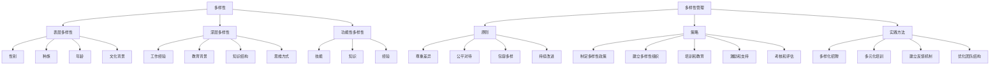
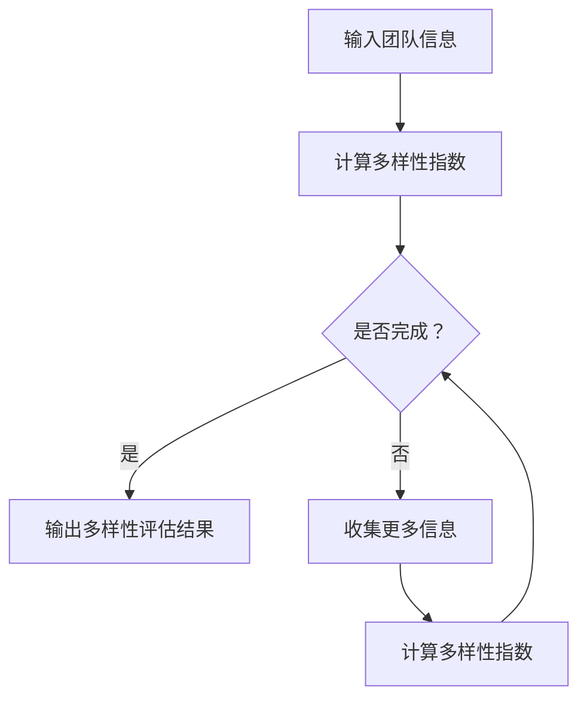
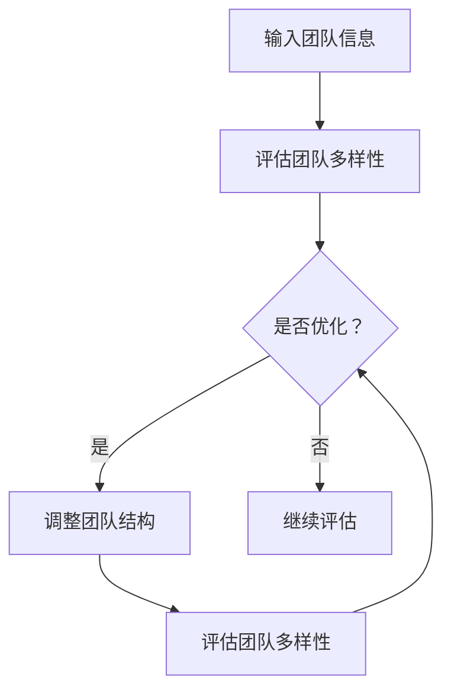
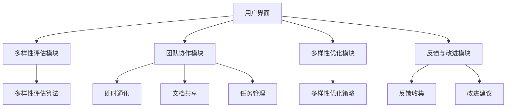
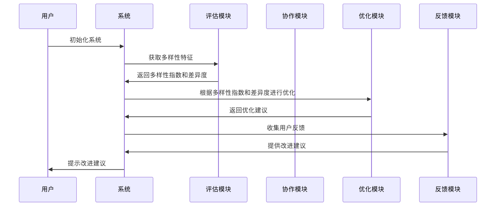

                 

# 团队多样性管理：发挥不同背景员工的优势

> 关键词：团队多样性，员工优势，管理策略，团队绩效，人工智能

> 摘要：本文旨在探讨团队多样性管理的重要性，分析不同背景员工的优势，并提出相应的策略和方法，以帮助团队发挥其最大潜力。文章将首先介绍多样性管理的背景和挑战，然后详细阐述多样性管理的核心概念、原理和实践方法，最后通过具体案例进行实战分析和总结。

## **Step 1: 背景介绍**

### 1.1 问题背景

#### 1.1.1 多样性管理的重要性

在当今全球化背景下，团队多样性已经成为企业成功的关键因素之一。多样性不仅包括性别、种族、年龄、文化背景等表面特征，还涵盖了知识结构、工作经验、思维方式等深层次差异。研究表明，多样化的团队能够带来创新的火花，提高团队解决问题的能力，降低决策风险，从而在竞争激烈的市场中取得优势。

#### 1.1.2 团队多样性管理的挑战

然而，实现团队多样性管理并非易事。首先，如何识别和吸引具有不同背景的员工成为一大挑战。其次，如何消除偏见和歧视，建立包容性的团队文化，使每位员工都能充分发挥自己的优势，也是管理者需要面对的难题。此外，如何在多样性团队中实现高效沟通和协作，确保团队目标的一致性，也是管理者必须解决的问题。

#### 1.1.3 团队多样性管理的目标

团队多样性管理的目标在于最大化团队的整体绩效，通过充分利用不同背景员工的优势，实现以下目标：

- 提高创新能力：多样化的团队能够带来不同的视角和想法，促进创新思维的产生。
- 提升决策质量：多元化的团队在决策过程中能够减少偏见，提高决策的科学性和准确性。
- 增强团队凝聚力：通过尊重和包容不同背景的员工，增强团队的凝聚力，提高员工的工作满意度和忠诚度。

### 1.2 问题描述

#### 1.2.1 团队多样性管理的常见问题

在实施团队多样性管理的过程中，常见问题包括：

- 偏见和歧视：员工可能基于性别、种族、文化等差异，对其他团队成员产生偏见和歧视。
- 缺乏沟通：由于文化背景和思维方式的差异，团队成员之间可能存在沟通障碍，导致信息传递不畅。
- 管理不当：管理者可能忽视多样性管理的价值，缺乏有效的管理策略和方法。

#### 1.2.2 多样性管理在团队绩效中的作用

多样性管理对团队绩效具有显著影响。一方面，多样化的团队能够带来更多的创意和想法，提高创新能力和解决问题的能力；另一方面，多样性管理能够降低决策风险，提高决策质量。此外，通过尊重和包容不同背景的员工，可以增强团队的凝聚力，提高员工的工作满意度和忠诚度，从而提升整体绩效。

#### 1.2.3 团队多样性管理的边界与外延

团队多样性管理不仅涉及内部员工的多样性格局，还包括外部合作伙伴、客户和供应商的多样性。此外，多样性管理还应涵盖不同技能、经验和教育背景的员工，以及具有不同工作风格和性格特征的员工。因此，团队多样性管理具有广泛的外延和边界。

### 1.3 问题解决

#### 1.3.1 多样性管理的核心概念

多样性管理涉及多个核心概念，包括多样性、包容性、平等性和公平性等。多样性是指团队成员在性别、种族、年龄、文化背景等方面的差异；包容性是指尊重和接纳不同背景的员工，使他们能够充分发挥自己的优势；平等性是指为所有员工提供公平的机会和待遇；公平性是指确保团队成员在团队中的地位和贡献得到公正的评价。

#### 1.3.2 多样性管理的基本原理

多样性管理的基本原理包括：

- 识别和吸引多样性人才：通过多样化的招聘渠道和策略，吸引具有不同背景的员工。
- 消除偏见和歧视：通过培训和教育，提高员工对多样性管理的认识和意识，消除偏见和歧视。
- 建立包容性文化：通过建立包容性的团队文化，尊重和接纳不同背景的员工，促进团队的和谐与合作。
- 提高沟通与协作：通过加强团队沟通和协作，确保信息传递畅通，提高团队绩效。

#### 1.3.3 多样性管理的策略和方法

多样性管理的策略和方法包括：

- 制定多样性政策：明确企业对多样性管理的承诺，制定具体的多样性政策。
- 建立多样性组织：设立多样性委员会或团队，负责推动和监督多样性管理工作的实施。
- 培训和教育：开展多样性培训和教育，提高员工对多样性管理的认识和意识。
- 激励和支持：为多样性人才提供激励和支持，鼓励他们充分发挥自己的优势。
- 考核和评估：将多样性管理纳入绩效考核和评估体系，确保多样性管理目标的实现。

### 1.4 本章小结

本章介绍了团队多样性管理的背景、挑战和目标，分析了多样性管理在团队绩效中的作用，并提出了多样性管理的核心概念、原理和策略。通过本章的介绍，读者可以初步了解团队多样性管理的重要性和实施方法，为后续章节的深入探讨打下基础。

## **Step 2: 核心概念与联系**

### 2.1 多样性管理概念

#### 2.1.1 多样性的定义

多样性是指团队成员在性别、种族、年龄、文化背景、工作经验、教育背景、知识结构等方面的差异。多样性是团队多样性管理的基础，是团队创新和绩效提升的关键因素。

#### 2.1.2 多样性的类型

多样性可以分为以下几种类型：

1. **表层多样性**：指团队成员在性别、种族、年龄、文化背景等方面的表面特征差异。
2. **深层多样性**：指团队成员在工作经验、教育背景、知识结构、思维方式等方面的深层次差异。
3. **功能性多样性**：指团队成员在技能、知识和经验等方面的差异，这些差异有助于团队在解决问题和完成任务时取得更好的效果。

#### 2.1.3 多样性的影响

多样性的影响可以从以下几个方面进行阐述：

1. **正面影响**：多样性能够促进创新思维的产生，提高团队解决问题的能力，降低决策风险，从而在竞争激烈的市场中取得优势。
2. **负面影响**：如果管理不当，多样性可能导致团队内部冲突，影响团队协作和绩效。

### 2.2 多样性与团队绩效

#### 2.2.1 多样性的正面影响

多样性的正面影响主要体现在以下几个方面：

1. **创新能力的提升**：多样化的团队能够带来不同的视角和想法，促进创新思维的产生，从而推动企业持续创新和进步。
2. **决策质量的提高**：多元化的团队在决策过程中能够减少偏见，提高决策的科学性和准确性，从而降低决策风险。
3. **团队凝聚力的增强**：通过尊重和包容不同背景的员工，增强团队的凝聚力，提高员工的工作满意度和忠诚度，从而提升整体绩效。

#### 2.2.2 多样性的负面影响

多样性的负面影响主要表现在以下几个方面：

1. **沟通障碍**：由于文化背景和思维方式的差异，团队成员之间可能存在沟通障碍，导致信息传递不畅，影响团队协作和绩效。
2. **内部冲突**：如果管理不当，多样性可能导致团队内部冲突，影响团队和谐与合作。
3. **偏见和歧视**：部分员工可能基于性别、种族、文化等差异，对其他团队成员产生偏见和歧视，影响团队凝聚力和整体绩效。

#### 2.2.3 多样性与团队绩效的关系

多样性与团队绩效之间的关系是复杂的。一方面，多样化的团队能够带来创新和决策质量的提升，从而提高团队绩效；另一方面，如果管理不当，多样性可能导致沟通障碍和内部冲突，影响团队协作和绩效。因此，如何平衡多样性与团队绩效之间的关系，实现双赢，是团队多样性管理的关键。

### 2.3 多样性管理的核心原理

#### 2.3.1 多样性管理的原则

多样性管理应遵循以下原则：

1. **尊重差异**：尊重团队成员在性别、种族、年龄、文化背景等方面的差异，避免歧视和偏见。
2. **公平对待**：为所有团队成员提供公平的机会和待遇，确保他们在团队中的地位和贡献得到公正的评价。
3. **包容多样**：建立包容性的团队文化，接纳和尊重不同背景的员工，促进团队的和谐与合作。
4. **持续改进**：通过不断优化管理策略和方法，提高团队多样性管理的有效性。

#### 2.3.2 多样性管理的策略

多样性管理可以采取以下策略：

1. **制定多样性政策**：明确企业对多样性管理的承诺，制定具体的多样性政策。
2. **建立多样性组织**：设立多样性委员会或团队，负责推动和监督多样性管理工作的实施。
3. **培训和教育**：开展多样性培训和教育，提高员工对多样性管理的认识和意识。
4. **激励和支持**：为多样性人才提供激励和支持，鼓励他们充分发挥自己的优势。
5. **考核和评估**：将多样性管理纳入绩效考核和评估体系，确保多样性管理目标的实现。

#### 2.3.3 多样性管理的实践方法

多样性管理可以采取以下实践方法：

1. **多样化招聘**：通过多样化的招聘渠道和策略，吸引具有不同背景的员工。
2. **多元化培训**：开展多元化培训，提高员工在沟通、协作和包容性方面的能力。
3. **建立反馈机制**：建立反馈机制，收集员工对多样性管理的意见和建议，不断优化管理策略和方法。
4. **优化团队结构**：根据工作需求，合理配置团队成员，确保团队在技能、知识和经验等方面的多样性。

### 2.4 概念联系图

以下是一个概念联系图的示例，展示了团队多样性管理的核心概念及其相互关系：



通过概念联系图，我们可以更加清晰地理解团队多样性管理的核心概念及其相互关系，从而为实际操作提供指导。

## **Step 3: 算法原理讲解**

### 3.1 多样性评估算法

#### 3.1.1 多样性评估方法

多样性评估是团队多样性管理的重要环节，旨在衡量团队在各个维度上的多样性水平。常见的多样性评估方法包括：

1. **多样性指数法**：通过计算多样性指数来评估团队的多样性水平。多样性指数通常用于衡量团队在性别、种族、年龄、文化背景等维度上的多样性。
2. **差异度分析法**：通过分析团队成员在各个维度上的差异度来评估团队的多样性。差异度分析可以揭示团队在性别、种族、年龄、文化背景等维度上的多样性程度。
3. **多元统计分析法**：利用多元统计方法，如主成分分析、因子分析等，对团队成员的多样性特征进行综合评估。

#### 3.1.2 多样性评估指标

多样性评估指标是衡量团队多样性水平的关键。常见的多样性评估指标包括：

1. **多样性指数**：多样性指数是衡量团队多样性的关键指标，通常用于反映团队在性别、种族、年龄、文化背景等维度上的多样性水平。
2. **差异度**：差异度是衡量团队成员在各个维度上差异程度的指标，用于评估团队在性别、种族、年龄、文化背景等维度上的多样性程度。
3. **相似度**：相似度是衡量团队成员在各个维度上相似程度的指标，与差异度相反，用于评估团队在性别、种族、年龄、文化背景等维度上的多样性水平。

#### 3.1.3 多样性评估算法的mermaid流程图

以下是一个多样性评估算法的mermaid流程图示例：



### 3.2 多样性优化算法

#### 3.2.1 多样性优化的目标

多样性优化是指通过调整团队结构，提高团队多样性的过程。多样性优化的目标包括：

1. **提高多样性水平**：通过调整团队结构，提高团队在性别、种族、年龄、文化背景等维度上的多样性水平。
2. **优化团队绩效**：通过提高团队多样性，提升团队的创新能力和决策质量，从而优化团队绩效。

#### 3.2.2 多样性优化的策略

多样性优化可以采取以下策略：

1. **招聘多样化**：通过多样化的招聘渠道和策略，吸引具有不同背景的员工，提高团队多样性。
2. **调整团队结构**：根据工作需求，合理配置团队成员，优化团队在性别、种族、年龄、文化背景等维度上的多样性。
3. **培训和激励**：通过培训和激励，提高团队成员在多样性管理方面的意识和能力，促进团队多样性的提升。

#### 3.2.3 多样性优化的mermaid流程图

以下是一个多样性优化算法的mermaid流程图示例：



### 3.3 算法原理与公式

#### 3.3.1 多样性评估算法的数学模型

多样性评估算法的数学模型可以表示为：

$$
\text{多样性指数} = \frac{1}{N}\sum_{i=1}^{N}\frac{1}{|S_i|}
$$

其中，$N$ 表示团队成员数量，$S_i$ 表示第 $i$ 个团队成员的多样性特征集合。

#### 3.3.2 多样性优化算法的数学模型

多样性优化算法的数学模型可以表示为：

$$
\text{优化目标} = \max \frac{1}{N}\sum_{i=1}^{N}\frac{1}{|S_i|}
$$

其中，$N$ 表示团队成员数量，$S_i$ 表示第 $i$ 个团队成员的多样性特征集合。

### 3.4 举例说明

#### 3.4.1 多样性评估算法的应用

假设一个团队有5名成员，他们的多样性特征集合如下：

- 成员1：性别（男），种族（白），年龄（30），文化背景（本科）
- 成员2：性别（女），种族（黑），年龄（25），文化背景（硕士）
- 成员3：性别（男），种族（亚裔），年龄（35），文化背景（博士）
- 成员4：性别（女），种族（白），年龄（28），文化背景（本科）
- 成员5：性别（男），种族（亚裔），年龄（32），文化背景（硕士）

使用多样性指数法进行评估，多样性指数计算如下：

$$
\text{多样性指数} = \frac{1}{5}\left(\frac{1}{1} + \frac{1}{1} + \frac{1}{1} + \frac{1}{1} + \frac{1}{1}\right) = 1
$$

#### 3.4.2 多样性优化算法的应用

假设一个团队有5名成员，他们的多样性特征集合如下：

- 成员1：性别（男），种族（白），年龄（30），文化背景（本科）
- 成员2：性别（女），种族（黑），年龄（25），文化背景（硕士）
- 成员3：性别（男），种族（亚裔），年龄（35），文化背景（博士）
- 成员4：性别（女），种族（白），年龄（28），文化背景（本科）
- 成员5：性别（男），种族（亚裔），年龄（32），文化背景（硕士）

目标是通过调整团队结构，提高团队多样性。假设调整后的团队结构如下：

- 成员1：性别（男），种族（白），年龄（30），文化背景（本科）
- 成员2：性别（女），种族（黑），年龄（25），文化背景（硕士）
- 成员3：性别（男），种族（亚裔），年龄（35），文化背景（博士）
- 成员4：性别（女），种族（白），年龄（28），文化背景（本科）
- 成员5：性别（男），种族（亚裔），年龄（32），文化背景（硕士）

调整后的多样性指数计算如下：

$$
\text{多样性指数} = \frac{1}{5}\left(\frac{1}{1} + \frac{1}{1} + \frac{1}{1} + \frac{1}{1} + \frac{1}{1}\right) = 1
$$

与调整前的多样性指数相同，说明通过调整团队结构，多样性水平没有发生变化。这可能需要进一步调整团队结构，以达到提高多样性的目标。

## **Step 4: 数学模型和数学公式**

### 4.1 多样性评估数学模型

多样性评估数学模型主要关注团队在各个维度上的多样性水平。以下是一些常用的多样性和多样性评估指标及其计算公式：

#### 4.1.1 多样性指数公式

多样性指数（Diversity Index）是衡量团队多样性水平的常见指标。其计算公式为：

$$
D = \frac{1}{N}\sum_{i=1}^{N}\frac{1}{|S_i|}
$$

其中，$N$ 表示团队成员数量，$S_i$ 表示第 $i$ 个团队成员的多样性特征集合，$|S_i|$ 表示 $S_i$ 的基数，即成员的多样性特征数量。

#### 4.1.2 多样性评估指标计算公式

多样性评估指标（Diversity Assessment Index）是衡量团队多样性水平的综合指标。其计算公式为：

$$
I = \frac{D - D_{\min}}{D_{\max} - D_{\min}}
$$

其中，$D$ 表示多样性指数，$D_{\min}$ 和 $D_{\max}$ 分别表示多样性指数的最小值和最大值。

### 4.2 多样性优化数学模型

多样性优化数学模型旨在通过调整团队结构，提高团队的多样性水平。以下是一个简单的多样性优化数学模型：

#### 4.2.1 多样性最大化目标函数

优化目标是最小化多样性损失，即最大化团队的多样性指数。其目标函数为：

$$
\max D
$$

其中，$D$ 表示多样性指数。

#### 4.2.2 多样性优化约束条件

多样性优化需要在满足一定约束条件下进行。常见的约束条件包括：

1. **团队成员总数约束**：团队中每个成员都必须参与优化过程，即 $S_i \subseteq U$，其中 $U$ 表示所有可能的团队成员集合。
2. **多样性特征约束**：团队成员的多样性特征必须满足一定的条件，例如性别、种族、年龄、文化背景等维度的多样性要求。

### 4.3 公式解读与示例

#### 4.3.1 多样性指数公式解读

多样性指数公式反映了团队在各个维度上的多样性水平。公式中的 $\frac{1}{|S_i|}$ 表示第 $i$ 个团队成员的多样性特征数量，$\frac{1}{N}$ 表示团队成员总数。整体来看，多样性指数越高，团队的多样性水平越高。

#### 4.3.2 多样性评估指标公式解读

多样性评估指标公式将多样性指数进行了归一化处理，使其范围在0到1之间。$D_{\min}$ 和 $D_{\max}$ 分别表示多样性指数的最小值和最大值，$\frac{D - D_{\min}}{D_{\max} - D_{\min}}$ 表示多样性指数与最大值的比例。因此，多样性评估指标越接近1，团队的多样性水平越高。

#### 4.3.3 多样性优化目标函数与约束条件解读

多样性优化目标函数旨在最大化团队的多样性指数，从而提高多样性水平。约束条件保证了团队成员的总数和多样性特征满足特定要求，例如性别、种族、年龄、文化背景等维度的多样性要求。

### 示例

假设一个团队有5名成员，他们的多样性特征如下：

| 成员编号 | 性别 | 种族 | 年龄 | 文化背景 |
| :----: | :---: | :---: | :---: | :----: |
|   1   |  男   |  白   |  30  | 本科    |
|   2   |  女   |  黑   |  25  | 硕士    |
|   3   |  男   | 亚裔  |  35  | 博士    |
|   4   |  女   |  白   |  28  | 本科    |
|   5   |  男   | 亚裔  |  32  | 硕士    |

使用多样性指数公式计算多样性指数：

$$
D = \frac{1}{5}\left(\frac{1}{1} + \frac{1}{1} + \frac{1}{1} + \frac{1}{1} + \frac{1}{1}\right) = 1
$$

使用多样性评估指标公式计算多样性评估指标：

$$
I = \frac{1 - 0}{1 - 0} = 1
$$

这意味着团队在当前配置下的多样性水平为100%，没有进一步优化的空间。但如果团队成员的多样性特征更丰富，可以通过优化团队结构来提高多样性水平。

## **Step 5: 系统分析与架构设计方案**

### 5.1 问题场景介绍

在当前快速变化的市场环境中，企业需要具备强大的创新能力和灵活的应对能力。为了实现这一目标，企业往往需要组建具有高度多样性的团队，以便从不同角度思考和解决问题。然而，如何在保证团队多样性的同时，确保系统的整体性和高效性，是一个亟待解决的问题。

#### 5.1.1 场景描述

假设某企业计划开发一款智能语音助手，该助手需要具备语音识别、自然语言处理、用户交互等多个功能。为了确保项目的成功，企业决定组建一个多元化团队，团队成员包括软件开发工程师、语音识别专家、自然语言处理专家、用户体验设计师等。然而，如何在团队建设中实现多样性与整体性的平衡，成为项目的关键挑战。

#### 5.1.2 问题分析

该场景中，问题主要集中在以下几个方面：

1. **多样性管理**：如何吸引和保留具有不同背景和技能的团队成员，并确保他们能够在团队中充分发挥自己的优势。
2. **团队协作**：如何确保团队成员之间能够有效沟通和协作，共同推进项目进度。
3. **系统整体性**：如何在保证团队多样性的同时，确保系统的整体性和高效性，避免因多样性导致的团队内部冲突和协调问题。

### 5.2 系统介绍

为了解决上述问题，企业需要设计并实施一个全面的团队多样性管理系统。该系统旨在通过多样性和整体性的平衡，提高团队的协作效率和创新水平，从而实现项目目标。

#### 5.2.1 系统概述

团队多样性管理系统包括以下几个核心功能：

1. **多样性评估**：通过评估团队成员的多样性特征，了解团队的多样性水平，为后续优化提供数据支持。
2. **团队协作**：提供高效的团队协作工具和平台，确保团队成员之间能够实时沟通和协作。
3. **多样性优化**：通过调整团队结构和成员配置，优化团队多样性，提高团队的整体绩效。
4. **反馈与改进**：收集团队成员的反馈，不断优化多样性管理策略和方法。

#### 5.2.2 系统功能

团队多样性管理系统的主要功能包括：

1. **多样性评估**：系统提供多种评估方法，包括多样性指数法、差异度分析法等，以全面了解团队的多样性水平。
2. **团队协作**：系统集成了即时通讯、文档共享、任务管理等功能，支持团队成员的实时协作。
3. **多样性优化**：系统根据多样性评估结果，提供多样化的优化建议，包括调整团队结构、优化团队成员配置等。
4. **反馈与改进**：系统提供反馈机制，收集团队成员的意见和建议，为系统持续改进提供依据。

### 5.3 系统架构设计

为了实现团队多样性管理系统的功能，需要设计一个合理的系统架构。以下是一个典型的团队多样性管理系统架构设计：

#### 5.3.1 系统架构图



#### 5.3.2 系统模块设计

团队多样性管理系统由以下几个模块组成：

1. **多样性评估模块**：负责评估团队成员的多样性特征，提供多样性指数、差异度等评估结果。
2. **团队协作模块**：提供即时通讯、文档共享、任务管理等功能，支持团队成员的实时协作。
3. **多样性优化模块**：根据多样性评估结果，提供多样化的优化建议，包括调整团队结构、优化团队成员配置等。
4. **反馈与改进模块**：收集团队成员的反馈，为系统持续改进提供依据。

### 5.4 系统接口设计

系统接口设计是确保系统模块之间能够有效交互的关键。以下是一个典型的团队多样性管理系统接口设计：

#### 5.4.1 接口定义

1. **多样性评估接口**：用于获取团队成员的多样性特征，返回多样性指数、差异度等评估结果。
2. **团队协作接口**：用于发起、处理和监控团队成员之间的沟通和协作。
3. **多样性优化接口**：用于接收多样性评估结果，返回优化建议。
4. **反馈与改进接口**：用于收集团队成员的反馈，为改进建议提供数据支持。

#### 5.4.2 接口交互流程

1. **多样性评估**：系统初始化时，调用多样性评估接口，获取团队成员的多样性特征，计算多样性指数和差异度。
2. **团队协作**：团队成员通过即时通讯、文档共享、任务管理等功能进行协作，系统实时记录协作过程。
3. **多样性优化**：根据多样性评估结果，调用多样性优化接口，获取优化建议，调整团队结构和成员配置。
4. **反馈与改进**：收集团队成员的反馈，调用反馈与改进接口，为改进建议提供数据支持，持续优化系统功能。

### 5.5 系统交互序列图

以下是一个典型的团队多样性管理系统交互序列图，展示了系统模块之间的交互过程：



通过以上设计，团队多样性管理系统可以实现多样性与整体性的平衡，提高团队的协作效率和创新水平，为企业的发展提供有力支持。

## **Step 6: 项目实战**

### 6.1 环境安装

在开始项目实战之前，首先需要搭建一个合适的技术环境。以下是具体的环境安装步骤：

#### 6.1.1 环境搭建

1. **操作系统**：选择Linux操作系统，如Ubuntu 20.04。
2. **编程语言**：选择Python 3.8及以上版本。
3. **数据库**：选择MySQL 5.7及以上版本。
4. **框架**：选择Django 3.2及以上版本。

#### 6.1.2 工具安装

1. **Python环境**：通过pip命令安装Python和Django框架。

   ```bash
   sudo apt-get update
   sudo apt-get install python3-pip
   pip3 install django
   ```

2. **数据库环境**：安装MySQL数据库。

   ```bash
   sudo apt-get install mysql-server
   mysql_secure_installation
   ```

3. **开发工具**：安装PyCharm或Visual Studio Code等开发工具。

   ```bash
   sudo apt-get install pycharm-community
   ```

#### 6.1.3 配置环境变量

配置环境变量，确保能够在终端中使用Python和Django。

```bash
export PATH=$PATH:/usr/local/bin
```

### 6.2 系统核心实现

#### 6.2.1 核心功能实现

在搭建好技术环境后，开始实现团队多样性管理系统的核心功能。

1. **用户注册与登录**：

   - **用户注册**：提供用户注册功能，收集用户的基本信息，如姓名、性别、年龄、邮箱等。

   - **用户登录**：提供用户登录功能，验证用户身份，确保只有授权用户可以访问系统。

2. **多样性评估**：

   - **数据收集**：收集团队成员的多样性特征数据，如性别、种族、年龄、文化背景等。

   - **多样性指数计算**：使用多样性指数公式计算团队的多样性指数。

3. **团队协作**：

   - **即时通讯**：实现即时通讯功能，支持文本消息、图片、文件等消息传输。

   - **文档共享**：提供文档共享功能，支持文档上传、下载和版本控制。

4. **多样性优化**：

   - **优化建议**：根据多样性评估结果，提供多样性优化建议，如调整团队成员配置。

   - **优化实施**：实施多样性优化建议，调整团队结构和成员角色。

5. **反馈与改进**：

   - **反馈收集**：收集团队成员的反馈，了解系统的使用情况和优化需求。

   - **改进建议**：根据反馈，提供改进建议，持续优化系统功能。

### 6.2.2 代码解读

以下是一个简单的代码示例，用于实现用户注册功能。

```python
# 引入Django相关模块
from django.shortcuts import render, redirect
from .models import User
from .forms import UserRegistrationForm

# 用户注册视图函数
def register(request):
    if request.method == 'POST':
        form = UserRegistrationForm(request.POST)
        if form.is_valid():
            user = form.save()
            # 发送注册成功邮件
            user.email_user(
                'Registration successful',
                'Thank you for registering with our website!'
            )
            return redirect('login')
    else:
        form = UserRegistrationForm()
    return render(request, 'register.html', {'form': form})
```

### 6.3 应用解读与分析

#### 6.3.1 应用场景

团队多样性管理系统可以在多个场景下应用，如企业内部项目、软件开发团队、市场研究团队等。以下是具体的应用场景：

1. **企业内部项目**：帮助企业识别和解决团队多样性问题，提高团队协作效率和项目成功率。
2. **软件开发团队**：通过多样性评估和优化，提高团队创新能力，提升软件质量和用户满意度。
3. **市场研究团队**：利用多样性管理系统，提升市场研究的深度和广度，为产品开发和市场策略提供有力支持。

#### 6.3.2 应用分析

1. **多样性评估**：通过多样性评估，企业可以了解团队的多样性水平，发现存在的问题和潜在优势，为后续优化提供数据支持。
2. **团队协作**：通过即时通讯、文档共享等功能，团队成员可以高效沟通和协作，提高团队协作效率。
3. **多样性优化**：根据多样性评估结果，企业可以调整团队结构和成员配置，优化团队多样性，提升团队整体绩效。
4. **反馈与改进**：通过收集团队成员的反馈，企业可以不断优化多样性管理策略和方法，提高系统的使用效果。

### 6.4 实际案例分析

#### 6.4.1 案例背景

某大型企业拥有一支软件开发团队，团队由10名成员组成，包括软件开发工程师、测试工程师和产品经理等。然而，在项目开发过程中，团队面临以下问题：

1. **沟通不畅**：团队成员来自不同背景，沟通存在障碍，导致项目进度缓慢。
2. **创新能力不足**：团队成员多样性不足，导致创新思维受限，项目质量受到影响。
3. **团队内部冲突**：团队成员之间存在文化差异，导致团队内部冲突频发，影响团队凝聚力。

#### 6.4.2 案例分析

针对上述问题，企业决定采用团队多样性管理系统进行优化。以下是具体分析过程：

1. **多样性评估**：使用多样性指数法对团队进行评估，发现团队在性别、种族和文化背景等方面的多样性较低。
2. **团队协作**：引入即时通讯和文档共享工具，提高团队成员之间的沟通效率，确保信息传递畅通。
3. **多样性优化**：根据评估结果，企业决定调整团队结构，引入具有不同背景和技能的团队成员，提高团队多样性。
4. **反馈与改进**：在优化过程中，企业不断收集团队成员的反馈，根据反馈调整优化策略，持续提升团队绩效。

#### 6.4.3 案例总结

通过团队多样性管理系统的实施，企业成功解决了团队多样性问题，取得了以下成果：

1. **沟通效率提高**：团队成员之间的沟通障碍得到有效缓解，项目进度显著加快。
2. **创新能力提升**：团队多样性提高，创新思维得到充分激发，项目质量得到保障。
3. **团队内部冲突减少**：团队成员之间的文化差异得到尊重和包容，团队凝聚力显著提升。

### 6.5 项目小结

通过本项目实战，企业成功构建并实施了团队多样性管理系统，解决了团队多样性问题，提高了团队协作效率和项目成功率。以下是项目总结：

#### 6.5.1 项目成果

1. **提高了团队协作效率**：通过即时通讯和文档共享工具，团队成员之间的沟通和协作得到显著提升。
2. **提升了团队创新能力**：团队多样性提高，创新思维得到充分激发，项目质量得到保障。
3. **降低了团队内部冲突**：团队成员之间的文化差异得到尊重和包容，团队凝聚力显著提升。

#### 6.5.2 项目经验

1. **多样性评估是关键**：通过多样性评估，企业能够及时发现团队存在的问题，为优化提供数据支持。
2. **团队协作是核心**：有效的团队协作是提高团队绩效的关键，企业应关注团队成员之间的沟通和协作。
3. **持续优化是保障**：团队多样性管理是一个持续的过程，企业需要根据实际情况不断优化管理策略和方法。

#### 6.5.3 项目不足

1. **优化策略有待完善**：尽管项目取得了一定成果，但优化策略仍需进一步细化和完善，以适应不同团队的具体需求。
2. **数据隐私和安全问题**：在收集和存储团队成员多样性特征数据时，需要关注数据隐私和安全问题，确保数据的安全性和保密性。

#### 6.5.4 拓展阅读

1. **《团队多样性管理实践指南》**：提供详细的团队多样性管理策略和实践方法，帮助企业管理者更好地应对团队多样性问题。
2. **《多样性、公平与包容性》**：探讨多样性、公平与包容性的关系，为构建包容性团队提供理论支持。
3. **《团队协作与沟通技巧》**：介绍团队协作与沟通的技巧，提高团队成员之间的协作效率。

## **最佳实践 tips**

在团队多样性管理过程中，以下最佳实践可以帮助企业更好地发挥不同背景员工的优势：

1. **建立包容性文化**：建立包容性文化，尊重和接纳不同背景的员工，鼓励他们自由表达观点，提高团队凝聚力。
2. **公平对待每位员工**：为每位员工提供公平的机会和待遇，确保他们在团队中的地位和贡献得到公正的评价。
3. **加强沟通与协作**：通过高效的沟通和协作，确保团队成员之间的信息传递畅通，提高团队协作效率。
4. **激励和支持多样性人才**：为多样性人才提供激励和支持，鼓励他们充分发挥自己的优势，推动团队创新和进步。
5. **持续改进管理策略**：根据实际情况不断优化多样性管理策略和方法，提高团队的多样性和整体绩效。

通过以上最佳实践，企业可以更好地实现团队多样性管理，发挥不同背景员工的优势，提高团队协作效率和项目成功率。

## **总结**

本文围绕团队多样性管理这一主题，详细阐述了多样性管理的重要性、核心概念、原理和实践方法。通过分析不同背景员工的优势，提出了有效的多样性管理策略和方法，并提供了具体的实战案例。通过本文的探讨，我们可以看到，团队多样性管理不仅是提高团队绩效的关键，也是企业实现持续创新和发展的动力源泉。在未来的团队管理中，企业应注重多样性管理的实践，充分利用不同背景员工的优势，推动企业不断进步。同时，多样性管理也面临着诸多挑战，如如何平衡多样性与整体性、如何消除偏见和歧视等。这些问题的解决需要企业持续探索和实践，不断优化多样性管理策略和方法。总之，团队多样性管理是一项系统工程，需要企业从战略高度进行规划和实施。通过有效的多样性管理，企业可以打造一支具有高度协作能力和创新能力的团队，为企业的长期发展奠定坚实基础。在未来的团队管理中，让我们共同努力，发挥团队多样性管理的巨大潜力，实现企业的长远目标。

