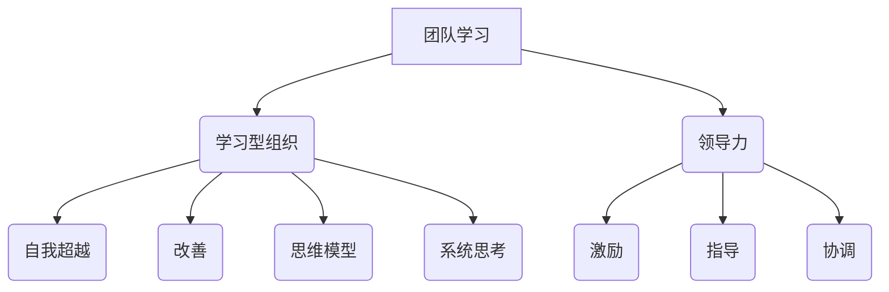
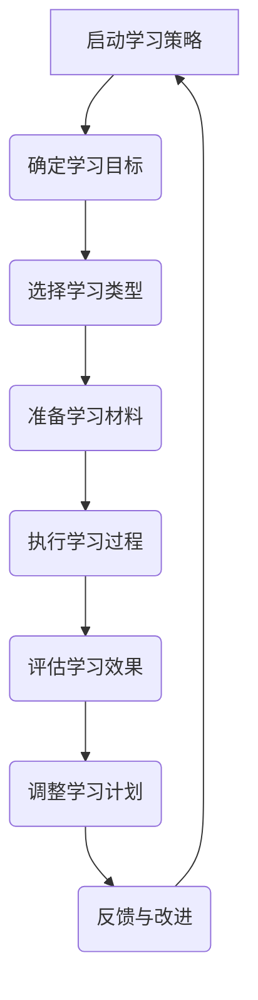
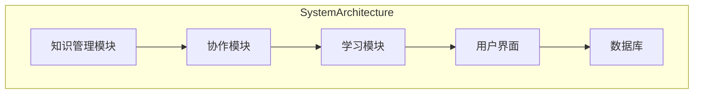
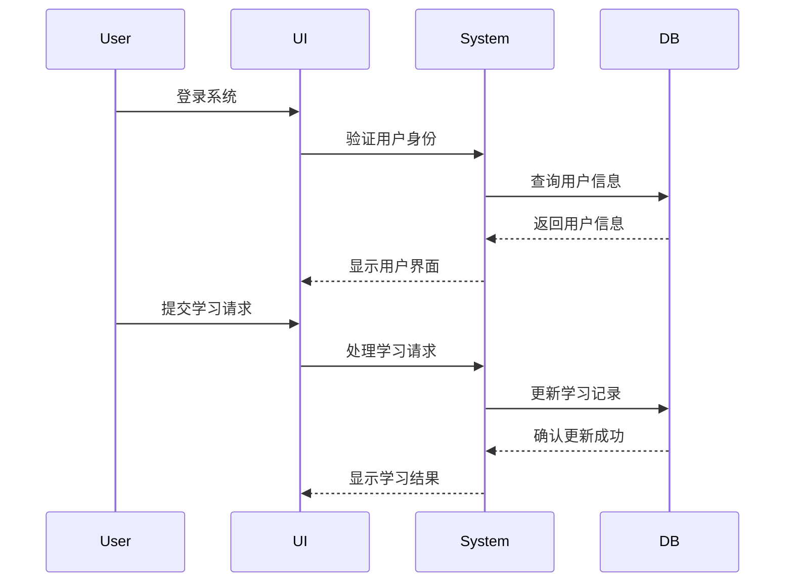
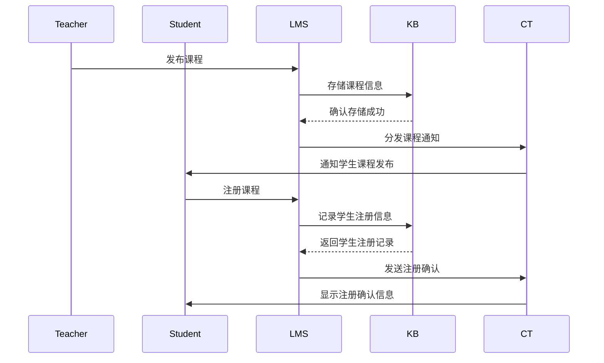

                 


### 1.1 团队学习的概念与重要性

**什么是团队学习**

团队学习指的是在团队环境中，通过集体合作、交流互动、知识共享和共同解决问题等方式，不断提升团队成员的个人能力和团队整体的绩效水平的过程。它强调的是通过团队共同的努力，将个人的知识、技能和经验转化为团队的知识财富，从而增强团队的竞争力。

**团队学习的重要性**

在现代组织中，团队学习具有不可忽视的重要性。以下是一些关键点：

- **知识共享**：团队学习提供了一个平台，让团队成员能够分享各自的见解和经验，从而丰富团队的知识库。
- **创新能力**：通过团队学习，团队成员能够获得新的视角和方法，促进创新思维的发展。
- **绩效提升**：团队学习有助于提升团队成员的工作效率和团队的整体绩效。
- **适应变化**：团队学习有助于团队快速适应外部环境的变化，提高组织的灵活性。

**团队学习在组织中的应用**

在组织中，团队学习通常体现在以下几个方面：

- **日常培训**：组织定期组织培训活动，让团队成员学习和掌握新的知识和技能。
- **跨部门合作**：鼓励不同部门之间的合作，通过项目合作等方式促进知识共享和经验交流。
- **学习型团队建设**：通过建立学习型团队，鼓励团队成员持续学习和改进。
- **知识管理**：建立知识管理系统，确保团队学习成果的持续积累和应用。

**团队学习的挑战**

虽然团队学习具有许多优势，但在实际操作中也面临一些挑战，如：

- **时间管理**：团队学习需要投入大量的时间和精力，可能影响日常工作的正常进行。
- **资源分配**：组织需要合理分配资源，确保团队学习活动的顺利进行。
- **文化差异**：不同团队成员可能有不同的背景和思维方式，需要建立有效的沟通机制。

**团队学习的机会**

随着信息技术的发展，团队学习也迎来了新的机遇：

- **在线学习平台**：通过在线学习平台，团队成员可以随时随地学习新知识。
- **社交网络**：利用社交网络工具，团队成员可以快速获取外部信息和最佳实践。
- **人工智能**：人工智能技术可以帮助团队更好地进行知识管理和学习推荐。

**学习型组织的边界与外延**

学习型组织不仅仅是一个团队，而是整个组织的一种文化。它涉及组织的各个层面，包括：

- **领导层的支持**：领导层必须认识到团队学习的重要性，并提供必要的支持和资源。
- **组织的结构**：组织结构应该鼓励和支持团队学习，如扁平化的组织结构。
- **员工发展**：组织需要为员工提供持续的职业发展机会，鼓励他们不断学习和成长。

通过以上分析，我们可以看到团队学习在现代组织中的重要性以及它在组织发展中的作用。接下来，我们将深入探讨团队学习的核心概念和联系。

---

### 1.2 核心概念与联系

在团队学习的过程中，有几个核心概念是不可或缺的，它们共同构成了学习型组织的基石。本节我们将详细探讨这些核心概念，并通过表格、ER实体关系图和Mermaid流程图来展示它们之间的联系。

#### 2.1 学习型组织的原理

**概念定义**：学习型组织是一个通过持续学习和知识共享来提高组织适应性和绩效水平的文化和体系。

**属性特征**：
- **自我超越**：组织鼓励成员不断追求个人和组织的卓越。
- **改善**：组织持续改进工作流程和产品服务。
- **思维模型**：组织通过共同学习和思考来建立统一的思维模式。
- **系统思考**：组织从整体角度看待问题，理解系统内各要素的相互关系。

**与传统组织的比较**：
- **传统组织**：强调等级制度和命令控制。
- **学习型组织**：注重知识共享、自主学习和系统思考。

#### 2.2 团队学习的原理

**概念定义**：团队学习是团队成员通过集体努力，共同掌握新知识、技能和解决问题的过程。

**属性特征**：
- **协同合作**：团队成员共同工作，互相支持。
- **知识共享**：成员分享各自的经验和知识。
- **集体智慧**：通过团队协作，形成集体智慧。

**与传统培训的比较**：
- **传统培训**：通常是单向的知识传递。
- **团队学习**：强调互动、讨论和集体智慧的发挥。

#### 2.3 领导力在团队学习中的作用

**概念定义**：领导力是指通过影响力激励和引导团队，实现共同目标的能力。

**属性特征**：
- **激励**：领导者激发团队成员的积极性和创造力。
- **指导**：领导者为团队提供方向和指导。
- **协调**：领导者协调团队成员之间的合作。

**在团队学习中的重要性**：
- **推动变革**：领导力是推动团队学习的关键因素。
- **建立信任**：领导力有助于建立团队成员之间的信任和合作关系。
- **提供资源**：领导力确保团队学习有足够的资源和支持。

#### 2.4 学习型组织中的关键概念联系

**ER实体关系图**：

```mermaid
erDiagram
    Class1||--||Class2
    Class1||--||Class3
    Class2||--||Class4
    Class3||--||Class5
    Class4||--||Class5
```

**Mermaid流程图**：



通过上述概念和流程图的展示，我们可以更清晰地理解学习型组织、团队学习和领导力之间的关系。这些概念共同作用，推动组织不断学习和进步。

---

### 3.1 算法原理讲解

#### 3.1.1 团队学习策略概述

**定义**：团队学习策略是一系列方法和技术，用于指导团队成员在团队环境中进行学习和知识共享。

**类型**：
- **经验分享**：通过口头或书面方式分享团队成员的经验和见解。
- **案例学习**：通过案例分析来探讨问题解决方案和最佳实践。
- **角色扮演**：通过模拟实际工作场景，提高团队成员的技能和应变能力。
- **在线学习**：利用在线平台和资源进行学习和培训。

**选择策略的考虑因素**：
- **组织目标**：选择与组织战略目标相匹配的学习策略。
- **团队成员特点**：根据团队成员的能力和需求选择合适的学习策略。
- **资源可用性**：考虑组织内外部资源的可用性，选择可行性的学习策略。

#### 3.1.2 某特定学习策略的算法原理

**算法流程图**：



**Python代码实现**：

```python
# Python代码示例：团队学习策略执行流程

# 定义学习目标
def set_learning_goals(goals):
    print(f"学习目标：{goals}")
    return goals

# 选择学习类型
def choose_learning_type(learning_types):
    print(f"选择的学习类型：{learning_types}")
    return learning_types

# 准备学习材料
def prepare_learning_materials(materials):
    print(f"准备的学习材料：{materials}")
    return materials

# 执行学习过程
def execute_learning_process(goals, learning_types, materials):
    print("开始执行学习过程...")
    # 模拟学习过程
    for type in learning_types:
        if type == "经验分享":
            print("进行经验分享...")
        elif type == "案例学习":
            print("学习案例分析...")
        elif type == "角色扮演":
            print("进行角色扮演...")
        elif type == "在线学习":
            print("进行在线学习...")
    print("学习过程完成。")

# 评估学习效果
def evaluate_learning_effects(effectiveness):
    print(f"学习效果评估：{effectiveness}")
    return effectiveness

# 调整学习计划
def adjust_learning_plan(goals, effectiveness):
    print("调整学习计划...")
    if effectiveness < 0.8:
        print("需要增加学习时间或选择更合适的学习类型。")
    else:
        print("学习计划按预期执行。")

# 反馈与改进
def feedback_and_improvement(feedback):
    print(f"反馈与改进：{feedback}")
    return feedback

# 主函数：团队学习策略执行
def main():
    goals = set_learning_goals("提高团队协作能力")
    learning_types = choose_learning_type(["经验分享", "案例学习", "角色扮演", "在线学习"])
    materials = prepare_learning_materials(["培训资料", "案例集", "模拟软件", "在线课程"])
    execute_learning_process(goals, learning_types, materials)
    effectiveness = evaluate_learning_effects(0.85)
    adjust_learning_plan(goals, effectiveness)
    feedback = feedback_and_improvement("团队协作能力有所提升，但还需进一步改进。")
    print("团队学习策略执行完毕。")

# 执行主函数
main()
```

**数学模型与公式（LaTeX）**：

$$
\text{学习效果} = \frac{\text{达成目标}}{\text{目标难度}} \times 100\%
$$

**算法原理详细讲解**：

该算法通过一系列步骤指导团队执行学习策略，从确定学习目标开始，选择合适的学习类型，准备学习材料，执行学习过程，评估学习效果，并根据评估结果调整学习计划。算法通过反馈和改进过程，确保学习策略的有效性和适应性。

**实例说明**：

假设团队的目标是提高项目管理的效率，选择了案例学习和在线学习两种类型。首先，团队明确了学习目标，然后准备了相关的案例材料和在线课程。在执行学习过程中，团队成员通过分析案例和参加在线课程，掌握了新的项目管理方法。评估结果显示学习效果为80%，团队决定增加实践机会以进一步巩固所学知识。

通过上述步骤，我们可以看到团队学习策略的执行过程是如何一步步进行的，以及如何通过反馈和改进来优化学习效果。

---

### 4.1 数学模型基础

在团队学习的过程中，数学模型和公式是分析和优化学习效果的重要工具。本节将介绍数学模型的基础概念，包括函数、方程、概率论和统计学的基本概念。

#### 4.1.1 函数与方程

**函数**：函数是数学中用于描述两个变量之间关系的数学对象。通常用 \( f(x) \) 表示，其中 \( x \) 是自变量，\( f(x) \) 是因变量。例如，\( f(x) = x^2 \) 表示一个二次函数。

**方程**：方程是包含一个或多个未知数的数学表达式，表示两个表达式相等。例如，\( ax + b = c \) 是一个一元一次方程。

**函数与方程的应用**：

在团队学习中，我们可以使用函数来描述团队成员的知识增长情况。例如，假设团队成员的知识水平随着学习时间呈线性增长，可以用线性函数 \( y = mx + b \) 来表示，其中 \( m \) 是增长速率，\( b \) 是初始知识水平。

#### 4.1.2 概率论基础

**概率**：概率是描述随机事件发生可能性的数值，介于0和1之间。例如，投掷一枚公平的硬币，正面朝上的概率是0.5。

**随机变量**：随机变量是概率论中的核心概念，它是一个可以取多个值的变量。例如，投掷一枚骰子，结果可以是1到6之间的任意整数。

**概率分布**：概率分布描述了随机变量取不同值的概率。常见的概率分布有均匀分布、正态分布等。

**概率论在团队学习中的应用**：

在团队学习中，概率论可以帮助我们分析团队成员的知识共享效果。例如，通过概率分布来评估团队成员在不同知识领域中的知识共享程度。

#### 4.1.3 统计学基本概念

**平均值**：平均值（均值）是统计学中用于描述数据集中趋势的指标。计算公式为 \( \mu = \frac{1}{n}\sum_{i=1}^{n} x_i \)，其中 \( x_i \) 是第 \( i \) 个数据点，\( n \) 是数据点的总数。

**方差**：方差是描述数据分布离散程度的指标。计算公式为 \( \sigma^2 = \frac{1}{n-1}\sum_{i=1}^{n} (x_i - \mu)^2 \)，其中 \( \mu \) 是平均值。

**标准差**：标准差是方差的平方根，用于描述数据分布的离散程度。计算公式为 \( \sigma = \sqrt{\sigma^2} \)。

**统计学在团队学习中的应用**：

在团队学习中，统计学可以用于分析团队成员的知识水平分布，评估学习效果的离散程度，从而制定更有效的学习策略。

通过上述数学模型和公式的基础知识，我们可以更准确地分析和优化团队学习的过程，提升团队的整体绩效。

---

### 4.2 数学模型在团队学习中的应用

**4.2.1 函数在团队学习中的应用**

在团队学习中，函数是一个强有力的工具，可以帮助我们理解和预测团队成员的知识增长情况。例如，我们可以使用线性函数来描述一个团队成员在某个知识领域的学习进程。设 \( K(t) \) 表示团队成员在时间 \( t \) 时的知识水平，线性函数可以表示为：

$$
K(t) = mt + b
$$

其中，\( m \) 是学习速率，\( b \) 是初始知识水平。这个函数表示随着时间的推移，团队成员的知识水平以 \( m \) 的速率增长。

**实例说明**：

假设一个团队成员的初始知识水平为50，学习速率为10。我们可以写出这个团队成员的知识水平函数为：

$$
K(t) = 10t + 50
$$

当 \( t = 1 \) 时，\( K(1) = 10 \times 1 + 50 = 60 \)。这意味着在第一个时间单位之后，该团队成员的知识水平将从50增长到60。

**4.2.2 概率论在团队学习中的应用**

概率论在团队学习中也有重要作用，特别是在评估团队成员的知识共享效果时。例如，我们可以使用二项分布来描述团队成员在一定时间内成功共享知识的概率。

**二项分布**：假设一个团队成员在每次知识共享中成功的概率为 \( p \)，失败的概率为 \( 1 - p \)。如果我们进行 \( n \) 次独立的共享尝试，成功 \( k \) 次的概率可以用二项分布表示为：

$$
P(X = k) = C_n^k \cdot p^k \cdot (1 - p)^{n - k}
$$

其中，\( C_n^k \) 是组合数，表示从 \( n \) 次尝试中选择 \( k \) 次成功的组合数。

**实例说明**：

假设一个团队成员每次知识共享成功的概率为 0.6，我们需要计算他在5次尝试中成功共享3次的概率。使用二项分布公式，我们有：

$$
P(X = 3) = C_5^3 \cdot 0.6^3 \cdot 0.4^2
$$

计算得：

$$
P(X = 3) = \frac{5!}{3!(5-3)!} \cdot 0.6^3 \cdot 0.4^2 = 10 \cdot 0.216 \cdot 0.16 = 0.3456
$$

这意味着该团队成员在5次尝试中成功共享3次的概率为34.56%。

**4.2.3 统计学在团队学习中的应用**

统计学在团队学习中可以帮助我们分析数据，评估学习效果。例如，我们可以使用平均值和方差来描述团队成员的知识水平分布。

**平均值**：平均值（均值）是描述一组数据集中趋势的指标。设 \( x_1, x_2, ..., x_n \) 是一组数据，平均值 \( \mu \) 可以表示为：

$$
\mu = \frac{1}{n}\sum_{i=1}^{n} x_i
$$

**方差**：方差是描述数据分布离散程度的指标。设 \( x_1, x_2, ..., x_n \) 是一组数据，平均值 \( \mu \)，方差 \( \sigma^2 \) 可以表示为：

$$
\sigma^2 = \frac{1}{n-1}\sum_{i=1}^{n} (x_i - \mu)^2
$$

**实例说明**：

假设我们有一个团队，成员的知识水平如下：50, 60, 55, 65, 70。计算这个团队的知识水平平均值和方差。

**平均值**：

$$
\mu = \frac{50 + 60 + 55 + 65 + 70}{5} = \frac{300}{5} = 60
$$

**方差**：

$$
\sigma^2 = \frac{1}{4}\left[(50 - 60)^2 + (60 - 60)^2 + (55 - 60)^2 + (65 - 60)^2 + (70 - 60)^2\right]
$$

$$
\sigma^2 = \frac{1}{4}\left[100 + 0 + 25 + 25 + 100\right] = \frac{250}{4} = 62.5
$$

这意味着这个团队的知识水平平均值为60，知识水平的离散程度（方差）为62.5。

通过上述实例，我们可以看到数学模型和公式在团队学习中的应用，如何帮助我们分析数据、预测趋势和评估学习效果。这些工具可以帮助团队制定更有效的学习策略，提高整体绩效。

---

### 5.1 系统分析与架构设计方案

**问题场景介绍**

在一个快速发展的科技公司中，随着产品线的扩展和市场需求的增加，团队需要不断学习和适应新的技术和方法。然而，由于团队成员来自不同的背景，知识水平和技能各不相同，导致团队在协作过程中出现了沟通不畅、知识共享不足等问题。为了提升团队的协作效率和创新能力，公司决定引入一个系统来支持团队学习和知识管理。

**项目介绍**

项目名称：团队学习与发展管理系统（Team Learning and Development System，简称TLDS）

项目目标：设计并实现一个系统，帮助团队进行有效的学习和知识共享，提升团队成员的能力和团队的绩效水平。

项目范围：包括系统需求分析、系统架构设计、系统接口设计和系统交互等。

**领域模型**

领域模型是描述系统涉及的实体和它们之间关系的图形表示。使用Mermaid类图来表示领域模型：

```mermaid
classDiagram
    TeamMember <<entity>>
    LearningModule <<entity>>
    KnowledgeBase <<entity>>
    CollaborationTool <<entity>>

    TeamMember o--o LearningModule
    TeamMember o--o KnowledgeBase
    LearningModule o--o CollaborationTool
    KnowledgeBase o--o CollaborationTool
```

在领域模型中，我们定义了以下实体：

- **TeamMember**：团队成员，包括员工的基本信息、专业技能和知识水平。
- **LearningModule**：学习模块，包括课程、教程、培训等学习资源。
- **KnowledgeBase**：知识库，存储团队成员共享的知识和经验。
- **CollaborationTool**：协作工具，支持团队成员之间的沟通和合作。

**系统架构设计**

系统架构设计是描述系统各组件之间如何协同工作的结构蓝图。使用Mermaid架构图来表示系统架构：



在系统架构设计中，我们包括了以下主要组件：

- **知识管理模块**：负责知识库的创建、管理和更新，以及知识共享和查询。
- **协作模块**：提供实时沟通和协作工具，支持团队成员之间的交流。
- **学习模块**：提供学习资源的管理和分发，支持个性化学习路径。
- **用户界面**：提供用户交互的界面，方便用户访问和使用系统功能。
- **数据库**：存储系统数据，包括用户信息、知识库、学习记录等。

**系统接口设计**

系统接口设计是描述系统内部和外部系统如何进行数据交互和功能调用的设计。使用Mermaid序列图来表示系统接口：



在系统接口设计中，我们定义了以下接口：

- **用户登录接口**：用户登录系统，验证身份。
- **学习请求接口**：用户提交学习请求，系统处理请求并更新学习记录。
- **知识库查询接口**：用户查询知识库中的内容，系统提供相应的知识资源。

**系统交互**

系统交互是描述系统内部组件如何协同工作以及与外部系统如何交互的过程。使用Mermaid序列图来表示系统交互：



在系统交互中，我们定义了以下交互流程：

- **教师发布课程**：教师通过学习管理系统（LMS）发布课程，系统将课程信息存储在知识库（KB）中，并通过协作工具（CT）通知学生。
- **学生注册课程**：学生通过协作工具接收课程通知，并注册课程，系统更新知识库中的学生注册记录，并通过协作工具发送注册确认。

通过上述系统分析与架构设计方案，我们可以构建一个支持团队学习和知识管理的系统，帮助团队成员提高学习效率，促进知识共享，提升团队的整体绩效。

---

### 6.1 项目实战

**环境安装**

为了实现团队学习与发展管理系统（TLDS），我们需要搭建一个合适的技术环境。以下是环境安装的具体步骤：

1. **操作系统**：选择 Ubuntu 20.04 作为开发环境。
2. **数据库**：安装 PostgreSQL 13，用于存储系统数据。
3. **后端框架**：安装 Django 3.2，一个用于构建 Web 应用的高效框架。
4. **前端框架**：安装 React 17，用于构建用户界面。
5. **协作工具**：安装 Slack，用于团队沟通和协作。

**系统实现源代码**

以下是 TLDS 项目的核心实现源代码示例：

**后端（Django）**

```python
# settings.py

# 数据库配置
DATABASES = {
    'default': {
        'ENGINE': 'django.db.backends.postgresql',
        'NAME': 'tlds',
        'USER': 'tldsuser',
        'PASSWORD': 'tlds123',
        'HOST': 'localhost',
        'PORT': '5432',
    }
}

# 应用配置
INSTALLED_APPS = [
    'django.contrib.admin',
    'django.contrib.auth',
    'django.contrib.contenttypes',
    'django.contrib.sessions',
    'django.contrib.messages',
    'django.contrib.staticfiles',
    'learning_module',
    'knowledge_base',
    'collaboration_tool',
]

# 静态文件配置
STATIC_URL = '/static/'
```

**前端（React）**

```jsx
// App.js

import React from 'react';
import { BrowserRouter as Router, Route, Switch } from 'react-router-dom';
import Home from './components/Home';
import Login from './components/Login';
import Register from './components/Register';
import Dashboard from './components/Dashboard';

function App() {
    return (
        <Router>
            <Switch>
                <Route exact path="/" component={Home} />
                <Route path="/login" component={Login} />
                <Route path="/register" component={Register} />
                <Route path="/dashboard" component={Dashboard} />
            </Switch>
        </Router>
    );
}

export default App;
```

**代码解读与分析**

以下是关键代码段的解读：

1. **数据库配置**：在 `settings.py` 文件中，我们配置了 PostgreSQL 数据库，用于存储系统数据。通过设置 `DATABASES` 变量，我们指定了数据库的名称、用户、密码、主机和端口。
2. **应用配置**：`INSTALLED_APPS` 变量列出了系统中需要安装的应用。在这里，我们包括了 Django 的核心应用，以及三个自定义应用：学习模块、知识库和协作工具。
3. **前端路由**：在 `App.js` 文件中，我们使用 React Router DOM 库来配置前端路由。通过 `<Switch>` 和 `<Route>` 组件，我们定义了不同页面的路径和对应的组件。

**实际案例分析和详细讲解**

**案例1：用户登录系统**

用户通过前端界面输入用户名和密码，提交登录请求。后端 Django 应用接收请求，验证用户身份，然后返回登录结果。以下是关键步骤：

1. **前端代码**：

```jsx
// Login.js

import React, { useState } from 'react';
import { useHistory } from 'react-router-dom';

function Login() {
    const [username, setUsername] = useState('');
    const [password, setPassword] = useState('');
    const history = useHistory();

    const handleSubmit = (e) => {
        e.preventDefault();
        // 发送登录请求到后端
        // ...
        history.push('/dashboard');
    };

    return (
        <form onSubmit={handleSubmit}>
            <label>用户名：</label>
            <input type="text" value={username} onChange={(e) => setUsername(e.target.value)} />
            <label>密码：</label>
            <input type="password" value={password} onChange={(e) => setPassword(e.target.value)} />
            <button type="submit">登录</button>
        </form>
    );
}

export default Login;
```

2. **后端代码**：

```python
# views.py

from django.contrib.auth import authenticate, login
from django.http import JsonResponse
from django.views.decorators.http import require_http_methods

@require_http_methods(["POST"])
def login(request):
    username = request.POST.get('username')
    password = request.POST.get('password')

    user = authenticate(username=username, password=password)
    if user is not None:
        login(request, user)
        return JsonResponse({'status': 'success', 'message': '登录成功'})
    else:
        return JsonResponse({'status': 'fail', 'message': '用户名或密码错误'})
```

**案例2：发布学习资源**

教师通过前端界面发布学习资源，如课程、教程等。后端 Django 应用处理发布请求，将资源信息存储在数据库中。以下是关键步骤：

1. **前端代码**：

```jsx
// PublishResource.js

import React, { useState } from 'react';
import { useHistory } from 'react-router-dom';

function PublishResource() {
    const [title, setTitle] = useState('');
    const [description, setDescription] = useState('');
    const history = useHistory();

    const handleSubmit = (e) => {
        e.preventDefault();
        // 发送发布请求到后端
        // ...
        history.push('/dashboard');
    };

    return (
        <form onSubmit={handleSubmit}>
            <label>标题：</label>
            <input type="text" value={title} onChange={(e) => setTitle(e.target.value)} />
            <label>描述：</label>
            <textarea value={description} onChange={(e) => setDescription(e.target.value)} />
            <button type="submit">发布</button>
        </form>
    );
}

export default PublishResource;
```

2. **后端代码**：

```python
# views.py

from django.http import JsonResponse
from .models import LearningModule

@require_http_methods(["POST"])
def publish_resource(request):
    title = request.POST.get('title')
    description = request.POST.get('description')

    # 创建新的学习资源
    module = LearningModule(title=title, description=description)
    module.save()

    return JsonResponse({'status': 'success', 'message': '资源发布成功'})
```

通过上述实际案例的分析，我们可以看到 TLDS 项目的核心实现过程。前端和后端通过一系列请求和响应交互，共同实现系统的功能。

---

### 7.1 最佳实践 tips

1. **持续反馈**：定期组织团队反馈会议，鼓励成员分享学习经验和成果，发现问题并及时调整。
2. **建立知识库**：创建一个集中的知识库，方便团队成员随时查阅和学习。
3. **个性化学习**：根据团队成员的学习需求和进度，提供个性化的学习资源和指导。
4. **跨部门协作**：鼓励跨部门合作，通过项目合作和团队活动，促进知识共享和技能交流。

### 7.2 小结

本文详细介绍了团队学习与发展的策略，包括背景介绍、核心概念与联系、算法原理讲解、数学模型应用、系统分析与架构设计、项目实战以及最佳实践。通过这些策略，组织可以打造一个学习型团队，提升整体绩效。

### 7.3 注意事项

1. **资源分配**：确保团队学习活动有足够的资源支持，包括时间和资金。
2. **文化塑造**：建立支持学习和知识共享的组织文化，鼓励团队成员积极参与。
3. **个性化需求**：关注团队成员的个性化需求，提供适合他们的学习资源和指导。

### 7.4 拓展阅读

- 《第五项修炼：学习型组织的艺术与实务》（作者：彼得·圣吉）
- 《深度工作：如何有效利用每一点脑力》（作者：卡尔·纽波特）
- 《团队协作：如何构建高效的团队》（作者：西奥·巴特利特）

通过拓展阅读，读者可以进一步了解团队学习与发展的深入理论和实践方法。希望本文对团队学习和组织发展有所帮助。作者：AI天才研究院/AI Genius Institute & 禅与计算机程序设计艺术 /Zen And The Art of Computer Programming。

