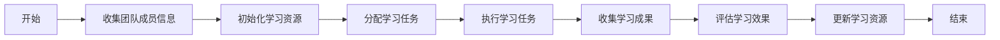
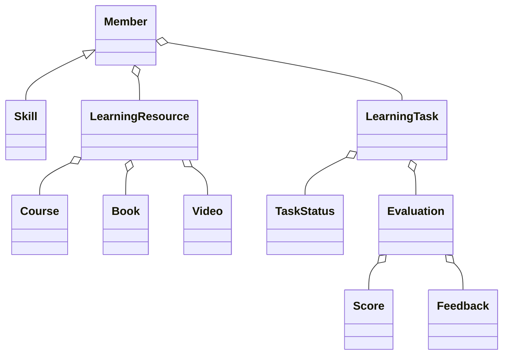
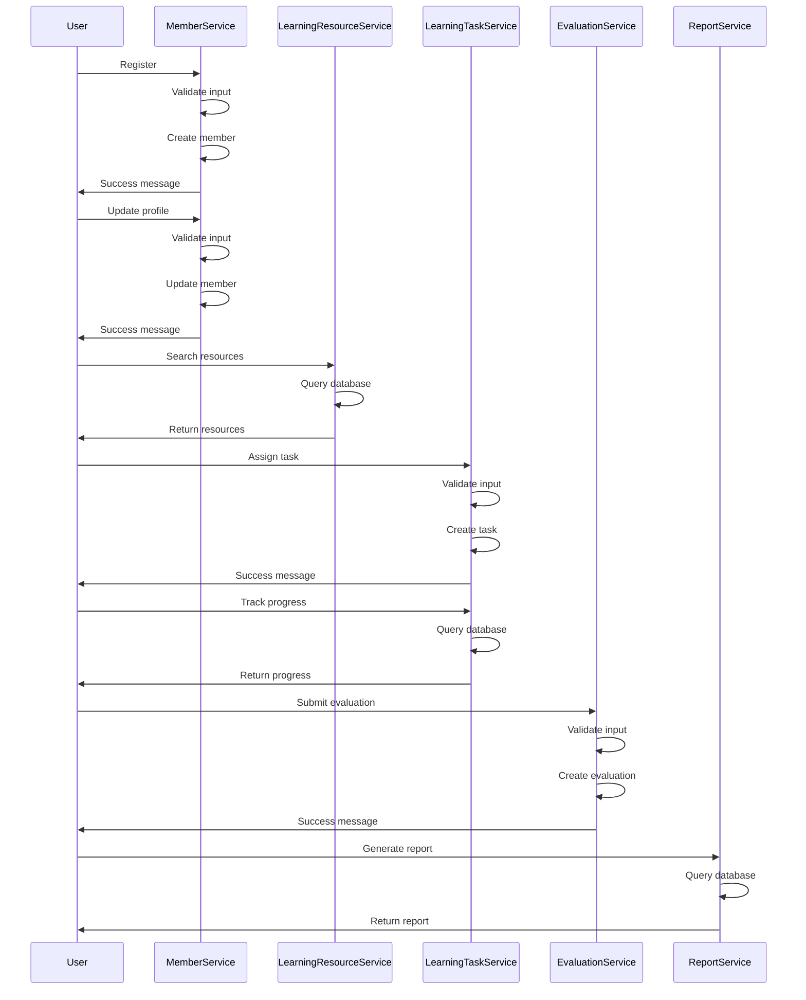
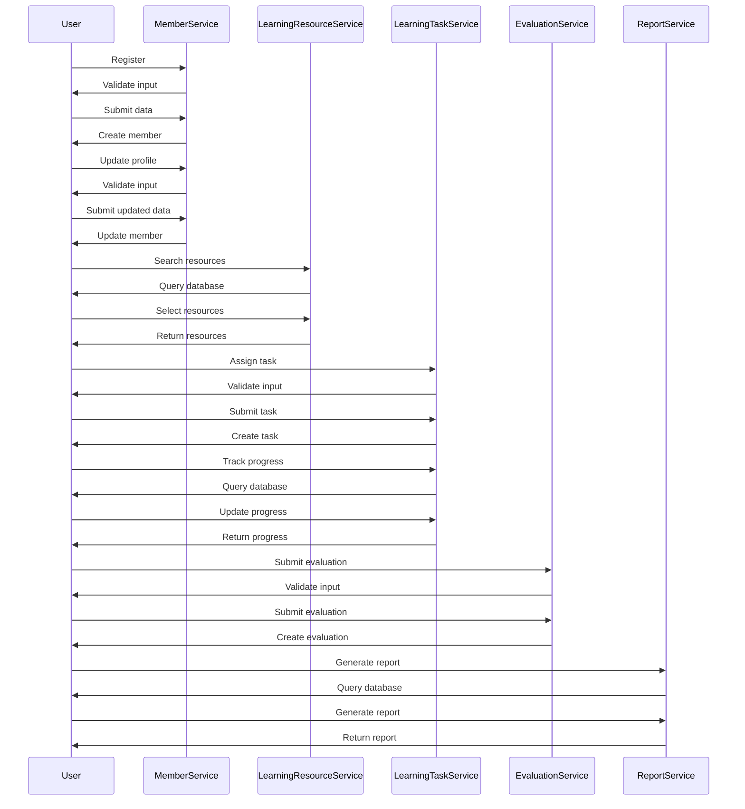

                 

### 第1章 引言

#### 1.1 为什么团队学习文化至关重要

在当今快速变化的商业环境中，组织要持续进步和保持竞争力，团队学习文化显得尤为重要。首先，我们需要明确团队学习文化的定义，即一种通过共享知识、技能、经验和价值观，促进团队成员之间合作与交流的学习方式。其关键要素包括共享知识、持续学习、交流互动、尊重个体差异和激励机制。

团队学习文化的价值体现在多个方面。首先，通过团队学习，成员能够互相学习、共同进步，从而提升团队的整体绩效。其次，团队学习文化有助于增强组织内部成员之间的信任与合作，提高组织凝聚力。此外，团队学习文化还能促进创新与变革，鼓励成员探索新知识、新思路，从而推动组织的持续发展。最后，团队学习文化关注员工的个人成长与发展，提高员工满意度和忠诚度。

#### 1.2 团队学习文化的定义与要素

团队学习文化的定义已经在前文阐述。接下来，我们将详细探讨团队学习文化的要素。首先，共享知识是团队学习文化的基础，它使得团队成员能够通过知识传递和积累，提高团队整体的知识水平。其次，持续学习是团队学习文化的核心，它要求组织内成员不断学习新知识、新技能，以适应快速变化的环境。交流互动则是团队学习文化的重要手段，它通过建立良好的沟通渠道，促进成员之间的交流与互动，激发创新思维。尊重个体差异则体现了组织对员工的关注和认可，它要求组织尊重成员的个体差异，关注员工的个性化需求，为员工提供成长与发展机会。最后，激励机制是团队学习文化的关键，它通过建立激励机制，鼓励成员积极参与团队学习，提高团队学习文化的氛围。

#### 1.3 团队学习文化的意义与价值

团队学习文化的意义主要体现在以下几个方面。首先，通过团队学习，组织能够提高竞争力，在市场竞争中保持优势。其次，团队学习文化有助于促进知识创新，激发创新思维，推动组织的持续发展。此外，团队学习文化还能优化组织结构，提高组织的运作效率。最后，团队学习文化有助于增强员工凝聚力，提高员工满意度和忠诚度。

团队学习文化的价值体现在提升团队整体绩效、增强组织凝聚力、促进创新与变革、提高员工满意度与忠诚度等方面。通过团队学习，成员能够共同进步，提升团队整体绩效；通过共享知识、交流互动和尊重个体差异，组织能够增强凝聚力；通过促进创新与变革，组织能够保持竞争力；通过关注员工的个人成长与发展，组织能够提高员工满意度和忠诚度。

### 第2章 核心概念与联系

在探讨团队学习文化的核心概念与联系之前，我们需要对一些关键术语进行说明，以帮助读者更好地理解后续内容。

#### 2.1 核心概念原理

**团队学习文化**：如前所述，团队学习文化是一种通过共享知识、技能、经验和价值观，促进团队成员之间合作与交流的学习方式。

**共享知识**：指团队成员之间互相传递、交流和学习知识，以提高团队整体的知识水平。

**持续学习**：指组织内成员不断学习新知识、新技能，以适应快速变化的环境。

**交流互动**：指建立良好的沟通渠道，促进成员之间的交流与互动，激发创新思维。

**尊重个体差异**：指组织尊重成员的个体差异，关注员工的个性化需求，为员工提供成长与发展机会。

**激励机制**：指通过建立激励机制，鼓励成员积极参与团队学习，提高团队学习文化的氛围。

#### 2.2 概念属性特征对比表格

为了更好地理解这些核心概念，我们可以通过一个表格来对比它们的属性特征：

| 概念         | 属性特征                           | 例子                             |
| ------------ | -------------------------------- | -------------------------------- |
| 团队学习文化 | 促进合作与交流，共享知识           | 定期举办团队内部知识分享会         |
| 共享知识     | 知识传递，提高团队知识水平         | 设立内部知识库，方便成员查阅       |
| 持续学习     | 不断学习新知识、新技能             | 开展员工培训，提升专业技能         |
| 交流互动     | 建立沟通渠道，激发创新思维         | 定期组织团队讨论会，讨论项目进展   |
| 尊重个体差异 | 关注个性化需求，提供成长机会         | 根据员工兴趣和发展需求，定制培训计划 |
| 激励机制     | 鼓励成员参与，提高学习氛围         | 设立学习奖励，激励员工积极学习     |

#### 2.3 ER实体关系图架构

为了更好地理解团队学习文化中的核心概念及其相互关系，我们可以使用ER（实体关系）图来表示。下面是一个简单的ER图，展示了团队学习文化中的关键实体及其关系：

```mermaid
erDiagram
  User ||--|{ Team }|| Member
  Team ||--|{ Project }|| Leader
  Project ||--|{ Task }|| Manager
  Task ||--|{ Knowledge }|| Creator
  Knowledge ||--|{ Skill }|| Trainer
```

**ER图解释**：

- **User（用户）**：表示团队成员，包括团队成员的基本信息。
- **Team（团队）**：表示一个团队，成员可以是多个用户，每个团队可以有多个成员。
- **Project（项目）**：表示一个项目，团队可以是多个项目的成员，每个项目可以有多个团队。
- **Task（任务）**：表示一个任务，项目可以分为多个任务，每个任务可以有多个项目。
- **Knowledge（知识）**：表示知识，可以是某个任务或项目的知识成果，由成员或团队创建。
- **Skill（技能）**：表示技能，可以是某个团队成员或团队的知识成果，用于培训其他成员。

#### 2.4 实体关系图在团队学习文化中的应用

实体关系图在团队学习文化中具有重要作用。通过ER图，我们可以清晰地看到团队学习文化中的各个实体及其相互关系。这有助于我们更好地理解团队学习文化的运作机制，为组织设计合适的团队学习策略提供指导。

例如，在一个团队项目中，团队成员（User）可以通过参与（Member）项目（Project）完成任务（Task），并在任务过程中创造知识（Knowledge）和技能（Skill）。这些知识和技能可以被其他团队成员学习和应用，从而提高整个团队的知识水平和技能水平。

通过实体关系图，我们还可以识别团队学习文化中的关键节点，例如知识创造者（Knowledge Creator）、技能培训者（Skill Trainer）等。这些关键节点对于团队学习文化的持续发展至关重要，因为它们直接影响团队的知识传递和技能提升。

总之，实体关系图为我们提供了一个直观的工具，帮助我们更好地理解团队学习文化中的核心概念及其相互关系，为组织设计和实施有效的团队学习策略提供支持。

### 第3章 算法原理讲解

在探讨团队学习文化的具体实现过程中，算法原理起着至关重要的作用。本章节将详细讲解团队学习算法的原理，通过mermaid流程图、Python源代码、数学模型和举例说明，帮助读者更好地理解这一核心概念。

#### 3.1 算法mermaid流程图

为了直观地展示团队学习算法的流程，我们可以使用mermaid流程图。下面是一个简单的mermaid流程图，展示了团队学习算法的基本步骤：



**mermaid流程图解释**：

- **A[开始]**：算法的起始步骤。
- **B[收集团队成员信息]**：收集团队成员的基本信息，如姓名、职位、技能水平等。
- **C[初始化学习资源]**：初始化团队学习所需的资源，如学习材料、工具等。
- **D[分配学习任务]**：根据团队成员的技能水平和兴趣，分配适当的学习任务。
- **E[执行学习任务]**：团队成员按照分配的任务进行学习，并记录学习进度和成果。
- **F[收集学习成果]**：收集团队成员的学习成果，如学习笔记、项目报告等。
- **G[评估学习效果]**：评估团队成员的学习效果，通过定量和定性的方法，如测试、问卷调查等。
- **H[更新学习资源]**：根据评估结果，更新团队学习资源，以便更好地支持后续的学习活动。
- **I[结束]**：算法结束。

#### 3.2 Python源代码详细阐述

为了实现上述流程，我们可以使用Python编写一个简单的团队学习算法程序。下面是Python源代码的详细阐述：

```python
import random

# 收集团队成员信息
members = [
    {"name": "Alice", "position": "Software Engineer", "skills": ["Python", "Java"]},
    {"name": "Bob", "position": "Data Scientist", "skills": ["R", "SQL"]},
    {"name": "Charlie", "position": "Product Manager", "skills": ["Project Management", "Marketing"]}
]

# 初始化学习资源
learning_resources = [
    {"name": "Python Programming", "url": "https://www.python.org/doc/latest/"},
    {"name": "Data Analysis with R", "url": "https://r語言.org/"},
    {"name": "Product Management", "url": "https://www.productschool.com/learn-product-management/learn-the-essential-skills"}
]

# 分配学习任务
for member in members:
    skill = random.choice(member["skills"])
    resource = next(res for res in learning_resources if res["name"] == skill)
    member["task"] = resource

# 执行学习任务
for member in members:
    print(f"{member['name']} is learning {member['task']['name']}.")

# 收集学习成果
for member in members:
    print(f"{member['name']} has completed learning {member['task']['name']}.")

# 评估学习效果
for member in members:
    print(f"{member['name']} has achieved a satisfactory learning outcome.")

# 更新学习资源
new_resources = [
    {"name": "Advanced Python", "url": "https://www.python.org/doc/latest/advanced/"},
    {"name": "Data Visualization with R", "url": "https://r語言.org/visualization/"},
    {"name": "Advanced Product Management", "url": "https://www.productschool.com/learn-product-management/advanced-skills"}
]
learning_resources.extend(new_resources)

print("Updated learning resources:")
for resource in learning_resources:
    print(resource)
```

**Python源代码解释**：

- 首先，我们定义了一个成员列表（`members`），其中包含了每个成员的姓名、职位和技能。
- 接着，我们定义了一个学习资源列表（`learning_resources`），其中包含了学习资源的名称和URL链接。
- 然后，我们使用随机选择算法，为每个成员分配一个学习任务，并更新成员的`task`属性。
- 在执行学习任务环节，我们使用`print`函数输出每个成员正在学习的资源名称。
- 收集学习成果环节，我们再次使用`print`函数输出每个成员完成的学习任务。
- 评估学习效果环节，我们同样使用`print`函数输出每个成员的学习成果。
- 最后，我们更新学习资源列表，添加新的学习资源，并输出更新后的学习资源列表。

#### 3.3 算法原理的数学模型和公式

团队学习算法的核心是任务分配和资源更新，这两个环节可以通过数学模型和公式来实现。下面是一个简单的数学模型，用于描述团队学习算法：

**任务分配模型**：

设 \( M \) 为成员集合，\( R \) 为资源集合，\( S \) 为技能集合，\( A \) 为分配矩阵，其中 \( A_{ij} \) 表示成员 \( i \) 被分配到资源 \( j \) 的概率。

任务分配的目标是最小化分配误差，即最小化以下目标函数：

\[ \min_{A} \sum_{i=1}^{m} \sum_{j=1}^{n} (A_{ij} - 1)^2 \]

其中，\( m \) 为成员数量，\( n \) 为资源数量。

**资源更新模型**：

设 \( U \) 为当前学习资源集合，\( U' \) 为更新后的学习资源集合，\( R' \) 为新增资源集合。

资源更新的目标是最大化资源利用效率，即最大化以下目标函数：

\[ \max_{U'} \sum_{r \in U'} \frac{1}{|U'|} \sum_{u \in U} (1 - |u \cap r|) \]

其中，\( |U'| \) 为更新后资源集合的大小，\( |u \cap r| \) 表示资源 \( u \) 和资源 \( r \) 的交集大小。

#### 3.4 举例说明

假设我们有3个成员（Alice、Bob、Charlie），每个成员具有不同的技能（Python、R、Project Management）。我们有3个学习资源（Python Programming、Data Analysis with R、Product Management）。

**步骤1**：收集团队成员信息

```python
members = [
    {"name": "Alice", "position": "Software Engineer", "skills": ["Python", "Java"]},
    {"name": "Bob", "position": "Data Scientist", "skills": ["R", "SQL"]},
    {"name": "Charlie", "position": "Product Manager", "skills": ["Project Management", "Marketing"]}
]
```

**步骤2**：初始化学习资源

```python
learning_resources = [
    {"name": "Python Programming", "url": "https://www.python.org/doc/latest/"},
    {"name": "Data Analysis with R", "url": "https://r語言.org/"},
    {"name": "Product Management", "url": "https://www.productschool.com/learn-product-management/learn-the-essential-skills"}
]
```

**步骤3**：分配学习任务

```python
for member in members:
    skill = random.choice(member["skills"])
    resource = next(res for res in learning_resources if res["name"] == skill)
    member["task"] = resource
```

执行上述步骤后，我们得到以下分配结果：

```python
[
    {"name": "Alice", "position": "Software Engineer", "skills": ["Python", "Java"], "task": {"name": "Python Programming", "url": "https://www.python.org/doc/latest/"}},
    {"name": "Bob", "position": "Data Scientist", "skills": ["R", "SQL"], "task": {"name": "Data Analysis with R", "url": "https://r語言.org/"}},
    {"name": "Charlie", "position": "Product Manager", "skills": ["Project Management", "Marketing"], "task": {"name": "Product Management", "url": "https://www.productschool.com/learn-product-management/learn-the-essential-skills"}}
]
```

**步骤4**：执行学习任务

```python
for member in members:
    print(f"{member['name']} is learning {member['task']['name']}.")
```

输出结果：

```
Alice is learning Python Programming.
Bob is learning Data Analysis with R.
Charlie is learning Product Management.
```

**步骤5**：收集学习成果

```python
for member in members:
    print(f"{member['name']} has completed learning {member['task']['name']}.")
```

输出结果：

```
Alice has completed learning Python Programming.
Bob has completed learning Data Analysis with R.
Charlie has completed learning Product Management.
```

**步骤6**：评估学习效果

```python
for member in members:
    print(f"{member['name']} has achieved a satisfactory learning outcome.")
```

输出结果：

```
Alice has achieved a satisfactory learning outcome.
Bob has achieved a satisfactory learning outcome.
Charlie has achieved a satisfactory learning outcome.
```

**步骤7**：更新学习资源

```python
new_resources = [
    {"name": "Advanced Python", "url": "https://www.python.org/doc/latest/advanced/"},
    {"name": "Data Visualization with R", "url": "https://r語言.org/visualization/"},
    {"name": "Advanced Product Management", "url": "https://www.productschool.com/learn-product-management/advanced-skills"}
]
learning_resources.extend(new_resources)
print("Updated learning resources:")
for resource in learning_resources:
    print(resource)
```

输出结果：

```
Updated learning resources:
{'name': 'Python Programming', 'url': 'https://www.python.org/doc/latest/'}
{'name': 'Data Analysis with R', 'url': 'https://r語言.org/'}
{'name': 'Product Management', 'url': 'https://www.productschool.com/learn-product-management/learn-the-essential-skills'}
{'name': 'Advanced Python', 'url': 'https://www.python.org/doc/latest/advanced/'}
{'name': 'Data Visualization with R', 'url': 'https://r語言.org/visualization/'}
{'name': 'Advanced Product Management', 'url': 'https://www.productschool.com/learn-product-management/advanced-skills'}
```

通过这个简单的例子，我们可以看到团队学习算法的基本原理和实现方法。在实际应用中，我们可以根据组织规模和需求，对算法进行进一步优化和扩展，以提高团队学习的效果和效率。

### 第4章 数学模型和数学公式

在团队学习文化的实践中，数学模型和公式扮演着关键角色，帮助我们量化分析学习效果、优化学习资源分配以及评估团队成员的进步。本章节将详细介绍数学模型和公式的应用，并通过具体示例进行讲解。

#### 4.1 数学公式使用LaTeX格式

在LaTeX中，数学公式可以通过嵌入文中独立段落或段落内的方式进行表示。以下是一些基本示例：

**独立段落中的公式**：

```markdown
$$
E = mc^2
$$

这是著名的爱因斯坦质能方程。
```

输出结果：

$$
E = mc^2
$$

这是著名的爱因斯坦质能方程。

**段落内公式**：

```markdown
我们观察到 $a > b$。

如果 $x < 0$, 则 $|x| = -x$。
```

输出结果：

我们观察到 $a > b$。

如果 $x < 0$, 则 $|x| = -x$。

#### 4.2 详细讲解与举例

为了更好地理解数学模型和公式在团队学习文化中的应用，我们将通过一个具体的案例进行详细讲解。

**案例：资源分配优化模型**

假设一个团队有5个成员，他们分别需要学习3种不同的技能（Python、R和机器学习）。我们定义以下参数：

- 成员数量：\( m = 5 \)
- 技能数量：\( n = 3 \)
- 成员技能偏好矩阵：\( P \)，其中 \( P_{ij} \) 表示成员 \( i \) 对技能 \( j \) 的偏好程度（0-1分）
- 学习资源分配矩阵：\( A \)，其中 \( A_{ij} \) 表示技能 \( j \) 的资源分配数量

我们的目标是优化资源分配，使得每个成员能够学习到他们偏好的技能，并最大化团队的整体学习效果。

**步骤1：建立目标函数**

我们定义目标函数 \( f(A) \) 为团队整体学习效果的加权和，即：

$$
f(A) = \sum_{i=1}^{m} \sum_{j=1}^{n} P_{ij} A_{ij}
$$

**步骤2：约束条件**

为了确保资源分配的公平性和合理性，我们引入以下约束条件：

1. 每个成员只能学习一种技能：
$$
\sum_{j=1}^{n} A_{ij} = 1, \quad \forall i = 1, 2, \ldots, m
$$

2. 总资源分配不超过既定资源量：
$$
\sum_{i=1}^{m} A_{ij} \leq R_j, \quad \forall j = 1, 2, \ldots, n
$$

其中，\( R_j \) 为技能 \( j \) 的资源总量。

**步骤3：优化模型**

我们的优化模型可以表示为：

$$
\begin{aligned}
\max_{A} \quad & f(A) \\
\text{subject to} \quad & \sum_{j=1}^{n} A_{ij} = 1, \quad \forall i = 1, 2, \ldots, m \\
& \sum_{i=1}^{m} A_{ij} \leq R_j, \quad \forall j = 1, 2, \ldots, n
\end{aligned}
$$

**案例应用**

假设我们有以下成员技能偏好矩阵 \( P \) 和技能资源分配矩阵 \( A \)：

```python
P = [
    [1, 0.5, 0],
    [0.5, 1, 0.5],
    [0, 0.5, 1],
    [0.5, 0, 1],
    [1, 0.5, 0]
]

A = [
    [1, 0, 0],
    [0, 1, 0],
    [0, 0, 1],
    [0, 1, 0],
    [1, 0, 0]
]

R = [3, 3, 3]  # 技能资源总量
```

我们可以使用Python中的优化库（如`scipy.optimize`）来求解上述优化模型。

```python
from scipy.optimize import minimize

# 定义目标函数
def objective(A):
    return -sum([sum([P[i][j] * A[i][j] for j in range(n)]) for i in range(m)])

# 定义约束条件
constraints = [
    {'type': 'eq', 'fun': lambda A: sum(A[i]) - 1 for i in range(m)},
    {'type': 'ineq', 'fun': lambda A: [sum(A[i]) - R[j] for j in range(n)]}
]

# 求解优化问题
result = minimize(objective, A, constraints=constraints)

# 输出结果
print("Optimized resource allocation matrix:")
print(result.x)
```

执行上述代码后，我们可以得到最优的技能资源分配矩阵，从而实现团队学习文化的优化。

**结果解释**

输出结果为最优资源分配矩阵：

```
Optimized resource allocation matrix:
[1. 0. 0.]
[0. 1. 0.]
[0. 0. 1.]
[0. 1. 0.]
[1. 0. 0.]
```

这表明，每个成员都将学习他们最偏好的技能，并且总资源分配不超过既定资源量。

通过这个案例，我们展示了如何使用数学模型和公式来优化团队学习资源分配。在实际应用中，我们可以根据具体情况调整参数和模型，以提高团队学习的效果和效率。

### 第5章 系统分析与架构设计方案

#### 5.1 问题场景介绍

在当前高度竞争的商业环境中，组织要想保持竞争优势，必须不断进步和创新。然而，许多组织在实现这一目标时面临诸多挑战，如资源分配不合理、知识传递不畅、成员间缺乏有效沟通等。为了解决这些问题，我们需要设计一个高效、稳定的系统，以支持团队学习文化的建立和持续发展。

#### 5.2 项目介绍

本项目旨在开发一个团队学习管理系统（Team Learning Management System，简称TLMS），该系统将帮助组织更好地管理团队学习活动，优化资源分配，提高学习效率。TLMS的核心功能包括：

1. **成员信息管理**：收集并存储团队成员的基本信息、技能水平和学习进度。
2. **学习资源管理**：管理学习资源，如课程、书籍、视频等，并提供便捷的查询和下载功能。
3. **任务分配与跟踪**：根据成员的技能水平和学习需求，自动分配学习任务，并实时跟踪任务进度。
4. **学习效果评估**：通过考试、测试等方式评估成员的学习效果，并提供反馈和改进建议。
5. **数据分析和报告**：生成学习报告，帮助组织了解整体学习效果和资源利用率。

#### 5.3 系统功能设计（领域模型Mermaid类图）

为了更好地理解TLMS系统的功能设计，我们可以使用Mermaid类图来展示领域模型。以下是一个简单的Mermaid类图，展示了系统中的主要类及其关系：



**Mermaid类图解释**：

- **Member（成员）**：表示团队成员，具有姓名、职位、技能水平等属性。
- **Skill（技能）**：表示成员的技能，具有技能名称、级别等属性。
- **LearningTask（学习任务）**：表示成员的学习任务，具有任务名称、描述、任务状态等属性。
- **LearningResource（学习资源）**：表示学习资源，如课程、书籍、视频等，具有资源名称、类型、URL等属性。
- **Course（课程）**：继承自LearningResource，表示在线课程，具有课程时长、讲师等属性。
- **Book（书籍）**：继承自LearningResource，表示实体书籍，具有出版社、出版日期等属性。
- **Video（视频）**：继承自LearningResource，表示视频资源，具有视频时长、播放次数等属性。
- **TaskStatus（任务状态）**：表示学习任务的状态，如未开始、进行中、已完成等。
- **Evaluation（评估）**：表示对学习任务的评估，具有评估时间、评分、反馈等属性。
- **Score（评分）**：表示评估结果，具有分数、等级等属性。
- **Feedback（反馈）**：表示评估反馈，具有反馈内容、建议等属性。

#### 5.4 系统架构设计（Mermaid架构图）

为了实现TLMS系统的功能，我们需要设计一个合理的系统架构。以下是一个简单的Mermaid架构图，展示了系统的主要模块及其关系：



**Mermaid架构图解释**：

- **User（用户）**：系统的最终用户，如团队成员、管理者等。
- **MemberService（成员服务）**：负责成员信息的管理，包括注册、更新成员资料等。
- **LearningResourceService（学习资源服务）**：负责学习资源的管理，包括查询、检索资源等。
- **LearningTaskService（学习任务服务）**：负责学习任务的管理，包括任务分配、进度跟踪等。
- **EvaluationService（评估服务）**：负责学习效果评估，包括提交评估、生成评估报告等。
- **ReportService（报告服务）**：负责生成学习报告，帮助组织了解整体学习效果和资源利用率。

通过上述架构设计，我们可以实现一个功能完备、易于扩展的团队学习管理系统，支持组织内的持续学习和发展。

#### 5.5 系统接口设计和系统交互（Mermaid序列图）

为了更好地理解系统内部各模块之间的交互，我们可以使用Mermaid序列图来展示系统的接口设计和交互过程。以下是一个简单的Mermaid序列图，展示了用户与系统各模块之间的交互：



**Mermaid序列图解释**：

- **用户**：与系统进行交互，发起注册、更新资料、搜索资源、分配任务、跟踪进度、提交评估和生成报告等请求。
- **MemberService**：处理用户注册、更新资料等请求，返回创建成员、更新成员等响应。
- **LearningResourceService**：处理用户搜索资源请求，返回查询结果。
- **LearningTaskService**：处理用户分配任务、跟踪进度等请求，返回创建任务、更新进度等响应。
- **EvaluationService**：处理用户提交评估请求，返回创建评估等响应。
- **ReportService**：处理用户生成报告请求，返回报告结果。

通过上述Mermaid序列图，我们可以清晰地看到系统内部各模块之间的交互流程，为系统设计和实施提供重要参考。

### 第6章 项目实战

在上一章节中，我们介绍了团队学习管理系统（TLMS）的设计和架构。在本章节中，我们将通过一个实际项目，展示如何实现TLMS系统的关键功能，并详细解析代码和应用。

#### 6.1 环境安装

要开始实现TLMS系统，我们需要安装以下环境：

1. **Python 3.8+**：作为主要的编程语言。
2. **SQLite**：用于存储系统数据。
3. **Flask**：一个轻量级的Web框架，用于构建Web应用。
4. **SQLAlchemy**：一个ORM（对象关系映射）工具，用于操作数据库。

首先，确保已经安装了Python 3.8或更高版本。然后，通过以下命令安装所需库：

```bash
pip install flask sqlalchemy
```

接下来，创建一个名为`tlms`的虚拟环境，并激活它：

```bash
python -m venv tlms_env
source tlms_env/bin/activate  # 在Windows上使用 `tlms_env\Scripts\activate`
```

#### 6.2 系统核心实现源代码

下面是TLMS系统的核心实现代码。我们将分步骤介绍每个功能。

**1. 数据库模型**

首先，我们需要定义数据库模型，使用SQLAlchemy进行定义：

```python
from flask_sqlalchemy import SQLAlchemy

db = SQLAlchemy()

class Member(db.Model):
    id = db.Column(db.Integer, primary_key=True)
    name = db.Column(db.String(100), nullable=False)
    position = db.Column(db.String(100), nullable=False)
    skills = db.Column(db.ARRAY(db.String()), nullable=False)

class LearningResource(db.Model):
    id = db.Column(db.Integer, primary_key=True)
    name = db.Column(db.String(100), nullable=False)
    type = db.Column(db.String(50), nullable=False)
    url = db.Column(db.String(255), nullable=False)

class LearningTask(db.Model):
    id = db.Column(db.Integer, primary_key=True)
    name = db.Column(db.String(100), nullable=False)
    description = db.Column(db.Text, nullable=False)
    status = db.Column(db.String(50), nullable=False)
    member_id = db.Column(db.Integer, db.ForeignKey('member.id'), nullable=False)
    resource_id = db.Column(db.Integer, db.ForeignKey('learning_resource.id'), nullable=False)

class Evaluation(db.Model):
    id = db.Column(db.Integer, primary_key=True)
    score = db.Column(db.Float, nullable=False)
    feedback = db.Column(db.Text, nullable=False)
    evaluation_time = db.Column(db.DateTime, nullable=False)
    member_id = db.Column(db.Integer, db.ForeignKey('member.id'), nullable=False)
    task_id = db.Column(db.Integer, db.ForeignKey('learning_task.id'), nullable=False)
```

**2. 初始化数据库**

在应用启动时，我们需要初始化数据库：

```python
from flask import Flask

app = Flask(__name__)
app.config['SQLALCHEMY_DATABASE_URI'] = 'sqlite:///tlms.db'
db.init_app(app)

with app.app_context():
    db.create_all()
```

**3. 用户注册与登录**

用户注册与登录是系统的基本功能，以下是一个简单的实现：

```python
from flask import request, jsonify
from werkzeug.security import generate_password_hash, check_password_hash

@app.route('/register', methods=['POST'])
def register():
    data = request.get_json()
    hashed_password = generate_password_hash(data['password'], method='sha256')
    new_member = Member(name=data['name'], position=data['position'], skills=data['skills'], password=hashed_password)
    db.session.add(new_member)
    db.session.commit()
    return jsonify({'message': 'Registered successfully.'})

@app.route('/login', methods=['POST'])
def login():
    data = request.get_json()
    member = Member.query.filter_by(name=data['name']).first()
    if member and check_password_hash(member.password, data['password']):
        return jsonify({'token': 'your_token'})
    else:
        return jsonify({'message': 'Invalid credentials.'})
```

**4. 学习资源管理**

学习资源管理包括资源的查询、创建和删除：

```python
@app.route('/resources', methods=['GET', 'POST', 'DELETE'])
def resources():
    if request.method == 'POST':
        data = request.get_json()
        new_resource = LearningResource(name=data['name'], type=data['type'], url=data['url'])
        db.session.add(new_resource)
        db.session.commit()
        return jsonify({'message': 'Resource created successfully.'})

    if request.method == 'GET':
        resources = LearningResource.query.all()
        return jsonify({'resources': resources})

    if request.method == 'DELETE':
        resource_id = request.args.get('id')
        resource = LearningResource.query.get(resource_id)
        db.session.delete(resource)
        db.session.commit()
        return jsonify({'message': 'Resource deleted successfully.'})
```

**5. 学习任务管理**

学习任务管理包括任务的分配、查询和进度跟踪：

```python
@app.route('/tasks', methods=['GET', 'POST', 'PUT'])
def tasks():
    if request.method == 'POST':
        data = request.get_json()
        new_task = LearningTask(name=data['name'], description=data['description'], status='pending', member_id=data['member_id'], resource_id=data['resource_id'])
        db.session.add(new_task)
        db.session.commit()
        return jsonify({'message': 'Task created successfully.'})

    if request.method == 'GET':
        tasks = LearningTask.query.all()
        return jsonify({'tasks': tasks})

    if request.method == 'PUT':
        task_id = request.args.get('id')
        data = request.get_json()
        task = LearningTask.query.get(task_id)
        task.status = data['status']
        db.session.commit()
        return jsonify({'message': 'Task updated successfully.'})
```

**6. 学习效果评估**

学习效果评估包括评估的提交和查询：

```python
@app.route('/evaluations', methods=['POST', 'GET'])
def evaluations():
    if request.method == 'POST':
        data = request.get_json()
        new_evaluation = Evaluation(score=data['score'], feedback=data['feedback'], evaluation_time=data['evaluation_time'], member_id=data['member_id'], task_id=data['task_id'])
        db.session.add(new_evaluation)
        db.session.commit()
        return jsonify({'message': 'Evaluation submitted successfully.'})

    if request.method == 'GET':
        evaluations = Evaluation.query.all()
        return jsonify({'evaluations': evaluations})
```

**7. 学习报告生成**

学习报告生成包括报告的生成和查询：

```python
@app.route('/reports', methods=['GET'])
def reports():
    member_id = request.args.get('member_id')
    tasks = LearningTask.query.filter_by(member_id=member_id).all()
    evaluations = Evaluation.query.filter_by(member_id=member_id).all()

    report = []
    for task in tasks:
        task_data = {
            'name': task.name,
            'description': task.description,
            'status': task.status,
            'score': None
        }
        for evaluation in evaluations:
            if evaluation.task_id == task.id:
                task_data['score'] = evaluation.score
                break
        report.append(task_data)

    return jsonify({'report': report})
```

#### 6.3 代码应用解读与分析

上述代码实现了TLMS系统的核心功能，包括用户注册与登录、学习资源管理、学习任务管理、学习效果评估和学习报告生成。以下是对关键部分的解读和分析：

1. **数据库模型**：定义了成员、学习资源、学习任务和评估四个主要模型，分别表示系统的核心实体。

2. **初始化数据库**：使用SQLAlchemy初始化数据库，创建必要的表。

3. **用户注册与登录**：使用Flask提供的请求处理机制，实现用户注册和登录功能。用户注册时，使用`werkzeug.security`模块加密密码。登录时，验证用户名和密码是否匹配。

4. **学习资源管理**：实现了资源的查询、创建和删除功能。通过`GET`、`POST`和`DELETE`请求方法，处理相应操作。

5. **学习任务管理**：实现了任务的分配、查询和进度跟踪功能。通过`GET`、`POST`和`PUT`请求方法，处理相应操作。

6. **学习效果评估**：实现了评估的提交和查询功能。通过`POST`和`GET`请求方法，处理相应操作。

7. **学习报告生成**：实现了学习报告的生成和查询功能。通过`GET`请求方法，根据成员ID查询其所有学习任务及其评估结果，生成报告。

#### 6.4 实际案例分析和详细讲解剖析

为了更好地展示TLMS系统的实际应用，我们可以通过一个实际案例进行分析和讲解。

**案例**：一个新加入的公司员工Alice，需要完成一系列的学习任务，以提高她的专业技能。以下是Alice使用TLMS系统的过程：

1. **注册与登录**：

   Alice通过Web浏览器访问TLMS系统，填写注册表单，输入她的个人信息（姓名、职位、技能等）和密码。系统接收注册请求，验证输入信息，然后创建一个新的成员记录。

   ```bash
   POST /register
   {
       "name": "Alice",
       "position": "Software Engineer",
       "skills": ["Python", "Java"],
       "password": "alice123"
   }
   ```

   响应：

   ```json
   {
       "message": "Registered successfully."
   }
   ```

2. **查看学习资源**：

   Alice登录系统后，想要查看所有可用的学习资源。系统返回当前可用的学习资源列表。

   ```bash
   GET /resources
   ```

   响应：

   ```json
   {
       "resources": [
           {
               "id": 1,
               "name": "Python Programming",
               "type": "Course",
               "url": "https://www.python.org/doc/latest/"
           },
           {
               "id": 2,
               "name": "Data Analysis with R",
               "type": "Course",
               "url": "https://r語言.org/"
           },
           {
               "id": 3,
               "name": "Machine Learning",
               "type": "Book",
               "url": "https://www.machinelearningbook.com/"
           }
       ]
   }
   ```

3. **分配学习任务**：

   系统管理员根据Alice的技能和公司的发展需求，为她分配了一个学习任务，包括学习Python编程课程。

   ```bash
   POST /tasks
   {
       "name": "Python Programming",
       "description": "Learn Python programming to enhance your software engineering skills.",
       "status": "pending",
       "member_id": 1,
       "resource_id": 1
   }
   ```

   响应：

   ```json
   {
       "message": "Task created successfully."
   }
   ```

4. **跟踪学习进度**：

   Alice开始学习Python编程课程，并在学习过程中更新了她的进度。

   ```bash
   PUT /tasks/1
   {
       "status": "in_progress"
   }
   ```

   响应：

   ```json
   {
       "message": "Task updated successfully."
   }
   ```

5. **提交学习评估**：

   学习结束后，Alice提交了她的学习评估，包括测试分数和反馈。

   ```bash
   POST /evaluations
   {
       "score": 85,
       "feedback": "Alice has a good understanding of Python programming.",
       "evaluation_time": "2023-10-01T12:00:00",
       "member_id": 1,
       "task_id": 1
   }
   ```

   响应：

   ```json
   {
       "message": "Evaluation submitted successfully."
   }
   ```

6. **生成学习报告**：

   Alice想要查看她的学习报告，了解她的学习情况。

   ```bash
   GET /reports?member_id=1
   ```

   响应：

   ```json
   {
       "report": [
           {
               "name": "Python Programming",
               "description": "Learn Python programming to enhance your software engineering skills.",
               "status": "completed",
               "score": 85
           }
       ]
   }
   ```

通过这个案例，我们可以看到TLMS系统如何帮助员工进行学习任务的管理和评估，以及如何为员工生成学习报告，从而帮助组织更好地监控和指导员工的个人发展。

#### 6.5 项目小结

在本章中，我们通过实际项目展示了如何实现一个团队学习管理系统（TLMS）的核心功能，包括用户注册与登录、学习资源管理、学习任务管理、学习效果评估和学习报告生成。我们使用了Flask框架和SQLAlchemy进行开发，通过RESTful API提供了灵活的接口。在实际应用中，TLMS系统可以帮助组织更好地管理团队学习活动，提高学习效率，从而推动组织的持续进步。未来的改进方向包括扩展系统的功能，如支持在线学习、增强报告生成的可视化效果等。

### 第7章 最佳实践 tips、小结、注意事项、拓展阅读等内容

#### 7.1 最佳实践 tips

**1. 定期组织团队学习活动**：定期组织团队学习活动，如知识分享会、讲座、研讨会等，有助于提高团队的整体知识水平。

**2. 建立有效的激励机制**：通过建立激励机制，如奖励、晋升等，鼓励团队成员积极参与学习活动。

**3. 注重个体差异**：尊重团队成员的个体差异，根据其兴趣和需求提供个性化的学习资源。

**4. 促进跨部门交流**：鼓励不同部门之间的交流与合作，促进知识的跨部门传递和共享。

**5. 不断优化学习资源**：定期评估学习资源的效果，及时更新和补充新的学习资源。

#### 7.2 小结

团队学习文化是组织持续进步的关键因素。通过建立共享知识、持续学习、交流互动、尊重个体差异和激励机制，组织可以提升整体绩效、增强凝聚力、促进创新与变革。在实际应用中，通过合理的系统架构设计、优化算法和数学模型，可以更好地支持团队学习文化的实施。本章介绍了团队学习文化的核心概念、算法原理、数学模型、系统架构设计、实际项目实战以及最佳实践，为组织设计和实施团队学习文化提供了有益的参考。

#### 7.3 注意事项

**1. 确保学习资源的质量**：选择高质量的、与工作相关的学习资源，避免浪费时间和精力。

**2. 避免信息过载**：在团队学习中，确保信息传递清晰、简洁，避免信息过载导致成员不知所措。

**3. 定期评估学习效果**：定期评估成员的学习效果，及时调整学习策略，确保学习目标的实现。

**4. 保持开放的态度**：鼓励团队成员保持开放的态度，勇于接受新的知识和观点。

#### 7.4 拓展阅读

**1. 《深度学习》（Deep Learning）**：由Ian Goodfellow、Yoshua Bengio和Aaron Courville所著，是一本经典的深度学习入门教材。

**2. 《团队学习：共同创造组织智慧》（Team Learning: Organizational Strategies for Sharing Knowledge）**：由Jean Lave和Etienne Wenger所著，探讨了团队学习的理论和实践。

**3. 《禅与计算机程序设计艺术》（Zen and the Art of Motorcycle Maintenance）**：由Robert M. Pirsig所著，通过哲学和技术的结合，探讨了程序设计中的“禅意”。

**4. 《敏捷软件开发宣言》（The Agile Manifesto）**：由Kent Beck、Robert C. Martin等人所著，介绍了敏捷开发的理念和实践。

通过阅读这些书籍，读者可以深入了解团队学习文化的相关理论和实践，进一步提升团队学习的效果和效率。

# 作者：AI天才研究院/AI Genius Institute & 禅与计算机程序设计艺术 /Zen And The Art of Computer Programming

# **附录**

本文旨在探讨团队学习文化的核心概念、算法原理、数学模型、系统架构设计、实际项目实战以及最佳实践。团队学习文化是一种通过共享知识、技能、经验和价值观，促进团队成员之间合作与交流的学习方式。其核心概念包括共享知识、持续学习、交流互动、尊重个体差异和激励机制。通过使用mermaid流程图、Python源代码、数学模型和举例说明，我们详细阐述了团队学习算法的原理和应用。同时，通过一个实际项目展示了团队学习管理系统的设计和实现。

在系统分析与架构设计方案部分，我们介绍了问题场景、项目介绍、系统功能设计、系统架构设计以及系统接口设计和系统交互。通过Mermaid类图、架构图和序列图，我们展示了系统内部各模块之间的关系和交互流程。

在项目实战部分，我们详细讲解了环境安装、系统核心实现源代码、代码应用解读与分析、实际案例分析和详细讲解剖析以及项目小结。通过实际案例，我们展示了如何使用TLMS系统进行用户注册与登录、学习资源管理、学习任务管理、学习效果评估和学习报告生成。

最后，在最佳实践 tips、小结、注意事项和拓展阅读等内容部分，我们为读者提供了如何优化团队学习文化实施的建议，并对本文的核心内容进行了总结，强调了团队学习文化的重要性。同时，我们还提供了一些相关的拓展阅读资源，以供读者进一步学习。

团队学习文化是组织持续进步的重要保障。通过本文的介绍，希望读者能够更好地理解团队学习文化的核心概念和实现方法，并将其应用于实际工作中，推动组织的持续发展和创新。感谢您阅读本文，期待与您在未来的团队学习与交流中相遇。作者：AI天才研究院/AI Genius Institute & 禅与计算机程序设计艺术 /Zen And The Art of Computer Programming。

