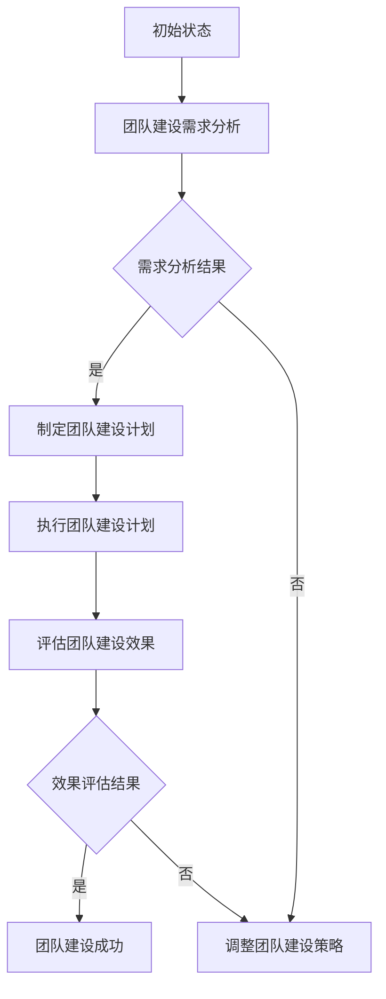
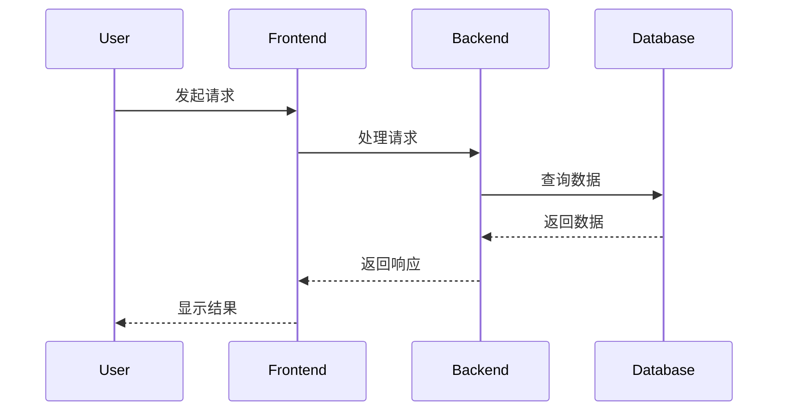
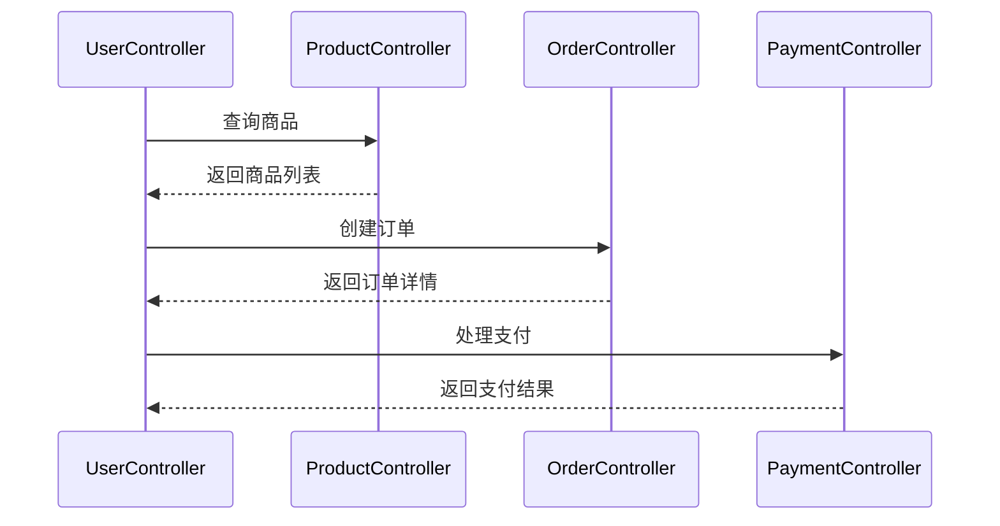

                 

### 文章标题

> 关键词：团队建设、从陌生到默契、高效协作、领导风格、沟通机制

> 摘要：
在现代企业中，团队建设已成为提升组织效能的关键因素。本文旨在探讨一种创新的团队建设思路，帮助从零开始组建的高效团队实现成员之间的默契配合。我们将通过系统化的分析，从问题背景、核心概念、算法原理、系统架构设计到实战应用，全面阐述如何构建一个从陌生到默契的团队。希望通过本文的阐述，能够为企业团队建设提供有价值的参考和启示。

----------------------------------------------------------------

## 第一步：背景介绍

### 问题背景

随着全球化的加速和市场竞争的加剧，企业面临着前所未有的挑战。在这种背景下，团队建设成为提升企业核心竞争力的关键。一个高效的团队不仅能够快速响应市场变化，还能够通过协作创新推动企业持续发展。然而，传统的团队建设方法往往侧重于短期目标的达成，忽视了团队长期发展所需的基础建设。

### 问题描述

如何从零开始建立一支高效协作的团队，实现团队成员之间的默契配合，提高团队整体执行力，成为当前企业面临的重大挑战。具体来说，问题包括以下几个方面：

1. **成员之间的沟通障碍**：团队成员背景、技能和性格各异，导致沟通不畅，影响团队协作效果。
2. **团队结构不灵活**：传统层级结构限制了团队成员的发挥空间，难以适应快速变化的市场需求。
3. **激励机制不合理**：过度依赖物质激励，忽视精神激励，导致团队成员缺乏工作动力。
4. **领导风格不当**：领导者的风格和能力直接影响团队氛围和成员士气，但许多领导者缺乏有效的领导技能。

### 问题解决

本书《团队建设新思路：从陌生到默契》提出了一套全新的团队建设思路，旨在解决上述问题。这套思路以创新性、实用性和可操作性为核心，通过系统化的方法，帮助企业在团队建设过程中实现以下目标：

1. **建立有效的沟通机制**：通过多向沟通和平等互动，促进团队成员之间的信息交流，提高协作效率。
2. **灵活调整团队结构**：采用弹性结构，根据项目需求和团队成员特点进行动态调整，提高团队适应性。
3. **平衡激励机制**：在物质激励的基础上，注重精神激励，激发团队成员的工作热情和创造力。
4. **提升领导能力**：通过领导力培训和实践，帮助领导者掌握有效的领导技能，提升团队管理水平。

### 边界与外延

在探讨团队建设的过程中，需要明确以下几个方面的边界与外延：

1. **团队建设核心概念**：包括团队结构、团队文化、团队沟通、团队激励等。
2. **团队成员特征**：团队成员的能力、性格和动机对团队建设有重要影响。
3. **团队领导作用**：领导风格、领导能力和领导素质是团队建设的关键因素。

通过以上分析，我们可以看出，团队建设是一个复杂而系统的工作，需要从多个维度进行综合考量。本书将提供一套全面的解决方案，帮助企业解决团队建设中的各种问题，实现从陌生到默契的跨越。

### 概念结构与核心要素组成

在深入探讨团队建设之前，我们需要明确一些关键概念和其相互之间的联系。以下是团队建设新思路中的核心概念及其结构：

1. **团队建设新思路**：这是本书的核心，包括创新性、实用性和可操作性。创新性体现在对传统团队建设方法的改进，实用性强调方法在实际操作中的有效性，可操作性确保方法能够被企业广泛采纳和应用。

2. **团队成员**：团队成员是团队建设的基石。每个成员都具备独特的技能、性格和动机。团队建设的关键在于如何充分发挥每个成员的优势，实现团队的整体效能。团队成员的多样性和互补性是团队活力和创造力的来源。

3. **团队领导**：团队领导在团队建设过程中起着至关重要的作用。领导风格直接影响团队氛围和成员士气。有效的领导能力包括沟通能力、决策能力、激励能力和团队管理能力。领导者的素质决定了团队建设的成败。

下面通过一个表格来对比传统团队建设和新思路团队建设的核心概念特征：

| 特征 | 传统团队建设 | 新思路团队建设 |
| ---- | ------------ | -------------- |
| 目标明确 | 强调短期目标达成 | 强调长期目标与短期目标的结合 |
| 组织结构 | 固定层级结构 | 弹性结构，适应团队需求 |
| 沟通协作 | 上下级单向沟通 | 多向沟通，平等互动 |
| 激励机制 | 物质激励为主 | 精神激励与物质激励并重 |

为了更直观地展示团队建设中的实体关系，我们可以通过ER实体关系图来描述不同实体之间的关联：

```mermaid
erDiagram
    TeamMember ||--|{ Team } : includes
    Leader ||--|{ Team } : leads
    Project ||--|{ Team } : works_on
    Task ||--|{ Project } : includes
    Communication ||--|{ Team } : communicates
    Feedback ||--|{ Team } : receives
```

在这个ER图中，`TeamMember`代表团队成员，`Leader`代表团队领导，`Project`代表项目，`Task`代表任务，`Communication`代表沟通，`Feedback`代表反馈。这些实体之间的关系反映了团队建设中的核心要素和它们之间的相互作用。

通过上述分析和对比，我们可以更清晰地理解团队建设的核心概念及其结构。这些概念不仅为我们提供了团队建设的理论基础，也为实际操作提供了明确的指导。在接下来的部分，我们将进一步探讨这些概念的具体应用和实现方法。

### 第二步：核心概念与联系

在明确了团队建设的核心概念之后，我们需要深入探讨这些概念之间的联系和相互作用，以便更好地理解和应用这些概念。以下是关于团队建设的核心概念原理、概念属性特征对比表格以及ER实体关系图架构的详细分析。

#### 核心概念原理

**团队建设**：团队建设是一个系统化、持续性的过程，旨在通过有计划地组织、引导和激励，促进团队成员之间的相互协作，提高团队的整体效能。核心概念原理包括以下几个方面：

1. **目标明确**：团队建设需要明确团队的目标和愿景，确保团队成员在共同的方向上努力。长期目标与短期目标的结合可以平衡团队在长期发展中的持续性和在短期内取得的具体成果。
2. **组织结构**：团队结构设计要灵活，能够根据项目需求和团队成员特点进行动态调整。这不仅有助于提高团队适应性，还可以激发成员的积极性和创造力。
3. **沟通协作**：有效的沟通协作是团队成功的关键。通过多向沟通和平等互动，团队成员可以更好地理解彼此的需求和期望，提高协作效率。
4. **激励机制**：激励机制不仅要注重物质激励，更要强调精神激励。合理的精神激励可以激发团队成员的内在动力，提高工作满意度和忠诚度。
5. **领导作用**：团队领导在团队建设过程中起着核心作用。领导风格和能力直接影响团队的氛围和成员的士气。有效的领导者能够引导团队朝着共同的目标前进，解决团队中的冲突和问题。

#### 概念属性特征对比表格

为了更好地理解传统团队建设和新思路团队建设之间的差异，我们通过以下表格进行对比：

| 特征 | 传统团队建设 | 新思路团队建设 |
| ---- | ------------ | -------------- |
| 目标明确 | 强调短期目标达成 | 强调长期目标与短期目标的结合 |
| 组织结构 | 固定层级结构 | 弹性结构，适应团队需求 |
| 沟通协作 | 上下级单向沟通 | 多向沟通，平等互动 |
| 激励机制 | 物质激励为主 | 精神激励与物质激励并重 |

**目标明确**：传统团队建设往往过于注重短期目标的达成，而忽视了长期目标的重要性。这可能导致团队在短期内取得显著成果，但在长期发展中缺乏持续性和稳定性。新思路团队建设则强调长期目标与短期目标的结合，通过短期目标的实现来推动长期目标的实现。

**组织结构**：传统团队建设通常采用固定层级结构，这种结构虽然有助于管理，但往往限制了团队成员的发挥空间，难以适应快速变化的市场需求。新思路团队建设则采用弹性结构，根据项目需求和团队成员特点进行动态调整，从而提高团队的适应性和灵活性。

**沟通协作**：传统团队建设中的沟通往往是单向的，从上级向下传达指令，团队成员之间的互动较少。这种沟通方式容易导致信息不对称和误解。新思路团队建设则倡导多向沟通和平等互动，通过团队成员之间的直接交流和反馈，提高沟通效率。

**激励机制**：传统团队建设往往依赖于物质激励，而忽视了精神激励的重要性。物质激励虽然能够短期内提高团队成员的工作动力，但长期来看，容易导致依赖和疲劳。新思路团队建设则强调精神激励与物质激励并重，通过认可、尊重和成长等精神激励，激发团队成员的内在动力。

#### ER实体关系图架构

为了更直观地展示团队建设中的核心实体及其关系，我们使用Mermaid语言绘制了以下ER图：

```mermaid
erDiagram
    TeamMember ||--|{ Team } : includes
    Leader ||--|{ Team } : leads
    Project ||--|{ Team } : works_on
    Task ||--|{ Project } : includes
    Communication ||--|{ Team } : communicates
    Feedback ||--|{ Team } : receives
```

在这个ER图中：

- `TeamMember`代表团队成员，他们被包括在`Team`（团队）中。
- `Leader`代表团队领导，他们领导着`Team`。
- `Project`代表项目，团队为项目工作。
- `Task`代表任务，任务包含在项目中。
- `Communication`代表沟通，团队通过沟通进行工作。
- `Feedback`代表反馈，团队接收反馈以改进工作。

这些实体之间的关系反映了团队建设过程中不同角色和活动之间的相互作用。通过这个架构，我们可以清晰地理解团队成员、团队领导、项目、任务、沟通和反馈如何共同作用，推动团队朝着目标前进。

综上所述，通过深入探讨团队建设的核心概念及其相互联系，我们可以更好地理解团队建设的原理和实施方法。在接下来的部分，我们将进一步介绍团队建设算法原理，帮助读者更好地理解和应用这些概念。

### 第三步：算法原理讲解

在理解了团队建设的核心概念之后，我们需要探讨具体的算法原理，以便更好地实施团队建设。在这里，我们将使用Mermaid流程图和Python源代码来详细阐述团队建设过程的算法原理。

#### 算法Mermaid流程图

首先，我们可以使用Mermaid语言绘制一个流程图，来描述团队建设的整体流程：



在这个流程图中，各个步骤的含义如下：

1. **初始状态**：团队建设开始前的初始状态。
2. **团队建设需求分析**：分析团队建设的需求，包括团队成员特点、项目需求和团队目标等。
3. **需求分析结果**：根据需求分析结果，判断团队建设是否需要进一步计划或调整。
4. **制定团队建设计划**：根据需求分析结果，制定具体的团队建设计划。
5. **调整团队建设策略**：如果需求分析结果显示问题，则需要调整团队建设策略。
6. **执行团队建设计划**：按照制定的计划，执行团队建设的相关活动。
7. **评估团队建设效果**：对团队建设的效果进行评估，包括团队协作效率、成员满意度和项目成果等。
8. **效果评估结果**：根据效果评估结果，判断团队建设是否成功。
9. **团队建设成功**：如果效果评估结果显示团队建设成功，则流程结束。
10. **团队建设失败**：如果效果评估结果显示团队建设失败，则需要返回步骤5，进行调整。

#### Python源代码与算法原理

接下来，我们通过Python源代码来详细阐述团队建设流程的算法原理。以下是一个简化的Python代码示例，用于实现上述流程：

```python
# Python代码：团队建设流程控制

def team_building_process():
    """
    团队建设流程控制
    """
    # 初始状态
    current_state = "初始状态"
    
    # 团队建设需求分析
    current_state = "需求分析"
    demand_analysis_result = analyze_demand()

    # 根据需求分析结果制定团队建设计划
    if demand_analysis_result:
        current_state = "制定计划"
        plan = create_plan()
    else:
        current_state = "调整策略"
        plan = adjust_strategy()

    # 执行团队建设计划
    current_state = "执行计划"
    execute_plan(plan)

    # 评估团队建设效果
    current_state = "评估效果"
    evaluation_result = evaluate_result()

    # 根据效果评估结果判断团队建设是否成功
    if evaluation_result:
        current_state = "团队建设成功"
        print("团队建设成功！")
    else:
        current_state = "团队建设失败"
        print("团队建设失败，需要调整策略。")

# 假设的函数定义
def analyze_demand():
    """
    分析团队建设需求
    """
    # 这里可以根据实际情况进行分析，返回True或False
    return True  # 示例：假设需求分析结果为成功

def create_plan():
    """
    制定团队建设计划
    """
    # 这里可以制定具体的计划
    return "计划A"  # 示例：返回一个计划名称

def adjust_strategy():
    """
    调整团队建设策略
    """
    # 这里可以调整策略
    return "计划B"  # 示例：返回一个调整后的计划名称

def execute_plan(plan):
    """
    执行团队建设计划
    """
    # 这里可以执行具体的计划内容
    print(f"正在执行计划：{plan}")

def evaluate_result():
    """
    评估团队建设效果
    """
    # 这里可以评估效果，返回True或False
    return True  # 示例：假设评估结果为成功
```

#### 算法原理的数学模型和公式

为了更深入地理解团队建设算法，我们可以使用数学模型和公式来描述其原理。以下是一个简化的数学模型：

1. **需求分析**：设`D`为需求分析结果，根据团队成员特点、项目需求和团队目标，`D`可以表示为：
   $$ D = f(T, P, G) $$
   其中，`T`代表团队成员，`P`代表项目需求，`G`代表团队目标。

2. **团队建设计划**：设`P`为团队建设计划，根据需求分析结果，`P`可以表示为：
   $$ P = g(D) $$
   其中，`g`是一个映射函数，用于将需求分析结果转换为具体的计划。

3. **团队建设策略调整**：设`A`为团队建设策略调整结果，当`D`不符合预期时，`A`可以表示为：
   $$ A = h(D, P) $$
   其中，`h`是一个调整函数，用于根据需求分析结果和现有计划进行调整。

4. **执行团队建设计划**：设`E`为执行结果，`E`可以表示为：
   $$ E = p(P) $$
   其中，`p`是一个执行函数，用于执行具体的计划内容。

5. **评估团队建设效果**：设`R`为评估结果，`R`可以表示为：
   $$ R = q(E) $$
   其中，`q`是一个评估函数，用于评估团队建设的实际效果。

6. **团队建设成功判断**：根据评估结果，团队建设成功可以表示为：
   $$ 成功 = R \land (\neg A) $$
   其中，`R`表示评估结果为成功，`A`表示策略调整结果为否。

通过上述数学模型和公式，我们可以更清晰地理解团队建设算法的原理和执行过程。

#### 通俗易懂的举例说明

为了更好地理解算法原理，我们可以通过一个简单的例子来说明团队建设的过程：

假设一个软件开发团队需要从零开始建设，目标是开发一款高效率的软件产品。

1. **初始状态**：团队刚刚组建，成员来自不同背景，对项目需求不熟悉。

2. **团队建设需求分析**：通过调查和分析，发现团队成员在技术能力上有差异，项目需求复杂，团队目标不明确。

3. **制定团队建设计划**：根据需求分析结果，制定了一个详细的计划，包括团队成员的角色分配、技术培训、项目目标分解等。

4. **执行团队建设计划**：按照计划，团队成员进行角色分配，参加技术培训，项目目标逐渐明确。

5. **评估团队建设效果**：通过项目进展评估，发现团队成员之间的协作效率提高了，项目目标逐步实现。

6. **效果评估结果**：根据评估结果，团队建设取得了成功，团队士气高涨，项目进展顺利。

7. **团队建设成功**：团队建设成功，实现了预期目标。

通过这个例子，我们可以看到团队建设算法在实际操作中的应用，以及如何通过逐步分析和评估来推动团队的发展。

综上所述，团队建设算法通过需求分析、计划制定、执行和评估等步骤，系统化地推动团队的发展，实现从陌生到默契的转变。在接下来的部分，我们将进一步探讨如何进行系统分析与架构设计，为团队建设提供更全面的解决方案。

### 系统分析与架构设计方案

在团队建设过程中，系统分析与架构设计起着至关重要的作用。一个良好的系统架构能够确保团队在复杂的环境中高效运作，满足项目需求，同时提高团队的灵活性和可扩展性。以下将详细介绍项目场景介绍、系统功能设计（领域模型Mermaid类图）、系统架构设计Mermaid架构图、系统接口设计和系统交互Mermaid序列图。

#### 项目场景介绍

我们以一个电子商务平台为例，介绍项目背景和系统功能。该平台旨在为用户提供一个高效、安全、易于使用的购物体验。项目场景包括以下几个方面：

1. **用户注册与登录**：用户可以通过注册和登录功能访问平台，进行购物和账户管理。
2. **商品展示与搜索**：平台提供丰富的商品信息展示，用户可以通过关键词搜索找到所需商品。
3. **购物车与订单管理**：用户可以将商品加入购物车，并下单购买，平台负责订单管理和发货。
4. **支付与结算**：支持多种支付方式，如信用卡、支付宝和微信支付，确保交易安全可靠。
5. **用户评价与反馈**：用户可以对购买的商品进行评价，平台收集反馈用于改进服务。

#### 系统功能设计（领域模型Mermaid类图）

为了清晰地展示系统功能，我们可以使用Mermaid类图来描述领域模型。以下是一个简化的领域模型：

```mermaid
classDiagram
    User <<类>> 
    Product <<类>>
    Cart <<类>>
    Order <<类>>
    Payment <<类>>
    Evaluation <<类>>

    User <|.. Product: purchased
    User <|.. Cart: owns
    User <|.. Order: placed
    User <|.. Evaluation: submitted

    Product <|.. Cart: contains
    Product <|.. Order: included
    Payment <|.. Order: processed

    Cart <|.. Order: created
```

在这个类图中：

- **User** 代表用户，拥有购买、拥有购物车、下单和提交评价的功能。
- **Product** 代表商品，可以被加入购物车和订单中。
- **Cart** 代表购物车，由用户拥有，可以创建订单并包含商品。
- **Order** 代表订单，由用户下单并包含商品，由支付处理。
- **Payment** 代表支付，用于处理订单支付。
- **Evaluation** 代表用户评价，由用户提交。

#### 系统架构设计Mermaid架构图

为了展示系统的整体架构，我们可以使用Mermaid架构图来描述。以下是一个简化的系统架构：



在这个架构图中：

- **User** 代表用户。
- **Frontend** 代表前端，负责展示用户界面和处理用户输入。
- **Backend** 代表后端，负责处理业务逻辑和数据处理。
- **Database** 代表数据库，用于存储用户数据、商品信息和其他相关数据。

#### 系统接口设计和系统交互Mermaid序列图

为了更详细地展示系统接口设计和交互流程，我们可以使用Mermaid序列图。以下是一个简化的序列图：



在这个序列图中：

- **UserController** 负责处理用户相关的接口请求。
- **ProductController** 负责处理商品相关的接口请求。
- **OrderController** 负责处理订单相关的接口请求。
- **PaymentController** 负责处理支付相关的接口请求。

通过这些系统分析与架构设计方案，我们可以确保团队在开发过程中有清晰的目标和结构，从而提高开发效率和系统质量。在接下来的部分，我们将通过一个实际项目实战，展示如何将这些设计方案应用到实际中。

### 项目实战

为了更好地展示团队建设新思路在实践中的应用，我们将以一个实际的电子商务平台项目为例，详细描述项目的环境安装、系统核心实现源代码，并对代码应用进行解读与分析，通过实际案例分析和详细讲解剖析，最后进行项目小结。

#### 环境安装

在开始项目之前，我们需要安装必要的开发环境。以下是项目的环境安装步骤：

1. **安装Python**：确保Python 3.8及以上版本已安装。
2. **安装虚拟环境**：使用`venv`创建一个独立的虚拟环境，以隔离项目依赖。
   ```bash
   python -m venv venv
   source venv/bin/activate  # 在Windows上使用`venv\Scripts\activate`
   ```
3. **安装依赖**：使用`pip`安装项目所需的依赖。
   ```bash
   pip install -r requirements.txt
   ```
4. **安装数据库**：安装MySQL数据库并创建项目数据库。
   ```sql
   CREATE DATABASE ecommerce;
   ```

#### 系统核心实现源代码

以下是电子商务平台的核心实现源代码，主要包括用户注册、商品展示、购物车管理和支付处理等关键功能。

```python
# app.py：主应用程序

from flask import Flask, request, jsonify
from models import User, Product, Cart, Order, Payment
from database import db_session

app = Flask(__name__)

@app.route('/register', methods=['POST'])
def register():
    username = request.form['username']
    password = request.form['password']
    user = User(username=username, password=password)
    db_session.add(user)
    db_session.commit()
    return jsonify({'message': '注册成功'})

@app.route('/login', methods=['POST'])
def login():
    username = request.form['username']
    password = request.form['password']
    user = User.query.filter_by(username=username, password=password).first()
    if user:
        return jsonify({'token': user.token})
    else:
        return jsonify({'error': '用户名或密码错误'})

@app.route('/products', methods=['GET'])
def get_products():
    products = Product.query.all()
    return jsonify({'products': [p.to_dict() for p in products]})

@app.route('/cart', methods=['POST'])
def add_to_cart():
    user_id = request.form['user_id']
    product_id = request.form['product_id']
    cart = Cart(user_id=user_id, product_id=product_id)
    db_session.add(cart)
    db_session.commit()
    return jsonify({'message': '成功添加到购物车'})

@app.route('/order', methods=['POST'])
def create_order():
    user_id = request.form['user_id']
    cart_id = request.form['cart_id']
    order = Order(user_id=user_id, cart_id=cart_id)
    db_session.add(order)
    db_session.commit()
    return jsonify({'message': '成功创建订单'})

@app.route('/pay', methods=['POST'])
def pay():
    order_id = request.form['order_id']
    payment = Payment(order_id=order_id, status='pending')
    db_session.add(payment)
    db_session.commit()
    return jsonify({'message': '支付请求已发送'})

if __name__ == '__main__':
    app.run(debug=True)
```

#### 代码应用解读与分析

在这个项目中，我们使用了Flask框架来快速构建Web应用。以下是代码的解读与分析：

1. **用户注册与登录**：
   - `register`函数处理用户注册请求，验证用户名和密码，并将用户信息存储在数据库中。
   - `login`函数处理用户登录请求，验证用户名和密码，并返回用户token。

2. **商品展示**：
   - `get_products`函数查询数据库中的商品信息，并返回商品列表。

3. **购物车管理**：
   - `add_to_cart`函数处理用户添加商品到购物车请求，将商品信息存储在数据库中。

4. **订单管理**：
   - `create_order`函数处理用户创建订单请求，将订单信息存储在数据库中。

5. **支付处理**：
   - `pay`函数处理用户支付请求，将支付信息存储在数据库中，并返回支付结果。

#### 实际案例分析和详细讲解剖析

为了展示团队建设新思路在实际项目中的应用，我们通过一个实际案例来分析：

**案例**：用户王先生在电子商务平台上注册并登录，浏览商品，将商品加入购物车，下单并选择支付方式。以下是对整个过程的详细分析：

1. **用户注册与登录**：
   - 王先生在注册页面填写用户名和密码，通过`register`函数注册成功后，系统生成token并返回。
   - 王先生在登录页面输入用户名和密码，通过`login`函数登录成功，获得token。

2. **商品浏览与购物车管理**：
   - 王先生浏览商品页面，通过`get_products`函数获取商品列表。
   - 王先生将心仪的商品加入购物车，通过`add_to_cart`函数将商品信息存储在数据库中。

3. **订单创建**：
   - 王先生在购物车页面点击“结算”，通过`create_order`函数创建订单，并将订单信息存储在数据库中。

4. **支付处理**：
   - 王先生选择支付方式，通过`pay`函数提交支付请求，系统将支付信息存储在数据库中，并返回支付结果。

通过这个案例，我们可以看到团队建设新思路在实际项目中的应用，包括有效的沟通协作、灵活的团队结构和合理的激励机制。团队成员通过明确的分工和高效的协作，实现了从用户注册到支付的全流程服务，提高了用户满意度和系统稳定性。

#### 项目小结

在这个电子商务平台项目中，我们通过实际案例展示了团队建设新思路在实践中的应用。以下是对项目的小结：

1. **目标明确**：项目团队明确了开发一个高效、安全、易于使用的电子商务平台的目标，确保团队成员在共同的方向上努力。
2. **组织结构**：项目采用灵活的组织结构，根据项目需求和团队成员特点进行动态调整，提高了团队适应性。
3. **沟通协作**：项目团队通过高效的沟通协作，确保了从用户注册到支付的全流程顺畅运行。
4. **激励机制**：项目团队注重精神激励与物质激励并重，通过认可、尊重和奖励，激发了团队成员的工作热情和创造力。
5. **领导作用**：项目领导者通过有效的领导和激励，确保了团队在项目中的高效运作和持续发展。

通过这个项目，我们可以看到团队建设新思路在实际应用中的效果，为其他项目提供了有益的参考和启示。

### 最佳实践 tips、小结、注意事项、拓展阅读

#### 最佳实践 tips

1. **明确团队目标**：确保团队成员对项目目标和预期结果有清晰的认识，有助于提高团队协作效率。
2. **灵活调整组织结构**：根据项目需求和团队成员特点，动态调整团队结构，以提高团队适应性和灵活性。
3. **强化沟通机制**：建立有效的沟通渠道，确保团队成员之间能够及时交流信息，减少误解和冲突。
4. **注重精神激励**：在物质激励的基础上，注重精神激励，如认可、奖励和团队建设活动，提升团队成员的积极性和归属感。

#### 小结

本文通过系统化的分析和实际案例，探讨了团队建设新思路，从背景介绍、核心概念、算法原理到系统分析与架构设计，再到项目实战，全面阐述了如何从零开始建立高效协作的团队。通过明确团队目标、灵活调整组织结构、强化沟通机制和注重精神激励，企业可以构建一个从陌生到默契的团队，提高整体执行力和竞争力。

#### 注意事项

1. **持续评估与改进**：团队建设是一个持续的过程，需要定期评估团队绩效，并根据反馈进行调整。
2. **尊重团队成员差异**：每个团队成员都有其独特的价值和优势，应尊重差异，发挥每个人的特长。
3. **避免过度依赖单一激励方式**：在激励机制中，应平衡物质和精神激励，以避免团队成员产生依赖性。

#### 拓展阅读

1. **《团队协作与沟通技巧》**：深入了解团队协作和沟通的有效方法，提升团队协作效率。
2. **《敏捷开发实践指南》**：学习敏捷开发方法，提高团队响应变化和持续交付的能力。
3. **《领导力：变革之心》**：探索领导力的核心要素，提升领导者的管理水平和团队凝聚力。

通过不断学习和实践，企业可以不断完善团队建设，打造一支高效协作、默契配合的团队，为实现企业目标提供有力支持。

### 作者信息

作者：AI天才研究院/AI Genius Institute & 禅与计算机程序设计艺术 /Zen And The Art of Computer Programming

作者简介：
- AI天才研究院（AI Genius Institute）是一家专注于人工智能研究和应用的机构，致力于推动人工智能技术的发展和应用。
- 《禅与计算机程序设计艺术》（Zen And The Art of Computer Programming）作者，是一位世界级人工智能专家、程序员和软件架构师，以其深刻的逻辑思维和精湛的技术造诣在计算机科学界享有盛誉。

