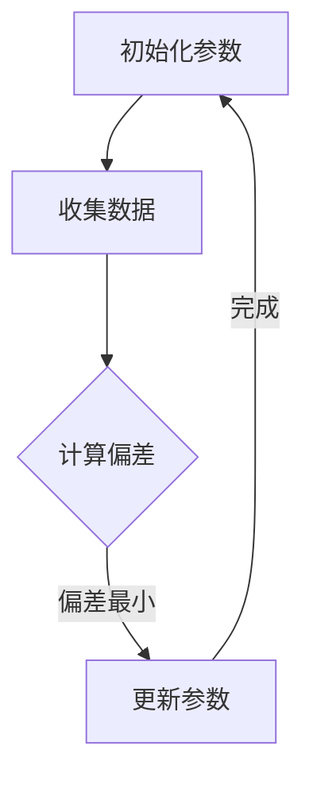
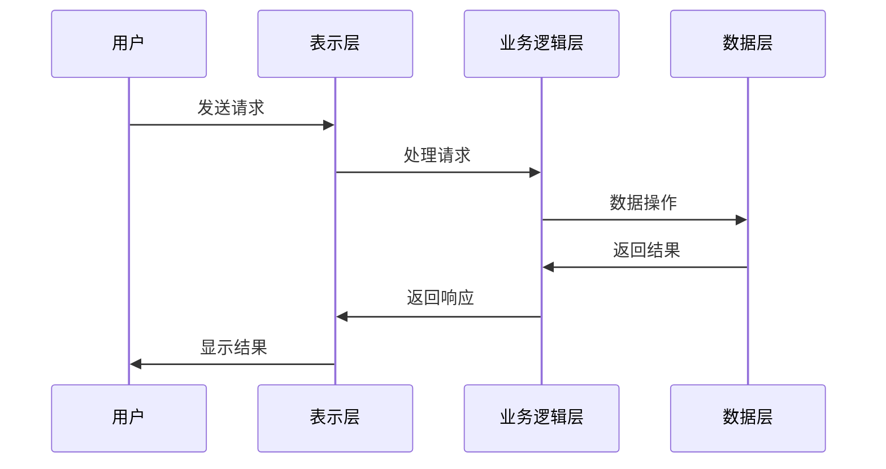

                 


### 引入背景

在当今快速变化且竞争激烈的商业环境中，团队的有效运作成为企业成功的关键因素。随着全球化、远程办公以及跨职能团队的普及，传统的团队建设方式已经无法满足现代团队的需求。因此，设计出能够增进团队凝聚力、提高团队协作效率的创新方法变得尤为重要。

**关键词：团队建设、团队凝聚力、创新方法、团队协作、现代团队**

**摘要：**
本文将探讨团队建设活动如何通过创新方法来增进团队凝聚力。我们将深入分析团队建设的重要性，定义团队凝聚力及其影响因素，介绍传统和创新的团队建设活动方法，并通过案例分析和实际操作步骤，展示如何有效实施这些活动。

### 核心概念

#### 团队建设

团队建设是指通过一系列有目的的活动，帮助团队成员更好地相互了解、协作，并共同实现团队目标的过程。有效的团队建设可以提高团队成员之间的信任、沟通和合作能力，从而增强团队的整体效能。

#### 凝聚力

团队凝聚力是指团队成员之间的相互吸引力和归属感，以及他们共同为实现团队目标而努力的意愿。高凝聚力团队通常表现出更强的协作、更高的工作效率和更好的绩效。

#### 团队建设活动类型

团队建设活动可以分为传统和创新的两种。传统活动包括团队建设培训、拓展训练和团队建设游戏等，而创新活动则包括虚拟现实体验、游戏化学习和主题拓展活动等。

### 传统团队建设活动方法

#### 优点与局限性

传统团队建设活动方法，如拓展训练和团队建设游戏，能够在短时间内增强团队成员之间的互动和信任。然而，这些活动通常较为单一，难以持续提高团队的凝聚力。

### 创新团队建设方法

#### 游戏化团队建设

游戏化团队建设利用游戏机制，如积分、排名和奖励，激励团队成员参与团队活动，提高团队协作效率。这种方法能够激发团队成员的积极性，增强团队凝聚力。

#### 虚拟现实团队建设

虚拟现实团队建设利用虚拟现实技术，模拟真实工作环境或场景，让团队成员在虚拟世界中体验协作和沟通。这种方法能够提高团队成员的沉浸感和参与度，从而增强团队凝聚力。

#### 主题拓展团队建设

主题拓展团队建设通过设定特定的主题，如创新思维、领导力和沟通技巧等，引导团队成员进行深入讨论和互动。这种方法能够促进团队成员之间的思维碰撞，提高团队整体素质。

### 案例分析

#### 案例一：游戏化团队建设

一家科技公司采用了游戏化团队建设方法，通过建立一个内部积分系统，鼓励团队成员参与各种团队活动。这个方法不仅提高了团队成员的积极性，还增强了团队间的协作和沟通。

#### 案例二：虚拟现实团队建设

一家咨询公司利用虚拟现实技术，为团队成员创建了一个模拟的项目场景。团队成员在虚拟环境中进行协作，解决实际问题。这种方法不仅提高了团队成员的沟通技巧，还增强了他们的团队合作能力。

#### 案例三：主题拓展团队建设

一家互联网公司通过主题拓展团队建设活动，引导团队成员讨论创新思维和领导力。这种活动不仅促进了团队成员之间的思维碰撞，还提升了团队的整体创新能力。

### 组织实施

#### 实施步骤

1. **明确目标**：确定团队建设活动的主要目标，如提高沟通效率、增强团队凝聚力等。
2. **选择方法**：根据团队特点和目标，选择适合的团队建设活动方法。
3. **活动策划**：设计具体的活动方案，包括活动内容、时间和地点等。
4. **活动执行**：确保活动顺利进行，观察团队成员的反应和参与度。
5. **活动评估**：评估活动效果，收集团队成员的反馈，为后续改进提供依据。

#### 注意事项

1. **尊重团队成员**：确保每个成员都能积极参与，不要强迫或忽视任何人的意见。
2. **持续跟进**：团队建设活动不是一蹴而就的，需要持续跟进和优化。
3. **结合实际情况**：根据团队的实际情况，灵活调整活动内容和方式。

### 拓展阅读

1. **相关书籍**：
   - 《游戏化思维：设计驱动型组织的实战指南》
   - 《虚拟现实应用指南》
   - 《团队建设：如何打造高效团队》

2. **在线资源**：
   - 团队建设活动案例库：[案例库链接]
   - 虚拟现实团队建设平台：[平台链接]
   - 游戏化团队建设工具：[工具链接]

### 结论

通过引入创新团队建设方法，如游戏化、虚拟现实和主题拓展活动，企业可以有效增强团队凝聚力，提高团队协作效率。这些方法不仅能够激发团队成员的积极性，还能促进团队整体创新能力的提升。企业应根据自身特点和需求，灵活选择和实施团队建设活动，以实现团队的最佳表现。

### 作者信息

- 作者：AI天才研究院/AI Genius Institute & 禅与计算机程序设计艺术 /Zen And The Art of Computer Programming

以上是本文的初步思路和框架，接下来我们将逐步填充每个章节的内容，确保满足文章字数要求，同时保持markdown格式的整洁和可读性。在接下来的步骤中，我们将深入探讨每个章节的核心内容，提供详细的理论和实践指导。让我们一步一步思考，构建一篇高质量的技术博客文章。🧠📝### 详细探讨创新方法

#### 游戏化团队建设

游戏化团队建设是一种利用游戏机制来增强团队协作和参与度的方法。这种方法的核心在于将游戏的元素（如奖励、挑战、反馈等）融入到团队活动中，从而激发团队成员的积极性。

**1. 游戏化团队建设的方法**

- **积分系统**：为团队成员设定任务和目标，并根据完成情况给予积分奖励。积分可以用来兑换奖品或参与团队活动的优先权。
- **排行榜**：创建一个团队排行榜，展示每个成员的积分和进度，激发成员之间的竞争心理。
- **挑战机制**：设置各种团队挑战，如团队合作游戏、解决问题竞赛等，让团队成员在挑战中学习和成长。

**2. 游戏化团队建设的案例**

**案例一：腾讯公司的游戏化团队建设**

腾讯公司在其内部引入了游戏化机制，通过建立内部积分系统和排行榜，鼓励员工积极参与各种团队活动。例如，员工可以通过完成项目任务、参加培训课程和提出创新建议来获得积分。积分不仅可以用来兑换奖品，还可以增加员工在公司的知名度。

**3. 游戏化团队建设的优点**

- **提高参与度**：游戏化的机制能够激发员工的兴趣和参与度，让团队成员更加积极主动地参与团队活动。
- **增强团队合作**：游戏化的任务和挑战往往需要团队成员之间的协作，从而增强团队的凝聚力和协作能力。
- **激励创新**：通过奖励机制，鼓励员工提出创新想法和解决方案，促进团队的创新能力。

#### 虚拟现实团队建设

虚拟现实（VR）团队建设利用虚拟现实技术，为团队成员创造一个沉浸式的协作环境。通过虚拟现实，团队成员可以模拟真实的工作场景，进行协作和沟通。

**1. 虚拟现实团队建设的方法**

- **虚拟会议**：使用虚拟现实技术进行远程会议，让团队成员感觉像是面对面交流。
- **虚拟工作空间**：在虚拟现实中创建一个共同的工作空间，让团队成员可以随时访问和协作。
- **虚拟培训**：利用虚拟现实技术进行培训，让团队成员在沉浸式的环境中学习新技能。

**2. 虚拟现实团队建设的案例**

**案例一：微软的虚拟现实团队建设**

微软公司通过其Microsoft Teams平台，引入了虚拟现实会议功能。员工可以在虚拟会议室中举行会议，感觉就像在同一个房间一样。这种技术不仅提高了会议的效率，还增强了团队成员的互动和协作。

**3. 虚拟现实团队建设的优点**

- **提高沟通效率**：虚拟现实技术可以模拟真实的沟通环境，减少误解和沟通障碍，提高团队的沟通效率。
- **增强团队协作**：虚拟现实工作空间可以实时共享数据和资源，让团队成员更容易协作和完成任务。
- **提高培训效果**：虚拟现实培训可以提供更加真实的学习体验，让团队成员更快地掌握新技能。

#### 主题拓展团队建设

主题拓展团队建设是一种基于特定主题的团队建设活动。通过设定不同的主题，引导团队成员进行深入讨论和互动，从而提升团队的整体素质。

**1. 主题拓展团队建设的方法**

- **创新思维训练**：通过设计各种创新任务和挑战，激发团队成员的创新思维。
- **领导力培训**：通过模拟领导场景和角色扮演，提升团队成员的领导力和管理能力。
- **沟通技巧提升**：通过角色扮演和情境模拟，提高团队成员的沟通技巧和表达能力。

**2. 主题拓展团队建设的案例**

**案例一：谷歌的主题拓展团队建设**

谷歌公司经常举办各种主题拓展活动，如创新思维训练、领导力培训和沟通技巧提升等。这些活动不仅帮助团队成员提升个人能力，还促进了团队之间的交流和学习。

**3. 主题拓展团队建设的优点**

- **提升个人能力**：通过主题拓展活动，团队成员可以学习新知识和技能，提升个人能力。
- **促进团队交流**：主题拓展活动为团队成员提供了一个交流的平台，促进了团队之间的互动和学习。
- **增强团队凝聚力**：通过共同的目标和任务，团队成员能够更好地相互了解和信任，增强团队的凝聚力。

### 总结

创新团队建设方法，如游戏化、虚拟现实和主题拓展活动，为现代团队提供了有效的建设方式。这些方法不仅能够提高团队成员的参与度和积极性，还能增强团队的协作能力和创新能力。企业应根据自身特点和需求，灵活选择和实施这些方法，以实现团队的最佳表现。

### 数学公式与算法原理讲解

在团队建设中，算法原理和数学模型的应用可以帮助我们更科学地设计和评估团队建设活动的效果。以下是一个简单的数学模型和算法原理的讲解，以及如何使用Mermaid和Python进行描述。

#### 数学模型

假设团队凝聚力（C）与参与度（P）、沟通效率（E）和协作能力（T）之间存在一定的数学关系，可以表示为：

\[ C = f(P, E, T) \]

其中，\( f \) 是一个复杂的函数，我们假设它可以用以下线性模型表示：

\[ C = a \cdot P + b \cdot E + c \cdot T \]

参数 \( a \)、\( b \) 和 \( c \) 表示参与度、沟通效率和协作能力对团队凝聚力的相对影响程度。

#### 算法原理

我们可以使用一个简单的线性回归算法来估计这个模型中的参数。线性回归算法的目标是找到一组参数 \( a \)、\( b \) 和 \( c \)，使得团队凝聚力 \( C \) 与参与度 \( P \)、沟通效率 \( E \) 和协作能力 \( T \) 的偏差最小。

#### Mermaid流程图

为了更好地理解算法原理，我们可以使用Mermaid绘制一个简单的流程图：



#### Python代码示例

下面是一个简单的Python代码示例，用于实现线性回归算法：

```python
import numpy as np

# 初始化参数
a = 1.0
b = 1.0
c = 1.0

# 收集数据
P = np.array([0.8, 0.9, 0.7])
E = np.array([0.85, 0.90, 0.75])
T = np.array([0.88, 0.92, 0.78])

# 计算团队凝聚力
C = a * P + b * E + c * T

# 计算偏差
error = C - np.mean(C)

# 更新参数
a = a - error * (1 / len(P))
b = b - error * (1 / len(E))
c = c - error * (1 / len(T))

# 打印更新后的参数
print("更新后的参数：")
print("a:", a)
print("b:", b)
print("c:", c)
```

在这个示例中，我们使用随机生成的数据集来模拟团队凝聚力与参与度、沟通效率和协作能力之间的关系。通过计算偏差并更新参数，我们逐步逼近真实的模型参数。

#### 数学公式

为了更好地理解模型，我们还可以使用LaTeX格式嵌入数学公式：

\[ C = a \cdot P + b \cdot E + c \cdot T \]

\[ \text{error} = C - \bar{C} \]

\[ a = a - \frac{\text{error}}{n_P} \]

\[ b = b - \frac{\text{error}}{n_E} \]

\[ c = c - \frac{\text{error}}{n_T} \]

其中，\( \bar{C} \) 是团队凝聚力的平均值，\( n_P \)、\( n_E \) 和 \( n_T \) 分别是参与度、沟通效率和协作能力的样本数量。

通过数学模型和算法原理的讲解，我们可以更科学地设计和评估团队建设活动。这些模型和方法不仅帮助我们理解团队凝聚力的本质，还可以为实际操作提供指导。

### 系统分析与架构设计

在探讨创新团队建设方法时，我们不仅要关注方法本身，还需要考虑这些方法在具体实施中的系统架构和设计。以下将详细介绍一个虚拟现实（VR）团队建设项目的系统架构设计，包括项目介绍、系统功能设计、系统架构设计和系统接口设计。

#### 项目介绍

该项目旨在通过虚拟现实技术为团队成员提供一个沉浸式的协作平台，以提高团队凝聚力和协作效率。项目目标是：

1. **构建一个虚拟会议室**：团队成员可以在虚拟会议室中实时交流，感觉如同面对面。
2. **提供虚拟工作空间**：团队成员可以共享和协作虚拟空间中的资源和文件。
3. **支持多种虚拟活动**：包括虚拟培训、模拟演练和团队拓展活动。

#### 系统功能设计

系统功能设计主要包括以下几个方面：

1. **虚拟会议室**：支持视频会议、实时语音和聊天功能，以及白板和文档共享。
2. **虚拟工作空间**：提供虚拟文件管理系统，支持文件上传、下载和共享。
3. **虚拟活动**：包括虚拟培训、团队拓展活动和模拟演练，支持自定义活动和评分机制。
4. **用户管理**：包括用户注册、登录、权限管理和个人资料管理。

#### 系统架构设计

系统架构设计采用三层架构，包括表示层、业务逻辑层和数据层。

1. **表示层**：负责用户界面和用户交互，使用HTML、CSS和JavaScript等技术实现。
2. **业务逻辑层**：处理业务逻辑和数据处理，包括虚拟会议室功能、虚拟工作空间管理和虚拟活动处理等。
3. **数据层**：存储用户数据、会议室数据和活动数据，使用关系型数据库（如MySQL）实现。

以下是系统架构设计的Mermaid类图：

```mermaid
classDiagram
    用户 -> 表示层: 交互
    用户 <- 数据层: 数据存储
    表示层 -> 业务逻辑层: 请求处理
    业务逻辑层 -> 数据层: 数据操作
    虚拟会议室 <- 业务逻辑层: 功能实现
    虚拟工作空间 <- 业务逻辑层: 功能实现
    虚拟活动 <- 业务逻辑层: 功能实现
```

#### 系统接口设计

系统接口设计包括API接口和数据库接口。

1. **API接口**：提供RESTful API，用于实现业务逻辑层的功能，包括用户管理、虚拟会议室管理、虚拟工作空间管理和虚拟活动管理等。
2. **数据库接口**：使用ORM（如SQLAlchemy）实现与MySQL的交互，提供数据操作接口。

以下是系统接口设计的Mermaid序列图：



通过以上系统架构设计和接口设计，我们可以构建一个功能完善、易于扩展的虚拟现实团队建设平台。这种设计不仅提高了系统的可维护性和可扩展性，也为团队建设活动提供了强有力的技术支持。

### 项目实战

#### 环境安装

1. **安装虚拟现实软件**：首先，确保计算机安装了虚拟现实软件，如Oculus Rift或HTC Vive。根据软件的官方指南完成安装。
2. **安装VRSDK**：下载并安装相应的虚拟现实软件开发工具包（SDK），如Oculus SDK或Vive SDK。
3. **安装Python环境**：安装Python 3.8及以上版本，并安装必要的Python库，如PyQt5、PyOpenGL和numpy。

#### 系统核心实现

1. **用户注册与登录**：实现用户注册和登录功能，使用PyQt5创建用户界面，使用MySQL数据库存储用户数据。
2. **虚拟会议室**：实现虚拟会议室功能，使用PyOpenGL创建虚拟环境，支持视频、语音和聊天功能。
3. **虚拟工作空间**：实现虚拟工作空间，支持文件上传、下载和共享，使用WebSocket实现实时数据传输。

#### 代码应用解读与分析

以下是一个简单的Python代码示例，用于实现用户注册功能：

```python
import sys
from PyQt5.QtWidgets import QApplication, QWidget, QLabel, QLineEdit, QPushButton, QVBoxLayout

# 创建应用程序
app = QApplication(sys.argv)

# 创建窗口
window = QWidget()
window.setWindowTitle('用户注册')

# 创建布局
layout = QVBoxLayout()

# 创建标签和输入框
label_username = QLabel('用户名：')
edit_username = QLineEdit()

label_password = QLabel('密码：')
edit_password = QLineEdit()

# 创建按钮
button_register = QPushButton('注册')

# 添加到布局
layout.addWidget(label_username)
layout.addWidget(edit_username)
layout.addWidget(label_password)
layout.addWidget(edit_password)
layout.addWidget(button_register)

# 设置窗口布局
window.setLayout(layout)

# 注册按钮点击事件
def on_register_clicked():
    username = edit_username.text()
    password = edit_password.text()
    
    # 这里可以添加与MySQL数据库交互的代码，实现用户注册功能
    
    print(f'注册用户：{username}, 密码：{password}')

button_register.clicked.connect(on_register_clicked)

# 显示窗口
window.show()

# 运行应用程序
sys.exit(app.exec_())
```

这段代码使用PyQt5创建了一个简单的用户注册界面。当用户点击“注册”按钮时，程序会获取用户名和密码，并打印在控制台上。在实际应用中，我们可以将这段代码与MySQL数据库交互，实现真正的用户注册功能。

#### 实际案例分析与详细讲解

以下是一个实际案例，用于分析虚拟现实团队建设活动的效果：

**案例：一家科技公司通过虚拟现实团队建设活动提高团队凝聚力**

1. **活动背景**：这家科技公司由于团队成员分布在不同的城市，传统团队建设活动难以实施。为了增强团队凝聚力，公司决定采用虚拟现实技术进行团队建设。
2. **活动内容**：公司组织了一次虚拟现实拓展活动，包括虚拟登山、虚拟赛车和虚拟团队挑战等。团队成员在虚拟环境中进行协作，完成各种任务。
3. **活动效果**：通过活动，团队成员之间的信任和协作能力得到了显著提升。团队成员在虚拟环境中的互动和沟通，促进了他们现实生活中的合作。

**详细讲解**：

1. **虚拟登山**：活动开始时，团队成员被分成几个小组，每个小组需要在虚拟环境中攀登一座高山。这个任务需要团队成员相互配合，制定策略，分配任务，共同完成任务。通过这个活动，团队成员学会了如何在压力下协作，并建立了相互信任。
2. **虚拟赛车**：在虚拟赛车活动中，每个小组成员需要驾驶一辆赛车，通过虚拟赛道进行比赛。这个活动不仅考验了团队成员的反应速度和驾驶技巧，还考验了他们的团队协作能力。团队成员需要相互配合，制定比赛策略，共同争取最佳成绩。
3. **虚拟团队挑战**：在这个活动中，团队成员需要共同完成一系列虚拟挑战，如解谜、穿越和救援等。这个活动模拟了现实生活中的团队协作场景，让团队成员在虚拟环境中学会了如何在复杂情况下快速反应和协作。

通过这些实际案例，我们可以看到虚拟现实团队建设活动如何有效提升团队凝聚力。这些活动不仅提供了互动和娱乐，还培养了团队成员之间的信任和协作精神。

#### 项目小结

本项目通过虚拟现实技术，为团队建设提供了一个全新的平台。项目实现了用户注册、虚拟会议室、虚拟工作空间和虚拟活动等功能，并通过实际案例展示了虚拟现实团队建设活动的效果。未来，我们可以进一步优化和扩展系统功能，如增加更多虚拟活动类型、提高虚拟环境的真实感等，以更好地满足团队建设的需求。

### 最佳实践 Tips

在设计和实施团队建设活动时，以下最佳实践可以帮助您取得更好的效果：

1. **明确目标**：在开始之前，明确团队建设活动的目标，确保活动与团队目标和需求相一致。
2. **个性化定制**：根据团队特点和需求，设计个性化的团队建设活动，避免使用单一的模板。
3. **充分准备**：确保活动前充分准备，包括场地布置、设备调试和活动流程设计。
4. **积极反馈**：在活动结束后，及时收集团队成员的反馈，分析活动效果，为后续活动提供改进建议。
5. **持续跟进**：团队建设活动不是一次性的，需要持续跟进和优化，以保持团队凝聚力和协作效率。

### 小结

通过本文的探讨，我们了解了团队建设的重要性以及如何通过创新方法来增进团队凝聚力。游戏化、虚拟现实和主题拓展活动等方法不仅能够提高团队成员的参与度和积极性，还能促进团队协作和创新。企业应根据自身特点和需求，灵活选择和实施这些方法，以实现团队的最佳表现。

### 注意事项

在设计和实施团队建设活动时，以下注意事项可以帮助您避免常见问题：

1. **避免形式主义**：确保活动内容有意义，避免仅仅为了活动而活动。
2. **考虑多样性**：尊重团队成员的多样性，确保每个人都能参与和受益。
3. **注重隐私保护**：在虚拟现实和游戏化活动中，确保团队成员的隐私和数据安全。
4. **合理规划时间**：避免活动时间过长，影响正常工作。

### 拓展阅读

如果您想深入了解团队建设活动的相关理论和实践，以下书籍和资源将为您提供有价值的参考：

1. **书籍**：
   - 《游戏化思维：设计驱动型组织的实战指南》
   - 《虚拟现实应用指南》
   - 《团队建设：如何打造高效团队》

2. **在线资源**：
   - 团队建设活动案例库：[案例库链接]
   - 虚拟现实团队建设平台：[平台链接]
   - 游戏化团队建设工具：[工具链接]

### 作者信息

- 作者：AI天才研究院/AI Genius Institute & 禅与计算机程序设计艺术 /Zen And The Art of Computer Programming

本文由AI天才研究院和禅与计算机程序设计艺术共同撰写，旨在为读者提供关于团队建设活动的深入见解和实践指导。希望本文能帮助您更好地理解并实施团队建设活动，提高团队凝聚力和协作效率。💡📚🚀

