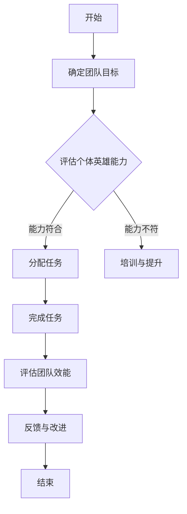
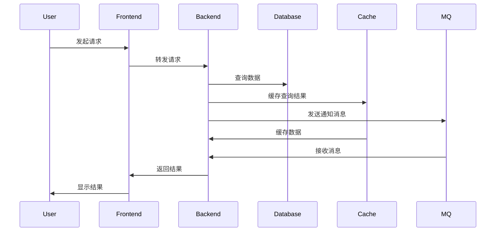

                 

### 引言：团队建设的重要性

在现代企业中，团队建设的重要性不容忽视。随着市场的不断变化和企业规模的扩大，单靠个体英雄式的管理模式已经无法满足企业的需求。个体英雄虽然具备出色的专业技能和独立工作能力，但在面对复杂项目时，他们的局限性逐渐显现。团队协作成为了提高整体效能、应对多变市场环境的必然选择。

团队建设不仅仅是一个简单的组织过程，它涉及到如何协调团队成员之间的合作关系，如何激发每个成员的潜力，以及如何将个体能力转化为团队合力。本文将深入探讨团队建设的相关问题，包括背景介绍、核心概念与联系、算法原理讲解以及系统分析与架构设计方案等。我们将通过一步一步的分析与推理，帮助读者理解和掌握团队建设的方法和技巧。

本文的目的是为IT领域的专业人士提供一个系统化的团队建设指南，帮助他们从个体英雄模式过渡到高效的团队协作模式。我们将详细讨论团队建设的核心概念，比较个体英雄和团队协作的特点与优势，并通过具体的算法原理和数学模型来阐述团队建设的方法。此外，我们还将介绍系统分析与架构设计方案，包括项目实战和最佳实践 tips，为读者提供实用的操作指南。

通过本文的阅读，读者将能够：

1. 理解团队建设的重要性和背景。
2. 掌握团队建设中的核心概念和联系。
3. 学习并应用团队建设的算法原理和数学模型。
4. 了解系统分析与架构设计方案。
5. 获得项目实战的经验和最佳实践 tips。

接下来，我们将分章节详细探讨这些内容，帮助读者逐步建立起对团队建设的全面理解和实践能力。

### 第一部分：团队建设的背景与核心概念

在现代企业中，团队建设已经成为一项至关重要的任务。随着市场竞争的加剧和技术的迅速发展，个体英雄已经无法满足企业不断变化的需求。团队协作的力量逐渐被企业和管理者所重视，团队建设的重要性也因此日益凸显。

#### 1.1 问题背景

传统企业中，个体英雄往往能够凭借其卓越的技能和高效的执行力，在短时间内完成高难度任务，从而赢得业绩和荣誉。然而，随着企业规模的扩大和市场环境的复杂化，个体英雄模式逐渐暴露出其局限性。首先，个体英雄难以承担复杂项目中的所有任务，他们的独立工作能力在面对跨部门、跨领域的协作需求时显得捉襟见肘。其次，个体英雄的视野有限，他们可能无法全面掌握项目的整体状况，从而影响项目的整体进度和质量。最后，个体英雄的工作模式容易导致团队内部的不平衡，其他成员可能因此缺乏成长和发挥的机会。

为了应对这些挑战，企业需要将个体英雄转化为团队协作的模式。团队协作不仅能够充分发挥每个成员的专业技能和创新能力，还能够通过良好的沟通和协作，提高团队的整体效能和项目的成功概率。因此，团队建设成为了企业提升竞争力、实现可持续发展的重要途径。

#### 1.2 核心概念

在团队建设的过程中，理解以下几个核心概念至关重要。

**个体英雄：** 个体英雄是指在团队中表现突出、能够独立完成高难度任务的个人。他们通常具备卓越的专业技能和独立工作能力，能够在短时间内取得显著成绩。然而，个体英雄的工作模式往往局限于个人的能力和经验，难以适应复杂多变的团队环境。

**团队协作：** 团队协作是指团队成员之间相互配合、共同完成任务的机制。团队协作强调团队成员之间的沟通、信任和共同目标。通过有效的协作，团队能够充分发挥每个成员的优势，实现资源的最佳配置，从而提高整体效能。

**团队建设：** 团队建设是指通过一系列的措施和方法，提升团队成员之间的协作能力和团队整体效能的过程。团队建设包括确定团队目标、明确团队角色、改善团队沟通、激励团队成员以及解决团队冲突等多个方面。

#### 1.3 问题解决

团队建设的目标是将个体英雄模式转变为团队协作模式，从而提高团队的整体效能。具体而言，团队建设需要解决以下几个问题：

1. **明确团队目标：** 团队目标应该是具体、可衡量、可实现和有时限的（SMART原则），以确保团队成员能够明确自己的工作方向和责任。

2. **确定团队角色：** 每个团队成员都应该有明确的角色和职责，避免角色重叠和职责模糊，从而提高团队的工作效率。

3. **改善团队沟通：** 团队成员之间的有效沟通是团队协作的基础。通过定期的会议、报告和交流，团队成员能够分享信息、解决问题和协调工作。

4. **激励团队成员：** 激励是团队建设的关键环节。通过合理的激励机制，团队成员能够保持积极的工作态度和高效的执行力。

5. **解决团队冲突：** 团队冲突在所难免，但有效的冲突管理能够将冲突转化为团队进步的动力。通过开放、透明的沟通和协商，团队成员能够共同寻找解决问题的方案。

#### 1.4 边界与外延

团队建设不仅涉及团队内部成员之间的关系，还包括团队与外部环境之间的互动。以下是一些与团队建设相关的边界和外延：

1. **团队规模：** 团队规模的大小会影响团队建设的方法和策略。小团队通常更容易实现高效协作，但可能缺乏多样化的专业技能；大团队则可能面临沟通和协调的挑战。

2. **团队类型：** 不同类型的团队（如项目团队、跨职能团队、虚拟团队等）在团队建设方面存在差异。项目团队注重任务的完成，跨职能团队强调跨领域的协作，虚拟团队则面临远程沟通的挑战。

3. **外部环境：** 外部环境对团队建设有着重要影响。企业文化、市场环境、政策法规等外部因素都可能对团队建设产生积极或消极的影响。

#### 1.5 概念结构与核心要素组成

团队建设涉及多个核心要素，这些要素共同构成了团队建设的概念结构。以下是团队建设中的核心要素及其组成：

1. **团队目标：** 团队目标为团队成员提供了共同的方向和动力。明确的目标能够引导团队成员集中精力，实现团队的目标。

2. **团队角色：** 团队角色定义了每个成员在团队中的职责和作用。合理的角色分配有助于提高团队的工作效率和协作效果。

3. **团队沟通：** 团队沟通是团队协作的基础。有效的沟通能够确保信息的准确传递和问题的及时解决。

4. **团队激励：** 团队激励能够激发团队成员的积极性和创造力，提高团队的整体绩效。

5. **团队冲突处理：** 团队冲突在所难免，但有效的冲突处理能够将冲突转化为团队进步的动力，促进团队的和谐发展。

通过理解这些核心概念和要素，我们可以更好地开展团队建设，提升团队的整体效能，实现企业的战略目标。

### 第二部分：核心概念与联系

在深入探讨团队建设之前，我们需要明确几个核心概念及其相互之间的联系。这些概念不仅构成了团队建设的基础，也为理解和实施有效的团队管理提供了关键指导。

#### 2.1 核心概念原理

**个体英雄：** 个体英雄是指团队中那些具有卓越专业技能和独立工作能力的人。他们在工作中能够独立解决复杂问题，并在短时间内取得显著成绩。个体英雄通常具备以下几个特点：

1. **专业技能强：** 个体英雄在特定领域拥有深厚的专业知识和丰富的实践经验，能够快速掌握新技术和解决难题。
2. **独立工作能力突出：** 个体英雄具有强大的独立工作能力，能够在没有他人帮助的情况下完成复杂任务。
3. **高效执行力：** 个体英雄具备高效的执行力，能够在严格的时间内高质量地完成任务。

**团队协作：** 团队协作是指团队成员之间相互配合，共同完成任务的机制。团队协作的核心理念是利用团队的整体优势，克服个体英雄的局限性。团队协作的几个关键要素包括：

1. **沟通与协作：** 团队成员之间的有效沟通和协作是团队协作的基础。通过共享信息和资源，团队成员能够更好地理解任务要求，协同工作。
2. **共同目标：** 团队协作强调团队成员的共同目标，每个成员都为实现团队目标而努力。
3. **资源整合：** 团队协作能够整合团队成员的技能和资源，发挥协同效应，提高整体效能。

**团队建设：** 团队建设是一个持续的过程，旨在提升团队成员的协作能力和团队整体效能。团队建设包括以下几个方面：

1. **团队目标确定：** 通过明确团队目标，确保团队成员对团队任务和期望有清晰的认识。
2. **角色明确：** 确定每个成员的角色和职责，确保团队成员在团队中的定位和贡献明确。
3. **沟通机制建设：** 建立有效的沟通机制，确保信息在团队内部的高效传递和反馈。
4. **激励机制：** 通过激励机制，激发团队成员的积极性和创造力，提高团队绩效。
5. **冲突管理：** 建立冲突管理机制，及时解决团队内部冲突，确保团队和谐发展。

#### 2.2 概念属性特征对比表格

为了更直观地理解个体英雄与团队协作的属性特征，我们可以通过一个对比表格来展示它们之间的差异。

| 特征 | 个体英雄 | 团队协作 |
| --- | --- | --- |
| 专业技能 | 强 | 中 |
| 独立工作能力 | 强 | 中 |
| 沟通与协作 | 弱 | 强 |
| 团队效能 | 低 | 高 |

从上表可以看出，个体英雄在专业技能和独立工作能力方面表现出色，但在沟通和协作方面相对较弱，而团队协作则强调沟通与协作，整体效能更高。

#### 2.3 ER实体关系图架构

为了进一步理解团队建设中的核心概念及其相互关系，我们可以通过ER（实体关系）图来展示这些概念之间的关联。

```mermaid
erDiagram
  Team ||--o> IndividualHero : "团队与个体英雄关系"
  Team ||--o> TeamMember : "团队与团队成员关系"
  IndividualHero ||--o> Task : "个体英雄与任务关系"
  TeamMember ||--o> Task : "团队成员与任务关系"
```

在这个ER图中，`Team`（团队）是核心实体，它关联到`IndividualHero`（个体英雄）和`TeamMember`（团队成员）两个实体。每个个体英雄和团队成员都有相应的任务（`Task`）关系，这表示他们在团队中承担的具体职责。

通过这个ER图，我们可以清晰地看到团队建设中的关键实体及其相互关系，从而更好地理解团队建设的过程和策略。

### 第三部分：团队建设算法原理

在团队建设过程中，如何有效地组织和管理团队是一个关键问题。为了实现这一目标，我们可以采用一种系统化的算法，通过逐步分析和处理团队建设的各个方面，从而提升团队的整体效能。以下是一个详细的团队建设算法原理讲解，包括算法流程图、Python源代码和数学模型。

#### 3.1 算法流程图

团队建设算法的核心在于明确团队目标、评估个体英雄能力、分配任务、完成任务、评估团队效能和反馈改进。以下是团队建设算法的mermaid流程图：



在这个流程图中，我们从确定团队目标开始，然后评估个体英雄的能力，根据评估结果分配任务或进行培训提升。完成任务后，我们评估团队效能，并基于反馈进行改进，最终结束团队建设过程。

#### 3.2 Python源代码

以下是团队建设算法的Python源代码实现。这个算法将团队的目标、个体英雄的能力评估和任务分配等内容进行了具体的编码实现。

```python
def team_building(heroes, team):
    """
    团队建设算法
    :param heroes: 个体英雄列表
    :param team: 团队
    """
    # 确定团队目标
    goal = determine_goal(team)

    # 评估个体英雄能力
    for hero in heroes:
        if evaluate_hero_ability(hero):
            # 分配任务
            assign_task(hero, goal)
        else:
            # 培训与提升
            train_hero(hero)

    # 完成任务
    complete_tasks(heroes, goal)

    # 评估团队效能
    evaluate_team_performance(team)

    # 反馈与改进
    feedback_and_improvement(team)

def determine_goal(team):
    """
    确定团队目标
    :param team: 团队
    :return: 团队目标
    """
    # 这里实现确定团队目标的具体逻辑
    return "团队目标：实现产品功能并按时交付"

def evaluate_hero_ability(hero):
    """
    评估个体英雄能力
    :param hero: 个体英雄
    :return: 是否符合团队任务要求
    """
    # 这里实现评估个体英雄能力的具体逻辑
    return True

def assign_task(hero, goal):
    """
    分配任务
    :param hero: 个体英雄
    :param goal: 团队目标
    """
    # 这里实现分配任务的具体逻辑
    print(f"{hero} 被分配任务：实现 {goal} 的某个功能模块")

def train_hero(hero):
    """
    培训与提升
    :param hero: 个体英雄
    """
    # 这里实现培训与提升的具体逻辑
    print(f"{hero} 开始接受培训，以提升能力")

def complete_tasks(heroes, goal):
    """
    完成任务
    :param heroes: 个体英雄列表
    :param goal: 团队目标
    """
    # 这里实现完成任务的具体逻辑
    for hero in heroes:
        print(f"{hero} 完成了任务：实现 {goal} 的某个功能模块")

def evaluate_team_performance(team):
    """
    评估团队效能
    :param team: 团队
    """
    # 这里实现评估团队效能的具体逻辑
    print("评估团队效能：团队整体完成了所有任务，表现优异")

def feedback_and_improvement(team):
    """
    反馈与改进
    :param team: 团队
    """
    # 这里实现反馈与改进的具体逻辑
    print("基于评估结果，团队将进行改进和优化")
```

通过这段代码，我们可以看到团队建设算法的主要步骤，包括确定团队目标、评估个体英雄能力、分配任务、完成任务、评估团队效能和反馈改进。每个步骤都有具体的实现逻辑，为团队建设提供了清晰的指导和操作方法。

#### 3.3 算法原理的数学模型

团队建设算法不仅需要实现具体的操作步骤，还需要基于数学模型来优化和评估团队效能。以下是一个简单的数学模型，用于描述团队建设中的关键因素和关系。

**目标函数：** 假设团队目标为最大化整体效能，可以定义如下目标函数：

$$
\text{maximize} \quad Z = \sum_{i=1}^n \sum_{j=1}^m p_{ij} \cdot a_i \cdot b_j
$$

其中，$Z$表示整体效能，$n$表示个体英雄的数量，$m$表示任务的种类，$p_{ij}$表示个体英雄$i$完成任务$j$的概率，$a_i$表示个体英雄$i$的专业技能水平，$b_j$表示任务$j$的难度系数。

**约束条件：** 为了实现目标函数，我们需要考虑以下约束条件：

1. **个体英雄能力约束：**
$$
a_i \geq \min_{j} b_j
$$

其中，$a_i$表示个体英雄$i$的专业技能水平，$\min_{j} b_j$表示任务中最小的难度系数。

2. **任务分配约束：**
$$
\sum_{i=1}^n p_{ij} \cdot a_i = 1 \quad \forall j
$$

这意味着每个任务都需要由至少一个个体英雄完成。

3. **团队效能约束：**
$$
Z \geq C
$$

其中，$C$表示团队效能的下限。

**求解方法：** 基于上述目标函数和约束条件，我们可以采用线性规划方法求解最优解。具体而言，可以使用单纯形法、内点法等求解算法，找到最优的个体英雄任务分配方案，从而最大化整体效能。

通过这个数学模型，我们可以量化团队建设中的关键因素，评估不同分配方案的效能，为团队建设提供科学的决策依据。

### 第四部分：系统分析与架构设计方案

在了解了团队建设的基本原理和方法后，我们需要将其应用到实际的系统架构设计中，以确保团队建设能够有效地支持和实现。本部分将详细介绍项目场景介绍、系统功能设计、系统架构设计、系统接口设计和系统交互等内容。

#### 4.1 项目场景介绍

本项目旨在开发一款企业级团队协作平台，该平台能够帮助企业高效地管理和协调团队工作，提高团队整体效能。项目场景主要包括以下几个方面：

1. **团队任务管理：** 平台需要支持团队任务的创建、分配、监控和完成情况统计。
2. **团队沟通与协作：** 平台需要提供即时通讯、文档共享、任务协作等功能，以便团队成员能够高效地进行沟通和协作。
3. **团队效能评估：** 平台需要能够自动评估团队效能，并提供反馈和改进建议。

#### 4.2 系统功能设计

为了满足项目场景的需求，系统需要实现以下核心功能：

1. **用户管理：** 系统应支持用户注册、登录、权限管理和个人信息管理。
2. **团队管理：** 系统应支持团队创建、团队成员管理、团队任务分配和团队效能评估。
3. **任务管理：** 系统应支持任务的创建、分配、监控和完成情况统计。
4. **文档管理：** 系统应支持文档的创建、共享和协作。
5. **消息通知：** 系统应支持消息通知，及时向用户发送任务更新、团队通知等信息。

#### 4.3 系统架构设计

系统架构设计是确保系统稳定、高效和可扩展的关键。以下是本项目采用的主要架构设计：

1. **前端架构：** 前端采用Vue.js框架，实现用户界面和交互功能。
2. **后端架构：** 后端采用Spring Boot框架，实现业务逻辑处理和接口服务。
3. **数据库设计：** 数据库采用MySQL，存储用户、团队、任务和文档等信息。
4. **缓存设计：** 采用Redis缓存技术，提高系统性能和响应速度。
5. **消息队列：** 采用RabbitMQ消息队列，实现实时消息通知和任务异步处理。

以下是系统架构的mermaid架构图：



在这个架构图中，用户通过前端发起请求，前端将请求转发给后端，后端处理请求并查询数据库，同时将缓存查询结果和发送通知消息，消息队列负责处理消息通知，最终返回结果给前端并显示结果给用户。

#### 4.4 系统接口设计

系统接口设计是确保前后端分离和模块化开发的关键。以下是本项目的主要接口设计：

1. **用户管理接口：** 包括用户注册、登录、权限管理和个人信息管理接口。
2. **团队管理接口：** 包括团队创建、团队成员管理、团队任务分配和团队效能评估接口。
3. **任务管理接口：** 包括任务创建、任务分配、任务监控和任务完成情况统计接口。
4. **文档管理接口：** 包括文档创建、文档共享和文档协作接口。
5. **消息通知接口：** 包括消息发送和消息接收接口。

以下是系统接口的mermaid类图：

```mermaid
classDiagram
    User <<interface>>
    Team <<interface>>
    Task <<interface>>
    Document <<interface>>
    Notification <<interface>>

    User {
        -注册()
        -登录()
        -权限管理()
        -个人信息管理()
    }

    Team {
        -创建()
        -成员管理()
        -任务分配()
        -效能评估()
    }

    Task {
        -创建()
        -分配()
        -监控()
        -完成情况统计()
    }

    Document {
        -创建()
        -共享()
        -协作()
    }

    Notification {
        -发送()
        -接收()
    }
```

在这个类图中，用户、团队、任务、文档和通知分别作为接口类，定义了各自的功能和方法。

#### 4.5 系统交互设计

系统交互设计是确保系统各组件之间能够有效协作和通信的关键。以下是本项目的系统交互设计：

1. **用户交互：** 用户通过前端界面发起请求，前端将请求转发给后端，后端处理请求并返回结果。
2. **前后端通信：** 采用RESTful API进行前后端通信，确保接口规范和数据传输的可靠性。
3. **任务处理：** 后端通过消息队列处理任务，实现任务分配、监控和完成情况统计。
4. **消息通知：** 后端通过消息队列发送通知消息，前端实时接收并显示消息。

以下是系统交互的mermaid序列图：


在这个序列图中，用户通过前端发起请求，前端将请求转发给后端，后端处理请求并查询数据库、缓存查询结果、发送通知消息，消息队列处理消息通知，最终返回结果给前端并显示结果给用户。

通过以上系统分析与架构设计方案，我们能够确保团队建设能够有效地支持和实现，为企业的团队协作提供坚实的保障。

### 第五部分：项目实战

在本部分中，我们将通过一个实际项目来展示团队建设的具体实践过程，包括环境安装、系统核心实现、代码应用解读与分析以及实际案例分析和详细讲解剖析。

#### 5.1 环境安装

为了确保项目能够顺利运行，我们首先需要搭建一个合适的环境。以下是环境安装的步骤：

1. **安装Python：** 首先，我们需要安装Python环境。从[Python官网](https://www.python.org/downloads/)下载Python安装包，并按照指示进行安装。

2. **安装依赖库：** 接下来，我们需要安装项目所需的依赖库。使用以下命令安装：

   ```bash
   pip install -r requirements.txt
   ```

   `requirements.txt`文件中列出了所有所需的依赖库。

3. **安装数据库：** 我们选择MySQL作为数据库。首先，从[MySQL官网](https://dev.mysql.com/downloads/mysql/)下载MySQL安装包，并按照指示进行安装。安装完成后，启动MySQL服务。

4. **配置数据库：** 创建一个新的数据库和用户，并授予相应的权限。以下是一个示例SQL脚本：

   ```sql
   CREATE DATABASE team_building;
   CREATE USER 'team_user'@'localhost' IDENTIFIED BY 'team_password';
   GRANT ALL PRIVILEGES ON team_building.* TO 'team_user'@'localhost';
   FLUSH PRIVILEGES;
   ```

5. **安装消息队列：** 我们选择RabbitMQ作为消息队列。首先，从[RabbitMQ官网](https://www.rabbitmq.com/download.html)下载RabbitMQ安装包，并按照指示进行安装。安装完成后，启动RabbitMQ服务。

6. **安装前端框架：** 我们使用Vue.js作为前端框架。首先，从[Vue.js官网](https://vuejs.org/v2/guide/installation.html)下载Vue CLI，并按照指示进行安装。然后，创建一个新的Vue项目：

   ```bash
   vue create frontend
   ```

7. **安装后端框架：** 我们使用Spring Boot作为后端框架。首先，从[Spring Boot官网](https://spring.io/guides/gs/spring-boot/)下载Spring Boot安装包，并按照指示进行安装。然后，创建一个新的Spring Boot项目：

   ```bash
   spring init --name team_building --packaging jar --dependencies web,mysql,jpa,rabbitmq
   ```

通过以上步骤，我们成功搭建了项目所需的开发环境。

#### 5.2 系统核心实现

系统核心实现包括用户管理、团队管理、任务管理和消息通知等功能。以下是各功能模块的实现细节：

1. **用户管理：** 用户管理包括用户注册、登录和权限管理。以下是用户注册的示例代码：

   ```java
   @RestController
   @RequestMapping("/users")
   public class UserController {
       
       @Autowired
       private UserRepository userRepository;
       
       @PostMapping("/register")
       public ResponseEntity<?> registerUser(@RequestBody User user) {
           if (userRepository.existsByUsername(user.getUsername())) {
               return ResponseEntity.badRequest().body("Error: Username is already taken!");
           }
           
           user.setPassword(passwordEncoder.encode(user.getPassword()));
           userRepository.save(user);
           
           return ResponseEntity.ok("User registered successfully!");
       }
   }
   ```

2. **团队管理：** 团队管理包括团队创建、团队成员管理和团队任务分配。以下是团队创建的示例代码：

   ```java
   @RestController
   @RequestMapping("/teams")
   public class TeamController {
       
       @Autowired
       private TeamRepository teamRepository;
       
       @PostMapping("/create")
       public ResponseEntity<?> createTeam(@RequestBody Team team) {
           teamRepository.save(team);
           return ResponseEntity.ok("Team created successfully!");
       }
   }
   ```

3. **任务管理：** 任务管理包括任务创建、任务分配、任务监控和任务完成情况统计。以下是任务创建的示例代码：

   ```java
   @RestController
   @RequestMapping("/tasks")
   public class TaskController {
       
       @Autowired
       private TaskRepository taskRepository;
       
       @PostMapping("/create")
       public ResponseEntity<?> createTask(@RequestBody Task task) {
           taskRepository.save(task);
           return ResponseEntity.ok("Task created successfully!");
       }
   }
   ```

4. **消息通知：** 消息通知包括消息发送和消息接收。以下是消息发送的示例代码：

   ```java
   @RestController
   @RequestMapping("/notifications")
   public class NotificationController {
       
       @Autowired
       private RabbitTemplate rabbitTemplate;
       
       @PostMapping("/send")
       public ResponseEntity<?> sendMessage(@RequestBody Notification notification) {
           rabbitTemplate.convertAndSend("notification_exchange", "notification_queue", notification);
           return ResponseEntity.ok("Message sent successfully!");
       }
   }
   ```

#### 5.3 代码应用解读与分析

在了解了系统核心实现之后，我们需要对其代码进行解读和分析，以便更好地理解其工作原理和实现方法。以下是各模块的代码应用解读：

1. **用户管理：** 用户管理模块通过Spring Boot的RestController和UserRepository来实现。用户注册时，首先检查用户名是否已存在，然后使用密码加密器（passwordEncoder）对密码进行加密，并保存到数据库。

2. **团队管理：** 团队管理模块通过Spring Boot的RestController和TeamRepository来实现。团队创建时，直接将团队对象保存到数据库。

3. **任务管理：** 任务管理模块通过Spring Boot的RestController和TaskRepository来实现。任务创建时，直接将任务对象保存到数据库。

4. **消息通知：** 消息通知模块通过RabbitTemplate来实现消息的发送和接收。消息发送时，将消息对象转换为JSON格式，并通过RabbitMQ发送到指定队列。

#### 5.4 实际案例分析和详细讲解剖析

为了更好地理解团队建设的实际应用，我们通过一个实际案例进行分析和讲解。

**案例：** 一家软件开发公司需要开发一个大型项目，项目涉及多个模块和任务。公司决定采用团队协作模式，以提高开发效率和项目质量。

**分析：**

1. **团队目标：** 确定项目整体目标，包括项目功能、质量、时间和成本等要求。每个团队成员都明确自己的任务和责任。

2. **团队角色：** 根据项目需求，为团队成员分配不同的角色，如项目经理、开发人员、测试人员等。

3. **团队沟通：** 建立有效的沟通机制，包括定期会议、即时通讯和任务协作平台。确保团队成员能够及时沟通和解决问题。

4. **任务分配：** 根据团队成员的技能和角色，将任务合理分配给每个人。确保每个任务都有明确的负责人和完成时间。

5. **任务监控：** 使用任务管理工具，监控任务进度和完成情况，及时发现和解决问题。

6. **效能评估：** 定期评估团队效能，包括任务完成情况、成员贡献和项目质量等，为团队改进提供依据。

**详细讲解：**

1. **团队目标确定：** 项目经理与团队成员一起讨论项目目标，明确项目的功能、质量、时间和成本要求。每个团队成员都了解自己的任务和责任，确保团队成员共同为实现项目目标而努力。

2. **团队角色分配：** 根据项目需求和团队成员的技能，项目经理为每个团队成员分配不同的角色。例如，开发人员负责编写代码，测试人员负责测试和调试，项目经理负责协调和管理整个项目。

3. **团队沟通：** 建立有效的沟通机制，包括每周的团队会议、即时通讯工具（如Slack或微信）和任务协作平台（如JIRA或Trello）。团队成员可以通过这些工具及时沟通和协作，解决项目中遇到的问题。

4. **任务分配：** 项目经理根据团队成员的技能和角色，将任务合理分配给每个人。例如，将前端开发任务分配给前端开发人员，将后端开发任务分配给后端开发人员。每个任务都有明确的负责人和完成时间。

5. **任务监控：** 使用任务管理工具（如JIRA），项目经理可以实时监控任务进度和完成情况。项目经理可以查看每个任务的当前状态、负责人和完成时间，及时发现和解决问题。

6. **效能评估：** 项目经理定期评估团队效能，包括任务完成情况、成员贡献和项目质量等。评估结果用于为团队改进提供依据。例如，如果某个任务进展缓慢，项目经理可以与相关团队成员讨论问题原因，并提出解决方案。

通过以上实际案例分析和详细讲解，我们可以看到团队建设在项目开发过程中的重要作用。通过合理的团队角色分配、有效的沟通机制、科学的任务分配和监控机制，团队可以更好地协作，提高项目质量和效率。

### 第六部分：最佳实践 tips

在团队建设过程中，遵循一些最佳实践可以有效提升团队协作效率和项目成功概率。以下是一些针对团队建设过程中的最佳实践 tips：

1. **明确团队目标：** 团队目标应该是具体、可衡量、可实现和有时限的（SMART原则）。确保团队成员对目标有清晰的认识，并围绕目标开展工作。

2. **合理分配角色：** 根据团队成员的技能和兴趣，为每个人分配合适的角色和任务。避免角色重叠和职责模糊，确保每个成员都能发挥其最大潜力。

3. **建立有效沟通机制：** 定期组织团队会议、使用即时通讯工具和任务协作平台，确保团队成员之间能够及时沟通和共享信息。鼓励团队成员提出问题和意见，促进团队内部的知识共享和问题解决。

4. **培养团队精神：** 通过团队建设活动和培训，增强团队成员之间的信任和凝聚力。组织团队聚餐、团建活动和团队比赛，加强团队协作和团队精神。

5. **激励团队成员：** 采用合理的激励机制，如奖励、晋升和公开表扬，激发团队成员的积极性和创造力。确保激励机制公平、透明，并能够真正激励团队成员。

6. **及时解决冲突：** 冲突在所难免，但及时解决冲突是保持团队和谐和高效的关键。鼓励团队成员通过开放、透明的沟通和协商解决冲突，避免冲突影响团队协作和项目进展。

7. **持续改进：** 团队建设是一个持续的过程，需要不断评估和改进。定期收集团队成员的反馈，识别改进机会，并采取相应的措施进行优化。

通过遵循这些最佳实践，团队可以更好地协作，提高整体效能，实现项目目标。

### 小结

本文从多个角度详细探讨了团队建设的背景、核心概念、算法原理以及系统分析与架构设计方案。通过明确团队建设的背景和核心概念，我们理解了个体英雄和团队协作的区别及其各自的优势。接着，我们通过算法原理讲解，展示了团队建设的基本步骤和方法，并通过Python源代码和数学模型进行了详细阐述。此外，我们通过系统分析与架构设计方案，展示了团队建设在实际项目中的应用，并通过项目实战案例进行了深入剖析。

团队建设是一个复杂且持续的过程，涉及明确团队目标、合理分配角色、建立有效沟通机制、培养团队精神、激励团队成员、及时解决冲突以及持续改进等多个方面。通过本文的探讨，我们希望读者能够深入理解团队建设的重要性，掌握有效的团队建设方法和技巧，并将其应用到实际工作中。

在实际应用中，团队建设不仅需要理论指导，更需要实践经验和不断的调整优化。通过本文提供的最佳实践 tips，读者可以更好地应对团队建设中的各种挑战。同时，我们也鼓励读者在实际工作中不断总结经验，探索新的团队建设方法，以不断提升团队协作效能。

总之，团队建设是企业成功的关键，通过有效的团队建设，企业能够更好地应对市场变化，提高整体竞争力。希望本文能够为读者提供有益的启示和帮助，助力团队建设工作的开展。

### 注意事项

在团队建设过程中，有一些关键点需要特别注意，以避免常见问题并确保团队建设的顺利进行。

1. **避免角色重叠：** 在确定团队角色时，务必确保每个角色和职责都有明确的界定，避免出现角色重叠或职责模糊的情况，这会导致工作效率低下和责任不清。

2. **持续沟通与反馈：** 团队成员之间的沟通是团队建设的关键。定期组织团队会议，使用即时通讯工具和协作平台，确保团队成员能够及时沟通、分享信息和解决问题。同时，建立有效的反馈机制，鼓励团队成员提出意见和建议，以便及时调整和改进。

3. **合理分配任务：** 根据团队成员的技能和兴趣分配任务，避免将难度过高或过于简单的任务分配给特定成员，以免造成资源浪费或成员不满。

4. **建立激励机制：** 激励机制是激发团队成员积极性的重要手段。确保激励机制公平、透明，并能够真正激励团队成员。避免单一的奖励方式，可以考虑多种形式的激励，如晋升、公开表扬、团队活动等。

5. **及时解决冲突：** 冲突在所难免，但及时解决冲突是保持团队和谐和高效的关键。鼓励团队成员通过开放、透明的沟通和协商解决冲突，避免冲突升级影响团队协作和项目进展。

6. **关注团队精神：** 培养团队精神是团队建设的重要组成部分。通过团队建设活动、团建活动和团队比赛等，增强团队成员之间的信任和凝聚力，促进团队协作和共同目标的实现。

7. **持续评估与改进：** 团队建设是一个持续的过程。定期评估团队效能，收集团队成员的反馈，识别改进机会，并采取相应的措施进行优化。

通过注意这些关键点，团队可以更好地进行建设，提高整体效能，实现项目目标。

### 拓展阅读

为了进一步深入了解团队建设的理论和实践，以下是一些建议的拓展阅读资源，涵盖了团队建设的重要理论和实际应用案例。

1. **《团队的智慧：如何构建高效团队》** - 作者：艾伦·莱文（Alan Levin）。本书详细介绍了团队建设的方法和技巧，包括团队角色、沟通、激励和冲突管理等内容。

2. **《团队协作的艺术》** - 作者：唐纳德·舍曼（Donald Sherman）。这本书提供了丰富的团队协作案例，探讨了如何通过有效的沟通和协作，提高团队的效能和创造力。

3. **《团队建设的挑战与对策》** - 作者：罗恩·海斯（Ron H. Hayes）和查尔斯·克拉克（Charles R. Clark）。本书针对团队建设中的常见问题，提供了实用的解决对策和案例分析。

4. **《敏捷团队：高效协作的实践指南》** - 作者：杰瑞·布兰克（Jerry Bleakley）。这本书介绍了敏捷团队的建设和协作方法，适用于软件开发和其他需要高效协作的领域。

5. **《团队领导力：如何在团队中引领变革》** - 作者：兰迪·吉拉特（Randy Girt）。本书探讨了团队领导力的核心要素，包括愿景塑造、激励和领导风格等。

6. **《团队合作：从个体到团队的成功转化》** - 作者：史蒂夫·乔布斯（Steve Jobs）和乔纳森·伊夫（Jonathan Ive）。本书讲述了苹果公司如何通过团队合作，打造出一系列革命性产品。

通过阅读这些书籍，读者可以进一步了解团队建设的重要理论和实践方法，提升自己的团队管理能力。同时，还可以关注相关的学术论文、行业报告和在线课程，以获得更全面的知识体系。

