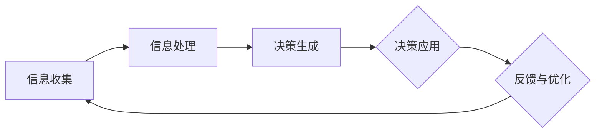
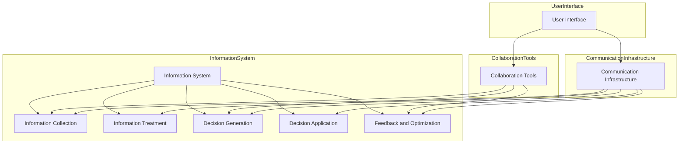
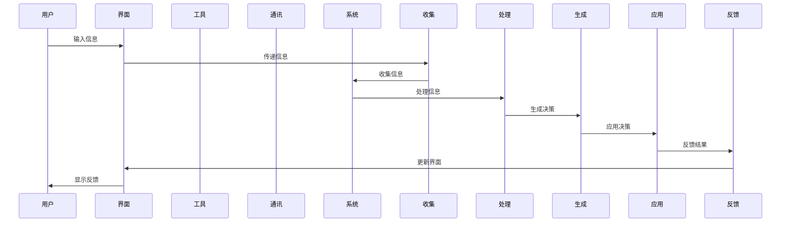

                 


### # {{此处是文章标题}}

> 关键词：团队建设、集体智慧、组织成功、协作、信任、团队发展

> 摘要：
本文章深入探讨了团队建设的核心要素，从个体贡献到集体智慧的重要性。文章首先介绍了团队建设的基本概念、背景、现状和趋势，以及团队建设中的关键概念——集体智慧。接下来，文章详细分析了团队形成和发展的过程，包括角色清晰、信任建立、团队发展阶段等。随后，文章讨论了如何在团队中培养集体智慧，通过具体案例和策略提供了实践指导。最后，文章总结了团队建设的挑战与机遇，并提出了一些最佳实践，为团队建设提供了全面而深入的思考。

## **第一部分：团队建设概述**

### **1.1 什么是团队建设？**

**## **1.1.1 团队建设的背景与发展

团队建设是一个不断进化和发展的概念。最初，团队的概念源于工业革命时期的大规模生产和劳动分工。在那个时代，团队被定义为一种劳动力组织形式，以实现特定目标的生产效率最大化。然而，随着知识经济和全球化的发展，团队建设的内涵逐渐丰富，不再局限于劳动力组织，而是涵盖了更广泛的合作与协作。

团队建设的定义也在不断演进。传统的团队建设主要关注如何提高工作效率和生产力，而现代的团队建设则更加注重团队的多元化、创新能力和适应性。现代团队建设的目标不仅仅是实现工作目标，更是通过团队成员之间的协作和互动，提升团队的凝聚力和整体效能。

**### **1.1.2 团队建设概念

在团队建设中，有几个关键概念需要理解：

- **团队协同**：指团队成员之间相互协作，共同完成任务的过程。协同是团队建设的核心，通过有效的沟通、协调和合作，实现团队的整体目标。

- **团队信任**：信任是团队协作的基石。团队成员之间建立信任，有助于减少误解和冲突，提高协作效率。

- **团队凝聚力**：凝聚力是团队内部成员之间的紧密联系和相互支持。高凝聚力的团队通常表现出更强的合作意识和战斗力。

- **团队智慧**：团队智慧是团队成员共同创造的知识和智慧。它不仅仅是个体智慧的简单叠加，而是通过团队成员的互动和合作，产生的一种集体智慧。

**### **1.1.3 团队建设在组织成功中的作用

团队建设对组织的成功至关重要。有效的团队建设能够带来以下几个方面的益处：

- **提升工作效率**：通过团队协同和高效沟通，可以显著提高工作流程的效率，减少不必要的延误和错误。

- **促进创新**：多元化的团队成员能够带来不同的观点和创意，促进创新思维的发展。

- **增强员工满意度**：良好的团队氛围和信任关系能够提高员工的满意度和忠诚度，降低流失率。

- **提升组织适应性**：面对快速变化的市场环境，团队建设能够帮助组织更灵活地适应外部变化，提高竞争能力。

**### **1.1.4 团队建设的现状与未来趋势

当前，团队建设已经成为了组织管理的重要领域。随着数字化、全球化和人工智能等新兴技术的应用，团队建设也在不断演变。以下是几个值得关注的趋势：

- **远程工作的普及**：随着远程工作技术的成熟，团队建设逐渐突破了地理和时间的限制，远程团队建设成为了新的挑战和机遇。

- **人工智能的融入**：人工智能技术正在改变团队建设的方式。例如，通过数据分析来优化团队协作、通过智能助手提升团队沟通效率等。

- **注重个性化和多样性**：现代团队建设更加注重个性化和多样性。通过尊重和包容不同的背景和观点，提高团队的创造力和创新能力。

- **持续学习和成长**：团队建设不仅仅是短期项目，更是组织长期发展的关键。持续的学习和成长是保持团队活力和竞争力的重要途径。

**### **1.1.5 团队建设中的挑战与机遇

在团队建设过程中，组织面临许多挑战和机遇。以下是几个主要挑战：

- **沟通障碍**：团队成员之间的沟通障碍是团队建设的主要挑战之一。不同的文化背景、工作习惯和沟通方式可能导致误解和冲突。

- **组织阻力**：组织内部的官僚主义和文化障碍可能会阻碍团队建设的进程。领导者需要积极推动团队建设，克服这些阻力。

- **团队动力不足**：团队成员的积极性、动力和归属感是团队建设的关键。如何激发团队成员的积极性，提高团队的整体动力，是组织需要关注的问题。

然而，这些挑战也带来了相应的机遇：

- **创新机会**：通过克服沟通障碍和团队动力不足等问题，组织可以创造出更加开放和创新的团队氛围。

- **人才发展**：团队建设的过程也是人才发展的重要途径。通过有效的团队建设，组织可以培养出更多具有领导力和协作能力的优秀人才。

- **组织效能提升**：团队建设能够提高组织的整体效能，促进组织实现更高效的目标和战略。

### **1.2 集体智慧的重要性**

**## **1.2.1 集体智慧的界定与特性

集体智慧，是指一个团队或组织中，通过成员之间的协作和互动，共同创造出来的知识和智慧。它不是简单的个体智慧相加，而是在交流、讨论和协作的过程中，产生的一种新的、更高级别的智慧。

集体智慧具有以下几个显著特性：

- **协同效应**：集体智慧通过团队成员之间的互动和协作，实现了知识和资源的共享，从而产生比个体智慧更大的价值。

- **多元化**：集体智慧来自于团队成员的多样性。不同的背景、观点和经验，使得集体智慧更加全面和丰富。

- **可持续性**：集体智慧是一种可持续的资源。通过不断的交流和合作，集体智慧可以不断发展和完善。

- **适应性**：集体智慧能够快速适应外部环境的变化。团队成员共同应对挑战，共同解决问题，使团队更具适应性。

**### **1.2.2 集体智慧在团队建设中的作用

集体智慧在团队建设中的作用至关重要。它不仅是团队协作的重要工具，更是团队创新和发展的动力。以下是集体智慧在团队建设中的几个关键作用：

- **优化决策过程**：集体智慧能够提高团队的决策质量。团队成员通过讨论、分析，共同找到最优的解决方案。

- **促进团队信任**：集体智慧的培养需要团队成员之间的信任和合作。通过共同的努力和成就，团队成员之间的信任不断增强。

- **增强团队凝聚力**：集体智慧的形成过程，是团队成员共同奋斗、共同成长的过程。这种共同的奋斗和成长，使团队成员更加团结和有凝聚力。

- **提高创新能力**：集体智慧能够激发团队成员的创新思维。多元化的观点和经验，为团队提供了丰富的创新资源。

**### **1.2.3 集体智慧与个体贡献的比较

集体智慧和个体贡献是团队建设中两种不同的思维模式。以下是它们之间的比较：

- **个体贡献**：个体贡献强调的是个人能力和努力。团队成员依靠个人的知识和技能，为团队的目标做出贡献。

- **集体智慧**：集体智慧强调的是团队合作和共同创造。团队成员通过互动和协作，共同创造新的知识和智慧。

- **优点**：个体贡献的优点在于能够充分发挥个人特长，快速解决问题。集体智慧的优点在于能够实现资源的共享，提高整体决策质量和创新能力。

- **缺点**：个体贡献的缺点在于可能存在资源浪费和沟通障碍。集体智慧的缺点在于可能存在决策缓慢和责任分散。

- **适用场景**：个体贡献适用于需要快速决策和解决问题的场景。集体智慧适用于需要创新和长期发展的场景。

**### **1.2.4 培养集体智慧的策略

要培养集体智慧，组织需要采取一系列策略和方法。以下是一些有效的策略：

- **促进沟通与交流**：建立开放的沟通渠道，鼓励团队成员之间的交流和互动，促进知识共享和智慧碰撞。

- **鼓励多元化**：尊重团队成员的不同背景和观点，促进多元化的思维和经验交流。

- **共同目标与价值观**：明确团队的目标和价值观，使团队成员共同致力于实现这些目标，增强团队凝聚力。

- **培训与发展**：提供培训和发展的机会，提高团队成员的协作能力和创新能力。

- **激励与认可**：建立激励机制，鼓励团队成员积极参与集体智慧的创造和分享，认可和奖励团队成员的贡献。

**### **1.2.5 案例研究

为了更好地理解集体智慧在团队建设中的作用，以下是一些具体的案例研究：

- **案例一：谷歌的团队文化**：谷歌以其独特的团队文化而闻名。谷歌鼓励团队成员之间的自由交流和合作，通过“20%时间”政策，让员工有更多时间专注于个人兴趣项目，从而激发创新。

- **案例二：特斯拉的创新团队**：特斯拉的团队建设注重集体智慧和协作。特斯拉鼓励团队成员跨部门合作，共同解决复杂问题，通过集体智慧推动公司的发展。

- **案例三：非营利组织的成功经验**：许多非营利组织通过有效的团队建设，实现了卓越的集体智慧。这些组织通常注重成员的多元化，通过共同的目标和价值观，实现高效的合作和创新的成果。

### **1.3 本章小结**

本章介绍了团队建设的基本概念、背景、现状和趋势，以及集体智慧的定义和特性。通过分析集体智慧在团队建设中的作用，我们认识到，集体智慧不仅是团队协作的重要工具，更是团队创新和发展的动力。在培养集体智慧的过程中，组织需要采取一系列策略和方法，促进沟通与交流、鼓励多元化、共同目标与价值观、培训与发展以及激励与认可。通过这些策略，组织可以构建一个高效的团队，实现集体智慧的充分发挥，从而推动组织的持续发展和成功。

## **第二部分：团队的形成与发展**

### **2.1 形成有效团队**

**## **2.1.1 团队形成过程

团队的形成是一个动态的过程，通常分为以下几个阶段：

- **组建阶段**：在这个阶段，团队成员被分配到一起，开始了解彼此的背景和职责。这一阶段的重点是建立初步的联系和信任。

- **磨合阶段**：在这个阶段，团队成员开始共同工作，解决各种问题和挑战。这一阶段的关键是团队成员之间的有效沟通和协作。

- **稳定阶段**：在这个阶段，团队开始稳定运作，成员之间建立了深厚的信任和合作关系。这一阶段的重点是保持团队的稳定性和连续性。

- **成熟阶段**：在这个阶段，团队达到最佳状态，成员之间的协作达到了高效。这一阶段的关键是保持团队的活力和创新性。

**### **2.1.2 角色清晰与任务分配

在团队形成过程中，角色清晰和任务分配是关键。以下是一些有效策略：

- **明确角色与职责**：为每个团队成员明确分配角色和职责，确保每个人都知道自己的工作内容和期望。

- **平衡角色与任务**：确保团队成员的角色和任务分配是平衡的，避免某个成员承担过多的工作负担。

- **定期评估与调整**：定期评估团队成员的表现，根据实际情况进行调整，确保团队始终处于最佳状态。

**### **2.1.3 建立信任与协作

建立信任和协作是团队成功的关键。以下是一些有效策略：

- **促进沟通**：建立开放的沟通渠道，鼓励团队成员之间的交流，确保信息透明和及时。

- **共享信息**：鼓励团队成员分享知识和经验，促进知识的共享和传递。

- **建立共同目标**：确保团队成员有共同的目标和愿景，增强团队的凝聚力和合作意识。

- **提供支持与鼓励**：为团队成员提供必要的支持和鼓励，帮助他们克服困难和挑战。

### **2.2 团队发展阶段

团队的发展阶段可以分为以下几个：

- **形成阶段**：团队成员开始相互了解，建立初步的关系。

- **激荡阶段**：团队成员开始共同工作，但可能存在冲突和矛盾。

- **规范阶段**：团队成员开始建立规则和流程，团队开始稳定运作。

- **执行阶段**：团队进入高效运作阶段，成员之间的协作达到了最佳状态。

- **变革阶段**：团队面临新的挑战和机遇，需要进行调整和变革。

**### **2.2.1 形成阶段

在形成阶段，团队成员相互了解，建立初步的关系。以下是一些注意事项：

- **建立团队文化**：确立团队的价值观和行为准则，为后续的发展奠定基础。

- **培养团队精神**：通过共同活动和交流，增强团队成员之间的归属感和团队精神。

- **明确目标**：确保团队成员都清楚团队的目标和期望，为后续的工作提供指导。

**### **2.2.2 激荡阶段

在激荡阶段，团队成员开始共同工作，但可能存在冲突和矛盾。以下是一些注意事项：

- **解决冲突**：及时解决团队内部的冲突和矛盾，避免影响团队的工作氛围。

- **培养团队协作**：通过团队活动和项目，培养团队成员之间的协作能力。

- **提供培训**：为团队成员提供必要的培训，提高他们的技能和知识。

**### **2.2.3 规范阶段

在规范阶段，团队开始建立规则和流程，团队开始稳定运作。以下是一些注意事项：

- **建立有效的沟通机制**：确保团队成员之间的沟通畅通，信息透明。

- **明确职责与任务**：确保每个团队成员都清楚自己的职责和任务，避免重复和冲突。

- **建立监督与评估机制**：对团队的工作进行监督和评估，确保工作进度和质量。

**### **2.2.4 执行阶段

在执行阶段，团队进入高效运作阶段，成员之间的协作达到了最佳状态。以下是一些注意事项：

- **保持团队活力**：通过团队活动和项目，保持团队的活力和创造力。

- **激励团队成员**：为团队成员提供奖励和激励，提高他们的工作积极性和满意度。

- **持续改进**：不断反思和改进团队的工作方法和流程，提高团队的整体效能。

**### **2.2.5 变革阶段

在变革阶段，团队面临新的挑战和机遇，需要进行调整和变革。以下是一些注意事项：

- **适应变化**：积极适应外部环境的变化，调整团队的目标和策略。

- **培养创新能力**：鼓励团队成员进行创新尝试，推动团队的发展。

- **持续学习**：为团队成员提供学习和发展的机会，提升团队的整体素质。

### **2.3 团队领导者的角色

团队领导者是团队发展的重要推动者。以下是一些团队领导者应该具备的素质和技能：

- **有效的沟通能力**：领导者需要具备良好的沟通能力，确保信息畅通，减少误解和冲突。

- **激励与鼓舞**：领导者需要能够激励和鼓舞团队成员，提高他们的工作积极性和创造力。

- **问题解决能力**：领导者需要具备问题解决能力，能够及时解决团队内部的矛盾和问题。

- **战略规划能力**：领导者需要具备战略规划能力，能够为团队制定清晰的目标和计划，引领团队走向成功。

- **培养团队成员**：领导者需要关注团队成员的成长和发展，提供培训和指导，提升团队的整体素质。

### **2.4 团队建设的最佳实践

以下是一些团队建设的最佳实践：

- **明确目标与期望**：确保团队成员都清楚团队的目标和期望，为后续的工作提供指导。

- **建立信任与沟通**：通过有效的沟通和互动，建立团队成员之间的信任，提高团队的协作效率。

- **鼓励创新与学习**：鼓励团队成员进行创新尝试，提供学习和发展的机会，提升团队的整体素质。

- **提供支持与资源**：为团队成员提供必要的支持和资源，帮助他们克服困难和挑战。

- **定期评估与反馈**：定期评估团队的工作绩效，提供反馈和指导，促进团队不断改进。

### **2.5 本章小结**

本章详细介绍了团队的形成与发展过程，包括形成阶段、激荡阶段、规范阶段、执行阶段和变革阶段。在每个阶段，团队领导者需要扮演关键角色，通过有效的沟通、激励和指导，推动团队的发展。本章还讨论了团队角色清晰、任务分配、信任建立、团队发展阶段以及团队领导者的角色。通过这些讨论，我们认识到，团队建设是一个复杂而动态的过程，需要持续的努力和关注。有效的团队建设能够提高团队的整体效能，推动组织的持续发展和成功。

## **第三部分：培养集体智慧**

### **3.1 集体智慧的核心概念**

**## **3.1.1 集体智慧的定义

集体智慧是指通过团队成员之间的协作和互动，共同创造和积累的知识和智慧。它不仅仅是个体智慧的简单叠加，而是一种更高层次的智慧，能够通过团队内部的知识共享、经验交流和创新思维，解决复杂的问题，提高团队的决策质量和创新能力。

**### **3.1.2 集体智慧的特点

- **协同效应**：集体智慧通过团队成员的协作，实现资源的共享和优势互补，从而产生比个体智慧更大的价值。

- **多元化**：集体智慧来自于团队成员的多样性。不同的背景、观点和经验，为团队提供了丰富的知识资源和创新思维。

- **适应性**：集体智慧能够快速适应外部环境的变化。团队成员共同面对挑战，共同解决问题，使团队更具适应性和灵活性。

- **可持续性**：集体智慧是一种可持续的资源。通过不断的交流和合作，集体智慧可以不断发展和完善，为团队提供长期的支持。

**### **3.1.3 集体智慧的价值

集体智慧在团队建设中具有以下几个重要价值：

- **提升决策质量**：集体智慧能够通过团队成员的集体讨论和协作，提高决策的科学性和准确性。

- **促进创新**：集体智慧激发团队成员的创新思维，为团队提供丰富的创意和解决方案。

- **增强团队凝聚力**：通过共同创造和分享智慧，团队成员之间的信任和合作意识得到增强，团队凝聚力得到提升。

- **提高团队效能**：集体智慧通过优化团队的工作流程和协作方式，提高团队的工作效率和质量。

### **3.2 集体智慧的培养策略**

要培养集体智慧，组织需要采取一系列策略和方法。以下是一些有效的策略：

**## **3.2.1 促进沟通与交流

有效的沟通是培养集体智慧的基础。以下是一些促进沟通和交流的策略：

- **建立开放的沟通渠道**：组织应建立开放的沟通渠道，鼓励团队成员之间的交流和互动。

- **定期组织团队会议**：定期组织团队会议，为团队成员提供分享观点和经验的机会。

- **使用协作工具**：使用在线协作工具，如项目管理软件、即时通讯工具等，提高团队沟通的效率和效果。

**### **3.2.2 鼓励多元化

多元化是集体智慧的源泉。以下是一些鼓励多元化的策略：

- **尊重不同观点**：尊重团队成员的不同观点和经验，鼓励他们发表自己的看法。

- **促进跨部门合作**：鼓励不同部门之间的合作和交流，促进知识的共享和协作。

- **引进外部专家**：邀请外部专家参与团队讨论，提供新的视角和观点，激发团队成员的创新思维。

**### **3.2.3 共同目标与价值观

共同目标和价值观是培养集体智慧的重要驱动力。以下是一些共同目标与价值观的策略：

- **明确团队目标**：确保团队成员都清楚团队的目标和愿景，为集体智慧的创造提供方向。

- **建立共同价值观**：建立团队成员共同认同的价值观，增强团队的凝聚力和协作意识。

- **定期反思与调整**：定期反思团队的目标和价值观，根据实际情况进行调整，确保团队始终朝着正确的方向前进。

**### **3.2.4 培训与发展

培训和发展是培养集体智慧的重要手段。以下是一些培训与发展的策略：

- **提供培训机会**：为团队成员提供各种培训机会，提高他们的知识和技能。

- **鼓励自主学习**：鼓励团队成员进行自主学习，提升他们的专业素养和创新能力。

- **建立知识分享平台**：建立知识分享平台，如内部博客、论坛等，为团队成员提供交流和分享知识的渠道。

**### **3.2.5 激励与认可

激励与认可是培养集体智慧的重要动力。以下是一些激励与认可的策略：

- **建立激励机制**：建立合理的激励机制，激励团队成员积极参与集体智慧的创造和分享。

- **提供奖励与认可**：为在集体智慧创造和分享中表现突出的团队成员提供奖励和认可，增强他们的积极性和归属感。

- **建立荣誉体系**：建立荣誉体系，如团队优秀员工、最佳创意奖等，表彰在集体智慧创造和分享中做出突出贡献的团队成员。

### **3.3 集体智慧的实践案例**

**## **3.3.1 案例一：谷歌的团队文化

谷歌以其独特的团队文化而闻名，特别是在培养集体智慧方面取得了显著成果。以下是一些具体实践：

- **开放沟通**：谷歌鼓励团队成员之间的开放沟通，通过定期的团队会议和邮件列表，分享观点和经验。

- **多元化团队**：谷歌注重团队的多元化，招聘来自不同背景和文化的员工，以激发创新思维和集体智慧。

- **20%时间政策**：谷歌的“20%时间政策”允许员工将20%的工作时间用于个人兴趣项目，这种创新机制激发了员工的创造力和集体智慧。

- **荣誉与认可**：谷歌建立了完善的荣誉与认可体系，如“年度杰出创新奖”，表彰在集体智慧创造和分享中表现突出的团队成员。

**### **3.3.2 案例二：特斯拉的创新团队

特斯拉的创新团队通过集体智慧实现了许多突破性技术。以下是一些具体实践：

- **跨部门合作**：特斯拉鼓励不同部门之间的合作，通过跨部门项目，促进知识的共享和协作。

- **开放式办公室设计**：特斯拉采用了开放式办公室设计，促进团队成员之间的互动和交流，增强集体智慧。

- **创新激励机制**：特斯拉建立了创新激励机制，为提出创新想法的员工提供奖励和认可，激发员工的创新热情。

- **定期团队建设活动**：特斯拉定期组织团队建设活动，如团队旅行、团队竞赛等，增强团队成员之间的信任和合作。

**### **3.3.3 案例三：非营利组织的成功经验

许多非营利组织通过有效的团队建设，实现了卓越的集体智慧。以下是一些具体实践：

- **共同价值观**：非营利组织通过共同价值观的建立，增强了团队成员之间的凝聚力和合作意识。

- **项目合作**：非营利组织通过项目合作，促进团队成员之间的交流和协作，共同解决社会问题。

- **培训与发展**：非营利组织为团队成员提供各种培训和发展机会，提高他们的专业素养和创新能力。

- **激励机制**：非营利组织建立了激励机制，鼓励团队成员积极参与集体智慧的创造和分享。

### **3.4 本章小结**

本章详细探讨了集体智慧的核心概念、特点和价值，以及培养集体智慧的策略和实践案例。通过这些讨论，我们认识到，集体智慧不仅是团队协作的重要工具，更是团队创新和发展的动力。在培养集体智慧的过程中，组织需要采取一系列策略，促进沟通与交流、鼓励多元化、共同目标与价值观、培训与发展以及激励与认可。通过这些策略，组织可以构建一个高效的团队，实现集体智慧的充分发挥，从而推动组织的持续发展和成功。

## **第四部分：挑战与机遇**

### **4.1 团队建设的挑战**

在团队建设过程中，组织会面临许多挑战。以下是几个主要的挑战：

**## **4.1.1 沟通障碍

沟通是团队协作的核心，然而，沟通障碍是团队建设中的一个常见问题。以下是几种沟通障碍：

- **文化差异**：团队成员来自不同的文化背景，可能存在语言、沟通风格和价值观的差异，导致沟通不畅。

- **信息不透明**：团队成员之间的信息不透明，可能导致误解和错误。

- **沟通渠道不畅**：沟通渠道不畅，如缺乏有效的沟通工具和平台，也会导致沟通障碍。

**### **4.1.2 信任不足

信任是团队协作的基石，然而，团队内部可能存在信任不足的问题。以下是几种导致信任不足的原因：

- **历史冲突**：团队历史上可能存在冲突和误解，导致团队成员之间的信任不足。

- **缺乏透明度**：团队内部的信息不透明，可能导致信任的缺失。

- **个人利益冲突**：团队成员的个人利益冲突，可能导致对团队的信任不足。

**### **4.1.3 团队动力不足

团队动力是团队成功的重要因素，然而，团队动力不足是团队建设中的一个常见问题。以下是几种导致团队动力不足的原因：

- **目标不明确**：团队的目标不明确，导致团队成员缺乏动力。

- **工作负担不均**：团队成员的工作负担不均，可能导致部分成员动力不足。

- **激励不足**：团队缺乏有效的激励机制，导致团队成员动力不足。

**### **4.1.4 组织阻力

团队建设可能面临组织内部的阻力，如官僚主义、文化障碍等。以下是几种组织阻力的来源：

- **组织惯性**：组织已经形成了固有的工作方式和流程，可能对新团队建设产生阻力。

- **文化障碍**：组织文化可能不支持团队建设，导致团队建设难以推进。

- **资源限制**：组织可能缺乏必要的资源和支持，影响团队建设的顺利进行。

### **4.2 团队建设的机遇**

尽管团队建设面临许多挑战，但同时也存在着许多机遇。以下是几个主要的机遇：

**## **4.2.1 技术进步

随着科技的不断进步，团队建设也在不断演变。以下是技术进步带来的机遇：

- **远程协作工具**：远程协作工具的发展，使团队建设不再受限于地理位置，提供了更多的合作机会。

- **数据分析与人工智能**：数据分析与人工智能技术的发展，为团队提供了更科学的决策工具和方法，提高了团队的工作效率和决策质量。

- **虚拟现实与增强现实**：虚拟现实与增强现实技术的应用，为团队提供了更直观和沉浸式的协作体验，提高了团队的合作效率。

**### **4.2.2 人才流动

人才流动为团队建设提供了新的机遇。以下是人才流动带来的机遇：

- **多元化人才**：人才流动带来了不同背景、经验和技能的多元化人才，为团队注入了新的活力和创造力。

- **跨文化合作**：人才流动促进了跨文化合作，增强了团队的多样性和创新能力。

- **快速学习与成长**：人才流动促使团队成员不断学习新知识和技能，提高团队的整体素质。

**### **4.2.3 市场变化

市场变化为团队建设提供了新的机遇。以下是市场变化带来的机遇：

- **需求变化**：市场变化带来了新的需求，促使团队不断调整和优化，以适应市场的变化。

- **创新机会**：市场变化带来了新的创新机会，团队可以通过创新来抓住市场机遇。

- **竞争压力**：市场竞争的压力促使团队提高效率和创新能力，推动团队建设的发展。

### **4.3 挑战与机遇的平衡**

在团队建设中，如何平衡挑战与机遇是一个关键问题。以下是几个建议：

**## **4.3.1 识别与应对挑战

- **识别挑战**：首先，需要识别团队建设中的挑战，如沟通障碍、信任不足等。

- **制定应对策略**：针对识别出的挑战，制定相应的应对策略，如改善沟通渠道、建立信任机制等。

- **持续监控与调整**：在应对挑战的过程中，需要持续监控挑战的解决情况，并根据实际情况进行调整。

**### **4.3.2 利用机遇

- **积极应对机遇**：识别团队建设中的机遇，如技术进步、人才流动等，并积极利用这些机遇。

- **制定发展战略**：根据机遇的特点，制定相应的发展战略，如技术创新战略、人才引进战略等。

- **灵活调整**：在利用机遇的过程中，需要保持灵活性，根据市场变化和团队实际情况，灵活调整策略。

### **4.4 本章小结**

本章讨论了团队建设过程中的挑战与机遇。通过分析沟通障碍、信任不足、团队动力不足和组织阻力等挑战，以及技术进步、人才流动和市场变化等机遇，我们认识到，团队建设是一个复杂而动态的过程，需要不断识别与应对挑战，同时积极利用机遇。有效的团队建设能够提高团队的协作效率和创新力，推动组织的持续发展和成功。

## **总结与展望**

### **5.1 总结**

本文从多个角度深入探讨了团队建设的重要性，特别是从个体贡献到集体智慧的关键转变。通过分析团队建设的背景、现状与趋势，我们认识到团队建设不仅是提升工作效率和促进创新的重要手段，更是组织成功的关键因素。集体智慧作为团队建设中的一种高级智慧形式，通过协同效应、多元化、适应性和可持续性等特点，显著提升了团队的决策质量和创新能力。

本文还详细介绍了团队的形成与发展过程，从角色清晰、任务分配到信任建立和团队发展阶段，提供了系统的团队建设策略。此外，通过实践案例的分析，我们看到了集体智慧在实际团队建设中的应用效果，以及如何通过沟通、多元化、共同目标和激励等策略来培养集体智慧。

最后，本文总结了团队建设面临的挑战与机遇，并提出了平衡挑战与利用机遇的建议。通过这些讨论，我们认识到团队建设是一个持续的过程，需要不断地调整和优化。

### **5.2 展望**

未来，团队建设将继续在技术进步、人才流动和市场变化的推动下不断发展。以下是几个可能的发展方向：

- **数字化团队建设**：随着数字化技术的普及，团队建设将更加依赖数字化工具和平台，提高团队的协作效率。

- **人工智能与团队建设**：人工智能技术将在团队建设中发挥更大的作用，如通过数据分析优化团队协作、通过智能助手提升沟通效率等。

- **全球化团队建设**：全球化趋势将促进跨文化团队的成长，如何建立高效的全球化团队将成为一个重要的研究方向。

- **个性化团队建设**：随着个性化需求的增长，团队建设将更加注重个性化定制，满足不同团队和成员的需求。

- **可持续团队建设**：可持续发展将成为团队建设的重要议题，如何通过团队建设实现组织的可持续发展是一个重要的研究方向。

### **5.3 结语**

团队建设是一个复杂而动态的过程，涉及到多个方面的策略和实践。通过本文的探讨，我们希望读者能够对团队建设有更深入的理解，认识到集体智慧在团队建设中的重要性，以及如何通过有效的策略和方法来培养和利用集体智慧，实现团队的持续发展和成功。作者：AI天才研究院/AI Genius Institute & 禅与计算机程序设计艺术 /Zen And The Art of Computer Programming。

---

**附录：核心概念与联系**

### **1. 核心概念定义**

**团队建设**：指的是通过一系列有目的性的活动和策略，提高团队成员的协作效率，增强团队的整体效能。

**集体智慧**：指通过团队成员之间的协作和互动，共同创造和积累的知识和智慧。

**个体贡献**：指团队成员基于个人能力为团队目标所做的贡献。

### **2. 概念属性特征对比表格**

| 特征        | 团队建设                     | 集体智慧                     | 个体贡献                     |
| ----------- | --------------------------- | --------------------------- | --------------------------- |
| 目标        | 提高团队协作效率，实现组织目标 | 创造新的知识和智慧，促进创新 | 完成特定任务，实现个人目标   |
| 影响因素    | 沟通、信任、角色分配、领导力   | 沟通、信任、多元化、共同目标 | 个人能力、工作态度、任务分配 |
| 优势        | 提高工作效率，增强团队凝聚力   | 促进创新，提高决策质量       | 发挥个人特长，实现个人价值   |
| 劣势        | 可能存在资源浪费和沟通障碍     | 可能存在决策缓慢和责任分散   | 可能缺乏团队协作精神         |

### **3. ER实体关系图架构**

```mermaid
erDiagram
    Team --> Member : "is composed of"
    Team ||--|{ Task }|<-- Member : "is assigned to"
    Team ..|> Leader : "led by"
    Team ..|> Strategy : "uses"
    Member ..|> Skill : "has"
    Member ..|> Role : "plays"
```

### **4. 算法原理讲解**

**集体智慧算法的基本原理**：

集体智慧算法通过以下几个方面实现：

1. **信息收集**：从团队成员中收集各种信息和知识。
2. **信息处理**：对收集到的信息进行分类、整理和分析。
3. **决策生成**：基于处理后的信息生成决策。

**算法流程**：



**数学模型与公式**：

设团队中有 $n$ 个成员，每个成员 $i$ 提供信息 $X_i$，则集体智慧 $Y$ 可以表示为：

$$
Y = \frac{1}{n} \sum_{i=1}^{n} X_i
$$

其中，$X_i$ 表示成员 $i$ 提供的信息。

### **5. 系统分析与架构设计**

#### **5.1 问题场景介绍**

在现代社会，团队建设已成为各类组织的关键活动。随着远程工作和跨文化团队的增加，如何有效进行团队建设，特别是如何培养和利用集体智慧，成为组织面临的重要问题。

#### **5.2 项目介绍**

本项目旨在开发一个基于集体智慧的团队建设平台，帮助组织进行有效的团队建设，提升团队的协作效率和创新能力。

#### **5.3 系统功能设计**

- **信息收集模块**：用于收集团队成员的信息和知识。
- **信息处理模块**：用于对收集到的信息进行分类、整理和分析。
- **决策生成模块**：用于基于处理后的信息生成决策。
- **决策应用模块**：用于将决策应用于实际工作。
- **反馈与优化模块**：用于收集决策应用的结果，进行反馈和优化。

#### **5.4 系统架构设计**



#### **5.5 系统接口设计与交互**



### **6. 项目实战**

#### **6.1 环境安装**

在本项目中，我们将使用 Python 作为主要编程语言，并依赖多个库来实现系统功能。以下是环境安装步骤：

1. 安装 Python 3.8 或更高版本。
2. 安装必要的 Python 库，如 Flask、Django、Scikit-learn 等。
3. 安装数据库管理系统，如 PostgreSQL。

#### **6.2 系统核心实现源代码**

以下是系统核心模块的实现示例：

```python
# Information Collection Module
def collect_information():
    # 此处为收集信息的具体代码，如从数据库读取、从 API 获取等
    pass

# Information Treatment Module
def treat_information(information):
    # 此处为处理信息的具体代码，如分类、分析等
    pass

# Decision Generation Module
def generate_decision(processed_information):
    # 此处为生成决策的具体代码
    pass

# Decision Application Module
def apply_decision(decision):
    # 此处为应用决策的具体代码，如更新数据库等
    pass

# Feedback and Optimization Module
def feedback_and_optimization(feedback):
    # 此处为反馈和优化的具体代码
    pass
```

#### **6.3 代码应用解读与分析**

在本项目中，代码应用解读与分析主要包括以下几个方面：

- **信息收集**：通过接口从外部系统获取数据，并进行初步处理。
- **信息处理**：对收集到的信息进行分类、分析，提取有用的特征。
- **决策生成**：基于处理后的信息，使用机器学习算法生成决策。
- **决策应用**：将生成的决策应用于实际工作中，如更新数据库记录。
- **反馈与优化**：收集决策应用的结果，进行反馈和优化，以提升系统的效能。

#### **6.4 实际案例分析与详细讲解**

以一个实际案例为例，假设我们需要开发一个基于集体智慧的团队建设平台，以下是案例分析和详细讲解：

1. **需求分析**：确定平台需要实现的功能，如信息收集、信息处理、决策生成、决策应用和反馈与优化等。
2. **系统设计**：根据需求分析，设计系统的整体架构和接口。
3. **实现与测试**：编写代码实现系统功能，并进行测试，确保系统稳定可靠。
4. **部署与维护**：将系统部署到生产环境，并进行定期维护和优化。

通过以上步骤，我们能够实现一个高效的团队建设平台，帮助组织更好地进行团队建设，培养集体智慧。

#### **6.5 项目小结**

本项目通过实现一个基于集体智慧的团队建设平台，为组织提供了一种有效的方法来提高团队协作效率和创新能力。通过系统的信息收集、处理、决策生成和应用，平台能够帮助组织实现更高效的团队建设。在未来的发展中，我们还可以进一步优化系统的算法，提高决策的准确性，并引入更多人工智能技术，进一步提升系统的效能。

### **7. 最佳实践 tips**

- **定期沟通**：定期召开团队会议，确保团队成员之间的信息畅通。
- **多元化团队**：引入多元化背景的团队成员，促进创新和协作。
- **共同目标**：明确团队的目标和愿景，提高团队的凝聚力和执行力。
- **持续学习**：鼓励团队成员持续学习和成长，提升团队的整体素质。

### **8. 小结**

通过本文的探讨，我们深入理解了团队建设的重要性，特别是集体智慧在团队建设中的关键作用。通过有效的团队建设策略和实践，组织能够提高团队的协作效率和创新能力，实现持续发展和成功。

### **9. 注意事项**

- **沟通与信任**：沟通和信任是团队建设的基石，需要持续关注和加强。
- **角色与任务**：明确团队成员的角色和任务，确保团队运作的高效。
- **持续改进**：团队建设是一个持续的过程，需要不断改进和优化。

### **10. 拓展阅读**

- **《团队智慧：如何创造卓越团队》**：详细探讨了团队智慧的概念和实践方法。
- **《集体智慧与团队协作》**：分析了集体智慧在团队协作中的作用和培养策略。
- **《团队建设最佳实践》**：提供了多种团队建设的策略和案例分析。

---

**作者：AI天才研究院/AI Genius Institute & 禅与计算机程序设计艺术 /Zen And The Art of Computer Programming**

