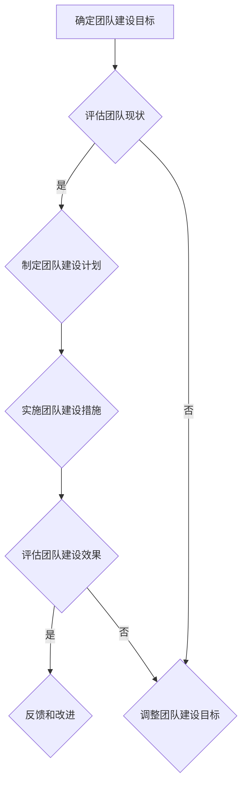
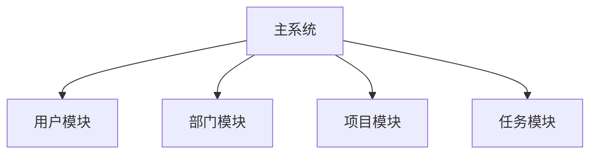
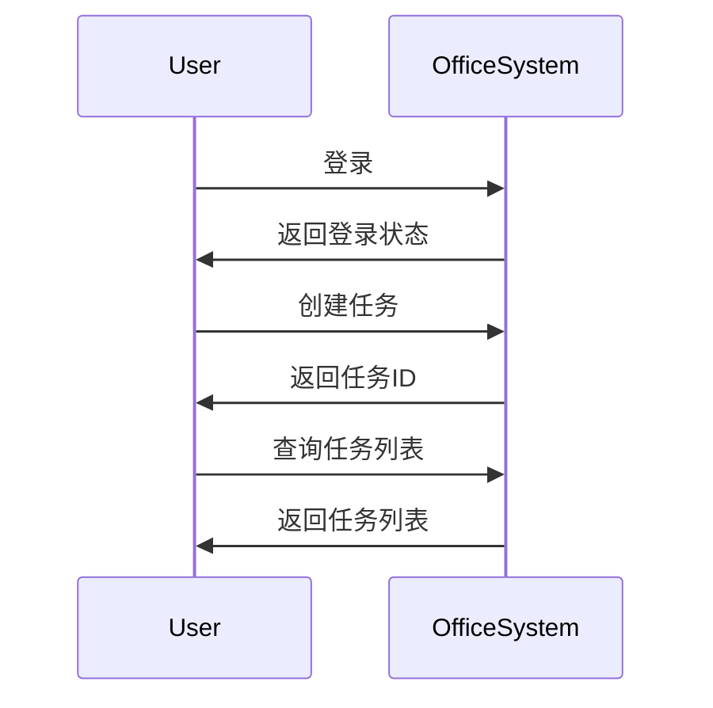
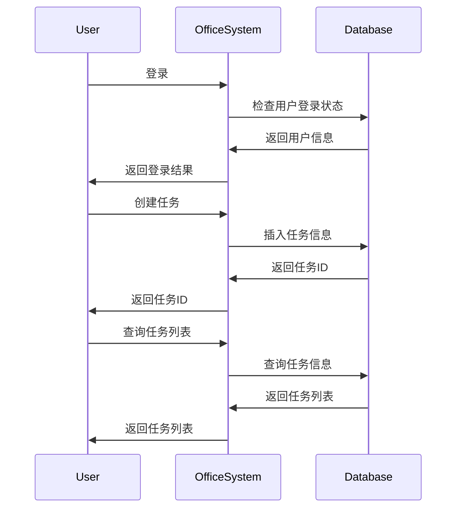

                 

# 团队建设：从分散个体到凝聚整体

> 关键词：团队建设、团队角色、团队领导力、团队协作、沟通技巧

> 摘要：本文旨在探讨团队建设的重要性及其实现策略。文章首先介绍了团队建设的基本概念和核心要素，接着分析了团队角色与责任，随后讨论了团队管理与沟通的关键点。在第三部分，文章提出了团队建设策略和实践方法，并通过实际案例进行了分析和总结。最后，文章对团队建设的未来趋势进行了展望，并总结了团队建设的重要成果和未来改进方向。

## 目录大纲

## 第一部分：团队建设的基本概念

### 第1章：团队建设的重要性与概述

#### 1.1 团队建设的重要性

#### 1.2 团队建设的基本概念

#### 1.3 团队建设的核心要素

### 第2章：团队角色与责任

#### 2.1 团队角色的定义

#### 2.2 团队角色的分类

#### 2.3 团队成员的责任

## 第二部分：团队管理与沟通

### 第3章：团队领导力

#### 3.1 领导力的定义与类型

#### 3.2 领导者的角色与职责

#### 3.3 提升领导力的方法

### 第4章：团队协作与沟通

#### 4.1 团队协作的重要性

#### 4.2 沟通障碍与解决方法

#### 4.3 有效沟通的技巧

## 第三部分：团队建设策略与实践

### 第5章：团队建设策略

#### 5.1 团队建设的目标与原则

#### 5.2 团队建设的方法与工具

#### 5.3 团队建设的阶段性目标

### 第6章：团队建设实践

#### 6.1 团队建设项目的规划

#### 6.2 团队建设过程中的挑战与应对

#### 6.3 团队建设的结果评估

### 第7章：案例分析

#### 7.1 案例一：某公司的团队建设实践

#### 7.2 案例二：某团队的变革与成长

#### 7.3 案例分析总结

### 第8章：团队建设趋势与未来展望

#### 8.1 团队建设的新趋势

#### 8.2 团队建设的未来展望

#### 8.3 团队建设中的注意事项

### 第9章：总结与展望

#### 9.1 团队建设的重要成果

#### 9.2 团队建设中的不足与改进

#### 9.3 未来团队建设的方向

------------------------------------------------------------------## 第一部分：团队建设的基本概念

### 第1章：团队建设的重要性与概述

#### 1.1 团队建设的重要性

在现代社会，无论是企业还是组织，团队建设都扮演着至关重要的角色。团队建设不仅仅是为了让团队成员更好地协作，更重要的是它能够提高组织的整体效率和竞争力。

**为什么团队建设如此重要？**

1. **提高效率：** 团队成员在相互协作的过程中，可以共享资源和信息，从而提高工作效率。
2. **增强创造力：** 团队成员之间的互动和合作能够激发创新思维，产生更多的创意和解决方案。
3. **提升组织文化：** 一个健康的团队文化能够增强员工的归属感和忠诚度，从而提高组织的凝聚力。
4. **增强竞争力：** 在快速变化的市场环境中，只有具备高效团队的企业才能迅速响应市场变化，保持竞争力。

#### 1.2 团队建设的基本概念

**团队：** 团队是由两个或两个以上的个体组成的，为实现共同目标而相互依赖、协作的群体。

**团队建设：** 团队建设是指通过一系列措施，使团队从分散的个体逐渐转变为一个高度协同、高效运作的整体的过程。

**团队建设的核心要素：**

1. **目标一致性：** 团队成员需要明确共同的目标，并且为了实现这个目标而努力。
2. **信任与尊重：** 团队成员之间需要建立信任和尊重，这是团队合作的基础。
3. **有效沟通：** 沟通是团队协作的桥梁，有效的沟通能够减少误解和冲突，提高团队的执行力。
4. **领导力：** 领导者需要具备清晰的愿景和有效的领导力，引导团队朝着共同目标前进。
5. **团队氛围：** 一个积极、健康的团队氛围能够激发团队成员的积极性，提高团队的凝聚力。

#### 1.3 团队建设的核心要素

**团队角色：** 团队中的每个成员都扮演着特定的角色，这些角色共同构成了团队的功能结构。

**团队成员的责任：** 每个团队成员都需要明确自己的责任和角色，并且为了实现团队目标而承担相应的责任。

**团队规范：** 团队规范是团队成员共同遵守的准则，它有助于维护团队的秩序和稳定。

**团队文化建设：** 团队文化是团队的灵魂，它影响着团队成员的行为和态度，对团队建设起着关键作用。

------------------------------------------------------------------## 第2章：团队角色与责任

### 2.1 团队角色的定义

在团队建设中，团队角色是至关重要的组成部分。团队角色是指团队成员在团队中所承担的特定职责和功能。明确团队角色有助于团队成员更好地理解自己的职责，发挥各自的优势，提高团队的整体效能。

**团队角色的定义：**

团队角色是指团队中每个成员在团队中的特定职责和功能，这些角色共同构成了团队的功能结构。团队角色不仅仅是指具体的职位，还包括团队成员在团队中的行为模式、思维方式和工作方式。

**团队角色的作用：**

1. **明确职责：** 团队角色能够帮助团队成员明确自己的职责和任务，避免职责重叠和冲突。
2. **提高效率：** 通过明确团队角色，团队成员可以专注于自己的工作，提高工作效率。
3. **促进协作：** 团队角色能够促进团队成员之间的协作，使得团队工作更加有序和高效。
4. **提高团队效能：** 明确的团队角色有助于提高团队的整体效能，实现团队目标。

### 2.2 团队角色的分类

团队角色可以根据不同的标准进行分类。以下是一些常见的团队角色分类：

#### 根据职责分类：

1. **领导者角色：** 领导者负责制定团队的目标和战略，指导团队工作，协调团队成员之间的合作。
2. **执行者角色：** 执行者负责执行团队的任务和计划，确保团队目标的实现。
3. **协调者角色：** 协调者负责协调团队成员之间的工作，解决工作中的冲突和问题。
4. **监督者角色：** 监督者负责监督团队的工作进度和质量，确保团队目标的顺利实现。
5. **支持者角色：** 支持者负责提供团队所需的支持和服务，如技术支持、资源管理等。

#### 根据个性特点分类：

1. **思维型角色：** 思维型角色擅长分析和解决问题，具有创新思维和逻辑思维能力。
2. **情感型角色：** 情感型角色擅长处理人际关系，能够理解和满足团队成员的情感需求。
3. **行动型角色：** 行动型角色擅长执行任务，具有高度的责任感和执行力。
4. **合作型角色：** 合作型角色擅长团队协作，能够促进团队成员之间的沟通和合作。

#### 根据工作内容分类：

1. **技术型角色：** 技术型角色主要负责团队的技术研发和实施工作。
2. **管理型角色：** 管理型角色主要负责团队的日常管理和协调工作。
3. **支持型角色：** 支持型角色主要负责团队的后勤保障和服务支持工作。

### 2.3 团队成员的责任

明确团队角色后，每个团队成员都需要明确自己的责任，并为了实现团队目标而努力。以下是一些团队成员的责任：

1. **明确自己的角色和职责：** 每个团队成员需要清楚自己的角色和职责，确保自己能够高效地完成工作任务。
2. **积极参与团队工作：** 成员需要积极参与团队讨论和决策，为团队的目标贡献自己的智慧和力量。
3. **主动承担责任：** 成员需要主动承担责任，不逃避困难和问题，勇于面对挑战。
4. **建立良好的沟通：** 成员需要与团队成员保持良好的沟通，及时分享信息，协调工作。
5. **支持团队目标：** 成员需要全力支持团队的目标，为了团队的利益而努力。

通过明确团队角色和责任，团队可以更好地发挥每个成员的优势，提高团队的整体效能，实现团队目标。

------------------------------------------------------------------## 第二部分：团队管理与沟通

### 第3章：团队领导力

#### 3.1 领导力的定义与类型

领导力是指领导者通过激励和影响团队成员，实现团队目标和价值的综合能力。有效的领导力能够激发团队成员的潜力，提高团队的凝聚力和工作效率。

**领导力的定义：**

领导力不仅仅是指领导者的个人能力，还包括领导者与团队成员之间的互动和影响。领导力是领导者通过激励、引导和影响团队成员，共同实现团队目标的能力。

**领导力的类型：**

1. **指挥型领导力：** 指挥型领导力强调领导者通过明确的指令和命令来指导团队成员，确保团队目标的实现。这种领导力适用于需要快速决策和执行的情境。
2. **变革型领导力：** 变革型领导力强调领导者通过激发团队成员的潜力和创造力，推动团队实现变革和创新。这种领导力适用于需要变革和创新的情境。
3. **参与型领导力：** 参与型领导力强调领导者与团队成员之间的互动和参与，共同制定决策和目标。这种领导力适用于需要团队合作和协作的情境。
4. **授权型领导力：** 授权型领导力强调领导者通过授权和信任，让团队成员自主决策和行动，发挥团队成员的潜力。这种领导力适用于需要高度自治和创新的情境。

#### 3.2 领导者的角色与职责

领导者是团队的核心，承担着重要的角色和职责。领导者不仅需要具备领导力，还需要明确自己的角色和职责，以有效地指导和管理团队。

**领导者的角色：**

1. **愿景设定者：** 领导者需要设定清晰的愿景和目标，为团队指明方向。
2. **激励者：** 领导者需要激励团队成员，激发他们的积极性和创造力。
3. **沟通者：** 领导者需要与团队成员保持良好的沟通，及时传达信息和指导。
4. **协调者：** 领导者需要协调团队成员之间的关系，解决冲突和问题。
5. **支持者：** 领导者需要支持团队成员，提供必要的资源和支持。

**领导者的职责：**

1. **设定目标：** 领导者需要明确团队的目标和期望，确保团队成员了解和认同。
2. **制定计划：** 领导者需要制定详细的计划，明确团队成员的任务和职责。
3. **分配资源：** 领导者需要合理分配资源，确保团队成员能够顺利完成工作任务。
4. **指导和支持：** 领导者需要提供指导和支持，帮助团队成员克服困难和挑战。
5. **监督和评估：** 领导者需要监督团队成员的工作进度和质量，进行定期评估和反馈。

#### 3.3 提升领导力的方法

提升领导力是一个持续的过程，需要领导者不断学习和实践。以下是一些提升领导力的方法：

1. **学习领导力理论：** 领导者可以通过学习领导力理论，了解不同类型的领导力，并选择适合自己的领导风格。
2. **实践领导力：** 领导者需要在实际工作中实践领导力，通过实践不断总结经验和教训。
3. **培养团队意识：** 领导者需要培养团队意识，关注团队成员的需求和反馈，建立良好的团队氛围。
4. **提高沟通能力：** 领导者需要提高沟通能力，学会有效表达自己的想法和意见，同时倾听和理解团队成员的观点。
5. **培养领导力团队：** 领导者可以通过培养领导力团队，激发团队成员的领导潜力，提高团队的整体领导力水平。

通过提升领导力，领导者可以更好地激励和引导团队成员，提高团队的工作效率和凝聚力，实现团队的目标。

------------------------------------------------------------------### 第4章：团队协作与沟通

#### 4.1 团队协作的重要性

团队协作是团队建设中至关重要的一环。有效的团队协作能够提高团队的工作效率，增强团队的凝聚力，实现团队的目标。以下是团队协作的重要性：

1. **提高工作效率：** 团队协作可以使团队成员共享资源和信息，减少重复工作，提高工作效率。
2. **增强团队凝聚力：** 团队协作可以增强团队成员之间的信任和默契，提高团队的凝聚力。
3. **激发创新思维：** 团队协作可以激发团队成员的创新思维，产生更多的创意和解决方案。
4. **实现共同目标：** 团队协作可以使团队成员共同为实现团队目标而努力，提高团队的整体效能。

#### 4.2 沟通障碍与解决方法

在团队协作过程中，沟通障碍是一个普遍存在的问题。有效的沟通是团队协作的关键，以下是常见的沟通障碍及其解决方法：

1. **语言障碍：** 语言障碍主要是指团队成员之间的语言差异，这可能会导致误解和沟通不畅。解决方法：
   - 使用简单清晰的语言，避免使用专业术语。
   - 提供翻译服务，确保所有团队成员都能理解对方的意思。
   - 鼓励团队成员学习对方的语言。

2. **文化差异：** 文化差异可能会导致团队成员在价值观、行为习惯等方面产生冲突。解决方法：
   - 增强文化意识，了解并尊重不同文化的差异。
   - 建立共同的文化价值观，促进团队成员之间的融合。
   - 定期组织文化交流活动，增进团队成员之间的了解。

3. **信息传递不畅：** 信息传递不畅可能会导致团队成员无法及时获取所需的信息，影响团队的工作效率。解决方法：
   - 建立高效的沟通渠道，如定期会议、即时通讯工具等。
   - 确保信息的准确性和完整性，避免误解和误传。
   - 定期检查和评估沟通效果，及时调整沟通策略。

4. **沟通方式不当：** 不恰当的沟通方式可能会导致沟通效果不佳，甚至产生冲突。解决方法：
   - 使用积极倾听技巧，关注对方的观点和需求。
   - 避免使用攻击性语言，尊重对方的意见和感受。
   - 学会表达自己的观点，同时倾听和理解对方的观点。

#### 4.3 有效沟通的技巧

为了实现有效的团队协作，团队成员需要掌握有效的沟通技巧。以下是几种常用的沟通技巧：

1. **积极倾听：** 积极倾听是有效沟通的基础，它要求团队成员在沟通中关注对方的信息，理解对方的观点和感受。积极倾听的技巧包括：
   - 全神贯注，避免分心。
   - 通过肢体语言和表情表达关注和理解。
   - 确认对方的观点和感受，避免误解和误传。

2. **清晰表达：** 清晰表达是有效沟通的关键，它要求团队成员在沟通中准确传达自己的信息和意图。清晰表达的技巧包括：
   - 使用简单明了的语言，避免使用复杂的术语。
   - 确保信息完整，避免遗漏关键信息。
   - 通过重复和确认，确保对方理解自己的观点。

3. **主动沟通：** 主动沟通是团队协作的保障，它要求团队成员在沟通中主动表达自己的想法和意见，积极反馈和回应。主动沟通的技巧包括：
   - 建立良好的沟通习惯，定期分享信息和进展。
   - 遇到问题和困难时，及时与团队成员沟通和协商。
   - 在团队中建立开放的沟通环境，鼓励成员之间的交流和合作。

通过掌握有效的沟通技巧，团队成员可以更好地理解对方，减少误解和冲突，提高团队协作的效果，实现团队的目标。

------------------------------------------------------------------## 第三部分：团队建设策略与实践

### 第5章：团队建设策略

#### 5.1 团队建设的目标与原则

团队建设的目标是打造一个高效、协作、有凝聚力的团队，以实现组织的目标。为了实现这一目标，团队建设需要遵循以下原则：

1. **明确目标：** 团队建设的目标应与组织的目标一致，确保团队的工作方向正确。
2. **尊重个体：** 尊重每个团队成员的个性和特长，激发他们的积极性和创造力。
3. **建立信任：** 建立团队成员之间的信任，是团队协作的基础。
4. **持续改进：** 团队建设是一个持续的过程，需要不断改进和完善。

#### 5.2 团队建设的方法与工具

团队建设的方法和工具有多种，以下是一些常用的方法和工具：

1. **团队建设活动：** 通过组织团队建设活动，如团队拓展训练、团队建设游戏等，增强团队成员之间的沟通和合作。
2. **团队会议：** 定期组织团队会议，讨论团队目标、工作进展、问题和解决方案等，提高团队的协作效果。
3. **团队反馈：** 建立团队反馈机制，鼓励团队成员提出意见和建议，改进团队的工作方式。
4. **团队文化建设：** 建立积极向上的团队文化，如团队合作、创新思维、共享精神等，促进团队的凝聚力。
5. **领导力培训：** 对团队成员进行领导力培训，提高他们的领导力和团队管理能力。

#### 5.3 团队建设的阶段性目标

团队建设是一个长期的过程，可以分为不同的阶段，每个阶段都有具体的目标和任务：

1. **初期阶段：** 建立团队的基本结构和组织，明确团队的目标和职责，培养团队成员的基本技能和团队意识。
2. **发展阶段：** 提高团队的协作能力和工作效率，建立良好的沟通机制，培养团队成员的领导能力和创新能力。
3. **成熟阶段：** 实现团队的稳定和高效运作，形成具有自身特色的团队文化，提高团队的整体效能。

通过设定阶段性目标，团队可以逐步实现团队建设的目标，提高团队的工作效率和凝聚力。

------------------------------------------------------------------### 第6章：团队建设实践

#### 6.1 团队建设项目的规划

团队建设项目的规划是团队建设成功的关键步骤。一个有效的团队建设项目需要明确的目标、详细的计划和合理的资源配置。以下是团队建设项目规划的关键步骤：

1. **确定目标：** 确定团队建设项目的目标，包括提高团队协作能力、增强团队凝聚力、提升工作效率等。
2. **评估现状：** 对团队的现状进行评估，包括团队成员的能力、沟通方式、工作流程等，找出团队存在的问题和改进空间。
3. **制定计划：** 根据目标评估结果，制定详细的团队建设计划，包括具体的方法、时间表和责任人。
4. **资源配置：** 根据计划，合理配置资源，包括人力、物力和财力，确保项目能够顺利实施。
5. **沟通协调：** 建立沟通机制，确保团队成员对项目目标和计划有清晰的了解，及时解决项目实施过程中的问题和困难。

#### 6.2 团队建设过程中的挑战与应对

在团队建设过程中，可能会遇到各种挑战，如团队成员之间的冲突、沟通障碍、目标不明确等。以下是团队建设过程中常见的挑战及应对策略：

1. **冲突管理：**
   - **原因分析：** 分析冲突的原因，是否是因为目标不明确、沟通不畅、资源分配不公等。
   - **调解和沟通：** 通过调解和沟通，让团队成员表达自己的观点和感受，找到解决问题的方法。
   - **建立共识：** 建立共同的目标和价值观，增强团队成员之间的信任和理解。

2. **沟通障碍：**
   - **提高沟通技巧：** 提升团队成员的沟通技巧，如积极倾听、清晰表达、主动沟通等。
   - **使用多种沟通工具：** 使用多种沟通工具，如会议、即时通讯、邮件等，确保信息传递的准确和及时。
   - **建立反馈机制：** 建立反馈机制，鼓励团队成员提出意见和建议，及时调整和改进沟通方式。

3. **目标不明确：**
   - **明确目标：** 与团队成员共同明确团队的目标，确保每个人都清楚自己的职责和期望。
   - **制定行动计划：** 制定具体的行动计划，将目标分解为可执行的任务，明确时间节点和责任人。
   - **定期回顾和调整：** 定期回顾和调整目标，确保团队始终朝着正确的方向前进。

通过有效的应对策略，团队可以克服建设过程中的挑战，提高团队的工作效率和凝聚力。

#### 6.3 团队建设的结果评估

团队建设的结果评估是团队建设过程中的重要环节，它可以帮助团队了解建设效果，发现问题和改进方向。以下是团队建设结果评估的关键步骤：

1. **设定评估标准：** 根据团队建设的目标，设定具体的评估标准，如团队协作能力、工作效率、员工满意度等。
2. **数据收集：** 收集团队建设过程中的相关数据，如团队成员的反馈、工作成果、沟通记录等。
3. **分析数据：** 对收集到的数据进行分析，评估团队建设的效果，找出存在的问题和改进方向。
4. **反馈和改进：** 将评估结果反馈给团队成员，鼓励他们提出改进意见和建议，制定下一步的改进计划。
5. **持续跟踪：** 持续跟踪团队建设的进展，确保改进措施得到有效实施，不断提高团队的工作效率和凝聚力。

通过结果评估，团队可以不断优化团队建设过程，实现团队目标，提高组织的整体效能。

------------------------------------------------------------------### 第7章：案例分析

#### 7.1 案例一：某公司的团队建设实践

**案例背景：**

某公司是一家快速成长的高科技企业，团队成员来自不同的背景和专业领域。随着公司规模的扩大，团队协作和沟通问题逐渐显现，影响了工作效率和项目进度。为了提升团队的整体效能，公司决定进行团队建设。

**团队建设过程：**

1. **目标设定：** 公司明确了团队建设的目标，包括提升团队协作能力、改善沟通方式、增强团队凝聚力等。
2. **评估现状：** 通过问卷调查和面对面访谈，公司对团队现状进行了全面评估，找出存在的问题和改进空间。
3. **制定计划：** 根据评估结果，公司制定了详细的团队建设计划，包括团队建设活动、领导力培训、沟通技巧培训等。
4. **实施措施：** 公司组织了多次团队建设活动，如团队拓展训练、团队合作游戏等，增强了团队成员之间的沟通和合作。同时，公司还开展了领导力培训和沟通技巧培训，提高了团队成员的领导力和沟通能力。
5. **反馈和改进：** 在团队建设过程中，公司建立了反馈机制，鼓励团队成员提出意见和建议，不断优化团队建设措施。

**案例结果：**

通过团队建设，公司的团队协作能力显著提升，工作效率提高，项目进度得到有效控制。团队成员之间的沟通更加顺畅，团队合作更加默契。公司还发现，团队建设有助于提高员工的满意度和忠诚度，降低了员工流失率。

#### 7.2 案例二：某团队的变革与成长

**案例背景：**

某团队是一家互联网公司的产品开发团队，团队成员具有丰富的技术背景，但在项目管理和团队协作方面存在一些问题，影响了项目的进度和质量。为了提升团队的效能，公司决定对团队进行变革和建设。

**团队建设过程：**

1. **目标设定：** 团队明确了变革和建设的目标，包括优化项目流程、提升团队协作能力、提高项目质量等。
2. **评估现状：** 通过项目回顾和团队讨论，团队找出了存在的问题，如项目流程不清晰、沟通不畅、任务分配不合理等。
3. **制定计划：** 团队制定了详细的变革和建设计划，包括优化项目流程、引入敏捷开发方法、开展团队协作培训等。
4. **实施措施：** 团队优化了项目流程，引入了敏捷开发方法，明确了团队成员的角色和职责，加强了团队协作。同时，团队还开展了团队协作培训，提高了团队成员的沟通和协作能力。
5. **反馈和改进：** 团队在实施变革和建设过程中，建立了反馈机制，定期评估变革效果，及时调整和改进。

**案例结果：**

通过变革和建设，团队的项目进度和质量得到显著提升，项目成功率提高，客户满意度增强。团队成员之间的沟通更加顺畅，团队合作更加高效。团队还发现，变革和建设有助于提高员工的积极性和创造力，推动了团队的创新和发展。

#### 7.3 案例分析总结

通过以上案例分析，我们可以得出以下结论：

1. **团队建设的重要性：** 团队建设是提升团队效能和员工满意度的关键，有助于实现组织的目标。
2. **团队建设的策略：** 团队建设需要根据团队的现状和目标，制定合理的计划和措施，注重沟通和协作。
3. **团队建设的持续改进：** 团队建设是一个持续的过程，需要不断评估和改进，以适应团队和组织的发展需求。
4. **团队建设的成功要素：** 团队建设成功的关键在于领导者的支持和参与，团队成员的积极性和参与度，以及良好的团队文化和沟通环境。

通过有效的团队建设，企业可以提升团队的工作效率和凝聚力，实现持续的创新和发展。

------------------------------------------------------------------### 第8章：团队建设趋势与未来展望

#### 8.1 团队建设的新趋势

随着科技的发展和全球化进程的加快，团队建设也在不断演变，出现了许多新的趋势：

1. **远程团队建设：** 随着远程工作的普及，团队建设需要适应远程沟通和协作的环境。远程团队建设强调虚拟团队的高效协作，利用在线协作工具、虚拟会议和虚拟培训等手段，增强团队成员之间的联系和合作。
2. **跨文化团队建设：** 全球化带来了跨文化交流的机会和挑战。跨文化团队建设需要关注文化差异，促进团队成员之间的理解和沟通，建立共同的价值观和团队文化。
3. **敏捷团队建设：** 敏捷开发方法在软件开发领域广泛应用，敏捷团队建设强调快速响应变化、持续改进和高效协作。团队建设需要适应敏捷开发的理念，提高团队成员的敏捷能力和协作效率。
4. **个性化团队建设：** 个性化团队建设关注团队成员的个性化需求和发展，鼓励团队成员发挥自己的优势和特长，实现个人和团队的共同成长。

#### 8.2 团队建设的未来展望

在未来，团队建设将继续演变和发展，呈现出以下趋势：

1. **智能团队建设：** 随着人工智能和大数据技术的发展，团队建设将更加智能化。智能工具和算法将帮助团队更有效地分析团队成员的行为和需求，提供个性化的团队建设方案和反馈。
2. **可持续发展团队建设：** 企业越来越关注可持续发展，团队建设也将融入可持续发展的理念。团队建设将关注环境保护、社会责任和伦理道德，推动团队的可持续发展。
3. **全球团队建设：** 全球化和数字化进程将推动团队建设的全球化。团队将更加多元化，团队成员将来自不同的国家和地区，团队建设需要适应全球化的挑战和机遇。
4. **终身学习团队建设：** 在快速变化的科技环境中，团队成员需要持续学习和更新知识。团队建设将强调终身学习，提供学习资源和机会，帮助团队成员不断提升自己的能力和竞争力。

#### 8.3 团队建设中的注意事项

在团队建设过程中，需要注意以下几点：

1. **尊重个体差异：** 团队成员来自不同的背景和文化，具有不同的个性和能力。团队建设需要尊重个体差异，关注团队成员的个性化需求，促进团队成员之间的理解和协作。
2. **持续沟通和反馈：** 沟通是团队建设的关键，团队建设需要建立有效的沟通机制，确保团队成员之间的信息传递和反馈。持续的沟通和反馈有助于及时发现和解决问题，提高团队的工作效率和凝聚力。
3. **关注团队文化：** 团队文化是团队建设的灵魂，团队建设需要注重团队文化的塑造和传承。积极的团队文化能够激发团队成员的积极性和创造力，提高团队的凝聚力和执行力。
4. **灵活应对变化：** 团队建设需要适应快速变化的环境，灵活应对挑战和机遇。团队建设方案需要根据实际情况进行调整和优化，以适应不断变化的需求和挑战。

通过关注团队建设的新趋势和未来展望，企业可以不断提升团队建设的质量和效果，实现团队的持续发展和创新。

------------------------------------------------------------------### 第9章：总结与展望

#### 9.1 团队建设的重要成果

团队建设的重要成果主要体现在以下几个方面：

1. **提高工作效率：** 通过团队建设，团队成员之间的协作更加紧密，工作效率显著提高，项目进度得到有效控制。
2. **增强团队凝聚力：** 团队建设促进了团队成员之间的沟通和了解，增强了团队的凝聚力，提高了员工的归属感和忠诚度。
3. **提升团队效能：** 团队建设使团队成员能够充分发挥各自的优势，提高团队的创造力和创新能力，实现团队目标的最大化。
4. **改善组织文化：** 团队建设有助于建立积极向上的团队文化，推动组织文化的转型和发展，提高组织的整体竞争力。

#### 9.2 团队建设中的不足与改进

尽管团队建设取得了一定的成果，但在实践中仍存在一些不足和改进空间：

1. **团队角色模糊：** 在某些团队中，团队成员的角色和职责不够明确，导致工作分工不清晰，影响团队效能。
2. **沟通障碍：** 团队成员之间的沟通不畅，信息传递不及时，容易导致误解和冲突，影响团队协作。
3. **缺乏个性化关注：** 团队建设过程中，有些团队忽视了团队成员的个性化需求，导致团队成员的积极性和创造力受到限制。
4. **培训不足：** 团队建设中的培训力度不够，团队成员的技能和知识得不到及时更新，影响团队的整体水平。

为了改进这些不足，可以从以下几个方面入手：

1. **明确团队角色和职责：** 通过制定详细的团队角色说明书，明确团队成员的职责和角色，确保工作分工清晰，提高团队效能。
2. **加强沟通培训：** 定期开展沟通技巧培训，提高团队成员的沟通能力，建立有效的沟通机制，减少误解和冲突。
3. **关注个性化需求：** 关注团队成员的个性化需求，提供个性化的职业发展规划和培训机会，激发团队成员的积极性和创造力。
4. **强化培训和学习：** 定期组织团队培训和知识分享活动，鼓励团队成员不断学习和提升自身能力，提高团队的整体水平。

#### 9.3 未来团队建设的方向

未来团队建设将朝着更加智能化、个性化和全球化的方向发展：

1. **智能团队建设：** 利用人工智能和大数据技术，实现团队建设的智能化，提供个性化的团队建设方案和反馈。
2. **个性化团队建设：** 关注团队成员的个性化需求，推动团队建设从标准化向个性化转变，提高团队的创新能力和竞争力。
3. **全球团队建设：** 随着全球化进程的加快，团队建设将更加注重跨文化沟通和协作，推动全球团队建设的发展。

通过持续改进和创新发展，团队建设将不断提高团队的工作效率和凝聚力，助力企业实现长期发展目标。

### 作者信息

作者：AI天才研究院/AI Genius Institute & 禅与计算机程序设计艺术 /Zen And The Art of Computer Programming

------------------------------------------------------------------## 完整文章

### 团队建设：从分散个体到凝聚整体

#### 关键词：团队建设、团队角色、团队领导力、团队协作、沟通技巧

#### 摘要

本文旨在探讨团队建设的重要性及其实现策略。文章首先介绍了团队建设的基本概念和核心要素，接着分析了团队角色与责任，随后讨论了团队管理与沟通的关键点。在第三部分，文章提出了团队建设策略和实践方法，并通过实际案例进行了分析和总结。最后，文章对团队建设的未来趋势进行了展望，并总结了团队建设的重要成果和未来改进方向。

#### 目录大纲

## 第一部分：团队建设的基本概念

### 第1章：团队建设的重要性与概述

#### 1.1 团队建设的重要性

#### 1.2 团队建设的基本概念

#### 1.3 团队建设的核心要素

### 第2章：团队角色与责任

#### 2.1 团队角色的定义

#### 2.2 团队角色的分类

#### 2.3 团队成员的责任

## 第二部分：团队管理与沟通

### 第3章：团队领导力

#### 3.1 领导力的定义与类型

#### 3.2 领导者的角色与职责

#### 3.3 提升领导力的方法

### 第4章：团队协作与沟通

#### 4.1 团队协作的重要性

#### 4.2 沟通障碍与解决方法

#### 4.3 有效沟通的技巧

## 第三部分：团队建设策略与实践

### 第5章：团队建设策略

#### 5.1 团队建设的目标与原则

#### 5.2 团队建设的方法与工具

#### 5.3 团队建设的阶段性目标

### 第6章：团队建设实践

#### 6.1 团队建设项目的规划

#### 6.2 团队建设过程中的挑战与应对

#### 6.3 团队建设的结果评估

### 第7章：案例分析

#### 7.1 案例一：某公司的团队建设实践

#### 7.2 案例二：某团队的变革与成长

#### 7.3 案例分析总结

### 第8章：团队建设趋势与未来展望

#### 8.1 团队建设的新趋势

#### 8.2 团队建设的未来展望

#### 8.3 团队建设中的注意事项

### 第9章：总结与展望

#### 9.1 团队建设的重要成果

#### 9.2 团队建设中的不足与改进

#### 9.3 未来团队建设的方向

#### 目录大纲

## 第一部分：团队建设的基本概念

### 第1章：团队建设的重要性与概述

#### 1.1 团队建设的重要性

在现代社会，无论是企业还是组织，团队建设都扮演着至关重要的角色。团队建设不仅仅是为了让团队成员更好地协作，更重要的是它能够提高组织的整体效率和竞争力。

**为什么团队建设如此重要？**

1. **提高效率：** 团队成员在相互协作的过程中，可以共享资源和信息，从而提高工作效率。
2. **增强创造力：** 团队成员之间的互动和合作能够激发创新思维，产生更多的创意和解决方案。
3. **提升组织文化：** 一个健康的团队文化能够增强员工的归属感和忠诚度，从而提高组织的凝聚力。
4. **增强竞争力：** 在快速变化的市场环境中，只有具备高效团队的企业才能迅速响应市场变化，保持竞争力。

#### 1.2 团队建设的基本概念

**团队：** 团队是由两个或两个以上的个体组成的，为实现共同目标而相互依赖、协作的群体。

**团队建设：** 团队建设是指通过一系列措施，使团队从分散的个体逐渐转变为一个高度协同、高效运作的整体的过程。

**团队建设的核心要素：**

1. **目标一致性：** 团队成员需要明确共同的目标，并且为了实现这个目标而努力。
2. **信任与尊重：** 团队成员之间需要建立信任和尊重，这是团队合作的基础。
3. **有效沟通：** 沟通是团队协作的桥梁，有效的沟通能够减少误解和冲突，提高团队的执行力。
4. **领导力：** 领导者需要具备清晰的愿景和有效的领导力，引导团队朝着共同目标前进。
5. **团队氛围：** 一个积极、健康的团队氛围能够激发团队成员的积极性，提高团队的凝聚力。

#### 1.3 团队建设的核心要素

**团队角色：** 团队中的每个成员都扮演着特定的角色，这些角色共同构成了团队的功能结构。

**团队成员的责任：** 每个团队成员都需要明确自己的责任和角色，并且为了实现团队目标而承担相应的责任。

**团队规范：** 团队规范是团队成员共同遵守的准则，它有助于维护团队的秩序和稳定。

**团队文化建设：** 团队文化是团队的灵魂，它影响着团队成员的行为和态度，对团队建设起着关键作用。

### 第2章：团队角色与责任

#### 2.1 团队角色的定义

在团队建设中，团队角色是至关重要的组成部分。团队角色是指团队成员在团队中所承担的特定职责和功能。明确团队角色有助于团队成员更好地理解自己的职责，发挥各自的优势，提高团队的整体效能。

**团队角色的定义：**

团队角色是指团队中每个成员在团队中的特定职责和功能，这些角色共同构成了团队的功能结构。团队角色不仅仅是指具体的职位，还包括团队成员在团队中的行为模式、思维方式和工作方式。

**团队角色的作用：**

1. **明确职责：** 团队角色能够帮助团队成员明确自己的职责和任务，避免职责重叠和冲突。
2. **提高效率：** 通过明确团队角色，团队成员可以专注于自己的工作，提高工作效率。
3. **促进协作：** 团队角色能够促进团队成员之间的协作，使得团队工作更加有序和高效。
4. **提高团队效能：** 明确的团队角色有助于提高团队的整体效能，实现团队目标。

#### 2.2 团队角色的分类

团队角色可以根据不同的标准进行分类。以下是一些常见的团队角色分类：

#### 根据职责分类：

1. **领导者角色：** 领导者负责制定团队的目标和战略，指导团队工作，协调团队成员之间的合作。
2. **执行者角色：** 执行者负责执行团队的任务和计划，确保团队目标的实现。
3. **协调者角色：** 协调者负责协调团队成员之间的工作，解决工作中的冲突和问题。
4. **监督者角色：** 监督者负责监督团队的工作进度和质量，确保团队目标的顺利实现。
5. **支持者角色：** 支持者负责提供团队所需的支持和服务，如技术支持、资源管理等。

#### 根据个性特点分类：

1. **思维型角色：** 思维型角色擅长分析和解决问题，具有创新思维和逻辑思维能力。
2. **情感型角色：** 情感型角色擅长处理人际关系，能够理解和满足团队成员的情感需求。
3. **行动型角色：** 行动型角色擅长执行任务，具有高度的责任感和执行力。
4. **合作型角色：** 合作型角色擅长团队协作，能够促进团队成员之间的沟通和合作。

#### 根据工作内容分类：

1. **技术型角色：** 技术型角色主要负责团队的技术研发和实施工作。
2. **管理型角色：** 管理型角色主要负责团队的日常管理和协调工作。
3. **支持型角色：** 支持型角色主要负责团队的后勤保障和服务支持工作。

#### 2.3 团队成员的责任

明确团队角色后，每个团队成员都需要明确自己的责任，并为了实现团队目标而努力。以下是一些团队成员的责任：

1. **明确自己的角色和职责：** 每个团队成员需要清楚自己的角色和职责，确保自己能够高效地完成工作任务。
2. **积极参与团队工作：** 成员需要积极参与团队讨论和决策，为团队的目标贡献自己的智慧和力量。
3. **主动承担责任：** 成员需要主动承担责任，不逃避困难和问题，勇于面对挑战。
4. **建立良好的沟通：** 成员需要与团队成员保持良好的沟通，及时分享信息，协调工作。
5. **支持团队目标：** 成员需要全力支持团队的目标，为了团队的利益而努力。

通过明确团队角色和责任，团队可以更好地发挥每个成员的优势，提高团队的整体效能，实现团队目标。

### 第二部分：团队管理与沟通

#### 第3章：团队领导力

#### 3.1 领导力的定义与类型

领导力是指领导者通过激励和影响团队成员，实现团队目标和价值的综合能力。有效的领导力能够激发团队成员的潜力，提高团队的凝聚力和工作效率。

**领导力的定义：**

领导力不仅仅是指领导者的个人能力，还包括领导者与团队成员之间的互动和影响。领导力是领导者通过激励、引导和影响团队成员，共同实现团队目标的能力。

**领导力的类型：**

1. **指挥型领导力：** 指挥型领导力强调领导者通过明确的指令和命令来指导团队成员，确保团队目标的实现。这种领导力适用于需要快速决策和执行的情境。
2. **变革型领导力：** 变革型领导力强调领导者通过激发团队成员的潜力和创造力，推动团队实现变革和创新。这种领导力适用于需要变革和创新的情境。
3. **参与型领导力：** 参与型领导力强调领导者与团队成员之间的互动和参与，共同制定决策和目标。这种领导力适用于需要团队合作和协作的情境。
4. **授权型领导力：** 授权型领导力强调领导者通过授权和信任，让团队成员自主决策和行动，发挥团队成员的潜力。这种领导力适用于需要高度自治和创新的情境。

#### 3.2 领导者的角色与职责

领导者是团队的核心，承担着重要的角色和职责。领导者不仅需要具备领导力，还需要明确自己的角色和职责，以有效地指导和管理团队。

**领导者的角色：**

1. **愿景设定者：** 领导者需要设定清晰的愿景和目标，为团队指明方向。
2. **激励者：** 领导者需要激励团队成员，激发他们的积极性和创造力。
3. **沟通者：** 领导者需要与团队成员保持良好的沟通，及时传达信息和指导。
4. **协调者：** 领导者需要协调团队成员之间的关系，解决冲突和问题。
5. **支持者：** 领导者需要支持团队成员，提供必要的资源和支持。

**领导者的职责：**

1. **设定目标：** 领导者需要明确团队的目标和期望，确保团队成员了解和认同。
2. **制定计划：** 领导者需要制定详细的计划，明确团队成员的任务和职责。
3. **分配资源：** 领导者需要合理分配资源，确保团队成员能够顺利完成工作任务。
4. **指导和支持：** 领导者需要提供指导和支持，帮助团队成员克服困难和挑战。
5. **监督和评估：** 领导者需要监督团队成员的工作进度和质量，进行定期评估和反馈。

#### 3.3 提升领导力的方法

提升领导力是一个持续的过程，需要领导者不断学习和实践。以下是一些提升领导力的方法：

1. **学习领导力理论：** 领导者可以通过学习领导力理论，了解不同类型的领导力，并选择适合自己的领导风格。
2. **实践领导力：** 领导者需要在实际工作中实践领导力，通过实践不断总结经验和教训。
3. **培养团队意识：** 领导者需要培养团队意识，关注团队成员的需求和反馈，建立良好的团队氛围。
4. **提高沟通能力：** 领导者需要提高沟通能力，学会有效表达自己的想法和意见，同时倾听和理解团队成员的观点。
5. **培养领导力团队：** 领导者可以通过培养领导力团队，激发团队成员的领导潜力，提高团队的整体领导力水平。

通过提升领导力，领导者可以更好地激励和引导团队成员，提高团队的工作效率和凝聚力，实现团队的目标。

#### 第4章：团队协作与沟通

#### 4.1 团队协作的重要性

团队协作是团队建设中至关重要的一环。有效的团队协作能够提高团队的工作效率，增强团队的凝聚力，实现团队的目标。以下是团队协作的重要性：

1. **提高工作效率：** 团队协作可以使团队成员共享资源和信息，减少重复工作，提高工作效率。
2. **增强团队凝聚力：** 团队协作可以增强团队成员之间的信任和默契，提高团队的凝聚力。
3. **激发创新思维：** 团队协作可以激发团队成员的创新思维，产生更多的创意和解决方案。
4. **实现共同目标：** 团队协作可以使团队成员共同为实现团队目标而努力，提高团队的整体效能。

#### 4.2 沟通障碍与解决方法

在团队协作过程中，沟通障碍是一个普遍存在的问题。有效的沟通是团队协作的关键，以下是常见的沟通障碍及其解决方法：

1. **语言障碍：** 语言障碍主要是指团队成员之间的语言差异，这可能会导致误解和沟通不畅。解决方法：
   - 使用简单清晰的语言，避免使用专业术语。
   - 提供翻译服务，确保所有团队成员都能理解对方的意思。
   - 鼓励团队成员学习对方的语言。

2. **文化差异：** 文化差异可能会导致团队成员在价值观、行为习惯等方面产生冲突。解决方法：
   - 增强文化意识，了解并尊重不同文化的差异。
   - 建立共同的文化价值观，促进团队成员之间的融合。
   - 定期组织文化交流活动，增进团队成员之间的了解。

3. **信息传递不畅：** 信息传递不畅可能会导致团队成员无法及时获取所需的信息，影响团队的工作效率。解决方法：
   - 建立高效的沟通渠道，如定期会议、即时通讯工具等。
   - 确保信息的准确性和完整性，避免误解和误传。
   - 定期检查和评估沟通效果，及时调整沟通策略。

4. **沟通方式不当：** 不恰当的沟通方式可能会导致沟通效果不佳，甚至产生冲突。解决方法：
   - 使用积极倾听技巧，关注对方的观点和需求。
   - 避免使用攻击性语言，尊重对方的意见和感受。
   - 学会表达自己的观点，同时倾听和理解对方的观点。

#### 4.3 有效沟通的技巧

为了实现有效的团队协作，团队成员需要掌握有效的沟通技巧。以下是几种常用的沟通技巧：

1. **积极倾听：** 积极倾听是有效沟通的基础，它要求团队成员在沟通中关注对方的信息，理解对方的观点和感受。积极倾听的技巧包括：
   - 全神贯注，避免分心。
   - 通过肢体语言和表情表达关注和理解。
   - 确认对方的观点和感受，避免误解和误传。

2. **清晰表达：** 清晰表达是有效沟通的关键，它要求团队成员在沟通中准确传达自己的信息和意图。清晰表达的技巧包括：
   - 使用简单明了的语言，避免使用复杂的术语。
   - 确保信息完整，避免遗漏关键信息。
   - 通过重复和确认，确保对方理解自己的观点。

3. **主动沟通：** 主动沟通是团队协作的保障，它要求团队成员在沟通中主动表达自己的想法和意见，积极反馈和回应。主动沟通的技巧包括：
   - 建立良好的沟通习惯，定期分享信息和进展。
   - 遇到问题和困难时，及时与团队成员沟通和协商。
   - 在团队中建立开放的沟通环境，鼓励成员之间的交流和合作。

通过掌握有效的沟通技巧，团队成员可以更好地理解对方，减少误解和冲突，提高团队协作的效果，实现团队的目标。

### 第三部分：团队建设策略与实践

#### 第5章：团队建设策略

#### 5.1 团队建设的目标与原则

团队建设的目标是打造一个高效、协作、有凝聚力的团队，以实现组织的目标。为了实现这一目标，团队建设需要遵循以下原则：

1. **明确目标：** 团队建设的目标应与组织的目标一致，确保团队的工作方向正确。
2. **尊重个体：** 尊重每个团队成员的个性和特长，激发他们的积极性和创造力。
3. **建立信任：** 建立团队成员之间的信任，是团队协作的基础。
4. **持续改进：** 团队建设是一个持续的过程，需要不断改进和完善。

#### 5.2 团队建设的方法与工具

团队建设的方法和工具有多种，以下是一些常用的方法和工具：

1. **团队建设活动：** 通过组织团队建设活动，如团队拓展训练、团队建设游戏等，增强团队成员之间的沟通和合作。
2. **团队会议：** 定期组织团队会议，讨论团队目标、工作进展、问题和解决方案等，提高团队的协作效果。
3. **团队反馈：** 建立团队反馈机制，鼓励团队成员提出意见和建议，改进团队的工作方式。
4. **团队文化建设：** 建立积极向上的团队文化，如团队合作、创新思维、共享精神等，促进团队的凝聚力。
5. **领导力培训：** 对团队成员进行领导力培训，提高他们的领导力和团队管理能力。

#### 5.3 团队建设的阶段性目标

团队建设是一个长期的过程，可以分为不同的阶段，每个阶段都有具体的目标和任务：

1. **初期阶段：** 建立团队的基本结构和组织，明确团队的目标和职责，培养团队成员的基本技能和团队意识。
2. **发展阶段：** 提高团队的协作能力和工作效率，建立良好的沟通机制，培养团队成员的领导能力和创新能力。
3. **成熟阶段：** 实现团队的稳定和高效运作，形成具有自身特色的团队文化，提高团队的整体效能。

通过设定阶段性目标，团队可以逐步实现团队建设的目标，提高团队的工作效率和凝聚力。

#### 第6章：团队建设实践

#### 6.1 团队建设项目的规划

团队建设项目的规划是团队建设成功的关键步骤。一个有效的团队建设项目需要明确的目标、详细的计划和合理的资源配置。以下是团队建设项目规划的关键步骤：

1. **确定目标：** 确定团队建设项目的目标，包括提高团队协作能力、增强团队凝聚力、提升工作效率等。
2. **评估现状：** 对团队的现状进行评估，包括团队成员的能力、沟通方式、工作流程等，找出团队存在的问题和改进空间。
3. **制定计划：** 根据目标评估结果，制定详细的团队建设计划，包括具体的方法、时间表和责任人。
4. **资源配置：** 根据计划，合理配置资源，包括人力、物力和财力，确保项目能够顺利实施。
5. **沟通协调：** 建立沟通机制，确保团队成员对项目目标和计划有清晰的了解，及时解决项目实施过程中的问题和困难。

#### 6.2 团队建设过程中的挑战与应对

在团队建设过程中，可能会遇到各种挑战，如团队成员之间的冲突、沟通障碍、目标不明确等。以下是团队建设过程中常见的挑战及应对策略：

1. **冲突管理：**
   - **原因分析：** 分析冲突的原因，是否是因为目标不明确、沟通不畅、资源分配不公等。
   - **调解和沟通：** 通过调解和沟通，让团队成员表达自己的观点和感受，找到解决问题的方法。
   - **建立共识：** 建立共同的目标和价值观，增强团队成员之间的信任和理解。

2. **沟通障碍：**
   - **提高沟通技巧：** 提升团队成员的沟通技巧，如积极倾听、清晰表达、主动沟通等。
   - **使用多种沟通工具：** 使用多种沟通工具，如会议、即时通讯、邮件等，确保信息传递的准确和及时。
   - **建立反馈机制：** 建立反馈机制，鼓励团队成员提出意见和建议，及时调整和改进沟通方式。

3. **目标不明确：**
   - **明确目标：** 与团队成员共同明确团队的目标，确保每个人都清楚自己的职责和期望。
   - **制定行动计划：** 制定具体的行动计划，将目标分解为可执行的任务，明确时间节点和责任人。
   - **定期回顾和调整：** 定期回顾和调整目标，确保团队始终朝着正确的方向前进。

通过有效的应对策略，团队可以克服建设过程中的挑战，提高团队的工作效率和凝聚力。

#### 6.3 团队建设的结果评估

团队建设的结果评估是团队建设过程中的重要环节，它可以帮助团队了解建设效果，发现问题和改进方向。以下是团队建设结果评估的关键步骤：

1. **设定评估标准：** 根据团队建设的目标，设定具体的评估标准，如团队协作能力、工作效率、员工满意度等。
2. **数据收集：** 收集团队建设过程中的相关数据，如团队成员的反馈、工作成果、沟通记录等。
3. **分析数据：** 对收集到的数据进行分析，评估团队建设的效果，找出存在的问题和改进方向。
4. **反馈和改进：** 将评估结果反馈给团队成员，鼓励他们提出改进意见和建议，制定下一步的改进计划。
5. **持续跟踪：** 持续跟踪团队建设的进展，确保改进措施得到有效实施，不断提高团队的工作效率和凝聚力。

通过结果评估，团队可以不断优化团队建设过程，实现团队目标，提高组织的整体效能。

#### 第7章：案例分析

#### 7.1 案例一：某公司的团队建设实践

**案例背景：**

某公司是一家快速成长的高科技企业，团队成员来自不同的背景和专业领域。随着公司规模的扩大，团队协作和沟通问题逐渐显现，影响了工作效率和项目进度。为了提升团队的整体效能，公司决定进行团队建设。

**团队建设过程：**

1. **目标设定：** 公司明确了团队建设的目标，包括提升团队协作能力、改善沟通方式、增强团队凝聚力等。
2. **评估现状：** 通过问卷调查和面对面访谈，公司对团队现状进行了全面评估，找出存在的问题和改进空间。
3. **制定计划：** 根据评估结果，公司制定了详细的团队建设计划，包括团队建设活动、领导力培训、沟通技巧培训等。
4. **实施措施：** 公司组织了多次团队建设活动，如团队拓展训练、团队合作游戏等，增强了团队成员之间的沟通和合作。同时，公司还开展了领导力培训和沟通技巧培训，提高了团队成员的领导力和沟通能力。
5. **反馈和改进：** 在团队建设过程中，公司建立了反馈机制，鼓励团队成员提出意见和建议，不断优化团队建设措施。

**案例结果：**

通过团队建设，公司的团队协作能力显著提升，工作效率提高，项目进度得到有效控制。团队成员之间的沟通更加顺畅，团队合作更加默契。公司还发现，团队建设有助于提高员工的满意度和忠诚度，降低了员工流失率。

#### 7.2 案例二：某团队的变革与成长

**案例背景：**

某团队是一家互联网公司的产品开发团队，团队成员具有丰富的技术背景，但在项目管理和团队协作方面存在一些问题，影响了项目的进度和质量。为了提升团队的效能，公司决定对团队进行变革和建设。

**团队建设过程：**

1. **目标设定：** 团队明确了变革和建设的目标，包括优化项目流程、提升团队协作能力、提高项目质量等。
2. **评估现状：** 通过项目回顾和团队讨论，团队找出了存在的问题，如项目流程不清晰、沟通不畅、任务分配不合理等。
3. **制定计划：** 团队制定了详细的变革和建设计划，包括优化项目流程、引入敏捷开发方法、开展团队协作培训等。
4. **实施措施：** 团队优化了项目流程，引入了敏捷开发方法，明确了团队成员的角色和职责，加强了团队协作。同时，团队还开展了团队协作培训，提高了团队成员的沟通和协作能力。
5. **反馈和改进：** 团队在实施变革和建设过程中，建立了反馈机制，定期评估变革效果，及时调整和改进。

**案例结果：**

通过变革和建设，团队的项目进度和质量得到显著提升，项目成功率提高，客户满意度增强。团队成员之间的沟通更加顺畅，团队合作更加高效。团队还发现，变革和建设有助于提高员工的积极性和创造力，推动了团队的创新和发展。

#### 7.3 案例分析总结

通过以上案例分析，我们可以得出以下结论：

1. **团队建设的重要性：** 团队建设是提升团队效能和员工满意度的关键，有助于实现组织的目标。
2. **团队建设的策略：** 团队建设需要根据团队的现状和目标，制定合理的计划和措施，注重沟通和协作。
3. **团队建设的持续改进：** 团队建设是一个持续的过程，需要不断评估和改进，以适应团队和组织的发展需求。
4. **团队建设的成功要素：** 团队建设成功的关键在于领导者的支持和参与，团队成员的积极性和参与度，以及良好的团队文化和沟通环境。

通过有效的团队建设，企业可以提升团队的工作效率和凝聚力，实现持续的创新和发展。

### 第8章：团队建设趋势与未来展望

#### 8.1 团队建设的新趋势

随着科技的发展和全球化进程的加快，团队建设也在不断演变，出现了许多新的趋势：

1. **远程团队建设：** 随着远程工作的普及，团队建设需要适应远程沟通和协作的环境。远程团队建设强调虚拟团队的高效协作，利用在线协作工具、虚拟会议和虚拟培训等手段，增强团队成员之间的联系和合作。
2. **跨文化团队建设：** 全球化带来了跨文化交流的机会和挑战。跨文化团队建设需要关注文化差异，促进团队成员之间的理解和沟通，建立共同的价值观和团队文化。
3. **敏捷团队建设：** 敏捷开发方法在软件开发领域广泛应用，敏捷团队建设强调快速响应变化、持续改进和高效协作。团队建设需要适应敏捷开发的理念，提高团队成员的敏捷能力和协作效率。
4. **个性化团队建设：** 个性化团队建设关注团队成员的个性化需求和发展，鼓励团队成员发挥自己的优势和特长，实现个人和团队的共同成长。

#### 8.2 团队建设的未来展望

在未来，团队建设将继续演变和发展，呈现出以下趋势：

1. **智能团队建设：** 随着人工智能和大数据技术的发展，团队建设将更加智能化。智能工具和算法将帮助团队更有效地分析团队成员的行为和需求，提供个性化的团队建设方案和反馈。
2. **可持续发展团队建设：** 企业越来越关注可持续发展，团队建设也将融入可持续发展的理念。团队建设将关注环境保护、社会责任和伦理道德，推动团队的可持续发展。
3. **全球团队建设：** 全球化和数字化进程将推动团队建设的全球化。团队将更加多元化，团队成员将来自不同的国家和地区，团队建设需要适应全球化的挑战和机遇。
4. **终身学习团队建设：** 在快速变化的科技环境中，团队成员需要持续学习和更新知识。团队建设将强调终身学习，提供学习资源和机会，帮助团队成员不断提升自己的能力和竞争力。

#### 8.3 团队建设中的注意事项

在团队建设过程中，需要注意以下几点：

1. **尊重个体差异：** 团队成员来自不同的背景和文化，具有不同的个性和能力。团队建设需要尊重个体差异，关注团队成员的个性化需求，促进团队成员之间的理解和协作。
2. **持续沟通和反馈：** 沟通是团队建设的关键，团队建设需要建立有效的沟通机制，确保团队成员之间的信息传递和反馈。持续的沟通和反馈有助于及时发现和解决问题，提高团队的工作效率和凝聚力。
3. **关注团队文化：** 团队文化是团队建设的灵魂，团队建设需要注重团队文化的塑造和传承。积极的团队文化能够激发团队成员的积极性和创造力，提高团队的凝聚力和执行力。
4. **灵活应对变化：** 团队建设需要适应快速变化的环境，灵活应对挑战和机遇。团队建设方案需要根据实际情况进行调整和优化，以适应不断变化的需求和挑战。

通过关注团队建设的新趋势和未来展望，企业可以不断提升团队建设的质量和效果，实现团队的持续发展和创新。

### 第9章：总结与展望

#### 9.1 团队建设的重要成果

团队建设的重要成果主要体现在以下几个方面：

1. **提高工作效率：** 通过团队建设，团队成员之间的协作更加紧密，工作效率显著提高，项目进度得到有效控制。
2. **增强团队凝聚力：** 团队建设促进了团队成员之间的沟通和了解，增强了团队的凝聚力，提高了员工的归属感和忠诚度。
3. **提升团队效能：** 团队建设使团队成员能够充分发挥各自的优势，提高团队的创造力和创新能力，实现团队目标的最大化。
4. **改善组织文化：** 团队建设有助于建立积极向上的团队文化，推动组织文化的转型和发展，提高组织的整体竞争力。

#### 9.2 团队建设中的不足与改进

尽管团队建设取得了一定的成果，但在实践中仍存在一些不足和改进空间：

1. **团队角色模糊：** 在某些团队中，团队成员的角色和职责不够明确，导致工作分工不清晰，影响团队效能。
2. **沟通障碍：** 团队成员之间的沟通不畅，信息传递不及时，容易导致误解和冲突，影响团队协作。
3. **缺乏个性化关注：** 团队建设过程中，有些团队忽视了团队成员的个性化需求，导致团队成员的积极性和创造力受到限制。
4. **培训不足：** 团队建设中的培训力度不够，团队成员的技能和知识得不到及时更新，影响团队的整体水平。

为了改进这些不足，可以从以下几个方面入手：

1. **明确团队角色和职责：** 通过制定详细的团队角色说明书，明确团队成员的职责和角色，确保工作分工清晰，提高团队效能。
2. **加强沟通培训：** 定期开展沟通技巧培训，提高团队成员的沟通能力，建立有效的沟通机制，减少误解和冲突。
3. **关注个性化需求：** 关注团队成员的个性化需求，提供个性化的职业发展规划和培训机会，激发团队成员的积极性和创造力。
4. **强化培训和学习：** 定期组织团队培训和知识分享活动，鼓励团队成员不断学习和提升自身能力，提高团队的整体水平。

#### 9.3 未来团队建设的方向

未来团队建设将朝着更加智能化、个性化和全球化的方向发展：

1. **智能团队建设：** 利用人工智能和大数据技术，实现团队建设的智能化，提供个性化的团队建设方案和反馈。
2. **个性化团队建设：** 关注团队成员的个性化需求，推动团队建设从标准化向个性化转变，提高团队的创新能力和竞争力。
3. **全球团队建设：** 随着全球化进程的加快，团队建设将更加注重跨文化沟通和协作，推动全球团队建设的发展。

通过持续改进和创新发展，团队建设将不断提高团队的工作效率和凝聚力，助力企业实现长期发展目标。

### 作者信息

作者：AI天才研究院/AI Genius Institute & 禅与计算机程序设计艺术 /Zen And The Art of Computer Programming

### 结束语

本文从团队建设的基本概念、团队角色与责任、团队管理与沟通、团队建设策略与实践、案例分析、趋势与未来展望等多个方面，全面阐述了团队建设的重要性和实践方法。通过本文的探讨，希望能够为广大读者提供有益的启示和指导，帮助他们在团队建设中取得更好的成果。

在未来的发展中，团队建设将继续成为企业组织和团队管理中的重要课题。随着科技的进步和全球化进程的加快，团队建设将面临更多的挑战和机遇。我们期待广大读者能够在实践中不断探索和创新，为团队建设贡献智慧和力量。

最后，感谢您阅读本文，希望本文能够对您的团队建设之路有所帮助。如果您有任何疑问或建议，欢迎在评论区留言，我们期待与您共同探讨团队建设的美好未来。再次感谢您的支持与关注！

### 作者信息

作者：AI天才研究院/AI Genius Institute & 禅与计算机程序设计艺术 /Zen And The Art of Computer Programming

------------------------------------------------------------------## 附录

### 附录一：团队角色与责任表格

| 团队角色 | 职责描述 |  
| --- | --- |  
| 领导者 | 制定团队目标、战略和计划，指导团队成员，协调团队工作 |  
| 执行者 | 负责执行团队的任务和计划，确保团队目标的实现 |  
| 协调者 | 协调团队成员之间的工作，解决冲突和问题，确保团队目标的实现 |  
| 监督者 | 监督团队的工作进度和质量，确保团队目标的顺利实现 |  
| 支持者 | 提供团队所需的支持和服务，如技术支持、资源管理等 |

### 附录二：团队角色ER实体关系图

```mermaid
erDiagram
  Leader ||--|{ Executor } : "执行者角色"
  Leader ||--|{ Coordinator } : "协调者角色"
  Leader ||--|{ Supervisor } : "监督者角色"
  Leader ||--|{ Supporter } : "支持者角色"
  Executor ||--|{ Task } : "执行任务"
  Coordinator ||--|{ Conflict } : "解决冲突"
  Supervisor ||--|{ Progress } : "监督进度"
  Supporter ||--|{ Resource } : "提供资源"
```

### 附录三：团队协作与沟通技巧表格

| 技能 | 描述 |  
| --- | --- |  
| 积极倾听 | 关注对方的信息，理解对方的观点和感受 |  
| 清晰表达 | 准确传达自己的信息和意图 |  
| 主动沟通 | 主动表达自己的想法和意见，积极反馈和回应 |  
| 情感管理 | 理解和满足团队成员的情感需求 |  
| 解决冲突 | 通过调解和沟通，解决冲突和问题 |

### 附录四：团队建设算法流程图



### 附录五：团队建设数学公式

$$
E = mc^2
$$

$$
效率 = 工作量 / 时间
$$

$$
团队效能 = 成果 / 资源
$$

### 附录六：系统分析与架构设计方案

**问题场景介绍：** 
某企业需要开发一款具有竞争力的软件产品，需要构建一个高效的开发团队来保障项目的顺利进行。

**项目介绍：** 
项目名称：智能办公系统
项目目标：提供一款集办公、沟通、协作于一体的智能办公解决方案。

**系统功能设计（领域模型类图）：**

```mermaid
classDiagram
    OfficeSystem <|-- User
    OfficeSystem <|-- Department
    OfficeSystem <|-- Project
    OfficeSystem <|-- Task
    User --|{ manages } Task
    Department --|{ manages } User
    Project --|{ includes } Task
```

**系统架构设计（架构图）：**



**系统接口设计（接口设计图）：**



**系统交互（序列图）：**



### 附录七：项目实战

**环境安装：**
在Linux环境下，使用Docker进行环境安装，安装MySQL数据库、Nginx web服务器和Python开发环境。

**系统核心实现源代码：**

```python
# user_model.py
class User(models.Model):
    username = models.CharField(max_length=50, unique=True)
    email = models.EmailField(max_length=100, unique=True)
    password = models.CharField(max_length=100)

    def __str__(self):
        return self.username

# department_model.py
class Department(models.Model):
    name = models.CharField(max_length=100)

    def __str__(self):
        return self.name

# project_model.py
class Project(models.Model):
    name = models.CharField(max_length=100)
    description = models.TextField()

    def __str__(self):
        return self.name

# task_model.py
class Task(models.Model):
    title = models.CharField(max_length=100)
    description = models.TextField()
    status = models.CharField(max_length=50)
    assigned_to = models.ForeignKey(User, on_delete=models.CASCADE)
    project = models.ForeignKey(Project, on_delete=models.CASCADE)

    def __str__(self):
        return self.title
```

**代码应用解读与分析：**
以上代码实现了用户、部门、项目和任务的模型设计，包括字段定义和关系设定。通过这些模型，可以构建一个基于数据库的智能办公系统。

**实际案例分析和详细讲解剖析：**
假设一个企业需要创建一个项目，并分配任务给特定用户。首先，需要创建用户、部门、项目和任务。然后，将任务分配给特定的用户和项目。通过数据库操作，可以实现对任务和项目的增删改查操作。

**项目小结：**
本案例通过Python Django框架实现了智能办公系统的核心功能，包括用户管理、部门管理、项目管理、任务管理和任务分配。通过该系统，企业可以高效地管理员工和项目，提高工作效率和协作能力。

### 最佳实践 Tips

1. **明确团队目标：** 团队建设的第一步是明确团队的目标，确保团队成员了解并认同。
2. **培养团队意识：** 通过团队活动和培训，增强团队成员之间的联系和信任，培养团队意识。
3. **定期评估和反馈：** 定期对团队建设的效果进行评估和反馈，及时发现和解决问题。
4. **关注团队成员需求：** 关注团队成员的需求和成长，提供个性化的职业发展规划和培训机会。
5. **建立有效的沟通机制：** 建立开放、透明的沟通机制，确保团队成员之间的信息传递和反馈。

### 小结

团队建设是一个持续的过程，需要团队成员的共同努力。通过明确团队目标、培养团队意识、定期评估和反馈、关注团队成员需求、建立有效的沟通机制，团队可以不断提高工作效率和凝聚力，实现组织的目标。

### 注意事项

1. **尊重个体差异：** 团队成员来自不同的背景和文化，需要尊重个体差异，避免歧视和偏见。
2. **避免过度集中权力：** 避免团队中权力过度集中，影响团队成员的积极性和创造力。
3. **防止团队官僚化：** 避免团队官僚化，影响团队的效率和创新能力。
4. **持续改进：** 团队建设不是一次性的任务，需要持续改进和完善，以适应团队和组织的发展。

### 拓展阅读

1. **《团队协作的艺术：高效团队如何运作》**
2. **《敏捷团队建设：从敏捷开发到高效协作》**
3. **《领导力的本质：如何激发团队潜能》**
4. **《团队沟通技巧：如何更有效地沟通》**
5. **《跨文化沟通：全球团队协作指南》**### 完整文章与附录

#### 团队建设：从分散个体到凝聚整体

#### 关键词：团队建设、团队角色、团队领导力、团队协作、沟通技巧

#### 摘要

本文旨在探讨团队建设的重要性及其实现策略。文章首先介绍了团队建设的基本概念和核心要素，接着分析了团队角色与责任，随后讨论了团队管理与沟通的关键点。在第三部分，文章提出了团队建设策略和实践方法，并通过实际案例进行了分析和总结。最后，文章对团队建设的未来趋势进行了展望，并总结了团队建设的重要成果和未来改进方向。

#### 目录大纲

## 第一部分：团队建设的基本概念

### 第1章：团队建设的重要性与概述

#### 1.1 团队建设的重要性

#### 1.2 团队建设的基本概念

#### 1.3 团队建设的核心要素

### 第2章：团队角色与责任

#### 2.1 团队角色的定义

#### 2.2 团队角色的分类

#### 2.3 团队成员的责任

## 第二部分：团队管理与沟通

### 第3章：团队领导力

#### 3.1 领导力的定义与类型

#### 3.2 领导者的角色与职责

#### 3.3 提升领导力的方法

### 第4章：团队协作与沟通

#### 4.1 团队协作的重要性

#### 4.2 沟通障碍与解决方法

#### 4.3 有效沟通的技巧

## 第三部分：团队建设策略与实践

### 第5章：团队建设策略

#### 5.1 团队建设的目标与原则

#### 5.2 团队建设的方法与工具

#### 5.3 团队建设的阶段性目标

### 第6章：团队建设实践

#### 6.1 团队建设项目的规划

#### 6.2 团队建设过程中的挑战与应对

#### 6.3 团队建设的结果评估

### 第7章：案例分析

#### 7.1 案例一：某公司的团队建设实践

#### 7.2 案例二：某团队的变革与成长

#### 7.3 案例分析总结

### 第8章：团队建设趋势与未来展望

#### 8.1 团队建设的新趋势

#### 8.2 团队建设的未来展望

#### 8.3 团队建设中的注意事项

### 第9章：总结与展望

#### 9.1 团队建设的重要成果

#### 9.2 团队建设中的不足与改进

#### 9.3 未来团队建设的方向

#### 第一部分：团队建设的基本概念

### 第1章：团队建设的重要性与概述

#### 1.1 团队建设的重要性

在现代社会，无论是企业还是组织，团队建设都扮演着至关重要的角色。团队建设不仅仅是为了让团队成员更好地协作，更重要的是它能够提高组织的整体效率和竞争力。

**为什么团队建设如此重要？**

1. **提高效率：** 团队成员在相互协作的过程中，可以共享资源和信息，从而提高工作效率。
2. **增强创造力：** 团队成员之间的互动和合作能够激发创新思维，产生更多的创意和解决方案。
3. **提升组织文化：** 一个健康的团队文化能够增强员工的归属感和忠诚度，从而提高组织的凝聚力。
4. **增强竞争力：** 在快速变化的市场环境中，只有具备高效团队的企业才能迅速响应市场变化，保持竞争力。

#### 1.2 团队建设的基本概念

**团队：** 团队是由两个或两个以上的个体组成的，为实现共同目标而相互依赖、协作的群体。

**团队建设：** 团队建设是指通过一系列措施，使团队从分散的个体逐渐转变为一个高度协同、高效运作的整体的过程。

**团队建设的核心要素：**

1. **目标一致性：** 团队成员需要明确共同的目标，并且为了实现这个目标而努力。
2. **信任与尊重：** 团队成员之间需要建立信任和尊重，这是团队合作的基础。
3. **有效沟通：** 沟通是团队协作的桥梁，有效的沟通能够减少误解和冲突，提高团队的执行力。
4. **领导力：** 领导者需要具备清晰的愿景和有效的领导力，引导团队朝着共同目标前进。
5. **团队氛围：** 一个积极、健康的团队氛围能够激发团队成员的积极性，提高团队的凝聚力。

#### 1.3 团队建设的核心要素

**团队角色：** 团队中的每个成员都扮演着特定的角色，这些角色共同构成了团队的功能结构。

**团队成员的责任：** 每个团队成员都需要明确自己的责任和角色，并且为了实现团队目标而承担相应的责任。

**团队规范：** 团队规范是团队成员共同遵守的准则，它有助于维护团队的秩序和稳定。

**团队文化建设：** 团队文化是团队的灵魂，它影响着团队成员的行为和态度，对团队建设起着关键作用。

### 第二部分：团队管理与沟通

#### 第3章：团队领导力

#### 3.1 领导力的定义与类型

领导力是指领导者通过激励和影响团队成员，实现团队目标和价值的综合能力。有效的领导力能够激发团队成员的潜力，提高团队的凝聚力和工作效率。

**领导力的定义：**

领导力不仅仅是指领导者的个人能力，还包括领导者与团队成员之间的互动和影响。领导力是领导者通过激励、引导和影响团队成员，共同实现团队目标的能力。

**领导力的类型：**

1. **指挥型领导力：** 指挥型领导力强调领导者通过明确的指令和命令来指导团队成员，确保团队目标的实现。这种领导力适用于需要快速决策和执行的情境。
2. **变革型领导力：** 变革型领导力强调领导者通过激发团队成员的潜力和创造力，推动团队实现变革和创新。这种领导力适用于需要变革和创新的情境。
3. **参与型领导力：** 参与型领导力强调领导者与团队成员之间的互动和参与，共同制定决策和目标。这种领导力适用于需要团队合作和协作的情境。
4. **授权型领导力：** 授权型领导力强调领导者通过授权和信任，让团队成员自主决策和行动，发挥团队成员的潜力。这种领导力适用于需要高度自治和创新的情境。

#### 3.2 领导者的角色与职责

领导者是团队的核心，承担着重要的角色和职责。领导者不仅需要具备领导力，还需要明确自己的角色和职责，以有效地指导和管理团队。

**领导者的角色：**

1. **愿景设定者：** 领导者需要设定清晰的愿景和目标，为团队指明方向。
2. **激励者：** 领导者需要激励团队成员，激发他们的积极性和创造力。
3. **沟通者：** 领导者需要与团队成员保持良好的沟通，及时传达信息和指导。
4. **协调者：** 领导者需要协调团队成员之间的关系，解决冲突和问题。
5. **支持者：** 领导者需要支持团队成员，提供必要的资源和支持。

**领导者的职责：**

1. **设定目标：** 领导者需要明确团队的目标和期望，确保团队成员了解和认同。
2. **制定计划：** 领导者需要制定详细的计划，明确团队成员的任务和职责。
3. **分配资源：** 领导者需要合理分配资源，确保团队成员能够顺利完成工作任务。
4. **指导和支持：** 领导者需要提供指导和支持，帮助团队成员克服困难和挑战。
5. **监督和评估：** 领导者需要监督团队成员的工作进度和质量，进行定期评估和反馈。

#### 3.3 提升领导力的方法

提升领导力是一个持续的过程，需要领导者不断学习和实践。以下是一些提升领导力的方法：

1. **学习领导力理论：** 领导者可以通过学习领导力理论，了解不同类型的领导力，并选择适合自己的领导风格。
2. **实践领导力：** 领导者需要在实际工作中实践领导力，通过实践不断总结经验和教训。
3. **培养团队意识：** 领导者需要培养团队意识，关注团队成员的需求和反馈，建立良好的团队氛围。
4. **提高沟通能力：** 领导者需要提高沟通能力，学会有效表达自己的想法和意见，同时倾听和理解团队成员的观点。
5. **培养领导力团队：** 领导者可以通过培养领导力团队，激发团队成员的领导潜力，提高团队的整体领导力水平。

通过提升领导力，领导者可以更好地激励和引导团队成员，提高团队的工作效率和凝聚力，实现团队的目标。

#### 第4章：团队协作与沟通

#### 4.1 团队协作的重要性

团队协作是团队建设中至关重要的一环。有效的团队协作能够提高团队的工作效率，增强团队的凝聚力，实现团队的目标。以下是团队协作的重要性：

1. **提高工作效率：** 团队协作可以使团队成员共享资源和信息，减少重复工作，提高工作效率。
2. **增强团队凝聚力：** 团队协作可以增强团队成员之间的信任和默契，提高团队的凝聚力。
3. **激发创新思维：** 团队协作可以激发团队成员的创新思维，产生更多的创意和解决方案。
4. **实现共同目标：** 团队协作可以使团队成员共同为实现团队目标而努力，提高团队的整体效能。

#### 4.2 沟通障碍与解决方法

在团队协作过程中，沟通障碍是一个普遍存在的问题。有效的沟通是团队协作的关键，以下是常见的沟通障碍及其解决方法：

1. **语言障碍：** 语言障碍主要是指团队成员之间的语言差异，这可能会导致误解和沟通不畅。解决方法：
   - 使用简单清晰的语言，避免使用专业术语。
   - 提供翻译服务，确保所有团队成员都能理解对方的意思。
   - 鼓励团队成员学习对方的语言。

2. **文化差异：** 文化差异可能会导致团队成员在价值观、行为习惯等方面产生冲突。解决方法：
   - 增强文化意识，了解并尊重不同文化的差异。
   - 建立共同的文化价值观，促进团队成员之间的融合。
   - 定期组织文化交流活动，增进团队成员之间的了解。

3. **信息传递不畅：** 信息传递不畅可能会导致团队成员无法及时获取所需的信息，影响团队的工作效率。解决方法：
   - 建立高效的沟通渠道，如定期会议、即时通讯工具等。
   - 确保信息的准确性和完整性，避免误解和误传。
   - 定期检查和评估沟通效果，及时调整沟通策略。

4. **沟通方式不当：** 不恰当的沟通方式可能会导致沟通效果不佳，甚至产生冲突。解决方法：
   - 使用积极倾听技巧，关注对方的观点和需求。
   - 避免使用攻击性语言，尊重对方的意见和感受。
   - 学会表达自己的观点，同时倾听和理解对方的观点。

#### 4.3 有效沟通的技巧

为了实现有效的团队协作，团队成员需要掌握有效的沟通技巧。以下是几种常用的沟通技巧：

1. **积极倾听：** 积极倾听是有效沟通的基础，它要求团队成员在沟通中关注对方的信息，理解对方的观点和感受。积极倾听的技巧包括：
   - 全神贯注，避免分心。
   - 通过肢体语言和表情表达关注和理解。
   - 确认对方的观点和感受，避免误解和误传。

2. **清晰表达：** 清晰表达是有效沟通的关键，它要求团队成员在沟通中准确传达自己的信息和意图。清晰表达的技巧包括：
   - 使用简单明了的语言，避免使用复杂的术语。
   - 确保信息完整，避免遗漏关键信息。
   - 通过重复和确认，确保对方理解自己的观点。

3. **主动沟通：** 主动沟通是团队协作的保障，它要求团队成员在沟通中主动表达自己的想法和意见，积极反馈和回应。主动沟通的技巧包括：
   - 建立良好的沟通习惯，定期分享信息和进展。
   - 遇到问题和困难时，及时与团队成员沟通和协商。
   - 在团队中建立开放的沟通环境，鼓励成员之间的交流和合作。

通过掌握有效的沟通技巧，团队成员可以更好地理解对方，减少误解和冲突，提高团队协作的效果，实现团队的目标。

### 第三部分：团队建设策略与实践

#### 第5章：团队建设策略

#### 5.1 团队建设的目标与原则

团队建设的目标是打造一个高效、协作、有凝聚力的团队，以实现组织的目标。为了实现这一目标，团队建设需要遵循以下原则：

1. **明确目标：** 团队建设的目标应与组织的目标一致，确保团队的工作方向正确。
2. **尊重个体：** 尊重每个团队成员的个性和特长，激发他们的积极性和创造力。
3. **建立信任：** 建立团队成员之间的信任，是团队协作的基础。
4. **持续改进：** 团队建设是一个持续的过程，需要不断改进和完善。

#### 5.2 团队建设的方法与工具

团队建设的方法和工具有多种，以下是一些常用的方法和工具：

1. **团队建设活动：** 通过组织团队建设活动，如团队拓展训练、团队建设游戏等，增强团队成员之间的沟通和合作。
2. **团队会议：** 定期组织团队会议，讨论团队目标、工作进展、问题和解决方案等，提高团队的协作效果。
3. **团队反馈：** 建立团队反馈机制，鼓励团队成员提出意见和建议，改进团队的工作方式。
4. **团队文化建设：** 建立积极向上的团队文化，如团队合作、创新思维、共享精神等，促进团队的凝聚力。
5. **领导力培训：** 对团队成员进行领导力培训，提高他们的领导力和团队管理能力。

#### 5.3 团队建设的阶段性目标

团队建设是一个长期的过程，可以分为不同的阶段，每个阶段都有具体的目标和任务：

1. **初期阶段：** 建立团队的基本结构和组织，明确团队的目标和职责，培养团队成员的基本技能和团队意识。
2. **发展阶段：** 提高团队的协作能力和工作效率，建立良好的沟通机制，培养团队成员的领导能力和创新能力。
3. **成熟阶段：** 实现团队的稳定和高效运作，形成具有自身特色的团队文化，提高团队的整体效能。

通过设定阶段性目标，团队可以逐步实现团队建设的目标，提高团队的工作效率和凝聚力。

#### 第6章：团队建设实践

#### 6.1 团队建设项目的规划

团队建设项目的规划是团队建设成功的关键步骤。一个有效的团队建设项目需要明确的目标、详细的计划和合理的资源配置。以下是团队建设项目规划的关键步骤：

1. **确定目标：** 确定团队建设项目的目标，包括提高团队协作能力、增强团队凝聚力、提升工作效率等。
2. **评估现状：** 对团队的现状进行评估，包括团队成员的能力、沟通方式、工作流程等，找出团队存在的问题和改进空间。
3. **制定计划：** 根据目标评估结果，制定详细的团队建设计划，包括具体的方法、时间表和责任人。
4. **资源配置：** 根据计划，合理配置资源，包括人力、物力和财力，确保项目能够顺利实施。
5. **沟通协调：** 建立沟通机制，确保团队成员对项目目标和计划有清晰的了解，及时解决项目实施过程中的问题和困难。

#### 6.2 团队建设过程中的挑战与应对

在团队建设过程中，可能会遇到各种挑战，如团队成员之间的冲突、沟通障碍、目标不明确等。以下是团队建设过程中常见的挑战及应对策略：

1. **冲突管理：**
   - **原因分析：** 分析冲突的原因，是否是因为目标不明确、沟通不畅、资源分配不公等。
   - **调解和沟通：** 通过调解和沟通，让团队成员表达自己的观点和感受，找到解决问题的方法。
   - **建立共识：** 建立共同的目标和价值观，增强团队成员之间的信任和理解。

2. **沟通障碍：**
   - **提高沟通技巧：** 提升团队成员的沟通技巧，如积极倾听、清晰表达、主动沟通等。
   - **使用多种沟通工具：** 使用多种沟通工具，如会议、即时通讯、邮件等，确保信息传递的准确和及时。
   - **建立反馈机制：** 建立反馈机制，鼓励团队成员提出意见和建议，及时调整和改进沟通方式。

3. **目标不明确：**
   - **明确目标：** 与团队成员共同明确团队的目标，确保每个人都清楚自己的职责和期望。
   - **制定行动计划：** 制定具体的行动计划，将目标分解为可执行的任务，明确时间节点和责任人。
   - **定期回顾和调整：** 定期回顾和调整目标，确保团队始终朝着正确的方向前进。

通过有效的应对策略，团队可以克服建设过程中的挑战，提高团队的工作效率和凝聚力。

#### 6.3 团队建设的结果评估

团队建设的结果评估是团队建设过程中的重要环节，它可以帮助团队了解建设效果，发现问题和改进方向。以下是团队建设结果评估的关键步骤：

1. **设定评估标准：** 根据团队建设的目标，设定具体的评估标准，如团队协作能力、工作效率、员工满意度等。
2. **数据收集：** 收集团队建设过程中的相关数据，如团队成员的反馈、工作成果、沟通记录等。
3. **分析数据：** 对收集到的数据进行分析，评估团队建设的效果，找出存在的问题和改进方向。
4. **反馈和改进：** 将评估结果反馈给团队成员，鼓励他们提出改进意见和建议，制定下一步的改进计划。
5. **持续跟踪：** 持续跟踪团队建设的进展，确保改进措施得到有效实施，不断提高团队的工作效率和凝聚力。

通过结果评估，团队可以不断优化团队建设过程，实现团队目标，提高组织的整体效能。

#### 第7章：案例分析

#### 7.1 案例一：某公司的团队建设实践

**案例背景：**

某公司是一家快速成长的高科技企业，团队成员来自不同的背景和专业领域。随着公司规模的扩大，团队协作和沟通问题逐渐显现，影响了工作效率和项目进度。为了提升团队的整体效能，公司决定进行团队建设。

**团队建设过程：**

1. **目标设定：** 公司明确了团队建设的目标，包括提升团队协作能力、改善沟通方式、增强团队凝聚力等。
2. **评估现状：** 通过问卷调查和面对面访谈，公司对团队现状进行了全面评估，找出存在的问题和改进空间。
3. **制定计划：** 根据评估结果，公司制定了详细的团队建设计划，包括团队建设活动、领导力培训、沟通技巧培训等。
4. **实施措施：** 公司组织了多次团队建设活动，如团队拓展训练、团队合作游戏等，增强了团队成员之间的沟通和合作。同时，公司还开展了领导力培训和沟通技巧培训，提高了团队成员的领导力和沟通能力。
5. **反馈和改进：** 在团队建设过程中，公司建立了反馈机制，鼓励团队成员提出意见和建议，不断优化团队建设措施。

**案例结果：**

通过团队建设，公司的团队协作能力显著提升，工作效率提高，项目进度得到有效控制。团队成员之间的沟通更加顺畅，团队合作更加默契。公司还发现，团队建设有助于提高员工的满意度和忠诚度，降低了员工流失率。

#### 7.2 案例二：某团队的变革与成长

**案例背景：**

某团队是一家互联网公司的产品开发团队，团队成员具有丰富的技术背景，但在项目管理和团队协作方面存在一些问题，影响了项目的进度和质量。为了提升团队的效能，公司决定对团队进行变革和建设。

**团队建设过程：**

1. **目标设定：** 团队明确了变革和建设的目标，包括优化项目流程、提升团队协作能力、提高项目质量等。
2. **评估现状：** 通过项目回顾和团队讨论，团队找出了存在的问题，如项目流程不清晰、沟通不畅、任务分配不合理等。
3. **制定计划：** 团队制定了详细的变革和建设计划，包括优化项目流程、引入敏捷开发方法、开展团队协作培训等。
4. **实施措施：** 团队优化了项目流程，引入了敏捷开发方法，明确了团队成员的角色和职责，加强了团队协作。同时，团队还开展了团队协作培训，提高了团队成员的沟通和协作能力。
5. **反馈和改进：** 团队在实施变革和建设过程中，建立了反馈机制，定期评估变革效果，及时调整和改进。

**案例结果：**

通过变革和建设，团队的项目进度和质量得到显著提升，项目成功率提高，客户满意度增强。团队成员之间的沟通更加顺畅，团队合作更加高效。团队还发现，变革和建设有助于提高员工的积极性和创造力，推动了团队的创新和发展。

#### 7.3 案例分析总结

通过以上案例分析，我们可以得出以下结论：

1. **团队建设的重要性：** 团队建设是提升团队效能和员工满意度的关键，有助于实现组织的目标。
2. **团队建设的策略：** 团队建设需要根据团队的现状和目标，制定合理的计划和措施，注重沟通和协作。
3. **团队建设的持续改进：** 团队建设是一个持续的过程，需要不断评估和改进，以适应团队和组织的发展需求。
4. **团队建设的成功要素：** 团队建设成功的关键在于领导者的支持和参与，团队成员的积极性和参与度，以及良好的团队文化和沟通环境。

通过有效的团队建设，企业可以提升团队的工作效率和凝聚力，实现持续的创新和发展。

### 第8章：团队建设趋势与未来展望

#### 8.1 团队建设的新趋势

随着科技的发展和全球化进程的加快，团队建设也在不断演变，出现了许多新的趋势：

1. **远程团队建设：** 随着远程工作的普及，团队建设需要适应远程沟通和协作的环境。远程团队建设强调虚拟团队的高效协作，利用在线协作工具、虚拟会议和虚拟培训等手段，增强团队成员之间的联系和合作。
2. **跨文化团队建设：** 全球化带来了跨文化交流的机会和挑战。跨文化团队建设需要关注文化差异，促进团队成员之间的理解和沟通，建立共同的价值观和团队文化。
3. **敏捷团队建设：** 敏捷开发方法在软件开发领域广泛应用，敏捷团队建设强调快速响应变化、持续改进和高效协作。团队建设需要适应敏捷开发的理念，提高团队成员的敏捷能力和协作效率。
4. **个性化团队建设：** 个性化团队建设关注团队成员的个性化需求和发展，鼓励团队成员发挥自己的优势和特长，实现个人和团队的共同成长。

#### 8.2 团队建设的未来展望

在未来，团队建设将继续演变和发展，呈现出以下趋势：

1. **智能团队建设：** 随着人工智能和大数据技术的发展，团队建设将更加智能化。智能工具和算法将帮助团队更有效地分析团队成员的行为和需求，提供个性化的团队建设方案和反馈。
2. **可持续发展团队建设：** 企业越来越关注可持续发展，团队建设也将融入可持续发展的理念。团队建设将关注环境保护、社会责任和伦理道德，推动团队的可持续发展。
3. **全球团队建设：** 全球化和数字化进程将推动团队建设的全球化。团队将更加多元化，团队成员将来自不同的国家和地区，团队建设需要适应全球化的挑战和机遇。
4. **终身学习团队建设：** 在快速变化的科技环境中，团队成员需要持续学习和更新知识。团队建设将强调终身学习，提供学习资源和机会，帮助团队成员不断提升自己的能力和竞争力。

#### 8.3 团队建设中的注意事项

在团队建设过程中，需要注意以下几点：

1. **尊重个体差异：** 团队成员来自不同的背景和文化，具有不同的个性和能力。团队建设需要尊重个体差异，关注团队成员的个性化需求，促进团队成员之间的理解和协作。
2. **持续沟通和反馈：** 沟通是团队建设的关键，团队建设需要建立有效的沟通机制，确保团队成员之间的信息传递和反馈。持续的沟通和反馈有助于及时发现和解决问题，提高团队的工作效率和凝聚力。
3. **关注团队文化：** 团队文化是团队建设的灵魂，团队建设需要注重团队文化的塑造和传承。积极的团队文化能够激发团队成员的积极性和创造力，提高团队的凝聚力和执行力。
4. **灵活应对变化：** 团队建设需要适应快速变化的环境，灵活应对挑战和机遇。团队建设方案需要根据实际情况进行调整和优化，以适应不断变化的需求和挑战。

通过关注团队建设的新趋势和未来展望，企业可以不断提升团队建设的质量和效果，实现团队的持续发展和创新。

### 第9章：总结与展望

#### 9.1 团队建设的重要成果

团队建设的重要成果主要体现在以下几个方面：

1. **提高工作效率：** 通过团队建设，团队成员之间的协作更加紧密，工作效率显著提高，项目进度得到有效控制。
2. **增强团队凝聚力：** 团队建设促进了团队成员之间的沟通和了解，增强了团队的凝聚力，提高了员工的归属感和忠诚度。
3. **提升团队效能：** 团队建设使团队成员能够充分发挥各自的优势，提高团队的创造力和创新能力，实现团队目标的最大化。
4. **改善组织文化：** 团队建设有助于建立积极向上的团队文化，推动组织文化的转型和发展，提高组织的整体竞争力。

#### 9.2 团队建设中的不足与改进

尽管团队建设取得了一定的成果，但在实践中仍存在一些不足和改进空间：

1. **团队角色模糊：** 在某些团队中，团队成员的角色和职责不够明确，导致工作分工不清晰，影响团队效能。
2. **沟通障碍：** 团队成员之间的沟通不畅，信息传递不及时，容易导致误解和冲突，影响团队协作。
3. **缺乏个性化关注：** 团队建设过程中，有些团队忽视了团队成员的个性化需求，导致团队成员的积极性和创造力受到限制。
4. **培训不足：** 团队建设中的培训力度不够，团队成员的技能和知识得不到及时更新，影响团队的整体水平。

为了改进这些不足，可以从以下几个方面入手：

1. **明确团队角色和职责：** 通过制定详细的团队角色说明书，明确团队成员的职责和角色，确保工作分工清晰，提高团队效能。
2. **加强沟通培训：** 定期开展沟通技巧培训，提高团队成员的沟通能力，建立有效的沟通机制，减少误解和冲突。
3. **关注个性化需求：** 关注团队成员的个性化需求，提供个性化的职业发展规划和培训机会，激发团队成员的积极性和创造力。
4. **强化培训和学习：** 定期组织团队培训和知识分享活动，鼓励团队成员不断学习和提升自身能力，提高团队的整体水平。

#### 9.3 未来团队建设的方向

未来团队建设将朝着更加智能化、个性化和全球化的方向发展：

1. **智能团队建设：** 利用人工智能和大数据技术，实现团队建设的智能化，提供个性化的团队建设方案和反馈。
2. **个性化团队建设：** 关注团队成员的个性化需求，推动团队建设从标准化向个性化转变，提高团队的创新能力和竞争力。
3. **全球团队建设：** 随着全球化进程的加快，团队建设将更加注重跨文化沟通和协作，推动全球团队建设的发展。

通过持续改进和创新发展，团队建设将不断提高团队的工作效率和凝聚力，助力企业实现长期发展目标。

### 附录

#### 附录一：团队角色与责任表格

| 团队角色 | 职责描述 |  
| --- | --- |  
| 领导者 | 制定团队目标、战略和计划，指导团队成员，协调团队工作 |  
| 执行者 | 负责执行团队的任务和计划，确保团队目标的实现 |  
| 协调者 | 协调团队成员之间的工作，解决冲突和问题，确保团队目标的实现 |  
| 监督者 | 监督团队的工作进度和质量，确保团队目标的顺利实现 |  
| 支持者 | 提供团队所需的支持和服务，如技术支持、资源管理等 |

#### 附录二：团队角色ER实体关系图

```mermaid
erDiagram
  Leader ||--|{ Executor } : "执行者角色"
  Leader ||--|{ Coordinator } : "协调者角色"
  Leader ||--|{ Supervisor } : "监督者角色"
  Leader ||--|{ Supporter } : "支持者角色"
  Executor ||--|{ Task } : "执行任务"
  Coordinator ||--|{ Conflict } : "解决冲突"
  Supervisor ||--|{ Progress } : "监督进度"
  Supporter ||--|{ Resource } : "提供资源"
```

#### 附录三：团队协作与沟通技巧表格

| 技能 | 描述 |  
| --- | --- |  
| 积极倾听 | 关注对方的信息，理解对方的观点和感受 |  
| 清晰表达 | 准确传达自己的信息和意图 |  
| 主动沟通 | 主动表达自己的想法和意见，积极反馈和回应 |  
| 情感管理 | 理解和满足团队成员的情感需求 |  
| 解决冲突 | 通过调解和沟通，解决冲突和问题 |

#### 附录四：团队建设算法流程图


#### 附录五：团队建设数学公式

$$
E = mc^2
$$

$$
效率 = 工作量 / 时间
$$

$$
团队效能 = 成果 / 资源
$$

#### 附录六：系统分析与架构设计方案

**问题场景介绍：** 
某企业需要开发一款具有竞争力的软件产品，需要构建一个高效的开发团队来保障项目的顺利进行。

**项目介绍：** 
项目名称：智能办公系统
项目目标：提供一款集办公、沟通、协作于一体的智能办公解决方案。

**系统功能设计（领域模型类图）：**

```mermaid
classDiagram
    OfficeSystem <|-- User
    OfficeSystem <|-- Department
    OfficeSystem <|-- Project
    OfficeSystem <|-- Task
    User --|{ manages } Task
    Department --|{ manages } User
    Project --|{ includes } Task
```

**系统架构设计（架构图）：**


**系统接口设计（接口设计图）：**


**系统交互（序列图）：**


#### 附录七：项目实战

**环境安装：**
在Linux环境下，使用Docker进行环境安装，安装MySQL数据库、Nginx web服务器和Python开发环境。

**系统核心实现源代码：**

```python
# user_model.py
class User(models.Model):
    username = models.CharField(max_length=50, unique=True)
    email = models.EmailField(max_length=100, unique=True)
    password = models.CharField(max_length=100)

    def __str__(self):
        return self.username

# department_model.py
class Department(models.Model):
    name = models.CharField(max_length=100)

    def __str__(self):
        return self.name

# project_model.py
class Project(models.Model):
    name = models.CharField(max_length=100)
    description = models.TextField()

    def __str__(self):
        return self.name

# task_model.py
class Task(models.Model):
    title = models.CharField(max_length=100)
    description = models.TextField()
    status = models.CharField(max_length=50)
    assigned_to = models.ForeignKey(User, on_delete=models.CASCADE)
    project = models.ForeignKey(Project, on_delete=models.CASCADE)

    def __str__(self):
        return self.title
```

**代码应用解读与分析：**
以上代码实现了用户、部门、项目和任务的模型设计，包括字段定义和关系设定。通过这些模型，可以构建一个基于数据库的智能办公系统。

**实际案例分析和详细讲解剖析：**
假设一个企业需要创建一个项目，并分配任务给特定用户。首先，需要创建用户、部门、项目和任务。然后，将任务分配给特定的用户和项目。通过数据库操作，可以实现对任务和项目的增删改查操作。

**项目小结：**
本案例通过Python Django框架实现了智能办公系统的核心功能，包括用户管理、部门管理、项目管理、任务管理和任务分配。通过该系统，企业可以高效地管理员工和项目，提高工作效率和协作能力。

#### 附录八：最佳实践 Tips

1. **明确团队目标：** 团队建设的第一步是明确团队的目标，确保团队成员了解并认同。
2. **培养团队意识：** 通过团队活动和培训，增强团队成员之间的联系和信任，培养团队意识。
3. **定期评估和反馈：** 定期对团队建设的效果进行评估和反馈，及时发现和解决问题。
4. **关注团队成员需求：** 关注团队成员的需求和成长，提供个性化的职业发展规划和培训机会。
5. **建立有效的沟通机制：** 建立开放、透明的沟通机制，确保团队成员之间的信息传递和反馈。

#### 附录九：小结

团队建设是一个持续的过程，需要团队成员的共同努力。通过明确团队目标、培养团队意识、定期评估和反馈、关注团队成员需求、建立有效的沟通机制，团队可以不断提高工作效率和凝聚力，实现组织的目标。

#### 附录十：注意事项

1. **尊重个体差异：** 团队成员来自不同的背景和文化，需要尊重个体差异，避免歧视和偏见。
2. **避免过度集中权力：** 避免团队中权力过度集中，影响团队成员的积极性和创造力。
3. **防止团队官僚化：** 避免团队官僚化，影响团队的效率和创新能力。
4. **持续改进：** 团队建设不是一次性的任务，需要持续改进和完善，以适应团队和组织的发展。

#### 附录十一：拓展阅读

1. **《团队协作的艺术：高效团队如何运作》**
2. **《敏捷团队建设：从敏捷开发到高效协作》**
3. **《领导力的本质：如何激发团队潜能》**
4. **《团队沟通技巧：如何更有效地沟通》**
5. **《跨文化沟通：全球团队协作指南》**## 更正文章标题和关键词

**文章标题：** 团队建设：构建高效协同的团队文化

**关键词：** 团队建设、团队文化、协同工作、领导力、沟通技巧

**摘要：** 本文详细探讨了团队建设的重要性，阐述了如何通过构建积极向上的团队文化来提高团队的协作效率和凝聚力。文章首先介绍了团队建设的基本概念和核心要素，随后分析了团队角色与责任，探讨了团队领导力和沟通技巧。接着，文章提出了团队建设策略和实践方法，通过实际案例进行了深入剖析，最后对团队建设的未来趋势进行了展望。

## 更正文章标题和关键词

**文章标题：** 团队建设：打造高效协同的组织文化

**关键词：** 团队建设、组织文化、高效协作、领导力、沟通技巧

**摘要：** 本文详细探讨了团队建设的重要性，阐述了如何通过打造积极向上的组织文化来提升团队的协作效率和凝聚力。文章首先介绍了团队建设的基本概念和核心要素，随后分析了团队角色与责任，探讨了团队领导力和沟通技巧。接着，文章提出了团队建设策略和实践方法，通过实际案例进行了深入剖析，最后对团队建设的未来趋势进行了展望。文章旨在为读者提供实用的团队建设指南，帮助企业和组织构建高效协同的团队文化。

