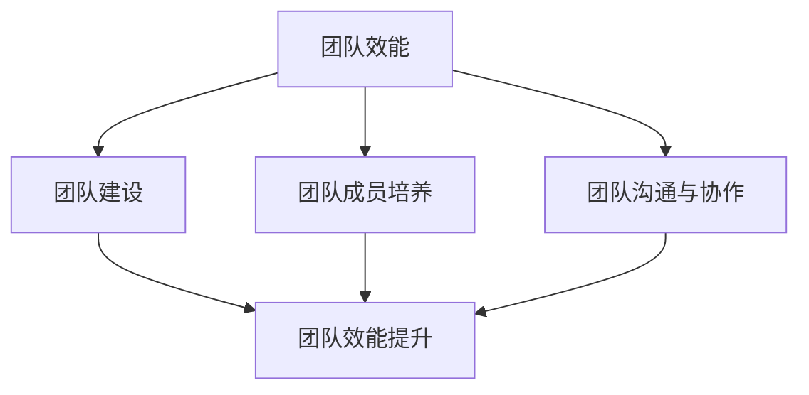

                 

### 团队建设的背景与核心概念

#### 问题背景与现状

在现代企业的运作中，团队建设已经成为一项至关重要的工作。随着市场竞争的加剧和技术的快速发展，企业需要更加高效、灵活、创新和协作的团队来应对不断变化的外部环境。然而，许多企业在团队建设方面面临着诸多挑战，如团队效能低下、沟通不畅、协作困难、人才流失等。

**问题描述：**

- **团队效能低下**：部分团队在工作中缺乏高效的协作和明确的职责分工，导致工作效率低下。
- **沟通不畅**：团队成员之间的沟通存在障碍，信息传递不及时、不准确，影响了工作的顺利进行。
- **协作困难**：团队内部成员在协作过程中常常出现意见不合、任务分工不明确、互相推诿等问题。
- **人才流失**：企业对人才的吸引力和留任能力不足，导致优秀人才的流失，影响了团队的整体实力。

**问题解决：**

为了解决这些问题，企业需要在团队建设方面下功夫，通过科学的管理方法和有效的策略来提升团队效能。团队建设不仅包括招聘和培养优秀人才，还需要关注团队文化、领导力、沟通与协作等多个方面。

**边界与外延：**

- **边界**：团队建设主要涉及企业内部团队的管理和优化，包括团队成员的招聘、培养、激励、沟通等。
- **外延**：团队建设还可以扩展到企业外部，如与合作伙伴、客户等建立合作关系，形成跨界团队，以实现资源整合和协同创新。

#### 核心概念定义

1. **团队的定义**

团队是由一组相互依赖的个体组成的协作群体，他们共同追求一个共同的目标。团队具有以下特征：

- **相互依赖**：团队成员之间相互依赖，一个成员的工作会影响到其他成员的工作。
- **共同目标**：团队成员共同追求一个目标，这个目标可以是完成一个项目、实现一个产品、提高业绩等。
- **协作**：团队成员之间通过协作来完成任务，共同解决问题。
- **多样性**：团队成员具有不同的背景、技能和经验，这种多样性有助于团队的创新和决策。

2. **团队建设的定义**

团队建设是指企业为了提高团队效能，通过一系列管理方法和策略，对团队成员进行培养、激励、沟通和协作等方面的优化和提升。

团队建设的目标包括：

- **提升团队效能**：通过优化团队结构和流程，提高团队的工作效率和产出。
- **增强团队凝聚力**：通过建立良好的团队文化和沟通机制，增强团队成员之间的凝聚力。
- **促进人才发展**：通过培养和激励，提升团队成员的个人能力和职业素养。

3. **团队效能的定义**

团队效能是指团队在完成特定任务时所表现出的工作效果和效率。团队效能可以从以下几个方面进行衡量：

- **工作效果**：团队完成任务的成果和质量。
- **工作效率**：团队完成任务的效率和速度。
- **工作满意度**：团队成员对工作的满意度和幸福感。

#### 概念之间的关系

团队效能、团队建设和团队效能之间的关系可以用下图表示：

- **团队效能与团队建设**：团队建设是提高团队效能的手段和过程，通过团队建设，可以提升团队效能。
- **团队效能与团队成员培养**：团队成员的培养是团队效能提升的重要保障，通过培养和激励，可以提高团队成员的能力和积极性，从而提高团队效能。
- **团队效能与团队沟通与协作**：良好的沟通和协作是团队效能提升的基础，通过有效的沟通和协作，可以消除团队成员之间的障碍，提高团队的工作效率和质量。

### 团队招聘策略与流程

#### 招聘战略制定

招聘战略制定是企业团队建设的重要一环，它直接关系到企业能否吸引和留住优秀人才。一个有效的招聘战略需要与企业的愿景、使命和价值观相一致，同时明确招聘目标和策略。

1. **企业愿景与招聘目标的关联**

企业愿景是指企业长期追求的目标和理想，是企业发展的方向和动力。招聘目标则是实现企业愿景的关键步骤，它需要与企业愿景保持一致。例如，如果企业的愿景是成为行业领导者，那么招聘目标可能是吸引和培养具有行业经验、创新能力和领导潜力的人才。

2. **招聘策略的制定**

招聘策略是指企业为实现招聘目标所采取的具体方法和步骤。制定招聘策略时需要考虑以下几个方面：

- **人才需求分析**：根据企业的战略目标和业务需求，分析企业所需人才的能力、技能和素质。
- **招聘渠道选择**：选择合适的招聘渠道，如线上招聘平台、猎头公司、校园招聘等。
- **岗位描述与要求**：明确每个岗位的职责、技能要求和任职资格，以便在招聘过程中有据可依。
- **面试流程设计**：设计科学的面试流程，包括初试、复试、专业技能测试等，以确保招聘质量。

3. **招聘目标的设定**

招聘目标是指企业在一定时间内需要完成的招聘任务。设定招聘目标时需要考虑以下几个方面：

- **招聘数量**：根据企业的业务发展和人才储备需求，设定合理的招聘数量。
- **招聘质量**：确保招聘到的人才具备企业所需的能力和素质，能够快速融入团队并发挥作用。
- **招聘周期**：设定合理的招聘周期，以确保招聘工作能够在较短时间内完成。

#### 人才筛选方法

1. **简历筛选技巧**

简历筛选是招聘流程的第一步，简历的质量直接影响到后续面试的质量。简历筛选技巧包括：

- **关键词匹配**：通过分析岗位要求，找出关键技能和经验，筛选出与岗位匹配的简历。
- **信息提炼**：提炼简历中的重要信息，如教育背景、工作经历、项目经验等。
- **排除法**：根据企业的招聘标准和要求，排除不符合条件的简历。

2. **初选面试方法**

初选面试是进一步筛选候选人，了解其基本素质和能力的环节。初选面试的方法包括：

- **电话面试**：通过电话了解候选人的基本信息、职业规划和期望薪资等。
- **视频面试**：利用视频通话工具进行面试，可以节省时间和成本，同时也能更好地观察候选人的形象和气质。
- **行为面试**：通过提问候选人过去的工作经历，了解其解决问题的能力、沟通能力和团队合作精神。

3. **复试策略**

复试是面试的进一步深化，旨在更全面地了解候选人。复试策略包括：

- **多轮面试**：设置多轮面试，每轮面试由不同部门的面试官参与，从不同角度评估候选人。
- **交叉验证**：通过与其他候选人、候选人过去的同事或上司进行沟通，验证候选人的信息和能力。
- **综合素质考察**：除了专业技能，还需要考察候选人的综合素质，如学习能力、沟通能力、团队合作精神等。

#### 招聘流程优化

1. **招聘流程的设计**

招聘流程的设计是确保招聘工作高效、有序进行的基础。招聘流程的设计包括：

- **明确招聘步骤**：明确每个招聘阶段的任务和目标，如简历筛选、初选面试、复试等。
- **流程标准化**：制定标准化的招聘流程，确保每个招聘环节都有明确的操作规范。
- **时间规划**：为每个招聘阶段设定合理的时间，确保招聘工作能够在预定时间内完成。

2. **招聘效率的提升**

提升招聘效率是招聘流程优化的关键目标。提升招聘效率的方法包括：

- **自动化工具**：使用招聘管理软件和工具，自动化处理简历筛选、面试安排等工作。
- **优化面试流程**：简化面试流程，缩短面试时间，提高面试效率。
- **多渠道招聘**：通过多种渠道进行招聘，如线上招聘、校园招聘、猎头招聘等，扩大人才来源。

3. **费用控制策略**

招聘费用是企业在招聘过程中需要承担的成本，费用控制策略包括：

- **预算管理**：设定招聘预算，合理分配招聘费用。
- **成本优化**：通过优化招聘流程、降低面试费用、减少人力资源成本等方式，降低招聘费用。
- **绩效激励**：对招聘团队进行绩效激励，鼓励招聘团队降低招聘成本。

通过以上方法，企业可以优化招聘流程，提升招聘效率，降低招聘成本，从而提高招聘质量，为团队建设奠定坚实的基础。

### 面试技巧与评估

#### 面试准备

面试准备是确保面试顺利进行的重要环节，充分的准备有助于提高面试官的专业性，同时也能给候选人留下良好的第一印象。面试准备包括以下几个方面：

1. **面试官培训**

面试官培训是提高面试质量的关键步骤。培训内容包括：

- **面试技巧**：面试官需要掌握面试的基本技巧，如提问技巧、倾听技巧、反馈技巧等。
- **岗位要求**：面试官需要对岗位的职责、技能要求和任职资格有清晰的理解。
- **案例分享**：通过分享成功的面试案例和失败的面试案例，让面试官了解在不同情况下如何进行面试。
- **模拟面试**：进行模拟面试，让面试官在实际面试前进行演练，提高面试的应变能力。

2. **面试题库建设**

面试题库是面试准备的重要组成部分，一个完善的面试题库可以确保面试的全面性和科学性。面试题库的建设包括：

- **分类管理**：将面试题按岗位、技能、行为等分类，便于检索和使用。
- **题库更新**：根据企业的招聘需求和行业变化，定期更新面试题库，确保题库的实时性和有效性。
- **题库优化**：通过分析面试结果，对面试题进行优化和改进，提高面试的准确性。

3. **面试环境的设置**

面试环境的设置直接影响到面试的效果。面试环境的设置包括：

- **物理环境**：确保面试房间干净、整洁、舒适，提供必要的设施和设备，如饮用水、空调、投影仪等。
- **氛围营造**：营造轻松、和谐的面试氛围，让候选人感到放松和舒适。
- **面试工具**：准备好面试所需的各种工具，如笔记本电脑、投影仪、音响等。

#### 面试过程

面试过程是评估候选人能力和潜力的重要环节，一个良好的面试过程需要面试官具备专业的面试技巧和良好的沟通能力。面试过程包括以下几个阶段：

1. **初步面试**

初步面试是面试的第一阶段，主要目的是筛选候选人，确定候选人是否具备进一步面试的资格。初步面试的方法包括：

- **电话面试**：通过电话或视频通话与候选人进行初步沟通，了解候选人的基本信息、职业规划和期望薪资等。
- **在线测评**：通过在线测评工具，对候选人的专业技能、思维能力、行为特征等进行评估。
- **面谈**：邀请候选人到公司进行初步面试，通过面对面的交流，了解候选人的实际能力和潜力。

2. **复试**

复试是面试的第二阶段，旨在更全面地了解候选人，确定候选人是否符合企业的招聘需求。复试的方法包括：

- **多轮面试**：设置多轮面试，每轮面试由不同部门的面试官参与，从不同角度评估候选人。
- **专业测试**：通过专业技能测试，评估候选人的实际工作能力。
- **行为面试**：通过提问候选人过去的工作经历，了解其解决问题的能力、沟通能力和团队合作精神。

3. **面试评估**

面试评估是对候选人进行全面评估的重要环节，通过评估可以确定候选人是否适合企业的岗位。面试评估的方法包括：

- **评分制**：面试官根据候选人的表现，对候选人进行评分，评分结果作为评估的重要依据。
- **行为分析**：通过分析候选人在面试过程中的行为，如语言表达、态度、情绪等，评估候选人的综合素质。
- **多角度评估**：综合面试官的评估结果，从多个角度对候选人进行评估，确保评估的准确性。

#### 面试技巧

1. **提问技巧**

提问技巧是面试官需要掌握的重要技能之一，有效的提问可以获取有价值的信息，同时也能给候选人留下良好的印象。提问技巧包括：

- **开放性提问**：使用开放性提问，如“你能谈谈你的工作经历吗？”等，鼓励候选人详细回答，从而获取更多信息。
- **封闭性提问**：使用封闭性提问，如“你在上一份工作中主要负责什么？”等，获取特定的信息。
- **行为面试提问**：通过提问候选人过去的工作经历，如“请描述一次你遇到困难的经历，你是如何解决的？”等，评估候选人的实际能力和素质。
- **情境提问**：通过提问候选人面对特定情境的应对策略，如“如果你在团队中遇到意见不合，你会如何处理？”等，评估候选人的沟通能力和解决问题的能力。

2. **反问技巧**

反问是面试过程中的一种有效技巧，通过反问可以引导候选人提供更多信息，同时也能展示面试官的专业性和对候选人的关心。反问技巧包括：

- **开放式反问**：如“你对我们公司的文化和价值观有什么看法？”等，鼓励候选人表达自己的观点。
- **具体化反问**：如“你在上一份工作中是如何实现这个目标的？”等，引导候选人详细描述具体的工作经历。
- **探索性反问**：如“你对这个岗位有什么期望？”等，了解候选人的职业规划和期望，评估候选人是否与岗位匹配。

3. **面试结束技巧**

面试结束是面试的最后一环节，面试官需要通过恰当的技巧结束面试，确保面试过程的专业性和有效性。面试结束技巧包括：

- **总结陈述**：在面试结束时，面试官可以对候选人的表现进行简要总结，表达对候选人的认可和期待。
- **询问候选人问题**：给候选人机会提问，了解候选人对岗位和企业的问题和疑虑，同时展示企业的开放和透明。
- **礼貌告别**：在面试结束时，面试官需要礼貌地与候选人告别，感谢候选人的参与，并表示会尽快通知面试结果。

通过以上面试技巧，面试官可以更好地评估候选人的能力和潜力，确保招聘决策的科学性和准确性。

### 团队培训与人才培养

#### 培训计划制定

团队培训与人才培养是企业提升团队效能和员工竞争力的重要手段。一个成功的培训计划需要明确培训需求、制定培训目标和设计培训计划。以下是培训计划制定的详细步骤：

1. **培训需求分析**

培训需求分析是制定培训计划的第一步，它可以帮助企业了解员工在哪些方面需要提升，从而有针对性地制定培训计划。培训需求分析包括以下几个方面：

- **员工能力评估**：通过调查问卷、访谈等方式，了解员工当前的能力水平，识别员工的短板和优势。
- **工作绩效分析**：分析员工在工作中的表现，找出影响工作绩效的因素，如技能不足、知识缺乏等。
- **岗位需求分析**：根据岗位要求，分析员工所需具备的技能和知识，识别培训需求。
- **市场趋势分析**：了解行业动态和市场需求，确保培训内容与行业发展同步。

2. **培训计划设计**

在完成培训需求分析后，企业需要根据分析结果设计培训计划。培训计划设计包括以下几个关键环节：

- **培训目标设定**：根据培训需求，设定明确的培训目标，如提高员工某项技能、增强团队合作能力等。
- **培训内容规划**：根据培训目标，确定培训的具体内容，如技能培训、知识普及、管理培训等。
- **培训方式选择**：选择适合的培训方式，如线上培训、线下培训、内部讲座、外部培训等。
- **培训时间安排**：根据员工的工作安排，合理安排培训时间，确保培训不影响员工的正常工作。

3. **培训资源整合**

为了确保培训计划的有效实施，企业需要整合各种培训资源，包括人力资源、财务支持、技术支持等。培训资源整合包括：

- **人力资源调配**：指派有经验的员工担任培训讲师，确保培训内容的专业性和实用性。
- **财务支持**：为培训提供必要的经费支持，如培训费用、教材费用、场地费用等。
- **技术支持**：提供必要的培训技术支持，如在线培训平台、培训管理软件等。

#### 人才培养策略

在制定培训计划的同时，企业还需要制定有效的人才培养策略，以提升员工的综合能力和职业素养。以下是人才培养策略的几个关键方面：

1. **职业发展规划**

职业发展规划是员工长期发展的指导方针，它可以帮助员工明确职业目标，规划职业发展路径。职业发展规划包括：

- **目标设定**：根据员工的兴趣、能力和职业规划，设定明确的职业发展目标。
- **路径规划**：为员工提供清晰的职业发展路径，如晋升路径、转岗路径等。
- **支持措施**：为员工提供职业发展所需的支持，如培训、指导、导师制等。

2. **能力提升计划**

能力提升计划是提升员工综合素质和业务能力的重要手段。能力提升计划包括：

- **技能培训**：根据员工的岗位需求，提供技能培训，如专业技能培训、管理技能培训等。
- **知识普及**：为员工提供行业最新知识和技术普及，如行业动态、新技术介绍等。
- **实践锻炼**：通过实际项目锻炼，提升员工的实战能力和经验。

3. **转岗与晋升机会**

提供转岗与晋升机会是激励员工、提升团队活力的重要手段。转岗与晋升机会包括：

- **内部招聘**：通过内部招聘，为员工提供转岗和晋升的机会，激发员工的竞争意识和积极性。
- **人才库建设**：建立人才库，记录员工的能力、业绩和发展潜力，为转岗和晋升提供依据。
- **晋升机制**：制定明确的晋升机制，如晋升标准、晋升流程等，确保晋升的公正性和透明性。

#### 培训效果评估

培训效果评估是检验培训计划实施效果的重要环节，通过评估可以了解培训的成果，发现培训过程中的问题，为下一步的培训工作提供改进方向。以下是培训效果评估的几个关键方面：

1. **培训成果衡量**

培训成果衡量是评估培训效果的重要指标，包括以下几个方面：

- **知识掌握程度**：通过考试、测验等方式，评估员工对培训内容的掌握程度。
- **技能提升程度**：通过实际操作、项目实践等方式，评估员工技能的提升程度。
- **工作绩效改善**：通过员工的工作绩效数据，评估培训对工作绩效的改善程度。
- **员工满意度**：通过员工满意度调查，了解员工对培训的满意度和接受程度。

2. **培训反馈机制**

培训反馈机制是收集员工对培训意见和建议的重要渠道，包括以下几个方面：

- **培训后评估**：在培训结束后，对员工进行评估，了解培训的收获和不足。
- **员工反馈**：鼓励员工提出培训反馈，如培训内容的实用性、培训方式的有效性等。
- **改进措施**：根据反馈意见，及时调整和改进培训计划，提高培训质量。

3. **持续改进策略**

为了确保培训工作的持续有效，企业需要制定持续改进策略，包括：

- **培训效果跟踪**：定期对培训效果进行跟踪评估，确保培训目标的实现。
- **培训资源优化**：根据培训效果，优化培训资源，如调整培训内容、改进培训方式等。
- **培训体系完善**：不断完善培训体系，如制定培训标准、优化培训流程等，确保培训工作的系统性和规范性。

通过以上措施，企业可以确保培训计划的科学性和有效性，提升员工的综合素质和业务能力，从而推动企业的发展。

### 绩效管理

#### 绩效评估体系

绩效评估是企业对员工工作表现进行评估的重要手段，一个科学合理的绩效评估体系能够激励员工提高工作效率，促进团队的发展。以下是构建绩效评估体系的关键步骤：

1. **绩效指标设计**

绩效指标是评估员工工作表现的具体标准，设计绩效指标需要考虑以下几个方面：

- **关键绩效指标（KPI）**：确定与公司战略目标紧密相关的关键绩效指标，如销售额、项目进度、客户满意度等。
- **过程指标**：设定反映工作过程和流程的指标，如工作完成率、任务响应时间等。
- **行为指标**：制定评估员工工作行为和态度的指标，如团队合作、责任心、创新能力等。

2. **绩效评估方法**

绩效评估方法包括定性评估和定量评估两种：

- **定性评估**：通过主观判断评估员工的表现，如评估员工的领导能力、沟通能力等。
- **定量评估**：通过客观数据评估员工的工作成果，如完成的项目数量、销售额等。

3. **绩效反馈机制**

建立有效的绩效反馈机制，确保员工能够及时了解自己的工作表现，并根据反馈进行调整：

- **定期反馈**：定期召开绩效反馈会议，向员工传达绩效评估结果，讨论改进措施。
- **即时反馈**：在日常工作中，及时给予员工反馈，帮助员工纠正错误和提升能力。
- **双向沟通**：鼓励员工与管理层进行双向沟通，共同探讨绩效提升的方法。

#### 绩效激励

绩效激励是提高员工积极性和工作效率的重要手段，通过合理的激励措施，可以激发员工的潜能，促进团队的发展。以下是绩效激励的关键方面：

1. **绩效奖励制度**

绩效奖励制度是激励员工的重要手段，包括以下几个方面：

- **物质奖励**：如奖金、提成、礼品等，直接与员工的绩效表现挂钩。
- **荣誉奖励**：如优秀员工表彰、荣誉称号等，提升员工的社会地位和自我价值感。
- **晋升机会**：为表现优秀的员工提供晋升机会，激发员工的进取心。

2. **绩效改善计划**

通过绩效改善计划，帮助员工识别不足、制定改进措施，提升工作表现：

- **绩效诊断**：定期进行绩效诊断，分析员工的表现，找出存在的问题。
- **培训发展**：为员工提供培训和发展机会，提升其能力和技能。
- **改进措施**：制定具体的改进措施，如优化工作流程、改善工作环境等。

3. **绩效沟通技巧**

有效的绩效沟通能够增进员工与管理层之间的理解，提高绩效管理的有效性：

- **透明沟通**：确保绩效评估结果和激励措施透明，让员工了解评估标准和结果。
- **积极倾听**：倾听员工的意见和反馈，尊重员工的感受，建立良好的沟通氛围。
- **及时反馈**：及时给予员工绩效反馈，帮助员工理解评估结果，并提供改进建议。

#### 绩效改进

绩效改进是持续提升员工工作表现和团队效能的重要过程，通过不断优化绩效管理，可以推动企业的健康发展。以下是绩效改进的关键步骤：

1. **绩效问题识别**

通过分析绩效数据，识别员工在绩效表现中存在的问题，如工作效率低、项目延误等。

2. **改进策略制定**

针对识别出的问题，制定具体的改进策略，如优化工作流程、加强员工培训等。

3. **实施与跟踪**

将改进策略付诸实施，并定期跟踪改进效果，确保改进措施的落实和成效。

4. **持续优化**

根据绩效改进的实际情况，持续优化绩效管理流程和制度，提升整体绩效水平。

通过以上绩效管理的措施，企业可以建立一个科学、合理的绩效评估体系，有效地激励员工，提升团队效能，推动企业的持续发展。

### 领导力在团队建设中的作用

#### 领导力的定义与类型

领导力是领导者影响和激励团队、实现共同目标的能力。根据不同的分类标准，领导力可以被划分为不同的类型：

1. **变革型领导力**

变革型领导力是指领导者通过激发员工的内在动力，推动团队创新和变革的能力。这种领导力强调领导者的激励和示范作用，通过愿景、使命和价值观的传达，激励团队成员超越自我，实现团队目标。

2. **交易型领导力**

交易型领导力是指领导者通过设定明确的目标和奖励机制，以交易方式激励团队成员实现目标的能力。这种领导力侧重于任务完成和绩效提升，通过奖励和惩罚来影响团队成员的行为。

3. **参与型领导力**

参与型领导力是指领导者通过鼓励团队成员参与决策和任务分配，提高团队凝聚力和自主性的领导方式。这种领导力强调团队合作和共同决策，通过增强团队成员的参与感和责任感，提高团队效能。

4. **服务型领导力**

服务型领导力是指领导者以服务团队成员为中心，关注团队成员的需求和成长，致力于创造一个支持和促进团队发展的环境。这种领导力强调领导者为团队成员提供帮助和支持，通过激励和引导，帮助团队成员实现个人和团队目标。

#### 领导风格与团队效能的关系

领导风格是指领导者在日常管理中表现出来的行为特征和方式。不同的领导风格对团队效能有着显著的影响：

1. **权威型领导风格**

权威型领导风格是指领导者通过明确的指令和严格的控制来管理团队。这种领导风格在短期内能够快速推动任务的完成，但在长期中可能导致团队成员缺乏自主性和创造力，从而影响团队效能。

2. **民主型领导风格**

民主型领导风格是指领导者鼓励团队成员参与决策和任务分配，尊重团队成员的意见和想法。这种领导风格能够增强团队成员的参与感和责任感，提高团队的凝聚力和创新能力，从而提升团队效能。

3. **支持型领导风格**

支持型领导风格是指领导者关注团队成员的需求和成长，提供必要的支持和资源，帮助团队成员克服困难和挑战。这种领导风格能够增强团队成员的信任和归属感，提高团队的合作精神和整体效能。

4. **教练型领导风格**

教练型领导风格是指领导者通过指导、培训和激励，帮助团队成员提升能力和实现个人发展。这种领导风格强调领导者的角色不仅是管理者，更是导师和教练，能够帮助团队成员不断成长，从而提升团队效能。

#### 如何选择适合的领导风格

选择适合的领导风格需要考虑团队的实际情况和目标：

1. **团队阶段**：根据团队所处的阶段选择合适的领导风格。如团队初创期可能需要权威型领导来确保方向的正确性，而团队稳定期可能更需要民主型或支持型领导来促进团队成员的参与和成长。

2. **团队特点**：考虑团队的特点，如团队成员的年龄、经验、文化背景等，选择能够激发团队成员积极性的领导风格。

3. **领导目标**：根据领导的目标选择领导风格。如果目标是快速实现任务，可以选择权威型或交易型领导风格；如果目标是提升团队的创新能力和凝聚力，可以选择民主型或支持型领导风格。

4. **领导者特质**：领导者自身的特质和价值观也会影响领导风格的选择。例如，一个自信且具有远见的领导者可能更适合采用变革型领导风格，而一个注重团队成员成长和发展的领导者可能更适合采用服务型领导风格。

#### 领导力发展

提升领导力是每个领导者都需要关注的重要课题。以下是一些提升领导力的方法和策略：

1. **自我反思**：定期进行自我反思，识别自己的优势和不足，了解自己的领导风格和影响力。

2. **学习与培训**：通过学习相关书籍、课程和参加培训，获取领导力的知识和技能，不断提升自己的领导力水平。

3. **实践与经验**：通过实际工作经历，积累领导力实践经验，从实践中学习，不断提升自己的领导能力。

4. **反馈与改进**：接受团队成员和同事的反馈，了解自己的领导风格和工作方式对团队的影响，并根据反馈进行改进。

5. **培养下属**：通过培养和指导下属，提升下属的能力和自信心，从而提升整个团队的效能。

通过以上方法和策略，领导者可以不断提升自己的领导力，为团队建设提供有力的支持。

### 团队沟通与冲突管理

#### 团队沟通技巧

团队沟通是确保团队高效协作和完成任务的关键。有效的团队沟通不仅能提高工作效率，还能增强团队成员之间的信任和合作。以下是团队沟通的几个关键技巧：

1. **主动沟通**

主动沟通是指团队成员在遇到问题时，主动寻求解决方案，而不是等待指令。主动沟通有助于快速解决问题，避免因拖延而导致的延误和冲突。

2. **倾听技巧**

倾听是有效沟通的核心。倾听技巧包括：

- **专注倾听**：在沟通时，保持专注，避免分心。
- **理解对方意图**：尝试从对方的角度理解问题，准确把握对方的需求和意图。
- **反馈与确认**：在倾听过程中，通过重复对方的话或总结对方的意思，确认自己是否正确理解了对方的意图。

3. **表达清晰**

表达清晰是指团队成员在沟通时，要尽可能简洁明了地表达自己的观点和想法。清晰的表达有助于减少误解和沟通障碍。

4. **情感沟通**

情感沟通是指团队成员在沟通时，关注对方的情感需求，尊重对方的感受。情感沟通能够增强团队成员之间的信任和合作，提高团队的凝聚力。

5. **沟通渠道多样化**

为了提高沟通效率，团队成员应充分利用各种沟通渠道，如面对面交流、电子邮件、即时通讯工具、会议等。多样化的沟通渠道有助于确保信息传递的及时性和准确性。

#### 冲突管理

冲突是团队协作过程中不可避免的现象。有效的冲突管理能够帮助团队化解矛盾，促进合作，提高团队效能。以下是冲突管理的几个关键步骤：

1. **冲突识别**

冲突识别是冲突管理的第一步。团队成员需要学会识别冲突的早期信号，如沟通障碍、情绪波动、工作拖延等。早期识别冲突有助于及时采取应对措施。

2. **冲突类型与原因**

冲突可以分为以下几种类型：

- **目标冲突**：由于团队成员对目标的理解和看法不一致导致的冲突。
- **资源冲突**：由于团队成员对资源分配和使用的不满导致的冲突。
- **价值观冲突**：由于团队成员的价值观和信仰差异导致的冲突。

冲突的原因可能包括：

- **沟通障碍**：信息传递不畅，导致误解和分歧。
- **资源不足**：资源分配不合理，导致团队成员之间的竞争。
- **角色冲突**：团队成员的角色和职责不明确，导致责任推卸和任务延误。
- **个人差异**：团队成员的个人性格、价值观和背景差异，导致冲突。

3. **冲突解决策略**

有效的冲突解决策略包括：

- **直接面对**：直接与冲突方沟通，表达自己的观点和感受，尝试找到共同点。
- **妥协与让步**：在必要时，通过妥协和让步来达成共识，避免冲突升级。
- **调解与仲裁**：在无法自行解决冲突时，寻求第三方调解或仲裁，以公正的方式解决冲突。
- **预防措施**：通过明确沟通规则、设立冲突解决机制、定期团队建设活动等方式，预防冲突的发生。

4. **冲突预防措施

为了预防冲突，团队可以采取以下措施：

- **沟通培训**：定期组织沟通培训，提高团队成员的沟通技巧和表达能力。
- **明确职责**：确保团队成员对各自的角色和职责有清晰的认识，减少责任推卸。
- **公平分配资源**：确保资源的合理分配，减少因资源不足导致的冲突。
- **团队建设**：通过团队建设活动，增强团队成员之间的信任和合作，减少冲突发生的可能性。

#### 团队协作与协同

团队协作和协同是确保团队高效完成任务的关键。以下是团队协作与协同的几个关键方面：

1. **团队协作机制**

建立有效的团队协作机制，确保团队成员能够高效协作。团队协作机制包括：

- **目标一致性**：确保团队成员对团队目标有清晰的认识和一致的理解。
- **任务分工明确**：明确团队成员的任务和职责，避免重复和冲突。
- **信息共享**：确保团队成员之间的信息共享，减少信息孤岛和沟通障碍。
- **反馈机制**：建立反馈机制，及时了解团队成员的工作进展和问题，调整工作计划。

2. **协同工具的应用**

利用现代协同工具，提高团队协作效率。协同工具包括：

- **项目管理工具**：如Trello、JIRA等，用于任务分配、进度跟踪和协作管理。
- **即时通讯工具**：如Slack、Microsoft Teams等，用于实时沟通和协作。
- **文档共享工具**：如Google Docs、Dropbox等，用于文档的共享和协作编辑。
- **视频会议工具**：如Zoom、Microsoft Teams等，用于远程协作和会议沟通。

3. **团队协作效果评估**

定期对团队协作效果进行评估，了解团队协作的优势和不足，持续改进团队协作机制。团队协作效果评估可以从以下几个方面进行：

- **任务完成率**：评估团队完成任务的速度和质量。
- **团队成员满意度**：通过调查问卷、访谈等方式，了解团队成员对团队协作的满意度和建议。
- **协作效率**：评估团队成员之间的协作效率和沟通效果。
- **团队效能**：综合评估团队的整体效能，包括工作效率、项目完成度和团队凝聚力。

通过有效的团队沟通技巧、冲突管理策略和团队协作与协同，团队可以克服各种困难，实现高效协作，完成共同目标。

### 案例分析

#### 案例介绍

为了更好地理解团队建设的重要性，我们将通过一个成功的案例分析，展示一家科技公司如何通过科学的团队建设策略，实现了业务增长和团队效能的提升。这家公司是一家从事人工智能技术研究的初创企业，团队由一批富有创新精神和技术背景的年轻人才组成。

**案例背景**：

- **企业愿景**：成为全球领先的人工智能技术解决方案提供商。
- **业务挑战**：在快速发展的技术领域，如何保持团队的创新能力、高效协作和稳定发展。

**案例目标**：

- **提升团队效能**：通过优化团队建设策略，提高团队的工作效率和产出。
- **增强团队凝聚力**：通过建立积极向上的团队文化和有效的沟通机制，增强团队成员之间的凝聚力。
- **人才发展**：培养和激励团队成员，提升个人能力和职业素养。

**实施过程**：

1. **招聘策略制定**

公司首先明确了招聘目标，制定了以吸引和培养顶尖人才为核心的战略。通过多种招聘渠道，如线上招聘平台、行业峰会、高校合作等，吸引具有丰富经验和创新思维的候选人。面试过程中，注重评估候选人的技术能力、沟通能力和团队协作精神，确保招聘到的人才能够快速融入团队并发挥作用。

2. **团队培训与培养**

公司重视员工的成长和发展，制定了系统的培训计划。通过内部培训、外部培训、项目实践等多种形式，提升员工的专业技能和综合素质。同时，公司鼓励员工参加行业会议和研讨会，了解最新技术动态，保持创新思维。

3. **绩效管理与激励**

公司建立了科学合理的绩效管理体系，通过明确绩效指标和定期评估，激励员工不断提升工作效率和质量。绩效评估不仅考虑工作成果，还重视员工的团队合作精神和个人发展潜力。根据绩效表现，公司给予员工相应的奖励和晋升机会，激发员工的积极性和进取心。

4. **领导力发展**

公司注重领导力的培养，通过内部培训和导师制，提升领导者的管理水平。公司鼓励领导者采用民主型和支持型领导风格，注重团队成员的意见和建议，营造开放、和谐的团队氛围。

#### 案例分析

1. **招聘策略**

公司的招聘策略有效地吸引了具有创新能力和技术背景的顶尖人才。通过多样化的招聘渠道和科学的面试流程，公司确保了招聘质量，招聘到的人才能够迅速融入团队，为企业的快速发展提供了有力支持。

2. **团队培训与培养**

通过系统的培训计划和丰富的培训形式，公司提升了员工的专业技能和综合素质，增强了团队的创新能力。员工在项目中得到了实践锻炼，不断提升自己的能力和经验，为公司的发展贡献了重要力量。

3. **绩效管理与激励**

科学的绩效管理体系激发了员工的积极性和进取心，使员工在追求个人发展的同时，也推动了团队的整体效能提升。绩效激励措施使员工感受到企业的关怀和认可，增强了员工的归属感和忠诚度。

4. **领导力发展**

领导者的领导力水平直接影响到团队的效能。公司通过领导力培养，提升了领导者的管理水平，营造了积极向上的团队氛围。领导者的有效领导不仅促进了团队协作，也为公司的发展提供了强有力的支持。

#### 案例启示

1. **招聘策略的重要性**：科学的招聘策略能够吸引和留住优秀人才，为企业的快速发展奠定基础。

2. **人才培养的关键性**：通过系统的培训计划和丰富的培训形式，提升员工的能力和素质，增强团队的创新能力。

3. **绩效管理的激励作用**：科学的绩效管理体系能够激发员工的积极性和进取心，提升团队的整体效能。

4. **领导力的重要性**：有效的领导力能够促进团队协作，提升团队效能，为企业的持续发展提供保障。

通过这个案例，我们可以看到，科学的团队建设策略对企业的成功至关重要。企业需要重视团队建设，通过优化招聘策略、加强人才培养、建立科学的绩效管理体系和提升领导力，打造一支高效、协作、创新的团队，实现企业的长期发展目标。

### 最佳实践与注意事项

#### 团队建设最佳实践

1. **明确团队目标**：团队目标应当清晰、具体且与企业的战略目标一致。通过明确的团队目标，可以增强团队成员的凝聚力和方向感。

2. **建立有效的沟通机制**：建立畅通的沟通渠道，确保信息在团队内部的高效传递。定期组织团队会议和沟通活动，促进团队成员之间的交流与协作。

3. **培养团队合作精神**：通过团队建设活动、跨部门合作项目和角色扮演等，增强团队成员的团队合作意识。同时，鼓励团队成员分享经验和知识，形成良好的学习氛围。

4. **提供培训与发展机会**：定期为团队成员提供培训和发展机会，提升其专业技能和综合素质。通过内部培训、外部培训和在线学习等多种形式，满足不同成员的需求。

5. **实施科学的绩效管理**：建立科学的绩效评估体系，明确绩效指标，确保评估的公正性和透明度。通过绩效反馈和激励措施，激发员工的积极性和创造力。

6. **领导力培养**：重视领导力的培养，为领导者提供培训和发展机会，提升其管理水平。领导者应具备变革型、参与型和教练型领导风格，以激发团队成员的潜能。

#### 注意事项

1. **避免团队内部分裂**：注意团队内部的动态，及时发现和处理潜在的矛盾和冲突，防止团队分裂。

2. **合理配置资源**：确保团队资源（如人力、财务、技术等）的合理配置，避免资源浪费和竞争。

3. **尊重团队成员的差异**：团队成员有着不同的背景、技能和性格，管理者应当尊重并利用这些差异，形成多元化的团队优势。

4. **持续关注团队建设**：团队建设不是一次性的工作，而是一个持续的过程。管理者需要持续关注团队建设的成效，并根据实际情况进行调整。

5. **关注团队成员的身心健康**：关注团队成员的工作压力和身心健康，提供必要的支持和帮助，创造一个和谐、积极的工作环境。

#### 拓展阅读

- **《团队的五项修炼：缔造伟大的团队》**：作者：皮特·圣吉。本书系统地阐述了如何通过五项修炼（自我超越、共同愿景、团队学习、改变心智模式、系统思考）来打造高效团队。
- **《团队协作的艺术》**：作者：凯斯·弗兰克·哈格。本书详细介绍了团队协作的原理和实践方法，为团队管理者提供了实用的指导。
- **《领导力与团队管理》**：作者：斯蒂芬·罗宾斯。本书涵盖了领导力的定义、类型、发展以及团队管理的各个方面，是领导力与团队管理领域的经典之作。

通过以上最佳实践和注意事项，企业可以更好地进行团队建设，提升团队效能，实现企业的长期发展目标。

