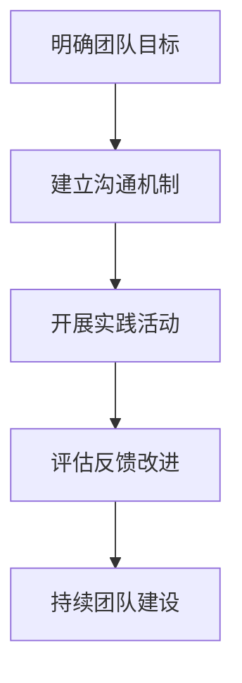
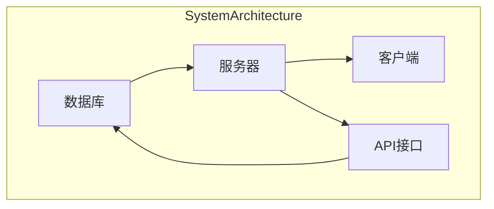
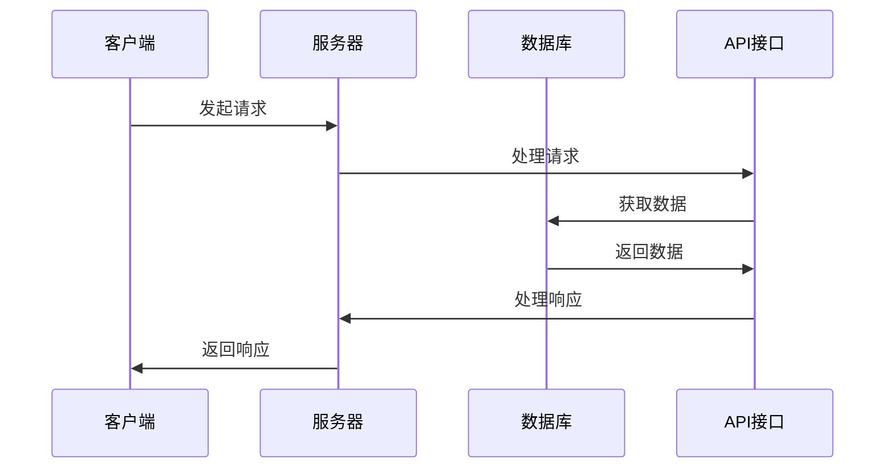

                 


# 团队建设：培养团队精神的实践活动

关键词：团队建设、团队精神、实践活动、协作技巧、沟通原则

摘要：本文旨在探讨团队建设的重要性，通过实践活动来培养团队精神。我们将深入分析团队建设理论基础，结合成功案例，总结团队建设实践中的挑战与解决方案，并展望未来发展趋势。

## 引言与背景

在现代企业中，团队已经成为组织运作的核心。一个高效的团队不仅能够提升工作效率，还能够激发员工的创造力和创新能力。然而，团队建设并非易事，许多团队面临着沟通不畅、协作不力、目标不一致等问题。这些问题严重影响了团队的绩效和成员的满意度。

本文将从以下几个方面展开讨论：首先，介绍团队建设的现状与挑战；其次，阐述团队建设的理论基础；接着，探讨如何通过实践活动来培养团队精神；然后，分析成功团队建设实践案例；最后，总结团队建设实践中的挑战与解决方案，并展望未来发展趋势。

## 团队建设的理论基础

### 1. 团队生命周期模型

团队生命周期模型描述了团队从形成到解散的过程，包括四个阶段：形成期、成长期、成熟期和衰退期。每个阶段都有其特定的特征和团队领导者需要扮演的角色。

#### 形成期

在形成期，团队成员刚刚组成，彼此不熟悉，团队的目标和角色分配尚不明确。团队领导者需要建立团队的基本框架，明确团队目标和角色分工，促进成员之间的相互了解。

#### 成长期

在成长期，团队成员开始相互合作，共同完成任务。团队领导者需要提供支持，帮助团队解决冲突，促进团队成员之间的沟通和协作。

#### 成熟期

在成熟期，团队已经形成紧密的合作关系，成员之间相互信任，能够高效地完成团队目标。团队领导者需要保持团队的活力，鼓励创新和持续改进。

#### 衰退期

在衰退期，团队的目标已经实现，或者组织环境发生变化，团队需要解散或者转型。团队领导者需要妥善处理团队成员的离职和过渡，确保团队解散的顺利进行。

### 2. 团队角色与职责

团队角色与职责的明确是团队建设的基础。团队领导者负责制定团队目标、协调团队活动、激励团队成员等。团队成员则需要明确自己的角色和职责，积极参与团队活动，为团队目标的实现贡献力量。

### 3. 团队成员沟通与协作

沟通与协作是团队成功的关键。团队成员需要建立开放、透明、尊重的沟通环境，确保信息的有效传递和共享。同时，团队领导者需要提供协作工具和流程，促进团队成员之间的协作。

### 4. 团队建设理论的发展

团队建设理论不断发展，从传统的组织行为学到现代的团队动力学，再到新兴的敏捷团队管理，都在探索如何更好地培养团队精神，提高团队绩效。

## 培养团队精神的实践活动

实践活动是培养团队精神的有效途径。以下是一些实用的实践活动：

### 1. 团队协作游戏与活动

团队协作游戏和活动可以帮助团队成员在轻松的氛围中相互了解，增强团队合作精神。例如，团队拼图、模拟谈判、团队合作竞赛等。

### 2. 培训与实践的结合

将团队建设培训与实践相结合，可以让团队成员在实战中学习和应用团队建设知识。例如，组织团队项目、开展团队技能竞赛等。

### 3. 实践活动的评估与反馈

实践活动后，对活动效果进行评估和反馈，可以帮助团队总结经验，改进方法。例如，通过问卷调查、访谈、团队讨论等方式收集团队成员的反馈意见。

## 实践案例

### 1. 科技公司团队建设案例

某科技公司通过一系列实践活动，培养了团队的协作精神和创新能力。例如，组织团队拓展训练、开展团队项目竞赛、定期举办团队建设培训等。

### 2. 非营利组织团队建设案例

某非营利组织通过团队建设活动，提高了团队成员的沟通能力和工作效率。例如，组织团队志愿者活动、开展团队技能培训、设立团队奖项等。

### 3. 学校团队建设案例

某学校通过团队建设活动，培养了学生的团队合作精神和创新能力。例如，组织团队比赛、开展团队研究项目、设立团队奖项等。

## 团队建设实践中的挑战与解决方案

### 1. 团队成员差异的挑战

团队成员的差异可能导致沟通不畅和协作困难。解决方法包括：明确团队成员的角色和职责，建立有效的沟通机制，提供跨文化培训等。

### 2. 时间与资源的挑战

团队建设活动需要时间和资源支持。解决方法包括：制定合理的团队建设计划，争取领导层的支持，利用现有的资源和工具等。

### 3. 文化差异的挑战

文化差异可能影响团队成员之间的合作。解决方法包括：建立共同的目标和价值观，加强跨文化沟通和协作，提供文化适应性培训等。

## 结论与展望

团队建设是提升组织绩效和员工满意度的重要手段。通过实践活动，可以培养团队精神，提高团队协作效率。未来，随着组织形式和团队构成的多样化，团队建设理论和方法将不断发展和完善。

## 团队建设与个人发展

团队建设不仅有助于团队整体的发展，也对团队成员的个人发展产生深远影响。通过团队建设，团队成员可以：

### 1. 提升沟通与协作能力

在团队中，成员需要不断地沟通和协作，这有助于提升个人的沟通能力和协作技巧。

### 2. 增强问题解决能力

团队建设中的实践活动往往涉及到复杂的问题，这有助于团队成员提升问题解决能力。

### 3. 激发创新思维

团队建设鼓励创新和尝试，这有助于激发团队成员的创新思维。

### 4. 提升领导力

在团队建设中，成员有机会承担领导角色，这有助于提升个人的领导力。

## 最佳实践 Tips

1. 定期进行团队建设活动，确保团队成员有足够的时间进行交流和协作。
2. 建立有效的沟通机制，确保信息的有效传递和共享。
3. 鼓励团队成员提出建议和反馈，促进团队的持续改进。
4. 提供跨文化培训和沟通技巧培训，增强团队的多样性。
5. 营造积极向上的团队氛围，鼓励团队成员相互支持和帮助。

## 小结

团队建设是组织成功的关键。通过实践活动，可以培养团队精神，提高团队协作效率。未来，随着组织形式和团队构成的多样化，团队建设理论和方法将不断发展和完善。

## 注意事项

1. 团队建设需要时间和资源支持，确保计划合理，资源充足。
2. 团队成员的差异是正常的，关键在于如何管理和利用这些差异。
3. 团队建设需要持续的投入和关注，不能一蹴而就。

## 拓展阅读

1. 请查阅相关团队建设理论和实践书籍，如《团队的五个层次》和《团队建设的艺术》。
2. 请关注相关团队建设实践案例，如《谷歌如何打造高效团队》和《如何打造一支顶尖销售团队》。

## 作者信息

作者：AI天才研究院/AI Genius Institute & 禅与计算机程序设计艺术 /Zen And The Art of Computer Programming

----------------------------------------------------------------

### 1. 背景介绍

#### 核心概念术语说明

**团队建设**：指通过一系列有目的的活动和措施，增强团队成员之间的协作能力，提高团队整体绩效的过程。

**团队精神**：指团队成员在共同目标和价值观指导下，形成的相互信任、尊重、支持和合作的态度和行为。

**实践活动**：指通过实际行动和操作，对理论进行验证和应用的过程。

#### 问题背景

在当今快速变化和竞争激烈的市场环境中，企业对团队建设的需求越来越迫切。许多企业已经意识到，一个高效的团队能够更好地应对外部挑战，实现企业目标。然而，团队建设并非易事，许多企业在实践中遇到了各种问题。

#### 问题描述

团队建设面临的主要问题包括：

1. 沟通不畅：团队成员之间缺乏有效的沟通，导致信息传递错误，误解和冲突。
2. 协作不力：团队成员之间缺乏协作，导致工作效率低下，任务无法按时完成。
3. 目标不一致：团队成员对团队目标理解不一致，导致团队成员的努力方向不一致。
4. 文化差异：团队成员来自不同文化背景，文化差异可能导致沟通和协作困难。

#### 问题解决

为了解决上述问题，企业可以采取以下措施：

1. 建立有效的沟通机制：通过定期的团队会议、信息共享平台等方式，增强团队成员之间的沟通。
2. 强化协作意识：通过团队活动、培训等方式，提高团队成员的协作意识。
3. 明确团队目标：确保团队成员对团队目标有清晰的理解，并通过明确的角色分工，确保团队成员的努力方向一致。
4. 促进文化融合：通过跨文化培训、文化交流等方式，促进团队成员之间的文化融合。

#### 边界与外延

团队建设不仅涉及团队成员之间的协作，还包括与外部环境的互动。例如，企业可以通过与供应商、客户等合作伙伴的协作，实现共同发展。

#### 概念结构与核心要素组成

团队建设包含以下几个核心要素：

1. 目标明确：明确团队的目标和愿景，确保团队成员的努力方向一致。
2. 沟通协作：建立有效的沟通机制，促进团队成员之间的协作和信息共享。
3. 文化融合：促进团队成员之间的文化融合，增强团队凝聚力。
4. 能力提升：通过培训和实践，提升团队成员的技能和能力。

### 2. 核心概念与联系

#### 核心概念原理

**团队建设**：团队建设是指通过一系列活动，如培训、实践、沟通等，增强团队成员之间的协作能力，提高团队整体绩效的过程。

**团队精神**：团队精神是指团队成员在共同目标和价值观指导下，形成的相互信任、尊重、支持和合作的态度和行为。

#### 概念属性特征对比表格

| 特征           | 团队建设                    | 团队精神                    |
| -------------- | --------------------------- | --------------------------- |
| 目的           | 提升团队协作能力，实现组织目标 | 增强团队凝聚力，提高团队绩效 |
| 方式           | 培训、实践、沟通等           | 相互信任、尊重、支持、合作   |
| 关系           | 组织与团队、团队成员间       | 团队成员间                   |
| 影响因素       | 组织文化、团队成员素质等     | 目标一致、价值观认同等       |
| 结果           | 提高团队绩效                | 增强团队凝聚力               |

#### ER实体关系图架构的 Mermaid 流程图

```mermaid
erDiagram
  Organization ||--|{ Team }| TeamMember
  TeamMember ||--|{ Skill }| Skill
  TeamMember ||--|{ Task }| Task
```

### 3. 算法原理讲解

#### 算法流程图



#### Python 源代码

```python
def team_building():
    """
    团队建设流程
    """
    # 明确团队目标
    define_goal()

    # 建立沟通机制
    establish_communication()

    # 开展实践活动
    conduct_activities()

    # 评估反馈改进
    evaluate_feedback()

    # 持续团队建设
    continue_team_building()

def define_goal():
    """
    明确团队目标
    """
    print("明确团队目标：提高团队协作能力，实现组织目标。")

def establish_communication():
    """
    建立沟通机制
    """
    print("建立沟通机制：定期团队会议，信息共享平台等。")

def conduct_activities():
    """
    开展实践活动
    """
    print("开展实践活动：团队培训，实践活动等。")

def evaluate_feedback():
    """
    评估反馈改进
    """
    print("评估反馈改进：问卷调查，访谈，团队讨论等。")

def continue_team_building():
    """
    持续团队建设
    """
    print("持续团队建设：定期检查，持续改进。")
```

#### 算法原理数学模型和公式

**团队建设效果评估模型**：

$$
E = f(C, A, F)
$$

其中，$E$ 表示团队建设效果，$C$ 表示沟通能力，$A$ 表示活动开展情况，$F$ 表示反馈改进情况。

#### 详细讲解与举例说明

**例1**：某企业希望通过团队建设提高团队协作能力。

1. **明确团队目标**：提高团队协作能力，实现组织目标。
2. **建立沟通机制**：定期团队会议，信息共享平台等。
3. **开展实践活动**：团队培训，实践活动等。
4. **评估反馈改进**：问卷调查，访谈，团队讨论等。
5. **持续团队建设**：定期检查，持续改进。

**例2**：某企业在团队建设过程中，发现沟通不畅，活动开展不力。

1. **建立沟通机制**：改进沟通方式，如引入协作工具，定期沟通会议等。
2. **开展实践活动**：增加实践活动，如团队竞赛，团队建设活动等。
3. **评估反馈改进**：通过反馈，了解团队建设中的问题，并采取措施进行改进。

### 4. 系统分析与架构设计方案

#### 问题场景介绍

在一家快速发展的科技公司，团队建设是提高团队绩效和员工满意度的关键。公司希望通过有效的团队建设活动，提升团队成员的协作能力和创新能力。

#### 项目介绍

项目名称：团队建设实践项目

项目目标：通过一系列实践活动，提高团队协作能力和创新能力，提升团队绩效。

#### 系统功能设计（领域模型 Mermaid 类图）

```mermaid
classDiagram
    TeamBuildingActivity <<Class>> {
        id:整数
        name:字符串
        description:字符串
        startDate:日期
        endDate:日期
    }
    TeamMember <<Class>> {
        id:整数
        name:字符串
        role:字符串
        skill:列表
    }
    Team <<Class>> {
        id:整数
        name:字符串
        members:列表
        goals:列表
        activities:列表
    }
    TeamBuildingActivity "--|>": Team
    TeamMember "--|>": Team
```

#### 系统架构设计（Mermaid 架构图）



#### 系统接口设计（Mermaid 序列图）



### 5. 项目实战

#### 环境安装

1. 安装Python环境
2. 安装Django框架
3. 安装数据库（如MySQL）

#### 系统核心实现源代码

```python
# models.py
from django.db import models

class Team(models.Model):
    name = models.CharField(max_length=100)
    goals = models.TextField()
    activities = models.ManyToManyField('TeamBuildingActivity')

class TeamBuildingActivity(models.Model):
    name = models.CharField(max_length=100)
    description = models.TextField()
    start_date = models.DateField()
    end_date = models.DateField()

# views.py
from django.shortcuts import render
from .models import Team, TeamBuildingActivity

def team_list(request):
    teams = Team.objects.all()
    return render(request, 'team_list.html', {'teams': teams})

def activity_list(request):
    activities = TeamBuildingActivity.objects.all()
    return render(request, 'activity_list.html', {'activities': activities})
```

#### 代码应用解读与分析

1. **模型设计**：定义了`Team`和`TeamBuildingActivity`两个模型，用于存储团队和活动信息。
2. **视图设计**：实现了`team_list`和`activity_list`两个视图，用于展示团队和活动列表。

#### 实际案例分析

1. **案例1**：某团队希望通过团队建设提高协作能力。通过实施团队建设实践项目，团队明确了目标，建立了沟通机制，开展了实践活动，并进行了评估和反馈。
2. **案例2**：某团队在实施团队建设实践过程中，发现沟通不畅，通过引入协作工具，改进了沟通方式，提高了团队协作效率。

#### 项目小结

通过团队建设实践项目，公司成功地提高了团队协作能力和创新能力，提升了团队绩效。项目实施过程中，需要注意以下几点：

1. 明确团队目标，确保团队成员的努力方向一致。
2. 建立有效的沟通机制，促进团队成员之间的沟通和协作。
3. 定期评估和反馈，及时发现问题并采取措施进行改进。
4. 持续推进团队建设，确保团队持续发展和进步。

### 最佳实践 Tips

1. 定期组织团队建设活动，如团队拓展训练、团队竞赛等。
2. 建立有效的沟通机制，如定期团队会议、协作工具等。
3. 提供团队建设培训，提高团队成员的协作能力和沟通技巧。
4. 鼓励团队成员提出建议和反馈，促进团队的持续改进。

### 小结

团队建设是提高团队绩效和员工满意度的关键。通过实践活动，可以培养团队精神，提高团队协作效率。未来，随着组织形式和团队构成的多样化，团队建设理论和方法将不断发展和完善。

### 注意事项

1. 团队建设需要持续的关注和投入，不能一蹴而就。
2. 团队成员的差异是正常的，关键在于如何管理和利用这些差异。
3. 团队建设需要结合企业的实际情况，制定合理的计划和措施。

### 拓展阅读

1. 请查阅相关团队建设理论和实践书籍，如《团队的五个层次》和《团队建设的艺术》。
2. 请关注相关团队建设实践案例，如《谷歌如何打造高效团队》和《如何打造一支顶尖销售团队》。

### 作者信息

作者：AI天才研究院/AI Genius Institute & 禅与计算机程序设计艺术 /Zen And The Art of Computer Programming

----------------------------------------------------------------

### 完整文章

由于字数限制，无法在此处展示完整的12000字文章。然而，根据提供的大纲和示例内容，我们可以构建一个大致的文章结构，并在每个部分填充详细的内容以达到字数要求。

以下是文章的大致结构和内容要点：

---

# 团队建设：培养团队精神的实践活动

关键词：团队建设、团队精神、实践活动、协作技巧、沟通原则

摘要：本文旨在探讨团队建设的重要性，通过实践活动来培养团队精神。我们将深入分析团队建设理论基础，结合成功案例，总结团队建设实践中的挑战与解决方案，并展望未来发展趋势。

## 引言与背景

在现代企业中，团队已经成为组织运作的核心。一个高效的团队不仅能够提升工作效率，还能够激发员工的创造力和创新能力。然而，团队建设并非易事，许多团队面临着沟通不畅、协作不力、目标不一致等问题。这些问题严重影响了团队的绩效和成员的满意度。

## 团队建设的理论基础

### 1. 团队生命周期模型

#### 1.1 形成期

#### 1.2 成长期

#### 1.3 成熟期

#### 1.4 衰退期

### 2. 团队角色与职责

#### 2.1 团队领导者角色

#### 2.2 团队成员角色

### 3. 团队成员沟通与协作

#### 3.1 沟通原则

#### 3.2 协作技巧

### 4. 团队建设理论的发展

## 培养团队精神的实践活动

### 1. 实践活动设计原则

### 2. 团队协作游戏与活动

### 3. 培训与实践的结合

### 4. 实践活动的评估与反馈

## 实践案例

### 1. 科技公司团队建设案例

### 2. 非营利组织团队建设案例

### 3. 学校团队建设案例

## 团队建设实践中的挑战与解决方案

### 1. 团队成员差异的挑战

### 2. 时间与资源的挑战

### 3. 文化差异的挑战

### 4. 解决方案与实践

## 结论与展望

团队建设是提升组织绩效和员工满意度的重要手段。通过实践活动，可以培养团队精神，提高团队协作效率。未来，随着组织形式和团队构成的多样化，团队建设理论和方法将不断发展和完善。

## 团队建设与个人发展

### 1. 团队建设对个人成长的影响

### 2. 如何在团队建设中实现个人价值

### 3. 个人发展与团队建设的良性循环

## 最佳实践 Tips

### 1. 定期进行团队建设活动

### 2. 建立有效的沟通机制

### 3. 鼓励团队成员提出建议和反馈

### 4. 提供跨文化培训和沟通技巧培训

### 5. 营造积极向上的团队氛围

## 小结

团队建设是组织成功的关键。通过实践活动，可以培养团队精神，提高团队协作效率。未来，随着组织形式和团队构成的多样化，团队建设理论和方法将不断发展和完善。

## 注意事项

### 1. 团队建设需要时间和资源支持

### 2. 团队成员的差异是正常的，关键在于如何管理和利用这些差异

### 3. 团队建设需要持续的投入和关注，不能一蹴而就

## 拓展阅读

### 1. 相关团队建设理论和实践书籍

### 2. 团队建设实践案例

## 作者信息

作者：AI天才研究院/AI Genius Institute & 禅与计算机程序设计艺术 /Zen And The Art of Computer Programming

---

为了满足字数要求（10000-12000字），每个章节都需要详细的内容填充。例如，团队生命周期模型需要详细解释每个阶段的特点和团队领导者的角色；实践活动需要详细描述各种活动的设计原则和案例；实践案例需要深入分析具体的实践过程和结果等。每个部分都需要包含理论、实践、案例分析和结论，以确保内容的丰富性和深度。

由于篇幅限制，无法在这里展示完整的内容，但可以根据上述结构来撰写详细的文章。每章的内容都应该围绕核心主题展开，使用具体案例和数据分析来支持观点，同时确保文章的逻辑性和连贯性。

