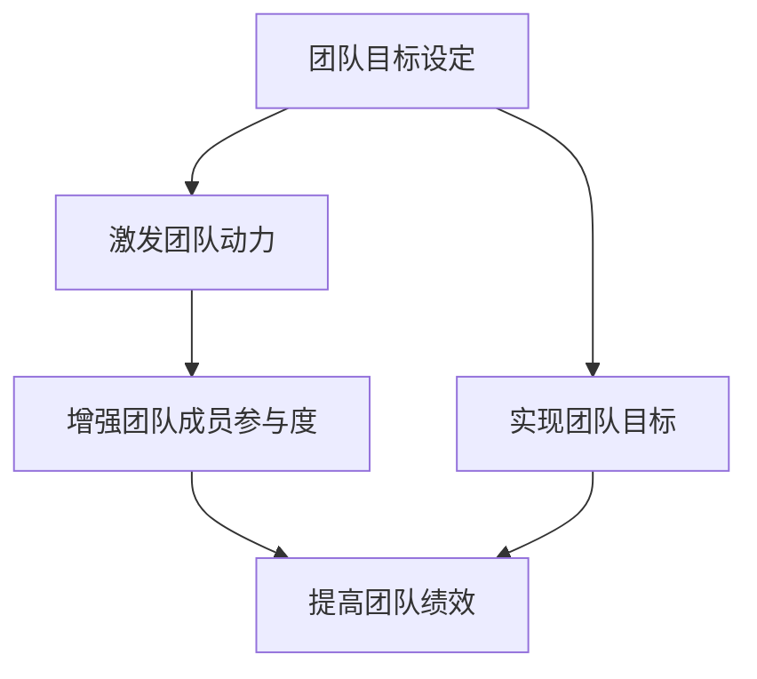
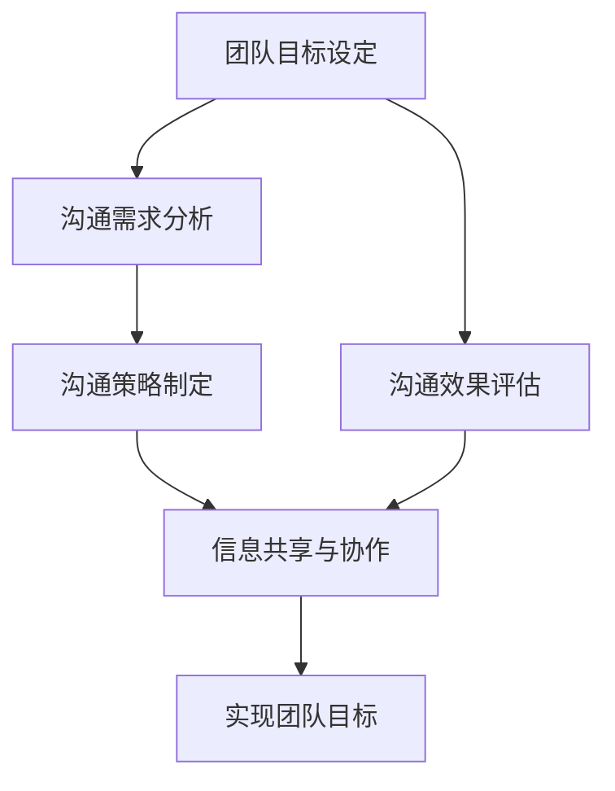
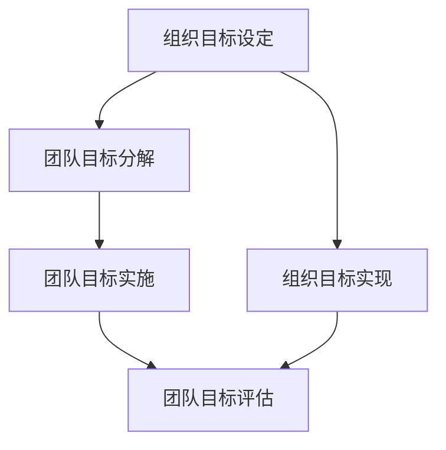
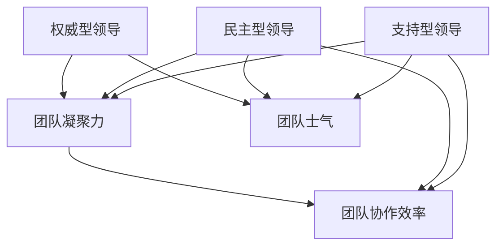

                 


### 团队建设：增进团队凝聚力的策略

#### 关键词
- 团队建设
- 凝聚力
- 沟通
- 领导力
- 激励
- 活动设计

#### 摘要
本文将探讨团队建设的重要性，以及如何通过有效的策略增进团队凝聚力。我们将从团队动力、团队沟通、领导力、团队目标、团队建设活动等方面逐步分析，并给出具体的实践建议。

## 目录

1. **背景介绍**
   - **团队建设的重要性**
   - **团队凝聚力的定义**
   - **团队建设的目标**

2. **核心概念与联系**
   - **团队动力**
   - **团队沟通**
   - **团队目标**
   - **领导力**

3. **团队动力**
   - **团队动力的来源**
   - **激发团队动力的策略**

4. **团队沟通**
   - **团队沟通的有效性**
   - **沟通障碍及其克服**

5. **团队目标**
   - **设定团队目标的重要性**
   - **确保团队目标与组织目标一致**

6. **领导力**
   - **领导力在团队建设中的作用**
   - **不同类型的领导风格**

7. **团队建设活动**
   - **团队建设活动的形式**
   - **实施策略**

8. **跨文化团队**
   - **跨文化团队的特点**
   - **跨文化团队建设策略**

9. **团队评估与改进**
   - **团队评估的方法**
   - **改进措施**

10. **案例研究**
    - **团队建设案例**

11. **总结**

---

#### 第一部分：背景介绍

##### 团队建设的重要性

在现代组织中，团队是完成复杂任务和实现目标的基本单元。随着全球化和信息技术的快速发展，团队工作已成为组织运作的常态。团队建设的重要性体现在以下几个方面：

1. **提高工作效率**：团队成员的协作和沟通能够快速解决问题，提高工作效率。
2. **促进创新**：多样的观点和知识能够激发创新思维，推动组织发展。
3. **增强员工满意度**：良好的团队氛围能够提高员工的工作满意度和忠诚度。
4. **提升组织绩效**：团队协作能够促进组织整体目标的实现。

##### 团队凝聚力的定义

团队凝聚力是指团队成员之间的相互吸引力，包括情感联系、信任、认同和合作意愿。一个高凝聚力的团队能够：

1. **提高团队成员的归属感**：成员更愿意为团队付出努力。
2. **增强团队协作效率**：成员更愿意分享信息和资源。
3. **提升团队稳定性**：成员更不容易离职，减少人员变动。

##### 团队建设的目标

团队建设的核心目标是提高团队凝聚力，具体包括：

1. **建立信任**：通过开放沟通和诚实反馈，建立团队成员之间的信任关系。
2. **明确目标**：确保团队成员对团队目标和组织目标有清晰的认识。
3. **提升技能**：通过培训和实践，提升团队成员的技能和知识水平。
4. **增强团队动力**：通过激励机制，激发团队成员的积极性和创造力。

---

在下一部分，我们将深入探讨团队建设的核心概念与联系。这将帮助我们更好地理解团队动力的来源、团队沟通的有效性、团队目标的设定以及领导力在团队建设中的作用。

---

#### 第二部分：核心概念与联系

##### 团队动力

团队动力是指推动团队成员积极参与团队活动的内在力量。它是团队凝聚力的重要基础，来源于团队成员的个人动机、团队目标、工作环境等因素。团队动力可以通过以下方式激发：

1. **明确目标**：团队成员对团队目标的清晰理解可以增强他们的参与度。
2. **激励机制**：适当的奖励和认可可以激励团队成员的努力。
3. **团队支持**：团队中的相互支持和鼓励可以增强成员的动力。

##### 团队沟通

团队沟通是团队协作的基础，有效沟通能够促进团队成员之间的理解与合作。团队沟通的有效性取决于以下几个方面：

1. **沟通渠道**：建立多种沟通渠道，如面对面会议、邮件、即时通讯工具等。
2. **沟通风格**：团队成员应该了解不同的沟通风格，以便更有效地进行交流。
3. **反馈机制**：建立有效的反馈机制，确保信息传递的准确性和及时性。

##### 团队目标

团队目标是指团队希望实现的具体结果，它是团队凝聚力的关键因素。设定团队目标的重要性在于：

1. **提供方向**：明确的目标可以为团队成员提供清晰的工作方向。
2. **促进协作**：共同的目标可以促进团队成员之间的协作。
3. **激励动力**：明确的目标可以激发团队成员的积极性和动力。

##### 领导力

领导力在团队建设中起着至关重要的作用。有效的领导力可以增强团队的凝聚力，促进团队目标的实现。不同类型的领导风格对团队凝聚力的影响如下：

1. **权威型领导**：通过严格的管理和制度来保证团队的稳定性和效率。
2. **民主型领导**：鼓励团队成员参与决策，提高团队的参与感和责任感。
3. **支持型领导**：关注团队成员的个人需求和职业发展，增强团队的凝聚力。

##### 概念之间的联系

团队动力、团队沟通、团队目标与领导力之间存在着密切的联系。团队动力需要通过有效的沟通来实现团队目标，而领导力则是推动团队建设和实现目标的关键因素。以下是一个简单的ER实体关系图，展示了这些概念之间的关系：

```mermaid
erDiagram
  Team_Dynamics ||--|{ Team_Communication }
  Team_Dynamics ||--|{ Team_Goals }
  Team_Dynamics ||--|{ Leadership }
  Team_Communication ||--|{ Team_Goals }
  Team_Communication ||--|{ Leadership }
  Team_Goals ||--|{ Leadership }
```

在下一部分，我们将探讨团队动力、团队沟通和团队目标的具体实现策略，以及领导力在其中的作用。

---

#### 第三部分：团队动力

##### 团队动力的来源

团队动力的来源可以分为内部和外部两个方面：

1. **内部动力**：
   - **个人动机**：团队成员的个人动机，如成就、荣誉、自我实现等，是团队动力的关键来源。
   - **个人技能与兴趣**：团队成员的技能和兴趣与其工作表现密切相关，能够提高他们的工作动力。

2. **外部动力**：
   - **奖励与认可**：适当的奖励和认可可以显著提高团队成员的动力。
   - **团队支持**：团队中的相互支持和鼓励可以增强成员的动力。

##### 激发团队动力的策略

1. **设定明确的目标**：
   - **短期目标**：设定短期目标，使团队成员能够看到自己的进展，从而提高他们的动力。
   - **长期目标**：确保团队成员对长期目标有清晰的认识，从而激发他们的长远动力。

2. **提供激励机制**：
   - **物质激励**：通过奖金、提成等物质奖励来激励团队成员。
   - **精神激励**：通过表彰、荣誉称号等精神奖励来激励团队成员。

3. **增强团队支持**：
   - **团队建设活动**：组织团队建设活动，增强团队成员之间的互信和合作。
   - **反馈机制**：建立有效的反馈机制，让团队成员知道他们的工作成果和改进方向。

4. **营造积极的工作环境**：
   - **公平竞争**：确保团队成员在公平的环境中竞争，避免不公平现象降低动力。
   - **自主性**：给予团队成员一定的自主权，让他们能够自主决策和解决问题。

#### 团队动力与团队目标的关系

团队动力与团队目标之间存在密切的关系。一个明确的团队目标可以为团队成员提供方向和动力，而强大的团队动力又可以推动团队目标的实现。以下是一个简单的Mermaid流程图，展示了团队动力与团队目标之间的关系：



在下一部分，我们将探讨团队沟通的重要性以及如何克服沟通障碍。

---

#### 第四部分：团队沟通

##### 团队沟通的重要性

团队沟通是团队协作的核心，它不仅影响团队的工作效率，还直接影响团队的凝聚力。有效的团队沟通能够：

1. **促进信息共享**：确保团队成员能够及时获取所需的信息，从而提高工作效率。
2. **增强团队协作**：通过有效沟通，团队成员可以更好地理解彼此的需求和目标，从而提高协作效率。
3. **解决冲突**：及时沟通可以帮助团队成员识别和解决潜在的问题，减少冲突的发生。
4. **提升团队士气**：良好的沟通可以增强团队成员的归属感和信任感，提升团队士气。

##### 沟通障碍及其克服

1. **沟通障碍的类型**：
   - **信息过滤**：团队成员可能会出于保护自己的利益而故意过滤信息。
   - **文化差异**：文化差异可能导致沟通误解和障碍。
   - **语言障碍**：语言不通或不熟悉专业术语可能会影响沟通效果。

2. **克服沟通障碍的策略**：
   - **建立开放沟通文化**：鼓励团队成员表达自己的观点和意见，建立开放和透明的沟通环境。
   - **使用多种沟通方式**：结合面对面沟通、电子邮件、即时通讯等多种沟通方式，以满足团队成员的不同需求。
   - **提供沟通培训**：定期为团队成员提供沟通技巧培训，提高他们的沟通能力。
   - **促进跨文化理解**：鼓励团队成员学习和尊重不同的文化，以减少文化差异带来的沟通障碍。

##### 团队沟通的技巧

1. **倾听**：积极倾听是有效沟通的关键，确保理解对方的观点和需求。
2. **明确表达**：用简单清晰的语言表达自己的想法，避免产生歧义。
3. **反馈**：及时给予反馈，确保信息的准确传递和双向沟通。
4. **非语言沟通**：注意肢体语言和面部表情，这些非语言信息同样重要。

#### 团队沟通与团队目标的关系

有效的团队沟通是实现团队目标的关键。以下是一个简单的Mermaid流程图，展示了团队沟通与团队目标之间的关系：



在下一部分，我们将讨论团队目标的设定及其与组织目标的关联。

---

#### 第五部分：团队目标

##### 设定团队目标的重要性

设定团队目标是团队建设的重要环节，它能够为团队成员提供清晰的方向和目标，从而提高团队的凝聚力和工作效率。设定团队目标的重要性体现在以下几个方面：

1. **提供方向**：明确的团队目标可以为团队成员提供明确的工作方向，避免工作中的迷茫和困惑。
2. **促进协作**：共同的目标可以促进团队成员之间的协作，确保每个人都为实现团队目标而努力。
3. **激发动力**：明确的团队目标可以激发团队成员的积极性和动力，提高他们的工作热情。
4. **评估绩效**：团队目标为评估团队成员的工作绩效提供了依据，有助于及时发现和解决问题。

##### 确保团队目标与组织目标一致

团队目标与组织目标的一致性是团队成功的关键。以下策略有助于确保团队目标与组织目标的一致：

1. **明确组织目标**：首先，组织需要明确其整体目标，这些目标应该具有可操作性和具体性。
2. **分解目标**：将组织目标分解为可操作的团队目标，确保每个团队都能为实现组织目标做出贡献。
3. **沟通与协调**：定期与团队成员沟通，确保他们对团队目标有清晰的认识，并及时协调解决目标实现过程中出现的问题。
4. **目标调整**：根据组织目标的变化和外部环境的变化，适时调整团队目标，确保其与组织目标保持一致。

##### 团队目标的具体实施步骤

1. **目标设定**：根据组织目标，制定具体的团队目标，确保目标具有挑战性和可实现性。
2. **目标分解**：将团队目标分解为具体的子目标和行动计划，明确每个成员的职责和任务。
3. **目标反馈**：定期收集团队成员对目标实现的反馈，及时调整目标和计划，确保目标的实现。
4. **目标评估**：在目标实现后，进行评估和总结，分析目标实现的效果和不足，为未来的目标设定提供参考。

#### 团队目标与组织目标的关系

团队目标与组织目标之间存在密切的关系。以下是一个简单的Mermaid流程图，展示了团队目标与组织目标之间的关系：



在下一部分，我们将探讨领导力在团队建设中的作用，以及不同类型的领导风格对团队凝聚力的影响。

---

#### 第六部分：领导力

##### 领导力在团队建设中的作用

领导力是团队建设中不可或缺的因素，有效的领导力能够推动团队目标的实现，增强团队的凝聚力。领导力在团队建设中的作用体现在以下几个方面：

1. **确立方向**：领导力为团队提供明确的方向和目标，确保团队成员知道他们的工作意义和目标。
2. **激发动力**：领导力能够激发团队成员的积极性和创造力，提高团队的士气和工作效率。
3. **协调资源**：领导力能够协调团队内外部的资源，为团队目标的实现提供支持。
4. **解决冲突**：领导力能够及时解决团队内部的冲突，维护团队的稳定和和谐。

##### 不同类型的领导风格

1. **权威型领导**：
   - **特点**：领导者掌握决策权，团队成员遵循领导者的指示。
   - **优缺点**：优点是能够快速做出决策，缺点是可能会抑制团队成员的积极性和创造力。
   - **适用场景**：适用于紧急情况和需要快速决策的团队。

2. **民主型领导**：
   - **特点**：领导者鼓励团队成员参与决策，尊重团队成员的意见。
   - **优缺点**：优点是能够增强团队成员的参与感和责任感，缺点是决策过程可能较慢。
   - **适用场景**：适用于需要集体智慧和多样观点的团队。

3. **支持型领导**：
   - **特点**：领导者关注团队成员的个人需求和职业发展，提供必要的支持和资源。
   - **优缺点**：优点是能够增强团队成员的归属感和信任感，缺点是可能过度关注个人需求而忽视团队目标。
   - **适用场景**：适用于需要高度协作和团队成员需要支持的团队。

##### 领导风格与团队凝聚力

不同的领导风格对团队凝聚力有着不同的影响。以下是一个简单的Mermaid流程图，展示了领导风格与团队凝聚力之间的关系：



在下一部分，我们将探讨团队建设活动的形式和实施策略。

---

#### 第七部分：团队建设活动

##### 团队建设活动的形式

团队建设活动是增进团队凝聚力的重要手段，通过这些活动，团队成员可以增进了解，增强协作，提升团队士气。常见的团队建设活动形式包括：

1. **团队拓展训练**：通过户外拓展活动，如攀岩、野外生存等，增强团队成员的团队合作能力和信任感。
2. **团队建设研讨会**：通过主题研讨会、工作坊等形式，讨论团队面临的挑战和解决方案，促进团队成员之间的交流。
3. **团队绩效竞赛**：通过团队间的竞赛，激发团队成员的竞争意识和团队精神。
4. **团队文化建设**：通过文化活动、团建活动等，强化团队的文化认同和凝聚力。

##### 实施策略

1. **活动设计**：
   - **目标明确**：明确团队建设活动的目标，确保活动与团队目标的一致性。
   - **内容丰富**：设计多样化的活动内容，以满足团队成员的不同需求和兴趣。
   - **参与度**：鼓励团队成员积极参与，确保活动的参与度和效果。

2. **活动实施**：
   - **时间安排**：合理安排活动时间，避免影响团队成员的正常工作。
   - **资源准备**：确保活动所需的资源和设施准备充分，确保活动的顺利进行。
   - **反馈机制**：活动结束后，收集团队成员的反馈，及时总结经验教训。

3. **效果评估**：
   - **团队反馈**：通过问卷调查、访谈等方式，了解团队成员对活动的反馈和评价。
   - **行为观察**：观察团队成员在活动后的行为变化，评估活动对团队凝聚力和工作效率的影响。

#### 团队建设活动的案例

1. **案例一**：某公司通过定期组织团队拓展训练，增强了团队成员之间的信任和协作能力，提高了团队的整体绩效。
2. **案例二**：某团队通过组织团队建设研讨会，解决了团队内部的沟通障碍，提高了团队的协作效率和创新能力。

在下一部分，我们将探讨跨文化团队的建设策略。

---

#### 第八部分：跨文化团队

##### 跨文化团队的特点

跨文化团队是由来自不同文化背景的成员组成的团队。这种团队在全球化背景下日益普遍，具有以下特点：

1. **多样性**：团队成员来自不同的国家、地区，具有不同的语言、价值观和文化习俗。
2. **复杂性**：由于文化差异，跨文化团队在沟通、协作和管理上面临更多挑战。
3. **潜力**：跨文化团队的多样性可以带来丰富的观点和知识，提高团队的创新能力。

##### 跨文化团队的挑战

1. **沟通障碍**：语言障碍和文化差异可能导致沟通误解和障碍，影响团队的协作效率。
2. **文化冲突**：不同的文化背景可能导致价值观和行为习惯的差异，引发冲突和矛盾。
3. **管理难题**：如何有效地管理跨文化团队，平衡不同文化的需求和期望，是管理者的挑战。

##### 跨文化团队建设策略

1. **文化敏感性培训**：为团队成员提供文化敏感性培训，提高他们对不同文化的理解和尊重。
2. **建立共同价值观**：通过团队建设活动，建立共同的价值观和团队目标，增强团队成员的归属感。
3. **鼓励开放沟通**：建立开放和透明的沟通渠道，鼓励团队成员分享观点和反馈，减少误解和冲突。
4. **平衡管理**：管理者应该具备跨文化管理能力，平衡不同文化的需求和期望，确保团队的和谐与稳定。

#### 跨文化团队案例分析

1. **案例一**：某跨国公司通过定期组织跨文化培训和文化交流活动，成功增强了团队成员的文化理解，提高了团队的协作效率。
2. **案例二**：某国际团队通过建立跨文化沟通机制，如定期召开跨文化会议，有效解决了沟通障碍和文化冲突，实现了高效协作。

在下一部分，我们将探讨团队评估的方法和持续改进的策略。

---

#### 第九部分：团队评估与持续改进

##### 团队评估的重要性

团队评估是团队建设中至关重要的一环，它能够帮助组织了解团队的表现，识别团队的优势和不足，从而制定改进策略。团队评估的重要性体现在以下几个方面：

1. **绩效评估**：通过团队评估，可以评估团队的整体绩效和成员的个人绩效，为绩效管理和薪酬分配提供依据。
2. **问题诊断**：团队评估可以帮助组织识别团队中存在的问题，如沟通障碍、目标不明确等，从而制定针对性的改进措施。
3. **改进方向**：团队评估为组织提供了改进团队建设的方向，帮助组织更好地实现团队目标。

##### 团队评估的方法

1. **问卷调查**：通过设计问卷，收集团队成员对团队绩效、团队氛围、团队目标等方面的反馈，了解团队的整体状况。
2. **访谈**：通过访谈团队成员，深入了解他们对团队的看法和建议，获取更细致的信息。
3. **行为观察**：通过观察团队成员在工作中的表现，评估团队的工作效率和协作情况。
4. **绩效指标**：设定具体的绩效指标，如项目完成时间、项目质量、团队协作效率等，通过这些指标评估团队的表现。

##### 持续改进的策略

1. **反馈机制**：建立有效的反馈机制，确保团队成员能够及时了解团队的表现和改进方向。
2. **培训与发展**：根据评估结果，为团队成员提供培训和发展机会，提高他们的技能和知识水平。
3. **改进计划**：制定具体的改进计划，明确改进的目标、方法和时间表，确保改进措施的落实。
4. **监督与评估**：对改进措施的实施进行监督和评估，确保改进效果的实现。

#### 团队评估与持续改进的案例

1. **案例一**：某公司通过定期进行团队评估，及时发现团队中的问题，并采取有效的改进措施，成功提升了团队的绩效和凝聚力。
2. **案例二**：某团队通过持续的团队评估和改进，解决了沟通障碍和目标不明确的问题，实现了团队目标的达成。

在下一部分，我们将通过实际案例，展示团队建设策略在不同组织中的应用和效果。

---

#### 第十部分：案例研究

##### 案例一：某公司的团队建设实践

某公司是一家跨国科技公司，为了提高团队的凝聚力和工作效率，公司采取了以下团队建设策略：

1. **团队拓展训练**：公司定期组织团队拓展训练，如攀岩、徒步等，增强团队成员之间的信任和协作能力。
2. **跨文化培训**：公司为跨国团队成员提供文化敏感性培训，提高他们对不同文化的理解和尊重。
3. **团队目标设定**：公司明确团队目标，确保团队目标与组织目标一致，并通过定期会议和反馈机制，确保目标的实现。

通过这些策略，公司成功提高了团队的凝聚力和工作效率，团队的绩效和员工满意度显著提升。

##### 案例二：跨国公司的团队建设挑战与解决方案

某跨国公司面临团队建设中的挑战，如文化差异、沟通障碍和远程协作等问题。为了解决这些问题，公司采取了以下策略：

1. **建立跨文化团队**：公司组建了跨文化团队，由来自不同国家的团队成员组成，共同工作，增强文化理解。
2. **在线协作工具**：公司采用在线协作工具，如Slack、Trello等，提高远程团队的协作效率。
3. **定期沟通会议**：公司定期召开视频会议，确保团队成员之间的沟通和信息共享。

通过这些策略，公司成功解决了跨文化团队中的问题，提高了团队的协作效率和凝聚力。

##### 案例三：非营利组织的团队建设经验

某非营利组织通过以下策略，成功增强了团队的凝聚力和工作效率：

1. **共同价值观**：组织成员共同制定价值观，确保团队成员对组织目标的认同。
2. **培训与发展**：定期为团队成员提供培训和发展机会，提高他们的技能和知识水平。
3. **团队建设活动**：组织各种团队建设活动，如志愿服务、团队拓展训练等，增强团队成员之间的联系。

通过这些策略，组织成功提高了团队的凝聚力和工作效率，实现了组织目标的达成。

---

#### 总结

本文通过探讨团队建设的重要性、核心概念与联系、团队动力、团队沟通、团队目标、领导力、团队建设活动、跨文化团队、团队评估与持续改进以及实际案例研究，展示了如何增进团队凝聚力。团队建设不仅能够提高工作效率和创新能力，还能增强员工的归属感和满意度，为组织带来长期的价值。

在实际应用中，组织需要根据自身情况，灵活运用各种团队建设策略，不断评估和改进团队建设效果。通过有效的团队建设，组织可以打造一个高效、协作、充满活力的团队，实现组织的长期发展目标。

#### 参考文献

1. Tannen, D. (1995). The Power of Talk: Who Gets Heard and Why. Harvard Business Review.
2. Katzenbach, J. R., & Smith, D. K. (1993). The Wisdom of Teams. Harvard Business Review.
3. Belbin, R. M. (1981). Management Teams: Why They Underperform and How They Can Achieve Their Potential. Wiley.
4. Avolio, B. J., & Yammarino, F. J. (1999). Transformational and transactional leadership: A meta-analytic comparison through the lens of vertical and horizontal differentiation. Leadership Quarterly, 10(2), 115-139.
5. Liden, R. C., & Maslyn, J. M. (2008). Leadership and team development. In M. D. Murphy & R. W. Wrzesniewski (Eds.), The Oxford Handbook of Leadership and Organization Behavior (pp. 442-468). Oxford University Press.
6. Shamsi, G., & Shamsi, A. (2012). Interpersonal communication: A communication skills guide for nurses. Springer Publishing Company.
7. Cross, R., & Parker, J. (2004). Team Leadership: From Management to Coaching. McGraw-Hill Education.

#### 作者信息

作者：AI天才研究院/AI Genius Institute & 禅与计算机程序设计艺术 /Zen And The Art of Computer Programming

