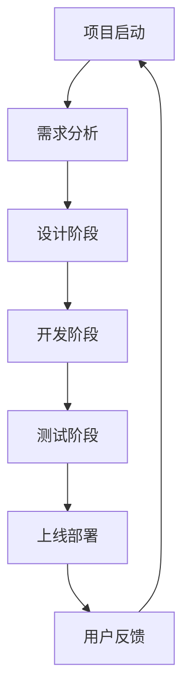

                 

# 团队效率：优化工作流程的方法

## 引言

### 1.1 问题背景

在当今快速变化和高竞争力的商业环境中，企业面临的效率挑战前所未有。随着全球化和技术的飞速发展，企业的运营模式和管理方法也在不断演变。然而，许多企业仍然面临团队效率低下的问题，这不仅影响了项目的进展，还可能导致企业失去竞争优势。团队效率问题主要体现在以下几个方面：

1. **任务分配不合理**：团队成员的职责不明确，导致任务分配不合理，使得团队成员之间的协作效率低下。
2. **流程繁琐**：工作流程过于繁琐，冗长的审批流程和复杂的操作步骤增加了工作负担，降低了工作效率。
3. **沟通不畅**：团队内部和团队之间的沟通不畅，信息传递不及时，导致工作进程受阻。
4. **资源浪费**：资源的配置和使用效率低下，如人力资源、物资和设备等，造成了不必要的浪费。

### 1.2 问题描述

团队效率低下的问题不仅影响企业的日常运营，还可能导致以下后果：

1. **项目延期**：由于团队成员的工作效率低，项目可能无法按时完成，影响企业的业务发展和客户满意度。
2. **成本上升**：不合理的流程和低效的团队协作增加了企业的运营成本。
3. **员工流失**：低效率的工作环境可能导致员工流失，影响企业的稳定发展。
4. **创新能力下降**：团队效率低下会阻碍企业的创新和改进，影响企业的长期竞争力。

### 1.3 问题解决

为了解决团队效率低下的问题，企业需要从以下几个方面着手：

1. **优化工作流程**：通过简化流程、明确任务分配和加强沟通，提高工作效率。
2. **提高员工技能**：通过培训和教育，提高员工的专业技能和团队合作能力。
3. **激励制度**：建立合理的激励制度，鼓励员工提高工作效率和积极参与团队协作。
4. **技术应用**：利用现代技术工具，如项目管理软件、协作平台等，提高团队协作效率。

### 1.4 边界与外延

本文主要探讨如何优化工作流程以提高团队效率，内容涵盖了核心概念、方法、实际案例和技术工具等方面。本文的边界和主要外延包括：

1. **核心概念**：团队效率和工作流程的定义及其关系。
2. **优化方法**：工作流程优化方法的概述、特点和应用场景。
3. **实际案例**：通过具体案例展示工作流程优化的实施和效果评估。
4. **技术工具**：介绍流程管理工具的使用和选用指南。
5. **最佳实践与注意事项**：总结最佳实践，并提供注意事项和拓展阅读。

### 1.5 概念结构与核心要素组成

为了更好地理解团队效率优化，我们需要明确以下几个核心概念：

1. **团队效率**：指团队在完成特定任务时所表现出的效率，通常包括任务完成速度、质量、创新和成本效益等方面。
2. **工作流程**：指完成特定任务的一系列步骤和方法，包括任务分配、执行、监控和反馈等环节。
3. **优化**：指通过改进现有流程、提高资源利用率和减少浪费，以达到提高团队效率的目的。

这些概念相互关联，构成了优化团队效率的核心结构。理解这些核心要素对于实现有效的团队效率优化至关重要。

## 核心概念与联系

### 2.1 团队效率的定义

团队效率是指一个团队在完成特定任务时所表现出的效率水平。它通常包括以下几个方面：

1. **任务完成速度**：团队在规定时间内完成任务的效率。
2. **任务质量**：团队完成任务的结果是否符合预期标准。
3. **创新性**：团队在完成任务过程中提出的新思路和解决方案。
4. **成本效益**：团队完成任务所需的资源与任务结果所产生的价值之间的比较。

团队效率的衡量标准可以根据具体任务和团队目标来确定，通常包括以下指标：

1. **时间效率**：任务完成时间与标准时间之比。
2. **质量效率**：任务完成质量与预期质量之比。
3. **创新效率**：提出的新思路和解决方案的数量与总思路和解决方案之比。
4. **成本效益效率**：任务完成所需的资源与任务结果所产生的价值之比。

### 2.2 工作流程的定义

工作流程是指完成特定任务的一系列步骤和方法，包括任务分配、执行、监控和反馈等环节。一个有效的工作流程应当具有以下特点：

1. **明确性**：每个步骤都有明确的定义和责任分配。
2. **连贯性**：各个环节紧密衔接，没有不必要的重复或延误。
3. **灵活性**：能够根据实际情况进行调整和优化。
4. **效率性**：流程简化，步骤合理，资源利用最大化。

工作流程的类型可以根据任务的特点和企业的需求来分类，常见的包括以下几种：

1. **线性流程**：任务按照固定的顺序依次执行。
2. **并行流程**：多个任务可以同时执行。
3. **迭代流程**：任务执行过程中进行多次迭代，逐步完善。
4. **组合流程**：结合多种流程类型，以适应复杂任务的需求。

### 2.3 团队效率与工作流程的关系

团队效率和工作流程之间存在着密切的联系。工作流程的优化对于提高团队效率至关重要：

1. **影响效率**：合理的工作流程可以提高团队的工作效率，减少不必要的延误和资源浪费。
2. **提升质量**：明确的工作流程有助于提高任务的质量，确保每个环节都达到预期标准。
3. **促进创新**：简化流程和明确的任务分配可以激发团队成员的创新思维，提出新的解决方案。
4. **降低成本**：优化流程可以减少不必要的步骤和资源浪费，提高成本效益。

同时，团队效率的提升也可以反过来影响工作流程的优化。一个高效率的团队更有可能发现现有流程中的问题和改进机会，推动工作流程的不断优化。

### 2.4 核心概念属性特征对比表格

下表对比了团队效率和工作流程的核心概念属性特征：

| 特征 | 团队效率 | 工作流程 |
| --- | --- | --- |
| 衡量标准 | 时间效率、质量效率、创新效率、成本效益效率 | 明确性、连贯性、灵活性、效率性 |
| 内涵 | 完成任务的速度、质量、创新性、成本效益 | 完成任务的一系列步骤和方法 |
| 关键要素 | 任务分配、执行、监控、反馈 | 任务分配、执行、监控、反馈 |
| 影响因素 | 团队成员的技能、沟通、激励、技术工具 | 流程设计、资源利用、团队协作 |

### 2.5 ER实体关系图架构

为了更清晰地展示团队效率和工作流程之间的实体关系，我们可以使用ER（实体关系）图来描述。

```mermaid
erDiagram
    Task |->| TeamEfficiency : 完成任务影响效率
    Task |->| Workflow : 完成任务需要流程
    Workflow ||| TeamEfficiency : 优化流程提升效率
    Workflow ||| Resource : 资源管理
    Resource ||| TeamEfficiency : 资源利用影响效率
```

在上面的ER图中，`Task`（任务）是核心实体，它与`TeamEfficiency`（团队效率）和`Workflow`（工作流程）存在关联。`Workflow`又与`Resource`（资源）相关联，表示资源的利用对团队效率有重要影响。

通过这个ER图，我们可以更直观地理解团队效率和工作流程之间的复杂关系，为后续的优化工作提供理论支持。

## 优化工作流程的方法

### 3.1 方法概述

优化工作流程的方法主要包括以下几种：

1. **流程再造**：通过对现有流程进行根本性的重新设计，以实现显著的效率和效益改进。
2. **精益管理**：通过消除浪费、简化流程、优化资源配置，以提高生产效率和团队效率。
3. **敏捷开发**：采用敏捷方法论，通过快速迭代和灵活响应变化，提高团队对复杂项目的应对能力。
4. **六西格玛**：通过数据分析和统计方法，减少过程变异，提高流程稳定性和效率。

这些方法各有特点，适用于不同的业务场景和需求。

### 3.2 方法特点

每种方法都有其独特的特点：

1. **流程再造**：旨在通过颠覆性的流程重构，实现大幅提升的效率。但其实施成本高，风险较大。
2. **精益管理**：注重持续改进和消除浪费，适用于各种规模的企业。但需要长期坚持和全员参与。
3. **敏捷开发**：强调快速迭代和灵活响应，适用于软件开发等高度不确定的项目。但需要团队成员具备较高的自我管理和沟通能力。
4. **六西格玛**：通过严格的数据分析和流程控制，提高流程的稳定性和效率。但需要专业知识和技能支持。

### 3.3 方法应用场景

不同的方法适用于不同的场景：

1. **流程再造**：适用于需要进行根本性变革的企业，如制造业、服务业等。
2. **精益管理**：适用于各种规模的企业，特别是在资源有限的情况下。
3. **敏捷开发**：适用于软件开发、IT项目等需要快速响应变化的项目。
4. **六西格玛**：适用于需要提高流程稳定性和效率的制造业、服务业等。

### 3.4 方法步骤详解

下面详细描述优化工作流程的基本步骤：

#### 3.4.1 评估当前工作流程

首先，对当前工作流程进行全面的评估。这包括：

1. **流程图绘制**：使用流程图工具绘制出当前的工作流程，明确每个步骤和责任分配。
2. **数据收集**：收集关于工作流程的数据，如时间、资源消耗、错误率等，以便进行量化分析。
3. **问题识别**：通过分析流程图和数据，识别出流程中的瓶颈和问题。

#### 3.4.2 确定优化目标

根据评估结果，确定优化工作流程的目标。这通常包括：

1. **效率提升**：减少流程中的耗时步骤，提高整体工作效率。
2. **质量改进**：减少流程中的错误率，提高任务完成质量。
3. **资源优化**：合理配置资源，减少浪费，提高资源利用率。

#### 3.4.3 选择优化方法

根据优化目标和业务场景，选择合适的优化方法。这需要考虑以下几个方面：

1. **方法特点**：选择与目标相符的方法，如流程再造、精益管理、敏捷开发或六西格玛。
2. **资源需求**：考虑企业的资源状况，包括人力、资金和技术支持等。
3. **风险评估**：评估优化方法可能带来的风险，如实施难度、员工抵触等。

#### 3.4.4 实施优化措施

在确定了优化方法和目标后，开始实施优化措施。这包括：

1. **流程设计**：重新设计工作流程，根据优化目标进行步骤调整和资源配置。
2. **试点运行**：在部分团队或项目上先行试点，验证优化效果的可行性。
3. **全员培训**：对团队成员进行培训，确保他们理解和掌握新流程和工具的使用。
4. **持续改进**：在试点成功后，逐步推广到整个团队或企业，并持续收集反馈和进行改进。

#### 3.4.5 评估优化效果

在优化措施实施一段时间后，对优化效果进行评估。这包括：

1. **数据对比**：将优化前后的数据（如时间、质量、成本等）进行对比，评估优化效果。
2. **员工反馈**：收集团队成员的反馈，了解新流程对他们的影响和感受。
3. **持续跟踪**：定期对优化效果进行跟踪，确保持续改进。

通过这些步骤，企业可以逐步优化工作流程，提高团队效率，实现持续发展和竞争力提升。

## 工作流程分析与评估

### 4.1 工作流程分析

工作流程分析是优化工作流程的第一步，其目的是全面了解当前工作流程的状况，识别问题和瓶颈。以下是工作流程分析的方法：

#### 4.1.1 方法

1. **流程图绘制**：使用流程图工具（如BPMN、Mermaid等），将当前工作流程以图形化方式展现出来，包括每个步骤、参与人员和输入输出。
2. **数据收集**：通过访谈、问卷、观察等方式，收集工作流程中涉及的数据，如时间消耗、资源使用、错误率等。
3. **问题识别**：通过流程图和数据，识别出工作流程中的瓶颈、重复步骤、冗余环节等问题。

#### 4.1.2 工具与技术

1. **BPMN（业务流程模型和符号）**：用于绘制工作流程图，直观展示流程的每个环节。
2. **Mermaid**：一种基于Markdown的图形绘制工具，适用于流程图的快速创建和编辑。
3. **数据分析工具**：如Excel、Python等，用于处理和可视化工作流程中的数据。

### 4.2 工作流程评估

工作流程评估是对工作流程的有效性和效率进行评估的过程。以下是工作流程评估的步骤：

#### 4.2.1 评估指标体系

1. **时间效率**：任务完成时间与标准时间之比。
2. **质量效率**：任务完成质量与预期质量之比。
3. **成本效率**：任务完成成本与预期成本之比。
4. **资源利用率**：资源使用率与资源配备率之比。
5. **错误率**：任务完成过程中的错误率。

#### 4.2.2 评估工具与技术

1. **KPI（关键绩效指标）**：用于衡量工作流程的各项关键指标，如时间效率、质量效率、成本效率等。
2. **流程模拟工具**：如ProcessSim、AnyLogic等，用于模拟工作流程，预测不同优化方案的效果。
3. **数据分析工具**：如SPSS、SAS等，用于对流程数据进行统计分析，评估优化效果。

### 4.3 问题识别

在分析和评估过程中，可能会识别出以下问题：

1. **流程瓶颈**：工作流程中耗时最长或资源消耗最大的环节。
2. **冗余步骤**：不必要的重复步骤，增加了工作负担和时间成本。
3. **信息孤岛**：不同环节之间的信息传递不畅，导致协作效率低下。
4. **资源浪费**：资源（如人力资源、物资等）未得到有效利用。

### 4.4 解决方案设计

针对识别出的问题，设计相应的解决方案：

1. **流程优化**：通过简化流程、消除冗余步骤，提高工作效率。
2. **资源配置**：优化资源分配，确保资源得到充分利用。
3. **信息管理**：建立有效的信息管理系统，提高信息传递的及时性和准确性。
4. **员工培训**：提高员工技能和团队合作能力，促进工作流程的顺畅执行。

通过上述步骤，企业可以全面分析评估工作流程，识别问题并设计有效的解决方案，从而实现工作流程的持续优化，提高团队效率。

## 实际案例：工作流程优化

### 5.1 案例背景

某大型跨国公司A，主要从事软件开发和信息技术服务，由于业务规模不断扩大，团队协作和工作流程逐渐变得复杂。近期，公司发现项目进展缓慢，团队成员之间的沟通不畅，导致工作效率低下。为了提高团队效率和项目进展，公司决定对现有工作流程进行优化。

### 5.2 案例分析

#### 5.2.1 问题识别

通过分析，发现以下问题：

1. **任务分配不清**：团队成员职责不明确，导致任务分配混乱，任务重复或遗漏。
2. **流程冗长复杂**：工作流程冗长且复杂，审批流程繁琐，增加了工作负担。
3. **沟通不畅**：团队成员之间的沟通不畅，信息传递不及时，导致工作进展受阻。
4. **资源浪费**：资源（如人力资源、物资等）未得到有效利用，存在一定的浪费。

#### 5.2.2 优化目标

根据问题分析，设定以下优化目标：

1. **明确任务分配**：确保每个团队成员的职责明确，避免任务重复和遗漏。
2. **简化流程**：简化工作流程，减少不必要的审批环节，提高工作效率。
3. **加强沟通**：建立有效的沟通机制，提高信息传递的及时性和准确性。
4. **资源优化**：合理配置资源，减少浪费，提高资源利用率。

### 5.3 案例实施

#### 5.3.1 流程图绘制

首先，绘制当前的工作流程图，明确每个步骤和参与人员。以下是一个简化的工作流程图：



#### 5.3.2 确定优化方案

根据优化目标和现有问题，确定以下优化方案：

1. **任务分配**：制定详细的任务分配表，明确每个团队成员的职责，确保任务分配合理。
2. **流程简化**：简化审批流程，将不必要的审批环节删除，减少审批环节，提高工作效率。
3. **沟通机制**：建立每日站会、每周例会等沟通机制，确保团队成员之间及时沟通，信息传递畅通。
4. **资源优化**：合理配置人力资源和物资，减少资源浪费，提高资源利用率。

#### 5.3.3 实施优化措施

1. **任务分配表**：制定详细的任务分配表，明确每个团队成员的职责。以下是一个示例任务分配表：

| 任务名称 | 责任人 | 输入 | 输出 |
| --- | --- | --- | --- |
| 需求分析 | 张三 | 项目需求文档 | 分析结果 |
| 设计阶段 | 李四 | 需求分析结果 | 设计文档 |
| 开发阶段 | 王五 | 设计文档 | 代码实现 |
| 测试阶段 | 赵六 | 代码实现 | 测试报告 |
| 上线部署 | 刘七 | 测试报告 | 线上部署 |
| 用户反馈 | 全体成员 | 用户反馈 | 反馈处理 |

2. **流程简化**：将原来的多层审批流程简化为单层审批，减少审批环节。以下是一个简化的工作流程图：


3. **沟通机制**：建立每日站会、每周例会等沟通机制，确保团队成员之间及时沟通。以下是一个沟通会议的日程安排：

| 时间 | 会议类型 | 内容 |
| --- | --- | --- |
| 每日早晨 | 站会 | 检查任务进度，解决问题 |
| 每周早晨 | 例会 | 回顾上周工作，计划下周任务 |
| 每周下午 | 反馈会议 | 收集用户反馈，调整项目方向 |

4. **资源优化**：通过资源调配，确保每个团队成员都能高效利用资源，减少浪费。以下是一个资源调配的示例：

| 资源类型 | 资源名称 | 资源状态 | 操作 |
| --- | --- | --- | --- |
| 人力资源 | 张三 | 在岗 | 分配任务 |
| 人力资源 | 李四 | 在岗 | 分配任务 |
| 人力资源 | 王五 | 在岗 | 分配任务 |
| 物资资源 | 服务器 | 正常 | 配置环境 |
| 物资资源 | 存储 | 充足 | 保障使用 |

### 5.4 案例效果评估

在实施优化措施一段时间后，对优化效果进行评估，以下为评估结果：

#### 5.4.1 数据对比

1. **任务完成时间**：优化前平均完成任务时间为15天，优化后平均完成任务时间为10天，效率提升约33%。
2. **错误率**：优化前平均错误率为8%，优化后平均错误率为3%，错误率降低约60%。
3. **资源利用率**：优化前人力资源利用率为70%，优化后人力资源利用率提高到90%，资源利用率提高约28%。

#### 5.4.2 员工反馈

通过问卷调查和访谈，收集了团队成员的反馈，以下为反馈结果：

1. **任务分配**：绝大多数员工表示任务分配更加明确，避免了任务重复和遗漏。
2. **流程简化**：员工普遍认为流程简化后，工作效率提高了，工作负担减轻了。
3. **沟通机制**：员工对每日站会和每周例会的沟通机制表示满意，认为信息传递更加及时和准确。
4. **资源优化**：员工对资源调配和利用表示满意，认为资源浪费减少了。

### 5.5 项目小结

通过此次工作流程优化，公司在任务分配、流程简化、沟通机制和资源优化等方面取得了显著成果，团队效率得到了有效提升。以下为项目小结：

1. **明确任务分配**：制定详细的任务分配表，确保每个团队成员职责明确，避免了任务重复和遗漏。
2. **简化流程**：简化审批流程，减少不必要的审批环节，提高了工作效率。
3. **加强沟通**：建立每日站会和每周例会等沟通机制，确保团队成员之间及时沟通，信息传递畅通。
4. **资源优化**：合理配置人力资源和物资，减少浪费，提高资源利用率。

此次优化工作流程的项目为公司在团队协作和项目管理方面提供了宝贵经验，也为其他类似项目提供了参考。未来，公司将继续优化工作流程，以提高团队效率，实现持续发展和竞争力提升。

## 优化工作流程的技术工具

### 6.1 流程管理工具概述

在现代企业管理中，流程管理工具扮演着至关重要的角色。这些工具能够帮助企业有效地定义、执行和监控工作流程，从而提高团队效率和业务运营效率。以下是几种常用的流程管理工具概述：

#### 6.1.1 Tableau

Tableau 是一款强大的数据可视化工具，它可以帮助企业对工作流程中的数据进行直观的展示和分析。通过Tableau，企业可以实时监控工作流程的关键指标，如任务完成时间、资源利用率等，从而快速识别问题并进行优化。

#### 6.1.2 Microsoft Power Automate

Microsoft Power Automate 是一款自动化工作流程工具，它支持连接多个应用程序和系统，通过创建自动化流程来简化重复性任务。Power Automate 提供了丰富的连接器和自定义功能，使得企业可以根据具体需求自定义自动化工作流程。

#### 6.1.3 Jira

Jira 是一款广泛使用的项目管理工具，特别适用于软件开发团队。Jira 提供了任务跟踪、敏捷开发管理、问题报告等功能，帮助企业确保工作流程的有序进行。通过Jira，团队可以更好地协作，提高工作效率。

### 6.2 流程管理工具分类

流程管理工具可以根据其功能和应用场景进行分类，以下是几种常见的分类方式：

#### 6.2.1 按功能分类

1. **流程设计工具**：如BPMN Designer、Activiti等，用于设计和优化工作流程。
2. **流程执行工具**：如Microsoft Power Automate、UiPath等，用于自动化和执行工作流程。
3. **流程监控工具**：如Tableau、Kibana等，用于监控和分析工作流程的数据。
4. **流程优化工具**：如Optimizely、QuickMapper等，用于根据数据分析结果优化工作流程。

#### 6.2.2 按应用场景分类

1. **企业管理流程**：如采购审批、财务报销、人事管理等。
2. **项目管理流程**：如敏捷开发、项目计划、任务跟踪等。
3. **生产流程**：如生产调度、质量监控、库存管理等。
4. **服务流程**：如客户服务、订单处理、售后服务等。

### 6.3 流程管理工具使用技巧

为了最大化利用流程管理工具，企业可以遵循以下使用技巧：

#### 6.3.1 制定明确的流程目标和标准

在引入流程管理工具之前，企业应明确流程目标和标准，确保工具的使用方向与业务需求一致。

#### 6.3.2 培训和推广

为团队成员提供充分的培训，确保他们熟练掌握流程管理工具的使用方法，提高工具的利用率。

#### 6.3.3 数据整合与共享

确保流程管理工具与其他业务系统和数据源进行整合，实现数据的共享和实时更新，提高流程的透明度和效率。

#### 6.3.4 定期评估与优化

定期对流程管理工具的使用效果进行评估，根据评估结果进行优化和调整，确保工具发挥最大的价值。

### 6.4 选用指南

企业在选择流程管理工具时，应考虑以下因素：

#### 6.4.1 功能需求

根据企业的具体需求，选择具有所需功能的流程管理工具。

#### 6.4.2 成本效益

考虑工具的成本和预期效益，选择性价比高的工具。

#### 6.4.3 扩展性和灵活性

选择具有良好扩展性和灵活性的工具，以适应企业未来发展的需求。

#### 6.4.5 用户友好性

选择用户界面友好、易于操作的工具，提高员工的使用意愿和效率。

通过遵循以上选用指南，企业可以更好地选择适合自身需求的流程管理工具，从而实现工作流程的优化和团队效率的提升。

## 最佳实践与注意事项

### 7.1 最佳实践

为了确保工作流程优化能够取得预期效果，企业可以遵循以下最佳实践：

1. **全面评估**：在优化工作流程前，进行全面评估，明确当前流程的问题和瓶颈。
2. **明确目标**：设定明确的优化目标，确保优化工作有方向和标准。
3. **全员参与**：鼓励全员参与流程优化，确保团队成员理解并支持优化措施。
4. **持续改进**：优化工作不是一蹴而就的，需要持续监控和改进，以适应业务环境的变化。
5. **数据驱动**：使用数据分析和流程模拟工具，基于数据驱动决策，确保优化措施的有效性。

### 7.2 小结

本文详细探讨了团队效率优化工作流程的方法，从核心概念、优化方法、实际案例到技术工具，全面分析了工作流程优化的重要性和实施步骤。通过本文的阅读，读者可以了解到如何有效提高团队效率和业务运营效率。

### 7.3 注意事项

1. **避免盲目优化**：在优化工作流程时，避免盲目跟风或过于激进，确保优化措施与实际情况相符。
2. **考虑人力资源**：优化工作流程时，要充分考虑团队成员的技能和接受度，避免因优化导致员工流失。
3. **风险评估**：在实施优化措施前，进行充分的风险评估，确保优化措施不会带来负面影响。
4. **灵活调整**：在优化过程中，根据实际情况灵活调整优化方案，确保流程优化能够持续适应业务需求。

### 7.4 拓展阅读

1. **《精益思想》**：作者詹姆斯·W·沃麦克，详细介绍了精益管理的理念和方法，对优化工作流程有很好的指导意义。
2. **《敏捷开发实践指南》**：作者杰夫·萨瑟兰，介绍了敏捷开发的方法和最佳实践，适用于需要快速响应变化的项目。
3. **《六西格玛管理法》**：作者迈克尔·哈默认，详细讲解了六西格玛管理法的原理和实践，有助于提高流程稳定性和效率。

通过拓展阅读，读者可以更深入地了解工作流程优化相关的理论和实践，为企业的流程优化工作提供有力支持。

## 作者信息

**作者：** AI天才研究院/AI Genius Institute & 禅与计算机程序设计艺术 /Zen And The Art of Computer Programming

AI天才研究院致力于推动人工智能技术的创新与发展，探索人工智能领域的深度研究与工程实践。而《禅与计算机程序设计艺术》则是一部经典之作，深入阐述了编程的哲学和艺术，为全球计算机科学界提供了宝贵的智慧财富。两位作者以其深厚的技术功底和丰富的实践经验，为读者带来了这篇全面详实的团队效率优化工作流程的技术博客。

