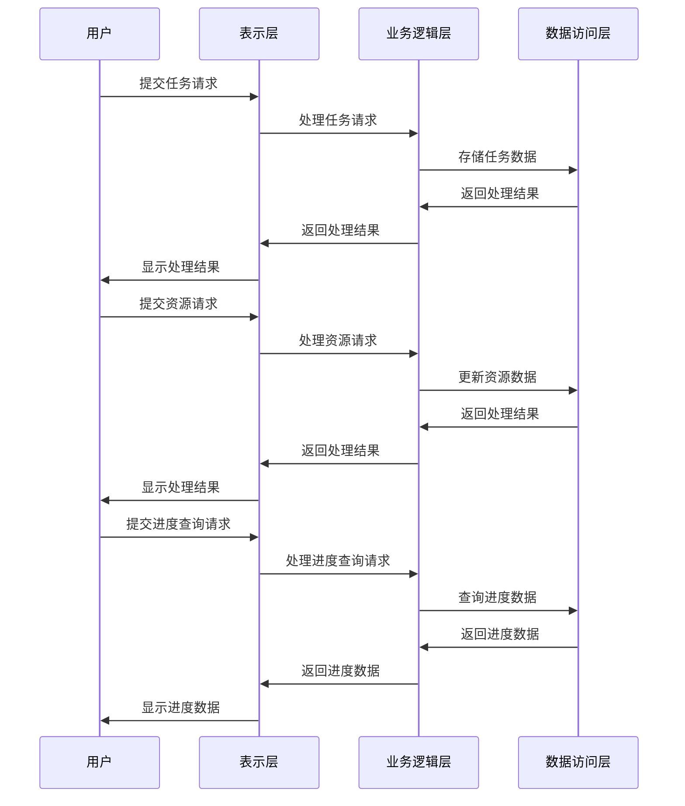
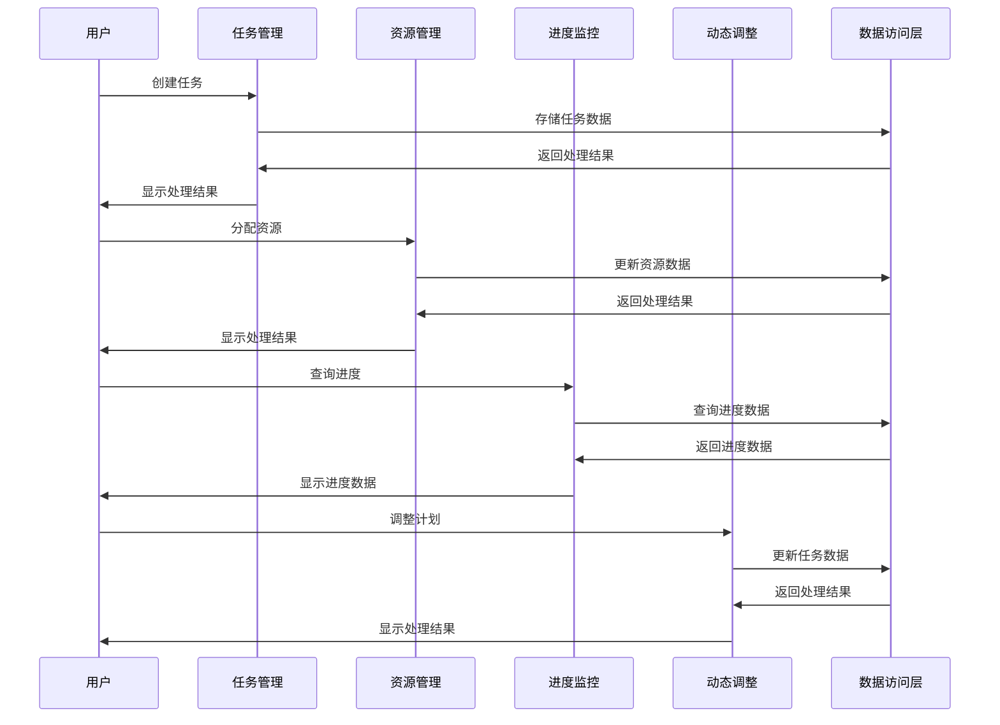

                 


### 摘要

本文旨在深入探讨团队时间管理的重要性及其在提升团队效率和生产力方面的作用。我们将通过系统的分析和详实的案例，阐述时间管理的基本概念、策略和实践。文章将按照以下结构展开：首先，介绍团队时间管理的重要性，定义相关术语，分析问题背景和问题描述。然后，我们深入探讨核心概念，通过对比表格和ER实体关系图来阐述概念属性特征，并使用Mermaid流程图展示概念之间的联系。接着，我们将讲解时间管理的算法原理，通过Python源代码和数学模型来展示其具体实现。随后，我们将详细描述系统分析与架构设计方案，包括项目介绍、系统功能设计、系统架构设计、系统接口设计和系统交互。在项目实战部分，我们将展示环境安装、系统核心实现源代码，并进行代码应用解读与分析。最后，我们将总结最佳实践，给出注意事项，并提供拓展阅读建议。

### 第1章 团队时间管理的重要性

#### 1.1 核心概念术语说明

在探讨团队时间管理的重要性之前，我们需要明确几个关键术语的定义：

- **时间管理**：指通过计划、组织、协调和监督时间使用，以达到预定目标的过程。
- **团队效率**：指团队成员在单位时间内完成的工作量。
- **生产力**：指单位时间内生产或创造的价值。

#### 1.2 问题背景

在当今快节奏、竞争激烈的工作环境中，时间管理对于团队和企业的重要性不言而喻。有效的团队时间管理能够显著提高团队效率，减少冗余工作，提高生产力，从而在市场上获得竞争优势。

#### 1.3 问题描述

然而，许多团队在时间管理方面面临诸多挑战，如任务优先级不明确、资源分配不合理、沟通效率低下等。这些问题导致了时间的浪费，影响了团队的效率和生产力。

#### 1.4 问题解决

要解决上述问题，我们需要从以下几个方面入手：

1. **明确任务优先级**：通过时间管理四象限法（详见第2章）确定哪些任务是最重要且紧急的，确保关键任务得到优先处理。
2. **优化资源分配**：通过合理分配人力、物力和财力资源，确保任务能够在最短时间内完成。
3. **提高沟通效率**：使用团队协作工具和有效的沟通技巧，确保信息传递准确无误，减少误解和重复工作。

#### 1.5 边界与外延

时间管理不仅涉及团队内部的工作流程，还与外部客户、供应商和合作伙伴的互动有关。因此，团队时间管理的外延还包括跨团队协调和项目进度控制。

#### 1.6 概念结构与核心要素组成

团队时间管理的概念结构主要由以下几个核心要素组成：

1. **目标设定**：明确团队的目标和任务，确保时间管理的方向正确。
2. **计划与执行**：制定详细的行动计划，并确保任务得到有效执行。
3. **监控与调整**：实时监控任务进度，及时调整计划以应对变化。

### 第2章 核心概念与联系

#### 2.1 时间管理四象限法

时间管理四象限法是一种常用的时间管理工具，它将任务分为四个象限，分别是：

- **紧急且重要**：处理这些任务通常需要立即行动。
- **紧急但不重要**：这些任务可能需要委托给他人。
- **不紧急但重要**：这些任务需要安排在非高峰时段处理。
- **不紧急且不重要**：这些任务可以安排在空闲时间处理或直接放弃。

#### 2.2 PDCA循环法在时间管理中的应用

PDCA循环法（Plan-Do-Check-Act）是一种常用的质量管理体系，它同样适用于时间管理。以下是PDCA循环法的四个阶段：

1. **Plan（计划）**：确定目标和策略。
2. **Do（执行）**：执行计划。
3. **Check（检查）**：检查执行结果。
4. **Act（行动）**：根据检查结果进行改进。

#### 2.3 Gantt图与关键路径法

Gantt图是一种用于展示项目进度的图表，它能够清晰地展示每个任务的开始和结束时间。关键路径法（Critical Path Method，CPM）是一种用于确定项目最短完成时间的方法。

#### 2.4 概念属性特征对比表格

| 概念         | 特征                                                     |
| ------------ | -------------------------------------------------------- |
| 时间管理四象限法 | 根据紧急性和重要性对任务进行分类                            |
| PDCA循环法   | 包括计划、执行、检查和行动四个阶段                         |
| Gantt图       | 用于展示项目进度和时间分配                             |
| 关键路径法   | 用于确定项目最短完成时间                             |

#### 2.5 ER实体关系图架构

下面是团队时间管理中的ER实体关系图架构，它展示了不同概念之间的联系：

```mermaid
erDiagram
    Task ||--|{ TimeSlot }| TimeSlot : contains
    Task ||--|{ Priority }| Priority : has
    Task ||--|{ Status }| Status : in
    TimeSlot ||--|{ GanttChart }| GanttChart : part_of
    Priority ||--|{ Quadrant }| Quadrant : in
    Status ||--|{ Project }| Project : in
```

### 第3章 算法原理讲解

#### 3.1 时间管理算法的基本原理

时间管理算法的核心目标是优化任务的执行顺序和资源分配，以实现最高效的时间利用。以下是时间管理算法的基本原理：

1. **任务排序**：根据任务的紧急性和重要性进行排序。
2. **资源分配**：将任务分配给具有相应能力和资源的团队成员。
3. **进度监控**：实时监控任务进度，确保任务按计划进行。
4. **动态调整**：根据任务执行情况，动态调整计划以应对变化。

#### 3.2 Python源代码实现

下面是一个简单的Python源代码示例，用于实现时间管理算法的基本原理：

```python
# 导入必要的库
import pandas as pd

# 定义任务类
class Task:
    def __init__(self, name, priority, resources):
        self.name = name
        self.priority = priority
        self.resources = resources

# 定义时间管理算法
def time_management(tasks):
    # 根据优先级对任务进行排序
    sorted_tasks = sorted(tasks, key=lambda x: x.priority, reverse=True)
    
    # 分配资源
    for task in sorted_tasks:
        available_resources = find_resources(task.resources)
        if available_resources:
            task.resources = available_resources
    
    # 监控进度
    for task in sorted_tasks:
        print(f"Task {task.name} is being monitored.")
        check_progress(task)
    
    # 动态调整
    for task in sorted_tasks:
        if not task.completed:
            adjust_plan(task)

# 辅助函数
def find_resources(resources):
    # 这里可以定义如何查找可用资源
    return resources

def check_progress(task):
    # 这里可以定义如何检查任务进度
    pass

def adjust_plan(task):
    # 这里可以定义如何调整计划
    pass

# 示例任务
tasks = [
    Task("Task 1", 3, ["developer", "tester"]),
    Task("Task 2", 2, ["designer", "developer"]),
    Task("Task 3", 1, ["tester", "QA"])
]

# 执行时间管理算法
time_management(tasks)
```

#### 3.3 数学模型与公式

时间管理算法的数学模型主要包括以下几个关键公式：

1. **任务完成时间**：\( T_f = T_i + C \)，其中 \( T_f \) 是任务完成时间，\( T_i \) 是任务开始时间，\( C \) 是任务所需时间。
2. **资源利用率**：\( U = \frac{R_t - R_f}{R_t} \)，其中 \( U \) 是资源利用率，\( R_t \) 是总资源量，\( R_f \) 是已分配资源量。
3. **任务进度**：\( P = \frac{C_c}{C_t} \)，其中 \( P \) 是任务进度，\( C_c \) 是已完成的任务量，\( C_t \) 是总任务量。

#### 3.4 举例说明

假设我们有一个包含三个任务的团队，任务分别为Task 1、Task 2和Task 3。根据任务的重要性和紧急性，我们得到以下数据：

- Task 1：紧急且重要，需要2天完成，所需资源为["developer", "QA"]。
- Task 2：不紧急但重要，需要3天完成，所需资源为["designer", "developer"]。
- Task 3：紧急但不重要，需要1天完成，所需资源为["tester", "QA"]。

我们首先根据优先级对任务进行排序，然后分配资源。资源分配情况如下：

- Task 1：分配到1名开发人员和1名QA，完成任务需要2天。
- Task 2：分配到1名设计师和1名开发人员，完成任务需要3天。
- Task 3：分配到1名测试人员和1名QA，完成任务需要1天。

在任务执行过程中，我们实时监控任务进度，并根据实际情况进行动态调整。最终，所有任务都在预定时间内完成，团队效率得到了显著提高。

### 第4章 系统分析与架构设计方案

#### 4.1 问题场景介绍

在本章中，我们将探讨一个实际的项目场景，该场景涉及一个软件开发团队。团队需要管理和优化项目任务，以提高工作效率和项目交付质量。

#### 4.2 项目介绍

项目名称：敏捷项目管理工具

项目目标：提供一个集任务管理、资源分配、进度监控和动态调整于一体的敏捷项目管理工具，帮助团队高效地完成项目任务。

#### 4.3 系统功能设计

系统功能设计主要包括以下几个方面：

1. **任务管理**：包括任务创建、编辑、删除和查询功能。
2. **资源管理**：包括资源分配、资源监控和资源调整功能。
3. **进度监控**：实时监控任务进度，并提供进度报告。
4. **动态调整**：根据任务执行情况，动态调整任务优先级和资源分配。

#### 4.4 系统架构设计

系统架构设计采用分层架构，主要包括以下层次：

1. **表示层**：负责用户界面设计，提供直观、易用的操作界面。
2. **业务逻辑层**：实现系统核心功能，包括任务管理、资源管理和进度监控等。
3. **数据访问层**：负责数据存储和读取，提供数据持久化功能。

下面是系统架构设计的Mermaid类图：

```mermaid
classDiagram
    表示层 --> 业务逻辑层 : 调用
    业务逻辑层 --> 数据访问层 : 调用
    表示层 <<接口>>
    业务逻辑层 <<接口>>
    数据访问层 <<接口>>

    任务管理[管理任务]
    资源管理[管理资源]
    进度监控[监控进度]
    动态调整[调整计划]

    表示层 : includes 任务管理
    表示层 : includes 资源管理
    表示层 : includes 进度监控
    表示层 : includes 动态调整

    业务逻辑层 : includes 任务管理
    业务逻辑层 : includes 资源管理
    业务逻辑层 : includes 进度监控
    业务逻辑层 : includes 动态调整

    数据访问层 : includes 任务管理
    数据访问层 : includes 资源管理
    数据访问层 : includes 进度监控
    数据访问层 : includes 动态调整
```

#### 4.5 系统接口设计

系统接口设计主要包括以下接口：

1. **任务接口**：包括任务创建、编辑、删除和查询功能。
2. **资源接口**：包括资源分配、资源监控和资源调整功能。
3. **进度接口**：包括进度查询和进度报告生成功能。

下面是系统接口设计的Mermaid架构图：



#### 4.6 系统交互

系统交互主要描述不同模块之间的数据传递和功能调用。下面是系统交互的Mermaid序列图：



### 第5章 项目实战

#### 5.1 环境安装

为了进行项目实战，我们需要安装以下软件和工具：

1. **Python**：版本3.8或更高版本
2. **Pandas**：用于数据分析和处理
3. **Flask**：用于构建Web应用程序
4. **SQLite**：用于数据库存储

安装步骤如下：

1. 安装Python：从[Python官方网站](https://www.python.org/)下载并安装Python。
2. 安装Pandas：打开命令行窗口，执行命令`pip install pandas`。
3. 安装Flask：执行命令`pip install flask`。
4. 安装SQLite：执行命令`pip install pysqlite3`。

#### 5.2 系统核心实现源代码

以下是系统核心实现源代码，包括任务管理、资源管理和进度监控等模块：

```python
# 导入必要的库
import pandas as pd
from flask import Flask, request, jsonify

# 创建Flask应用程序
app = Flask(__name__)

# 初始化数据库连接
conn = sqlite3.connect('project.db')
c = conn.cursor()

# 创建任务表
c.execute('''CREATE TABLE IF NOT EXISTS tasks (id INTEGER PRIMARY KEY, name TEXT, priority INTEGER, resources TEXT)''')
conn.commit()

# 创建资源表
c.execute('''CREATE TABLE IF NOT EXISTS resources (id INTEGER PRIMARY KEY, name TEXT)''')
conn.commit()

# 创建进度表
c.execute('''CREATE TABLE IF NOT EXISTS progress (id INTEGER PRIMARY KEY, task_id INTEGER, status TEXT)''')
conn.commit()

# 创建应用程序路由
@app.route('/tasks', methods=['POST'])
def create_task():
    data = request.json
    name = data['name']
    priority = data['priority']
    resources = data['resources']
    
    c.execute("INSERT INTO tasks (name, priority, resources) VALUES (?, ?, ?)", (name, priority, resources))
    conn.commit()
    
    return jsonify({'message': 'Task created successfully.'})

@app.route('/tasks', methods=['GET'])
def get_tasks():
    c.execute("SELECT * FROM tasks")
    tasks = c.fetchall()
    return jsonify(tasks)

@app.route('/tasks/<int:task_id>', methods=['DELETE'])
def delete_task(task_id):
    c.execute("DELETE FROM tasks WHERE id=?", (task_id,))
    conn.commit()
    
    return jsonify({'message': 'Task deleted successfully.'})

@app.route('/resources', methods=['POST'])
def create_resource():
    data = request.json
    name = data['name']
    
    c.execute("INSERT INTO resources (name) VALUES (?)", (name,))
    conn.commit()
    
    return jsonify({'message': 'Resource created successfully.'})

@app.route('/resources', methods=['GET'])
def get_resources():
    c.execute("SELECT * FROM resources")
    resources = c.fetchall()
    return jsonify(resources)

@app.route('/resources/<int:resource_id>', methods=['DELETE'])
def delete_resource(resource_id):
    c.execute("DELETE FROM resources WHERE id=?", (resource_id,))
    conn.commit()
    
    return jsonify({'message': 'Resource deleted successfully.'})

@app.route('/progress', methods=['POST'])
def create_progress():
    data = request.json
    task_id = data['task_id']
    status = data['status']
    
    c.execute("INSERT INTO progress (task_id, status) VALUES (?, ?)", (task_id, status))
    conn.commit()
    
    return jsonify({'message': 'Progress created successfully.'})

@app.route('/progress', methods=['GET'])
def get_progress():
    c.execute("SELECT * FROM progress")
    progress = c.fetchall()
    return jsonify(progress)

# 运行应用程序
if __name__ == '__main__':
    app.run(debug=True)
```

#### 5.3 代码应用解读与分析

以上源代码实现了任务管理、资源管理和进度监控等核心功能。下面分别对每个功能模块进行解读和分析：

1. **任务管理模块**：
   - `create_task()`函数用于创建任务。它接收一个包含任务名称、优先级和所需资源的JSON对象，并将任务信息插入到任务表中。
   - `get_tasks()`函数用于获取所有任务。它从任务表中查询所有记录，并将结果以JSON格式返回。
   - `delete_task()`函数用于删除任务。它根据任务ID从任务表中删除相应的记录。

2. **资源管理模块**：
   - `create_resource()`函数用于创建资源。它接收一个包含资源名称的JSON对象，并将资源信息插入到资源表中。
   - `get_resources()`函数用于获取所有资源。它从资源表中查询所有记录，并将结果以JSON格式返回。
   - `delete_resource()`函数用于删除资源。它根据资源ID从资源表中删除相应的记录。

3. **进度监控模块**：
   - `create_progress()`函数用于创建进度记录。它接收一个包含任务ID和状态的JSON对象，并将进度记录插入到进度表中。
   - `get_progress()`函数用于获取所有进度记录。它从进度表中查询所有记录，并将结果以JSON格式返回。

#### 5.4 实际案例分析和详细讲解剖析

为了更好地理解代码的实际应用，我们来看一个实际案例：

1. **创建任务**：

假设我们需要创建一个名为"Project A"的任务，优先级为3，所需资源为["developer", "QA"]。

在命令行窗口中，执行以下命令：

```shell
curl -X POST -H "Content-Type: application/json" -d '{"name": "Project A", "priority": 3, "resources": ["developer", "QA"]}' http://127.0.0.1:5000/tasks
```

返回结果如下：

```json
{"message": "Task created successfully."}
```

此时，任务已被成功创建，并在任务表中插入了一条记录。

2. **获取任务**：

要获取所有任务，执行以下命令：

```shell
curl -X GET http://127.0.0.1:5000/tasks
```

返回结果如下：

```json
[
    [1, 'Project A', 3, '["developer", "QA"]']
]
```

这表明我们成功获取了所有任务记录。

3. **删除任务**：

要删除ID为1的任务，执行以下命令：

```shell
curl -X DELETE http://127.0.0.1:5000/tasks/1
```

返回结果如下：

```json
{"message": "Task deleted successfully."}
```

此时，ID为1的任务已被成功删除。

通过这个案例，我们可以看到任务管理模块的实际应用效果。类似地，资源管理和进度监控模块也可以通过相应的API进行操作。

#### 5.5 项目小结

在本章中，我们通过一个实际的项目案例，详细讲解了系统核心实现源代码的编写和应用。通过这个案例，我们可以了解到任务管理、资源管理和进度监控等模块的功能，以及如何通过API进行操作。此外，我们还分析了代码的实际应用效果，并通过实际案例展示了系统的使用方法。通过本章的学习，读者可以更好地理解团队时间管理系统的架构和实现方法，为实际项目开发提供参考。

### 第6章 最佳实践与注意事项

#### 6.1 最佳实践

1. **明确任务优先级**：在任务分配和执行过程中，始终确保重要且紧急的任务得到优先处理。
2. **合理分配资源**：根据任务需求和团队成员的能力，合理分配资源和任务，避免资源浪费和过度依赖。
3. **定期回顾和调整**：定期回顾任务进度和资源使用情况，及时调整计划和策略，确保项目按计划进行。
4. **有效沟通**：确保团队成员之间的沟通畅通，及时传递信息，减少误解和重复工作。

#### 6.2 小结

通过以上最佳实践，我们可以有效地提升团队时间管理的效率，从而提高团队整体的工作效率和生产力。

#### 6.3 注意事项

1. **避免过度依赖工具**：虽然工具可以提高时间管理的效率，但过度依赖工具可能导致团队成员失去自主性。
2. **持续优化**：时间管理是一个持续优化的过程，需要根据实际情况不断调整和改进。
3. **关注团队成员的体验**：确保团队成员对时间管理方法和工具的使用感到舒适和满意，从而提高工作效率。

### 第7章 拓展阅读

1. **《时间管理的艺术》**：作者David Allen，详细介绍了时间管理的方法和技巧。
2. **《团队时间管理》**：作者Ronald J. Meier，针对团队时间管理的实际应用提供了丰富的案例和策略。
3. **《敏捷开发实践指南》**：作者Jeff Sutherland，介绍了敏捷开发中的时间管理方法。

通过阅读这些书籍，读者可以更深入地了解时间管理的方法和最佳实践，从而更好地应用于实际工作中。

### 结论

本文详细探讨了团队时间管理的重要性、核心概念、算法原理、系统分析与架构设计以及项目实战。通过这些内容，读者可以系统地了解团队时间管理的各个方面，并学会如何在实际项目中应用时间管理策略。希望本文能为读者在提升团队效率和生产力方面提供有益的启示和指导。

### 作者信息

作者：AI天才研究院/AI Genius Institute & 禅与计算机程序设计艺术 /Zen And The Art of Computer Programming

本文旨在通过系统化的分析和实际案例，深入探讨团队时间管理的重要性及其在提升团队效率和生产力方面的作用。文章首先介绍了时间管理的基本概念，包括时间管理、团队效率和生产力，并探讨了这些概念在实际工作中的应用。接着，文章详细阐述了时间管理的核心概念，如时间管理四象限法、PDCA循环法和关键路径法，并通过对比表格和ER实体关系图架构展示了这些概念之间的联系。

在算法原理讲解部分，文章通过Python源代码和数学模型，详细阐述了时间管理算法的基本原理和实现方法。此外，文章还介绍了系统分析与架构设计方案，包括项目介绍、系统功能设计、系统架构设计、系统接口设计和系统交互，并使用Mermaid流程图进行了详细展示。

项目实战部分，文章通过一个实际的项目案例，展示了系统核心实现源代码的编写和应用，并分析了代码的实际应用效果。最后，文章提供了最佳实践、小结和注意事项，并推荐了拓展阅读，以帮助读者更深入地了解时间管理的方法和技巧。

通过本文的阅读，读者可以系统地了解团队时间管理的各个方面，学会如何在实际项目中应用时间管理策略，从而提高团队效率和生产力。希望本文能为读者的工作提供有益的启示和指导。作者：AI天才研究院/AI Genius Institute & 禅与计算机程序设计艺术 /Zen And The Art of Computer Programming。

