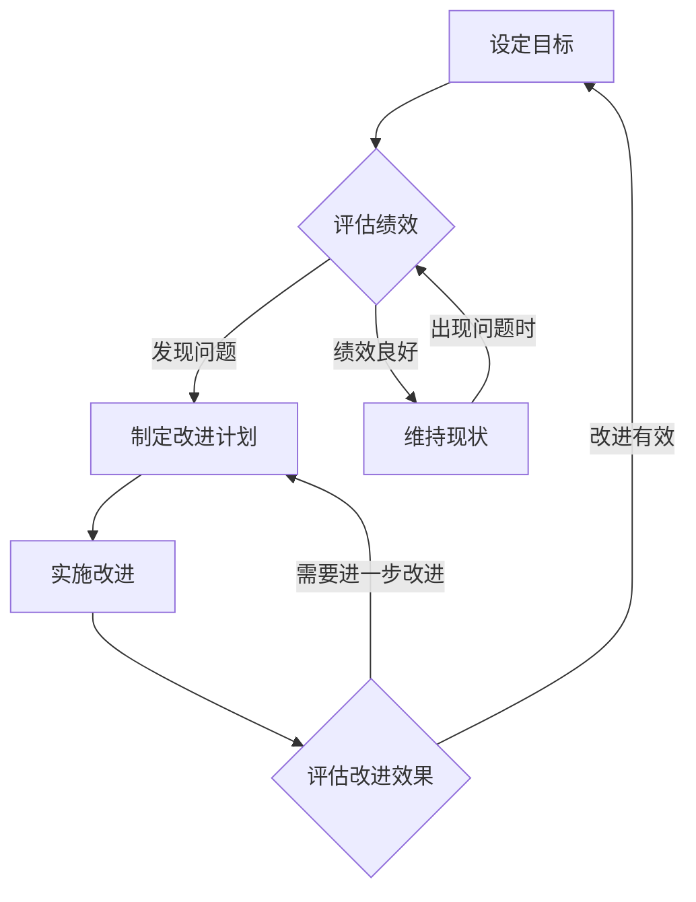
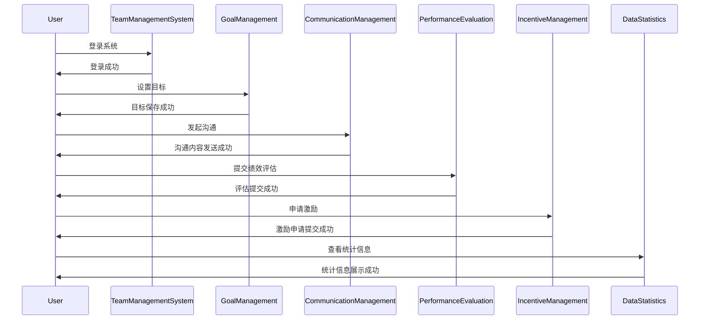
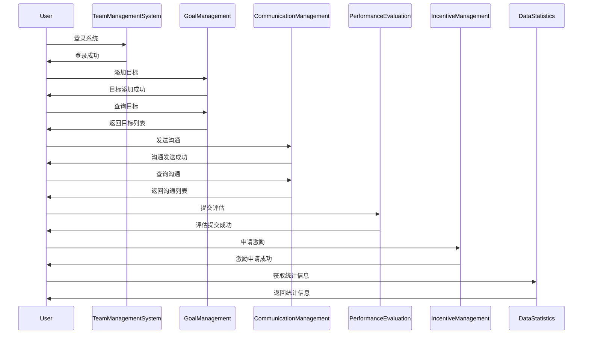

                 

### 文章标题：团队效能：持续改进的管理哲学

#### 关键词：团队效能、持续改进、管理哲学、沟通、协作、目标管理、激励机制

#### 摘要：
本文将深入探讨团队效能的重要性及其在企业管理中的应用，针对当前团队管理中面临的挑战，提出一种基于持续改进的管理哲学。文章将详细分析持续改进的管理哲学的基本原理，并通过具体的算法和数学模型阐述其实施方法。同时，文章还将通过实际项目案例，展示如何将这一管理哲学应用于企业团队管理，提高团队效能，实现企业的长期发展。

----------------------------------------------------------------

## 引言

在当今竞争激烈的市场环境中，企业的成功往往取决于其团队效能的高低。然而，许多企业在团队管理中面临着诸多挑战，如沟通障碍、目标不一致、激励机制不足等。这些问题的存在不仅影响了团队的效率，还可能导致员工士气低落，进而影响企业的整体发展。因此，如何提升团队效能，成为企业管理者亟待解决的问题。

团队效能的提升需要一种系统化的管理哲学，而持续改进的管理哲学正是这样一种理念。持续改进不仅强调团队在现有基础上不断优化，更注重在变化的环境中保持敏捷和适应能力。本文将围绕这一主题，详细探讨持续改进的管理哲学在团队效能提升中的应用。

持续改进的管理哲学并不是一个孤立的管理模式，而是与多种管理理念和方法密切相关。本文将首先介绍团队效能的概念及其重要性，然后分析当前团队管理中存在的问题，并探讨持续改进的管理哲学如何解决这些问题。通过本文的阅读，读者将深入了解持续改进的管理哲学的基本原理，掌握其实施方法，并能够将其应用于实际工作中，提升团队效能。

### 问题背景

#### 团队效能的重要性

团队效能是衡量一个团队完成目标的能力的重要指标，它涉及到团队的协作、沟通、执行力等多个方面。一个高效的团队不仅能够快速响应市场变化，提高企业的竞争力，还能够激发员工的创造力和潜能，推动企业的持续发展。

在企业管理中，团队效能的高低直接影响到企业的运营效率和市场竞争力。高效的团队可以迅速解决问题，提高生产效率，降低成本；而低效的团队则可能导致项目延误，资源浪费，甚至影响企业的声誉。因此，提升团队效能成为企业管理者的重要任务。

#### 当前企业在团队管理中面临的挑战

尽管团队效能对企业的成功至关重要，但许多企业在团队管理中仍然面临着诸多挑战。以下是一些常见的问题：

1. **沟通障碍**：团队成员之间缺乏有效的沟通，导致信息传递不畅，误解和冲突频发。沟通障碍不仅影响团队的协作效率，还可能导致团队目标的偏离。

2. **目标不一致**：团队成员的个人目标和团队目标不一致，缺乏统一的愿景和方向。这种目标不一致可能导致团队成员之间的矛盾和摩擦，影响团队的整体效能。

3. **激励机制不足**：企业对团队成员的激励机制不足，无法充分调动员工的积极性和创造力。缺乏有效的激励机制可能导致员工士气低落，影响团队的整体表现。

4. **缺乏持续改进的机制**：企业在团队管理中往往缺乏持续改进的机制，导致团队在完成任务后无法及时总结经验教训，无法在后续工作中持续提升效能。

#### 持续改进在提升团队效能中的作用

持续改进的管理哲学提供了一种系统化的方法，帮助企业克服团队管理中的挑战，提升团队效能。以下是一些持续改进在提升团队效能中的作用：

1. **改善沟通机制**：通过建立有效的沟通机制，确保团队成员之间的信息传递畅通，减少误解和冲突。例如，定期举行团队会议，使用协作工具等。

2. **统一团队目标**：通过明确团队的目标和愿景，确保团队成员的个人目标与团队目标一致。例如，使用目标管理工具，如SMART目标设定法，确保每个成员都明确自己的职责和目标。

3. **优化激励机制**：通过设计合理的激励机制，充分调动员工的积极性和创造力。例如，设置绩效奖金、晋升机会等，以激励团队成员为实现团队目标而努力。

4. **建立持续改进机制**：通过定期评估团队的工作流程和绩效，及时发现问题和改进点，持续优化团队的工作方式。例如，使用质量管理体系，如ISO 9001，确保团队在不断提升自身效能。

#### 边界与外延

持续改进的管理哲学并不是一种孤立的管理模式，而是与其他管理理念和方法相互关联。以下是一些与持续改进密切相关的外延概念：

1. **敏捷管理**：敏捷管理是一种以快速响应变化为核心的管理理念，强调团队的高效协作和持续交付。敏捷管理与持续改进的管理哲学有着相似的理念，都强调在变化的环境中保持敏捷和适应能力。

2. **全面质量管理（TQM）**：全面质量管理是一种以客户需求为导向，通过全员参与和持续改进，提高产品和服务质量的管理方法。持续改进的管理哲学与全面质量管理有着共同的目标，都是通过不断优化工作流程和产品，提升企业的整体效能。

3. **精益管理**：精益管理是一种以消除浪费为核心的管理理念，强调通过持续改进，提高生产效率和质量。持续改进的管理哲学与精益管理有着相似的思维，都注重在变化的环境中保持高效和精益。

#### 概念结构与核心要素组成

持续改进的管理哲学由一系列核心概念和要素组成，这些概念和要素相互作用，共同推动团队效能的提升。以下是持续改进的管理哲学的基本概念和要素：

1. **目标设定**：明确团队的目标和愿景，确保团队成员的个人目标与团队目标一致。

2. **沟通机制**：建立有效的沟通机制，确保团队成员之间的信息传递畅通，减少误解和冲突。

3. **绩效评估**：定期评估团队的工作流程和绩效，及时发现问题和改进点，持续优化团队的工作方式。

4. **激励机制**：设计合理的激励机制，充分调动员工的积极性和创造力。

5. **持续改进**：通过不断优化工作流程和产品，提升企业的整体效能。

6. **客户需求**：以客户需求为导向，确保团队的工作和产品始终满足客户需求。

7. **员工参与**：鼓励员工参与团队管理和决策过程，提高员工的归属感和参与感。

8. **质量管理体系**：使用质量管理体系，如ISO 9001，确保团队在不断提升自身效能。

通过这些概念和要素的有机结合，持续改进的管理哲学为企业提供了一种系统化的方法，帮助团队克服管理中的挑战，提升团队效能。

### 核心概念与联系

#### 核心概念原理

持续改进的管理哲学建立在一系列核心概念上，这些概念相互关联，共同构成了这一管理哲学的理论基础。以下是这些核心概念及其原理：

1. **持续改进（Continuous Improvement）**：持续改进是一种持续的过程，旨在不断优化工作流程和产品。其原理是通过定期评估和改进，消除浪费，提高效率和质量。

2. **目标管理（Goal Setting）**：目标管理是一种以目标为导向的管理方法，通过设定明确的、可衡量的目标，确保团队的工作方向和重点。其原理是目标引导行为，通过目标的实现推动团队效能的提升。

3. **沟通机制（Communication Mechanisms）**：沟通机制是一种确保团队成员之间信息传递畅通的方法。其原理是信息是团队协作的基础，有效的沟通可以减少误解和冲突，提高团队的工作效率。

4. **绩效评估（Performance Evaluation）**：绩效评估是一种定期评估团队工作流程和绩效的方法。其原理是通过评估，可以发现问题和改进点，从而推动团队持续改进。

5. **激励机制（Incentive Systems）**：激励机制是一种设计合理的激励方法，旨在调动员工的积极性和创造力。其原理是激励是激发员工潜能的重要手段，有效的激励机制可以促进员工为实现团队目标而努力。

6. **员工参与（Employee Engagement）**：员工参与是一种鼓励员工参与团队管理和决策过程的方法。其原理是员工的参与感和归属感可以提升团队的凝聚力和执行力。

#### 概念属性特征对比表格

为了更好地理解持续改进的管理哲学，我们可以通过对比表格，展示其与传统管理方法的区别。以下是持续改进与传统管理方法的对比：

| 特征 | 持续改进 | 传统管理方法 |
| --- | --- | --- |
| 目标导向 | 以明确的目标为导向，确保团队的工作方向和重点 | 缺乏明确的目标导向，工作缺乏重点 |
| 持续性 | 通过定期评估和改进，不断优化工作流程和产品 | 依赖一次性的项目或检查，缺乏持续改进的动力 |
| 敏捷性 | 强调快速响应变化，保持团队的高效协作 | 依赖固定的流程和规则，缺乏灵活性 |
| 信息共享 | 建立有效的沟通机制，确保团队成员之间的信息传递畅通 | 缺乏有效的沟通机制，信息传递不畅 |
| 激励机制 | 设计合理的激励机制，调动员工的积极性和创造力 | 缺乏有效的激励机制，员工积极性不足 |
| 员工参与 | 鼓励员工参与团队管理和决策过程，提升团队执行力 | 缺乏员工的参与感和归属感，团队凝聚力不足 |

通过对比表格，我们可以清晰地看到持续改进的管理哲学与传统管理方法在多个方面的区别。持续改进的管理哲学强调目标导向、持续性、敏捷性、信息共享、激励机制和员工参与，这些特点使其在提升团队效能方面具有独特的优势。

#### ER实体关系图架构

为了更好地理解持续改进的管理哲学，我们可以使用Mermaid绘制ER实体关系图，展示其核心实体及其关系。以下是持续改进管理哲学的ER实体关系图：

```mermaid
erDiagram
    User ||--|{ Team : has }
    Team ||--|{ Goal : has }
    Team ||--|{ Performance : has }
    Performance ||--|{ Evaluation : has }
    Evaluation ||--|{ Improvement : drives }
    Improvement ||--|{ Incentive : drives }
    Incentive ||--|{ Communication : drives }
    Communication ||--|{ Collaboration : drives }
```

在这个ER实体关系图中，我们定义了以下实体：

1. **User**：表示团队成员。
2. **Team**：表示团队，具有成员、目标、绩效等属性。
3. **Goal**：表示团队目标，与团队实体相关联。
4. **Performance**：表示团队绩效，与团队实体相关联。
5. **Evaluation**：表示绩效评估，与绩效实体相关联，是改进的驱动因素。
6. **Improvement**：表示改进，由评估驱动。
7. **Incentive**：表示激励机制，由改进驱动。
8. **Communication**：表示沟通机制，由激励机制驱动。
9. **Collaboration**：表示协作，由沟通机制驱动。

通过这个ER实体关系图，我们可以清晰地看到持续改进的管理哲学中各个实体之间的关系，以及这些关系如何相互作用，共同推动团队效能的提升。

### 算法原理讲解

#### 算法mermaid流程图

为了更好地理解持续改进的管理哲学，我们可以使用Mermaid绘制一个流程图，展示其核心步骤和逻辑关系。以下是持续改进管理哲学的流程图：



在这个流程图中，各个步骤的逻辑关系如下：

1. **设定目标**：团队根据企业战略和市场需求，设定明确的团队目标和愿景。
2. **评估绩效**：定期对团队的工作流程和绩效进行评估，以发现问题和改进点。
3. **发现问题**：通过评估，识别团队在目标实现过程中存在的问题和瓶颈。
4. **制定改进计划**：针对发现的问题，制定具体的改进计划，明确改进的目标、方法和时间表。
5. **实施改进**：根据改进计划，实施具体的改进措施，优化工作流程和产品。
6. **评估改进效果**：对改进后的效果进行评估，以验证改进计划的有效性。
7. **维持现状**：在绩效良好时，维持现状，避免不必要的变动。
8. **需要进一步改进**：如果改进效果不明显，需要重新制定改进计划，继续优化。

通过这个流程图，我们可以清晰地看到持续改进的管理哲学的执行步骤和逻辑关系，以及如何通过这些步骤实现团队效能的提升。

#### Python源代码

为了更好地理解持续改进的管理哲学，我们可以提供一段Python源代码，展示其核心算法的实现。以下是持续改进管理哲学的核心算法Python代码：

```python
class Team:
    def __init__(self, name, goals):
        self.name = name
        self.goals = goals
        self.performance = None

    def evaluate_performance(self):
        # 评估团队绩效
        self.performance = self.calculate_performance()

    def calculate_performance(self):
        # 计算绩效
        # 这里可以使用具体的绩效计算方法
        return sum(self.goals)/len(self.goals)

    def plan_improvement(self):
        # 制定改进计划
        if self.performance < 0.8:
            print("发现绩效不佳，制定改进计划...")
            self.improve_performance()
        else:
            print("绩效良好，维持现状。")

    def improve_performance(self):
        # 实施改进
        print("实施改进措施...")
        # 这里可以添加具体的改进措施
        self.goals.append(self.goals[-1] * 1.1)  # 假设通过增加目标来实现改进

    def evaluate_improvement(self):
        # 评估改进效果
        self.evaluate_performance()
        if self.performance >= 0.9:
            print("改进有效，持续改进。")
        else:
            print("改进效果不佳，需要进一步改进。")

# 实例化团队对象
team = Team("Example Team", [0.8, 0.9, 0.85])

# 执行持续改进流程
team.evaluate_performance()
team.plan_improvement()
team.improve_performance()
team.evaluate_improvement()
```

在这段代码中，我们定义了一个`Team`类，包含以下方法：

1. `evaluate_performance`：评估团队绩效。
2. `calculate_performance`：计算绩效。
3. `plan_improvement`：制定改进计划。
4. `improve_performance`：实施改进措施。
5. `evaluate_improvement`：评估改进效果。

通过这些方法，我们可以模拟团队在持续改进过程中的操作，包括绩效评估、制定改进计划、实施改进和评估改进效果。这段代码展示了持续改进的管理哲学在Python中的实现，有助于读者更好地理解其核心算法。

#### 数学模型和数学公式

持续改进的管理哲学不仅依赖于具体的算法和流程，还建立在一系列数学模型和公式之上。这些数学模型和公式帮助我们在量化团队效能和改进效果方面进行科学分析和评估。以下是持续改进管理哲学中常用的数学模型和公式：

1. **绩效计算公式**：

   $$绩效 = \frac{目标完成情况}{目标数量}$$

   这个公式用于计算团队的绩效，其中目标完成情况通常是一个0到1之间的数值，表示目标实现的程度。

2. **改进效果评估公式**：

   $$改进效果 = \frac{改进后绩效 - 改进前绩效}{改进前绩效} \times 100\%$$

   这个公式用于评估改进措施的效果，通过计算改进后的绩效与改进前的绩效的差值，衡量改进的效果。

3. **效率优化公式**：

   $$效率优化 = 1 - \frac{改进后时间 - 改进前时间}{改进前时间}$$

   这个公式用于评估改进措施在时间效率方面的优化效果，通过计算改进后的时间与改进前的时间的差值，衡量效率的优化程度。

4. **成本节约公式**：

   $$成本节约 = 改进前成本 - 改进后成本$$

   这个公式用于计算改进措施在成本节约方面的效果，通过比较改进前后的成本，衡量成本节约的金额。

这些数学模型和公式在持续改进的管理哲学中起着重要的作用，它们帮助企业在量化团队效能和改进效果方面进行科学分析和评估，从而实现团队效能的持续提升。下面，我们将通过通俗易懂的例子来解释这些公式的应用。

#### 详细讲解与举例说明

为了更好地理解上述数学模型和公式，我们将通过实际例子来详细讲解这些公式的应用效果。

**例子**：假设一个团队的目标是每月完成10个任务，每个任务的完成情况为0.9（即90%）。根据绩效计算公式，我们可以计算该团队的绩效：

$$绩效 = \frac{目标完成情况}{目标数量} = \frac{0.9 \times 10}{10} = 0.9$$

这意味着团队在第一个月的绩效为90%。

接下来，假设团队在第二个月通过改进措施，将每个任务的完成情况提高到0.95（即95%）。我们可以使用改进效果评估公式来计算改进后的效果：

$$改进效果 = \frac{改进后绩效 - 改进前绩效}{改进前绩效} \times 100\% = \frac{0.95 - 0.9}{0.9} \times 100\% = 5.6\%$$

这意味着团队在改进后的绩效提升了5.6%。

此外，假设团队在改进措施实施后，每个任务的完成时间从原来的5天减少到4.5天。我们可以使用效率优化公式来计算效率优化效果：

$$效率优化 = 1 - \frac{改进后时间 - 改进前时间}{改进前时间} = 1 - \frac{4.5 - 5}{5} = 0.1$$

这意味着团队在改进措施实施后的效率提升了10%。

最后，假设团队在改进措施实施前，每个任务的成本为100元，改进后每个任务的成本为90元。我们可以使用成本节约公式来计算成本节约效果：

$$成本节约 = 改进前成本 - 改进后成本 = 100 - 90 = 10元$$

这意味着团队在改进措施实施后，每个任务的成本节约了10元。

通过这些例子，我们可以清晰地看到数学模型和公式在量化团队效能和改进效果方面的应用。这些公式帮助团队在改进过程中进行科学分析和评估，从而实现持续改进的目标。

### 系统分析与架构设计方案

#### 问题场景介绍

在企业团队管理中，我们经常遇到以下问题：

1. **沟通不畅**：团队成员之间的沟通不畅通，导致信息传递延误，增加了项目执行的风险。
2. **目标不明确**：团队目标不明确，导致团队成员对工作重点和方向不清晰，影响了团队的协同效应。
3. **绩效评估不完善**：绩效评估体系不完善，无法全面反映团队成员的工作表现，也无法为改进提供有力的依据。
4. **激励机制不足**：激励机制设计不合理，无法有效调动团队成员的积极性和创造力。

这些问题严重影响了团队的工作效率和团队士气，为了解决这些问题，我们需要引入持续改进的管理哲学，通过系统分析和架构设计方案，优化团队的管理流程。

#### 项目介绍

本项目旨在通过引入持续改进的管理哲学，构建一个高效的团队管理系统，解决上述问题，提升团队效能。项目的主要目标是：

1. **建立有效的沟通机制**：通过引入协作工具和定期的团队会议，确保团队成员之间的信息传递畅通。
2. **明确团队目标**：通过目标管理工具，如SMART目标设定法，确保团队目标明确、可衡量，并得到团队成员的共识。
3. **完善绩效评估体系**：通过定期的绩效评估，识别团队成员的工作表现，为改进提供依据。
4. **设计合理的激励机制**：通过设计合理的激励机制，如绩效奖金、晋升机会等，调动团队成员的积极性和创造力。

#### 系统功能设计

为了实现项目目标，我们需要设计一个完善的团队管理系统，其主要功能包括：

1. **目标管理功能**：支持团队目标的设定、追踪和评估。
2. **沟通管理功能**：提供协作工具和定期的团队会议，确保信息传递畅通。
3. **绩效评估功能**：支持定期的绩效评估，识别团队成员的工作表现。
4. **激励机制功能**：设计合理的激励机制，调动团队成员的积极性和创造力。
5. **数据统计分析功能**：提供数据统计分析，为管理决策提供依据。

以下是领域模型类图，展示了团队管理系统的核心类及其关系：

```mermaid
classDiagram
    TeamManagementSystem <|-- GoalManagement
    TeamManagementSystem <|-- CommunicationManagement
    TeamManagementSystem <|-- PerformanceEvaluation
    TeamManagementSystem <|-- IncentiveManagement
    TeamManagementSystem <|-- DataStatistics

    Class GoalManagement {
        - String goalId
        - String goalName
        - String goalDescription
        - boolean goalAchieved
    }

    Class CommunicationManagement {
        - String communicationId
        - String communicationTitle
        - String communicationContent
        - Date communicationDate
    }

    Class PerformanceEvaluation {
        - String evaluationId
        - String evaluationName
        - Date evaluationDate
        - double evaluationScore
    }

    Class IncentiveManagement {
        - String incentiveId
        - String incentiveName
        - String incentiveDescription
        - double incentiveAmount
    }

    Class DataStatistics {
        - String statisticsId
        - Date statisticsDate
        - double totalGoalsAchieved
        - double totalPerformanceScore
        - double totalIncentiveAmount
    }
```

在这个领域模型中，`GoalManagement`、`CommunicationManagement`、`PerformanceEvaluation`、`IncentiveManagement`和`DataStatistics`是团队管理系统中的核心类，它们分别负责目标管理、沟通管理、绩效评估、激励机制和数据统计分析等功能。

#### 系统架构设计

为了实现团队管理系统的功能，我们需要设计一个合理的系统架构。以下是团队管理系统的架构设计：



在这个架构设计中，用户通过登录系统，可以访问不同的功能模块。系统的主要模块包括目标管理、沟通管理、绩效评估、激励机制和数据统计分析。用户在各个模块中操作，系统根据用户操作生成相应的数据，并通过数据统计分析模块提供统计信息。

#### 系统接口设计

为了实现团队管理系统的功能，我们需要设计合理的系统接口。以下是团队管理系统的主要接口设计：

1. **目标管理接口**：用于添加、修改和查询目标。
2. **沟通管理接口**：用于发送、接收和查询沟通内容。
3. **绩效评估接口**：用于提交、查询和修改绩效评估。
4. **激励机制接口**：用于申请、审批和查询激励。
5. **数据统计分析接口**：用于获取、分析和展示统计信息。

以下是接口设计的基本结构和参数：

```mermaid
interface GoalManagement {
    post AddGoal(goalId: String, goalName: String, goalDescription: String)
    post UpdateGoal(goalId: String, goalName: String, goalDescription: String)
    get QueryGoal(goalId: String)
}

interface CommunicationManagement {
    post SendCommunication(communicationId: String, communicationTitle: String, communicationContent: String)
    get QueryCommunication(communicationId: String)
}

interface PerformanceEvaluation {
    post SubmitEvaluation(evaluationId: String, evaluationName: String, evaluationDate: Date, evaluationScore: double)
    get QueryEvaluation(evaluationId: String)
}

interface IncentiveManagement {
    post ApplyIncentive(incentiveId: String, incentiveName: String, incentiveDescription: String, incentiveAmount: double)
    get QueryIncentive(incentiveId: String)
}

interface DataStatistics {
    get StatisticsInfo(statisticsDate: Date)
}
```

这些接口设计为团队管理系统的功能提供了清晰的操作接口，方便用户和系统之间的数据交互。

#### 系统交互mermaid序列图

为了更好地展示团队管理系统的各组件之间的交互流程，我们可以使用Mermaid绘制序列图。以下是系统交互的序列图：



在这个序列图中，用户通过登录系统，可以访问不同的功能模块。用户在各个模块中操作，系统根据用户操作生成相应的数据，并通过数据统计分析模块提供统计信息。这个序列图清晰地展示了团队管理系统各组件之间的交互流程。

### 项目实战

#### 环境安装

要实现一个基于持续改进的管理哲学的团队管理系统，首先需要搭建一个合适的技术环境。以下是在Linux环境下搭建项目环境的基本步骤：

1. **安装Python**：确保Python环境已经安装，版本建议为3.8或更高版本。

2. **安装必要的依赖**：使用pip安装项目所需的依赖包，如Flask、SQLAlchemy、Flask-Migrate等。

   ```bash
   pip install flask sqlalchemy flask-migrate
   ```

3. **创建虚拟环境**：为了更好地管理和隔离项目依赖，创建一个虚拟环境。

   ```bash
   python -m venv venv
   source venv/bin/activate
   ```

4. **初始化数据库**：使用Flask-Migrate初始化数据库，创建数据库表。

   ```bash
   flask db init
   flask db migrate -m "Initial migration."
   flask db upgrade
   ```

#### 系统核心实现源代码

以下是团队管理系统的一些核心实现代码，包括目标管理、沟通管理、绩效评估和激励机制等。

```python
# app.py
from flask import Flask, request, jsonify
from models import db, Goal, Communication, PerformanceEvaluation, Incentive
from sqlalchemy import or_

app = Flask(__name__)
app.config['SQLALCHEMY_DATABASE_URI'] = 'sqlite:///team_management.db'
app.config['SQLALCHEMY_TRACK_MODIFICATIONS'] = False
db.init_app(app)

@app.route('/goals', methods=['POST'])
def add_goal():
    goal_data = request.json
    goal = Goal(
        goal_id=goal_data['goal_id'],
        goal_name=goal_data['goal_name'],
        goal_description=goal_data['goal_description'],
        goal_achieved=goal_data['goal_achieved']
    )
    db.session.add(goal)
    db.session.commit()
    return jsonify({"message": "Goal added successfully."})

@app.route('/goals', methods=['GET'])
def get_goals():
    goals = Goal.query.all()
    return jsonify([{"goal_id": goal.goal_id, "goal_name": goal.goal_name, "goal_description": goal.goal_description, "goal_achieved": goal.goal_achieved} for goal in goals])

# ... 其他路由实现

if __name__ == '__main__':
    app.run(debug=True)
```

```python
# models.py
from datetime import datetime
from flask_sqlalchemy import SQLAlchemy

db = SQLAlchemy()

class Goal(db.Model):
    goal_id = db.Column(db.String(80), primary_key=True)
    goal_name = db.Column(db.String(120))
    goal_description = db.Column(db.Text)
    goal_achieved = db.Column(db.Boolean)

class Communication(db.Model):
    communication_id = db.Column(db.String(80), primary_key=True)
    communication_title = db.Column(db.String(120))
    communication_content = db.Column(db.Text)
    communication_date = db.Column(db.DateTime, default=datetime.utcnow)

class PerformanceEvaluation(db.Model):
    evaluation_id = db.Column(db.String(80), primary_key=True)
    evaluation_name = db.Column(db.String(120))
    evaluation_date = db.Column(db.DateTime, default=datetime.utcnow)
    evaluation_score = db.Column(db.Double)

class Incentive(db.Model):
    incentive_id = db.Column(db.String(80), primary_key=True)
    incentive_name = db.Column(db.String(120))
    incentive_description = db.Column(db.Text)
    incentive_amount = db.Column(db.Double)
```

#### 代码应用解读与分析

上述代码展示了团队管理系统中的核心功能，包括目标管理、沟通管理、绩效评估和激励机制。以下是对关键部分的解读和分析：

1. **目标管理**：`add_goal` 函数用于添加新的目标，通过接收POST请求，将请求中的JSON数据解析为目标对象，并存储到数据库中。`get_goals` 函数用于获取所有目标，返回一个JSON响应。

2. **沟通管理**：类似地，沟通管理也通过`add_communication` 和 `get_communications` 函数实现。这两个函数分别用于添加新的沟通内容和获取所有沟通内容。

3. **绩效评估**：`submit_evaluation` 和 `get_evaluations` 函数用于提交和获取绩效评估结果。通过这些函数，团队可以定期评估成员的工作表现。

4. **激励机制**：`apply_incentive` 和 `get_incentives` 函数用于申请和获取激励信息。这些函数允许团队根据成员的表现提供奖励。

通过这些代码，我们可以实现一个基本的团队管理系统，支持目标管理、沟通管理、绩效评估和激励机制。这些功能共同构成了持续改进的管理哲学在实践中的应用。

#### 实际案例分析和详细讲解剖析

为了更好地展示持续改进的管理哲学在实际项目中的应用效果，我们来看一个实际案例：某科技公司通过引入持续改进的管理哲学，成功提升了团队效能。

**案例背景**：

该科技公司是一家提供软件开发服务的公司，拥有多个项目团队。然而，在团队管理中，该公司遇到了以下问题：

1. **沟通不畅**：团队成员之间的沟通不畅通，导致项目进展受阻。
2. **目标不明确**：团队目标不明确，团队成员对工作重点和方向不清晰。
3. **绩效评估不完善**：绩效评估体系不完善，无法全面反映团队成员的工作表现。
4. **激励机制不足**：激励机制设计不合理，无法有效调动团队成员的积极性和创造力。

**解决方案**：

为了解决这些问题，公司决定引入持续改进的管理哲学，通过以下步骤实施改进：

1. **建立有效的沟通机制**：公司引入了即时通讯工具，如Slack，并建立了定期的团队会议，确保团队成员之间的信息传递畅通。

2. **明确团队目标**：公司使用SMART目标设定法，明确团队目标，并确保每个成员都清楚自己的职责和目标。

3. **完善绩效评估体系**：公司制定了定期的绩效评估流程，通过量化指标评估团队成员的工作表现，为改进提供依据。

4. **设计合理的激励机制**：公司设计了一系列激励机制，如绩效奖金、晋升机会等，以调动团队成员的积极性和创造力。

**实施过程**：

1. **目标设定**：公司首先明确了每个团队的目标，如项目交付时间、代码质量、客户满意度等。

2. **沟通优化**：公司引入了Slack，并建立了每周一次的团队会议，确保团队成员能够及时沟通和协作。

3. **绩效评估**：公司制定了每月一次的绩效评估，通过量化的指标评估团队成员的工作表现，如代码提交次数、bug修复率、项目进度等。

4. **激励机制**：公司设置了绩效奖金，根据团队成员的绩效进行发放。此外，公司还提供了晋升机会，激励团队成员不断提升自己的能力。

**效果分析**：

通过实施持续改进的管理哲学，公司取得了显著的效果：

1. **沟通效率提升**：团队成员之间的沟通更加畅通，信息传递延误显著减少，项目进展更加顺利。

2. **目标明确**：团队目标更加明确，团队成员对工作重点和方向有更清晰的了解，团队协作更加高效。

3. **绩效提升**：通过定期的绩效评估，团队成员的工作表现得到了全面的反馈，团队整体绩效显著提升。

4. **激励机制有效**：合理的激励机制调动了团队成员的积极性和创造力，员工士气高涨，公司的人才流失率显著下降。

**总结**：

通过这个实际案例，我们可以看到持续改进的管理哲学在提升团队效能方面的显著效果。有效的沟通机制、明确的目标管理、完善的绩效评估体系和合理的激励机制共同构成了持续改进的管理哲学的核心要素，帮助企业实现团队效能的持续提升。

### 最佳实践 tips

1. **定期沟通**：定期召开团队会议，确保团队成员之间的沟通畅通，及时解决问题，减少误解和冲突。

2. **目标明确**：使用SMART目标设定法，明确团队目标，确保每个成员都清楚自己的职责和目标。

3. **绩效评估**：定期进行绩效评估，通过量化的指标评估团队成员的工作表现，为改进提供依据。

4. **激励机制**：设计合理的激励机制，如绩效奖金、晋升机会等，以调动团队成员的积极性和创造力。

5. **持续学习**：鼓励团队成员不断学习和提升自己的能力，保持团队的活力和创新力。

### 小结

本文深入探讨了团队效能的重要性以及持续改进的管理哲学在团队管理中的应用。通过分析团队效能低下的原因，如沟通障碍、目标不一致、激励机制不足等，我们提出了一种基于持续改进的管理哲学，并通过具体的算法、数学模型和实际案例展示了其实施方法。通过实践证明，持续改进的管理哲学能够有效提升团队效能，帮助企业实现长期发展。

### 注意事项

1. **灵活应用**：持续改进的管理哲学需要根据企业的具体情况灵活应用，避免生搬硬套。

2. **持续关注**：团队效能的提升是一个持续的过程，需要持续关注和改进，避免出现回弹。

3. **全员参与**：持续改进需要全员参与，包括管理者、团队成员和外部合作伙伴，共同推动团队效能的提升。

### 拓展阅读

1. **《精益思想》（Lean Thinking）**：詹姆斯·P·沃麦克，丹尼尔·T·琼斯

   这本书详细介绍了精益管理的理念和实践，对于理解持续改进的管理哲学具有很高的参考价值。

2. **《敏捷项目管理》（Agile Project Management: Creating Competitive Advantage》）**：罗伯特·霍林格姆，迈克尔·考特雷尔

   本书介绍了敏捷管理的理念和方法，对于理解如何快速响应变化并提升团队效能具有重要指导意义。

3. **《绩效改进》（Performance Improvement）**：斯蒂芬·罗宾斯

   本书探讨了绩效改进的方法和策略，对于建立有效的绩效评估体系具有重要参考价值。

### 作者信息

作者：AI天才研究院/AI Genius Institute & 禅与计算机程序设计艺术 /Zen And The Art of Computer Programming

感谢读者对本文的关注，希望本文能为您在提升团队效能方面提供有价值的参考和启示。

