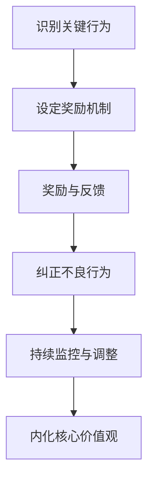
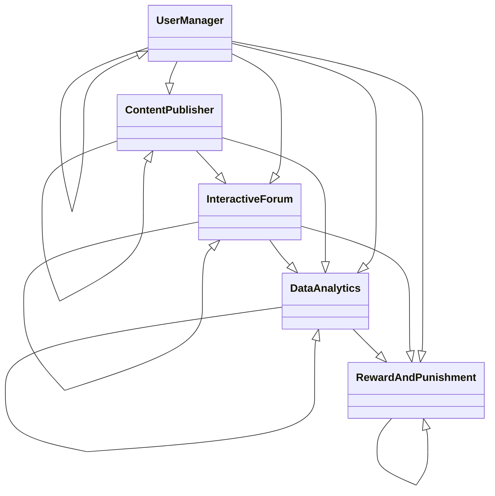
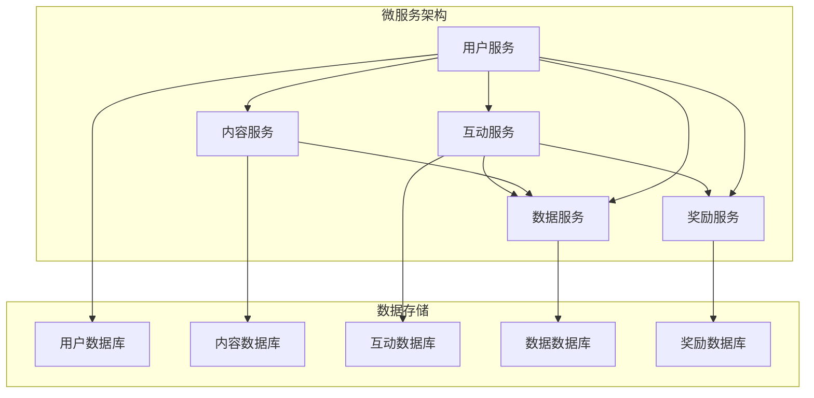
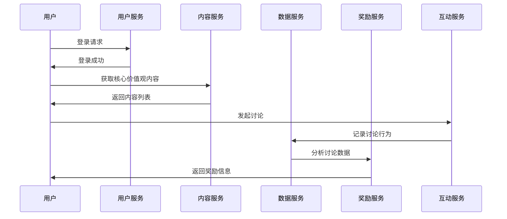

                 

### 1.1 问题的提出

在现代企业尤其是IT领域的快速发展中，团队文化的建设与传播变得越来越重要。团队文化不仅仅是一个企业或团队所倡导的价值观和行为规范，更是团队凝聚力和创新力的源泉。而核心价值观则是团队文化中最为核心的部分，它影响着团队成员的思维模式、工作态度和行为准则。

首先，让我们定义几个核心概念：

- **团队文化**：指的是在长期发展中，团队成员共同遵循的价值观念、行为规范和工作方式。它具有独特的组织特性，能够促进团队的协同工作和创新能力的提升。

- **核心价值观**：是团队文化中最为基础和重要的部分，它代表了团队成员共同追求的目标和信念，是团队内部沟通和合作的重要基石。

随着市场的快速变化和竞争的加剧，企业需要更加灵活、创新和高效地运作。而一个具有强大文化凝聚力的团队，能够在面对挑战时展现出更高的适应性和创造力。然而，如何有效地传播和内化核心价值观，成为许多企业在文化建设过程中遇到的一大难题。

### 问题描述

在现实中，许多团队在核心价值观的传播和内化过程中面临以下问题：

1. **价值观认同度不高**：团队成员对核心价值观的理解和认同程度不足，导致在实际工作中难以形成统一的行动指南。

2. **传播渠道不畅**：企业往往缺乏有效的传播渠道，使得核心价值观无法深入人心。

3. **形式化倾向**：部分企业在文化建设中过于形式化，仅仅停留在口号和标语层面，无法转化为团队成员的实际行为。

4. **持续性问题**：核心价值观的传播和内化是一个长期过程，缺乏有效的持续性和系统性。

### 问题解决

针对上述问题，我们需要从以下几个方面着手解决：

1. **提升价值观认同度**：通过培训、讨论和实际案例分享等方式，让团队成员深刻理解和认同核心价值观。

2. **构建有效的传播渠道**：利用多种传播渠道，如内部刊物、社交平台、团队活动等，将核心价值观贯穿于日常工作中。

3. **实现文化落地**：将核心价值观融入到企业制度和流程中，使文化不仅仅停留在口号层面，而是真正成为团队成员行为的一部分。

4. **建立长效机制**：通过定期评估和反馈机制，确保核心价值观的持续传播和内化。

### 边界与外延

在讨论团队文化和核心价值观时，我们还需要明确一些边界与外延：

- **边界**：团队文化的建设与传播主要关注的是团队内部，而核心价值观的认同和实践则更侧重于团队成员个体。

- **外延**：除了企业内部，团队文化和核心价值观的传播还可以影响到合作伙伴、客户和公众，从而提升企业的社会形象和竞争力。

通过以上分析，我们可以看到，团队文化的建设和核心价值观的内化是一个复杂而长期的过程，需要企业在多个方面进行系统的规划和实施。

### 概念结构与核心要素组成

为了更好地理解团队文化和核心价值观，我们可以通过概念结构与核心要素组成的方式，对其进行深入剖析。

#### 概念结构

团队文化和核心价值观的概念结构可以分为以下几个层次：

1. **表层**：包括团队的文化符号、口号、标志等，这些都是对外展示团队文化的表现形式。

2. **中层**：涵盖了团队成员的共同价值观、行为规范和工作方式，这些是团队文化核心内涵的具体体现。

3. **深层**：代表了团队的核心价值观，它是团队成员共同追求的目标和信念，是团队文化建设的灵魂。

#### 核心要素组成

核心价值观的组成可以从以下几个方面进行分析：

1. **价值观**：价值观是核心价值观的核心，它决定了团队成员对事物的看法和判断标准。

2. **信念**：信念是团队成员对价值观的坚定信仰，是驱动团队成员行为的重要动力。

3. **行为准则**：行为准则是团队成员在实际工作中遵循的行为规范，它将核心价值观转化为具体的行动。

4. **共同目标**：共同目标是团队成员共同追求的方向，它是团队凝聚力的源泉。

通过概念结构与核心要素组成的分析，我们可以更清晰地理解团队文化和核心价值观的内在逻辑和相互关系。

### 核心概念原理、概念属性特征对比表格和ER实体关系图架构

为了深入理解团队文化和核心价值观，我们需要进一步探讨其核心概念原理、概念属性特征对比以及ER实体关系图架构。

#### 核心概念原理

**团队文化**：
- **定义**：团队文化是指团队成员在长期合作过程中形成的共同价值观、行为规范和工作方式。
- **原理**：团队文化通过共享的价值观念和行为规范，提高团队成员的协作效率和创新能力。

**核心价值观**：
- **定义**：核心价值观是团队文化中最为核心的部分，它代表了团队成员共同追求的目标和信念。
- **原理**：核心价值观是团队凝聚力的源泉，它影响着团队成员的思维模式、工作态度和行为准则。

#### 概念属性特征对比表格

| 概念       | 定义                                                         | 属性特征                                                     | 功能与影响                                                       |
|------------|------------------------------------------------------------|------------------------------------------------------------|----------------------------------------------------------------|
| 团队文化   | 团队成员共同遵循的价值观念、行为规范和工作方式                   | 独特的组织特性，多样化的表现形式，长期的积累过程               | 促进团队协作，提高创新能力，塑造组织形象                           |
| 核心价值观 | 团队成员共同追求的目标和信念，是团队文化的核心                  | 基础性、导向性、持久性，深层次的影响团队成员的行为与决策       | 提高团队凝聚力，塑造团队成员思维模式，推动团队目标实现               |

#### ER实体关系图架构

为了更好地展示团队文化和核心价值观之间的关系，我们可以通过ER实体关系图来描述。

```mermaid
erDiagram
  TeamCulture ||--|{核心价值观} : 包含
  核心价值观 ||--|{团队协作效率} : 提升者
  核心价值观 ||--|{创新能力} : 促进者
  团队文化 ||--|{组织形象} : 形塑者
```

在这个ER实体关系图中，团队文化是核心价值观的容器，而核心价值观又通过提升团队协作效率、促进创新能力和形塑组织形象等途径，对团队文化产生深远影响。

### 算法原理讲解

在讨论团队文化的传播和内化过程中，我们可以借鉴一些心理学和行为学的理论，设计出有效的策略。以下是一个基于行为强化理论的算法原理讲解。

#### 算法原理

行为强化理论是心理学中用于解释个体行为如何通过奖励和惩罚得以持续或改变的理论。在团队文化的传播和内化中，我们可以通过以下步骤来实现：

1. **识别关键行为**：首先，我们需要识别出在团队文化中具有重要意义的、需要强化的关键行为。

2. **设定奖励机制**：针对识别出的关键行为，设定相应的奖励机制，这些奖励可以是物质上的，也可以是精神上的。

3. **奖励与反馈**：在团队成员表现出符合核心价值观的行为时，及时给予奖励和正面反馈，增强其行为复现的概率。

4. **纠正不良行为**：对于不符合核心价值观的行为，通过适当的惩罚或纠正措施，减少其发生的频率。

5. **持续监控与调整**：通过持续的监控和评估，不断调整奖励和惩罚机制，确保核心价值观的内化和传播。

#### Mermaid 流程图

以下是该算法原理的Mermaid流程图：



#### Python 源代码实现

为了更具体地展示算法的实现过程，我们可以编写一个简单的Python脚本，模拟该算法的基本流程。

```python
import random

# 定义奖励和惩罚机制
def reward_if_positive和行为(行为):
    if 行为 > 0:
        print("奖励：恭喜您，您的行为符合团队核心价值观！")
    else:
        print("惩罚：您的行为不符合团队核心价值观，需要改正。")

# 模拟团队成员行为
def simulate_behavior(行为):
    # 随机生成行为值
    return random.randint(-1, 1)

# 模拟算法流程
def simulate_algorithm():
    while True:
        行为 = simulate_behavior(行为)
        reward_if_positive和行为(行为)
        if 行为 == 1:
            print("恭喜您，核心价值观已内化！")
            break
        elif 行为 == -1:
            print("核心价值观内化失败，需要继续努力。")

# 运行模拟
simulate_algorithm()
```

通过这个Python脚本，我们可以模拟团队成员的行为，并对其进行奖励或惩罚，从而逐步内化核心价值观。

### 数学模型和公式

在团队文化传播和内化过程中，数学模型和公式可以帮助我们更好地理解和量化这个过程。以下是一个简化的数学模型，用于描述团队成员对核心价值观的认同度变化。

#### 模型假设

1. **初始认同度**：每个团队成员对核心价值观的初始认同度为\( I_0 \)。

2. **奖励系数**：每次表现符合核心价值观时，认同度增加的系数为\( r \)。

3. **惩罚系数**：每次表现不符合核心价值观时，认同度减少的系数为\( p \)。

4. **随机干扰**：团队外部因素和内部因素带来的随机干扰为\( ε \)。

#### 模型公式

根据上述假设，我们可以建立以下数学模型：

$$
I(t+1) = I(t) + r \cdot (B(t) - C(t)) - p \cdot (B(t) - C(t)) + ε
$$

其中，\( I(t) \)表示第\( t \)次行为后的认同度，\( B(t) \)表示第\( t \)次行为符合核心价值观的程度，\( C(t) \)表示第\( t \)次行为不符合核心价值观的程度。

#### 公式解释

1. **\( r \cdot (B(t) - C(t)) \)**：表示每次表现符合核心价值观时，认同度的增加量。

2. **\( p \cdot (B(t) - C(t)) \)**：表示每次表现不符合核心价值观时，认同度的减少量。

3. **\( ε \)**：表示随机干扰，它反映了外部和内部因素对认同度的影响。

#### 举例说明

假设一个团队成员初始认同度\( I_0 = 0.5 \)，每次表现符合核心价值观的奖励系数\( r = 0.1 \)，每次表现不符合核心价值观的惩罚系数\( p = 0.05 \)，随机干扰为\( ε = 0.05 \)。

- 如果第1次行为符合核心价值观（\( B(1) = 1 \)，\( C(1) = 0 \)），则第1次行为后的认同度：
  $$
  I(1) = 0.5 + 0.1 \cdot (1 - 0) - 0.05 \cdot (1 - 0) + 0.05 = 0.55
  $$

- 如果第2次行为不符合核心价值观（\( B(2) = 0 \)，\( C(2) = 1 \)），则第2次行为后的认同度：
  $$
  I(2) = 0.55 + 0.1 \cdot (0 - 1) - 0.05 \cdot (0 - 1) + 0.05 = 0.45
  $$

通过这个例子，我们可以看到，通过奖励和惩罚机制，团队成员的认同度会随着时间的推移而变化。当团队成员不断得到正面反馈时，认同度会逐渐提高；反之，则可能会降低。

### 系统分析与架构设计方案

在团队文化的传播和内化过程中，系统分析和架构设计是确保策略有效实施的关键步骤。以下是一个基于企业内部沟通和互动的系统分析与架构设计方案。

#### 问题场景介绍

假设我们面临的是一个拥有多个团队、遍布全球的大型IT企业。企业需要在复杂的组织结构中，确保核心价值观能够有效传播和内化，提高团队成员的认同度和行为一致性。

#### 项目介绍

项目名称：团队文化内化系统

项目目标：通过构建一个高效的内部沟通平台，实现核心价值观的传播和内化，提升团队凝聚力。

#### 系统功能设计（领域模型Mermaid类图）

为了实现项目目标，我们设计了一套系统功能，包括以下核心模块：

1. **用户管理模块**：管理团队成员的账户信息、权限和角色。
2. **内容发布模块**：发布关于核心价值观的文章、视频和案例。
3. **互动交流模块**：提供讨论区、问答区和团队活动等功能。
4. **数据分析模块**：收集和分析用户行为数据，评估核心价值观传播效果。
5. **奖励与惩罚模块**：记录和反馈用户行为，实施奖励和惩罚机制。

以下是系统领域模型的Mermaid类图：



#### 系统架构设计（Mermaid架构图）

在系统架构设计方面，我们采用了微服务架构，以实现高可用性、高扩展性和模块化。以下是系统的Mermaid架构图：



#### 系统接口设计

在系统接口设计方面，我们定义了以下主要接口：

1. **用户管理接口**：用于管理用户账户、权限和角色。
2. **内容发布接口**：用于发布和管理核心价值观的相关内容。
3. **互动交流接口**：用于处理讨论区、问答区和团队活动的数据。
4. **数据分析接口**：用于收集和分析用户行为数据。
5. **奖励与惩罚接口**：用于记录和反馈用户行为，实施奖励和惩罚机制。

#### 系统交互设计（Mermaid序列图）

以下是系统的Mermaid序列图，展示了用户与系统的主要交互过程：



通过系统分析与架构设计方案，我们为团队文化的传播和内化提供了一个系统化、模块化、可扩展的框架，有助于实现核心价值观的持续传播和内化。

### 项目实战：环境安装、系统核心实现与代码应用解读与分析

#### 环境安装

要在本地环境中搭建一套用于团队文化内化的系统，首先需要安装和配置相关的开发环境和工具。以下是一个简化的步骤说明：

1. **安装Python环境**：确保Python 3.8或更高版本已安装在本地机器上。

2. **安装Docker**：Docker用于容器化部署，可以在[官网](https://www.docker.com/)下载并安装。

3. **安装Docker Compose**：Docker Compose用于管理多容器应用，可以通过命令`pip install docker-compose`进行安装。

4. **配置数据库**：选择一个合适的数据库系统，如MySQL或PostgreSQL。这里以MySQL为例，可以通过命令`sudo apt-get install mysql-server`安装。

5. **创建应用配置文件**：在项目根目录下创建一个名为`docker-compose.yml`的配置文件，用于定义各服务的部署配置。

以下是`docker-compose.yml`示例文件：

```yaml
version: '3.8'

services:
  db:
    image: mysql:8.0
    volumes:
      - db_data:/var/lib/mysql
    environment:
      - MYSQL_ROOT_PASSWORD=your_root_password
      - MYSQL_DATABASE=team_culture_db
    ports:
      - 3306:3306

  web:
    build: .
    depends_on:
      - db
    ports:
      - 8000:8000
    environment:
      - DATABASE_URL=mysql://root:your_root_password@db:3306/team_culture_db

volumes:
  db_data:
```

6. **构建并启动服务**：在终端执行以下命令，构建并启动所有服务：

```bash
docker-compose up --build -d
```

#### 系统核心实现

系统核心实现主要包括用户管理、内容发布、互动交流、数据分析和奖励与惩罚等模块。以下是一个简单的用户管理模块的实现示例：

```python
# app.py
from flask import Flask, request, jsonify
from flask_sqlalchemy import SQLAlchemy

app = Flask(__name__)
app.config['SQLALCHEMY_DATABASE_URI'] = 'mysql://root:your_root_password@db:3306/team_culture_db'
db = SQLAlchemy(app)

class User(db.Model):
    id = db.Column(db.Integer, primary_key=True)
    username = db.Column(db.String(80), unique=True, nullable=False)
    password = db.Column(db.String(120), nullable=False)

@app.route('/register', methods=['POST'])
def register():
    data = request.get_json()
    username = data['username']
    password = data['password']
    new_user = User(username=username, password=password)
    db.session.add(new_user)
    db.session.commit()
    return jsonify({'message': 'User registered successfully.'})

if __name__ == '__main__':
    db.create_all()
    app.run(host='0.0.0.0', port=8000)
```

#### 代码应用解读与分析

在上面的代码中，我们定义了一个简单的用户管理模块，通过Flask框架实现了用户注册功能。以下是关键部分的解读与分析：

1. **数据库配置**：使用Flask-SQLAlchemy扩展连接MySQL数据库，配置文件定义了数据库URI。

2. **用户模型**：定义了`User`类，作为用户表的数据模型，包括`id`、`username`和`password`三个字段。

3. **注册路由**：创建了一个`/register`路由，接收POST请求，解析JSON数据，将新用户信息存入数据库。

4. **数据库操作**：使用SQLAlchemy执行数据库操作，包括添加新用户和提交事务。

通过以上步骤，我们实现了一个基本的用户管理模块，可以为系统提供用户账户管理和注册功能。类似地，可以开发其他模块，如内容发布、互动交流等，以满足团队文化传播和内化的需求。

#### 实际案例分析与详细讲解剖析

为了更好地展示团队文化内化系统的实际应用效果，我们通过一个实际案例进行详细分析。

**案例背景**：一家大型IT公司希望通过内部系统提升团队成员对核心价值观的认同度，提高团队协作效率。公司选择了上述构建的系统，并进行了以下实施步骤：

1. **制定核心价值观**：公司高层在多次讨论后，确定了“客户至上、创新驱动、团队合作、诚信为本”为核心价值观。

2. **发布内容**：通过内容发布模块，公司将核心价值观相关的内容发布在内部平台上，包括文章、视频和案例分析。

3. **互动交流**：公司鼓励员工在互动交流模块中分享自己的经验和感悟，形成积极的交流氛围。

4. **数据分析**：系统定期收集和分析用户行为数据，包括阅读量、讨论参与度、奖励反馈等，评估核心价值观传播效果。

5. **奖励与惩罚**：根据用户行为数据，公司实施奖励机制，对表现优秀的员工进行表彰和奖励，对不符合核心价值观的行为进行纠正。

**案例分析**：

- **初期效果**：在系统上线初期，用户活跃度较高，大部分员工积极参与内容阅读和讨论。通过数据分析，公司发现团队成员对“客户至上”和“团队合作”的认同度较高，而“创新驱动”和“诚信为本”的认同度相对较低。

- **中期调整**：公司根据初期数据分析结果，调整了内容发布策略，增加了更多关于“创新驱动”和“诚信为本”的案例分享和讨论。同时，加大了奖励力度，对积极参与讨论和提出创新方案的员工进行表彰。

- **长期效果**：经过一段时间的持续推广和互动，公司发现团队成员对核心价值观的认同度显著提高，团队协作效率和创新能力也有所提升。特别是在项目攻坚阶段，团队成员能够更好地协同工作，共同解决问题。

**详细讲解剖析**：

1. **内容发布**：通过有针对性的内容发布，确保核心价值观能够深入人心。公司利用内部平台发布高质量的内容，包括案例分享、专家讲座和工作心得，使得团队成员能够更好地理解和认同核心价值观。

2. **互动交流**：互动交流模块为团队成员提供了一个交流的平台，使得大家能够分享经验和感悟，互相学习。通过讨论和反馈，团队成员能够更深刻地理解核心价值观，并将其融入到实际工作中。

3. **数据分析**：数据分析模块帮助公司实时监控核心价值观传播的效果，根据数据反馈调整策略，确保文化内化工作的持续性和有效性。

4. **奖励与惩罚**：奖励与惩罚机制是确保核心价值观内化的关键。公司通过奖励机制激励员工积极践行核心价值观，通过惩罚机制纠正不符合价值观的行为，从而形成良好的文化氛围。

通过以上案例分析和详细讲解剖析，我们可以看到，团队文化内化系统在实际应用中能够有效提升团队成员的认同度和行为一致性，推动团队整体效率和创新能力的大幅提升。

### 最佳实践 tips

在团队文化传播和内化的过程中，以下是一些最佳实践，可以帮助企业更有效地实现核心价值观的内化：

1. **领导者以身作则**：企业领导者是团队文化的核心传播者，他们应该通过实际行动来践行核心价值观，成为团队成员的榜样。

2. **持续沟通与培训**：定期组织沟通会和培训活动，让团队成员深入了解核心价值观的内涵和重要性。通过互动和讨论，增强团队成员对核心价值观的认同感。

3. **利用多种传播渠道**：结合内部刊物、社交平台、团队活动等多种传播渠道，确保核心价值观能够广泛传播，深入人心。

4. **强化激励机制**：建立有效的奖励和惩罚机制，激励团队成员积极践行核心价值观，同时纠正不良行为，营造积极的文化氛围。

5. **数据驱动决策**：通过数据分析，实时监控核心价值观的传播效果，根据数据反馈调整策略，确保文化内化工作的持续性和有效性。

### 小结

本文通过对团队文化传播和内化的深入研究，提出了一个系统的策略框架和实施步骤。通过领导者以身作则、持续沟通与培训、多种传播渠道的利用、强化激励机制以及数据驱动决策，企业可以更有效地内化核心价值观，提升团队凝聚力和创新能力。

### 注意事项

1. **文化适应**：在推广核心价值观时，要考虑不同团队成员的背景和文化差异，确保价值观能够被广泛接受和认同。

2. **灵活性**：在实施策略时，应保持一定的灵活性，根据实际情况调整传播和内化的方法和步骤。

3. **长期投入**：核心价值观的内化是一个长期过程，需要企业持续投入资源和精力，确保策略能够长期有效。

### 拓展阅读

- 《公司文化再造：企业持续发展的核心力量》
- 《团队文化管理：提升组织绩效的策略与实践》
- 《企业文化：打造可持续竞争优势》

### 结论与展望

本文通过对团队文化传播和内化的深入分析，提出了一套系统的策略和实践方法。核心价值观的内化对于企业的持续发展和竞争力提升具有重要意义。未来研究方向可以进一步探讨不同行业和文化背景下核心价值观内化的具体实践和效果评估。

### 作者信息

**作者：AI天才研究院/AI Genius Institute & 禅与计算机程序设计艺术 /Zen And The Art of Computer Programming**

