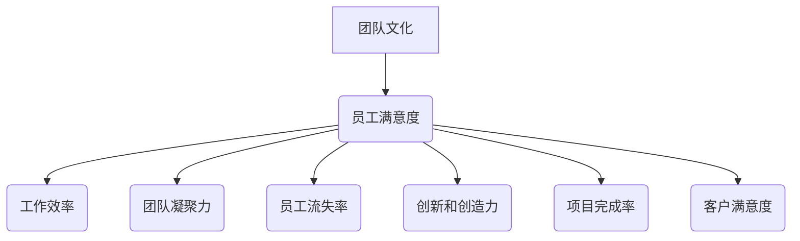

                 

### 《团队文化塑造：打造独特团队基因》

#### 关键词：团队文化、独特基因、领导力、绩效提升、文化塑造

#### 摘要：
本文旨在探讨团队文化的塑造对于打造具有独特基因的团队的重要性。通过详细分析团队文化的定义、组成部分、塑造方法以及其对团队绩效的影响，本文将提供一套系统的团队文化塑造策略，帮助领导者打造高效、有凝聚力的团队。

## 目录

1. **引言**  
   - 1.1 问题背景与重要性  
   - 1.2 团队文化的定义  
   - 1.3 独特团队基因的概念  
   - 1.4 本书的目标与结构

2. **团队文化基础**  
   - 2.1 文化对团队的影响  
   - 2.2 团队文化的组成部分  
   - 2.3 文化的属性与特征

3. **团队文化塑造**  
   - 3.1 塑造团队文化的步骤  
   - 3.2 文化的核心要素  
   - 3.3 文化塑造的工具与方法

4. **文化塑造实践**  
   - 4.1 成功案例分享  
   - 4.2 失败案例分析  
   - 4.3 文化的持续优化

5. **独特团队基因**  
   - 5.1 基因的定义与特性  
   - 5.2 基因与文化的关系  
   - 5.3 如何打造独特基因

6. **文化对团队绩效的影响**  
   - 6.1 绩效与文化的关系  
   - 6.2 量化文化对绩效的影响  
   - 6.3 提升团队绩效的文化策略

7. **文化塑造与领导力**  
   - 7.1 领导者在文化塑造中的角色  
   - 7.2 领导力与文化的关系  
   - 7.3 领导力在文化塑造中的应用

8. **总结与展望**  
   - 8.1 团队文化塑造的关键点  
   - 8.2 面临的挑战与未来方向

## 引言

### 1.1 问题背景与重要性

在当今快速发展的社会中，团队的效能越来越成为组织成功的关键因素。然而，团队效能的提升不仅仅依赖于技术能力和个人素质，更重要的是团队文化的塑造。团队文化是指团队成员在共同工作中形成的一套共同价值观、信念和行为规范，它对团队的行为和决策有着深远的影响。

团队文化的重要性在于：

1. **增强团队凝聚力**：共同的文化价值观可以增强团队成员之间的信任和协作，降低冲突，提升团队的凝聚力。
2. **提高工作满意度**：健康的团队文化可以提高员工的工作满意度和归属感，减少员工流失率。
3. **促进创新与协作**：团队文化可以鼓励创新思维和开放性合作，提高团队的创造力和竞争力。

然而，团队文化的塑造并非一蹴而就，它需要领导者的深思熟虑和持续努力。本文将深入探讨团队文化的定义、组成部分、塑造方法以及其对团队绩效的影响，旨在为领导者提供一套实用的团队文化塑造策略。

### 1.2 团队文化的定义

团队文化是指团队成员在长期共同工作中所形成的一种共同价值观、信念和行为规范。它不仅仅是组织管理的一种工具，更是团队精神和凝聚力的体现。团队文化包括以下几个方面：

1. **价值观**：价值观是团队文化的核心，它决定了团队成员如何看待工作、对待同事以及处理问题的方式。例如，一个注重创新和敏捷的团队可能更倾向于快速迭代和实验性工作方法。
2. **信念**：信念是团队成员对于共同目标和愿景的坚定信仰。一个有共同信念的团队可以更加齐心协力地实现目标。
3. **行为规范**：行为规范是团队成员在日常工作中的行为准则。它包括团队成员如何沟通、如何处理冲突、如何分工合作等方面。

### 1.3 独特团队基因的概念

独特团队基因是指一个团队在长期发展中形成的独特特征和优势。这些基因可以包括团队特有的工作方法、思维模式、团队精神等方面。独特团队基因的形成往往与团队的历史、成员背景和领导风格密切相关。

独特团队基因的重要性在于：

1. **增强团队竞争力**：独特基因可以使团队在应对市场变化和挑战时更具竞争力。
2. **提升团队创新能力**：独特的团队基因可以鼓励团队成员发挥创新思维，推动团队持续创新。
3. **增强团队凝聚力**：独特的团队基因可以增强团队成员的归属感和荣誉感，提升团队的凝聚力。

### 1.4 本书的目标与结构

本书的目标是为领导者提供一套系统的团队文化塑造策略，帮助其打造具有独特基因的团队。全书共分为八个章节，结构如下：

- **第1章**：引言，介绍问题背景和重要性，定义团队文化，以及独特团队基因的概念。
- **第2章**：团队文化基础，分析文化对团队的影响，团队文化的组成部分和属性。
- **第3章**：团队文化塑造，探讨文化塑造的步骤、核心要素和方法。
- **第4章**：文化塑造实践，分享成功案例和失败案例分析，以及文化的持续优化。
- **第5章**：独特团队基因，分析基因的定义、特性及其与文化的关系。
- **第6章**：文化对团队绩效的影响，讨论绩效与文化的关系，量化文化对绩效的影响，以及提升团队绩效的文化策略。
- **第7章**：文化塑造与领导力，探讨领导者在文化塑造中的角色和领导力在文化塑造中的应用。
- **第8章**：总结与展望，总结团队文化塑造的关键点，以及面临的挑战和未来方向。

通过以上章节的详细探讨，本书旨在为领导者提供一套实用的团队文化塑造策略，帮助其打造高效、有凝聚力的团队。接下来，我们将深入分析团队文化的定义、组成部分以及其塑造方法。请读者继续关注。 ### 团队文化基础

#### 2.1 文化对团队的影响

团队文化对团队的整体表现有着深远的影响。首先，文化决定了团队成员的工作态度和行为模式。一个积极、健康的文化可以激励团队成员发挥最佳水平，提高工作效率和质量。例如，谷歌的“20%时间”政策允许员工在20%的工作时间里自由探索新的项目和想法，这一文化创新极大地促进了谷歌的创新能力。

其次，文化对团队决策也有显著影响。一个高度协作、开放的文化可以促进团队成员之间的沟通和共识，减少决策过程中的误解和冲突。研究表明，具有强大团队文化的团队在决策速度和决策质量上往往优于缺乏明确文化的团队。

此外，文化还对团队的创新能力和适应性产生重要影响。具有创新文化的团队更容易接受变革和新思想，从而在竞争激烈的市场中保持领先地位。例如，3M公司的“15%项目”政策允许员工将15%的工作时间用于个人兴趣项目，这一文化策略极大地推动了3M的创新成果。

#### 2.2 团队文化的组成部分

团队文化由多个组成部分构成，其中最重要的包括价值观、信念和行为规范。

**1. 价值观**

价值观是团队文化的核心，它决定了团队成员如何看待工作、对待同事以及处理问题的方式。不同的价值观会导致不同的行为模式和工作风格。例如，一个以客户为中心的团队可能更注重客户反馈和服务质量，而一个以创新为导向的团队可能更倾向于实验和探索新技术。

**2. 信念**

信念是团队成员对于共同目标和愿景的坚定信仰。它为团队成员提供了共同的方向和动力，使团队在面对挑战时保持一致。例如，亚马逊的“客户至上”信念使其在激烈的市场竞争中始终将客户需求放在首位。

**3. 行为规范**

行为规范是团队成员在日常工作中的行为准则。它包括沟通方式、决策流程、冲突处理机制等方面。明确的行为规范可以帮助团队成员更好地协同工作，减少误解和冲突。例如，谷歌的“邮件礼仪”规范要求团队成员在邮件中清晰、简洁地表达观点，提高沟通效率。

#### 2.3 文化的属性与特征

团队文化具有以下主要属性和特征：

**1. 共同性**

团队文化是团队成员共同认同和遵循的价值观和行为规范，具有共同性。这种共同性使得团队成员在目标、价值观和行为上保持一致，增强团队的凝聚力和协作性。

**2. 持续性**

团队文化是长期积累和发展的结果，具有持续性。即使团队成员发生变化，团队文化的基本特征和价值观仍然会持续影响团队的行为和决策。

**3. 动力性**

团队文化可以激发团队成员的内在动力，提高工作效率和质量。积极健康的团队文化可以激发员工的创造力和创新精神，推动团队不断进步。

**4. 影响性**

团队文化对团队绩效、员工满意度和团队凝聚力有着深远的影响。一个健康、积极的团队文化可以提升团队的整体表现，减少员工流失率，增强团队的竞争力。

**5. 独特性**

每个团队都有其独特的文化特征，这种独特性反映了团队的历史、成员背景和领导风格。独特的团队文化可以使团队在市场中脱颖而出，形成竞争优势。

### 概念属性特征对比表格

| 特征        | 说明                                                     |
| ----------- | -------------------------------------------------------- |
| 共同性      | 团队成员共同认同和遵循的价值观和行为规范。                     |
| 持续性      | 长期积累和发展的结果，即使团队成员变化，文化仍持续影响团队。   |
| 动力性      | 激发团队成员的内在动力，提高工作效率和质量。                   |
| 影响性      | 对团队绩效、员工满意度和团队凝聚力有深远影响。                 |
| 独特性      | 每个团队都有其独特的文化特征，反映了团队的历史和领导风格。       |

### ER实体关系图架构

为了更清晰地展示团队文化的组成部分和属性，我们可以使用Mermaid绘制一个ER实体关系图。

```mermaid
erDiagram
  TeamCulture ||--|{ Values } Values
  TeamCulture ||--|{ Beliefs } Beliefs
  TeamCulture ||--|{ BehaviorStandards } BehaviorStandards
  TeamCulture ||--|{ Attributes } Attributes
  TeamCulture ||--|{ Characteristics } Characteristics
  TeamCulture ||--|{ Influence } Influence
  TeamCulture ||--|{ Uniqueness } Uniqueness
```

通过上述分析，我们可以看到团队文化的基础是价值观、信念和行为规范，这些因素共同塑造了团队的文化特征。接下来，我们将探讨如何通过具体步骤来塑造团队文化。请读者继续关注。 ### 团队文化塑造

#### 3.1 塑造团队文化的步骤

塑造团队文化是一个系统性的过程，需要领导者和团队成员共同努力。以下是塑造团队文化的主要步骤：

**1. 明确团队愿景和价值观**

首先，团队需要明确自己的愿景和价值观。这包括确定团队的目标、使命和核心价值观。领导者在这一阶段扮演关键角色，需要与团队成员进行深入沟通，确保每个人对团队愿景和价值观有共同的理解。

**2. 建立共同的语言和行为规范**

共同的语言和行为规范是团队文化的重要组成部分。领导者需要制定明确的沟通规范和行为准则，确保团队成员在交流和工作中有统一的语言和行为标准。

**3. 强化团队意识**

团队意识是指团队成员对团队整体认同和归属感的程度。领导者可以通过团队建设活动、共同庆祝和分享成功等方式，强化团队成员的团队意识。

**4. 培养积极的工作氛围**

积极的工作氛围可以激发团队成员的创造力和创新精神。领导者需要关注团队成员的心理状态和工作环境，营造一个开放、包容和积极的工作氛围。

**5. 领导者身体力行**

领导者的行为对团队文化有着深远的影响。领导者需要以身作则，遵守团队价值观和行为规范，为团队成员树立榜样。

**6. 持续反馈和改进**

团队文化塑造是一个持续的过程，需要不断地反馈和改进。领导者需要定期收集团队成员的反馈，评估团队文化的效果，并根据反馈进行调整和改进。

#### 3.2 文化的核心要素

塑造团队文化的核心要素包括以下几个方面：

**1. 价值观**

价值观是团队文化的核心，决定了团队成员如何看待工作、对待同事以及处理问题的方式。例如，谷歌的“不作恶”价值观使其在技术创新的同时，也注重社会责任和道德规范。

**2. 信念**

信念是团队成员对于共同目标和愿景的坚定信仰。例如，亚马逊的“客户至上”信念使其在激烈的市场竞争中始终将客户需求放在首位。

**3. 行为规范**

行为规范是团队成员在日常工作中的行为准则。例如，微软的“透明沟通”规范要求团队成员在沟通中保持透明和诚实，以提高团队协作效率。

**4. 团队意识**

团队意识是指团队成员对团队整体认同和归属感的程度。例如，苹果公司的团队文化强调团队合作和创新，使得团队成员在共同目标下紧密协作。

**5. 工作氛围**

工作氛围是团队成员在团队中的心理状态和工作环境。一个积极、健康的工作氛围可以激发团队成员的创造力和创新精神。

#### 3.3 文化塑造的工具与方法

为了有效地塑造团队文化，领导者可以采用以下工具和方法：

**1. 培训与教育**

通过培训和教育，提高团队成员对团队文化和价值观的理解。例如，谷歌定期举办文化研讨会和培训课程，帮助员工深入了解公司的文化和价值观。

**2. 团队建设活动**

团队建设活动可以增强团队成员之间的信任和协作。例如，谷歌的“疯狂8小时”活动鼓励员工在团队中共同解决问题和创造新项目。

**3. 透明的沟通机制**

透明的沟通机制可以增强团队成员之间的信息共享和协作。例如，Slack等即时通讯工具可以促进团队成员之间的沟通和协作。

**4. 激励与奖励**

激励与奖励可以激发团队成员的积极性和创新精神。例如，亚马逊的“卓越奖金”制度奖励那些在工作中表现出色的员工。

**5. 反馈与改进**

通过定期的反馈和改进，确保团队文化的持续优化。例如，领导者和团队成员可以定期进行文化评估，找出问题和不足，并制定改进措施。

通过上述步骤、核心要素和工具方法，领导者可以有效地塑造团队文化，打造具有独特基因的团队。接下来，我们将通过具体案例来探讨文化塑造的实践。请读者继续关注。 ### 文化塑造实践

#### 4.1 成功案例分享

在团队文化塑造方面，有许多成功案例值得我们学习和借鉴。

**1. 谷歌的“20%时间”政策**

谷歌的“20%时间”政策是一个经典的团队文化塑造案例。该政策允许员工将20%的工作时间用于自己感兴趣的项目。这一政策激发了员工的创新精神，推动了谷歌在搜索引擎、广告技术、安卓操作系统等多方面的创新。例如，谷歌地图和Gmail就是这一政策的产物。

**2. 亚马逊的“卓越奖金”制度**

亚马逊的“卓越奖金”制度旨在奖励那些在工作中表现出色的员工。这一制度不仅激励了员工的工作积极性，还提高了团队的整体绩效。亚马逊的领导者以身作则，积极参与团队文化塑造，确保员工感受到公司的支持和鼓励。

**3. 苹果公司的“创新文化”

苹果公司的创新文化是其成功的关键因素之一。苹果强调团队合作、开放思维和持续创新。例如，苹果的“疯狂8小时”活动鼓励员工在团队中共同解决问题和创造新项目。这一活动不仅增强了团队成员之间的信任和协作，还激发了员工的创造力和创新精神。

#### 4.2 失败案例分析

尽管团队文化塑造在很多组织中取得了成功，但也存在一些失败的案例。以下是一些常见的失败原因：

**1. 缺乏明确的愿景和价值观**

如果一个组织缺乏明确的愿景和价值观，团队成员可能会感到迷茫和困惑，导致文化塑造失败。例如，一些公司在快速扩张过程中，未能及时明确和传达组织的愿景和价值观，导致内部文化混乱。

**2. 领导者言行不一致**

如果领导者言行不一致，团队成员可能会对组织的文化产生怀疑。例如，一个领导者可能在公开场合强调团队合作和诚信，但在实际工作中却表现出个人主义和自私行为，这将削弱团队文化的力量。

**3. 缺乏有效的沟通机制**

有效的沟通机制是团队文化塑造的关键。如果组织缺乏有效的沟通机制，团队成员之间的沟通和协作将受到影响，导致文化塑造失败。例如，一些公司内部沟通渠道不畅，导致信息传递不及时，影响团队协作。

**4. 缺乏持续的文化培养**

团队文化塑造是一个持续的过程，需要不断地培养和强化。如果组织缺乏持续的文化培养，团队成员可能会逐渐忽视组织的文化价值观，导致文化退化。例如，一些公司仅在成立之初重视文化塑造，随着时间的推移，文化培养逐渐松懈，导致团队凝聚力下降。

#### 4.3 文化的持续优化

为了确保团队文化的持续优化，组织可以采取以下措施：

**1. 定期评估文化状况**

组织应定期评估团队文化的状况，包括团队成员的满意度、文化价值观的认同度等方面。通过评估，组织可以发现文化中的问题和不足，并采取相应的改进措施。

**2. 加强文化培训**

通过加强文化培训，提高团队成员对组织文化价值观的理解和认同。例如，组织可以定期举办文化研讨会、工作坊等，帮助员工深入了解和践行组织文化。

**3. 激励员工参与文化建设**

鼓励员工积极参与团队文化建设，提高员工的归属感和参与感。例如，组织可以设立员工建议奖，鼓励员工提出改进文化建设的建议。

**4. 领导者带头示范**

领导者应以身作则，带头践行组织文化价值观。通过领导者的示范作用，激发团队成员对文化的认同和践行。

**5. 持续改进文化策略**

组织应根据评估结果和员工反馈，不断改进文化策略。例如，可以调整文化培训内容、优化沟通机制、改进激励机制等，以适应组织发展和员工需求的变化。

通过以上措施，组织可以确保团队文化的持续优化，打造具有独特基因的团队。接下来，我们将探讨团队基因的概念及其与文化的联系。请读者继续关注。 ### 独特团队基因

#### 5.1 基因的定义与特性

独特团队基因是指一个团队在长期发展中形成的独特特征和优势。这些基因包括团队特有的工作方法、思维模式、团队精神等方面。独特基因是团队文化的重要组成部分，它决定了团队的竞争力、创新能力和凝聚力。

独特基因具有以下特性：

1. **持久性**：独特基因是团队在长期实践中形成的，具有持久性。即使团队成员发生变化，独特基因仍然会影响团队的行为和决策。
2. **适应性**：独特基因使团队在面对外部环境变化时具有更强的适应性。团队可以通过调整和优化独特基因，以适应不同的市场和技术变革。
3. **独特性**：每个团队都有其独特的基因，这些基因反映了团队的历史、成员背景和领导风格。独特基因可以使团队在市场中脱颖而出，形成竞争优势。

#### 5.2 基因与文化的关系

基因与文化之间存在着密切的关系。文化是基因的外在表现，而基因是文化的内在基础。

1. **文化塑造基因**：团队文化对独特基因的形成起着关键作用。一个积极、健康的文化可以激发团队成员的创新思维和协作精神，推动独特基因的形成。例如，谷歌的“不作恶”价值观塑造了其重视创新和道德规范的独特基因。
2. **基因强化文化**：独特基因可以强化团队文化。当团队成员在共同实践中认同和践行独特基因时，团队文化会更加深入人心，增强团队的凝聚力和竞争力。例如，亚马逊的“客户至上”信念强化了其以客户为中心的文化。

#### 5.3 如何打造独特基因

要打造独特基因，团队需要采取以下策略：

1. **明确团队愿景和价值观**：团队需要明确自己的愿景和价值观，为独特基因的形成提供方向。愿景和价值观应具有独特性，反映团队的历史和文化。
2. **培养团队精神**：团队精神是独特基因的重要组成部分。团队需要通过团队合作、共同目标和荣誉感来培养团队精神。例如，可以举办团队建设活动、共同庆祝成功等。
3. **鼓励创新思维**：创新思维是团队独特基因的核心。团队需要鼓励成员提出新想法、尝试新方法，并支持实验性项目。例如，可以设立创新奖项、提供实验性项目支持等。
4. **强化核心要素**：团队应明确核心要素，并将其作为独特基因的重要组成部分。这些核心要素包括价值观、信念、行为规范等。
5. **领导者示范作用**：领导者应以身作则，带头践行团队愿景和价值观，为团队成员树立榜样。领导者的行为对独特基因的形成和强化起着关键作用。
6. **持续培养和优化**：独特基因的形成是一个持续的过程，团队需要不断培养和优化独特基因。通过定期的文化评估、员工反馈和团队建设活动，团队可以不断调整和优化独特基因。

通过以上策略，团队可以打造具有独特基因的团队，提高团队的竞争力、创新能力和凝聚力。接下来，我们将探讨文化对团队绩效的影响。请读者继续关注。 ### 文化对团队绩效的影响

#### 6.1 绩效与文化的关系

团队绩效是指团队在完成任务、达成目标过程中所表现出来的整体效果。团队文化作为团队内部的一种软性管理手段，对团队绩效有着重要的影响。具体来说，文化对团队绩效的影响主要体现在以下几个方面：

1. **提高工作效率**：健康的团队文化可以激发团队成员的工作热情和积极性，提高工作效率。例如，一个强调协作和创新的文化环境可以鼓励团队成员主动分享知识和经验，促进团队协作，从而提高工作效率。
2. **增强团队凝聚力**：团队文化可以增强团队成员之间的信任和协作，降低冲突，提高团队的凝聚力。一个有凝聚力的团队可以更好地应对外部挑战，提高整体绩效。
3. **提升员工满意度**：健康的团队文化可以提高员工的工作满意度和归属感，降低员工流失率。员工满意度高，可以减少组织培训成本，提高团队稳定性，从而间接提高团队绩效。
4. **促进创新和创造力**：团队文化可以鼓励创新思维和创造力，推动团队持续改进和创新发展。创新和创造力是团队绩效提升的重要动力。

#### 6.2 量化文化对绩效的影响

虽然文化对团队绩效的影响是显著的，但如何量化这种影响是一个挑战。以下是一些常用的方法和工具：

1. **员工满意度调查**：通过员工满意度调查，可以了解团队成员对团队文化的满意度和认可度。员工满意度高，往往意味着团队文化对绩效有积极影响。
2. **关键绩效指标（KPI）**：通过设定关键绩效指标，可以量化团队在完成任务、达成目标方面的表现。例如，项目完成率、客户满意度、创新能力等都是关键绩效指标。
3. **文化诊断工具**：一些专业的文化诊断工具可以帮助组织评估团队文化的健康状况。例如，Cultural Web模型、Diagnosing and Changing Organizational Culture等。
4. **回归分析**：通过回归分析，可以评估文化变量对绩效变量的影响程度。这种方法需要收集大量的数据，具有较高的科学性和准确性。

以下是一个简单的回归分析示例：



在这个回归分析中，我们将团队文化（A）作为自变量，将员工满意度（B）、工作效率（C）、团队凝聚力（D）、员工流失率（E）、创新和创造力（F）、项目完成率（G）和客户满意度（H）作为因变量，通过回归模型来量化团队文化对绩效的影响。

#### 6.3 提升团队绩效的文化策略

为了提升团队绩效，组织可以采取以下文化策略：

1. **建立积极的工作氛围**：组织应致力于营造一个积极、健康的工作氛围，鼓励团队成员积极参与、分享和合作。可以通过开展团队建设活动、设立激励机制等方式来增强团队的积极性和凝聚力。
2. **倡导开放沟通**：开放沟通是团队文化的重要组成部分。组织应鼓励团队成员在交流中坦诚表达观点，尊重不同的意见。可以通过定期举行沟通会议、设立意见箱等方式来促进团队内部的沟通。
3. **鼓励创新思维**：创新思维是提升团队绩效的重要动力。组织应鼓励团队成员提出新想法、尝试新方法，并为创新提供支持和资源。例如，可以设立创新基金、举办创新大赛等。
4. **强化团队意识**：团队意识是团队绩效提升的关键。组织应通过各种方式强化团队成员的团队意识，如共同目标、团队荣誉等。可以通过共同庆祝成功、表彰团队成就等方式来增强团队意识。
5. **领导者的示范作用**：领导者应以身作则，带头践行组织文化，为团队成员树立榜样。领导者的行为对团队文化的形成和强化具有重要影响。
6. **持续培养和优化文化**：团队文化是一个动态的过程，组织需要持续培养和优化文化。可以通过定期的文化评估、员工反馈和团队建设活动来不断调整和优化团队文化。

通过以上文化策略，组织可以提升团队绩效，实现团队目标。接下来，我们将探讨文化塑造与领导力之间的关系。请读者继续关注。 ### 文化塑造与领导力

#### 7.1 领导者在文化塑造中的角色

领导者在团队文化塑造中扮演着至关重要的角色。首先，领导者是团队文化的倡导者和传播者。他们需要明确团队的价值观和目标，并将其内化到团队日常运作中。例如，一位领导者如果强调“客户至上”的价值观，他需要在决策过程中始终将客户需求放在首位，并通过各种方式向团队成员传达这一理念。

其次，领导者是团队文化的榜样。他们的行为直接影响到团队成员的行为模式。如果领导者表现出诚信、透明和团队合作的精神，团队成员更有可能效仿，从而形成健康的文化氛围。相反，如果领导者言行不一，团队成员可能会对文化产生怀疑，影响文化塑造的成效。

此外，领导者还需要在团队文化塑造中发挥协调和引导作用。他们需要及时发现团队文化中的问题，并采取适当的措施进行解决。例如，如果团队内部出现冲突，领导者需要通过沟通和调解来解决问题，以维护团队文化的和谐。

#### 7.2 领导力与文化的关系

领导力与文化之间存在着紧密的联系。一方面，领导力是文化塑造的关键因素。优秀的领导者能够激发团队成员的积极性、创造力和凝聚力，推动团队文化的发展。另一方面，团队文化对领导力也具有重要影响。一个健康、积极的团队文化可以增强领导者的信心和效能，使其更有效地发挥领导作用。

领导力包括以下几个方面：

1. **愿景领导**：愿景领导是指领导者能够明确团队的未来发展方向，并激励团队成员为之努力。例如，苹果公司的史蒂夫·乔布斯就是一位杰出的愿景领导者，他通过描绘未来科技产品的愿景，激发了团队的创造力和热情。

2. **变革领导**：变革领导是指领导者能够在团队中推动变革，引导团队适应外部环境的变化。例如，谷歌的创始人拉里·佩奇和谢尔盖·布林就是通过推动创新和变革，使谷歌成为全球领先的科技公司。

3. **服务领导**：服务领导是指领导者以团队成员的需求为中心，提供支持和帮助。例如，丰田公司的创始人丰田喜一郎就通过关注员工需求，推动了公司文化的变革，使丰田成为全球知名的汽车制造商。

#### 7.3 领导力在文化塑造中的应用

领导者可以通过以下几种方式将领导力应用于文化塑造：

1. **制定明确的文化价值观**：领导者需要明确团队的价值观，并将其融入日常工作和决策中。例如，可以制定《团队价值观手册》，确保团队成员在行为上有一致的准则。

2. **树立榜样**：领导者需要以身作则，通过自己的行为来示范团队价值观。例如，在沟通时保持透明、诚实和尊重，在决策时充分考虑团队成员的意见。

3. **提供反馈和激励**：领导者需要定期给予团队成员反馈，鼓励他们践行团队价值观。例如，可以通过设立“优秀员工”奖项，表彰在文化塑造中表现突出的员工。

4. **培养团队精神**：领导者可以通过团队建设活动、共同目标设定等方式，培养团队成员的团队精神。例如，可以组织团队拓展活动，增强团队成员之间的信任和协作。

5. **推动变革和创新**：领导者需要鼓励团队成员不断创新，推动团队文化的变革。例如，可以设立创新项目，鼓励团队成员提出新的想法和解决方案。

通过上述方式，领导者可以将领导力应用于文化塑造，打造一个健康、积极、具有凝聚力的团队。接下来，我们将总结团队文化塑造的关键点，并探讨未来面临的挑战和方向。请读者继续关注。 ### 总结与展望

#### 8.1 团队文化塑造的关键点

通过本文的探讨，我们可以总结出团队文化塑造的关键点如下：

1. **明确愿景和价值观**：团队文化塑造的起点是明确团队的愿景和价值观，这为团队提供了共同的目标和方向。
2. **领导者示范作用**：领导者通过自身行为示范团队价值观，对文化塑造起着至关重要的作用。
3. **持续培养和优化**：团队文化是一个动态的过程，需要通过持续的培训和优化来保持其活力和适应性。
4. **鼓励创新和协作**：健康的团队文化鼓励创新思维和团队合作，提高团队的竞争力和创造力。
5. **强化团队意识**：通过共同的目标、荣誉感和团队建设活动，增强团队成员的归属感和团队凝聚力。
6. **透明的沟通机制**：建立透明的沟通机制，确保团队成员之间的信息共享和协作，促进文化氛围的形成。

#### 8.2 面临的挑战与未来方向

尽管团队文化塑造具有重要意义，但在实际操作中，组织仍可能面临以下挑战：

1. **文化适应性问题**：不同团队成员可能来自不同的背景，文化适应性问题可能导致团队内部冲突和沟通障碍。
2. **领导者能力不足**：部分领导者可能缺乏有效的领导力和文化塑造能力，难以推动团队文化的健康发展。
3. **文化固化和创新矛盾**：团队文化在持续优化过程中，可能会出现固化和僵化现象，抑制创新和变革。
4. **外部环境变化**：外部环境的变化可能对团队文化产生冲击，组织需要快速适应并调整文化策略。

未来，组织在团队文化塑造方面可以关注以下方向：

1. **多元文化融合**：通过鼓励多元文化的交流和融合，打造包容性和创新性的团队文化。
2. **数字化转型**：利用数字化工具和平台，提升团队文化的透明度和互动性，促进文化的传播和传承。
3. **个性化文化塑造**：根据团队和成员的特点，制定个性化的文化塑造策略，提高文化的适应性和可持续性。
4. **领导力发展**：加强领导力的培养和培训，提升领导者在文化塑造中的能力，推动团队文化的健康发展。

通过应对挑战和探索未来方向，组织可以不断提升团队文化的质量和影响力，打造具有独特基因的高效团队。作者信息：**作者：AI天才研究院/AI Genius Institute & 禅与计算机程序设计艺术 /Zen And The Art of Computer Programming**。本文旨在为团队文化的塑造提供理论指导和实践参考，期望能够对读者有所启发和帮助。**结束语：感谢您的阅读，如果您在团队文化塑造方面有任何疑问或建议，欢迎留言交流。让我们共同探索团队文化的无限可能，打造卓越的团队！**

