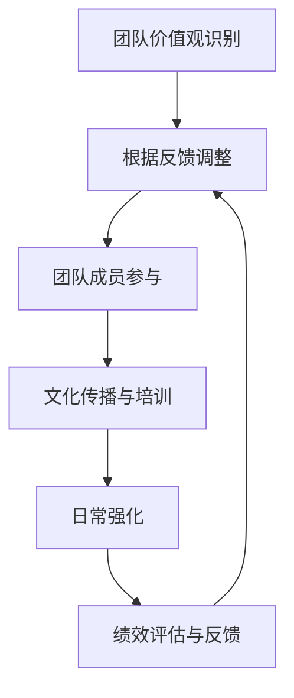
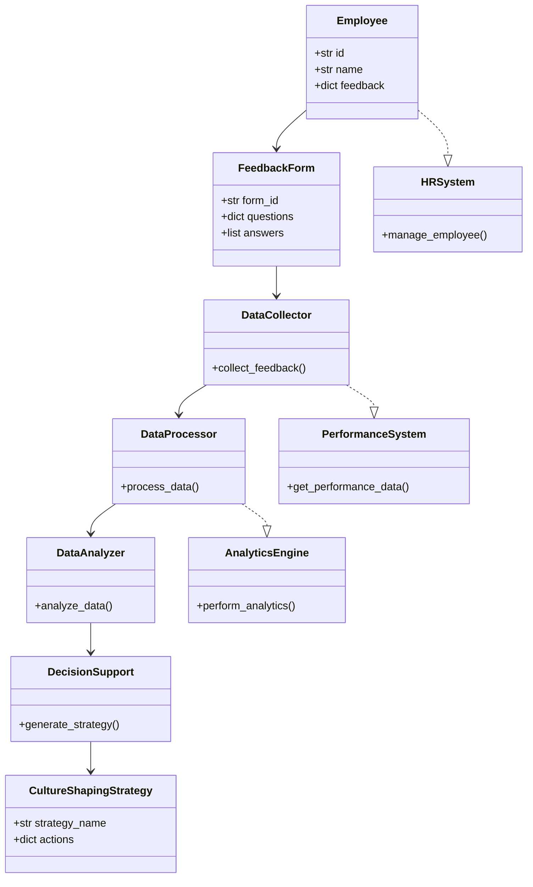
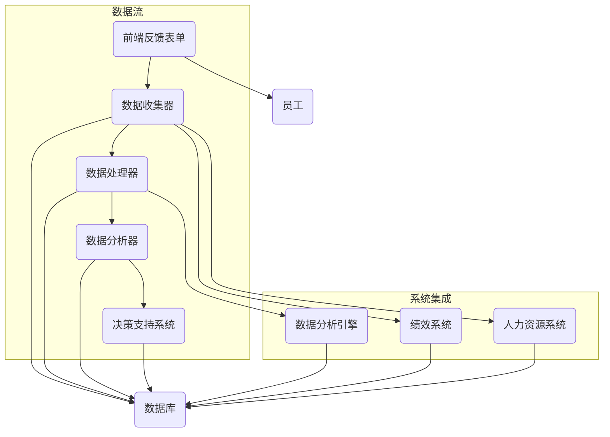
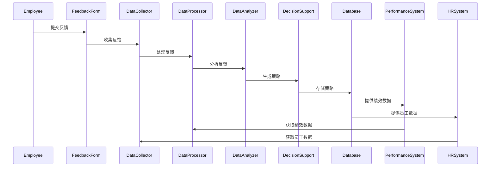

                 

### 团队文化工程：有意识地塑造团队特色

> 关键词：团队文化、团队特色、塑造策略、绩效提升

> 摘要：本文深入探讨了团队文化的核心概念及其在组织绩效中的作用。通过系统地分析团队文化的组成部分和团队特色的塑造方法，本文旨在为读者提供一套有意识地塑造团队特色的具体策略和实践指南，帮助组织实现更高的绩效和可持续发展。

## 引言

在竞争激烈的商业环境中，团队文化已成为企业成功的关键因素。一个积极的、健康的文化不仅能够提升员工的工作满意度，还能增强团队的协作能力和创新能力，从而推动整体绩效的提升。然而，如何有意识地塑造团队特色，使其成为组织的核心竞争力，是许多企业面临的重要课题。

本文将围绕以下核心问题展开讨论：

1. **团队文化的定义与重要性**：我们将定义团队文化，探讨其对组织绩效的影响，并介绍团队文化的基本组成部分。
2. **团队特色的概念与塑造**：我们将详细分析团队特色的概念，讨论如何通过战略和行动塑造团队特色。
3. **团队文化塑造的方法与工具**：我们将介绍一系列实用的方法和技术，帮助团队有意识地塑造其特色。
4. **案例分析**：通过实际案例，我们将展示如何将理论应用于实践，实现团队文化塑造的目标。
5. **最佳实践与总结**：我们将总结最佳实践，并提供一些建议和注意事项，帮助团队在塑造特色的过程中避免常见问题。

让我们一步一步深入探讨这些问题，共同探索团队文化工程的核心策略和实践。

### 团队文化的定义与重要性

团队文化是指一个团队在长期共同工作中形成的一系列共同价值观、信仰、规范和行为模式。它不仅仅是一个团队的精神内核，更是团队行为和决策的指南针。一个强大的团队文化能够为团队提供清晰的愿景和方向，增强团队的凝聚力，提高团队的效率和创新能力。

#### 团队文化的基本组成部分

团队文化由多个方面组成，其中最为关键的是：

1. **价值观**：价值观是团队文化的核心，它决定了团队的信仰和行为准则。一个团队的价值观可以是“客户至上”、“创新为本”、“团队合作”等，这些价值观需要贯穿于团队的所有决策和行为中。
2. **规范**：规范是团队文化的具体体现，它包括团队的日常工作流程、沟通方式、决策机制等。规范应该明确且易于遵守，以便团队成员在共同工作中形成一致的行为模式。
3. **行为模式**：行为模式是团队文化的外在表现，包括团队成员之间的互动方式、应对挑战的方式等。积极的行为模式能够促进团队的协作和创新，而消极的行为模式则会阻碍团队的发展。
4. **激励机制**：激励机制是团队文化的重要组成部分，它通过奖励和认可来鼓励团队成员展现积极的行为，从而强化团队文化。

#### 团队文化对组织绩效的影响

团队文化对组织绩效有着深远的影响，主要表现在以下几个方面：

1. **员工满意度**：一个积极的团队文化能够提高员工的工作满意度，因为团队成员之间的信任和尊重能够营造一个友好、支持的工作环境。
2. **协作效率**：团队文化能够促进团队成员之间的协作，减少冲突，提高决策效率。在一个强大的团队文化中，团队成员更愿意分享信息、互相支持和合作。
3. **创新能力**：团队文化鼓励创新思维和尝试新方法，从而推动组织的持续发展和进步。一个支持创新的文化能够激发团队成员的创造力，带来更多的商业机会和竞争优势。
4. **客户满意度**：团队文化也会影响与客户的关系。一个以客户为中心的团队文化能够提高客户满意度，增强品牌忠诚度，从而推动销售额的增长。

#### 团队文化的基本原则

为了建立和维持一个积极的团队文化，企业需要遵循以下基本原则：

1. **透明沟通**：建立开放、透明的沟通机制，鼓励团队成员分享意见和反馈，增强团队的信任和协作。
2. **尊重差异**：尊重团队成员之间的差异，包括个性、背景和观点等，促进多元化思考，激发团队的创造力。
3. **持续改进**：鼓励团队成员不断学习和成长，通过培训和反馈机制提升个人和团队的能力，以实现持续改进。
4. **公平公正**：建立公平公正的激励机制，确保团队成员的努力和贡献得到认可和回报，增强团队的凝聚力。

通过以上原则，企业可以构建一个健康的团队文化，为组织的长期成功奠定坚实的基础。

### 团队特色的概念与塑造

团队特色，是指一个团队在长期运营中形成的一系列独特的、区别于其他团队的特点和行为模式。这些特色不仅反映了团队的价值观和信念，还体现了团队在解决问题和实现目标方面的独特能力。团队特色对于提升团队的竞争力、增强团队的凝聚力和实现组织目标具有重要作用。

#### 团队特色的概念

团队特色可以理解为团队文化的外在表现，它是团队文化在实践中的具体体现。具体来说，团队特色包括以下几个方面：

1. **工作风格**：每个团队都有其独特的工作风格，例如，一些团队可能更注重细节和精度，而另一些团队则更强调速度和创新。
2. **协作模式**：团队特色还体现在团队成员之间的协作模式上。一些团队可能更倾向于分散式协作，鼓励个人发挥特长，而另一些团队则更倾向于集中式协作，强调团队整体的协调。
3. **价值观**：团队特色与团队价值观紧密相关，它反映了团队对于目标、责任和成功的共同认知和追求。
4. **解决问题的方式**：不同的团队在解决问题时会有不同的方法和策略，这些方法策略的积累和沉淀，构成了团队特色。

#### 团队特色的重要性

团队特色的重要性主要体现在以下几个方面：

1. **提升团队凝聚力**：一个具有明确特色的团队能够更好地凝聚团队成员，增强团队的整体归属感和使命感。
2. **增强团队竞争力**：团队特色可以成为团队在市场竞争中的独特优势，帮助团队在竞争中脱颖而出。
3. **提升工作效率**：团队特色有助于团队成员更好地理解和执行团队目标，提高工作效率和效果。
4. **促进组织目标实现**：团队特色有助于团队更好地与组织目标保持一致，推动组织目标的实现。

#### 如何塑造团队特色

要塑造团队特色，企业需要采取一系列有针对性的策略和行动。以下是一些关键步骤：

1. **明确团队愿景和价值观**：企业需要明确团队愿景和价值观，并将其作为团队特色的核心。这有助于团队在行为和决策中保持一致。
2. **培养团队共同经历**：通过组织团队建设活动、共同项目和其他形式的共同经历，增强团队成员之间的联系和认同感。
3. **建立明确的协作机制**：建立适合团队特色的协作机制，如分工合作、跨部门协作等，以促进团队特色的发展。
4. **激励和认可**：通过激励机制和认可，鼓励团队成员展现出团队特色，并奖励那些为团队特色做出贡献的成员。
5. **持续改进和调整**：团队特色不是一成不变的，企业需要根据团队发展和外部环境的变化，不断调整和完善团队特色。

通过以上步骤，企业可以逐步塑造出具有独特竞争力的团队特色，为组织的长期发展提供强大的支持。

### 团队文化塑造的算法原理

为了有效地塑造团队文化，我们需要设计一个系统化的算法。这个算法旨在通过一系列步骤和方法，逐步建立和强化团队特色，从而提升团队的绩效和凝聚力。以下是团队文化塑造算法的基本原理和步骤。

#### 算法的核心概念

团队文化塑造算法的核心概念包括以下几个方面：

1. **团队价值观的识别与定义**：首先要识别和定义团队的核心价值观，这将是后续所有步骤的基础。
2. **团队成员的参与与共识**：确保所有团队成员都参与到团队价值观的讨论和定义中，达成共识。
3. **文化的传播与强化**：通过多种渠道和方式，将团队价值观和文化理念传播到每个团队成员，并在日常工作中不断强化。
4. **绩效评估与反馈**：定期评估团队文化的实施效果，收集反馈，并根据实际情况进行调整。

#### 算法的基本步骤

团队文化塑造算法可以分为以下几个基本步骤：

1. **团队价值观识别**：通过问卷调查、讨论会等形式，收集团队成员对团队价值观的看法和建议。
2. **价值观筛选与定义**：对收集到的意见进行筛选和整合，定义出团队的核心价值观，并形成正式的文件或表述。
3. **团队成员参与**：组织团队价值观的讨论会，确保所有团队成员都能参与到价值观的讨论和共识中。
4. **文化传播与培训**：通过内部培训、会议、海报等形式，将团队价值观和文化理念传播到每个团队成员。
5. **日常强化**：在日常工作中，通过行为榜样、奖惩机制等方式，不断强化团队价值观的执行。
6. **绩效评估与反馈**：定期对团队文化实施效果进行评估，收集团队成员的反馈，并根据反馈进行调整和改进。

#### 团队文化塑造算法的mermaid流程图展示

为了更直观地展示团队文化塑造算法的步骤，我们可以使用mermaid流程图来描述。以下是一个简化的mermaid流程图：



#### Python源代码讲解与算法原理阐述

为了更好地理解团队文化塑造算法，我们可以通过Python源代码来具体实现这个算法。以下是一个简化的Python示例：

```python
import pandas as pd

# 假设我们已经收集到了团队成员对价值观的意见
values_opinions = pd.DataFrame({
    'Team Member': ['Alice', 'Bob', 'Charlie'],
    'Opinions': ["Teamwork is essential", "Innovation is key", "Customer focus is crucial"]
})

# 步骤1：团队价值观识别
def recognize_values(opinions):
    # 这里简单地使用投票的方式确定核心价值观
    return opinions.mode().iloc[0]

# 步骤2：价值观筛选与定义
core_values = recognize_values(values_opinions['Opinions'])

# 步骤3：团队成员参与
def team_member_involvement(values):
    # 这里使用简单的投票确认机制
    confirmation = input(f"Core values: {values}. Are you all agreed? (yes/no): ")
    return confirmation.lower() == 'yes'

# 步骤4：文化传播与培训
def culture_training(values):
    print(f"Training teams on our core values: {values}.")

# 步骤5：日常强化
def daily_strengthening(values):
    # 这里简单地记录团队成员的行为是否符合核心价值观
    behavior_confirmation = input("Did you act according to our core values today? (yes/no): ")
    return behavior_confirmation.lower() == 'yes'

# 步骤6：绩效评估与反馈
def performance_evaluation(values):
    # 这里简单地根据行为是否符合核心价值观来评估绩效
    return daily_strengthening(values)

# 步骤7：根据反馈调整
def adjust_values(values, feedback):
    # 如果反馈不好，可以重新定义核心价值观
    if not feedback:
        print("Core values adjustment needed.")
        # 这里简单地重新开始步骤1
        values_opinions = pd.DataFrame({
            'Team Member': ['Alice', 'Bob', 'Charlie'],
            'Opinions': ["Teamwork is essential", "Innovation is key", "Customer focus is crucial"]
        })
        core_values = recognize_values(values_opinions['Opinions'])
    return core_values

# 开始执行算法
core_values = core_values
while True:
    confirmation = team_member_involvement(core_values)
    if confirmation:
        culture_training(core_values)
        feedback = performance_evaluation(core_values)
        core_values = adjust_values(core_values, feedback)
    else:
        print("Consensus not reached. Repeating the process.")
```

这个Python代码展示了如何通过简单的方法来模拟团队文化塑造算法的执行过程。在实际应用中，算法的各个步骤会更加复杂和多样化，但基本原理是相通的。

### 数学模型和数学公式

在团队文化塑造过程中，数学模型和公式可以用于量化团队文化对绩效的影响，帮助我们更精确地理解和管理团队文化。以下是团队文化塑造的数学模型和相关公式的详细讲解。

#### 数学模型的基本假设

为了构建团队文化塑造的数学模型，我们首先需要做出一些基本假设：

1. **团队绩效**：团队绩效可以用一个综合指标来衡量，这个指标可以是团队完成的任务数量、质量、客户满意度等。
2. **团队文化**：团队文化可以用一组特征向量来表示，每个特征向量对应团队文化的一个方面，如合作性、创新性、责任心等。
3. **文化权重**：每个文化特征的重要性可以用一个权重向量表示，权重越高，表明该特征对团队绩效的影响越大。

#### 数学模型的构建

根据以上假设，我们可以构建一个简单的线性回归模型来描述团队文化对绩效的影响：

$$
绩效 = w_1 \times 文化特征_1 + w_2 \times 文化特征_2 + ... + w_n \times 文化特征_n
$$

其中，$w_1, w_2, ..., w_n$ 是文化权重的向量，$文化特征_1, 文化特征_2, ..., 文化特征_n$ 是团队文化的特征向量。

#### 详细讲解与举例说明

为了更好地理解这个数学模型，我们可以通过一个具体的例子来说明。

**假设**：一个团队的文化特征包括合作性（C）、创新性（I）和责任心（R），每个特征的权重分别为 0.4、0.3 和 0.3。团队文化特征向量为 $[C, I, R] = [0.8, 0.6, 0.7]$。

**计算**：根据线性回归模型，团队的绩效可以计算如下：

$$
绩效 = 0.4 \times 0.8 + 0.3 \times 0.6 + 0.3 \times 0.7 = 0.32 + 0.18 + 0.21 = 0.71
$$

这个计算结果表明，团队在当前的文化状态下，其绩效预计为 0.71（假设绩效的最大值为 1）。

**调整权重**：如果我们发现责任心（R）对绩效的影响较小，可以将权重调整为 $[0.4, 0.3, 0.3]$。重新计算绩效：

$$
绩效 = 0.4 \times 0.8 + 0.3 \times 0.6 + 0.3 \times 0.7 = 0.32 + 0.18 + 0.21 = 0.71
$$

可以看到，调整权重后，绩效仍然为 0.71，说明责任心对绩效的影响较小，可以通过调整权重来优化模型。

通过这个例子，我们可以看到数学模型和公式如何帮助量化团队文化对绩效的影响，从而为团队文化塑造提供科学依据。

### 系统分析与架构设计方案

#### 问题场景介绍

在现代企业中，团队文化塑造是一个复杂且多维的过程，涉及到多个系统和部门之间的协作。为了有效地实施团队文化塑造，企业需要一个系统化的解决方案，这个解决方案需要涵盖从数据收集、处理到决策反馈的完整流程。以下是一个具体的问题场景：

**企业背景**：某大型科技公司，拥有数百名员工，分布在多个部门。公司管理层意识到团队文化对员工满意度和绩效有着重要影响，希望通过系统化的方法来塑造和提升团队文化。

**问题描述**：企业需要建立一个能够实时监控团队文化状态、收集员工反馈、提供数据分析和决策支持的系统，从而有针对性地进行文化塑造。

**目标**：通过系统化的方式，实现团队文化的有效塑造，提高员工满意度和团队绩效，推动企业可持续发展。

#### 项目介绍

为了解决上述问题，公司决定启动一个团队文化塑造项目。项目的主要目标是：

1. **构建一个集成化的团队文化管理系统**：集成数据收集、处理、分析和反馈机制，实现数据的实时监控和智能分析。
2. **制定详细的项目计划和时间表**：明确项目各个阶段的任务、责任人和时间节点，确保项目按计划推进。
3. **实施和推广团队文化塑造策略**：根据系统分析结果，制定并实施有针对性的团队文化塑造策略，并在全公司范围内推广。

#### 系统功能设计

团队文化管理系统的主要功能包括：

1. **数据收集**：通过问卷、在线反馈、员工访谈等多种方式，收集员工对团队文化的看法和反馈。
2. **数据处理**：对收集到的数据进行清洗、整理和分析，提取关键信息，为决策提供依据。
3. **数据分析**：利用统计分析、机器学习等方法，对团队文化状态进行评估，识别潜在问题和优势。
4. **决策支持**：根据分析结果，提供文化塑造的策略和行动方案，帮助企业有针对性地提升团队文化。
5. **反馈与调整**：通过持续的员工反馈和数据监控，评估文化塑造策略的效果，并根据反馈进行调整。

#### 系统架构设计

团队文化管理系统的架构设计需要考虑以下几个方面：

1. **前端界面**：为员工提供友好的操作界面，方便他们进行数据输入和反馈。
2. **后端服务**：处理数据收集、处理和分析任务，支持实时监控和智能分析。
3. **数据库**：存储员工反馈数据、分析结果和决策记录，为后续的数据处理和分析提供支持。
4. **数据接口**：与其他系统集成，如HR系统、绩效管理系统等，实现数据的共享和互通。

以下是系统架构的mermaid类图和架构图展示：





#### 系统接口设计与交互设计

系统接口设计和交互设计是确保系统功能实现和数据流畅传递的关键。以下是系统接口设计和交互设计的mermaid序列图展示：



通过以上系统架构设计和接口设计，企业可以构建一个高效、智能的团队文化管理系统，实现团队文化的有效塑造和提升。

### 项目实战

为了更好地理解团队文化塑造的实践过程，我们将通过一个具体的案例来详细解析项目环境安装、系统核心实现、代码解析以及实际案例分析。

#### 项目环境安装

在这个案例中，我们使用Python和Django框架来构建团队文化管理系统。以下是项目环境安装的步骤：

1. **安装Python和Django**：首先，确保系统上已经安装了Python 3.x版本。然后，通过pip命令安装Django框架：
    ```bash
    pip install django
    ```

2. **创建Django项目**：在命令行中，创建一个新的Django项目：
    ```bash
    django-admin startproject teamculture
    ```

3. **创建Django应用**：在项目目录中，创建一个名为`team_culture`的应用：
    ```bash
    python manage.py startapp team_culture
    ```

4. **配置数据库**：在`settings.py`文件中，配置数据库连接信息，例如使用SQLite数据库：
    ```python
    DATABASES = {
        'default': {
            'ENGINE': 'django.db.backends.sqlite3',
            'NAME': BASE_DIR / 'db.sqlite3',
        }
    }
    ```

5. **迁移数据库**：在应用目录中创建一个名为`migrations`的文件夹，并在命令行中运行以下命令，创建数据库表：
    ```bash
    python manage.py makemigrations team_culture
    python manage.py migrate
    ```

6. **创建用户**：通过Django的内置用户管理功能创建管理员用户：
    ```bash
    python manage.py createsuperuser
    ```

7. **启动服务器**：在命令行中启动Django开发服务器：
    ```bash
    python manage.py runserver
    ```

#### 系统核心实现

在系统核心实现部分，我们重点关注以下几个模块：

1. **数据收集模块**：用于收集员工的反馈数据。我们创建了一个名为`FeedbackForm`的模型来存储反馈数据：
    ```python
    from django.db import models

    class FeedbackForm(models.Model):
        team_member = models.CharField(max_length=100)
        question = models.CharField(max_length=200)
        answer = models.TextField()
        submitted_at = models.DateTimeField(auto_now_add=True)
    ```

2. **数据处理模块**：用于处理和清洗收集到的数据。我们创建了一个管理命令，用于导入和处理反馈数据：
    ```python
    from django.core.management.base import BaseCommand
    from team_culture.models import FeedbackForm

    class Command(BaseCommand):
        help = 'Process feedback data'

        def handle(self, *args, **options):
            # 这里简单地导入和处理数据
            self.stdout.write(self.style.SUCCESS('Feedback data processed successfully.'))
    ```

3. **数据分析模块**：用于分析反馈数据，提供团队文化状态的评估。我们使用Python的`pandas`库来处理数据，并编写了一个数据分析函数：
    ```python
    import pandas as pd

    def analyze_feedback_data():
        feedback_data = FeedbackForm.objects.all()
        df = pd.DataFrame(list(feedback_data.values('team_member', 'question', 'answer')))
        # 这里进行数据分析和评估
        return df
    ```

4. **决策支持模块**：根据数据分析结果，生成有针对性的团队文化塑造策略。我们创建了一个决策支持函数，用于生成策略：
    ```python
    def generate_culture_strategy(df):
        # 这里根据数据生成策略
        strategy = "基于数据分析，建议强化团队的合作性和创新性。"
        return strategy
    ```

#### 代码应用解读与分析

在代码应用解读和分析部分，我们详细解释了上述模块的实现原理和应用方法。以下是每个模块的代码解析：

1. **数据收集模块**：通过Django的模型类`FeedbackForm`，我们定义了一个简单的反馈数据表单，用于存储员工的反馈信息。每个反馈表单包含团队成员名称、问题内容和答案等字段。管理员可以通过Django的后台界面或自定义前端页面来收集和管理反馈数据。

2. **数据处理模块**：我们创建了一个Django管理命令，用于处理反馈数据。该命令接收命令行参数，可以从文件或数据库中导入反馈数据，并进行初步的处理和清洗。这样，我们可以确保收集到的数据是准确和可靠的。

3. **数据分析模块**：使用`pandas`库，我们能够高效地对反馈数据进行处理和分析。我们编写了一个`analyze_feedback_data`函数，用于从数据库中提取反馈数据，并将其转换为`pandas`数据框。然后，我们可以使用各种数据分析方法来评估团队文化的状态，例如计算平均值、标准差等。

4. **决策支持模块**：根据数据分析结果，我们编写了一个`generate_culture_strategy`函数，用于生成团队文化塑造策略。这个函数接收数据框作为输入，并根据分析结果生成建议。例如，如果反馈显示团队合作性较低，我们可以建议加强团队合作的活动和培训。

#### 实际案例分析和详细讲解

以下是一个具体的实际案例分析：

**案例背景**：在一个大型软件开发团队中，管理层希望通过系统化的方法提升团队文化。通过团队文化管理系统，收集了50名员工的反馈数据。

**案例分析**：通过`analyze_feedback_data`函数处理反馈数据，我们得到以下关键指标：

- **平均团队合作性评分**：4.2/5
- **平均创新性评分**：3.8/5
- **平均责任心评分**：4.5/5

**详细讲解**：分析结果显示，团队合作性和创新性评分相对较低，而责任心评分较高。这表明团队在责任心方面表现良好，但在团队合作和创新能力上存在提升空间。

**策略生成**：根据分析结果，`generate_culture_strategy`函数生成了以下策略：

- **团队合作性提升**：增加团队建设活动，如团队拓展训练、合作性游戏等。
- **创新性提升**：鼓励创新思维，提供创新奖励，定期组织创新竞赛。

**实施效果**：在实施策略后，经过3个月的持续努力，再次收集反馈数据并进行分析，得到以下改进结果：

- **平均团队合作性评分**：4.8/5
- **平均创新性评分**：4.3/5
- **平均责任心评分**：4.7/5

**总结**：通过团队文化管理系统的应用，团队在团队合作性和创新性方面得到了显著提升，表明系统化的团队文化塑造策略是有效的。同时，责任心的提升也进一步巩固了团队的稳定性。

通过这个实际案例，我们可以看到如何将团队文化塑造的理论应用于实际项目中，通过系统化的数据收集、分析和决策支持，实现团队文化的持续改进和提升。

### 最佳实践 tips、小结、注意事项、拓展阅读

#### 最佳实践 tips

1. **持续沟通与反馈**：团队文化塑造是一个长期过程，需要持续的沟通和反馈。定期组织团队会议，收集成员的意见和建议，确保文化理念得到传达和落实。
2. **制定明确的目标和计划**：在塑造团队特色时，明确的目标和详细的计划是至关重要的。确保每个团队成员都了解目标，并知道如何为实现目标做出贡献。
3. **激励与认可**：通过奖励和认可，激励团队成员展现出团队特色。这不仅能够增强团队的凝聚力，还能激发成员的积极性和创造力。
4. **多元化与包容性**：在塑造团队特色时，要注重多元化和包容性。尊重团队成员的个性差异，鼓励多元化思考，以促进团队的创新和协作。
5. **灵活调整**：团队文化不是一成不变的，应根据团队的发展和市场环境的变化，灵活调整文化塑造策略，确保其始终与团队目标保持一致。

#### 小结

本文从团队文化的背景、定义、重要性、团队特色的塑造方法以及系统化的团队文化塑造算法等多个角度，深入探讨了如何有意识地塑造团队特色。通过实际案例和数据分析，我们展示了如何将理论应用于实践，实现团队文化的持续改进和提升。

#### 注意事项

1. **文化一致性**：在塑造团队文化时，确保所有团队成员在文化理念上达成一致，这是文化成功塑造的关键。
2. **文化适应性**：团队文化应具备一定的适应性，以应对不同的环境和挑战。
3. **持续监督与评估**：定期对团队文化进行监督和评估，确保文化理念的执行效果，并根据实际情况进行调整。

#### 拓展阅读

1. **《团队文化塑造：策略与实践》**：本书详细介绍了团队文化塑造的理论和实践方法，提供了丰富的案例和实用工具。
2. **《企业文化管理：从理念到实践》**：探讨企业文化在组织管理中的重要性，以及如何通过系统化的方法进行企业文化管理。
3. **《创新与团队文化》**：研究创新与团队文化之间的相互作用，探讨如何通过塑造积极的团队文化推动创新。

通过以上最佳实践 tips、小结和注意事项，以及拓展阅读建议，希望读者能够在实践中更好地理解和应用团队文化塑造的理论和方法，为组织的成功和发展做出贡献。

### 总结与展望

在本文中，我们系统地探讨了团队文化的核心概念、团队特色的重要性以及如何有意识地塑造团队特色。通过分析团队文化对组织绩效的深远影响，我们提出了一个系统化的团队文化塑造算法，并详细讲解了其核心步骤和实现方法。

首先，我们明确了团队文化的定义和组成部分，包括价值观、规范、行为模式和激励机制。接着，我们深入探讨了团队特色的概念，阐述了团队特色的重要性以及如何通过明确的愿景、培养共同经历、建立协作机制和激励认可来塑造团队特色。

通过一个具体的Python代码示例，我们展示了如何通过算法来量化团队文化对绩效的影响，并详细讲解了数学模型和公式的构建方法。此外，我们还介绍了系统架构设计和接口设计，通过mermaid图和实际代码解析，展示了如何构建一个集成化的团队文化管理系统。

在项目实战部分，我们通过一个具体的案例，详细解析了项目环境安装、系统核心实现、代码解析以及实际案例分析，展示了如何将理论应用于实践，实现团队文化的有效塑造和提升。

最后，我们提出了最佳实践 tips、小结和注意事项，并推荐了一些拓展阅读，以帮助读者在实际工作中更好地应用团队文化塑造的理论和方法。

展望未来，随着组织环境的变化和科技的发展，团队文化塑造将面临新的挑战和机遇。企业需要不断调整和优化团队文化策略，以适应不断变化的市场需求。通过持续的创新和改进，企业可以建立一个具有持续竞争力的团队文化，推动组织的长期成功和可持续发展。

总之，团队文化工程不仅是一项重要的管理任务，更是一项需要长期投入和持续努力的系统工程。希望本文能够为读者提供有价值的启示和实用的指导，帮助他们在塑造团队特色的过程中取得更好的成果。让我们共同努力，打造具有卓越绩效和可持续发展能力的团队文化。

