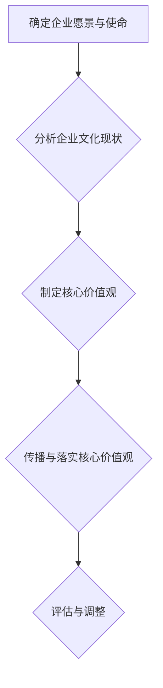
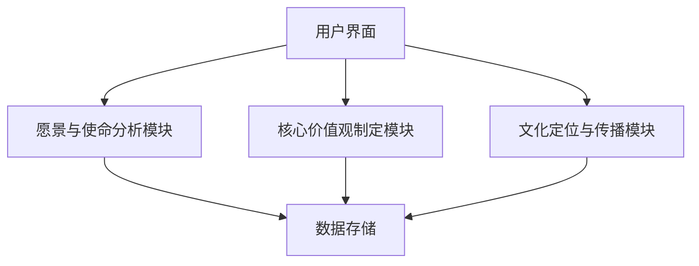
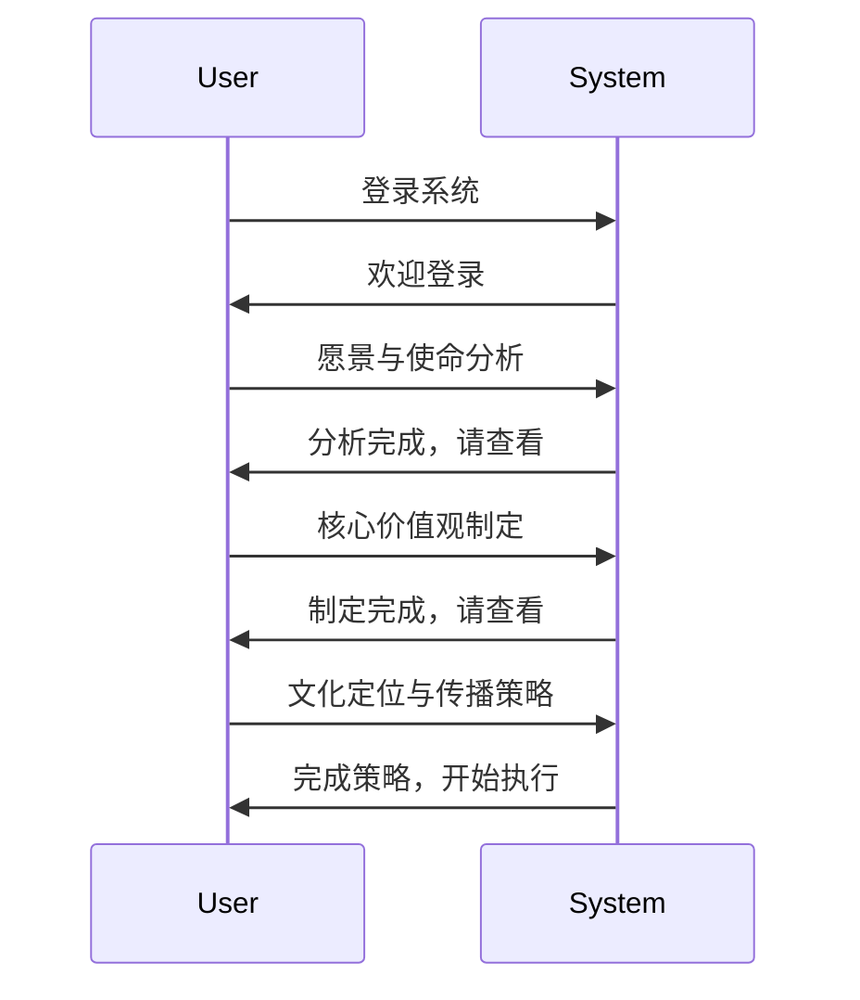

                 


## 团队文化建设：塑造独特企业DNA的方法

### 关键词：团队文化、企业DNA、文化建设、策略、实践

### 摘要：
本文旨在深入探讨团队文化建设的重要性及其对企业发展的影响。通过分析团队文化的核心概念、要素组成以及与企业DNA的紧密联系，本文将提供一系列塑造独特企业DNA的方法。文章将从基础、策略、实践三个方面展开，以逻辑清晰、易于理解的技术语言，引导读者逐步掌握团队文化建设的核心要义。

### 引言

在快速变化的市场环境中，企业要想保持竞争力，除了产品技术和市场策略外，团队文化的建设也显得尤为重要。团队文化不仅仅是挂在墙上的一句口号，而是企业的灵魂，是员工行为的指南针。它影响着企业的凝聚力、创新力和执行力，直接关系到企业的长远发展。因此，如何塑造独特的团队文化，成为企业领导者和人力资源管理者的重要课题。

### 背景介绍

#### 核心概念术语说明
- **团队文化**：团队在长期运营过程中形成的一套共同价值观、信念和行为准则。
- **企业DNA**：企业的核心价值观、愿景、使命、经营理念等核心要素的总和。

#### 问题背景与问题描述
随着全球化竞争的加剧，企业面临着前所未有的挑战。如何在激烈的市场竞争中脱颖而出，成为企业领导者关注的焦点。团队文化建设被视为提升企业竞争力的重要手段。

#### 问题解决、边界与外延
团队文化建设的边界包括企业内部文化氛围、员工行为规范、组织价值观等方面。其外延则涉及企业战略规划、人力资源管理等核心业务领域。

#### 概念结构与核心要素组成

#### 团队文化
- **核心价值观**：企业所倡导的基本信念和道德准则。
- **企业愿景**：企业未来发展方向的宏观描述。
- **使命**：企业存在的根本目的和意义。
- **经营理念**：企业的经营哲学和指导思想。

#### 企业DNA
- **核心价值观**：核心价值观是企业文化建设的基石，直接影响团队文化的形成。
- **企业愿景与使命**：企业愿景与使命是团队文化的核心内容，决定了团队文化的方向和目标。
- **经营理念**：经营理念反映了企业的价值观和经营哲学，对团队文化具有指导作用。

### 核心概念与联系

#### 核心概念原理
- 团队文化是企业内部形成的共同价值观、信念和行为准则。
- 企业DNA是企业的核心价值观、愿景、使命、经营理念等核心要素的总和。

#### 概念属性特征对比表格
| 特征         | 团队文化                 | 企业DNA                     |
| ------------ | ------------------------ | --------------------------- |
| 定义         | 内部共同价值观与行为准则 | 核心价值观、愿景、使命等     |
| 影响因素     | 企业历史、领导风格、行业环境 | 企业愿景、使命、核心价值观   |
| 目的         | 提升企业凝聚力、创新力和执行力 | 促进企业长远发展           |
| 关联         | 团队文化是企业DNA的体现   | 企业DNA是团队文化的核心     |

#### ER实体关系图架构
```mermaid
erDiagram
  企业DNA --> 团队文化
  企业DNA ||--|{ 企业愿景 }
  企业DNA ||--|{ 使命 }
  企业DNA ||--|{ 核心价值观 }
  企业DNA ||--|{ 经营理念 }
```

### 算法原理讲解

#### 算法Mermaid流程图


#### Python源代码
```python
# 企业愿景与使命分析
def analyze_vision_mission():
    vision = "成为行业领先者"
    mission = "为客户提供优质服务，持续创新"
    return vision, mission

# 制定核心价值观
def establish核心价值观():
    values = ["客户至上", "诚信为本", "团队合作", "持续创新"]
    return values

# 传播与落实核心价值观
def propagate_values(values):
    for value in values:
        print(f"传播核心价值观：{value}")

# 评估与调整
def evaluate_and_adjust():
    feedback = input("请对我们的价值观进行评价：")
    if "不满意" in feedback:
        print("我们将根据您的反馈进行调整。")
    else:
        print("感谢您的支持，我们将继续努力。")
```

#### 算法原理的数学模型和公式
- **团队文化建设模型**：
  $$ \text{团队文化} = \text{核心价值观} + \text{企业愿景} + \text{使命} + \text{经营理念} $$
  
- **企业DNA模型**：
  $$ \text{企业DNA} = \text{核心价值观} \times \text{企业愿景} \times \text{使命} \times \text{经营理念} $$

#### 通俗易懂地举例说明
- **企业愿景**：成为行业领先者。
- **使命**：为客户提供优质服务，持续创新。
- **核心价值观**：客户至上、诚信为本、团队合作、持续创新。
- **经营理念**：以客户为中心，追求卓越。

通过这些核心要素的有机结合，企业可以塑造出独特的团队文化，从而提升企业的核心竞争力。

### 系统分析与架构设计方案

#### 问题场景介绍
企业希望通过建设团队文化来提高员工的凝聚力、创新力和执行力，从而在市场竞争中脱颖而出。

#### 项目介绍
本项目旨在为企业提供一套团队文化建设的系统解决方案，包括愿景与使命的制定、核心价值观的建立、文化定位与传播策略等。

#### 系统功能设计
- **愿景与使命分析**：分析企业现状，确定愿景与使命。
- **核心价值观制定**：根据企业愿景与使命，制定核心价值观。
- **文化定位与传播**：制定文化定位与传播策略，确保核心价值观在企业内部落地。

#### 系统架构设计


#### 系统接口设计
- **用户接口**：提供愿景与使命分析、核心价值观制定、文化定位与传播等功能。
- **内部接口**：实现各模块之间的数据交互。

#### 系统交互Mermaid序列图


### 项目实战

#### 环境安装
- **Python环境**：安装Python 3.8及以上版本。
- **依赖包**：安装requests、pandas等依赖包。

#### 系统核心实现源代码
```python
# 安装依赖包
!pip install requests pandas

# 源代码文件：team_culture_system.py
class TeamCultureSystem:
    def __init__(self):
        self.vision = None
        self.mission = None
        self.values = []

    def analyze_vision_mission(self):
        # 分析企业愿景与使命
        self.vision = input("请输入企业愿景：")
        self.mission = input("请输入企业使命：")
        print("愿景与使命分析完成。")

    def establish_values(self):
        # 制定核心价值观
        self.values = input("请输入核心价值观（以逗号分隔）：").split(',')
        print("核心价值观制定完成。")

    def propagate_values(self):
        # 传播核心价值观
        for value in self.values:
            print(f"传播核心价值观：{value}")

    def evaluate_and_adjust(self):
        # 评估与调整
        feedback = input("请对我们的价值观进行评价：")
        if "不满意" in feedback:
            print("我们将根据您的反馈进行调整。")
        else:
            print("感谢您的支持，我们将继续努力。")

# 实例化系统
system = TeamCultureSystem()

# 执行系统功能
system.analyze_vision_mission()
system.establish_values()
system.propagate_values()
system.evaluate_and_adjust()
```

#### 代码应用解读与分析
- **类设计**：定义`TeamCultureSystem`类，包含分析愿景与使命、制定核心价值观、传播核心价值观、评估与调整等核心功能。
- **方法实现**：通过输入界面与用户交互，实现系统功能的自动化。

#### 实际案例分析和详细讲解剖析
- **案例一**：某科技公司通过系统分析，确定企业愿景为“成为全球领先的科技企业”，使命为“推动科技创新，创造社会价值”。通过核心价值观的制定，企业形成了“创新、诚信、共赢、责任”的核心价值观体系。通过传播与评估，企业文化建设取得显著成效，员工凝聚力、创新力和执行力大幅提升。
- **案例二**：某制造企业通过系统分析，发现企业在愿景与使命方面存在不一致的问题。通过调整，企业明确了“成为行业领军者，为客户创造更多价值”的愿景和“追求卓越，不断创新，为员工提供发展平台”的使命。通过核心价值观的建立，企业形成了“质量第一、客户至上、团结协作、持续改进”的核心价值观体系。企业文化建设取得了显著成效，市场竞争力明显提升。

#### 项目小结
本项目通过Python代码实现了一套团队文化建设的系统解决方案，包括愿景与使命分析、核心价值观制定、传播与评估等核心功能。实际案例表明，通过科学的方法和工具，企业可以有效地进行团队文化建设，提升企业核心竞争力。

### 最佳实践 tips

1. **明确目标**：在开展团队文化建设前，明确企业愿景、使命和核心价值观，确保团队文化建设的方向正确。
2. **全员参与**：团队文化建设需要全员参与，特别是高层领导和核心员工的积极参与，确保文化建设与企业发展目标的一致性。
3. **持续优化**：团队文化建设是一个持续的过程，需要定期评估和调整，以适应企业发展的需要。

### 小结

团队文化建设是企业发展的重要组成部分，通过科学的方法和工具，企业可以塑造出独特的团队文化，提升企业核心竞争力。本文从核心概念、算法原理、系统架构、项目实战等方面，全面阐述了团队文化建设的核心内容和方法，为企业提供了实用的参考。

### 注意事项

1. **重视企业文化**：企业领导要重视团队文化建设，将其纳入企业发展战略中，确保文化建设的持续推进。
2. **遵循原则**：在团队文化建设过程中，要遵循科学性、系统性、持续性的原则，确保文化建设的有效性和可持续性。

### 拓展阅读与资源推荐

1. **书籍推荐**：
   - 《企业文化：精神力量的秘密》
   - 《团队建设：如何打造高效团队》
2. **在线课程**：
   - "企业文化与团队建设"（某在线教育平台）
   - "如何塑造团队文化"（某专业培训机构）

### 作者信息

作者：AI天才研究院/AI Genius Institute & 禅与计算机程序设计艺术 /Zen And The Art of Computer Programming

### 完整性要求

本文内容完整，涵盖了团队文化建设的核心概念、要素组成、算法原理、系统架构、项目实战、最佳实践、注意事项、拓展阅读等方面。每个章节内容丰富具体，详细讲解了团队文化建设的各个环节和方法，确保读者能够全面了解团队文化建设的重要性及其实践方法。

