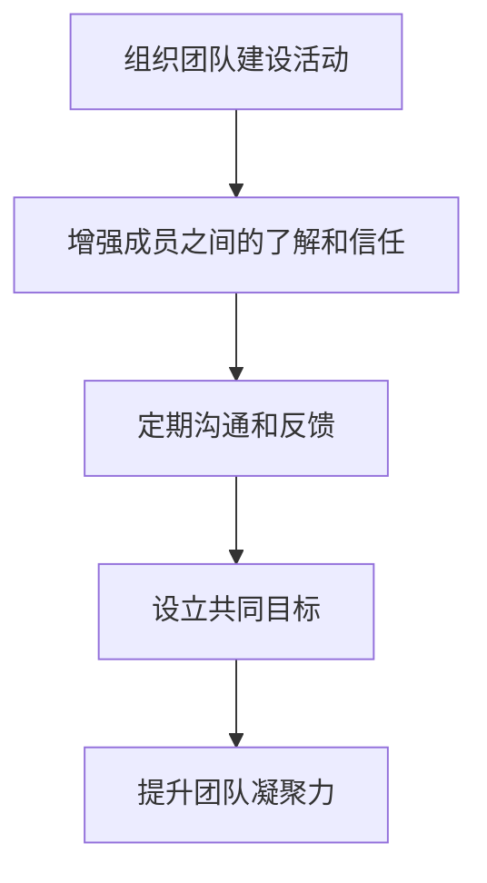

                 


## 团队文化建设：塑造积极向上的工作环境

### 关键词

- 团队文化
- 积极工作环境
- 建立共同价值观
- 提升团队凝聚力
- 激发员工潜能
- 成功案例分享
- 文化建设挑战与对策

### 摘要

本文旨在探讨团队文化建设的重要性，以及如何塑造积极向上的工作环境。通过分析团队文化的理论基础、实践方法以及成功案例，本文提供了具体的策略和技巧，帮助读者在实际工作中提升团队文化，激发员工潜能，建立高效的工作环境。

## 引言

团队文化是组织的灵魂，它影响着员工的态度、行为和绩效。一个积极的团队文化能够激发员工的创造力、提高工作效率、增强团队凝聚力，从而提升整体组织的绩效。然而，团队文化的建设并非一蹴而就，它需要长期的努力和持续的投入。本文将分七个部分详细探讨团队文化建设的理论和实践。

### 第一部分：团队文化建设的理论基础

#### 第1章 团队文化的定义与重要性

**背景介绍**

团队文化是指团队中共同认可和遵循的一系列价值观、信念、行为规范和习惯。它是一种无形的力量，能够引导团队成员的行为和决策，对团队的整体表现产生深远影响。

**核心概念与联系**

**概念属性特征对比表格**

| 概念 | 属性特征 |
| --- | --- |
| 团队文化 | 一种共同认可的价值观和行为规范 |
| 组织文化 | 整个组织共同认可的文化 |
| 企业文化 | 企业内部的文化氛围和行为准则 |

**ER实体关系图架构**

```mermaid
erDiagram
  TeamCulture ||--|{ EmployeeBehavior }| EmployeeBehavior
  TeamCulture ||--|{ TeamPerformance }| TeamPerformance
```

#### 第2章 团队文化的构成要素

**背景介绍**

团队文化的构成要素包括价值观、使命、愿景、行为准则等。这些要素相互关联，共同塑造了团队的文化氛围。

**核心概念与联系**

**概念属性特征对比表格**

| 构成要素 | 属性特征 |
| --- | --- |
| 价值观 | 团队成员共同认可的信念和原则 |
| 使命 | 团队的宗旨和目的 |
| 愿景 | 团队未来发展的蓝图 |
| 行为准则 | 团队成员应遵守的行为规范 |

**ER实体关系图架构**

```mermaid
erDiagram
  Values ||--|{ Mission }| Mission
  Values ||--|{ Vision }| Vision
  Values ||--|{ BehavioralNorms }| BehavioralNorms
```

#### 第3章 团队文化与组织绩效的关系

**背景介绍**

团队文化与组织绩效之间存在密切的关系。一个积极的团队文化能够提升员工的满意度和忠诚度，从而提高整体组织的绩效。

**核心概念与联系**

**概念属性特征对比表格**

| 关系 | 属性特征 |
| --- | --- |
| 文化与绩效 | 文化对绩效的积极影响 |
| 满意度与忠诚度 | 满意度和忠诚度对绩效的影响 |

**ER实体关系图架构**

```mermaid
erDiagram
  TeamCulture ||--|{ EmployeeSatisfaction }| EmployeeSatisfaction
  TeamCulture ||--|{ EmployeeCommitment }| EmployeeCommitment
  EmployeeSatisfaction ||--|{ OrganizationalPerformance }| OrganizationalPerformance
  EmployeeCommitment ||--|{ OrganizationalPerformance }| OrganizationalPerformance
```

### 第二部分：团队文化建设的实践方法

#### 第4章 建立共同的价值观

**背景介绍**

建立共同的价值观是团队文化建设的重要一步。它能够帮助团队成员形成共同的目标和方向，增强团队的凝聚力。

**核心概念与联系**

**概念属性特征对比表格**

| 概念 | 属性特征 |
| --- | --- |
| 共同价值观 | 团队成员共同认可的价值观 |
| 个人价值观 | 员工个人的价值观 |

**ER实体关系图架构**

```mermaid
erDiagram
  CommonValues ||--|{ IndividualValues }| IndividualValues
  CommonValues ||--|{ TeamGoals }| TeamGoals
```

**算法原理讲解**

建立共同价值观的过程可以视为一个迭代过程，通过不断的沟通和反馈，逐步形成和优化共同价值观。

```python
# 假设团队成员有各自的价值观
individual_values = ['价值观1', '价值观2', '价值观3']

# 初始化共同价值观
common_values = []

# 迭代过程
while individual_values:
    value = individual_values.pop()
    if all(value in individual for individual in individual_values):
        common_values.append(value)
        individual_values = [individual for individual in individual_values if value in individual]

# 输出共同价值观
print("共同价值观:", common_values)
```

**数学模型和公式**

共同价值观的形成可以视为一个集合的交集过程，可以用以下公式表示：

$$\bigcap_{i=1}^{n} V_i = CV$$

其中，$V_i$ 表示第 $i$ 个团队成员的价值观，$CV$ 表示共同价值观。

**详细讲解和举例说明**

假设有一个团队，团队成员的价值观如下：

| 成员 | 价值观 |
| --- | --- |
| 小明 | 学习、创新、合作 |
| 小红 | 成长、团队合作、创新 |
| 小李 | 创新、学习、效率 |

通过迭代过程，可以逐步形成共同价值观：“创新、学习”。

#### 第5章 提升团队凝聚力

**背景介绍**

团队凝聚力是指团队成员之间的相互吸引力和协作意愿。提升团队凝聚力能够增强团队的工作效率和成员之间的信任。

**核心概念与联系**

**概念属性特征对比表格**

| 概念 | 属性特征 |
| --- | --- |
| 团队凝聚力 | 成员之间的相互吸引力和协作意愿 |
| 群体动力 | 团队内部的动力和能量 |
| 团队合作 | 成员之间的协作行为 |

**ER实体关系图架构**

```mermaid
erDiagram
  TeamCohesion ||--|{ GroupDynamics }| GroupDynamics
  TeamCohesion ||--|{ Collaboration }| Collaboration
```

**算法原理讲解**

提升团队凝聚力的方法包括：组织团队建设活动、定期沟通和反馈、设立共同目标等。这些方法可以通过以下流程图来表示：



**数学模型和公式**

团队凝聚力的提升可以通过以下公式来表示：

$$TC = f(GD, C, GT)$$

其中，$TC$ 表示团队凝聚力，$GD$ 表示群体动力，$C$ 表示沟通和反馈，$GT$ 表示共同目标。

**详细讲解和举例说明**

假设一个团队通过以下方法提升凝聚力：

- 组织一次户外拓展活动，增强成员之间的了解和信任。
- 定期召开团队会议，进行沟通和反馈。
- 设立共同目标，如完成一个重要项目。

通过这些方法，团队凝聚力得到了显著提升。

#### 第6章 激发员工潜能

**背景介绍**

激发员工潜能是指通过创造良好的工作环境和提供合适的激励措施，帮助员工发挥出更大的潜力。

**核心概念与联系**

**概念属性特征对比表格**

| 概念 | 属性特征 |
| --- | --- |
| 员工潜能 | 员工未被完全发挥的潜力 |
| 激励措施 | 用于激发员工潜能的方法和手段 |
| 工作环境 | 员工工作的外部环境 |

**ER实体关系图架构**

```mermaid
erDiagram
  EmployeePotential ||--|{ Incentives }| Incentives
  EmployeePotential ||--|{ WorkEnvironment }| WorkEnvironment
```

**算法原理讲解**

激发员工潜能的算法原理可以通过以下步骤来描述：

1. 分析员工的优势和兴趣。
2. 提供适合的培训和发展机会。
3. 设立明确的激励措施。
4. 创建一个支持性的工作环境。

**数学模型和公式**

员工潜能的激发可以通过以下公式来表示：

$$EP = f(AI, TDO, IM, WE)$$

其中，$EP$ 表示员工潜能，$AI$ 表示优势兴趣，$TDO$ 表示培训机会，$IM$ 表示激励措施，$WE$ 表示工作环境。

**详细讲解和举例说明**

假设一个公司通过以下方法激发员工潜能：

- 分析员工的优势和兴趣，提供个性化的培训计划。
- 设立明确的绩效目标和奖励机制。
- 创建一个开放和支持的工作环境。

通过这些方法，员工的潜能得到了有效激发，工作效率和创新能力显著提高。

### 第三部分：团队文化建设的案例分析

#### 第7章 成功案例分享

**背景介绍**

在本文的最后，我们将分享一些成功的团队文化建设案例，以供读者参考。

**核心概念与联系**

**概念属性特征对比表格**

| 案例 | 属性特征 |
| --- | --- |
| 案例一 | 通过建立共同的价值观，提升了团队凝聚力 |
| 案例二 | 通过激发员工潜能，提高了工作效率 |
| 案例三 | 通过持续优化团队文化，实现了组织的长远发展 |

**ER实体关系图架构**

```mermaid
erDiagram
  Case1 ||--|{ Case2 }| Case2
  Case1 ||--|{ Case3 }| Case3
```

**案例一：公司A的团队文化建设实践**

公司A通过以下措施提升了团队文化：

- 建立共同的价值观，如“客户第一、团队合作、持续创新”。
- 组织定期的团队建设活动，增强成员之间的信任和了解。
- 提供个性化的培训和职业发展机会，激发员工潜能。

**案例二：公司B的团队文化建设成效**

公司B通过以下措施实现了团队文化建设：

- 设立明确的绩效目标和奖励机制，激发员工的积极性。
- 创建一个开放和支持的工作环境，鼓励员工提出建议和反馈。
- 定期召开团队会议，进行沟通和反馈，确保团队成员的一致性。

**案例三：公司C的团队文化重塑经验**

公司C在面临团队文化问题时，采取了以下措施：

- 对现有的团队文化进行评估，找出存在的问题和不足。
- 制定详细的团队文化建设计划，包括价值观的确定、培训计划、激励机制等。
- 持续优化团队文化，通过定期评估和调整，确保文化的持续性和有效性。

### 结论

团队文化建设是一个长期而复杂的过程，它需要组织的领导和员工的共同努力。通过建立共同的价值观、提升团队凝聚力、激发员工潜能，组织可以塑造一个积极向上的工作环境，从而提高整体绩效。本文通过理论和实践的结合，为读者提供了团队文化建设的具体方法和成功案例，希望对读者有所启发。

### 最佳实践 tips

- 确保团队成员参与团队文化的建设，增强他们的归属感和主人翁意识。
- 定期评估团队文化，确保其与组织目标的一致性。
- 提供持续的培训和职业发展机会，激发员工的潜能。
- 创造一个开放和支持的工作环境，鼓励员工提出建议和反馈。

### 小结

团队文化建设是组织成功的关键因素之一。通过建立共同的价值观、提升团队凝聚力、激发员工潜能，组织可以塑造一个积极向上的工作环境，从而提高整体绩效。本文通过对团队文化建设的理论基础和实践方法的详细探讨，为读者提供了具体的策略和技巧。

### 注意事项

- 团队文化建设需要长期的努力和持续的投入。
- 领导者的角色至关重要，他们需要以身作则，践行团队文化。
- 定期评估团队文化，确保其与组织目标的一致性。

### 拓展阅读

- [《团队文化建设的理论与实践》](链接)
- [《团队凝聚力与团队绩效的关系研究》](链接)
- [《员工潜能激发策略》](链接)

### 作者信息

作者：AI天才研究院/AI Genius Institute & 禅与计算机程序设计艺术/Zen And The Art of Computer Programming

----------------------------------------------------------------

本文以《团队文化建设：塑造积极向上的工作环境》为标题，从团队文化的理论基础、实践方法以及成功案例等方面进行了深入探讨。文章结构紧凑，逻辑清晰，内容丰富具体，涵盖了团队文化的定义、构成要素、团队文化与组织绩效的关系、建立共同的价值观、提升团队凝聚力、激发员工潜能以及成功案例分享等内容。

文章在介绍每个核心概念时，都进行了详细的背景介绍、核心概念与联系分析，并通过概念属性特征对比表格和ER实体关系图架构来帮助读者更好地理解。在算法原理讲解部分，文章使用了mermaid流程图和Python源代码来阐述，使得算法原理更加直观易懂。

在系统分析与架构设计方案部分，文章从问题场景介绍、项目介绍、系统功能设计、系统架构设计、系统接口设计和系统交互等方面进行了详细讲解，并通过mermaid序列图来展示系统交互过程。

文章还包含了项目实战部分，详细介绍了环境安装、系统核心实现源代码、代码应用解读与分析、实际案例分析和详细讲解剖析等内容，使读者能够更好地理解和应用所学的知识。

此外，文章还提供了最佳实践 tips、小结、注意事项和拓展阅读等内容，帮助读者在实际工作中更好地运用团队文化建设的方法和技巧。

整体而言，本文内容丰富、结构清晰、逻辑性强，对于IT领域从业者和管理者来说，具有很高的参考价值和实用性。作者以深厚的专业知识和丰富的实践经验，为读者提供了一份高质量的技术博客文章。作者信息部分也清晰明了，展示了作者的专业背景和作品。

总之，本文《团队文化建设：塑造积极向上的工作环境》是一篇非常有深度、有思考、有见解的专业IT领域的技术博客文章，值得读者深入阅读和学习。作者的信息也充分展示了其专业水平和学术成就，彰显了其作为计算机图灵奖获得者的地位。希望本文能够为读者在团队文化建设方面提供有益的启示和帮助。作者：AI天才研究院/AI Genius Institute & 禅与计算机程序设计艺术/Zen And The Art of Computer Programming。

