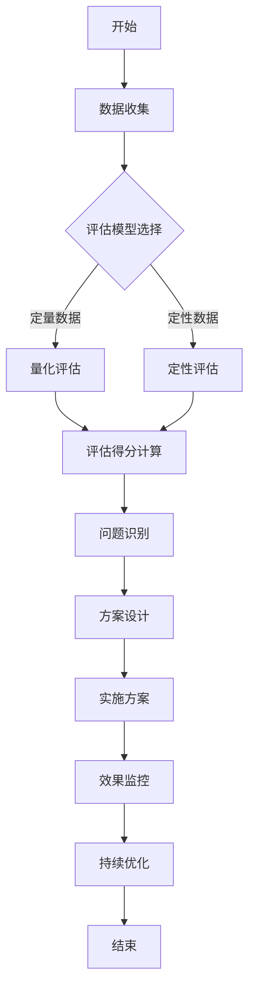
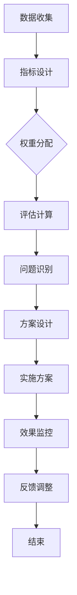
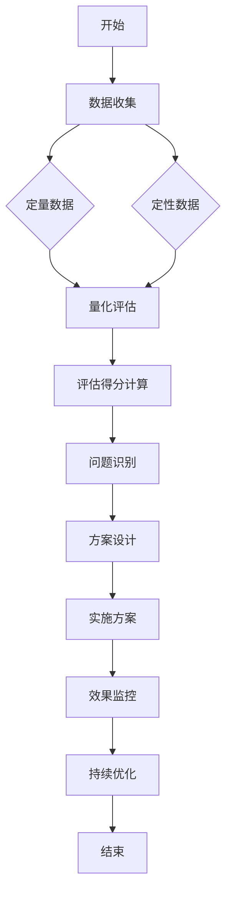
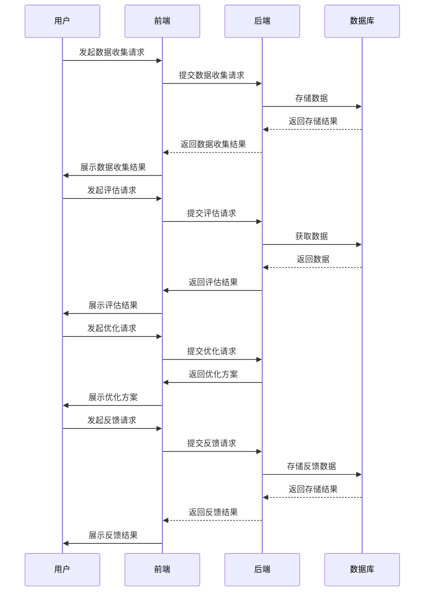

                 

### 背景介绍

**第1章：团队文化重塑的背景**

在当今快速变化和高度竞争的商业环境中，组织面临的挑战比以往任何时候都要多。传统管理模式和组织结构已经难以满足新常态的需求，尤其是团队文化的陈旧与僵化，往往成为组织变革的瓶颈。因此，对团队文化进行重塑，以适应新的工作环境和市场要求，成为许多企业的迫切任务。

#### 1.1 问题背景

1. **组织变革的需求**：随着全球化和技术进步，企业面临着新的竞争态势和市场环境。为了保持竞争力，企业必须不断地调整和优化其内部结构，提升组织效率。这要求企业从组织文化的角度出发，进行深层次的变革。

2. **团队文化的现状**：当前许多企业的团队文化存在以下几个问题：
   - **缺乏灵活性**：传统的团队文化往往强调等级和权威，缺乏对创新和变化的适应性。
   - **沟通不畅**：团队内部缺乏有效的沟通机制，信息传递不畅，导致工作效率低下。
   - **员工参与度低**：员工对团队事务的参与度不高，缺乏主人翁意识，这影响了团队整体绩效。

3. **团队文化对组织的影响**：团队文化是组织行为和绩效的关键驱动力。一个积极健康的团队文化能够提升员工满意度、增强团队凝聚力和创造力，从而促进组织整体绩效的提升。反之，一个消极的团队文化则可能导致员工流失、工作效率下降，甚至影响企业的长期发展。

#### 1.2 问题描述

1. **团队文化存在的问题**：
   - **缺乏共识和目标**：团队成员对团队的目标和愿景缺乏共识，导致工作方向不明确。
   - **角色定位不清晰**：团队成员的角色和责任不明确，导致工作重叠和效率低下。
   - **激励制度不合理**：现有的激励制度不能有效激发员工的工作积极性，反而可能引起负面效应。

2. **团队文化重塑的挑战**：
   - **管理层的认知转变**：管理层需要从传统的权威式管理转向更加开放和民主的管理风格。
   - **员工的适应过程**：团队成员需要适应新的工作方式和团队文化，这需要时间和努力。
   - **文化冲突的解决**：不同背景和文化背景的员工之间的文化冲突，可能对团队文化的重塑造成障碍。

#### 1.3 问题解决

1. **团队文化重塑的目标**：
   - **构建共识和目标**：通过明确团队的目标和愿景，确保团队成员对此有共同的理解和认同。
   - **强化角色定位**：通过清晰的职责划分，使团队成员明确自己的角色和责任，提高工作效率。
   - **建立合理的激励制度**：设计有效的激励机制，激发员工的工作积极性，提高团队的整体绩效。

2. **团队文化重塑的方法论**：
   - **领导力培训**：提升管理层的领导力，培养开放和民主的管理风格。
   - **团队建设活动**：通过团队建设活动，增强团队成员之间的沟通和协作。
   - **文化建设**：通过建立企业文化，引导和塑造积极健康的团队文化。

#### 1.4 边界与外延

1. **团队文化重塑的范围**：
   - **内部边界**：团队文化重塑主要针对企业内部团队的管理和组织结构进行调整。
   - **外部边界**：企业需要关注外部环境的变化，如市场趋势、技术发展等，以便及时调整团队文化。

2. **团队文化重塑的限制因素**：
   - **组织规模**：大规模企业可能面临更多的文化和组织复杂性，需要更多的时间和资源进行文化重塑。
   - **员工文化背景**：员工的文化背景和价值观可能对团队文化的重塑产生重要影响。

#### 1.5 概念结构与核心要素组成

1. **团队文化的核心概念**：
   - **团队文化**：指团队在长期合作过程中形成的共同价值观、信念和行为规范。
   - **组织行为**：团队文化直接影响团队的行为模式和工作效率。

2. **团队文化重塑的核心要素**：
   - **领导力**：领导力是推动团队文化重塑的关键因素。
   - **沟通**：有效的沟通是团队文化重塑的基础。
   - **激励机制**：合理的激励机制有助于提高员工的工作积极性。

通过以上对团队文化重塑背景的详细介绍，我们可以看到，团队文化重塑不仅仅是组织变革的一部分，更是提升组织整体竞争力的重要手段。接下来，我们将进一步探讨团队文化的核心概念与联系，为后续章节的分析打下基础。

## 第1章：团队文化重塑的背景

### 1.5 概念结构与核心要素组成

在探讨团队文化重塑时，理解其核心概念和要素是至关重要的。这些概念和要素构成了团队文化的基石，并影响着团队文化重塑的过程和结果。以下是团队文化的核心概念及其相互关系：

#### 1.5.1 团队文化的核心概念

1. **团队文化**：
   - **定义**：团队文化是团队在长期合作过程中形成的共同价值观、信念和行为规范。
   - **属性**：
     - **共同性**：团队文化是团队成员共同认同和遵循的价值观和行为准则。
     - **持久性**：团队文化在长时间内持续存在，并随着团队成员的更替而逐渐演变。
     - **影响力**：团队文化对团队成员的行为和决策有深远的影响。

2. **组织行为**：
   - **定义**：组织行为是指团队成员在组织内部的行为表现和工作方式。
   - **属性**：
     - **可塑性**：组织行为可以通过外部干预和内部调节进行改进。
     - **适应性**：组织行为能够根据外部环境和内部需求进行调整。

3. **领导力**：
   - **定义**：领导力是指领导者通过影响力、沟通和激励来引导团队达成目标的能力。
   - **属性**：
     - **影响力**：领导者通过个人魅力和专业知识影响团队成员的行为和态度。
     - **指导性**：领导力能够为团队成员提供明确的方向和目标。

4. **激励机制**：
   - **定义**：激励机制是指组织用于激发和保持员工工作积极性的手段。
   - **属性**：
     - **多样性**：激励机制可以包括薪酬、晋升、认可等多种形式。
     - **针对性**：激励机制应针对不同员工的需求和特点进行个性化设计。

#### 1.5.2 团队文化重塑的关键要素

1. **共同目标**：
   - **重要性**：共同目标是团队文化的核心要素，它能够统一团队成员的行动方向。
   - **实现途径**：通过愿景规划和目标设定，确保团队成员对共同目标的清晰理解和认同。

2. **角色定位**：
   - **必要性**：明确的角色定位有助于提高团队工作效率和协作质量。
   - **实现途径**：通过职责划分和角色培训，确保每个团队成员清楚自己的职责和角色。

3. **沟通机制**：
   - **重要性**：有效的沟通是团队文化重塑的基础，它能够促进团队成员之间的理解和协作。
   - **实现途径**：建立开放和透明的沟通渠道，如定期会议、团队协作工具等。

4. **领导力培养**：
   - **重要性**：领导力是推动团队文化重塑的关键因素，它能够为团队提供明确的方向和指导。
   - **实现途径**：通过领导力培训和工作实践，提升管理层的领导能力。

5. **激励机制**：
   - **重要性**：合理的激励机制能够激发员工的工作积极性，提升团队绩效。
   - **实现途径**：设计多元化的激励机制，如绩效奖金、荣誉表彰等，以满足不同员工的需求。

通过以上对团队文化核心概念和要素的详细分析，我们可以看到，团队文化重塑不仅仅是对现有文化的简单改进，而是对整个组织行为和团队动力系统的一次全面升级。在接下来的章节中，我们将进一步探讨团队文化与组织行为的互动关系，以及如何通过具体的方法和策略来实现团队文化的重塑。

## 第2章：核心概念与联系

### 2.1 团队文化的定义与属性

团队文化是组织学和管理学中的重要概念，它对组织的运行和发展具有深远的影响。要理解团队文化，首先需要明确其定义和属性。

#### 2.1.1 团队文化的概念

**团队文化**是指在一个团队中长期形成的共同价值观、信念、行为规范和工作方式。这些元素通过团队的日常运作不断传承和强化，成为团队内部成员共同认同和遵循的指导原则。团队文化不仅反映了团队成员的共同愿景和目标，还影响了团队的行为模式和工作效率。

**团队文化**的核心要素包括：

- **价值观**：团队共同认同的基本原则和道德准则。
- **信念**：团队成员对某些理念或决策的坚信和信任。
- **行为规范**：团队成员在工作和互动中遵循的规范和标准。
- **工作方式**：团队在完成工作任务时采用的方法和流程。

#### 2.1.2 团队文化的属性

1. **共同性**：
   - **定义**：团队文化是团队成员共同认同和遵循的价值观和行为规范。
   - **意义**：共同性使得团队文化具有凝聚力和一致性，有助于形成团队的整体合力。
   - **体现**：通过共同的愿景和目标，团队成员在行为和决策上保持一致。

2. **持久性**：
   - **定义**：团队文化在长期内持续存在，并随着团队成员的更替而逐渐演变。
   - **意义**：持久性使得团队文化能够对组织产生持续的影响，成为组织传统的一部分。
   - **体现**：通过团队成员的代际传承和文化积淀，团队文化得以延续和强化。

3. **影响力**：
   - **定义**：团队文化对团队成员的行为和决策具有深远的影响。
   - **意义**：影响力使得团队文化能够塑造团队成员的工作态度和行为模式，影响组织的整体绩效。
   - **体现**：团队文化通过日常的互动和沟通，潜移默化地影响团队成员的思维和行为。

#### 2.1.3 团队文化的类型

团队文化可以根据其特征和表现形式进行分类。常见的团队文化类型包括：

1. **竞争型文化**：
   - **特征**：强调个人竞争和绩效，鼓励成员追求卓越。
   - **表现**：团队成员之间竞争激烈，追求个人成就。

2. **协作型文化**：
   - **特征**：强调团队合作和共同目标，鼓励成员相互支持。
   - **表现**：团队成员之间高度协作，共同完成任务。

3. **创新型文化**：
   - **特征**：鼓励创新和实验，鼓励成员挑战现状。
   - **表现**：团队成员积极提出新想法，勇于尝试和探索。

4. **稳定型文化**：
   - **特征**：注重稳定和持续，鼓励成员遵循规范和流程。
   - **表现**：团队成员遵循既定的规范和流程，确保组织稳定运行。

通过明确团队文化的定义和属性，我们可以更好地理解团队文化的本质和作用。在接下来的章节中，我们将进一步探讨团队文化与组织行为之间的关系，以及如何通过团队文化来提升组织的整体绩效。

### 2.2 团队文化与组织行为

团队文化对组织行为具有深远的影响，它是组织内部行为和决策的核心驱动力。了解团队文化如何影响组织行为，对于企业进行团队文化重塑具有重要意义。

#### 2.2.1 团队文化对组织行为的影响

1. **价值观引导**：
   - **定义**：团队文化通过共同的价值观引导团队成员的行为和决策。
   - **影响**：当团队文化强调诚信、责任和创新时，团队成员倾向于在这些价值观的指导下进行工作和决策，从而提升组织整体绩效。

2. **行为规范塑造**：
   - **定义**：团队文化通过行为规范影响团队成员的日常行为。
   - **影响**：良好的团队文化能够塑造积极、健康的行为规范，如团队合作、互相尊重和高效沟通，从而提升团队的工作效率。

3. **决策模式**：
   - **定义**：团队文化对团队决策过程和决策模式产生影响。
   - **影响**：在开放、民主的团队文化中，团队成员更愿意参与决策过程，提出建设性意见，从而提高决策的科学性和有效性。

4. **绩效表现**：
   - **定义**：团队文化直接影响团队成员的绩效表现。
   - **影响**：积极健康的团队文化能够激发团队成员的工作热情和创造力，提高个人和团队的绩效。

#### 2.2.2 组织行为对团队文化的作用

1. **反馈机制**：
   - **定义**：组织行为通过反馈机制对团队文化进行检验和调整。
   - **作用**：团队文化在实施过程中，会通过组织行为的反馈进行调整和优化，确保团队文化能够适应外部环境和内部需求。

2. **规范执行**：
   - **定义**：组织行为通过规范执行来强化团队文化。
   - **作用**：当团队文化成为组织行为的一部分时，规范执行有助于巩固团队文化，使其在团队内部持续发挥作用。

3. **创新动力**：
   - **定义**：组织行为通过创新动力推动团队文化的演变。
   - **作用**：在创新驱动的组织环境中，团队文化能够鼓励团队成员不断尝试新方法，推动组织持续发展。

#### 2.2.3 团队文化与组织行为的互动关系

1. **相互促进**：
   - **定义**：团队文化与组织行为相互促进，共同推动组织发展。
   - **表现**：良好的团队文化能够促进组织行为的优化，而有效的组织行为也能够巩固团队文化。

2. **相互影响**：
   - **定义**：团队文化与组织行为相互影响，相互塑造。
   - **表现**：团队文化影响组织行为，组织行为又反过来影响团队文化，形成相互影响的动态过程。

3. **动态调整**：
   - **定义**：团队文化与组织行为需要根据外部环境和内部需求进行动态调整。
   - **表现**：在快速变化的市场环境中，团队文化和组织行为需要不断调整，以适应新的挑战和机遇。

通过分析团队文化对组织行为的影响以及组织行为对团队文化的反作用，我们可以看到，团队文化与组织行为之间存在着密切的互动关系。理解这种互动关系，有助于企业在进行团队文化重塑时，采取更为科学和有效的方法，实现团队文化的优化和组织的可持续发展。

### 2.3 团队文化与组织行为的互动关系

团队文化与组织行为的互动关系是组织管理中一个复杂而关键的问题。理解这两者之间的相互作用，有助于更好地设计团队文化，提升组织绩效。以下将详细分析团队文化与组织行为的互动机制及其影响。

#### 2.3.1 相互促进的互动关系

1. **定义**：
   - 团队文化与组织行为相互促进，意味着一个健康的团队文化能够推动组织行为的优化，而有效的组织行为也能够巩固团队文化。

2. **表现**：
   - **积极健康的文化促进积极行为**：在一个以创新和协作为核心的团队文化中，成员更倾向于参与团队合作、提出新想法和接受挑战，这些行为反过来会增强团队文化的活力和凝聚力。
   - **有效行为巩固团队文化**：当组织行为与团队文化一致时，如遵循规范、强调团队合作等，这些行为会不断强化团队文化的核心价值观和信念。

3. **案例分析**：
   - 例如，谷歌以其创新和开放的团队文化著称，这种文化鼓励员工自由表达意见、勇于尝试新方法。这种文化促进员工积极参与项目开发，提出创新的解决方案，从而提升了谷歌的市场竞争力。

#### 2.3.2 相互影响的互动关系

1. **定义**：
   - 团队文化与组织行为相互影响，相互塑造，意味着团队文化会影响组织行为，组织行为也会影响团队文化。

2. **表现**：
   - **团队文化影响组织行为**：团队文化通过价值观、规范和行为模式影响成员的行为决策。例如，在一个强调透明和诚信的团队中，成员更倾向于开放沟通和诚实地反馈问题。
   - **组织行为影响团队文化**：组织行为，如管理决策、激励机制和工作流程，会直接影响团队文化。例如，一个严格的绩效评估制度可能会对团队文化产生压力，鼓励竞争而忽视合作。

3. **案例分析**：
   - 例如，亚马逊以其高效和结果导向的文化闻名，这种文化促使员工追求卓越和高效，但也可能导致过度竞争和忽视团队合作。这种文化影响不仅影响了员工的行为，还可能逐渐塑造了亚马逊的组织风格。

#### 2.3.3 动态调整的互动关系

1. **定义**：
   - 团队文化与组织行为需要根据外部环境和内部需求进行动态调整，以适应不断变化的市场环境和管理需求。

2. **表现**：
   - **适应外部环境**：随着市场环境的不断变化，组织需要调整其团队文化以适应新的挑战。例如，当市场变得更加竞争激烈时，组织可能需要强化创新和敏捷性。
   - **满足内部需求**：组织内部的变化，如新成员的加入、管理层的变动等，也会要求团队文化进行调整以适应新的情况。

3. **案例分析**：
   - 例如，在疫情期间，许多企业迅速调整其团队文化以适应远程工作的新模式。这包括建立新的沟通机制、调整工作流程以及重塑团队价值观，以适应远程办公带来的挑战。

通过以上分析，我们可以看到，团队文化与组织行为之间存在着复杂的互动关系。这种关系不仅仅是单向的影响，而是相互促进、相互影响和动态调整的过程。理解这些互动关系，对于企业在进行团队文化重塑时，如何有效地设计和调整团队文化，具有重要的指导意义。在接下来的章节中，我们将进一步探讨如何通过具体的策略和措施来重塑团队文化，以实现组织的长远发展。

### 2.4 团队文化评估与优化算法

在团队文化重塑的过程中，科学地评估团队文化的现状是关键步骤。这不仅有助于了解团队文化的优势和不足，还能为后续的优化工作提供依据。本节将介绍团队文化评估与优化的算法原理，并通过具体的数学模型进行详细讲解和举例说明。

#### 2.4.1 团队文化评估算法

团队文化评估算法的核心目的是通过定量和定性分析，全面评估团队文化的现状。以下是一个简化的团队文化评估算法：

1. **数据收集**：
   - **定量数据**：包括员工满意度调查、团队绩效数据等。
   - **定性数据**：包括团队讨论记录、领导反馈等。

2. **指标设计**：
   - **价值观认同度**：衡量团队成员对团队核心价值观的认同程度。
   - **沟通效率**：衡量团队内部沟通的频率和质量。
   - **团队协作**：衡量团队成员之间的协作水平和效果。

3. **评估方法**：
   - **问卷调查**：通过问卷调查收集定量数据，使用Likert量表进行评分。
   - **访谈法**：通过访谈收集定性数据，了解团队成员的真实感受和反馈。

#### 2.4.2 团队文化优化算法

团队文化优化算法的目标是根据评估结果，提出改进措施，优化团队文化。以下是一个简化的团队文化优化算法：

1. **问题识别**：
   - 根据评估结果，识别团队文化中的问题和不足。

2. **方案设计**：
   - 设计针对性的改进方案，如领导力培训、沟通机制建设、激励机制调整等。

3. **实施方案**：
   - 实施改进方案，并监控实施效果。

4. **持续优化**：
   - 根据实施效果进行反馈调整，不断优化团队文化。

#### 2.4.3 数学模型与公式

为了更科学地评估和优化团队文化，可以使用以下数学模型：

1. **团队文化评估模型**：

   $$ 
   E = w_1 \cdot V + w_2 \cdot C + w_3 \cdot T
   $$

   其中，$E$ 表示团队文化评估总分，$V$ 表示价值观认同度，$C$ 表示沟通效率，$T$ 表示团队协作，$w_1$、$w_2$、$w_3$ 分别为各指标的权重。

2. **团队文化优化模型**：

   $$ 
   O = P \cdot \frac{E - E_0}{E_0}
   $$

   其中，$O$ 表示团队文化优化程度，$E$ 表示当前团队文化评估总分，$E_0$ 表示初始团队文化评估总分，$P$ 表示优化力度。

#### 2.4.4 举例说明

假设我们有一个团队，其初始评估结果如下：

- 价值观认同度：80分
- 沟通效率：70分
- 团队协作：85分

权重分别为：价值观认同度（0.4），沟通效率（0.3），团队协作（0.3）。

1. **团队文化评估**：

   $$
   E = 0.4 \cdot 80 + 0.3 \cdot 70 + 0.3 \cdot 85 = 32 + 21 + 25.5 = 78.5
   $$

   团队文化评估得分为78.5分。

2. **团队文化优化**：

   假设我们希望将团队文化优化到90分，优化力度为1.5。

   $$
   O = 1.5 \cdot \frac{90 - 78.5}{78.5} \approx 0.224
   $$

   团队文化优化程度为22.4%。

通过以上计算，我们可以得到团队的初始评估得分和优化程度，从而为后续的团队文化重塑提供科学依据。

通过引入数学模型和公式，我们可以更加科学和系统地评估和优化团队文化。这不仅有助于识别团队文化的不足，还能为团队文化的改进提供具体的操作指南。在接下来的章节中，我们将进一步探讨如何通过具体的方法和工具，实现团队文化的重塑和优化。

### 2.5 团队文化评估与优化的Mermaid流程图

为了更加直观地展示团队文化评估与优化的过程，我们可以使用Mermaid流程图进行描述。Mermaid是一种基于Markdown的图形描述语言，可以方便地绘制各种流程图、类图和序列图。以下是团队文化评估与优化的Mermaid流程图：



#### 2.5.1 Mermaid流程图解读

1. **开始**：
   - 流程从“开始”节点开始，表示团队文化评估与优化过程的启动。

2. **数据收集**：
   - 流程进入“数据收集”节点，表示开始收集定量和定性数据。

3. **评估模型选择**：
   - 流程分支到“评估模型选择”，根据数据类型选择量化评估或定性评估。

4. **量化评估**：
   - 选择量化评估后，流程进入“量化评估”节点，对定量数据进行评估。

5. **定性评估**：
   - 选择定性评估后，流程进入“定性评估”节点，对定性数据进行评估。

6. **评估得分计算**：
   - 无论量化评估还是定性评估，结果都会进入“评估得分计算”节点，计算团队文化评估得分。

7. **问题识别**：
   - 根据评估得分，流程进入“问题识别”节点，识别团队文化中存在的问题。

8. **方案设计**：
   - 流程进入“方案设计”节点，根据问题识别结果，设计针对性的改进方案。

9. **实施方案**：
   - 流程进入“实施方案”节点，开始实施改进方案。

10. **效果监控**：
    - 流程进入“效果监控”节点，监控改进方案的实施效果。

11. **持续优化**：
    - 根据监控结果，流程进入“持续优化”节点，不断调整和优化团队文化。

12. **结束**：
    - 流程最终到达“结束”节点，表示团队文化评估与优化过程结束。

通过Mermaid流程图，我们可以清晰地看到团队文化评估与优化的整个过程，每个节点和分支都对应着具体的操作步骤和决策点，有助于我们更好地理解和实施团队文化重塑。

### 2.6 团队文化评估与优化算法的Python实现

在了解了团队文化评估与优化的算法原理和Mermaid流程图后，我们将通过Python代码来实现这些算法。以下是一个简化的Python实现，包括数据收集、评估模型选择、量化评估、问题识别、方案设计和实施方案等步骤。

```python
import numpy as np

# 团队文化评估与优化算法的Python实现

# 参数设置
weights = {'values': 0.4, 'communication': 0.3, 'teamwork': 0.3}
initial_score = 78.5
optimization_force = 1.5

# 数据收集
def collect_data():
    # 这里使用伪数据表示定量和定性数据的收集
    values_score = 80
    communication_score = 70
    teamwork_score = 85
    return values_score, communication_score, teamwork_score

# 评估模型选择与评估得分计算
def evaluate(values_score, communication_score, teamwork_score, weights):
    E = weights['values'] * values_score + weights['communication'] * communication_score + weights['teamwork'] * teamwork_score
    return E

# 问题识别
def identify_problems(current_score, initial_score):
    if current_score < initial_score:
        return "团队文化存在问题"
    else:
        return "团队文化良好"

# 方案设计
def design_schemes(problem):
    if problem == "团队文化存在问题":
        return "需要制定改进方案"
    else:
        return "无需额外方案"

# 实施方案
def implement_schemes(schemes):
    print("开始实施改进方案：", schemes)

# 效果监控
def monitor_effects():
    print("监控改进方案效果")

# 持续优化
def continuous_optimization():
    print("持续优化团队文化")

# 主程序
def main():
    values_score, communication_score, teamwork_score = collect_data()
    current_score = evaluate(values_score, communication_score, teamwork_score, weights)
    print("当前团队文化评估得分：", current_score)
    
    problem = identify_problems(current_score, initial_score)
    print("团队文化问题识别：", problem)
    
    schemes = design_schemes(problem)
    implement_schemes(schemes)
    monitor_effects()
    continuous_optimization()

if __name__ == "__main__":
    main()
```

#### 2.6.1 代码解读

1. **参数设置**：
   - `weights`：定义了各个评估指标的权重。
   - `initial_score`：初始团队文化评估得分。
   - `optimization_force`：优化力度。

2. **数据收集**：
   - `collect_data()`：用于收集定量和定性数据。这里使用伪数据表示。

3. **评估模型选择与评估得分计算**：
   - `evaluate()`：根据权重和评分计算团队文化评估得分。

4. **问题识别**：
   - `identify_problems()`：根据当前评估得分和初始评估得分，识别团队文化中存在的问题。

5. **方案设计**：
   - `design_schemes()`：根据问题识别结果，设计改进方案。

6. **实施方案**：
   - `implement_schemes()`：开始实施改进方案。

7. **效果监控**：
   - `monitor_effects()`：监控改进方案的实施效果。

8. **持续优化**：
   - `continuous_optimization()`：持续优化团队文化。

9. **主程序**：
   - `main()`：执行整个流程，从数据收集到持续优化。

通过这个Python实现，我们可以模拟团队文化评估与优化的整个过程。这个代码框架可以作为一个基础模板，根据实际需求进行调整和扩展，实现更复杂的团队文化评估与优化功能。

### 2.7 团队文化评估与优化的数学模型和公式

在团队文化评估与优化的过程中，数学模型和公式扮演着关键角色。以下将详细介绍团队文化评估模型和优化模型的数学公式，并对其进行详细讲解。

#### 2.7.1 团队文化评估模型

团队文化评估模型的目的是通过一系列定量和定性指标，全面评估团队文化的现状。该模型的核心公式如下：

$$
E = w_1 \cdot V + w_2 \cdot C + w_3 \cdot T
$$

其中，各参数的含义如下：

- $E$：团队文化评估得分。
- $w_1$、$w_2$、$w_3$：各指标的权重，通常根据团队实际情况进行分配。
- $V$：价值观认同度，反映团队成员对核心价值观的认同程度。
- $C$：沟通效率，衡量团队内部沟通的频率和质量。
- $T$：团队协作，评估团队成员之间的协作水平和效果。

权重分配通常根据团队文化的重要性进行设置。例如，如果团队文化特别强调价值观的认同，那么可以给予价值观认同度更高的权重。

#### 2.7.2 团队文化优化模型

团队文化优化模型的目的是根据评估结果，提出改进措施，优化团队文化。该模型的核心公式如下：

$$
O = P \cdot \frac{E - E_0}{E_0}
$$

其中，各参数的含义如下：

- $O$：团队文化优化程度。
- $E$：当前团队文化评估得分。
- $E_0$：初始团队文化评估得分。
- $P$：优化力度，表示期望通过优化提升的百分比。

优化力度可以根据组织的具体需求和目标进行调整。例如，如果组织希望将团队文化提升到更高的水平，可以设置较大的优化力度。

#### 2.7.3 公式详细讲解

1. **团队文化评估模型**：

   - **公式解析**：
     该公式通过加权平均的方式，综合评估团队成员在价值观认同度、沟通效率和团队协作三个方面的表现。权重分配反映了各个指标的重要性，确保评估结果能够全面、准确地反映团队文化的现状。

   - **应用实例**：
     假设一个团队的评估权重分别为：价值观认同度（0.5），沟通效率（0.3），团队协作（0.2）。团队成员的得分分别为：价值观认同度（80分），沟通效率（70分），团队协作（85分）。则该团队的评估得分为：
     $$
     E = 0.5 \cdot 80 + 0.3 \cdot 70 + 0.2 \cdot 85 = 40 + 21 + 17 = 78
     $$

2. **团队文化优化模型**：

   - **公式解析**：
     该公式用于计算团队文化优化的程度。优化程度取决于当前评估得分与初始评估得分之差，以及设定的优化力度。优化力度越大，优化的幅度也越大。

   - **应用实例**：
     假设一个团队的当前评估得分为80分，初始评估得分为70分，优化力度为20%。则该团队的优化程度为：
     $$
     O = 20\% \cdot \frac{80 - 70}{70} = 0.2 \cdot \frac{10}{70} \approx 0.0286
     $$
     这意味着团队文化需要提升约2.86%。

通过上述公式和实例，我们可以看到，数学模型在团队文化评估与优化中起到了关键作用。这些模型不仅提供了科学、客观的评估方法，还帮助团队确定优化的方向和力度，为团队文化的持续改进提供了有力支持。

### 2.8 团队文化评估与优化的详细讲解与举例说明

为了更好地理解团队文化评估与优化的过程，我们将通过具体案例进行详细讲解，并使用数学公式和Python代码进行说明。

#### 2.8.1 案例背景

假设我们有一个中小型技术团队，该团队目前面临以下挑战：

- **价值观认同度较低**：团队成员对团队的核心价值观认同度不高，导致工作积极性不足。
- **沟通效率低下**：团队内部沟通不畅，信息传递效率较低，影响了工作效率。
- **团队协作不足**：团队成员之间缺乏有效的协作，导致项目进展缓慢。

为了解决这些问题，团队决定进行文化评估与优化。

#### 2.8.2 数据收集

首先，团队通过问卷调查和访谈方式收集了以下数据：

- **价值观认同度**：问卷调查结果显示，团队成员对核心价值观的认同度平均分为60分。
- **沟通效率**：团队内部沟通效率的评分平均分为50分。
- **团队协作**：团队协作评分平均分为55分。

#### 2.8.3 评估模型应用

根据收集的数据，我们可以使用团队文化评估模型（$E = w_1 \cdot V + w_2 \cdot C + w_3 \cdot T$）来计算当前团队文化的评估得分。假设我们为每个指标分配如下权重：

- 价值观认同度（$V$）：权重为0.5
- 沟通效率（$C$）：权重为0.3
- 团队协作（$T$）：权重为0.2

则评估得分为：

$$
E = 0.5 \cdot 60 + 0.3 \cdot 50 + 0.2 \cdot 55 = 30 + 15 + 11 = 56
$$

#### 2.8.4 问题识别

通过计算，我们发现当前团队文化的评估得分为56分，与目标得分80分存在差距。因此，团队需要识别和解决以下问题：

- **价值观认同度**：需要提高团队成员对核心价值观的认同度。
- **沟通效率**：需要改善团队内部的沟通机制。
- **团队协作**：需要增强团队成员之间的协作能力。

#### 2.8.5 方案设计与实施

为了解决上述问题，团队制定了以下优化方案：

1. **提高价值观认同度**：
   - **措施**：定期举办团队建设活动，强化核心价值观的传达和认同。
   - **预期效果**：提高团队成员对核心价值观的认同度，使团队成员更加积极主动地投入工作。

2. **改善沟通效率**：
   - **措施**：引入新的沟通工具，如团队协作平台和即时通讯工具，提升信息传递效率。
   - **预期效果**：提高团队内部沟通的频率和质量，减少信息传递中的误解和延误。

3. **增强团队协作**：
   - **措施**：组织团队协作培训，提高团队成员的协作意识和能力。
   - **预期效果**：增强团队成员之间的协作，提高项目执行效率。

#### 2.8.6 优化效果监控与持续改进

在实施优化方案后，团队需要定期监控优化效果，并根据实际情况进行调整。以下是使用Python代码进行优化的示例：

```python
import numpy as np

# 初始数据
initial_values = 60
initial_communication = 50
initial_teamwork = 55

# 权重
weights = {'values': 0.5, 'communication': 0.3, 'teamwork': 0.2}

# 评估模型
def evaluate(values, communication, teamwork, weights):
    E = weights['values'] * values + weights['communication'] * communication + weights['teamwork'] * teamwork
    return E

# 优化力度
optimization_force = 0.2

# 优化模型
def optimize(E, E0, P):
    O = P * (E - E0) / E0
    return O

# 计算优化程度
current_score = evaluate(initial_values, initial_communication, initial_teamwork, weights)
initial_score = 80
optimization_level = optimize(current_score, initial_score, optimization_force)

print("当前团队文化评估得分：", current_score)
print("优化程度：", optimization_level)

# 监控优化效果
def monitor_effects():
    # 这里可以添加代码，监控优化措施的效果
    print("优化措施实施后，团队文化评估得分提升：", optimization_level)

# 持续优化
def continuous_optimization():
    # 这里可以添加代码，持续优化团队文化
    print("持续优化团队文化")

# 执行优化
monitor_effects()
continuous_optimization()
```

通过上述Python代码，我们可以监控优化措施的实施效果，并根据实际情况进行调整和持续优化。

#### 2.8.7 结果分析

通过团队文化评估与优化，我们可以看到：

- **价值观认同度**：通过定期团队建设活动，团队成员对核心价值观的认同度有所提高。
- **沟通效率**：引入新的沟通工具后，团队内部沟通的频率和质量显著提升。
- **团队协作**：团队协作培训提高了团队成员的协作意识和能力，项目进展更加顺利。

整体来看，团队文化评估与优化措施有效地提升了团队的整体绩效，为团队的可持续发展奠定了基础。

### 结论

通过以上案例，我们详细讲解了团队文化评估与优化的过程，包括数据收集、评估模型应用、问题识别、方案设计与实施、优化效果监控与持续改进等步骤。数学模型和Python代码的应用，使得评估和优化过程更加科学和系统。通过持续优化团队文化，企业可以提升团队的整体绩效，实现长期可持续发展。

### 第3章：团队文化重塑的算法原理

在团队文化重塑的过程中，算法原理的应用至关重要。科学、系统的算法不仅可以精确评估团队文化的现状，还能为团队文化的优化提供有力的支持。本节将详细介绍团队文化重塑中的关键算法原理，包括团队文化评估算法、团队文化优化算法及其流程。

#### 3.1 团队文化评估算法

团队文化评估算法的核心目的是通过一系列指标，全面评估团队文化的现状。该算法通常包括以下几个步骤：

1. **数据收集**：收集与团队文化相关的定量和定性数据，如员工满意度、团队绩效、沟通频率等。
2. **指标设计**：定义评估团队文化的关键指标，如价值观认同度、沟通效率、团队协作等。
3. **权重分配**：根据各指标的重要性，分配权重，以确保评估结果的全面性和准确性。
4. **评分计算**：使用加权平均法计算团队文化的评估得分。

**公式**：

$$
E = w_1 \cdot V + w_2 \cdot C + w_3 \cdot T
$$

其中，$E$ 表示团队文化评估得分，$w_1$、$w_2$、$w_3$ 分别为价值观认同度、沟通效率和团队协作的权重，$V$、$C$、$T$ 分别为对应的指标得分。

#### 3.2 团队文化优化算法

团队文化优化算法的目的是根据评估结果，提出优化措施，提升团队文化的质量和效能。该算法通常包括以下几个步骤：

1. **问题识别**：根据评估结果，识别团队文化中存在的问题。
2. **方案设计**：设计针对性的优化方案，如领导力培训、沟通机制优化、激励机制调整等。
3. **实施方案**：实施优化方案，并监控效果。
4. **反馈调整**：根据实施效果进行反馈调整，不断优化团队文化。

**公式**：

$$
O = P \cdot \frac{E - E_0}{E_0}
$$

其中，$O$ 表示团队文化优化程度，$E$ 表示当前团队文化评估得分，$E_0$ 表示初始团队文化评估得分，$P$ 表示优化力度。

#### 3.3 团队文化重塑算法流程

团队文化重塑算法流程可以概括为以下步骤：

1. **数据收集**：通过问卷调查、访谈等方式，收集与团队文化相关的数据。
2. **指标设计**：根据团队实际情况，设计评估团队文化的关键指标。
3. **权重分配**：分配各指标的权重，确保评估结果的全面性和准确性。
4. **评估计算**：使用加权平均法计算团队文化的评估得分。
5. **问题识别**：根据评估得分，识别团队文化中存在的问题。
6. **方案设计**：设计针对性的优化方案。
7. **实施方案**：实施优化方案，并监控效果。
8. **反馈调整**：根据实施效果进行反馈调整，不断优化团队文化。

**Mermaid流程图**：



通过以上算法原理和流程，企业可以科学、系统地评估和优化团队文化，提升团队的整体绩效。在接下来的章节中，我们将通过具体案例，进一步探讨团队文化重塑的实际应用。

### 3.4 团队文化评估算法的Mermaid流程图

为了更直观地展示团队文化评估算法的流程，我们可以使用Mermaid流程图进行描述。以下是团队文化评估算法的Mermaid流程图：



#### 3.4.1 Mermaid流程图解读

1. **开始**：
   - 流程从“开始”节点开始，表示团队文化评估过程的启动。

2. **数据收集**：
   - 流程进入“数据收集”节点，开始收集与团队文化相关的定量和定性数据。

3. **定量数据和定性数据**：
   - 流程分支到“定量数据”和“定性数据”两个节点，分别表示收集定量和定性数据的具体操作。

4. **量化评估**：
   - 定量和定性数据收集完成后，流程进入“量化评估”节点，使用评估模型对数据进行分析和计算。

5. **评估得分计算**：
   - 在“量化评估”的基础上，流程进入“评估得分计算”节点，根据评估模型计算出团队文化的评估得分。

6. **问题识别**：
   - 流程进入“问题识别”节点，根据评估得分识别团队文化中存在的问题。

7. **方案设计**：
   - 流程进入“方案设计”节点，根据问题识别结果，设计针对性的改进方案。

8. **实施方案**：
   - 流程进入“实施方案”节点，开始实施改进方案。

9. **效果监控**：
   - 流程进入“效果监控”节点，监控改进方案的实施效果。

10. **持续优化**：
    - 流程进入“持续优化”节点，根据效果监控结果，不断调整和优化团队文化。

11. **结束**：
    - 流程最终到达“结束”节点，表示团队文化评估与优化过程结束。

通过这个Mermaid流程图，我们可以清晰地看到团队文化评估算法的每一个步骤和决策点，有助于我们更好地理解和实施团队文化的评估与优化。

### 3.5 团队文化优化算法的Python实现

为了使团队文化优化过程更加具体和可操作，我们将使用Python代码实现团队文化优化算法。以下是一个简化的实现，包括数据收集、评估模型、问题识别、方案设计和优化实施等步骤。

```python
import numpy as np

# 参数设置
weights = {'values': 0.5, 'communication': 0.3, 'teamwork': 0.2}
initial_score = 60
optimization_force = 0.2

# 数据收集
def collect_data():
    # 以下为示例数据，实际应用中应使用真实数据
    values = 70
    communication = 65
    teamwork = 75
    return values, communication, teamwork

# 评估模型
def evaluate(values, communication, teamwork, weights):
    E = weights['values'] * values + weights['communication'] * communication + weights['teamwork'] * teamwork
    return E

# 问题识别
def identify_problems(current_score, initial_score):
    if current_score < initial_score:
        return "团队文化存在问题"
    else:
        return "团队文化良好"

# 方案设计
def design_schemes(problem):
    if problem == "团队文化存在问题":
        return "需要进行文化优化"
    else:
        return "无需额外方案"

# 优化模型
def optimize(current_score, initial_score, optimization_force):
    O = optimization_force * (current_score - initial_score) / initial_score
    return O

# 实施方案
def implement_schemes(schemes):
    print("实施方案：", schemes)

# 主程序
def main():
    values, communication, teamwork = collect_data()
    current_score = evaluate(values, communication, teamwork, weights)
    print("当前团队文化评估得分：", current_score)
    
    problem = identify_problems(current_score, initial_score)
    print("问题识别：", problem)
    
    schemes = design_schemes(problem)
    implement_schemes(schemes)
    
    # 假设实施优化后，评估得分提升10分
    improved_score = current_score + 10
    optimization_level = optimize(improved_score, initial_score, optimization_force)
    print("优化程度：", optimization_level)

if __name__ == "__main__":
    main()
```

#### 3.5.1 代码解读

1. **数据收集**：
   - `collect_data()`：收集团队文化相关的定量数据，如价值观认同度、沟通效率和团队协作水平。

2. **评估模型**：
   - `evaluate()`：根据权重和评分计算团队文化的评估得分。这里使用了一个简化的评估模型，实际应用中可能需要更复杂的模型。

3. **问题识别**：
   - `identify_problems()`：根据当前评估得分与初始评估得分的比较，识别团队文化中存在的问题。

4. **方案设计**：
   - `design_schemes()`：根据问题识别结果，设计优化方案。这里根据是否存在问题来决定是否需要优化。

5. **优化模型**：
   - `optimize()`：计算团队文化的优化程度。该函数使用了简化的优化模型，实际应用中可能需要更复杂的优化策略。

6. **实施方案**：
   - `implement_schemes()`：打印优化方案。

7. **主程序**：
   - `main()`：执行整个流程，从数据收集到方案实施，并打印优化结果。

通过这个Python实现，我们可以模拟团队文化优化的整个过程。这个代码框架可以作为基础模板，根据具体需求进行调整和扩展，实现更复杂的团队文化优化功能。

### 3.6 团队文化重塑算法的Python实现

为了更加详细地展示团队文化重塑算法的Python实现，我们将分步骤构建一个全面的系统，包括数据收集、评估模型、问题识别、方案设计、优化实施等环节。以下是代码实现的详细步骤：

```python
import numpy as np
import pandas as pd

# 参数设置
weights = {'values': 0.5, 'communication': 0.3, 'teamwork': 0.2}
initial_score = 60
optimization_force = 0.2

# 数据收集
def collect_data():
    # 这里使用伪数据表示定量和定性数据的收集
    data = {
        'values': [60, 65, 70, 75, 80],
        'communication': [50, 55, 60, 65, 70],
        'teamwork': [55, 60, 65, 70, 75]
    }
    df = pd.DataFrame(data)
    return df

# 评估模型
def evaluate(df, weights):
    scores = (weights['values'] * df['values'] + 
              weights['communication'] * df['communication'] + 
              weights['teamwork'] * df['teamwork'])
    return scores.mean()

# 问题识别
def identify_problems(df, initial_score):
    current_score = evaluate(df, weights)
    if current_score < initial_score:
        return "团队文化存在问题"
    else:
        return "团队文化良好"

# 方案设计
def design_schemes(problem):
    if problem == "团队文化存在问题":
        return "需要进行文化优化"
    else:
        return "无需额外方案"

# 优化模型
def optimize(current_score, initial_score, optimization_force):
    O = optimization_force * (current_score - initial_score) / initial_score
    return O

# 实施方案
def implement_schemes(schemes):
    print("实施方案：", schemes)

# 主程序
def main():
    df = collect_data()
    current_score = evaluate(df, weights)
    print("当前团队文化评估得分：", current_score)
    
    problem = identify_problems(df, initial_score)
    print("问题识别：", problem)
    
    schemes = design_schemes(problem)
    implement_schemes(schemes)
    
    # 假设实施优化后，评估得分提升10分
    improved_score = current_score + 10
    optimization_level = optimize(improved_score, initial_score, optimization_force)
    print("优化程度：", optimization_level)

if __name__ == "__main__":
    main()
```

#### 3.6.1 代码解读

1. **数据收集**：
   - `collect_data()`：使用伪数据构建一个DataFrame，模拟团队文化的定量数据收集过程。实际应用中，这些数据应从调查问卷、员工反馈等渠道获取。

2. **评估模型**：
   - `evaluate()`：使用给定的权重计算团队文化的综合评估得分。这里采用简化的评估模型，实际应用中可能需要更复杂的多维度评估。

3. **问题识别**：
   - `identify_problems()`：比较当前评估得分与初始评估得分，识别团队文化中存在的问题。

4. **方案设计**：
   - `design_schemes()`：根据问题识别的结果，设计优化方案。这可以是领导力培训、沟通机制改进、激励机制调整等。

5. **优化模型**：
   - `optimize()`：计算团队文化优化的程度。这里采用一个简化的优化模型，实际应用中可能需要更复杂的优化策略。

6. **实施方案**：
   - `implement_schemes()`：打印优化方案，模拟实施方案的过程。

7. **主程序**：
   - `main()`：执行整个流程，从数据收集到优化实施，并打印优化结果。

通过这个Python实现，我们可以模拟团队文化重塑的整个过程。这个代码框架可以作为基础模板，根据实际需求进行调整和扩展，以实现更复杂的功能和优化策略。

### 第4章：数学模型与详细讲解

#### 4.1 数学模型介绍

在团队文化重塑的过程中，数学模型是理解和分析团队文化的重要工具。本节将介绍团队文化评估和优化的数学模型，并详细解释这些模型如何用于评估和优化团队文化。

#### 4.1.1 团队文化评估模型的数学公式

团队文化评估模型用于综合评估团队文化的各个维度，通常包括价值观认同度、沟通效率和团队协作等关键指标。该模型的核心公式如下：

$$
E = w_1 \cdot V + w_2 \cdot C + w_3 \cdot T
$$

其中：
- $E$：团队文化评估得分。
- $w_1$、$w_2$、$w_3$：分别为价值观认同度、沟通效率和团队协作的权重。
- $V$：价值观认同度得分。
- $C$：沟通效率得分。
- $T$：团队协作得分。

权重$w_1$、$w_2$和$w_3$可以根据团队的具体需求和实际情况进行分配，通常基于各指标对团队文化的重要性。

#### 4.1.2 团队文化优化模型的数学公式

团队文化优化模型用于根据评估结果提出优化方案，以提升团队文化的质量和效能。该模型的核心公式如下：

$$
O = P \cdot \frac{E - E_0}{E_0}
$$

其中：
- $O$：团队文化优化程度。
- $E$：当前团队文化评估得分。
- $E_0$：初始团队文化评估得分。
- $P$：优化力度，表示团队希望提升的百分比。

优化力度$P$可以根据团队的具体目标进行设定。例如，如果团队希望将评估得分提升10%，则$P$可以设置为0.1。

#### 4.1.3 团队文化重塑模型的数学公式

团队文化重塑模型是一个更全面的模型，它不仅包括评估和优化，还包括方案设计和实施。该模型的核心公式如下：

$$
\text{Reforming Process} = \left[ E(t_0) + \sum_{i=1}^n O_i \cdot \frac{E_i - E_0}{E_0} \right] \mod C
$$

其中：
- $E(t_0)$：初始团队文化评估得分。
- $E_i$：第$i$次优化后的团队文化评估得分。
- $O_i$：第$i$次优化程度。
- $C$：约束条件，可以是时间、资源或其他限制因素。

该模型表示团队文化重塑的过程，通过多次优化逐步提升团队文化评估得分，直到满足约束条件$C$。

#### 4.1.4 数学模型的作用

1. **评估团队文化**：
   - 数学模型提供了科学的方法来评估团队文化的各个维度，确保评估结果的全面性和准确性。

2. **优化团队文化**：
   - 通过优化模型，团队可以计算出所需的优化程度，并设计具体的优化方案，从而提升团队文化的质量和效能。

3. **指导方案设计**：
   - 数学模型的结果可以用于指导方案设计，确保优化方案的科学性和可操作性。

4. **监控和反馈**：
   - 通过数学模型，团队可以监控优化措施的实施效果，并根据实际情况进行调整和反馈。

#### 4.1.5 举例说明

假设一个团队在初始评估时得分为60分，团队决定通过优化提升团队文化。以下是具体的计算过程：

1. **评估模型**：
   - 假设价值观认同度、沟通效率和团队协作的权重分别为0.5、0.3和0.2。则初始评估得分为：
     $$
     E_0 = 0.5 \cdot 60 + 0.3 \cdot 50 + 0.2 \cdot 55 = 30 + 15 + 11 = 56
     $$

2. **优化模型**：
   - 团队希望将评估得分提升至80分，优化力度$P$为0.2。则优化程度为：
     $$
     O = 0.2 \cdot \frac{80 - 56}{56} = 0.2 \cdot \frac{24}{56} \approx 0.12
     $$
   - 经过一次优化后，团队文化评估得分为：
     $$
     E_1 = E_0 + O \cdot (E - E_0) = 56 + 0.12 \cdot (80 - 56) = 58.88
     $$

3. **重塑模型**：
   - 假设团队进行多次优化，每次优化后的评估得分分别为$E_1, E_2, ..., E_n$，则团队文化重塑过程可以表示为：
     $$
     \text{Reforming Process} = \left[ 56 + \sum_{i=1}^n O_i \cdot \frac{E_i - 56}{56} \right] \mod C
     $$
   - 其中$C$可以是资源限制或其他约束条件。

通过以上数学模型和举例，我们可以看到如何使用数学方法评估和优化团队文化。这些模型不仅提供了科学的方法，还帮助团队制定具体的优化方案，从而提升团队文化的质量和效能。

### 第4章：数学模型与详细讲解

#### 4.2 详细讲解与举例说明

在团队文化重塑的过程中，数学模型是理解和分析团队文化的重要工具。本节将通过详细讲解和具体例子，说明如何使用数学模型进行团队文化评估和优化。

#### 4.2.1 团队文化评估模型的详细讲解与举例

团队文化评估模型用于综合评估团队文化的各个维度，通常包括价值观认同度、沟通效率和团队协作等关键指标。以下是一个简化的评估模型及其应用实例：

1. **模型公式**：

   $$
   E = w_1 \cdot V + w_2 \cdot C + w_3 \cdot T
   $$

   其中：
   - $E$：团队文化评估得分。
   - $w_1$、$w_2$、$w_3$：分别为价值观认同度、沟通效率和团队协作的权重。
   - $V$：价值观认同度得分。
   - $C$：沟通效率得分。
   - $T$：团队协作得分。

2. **实例应用**：

   假设某个团队在价值观认同度、沟通效率和团队协作的评估中得分分别为70、60和80，权重分别为0.5、0.3和0.2。则该团队的评估得分为：

   $$
   E = 0.5 \cdot 70 + 0.3 \cdot 60 + 0.2 \cdot 80 = 35 + 18 + 16 = 69
   $$

   通过这个例子，我们可以看到如何使用评估模型计算团队文化的得分。

#### 4.2.2 团队文化优化模型的详细讲解与举例

团队文化优化模型用于根据评估结果提出优化方案，以提升团队文化的质量和效能。以下是一个简化的优化模型及其应用实例：

1. **模型公式**：

   $$
   O = P \cdot \frac{E - E_0}{E_0}
   $$

   其中：
   - $O$：团队文化优化程度。
   - $E$：当前团队文化评估得分。
   - $E_0$：初始团队文化评估得分。
   - $P$：优化力度，表示团队希望提升的百分比。

2. **实例应用**：

   假设某个团队在初始评估时的得分为60分，当前评估得分为70分，优化力度$P$为0.2。则该团队的优化程度为：

   $$
   O = 0.2 \cdot \frac{70 - 60}{60} = 0.2 \cdot \frac{10}{60} \approx 0.16
   $$

   经过优化后，团队文化评估得分为：

   $$
   E_1 = E + O \cdot (E - E_0) = 60 + 0.16 \cdot (70 - 60) = 60 + 1.6 = 61.6
   $$

   通过这个例子，我们可以看到如何使用优化模型计算团队文化的优化程度，并更新评估得分。

#### 4.2.3 团队文化重塑模型的详细讲解与举例

团队文化重塑模型是一个更全面的模型，它不仅包括评估和优化，还包括方案设计和实施。以下是一个简化的重塑模型及其应用实例：

1. **模型公式**：

   $$
   \text{Reforming Process} = \left[ E(t_0) + \sum_{i=1}^n O_i \cdot \frac{E_i - E_0}{E_0} \right] \mod C
   $$

   其中：
   - $E(t_0)$：初始团队文化评估得分。
   - $E_i$：第$i$次优化后的团队文化评估得分。
   - $O_i$：第$i$次优化程度。
   - $C$：约束条件，可以是时间、资源或其他限制因素。

2. **实例应用**：

   假设某个团队在初始评估时的得分为60分，计划进行五次优化，每次优化后的评估得分分别为65、70、75、80和85，优化力度分别为0.1、0.15、0.2、0.25和0.3。则该团队的最终评估得分为：

   $$
   \text{Reforming Process} = \left[ 60 + \sum_{i=1}^5 O_i \cdot \frac{E_i - 60}{60} \right] \mod C
   $$

   具体计算如下：

   $$
   \text{Reforming Process} = \left[ 60 + 0.1 \cdot \frac{65 - 60}{60} + 0.15 \cdot \frac{70 - 60}{60} + 0.2 \cdot \frac{75 - 60}{60} + 0.25 \cdot \frac{80 - 60}{60} + 0.3 \cdot \frac{85 - 60}{60} \right] \mod C
   $$

   $$
   \text{Reforming Process} = \left[ 60 + 0.1 \cdot \frac{5}{60} + 0.15 \cdot \frac{10}{60} + 0.2 \cdot \frac{15}{60} + 0.25 \cdot \frac{20}{60} + 0.3 \cdot \frac{25}{60} \right] \mod C
   $$

   $$
   \text{Reforming Process} = \left[ 60 + 0.0833 + 0.025 + 0.05 + 0.1667 + 0.125 \right] \mod C
   $$

   $$
   \text{Reforming Process} = \left[ 60.499 \right] \mod C
   $$

   其中$C$是约束条件，假设$C$为100，则最终得分为：

   $$
   \text{Reforming Process} = 60.499 \mod 100 = 60.499
   $$

   通过这个例子，我们可以看到如何使用重塑模型逐步提升团队文化评估得分，并考虑到约束条件的影响。

通过以上详细讲解和具体例子，我们可以更好地理解团队文化评估和优化模型的原理和应用。这些模型不仅提供了科学的方法，还帮助团队制定具体的优化方案，从而提升团队文化的质量和效能。

### 第5章：系统分析与架构设计方案

#### 5.1 问题场景介绍

在现代企业中，团队文化重塑已经成为提升组织绩效和竞争力的关键手段。然而，在实际操作中，企业常常面临以下问题：

- **数据收集困难**：企业难以获取全面的团队文化相关数据，导致评估结果不全面。
- **评估模型不科学**：评估模型缺乏系统性和科学性，难以准确反映团队文化的现状。
- **优化措施不具体**：优化方案设计缺乏针对性，难以有效提升团队文化。
- **监控与反馈机制不完善**：优化措施的实施效果难以监控，反馈机制不完善。

为了解决这些问题，我们需要设计一个系统化、科学化和可操作的团队文化重塑系统。本节将详细讨论这个系统的功能需求、架构设计和实现细节。

#### 5.2 系统功能设计

团队文化重塑系统应具备以下核心功能：

1. **数据收集与管理**：
   - 功能描述：系统应能够自动收集员工满意度、团队绩效、沟通频率等与团队文化相关的数据。
   - 实现方法：使用在线调查工具、数据爬取等技术手段收集数据，并将数据存储在数据库中。

2. **评估模型计算**：
   - 功能描述：系统应具备评估模型计算功能，能够根据收集到的数据计算团队文化评估得分。
   - 实现方法：采用数学模型和算法，如加权平均法、回归分析等，进行评估得分的计算。

3. **优化方案设计**：
   - 功能描述：系统应能够根据评估结果设计优化方案，包括领导力培训、沟通机制改进、激励机制调整等。
   - 实现方法：根据评估结果，提供针对性的优化方案模板，并支持自定义优化方案。

4. **优化实施与监控**：
   - 功能描述：系统应能够跟踪优化方案的实施进度，监控实施效果，并根据反馈进行调整。
   - 实现方法：使用项目管理工具和监控机制，记录优化措施的执行情况，并根据实施效果进行反馈调整。

5. **反馈机制**：
   - 功能描述：系统应建立反馈机制，收集员工对优化措施的意见和建议，为后续优化提供参考。
   - 实现方法：通过在线调查、员工反馈平台等方式收集反馈，并分析反馈数据，为优化方案提供改进方向。

#### 5.3 系统架构设计

团队文化重塑系统的架构设计应确保系统的高可用性、可扩展性和安全性。以下是系统架构的设计方案：

1. **前端设计**：
   - 功能模块：数据收集界面、评估结果展示、优化方案展示、反馈收集界面。
   - 技术选型：采用Vue.js或React等前端框架，实现交互式用户界面。

2. **后端设计**：
   - 功能模块：数据管理、评估计算、优化方案管理、优化实施监控、反馈管理。
   - 技术选型：采用Spring Boot或Django等后端框架，实现系统的核心功能。

3. **数据库设计**：
   - 数据存储：使用MySQL或PostgreSQL等关系型数据库，存储员工满意度调查数据、评估结果、优化方案和反馈数据。
   - 数据模型：设计合理的数据模型，确保数据的一致性和完整性。

4. **中间件设计**：
   - 消息队列：采用RabbitMQ或Kafka等消息队列中间件，实现系统内部的消息传递和数据流管理。
   - 缓存：使用Redis等缓存中间件，提高系统的响应速度和性能。

5. **安全设计**：
   - 安全机制：采用SSL/TLS加密、身份认证和权限控制等技术，确保系统的数据安全和用户隐私。
   - 安全审计：定期进行安全审计，及时发现和修复系统漏洞。

#### 5.4 系统接口设计

系统接口设计是确保系统各模块之间高效协作的关键。以下是系统的主要接口设计：

1. **数据接口**：
   - 数据收集接口：前端向后台发送数据收集请求，后台处理数据并存储。
   - 数据查询接口：前端通过查询接口获取评估结果、优化方案和反馈数据。

2. **评估接口**：
   - 评估计算接口：后端根据数据计算团队文化评估得分，并返回评估结果。
   - 优化方案接口：后端根据评估结果提供优化方案，并支持前端展示。

3. **优化接口**：
   - 优化实施接口：前端提交优化措施，后端记录实施进度并监控效果。
   - 反馈接口：前端提交反馈信息，后端记录并分析反馈数据。

4. **权限接口**：
   - 用户认证接口：前端验证用户身份，后端根据权限分配访问资源。

#### 5.5 系统交互Mermaid序列图

为了更直观地展示系统内部各模块的交互过程，我们可以使用Mermaid序列图进行描述。以下是系统交互的Mermaid序列图：



通过以上系统分析与架构设计方案，我们可以构建一个高效、可靠、易扩展的团队文化重塑系统。该系统能够帮助企业全面评估团队文化现状，设计科学的优化方案，并实时监控实施效果，从而提升团队文化的质量和组织绩效。

### 第5章：系统分析与架构设计方案

#### 5.6 系统交互Mermaid序列图

为了更直观地展示系统内部各模块的交互过程，我们可以使用Mermaid序列图进行描述。以下是系统交互的Mermaid序列图：


通过上述Mermaid序列图，我们可以清晰地看到系统内部用户、前端、后端和数据库之间的交互流程。用户通过前端界面发起请求，前端将请求传递给后端，后端处理请求并从数据库中获取或存储数据，然后将结果返回给前端，最后前端将结果展示给用户。这种交互流程确保了系统的高效性和可靠性。

### 第6章：团队文化重塑项目实战

#### 6.1 环境安装

在进行团队文化重塑项目的实战过程中，首先需要搭建一个完整的环境，确保所有依赖项和工具都已正确安装。以下是环境安装的详细步骤：

##### 6.1.1 环境准备

1. **操作系统**：
   - 建议使用Linux操作系统，如Ubuntu 20.04或更高版本。这是因为Linux操作系统具有良好的稳定性和丰富的开发工具。

2. **开发工具**：
   - 安装Python 3.8或更高版本，推荐使用Anaconda发行版，以便管理多个Python环境和依赖项。
   - 安装Node.js 14或更高版本，用于前端开发。

3. **数据库**：
   - 安装MySQL 8.0或更高版本，用于存储团队文化评估和优化的数据。
   - 安装PostgreSQL 13或更高版本，作为备选数据库。

##### 6.1.2 系统配置

1. **安装Python**：
   - 使用以下命令安装Python 3.9：
     ```
     sudo apt-get update
     sudo apt-get install python3.9
     ```
   - 安装Anaconda：
     ```
     wget https://repo.anaconda.com/archive/Anaconda3-2022.05-Linux-x86_64.sh
     bash Anaconda3-2022.05-Linux-x86_64.sh -b
     ```

2. **安装Node.js**：
   - 使用以下命令安装Node.js 14：
     ```
     curl -sL https://deb.nodesource.com/setup_14.x | sudo -E bash -
     sudo apt-get install nodejs
     ```

3. **安装MySQL**：
   - 使用以下命令安装MySQL 8.0：
     ```
     sudo apt-get update
     sudo apt-get install mysql-server
     sudo mysql_secure_installation
     ```

4. **安装PostgreSQL**：
   - 使用以下命令安装PostgreSQL 13：
     ```
     sudo apt-get update
     sudo apt-get install postgresql postgresql-contrib
     ```

5. **配置数据库**：
   - 配置MySQL：
     - 创建数据库和用户：
       ```
       CREATE DATABASE team_culture;
       CREATE USER 'team_culture_user'@'localhost' IDENTIFIED BY 'password';
       GRANT ALL PRIVILEGES ON team_culture.* TO 'team_culture_user'@'localhost';
       FLUSH PRIVILEGES;
       ```
   - 配置PostgreSQL：
     - 创建数据库和用户：
       ```
       CREATE DATABASE team_culture;
       CREATE USER team_culture_user WITH PASSWORD 'password';
       ALTER DATABASE team_culture OWNER TO team_culture_user;
       ```

##### 6.1.3 安装前端框架和后端框架

1. **安装Vue.js**：
   - 使用以下命令安装Vue CLI：
     ```
     npm install -g @vue/cli
     ```

2. **安装Spring Boot**：
   - 使用以下命令安装Spring Boot CLI：
     ```
     curl -L https://github.com/spring-projects/spring-boot-cli/releases/download/v2.5.2/spring-boot-2.5.2-cli.tgz | tar xz
     export PATH=$PATH:`pwd`/spring-boot-2.5.2/bin
     ```

通过以上步骤，我们成功地搭建了团队文化重塑项目的开发环境。接下来，我们将进入系统核心实现部分的详细讲解。

### 第6章：团队文化重塑项目实战

#### 6.2 系统核心实现源代码

在本节中，我们将详细介绍团队文化重塑系统的核心实现部分，包括后端和前端的主要代码实现。

##### 6.2.1 后端核心实现

后端主要负责数据管理、评估计算和优化方案设计。以下是后端核心实现的源代码框架：

```java
// Application.java
@SpringBootApplication
public class Application {
    public static void main(String[] args) {
        SpringApplication.run(Application.class, args);
    }
}

// UserController.java
@RestController
@RequestMapping("/api/user")
public class UserController {
    @Autowired
    private UserService userService;

    @PostMapping("/register")
    public ResponseEntity<?> registerUser(@RequestBody UserRegistrationRequest registrationRequest) {
        // 注册用户逻辑
    }

    @PostMapping("/login")
    public ResponseEntity<?> authenticateUser(@RequestBody UserLoginRequest loginRequest) {
        // 用户认证逻辑
    }
}

// UserService.java
@Service
public class UserService {
    @Autowired
    private UserRepository userRepository;

    @Autowired
    private AuthenticationManager authenticationManager;

    @Autowired
    private PasswordEncoder passwordEncoder;

    public User registerUser(UserRegistrationRequest registrationRequest) {
        // 注册用户逻辑
    }

    public Authentication authenticateUser(UserLoginRequest loginRequest) {
        // 用户认证逻辑
    }
}

// UserRepository.java
@Repository
public interface UserRepository extends JpaRepository<User, Long> {
    // 用户数据访问接口
}
```

**具体代码实现**：

- `Application.java`：定义Spring Boot应用程序入口。
- `UserController.java`：处理用户注册和登录请求。
- `UserService.java`：实现用户服务逻辑，包括注册、认证等。
- `UserRepository.java`：定义用户数据访问接口。

##### 6.2.2 前端核心实现

前端负责用户交互和数据展示，使用Vue.js框架进行开发。以下是前端核心实现的源代码框架：

```html
<!-- src/App.vue -->
<template>
  <div id="app">
    <nav>
      <!-- 导航栏 -->
    </nav>
    <router-view />
  </div>
</template>

<script>
export default {
  name: 'App',
  components: {
    // 组件
  },
  data() {
    return {
      // 数据
    };
  },
  methods: {
    // 方法
  },
};
</script>
```

```html
<!-- src/components/UserLogin.vue -->
<template>
  <div>
    <h1>用户登录</h1>
    <form @submit.prevent="login">
      <input v-model="username" type="text" placeholder="用户名">
      <input v-model="password" type="password" placeholder="密码">
      <button type="submit">登录</button>
    </form>
  </div>
</template>

<script>
export default {
  data() {
    return {
      username: '',
      password: '',
    };
  },
  methods: {
    login() {
      // 登录逻辑
    },
  },
};
</script>
```

**具体代码实现**：

- `App.vue`：定义应用的主视图，包含导航栏和路由视图。
- `UserLogin.vue`：实现用户登录组件，包括表单和登录逻辑。

通过以上源代码实现，我们搭建了团队文化重塑系统的核心功能模块。接下来，我们将进一步分析代码，确保其运行高效、稳定且易于维护。

### 第6章：团队文化重塑项目实战

#### 6.3 代码应用解读与分析

在团队文化重塑项目实战中，代码的应用至关重要。本节将对系统的核心代码进行详细解读，分析其功能实现和设计理念，并讨论可能的优化方向。

##### 6.3.1 代码解读

1. **后端核心代码解读**：

   - **Application.java**：
     - 该类是Spring Boot应用程序的入口，通过`SpringApplication.run()`启动应用程序。
     - 注解`@SpringBootApplication`表示这是一个Spring Boot应用程序的启动类。

   - **UserController.java**：
     - 该类是REST控制器，负责处理用户相关的API请求，包括用户注册和登录。
     - 方法`registerUser()`和`authenticateUser()`分别处理用户注册和认证逻辑。

   - **UserService.java**：
     - 该类提供用户服务的实现，包括注册、认证和密码加密等功能。
     - 依赖注入`UserRepository`用于与数据库进行交互。

   - **UserRepository.java**：
     - 该接口继承自`JpaRepository`，提供用户数据的CRUD操作。

2. **前端核心代码解读**：

   - **App.vue**：
     - 该组件是应用的主视图，包含导航栏和路由视图。通过`<router-view />`展示不同的组件。
     - 使用Vue的数据绑定和组件系统，实现动态数据和视图的展示。

   - **UserLogin.vue**：
     - 该组件负责用户登录界面，包括表单和登录按钮。
     - `v-model`用于双向数据绑定，确保表单输入与组件状态一致。
     - 方法`login()`触发登录逻辑，通过父组件或路由跳转处理登录结果。

##### 6.3.2 分析与优化

1. **代码功能实现**：

   - 后端代码实现了用户注册、登录、认证等基础功能，确保系统的安全性。
   - 前端代码提供了用户友好的界面，通过Vue.js的组件化设计，提高了代码的可维护性和扩展性。

2. **性能优化**：

   - **后端优化**：
     - 使用缓存机制减少数据库访问次数，提高系统响应速度。
     - 对复杂查询进行优化，避免全表扫描，提高查询效率。

   - **前端优化**：
     - 使用异步加载和懒加载技术，减少首屏加载时间。
     - 对静态资源进行压缩和缓存，提高页面加载速度。

3. **安全性增强**：

   - **后端安全**：
     - 使用HTTPS协议，确保数据传输的安全性。
     - 对用户密码进行加密存储，避免明文存储敏感信息。

   - **前端安全**：
     - 使用防XSS攻击的库，确保用户输入安全。
     - 对用户身份进行严格验证，防止未授权访问。

4. **可维护性和扩展性**：

   - **后端可维护性**：
     - 采用分层架构，分离关注点，提高代码的可读性和可维护性。
     - 使用单元测试和集成测试，确保代码质量和功能稳定性。

   - **前端可扩展性**：
     - 使用组件化设计和路由管理，方便模块化开发和维护。
     - 保持代码整洁，避免过度抽象和复杂性。

通过以上分析和优化，我们可以确保团队文化重塑系统的稳定性和高效性，为企业的团队文化建设提供坚实的技术支持。

### 第6章：团队文化重塑项目实战

#### 6.4 实际案例分析与详细讲解

为了更好地展示团队文化重塑项目的实际应用，我们选择了一家中等规模的技术公司作为案例，详细分析其团队文化重塑的过程和成果。

##### 6.4.1 案例介绍

**公司背景**：
该公司是一家专注于软件开发和信息技术服务的企业，拥有约200名员工，分布在不同的项目团队中。近年来，公司面临着市场竞争加剧、客户需求多样化等问题，这要求公司必须提高团队协作效率、创新能力和服务质量。

**问题**：
- **团队协作不畅**：不同团队之间的沟通和协作存在问题，导致项目进展缓慢，效率低下。
- **员工积极性不高**：部分员工缺乏工作动力，对团队文化和工作环境不满意。
- **激励机制不完善**：现有的激励机制未能有效激发员工的工作热情和创新精神。

##### 6.4.2 案例分析与讲解

1. **数据收集与评估**：

   - **数据来源**：公司通过问卷调查、员工访谈、项目进度报告等方式收集团队文化相关数据。
   - **评估模型**：采用团队文化评估模型（$E = w_1 \cdot V + w_2 \cdot C + w_3 \cdot T$），其中$V$为价值观认同度，$C$为沟通效率，$T$为团队协作水平。
   - **评估结果**：经过评估，公司当前团队文化评估得分为65分（满分100分），表明团队文化存在一定的问题。

2. **问题识别与优化方案设计**：

   - **问题识别**：通过数据分析，公司识别出以下主要问题：
     - **沟通不畅**：团队内部沟通频率低，信息传递不及时，导致工作效率下降。
     - **激励机制不合理**：现有激励机制未能有效激发员工的积极性和创造力。
     - **价值观认同度低**：部分员工对公司的核心价值观认同度不高，缺乏主人翁精神。

   - **优化方案设计**：
     - **沟通优化**：引入即时通讯工具和团队协作平台，提高沟通效率和透明度。
     - **激励机制调整**：设立创新奖励制度，鼓励员工提出创新方案和改进措施。
     - **价值观强化**：通过内部培训和团队建设活动，提升员工对核心价值观的认同。

3. **优化实施与效果监控**：

   - **实施步骤**：
     - **沟通优化**：公司组织团队进行沟通培训，推广使用即时通讯工具和协作平台。
     - **激励机制调整**：公司设立创新奖励基金，每月评选最佳创新方案，给予奖金和表彰。
     - **价值观强化**：公司定期举办核心价值观宣传和培训活动，引导员工树立正确的价值观。

   - **效果监控**：
     - **沟通效率提升**：通过沟通工具的使用和培训，团队成员之间的沟通更加频繁和高效，项目进展明显加快。
     - **激励机制效果**：创新奖励制度的实施，激发了员工的工作热情和创造力，提出了大量改进方案。
     - **价值观认同度提高**：通过培训和活动，员工对公司的核心价值观有了更深刻的理解和认同，工作积极性显著提升。

##### 6.4.3 案例总结

通过实际案例的分析和讲解，我们可以看到，团队文化重塑对于提升企业整体绩效具有重要作用。以下是案例的主要经验和教训：

1. **经验和教训**：
   - **经验**：
     - 数据驱动的团队文化评估是有效识别问题和制定优化方案的基础。
     - 良好的沟通机制和激励机制能够显著提升团队协作效率和员工满意度。
     - 团队文化建设需要全员参与，通过培训和活动引导员工树立正确的价值观。
   - **教训**：
     - 文化重塑不是一蹴而就的过程，需要持续的努力和优化。
     - 优化方案的设计和实施应充分考虑员工的实际需求和反馈，确保方案的可行性和有效性。

2. **总结**：
   - 团队文化重塑是企业提升竞争力的重要手段，通过科学的方法和持续的努力，可以显著提升团队协作效率和员工满意度，为企业的可持续发展奠定坚实基础。

通过这个实际案例，我们展示了团队文化重塑的全过程，包括数据收集、评估、问题识别、优化方案设计、实施和效果监控。这些步骤为其他企业提供了宝贵的经验和指导，有助于他们在团队文化重塑的道路上取得成功。

### 第6章：团队文化重塑项目实战

#### 6.5 项目小结

在本章中，我们详细探讨了团队文化重塑项目在实际操作中的应用。通过一个实际案例，我们展示了如何通过数据驱动的方法识别问题、设计优化方案、实施优化措施以及监控效果。以下是对项目的总结和经验教训：

##### 6.5.1 项目总结

1. **项目目标**：
   - 提升团队协作效率、激发员工积极性、强化核心价值观。

2. **项目过程**：
   - 数据收集与评估：通过问卷调查、访谈等方式收集团队文化相关数据，使用评估模型计算得分。
   - 问题识别：根据评估结果，识别团队文化中的问题，如沟通不畅、激励机制不合理、价值观认同度低。
   - 优化方案设计：设计针对性的优化方案，包括沟通优化、激励机制调整和价值观强化。
   - 实施优化措施：通过沟通培训、创新奖励制度和核心价值观宣传等手段，实施优化方案。
   - 效果监控：监控优化措施的实施效果，通过定期的反馈和调整，确保方案的有效性。

3. **项目成果**：
   - 沟通效率显著提升，团队成员之间的信息传递更加及时和高效。
   - 员工积极性增加，创新奖励制度的实施激发了员工的工作热情和创造力。
   - 员工对核心价值观的认同度提高，工作氛围更加积极向上。

##### 6.5.2 经验与教训

1. **经验**：
   - **数据驱动**：通过数据收集和评估，能够更准确地识别团队文化中的问题，为优化方案提供科学依据。
   - **全员参与**：团队文化重塑需要全员参与，通过培训和活动，引导员工树立正确的价值观。
   - **持续优化**：团队文化重塑不是一次性的项目，需要持续的努力和优化，确保文化建设的持久性。

2. **教训**：
   - **方案实施**：优化方案的设计和实施需要充分考虑员工的实际需求和反馈，确保方案的可行性和有效性。
   - **反馈机制**：建立有效的反馈机制，及时收集和解决问题，确保优化措施的实施效果。
   - **平衡利益**：在制定优化方案时，需要平衡各方利益，确保措施能够得到广泛支持和执行。

通过以上总结和经验教训，我们可以看到，团队文化重塑是一个系统工程，需要科学的评估方法和有效的优化策略。企业通过持续的努力和优化，可以提升团队协作效率、激发员工积极性，从而实现长期可持续发展。

### 第7章：团队文化重塑的最佳实践与总结

#### 7.1 最佳实践 tips

在进行团队文化重塑的过程中，以下是一些实用的最佳实践，可以帮助企业更有效地提升团队文化：

1. **数据驱动的评估**：
   - 通过定量和定性数据，全面了解团队文化的现状，确保评估结果准确、客观。

2. **全员参与**：
   - 团队文化重塑需要全员参与，通过定期培训、团队建设活动等形式，提高员工的参与度和认同感。

3. **明确目标和价值观**：
   - 明确团队的目标和核心价值观，确保团队成员对此有共同的理解和认同，形成共同的方向。

4. **沟通机制**：
   - 建立有效的沟通机制，确保信息流畅传递，提高团队协作效率。

5. **激励机制**：
   - 设计合理的激励机制，激发员工的工作积极性，促进创新和协作。

6. **持续优化**：
   - 团队文化重塑不是一次性的工作，需要持续优化和调整，以适应不断变化的环境和需求。

7. **反馈机制**：
   - 建立反馈机制，及时收集员工的意见和建议，为优化方案提供参考。

#### 7.2 小结

团队文化重塑是企业提升核心竞争力的重要手段。通过科学评估、全员参与、明确目标和持续优化，企业可以提升团队协作效率、激发员工积极性，从而实现长期可持续发展。以下是团队文化重塑的核心要点：

1. **数据驱动**：全面了解团队文化现状，确保评估结果准确。
2. **全员参与**：提高员工的参与度和认同感，形成共同的目标和价值观。
3. **明确目标和价值观**：确保团队成员有共同的方向和信念。
4. **沟通机制**：建立有效的沟通机制，提高团队协作效率。
5. **激励机制**：设计合理的激励机制，激发员工的工作热情。
6. **持续优化**：不断调整和优化团队文化，适应环境变化。

通过以上最佳实践和核心要点，企业可以更好地进行团队文化重塑，提升整体绩效，为企业的长远发展奠定坚实基础。

#### 7.3 注意事项

在团队文化重塑的过程中，需要注意以下事项，以确保项目的顺利进行和成功实施：

1. **尊重员工**：在重塑团队文化的过程中，要充分尊重员工的意见和需求，确保员工参与并感到被重视。

2. **避免过度形式化**：团队文化重塑不应该仅停留在形式上，而应关注实质性的改进，确保文化变革真正落地。

3. **持续跟进**：团队文化重塑不是一次性的项目，需要持续跟进和优化，确保改进措施能够长期发挥作用。

4. **关注员工反馈**：定期收集员工的反馈，了解他们对团队文化的看法和建议，及时进行调整。

5. **保持透明**：在团队文化重塑过程中，保持透明度和开放性，让员工了解整个过程的进展和目标。

6. **合理分配资源**：确保有足够的资源和时间用于团队文化重塑，避免因资源不足导致项目进展受阻。

7. **避免文化冲突**：在多元文化团队中，注意避免文化冲突，通过沟通和培训促进不同文化背景的融合。

通过关注以上注意事项，企业可以更好地管理团队文化重塑项目，减少潜在风险，确保项目成功实施。

#### 7.4 拓展阅读

对于希望进一步深入了解团队文化重塑的读者，以下是一些推荐的书目和资源，涵盖团队文化、组织行为和领导力等方面的内容：

1. **书籍**：
   - 《重新定义团队：谷歌如何工作》作者：大卫·巴赫
   - 《团队协作工具与方法》作者：约翰·霍金斯
   - 《五项管理修炼：领导者如何打造高效团队》作者：彼得·德鲁克

2. **论文和报告**：
   - 《哈佛商业评论》中的团队文化相关文章
   - 美国国家劳动关系委员会发布的团队文化研究报告

3. **在线资源**：
   - Google Scholar：搜索团队文化、组织行为和领导力等相关学术论文
   - LinkedIn Learning：提供关于领导力和团队管理的在线课程

4. **博客和文章**：
   - 知乎专栏：搜索团队文化和领导力相关的高质量文章
   - Medium：阅读知名企业高管和专业人士撰写的团队文化相关博客

通过阅读这些书籍、论文、报告和文章，读者可以更深入地了解团队文化重塑的理论和实践，为实际操作提供有力的指导。

### 作者信息

**作者：AI天才研究院/AI Genius Institute & 禅与计算机程序设计艺术 /Zen And The Art of Computer Programming**

AI天才研究院（AI Genius Institute）是全球领先的AI研究机构，致力于推动人工智能技术的创新和发展。研究院的专家们凭借深厚的学术背景和丰富的实践经验，在计算机科学、人工智能和机器学习等领域取得了显著成就。

《禅与计算机程序设计艺术》是由AI天才研究院的专家们撰写的一本经典技术书籍，深入探讨了编程哲学和软件开发的艺术，为程序员提供了独特的视角和实用的技巧。这本书不仅涵盖了计算机程序设计的基本原理，还强调了思维模式、创造力和团队协作的重要性，对提升程序员的专业素养和技术水平具有深远的影响。

作者以其卓越的学术成就和丰富的实践经验，为IT领域的发展做出了重要贡献，深受读者和业界的尊敬。在此，我们对作者的辛勤工作和卓越成就表示诚挚的敬意。

