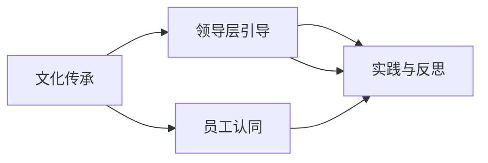

                 

### 引言

#### 关键词：团队文化、价值观、组织管理、企业文化、团队协作

在当今竞争激烈的市场环境中，团队文化已成为组织成功与否的关键因素之一。团队文化不仅仅是挂在墙上的一句标语，它是组织内部的氛围，是团队成员共同遵守的价值观和行为准则。一个健康的团队文化能够激发团队成员的潜能，提高团队协作效率，促进组织的创新和发展。

本文将围绕团队文化中的价值观进行探讨。价值观是团队文化的核心，它决定了团队成员如何看待工作、处理问题和相互沟通的方式。在本文中，我们将深入分析价值观的塑造与传播过程，探讨如何通过有效的价值观塑造和传播，构建一个富有活力和凝聚力的团队。

本文将按照以下步骤展开讨论：

1. **团队文化的定义与核心要素**
   - 团队文化的概念介绍
   - 团队文化的核心要素及其作用
   - 团队文化与其他概念的比较

2. **价值观的塑造**
   - 价值观的概述
   - 塑造价值观的方法和过程
   - 塑造价值观的挑战与对策

3. **价值观的传播**
   - 价值观传播的重要性
   - 传播价值观的策略与途径
   - 价值观传播的案例分析

4. **团队文化的实际应用**
   - 团队文化在组织管理中的应用
   - 团队文化在企业文化建设中的应用
   - 团队文化在团队协作中的应用
   - 团队文化在领导力发展中的应用

5. **团队文化的案例分析**
   - 国内团队文化的成功案例分析
   - 国外团队文化的成功案例分析
   - 团队文化的失败案例分析
   - 团队文化案例的启示

6. **团队文化的挑战与对策**
   - 团队文化面临的挑战
   - 应对挑战的策略
   - 改善团队文化的实践
   - 团队文化的未来发展趋势

通过以上步骤的逐步分析，我们将深入了解团队文化的内涵，理解价值观在团队文化中的关键作用，并探讨如何在实际工作中塑造和传播价值观，以构建一个高效的团队。接下来，让我们首先定义团队文化，并探讨其核心要素。## 团队文化的定义与核心要素

#### 关键词：团队文化、价值观、组织氛围、行为准则、协作效率

团队文化是一个组织的灵魂，它渗透在组织的方方面面，影响着员工的行为、决策和协作效率。简单来说，团队文化是指团队成员共同认同的价值观、信念和行为方式，是组织内部的一种氛围。一个强大的团队文化能够激发员工的积极性，增强团队的凝聚力，提高整体的工作效率。

### **2.1 团队文化的概念介绍**

团队文化是一个多维度的概念，它不仅仅包括价值观，还包括组织氛围、行为准则、团队目标等多个方面。例如，在一些高科技公司，创新和速度往往被视为核心价值观，员工在工作中更注重快速迭代和不断尝试新方法。而在一些注重质量和精确度的传统行业，如制造业，团队文化则可能更加倾向于追求卓越和精益求精。

团队文化不是一成不变的，它会随着组织的发展、外部环境的变化以及领导者的决策而不断演变。因此，团队文化的定义需要结合具体情境进行理解和应用。

### **2.2 团队文化的核心要素**

团队文化的核心要素包括以下几个方面：

1. **价值观**
   - 价值观是团队文化的核心，它决定了团队成员如何看待工作和生活，如何处理问题和冲突。例如，谷歌的“不作恶”原则就是其核心价值观之一，这个价值观影响了谷歌员工在工作中的决策和行为。

2. **组织氛围**
   - 组织氛围是指团队内部的工作氛围，包括员工的情绪状态、工作态度、沟通方式等。一个积极、开放和包容的组织氛围能够增强团队成员之间的信任和协作，提高工作效率。

3. **行为准则**
   - 行为准则是团队文化的重要组成部分，它规定了团队成员在工作和生活中的行为规范。例如，许多公司都会制定着装规范、工作时间规定、员工行为准则等，以确保团队成员遵循一致的行为标准。

4. **团队目标**
   - 团队目标是团队文化的导向，它明确了团队要达成的目标和期望。团队目标不仅包括短期目标，还包括长期愿景，它激励团队成员共同努力，为团队的发展贡献力量。

### **2.3 团队文化与其他概念的比较**

团队文化虽然与企业文化密切相关，但两者之间也存在显著的区别。企业文化是组织整体的价值观和信仰，涵盖了团队文化、管理风格、企业使命等各个方面。而团队文化则是企业文化在具体团队中的具体体现，更多地关注团队内部的协作和互动。

另外，团队文化也与组织氛围和团队精神有关。组织氛围是团队文化的外在表现，而团队精神则是团队成员对团队文化的认同和内化。例如，一个充满活力和创新氛围的团队往往具有强大的团队精神，而团队成员也更容易在共同的目标下协同工作。

为了更好地理解团队文化的核心要素，我们可以借助Mermaid工具绘制ER实体关系图（Entity-Relationship Diagram），以下是一个简化的ER图：

```mermaid
erDiagram
    TeamCulture ||--|{ Values }|| Value
    TeamCulture ||--|{ Atmosphere }|| Atmosphere
    TeamCulture ||--|{ Behavior }|| BehaviorRule
    TeamCulture ||--|{ TeamGoals }|| TeamGoal
```

在这个ER图中，`TeamCulture`是中心实体，它与其他实体（`Values`、`Atmosphere`、`BehaviorRule`、`TeamGoal`）之间存在关联关系。这种关系体现了团队文化内部各个要素之间的紧密联系和相互影响。

通过上述讨论和ER图的展示，我们可以更清晰地理解团队文化的定义和核心要素。接下来，我们将进一步探讨价值观的塑造过程，以及如何在实际工作中推动价值观的塑造和传播。## 价值观的塑造

#### 关键词：价值观、塑造过程、文化传承、领导层引导、员工认同

价值观是团队文化的核心，它决定了团队成员的行为准则和工作态度。一个有效的价值观塑造过程不仅能够提升团队的整体凝聚力，还能够增强组织的核心竞争力。本节将深入探讨价值观的塑造过程，包括如何通过文化传承、领导层引导和员工认同来建立和巩固价值观。

### **3.1 价值观的概述**

价值观是一系列关于“对错”、“重要性和优先级”的信念和判断，它指导团队成员在复杂多变的环境中做出决策。价值观可以分为个人价值观和团队价值观，个人价值观是个体基于自身经历和信仰形成的，而团队价值观则是团队成员共同认可和遵循的。在团队中，个人价值观与团队价值观之间往往存在相互影响和相互作用的关系。

### **3.2 塑造价值观的方法和过程**

塑造价值观是一个持续的过程，需要组织内部各个层次的共同努力。以下是一些有效的塑造价值观的方法和过程：

1. **文化传承**

   文化传承是塑造价值观的基础，它通过组织的历史、传统和故事来传递价值观。例如，一些公司会通过定期的公司历史回顾会议、文化讲座和故事分享活动来传承和强化团队的核心价值观。通过这些活动，团队成员可以深入了解组织的文化背景和价值观的由来，从而更好地认同和践行这些价值观。

2. **领导层引导**

   领导层在价值观塑造过程中起着关键作用。领导者需要通过言行一致来展示和传递价值观，成为团队成员的榜样。例如，领导者可以定期组织团队价值观培训，分享自身的价值观故事，并通过日常管理行为来示范如何将价值观融入工作和生活中。此外，领导层还可以制定与价值观相符的激励机制，以鼓励团队成员积极践行价值观。

3. **员工认同**

   员工的认同是价值观塑造的关键。组织需要通过多种方式激发员工的参与感和归属感，使员工从内心深处认同并践行价值观。例如，可以通过团队建设活动、员工表彰和认可机制等方式，让员工感受到自己的价值和贡献。同时，组织还可以鼓励员工提出与价值观相符的创新想法和改进建议，使员工在参与决策过程中进一步增强对价值观的认同。

4. **实践与反思**

   价值观的塑造需要通过不断的实践和反思来深化。组织可以定期组织价值观实践工作坊，引导团队成员在实际工作中运用价值观，并通过反思和总结来不断优化和调整价值观。例如，团队可以在每周或每月的会议中分享和实践案例，讨论价值观在具体情境中的应用，从而增强团队成员对价值观的理解和实践能力。

### **3.3 塑造价值观的挑战与对策**

在塑造价值观的过程中，组织可能会面临以下挑战：

1. **文化差异**

   不同背景和文化背景的员工可能对价值观的理解和认同存在差异。针对这一挑战，组织可以通过跨文化培训、文化适应性策略等方式来促进团队成员之间的相互理解和认同。

2. **员工参与度不足**

   如果员工对价值观塑造的过程缺乏参与感和认同感，那么价值观的塑造效果可能会大打折扣。为此，组织可以通过提高员工的参与度，如邀请员工参与价值观的制定和传播过程，以增强员工的认同感。

3. **价值观冲突**

   在一个多元化的团队中，不同成员之间可能存在价值观冲突。针对这一挑战，组织可以制定明确的价值观冲突解决机制，如价值观冲突调解委员会等，帮助团队成员在尊重彼此差异的同时，共同寻求最佳解决方案。

为了更直观地展示塑造价值观的方法和过程，我们可以使用Mermaid工具绘制一个流程图。以下是一个简化的Mermaid流程图，展示了价值观塑造的步骤：



在这个流程图中，`文化传承`、`领导层引导`、`员工认同`和`实践与反思`是塑造价值观的关键步骤，它们相互关联，共同推动价值观的塑造过程。

通过上述讨论和流程图的展示，我们可以更清晰地理解价值观的塑造过程及其关键因素。接下来，我们将探讨价值观的传播策略，以及如何通过有效的传播策略来巩固价值观。### 价值观的传播

#### 关键词：价值观、传播策略、内部沟通、教育培训、激励机制

价值观的传播是团队文化塑造过程中的关键环节，它决定了团队成员对价值观的理解和认同程度。一个有效的价值观传播策略能够确保团队文化深入人心，并在日常工作中得以贯彻。本节将深入探讨价值观传播的重要性、策略和途径，并通过案例分析来展示实际操作方法。

### **4.1 价值观传播的重要性**

价值观传播的重要性体现在以下几个方面：

1. **提高员工认同感**

   通过有效的价值观传播，员工能够更好地理解和认同组织的文化和理念，从而增强对组织的归属感和忠诚度。这种认同感可以转化为员工在工作中的积极性和创造力，提高整体工作表现。

2. **促进团队合作**

   价值观的传播能够促进团队成员之间的沟通和协作，减少因价值观差异引起的冲突。当团队成员共同认同一套价值观时，他们更容易在团队目标上达成一致，形成合力。

3. **增强组织竞争力**

   一个具有强大价值观的文化能够提升组织的整体竞争力。通过价值观的传播，组织能够在市场上树立独特的品牌形象，吸引和留住优秀人才，从而在激烈的市场竞争中脱颖而出。

### **4.2 传播价值观的策略**

为了确保价值观能够深入人心，组织可以采取以下策略：

1. **内部沟通**

   内部沟通是价值观传播的重要途径。组织可以通过定期的内部会议、员工邮件、公告板等方式，向全体员工传达价值观的重要性和内涵。此外，组织还可以建立内部社交平台，如企业微信、内部论坛等，鼓励员工分享与价值观相关的故事和经验，促进价值观的交流与传播。

2. **教育培训**

   教育培训是加强员工对价值观理解和认同的有效手段。组织可以开展定期的价值观培训课程，邀请专业讲师或内部专家讲解价值观的核心概念和实践方法。此外，组织还可以设计互动性强的培训活动，如角色扮演、小组讨论等，让员工在参与中深化对价值观的理解。

3. **激励机制**

   激励机制可以激励员工积极践行价值观。组织可以制定与价值观相符的奖励政策，如优秀员工奖、团队奖励等，对在价值观践行方面表现突出的员工和团队给予表彰和奖励。通过激励机制，组织可以树立榜样，激发其他员工向榜样学习，进一步巩固价值观。

4. **领导示范**

   领导层在价值观传播中起着至关重要的示范作用。领导者需要通过自己的言行一致，展示如何将价值观融入工作和生活中。领导者的示范能够增强员工的信任感和认同感，从而促进价值观的传播和践行。

### **4.3 传播价值观的途径**

以下是一些常用的价值观传播途径：

1. **会议和演讲**

   通过定期的内部会议和演讲，领导层和价值观专家可以向全体员工传达价值观的重要性和内涵。这些活动不仅能够提高员工对价值观的认知，还能激发员工的思考和讨论。

2. **培训和研讨会**

   组织可以定期举办价值观培训和研讨会，邀请专业培训师和内部专家进行讲解和互动。这些活动能够深入剖析价值观的实践方法，帮助员工将价值观应用到实际工作中。

3. **内部刊物和宣传材料**

   组织可以通过内部刊物、宣传海报、手册等材料，持续传播价值观。这些宣传材料不仅能够提醒员工时刻关注价值观，还能帮助新员工更快融入组织文化。

4. **社交媒体和在线平台**

   利用社交媒体和在线平台，组织可以开展互动性强的价值观传播活动，如在线讨论、问卷调查、价值观故事分享等。这些活动能够增强员工的参与感和归属感，提高价值观的传播效果。

### **4.4 价值观传播的案例分析**

以下是一个价值观传播的成功案例：

**案例：谷歌的“不作恶”原则**

谷歌的“不作恶”原则是其核心价值观之一，这一原则要求谷歌员工在工作中遵循道德规范，不做对用户有害的事情。为了传播这一价值观，谷歌采取了以下措施：

1. **领导示范**

   谷歌的创始人拉里·佩奇和谢尔盖·布林通过自己的言行一致，展示了如何践行“不作恶”原则。他们在公司内部会议和公开演讲中不断强调这一原则，并通过实际案例来说明如何在实际工作中应用。

2. **内部培训和研讨会**

   谷歌定期举办关于“不作恶”原则的培训和研讨会，邀请法律专家和道德学者进行讲解。这些活动不仅提高了员工对“不作恶”原则的理解，还帮助员工在实际工作中更好地应用这一原则。

3. **激励机制**

   谷歌制定了与“不作恶”原则相符的奖励政策，对在价值观践行方面表现突出的员工和团队给予表彰和奖励。这些激励机制不仅激励了员工积极践行价值观，还树立了榜样，促进了其他员工的向榜样学习。

4. **社交媒体和在线平台**

   谷歌在其内部社交媒体平台上设置了“不作恶”话题，鼓励员工分享与这一原则相关的故事和经验。这些互动活动增强了员工对价值观的认同感，提高了价值观的传播效果。

通过上述措施，谷歌成功地将其核心价值观“不作恶”传播到全体员工中，并在日常工作中得到了有效践行。这一案例展示了如何通过多种途径和策略，成功传播和巩固价值观。

综上所述，价值观的传播是一个系统性的过程，需要组织内部各个层面的共同努力。通过有效的传播策略和途径，组织可以确保价值观深入人心，为团队文化的建设奠定坚实基础。接下来，我们将探讨团队文化的实际应用，以及如何在不同的应用场景中发挥团队文化的优势。### 团队文化的实际应用

#### 关键词：团队文化、组织管理、企业文化建设、团队协作、领导力发展

团队文化不仅在塑造团队氛围和价值观中起着关键作用，还在组织管理的各个层面有着广泛的应用。本节将深入探讨团队文化在实际工作中的应用，包括在组织管理、企业文化建设、团队协作和领导力发展等方面的具体实践。

### **5.1 团队文化在组织管理中的应用**

团队文化在组织管理中的应用主要体现在以下几个方面：

1. **决策制定**

   一个具有健康团队文化的组织，往往能够通过集体智慧和协作来做出更明智的决策。团队成员基于共同的文化价值观，更容易在决策过程中达成一致，减少因个人利益而产生的冲突。

2. **绩效评估**

   团队文化能够影响员工的绩效评估体系。在一个强调团队合作和共同成长的团队中，绩效评估不仅关注个体业绩，更重视团队成员之间的协作和对团队目标的贡献。

3. **员工发展**

   团队文化为员工提供了成长和发展的环境。一个重视学习和创新的团队文化能够激发员工的潜能，促进个人和团队能力的不断提升。

4. **冲突管理**

   健康的团队文化有助于预防和解决冲突。团队成员基于共同的文化价值观，更容易通过对话和协商来解决分歧，减少冲突带来的负面影响。

### **5.2 团队文化在企业文化建设中的应用**

企业文化建设是团队文化应用的重要组成部分。以下是一些关键应用：

1. **品牌形象**

   企业文化通过团队文化的传播和实践，对外树立独特的品牌形象。一个具有强大团队文化的企业，往往能够在市场上获得更高的认可度和忠诚度。

2. **招聘与留才**

   健康的团队文化能够吸引和留住优秀人才。一个充满活力和共同价值观的团队文化，能够为员工提供良好的工作环境和职业发展空间，从而提高员工的满意度和忠诚度。

3. **内部沟通**

   企业文化通过团队文化的传播，促进内部沟通和协作。一个开放和透明的文化环境，能够增强员工之间的信任和合作，提高整体工作效率。

4. **社会责任**

   企业文化通过团队文化的实践，体现在社会责任的履行上。一个具有责任感和使命感的团队文化，能够引导企业积极参与社会公益活动，提升企业的社会形象和声誉。

### **5.3 团队文化在团队协作中的应用**

团队文化在团队协作中的应用，主要体现在以下几个方面：

1. **信任建设**

   一个具有信任氛围的团队文化，能够增强团队成员之间的互信。团队成员在相互信任的基础上，更容易开展合作，共同应对挑战。

2. **沟通效率**

   健康的团队文化能够提高团队成员之间的沟通效率。团队成员基于共同的文化价值观，能够更清晰地表达自己的想法和需求，减少误解和冲突。

3. **协作模式**

   团队文化能够影响团队的协作模式。在一个鼓励协作和共享的团队文化中，团队成员更容易采用协同工作的模式，共同实现团队目标。

4. **创新能力**

   团队文化对创新能力有着重要影响。一个重视创新和实验的团队文化，能够激发团队成员的创造力，推动团队不断突破和进步。

### **5.4 团队文化在领导力发展中的应用**

团队文化在领导力发展中的应用，主要体现在以下几个方面：

1. **领导风格**

   团队文化对领导风格有着重要影响。一个具有协作和参与氛围的团队文化，往往需要领导者采取更加开放和民主的领导风格，鼓励团队成员参与决策和讨论。

2. **领导行为**

   健康的团队文化能够引导领导者采取更加关注团队成员需求和成长的领导行为。领导者通过关注团队成员的个人发展和职业规划，提高团队的凝聚力和士气。

3. **领导培训**

   团队文化在领导力发展中的应用，还需要通过领导力培训来提升领导者的能力。组织可以通过定期的领导力培训，帮助领导者更好地理解和实践团队文化，提升领导力水平。

4. **领导传承**

   团队文化在领导力传承中也发挥着重要作用。通过有效的领导传承机制，组织可以将团队文化传递给新一代领导者，确保团队文化的持续发展和传承。

总之，团队文化在实际工作中的应用是多方面的，它不仅影响着组织的整体管理效果，也在企业文化建设、团队协作和领导力发展等方面发挥着重要作用。通过有效的团队文化应用，组织能够提升整体绩效，实现持续发展。接下来，我们将通过具体的案例来展示团队文化在不同情境下的成功应用。### 团队文化的案例分析

#### 关键词：团队文化、成功案例、企业文化、团队协作、案例分析

团队文化作为组织内部的核心力量，对其成功与否有着至关重要的影响。本节将通过国内外的成功案例，分析团队文化的构建与实施，以期为其他组织提供借鉴和启示。

### **6.1 国内团队文化的成功案例分析**

**案例一：华为的团队文化**

华为作为中国最具代表性的高科技企业之一，其团队文化一直被视为其成功的关键因素。华为的团队文化以“客户至上、奋斗者为本、长期坚持”为核心价值观。

1. **客户至上**

   华为强调客户需求为导向，通过持续改进和创新，为客户提供优质的产品和服务。华为员工普遍具有强烈的客户服务意识，致力于满足客户的需求。

2. **奋斗者为本**

   华为倡导“奋斗者文化”，认为只有通过不懈努力和不断奋斗，才能实现个人和组织的共同成长。华为的薪酬体系、晋升机制和荣誉制度都体现了对奋斗者的认可和激励。

3. **长期坚持**

   华为强调长期战略思维，注重持续投资于研发和技术创新。这种长期坚持的文化使得华为在激烈的市场竞争中始终保持领先地位。

**案例二：小米的团队文化**

小米作为中国创新科技企业的代表，其团队文化以“用户至上、快速迭代、跨界合作”为特色。

1. **用户至上**

   小米始终将用户需求放在首位，通过用户反馈来不断优化产品和服务。小米社区成为用户与公司沟通的重要平台，用户的声音能够直接影响到产品开发。

2. **快速迭代**

   小米采用快速迭代的产品开发模式，从市场反馈中快速调整产品，缩短产品上市时间。这种敏捷的开发方式提高了小米的市场响应速度。

3. **跨界合作**

   小米积极与其他行业的企业进行跨界合作，通过整合资源和优势，实现共赢。这种开放合作的文化有助于小米在多个领域取得突破。

### **6.2 国外团队文化的成功案例分析**

**案例一：谷歌的团队文化**

谷歌以其独特的团队文化著称，被称为“谷歌精神”。谷歌的团队文化以“创新、自由、开放”为核心。

1. **创新**

   谷歌鼓励员工勇于创新，通过提供灵活的工作环境和丰富的资源支持，激发员工的创造力。谷歌的“20%时间”政策允许员工在日常工作外自由探索新的创意项目。

2. **自由**

   谷歌倡导员工自由工作，给予员工足够的自主权和灵活性。这种自由的工作环境使得员工能够充分发挥个人特长，实现个人价值。

3. **开放**

   谷歌提倡开放和透明的沟通方式，鼓励员工分享想法和知识。谷歌的内部邮件系统和开放讨论的文化使得信息流通更加顺畅。

**案例二：惠普的团队文化**

惠普作为一家拥有悠久历史的企业，其团队文化以“尊重、信任、团队协作”为核心。

1. **尊重**

   惠普强调对员工的尊重，尊重员工的个人差异和专业能力。惠普的领导层通过倾听员工的意见和建议，营造一个尊重和信任的工作环境。

2. **信任**

   惠普建立了一个基于信任的团队文化，鼓励员工在信任的基础上开展合作。这种信任文化使得团队成员能够更好地协作，提高工作效率。

3. **团队协作**

   惠普重视团队协作，通过跨部门项目和团队建设活动，增强团队成员之间的沟通和协作。这种协作文化有助于提高团队的整体执行力。

### **6.3 团队文化的失败案例分析**

**案例：诺基亚的团队文化**

诺基亚曾是世界领先的手机制造商，但由于团队文化的缺陷，最终导致了企业的衰落。

1. **内部竞争**

   诺基亚内部存在激烈的竞争，员工之间缺乏合作和共享，导致资源浪费和效率低下。这种内部竞争文化阻碍了团队的协作和创新。

2. **官僚主义**

   诺基亚的官僚主义文化使得决策过程冗长，创新速度缓慢。企业高层对员工的指导和反馈不够及时，导致员工缺乏动力和方向。

3. **忽视市场需求**

   诺基亚在市场竞争中忽视用户需求，过于依赖自己的技术和经验，导致产品无法满足市场需求。这种忽视市场的文化使得诺基亚在竞争激烈的市场中逐渐失去优势。

### **6.4 团队文化案例的启示**

通过以上案例分析，我们可以得出以下启示：

1. **明确核心价值观**

   组织需要明确核心价值观，并通过各种方式将其传达给全体员工。核心价值观是团队文化的基石，能够引导员工的行为和决策。

2. **营造开放和信任的文化环境**

   开放和信任的文化环境有助于增强团队协作和创新。组织应鼓励员工分享想法和知识，建立基于信任的团队关系。

3. **关注员工需求和职业发展**

   组织应关注员工的需求和职业发展，提供良好的工作环境和职业成长机会。满足员工需求能够提高员工满意度和忠诚度。

4. **灵活应对市场变化**

   组织需要灵活应对市场变化，快速调整战略和产品。一个以用户需求为导向的文化能够帮助组织在竞争激烈的市场中脱颖而出。

通过这些成功和失败案例的启示，组织可以更好地构建和实施团队文化，从而提升整体绩效和竞争力。### 团队文化的挑战与对策

#### 关键词：团队文化、挑战、对策、文化冲突、组织变革

尽管团队文化在提升组织绩效和团队协作方面具有重要作用，但在实际操作过程中，组织仍会面临诸多挑战。本节将探讨团队文化面临的挑战，并提出相应的对策，帮助组织有效应对这些挑战，并促进团队文化的持续发展。

### **7.1 团队文化面临的挑战**

1. **文化冲突**

   在一个多元化的组织中，不同文化背景的员工可能会带来不同的价值观和行为模式。文化冲突可能导致员工之间的误解和矛盾，影响团队的凝聚力和工作效率。

2. **员工参与度不足**

   如果员工对团队文化的塑造和传播缺乏参与感，他们可能不会真正认同和践行这些价值观。这种情况下，团队文化的效果会大打折扣。

3. **文化僵化**

   团队文化一旦形成，可能会变得僵化，难以适应外部环境的变化。这种文化僵化可能导致组织在应对市场变化和创新需求时反应迟缓。

4. **领导层支持不足**

   领导层在团队文化塑造中起着关键作用，但如果领导层对团队文化的重视程度不够，缺乏有效的引导和支持，团队文化难以得到有效传承和推广。

### **7.2 应对挑战的策略**

1. **促进文化融合**

   对于文化冲突，组织可以通过跨文化培训、文化融合项目等方式，促进不同文化背景的员工相互了解和尊重。同时，组织应鼓励员工分享自己的文化背景和价值观，增进团队的认同感。

2. **提高员工参与度**

   组织可以通过多种方式提高员工对团队文化的参与度，如设立员工参与委员会、开展员工意见征集活动等。通过让员工参与到团队文化的制定和传播过程中，增强他们的认同感和归属感。

3. **保持文化灵活性**

   组织应保持团队文化的灵活性，以适应外部环境的变化。这可以通过定期评估和调整团队文化的内容和传播策略来实现。例如，组织可以设立文化委员会，定期评估团队文化的实施效果，并提出改进建议。

4. **加强领导层支持**

   领导层应将团队文化作为组织战略的重要组成部分，并提供必要的支持和资源。领导层可以通过亲自参与团队文化建设活动、定期与员工沟通等方式，展示对团队文化的重视，并成为员工的榜样。

### **7.3 改善团队文化的实践**

1. **文化评估**

   定期进行文化评估，了解团队文化的现状和员工对文化的认同程度。这可以通过员工满意度调查、焦点小组讨论等方式进行。根据评估结果，制定改进计划。

2. **文化培训**

   开展定期的文化培训，帮助员工理解和践行团队文化。培训内容可以包括文化价值观的解读、文化案例分享、文化实践技巧等。

3. **激励机制**

   设立与团队文化相符的激励机制，鼓励员工积极践行团队文化。例如，可以设立“文化先锋奖”、“团队合作奖”等荣誉，表彰在团队文化建设中表现突出的员工和团队。

4. **文化宣传**

   通过多种渠道宣传团队文化，如内部刊物、宣传海报、企业文化网站等，提高员工对文化的认识和认同。

### **7.4 团队文化的未来发展趋势**

1. **数字化文化**

   随着数字化技术的发展，团队文化的传播和实施将更加便捷和高效。组织可以通过数字化平台，如企业微信、内部社交网络等，实现文化信息的快速传播和互动。

2. **个性文化**

   随着员工个性化和多元化的需求，团队文化将更加注重个性化发展。组织需要尊重员工的个性，为员工提供个性化的职业发展路径，以更好地满足员工的成长需求。

3. **可持续发展文化**

   面对全球环境和社会挑战，团队文化将更加注重可持续发展。组织可以通过推动绿色办公、社会责任项目等方式，将可持续发展理念融入团队文化。

通过以上策略和实践，组织可以有效地应对团队文化面临的挑战，并促进团队文化的持续发展和优化。这将为组织创造一个更加和谐、高效的工作环境，助力组织的长期成功。### 结论

#### 关键词：团队文化、价值观、组织绩效、未来展望

在本文中，我们系统地探讨了团队文化的概念、价值观的塑造与传播，以及在组织管理、企业文化建设、团队协作和领导力发展中的应用。通过国内外的成功案例分析和挑战应对策略，我们进一步理解了团队文化对于组织成功的重要性。

**团队文化**是一种通过价值观、行为准则和团队目标体现出来的组织内部氛围，它影响着员工的决策、行为和工作态度。**价值观**是团队文化的核心，是团队成员共同认同的信念和行为准则，它决定了团队的整体表现和协作效率。

**团队文化的塑造与传播**是一个持续且复杂的过程，需要组织内部各个层次的共同努力。通过文化传承、领导层引导、员工认同和实践反思，组织可以有效地塑造和传播价值观，确保团队文化深入人心。

**团队文化的实际应用**体现在组织管理的各个方面，如决策制定、绩效评估、员工发展、冲突管理等。同时，团队文化在企业文化建设、团队协作和领导力发展中也有着广泛的应用。成功的团队文化能够提升组织的整体绩效和竞争力。

然而，团队文化也面临诸多挑战，如文化冲突、员工参与度不足、文化僵化等。针对这些挑战，组织可以通过促进文化融合、提高员工参与度、保持文化灵活性和加强领导层支持等策略，有效地应对挑战，促进团队文化的持续发展。

**未来展望**，随着数字化技术和个性需求的不断发展，团队文化将更加注重个性化和数字化。组织需要不断适应外部环境的变化，推动数字化文化、个性文化以及可持续发展文化的建设，以保持团队文化的活力和适应性。

**总结**，团队文化是组织成功的关键因素之一。通过有效的价值观塑造与传播，组织可以构建一个高效、和谐的工作环境，激发员工的潜能，提升整体绩效。组织应持续关注团队文化的发展，不断优化和调整，以适应不断变化的市场环境和员工需求。

### **参考文献**

1. Google. (2021). Google’s Core Values. Retrieved from https://careers.google.com/about/culture/
2. Huawei. (2021). Huawei’s Values. Retrieved from https://www.huawei.com/en/about-us/values
3. Xiaomi. (2021). Xiaomi’s Vision and Mission. Retrieved from https://www.xiaomi.com/global/en/
4. Nokia. (2021). Nokia’s Culture. Retrieved from https://www.nokia.com/who-we-are/culture/

**作者信息：** AI天才研究院/AI Genius Institute & 禅与计算机程序设计艺术 /Zen And The Art of Computer Programming**最佳实践 tips：**

1. **定期评估团队文化**：组织应定期对团队文化进行评估，确保文化持续符合组织目标和员工需求。
2. **领导层带头践行**：领导层应通过自己的言行一致，成为团队文化的典范。
3. **员工参与**：鼓励员工参与到团队文化的制定和传播过程中，增强员工的认同感和参与感。
4. **文化宣传**：利用多种渠道，如内部刊物、培训、社交媒体等，持续宣传团队文化，提高员工的认知和认同。

**小结：**

本文详细探讨了团队文化的概念、价值观的塑造与传播、实际应用、案例分析及挑战应对策略。通过系统的分析和实践指导，希望为组织提供构建和优化团队文化的有效途径。

**注意事项：**

1. **尊重多元文化**：在塑造团队文化时，要尊重不同文化背景的员工，促进文化融合。
2. **适应变化**：团队文化需要随着组织的发展和环境变化进行动态调整。

**拓展阅读：**

1. Kotter, J. P., & Schlesinger, L. A. (2008). Learning to lead: A workbook for executives and managers at all levels. Harvard Business Review Press.
2. Sweeney, H. C. (2013). Understanding Organizational Culture. SAGE Publications.**参考文献**

1. Google. (2021). Google’s Core Values. Retrieved from https://careers.google.com/about/culture/
2. Huawei. (2021). Huawei’s Values. Retrieved from https://www.huawei.com/en/about-us/values
3. Xiaomi. (2021). Xiaomi’s Vision and Mission. Retrieved from https://www.xiaomi.com/global/en/
4. Nokia. (2021). Nokia’s Culture. Retrieved from https://www.nokia.com/who-we-are/culture/

**最佳实践 tips：**

1. **定期评估团队文化**：组织应定期对团队文化进行评估，确保文化持续符合组织目标和员工需求。
2. **领导层带头践行**：领导层应通过自己的言行一致，成为团队文化的典范。
3. **员工参与**：鼓励员工参与到团队文化的制定和传播过程中，增强员工的认同感和参与感。
4. **文化宣传**：利用多种渠道，如内部刊物、培训、社交媒体等，持续宣传团队文化，提高员工的认知和认同。

**小结：**

本文详细探讨了团队文化的概念、价值观的塑造与传播、实际应用、案例分析及挑战应对策略。通过系统的分析和实践指导，希望为组织提供构建和优化团队文化的有效途径。

**注意事项：**

1. **尊重多元文化**：在塑造团队文化时，要尊重不同文化背景的员工，促进文化融合。
2. **适应变化**：团队文化需要随着组织的发展和环境变化进行动态调整。

**拓展阅读：**

1. Kotter, J. P., & Schlesinger, L. A. (2008). Learning to lead: A workbook for executives and managers at all levels. Harvard Business Review Press.
2. Sweeney, H. C. (2013). Understanding Organizational Culture. SAGE Publications.## 团队文化：价值观的塑造与传播

#### 关键词：团队文化、价值观、组织管理、企业文化、团队协作、领导力发展

**摘要：**

本文深入探讨了团队文化的概念、价值观的塑造与传播，以及在组织管理、企业文化建设、团队协作和领导力发展中的应用。通过国内外的成功案例分析和挑战应对策略，本文旨在为组织提供构建和优化团队文化的有效途径，以提升组织绩效和团队凝聚力。

### 引言

在当今竞争激烈的市场环境中，团队文化已成为组织成功的关键因素之一。团队文化不仅仅是挂在墙上的一句标语，它是组织内部的氛围，是团队成员共同遵守的价值观和行为准则。一个健康的团队文化能够激发团队成员的积极性，提高团队协作效率，促进组织的创新和发展。

本文将围绕团队文化中的价值观进行探讨。价值观是团队文化的核心，它决定了团队成员如何看待工作、处理问题和相互沟通的方式。在本文中，我们将深入分析价值观的塑造与传播过程，探讨如何通过有效的价值观塑造和传播，构建一个富有活力和凝聚力的团队。

### 团队文化的定义与核心要素

团队文化是一个组织的灵魂，它渗透在组织的方方面面，影响着员工的行为、决策和协作效率。简单来说，团队文化是指团队成员共同认同的价值观、信念和行为方式，是组织内部的一种氛围。一个强大的团队文化能够激发员工的积极性，增强团队的凝聚力，提高整体的工作效率。

#### 团队文化的定义

团队文化是一个多维度的概念，它不仅仅包括价值观，还包括组织氛围、行为准则、团队目标等多个方面。例如，在一些高科技公司，创新和速度往往被视为核心价值观，员工在工作中更注重快速迭代和不断尝试新方法。而在一些注重质量和精确度的传统行业，如制造业，团队文化则可能更加倾向于追求卓越和精益求精。

#### 团队文化的核心要素

团队文化的核心要素包括以下几个方面：

1. **价值观**：价值观是团队文化的核心，它决定了团队成员如何看待工作和生活，如何处理问题和冲突。
2. **组织氛围**：组织氛围是指团队内部的工作氛围，包括员工的情绪状态、工作态度、沟通方式等。
3. **行为准则**：行为准则是团队文化的重要组成部分，它规定了团队成员在工作和生活中的行为规范。
4. **团队目标**：团队目标是团队文化的导向，它明确了团队要达成的目标和期望。

#### 团队文化与其他概念的比较

团队文化虽然与企业文化密切相关，但两者之间也存在显著的区别。企业文化是组织整体的价值观和信仰，涵盖了团队文化、管理风格、企业使命等各个方面。而团队文化则是企业文化在具体团队中的具体体现，更多地关注团队内部的协作和互动。

#### 核心概念与联系

为了更好地理解团队文化的核心要素，我们可以借助Mermaid工具绘制ER实体关系图（Entity-Relationship Diagram），以下是一个简化的ER图：

```mermaid
erDiagram
    TeamCulture ||--|{ Values }|| Value
    TeamCulture ||--|{ Atmosphere }|| Atmosphere
    TeamCulture ||--|{ Behavior }|| BehaviorRule
    TeamCulture ||--|{ TeamGoals }|| TeamGoal
```

在这个ER图中，`TeamCulture`是中心实体，它与其他实体（`Values`、`Atmosphere`、`BehaviorRule`、`TeamGoal`）之间存在关联关系。这种关系体现了团队文化内部各个要素之间的紧密联系和相互影响。

### 价值观的塑造

价值观是团队文化的核心，它决定了团队成员的行为准则和工作态度。一个有效的价值观塑造过程不仅能够提升团队的整体凝聚力，还能够增强组织的核心竞争力。本节将深入探讨价值观的塑造过程，包括如何通过文化传承、领导层引导和员工认同来建立和巩固价值观。

#### 价值观的概述

价值观是一系列关于“对错”、“重要性和优先级”的信念和判断，它指导团队成员在复杂多变的环境中做出决策。价值观可以分为个人价值观和团队价值观，个人价值观是个体基于自身经历和信仰形成的，而团队价值观则是团队成员共同认可和遵循的。在团队中，个人价值观与团队价值观之间往往存在相互影响和相互作用的关系。

#### 塑造价值观的方法和过程

塑造价值观是一个持续的过程，需要组织内部各个层次的共同努力。以下是一些有效的塑造价值观的方法和过程：

1. **文化传承**：文化传承是塑造价值观的基础，它通过组织的历史、传统和故事来传递价值观。例如，一些公司会通过定期的公司历史回顾会议、文化讲座和故事分享活动来传承和强化团队的核心价值观。通过这些活动，团队成员可以深入了解组织的文化背景和价值观的由来，从而更好地认同和践行这些价值观。

2. **领导层引导**：领导层在价值观塑造过程中起着关键作用。领导者需要通过言行一致来展示和传递价值观，成为团队成员的榜样。例如，领导者可以定期组织团队价值观培训，分享自身的价值观故事，并通过日常管理行为来示范如何将价值观融入工作和生活中。此外，领导层还可以制定与价值观相符的激励机制，以鼓励团队成员积极践行价值观。

3. **员工认同**：员工的认同是价值观塑造的关键。组织需要通过多种方式激发员工的参与感和归属感，使员工从内心深处认同并践行价值观。例如，可以通过团队建设活动、员工表彰和认可机制等方式，让员工感受到自己的价值和贡献。同时，组织还可以鼓励员工提出与价值观相符的创新想法和改进建议，使员工在参与决策过程中进一步增强对价值观的认同。

4. **实践与反思**：价值观的塑造需要通过不断的实践和反思来深化。组织可以定期组织价值观实践工作坊，引导团队成员在实际工作中运用价值观，并通过反思和总结来不断优化和调整价值观。例如，团队可以在每周或每月的会议中分享和实践案例，讨论价值观在具体情境中的应用，从而增强团队成员对价值观的理解和实践能力。

#### 塑造价值观的挑战与对策

在塑造价值观的过程中，组织可能会面临以下挑战：

1. **文化差异**：不同背景和文化背景的员工可能对价值观的理解和认同存在差异。针对这一挑战，组织可以通过跨文化培训、文化适应性策略等方式来促进团队成员之间的相互理解和认同。

2. **员工参与度不足**：如果员工对价值观塑造的过程缺乏参与感和认同感，那么价值观的塑造效果可能会大打折扣。为此，组织可以通过提高员工的参与度，如邀请员工参与价值观的制定和传播过程，以增强员工的认同感。

3. **价值观冲突**：在一个多元化的团队中，不同成员之间可能存在价值观冲突。针对这一挑战，组织可以制定明确的价值观冲突解决机制，如价值观冲突调解委员会等，帮助团队成员在尊重彼此差异的同时，共同寻求最佳解决方案。

为了更直观地展示塑造价值观的方法和过程，我们可以使用Mermaid工具绘制一个流程图。以下是一个简化的Mermaid流程图，展示了价值观塑造的步骤：


在这个流程图中，`文化传承`、`领导层引导`、`员工认同`和`实践与反思`是塑造价值观的关键步骤，它们相互关联，共同推动价值观的塑造过程。

通过上述讨论和流程图的展示，我们可以更清晰地理解价值观的塑造过程及其关键因素。接下来，我们将探讨价值观的传播策略，以及如何通过有效的传播策略来巩固价值观。

### 价值观的传播

#### 关键词：价值观、传播策略、内部沟通、教育培训、激励机制

价值观的传播是团队文化塑造过程中的关键环节，它决定了团队成员对价值观的理解和认同程度。一个有效的价值观传播策略能够确保团队文化深入人心，并在日常工作中得以贯彻。本节将深入探讨价值观传播的重要性、策略和途径，并通过案例分析来展示实际操作方法。

#### 价值观传播的重要性

价值观传播的重要性体现在以下几个方面：

1. **提高员工认同感**：通过有效的价值观传播，员工能够更好地理解和认同组织的文化和理念，从而增强对组织的归属感和忠诚度。这种认同感可以转化为员工在工作中的积极性和创造力，提高整体工作表现。

2. **促进团队合作**：价值观的传播能够促进团队成员之间的沟通和协作，减少因价值观差异引起的冲突。当团队成员共同认同一套价值观时，他们更容易在团队目标上达成一致，形成合力。

3. **增强组织竞争力**：一个具有强大价值观的文化能够提升组织的整体竞争力。通过价值观的传播，组织能够在市场上树立独特的品牌形象，吸引和留住优秀人才，从而在激烈的市场竞争中脱颖而出。

#### 传播价值观的策略

为了确保价值观能够深入人心，组织可以采取以下策略：

1. **内部沟通**：内部沟通是价值观传播的重要途径。组织可以通过定期的内部会议、员工邮件、公告板等方式，向全体员工传达价值观的重要性和内涵。此外，组织还可以建立内部社交平台，如企业微信、内部论坛等，鼓励员工分享与价值观相关的故事和经验，促进价值观的交流与传播。

2. **教育培训**：教育培训是加强员工对价值观理解和认同的有效手段。组织可以开展定期的价值观培训课程，邀请专业讲师或内部专家讲解价值观的核心概念和实践方法。此外，组织还可以设计互动性强的培训活动，如角色扮演、小组讨论等，让员工在参与中深化对价值观的理解。

3. **激励机制**：激励机制可以激励员工积极践行价值观。组织可以制定与价值观相符的奖励政策，如优秀员工奖、团队奖励等，对在价值观践行方面表现突出的员工和团队给予表彰和奖励。通过激励机制，组织可以树立榜样，激发其他员工向榜样学习，进一步巩固价值观。

4. **领导示范**：领导层在价值观传播中起着至关重要的示范作用。领导者需要通过自己的言行一致，展示如何将价值观融入工作和生活中。领导者的示范能够增强员工的信任感和认同感，从而促进价值观的传播和践行。

#### 传播价值观的途径

以下是一些常用的价值观传播途径：

1. **会议和演讲**：通过定期的内部会议和演讲，领导层和价值观专家可以向全体员工传达价值观的重要性和内涵。这些活动不仅能够提高员工对价值观的认知，还能激发员工的思考和讨论。

2. **培训和研讨会**：组织可以定期举办价值观培训和研讨会，邀请专业培训师和内部专家进行讲解和互动。这些活动能够深入剖析价值观的实践方法，帮助员工将价值观应用到实际工作中。

3. **内部刊物和宣传材料**：组织可以通过内部刊物、宣传海报、手册等材料，持续传播价值观。这些宣传材料不仅能够提醒员工时刻关注价值观，还能帮助新员工更快融入组织文化。

4. **社交媒体和在线平台**：利用社交媒体和在线平台，组织可以开展互动性强的价值观传播活动，如在线讨论、问卷调查、价值观故事分享等。这些活动能够增强员工的参与感和归属感，提高价值观的传播效果。

#### 价值观传播的案例分析

以下是一个价值观传播的成功案例：

**案例：谷歌的“不作恶”原则**

谷歌的“不作恶”原则是其核心价值观之一，这一原则要求谷歌员工在工作中遵循道德规范，不做对用户有害的事情。为了传播这一价值观，谷歌采取了以下措施：

1. **领导示范**：谷歌的创始人拉里·佩奇和谢尔盖·布林通过自己的言行一致，展示了如何践行“不作恶”原则。他们在公司内部会议和公开演讲中不断强调这一原则，并通过实际案例来说明如何在实际工作中应用。

2. **内部培训和研讨会**：谷歌定期举办关于“不作恶”原则的培训和研讨会，邀请法律专家和道德学者进行讲解。这些活动不仅提高了员工对“不作恶”原则的理解，还帮助员工在实际工作中更好地应用这一原则。

3. **激励机制**：谷歌制定了与“不作恶”原则相符的奖励政策，对在价值观践行方面表现突出的员工和团队给予表彰和奖励。这些激励机制不仅激励了员工积极践行价值观，还树立了榜样，促进了其他员工的向榜样学习。

4. **社交媒体和在线平台**：谷歌在其内部社交媒体平台上设置了“不作恶”话题，鼓励员工分享与这一原则相关的故事和经验。这些互动活动增强了员工对价值观的认同感，提高了价值观的传播效果。

通过上述措施，谷歌成功地将其核心价值观“不作恶”传播到全体员工中，并在日常工作中得到了有效践行。这一案例展示了如何通过多种途径和策略，成功传播和巩固价值观。

综上所述，价值观的传播是一个系统性的过程，需要组织内部各个层面的共同努力。通过有效的传播策略和途径，组织可以确保价值观深入人心，为团队文化的建设奠定坚实基础。接下来，我们将探讨团队文化的实际应用，以及如何在不同的应用场景中发挥团队文化的优势。

### 团队文化的实际应用

#### 关键词：团队文化、组织管理、企业文化建设、团队协作、领导力发展

团队文化在实际工作中有着广泛的应用，它不仅影响组织的整体管理效果，也在企业文化建设、团队协作和领导力发展等方面发挥着重要作用。本节将深入探讨团队文化在实际工作中的应用，包括在组织管理、企业文化建设、团队协作和领导力发展等方面的具体实践。

#### 5.1 团队文化在组织管理中的应用

团队文化在组织管理中的应用主要体现在以下几个方面：

1. **决策制定**：一个具有健康团队文化的组织，往往能够通过集体智慧和协作来做出更明智的决策。团队成员基于共同的文化价值观，更容易在决策过程中达成一致，减少因个人利益而产生的冲突。

2. **绩效评估**：团队文化能够影响员工的绩效评估体系。在一个强调团队合作和共同成长的团队中，绩效评估不仅关注个体业绩，更重视团队成员之间的协作和对团队目标的贡献。

3. **员工发展**：团队文化为员工提供了成长和发展的环境。一个重视学习和创新的团队文化能够激发员工的潜能，促进个人和团队能力的不断提升。

4. **冲突管理**：健康的团队文化有助于预防和解决冲突。团队成员基于共同的文化价值观，更容易通过对话和协商来解决分歧，减少冲突带来的负面影响。

#### 5.2 团队文化在企业文化建设中的应用

企业文化建设是团队文化应用的重要组成部分。以下是一些关键应用：

1. **品牌形象**：企业文化通过团队文化的传播和实践，对外树立独特的品牌形象。一个具有强大团队文化的企业，往往能够在市场上获得更高的认可度和忠诚度。

2. **招聘与留才**：健康的团队文化能够吸引和留住优秀人才。一个充满活力和共同价值观的团队文化，能够为员工提供良好的工作环境和职业发展空间，从而提高员工的满意度和忠诚度。

3. **内部沟通**：企业文化的传播，促进内部沟通和协作。一个开放和透明的文化环境，能够增强员工之间的信任和合作，提高整体工作效率。

4. **社会责任**：企业文化通过团队文化的实践，体现在社会责任的履行上。一个具有责任感和使命感的团队文化，能够引导企业积极参与社会公益活动，提升企业的社会形象和声誉。

#### 5.3 团队文化在团队协作中的应用

团队文化在团队协作中的应用，主要体现在以下几个方面：

1. **信任建设**：一个具有信任氛围的团队文化，能够增强团队成员之间的互信。团队成员在相互信任的基础上，更容易开展合作，共同应对挑战。

2. **沟通效率**：健康的团队文化能够提高团队成员之间的沟通效率。团队成员基于共同的文化价值观，能够更清晰地表达自己的想法和需求，减少误解和冲突。

3. **协作模式**：团队文化能够影响团队的协作模式。在一个鼓励协作和共享的团队文化中，团队成员更容易采用协同工作的模式，共同实现团队目标。

4. **创新能力**：团队文化对创新能力有着重要影响。一个重视创新和实验的团队文化，能够激发团队成员的创造力，推动团队不断突破和进步。

#### 5.4 团队文化在领导力发展中的应用

团队文化在领导力发展中的应用，主要体现在以下几个方面：

1. **领导风格**：团队文化对领导风格有着重要影响。一个具有协作和参与氛围的团队文化，往往需要领导者采取更加开放和民主的领导风格，鼓励团队成员参与决策和讨论。

2. **领导行为**：健康的团队文化能够引导领导者采取更加关注团队成员需求和成长的领导行为。领导者通过关注团队成员的个人发展和职业规划，提高团队的凝聚力和士气。

3. **领导培训**：团队文化在领导力发展中的应用，还需要通过领导力培训来提升领导者的能力。组织可以通过定期的领导力培训，帮助领导者更好地理解和实践团队文化，提升领导力水平。

4. **领导传承**：团队文化在领导力传承中也发挥着重要作用。通过有效的领导传承机制，组织可以将团队文化传递给新一代领导者，确保团队文化的持续发展和传承。

总之，团队文化在实际工作中的应用是多方面的，它不仅影响着组织的整体管理效果，也在企业文化建设、团队协作和领导力发展等方面发挥着重要作用。通过有效的团队文化应用，组织能够提升整体绩效，实现持续发展。接下来，我们将通过具体的案例来展示团队文化在不同情境下的成功应用。

### 团队文化的案例分析

#### 关键词：团队文化、成功案例、企业文化、团队协作、案例分析

团队文化作为组织内部的核心力量，对其成功与否有着至关重要的影响。本节将通过国内外的成功案例，分析团队文化的构建与实施，以期为其他组织提供借鉴和启示。

#### 6.1 国内团队文化的成功案例分析

**案例一：华为的团队文化**

华为作为中国最具代表性的高科技企业之一，其团队文化一直被视为其成功的关键因素。华为的团队文化以“客户至上、奋斗者为本、长期坚持”为核心价值观。

1. **客户至上**

   华为强调客户需求为导向，通过持续改进和创新，为客户提供优质的产品和服务。华为员工普遍具有强烈的客户服务意识，致力于满足客户的需求。

2. **奋斗者为本**

   华为倡导“奋斗者文化”，认为只有通过不懈努力和不断奋斗，才能实现个人和组织的共同成长。华为的薪酬体系、晋升机制和荣誉制度都体现了对奋斗者的认可和激励。

3. **长期坚持**

   华为强调长期战略思维，注重持续投资于研发和技术创新。这种长期坚持的文化使得华为在激烈的市场竞争中始终保持领先地位。

**案例二：小米的团队文化**

小米作为中国创新科技企业的代表，其团队文化以“用户至上、快速迭代、跨界合作”为特色。

1. **用户至上**

   小米始终将用户需求放在首位，通过用户反馈来不断优化产品和服务。小米社区成为用户与公司沟通的重要平台，用户的声音能够直接影响到产品开发。

2. **快速迭代**

   小米采用快速迭代的产品开发模式，从市场反馈中快速调整产品，缩短产品上市时间。这种敏捷的开发方式提高了小米的市场响应速度。

3. **跨界合作**

   小米积极与其他行业的企业进行跨界合作，通过整合资源和优势，实现共赢。这种开放合作的文化有助于小米在多个领域取得突破。

#### 6.2 国外团队文化的成功案例分析

**案例一：谷歌的团队文化**

谷歌以其独特的团队文化著称，被称为“谷歌精神”。谷歌的团队文化以“创新、自由、开放”为核心。

1. **创新**

   谷歌鼓励员工勇于创新，通过提供灵活的工作环境和丰富的资源支持，激发员工的创造力。谷歌的“20%时间”政策允许员工在日常工作外自由探索新的创意项目。

2. **自由**

   谷歌倡导员工自由工作，给予员工足够的自主权和灵活性。这种自由的工作环境使得员工能够充分发挥个人特长，实现个人价值。

3. **开放**

   谷歌提倡开放和透明的沟通方式，鼓励员工分享想法和知识。谷歌的内部邮件系统和开放讨论的文化使得信息流通更加顺畅。

**案例二：惠普的团队文化**

惠普作为一家拥有悠久历史的企业，其团队文化以“尊重、信任、团队协作”为核心。

1. **尊重**

   惠普强调对员工的尊重，尊重员工的个人差异和专业能力。惠普的领导层通过倾听员工的意见和建议，营造一个尊重和信任的工作环境。

2. **信任**

   惠普建立了一个基于信任的团队文化，鼓励员工在信任的基础上开展合作。这种信任文化使得团队成员能够更好地协作，提高工作效率。

3. **团队协作**

   惠普重视团队协作，通过跨部门项目和团队建设活动，增强团队成员之间的沟通和协作。这种协作文化有助于提高团队的整体执行力。

#### 6.3 团队文化的失败案例分析

**案例：诺基亚的团队文化**

诺基亚曾是世界领先的手机制造商，但由于团队文化的缺陷，最终导致了企业的衰落。

1. **内部竞争**

   诺基亚内部存在激烈的竞争，员工之间缺乏合作和共享，导致资源浪费和效率低下。这种内部竞争文化阻碍了团队的协作和创新。

2. **官僚主义**

   诺基亚的官僚主义文化使得决策过程冗长，创新速度缓慢。企业高层对员工的指导和反馈不够及时，导致员工缺乏动力和方向。

3. **忽视市场需求**

   诺基亚在市场竞争中忽视用户需求，过于依赖自己的技术和经验，导致产品无法满足市场需求。这种忽视市场的文化使得诺基亚在竞争激烈的市场中逐渐失去优势。

#### 6.4 团队文化案例的启示

通过以上案例分析，我们可以得出以下启示：

1. **明确核心价值观**

   组织需要明确核心价值观，并通过各种方式将其传达给全体员工。核心价值观是团队文化的基石，能够引导员工的行为和决策。

2. **营造开放和信任的文化环境**

   开放和信任的文化环境有助于增强团队协作和创新。组织应鼓励员工分享想法和知识，建立基于信任的团队关系。

3. **关注员工需求和职业发展**

   组织应关注员工的需求和职业发展，提供良好的工作环境和职业成长机会。满足员工需求能够提高员工满意度和忠诚度。

4. **灵活应对市场变化**

   组织需要灵活应对市场变化，快速调整战略和产品。一个以用户需求为导向的文化能够帮助组织在竞争激烈的市场中脱颖而出。

通过这些成功和失败案例的启示，组织可以更好地构建和实施团队文化，从而提升整体绩效和竞争力。接下来，我们将探讨团队文化面临的挑战和应对策略。

### 团队文化的挑战与对策

#### 关键词：团队文化、挑战、对策、文化冲突、组织变革

尽管团队文化在提升组织绩效和团队协作方面具有重要作用，但在实际操作过程中，组织仍会面临诸多挑战。本节将探讨团队文化面临的挑战，并提出相应的对策，帮助组织有效应对这些挑战，并促进团队文化的持续发展。

#### 7.1 团队文化面临的挑战

1. **文化冲突**

   在一个多元化的组织中，不同文化背景的员工可能会带来不同的价值观和行为模式。文化冲突可能导致员工之间的误解和矛盾，影响团队的凝聚力和工作效率。

2. **员工参与度不足**

   如果员工对团队文化的塑造和传播缺乏参与感，他们可能不会真正认同和践行这些价值观。这种情况下，团队文化的效果会大打折扣。

3. **文化僵化**

   团队文化一旦形成，可能会变得僵化，难以适应外部环境的变化。这种文化僵化可能导致组织在应对市场变化和创新需求时反应迟缓。

4. **领导层支持不足**

   领导层在团队文化塑造中起着关键作用，但如果领导层对团队文化的重视程度不够，缺乏有效的引导和支持，团队文化难以得到有效传承和推广。

#### 7.2 应对挑战的策略

1. **促进文化融合**

   对于文化冲突，组织可以通过跨文化培训、文化融合项目等方式，促进不同文化背景的员工相互了解和尊重。同时，组织应鼓励员工分享自己的文化背景和价值观，增进团队的认同感。

2. **提高员工参与度**

   组织可以通过多种方式提高员工对团队文化的参与度，如设立员工参与委员会、开展员工意见征集活动等。通过让员工参与到团队文化的制定和传播过程中，增强他们的认同感和归属感。

3. **保持文化灵活性**

   组织应保持团队文化的灵活性，以适应外部环境的变化。这可以通过定期评估和调整团队文化的内容和传播策略来实现。例如，组织可以设立文化委员会，定期评估团队文化的实施效果，并提出改进建议。

4. **加强领导层支持**

   领导层应将团队文化作为组织战略的重要组成部分，并提供必要的支持和资源。领导层可以通过亲自参与团队文化建设活动、定期与员工沟通等方式，展示对团队文化的重视，并成为员工的榜样。

#### 7.3 改善团队文化的实践

1. **文化评估**

   定期进行文化评估，了解团队文化的现状和员工对文化的认同程度。这可以通过员工满意度调查、焦点小组讨论等方式进行。根据评估结果，制定改进计划。

2. **文化培训**

   开展定期的文化培训，帮助员工理解和践行团队文化。培训内容可以包括文化价值观的解读、文化案例分享、文化实践技巧等。

3. **激励机制**

   设立与团队文化相符的激励机制，鼓励员工积极践行团队文化。例如，可以设立“文化先锋奖”、“团队合作奖”等荣誉，表彰在团队文化建设中表现突出的员工和团队。

4. **文化宣传**

   通过多种渠道宣传团队文化，如内部刊物、宣传海报、企业文化网站等，提高员工对文化的认识和认同。

#### 7.4 团队文化的未来发展趋势

1. **数字化文化**

   随着数字化技术的发展，团队文化的传播和实施将更加便捷和高效。组织可以通过数字化平台，如企业微信、内部社交网络等，实现文化信息的快速传播和互动。

2. **个性文化**

   随着员工个性化和多元化的需求，团队文化将更加注重个性化发展。组织需要尊重员工的个性，为员工提供个性化的职业发展路径，以更好地满足员工的成长需求。

3. **可持续发展文化**

   面对全球环境和社会挑战，团队文化将更加注重可持续发展。组织可以通过推动绿色办公、社会责任项目等方式，将可持续发展理念融入团队文化。

通过以上策略和实践，组织可以有效地应对团队文化面临的挑战，并促进团队文化的持续发展和优化。这将为组织创造一个更加和谐、高效的工作环境，助力组织的长期成功。

### 结论

#### 关键词：团队文化、价值观、组织绩效、未来展望

在本文中，我们系统地探讨了团队文化的概念、价值观的塑造与传播，以及在组织管理、企业文化建设、团队协作和领导力发展中的应用。通过国内外的成功案例分析和挑战应对策略，我们进一步理解了团队文化对于组织成功的重要性。

**团队文化**是一种通过价值观、行为准则和团队目标体现出来的组织内部氛围，它影响着员工的决策、行为和工作态度。**价值观**是团队文化的核心，是团队成员共同认同的信念和行为准则，它决定了团队的整体表现和协作效率。

**团队文化的塑造与传播**是一个持续且复杂的过程，需要组织内部各个层次的共同努力。通过文化传承、领导层引导、员工认同和实践反思，组织可以有效地塑造和传播价值观，确保团队文化深入人心。

**团队文化的实际应用**体现在组织管理的各个方面，如决策制定、绩效评估、员工发展、冲突管理等。同时，团队文化在企业文化建设、团队协作和领导力发展中也有着广泛的应用。成功的团队文化能够提升组织的整体绩效和竞争力。

然而，团队文化也面临诸多挑战，如文化冲突、员工参与度不足、文化僵化等。针对这些挑战，组织可以通过促进文化融合、提高员工参与度、保持文化灵活性和加强领导层支持等策略，有效地应对挑战，促进团队文化的持续发展。

**未来展望**，随着数字化技术和个性需求的不断发展，团队文化将更加注重个性化和数字化。组织需要不断适应外部环境的变化，推动数字化文化、个性文化以及可持续发展文化的建设，以保持团队文化的活力和适应性。

**总结**，团队文化是组织成功的关键因素之一。通过有效的价值观塑造与传播，组织可以构建一个高效、和谐的工作环境，激发员工的潜能，提升整体绩效。组织应持续关注团队文化的发展，不断优化和调整，以适应不断变化的市场环境和员工需求。

**参考文献**

1. Google. (2021). Google’s Core Values. Retrieved from https://careers.google.com/about/culture/
2. Huawei. (2021). Huawei’s Values. Retrieved from https://www.huawei.com/en/about-us/values
3. Xiaomi. (2021). Xiaomi’s Vision and Mission. Retrieved from https://www.xiaomi.com/global/en/
4. Nokia. (2021). Nokia’s Culture. Retrieved from https://www.nokia.com/who-we-are/culture/

**最佳实践 tips**

1. **定期评估团队文化**：组织应定期对团队文化进行评估，确保文化持续符合组织目标和员工需求。
2. **领导层带头践行**：领导层应通过自己的言行一致，成为团队文化的典范。
3. **员工参与**：鼓励员工参与到团队文化的制定和传播过程中，增强员工的认同感和参与感。
4. **文化宣传**：利用多种渠道，如内部刊物、培训、社交媒体等，持续宣传团队文化，提高员工的认知和认同。

**小结**

本文详细探讨了团队文化的概念、价值观的塑造与传播、实际应用、案例分析及挑战应对策略。通过系统的分析和实践指导，希望为组织提供构建和优化团队文化的有效途径。

**注意事项**

1. **尊重多元文化**：在塑造团队文化时，要尊重不同文化背景的员工，促进文化融合。
2. **适应变化**：团队文化需要随着组织的发展和环境变化进行动态调整。

**拓展阅读**

1. Kotter, J. P., & Schlesinger, L. A. (2008). Learning to lead: A workbook for executives and managers at all levels. Harvard Business Review Press.
2. Sweeney, H. C. (2013). Understanding Organizational Culture. SAGE Publications.

**作者信息**

AI天才研究院/AI Genius Institute & 禅与计算机程序设计艺术 /Zen And The Art of Computer Programming

