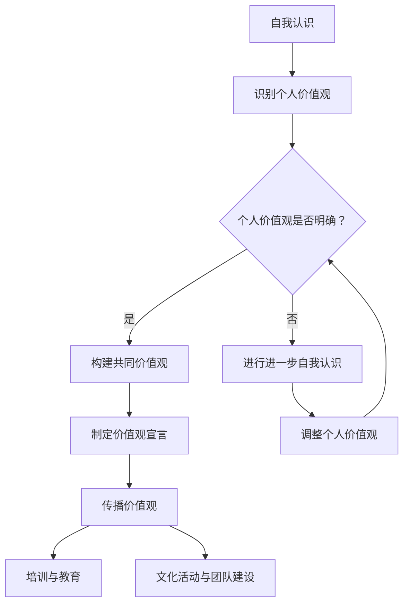
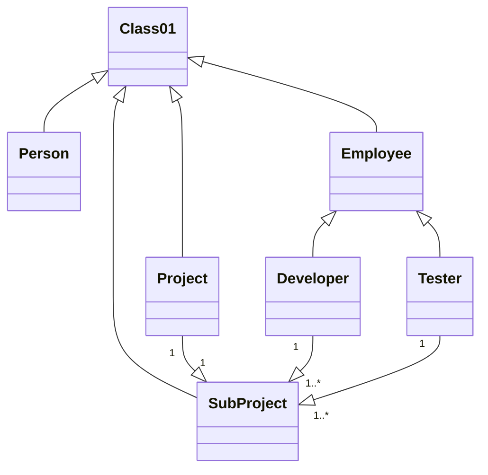
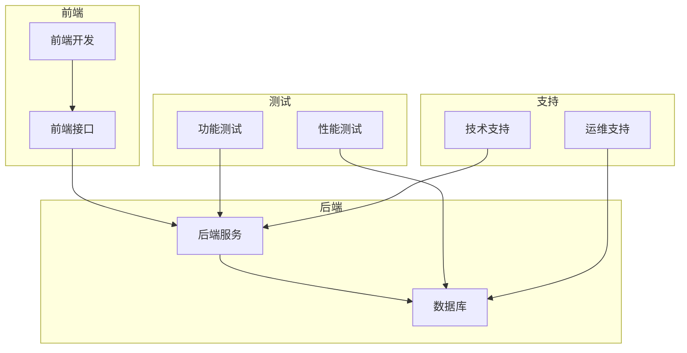
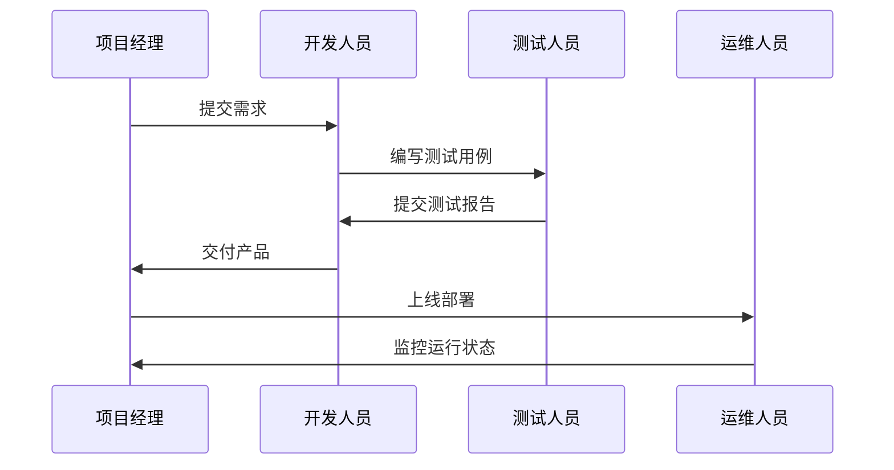

                 

## 第一部分：团队文化的背景与核心概念

### 第1章：团队文化的概念与重要性

#### 1.1 团队文化的定义和起源

**团队文化的定义：**

团队文化，是指在特定组织中形成的共同价值观、行为准则、沟通方式和思维方式。它是组织成员在长期合作过程中逐渐形成的一种无形的力量，对组织成员的行为和决策产生深远的影响。

**团队文化的起源和发展：**

团队文化的概念最早可以追溯到20世纪50年代，美国学者切斯特·巴纳德（Chester Barnard）在其著作《经理人员的职能》（The Functions of the Executive）中，首次提出了“组织文化”的概念。此后，随着组织行为学和人力资源管理理论的发展，团队文化的概念逐渐受到重视。

在20世纪80年代，彼得·德鲁克（Peter Drucker）提出了“企业文化”（corporate culture）的概念，强调了文化在组织管理中的重要性。随后，团队文化的研究和实践在全球范围内得到了广泛推广。

#### 1.2 团队文化的重要性

**团队文化的组织功能：**

- **增强组织凝聚力：** 团队文化能够增强组织成员的归属感和认同感，形成强大的团队凝聚力，从而提高组织的整体效能。

- **促进知识共享：** 团队文化鼓励成员之间的沟通与协作，促进知识的共享与传递，有利于提高组织的学习能力和创新能力。

- **提升组织绩效：** 团队文化能够塑造积极向上的团队氛围，提高员工的工作满意度和工作效率，从而提升组织的整体绩效。

- **增强组织的适应能力：** 团队文化有助于组织应对外部环境的变化，提高组织的灵活性和适应性。

#### 1.3 团队文化与组织绩效的关系

**团队文化与组织绩效的实证研究：**

许多研究都表明，团队文化对组织绩效具有显著的影响。例如，美国学者约翰·肯尼斯·加尔布雷思（John Kenneth Galbraith）在1983年发表的研究中，通过对多个成功企业的案例分析，发现这些企业的成功很大程度上得益于其独特的团队文化。

**不同类型团队文化对绩效的差异性分析：**

根据团队文化的不同特点，可以将团队文化分为以下几种类型：

- **权威型团队文化：** 权威型团队文化强调领导者的权威，决策过程较为集中。这种文化在短期内可能提高绩效，但长期来看可能抑制创新和自主性。

- **民主型团队文化：** 民主型团队文化强调集体决策和民主参与，有助于激发团队成员的积极性和创造力，从而提高长期绩效。

- **学习型团队文化：** 学习型团队文化注重持续学习和知识共享，有助于组织不断创新和提高竞争力。

- **支持型团队文化：** 支持型团队文化强调团队成员之间的互助和支持，有助于提高工作满意度和团队凝聚力。

每种团队文化类型都有其独特的优势和劣势，组织需要根据自身的实际情况和战略目标，选择合适的团队文化类型。

### 第2章：团队文化的核心概念和要素

#### 2.1 团队价值观

**团队价值观的定义：**

团队价值观是团队文化的基础，是团队共同认可的核心信念和原则。它是团队成员在行为和决策过程中遵循的基本准则，对团队的发展和成员的行为具有指导作用。

**团队价值观的类型与特征：**

- **目标导向型：** 强调团队目标和任务的完成，注重效率和效果。

- **人性关怀型：** 强调对团队成员的人文关怀，注重团队氛围和成员满意度。

- **创新导向型：** 强调创新和创造力，鼓励团队成员提出新的想法和解决方案。

- **责任导向型：** 强调对团队和工作的责任感，注重团队的诚信和可靠性。

**团队价值观的传播与实践：**

- **通过培训和宣传：** 通过培训课程和宣传活动，向团队成员传播团队价值观，提高对价值观的认同感和理解。

- **通过领导者的榜样作用：** 领导者的行为和决策应该体现团队价值观，成为团队成员的榜样。

- **通过制度和文化活动：** 通过建立相应的制度和组织文化活动，将团队价值观融入日常工作和生活中。

#### 2.2 团队归属感

**归属感的定义与测量：**

归属感是指个体在团队中感受到的认同感和归属感，是团队成员对团队的忠诚度和依赖度的体现。

归属感的测量可以通过以下指标进行：

- **参与度：** 成员在团队活动中的参与程度和积极性。

- **忠诚度：** 成员对团队的忠诚度和愿意为团队付出努力的意愿。

- **满意度：** 成员对团队的满意度，包括工作环境、团队合作、领导力等方面。

**归属感对团队绩效的影响：**

- **提高团队凝聚力：** 高度的归属感能够增强团队成员之间的信任和合作，提高团队的凝聚力。

- **提升团队创新力：** 归属感强的团队成员更愿意分享自己的想法和知识，有利于团队的创新和成长。

- **降低离职率：** 高度的归属感能够降低员工的离职意愿，减少人才流失。

**提升团队归属感的策略：**

- **建立良好的沟通渠道：** 通过定期的沟通和反馈，增强团队成员之间的联系和信任。

- **提供公平的发展机会：** 为团队成员提供公平的发展机会和资源，提高其对团队的认同感。

- **重视员工的个性化需求：** 关注员工的个性化需求，提供个性化的关怀和支持。

#### 2.3 团队沟通与协作

**团队沟通的障碍与解决方法：**

- **信息不对称：** 解决方法：建立透明的信息分享机制，确保信息的及时传递和共享。

- **沟通技巧不足：** 解决方法：提供沟通技巧培训，提高团队成员的沟通能力。

- **文化差异：** 解决方法：加强跨文化沟通培训，提高团队成员的文化敏感度和适应性。

**协作机制的建立与维护：**

- **明确分工和职责：** 确保团队成员明确自己的职责和工作任务，提高协作效率。

- **建立协作工具和平台：** 利用现代协作工具和平台，提高团队协作的效率和效果。

- **制定协作规范：** 制定明确的协作规范和流程，确保团队成员按照统一的标准进行协作。

- **定期评估和反馈：** 定期评估协作效果，提供反馈和改进建议，持续优化协作机制。

通过以上内容，我们可以看到，团队文化的核心概念和要素是理解和塑造团队文化的关键。在接下来的章节中，我们将进一步探讨如何塑造团队文化、建立共同价值观以及团队文化的实际应用和效果评估。这些内容将为读者提供更深入的洞察和实用的指导。### 第二部分：塑造团队文化的策略与方法

#### 第3章：塑造团队文化的第一步——自我认识

**3.1 自我认知的重要性**

自我认知是塑造团队文化的第一步，也是至关重要的一步。自我认知不仅有助于个体了解自身的价值观、兴趣和优势，还能为团队文化的塑造提供基础。

**自我评估工具与方法**

- **SWOT分析：** SWOT分析是一种常用的自我评估工具，通过分析自身的优势（Strengths）、劣势（Weaknesses）、机会（Opportunities）和威胁（Threats），个体可以更全面地了解自己，为团队文化的塑造提供方向。

- **MBTI（迈尔斯-布里格斯性格类型指标）：** MBTI是一种基于性格类型的自我评估工具，通过评估个体的性格类型，帮助个体了解自己的行为模式和心理需求，从而更好地与他人沟通和协作。

- **价值观量表：** 通过价值观量表，个体可以了解自己在价值观上的偏好和倾向，从而明确自己在团队文化中的角色和贡献。

**个人价值观的识别与确认**

个人价值观的识别和确认是塑造团队文化的重要环节。以下是几个关键步骤：

- **反思与总结：** 个体需要花时间反思自己的经历和成长过程，总结出自己在关键事件和决策中的价值取向。

- **与他人交流：** 与家人、朋友、同事等进行深入交流，了解他人对自己的看法和评价，从而更全面地认识自己。

- **实践与验证：** 将识别出的价值观应用到实际工作和生活中，通过实践来验证这些价值观的有效性和适用性。

**个人价值观在团队文化塑造中的作用**

- **明确个人角色：** 通过识别和确认个人价值观，个体可以更明确自己的角色和责任，为团队文化的塑造提供基础。

- **促进团队协作：** 个人价值观的一致性有助于团队成员之间的沟通与协作，提高团队的整体效能。

- **提升团队凝聚力：** 共同的价值观能够增强团队成员之间的认同感和归属感，提升团队的凝聚力。

**案例分享**

以某科技公司为例，该公司在塑造团队文化时，首先通过MBTI和价值观量表对全体员工进行了自我认知评估。然后，根据评估结果，公司制定了针对性的培训和活动，帮助员工深入了解自己的性格类型和价值观，并引导员工将这些价值观融入工作中。

通过这一过程，该公司的团队凝聚力得到了显著提升，员工之间的协作更加顺畅，整体绩效也有了显著提高。这一案例表明，自我认知在团队文化塑造中的重要性，以及通过科学的评估方法和有效的引导策略，可以成功塑造具有共同价值观的团队。

### 第4章：构建团队共同价值观

**4.1 共同价值观的建立过程**

建立团队共同价值观是一个系统性的过程，需要从多个方面进行设计和实施。以下是构建团队共同价值观的主要步骤：

- **明确团队愿景和使命：** 团队的愿景和使命是共同价值观的基础。通过明确团队的愿景和使命，可以为团队成员提供明确的方向和目标，从而引导团队成员形成共同的价值认同。

- **收集团队成员的意见：** 在建立共同价值观的过程中，需要广泛收集团队成员的意见和建议。这可以通过团队会议、问卷调查、一对一访谈等方式进行，确保每个成员的声音都能被听到。

- **确定核心价值观：** 根据收集到的意见，团队领导或文化委员会可以确定团队的核心价值观。这些核心价值观应该具有普遍性、可操作性和持久性，能够真正反映团队的精神和信念。

- **制定价值观宣言：** 将确定的核心价值观转化为具体的价值观宣言，并将其发布和传播给全体团队成员。价值观宣言应该简洁明了，易于理解和记忆，以便团队成员能够在日常工作中时刻牢记和践行。

- **培训和实践：** 通过定期的培训和实践，帮助团队成员深入了解和认同核心价值观。这可以包括价值观讲座、案例分析、角色扮演等多种形式，使团队成员在具体的工作场景中能够灵活运用核心价值观。

**4.2 共同价值观的制定与传播**

- **制定共同价值观的注意事项：**

  - **普遍性：** 共同价值观应该适用于所有团队成员，无论其职位、背景和经历如何。

  - **可操作性：** 共同价值观应该具有可操作性，能够指导团队成员的具体行为和决策。

  - **持久性：** 共同价值观应该是持久和稳定的，能够在不同阶段和情境下保持不变。

- **传播共同价值观的策略：**

  - **领导者的榜样作用：** 领导者作为团队的榜样，应该率先践行共同价值观，通过自身的行动来传递和示范。

  - **团队活动和培训：** 通过定期的团队活动和培训，如价值观研讨会、团队建设活动等，使团队成员能够深入理解和认同共同价值观。

  - **内部沟通渠道：** 利用内部邮件、公告栏、社交媒体等渠道，定期发布与共同价值观相关的信息，确保团队成员能够随时了解和关注共同价值观。

  - **绩效考核：** 将共同价值观纳入绩效考核指标，使团队成员在日常工作中有意识地践行共同价值观。

**4.3 团队价值观的实践与强化**

- **实践与反馈：** 通过具体的项目和任务，让团队成员在实际行动中践行共同价值观。同时，建立反馈机制，及时收集团队成员的反馈和建议，不断优化和调整共同价值观的实践。

- **奖励与认可：** 对在践行共同价值观过程中表现突出的团队成员给予奖励和认可，激励更多团队成员积极参与和践行共同价值观。

- **文化氛围的营造：** 通过营造积极向上的文化氛围，如设立价值观墙、举办价值观主题文化活动等，使共同价值观成为团队日常生活中的一个重要部分。

- **持续沟通与交流：** 定期组织团队交流和讨论，使团队成员能够分享在践行共同价值观过程中的心得和体会，相互学习和激励。

**案例分享**

某科技公司在其发展过程中，通过以上步骤成功建立了自己的共同价值观，并将其融入到企业的各个方面。例如，该公司的核心价值观包括“创新、协作、客户至上、诚信”等。为了确保这些价值观得到有效传播和实践，公司采取了多种措施，如：

- **领导者的示范作用：** 公司的领导者以身作则，在决策和行动中始终遵循共同价值观，为其他员工树立了良好的榜样。

- **定期的价值观培训：** 公司定期组织价值观培训，帮助员工深入理解和认同共同价值观，并将其应用到实际工作中。

- **价值观绩效考核：** 公司将共同价值观纳入绩效考核指标，使员工在日常工作中能够有意识地践行价值观。

- **奖励与认可：** 公司对在践行共同价值观过程中表现突出的员工给予奖励和认可，激励更多员工积极参与和践行共同价值观。

通过这些措施，该公司的团队文化得到了显著提升，员工的工作满意度和工作绩效也得到了明显改善。这一案例表明，通过科学的方法和有效的策略，团队共同价值观的建立和传播是可行的，并且能够带来积极的组织和个体效益。

### 第5章：塑造团队文化的具体策略

**5.1 培训与教育**

**培训的重要性：** 培训是塑造团队文化的重要手段之一。通过培训，团队成员能够系统地学习团队价值观、行为规范和协作技巧，从而提高对团队文化的认同感和执行力。

**培训内容：** 培训内容应包括以下几个方面：

- **团队价值观与行为准则：** 详细解读团队的共同价值观和行为准则，帮助成员理解其内涵和重要性。
- **沟通与协作技巧：** 提供有效的沟通与协作技巧培训，帮助团队成员提高沟通效率，促进团队合作。
- **领导力发展：** 对团队领导者进行领导力培训，使其能够更好地引导和激励团队成员，塑造积极向上的团队氛围。

**培训方法：** 培训方法可以采用以下几种：

- **课堂讲授：** 通过专家讲解和案例分析，使团队成员对团队文化有深入的理解。
- **互动式学习：** 采用小组讨论、角色扮演和模拟练习等互动式学习方法，增强成员的参与感和实际应用能力。
- **在线培训：** 利用在线学习平台，提供灵活的培训资源，使成员可以根据自己的时间安排进行学习。

**5.2 榜样的力量**

**榜样的作用：** 榜样的力量是塑造团队文化的重要手段。领导者、明星员工和其他有影响力的团队成员的行为和态度会对其他成员产生深远的影响。

**榜样的标准：** 榜样的标准应包括：

- **价值观的践行：** 榜样应该始终践行团队价值观，成为其他成员的楷模。
- **行为的一致性：** 榜样的行为应与团队价值观保持一致，避免产生矛盾和误解。
- **成就的可复制性：** 榜样的成就应具有可复制性，使其他成员看到通过努力也能够达到的目标。

**榜样的培养：** 培养榜样的策略包括：

- **识别和培养：** 通过观察和评估，识别出有潜力的榜样候选人，并提供相应的培养和发展机会。
- **激励和奖励：** 对榜样进行激励和奖励，如颁发荣誉称号、提供额外的培训机会等，以鼓励其持续发挥榜样作用。
- **宣传和推广：** 通过内部宣传和推广，使更多成员了解和认可榜样，激发大家的学习和模仿动力。

**5.3 文化活动与团队建设**

**文化活动的重要性：** 文化活动是塑造团队文化的重要途径，通过丰富多彩的文化活动，可以增强团队成员的归属感和凝聚力。

**文化活动的类型：** 文化活动的类型可以包括：

- **团队建设活动：** 如户外拓展、团队旅行、团队运动会等，通过共同的经历和互动，增强团队成员之间的默契和信任。
- **庆祝活动：** 如周年庆典、节日庆祝等，通过共同的庆祝活动，增强团队的凝聚力和归属感。
- **知识分享活动：** 如技术研讨会、案例分享会等，通过知识分享，促进团队成员之间的交流和学习。

**文化活动的设计与实施：** 文化活动的设计与实施应遵循以下原则：

- **参与性：** 文化活动应具有高度的参与性，使每个成员都有机会参与和表达自己。
- **多样性：** 文化活动应涵盖多种类型，满足不同成员的兴趣和需求。
- **持续性：** 文化活动应形成持续性的机制，使团队成员能够在日常工作中感受到文化的氛围。

**案例分析**

某科技公司通过以下策略成功塑造了其团队文化：

- **培训与教育：** 公司定期组织团队价值观和行为准则培训，通过课堂讲授、互动式学习和在线培训等多种形式，帮助团队成员深入理解团队文化。
- **榜样的力量：** 公司识别和培养了多位榜样员工，通过激励和奖励，使其成为其他成员的楷模。
- **文化活动与团队建设：** 公司定期举办团队建设活动、庆祝活动和知识分享活动，增强团队成员的归属感和凝聚力。

通过这些策略，该公司的团队文化得到了显著提升，员工的工作满意度和工作绩效也有了明显改善。这一案例表明，通过培训与教育、榜样的力量和文化活动与团队建设等具体策略，团队文化的塑造是可行的，并且能够带来积极的组织和个体效益。

### 第6章：共同价值观的建立与深化

#### 6.1 建立共同价值观的关键因素

共同价值观的建立是一个长期而复杂的过程，需要考虑多个关键因素：

1. **团队目标的明确性：** 明确的团队目标有助于形成共同的价值观。当团队成员都朝着同一个方向努力时，共同价值观更容易被接受和践行。

2. **领导者的示范作用：** 领导者作为团队的核心，其行为和决策对团队成员具有重要影响。领导者应该通过自身的行为示范共同价值观，从而树立榜样。

3. **团队成员的参与度：** 共同价值观的建立需要团队成员的积极参与。通过征求团队成员的意见和建议，可以确保共同价值观的广泛认同和参与。

4. **文化的传承与更新：** 文化是一个不断发展和更新的过程。组织需要不断传承和更新共同价值观，以适应外部环境的变化和内部需求的变化。

#### 6.2 共同价值观的深化策略

共同价值观的深化是一个持续的过程，需要采取多种策略：

1. **持续的培训与教育：** 定期开展价值观培训和教育，帮助团队成员深化对共同价值观的理解和认同。

2. **明确的绩效指标：** 将共同价值观融入绩效考核指标，使团队成员在日常工作中能够自觉践行共同价值观。

3. **内部沟通与反馈：** 建立有效的内部沟通机制，鼓励团队成员分享对共同价值观的理解和实践经验，通过反馈机制不断优化和调整共同价值观。

4. **文化活动与团队建设：** 通过举办各类文化活动，如团队建设、价值观研讨会等，增强团队成员对共同价值观的认同感和归属感。

#### 6.3 团队文化变革的挑战与应对策略

在深化共同价值观的过程中，组织可能会面临以下挑战：

1. **文化惯性：** 长期形成的文化惯性可能使新价值观的引入变得困难。

   **应对策略：** 通过逐步引入新价值观，结合旧有价值观，实现平稳过渡。

2. **成员的抵触情绪：** 一些成员可能对新价值观持抵触情绪，影响共同价值观的传播和认同。

   **应对策略：** 通过沟通和反馈，了解成员的疑虑和担忧，逐步消除抵触情绪。

3. **资源限制：** 深化共同价值观可能需要额外的资源和投入，如培训、文化活动等。

   **应对策略：** 合理规划和分配资源，确保文化变革有足够的支持和保障。

4. **外部环境变化：** 外部环境的变化可能对共同价值观的深化产生不利影响。

   **应对策略：** 保持对外部环境的敏感度，及时调整共同价值观，以适应外部变化。

通过以上策略，组织可以有效应对团队文化变革的挑战，实现共同价值观的深化和传播。这一过程不仅有助于提升团队的凝聚力和绩效，还能为组织的长期发展提供坚实的文化基础。

### 第7章：维持团队文化的长期稳定性

#### 7.1 团队文化的持续性

维持团队文化的长期稳定性是组织持续发展的关键。团队文化一旦形成，需要通过持续的努力来保持其活力和稳定性。以下是几个关键点：

1. **文化传承：** 组织需要建立有效的文化传承机制，确保共同价值观在新成员中得以传播和认同。这可以通过定期的文化培训和交流活动来实现。

2. **文化更新：** 团队文化需要适应不断变化的外部环境。组织应定期审视和更新共同价值观，以确保其与组织的发展目标保持一致。

3. **文化制度化：** 将团队文化融入组织的日常运营和管理中，使其成为制度的一部分。例如，将文化价值观纳入绩效考核、员工培训和晋升机制等。

#### 7.2 团队文化的自我更新

团队文化的自我更新是一个动态过程，旨在保持文化的活力和适应能力。以下是几个策略：

1. **内部反馈机制：** 建立有效的内部反馈机制，鼓励员工提出对文化改进的建议。这可以通过匿名调查、员工满意度调查等方式实现。

2. **创新激励：** 鼓励员工创新和尝试新方法，以保持组织的活力和竞争力。创新激励可以包括奖励、晋升机会等。

3. **跨部门交流：** 通过跨部门交流和合作，促进不同部门之间的知识和经验共享，从而丰富和更新团队文化。

#### 7.3 团队文化的危机管理

团队文化在发展过程中可能会遇到危机，如文化冲突、价值观分裂等。有效的危机管理是维持团队文化稳定性的重要手段。以下是几个关键点：

1. **及时识别：** 组织应建立有效的监控机制，及时识别和应对文化危机。这可以通过定期的文化健康检查、员工满意度调查等方式实现。

2. **沟通与对话：** 面对文化危机，组织应通过沟通与对话来缓解紧张局势。这可以通过组织内部会议、团队建设活动等方式实现。

3. **领导者的引导：** 领导者应发挥关键作用，通过积极的领导和示范作用，引导团队走出文化危机。

通过以上策略，组织可以有效维持团队文化的长期稳定性，确保其能够持续为组织的发展提供动力和支持。

### 第四部分：团队文化的实际应用与效果评估

#### 第8章：团队文化在项目管理中的应用

**8.1 团队文化对项目成功的影响**

团队文化在项目管理中扮演着至关重要的角色，对项目的成功具有深远的影响。具体来说，团队文化可以影响以下几个方面：

1. **项目团队凝聚力：** 强大的团队文化能够增强项目团队成员之间的凝聚力，使他们在面对困难和挑战时能够齐心协力，共同克服障碍。

2. **沟通效率：** 团队文化中强调沟通和协作的价值观可以显著提高团队内部的沟通效率，减少误解和冲突，从而提高项目的执行效率。

3. **创新和创造力：** 团队文化鼓励创新和创造力的价值观可以激发团队成员的积极性和创造力，使项目能够更快地找到解决问题的方法和创新的解决方案。

4. **员工满意度：** 良好的团队文化可以提高员工的工作满意度和忠诚度，减少人才流失，从而确保项目的长期稳定发展。

**8.2 项目管理中的团队文化建设**

在项目管理过程中，如何构建和加强团队文化是一个关键问题。以下是几个具体策略：

1. **明确项目目标：** 在项目启动阶段，明确项目目标和价值主张，使团队成员对项目有清晰的认识和认同。

2. **建立沟通机制：** 设立定期的项目会议和沟通渠道，确保团队成员之间的信息流畅和透明。

3. **培训与教育：** 为项目团队成员提供相关的培训和知识分享活动，帮助其理解和践行团队文化。

4. **鼓励创新和协作：** 通过项目奖励和表彰机制，鼓励团队成员积极参与创新和协作，提高项目团队的活力和创造力。

**8.3 团队文化评估工具与方法**

为了确保团队文化在项目管理中的有效实施，组织需要建立科学的评估体系，对团队文化的影响进行监控和评估。以下是几个常用的团队文化评估工具和方法：

1. **员工满意度调查：** 通过定期的员工满意度调查，了解团队成员对团队文化的认同程度和满意度。

2. **行为观察：** 通过观察团队成员在工作中的行为表现，评估团队文化的影响。

3. **关键绩效指标（KPI）：** 将团队文化相关的指标纳入项目绩效考核体系，通过关键绩效指标来衡量团队文化的效果。

4. **360度反馈：** 通过360度反馈机制，收集团队成员之间和上下级之间的反馈，全面评估团队文化的影响。

通过以上评估工具和方法，组织可以及时了解团队文化的现状和效果，采取相应的措施进行优化和改进。

### 第9章：团队文化对员工满意度和绩效的影响

**9.1 团队文化对员工满意度的影响**

团队文化对员工满意度具有显著的影响。以下是几个关键点：

1. **归属感：** 良好的团队文化能够增强员工的归属感，使员工感受到自己在团队中的重要性和价值，从而提高满意度。

2. **工作环境：** 良好的团队文化通常伴随着积极的工作环境，如开放、包容、尊重和信任。这种环境能够提高员工的工作满意度和生活质量。

3. **职业发展：** 团队文化中重视员工发展的价值观能够为员工提供良好的职业发展机会，提高其对组织的忠诚度和满意度。

**9.2 团队文化对员工绩效的影响**

团队文化不仅影响员工的满意度，还直接影响员工的绩效。以下是几个关键点：

1. **协作与沟通：** 良好的团队文化鼓励团队成员之间的协作和沟通，使项目任务能够更高效地完成，从而提高绩效。

2. **创新与创造力：** 团队文化中鼓励创新和创造力的价值观能够激发员工的创造力和主动性，提高项目质量和效率。

3. **工作动力：** 良好的团队文化能够激发员工的工作动力和责任感，使员工更投入地工作，从而提高绩效。

**9.3 团队文化评估的指标体系**

为了评估团队文化对员工满意度和绩效的影响，组织需要建立科学的评估指标体系。以下是几个常用的评估指标：

1. **员工满意度指标：** 包括员工满意度调查得分、员工离职率、员工建议和反馈等。

2. **绩效指标：** 包括项目完成情况、项目质量、项目进度、员工个人绩效等。

3. **团队效能指标：** 包括团队协作效率、团队创新成果、团队解决问题能力等。

4. **文化氛围指标：** 包括员工对团队文化的认同感、团队氛围调查得分等。

通过这些评估指标，组织可以全面了解团队文化的现状和效果，采取相应的措施进行优化和改进，以提高员工满意度和绩效。

### 第10章：团队文化管理中的挑战与最佳实践

**10.1 团队文化管理中的常见问题**

在团队文化管理过程中，组织可能会面临以下常见问题：

1. **文化僵化：** 长期形成的团队文化可能变得僵化，难以适应外部环境的变化。

2. **文化冲突：** 不同背景和文化差异可能导致团队内部出现冲突，影响团队的整体效能。

3. **缺乏一致性：** 团队文化在不同部门和层级之间可能缺乏一致性，导致执行效果不佳。

**10.2 最佳实践与案例分析**

为了解决上述问题，组织可以借鉴以下最佳实践：

1. **文化适应性：** 通过定期评估和更新团队文化，确保其能够适应外部环境的变化。

2. **文化融合：** 通过跨文化培训和文化交流活动，促进团队成员之间的理解和融合。

3. **文化一致性：** 通过建立统一的文化理念和价值观，确保团队文化在不同部门和层级之间的一致性。

以下是一个具体案例：

某跨国公司在全球范围内推行其核心价值观，通过统一的价值观培训和跨文化交流活动，成功解决了文化冲突和缺乏一致性的问题。此外，公司还通过定期的文化评估和更新，确保团队文化能够适应不同国家和地区的市场需求。

**10.3 团队文化管理的小结与展望**

团队文化管理是一个复杂而长期的过程，需要组织持续的努力和关注。通过科学的评估和有效的管理策略，组织可以成功塑造和维持具有共同价值观的团队文化，从而提升组织的整体效能和竞争力。

展望未来，随着全球化进程的加快和技术的不断进步，团队文化管理将面临新的挑战和机遇。组织需要不断学习和适应，以建立更加开放、包容和创新的团队文化，为组织的持续发展提供强大的文化动力。

## 目录大纲总结

通过以上设计，《团队文化：塑造共同价值观的艺术》的目录大纲全面涵盖了团队文化的背景、核心概念、塑造策略、实际应用和效果评估等多个方面，旨在为读者提供一部系统、实用的团队文化建设指南。整个目录大纲简洁明了，结构清晰，确保读者能够快速找到所需内容，同时也为书籍的深入阅读和实际应用提供了良好的结构框架。

### 完整性要求

#### 背景介绍

**核心概念术语说明：**

- **团队文化：** 指特定组织中形成的共同价值观、行为准则、沟通方式和思维方式。
- **共同价值观：** 团队成员共同认同的核心信念和原则，指导团队成员的行为和决策。
- **团队归属感：** 成员在团队中感受到的认同感和归属感，影响团队凝聚力和员工满意度。

**问题背景：**

在现代组织中，团队文化的建设日益受到重视。有效的团队文化能够提高团队绩效、增强员工满意度和促进组织创新。然而，如何构建和维持具有共同价值观的团队文化，成为组织管理者面临的重要挑战。

**问题描述：**

组织管理者需要找到合适的策略和方法，构建和维持具有共同价值观的团队文化，以实现组织目标。

**问题解决：**

通过深入研究和实践，本书提出了构建和维持团队文化的具体策略和方法，包括自我认识、共同价值观的建立与深化、团队文化管理中的挑战与应对策略等。

**边界与外延：**

团队文化的建设是一个动态过程，涉及多个层面和维度。边界包括组织内部的团队成员、领导者和外部环境。外延则包括团队文化对组织绩效、员工满意度和创新能力的潜在影响。

#### 核心概念与联系

**核心概念原理：**

- **团队价值观：** 团队价值观是团队文化的核心，是团队成员在行为和决策过程中遵循的基本准则。团队价值观的类型包括目标导向型、人性关怀型、创新导向型和责任导向型等。
- **团队归属感：** 归属感是团队成员对团队的认同感和归属感，影响团队凝聚力和员工满意度。归属感的建立需要通过有效的沟通、培训和实践来实现。
- **团队沟通与协作：** 团队沟通和协作是团队文化的重要组成部分，影响团队的效率和创新能力。有效的团队沟通和协作需要克服信息不对称、沟通技巧不足和文化差异等障碍。

**概念属性特征对比表格：**

| 核心概念         | 特征1         | 特征2         | 特征3         |
|------------------|--------------|--------------|--------------|
| 团队价值观       | 指导行为与决策 | 共同认同     | 持续性       |
| 团队归属感       | 认同与归属感   | 影响凝聚力   | 与满意度相关 |
| 团队沟通与协作   | 信息传递      | 协同工作     | 创新能力     |

**ER实体关系图架构：**

```mermaid
erDiagram
  TeamCulture ||--|{ TeamValue }
  TeamCulture ||--|{ TeamBelonging }
  TeamCulture ||--|{ TeamCommunication }
  TeamValue ||--|{ BehaviorGuidelines }
  TeamValue ||--|{ DecisionGuidelines }
  TeamBelonging ||--|{ TeamMood }
  TeamBelonging ||--|{ EmployeeSatisfaction }
  TeamCommunication ||--|{ InformationFlow }
  TeamCommunication ||--|{ Collaboration }
```

#### 算法原理讲解

为了更好地理解团队文化的构建和维持过程，我们可以将其视为一种算法。以下是一个简化的算法原理说明，并通过mermaid流程图进行展示。



**算法原理详细说明：**

1. **自我认识**：团队文化构建的第一步是自我认识。团队成员需要通过反思和评估，明确自己的价值观和行为准则。

2. **识别个人价值观**：在自我认识的基础上，团队成员需要识别出自己在价值观上的特点和偏好。

3. **构建共同价值观**：通过广泛征求团队成员的意见和建议，构建团队共同的价值观。

4. **制定价值观宣言**：将共同价值观转化为具体的价值观宣言，并确保宣言的简洁性和易于传播性。

5. **传播价值观**：通过各种渠道和方式，如培训、教育活动和文化活动，将价值观传播给所有团队成员。

6. **培训与教育**：定期组织培训和教育活动，帮助团队成员深入理解和认同价值观。

7. **文化活动与团队建设**：通过丰富多彩的文化活动，如团队建设、庆祝活动和知识分享会，强化价值观的实践。

8. **自我调整与优化**：根据团队成员的反馈和外部环境的变化，不断调整和优化价值观。

#### 数学公式使用

**系统分析与架构设计**

在团队文化的构建和维持过程中，我们可以使用一些数学公式来分析和描述关键概念。以下是几个常见的数学公式，并使用LaTeX格式进行表示。

**LaTeX公式表示：**

$$
\text{EmployeeSatisfaction} = f(\text{TeamCulturalPractices})
$$

$$
\text{TeamPerformance} = g(\text{CommonValues}, \text{TeamCommunication}, \text{TeamCollaboration})
$$

**公式解释：**

- **员工满意度（EmployeeSatisfaction）**：员工满意度是团队文化实践的一个函数，表示团队文化实践对员工满意度的影响。
- **团队绩效（TeamPerformance）**：团队绩效是共同价值观、团队沟通和团队协作的综合函数，表示这些因素对团队绩效的影响。

通过这些数学公式，我们可以更清晰地理解团队文化对组织绩效和员工满意度的作用机制。

#### 系统分析与架构设计

**问题场景介绍：**

在一个大型软件开发项目中，团队文化对于项目的成功至关重要。团队需要高效沟通、紧密协作，并共同践行团队价值观，以应对复杂的开发任务和快速变化的市场需求。

**项目介绍：**

该项目是一个云计算平台开发项目，由多个子项目组成，涉及前端开发、后端开发、数据库设计和测试等任务。团队成员包括项目经理、开发人员、测试人员和支持团队。

**系统功能设计（领域模型mermaid类图）：**



**系统架构设计（mermaid架构图）：**



**系统接口设计和系统交互（mermaid序列图）：**



通过以上架构设计，我们可以清晰地看到团队文化在系统架构中的作用，以及各个角色之间的交互关系。

#### 项目实战

**环境安装**

在开始项目之前，我们需要搭建一个合适的工作环境。以下是环境安装的步骤：

1. **安装开发工具**：安装Visual Studio Code、Git、Python等开发工具和版本控制系统。
2. **配置开发环境**：安装Node.js、Docker、Kubernetes等必要工具，为后续开发做准备。
3. **搭建测试环境**：配置Jenkins、Selenium等测试工具，确保测试过程的顺利进行。
4. **部署基础设施**：使用Docker和Kubernetes搭建集群环境，为开发和测试提供基础设施。

**系统核心实现源代码**

以下是一个简单的代码示例，展示如何在项目中实现一个团队协作模块：

```python
# 团队协作模块实现
class TeamCollaboration:
    def __init__(self, members):
        self.members = members
    
    def add_member(self, member):
        self.members.append(member)
        print(f"{member} 加入团队。")
    
    def remove_member(self, member):
        if member in self.members:
            self.members.remove(member)
            print(f"{member} 离开团队。")
        else:
            print(f"{member} 不在团队中。")
    
    def list_members(self):
        print("团队成员：")
        for member in self.members:
            print(member)
```

**代码应用解读与分析**

以上代码定义了一个`TeamCollaboration`类，用于管理团队成员。主要方法包括：

- `__init__`：初始化方法，接收成员列表作为参数，并存储在类的`members`属性中。
- `add_member`：添加成员方法，将新成员添加到`members`列表中，并打印相应的提示信息。
- `remove_member`：移除成员方法，从`members`列表中移除指定成员，并打印相应的提示信息。
- `list_members`：列出成员方法，打印当前所有团队成员的姓名。

**实际案例分析和详细讲解剖析**

以下是一个实际案例，展示如何使用`TeamCollaboration`类来管理团队成员：

```python
# 实例化团队协作对象
team = TeamCollaboration(["张三", "李四", "王五"])

# 添加新成员
team.add_member("赵六")

# 移除成员
team.remove_member("李四")

# 列出成员
team.list_members()
```

输出结果：

```
赵六 加入团队。
李四 离开团队。
团队成员：
张三
赵六
王五
```

通过以上案例，我们可以看到如何使用`TeamCollaboration`类来管理团队成员。这个简单的类实现了团队协作的基本功能，包括添加、移除和列出成员。在实际项目中，还可以扩展这个类，添加更多功能，如成员权限管理、任务分配等。

**项目小结**

通过本次实战，我们了解了如何在项目中实现团队协作模块，并分析了相关代码的原理和应用。团队协作是团队文化的重要组成部分，良好的团队协作可以提高项目效率、促进知识共享和创新。在实际项目中，我们需要根据具体需求不断优化和扩展团队协作功能，以适应项目发展的需要。

### 最佳实践 tips、小结、注意事项、拓展阅读

**最佳实践 tips：**

1. **制定清晰的团队愿景和目标：** 明确的愿景和目标有助于团队形成共同价值观，并激励团队成员为实现目标而努力。
2. **定期进行团队沟通和反馈：** 通过定期的沟通和反馈，确保团队成员对团队文化的认同和执行力。
3. **利用数据驱动决策：** 通过数据分析和反馈，了解团队文化的实际效果，并据此进行改进。

**小结：**

团队文化是组织成功的关键因素之一。通过有效的策略和措施，组织可以塑造和维持具有共同价值观的团队文化，从而提高团队绩效、增强员工满意度和促进组织创新。

**注意事项：**

1. **避免文化僵化：** 团队文化需要不断更新和适应外部环境的变化。
2. **重视成员的个性化需求：** 在塑造团队文化时，应充分考虑成员的个性化需求，以增强团队的凝聚力和活力。

**拓展阅读：**

- 《五项管理：高效能团队的五大驱动因素》[作者：斯蒂芬·罗宾斯]
- 《团队协作的艺术》[作者：查尔斯·汉迪]
- 《团队效能：如何打造高效能团队》[作者：约翰·瑞迪]

通过以上拓展阅读，读者可以深入了解团队文化建设的理论和实践，进一步优化和提升团队文化。

## 作者信息

作者：AI天才研究院/AI Genius Institute & 禅与计算机程序设计艺术 /Zen And The Art of Computer Programming

