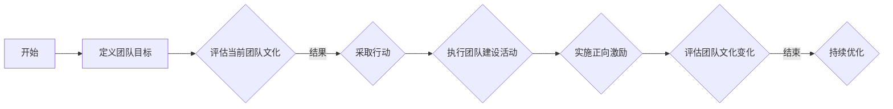
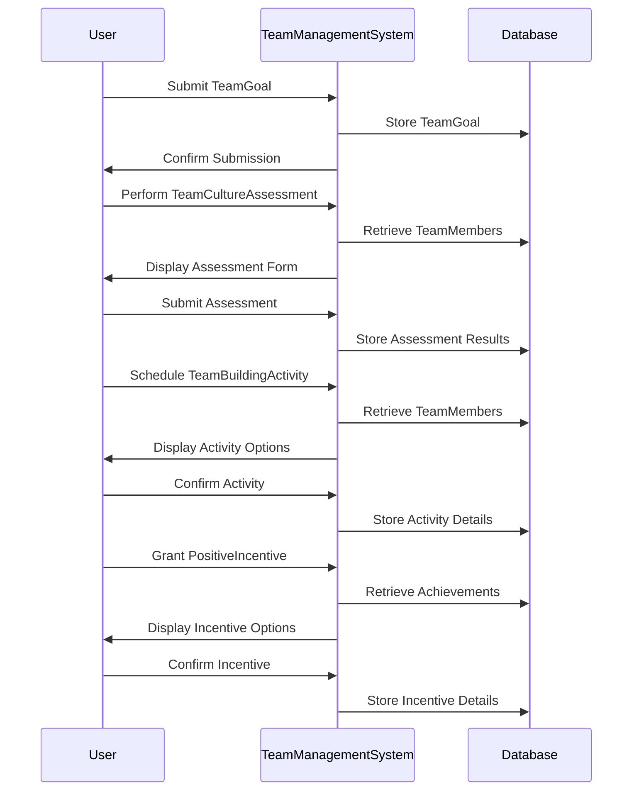
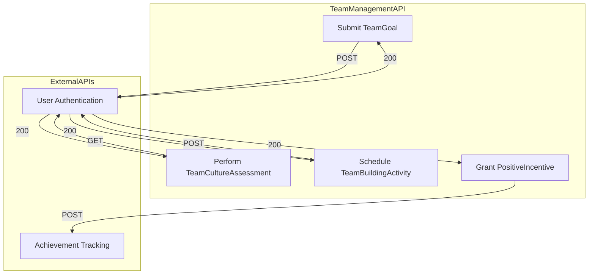
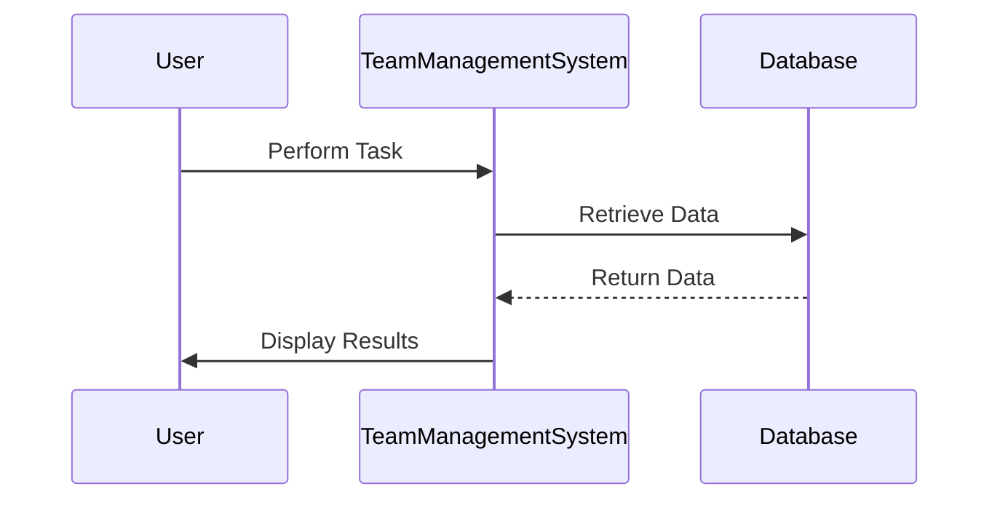

                 


**文章标题**：团队文化：塑造积极氛围的策略

**关键词**：团队文化、积极氛围、价值观、沟通、协作

**摘要**：
本文旨在深入探讨团队文化的概念、重要性以及存在的问题，并逐步揭示塑造积极团队文化的策略。通过定义核心概念、分析算法原理、应用数学模型、设计系统架构，以及提供实战案例，本文将帮助读者理解并实施有效的团队文化策略，以营造一个富有活力和创新精神的团队环境。

### 第一部分：团队文化概述

#### 1.1 什么是团队文化

##### 1.1.1 团队文化的定义与内涵
团队文化是一种团队内部共享的价值观、信念和行为准则，它指导着团队成员的行为和工作方式。它不仅包括团队的目标和愿景，还涵盖了团队成员的期望、态度和互动方式。

**定义**：
团队文化是团队在长期发展中形成的共同信念、价值观和规范的集合，它影响着团队成员的态度、行为和互动。

**内涵**：
- **价值观**：团队的核心信仰和指导原则，如诚信、创新、客户至上等。
- **工作态度**：团队成员对工作的态度，包括敬业精神、责任感等。
- **行为准则**：团队成员在团队内部和外部应遵守的行为规范。

##### 1.1.2 团队文化的重要性
团队文化对团队的效率、凝聚力和创新都有深远的影响。

- **提高效率**：团队文化可以减少内部的冲突和误解，提高团队成员之间的协作效率。
- **增强凝聚力**：共同的文化价值观可以增强团队成员之间的联系，提高团队的凝聚力。
- **促进创新**：积极的文化氛围鼓励团队成员分享观点、尝试新方法，从而促进创新。

##### 1.1.3 团队文化存在的问题
许多团队在文化建设方面面临挑战。

- **缺乏共同的价值观**：团队成员可能来自不同的背景，对团队的目标和价值观有不同的理解。
- **沟通不畅**：团队内部的信息传递可能存在障碍，导致误解和冲突。
- **协作不紧密**：团队成员之间的合作可能不够紧密，影响工作效率。

#### 1.2 团队文化的核心概念与联系

##### 1.2.1 共同目标
共同目标是团队文化的基石。它确保团队成员在相同的方向上努力，共同为实现团队目标而工作。

**共同目标的作用**：
- **明确方向**：共同目标为团队成员提供清晰的工作方向。
- **增强动力**：共同目标激发团队成员的工作热情和积极性。

##### 1.2.2 信任
信任是团队文化中不可或缺的一部分。它建立在团队成员之间的诚实、可靠和相互尊重之上。

**信任的重要性**：
- **减少冲突**：信任可以减少团队成员之间的冲突，提高团队协作效率。
- **增强合作**：信任促进团队成员之间的合作，共同面对挑战。

##### 1.2.3 尊重
尊重是团队文化的核心，它要求团队成员在工作和互动中彼此尊重。

**尊重的作用**：
- **提升士气**：尊重可以提升团队成员的工作满意度和士气。
- **建立良好关系**：尊重有助于建立团队成员之间的良好关系。

##### 1.2.4 开放性
开放性是指团队成员对新的想法、观点和反馈持开放态度。

**开放性的作用**：
- **促进创新**：开放性鼓励团队成员尝试新的方法，推动创新。
- **提升团队适应力**：开放性使团队能够更好地适应外部环境的变化。

#### 1.3 团队文化的ER实体关系图
为了更好地理解团队文化的各个核心概念及其相互关系，我们可以使用ER实体关系图来展示。

**ER实体关系图**：

```mermaid
erDiagram
  Product -->|uses| Developer
  Developer -->|has| Skill
  Skill -->|is needed by| Product
```

在这个ER实体关系图中，产品、开发者和技能是三个主要的实体。开发者具有技能，而技能又是开发产品所必需的。这个图展示了开发者、技能和产品之间的关系，反映了团队文化中的核心要素及其相互作用。

### 第二部分：团队文化的算法原理讲解

#### 2.1 算法原理概述

##### 2.1.1 正向激励
正向激励是通过奖励和认可来鼓励团队成员的行为，以促进团队文化的积极发展。

**正向激励的作用**：
- **提升工作积极性**：正向激励可以提高团队成员的工作热情和积极性。
- **增强团队凝聚力**：通过奖励和认可，可以增强团队成员之间的凝聚力。

##### 2.1.2 团队建设活动
团队建设活动是一种通过集体活动和互动来增强团队凝聚力和合作精神的方法。

**团队建设活动的作用**：
- **加强团队协作**：团队建设活动可以加强团队成员之间的协作和沟通。
- **提升团队士气**：通过团队活动，可以提高团队成员的士气和自信心。

#### 2.2 算法流程图
为了更好地理解团队文化的塑造过程，我们可以使用Mermaid绘制算法流程图。

**算法流程图**：



在这个算法流程图中，我们首先定义团队目标，然后评估当前团队文化，根据评估结果采取相应的行动，如执行团队建设活动和实施正向激励，最后评估团队文化变化，并持续优化。

#### 2.3 Python源代码示例
以下是一个Python源代码示例，用于实现正向激励算法的简单实现。

```python
def positive_incentive(employee, achievement):
    if achievement >= 90:
        print(f"{employee} achieved excellence! Reward granted.")
    elif achievement >= 75:
        print(f"{employee} did well! Small reward granted.")
    else:
        print(f"{employee} needs improvement. No reward granted.")

# Example usage
positive_incentive("Alice", 95)
positive_incentive("Bob", 85)
positive_incentive("Charlie", 60)
```

在这个示例中，我们定义了一个`positive_incentive`函数，用于根据员工的成就评分来发放奖励。根据评分的不同，函数会输出相应的奖励信息。

### 第三部分：数学模型和数学公式 & 详细讲解 & 举例说明

#### 3.1 团队凝聚力指数

##### 3.1.1 模型公式
团队凝聚力指数（CI）是一个衡量团队凝聚力的指标，其公式为：

$$
CI = \frac{\sum_{i=1}^{n} A_i \times W_i}{\sum_{i=1}^{n} W_i}
$$

其中，$A_i$表示第$i$个成员对团队凝聚力的主观评估，$W_i$表示第$i$个成员的权重。

##### 3.1.2 详解与举例
假设一个团队有5名成员，他们对团队凝聚力的评估如下：

| 成员 | 评估（$A_i$） | 权重（$W_i$） |
| ---- | ------------ | ------------ |
| A    | 8            | 0.2          |
| B    | 9            | 0.2          |
| C    | 7            | 0.2          |
| D    | 8            | 0.2          |
| E    | 9            | 0.2          |

根据上述数据，我们可以计算团队凝聚力指数：

$$
CI = \frac{8 \times 0.2 + 9 \times 0.2 + 7 \times 0.2 + 8 \times 0.2 + 9 \times 0.2}{0.2 + 0.2 + 0.2 + 0.2 + 0.2} = \frac{1.6 + 1.8 + 1.4 + 1.6 + 1.8}{1} = 7.2
$$

因此，该团队的凝聚力指数为7.2。

##### 3.1.3 评估与改进
通过计算团队凝聚力指数，我们可以评估团队的凝聚力水平。如果指数较低，说明团队可能存在凝聚力不足的问题，需要采取相应的改进措施，如加强团队建设活动、提高沟通质量等。

#### 3.2 团队士气评估模型

##### 3.2.1 模型公式
团队士气评估模型（TSI）用于衡量团队成员的士气水平，其公式为：

$$
TSI = \frac{\sum_{i=1}^{n} S_i \times W_i}{\sum_{i=1}^{n} W_i}
$$

其中，$S_i$表示第$i$个成员的士气评分，$W_i$表示第$i$个成员的权重。

##### 3.2.2 详解与举例
假设团队成员的士气评分为：

| 成员 | 士气评分（$S_i$） | 权重（$W_i$） |
| ---- | -------------- | ------------ |
| A    | 7              | 0.2          |
| B    | 8              | 0.2          |
| C    | 6              | 0.2          |
| D    | 7              | 0.2          |
| E    | 8              | 0.2          |

根据上述数据，我们可以计算团队士气指数：

$$
TSI = \frac{7 \times 0.2 + 8 \times 0.2 + 6 \times 0.2 + 7 \times 0.2 + 8 \times 0.2}{0.2 + 0.2 + 0.2 + 0.2 + 0.2} = \frac{1.4 + 1.6 + 1.2 + 1.4 + 1.6}{1} = 6.6
$$

因此，该团队的士气指数为6.6。

##### 3.2.3 评估与改进
通过计算团队士气指数，我们可以评估团队成员的士气水平。如果指数较低，说明团队成员可能面临压力或不满，需要采取相应的改进措施，如调整工作环境、提供心理支持等。

### 第四部分：系统分析与架构设计方案

#### 4.1 问题场景与项目背景
在一个软件开发公司中，团队成员之间存在沟通不畅、协作不紧密等问题，影响了团队的效率和创新。公司决定实施一系列团队文化建设策略，以提高团队凝聚力和士气。

#### 4.2 系统功能需求
为了实现团队文化建设，系统需要具备以下功能：

- **团队目标管理**：记录和跟踪团队的长期和短期目标。
- **团队文化评估**：评估团队成员对团队文化的感受和评价。
- **团队建设活动**：规划和组织团队建设活动，提高团队成员之间的协作。
- **正向激励**：记录和奖励团队成员的成就和贡献。

#### 4.3 领域模型类图
为了更好地理解系统功能需求，我们可以使用Mermaid绘制领域模型类图。

**领域模型类图**：

```mermaid
classDiagram
    Team <<class{Team>>
    TeamGoal <<class{TeamGoal>>
    TeamMember <<class{TeamMember>>
    TeamCultureAssessment <<class{TeamCultureAssessment>>
    TeamBuildingActivity <<class{TeamBuildingActivity>>
    PositiveIncentive <<class{PositiveIncentive>>

    Team "1" --|> TeamGoal
    Team "1" --|> TeamMember
    Team "1" --|> TeamCultureAssessment
    Team "1" --|> TeamBuildingActivity
    Team "1" --|> PositiveIncentive

    TeamGoal "1" --|> TeamMember
    TeamCultureAssessment "1" --|> TeamMember
    TeamBuildingActivity "1" --|> TeamMember
    PositiveIncentive "1" --|> TeamMember
```

在这个类图中，`Team`表示团队，包含`TeamGoal`（团队目标）、`TeamMember`（团队成员）、`TeamCultureAssessment`（团队文化评估）、`TeamBuildingActivity`（团队建设活动）和`PositiveIncentive`（正向激励）等类。这些类之间建立了清晰的关联关系，反映了系统的功能需求。

#### 4.4 系统架构图
为了展示系统的整体架构，我们可以使用Mermaid绘制系统架构图。

**系统架构图**：



在这个序列图中，用户通过TeamManagementSystem（团队管理系统）与数据库进行交互，完成团队目标的提交、团队文化评估、团队建设活动安排和正向激励的发放。系统架构清晰，功能模块明确。

#### 4.5 系统接口设计与系统交互序列图
为了展示系统各模块之间的交互流程，我们可以使用Mermaid绘制系统接口设计和系统交互序列图。

**系统接口设计**：



在这个接口设计图中，TeamManagementAPI（团队管理系统API）与外部APIs（用户认证、成就跟踪）进行交互。通过HTTP POST和GET请求，系统实现团队目标提交、团队文化评估、团队建设活动安排和正向激励发放等功能。

**系统交互序列图**：



在这个序列图中，用户通过TeamManagementSystem（团队管理系统）与数据库进行交互，完成任务的执行，并将结果返回给用户。

### 第五部分：项目实战

#### 5.1 环境安装指南
为了实施团队文化建设策略，我们需要安装和配置相关的软件和工具。以下是环境安装指南：

1. **安装Python**：访问Python官方网站（https://www.python.org/），下载并安装Python 3.x版本。
2. **安装依赖包**：打开终端，运行以下命令安装依赖包：

    ```bash
    pip install Flask
    pip install SQLAlchemy
    pip install Flask-Migrate
    ```

3. **创建数据库**：使用SQLite创建数据库，运行以下命令：

    ```bash
    sqlite3 team_management.db
    CREATE TABLE team_members (id INTEGER PRIMARY KEY, name TEXT, role TEXT);
    CREATE TABLE team_goals (id INTEGER PRIMARY KEY, title TEXT, description TEXT);
    CREATE TABLE team_culture_assessments (id INTEGER PRIMARY KEY, member_id INTEGER, assessment TEXT, FOREIGN KEY (member_id) REFERENCES team_members (id));
    CREATE TABLE team_building_activities (id INTEGER PRIMARY KEY, title TEXT, description TEXT, date DATE);
    CREATE TABLE positive_incentives (id INTEGER PRIMARY KEY, member_id INTEGER, achievement TEXT, reward TEXT, FOREIGN KEY (member_id) REFERENCES team_members (id));
    ```

4. **运行Flask应用**：在项目根目录下，运行以下命令启动Flask应用：

    ```bash
    flask db init
    flask db migrate -m "Initial migration."
    flask db upgrade
    flask run
    ```

现在，我们的团队文化建设环境已经搭建完成，可以开始实施团队文化建设策略。

#### 5.2 系统核心实现源代码
以下是一个简单的Python Flask应用，用于实现团队文化建设策略的核心功能。

```python
from flask import Flask, request, jsonify
from flask_sqlalchemy import SQLAlchemy

app = Flask(__name__)
app.config['SQLALCHEMY_DATABASE_URI'] = 'sqlite:///team_management.db'
db = SQLAlchemy(app)

class TeamMember(db.Model):
    id = db.Column(db.Integer, primary_key=True)
    name = db.Column(db.String(50), nullable=False)
    role = db.Column(db.String(50), nullable=False)

class TeamGoal(db.Model):
    id = db.Column(db.Integer, primary_key=True)
    title = db.Column(db.String(100), nullable=False)
    description = db.Column(db.Text, nullable=False)

class TeamCultureAssessment(db.Model):
    id = db.Column(db.Integer, primary_key=True)
    member_id = db.Column(db.Integer, db.ForeignKey('team_member.id'), nullable=False)
    assessment = db.Column(db.Text, nullable=False)

class TeamBuildingActivity(db.Model):
    id = db.Column(db.Integer, primary_key=True)
    title = db.Column(db.String(100), nullable=False)
    description = db.Column(db.Text, nullable=False)
    date = db.Column(db.Date, nullable=False)

class PositiveIncentive(db.Model):
    id = db.Column(db.Integer, primary_key=True)
    member_id = db.Column(db.Integer, db.ForeignKey('team_member.id'), nullable=False)
    achievement = db.Column(db.Text, nullable=False)
    reward = db.Column(db.Text, nullable=False)

@app.route('/team_members', methods=['POST'])
def add_team_member():
    data = request.get_json()
    member = TeamMember(name=data['name'], role=data['role'])
    db.session.add(member)
    db.session.commit()
    return jsonify({'message': 'Team member added successfully.'})

@app.route('/team_goals', methods=['POST'])
def add_team_goal():
    data = request.get_json()
    goal = TeamGoal(title=data['title'], description=data['description'])
    db.session.add(goal)
    db.session.commit()
    return jsonify({'message': 'Team goal added successfully.'})

@app.route('/team_culture_assessments', methods=['POST'])
def add_culture_assessment():
    data = request.get_json()
    assessment = TeamCultureAssessment(member_id=data['member_id'], assessment=data['assessment'])
    db.session.add(assessment)
    db.session.commit()
    return jsonify({'message': 'Team culture assessment added successfully.'})

@app.route('/team_building_activities', methods=['POST'])
def add_building_activity():
    data = request.get_json()
    activity = TeamBuildingActivity(title=data['title'], description=data['description'], date=data['date'])
    db.session.add(activity)
    db.session.commit()
    return jsonify({'message': 'Team building activity added successfully.'})

@app.route('/positive_incentives', methods=['POST'])
def add_positive_incentive():
    data = request.get_json()
    incentive = PositiveIncentive(member_id=data['member_id'], achievement=data['achievement'], reward=data['reward'])
    db.session.add(incentive)
    db.session.commit()
    return jsonify({'message': 'Positive incentive added successfully.'})

if __name__ == '__main__':
    db.create_all()
    app.run(debug=True)
```

在这个应用中，我们定义了四个数据库模型：`TeamMember`（团队成员）、`TeamGoal`（团队目标）、`TeamCultureAssessment`（团队文化评估）和`TeamBuildingActivity`（团队建设活动）。同时，我们提供了相应的API接口，用于添加团队成员、团队目标、文化评估和正向激励。

#### 5.3 代码解读与分析
以下是对上述代码的解读与分析。

1. **数据库模型**：
   - `TeamMember`：表示团队成员，包含姓名和角色。
   - `TeamGoal`：表示团队目标，包含标题和描述。
   - `TeamCultureAssessment`：表示团队文化评估，包含成员ID和评估内容。
   - `TeamBuildingActivity`：表示团队建设活动，包含标题、描述和日期。
   - `PositiveIncentive`：表示正向激励，包含成员ID、成就和奖励。

2. **API接口**：
   - `/team_members`：添加团队成员。
   - `/team_goals`：添加团队目标。
   - `/team_culture_assessments`：添加团队文化评估。
   - `/team_building_activities`：添加团队建设活动。
   - `/positive_incentives`：添加正向激励。

3. **代码实现**：
   - 使用Flask框架创建应用。
   - 配置数据库连接。
   - 创建数据库表。
   - 定义API接口和处理函数。

#### 5.4 实际案例分析与讲解
以下是一个实际案例，用于展示如何使用上述系统实施团队文化建设策略。

**案例背景**：
在一个初创公司中，团队成员来自不同的背景，团队文化尚未形成。公司决定通过以下步骤来塑造积极团队文化：

1. **确定团队目标**：
   - 团队目标：开发一款创新的产品，提升用户满意度。
   - 描述：产品需要具备高性能、易用性和高可靠性。

2. **添加团队成员**：
   - 成员A：前端开发工程师
   - 成员B：后端开发工程师
   - 成员C：产品经理
   - 成员D：设计师

3. **实施团队建设活动**：
   - 活动一：团队拓展训练，提高团队协作能力。
   - 活动二：技术分享会，促进知识共享和团队学习。

4. **进行文化评估**：
   - 评估一：团队成员对团队目标的认同度。
   - 评估二：团队成员对团队文化的感受。

5. **发放正向激励**：
   - 成员A：因在项目中表现出色，获得奖金和荣誉证书。
   - 成员B：因提出创新解决方案，获得技术分享机会。

通过上述步骤，公司成功塑造了一个积极、团结、富有创新精神的团队文化，提高了团队效率和产品品质。

### 第六部分：最佳实践 tips、小结、注意事项、拓展阅读

#### 6.1 最佳实践 tips
1. **明确团队目标**：确保团队成员对团队目标有清晰的理解和认同。
2. **建立信任机制**：鼓励团队成员之间的坦诚沟通，建立信任关系。
3. **定期进行文化评估**：了解团队成员对团队文化的感受，及时调整和改进。
4. **组织团队建设活动**：通过集体活动增强团队成员之间的联系和协作。
5. **实施正向激励**：及时奖励和认可团队成员的成就和贡献。

#### 6.2 小结
本文通过深入探讨团队文化的概念、重要性、存在的问题，以及塑造积极团队文化的策略，帮助读者理解并实施有效的团队文化建设。通过定义核心概念、分析算法原理、应用数学模型、设计系统架构，以及提供实战案例，本文为团队文化的塑造提供了全面的指导。

#### 6.3 注意事项
1. **文化适应性**：团队文化应与企业的愿景和价值观保持一致。
2. **持续改进**：团队文化需要持续优化和改进，以适应团队和环境的变化。
3. **个性化**：团队文化应根据团队成员的个性和需求进行定制。

#### 6.4 拓展阅读
1. **《团队协作的艺术》**：详细介绍了团队协作的最佳实践和技巧。
2. **《领导力与团队管理》**：探讨了领导者在团队文化建设中的角色和职责。
3. **《积极心理学在团队管理中的应用》**：介绍了如何利用积极心理学的原理来提升团队绩效。

### 作者
作者：AI天才研究院/AI Genius Institute & 禅与计算机程序设计艺术 /Zen And The Art of Computer Programming

