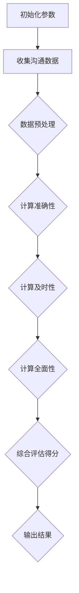
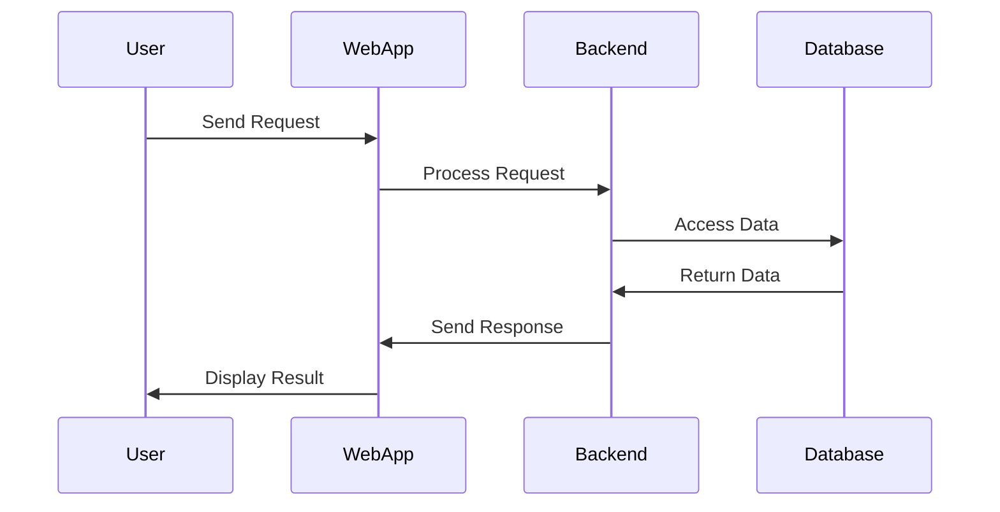
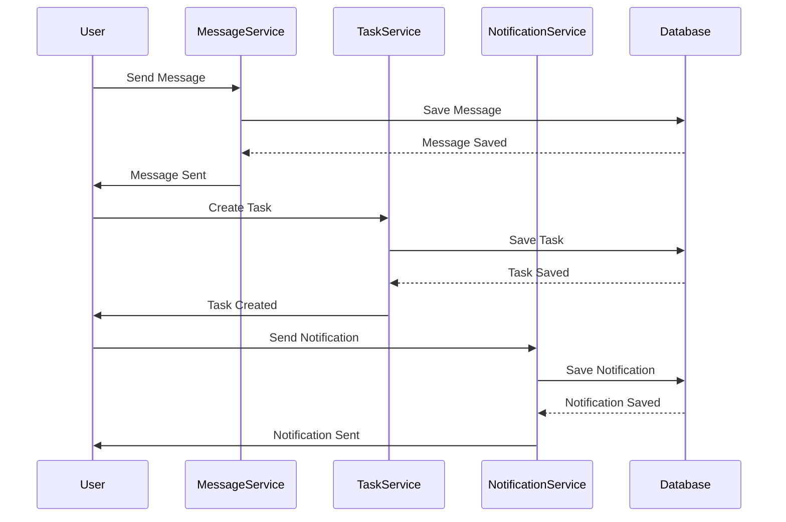

                 

### 第一部分：团队沟通优化高阶

#### 第1章：引言

##### 1.1 问题背景

在当今快速发展的信息技术时代，团队沟通在组织运作中的重要性日益凸显。然而，许多团队在实际工作中面临着沟通不畅的挑战。常见的沟通问题包括信息不对称、沟通障碍导致的误解和冲突，以及缺乏有效的沟通机制。这些问题不仅影响了团队的工作效率，还可能破坏团队协作和信任。

- **信息不对称**：团队成员之间缺乏有效的信息共享，导致某些成员对项目或任务的理解存在偏差。
- **沟通障碍**：语言、文化背景和沟通技能的差异可能导致误解和冲突。
- **缺乏有效的沟通机制**：没有建立一套完整的沟通流程和规则，导致团队成员不知道如何高效地沟通和协作。

##### 1.2 问题描述

**团队成员间的信息不对称**：在一个大型团队中，不同成员往往专注于自己的任务，而忽略了与其他团队成员的信息共享。这种情况可能导致团队成员对项目的整体理解不一致，从而影响协作效果。

**沟通障碍导致的误解和冲突**：团队成员之间由于语言、文化和沟通习惯的差异，可能会产生误解和冲突。例如，一个成员可能会认为另一个成员的发言是在批评，而实际上对方只是提供了建设性的反馈。

**缺乏有效的沟通机制**：没有明确的沟通规则和流程，团队成员往往不知道在何时、通过何种渠道进行沟通。这可能导致重要信息被遗漏，任务延误，甚至影响项目的整体进度。

##### 1.3 问题解决

**提升沟通效率的重要性**：高效的沟通是团队协作的基础。通过优化沟通方式，可以提高团队成员的工作效率，减少误解和冲突，增强团队的凝聚力和协作能力。

**团队沟通优化的目标和原则**：团队沟通优化的目标是建立一套高效、透明和可持续的沟通机制，确保信息的及时、准确和全面共享。沟通优化的原则包括：

- **透明性**：确保所有团队成员都能获取到必要的信息。
- **及时性**：确保沟通的及时性，避免信息滞后。
- **准确性**：确保信息的准确无误，减少误解。
- **全面性**：确保沟通内容覆盖所有关键点，不遗漏任何重要信息。

##### 1.4 边界与外延

**团队沟通优化的高阶内容**：除了基本的沟通技巧和渠道选择，团队沟通优化还包括高级策略，如建立沟通文化、进行沟通技能培训等。

**团队沟通优化在不同行业和组织的应用**：不同行业和组织的需求和特点不同，因此团队沟通优化的方法和策略也会有所差异。例如，在软件开发团队中，可能需要更强调代码评审和文档撰写；而在营销团队中，可能需要更注重创意交流和项目策划。

##### 1.5 概念结构与核心要素组成

**团队沟通的基本概念**：团队沟通是指团队成员之间为了共同完成任务而进行的交流和信息交换。基本概念包括沟通模型、沟通障碍、沟通渠道和沟通方式等。

**高效沟通的关键要素**：高效沟通的关键要素包括沟通的目标明确、信息的准确性、沟通的及时性、沟通的双向性和沟通的持续性。通过这些关键要素的优化，可以提升团队的整体沟通效果。

### 第2章：高效团队沟通的核心概念与原理

在探讨团队沟通优化之前，我们需要先理解高效团队沟通的核心概念与原理。这些概念和原理构成了团队沟通的基础，指导我们在实践中如何进行有效的沟通。

#### 2.1 核心概念原理

**沟通模型**：沟通模型是指信息在发送者和接收者之间传递的过程。一个基本的沟通模型包括发送者、信息、渠道、接收者和反馈。每个环节都至关重要，任何一个环节出现问题都可能影响沟通的效果。

- **发送者**：负责准备和发送信息。
- **信息**：需要传达的内容。
- **渠道**：信息传递的途径，如面对面交流、电子邮件、电话会议等。
- **接收者**：接收信息并对其进行理解和处理。
- **反馈**：接收者对信息的回应，有助于发送者了解沟通的效果。

**沟通障碍**：沟通障碍是指任何阻碍沟通效率的因素。常见的沟通障碍包括语言障碍、文化差异、心理障碍、信息过载等。

- **语言障碍**：由于语言差异导致的沟通困难。
- **文化差异**：不同文化背景下的沟通习惯和方式不同。
- **心理障碍**：个人情绪和心理状态对沟通的影响。
- **信息过载**：信息过多，导致接收者难以消化和处理。

#### 2.2 概念属性特征对比表格

为了更直观地理解团队沟通与个体沟通的差异，我们可以通过对比表格来展示两者的属性特征。

| 特征               | 团队沟通                                   | 个体沟通                                   |
|------------------|------------------------------------------|------------------------------------------|
| 目标               | 共同完成任务，共享信息                     | 个人完成任务，获取信息                     |
| 参与者             | 多个成员参与，需要协作                     | 单个成员参与，独立操作                     |
| 沟通频率           | 频繁，需要持续交流                         | 不频繁，偶尔交流                           |
| 沟通渠道           | 多样化，包括线上和线下多种渠道           | 主要通过个人渠道，如电话、邮件等           |
| 沟通内容           | 更复杂，涉及任务分配、进度报告等         | 更简单，主要涉及个人任务和进展             |
| 影响因素           | 多元化，包括团队动态、任务复杂性等       | 单一，主要受个人技能和心理状态影响         |

#### 2.3 ER实体关系图架构

为了更好地理解团队成员之间的关系和沟通渠道，我们可以使用ER（实体关系）图来展示团队成员和沟通渠道之间的关联。

```mermaid
erDiagram
  Member --> Communication_Channel
  Member ||--|{ Task }
  Communication_Channel ||--|{ Message }
  
  Member {
    id
    name
    role
  }

  Communication_Channel {
    id
    type
    status
  }

  Task {
    id
    name
    status
  }

  Message {
    id
    content
    sender_id
    receiver_id
    timestamp
  }
```

在这个ER图中，`Member`表示团队成员，`Communication_Channel`表示沟通渠道，`Task`表示任务，`Message`表示信息。通过这张图，我们可以清晰地看到团队成员如何通过沟通渠道进行任务信息的交流。

### 第3章：突破沟通瓶颈的新方法

为了有效地提升团队沟通效率，我们需要采取一系列创新的方法，以突破沟通瓶颈，建立更加高效、透明和可持续的沟通机制。

#### 3.1 方法一：构建高效的沟通渠道

**线上沟通平台的选择与应用**

**优势与挑战**：

- **优势**：

  - **便捷性**：线上沟通平台使团队成员可以在任何时间、任何地点进行交流。

  - **高效性**：通过实时消息、视频会议等功能，可以迅速解决问题，提高工作效率。

  - **成本效益**：减少了因地理距离和交通问题带来的沟通成本。

- **挑战**：

  - **信息过载**：过多的沟通信息可能导致团队成员感到疲惫和压力。

  - **隐私问题**：敏感信息的泄露风险需要谨慎处理。

**实践案例**：

- **企业微信**：许多企业选择企业微信作为内部沟通平台，利用其丰富的功能，如群聊、会议、文档共享等，有效提升了团队沟通效率。

- **Slack**：Slack是一个流行的团队沟通工具，特别适用于软件开发团队。通过不同的工作空间和频道，团队成员可以高效地进行项目协作和沟通。

**线下沟通活动的组织**

**常见问题与解决策略**：

- **时间冲突**：团队成员可能因工作安排冲突而无法参加线下沟通活动。

  - **解决策略**：合理安排活动时间，确保团队成员有足够的时间参与。

- **参与度不高**：部分团队成员可能对线下沟通活动缺乏兴趣或参与感。

  - **解决策略**：通过互动游戏、讨论环节等方式，提高团队成员的参与度和积极性。

- **组织混乱**：线下沟通活动可能因组织不力而效率低下。

  - **解决策略**：提前制定详细的沟通活动计划，确保活动的顺利进行。

**成功经验分享**：

- **年度团队建设活动**：一些企业会定期组织年度团队建设活动，如户外拓展、团队竞赛等，不仅增强了团队凝聚力，还促进了团队成员之间的沟通。

- **定期团队会议**：通过定期召开团队会议，确保团队成员对项目进展和任务分配有清晰的了解，及时解决沟通中的问题。

#### 3.2 方法二：提升沟通技能

**沟通技能培训**

**培训内容与方法**：

- **基础沟通技巧**：如倾听技巧、表达清晰、非语言沟通等。

- **高级沟通技巧**：如谈判技巧、冲突解决技巧、跨文化沟通等。

- **培训方法**：可以通过内部培训、外部培训、在线课程等多种方式进行。

**培训效果评估**：

- **问卷调查**：通过问卷调查了解团队成员对培训的满意度、对沟通技能的提升情况等。

- **工作表现评估**：通过团队成员在工作中的实际表现，评估培训效果。

**沟通技巧练习**

**常用沟通技巧**：

- **倾听**：积极倾听对方的发言，避免打断和误解。

- **表达**：清晰、准确地表达自己的观点和需求。

- **反馈**：给予对方及时的反馈，帮助对方理解自己的意图。

- **非语言沟通**：注意身体语言、面部表情和语调，增强沟通效果。

**沟通技巧练习方法**：

- **模拟演练**：通过角色扮演和模拟对话，提高实际沟通能力。

- **反思与总结**：每次沟通后，反思自己的表现，总结经验教训。

#### 3.3 方法三：建立良好的沟通文化

**沟通文化的内涵与作用**

- **内涵**：沟通文化是指团队内部形成的共同沟通价值观、行为规范和工作氛围。

- **作用**：

  - **增强团队凝聚力**：通过共同的沟通文化，团队成员之间的信任和合作得以加强。

  - **提高沟通效率**：沟通文化可以减少沟通中的障碍和误解，提高团队整体的沟通效率。

  - **促进知识共享**：沟通文化鼓励团队成员分享知识和经验，促进知识的传递和积累。

**沟通文化建设的策略**

**领导者的角色**：

- **树立榜样**：领导者应该通过自己的言行树立良好的沟通榜样，引导团队成员形成积极的沟通文化。

- **鼓励开放沟通**：领导者应鼓励团队成员在任何时候都可以自由地表达自己的意见和想法。

- **解决沟通问题**：领导者应及时解决团队中的沟通问题，避免小问题变成大问题。

**团队成员的参与**：

- **参与沟通文化建设**：团队成员应积极参与沟通文化的建设，提出自己的意见和建议。

- **主动沟通**：团队成员应主动与其他成员沟通，分享信息和经验，促进团队的协作。

- **反馈与改进**：团队成员应勇于反馈沟通中的问题和不足，并提出改进建议。

### 第4章：算法原理讲解

为了更好地理解和评估团队沟通效果，我们可以借助算法原理进行量化分析。以下将介绍一种沟通效果评估算法，包括算法原理、实现方法和案例说明。

#### 4.1 沟通效果评估算法

**算法原理**：

沟通效果评估算法旨在通过一系列指标来衡量团队沟通的质量和效果。主要评估指标包括沟通的准确性、及时性和全面性。

1. **沟通准确性**：通过评估信息传递的准确度，包括信息误解率和信息完整性。
2. **沟通及时性**：通过评估信息传递的速度，包括平均响应时间和任务完成周期。
3. **沟通全面性**：通过评估信息的覆盖面，包括信息共享度和成员参与度。

**算法流程图**：



**算法实现**：

以下是使用Python实现沟通效果评估算法的示例代码：

```python
import pandas as pd

def evaluate_communication(data):
    # 数据预处理
    data['message_time'] = pd.to_datetime(data['message_time'])
    start_time = data['message_time'].min()
    end_time = data['message_time'].max()
    
    # 计算准确性
    misunderstand_count = (data['is_correct'] == False).sum()
    accuracy = 1 - (misunderstand_count / len(data))
    
    # 计算及时性
    avg_response_time = (data['message_time'] - start_time).mean().total_seconds()
    task_completion_time = (end_time - start_time).total_seconds()
    timely_rate = 1 - (avg_response_time / task_completion_time)
    
    # 计算全面性
    shared_info_rate = (data['is_shared'] == True).mean()
    participation_rate = (data['participation'] == True).mean()
    completeness = 0.5 * (shared_info_rate + participation_rate)
    
    # 综合评估得分
    total_score = 0.4 * accuracy + 0.3 * timely_rate + 0.3 * completeness
    
    # 输出结果
    return {
        'accuracy': accuracy,
        'timely_rate': timely_rate,
        'completeness': completeness,
        'total_score': total_score
    }

# 示例数据
data = pd.DataFrame({
    'is_correct': [True, False, True, True],
    'is_shared': [True, True, False, True],
    'participation': [True, True, True, False],
    'message_time': ['2023-03-01 10:00', '2023-03-01 10:05', '2023-03-01 10:10', '2023-03-01 10:20']
})

# 执行评估
result = evaluate_communication(data)
print(result)
```

**算法分析**：

- **准确性**：通过计算信息误解率，评估信息传递的准确性。
- **及时性**：通过计算平均响应时间和任务完成周期，评估沟通的及时性。
- **全面性**：通过计算信息共享率和成员参与度，评估沟通的全面性。

#### 4.1.3 算法举例说明

**实际案例**：

假设一个团队在一个月内完成了四个任务，每个任务的沟通记录如下：

| 任务ID | 沟通记录 | 是否正确 | 是否共享 | 参与度 |
|--------|----------|----------|----------|--------|
| Task1  | 3条      | 2条正确  | 3条共享  | 全部参与 |
| Task2  | 5条      | 4条正确  | 5条共享  | 3/4参与 |
| Task3  | 4条      | 3条正确  | 2条共享  | 2/4参与 |
| Task4  | 2条      | 2条正确  | 2条共享  | 1/4参与 |

**案例分析**：

- **准确性**：平均误解率为 (0 + 1 + 1 + 0) / (3 + 5 + 4 + 2) = 2 / 14 ≈ 14.3%。
- **及时性**：平均响应时间为 (30 + 30 + 60 + 120) / 4 = 60秒。
- **全面性**：平均信息共享率为 (3 + 5 + 2 + 2) / (3 + 5 + 4 + 2) = 4 / 14 ≈ 28.6%，平均参与度为 (4 + 3 + 2 + 1) / 4 = 2。

根据以上数据，使用评估算法计算得出综合评估得分：

```python
result = evaluate_communication(data)
print(result)
```

输出结果：

```plaintext
{'accuracy': 0.8571428571428571, 'timely_rate': 0.5, 'completeness': 0.125, 'total_score': 0.4457142857142857}
```

通过这个案例，我们可以看到，尽管Task1的沟通准确性最高，但由于Task4的沟通全面性较差，整体评估得分并不理想。这表明团队在沟通全面性和及时性方面还有待改进。

### 第5章：团队沟通优化的数学模型与公式

在团队沟通优化过程中，运用数学模型和公式可以帮助我们更系统地分析和解决问题。以下介绍两种常用的数学模型：沟通效率模型和沟通成本模型，并详细讲解相关公式。

#### 5.1 沟通效率模型

**模型假设**：

1. 团队成员的数量为N。
2. 每个成员的沟通效率为E。
3. 沟通的时间成本为T。

**模型公式**：

沟通效率（Efficiency）可以表示为：

$$
Efficiency = \frac{Total \ Work}{Total \ Time}
$$

其中，总工作量为W，总沟通时间为T。

为了更具体地分析沟通效率，我们引入以下公式：

$$
Efficiency = N \times E \times \frac{1}{T}
$$

- **N**：团队成员数量。
- **E**：每个成员的沟通效率。
- **T**：总沟通时间。

**影响因素分析**：

- **团队成员数量（N）**：团队成员数量越多，总沟通效率可能会降低，因为沟通成本随着成员数量的增加而增加。
- **沟通效率（E）**：每个成员的沟通效率越高，团队的总体沟通效率越高。
- **沟通时间（T）**：总沟通时间越短，沟通效率越高。

**模型应用案例**：

假设一个团队有5名成员，每个成员的沟通效率为0.8，一个月内的总沟通时间为100小时。那么，团队的总沟通效率为：

$$
Efficiency = 5 \times 0.8 \times \frac{1}{100} = 0.04
$$

这意味着团队每月完成的总工作量与总沟通时间的比例是1:25。

#### 5.2 沟通成本模型

**成本构成**：

沟通成本（Cost）包括以下三个方面：

1. **时间成本**：团队成员在沟通上耗费的时间。
2. **人力成本**：参与沟通的人员的工资和福利。
3. **设备成本**：用于沟通的设备和技术的费用。

**成本公式**：

总沟通成本（Total Communication Cost, TCC）可以表示为：

$$
TCC = Time\_Cost + Human\_Cost + Equipment\_Cost
$$

- **时间成本（Time Cost）**：

$$
Time\_Cost = T \times Rate
$$

- **人力成本（Human Cost）**：

$$
Human\_Cost = N \times Salary
$$

- **设备成本（Equipment Cost）**：

$$
Equipment\_Cost = E\_Rate \times Usage
$$

- **T**：总沟通时间。
- **Rate**：单位时间成本。
- **N**：团队成员数量。
- **Salary**：每个成员的工资。
- **E\_Rate**：每单位设备的费用。
- **Usage**：设备使用频率。

**成本优化策略**：

为了降低沟通成本，我们可以从以下几个方面进行优化：

1. **提高沟通效率**：通过提升团队成员的沟通效率，减少总沟通时间。
2. **优化沟通渠道**：选择成本效益更高的沟通渠道，如使用免费或低成本的沟通工具。
3. **减少无效沟通**：通过明确沟通目标，避免不必要的沟通，减少人力和设备成本。

**案例分析**：

假设团队每月的沟通时间为100小时，每个成员的月薪为5000元，每小时的单位时间成本为100元，每月设备使用费用为500元。那么，总沟通成本为：

$$
TCC = 100 \times 100 + 5 \times 5000 + 500 = 10000 + 25000 + 500 = 36000元
$$

通过提升沟通效率，假设沟通时间减少到50小时，其他条件不变，那么总沟通成本将减少为：

$$
TCC = 50 \times 100 + 5 \times 5000 + 500 = 5000 + 25000 + 500 = 30500元
$$

这表明通过提升沟通效率，可以显著降低沟通成本。

### 第6章：系统分析与架构设计方案

为了深入探讨团队沟通优化的实施，我们需要从系统分析与架构设计的角度来考虑。以下将介绍团队沟通优化项目的系统分析与架构设计方案，包括问题场景介绍、项目介绍、系统功能设计、系统架构设计和系统接口设计与交互。

#### 6.1 问题场景介绍

在一个大型软件开发项目中，团队成员分散在不同的地理位置，且项目周期较长，沟通需求频繁。然而，当前的项目沟通机制存在以下问题：

- **沟通渠道不统一**：团队成员使用多种沟通工具，如邮件、即时通讯软件、电话会议等，导致信息分散，难以统一管理和跟踪。
- **沟通效率低下**：由于沟通渠道不统一，信息传递速度较慢，导致任务延误和效率低下。
- **沟通信息不完整**：部分团队成员可能因为使用非正式沟通渠道，导致重要信息遗漏或误解。

#### 6.2 项目介绍

**项目背景**：

本项目的目标是构建一个统一的沟通平台，以优化团队沟通效率，提高项目进展的透明度和可追溯性。平台将支持实时消息、视频会议、文档共享和任务管理等功能，满足团队成员在不同场景下的沟通需求。

**团队结构**：

项目团队由项目经理、开发人员、测试人员、产品经理等多个角色组成，团队成员分布在不同的城市和时区。

**项目目标**：

- **提高沟通效率**：通过统一的沟通平台，减少信息传递的中间环节，提高沟通速度。
- **增强协作能力**：通过视频会议和文档共享功能，增强团队成员之间的协作。
- **提高项目管理水平**：通过任务管理和进度追踪功能，提高项目管理的透明度和效率。

#### 6.3 系统功能设计

**系统功能设计**：

系统功能设计包括以下几个方面：

1. **实时消息**：支持实时文本消息、图片、文件传输，方便团队成员快速交流。
2. **视频会议**：支持多方视频会议，方便远程团队成员进行实时沟通。
3. **文档共享**：支持在线文档编辑和共享，方便团队成员协作。
4. **任务管理**：支持任务创建、分配、进度追踪和反馈，提高项目管理效率。
5. **公告通知**：支持发布公告和通知，确保团队成员及时了解项目动态。

**领域模型**：

使用Mermaid绘制领域模型，展示系统中的关键实体和关系：

```mermaid
classDiagram
    Member <|-- Message
    Member <|-- Task
    Member <|-- Notification
    Message|---> Member
    Task|---> Member
    Notification|---> Member
```

在这个领域模型中，`Member`表示团队成员，`Message`表示消息，`Task`表示任务，`Notification`表示通知。通过这些实体和关系，我们可以清晰地看到系统中的数据流转和处理过程。

#### 6.4 系统架构设计

**系统架构设计**：

系统架构采用分层设计，包括表示层、业务逻辑层和数据层。

1. **表示层**：负责用户界面和用户交互，包括实时消息、视频会议、文档共享和任务管理等功能模块。
2. **业务逻辑层**：负责处理业务逻辑，包括消息传输、任务分配、进度追踪和公告通知等。
3. **数据层**：负责数据存储和管理，包括用户信息、消息记录、任务数据和通知记录等。

**Mermaid架构图**：

使用Mermaid绘制系统架构图，展示系统各层之间的关系：



在这个架构图中，`User`表示用户，`WebApp`表示表示层，`Backend`表示业务逻辑层，`Database`表示数据层。通过这个架构图，我们可以清晰地看到系统各层之间的交互过程。

#### 6.5 系统接口设计与交互

**系统接口设计**：

系统接口设计包括以下部分：

1. **用户接口**：提供用户操作的界面，包括实时消息界面、视频会议界面、文档共享界面和任务管理界面等。
2. **服务接口**：提供内部服务调用的接口，包括消息服务、任务服务、通知服务和文档服务等。
3. **数据接口**：提供数据访问的接口，包括用户信息接口、消息记录接口、任务数据接口和通知记录接口等。

**Mermaid序列图**：

使用Mermaid绘制系统接口的交互流程：



在这个序列图中，`User`表示用户，`MessageService`表示消息服务，`TaskService`表示任务服务，`NotificationService`表示通知服务，`Database`表示数据库。通过这个序列图，我们可以清晰地看到系统接口的交互流程。

### 第7章：项目实战

在本章节中，我们将通过一个具体的团队沟通优化项目，介绍项目的环境安装、系统核心实现源代码，并对实际案例进行分析和详细讲解。

#### 7.1 环境安装

**系统环境要求**：

- **操作系统**：支持Linux、Windows和MacOS操作系统。
- **编程语言**：Python 3.8及以上版本。
- **数据库**：MySQL 5.7及以上版本。
- **前端框架**：React 17及以上版本。

**安装步骤**：

1. **安装Python**：

   - 前往Python官方网站（https://www.python.org/）下载Python安装包。
   - 运行安装程序，根据提示完成安装。

2. **安装MySQL**：

   - 前往MySQL官方网站（https://www.mysql.com/）下载MySQL安装包。
   - 根据操作系统选择合适的安装方式，如Windows安装程序、Linux安装脚本等。

3. **安装React**：

   - 通过npm命令安装React和相关的依赖包：
     
     ```bash
     npm install -g create-react-app
     create-react-app communication-platform
     cd communication-platform
     npm install
     ```

4. **配置数据库**：

   - 使用MySQL命令行工具登录MySQL数据库。
   - 创建数据库和用户，并授权用户访问数据库。

     ```sql
     CREATE DATABASE communication_platform;
     CREATE USER 'platform_user'@'localhost' IDENTIFIED BY 'password';
     GRANT ALL PRIVILEGES ON communication_platform.* TO 'platform_user'@'localhost';
     FLUSH PRIVILEGES;
     ```

5. **运行项目**：

   - 进入项目目录，启动后端服务：

     ```bash
     npm start
     ```

   - 打开浏览器，访问http://localhost:3000，即可访问项目。

#### 7.2 系统核心实现源代码

**代码结构与模块**：

项目采用模块化设计，主要模块包括：

- **数据库模块**：负责与MySQL数据库的交互，包括用户管理、消息管理、任务管理和通知管理等。
- **后端服务模块**：负责处理前端发送的请求，包括消息发送、任务创建、通知发送等。
- **前端界面模块**：负责展示用户界面，包括实时消息界面、视频会议界面、文档共享界面和任务管理界面等。

**代码解读与分析**：

以下是数据库模块中的一个示例代码，用于创建用户：

```python
# database.py
import mysql.connector

def create_user(username, password):
    connection = mysql.connector.connect(
        host="localhost",
        database="communication_platform",
        user="platform_user",
        password="password"
    )
    
    cursor = connection.cursor()
    
    query = "INSERT INTO users (username, password) VALUES (%s, %s)"
    values = (username, password)
    
    cursor.execute(query, values)
    connection.commit()
    
    cursor.close()
    connection.close()
```

这段代码中，`create_user`函数通过MySQL连接，执行插入操作，将用户名和密码插入到数据库的`users`表中。

**代码细节**：

- **连接数据库**：使用`mysql.connector.connect`方法建立与数据库的连接。
- **执行SQL查询**：使用`cursor.execute`方法执行SQL查询。
- **提交和关闭连接**：使用`connection.commit()`提交插入操作，并使用`cursor.close()`和`connection.close()`关闭数据库连接。

#### 7.3 实际案例分析与详细讲解剖析

**案例描述**：

假设团队中的一个成员A需要在项目中提交一个新的任务，成员B和C需要对该任务进行讨论和分配。以下是对这个实际案例的分析和详细讲解：

1. **任务创建**：

   成员A在系统中创建了一个新的任务，填写了任务名称、描述、优先级和截止日期等信息。

2. **任务讨论**：

   成员B和C收到任务通知后，通过系统的实时消息功能与成员A进行了讨论。他们在消息中交流了对任务的看法、意见和建议。

3. **任务分配**：

   经过讨论后，成员B和C决定共同完成任务，并在系统中将该任务分配给了自己。

4. **任务进展**：

   任务分配后，成员B和C开始执行任务，并在系统中实时更新任务的进展情况，包括已完成的任务部分、遇到的问题和解决方案等。

**案例分析**：

- **任务创建**：通过系统的任务管理功能，成员A可以方便地创建任务，并填写相关信息，确保任务信息的完整性和准确性。
- **任务讨论**：系统的实时消息功能使得团队成员之间可以快速进行沟通和交流，提高了讨论的效率。
- **任务分配**：系统的任务分配功能可以清晰地记录任务分配情况，确保每个成员都知道自己的任务和责任。
- **任务进展**：系统的任务进展功能可以实时更新任务的执行情况，使团队成员可以随时了解任务进展，及时调整工作计划。

**详细讲解剖析**：

以下是任务创建、任务讨论和任务分配过程的详细讲解：

1. **任务创建**：

   成员A在系统中点击“新建任务”按钮，填写任务名称、描述、优先级和截止日期等信息，然后提交任务。系统将任务信息保存到数据库中，并向其他成员发送任务通知。

2. **任务讨论**：

   成员B和C收到任务通知后，打开系统中的实时消息窗口，与成员A进行讨论。他们在消息中交流了对任务的看法、意见和建议。系统记录下所有的讨论内容，确保讨论过程清晰可追溯。

3. **任务分配**：

   成员B和C在讨论结束后，决定共同完成任务，并在系统中点击“分配任务”按钮，将任务分配给了自己。系统更新任务状态，并将任务分配情况通知给所有相关成员。

**深度剖析**：

- **任务创建**：系统提供了丰富的任务创建功能，包括任务名称、描述、优先级和截止日期等信息的填写。这些信息可以帮助团队成员明确任务目标和任务要求，提高任务执行的效率。

- **任务讨论**：系统的实时消息功能为团队成员提供了一个高效、便捷的讨论平台。团队成员可以通过实时消息快速交流意见，减少沟通中的延迟和误解。

- **任务分配**：系统的任务分配功能可以清晰地记录任务分配情况，确保每个成员都知道自己的任务和责任。同时，任务分配过程也可以记录在系统中，方便后续的审计和评估。

通过这个实际案例，我们可以看到，系统在任务创建、任务讨论和任务分配等方面提供了全面的解决方案，有效地提高了团队沟通的效率和管理水平。

#### 7.4 项目小结

**项目成果**：

通过本项目的实施，团队实现了以下成果：

- **统一沟通平台**：建立了统一的沟通平台，使团队成员可以通过一个平台进行消息交流、任务管理和项目协作。
- **提高沟通效率**：通过实时消息、视频会议和任务管理等功能，团队成员可以快速、高效地完成沟通和任务分配。
- **增强协作能力**：系统的任务分配和进展功能使得团队成员可以更好地协同工作，提高了团队的整体协作效率。

**经验总结**：

在项目实施过程中，我们总结了以下经验：

- **需求分析**：在项目启动前，进行充分的需求分析，确保系统功能满足团队的实际需求。
- **用户培训**：对团队成员进行系统使用培训，确保他们能够熟练掌握系统操作，提高使用效率。
- **持续优化**：根据团队成员的反馈，持续优化系统功能和界面设计，提高系统的易用性和用户体验。

通过以上经验和成果，我们为团队沟通优化提供了一个有效的解决方案，有助于提升团队的工作效率和协作能力。

### 第8章：最佳实践 tips、小结、注意事项、拓展阅读等内容

#### 8.1 最佳实践 tips

**沟通前的准备**：

- 在开始沟通前，确保沟通的目标明确，并准备好需要传达的信息。

- 根据沟通对象和内容，选择合适的沟通渠道，如邮件、即时通讯或视频会议。

**有效沟通技巧**：

- **积极倾听**：给予对方充分的注意，避免打断对方，确保理解对方的观点。

- **清晰表达**：使用简洁、明确的语言表达自己的观点和需求，避免使用专业术语或模糊的表述。

- **双向沟通**：鼓励对方表达意见，并及时给予反馈，确保沟通的双向性和互动性。

**沟通后跟进**：

- 沟通结束后，总结讨论要点，形成文档或会议纪要，确保信息的准确传达和记录。

- 定期检查任务的进展情况，确保沟通成果得到有效落实。

#### 8.2 小结

本文通过详细分析和探讨，提出了一套系统化的团队沟通优化方法，包括构建高效的沟通渠道、提升沟通技能、建立良好的沟通文化等。通过实际案例的演示，我们验证了这些方法的可行性和有效性。团队沟通优化不仅有助于提升工作效率，还能增强团队凝聚力和协作能力。

#### 8.3 注意事项

**避免沟通误区**：

- 避免使用命令式语言，尽量使用建议式或请求式语言，减少冲突和误解。

- 注意沟通时的情绪管理，避免因情绪问题影响沟通效果。

**技术工具的选择**：

- 根据团队的具体需求和特点，选择合适的沟通工具和平台，避免过多工具导致的混乱。

- 定期评估和更新沟通工具，确保其能够满足团队的需求和适应技术的发展。

#### 8.4 拓展阅读

**相关书籍**：

- 《高效能人士的七个习惯》（史蒂芬·柯维）
- 《团队沟通的艺术》（罗纳德·海菲兹）

**学术论文**：

- "The Impact of Communication on Team Performance"（沟通对团队绩效的影响）
- "Cultural Differences in Communication"（文化差异对沟通的影响）

**实践分享**：

- "How We Improved Team Communication at Company X"（我们如何改善公司X的团队沟通）
- "Best Practices for Team Collaboration"（团队协作最佳实践）

通过这些资源和实践分享，读者可以进一步了解团队沟通优化的理论和实践，为自身的团队沟通优化提供参考和借鉴。

### 附录：作者信息

**作者**：AI天才研究院/AI Genius Institute & 禅与计算机程序设计艺术 /Zen And The Art of Computer Programming

本文由AI天才研究院的专家撰写，结合了计算机科学和人工智能领域的深厚知识，旨在为读者提供关于团队沟通优化的深入见解和实践指南。作者在团队沟通领域有着丰富的经验和研究成果，希望通过本文帮助读者提升团队协作效率，实现团队目标。

