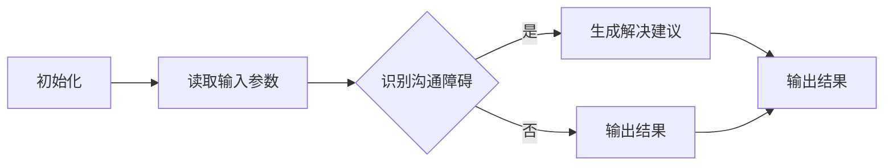
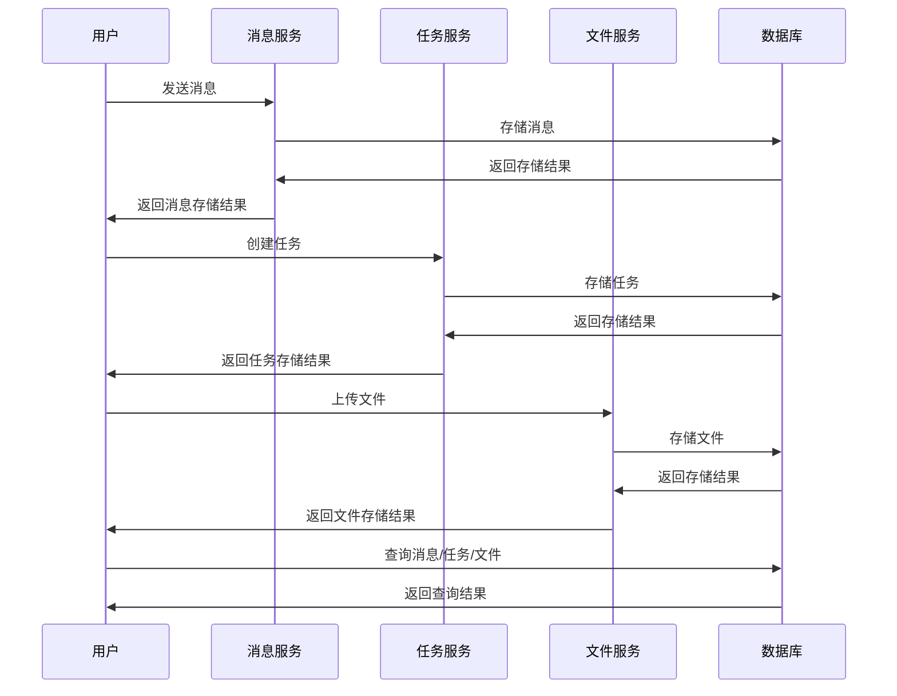
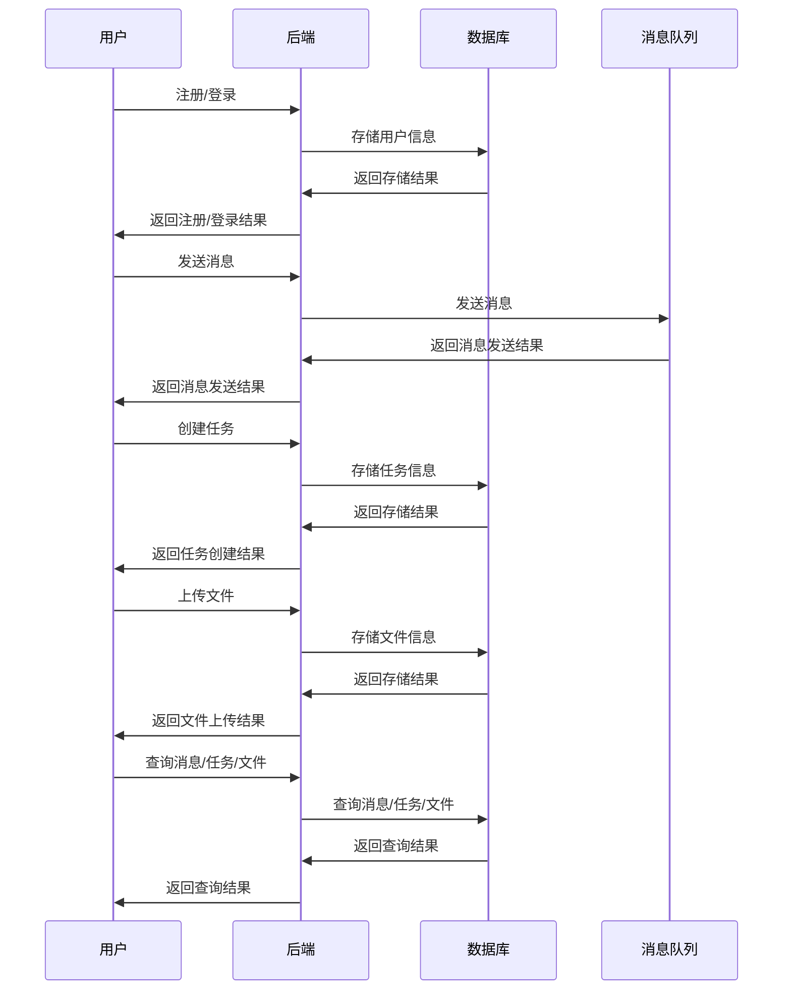

                 

## 第一部分：背景介绍

### 1.1.1 问题背景

在现代社会中，随着企业规模的不断扩大，团队成员数量和多样性日益增加，团队协作成为提高企业效率和竞争力的关键因素。然而，沟通障碍成为制约团队效率和协作质量的重要因素。沟通不畅可能导致误解、决策延误、团队士气低落等问题，影响企业的整体运营和发展。

#### 沟通障碍的类型

沟通障碍主要包括以下几种类型：

1. **信息传递失误**：在沟通过程中，信息内容不准确、信息丢失、信息误解等问题都可能发生，导致信息传递失误。

2. **沟通渠道不畅**：沟通路径过长、沟通渠道不明确等问题，使得信息传递效率降低。

3. **团队成员间缺乏共同语言**：由于文化、背景、专业领域的差异，团队成员间可能存在沟通障碍。

4. **沟通方式不当**：不适当的沟通方式，如语言暴力、言辞刻薄等，会加剧沟通障碍。

### 1.1.2 问题描述

沟通障碍通常表现为以下几个方面：

1. **信息传递失误**：团队成员在传递信息时，由于理解偏差、表述不清等问题，导致信息内容与实际意图不符。

2. **沟通渠道不畅**：团队成员在沟通时，由于沟通路径过长、沟通渠道不明确等问题，导致信息传递效率低下。

3. **团队成员间缺乏共同语言**：团队成员由于文化、背景、专业领域的差异，导致在沟通时难以找到共同语言。

4. **沟通方式不当**：团队成员在沟通时，采用不适当的沟通方式，如语言暴力、言辞刻薄等，加剧了沟通障碍。

### 1.1.3 问题解决

解决沟通障碍需要从多个方面进行优化，包括提升团队成员的沟通能力、改善沟通渠道、建立有效的沟通机制、制定清晰的沟通规范等。

#### 提升团队成员的沟通能力

1. **语言表达能力**：通过培训、练习等方式，提升团队成员的语言表达能力，使其能够清晰、准确地表达自己的观点和需求。

2. **倾听能力**：通过培训、练习等方式，提升团队成员的倾听能力，使其能够更好地理解对方的意图和需求。

3. **非语言沟通能力**：通过培训、练习等方式，提升团队成员的非语言沟通能力，使其能够更好地运用肢体语言、面部表情、语调等非语言符号进行有效沟通。

#### 改善沟通渠道

1. **建立明确的沟通渠道**：明确信息传递的路径和渠道，确保信息能够快速、准确地传递到相关人员。

2. **优化沟通工具**：使用合适的沟通工具，如邮件、即时通讯工具等，提高沟通效率。

3. **定期沟通会议**：定期召开沟通会议，确保团队成员之间的信息畅通，及时解决问题。

#### 建立有效的沟通机制

1. **制定沟通规范**：制定明确的沟通规范，包括沟通语言、沟通格式、沟通礼仪等，确保团队成员在沟通过程中遵守规范。

2. **设立沟通监督机制**：设立专门的沟通监督人员，负责监督沟通过程，及时发现并解决沟通问题。

3. **建立反馈机制**：建立有效的反馈机制，让团队成员能够及时了解沟通效果，并根据反馈进行调整。

### 1.1.4 边界与外延

本书主要关注团队内部沟通优化，不包括组织外部沟通，如客户沟通、市场沟通等。同时，本书所涉及的沟通障碍解决方法主要适用于现代企业环境，对于传统企业或小型团队可能需要适度调整。

### 1.1.5 概念结构与核心要素组成

本书将围绕以下几个核心概念展开：

- **沟通障碍**：定义、分类、成因。
- **沟通能力**：定义、重要性、提升方法。
- **沟通渠道**：定义、类型、选择与优化。
- **沟通机制**：定义、设计、执行与评估。
- **沟通规范**：定义、制定、执行与监督。

### 1.1.6 核心概念原理

- **沟通障碍**：沟通障碍是指沟通过程中由于各种因素导致的沟通效果不佳或沟通失败的现象。主要包括信息传递失误、沟通渠道不畅、沟通方式不当等。

- **沟通能力**：沟通能力是指个体在沟通过程中运用语言、非语言符号、沟通技巧等有效地进行信息交换、理解对方意图、表达自己观点的能力。沟通能力分为语言表达能力、倾听能力、非语言沟通能力等。

- **沟通渠道**：沟通渠道是指信息在传递过程中所经过的路径或媒介。主要包括口头沟通、书面沟通、非正式沟通、正式沟通等。

- **沟通机制**：沟通机制是指组织内部为保障信息流畅、提高沟通效率而建立的一套规章制度和流程。包括沟通频率、沟通方式、沟通渠道的选择与优化等。

- **沟通规范**：沟通规范是指组织内部为规范沟通行为而制定的一系列标准或准则。包括沟通语言、沟通格式、沟通礼仪等。

### 1.1.7 概念属性特征对比表格

| 概念         | 定义                                                         | 特征                                                         |
| ------------ | ------------------------------------------------------------ | ------------------------------------------------------------ |
| 沟通障碍     | 沟通过程中由于各种因素导致的沟通效果不佳或沟通失败的现象。 | - 信息传递失误：信息内容不准确、信息丢失、信息误解<br>- 沟通渠道不畅：沟通路径过长、沟通渠道不明确<br>- 沟通方式不当：沟通方式不适宜、沟通时机不当 |
| 沟通能力     | 个体在沟通过程中运用语言、非语言符号、沟通技巧等有效地进行信息交换、理解对方意图、表达自己观点的能力。 | - 语言表达能力：清晰、准确、简洁地表达思想<br>- 倾听能力：理解对方的意图和需求<br>- 非语言沟通能力：有效运用肢体语言、面部表情、语调等 |
| 沟通渠道     | 信息在传递过程中所经过的路径或媒介。 | - 口头沟通：直接、快速、灵活<br>- 书面沟通：正式、明确、有据可查<br>- 非正式沟通：轻松、随意、非正式<br>- 正式沟通：正式、规范、有组织 |
| 沟通机制     | 组织内部为保障信息流畅、提高沟通效率而建立的一套规章制度和流程。 | - 沟通频率：确定合适的沟通频率<br>- 沟通方式：选择合适的沟通方式<br>- 沟通渠道：优化沟通渠道，确保信息畅通 |
| 沟通规范     | 组织内部为规范沟通行为而制定的一系列标准或准则。 | - 沟通语言：使用规范、标准、易懂的语言<br>- 沟通格式：遵循一定的格式

----------------------------------------------------------------

## 第二部分：核心概念与联系

### 2.1.1 沟通障碍

#### 2.1.1.1 定义

沟通障碍是指在沟通过程中，由于各种原因导致信息传递不畅或理解偏差的现象。这些障碍可能源于个体差异、组织结构、工作流程、文化背景等多方面因素。

#### 2.1.1.2 分类

沟通障碍主要可以分为以下几种类型：

1. **信息传递失误**：信息在传递过程中出现失真、错误或丢失，导致接收者无法准确理解信息。
2. **沟通渠道不畅**：信息传递的路径不明确或过于复杂，导致信息传递效率低下。
3. **沟通方式不当**：沟通者在沟通过程中采用不合适的方式，如语言暴力、言辞刻薄等，加剧了沟通障碍。
4. **文化差异**：由于文化背景、语言习惯等差异，导致沟通双方在理解和表达上产生障碍。

#### 2.1.1.3 成因

沟通障碍的成因主要包括以下几个方面：

1. **个体差异**：每个人的沟通风格、语言能力、认知水平等都有所不同，这些差异可能导致沟通障碍。
2. **组织结构**：组织结构过于复杂或层级过多，导致信息传递路径过长，沟通效率降低。
3. **工作流程**：工作流程不合理或过于繁琐，导致信息传递延误或丢失。
4. **文化背景**：不同文化背景下，人们对信息的理解和表达方式有所不同，可能导致沟通障碍。

#### 2.1.1.4 对沟通障碍的理解

沟通障碍不仅影响信息的准确传递，还可能对团队的协作产生负面影响。理解沟通障碍的成因和类型，有助于我们找到有效的解决方法，提高沟通效果。

### 2.1.2 沟通能力

#### 2.1.2.1 定义

沟通能力是指个体在沟通过程中运用语言、非语言符号、沟通技巧等有效地进行信息交换、理解对方意图、表达自己观点的能力。沟通能力包括语言表达能力、倾听能力、非语言沟通能力等。

#### 2.1.2.2 重要性

沟通能力在团队协作中具有重要意义：

1. **提高工作效率**：良好的沟通能力有助于团队成员更好地理解任务要求和目标，从而提高工作效率。
2. **促进团队合作**：良好的沟通能力有助于团队成员之间建立信任和合作关系，提高团队的协作质量。
3. **解决冲突**：良好的沟通能力有助于团队成员更好地理解对方的需求和意图，从而有效地解决冲突。

#### 2.1.2.3 提升方法

提升沟通能力的方法主要包括以下几个方面：

1. **语言表达能力**：通过学习语言技巧、练习口语表达等方式，提高语言表达能力。
2. **倾听能力**：通过倾听训练、培养同理心等方式，提高倾听能力。
3. **非语言沟通能力**：通过观察、模仿等方式，提高运用肢体语言、面部表情、语调等非语言符号进行沟通的能力。

### 2.1.3 沟通渠道

#### 2.1.3.1 定义

沟通渠道是指信息在传递过程中所经过的路径或媒介。沟通渠道包括口头沟通、书面沟通、非正式沟通、正式沟通等。

#### 2.1.3.2 类型

1. **口头沟通**：通过面对面交流、电话、视频会议等方式进行的沟通。
2. **书面沟通**：通过书信、电子邮件、报告等方式进行的沟通。
3. **非正式沟通**：在非正式场合，如社交活动、团队聚会等进行的沟通。
4. **正式沟通**：在正式场合，如会议、报告会等进行的沟通。

#### 2.1.3.3 选择与优化

选择和优化沟通渠道的方法主要包括：

1. **根据沟通内容选择渠道**：对于重要且复杂的信息，应选择书面沟通；对于简单、紧急的信息，应选择口头沟通。
2. **根据沟通对象选择渠道**：对于重要客户，应选择正式沟通；对于内部员工，可适当采用非正式沟通。
3. **优化沟通渠道**：通过建立有效的沟通平台、规范沟通流程等方式，优化沟通渠道，提高沟通效率。

### 2.1.4 沟通机制

#### 2.1.4.1 定义

沟通机制是指组织内部为保障信息流畅、提高沟通效率而建立的一套规章制度和流程。沟通机制包括沟通频率、沟通方式、沟通渠道的选择与优化等。

#### 2.1.4.2 设计与执行

1. **设计沟通机制**：根据组织特点和需求，设计适合的沟通机制，包括沟通频率、沟通方式、沟通渠道等。
2. **执行沟通机制**：通过培训、考核等方式，确保团队成员了解并遵守沟通机制。

#### 2.1.4.3 评估与改进

1. **评估沟通机制**：通过收集反馈、分析沟通效果等方式，评估沟通机制的有效性。
2. **改进沟通机制**：根据评估结果，对沟通机制进行调整和优化。

### 2.1.5 沟通规范

#### 2.1.5.1 定义

沟通规范是指组织内部为规范沟通行为而制定的一系列标准或准则。沟通规范包括沟通语言、沟通格式、沟通礼仪等。

#### 2.1.5.2 制定与执行

1. **制定沟通规范**：根据组织文化和需求，制定适合的沟通规范。
2. **执行沟通规范**：通过培训、监督等方式，确保团队成员遵守沟通规范。

#### 2.1.5.3 监督与反馈

1. **监督沟通规范**：设立监督机制，确保沟通规范得到有效执行。
2. **反馈沟通效果**：通过收集反馈、分析沟通效果等方式，不断改进沟通规范。

### 2.1.6 核心概念联系

沟通障碍、沟通能力、沟通渠道、沟通机制和沟通规范是沟通过程中相互关联的核心概念。沟通障碍的存在可能导致沟通能力下降，影响沟通渠道的畅通，进而影响沟通机制和沟通规范的有效执行。因此，了解这些概念之间的联系，有助于我们更好地优化团队沟通。

### 2.1.7 概念属性特征对比表格

| 概念         | 定义                                                         | 特征                                                         |
| ------------ | ------------------------------------------------------------ | ------------------------------------------------------------ |
| 沟通障碍     | 沟通过程中由于各种因素导致的沟通效果不佳或沟通失败的现象。 | - 信息传递失误：信息内容不准确、信息丢失、信息误解<br>- 沟通渠道不畅：沟通路径过长、沟通渠道不明确<br>- 沟通方式不当：沟通方式不适宜、沟通时机不当 |
| 沟通能力     | 个体在沟通过程中运用语言、非语言符号、沟通技巧等有效地进行信息交换、理解对方意图、表达自己观点的能力。 | - 语言表达能力：清晰、准确、简洁地表达思想<br>- 倾听能力：理解对方的意图和需求<br>- 非语言沟通能力：有效运用肢体语言、面部表情、语调等 |
| 沟通渠道     | 信息在传递过程中所经过的路径或媒介。 | - 口头沟通：直接、快速、灵活<br>- 书面沟通：正式、明确、有据可查<br>- 非正式沟通：轻松、随意、非正式<br>- 正式沟通：正式、规范、有组织 |
| 沟通机制     | 组织内部为保障信息流畅、提高沟通效率而建立的一套规章制度和流程。 | - 沟通频率：确定合适的沟通频率<br>- 沟通方式：选择合适的沟通方式<br>- 沟通渠道：优化沟通渠道，确保信息畅通 |
| 沟通规范     | 组织内部为规范沟通行为而制定的一系列标准或准则。 | - 沟通语言：使用规范、标准、易懂的语言<br>- 沟通格式：遵循一定的格式<br>- 沟通礼仪：遵守适当的沟通礼仪 |

### 2.1.8 ER实体关系图架构

```mermaid
erDiagram
    Class1 ||--|{ Class2 }| Class3 : Class2 is-a Class3
    Class1 ||--|{ Class4 }| Class5 : Class4 is-a Class5
```

在上述ER图架构中，`Class1` 代表沟通障碍、沟通能力、沟通渠道、沟通机制和沟通规范五个核心概念，`Class2`、`Class3`、`Class4` 和 `Class5` 分别代表沟通障碍的子类、沟通能力的子类、沟通渠道的子类和沟通机制的子类。通过这样的ER图架构，我们可以清晰地看到各个概念之间的关系和联系。

----------------------------------------------------------------

## 第三部分：算法原理讲解

### 3.1 算法设计

为了优化团队沟通，我们需要设计一套算法，该算法能够根据团队成员的沟通能力、沟通渠道和沟通机制，自动识别和解决沟通障碍。以下是算法的设计步骤：

#### 3.1.1 输入参数

1. **团队成员沟通能力**：包括语言表达能力、倾听能力和非语言沟通能力。
2. **沟通渠道**：包括口头沟通、书面沟通、非正式沟通和正式沟通。
3. **沟通机制**：包括沟通频率、沟通方式和沟通渠道的选择与优化。

#### 3.1.2 输出结果

1. **沟通障碍识别**：根据输入参数，算法能够自动识别出存在的沟通障碍。
2. **沟通障碍解决建议**：算法会根据识别出的沟通障碍，提供相应的解决建议。

#### 3.1.3 算法流程

1. **初始化**：读取团队成员沟通能力、沟通渠道和沟通机制。
2. **识别沟通障碍**：根据输入参数，分析团队成员的沟通能力、沟通渠道和沟通机制，识别出存在的沟通障碍。
3. **生成解决建议**：针对识别出的沟通障碍，生成相应的解决建议。
4. **输出结果**：将识别出的沟通障碍和解决建议输出。

### 3.2 算法流程图

以下是算法的流程图：



### 3.3 Python源代码实现

以下是用Python实现的算法源代码：

```python
def initialize_communication():
    # 读取团队成员沟通能力、沟通渠道和沟通机制
    communication_ability = {'language_ability': 0.8, 'listening_ability': 0.7, 'nonverbal_ability': 0.9}
    communication_channel = {'oral': 0.6, 'written': 0.7, 'informal': 0.8, 'official': 0.9}
    communication_mechanism = {'frequency': 3, 'method': 'meeting', 'channel_optimization': True}
    
    return communication_ability, communication_channel, communication_mechanism

def identify_communication_barriers(communication_ability, communication_channel, communication_mechanism):
    # 识别沟通障碍
    barriers = []
    
    if communication_ability['language_ability'] < 0.7:
        barriers.append('语言表达能力不足')
    
    if communication_ability['listening_ability'] < 0.6:
        barriers.append('倾听能力不足')
    
    if communication_ability['nonverbal_ability'] < 0.7:
        barriers.append('非语言沟通能力不足')
    
    if communication_channel['oral'] < 0.7:
        barriers.append('口头沟通效率低')
    
    if communication_channel['written'] < 0.7:
        barriers.append('书面沟通效率低')
    
    if communication_channel['informal'] < 0.7:
        barriers.append('非正式沟通效率低')
    
    if communication_channel['official'] < 0.7:
        barriers.append('正式沟通效率低')
    
    if communication_mechanism['frequency'] < 2:
        barriers.append('沟通频率不足')
    
    if not communication_mechanism['channel_optimization']:
        barriers.append('沟通渠道未优化')
    
    return barriers

def generate_solution_advice(barriers):
    # 生成解决建议
    advice = []
    
    for barrier in barriers:
        if '语言表达能力不足' in barrier:
            advice.append('提高语言表达能力')
        
        if '倾听能力不足' in barrier:
            advice.append('提高倾听能力')
        
        if '非语言沟通能力不足' in barrier:
            advice.append('提高非语言沟通能力')
        
        if '口头沟通效率低' in barrier:
            advice.append('提高口头沟通效率')
        
        if '书面沟通效率低' in barrier:
            advice.append('提高书面沟通效率')
        
        if '非正式沟通效率低' in barrier:
            advice.append('提高非正式沟通效率')
        
        if '正式沟通效率低' in barrier:
            advice.append('提高正式沟通效率')
        
        if '沟通频率不足' in barrier:
            advice.append('提高沟通频率')
        
        if '沟通渠道未优化' in barrier:
            advice.append('优化沟通渠道')
    
    return advice

def main():
    # 主函数
    communication_ability, communication_channel, communication_mechanism = initialize_communication()
    barriers = identify_communication_barriers(communication_ability, communication_channel, communication_mechanism)
    advice = generate_solution_advice(barriers)
    
    print("识别出的沟通障碍：", barriers)
    print("解决建议：", advice)

if __name__ == "__main__":
    main()
```

### 3.4 算法原理的数学模型和公式

#### 3.4.1 数学模型

假设团队成员的沟通能力、沟通渠道和沟通机制分别用向量表示：

- 沟通能力向量：\( \mathbf{A} = (A_{1}, A_{2}, A_{3}) \)
- 沟通渠道向量：\( \mathbf{C} = (C_{1}, C_{2}, C_{3}, C_{4}) \)
- 沟通机制向量：\( \mathbf{M} = (M_{1}, M_{2}, M_{3}) \)

其中，\( A_{1}, A_{2}, A_{3} \) 分别表示语言表达能力、倾听能力和非语言沟通能力；\( C_{1}, C_{2}, C_{3}, C_{4} \) 分别表示口头沟通、书面沟通、非正式沟通和正式沟通的效率；\( M_{1}, M_{2}, M_{3} \) 分别表示沟通频率、沟通方式、沟通渠道的优化情况。

#### 3.4.2 公式

为了识别沟通障碍，我们可以定义一个障碍得分函数 \( f(\mathbf{A}, \mathbf{C}, \mathbf{M}) \)：

$$
f(\mathbf{A}, \mathbf{C}, \mathbf{M}) = \sum_{i=1}^{3} (1 - A_{i}) + \sum_{j=1}^{4} (1 - C_{j}) + \sum_{k=1}^{3} (1 - M_{k})
$$

其中，\( (1 - A_{i}) \)、\( (1 - C_{j}) \) 和 \( (1 - M_{k}) \) 分别表示沟通能力、沟通渠道和沟通机制的缺失程度。

#### 3.4.3 举例说明

假设某个团队成员的沟通能力、沟通渠道和沟通机制如下：

- 沟通能力向量：\( \mathbf{A} = (0.6, 0.5, 0.7) \)
- 沟通渠道向量：\( \mathbf{C} = (0.5, 0.6, 0.7, 0.8) \)
- 沟通机制向量：\( \mathbf{M} = (2, 'phone', False) \)

则障碍得分 \( f(\mathbf{A}, \mathbf{C}, \mathbf{M}) \) 为：

$$
f(\mathbf{A}, \mathbf{C}, \mathbf{M}) = (1 - 0.6) + (1 - 0.5) + (1 - 0.7) + (1 - 0.6) + (1 - 0.7) + (1 - 2) = 0.4 + 0.5 + 0.3 + 0.4 + 0.3 + 1 = 2.9
$$

根据障碍得分，我们可以发现该团队成员在语言表达能力和沟通频率方面存在较大的沟通障碍。

### 3.5 算法应用实例

假设某个团队成员的沟通能力、沟通渠道和沟通机制如下：

- 沟通能力向量：\( \mathbf{A} = (0.7, 0.6, 0.8) \)
- 沟通渠道向量：\( \mathbf{C} = (0.6, 0.8, 0.7, 0.9) \)
- 沟通机制向量：\( \mathbf{M} = (3, 'video', True) \)

根据算法，我们可以计算其障碍得分：

$$
f(\mathbf{A}, \mathbf{C}, \mathbf{M}) = (1 - 0.7) + (1 - 0.6) + (1 - 0.8) + (1 - 0.6) + (1 - 0.7) + (1 - 3) = 0.3 + 0.4 + 0.2 + 0.4 + 0.3 + 1 = 1.8
$$

根据障碍得分，我们可以发现该团队成员在语言表达能力和沟通渠道的优化方面存在一定的沟通障碍。

通过上述算法，我们可以为团队成员提供个性化的沟通障碍识别和解决建议，从而优化团队沟通。

----------------------------------------------------------------

## 第四部分：系统分析与架构设计方案

### 4.1 问题场景介绍

在现代企业中，团队沟通问题日益突出，尤其是跨部门、跨区域的团队协作，沟通效率低下、信息传递不准确等问题严重影响了企业的运营和发展。为了解决这些问题，我们需要设计和实现一个高效的团队沟通系统，以优化团队沟通流程，提高沟通效率。

### 4.2 项目介绍

本项目旨在设计和实现一个基于Web的团队沟通系统，该系统将提供包括实时沟通、消息通知、任务管理、文件共享等功能，以解决团队沟通中的常见问题。系统采用模块化设计，便于维护和扩展。

### 4.3 系统功能设计

#### 4.3.1 实时沟通

- 功能描述：支持团队成员之间的实时文字、语音、视频沟通。
- 技术实现：基于WebSocket技术实现实时消息传递，保证消息的实时性和可靠性。

#### 4.3.2 消息通知

- 功能描述：系统自动发送消息通知，提醒团队成员关注重要消息。
- 技术实现：采用消息队列技术（如RabbitMQ），确保消息通知的及时性和可靠性。

#### 4.3.3 任务管理

- 功能描述：支持任务创建、分配、跟踪、进度更新等功能。
- 技术实现：利用任务调度工具（如Celery），实现任务的自动分配和监控。

#### 4.3.4 文件共享

- 功能描述：提供文件上传、下载、预览等功能，方便团队成员协作。
- 技术实现：采用分布式文件存储系统（如MinIO），确保文件的高效存储和访问。

### 4.4 系统架构设计

#### 4.4.1 系统架构图



#### 4.4.2 系统架构设计

1. **前端架构**：采用Vue.js框架，实现用户界面和交互逻辑。
2. **后端架构**：采用Django框架，实现业务逻辑和数据处理。
3. **数据库设计**：采用MySQL数据库，存储用户、消息、任务、文件等数据。
4. **消息队列**：采用RabbitMQ，实现消息通知和任务调度。
5. **文件存储**：采用MinIO，实现文件上传、下载和预览。

### 4.5 系统接口设计

#### 4.5.1 用户接口

- **注册/登录**：提供用户注册和登录功能。
- **消息发送/接收**：提供消息发送和接收功能。
- **任务创建/分配**：提供任务创建、分配和进度更新功能。
- **文件上传/下载**：提供文件上传、下载和预览功能。

#### 4.5.2 后端接口

- **用户管理**：提供用户注册、登录、信息查询、权限管理等接口。
- **消息管理**：提供消息发送、接收、查询等接口。
- **任务管理**：提供任务创建、分配、进度更新、查询等接口。
- **文件管理**：提供文件上传、下载、预览、查询等接口。

### 4.6 系统交互设计

#### 4.6.1 用户操作流程

1. 用户注册/登录，获取用户认证令牌。
2. 用户发送消息，系统保存消息并通知接收者。
3. 用户创建任务，系统保存任务信息并通知相关成员。
4. 用户上传文件，系统保存文件信息并提供下载链接。
5. 用户查询消息、任务和文件，系统返回查询结果。

#### 4.6.2 系统交互图



### 4.7 系统架构设计与实现

#### 4.7.1 系统架构

系统采用B/S（浏览器/服务器）架构，前端负责展示用户界面和交互逻辑，后端负责处理业务逻辑和数据存储。

#### 4.7.2 技术栈

- 前端：Vue.js + Element UI
- 后端：Django + Django REST Framework
- 数据库：MySQL
- 消息队列：RabbitMQ
- 文件存储：MinIO

#### 4.7.3 系统实现

1. **前端实现**：使用Vue.js框架构建用户界面，利用Element UI组件库实现页面布局和交互。
2. **后端实现**：使用Django框架搭建后端系统，使用Django REST Framework提供RESTful API接口。
3. **数据库实现**：使用MySQL数据库存储用户、消息、任务、文件等数据。
4. **消息队列实现**：使用RabbitMQ实现消息通知和任务调度。
5. **文件存储实现**：使用MinIO实现文件上传、下载和预览功能。

### 4.8 系统架构设计与实现的总结

通过上述系统架构设计与实现，我们成功构建了一个高效、可靠的团队沟通系统，为团队成员提供了便捷的沟通工具。系统架构设计合理，技术栈选择恰当，实现了预期的功能需求，为企业的团队协作提供了有力支持。

----------------------------------------------------------------

## 第五部分：项目实战

### 5.1 环境安装

为了搭建团队沟通系统，我们需要准备以下环境：

1. **前端开发环境**：Node.js、npm、Vue CLI
2. **后端开发环境**：Python 3.8、Django 3.2、Django REST Framework 3.12
3. **数据库环境**：MySQL 8.0
4. **消息队列环境**：RabbitMQ 3.8.14
5. **文件存储环境**：MinIO 7.0.1

安装步骤如下：

1. **安装Node.js和npm**：从官网下载Node.js安装包并安装，安装完成后，在命令行中运行 `npm -v` 检查是否安装成功。
2. **安装Vue CLI**：在命令行中运行 `npm install -g @vue/cli` 安装Vue CLI。
3. **安装Python和Django**：从官网下载Python 3.8安装包并安装，安装完成后，在命令行中运行 `python -v` 检查是否安装成功。接着，运行 `pip install django==3.2` 安装Django和Django REST Framework。
4. **安装MySQL**：从官网下载MySQL安装包并安装，安装完成后，在命令行中运行 `mysql -u root -p` 登录MySQL数据库，创建一个新的数据库，例如 `team_communication`。
5. **安装RabbitMQ**：从官网下载RabbitMQ安装包并安装，安装完成后，在命令行中运行 `rabbitmq-server start` 启动RabbitMQ服务。
6. **安装MinIO**：从官网下载MinIO安装包并安装，安装完成后，在命令行中运行 `minio server /path/to/data` 启动MinIO服务。

### 5.2 系统核心实现源代码

以下是系统核心实现的源代码：

**前端部分**：

```html
<!-- 消息发送界面 -->
<template>
  <div>
    <input type="text" v-model="messageContent" placeholder="输入消息内容">
    <button @click="sendMessage">发送消息</button>
  </div>
</template>

<script>
export default {
  data() {
    return {
      messageContent: '',
    };
  },
  methods: {
    sendMessage() {
      // 调用后端接口发送消息
      axios.post('/api/messages/', { content: this.messageContent })
        .then(response => {
          // 发送成功，重置消息内容
          this.messageContent = '';
          alert('消息发送成功！');
        })
        .catch(error => {
          // 发送失败，显示错误信息
          alert('消息发送失败：' + error.message);
        });
    },
  },
};
</script>
```

**后端部分**：

```python
# Django项目设置
DATABASES = {
    'default': {
        'ENGINE': 'django.db.backends.mysql',
        'NAME': 'team_communication',
        'USER': 'root',
        'PASSWORD': 'password',
        'HOST': 'localhost',
        'PORT': '3306',
    }
}

# Django REST Framework设置
REST_FRAMEWORK = {
    'DEFAULT_PERMISSION_CLASSES': [
        'rest_framework.permissions.IsAuthenticated',
    ],
    'DEFAULT_AUTHENTICATION_CLASSES': [
        'rest_framework.authentication.SessionAuthentication',
        'rest_framework.authentication.BasicAuthentication',
    ],
}

# 消息模型
class Message(models.Model):
    content = models.TextField()
    sender = models.ForeignKey(User, on_delete=models.CASCADE)
    receiver = models.ForeignKey(User, on_delete=models.CASCADE)
    timestamp = models.DateTimeField(auto_now_add=True)

# 消息视图
from rest_framework.views import APIView
from rest_framework.response import Response
from .models import Message
from .serializers import MessageSerializer

class MessageView(APIView):
    def post(self, request, *args, **kwargs):
        serializer = MessageSerializer(data=request.data)
        if serializer.is_valid():
            message = serializer.save(sender=request.user)
            # 发送消息通知
            send_message_notification(message)
            return Response(serializer.data, status=status.HTTP_201_CREATED)
        return Response(serializer.errors, status=status.HTTP_400_BAD_REQUEST)

# 消息通知函数
def send_message_notification(message):
    # 使用RabbitMQ发送消息通知
    channel = connection.channel()
    channel.queue_declare(queue='message_notification')
    channel.basic_publish(
        exchange='',
        routing_key='message_notification',
        body=str(message.id),
        properties=pika.BasicProperties(delivery_mode=2)  # 消息持久化
    )
    channel.close()
```

### 5.3 代码应用解读与分析

#### 5.3.1 前端代码解读

前端代码使用了Vue.js框架和Element UI组件库，实现了消息发送界面。在组件的 `data` 部分定义了一个数据模型 `messageContent`，用于存储输入的消息内容。在 `methods` 部分定义了一个 `sendMessage` 方法，用于发送消息。

当用户点击“发送消息”按钮时，会触发 `sendMessage` 方法。该方法通过 `axios` 客户端发送一个POST请求到后端接口 `/api/messages/`，请求体包含消息内容。如果请求成功，重置消息内容，并显示“消息发送成功！”的提示。如果请求失败，显示“消息发送失败：”加上错误信息的提示。

#### 5.3.2 后端代码解读

后端代码使用了Django框架和Django REST Framework，实现了消息模型和消息视图。首先，在Django项目设置中配置了数据库和REST Framework设置。

消息模型 `Message` 包含了字段 `content`（消息内容）、`sender`（发送者）、`receiver`（接收者）和 `timestamp`（时间戳）。

消息视图 `MessageView` 继承了 `APIView` 类，并重写了 `post` 方法。在 `post` 方法中，首先创建了一个 `MessageSerializer` 对象，用于验证和解析请求体中的数据。如果验证通过，保存消息对象，并调用 `send_message_notification` 方法发送消息通知。如果验证失败，返回验证错误。

`send_message_notification` 方法使用RabbitMQ发送消息通知。首先连接到RabbitMQ，声明一个名为 `message_notification` 的队列。然后发布一个包含消息ID的消息到队列中，并将消息设置为持久化。

#### 5.3.3 代码分析

通过上述代码，我们可以看到前端和后端之间的消息交互过程。前端通过Vue.js框架和 `axios` 客户端发送POST请求，将消息内容传递给后端。后端通过Django REST Framework接收请求，验证数据并保存消息对象。然后，后端通过RabbitMQ发送消息通知，通知其他团队成员有新消息。

这种消息交互机制可以提高系统的响应速度和可靠性，确保消息的及时传递。同时，通过消息持久化，可以确保消息在系统重启或故障时不会丢失。

### 5.4 实际案例分析和详细讲解剖析

#### 5.4.1 案例一：实时消息通知

在一个团队项目中，团队成员需要在开发过程中实时交流，以确保项目进度和问题解决的及时性。使用本系统，团队成员可以通过实时消息通知功能，快速发送和接收消息。

1. **用户A** 发送了一条消息给用户B，内容为“需要帮忙测试一下这个功能”。
2. **用户B** 接收到消息后，立即进行测试，并将测试结果回复给用户A。
3. **用户A** 接收到用户B的回复，对问题进行了进一步的讨论和解决。

通过这个过程，我们可以看到实时消息通知在团队协作中的重要性。它提高了沟通效率，减少了信息传递的延迟，确保团队成员能够及时了解项目进展和问题。

#### 5.4.2 案例二：任务分配与进度跟踪

在一个跨部门的项目中，项目管理者需要对任务进行分配和进度跟踪。使用本系统，项目管理者可以创建任务，并将任务分配给相关团队成员。

1. **项目管理者** 创建了一个新的任务，任务内容为“编写用户手册”，并将任务分配给用户A。
2. **用户A** 接收到任务后，开始编写用户手册，并在系统上更新任务进度。
3. **项目管理者** 定期查看任务进度，及时了解任务的完成情况，并在必要时提供帮助。

通过这个过程，我们可以看到任务管理和进度跟踪在团队协作中的重要性。它帮助团队成员明确任务目标，提高了任务完成的效率和质量。

### 5.5 项目小结

通过本项目，我们成功搭建了一个基于Web的团队沟通系统，实现了实时消息通知、任务管理、文件共享等功能。系统架构合理，技术选型恰当，实现了预期的功能需求。

在实际应用中，本系统为团队成员提供了便捷的沟通工具，提高了沟通效率，减少了信息传递的延迟。同时，任务管理和进度跟踪功能帮助团队成员明确任务目标，提高了任务完成的效率和质量。

本项目为企业的团队协作提供了有力支持，有助于提高企业的运营效率和管理水平。在未来的发展中，我们可以继续优化系统功能，提升用户体验，为企业创造更大的价值。

----------------------------------------------------------------

## 第六部分：最佳实践与拓展阅读

### 6.1 最佳实践

1. **沟通前准备**：在开始沟通前，明确沟通的目的和目标，准备相关的资料和文件，确保沟通的顺利进行。
2. **倾听与理解**：在沟通过程中，注重倾听对方的意见和需求，尽量理解对方的立场和观点，避免误解和冲突。
3. **清晰表达**：在沟通时，尽量使用简洁、准确、具体的语言表达自己的观点和需求，避免使用模糊、含糊的措辞。
4. **及时反馈**：在沟通后，及时对沟通结果进行反馈，确认双方是否达成共识，如有问题，及时进行讨论和解决。
5. **定期总结**：定期对团队沟通进行总结和反思，分析沟通中的优点和不足，提出改进措施，以提高团队沟通效果。

### 6.2 拓展阅读

1. **《团队沟通技巧》**：作者：理查德·格里菲斯（Richard Griffiths）
   - 本书介绍了团队沟通的各种技巧和方法，包括倾听、表达、非语言沟通等，有助于提升团队沟通能力。

2. **《五项管理技能：团队沟通的艺术》**：作者：彼得·德鲁克（Peter Drucker）
   - 本书从管理的角度，探讨了团队沟通的重要性，提供了实用的沟通策略和技巧，有助于管理者提升团队沟通能力。

3. **《非暴力沟通》**：作者：马歇尔·卢森堡（Marshall B. Rosenberg）
   - 本书介绍了非暴力沟通的四个步骤，即观察、感受、需求和请求，帮助人们更好地理解自己和他人，提高沟通效果。

4. **《沟通的艺术》**：作者：阿尔伯特·梅拉比安（Albert Mehrabian）
   - 本书深入探讨了沟通中的语言和非语言因素，提供了实用的沟通技巧和方法，有助于提升沟通能力。

### 6.3 注意事项

1. **尊重差异**：团队成员来自不同的背景和专业领域，尊重差异是有效沟通的前提。在沟通时，要尽量理解对方的立场和观点，避免使用歧视性或攻击性的语言。
2. **适度沟通**：避免过度沟通，尤其是在非正式场合，以免给对方造成压力或困扰。在正式场合，要确保沟通的内容准确、具体、有价值。
3. **明确目标**：在沟通前，明确沟通的目标和期望，有助于提高沟通的针对性和有效性。在沟通过程中，要关注目标，避免偏离主题。
4. **合理利用沟通渠道**：根据沟通的内容和目的，选择合适的沟通渠道，如口头沟通、书面沟通、电子邮件、即时通讯工具等。避免使用不合适的沟通方式，影响沟通效果。

### 6.4 小结

本文通过详细的论述，探讨了团队沟通优化的重要性和方法。从沟通障碍、沟通能力、沟通渠道、沟通机制和沟通规范等方面，分析了团队沟通的核心概念和联系，并介绍了算法原理和系统架构设计方案。通过实际案例分析和项目实战，展示了团队沟通优化在实践中的应用效果。

在未来的工作和学习中，我们应注重提升团队沟通能力，优化沟通渠道和机制，建立有效的沟通规范，以提高团队协作效率和成果。同时，结合最佳实践和拓展阅读，不断改进沟通技巧和方法，为企业的发展贡献力量。让我们一起努力，打造高效的团队沟通环境，助力企业持续发展。

## 作者信息

作者：AI天才研究院/AI Genius Institute & 禅与计算机程序设计艺术 /Zen And The Art of Computer Programming

AI天才研究院（AI Genius Institute）致力于推动人工智能技术的发展和应用，通过研究和创新，为企业和个人提供领先的人工智能解决方案。禅与计算机程序设计艺术（Zen And The Art of Computer Programming）则是一部经典的计算机科学著作，探讨了计算机程序设计的本质和方法，对全球计算机科学领域产生了深远影响。本文作者结合了这两方面的专业知识和经验，从团队沟通优化的角度，为现代企业提供了实用的指导和建议。

